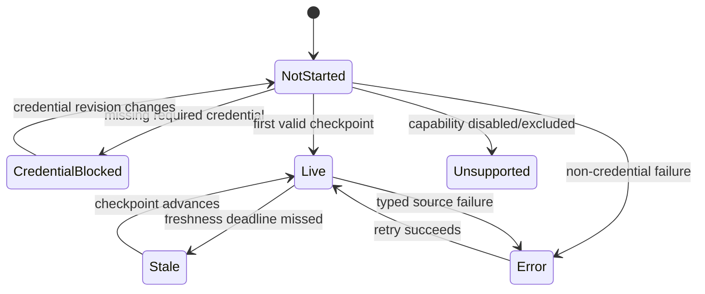

# 11.9 — Crypto / Weather 双垂直、Attribution Feedback 与 Auto-Retraining

<!-- quant-pivot-deployment-contract:v1 -->
> **Deployment contract**
> - `fresh_boot_assumption`: 项目尚未正式生产上线，将从全新 `boot` / schema version `1` 部署；仓库和数据库不保存 lifecycle seal 状态。
> - `schema_data_version_impact`: 本文中的历史版本号与递增路径不再具有实施效力；当前实现不迁移测试数据、旧结构或旧版本。
> - `pre_deployment_behavior`: 允许 clean-break、migration squash 与全新基础设施 bootstrap，但任何数据销毁仍需操作者单独授权。
> - `post_deployment_behavior`: 首次部署后使用正常前向 migration、回滚与数据验证；不使用不可逆 production seal 或兼容桥。
> - `rollback_and_data_verification`: 首次部署前通过清空后的 fresh-install 验证；部署后使用备份、前向 migration 与显式回滚。

> 状态：**Crypto / Weather Vertical Data Closure 已完成；Phase 11.9 按用户要求暂停，W2-A08 DONE，恢复点 W2-A09**
>
> 最后更新：2026-07-24
>
> Boot 版本所有权：六类 Runtime Policy、Feature/Scoring/Domain/Research Method、Dataset、Model、
> Trade Policy 与 Evidence contract 均从 `schema_version = 1` 开始；本期不执行旧版本迁移。
>
> 关闭审计点：#19（最终归因没有消费闭环）、#21（factor 发布缺少 gate/shadow/WORM audit）。
>
> 本文破坏式取代 [`phase-06/06.5`](../phase-06/06.5-attribution-feedback-and-auto-retraining.md)，
> 不保留旧 seam、runtime parser、alias、re-export 或双读兼容层。

## 0. 文档使用规则与恢复协议

本文同时是最终设计、实施计划、Todo、决策账本与验收证据索引，不再创建第二份 implementation plan。

状态只允许以下六种：

| 状态 | 含义 |
|---|---|
| `TODO` | 尚未开始，不能据此宣称存在能力 |
| `IN_PROGRESS` | 已有工作树改动，但尚未通过本项验收 |
| `BLOCKED` | 存在外部或治理阻断；必须记录阻断条件和恢复动作 |
| `PAUSED` | 用户明确暂停的后续范围；保留设计和已验证进度，但不得宣称完成 |
| `DONE` | 代码、测试、证据和本文记录全部完成 |
| `SUPERSEDED` | 设计被审计否定或并入其他任务；必须记录替代任务/决策，历史证据不删除 |

更新纪律：

1. 每完成一个可独立验证的任务，先运行该任务的目标测试，再更新 §11 Implementation Ledger 和
   §12 Evidence Ledger；不得先勾选后补证据。
2. `DONE` 必须包含实际命令、结果和 artifact/截图/报告路径；“代码看起来完成”不是证据。
3. 网络中断后从 §11 第一条非 `DONE` 任务恢复；先运行 `git status --short` 和对应目标测试，不重做
   已有证据，不假定未验证改动正确。
4. 大型 PG/CH migration、真实 source smoke、24h shadow 分别记录；本地 replay 不能冒充真实生产资格。
5. Phase Exit 只有 §11 全部 `DONE`、§12 无失败项、§10 Blocker 全部关闭后才能改为“已完成”。
6. 执行期间必须恰有一个 `IN_PROGRESS`；任务切换顺序固定为“目标验收通过 → §12 追加证据 →
   当前任务 `DONE` → 下一任务 `IN_PROGRESS`”，不得同时展开多个未验收工作面。
7. `FAIL` 是 Evidence Ledger 结果，不是任务状态；失败后任务继续 `IN_PROGRESS`，立即记录根因、下一动作
   与精确恢复命令。Evidence 只追加，不覆盖失败发现链。

### 0.1 当前检查点

- `baseline_branch`: `quant-pivot`
- `baseline_head`: `8b10b0b0dd056e9154623a4c41ce2e52e2b9f7d5`
- `working_tree_summary`: branch=`quant-pivot`、HEAD 仍为 baseline；root 当前 128 个 tracked
  paths（含 UI submodule pointer）和 26 个 untracked entries，其中 25 个属于本轮任务、
  1 个为用户既存 `.hermes/`；UI submodule 当前 15 个 tracked paths，W2-A06 已通过
  typecheck/164 DOM tests/lint；W2-A08 未修改 UI；无 commit/push
- `current_task_id`: `无`
- `current_task_objective`: 无 active implementation；W2-A08 已完成全部行为、schema、
  lint、architecture 与静态验收。用户明确要求在 W2-A08 后暂停，W2-A09 尚未开始；
  W3 REST/WS/UI/Dashboard 完整闭环仍由既定依赖顺序推进，未被遗漏或提前实现
- `dependency_status`: `W2-A08=DONE；W2-A09=PAUSED（用户明确暂停）`
- `changed_paths`: 已验收 W2-00/W2-A01..A06 的 127 个 tracked + 20 个 task-untracked
  paths（见 §12）；W2-A07 当前新增
  `crates/quant-pivot-core/src/service/feedback_cohort.rs` expected-red closed-matrix tests 并注册
  service module；另新增
  `crates/quant-pivot-models/src/domain/quant/feedback_cohort.rs` immutable contract/evidence/error
  owner 并完成 evaluator。W2-A08 在同一 owner 增加 page/cursor/candidate contract，并新增
  `crates/quant-pivot-repository/src/traits/quant/feedback_cohort.rs`、
  `crates/quant-pivot-repository/src/postgres/quant/feedback_cohort.rs` 与
  `crates/quant-pivot-system-tests/tests/repository/research/feedback_cohort.rs`；同步 canonical
  facade/test registration、`query_indexes.rs` 及 PostgreSQL manifests。当前合计 128 个 tracked +
  25 个 task-untracked paths；无 W2-A09 manifest/trainer/orchestrator 或本任务 UI 改动
- `last_passed_command`: `cargo fmt --all -- && cargo test -p quant-pivot-models
  clickhouse::market_resolution::tests -- --nocapture` strict rerun PASS 后，
  `jq empty schema/clickhouse/manifest.json && cargo fmt --all -- && cargo test -p
  quant-pivot-storage clickhouse::migration --lib -- --nocapture` 4.53s、6/6 PASS；
  formatter-final v1 registry 与 normalized manifest JSON 合法；随后
  `cargo run -p quant-pivot-xtask -- postgres-schema manifest-clean` 23.46s PASS，
  从 owned disposable PostgreSQL 16 重建 schema/migration manifests；最新
  `cargo fmt --all -- && cargo test -p quant-pivot-system-tests --test
  infrastructure_contracts infrastructure_contracts_share_one_disposable_stack --
  --nocapture` 9.84s compile + 25.69s test，1/1 PASS；最新
  `cargo fmt --all -- && cargo clippy -p quant-pivot-models -p quant-pivot-storage
  -p quant-pivot-repository -p quant-pivot-system-tests --all-targets -- -D warnings`
  增量 7.81s、exit 0；最新 `cargo fmt --all -- && cargo test -p
  quant-pivot-system-tests --test repository_contracts
  recommendation_resolution_outcome_repository_contracts -- --nocapture`
  首轮 27.13s compile + 5.90s test、迁移全部 caller 后 22.18s compile + 4.70s
  test，均为 1 target / 3 scenarios PASS；最新 `cargo fmt --all -- && cargo
  clippy -p quant-pivot-repository -p quant-pivot-system-tests --all-targets --
  -D warnings` 17.62s、exit 0，随后 public resolution `append`/旧 test helper
  absence scan 无命中；最新 resolution candidate contract 冷编译 3m43s +
  4.81s、1 target / 4 scenarios PASS，execution candidate contract 1.29s +
  4.74s、1 target / 4 scenarios PASS；最新 `cargo fmt --all -- && cargo test
  -p quant-pivot-system-tests --test infrastructure_contracts
  infrastructure_contracts_share_one_disposable_stack --no-run` 27.91s、exit 0，
  exact checkpoint reader 与 conflict contract 已完成编译；随后同一 target 带
  `-- --nocapture` 1.38s compile + 28.28s test、1/1 PASS，完整 49 scenarios
  在真实 disposable PostgreSQL/Redis/ClickHouse stack 通过；最新
  `cargo fmt --all -- && cargo test -p quant-pivot-system-tests --test
  repository_contracts domain_source_cursor_repository_contracts --
  --nocapture` 3m56s compile + 4.25s test、1/1 PASS（5 filtered），补齐
  status/error shape 后增量 6.17s compile + 3.72s test、1/1 PASS；最新
  `cargo clippy -p quant-pivot-models -p quant-pivot-repository -p
  quant-pivot-core -p quant-pivot-system-tests --all-targets -- -D warnings`
  修复 test guard lifetime 后 23.58s、exit 0；最新
  `cargo fmt --all -- && cargo test -p quant-pivot-system-tests --test
  core_business outcome_reconciliation -- --nocapture` 38.32s compile + 5.15s
  test、2/2 PASS（1 filtered），覆盖 durable CH write 后 ack 丢失恢复、late
  recommendation、missing-source fail-close、out-of-order cursor 不推进以及同 pass
  execution backlog；随后删除唯一 producer unused import 并执行 `cargo fmt --all
  -- && cargo test -p quant-pivot-web error::tests --lib -- --nocapture`，
  3m49s compile + 0.00s test、7/7 PASS（39 filtered），typed source/invariant
  分别稳定映射 HTTP 503/500；最新 `cargo clippy -p quant-pivot-models -p
  quant-pivot-repository -p quant-pivot-core -p quant-pivot-web -p
  quant-pivot-system-tests --all-targets -- -D warnings` 在关闭 production 条件分组/mapper
  与 test guard/const helper 后 6.18s、exit 0
  ；最新 `cargo fmt --all -- && cargo test -p quant-pivot-system-tests --test
  core_business outcome_reconciliation -- --nocapture` 在 orthogonal lane/source-boundary
  收口后 6.81s compile + 6.30s test、2/2 PASS（1 filtered）；exact-market seam
  收口后 29.92s compile + 6.80s test、2/2 PASS（1 filtered）；最新 disposable
  shared-stack 28.29s compile + 28.38s test、1/1 PASS，完整 49 scenarios 覆盖
  exact retry collapse 与 PIT/range conflicting-content fail-close；中断恢复后最新
  `cargo fmt --all -- && cargo test -p quant-pivot-models
  runtime_config::validation::tests::outcome_reconciliation_policy_is_bounded --lib --
  --nocapture` 0.72s compile + 0.00s test、1/1 PASS（352 filtered）；最新
  `cargo fmt --all -- && cargo test -p quant-pivot-system-tests --test core_business
  outcome_reconciliation -- --nocapture` 16.09s compile + 6.52s test、2/2 PASS
  （1 filtered），当时 worker 有一个 unused import warning；删除后完成 runtime
  composition wiring，原 target 21.63s compile + 6.32s test、2/2 PASS（1 filtered），
  仅 macOS linker compact-unwind 环境 warning；最新 `cargo fmt --all -- && cargo
  clippy -p quant-pivot-models -p quant-pivot-repository -p quant-pivot-core -p
  quant-pivot-web -p quant-pivot-system-tests --all-targets -- -D warnings` 在两轮发现并
  修正 reader ownership/test cohesion 后 16.37s、exit 0；最新 `cargo fmt --all --
  && cargo xtask architecture check` 33.82s compile、`architecture check passed`；补齐
  execution-first failure 的反向 lane 合同后，dedicated core target 10.64s compile +
  5.85s test、2/2 PASS（1 filtered）；最新 `cargo test -p quant-pivot-models
  runtime_config --lib -- --nocapture` 13.88s compile + 0.01s test、30/30 PASS
  （323 filtered）；最新 `cargo fmt --all -- && cargo test -p quant-pivot-core
  app::task_registry::tests::task_id_resolves_kind_and_name --lib -- --nocapture`
  5m52s cold compile + 0.00s test、1/1 PASS（401 filtered）；最终
  `git diff --check` + old unified service/direct-writer absence + runtime-policy/
  bootstrap-registration/TaskId unique-owner scan exit 0；切换账本后
  `cargo xtask architecture check` 14.85s compile / 18.54s wall、exit 0；最新
  `cargo fmt --all -- && cargo check -p quant-pivot-models -p quant-pivot-migration
  -p quant-pivot-storage -p quant-pivot-repository -p quant-pivot-research -p
  quant-pivot-core -p quant-pivot-web -p quant-pivot-system-tests --all-targets`
  2m20s、exit 0，clean-break 后全受影响 Rust target 完成编译；仅剩 3 个已定位
  unused imports；删除后最新 `cargo fmt --all -- && cargo check -p
  quant-pivot-models -p quant-pivot-repository -p quant-pivot-core --all-targets`
  2m14s、exit 0、无 warning；最新 `pnpm -C ui generate:config-api` 约 3m50s、
  exit 0，从 Rust DTO 重生成 JSON Schema 与 TypeScript，旧 `AttributionPolicy`/
  worker description/field absence scan 无命中；随后 `pnpm -C ui check:config-api`
  5.76s、exit 0，temporary regeneration 与两份 canonical artifacts byte-for-byte 同步；
  最新 `cargo run -p quant-pivot-xtask -- postgres-schema manifest-clean` 6.59s、
  exit 0，从 owned disposable PostgreSQL 16 重建两份 manifest，旧 attribution
  table/enum/status/RBAC absence scan 无命中；更新 canonical v1 checksum 后最新
  `cargo fmt --all -- && cargo test -p quant-pivot-storage clickhouse::migration --lib --
  --nocapture` 4.60s、6/6 PASS；同步 CH semantic manifest 后 `jq empty` +
  原 migration suite 2.45s、6/6 PASS，manifest 26 objects 且旧 mirror absence scan 无命中；
  最新 fresh disposable infrastructure suite 19.82s compile + 26.63s test、1/1 PASS，
  PostgreSQL/Redis/ClickHouse 共 49 scenarios 全部通过；最新 `cargo fmt --all -- &&
  cargo xtask architecture check` 15.84s、exit 0，W2-A06 forbidden path/token/schema 与
  Phase ledger validator 全部通过；最新 UI typecheck 删除唯一 stale import 后
  12.13s、exit 0；最新 UI DOM suite 34 files / 164 tests 全 PASS；formatter 修复后
  UI lint 21.24s wall、2,093 files PASS；最新 models 352 unit + 7 snapshot PASS，
  migration 5/5 PASS；最新 shared PostgreSQL repository suite 7.95s compile +
  25.02s test、138 scenarios PASS；最新 core business 7.80s compile + 13.93s test、
  62 scenarios PASS；最新 production Web boundary 冷构建 5m52s、总 test 365.17s、
  1/1 PASS；最新 formatter-final affected 9-crate all-target strict Clippy 28.06s、exit 0；
  同步 sample-count seam 后 core suite 2m29s compile + 15.14s test、62 scenarios PASS；
  最新 formatter + architecture + root/UI diff-check 16.68s、exit 0；最终 W2-A06
  forbidden path/token/schema absence + artifact hash + root/UI status 汇总 exit 0；W2-A07
  transition 后 architecture/ledger gate 5.90s、exit 0；最新 `cargo fmt --all -- &&
  cargo test -p quant-pivot-core feedback_cohort --lib -- --nocapture` 增量 10.99s、
  3/3 PASS（400 filtered）；扩展后最新 models feedback contract 1m22s compile、2/2 PASS
  （352 filtered），core evaluator 34.56s compile、6/6 PASS（400 filtered）；formatter-final
  behavior 40.34s、6/6 PASS，models/core all-target strict Clippy 3m41s PASS，architecture
  独立 graph 3m25s PASS，`git diff --check` PASS；最新 models full 2m23s compile、
  354/354 unit + 7/7 snapshots PASS，core-business 11.88s compile + 14.93s test、1 runner /
  62 sequential scenarios PASS；W2-A07 final static acceptance 1.09s architecture / 6.42s
  total，old reason/lint workaround absence、diff/status/hash review 全 PASS；W2-A08 ledger
  transition 后 architecture 1.12s compile / 6.08s wall PASS；最新 `cargo fmt --all -- &&
  cargo test -p quant-pivot-system-tests --test repository_contracts
  feedback_cohort_repository_contracts --no-run` 19.27s compile / 21.17s wall、exit 0，
  W2-A08 page/domain/port/PG aggregate reader 与 system-test boundary 完成编译；最新
  `cargo run -p quant-pivot-xtask -- postgres-schema manifest-clean` 13.87s compile /
  19.99s wall、exit 0，从 disposable PostgreSQL 16 重建 canonical manifests；最新
  `cargo test -p quant-pivot-system-tests --test repository_contracts
  feedback_cohort_repository_contracts -- --nocapture` 17.32s compile + 3.59s test，
  1/1 initial behavior scenario PASS；扩展 contract 最新 no-run 6.81s compile /
  8.52s wall、exit 0；修正 fixture 后同一 behavior target 8.03s compile + 6.97s
  test、1 runner / 4 scenarios PASS（含 11,000-row keyset scan）；最新 models
  feedback-cohort unit target 2m35s compile、5/5 PASS，core target 3m30s compile、
  6/6 PASS；修正 test-helper style 后受影响 crates strict Clippy 4.27s /
  6.15s wall、exit 0；修正 nested import 后 architecture 32.51s compile /
  38.98s wall、exit 0；formatter-final source 再验 models 20.88s、5/5，core
  31.13s、6/6，PG repository 7.87s compile + 6.54s test、4/4 scenarios PASS；
  final corrected static scan 2.1s、exit 0：formatter/diff、production pagination
  forbidden patterns、唯一 repository impl、runtime/migration/schema/UI 旧 attribution
  absence、exact index、SHA-256/status inventory 全 PASS；W2-A08 DONE / W2-A09 PAUSED
  transition 后 architecture/ledger gate 1.40s compile / 6.36s wall、exit 0
- `last_failed_command_and_root_cause`: final static 组合命令中 formatter 与
  `git diff --check` PASS、W2-A08 production pagination scan 与唯一 repository impl
  assertion PASS；旧 attribution absence scan 因包含
  `crates/quant-pivot-xtask/src/architecture.rs` 而 exit 1。命中仅为 architecture gate
  主动保存的 forbidden path/symbol literals，并非旧 runtime code。下一动作将 scan
  scope 收窄到 runtime/migration/schema/UI，保留 xtask gate 本身；已由随后 2.1s
  corrected PASS 完整解释
- `evidence_artifacts_and_hashes`: canonical v4 strict manifest
  `blake3:488a22188f2fae8c6663175e8f6ad0b6a1f77c2bd986fcdb95567fb386e715a3`；
  W2-A02 `market_resolution.rs sha256=5d0b250a8c4e9e906205ea892df310429aa2f4a578d400b5e893bf75b34b8989`；
  `clickhouse/types.rs sha256=0e624322bf985065af3a7dbe484f4314637cc3ea5d41ac20aa408bdda96735bc`；
  `money.rs sha256=74931fefe7f4eca9a397197d304f3e200c84737718851a29ef9d977e1d78fa2b`；
  `bootstrap.sql sha256=f1b4938ca77111d802539e7370c97e29504417a1cd1b80d910192bfe6d5e9d81`；
  `CH manifest sha256=9662ebf6132a4e4efcbbde9f61cf60aa192f3e916b62628df26f2b02bac424e9`；
  W2-A03 DB-owned availability manifest
  `sha256=a3859e83a0c4fe4bfb8ceef081ec06816b5f1ffc18612c5f10282de464adc8a1`，
  migration manifest
  `sha256=2bf018909b715ff4523834f80341f48d98f1401163ad9ad3b42d59da37a8eae0`；
  outcome domain `sha256=5f7b3c30e15afd2c061a6a094ce46fedeee3bea71aac454e46a639cbfd2e22cd`；
  PG repository `sha256=6b8d4c8bfe1c0130abae7774511141fb6bed517dfb30df21f702a32518b890b9`；
  PG contract `sha256=c739c098e1d63df44ece482706a8b5575686381d64b1790c521a4f9aab3774ed`；
  W2-A04 PG manifest `sha256=2ceae9843e5420bc8a598b4dfa2fd406cd950df7eb26268d45980e2fbb1539a8`，
  migration manifest `sha256=faed8f090fc4da329a40edaec869d3116f0a33a134cc087c3ed0b9376539d017`，
  boot checksum=`7471bbc01162dbf5e4e48fef4df6e1455770ee7786a62b4598cc5425e774e628`,
  artifact length=`463825`；execution outcome domain
  `sha256=d65ad017868fe1acdc7c40aa08cafa45e20e5b6d93e9350d6be6ebf60eb3040d`，
  entity `sha256=6cd860f8d5481c9605530a093b724b142498a7d733da1fff918f79b444e53f76`，
  repository `sha256=ef01e8daf34af70a401273b3449ce642177a61142cc01eea6ecb489e9a0df188`，
  trait `sha256=c354bc5ec1365a709d6166e7c63784dae8b8b49bfe2321cc3c26bdda5874f257`，
  v1 snapshot `sha256=d0ba6389104e21ab4db8e490711cb3daaf9d1a8c983f01c3a4a61b1f95d84dc8`，
  PG contract `sha256=e2cd30af29204a555ce46963ab5289cb451bf96a893426c4225a55bf24bc35dd`
  ；W2-A05 source-contract test
  `sha256=17cf1a5b632ea32e6886467c811c598c97fa3a3e09c7c3c6f0536796ebf4537d`，
  entry dispatcher
  `sha256=53a8707fa5263ee422268920f84658b3cb5111f1ae376aa57accc19f0ada3760`，
  exit dispatcher
  `sha256=6f1c55fc1489590430ed53f678d4cae124f606efec686bcb47dbd1cc6c548e7a`；
  W2-A05 execution source graph
  `sha256=8a37ec91383bb27359380fe1e32836ccc45de3829d616c08bc0c3cbe60070197`，
  transaction-owned repository
  `sha256=16bf372de5a100dbe24a81c830bd48d24616a1c1ca7e5a96ec65d3cd7241d06a`，
  source-graph PG contract
  `sha256=de37b41994f45a401600769c33f3ea5cfb17ab5d8ae1084b0e767de72b7dfd26`；
  position terminal owner
  `sha256=8b8c65781b82b432eeb7167ed93a955bf74ac7341bb1162cdad863f958b3b79f`，
  settlement production-stack contract
  `sha256=e5233bde3b55701a703b49cc776a6ecffc1e45c5da1c0e0dc466ac349152d7b7`；
  execution seed economics
  `sha256=f5f4d277bbc5e6f35898982694875e34a7d5dc7d076d62972cc180b464aecb51`，
  accounting assertion
  `sha256=21a4ee4965cee9e64f100bd685e36b243202a54dd9acdfd24e165b1275a91d74`，
  reconciliation contract
  `sha256=19ba6d18a338fd2d90231ba5e78cc1d27295833603423d341b1cd08e43956c03`；
  A04 execution outcome PG contract
  `sha256=12a605adcc01c584d2e6c98611e886d6c56ad7e91cafb9230b92d9b1536d68f5`；
  strict-Clippy-final source graph
  `sha256=304886e773ff36415a811441a28bb56773ca9419f5af2e23bb5e46b9b8d93c6f`，
  repository
  `sha256=4e173779e2329b3b5538d9c1365013cc3003466fa8547eeadf6dbf561999393e`，
  source-graph contract
  `sha256=c9968c47170da994cce4b0cbd8c9c3a6df197b892e39b7cc19d43bbbcc1d70e8`；
  signer-free resolution reader
  `sha256=bcc5575add2ed1fff210870434e51c4649e80605442592a4c6258f0fda44f5f3`，
  payout protocol contract
  `sha256=1385f8fbb6f45e7c606b936962329728a50095066e7291d5eaf2e30ec1e0542f`；
  sealed resolution fact
  `sha256=7a713ba33772e66b7b80905696870a362c518ce6ede77f9a22ad17c62a72ab60`，
  clean-break resolution outcome contract
  `sha256=da7f8bd7d583e53d3f2a82e3478415bc15c9050d6c00a106eaa6d6a3f646e20a`，
  pending-manifest CH bootstrap
  `sha256=4c3a3ea7bcdf87bb77aef1cd62f5a92439aeb85cbb9c25ac896e71ada1b7cf42`；
  CH migration registry
  `sha256=b9c1d97c65926e31e727fbd02a82cc440fe1aa318aa9fb58ae345c74179d3d50`，
  CH semantic manifest
  `sha256=1a0c9092162b73705a6c29a1bec2cf37187600b7a3bb99840c4cb6223a43dad7`；
  PG semantic manifest
  `sha256=3ef2ee994891dbf37a580b71a72ee96797f2b283b0380eb14efc41b57139ea69`，
  PG migration manifest
  `sha256=e208fbf8460dd8e7a3edfdc4072173ef81e17bce1d7e7aaa7d585ae1dbafae2d`；
  enum teardown inventory
  `sha256=58304ff9ae3cfc9ced3fd35f707fc5cabe6f4f96f098a0b22800e2785269bc97`；
  deterministic disposable stack
  `sha256=0c42787de611fc1dc391eb4557f749f63c7e727df207888468eda19f6f75908b`，
  migrated resolution PIT contract
  `sha256=9ed2e9b74564d6a796135ce6ee24c6d6b01fae5d9b72524166a9e571871b9116`；
  Clippy-final source-graph test
  `sha256=278a11b4a4420f94ddcfddd7e899e56f9a443ec77f49ec66fcfba48dc25da3ef`，
  execution repository contract
  `sha256=ff3961e4622d2cb0b396fe075852a9a56b733237d6484a42998acf0f7b4b393e`；
  resolution transaction-owned repository
  `sha256=cb9d17c82aaf5b107e7acad217294aa5d28c0585138742cb99cb79256918fed5`，
  resolution repository port
  `sha256=0eb1aafcdeef34327718874d9cfbdd900cad14260ebe217a6a75d3ad6778e398`，
  resolution repository contract
  `sha256=d245a3abfbfb7c29f1bcf495be099a6a0dfb636aea7ff9c64d3e40ca981a5ceb`；
  candidate domain
  `sha256=cbf6c46b9d6223246a1b2f9275db66f5118c5faa9f6010004b54cb603f11243a`，
  candidate resolution/execution repositories
  `sha256=b91b167e0ac4deb0245da4ec651f05f12364b90869a1d5bbbd7abbe1ad3c2439`/
  `d38681e24e583b3fc4e43dde15de9e17a4013c330e7652a235026a2cb21afc2d`；
  CH checkpoint query limit/port/reader/contract
  `sha256=8a3d1d4d6af3f9a0a5b3e2003c388b6d7b8ce009c5076a17bc840658bb85e391`/
  `d11acc598c1626bb0f7c4867ad4f6accd87ea9c26c79b7e03e55dd722d32533c`/
  `c1fc3831629c5bf4ddedf820e9566acb0e51ee2b6fd6eff999782bae13c325fc`/
  `de66b744d61b14d978c887360385445f621965179054cda6f026cba553bc7e04`；
  cursor model/port/PG CAS/contract/test-double
  `sha256=8ac4b31bb10366f53ef7aafc18ced9366921acb1e351f451bbbe821a06d8db33`/
  `928e9d80d09f3c1fea22d89ecc41c5850c0c4175f47bf5421752d013411bd619`/
  `4c5cd6ad34ba5310fc162dc5634b95e440b743ed27c53b2d896baf555ca98446`/
  `c955d2083a64bf6a55dea8bc2272fc834ae754cc38423ebd6bb915a8c9dbd490`/
  `d54331dbe6524eecbaafdd9b570daa8d9bb2cfdb4fbba2d7864edbc7dab45c1d`；
  unified producer/service/contract/CTF checkpoint/source-id/instrument-id/error/Web mapping
  `sha256=5a1f8324c6eed1020506c954fd4749242bb5bdfe42f5ae65cd9a8c01c183b25b`/
  `264deb6c46a06c2b93d9c339d210b01939139a5c53fe3d6cc07be0def0b38575`/
  `5cbce546019bfd7ace803766e9fd38a58af6ca2d4025486bfbf4b39872775181`/
  `0d4124519bed1eb474f08641717c04e0a20fabc6b10c42dfeee6d983c04aa46e`/
  `528a5983d4a5eb2bbddae00be30f1bd75e278506456dab00bf68a9e6d7dd8cf0`/
  `2dcd80b75d3066d9cf55a2716ba8fb49327bd27d940e07932e3d0be700dc7423`/
  `3d08ee46fdc3e9e81c48ae639412e453f97fe2af3f61cf8d324bae2cadec6d6c`；
  warning-clean producer
  `sha256=f2a0b941117c02a0bb20f5aeeea948a4dfa03dc3051e6485bdc8fbef90f1db2b`；
  strict-Clippy-final producer/contract
  `sha256=1032a42e9d3fd797ec048d7a3ab1bea68994b3a4956e0c4d4469d66d822be2e4`/
  `4189abd52f963c4fced23614f5074fe8c57b511fc40fd5ea71dbe76b714f3f7f`；
  orthogonal-lane/source-boundary-final producer/contract
  `sha256=b1c2e1eb9127837acf3da100053df9fbde41161bc94269134b2d2a8835f2c585`/
  `9493989a49c44cd668a60c8eec6597d7eaf7d99d295a6e7d2fdb70a91e0afe0c`；
  exact-market port/query-limit/CH reader/producer/contract
  `sha256=0c0485ea7aa6366442278d621687f1f59796dbe0a65b25048b4c750abfe1ffaa`/
  `f6159a0de6503d58f0f325ab3154e7a96c9ab8e6a6f961487f43072cfe1bdcb0`/
  `dfeefd029e84184a8f788c91297e5528858b25f8502c0dd2d1fd324c3a8e9146`/
  `04508a3b54cb3f8583f49b7bcf2a39b9c93391dbe93ec1519b10dbe7efa46cad`/
  `dbf0a84d8008bc5385c5e22379d695518c84c1c98812922f43f2568b0212c9e0`；
  CH canonical-reader-final port/query-limit/reader/contract
  `sha256=92ee479ac7ce173fec35d5022d81357769a0b5aa2c2e4e20013070b3c877d866`/
  `d347b29714407a6196da9bbb7c7138c140d9e54f4d5566436e6bc95826edaad8`/
  `e2e1b78a6fe6130640ea9e537af65aa9fa2f6b97cb7b1a491717d384685d90e6`/
  `8847cccb66b4baa2431a5c3766f85c4be345434bde91ccb351fcf535c3184c5d`；
  runtime policy wire/root/validation 与 shared-bound producer
  `sha256=1f89cffbdc74ea0942f3881f6d2b969017d4a4507e06f92923cb4218b2f613f2`/
  `ec4bdf8ef8fec61d42fce1d7b163f8221367ee27cc27ac01ac7dadc67b7ea0b4`/
  `9bc53066a2bf6c78bacf3f9f30dbb09e5430cc7ce3da5bd1d4d8240269281f6a`/
  `24fa7bc27adef01c11ab1228240a1b2b53f5f20db1c6f6d2201e60fc30e211bb`；
  initial worker/producer contract
  `sha256=e18c05766fd70bede545cd9ac091d97783502397027af1844409741b698cae50`/
  `6773fff51321f844cb06d5dbc36be8252568d48df57a620d7ed0cd6f5d83b920`；
  runtime-composed worker/PG wiring/direct CH writer/execution bundle/task/bootstrap
  `sha256=27217138653de2a81474313a509500b614e816579e68b653594f5fada9d79f7b`/
  `84a8ed951ed802c40762a2da510e767db859cc89f1ef1abb65a140bcbd121b8b`/
  `ee2e89cc63f2a99cc98fb098ad3237634581384c512279513cef707183b18e4e`/
  `7ef753c797f63f9908ff7addce2a714dc63b8f52d002b1bdbf2ca9de0ac39872`/
  `3e48c0740e5a53095cbe594b7e937709962e05617aab9d52708c81cc93cbd36a`/
  `659b0070e188593a31c1b692b6d34ba9b3493b683689bdb4239164d6efb41f48`；
  strict-Clippy-final CH reader/CH contract
  `sha256=5ca062b8c67ed22f541949bfbf9b8d9e9ad85d6bd00534dc1d92119813963a01`/
  `04b78102f07cc3b01621c4ffbc390c5311a1a7df227b75c11a40b6cab2143e14`；
  architecture-final resolution row/domain cursor/execution derivation
  `sha256=45b0b1ed57bcc02cf754efc63f4afd87bf468d751fadbf8af3deb4796a90f581`/
  `29e20c1633d39788dab6e9eb9745ff7c5aa4dcd1f25ec5780116da5064773863`/
  `3a89c45be97b3cb37ec0deca222fcb354c4bae1696fdf2b6dc4d8e0e886a2fa5`；
  bidirectional lane-isolation producer contract
  `sha256=dad466eb6b428b9544091190b76d79fb94a7931eb481b6f48462f7b141bbdd3f`；
  TaskId/registry assertion
  `sha256=3e48c0740e5a53095cbe594b7e937709962e05617aab9d52708c81cc93cbd36a`/
  `83c8e00bd8b67ecca6913ab6dd178e00eba0b08d323ae279f9e205255a5a276a`；
  W2-A06 dead-semantics gate / PG semantic / PG migration / CH semantic / config schema /
  generated TS
  `sha256=d9e77e6ebf5e36ac0a1b85c87a1c71f77ab3201e4e7a9186994d7e55c4f20f03`/
  `5e8ab9d81be745d13bc8a86329fed7ece9e931fbc57eeb4bc6c926087c9ec39f`/
  `2c7d0226c1ff0b971cd726502003d3dee62cee4ef376e3f950998df747f759a9`/
  `ae2b1f47e7d240ad3cd94d9d59ff23297d10793d283268863cc38ea53403784f`/
  `3a5ed63869b6b1453d444e96cb48ce2caa83adc513d0b28f03c7d5cf2f95e602`/
  `b4ef4606eab3afe9d69fcc766547c91bd1a3c640d573ccacf3e369361becafb0`；
  W2-A07 immutable contract/evaluator
  `sha256=c8a24389861c240e77e9f7eaebfaaeed52f3f2fdd6f5ce7dd67a6b68b64023a6`/
  `7ab258a80bea755473bd245399e37563e8d6c782e059a5279aa262691787ec10`；
  W2-A07 closed reason enum
  `sha256=376225d70ecc9e911b316ea7fb5cf187ba69d87b9dfe158359bf93039c19163a`；
  W2-A08 PG semantic/migration manifests
  `sha256=af82deac6d1a959027bc4aa18fe4e653250a55cdcbf52fa8c6403659bdd68be8`/
  `ec46184c66b312ee4a667f6d458b7d796c5b223f394d950bd03fb8eeb2960364`，
  boot checksum=`96943362f4f6b8011915b2bb02522617577e91d54ac6064efcd62c27cc8d310f`,
  artifact length=`462101`；W2-A08 model/core/trait/PG reader/query-index/system-test
  `sha256=779e2e6d3e4f142ac18d998f16530de9f25c489fe398858edff95feafabdf86b`/
  `e6015899ed719b64fc046f58c7fdaf612ebf23662dcf580b2e1c95ccc01724a2`/
  `8a31372ddc36e0b7f06a3b29d1fb3351968b082abb1bf29b2e85e3532eccb1a3`/
  `9b201fa27ecccd095e7862c50321cdf526c97da94f7b53483d96095afa57f9b8`/
  `fb99bdf261bba36e4e6bccaed949e5b70a78b2d3a29e40a5a4f725a00b8442e3`/
  `47a61c8c054233e50d177fd6e8b0494dc28201b4aca2332c88da23159e8f2f25`
- `active_long_running_command`: 无
- `exact_resume_command`: `git status --short --branch && cargo xtask architecture check`
- `next_single_action`: 用户通知继续后，先复核 §0/§11/§12 与 working tree，将
  W2-A09 从 `PAUSED` 原子改为 `IN_PROGRESS` 并写 objective/目标测试/恢复命令；在此之前
  不修改 Dataset manifest、trainer、FeedbackCycle 或 W3 UI
- `updated_at`: `2026-07-24T15:55:00+08:00`

### 0.2 2026-07-18 历史交付/暂停边界

用户最新指令将本轮停止点收敛为 **Crypto/Weather Vertical Data Closure**。停止前仍必须完成：

- current catalog 四终态分类与零 `UnsupportedTemplate/generic unresolved`；
- immutable capability/source expectation → PIT linkage → official source fact → durable cursor/readiness；
- Crypto kline/aggTrade/RTDS 双 provenance 与 Weather 八个真实 family 的官方事实/明确 evidence gate；
- source-native revision/supersession、earliest availability、logical-key idempotency；
- 双垂直同轮 strict bootstrap、第二轮重跑与本范围定向工程门禁；
- 本文 Implementation/Evidence/Decision Ledger 更新到可中断恢复状态。

以下原 Phase 11.9 目标保留设计但从本轮执行中暂停：Feature/Factor/Dataset/Published profile、训练/CPCV、
Recommendation/Attribution/FeedbackCycle/原子晋升、相关 REST/WS/UI、首页刷新与像素/Axe 验收。故本轮可证明
的是“双垂直数据面与研究输入闭环”，**不是**完整 Phase 11.9、Published serving、资金资格或 UI 闭环。

## 1. 目标、事实基线与完成定义

### 1.1 已验证事实基线

| 领域 | 当前事实 | 结论 |
|---|---|---|
| Runtime | 六类 boot policy 已拆分，空 `FeedbackConfig` 已删除 | feedback worker/consumer 完整落地前不创建 runtime resource 或 UI |
| Crypto catalog | 5,027 个 active-tagged 市场；2,626 resolved、2,401 unresolved | tag 不等于可服务合同；必须按 contract family 确定性分类 |
| Crypto facts | CH 仅有 773,731 条 `binance_agg_trade`；无完整 kline/Chainlink、feature/factor、dataset/model | 不能把“有一张事实表”描述成垂直闭环 |
| Weather catalog | 1,234 个 active-tagged 市场 | 包含真实天气合同和 earthquake/volcano/health/space 等标签噪声 |
| Weather facts | 0 linkage、0 cursor、0 observation、0 forecast | 当前 worker 先依赖 linkage，而静态 station profile 不生成 linkage，形成启动死锁 |
| Source UI | cursor 为空时显示最大滞后 0 秒 | 健康语义错误；未知/未启动不能展示为绿色成功 |
| Dashboard | Recommendation Orbit 每秒 partial update 触发 ECharts `polar` 异常 | 必须删除装饰性旋转和相关 timer/watcher/pause UI |
| Mobile | 重复浮动设置入口遮挡，顶部状态文本截断 | 必须统一单一入口并做响应式/可访问性验收 |

### 1.2 本期业务目标

本期结束时，Crypto 与 Weather 各至少有一个真实 `Published` profile 能被 category pointer 加载，并完成：

```text
official/public source
  → immutable capability registry
  → expected source ledger
  → PIT linkage
  → observation/forecast facts
  → feature + factor bundle
  → sealed dataset
  → train + calibration + CPCV/DSR/PBO
  → shadow/replay
  → RecommendationReport
  → resolution outcome + execution outcome
  → PIT-frozen ModelLearning / ExecutionLearning / PolicyEvaluation cohorts
  → FeedbackCycle decision
  → reject / candidate-ready / governed atomic model-route promotion
```

自动化权限严格限定为：持有有效 `PromotionPermit` 时，将一个已验证的 `ModelVersion` 与其不可变
`ModelServingContract` 原子切换到精确 category route。反馈系统永远不得修改：

- Trade Policy ID/hash；
- `QuantRuntimeMode`；
- SemiAuto/AutoExecution 权限；
- signing/funder/capital authority；
- capital allocation；
- parity latch 或 governed acknowledgment。

### 1.3 合同终态

每个 in-scope market 必须得到以下互斥终态之一：

| 终态 | 语义 |
|---|---|
| `Supported` | parser、source binding、PIT、feature、label、profile 与 serving gate 完整 |
| `CredentialBlocked` | 能力完整但官方源必须凭证；记录缺失凭证和受影响 profile，不进入 serving |
| `InsufficientEvidence` | 已完成真实数据摄取和评估，但样本/效果不足；不是空数据或未实现 |
| `Excluded` | 确定性不属于支持合同；必须有稳定 reason code |

`generic unresolved` 不是允许的终态。无法解析的新模板必须进入带 metadata hash、resolver version、
capability registry hash 的显式 `UnsupportedTemplate` 阻断队列。

### 1.4 本地完成定义

- Crypto/Weather expected source、cursor、CH facts 均非空且覆盖 profile 所需时间范围。
- 所有 active-tagged market 得到确定性终态；支持集合内不存在 generic unresolved。
- Weather 每个真实 family 都有非空官方数据、PIT manifest 与 gate 决策；稀疏族可诚实结束为
  `InsufficientEvidence`。
- outcome reconciliation、三类 cohort、FeedbackCycle、challenger gate、PromotionPermit 与 category route
  runtime apply 形成可恢复软件闭环。
- 固定 replay 覆盖 `NoAction`、`ChallengerRejected`、`CandidateReady`、`Promoted` 四个终态；真实 profile
  只有在成熟标签、统计门禁、shadow/replay 与 permit 全部通过后才能 Published。
- Weather 真实成熟标签不足时必须得到
  `InsufficientEvidence(MatureLabelsUnavailable)`；这是诚实的 operational blocker，不得以 synthetic
  label 或 fixture Published 冒充生产资格。
- 自动晋升前后 Trade Policy、runtime mode、execution authority、capital allocation pointer 完全不变。
- 首页 WS refresh、重连、single-flight、fallback polling、console/network hard-fail 和四视口截图全部通过。

## 2. 总体架构与硬边界

```mermaid
flowchart LR
    C["Capability Registry Artifact"] --> E["Expected Source Ledger"]
    C --> L["Deterministic Linkage Resolver"]
    E --> S["Source Supervisors"]
    L --> S
    S --> F["PIT Facts + Availability"]
    F --> X["Feature / Scoring / Domain Planes"]
    X --> D["PIT-frozen Cohort + Sealed Dataset"]
    D --> M["Model + Immutable Serving Contract"]
    M --> G["Calibration / CPCV / Same-window Gate"]
    G --> H["Shadow + Replay"]
    H --> R["Recommendation Report"]
    R --> A["Resolution + Execution Outcomes"]
    A --> Q["Durable FeedbackCycle"]
    Q -->|no action / reject| W["WORM Decision Evidence"]
    Q -->|candidate ready| V["Promotion Permit Validation"]
    V -->|valid| P["Atomic Model + Category Route Tx"]
    V -->|missing / stale| W
    P --> W
```



硬边界：

1. **Source provenance 不可替换**：Binance feature 不能冒充 Chainlink settlement；天气官方源只作为
   feature/proxy/calibration，最终监督标签只认 Polymarket winning token。
2. **Expected 先于 observed**：worker 从 registry/expected bindings 启动，不从 cursor 或已解析 linkage
   反向发现全部工作；从而消除 Weather 冷启动死锁。
3. **PIT 不可回填穿越**：事实必须同时记录 event/valid/published/available 时间与 revision/hash。
4. **Active/Shadow 隔离**：每个 model 加载自身 `ModelServingContract`，不共享全局 active factors。
5. **一次性 evaluation window**：champion/challenger 只在同一 sealed window、相同 cost/policy/transform
   下比较；window 使用后封存，避免 adaptive data analysis。
6. **失败也有证据**：coverage 不足、drift 未触发、gate 拒绝、shadow 不稳都必须形成不可变 decision。
7. **受限自动权限**：没有有效、未过期、未撤销且 hash 匹配的 `PromotionPermit` 时，challenger 只能进入
   `CandidateReady`；自动化不能自行签发许可。
8. **零兼容**：旧 artifact/version 只属于被取代的历史证据；runtime 不提供旧 parser、双读、alias 或 re-export。

## 3. W0 — 契约重冻结与 Domain Capability Registry

### 3.1 Boot 版本与 feedback owner

| 合同 | 当前 boot 基线 | Owner |
|---|---:|---|
| 六类 Runtime Policy | 1 | 本期不新增 feedback resource |
| Feature / Scoring / Domain / Research Method profile | 1 | immutable content-addressed artifact |
| Dataset / Model / Trade Policy / Evidence | 1 | 对应 artifact contract |

`feedback.*` 旧字段全部删除。只有当 feedback worker、scheduler、retry/timeout、decision artifact、审计、
rollback test 和控制台流程完整落地后，才允许新增独立 `FeedbackSchedule` resource。PSI/KS、minimum
improvement、CPCV/DSR/PBO、shadow duration 与 effect size 属于 immutable research method/profile，
不得进入 Runtime Policy。

### 3.2 `DomainCapabilityRegistryArtifact`

Registry 是 content-addressed、不可变、构建时闭合的业务能力表，最少包含：

```rust
pub struct DomainCapabilityRegistryArtifact {
    pub format_version: u32,
    pub registry_hash: ContentHash,
    pub resolver_version: ResolverVersion,
    pub contracts: Vec<DomainContractCapability>,
}

pub struct DomainContractCapability {
    pub family: DomainFamily,
    pub contract_family: DomainContractFamily,
    pub subject_scope: SubjectScope,
    pub parser_template: ParserTemplateRef,
    pub source_bindings: Vec<ExpectedSourceBinding>,
    pub unit: MeasurementUnit,
    pub precision: Decimal,
    pub timezone_policy: TimezonePolicy,
    pub pit_availability: PitAvailabilityPolicy,
    pub profile_ref: Option<ResearchProfileRef>,
    pub dependency_hashes: Vec<ContentHash>,
    pub serving_eligibility: CapabilityEligibility,
}
```

Linkage currentness 由以下 tuple 唯一判断：

```text
metadata_hash + resolver_version + capability_registry_hash
```

任一成员变化必须重新解析旧 linkage，包括旧 `Unresolved`；不得用“已有最新行”跳过 registry 变化。

### 3.3 Crypto contract scope

支持的价格类合同：

- `Direction`：up/down，5m/15m/小时/日级；
- `Threshold`：above/below，含 `Bitcoin`/`Ethereum`/`Solana` 等全称；
- `Band`：互斥价格区间；
- 资产：BTC、ETH、SOL、XRP、DOGE、BNB、HYPE。

融资、上市、项目交付、政治监管、产品发布等 crypto-tagged event 必须 `Excluded`，不得被价格 parser
误认。BTC/ETH/SOL/XRP 使用 Polymarket RTDS 无认证 Binance/Chainlink 流；DOGE/BNB 的 feature/live
仍可使用 Binance Spot，但 Chainlink settlement 为 `CredentialBlocked`。HYPE 不存在 Binance Spot
`HYPEUSDT`，但真实合同可明确引用 Binance USD-M Futures `HYPE/USDT`，此时必须使用独立 Futures
source ID、instrument 与 REST/WS/archive provenance；引用 Chainlink Data Streams 的 HYPE 合同则为
`CredentialBlocked`。禁止跨 Spot/Futures/Chainlink 冒充 settlement source。

### 3.4 Weather contract scope

| Family | 主要合同 | Feature/Proxy source | 最终 label |
|---|---|---|---|
| Daily temperature | daily max/min、阈值、band | AviationWeather/NWS/HKO、GHCNh、GEFS TMAX/TMIN | Polymarket winning token |
| Precipitation | daily/hourly amount、是否降水 | HKO/NWS/Met Office 公共资料、GEFS | Polymarket winning token |
| AQI | AQI threshold/band | AirNow observation/forecast files | Polymarket winning token |
| Tornado | count/occurrence | SPC preliminary + NCEI Storm Events final | Polymarket winning token |
| Tropical cyclone | named storm/category/landfall | NHC advisories/HURDAT2；HKO best track | Polymarket winning token |
| Global temperature | monthly/year anomaly | NASA GISTEMP v4 | Polymarket winning token |
| Sea ice minimum | extent/minimum/date | NSIDC Sea Ice Index v4 | Polymarket winning token |
| Wind extreme | max gust/threshold | station official observations、GHCNh、GEFS | Polymarket winning token |

Earthquake、volcano、health、space 等 weather-tagged 噪声以稳定 reason code 排除。

Wunderground 仅保留为合同 resolution provenance URL；禁止抓取、模拟或将其他气象源伪装成
Wunderground。Polymarket 的最终 winning token 才是训练 label。

### 3.5 Decision group

同一 event 的温度/降水/AQI/价格 bucket 是一个互斥 `DecisionGroup`，必须验证：

- 所有 sibling 共用 subject、date/timezone、resolution source 和 precision；
- band 不重叠；开放边界与闭合边界语义一致；
- 若合同宣称 exhaustiveness，则区间覆盖完整；
- resolved group 恰有一个 winner；
- dataset 的 split/weight 以 group 为原子，兄弟 bucket 不能作为独立 IID 样本。

## 4. W1 — 数据面破坏式重构与真实回填

### 4.1 Worker 拆分

删除混合 Crypto/Weather 且超过 2,000 行的 `DomainLiveIngestWorker`，拆为：

```text
app/domain_ingest/
├── supervisor.rs              # expected binding reconciliation + lifecycle
├── crypto/
│   ├── binance.rs             # REST/WS/archive/gap repair
│   ├── rtds.rs                # Polymarket Binance/Chainlink provenance
│   └── backfill.rs
├── weather/
│   ├── observation.rs         # station/official observations
│   ├── forecast.rs            # GEFS/forecast manifests
│   ├── climate.rs             # GISTEMP/NSIDC etc.
│   └── severe_weather.rs      # tornado/cyclone/wind
└── source_state.rs            # cursor + expectation health state machine
```

Supervisor 顺序固定为：

1. 加载 capability registry；
2. 从 registry + active market metadata 生成/同步 expected bindings；
3. 标记 credential/unsupported；
4. 启动 source workers；
5. linkage resolver 独立运行并引用相同 registry；
6. cursor 只记录已观察进度，不参与决定“应不应该存在这个 source”。

### 4.2 Expected-source 状态机



API/UI health 不从 lag 单值推断：

- 无 cursor：`last_event_time=null`、`lag_secs=null`、`not_started` 或 `credential_blocked`；
- 有 cursor 且 fresh：`live`；
- 有 cursor 但超过 source/profile freshness：`stale`；
- 最近 tick typed failure：`error`，保留 bounded/redacted detail；
- `worst_lag_secs` 在没有可比较 cursor 时为 `null`，绝不返回 0。

### 4.3 通用 Weather facts

删除 daily-high-only 的 CH/PG projection，使用 long-form observation/forecast：

```text
family, source_id, instrument_key, variable,
decimal_value, unit, precision,
observed_at, valid_from, valid_to,
published_at, available_at,
revision, source_report_hash, supersedes_report_hash,
raw_payload_hash, schema_version
```

`variable` 至少支持 temperature_max/min/current、precipitation、AQI、wind_speed/gust、tornado_count、
cyclone_intensity、global_temperature_anomaly、sea_ice_extent。值保持 Decimal；禁止天气量值通过 `f64`
进入业务层。

### 4.4 Crypto ingest 生产语义

- Binance REST/WebSocket/官方公共历史文件负责 kline、aggTrade、feature plane；实现 keyset/time pagination、
  source ID 去重、gap ledger + repair、request-weight budget、clock-skew check、disconnect resume。
- Polymarket RTDS 保存 `source=binance|chainlink`、symbol、event timestamp、ingestion timestamp、raw hash；
  禁止跨 source 合并后丢 provenance。
- RTDS 订阅按 symbol 发送 compact JSON filter；真实服务会先返回无 envelope timestamp 的
  `type=subscribe` 历史 snapshot，且独立 topic 连接建立初期可能短暂收到另一 Crypto topic。snapshot 不作为
  live fact，异源 topic 只允许按其真实 topic 丢弃，绝不重标为当前 source。此 wire 行为由 ignored live
  integration 固化；官方页面的 Binance 逗号 filter 示例不能替代真实 smoke。
- Binance REST 429/418 遵循 retry-after/circuit breaker；空页必须区分“完成”与“上游异常空响应”。
- Chainlink adapter 先验证 report identity、timestamp/expiry、feed key 和 hash，再写事实；缺凭证只阻断
  依赖该 feed 的 capability。

### 4.5 Weather ingest 生产语义

- Observation 与 forecast 分开存储和做 availability；forecast `reference_time` 不能被 valid time 替代。
- GEFS cycle 必须先有完整 manifest，再对 profile 所需 member/variable 做 completeness gate；未发布 cycle
  是 retryable `SourceNotYetPublished`，不是空成功。
- GHCNh/HKO/NCEI/NASA/NSIDC 文件下载记录 URL、ETag/Last-Modified、content length、hash、retrieved_at；
  revision 产生新事实，旧事实不覆盖。
- AviationWeather/NWS/HKO 实时 provisional 与 archive final 不能混为同一 revision class。
- tornado/cyclone 等 final data 延迟较长；label maturity policy 必须按 source finalization 独立配置在 profile。

### 4.6 Evidence bootstrap

新增可重复命令：

```bash
cargo xtask phase-11-9-evidence-bootstrap \
  --categories crypto,weather \
  --manifest-dir .local/phase-11-9/manifests
```

它必须：

1. keyset 下载 Gamma/Polymarket 已结算市场；
2. 下载并 hash 官方历史源；
3. 写 PG linkage/expectation/registry ledger；
4. 写 CH facts + availability；
5. 生成 source-slice/dataset manifest；
6. 可幂等重跑并执行 gap audit；
7. 不提交大型数据文件，不制造样本，不把 replay 标成 live。

## 5. W2 — Outcome Truth、FeedbackCycle 与受治理晋升

### 5.1 两个正交终态事实

`RecommendationResolutionOutcome` 是模型监督真相：推荐 token 的真实 `PayoutRatio`、resolution kind、
venue resolved time、平台 observed/available time 与 source checkpoint/evidence hash。没有可靠 resolution
时不写行；split payout 必须保留 0..=1 十进制比例，不压成 binary winner。

`RecommendationExecutionOutcome` 是真实执行真相：intent/order/fill/exit/settlement 的终态、filled
shares/ratio、价格、费用、PnL、MAE/MFE 与 typed no-fill/failure reason。无定义的值保持 `None`；只有真实计算
结果才能为零。ReportOnly 未提交订单不生成 execution outcome。

推荐 lifecycle 不再包含 `Attributed`。旧 `quant_recommendation_attribution`、ordinal outcome label 与
best-effort ClickHouse mirror 全部删除，不迁移为新标签。

### 5.2 三个不可混用 cohort

| Cohort | 纳入样本 | 用途 | 禁止 |
|---|---|---|---|
| `ModelLearning` | 最终 resolution 已成熟且 PIT evidence 完整 | 模型/校准训练 | 将未成交/censored 当负收益 |
| `ExecutionLearning` | 真实 submit/order/fill/queue/slippage | execution cost/fill calibration | 使用 ReportOnly 或模拟填充 |
| `PolicyEvaluation` | 全部 recommendation 及 resolution/execution 可用部分 | coverage/selection-bias/策略评估 | 直接冒充监督模型标签 |

仓储使用 `(available_at, recommendation_id)` keyset；cycle 先冻结 cutoff，再逐页有界读取至完成。删除
10k 全局截断和 repository 默认空返回。Manifest 必须对总数、eligible/included/excluded/censored 按稳定
reason code 对账，并冻结 exact profile refs、capability/source hashes。

### 5.3 Durable `FeedbackCycle`


Lifecycle 与业务决策分离：

```text
FeedbackCycleStatus = Queued | Running | Succeeded | Failed | Cancelled
FeedbackDecision = NoAction | ChallengerRejected | CandidateReady | Promoted
```

Idempotency key 必须冻结 profile ref/hash、label cutoff、feedback policy hash、capability registry hash、
champion serving-contract hash 与预声明 candidate-family hash。相同 trigger family 合并；manual actor/reason
作为 append-only trigger evidence。只有所有冻结 hash 相同时才能复用通过 stage；否则创建新 cycle。

`ResearchJob` 是唯一执行面。Cycle 只增加 `feedback_cycle_id` 关联；`parent_job_id` 继续仅表达 retry
lineage。Coordinator 使用 bounded poll/lease 推进现有 job，取消只在 stage 边界生效，已写 WORM evidence
不回滚。

### 5.4 Drift、evaluation 与 champion/challenger

- data/concept/label drift 形成 `DriftReport`；deterministic parity mismatch 仍由 11.6 latch 处理。
- drift 只触发或解释再训练，绝不直接晋升或清除 latch。
- train、calibration、evaluation 使用 profile purge/embargo 后的不同时间窗。
- candidate family 必须在打开 evaluation 指标前冻结。
- champion/challenger 使用同一 sealed evaluation artifact、feature/cost/fee/latency/trade-policy contract。
- promotion evaluation artifact 写入 `EvaluationUse` ledger；之后可以进入训练，但不得再次冒充 unseen
  holdout。
- 同一预声明 candidate family 的多候选比较使用 Romano–Wolf stepdown 控制 FWER。

### 5.5 `ModelServingContract`

不创建独立 FactorBundle。每个 `ModelVersion` 绑定一个不可变、content-addressed serving contract：

```text
contract_version / contract_hash
feature_profile_ref/hash
scoring_profile_ref/hash
domain_profile_ref/hash
research_method_profile_ref/hash
capability_registry_hash
ordered factor_definition refs/hashes
feature/factor/label schema hashes
transform/model/trade-policy bindings
dataset/source lineage
```

Factor definition 在训练时按内容幂等注册，不再拥有全局 Draft/Published/Retired 状态。Runtime 按 resolved
model/contract 分组构建 plane；active、shadow、不同 category 可同时加载不同 contract。Enabled Crypto/
Weather 缺精确 category pointer 时 fail closed；generic 只服务显式 pooled scope。

### 5.6 `PromotionPermit` 与原子晋升

Permit 按 profile/category 授权，服务端把 field mask 固定为对应 category model pointer；记录允许 runtime
modes、有效期、撤销状态、non-route policy hash 与 serving constraints hash。签发/撤销复用 governed
approval、preflight、actor/reason 与审计；系统永远不自行签发 permit。

唯一晋升事务：

```text
lock policy activation guard
→ verify expected generation/hash and current champion
→ verify valid permit + candidate gate + serving artifacts + runtime preflight
→ publish candidate model
→ update exactly one category model pointer
→ append model/policy audits + durable outbox
→ commit
```

并发 policy 变化、permit 缺失/过期/撤销、hash drift 或非路由字段变化均不写路由，cycle 结束为带原因的
`CandidateReady`。Runtime 只应用完整 committed generation；应用前保留旧 generation，desired/applied
不一致时 readiness degraded。

## 6. 数据库、Artifact 与删除迁移

### 6.1 PostgreSQL

| 表 | 可变性 | 责任 |
|---|---|---|
| `quant_recommendation_resolution_outcome` | WORM | token payout/resolution/source evidence |
| `quant_recommendation_execution_outcome` | WORM | real execution terminal outcome |
| `quant_feedback_cycle` | FSM/CAS | durable orchestration、frozen inputs、terminal decision |
| `quant_feedback_stage_event` | append-only | stage transition/job/evidence timeline |
| `quant_drift_report` | append-only header | typed summary + content-addressed detail ref/hash |
| `quant_feedback_evaluation_use` | append-only/unique | promotion holdout one-time-use ledger |
| `quant_feedback_promotion_permit` | governed lifecycle | scope、runtime modes、expiry/revocation/invariant hashes |

扩展 `quant_model_version` 保存 exact `ModelServingContract`。大 cohort/drift/evaluation 明细存入现有 artifact
store；PG 只保存 typed summary、URI 与 hash。不创建重复 champion 或 REST materialized truth。

### 6.2 ClickHouse

Canonical market-resolution fact 保存对齐 `token_ids` 与 decimal `payout_ratios`，并验证 cardinality、范围与
总 payout。删除 `quant_recommendation_attribution_event` 及 writer；不创建
`quant_drift_event`/`quant_feedback_run_event`。反馈聚合真相属于 PostgreSQL + artifact + durable outbox。

### 6.3 删除与合并

| 动作 | 对象 | 唯一替代 |
|---|---|---|
| 删除 | 旧 attribution entity/table/status/ordinal label/CH mirror | resolution + execution outcome |
| 删除 | manual append、silent 10k cap、repository default empty | frozen cutoff + keyset coverage |
| 删除 | factor publication FSM/routes/UI batch actions | content-addressed definition + serving contract |
| 删除 | `FactorBundleArtifact` 与双 pointer | `ModelVersion` + `ModelServingContract` |
| 删除 | Phase allocation artifact/API/ID | 不触碰独立 portfolio capital ledger |
| 合并 | 新 generic worker 设想 | 现有 `ResearchJob` + `FeedbackCoordinator` |
| 删除 | Orbit timer/motion/pause | 静态图表 + keyboard list |
| 修正 | cursor-only source UI、null lag=0 | `DomainSourceExpectationView` |

Fresh boot 不迁移语义不可信的旧 attribution 数据，不提供 alias、compatibility parser、dual read/write 或
re-export。任何实际环境数据重置仍需操作者单独授权。

## 7. API、WebSocket 与 UI 契约

### 7.1 REST

```text
GET  /research/feedback-overview
GET  /research/feedback-cycles
POST /research/feedback-cycles
GET  /research/feedback-cycles/{cycle_id}
POST /research/feedback-cycles/{cycle_id}/cancel
GET  /research/drift-reports
GET  /research/feedback-promotion-permits
POST /research/feedback-promotion-permits
POST /research/feedback-promotion-permits/{permit_id}/revoke
```

Manual trigger 只接受 `profile_id` 与 `reason`；cutoff、champion、recipe 与所有 hashes 由服务端冻结。
Model detail 增加 serving/evaluation/promotion lineage。Factor API 只读。`GET /research/domain-sources`
继续返回 expected+observed，nullable cursor/checkpoint/lag 不得被前端改写为零。

### 7.2 WebSocket

新增一个 RBAC channel `research.feedback`，只发送：

```text
revision, subject_kind, subject_id, profile_id, occurred_at
```

Event 是 REST invalidation hint，不是权威 snapshot。沿用 ticket auth、heartbeat、backoff、topic index 与
single-encode fanout；heartbeat 只更新连接状态。

### 7.3 Dashboard Refresh

`DashboardRefreshCoordinator` 是 overview 唯一入口：

1. semantic invalidation 300ms coalesce；
2. single-flight + trailing dirty；
3. request generation/revision guard 拒绝旧响应；
4. window change/unmount 使用 `AbortController`；
5. WS healthy 时关闭 polling；仅 disconnected/stale 且 visible 时 30s fallback；
6. reconnect/visibility 恢复后 authoritative refresh；
7. last-good snapshot 保留，section 独立呈现 stale/error，状态使用 polite `role=status`。

### 7.4 页面信息架构

- 新增“反馈与再训练”工作台：Overview/Cycles master-detail、profile readiness、coverage、stage timeline、
  drift、comparison、artifacts、audit、trigger/cancel/permit governed actions。
- Dashboard 只显示紧凑 vertical readiness 与 latest feedback，并深链工作台。
- Domain Sources 是 source capability matrix，不复制进工作台；无 cursor 显示未观测/阻断，不显示 0s。
- Factors 只读，显示 immutable definition 与 serving usage；Models detail 显示完整 contract/evaluation lineage。
- Recommendation Orbit 删除动画/timer/pause，保留静态图表和可键盘操作列表。
- 复用现有 Vben/Antdv token 与组件；关键触控目标不小于 44px，icon-only button 必须有 tooltip 和
  accessible name。

## 8. 生产不变量与失败语义

- 外部空响应、429、超时、解析失败、revision 倒退、clock skew 与 unpublished cycle 都是 typed result。
- 无可靠 resolution 不生成模型标签；无真实 execution 不生成 execution outcome。
- 未成交不是负收益；不存在的 PnL/MAE/MFE 不填零。
- expected source 缺失、category route 缺失、serving contract/hash mismatch 均 fail closed。
- Drift 无权晋升，feedback 无权 ack parity latch 或修改执行/资金权限。
- Permit 缺失、过期、撤销或 policy drift 时只产生 `CandidateReady`，不部分发布。
- cancellation 不删除 stage；retry 不覆盖 WORM 行；所有 queue 有界并有取消/drain 语义。
- error/log/detail 限长、脱敏，不保存 credential、query secret 或私钥。

## 9. 验收与质量门禁

### 9.1 Outcome/Cohort

- payout 0/0.5/1、非法 vector、迟到 resolution、重复 reconciliation；
- no/partial/full fill 与真实零值；ReportOnly 不进入 ExecutionLearning；
- 超过 10k 条 label 全量构建、cutoff race、manifest hash 重跑一致。

### 9.2 Cycle/Promotion

- duplicate trigger、lease expiry、crash/retry/cancel/orphan recovery；
- 无标签/低覆盖/credential blocked/drift-only/insufficient shadow；
- evaluation-use 不可复用、same-window mismatch 与 Romano–Wolf；
- permit absent/expired/revoked/wrong-mode/hash drift/CAS conflict；
- 合法晋升只修改一个 category pointer，audit/outbox exactly once。

### 9.3 REST/WS/UI

- protected REST/RBAC/validation；
- semantic burst 只产生一次 coalesced GET，请求期间事件只补一次 trailing refresh；
- healthy WS 无轮询，heartbeat 不触发 GET，disconnect/visibility/reconnect 行为准确；
- stale response 不覆盖，window/unmount abort；
- Domain Sources 无 cursor 不显示 0s，Factors 无 mutation，icon action 可访问；
- 375×812、768×1024、1280×720、1440×900 light/dark zh-CN，无 overflow；
- Axe critical/serious=0，console/pageerror/unhandled/network allowlist 全硬失败。

### 9.4 工程门禁

```bash
cargo fmt --all --
cargo clippy --workspace --all-targets -- -D warnings
cargo xtask architecture check
cargo test --workspace
pnpm -C ui --filter @vben/web-antdv-next typecheck
pnpm -C ui exec vitest run --dom apps/web-antdv-next/src
pnpm -C ui lint
pnpm -C ui exec playwright test --config=playwright.config.ts
```

## 10. 完成与 Blocker 口径

`Implementation Closure` 要求 §11 新任务全部 `DONE/SUPERSEDED`、全部工程门禁通过、四个 decision 路径
和 REST/WS/UI 闭环均有证据。

`Operational Activation` 按 profile 独立判定。真实标签、CPCV/calibration、same-window comparison、
shadow/replay、permit 与 serving contract 全部通过后才可 Published。Weather 若仍少于 500 个真实成熟
label，最终状态必须写为 `Implementation Closed / Weather Operational Activation Blocked`，不能将整个
双垂直生产激活描述为完成。

明确不在本期范围：

- 真金白银 A/B/canary 流量分配；
- auto factor mining；
- cross-profile capital allocation；
- 扩大 SemiAuto/AutoExecution 权限。

本地 replay/fixture 只证明软件闭环，不证明生产资金资格。真实 24h/多日 shadow 仍是部署激活证据。

## 11. Implementation Ledger

> 每项 `DONE` 后必须在 §12 添加证据。当前工作树已开始的版本/迁移改动在完整测试前保持
> `IN_PROGRESS`，不能作为已交付能力。

### W0 — 契约与计划

| ID | 状态 | 任务 | 完成证据 |
|---|---|---|---|
| W0-01 | SUPERSEDED | 2026-07-18 设计/账本已由 2026-07-24 W2-00 重新审计并取代 | replacement=W2-00 |
| W0-02 | SUPERSEDED | 旧统一 feedback/runtime config 已被六类 policy resource 与 W2-F01 取代 | replacement=W2-F01；§12 历史 SUPERSEDED evidence |
| W0-03 | SUPERSEDED | 旧 Feature 7 / Dataset 6 / Model 6 + factor bundle 设计已被审计否定；由 W2-A09、W2-S01～S04 取代 | §13 2026-07-24 serving-contract 决策 |
| W0-04 | DONE | DomainCapabilityRegistryArtifact v2 + content hash + currentness tuple；source requiredness、station registry 与完整 deploy-frozen `WeatherVerticalBindingsConfig` 均进入 immutable hash，binding/hash drift 可确定性触发重算 | station + vertical-binding hash drift tests + current catalog deterministic artifact |
| W0-05 | DONE | Crypto/Weather contract family、support outcome、reason code 闭合 | exhaustive registry/parser tests |
| W0-06 | SUPERSEDED | 文档与索引最终同步并入 W4-E11，避免提前宣称 Phase 完成 | replacement=W4-E11 |

### W1 — 数据面与回填

| ID | 状态 | 任务 | 完成证据 |
|---|---|---|---|
| W1-01 | DONE | PG source expectation + feedback/factor/allocation migration | migration manifest + PG integration |
| W1-02 | DONE | expectation entity/repository/state machine | repository tests |
| W1-03 | DONE | worker 已拆为 supervisor、Crypto kline/live/RTDS、Weather live/calibration、Weather backfill；旧混合 worker 与旧名称已删除 | core tests + old worker deleted |
| W1-04 | DONE | expected binding 先于 linkage/cursor 启动；48 个 airport profile、HKO、Weather 公开源、四个 PM2.5 area 与 Union City exact site 均由 current Capability Registry v2 产生。required 157/157 live；Chicago numeric forecast 是诚实 optional/not_started，不阻断 readiness | current-catalog strict manifest + non-empty facts + exact AirNow ledger |
| W1-05 | DONE | Crypto parser：BNB/HYPE/full names、精确边界语义、Binance Spot/USD-M Futures 1m/1h oracle、hourly/weekly/multi-strike/band；HYPE Futures 使用独立 source/instrument/provenance，current catalog blocker 已归零 | real-catalog zero-blocker scan + exhaustive fixtures |
| W1-06 | DONE | RTDS Binance/Chainlink exact-filter per-instrument connections + provenance；官方四资产双 topic 实网收齐，8 个 current expectation/cursor 在 strict bootstrap 中全部 live | payload replay + eight-connection dual-topic live smoke + strict manifest |
| W1-07 | DONE | Binance kline/archive/gap repair/rate-limit/clock-skew；interval-aware closed-bar frontier、有界 archive、source-native latest、Spot/Futures 权重与 WS-idle exact REST catch-up 均由回归和 current strict manifest 闭合 | integration/fault tests + 1m/1h frontier tests + strict manifest |
| W1-08 | DONE | Weather long-form facts 使用 lossless signed epoch-day 与 epoch-millis；v8 resumable offline rebuild 已移除 `DateTime64` 的 pre-1900 静默夹断，并由真实 GISTEMP 四字段断言锁定 | CH v8 rebuild/resume + pre-1900 PIT query assertion |
| W1-09 | DONE | Weather max/min、decision group、station registry、GEFS TMAX/TMIN、projection/entry/day-close 全链路 | resolver/group/projection/PG integration tests |
| W1-09a | DONE | HKO 原生 daily max/min：官方 `CLMMAXT/CLMMINT`、source-native station、0.1°C completeness/PIT/revision；小数 bucket ownership 规则不明时 fail closed 为明确 gate，不伪造 ICAO | official fixture/live smoke + catalog terminal disposition |
| W1-09b | DONE | GHCNh 年分区有界流式下载、64MiB 硬上限、current-year unpublished 与 historical-missing 分离、partition manifest cursor | oversize/404 fixtures + real 11MiB archive smoke |
| W1-10 | DONE | Weather 非温度七族官方 adapter、source-native expected binding、统一 revision/supersession fact sink、durable cursor 与独立 public worker；NHC pre-posted PIT、AirNow PM2.5 area/site、required/optional readiness 与 legacy operational-state cleanup 均由 current strict manifest 和工程门禁闭合 | 子项 fixtures/live smoke + current-catalog strict bootstrap + migration Docker + Clippy |
| W1-10a | DONE | HKO precipitation：hour-window、place binding、max/min provenance、revision hash | HKO official JSON fixture + live smoke |
| W1-10b | DONE | AirNow reporting-area PM2.5：已破坏式删除跨污染物 peak 语义与 generic instrument，O/current、Y/finalized yesterday、F/forecast 只读取 `PM2.5` / `PM25_AQI`；冻结 New York City Region/NY、Philadelphia/PA、Columbus/OH、Chicago/IL 的 state-qualified identity/timezone，保留 72h correction/PIT provenance | pollutant-isolation fixtures + all-area official live smoke + current expectation/fact |
| W1-10b2 | DONE | AirNow site-level hourly PM2.5 AQI：冻结 East Rutherford 主来源与 Union City High School fallback monitoring-site identity，保留 GMT hour/AQSID/site/revision/PIT provenance；合同 game-window maximum 在 profile/feature 层聚合，不在 adapter 猜测 | official site/hourly fixtures + live smoke + 6-market classification + current expectation/fact |
| W1-10c | DONE | SPC preliminary + NCEI final tornado：region count、revision/finality 分离 | official CSV fixtures + smoke |
| W1-10d | DONE | NHC advisory + HURDAT2 cyclone：实时 advisory 与 post-analysis best track 分离；以 `fileUpdateTime` 表达实际公开 knowledge time，以 `issuance` 同时表达 observation/nominal validity/cursor event time，官方 payload 可早于名义 issuance 读取但事实不会提前进入 serving window | pre-posted JSON/HURDAT2 fixtures + live smoke + PIT query test |
| W1-10e | DONE | NASA GISTEMP v4：monthly LOTI、release availability、历史 correction | official CSV fixture + smoke |
| W1-10f | DONE | NSIDC Sea Ice Index v4：N/S daily extent、missing-area quality、revision | official CSV fixture + smoke |
| W1-10g | DONE | NWS wind extreme：station observation、unit conversion、QC/null、revision | official GeoJSON fixture + smoke |
| W1-11 | DONE | deterministic classification 全量扫描与 source-availability registry：current 6,925-market authoritative catalog 全部进入四个允许终态，18 个 AQI blocker 已由 exact-site 与 state-qualified finalized daily PM2.5 literal templates 清零；连续复扫 artifact/hash/count 完全一致 | current catalog zero-blocker artifact + deterministic rerun |
| W1-12 | DONE | `xtask phase-11-9-evidence-bootstrap` 使用生产 composition root、finite worker boundary、content-addressed v4 manifest 与 strict gap audit；同轮 Crypto+Weather 重跑已证明 expected/cursor 稳定、四表 logical/physical key 幂等、revision 无冲突，实时增量与 source frontier 精确对账 | clean-stack idempotent run + source-frontier audit |

### W2 Legacy Umbrella Mapping

| ID | 状态 | 任务 | 完成证据 |
|---|---|---|---|
| W2-01 | SUPERSEDED | attribution/cohort umbrella 拆为 W2-A01～A11 | replacement=W2-A01..W2-A11 |
| W2-02 | SUPERSEDED | FeedbackRun repository umbrella 拆为 W2-F01～F05 | replacement=W2-F01..W2-F05 |
| W2-03 | SUPERSEDED | generic DAG worker 被现有 ResearchJob + FeedbackCoordinator 取代 | replacement=W2-F04..W2-F05 |
| W2-04 | SUPERSEDED | drift umbrella 拆为 W2-F06、F09 | replacement=W2-F06/W2-F09 |
| W2-05 | SUPERSEDED | FactorBundleArtifact 设计删除 | replacement=W2-S01..W2-S04；§13 2026-07-24 |
| W2-06 | SUPERSEDED | active/shadow factor plane 改为 per-serving-contract plane | replacement=W2-S06..W2-S08 |
| W2-07 | SUPERSEDED | same-window/evaluation-use 拆为 W2-F08～F10 | replacement=W2-F08..W2-F10 |
| W2-08 | SUPERSEDED | 双 pointer 晋升改为 permit + model/category-route 原子事务 | replacement=W2-P01..W2-P06 |
| W2-09 | SUPERSEDED | Phase allocation artifact/API 删除；Romano–Wolf 仅用于单 cycle candidate family | replacement=W2-F09/W2-P07 |

### W2-A — Outcome Truth 与训练 Cohort

| ID | 状态 | 依赖 | 任务 | 完成证据 |
|---|---|---|---|---|
| W2-00 | DONE | W1-12 | 重写最终设计、细化账本、恢复检查点并接入 ledger validator | ledger tests + architecture check |
| W2-A01 | DONE | W2-00 | 冻结 PayoutRatio、resolution/execution terminal state、cohort/reason-code 类型 | decimal/Serde/DB/exhaustive tests |
| W2-A02 | DONE | W2-A01 | canonical market-resolution fact 改为 token/payout vectors | 0/0.5/1 + invalid vector + CH verify |
| W2-A03 | DONE | W2-A01 | WORM RecommendationResolutionOutcome entity/repository | idempotency/conflict/tamper/keyset PG tests |
| W2-A04 | DONE | W2-A01 | WORM RecommendationExecutionOutcome entity/repository | no/partial/full fill + nullable metrics PG tests |
| W2-A05 | DONE | W2-A02,W2-A03,W2-A04 | resolution/execution reconciliation producer | late/retry/out-of-order/missing-source tests |
| W2-A06 | DONE | W2-A05 | 删除旧 attribution table/entity/service/status/CH mirror | old symbols/tables/writers absent |
| W2-A07 | DONE | W2-A03,W2-A04 | 三 cohort eligibility 与稳定 exclusion/censor taxonomy | unfilled/ReportOnly negative tests |
| W2-A08 | DONE | W2-A07 | keyset pagination、frozen cutoff、删除 10k/default-empty | >10k/boundary/race tests PASS；§12 final evidence |
| W2-A09 | PAUSED | W2-A08 | Dataset Evaluation purpose 与完整 cohort manifest lineage | 用户明确要求 W2-A08 后暂停；resume=W2-A09 |
| W2-A10 | TODO | W2-A09 | trainer 使用 token_payout_ratio，删除 ordinal outcome label | split-payout fixture + old label absent |
| W2-A11 | TODO | W2-A06,W2-A10 | outcome→cohort→sealed dataset 系统验收 | disposable PG/CH + >10k + deterministic hash |

### W2-S — Immutable Serving Contract 与 Factor 收口

| ID | 状态 | 依赖 | 任务 | 完成证据 |
|---|---|---|---|---|
| W2-S01 | TODO | W2-00 | ModelServingContract 类型、hash domain 与 invariants | roundtrip/order/tamper/old-version reject |
| W2-S02 | TODO | W2-S01 | ModelVersion persistence/header 绑定 exact serving contract | DB/artifact/hash + publish gate |
| W2-S03 | TODO | W2-S01 | factor definition 训练时 content-addressed 幂等注册 | same-spec/conflict/ordered refs |
| W2-S04 | TODO | W2-S02,W2-S03,W2-A09 | training pipeline 生成完整 serving contract | profile/capability/schema/source lineage |
| W2-S05 | TODO | W2-S03,W2-S04 | 删除 factor publication FSM、mutations、RBAC 与 UI actions | mutation absence + read-only query tests |
| W2-S06 | TODO | W2-S04 | runtime contract-keyed plane registry/cache | once-per-contract + bad-contract isolation |
| W2-S07 | TODO | W2-S06 | explicit category routing；enabled vertical 无 generic fallback | Crypto/Weather fail-closed + pooled explicit |
| W2-S08 | TODO | W2-S07 | active/shadow/category 可同时使用不同 contract | parity/inference/concurrency + ArcSwap |
| W2-S09 | TODO | W2-S05,W2-S08 | serving/factor 死语义与重复抽象清理 | FactorBundle/global publication/old factory absent |

### W2-F — FeedbackCycle 与统计门禁

| ID | 状态 | 依赖 | 任务 | 完成证据 |
|---|---|---|---|---|
| W2-F01 | TODO | W2-A09,W2-S01 | feedback cadence、min-new-labels、cooldown immutable policy | schema/validation/hash/built-in profile tests |
| W2-F02 | TODO | W2-F01 | Cycle/Stage/Drift/EvaluationUse boot schema/entities | manifest + WORM/unique/FK tests |
| W2-F03 | TODO | W2-F02 | cycle repository idempotency、lease、CAS、append-only evidence | PG SKIP LOCKED concurrency |
| W2-F04 | TODO | W2-F03 | ResearchJob 增加 feedback_cycle_id 与 deterministic stage identity | lineage/retry tests |
| W2-F05 | TODO | W2-F04 | FeedbackCoordinator DAG、cancel、restart/orphan recovery | crash/enqueue/wake/cancel tests |
| W2-F06 | TODO | W2-A11,W2-F05 | coverage 与 data/concept/label drift stage | NoAction + parity isolation tests |
| W2-F07 | TODO | W2-A10,W2-S04,W2-F05 | dataset/train/calibration/CPCV stage adapters | job result/frozen input hash parity |
| W2-F08 | TODO | W2-F07 | frozen candidate family 与 evaluation-use ledger | recipe freeze + holdout reuse rejection |
| W2-F09 | TODO | W2-F08 | same-window comparator 与 Romano–Wolf | effect/confidence/FWER/mismatch tests |
| W2-F10 | TODO | W2-S08,W2-F09 | shadow/replay stage 与 observation gate | insufficient shadow + distinct contracts |
| W2-F11 | TODO | W2-F06,W2-F09,W2-F10 | NoAction/Rejected/CandidateReady/Promoted terminal decision | reason/metrics/artifacts/audit lineage |
| W2-F12 | TODO | W2-F05,W2-F11 | scheduler、resource budget、metrics、alerts、shutdown drain | bounded/stuck/outbox/duration tests |

### W2-P — PromotionPermit 与原子晋升

| ID | 状态 | 依赖 | 任务 | 完成证据 |
|---|---|---|---|---|
| W2-P01 | TODO | W2-F01,W2-S07 | PromotionPermit schema/type | validation/roundtrip/expiry/revoke |
| W2-P02 | TODO | W2-P01 | governed permit issue/revoke service | actor/reason/RBAC/idempotency |
| W2-P03 | TODO | W2-P02,W2-F11,W2-S08 | promotion preflight 与 non-route projection | permit/champion/generation/artifact checks |
| W2-P04 | TODO | W2-P03 | model + one category route + audits/outbox 单事务/CAS | rollback/concurrency/exact-field diff |
| W2-P05 | TODO | W2-P04 | committed generation runtime apply/readiness | old-generation retention + degraded mismatch |
| W2-P06 | TODO | W2-P05 | permit/promote fault matrix | absent/expired/revoked/mode/hash/CAS |
| W2-P07 | TODO | W2-P06 | 删除 Phase allocation/API/ID 与其他未消费语义 | portfolio ledger untouched + dead-semantics |

### W3 Legacy Umbrella Mapping

| ID | 状态 | 任务 | 完成证据 |
|---|---|---|---|
| W3-01 | SUPERSEDED | readiness/domain-source umbrella 拆为 W3-API01、W3-UI05 | replacement=W3-API01/W3-UI05 |
| W3-02 | SUPERSEDED | feedback/factor/allocation API 设计拆分并删除错误资源 | replacement=W3-API01..API03 |
| W3-03 | SUPERSEDED | 多 WS channel 改为单一 research.feedback | replacement=W3-WS01/W3-WS02 |
| W3-04 | SUPERSEDED | 工作台拆为 W3-UI01～UI04 | replacement=W3-UI01..W3-UI04 |
| W3-05 | SUPERSEDED | Domain Sources 修复细化为 W3-UI05 | replacement=W3-UI05 |
| W3-06 | SUPERSEDED | Dashboard readiness 细化为 W3-UI08 | replacement=W3-UI08 |
| W3-07 | SUPERSEDED | Coordinator 细化为 W3-UI07 | replacement=W3-UI07 |
| W3-08 | SUPERSEDED | Orbit 清理并入 W3-UI08 | replacement=W3-UI08 |
| W3-09 | SUPERSEDED | mobile/a11y 细化为 W3-UI09 | replacement=W3-UI09 |

### W3 — API / WS / UI

| ID | 状态 | 依赖 | 任务 | 完成证据 |
|---|---|---|---|---|
| W3-API01 | TODO | W2-F02 | feedback overview/list/detail read models | wire snapshot/page/null/decimal tests |
| W3-API02 | TODO | W2-F05,W2-P02 | trigger/cancel/permit governed mutations | validation/idempotency/RBAC/actor tests |
| W3-API03 | TODO | W2-F06,W2-P05,W2-S05 | drift/model-contract/read-only factor endpoints | artifact/hash + factor mutation absent |
| W3-WS01 | TODO | W2-F12,W2-P05 | backend research.feedback channel/RBAC/outbox dispatch | mapping/subscription/replay/fanout tests |
| W3-WS02 | TODO | W3-WS01 | frontend channel/type/store revision dispatch | exhaustive channel + unknown-event tests |
| W3-UI01 | TODO | W3-API01,W3-WS02 | workbench route/menu/i18n + Overview/Cycles shell | permission/loading/empty/error/blocked |
| W3-UI02 | TODO | W3-UI01 | profile readiness/coverage/latest/champion overview | Crypto/Weather status fixtures |
| W3-UI03 | TODO | W3-API03,W3-UI01 | cycle timeline/cohort/drift/comparison/artifact/audit | four decision + fail/cancel states |
| W3-UI04 | TODO | W3-API02,W3-UI01 | trigger/cancel/permit interactions | reason/governed confirmation/double-submit |
| W3-UI05 | TODO | W2-00 | Domain Sources DTO/grid/null-health 修复 | 190 rows + null lag not 0 |
| W3-UI06 | TODO | W3-API03 | Factors read-only、Models lineage、icon accessibility | mutation absent/hash copy/accessible names |
| W3-UI07 | TODO | W3-WS02 | DashboardRefreshCoordinator | single-flight/trailing/generation/abort unit |
| W3-UI08 | TODO | W3-UI02,W3-UI07 | Dashboard readiness + 删除 Orbit timer/motion | WS-no-poll/heartbeat-no-GET/console clean |
| W3-UI09 | TODO | W3-UI03,W3-UI04,W3-UI05,W3-UI06,W3-UI08 | mobile/keyboard/live-region/touch/light-dark | Axe + no overflow |
| W3-UI10 | TODO | W3-UI09 | UI type/unit/hard-fail fixture 收口 | console/pageerror/unhandled/network gates |

### W4 Legacy Data-Closure Evidence

| ID | 状态 | 任务 | 完成证据 |
|---|---|---|---|
| W4-01 | SUPERSEDED | Crypto Published umbrella 改为真实 readiness verdict | replacement=W4-E08 |
| W4-02 | SUPERSEDED | Weather Published umbrella 改为真实 readiness verdict；不足不伪造 | replacement=W4-E09 |
| W4-03 | DONE | Weather 八个真实 family 均有非空 official facts/proxy plane 与 typed gate | current classification artifact + CH family matrix |
| W4-04 | SUPERSEDED | reject replay 并入四路径 fixture | replacement=W4-E04 |
| W4-05 | SUPERSEDED | atomic promote replay 并入四路径 fixture | replacement=W4-E04 |
| W4-06 | DONE | 当前双垂直 official-source/网络 smoke 与 strict v4 manifest 已通过 | timestamped smoke manifest |
| W4-07 | SUPERSEDED | WS fault matrix 细化为 W4-E03/E05 | replacement=W4-E03/W4-E05 |
| W4-08 | SUPERSEDED | 四视口/Axe 细化为 W4-E06 | replacement=W4-E06 |
| W4-09 | DONE | Vertical Data Closure 定向工程门禁通过 | 命令与 exit status |
| W4-10 | DONE | 垂直数据范围旧语义/死代码扫描完成 | grep/lint + final diff review |

### W4 — 端到端与 Phase Exit

| ID | 状态 | 依赖 | 任务 | 完成证据 |
|---|---|---|---|---|
| W4-E01 | TODO | W2-A*,W2-S*,W2-F*,W2-P* | fresh-boot PG/CH schema、manifest 与 deletion scan | install/verify + old tables absent |
| W4-E02 | TODO | W4-E01 | backend 全 fault matrix | models/migration/repository/core/web |
| W4-E03 | TODO | W3-API*,W3-WS* | protected REST/WS production-stack E2E | ticket/RBAC/revision/reconnect/outbox |
| W4-E04 | TODO | W2-F*,W2-P*,W3-UI* | deterministic NoAction/Reject/CandidateReady/Promote | IDs + artifact hashes + invariant diff |
| W4-E05 | TODO | W3-UI07,W3-UI08 | Dashboard WS/race E2E | burst/trailing/stale/fallback counters |
| W4-E06 | TODO | W3-UI09 | 四视口 light/dark zh-CN/Axe | screenshot review + no overflow |
| W4-E07 | TODO | W2-A11 | current outcome backfill + strict manifest + idempotent rerun | counts/frontier/duplicate/conflict |
| W4-E08 | TODO | W4-E07,W2-F*,W2-P* | Crypto 真实 profile/cycle/readiness verdict | Published only on real gates |
| W4-E09 | TODO | W4-E07,W2-F*,W2-P* | Weather 真实 label/activation verdict | Published or typed MatureLabelsUnavailable |
| W4-E10 | TODO | W4-E02,W4-E03,W4-E04,W4-E05,W4-E06,W4-E07,W4-E08,W4-E09 | 全仓质量/死代码/重复设计门禁 | Rust/UI/full diff review |
| W4-E11 | TODO | W4-E10 | 最终文档、README、ledger 与完成声明同步 | no unexplained TODO/FAIL |

## 12. Evidence Ledger

| 日期 | Item | 结果 | 证据 |
|---|---|---|---|
| 2026-07-24 | W2-00 | PASS | Phase 文档已用 outcome truth、ModelServingContract、FeedbackCycle、PromotionPermit、单一 `research.feedback` 与真实 Weather blocker 设计破坏式取代旧 FactorBundle/双 pointer/allocation/CH feedback-event 设计；旧 W0/W2/W3/W4 umbrella 全部保留历史并指向 replacement。新增窄范围 ledger validator，真实文档与 fixtures 同受约束：`cargo test -p quant-pivot-xtask phase_11_9_ledger` 2 passed；`cargo clippy -p quant-pivot-xtask --all-targets -- -D warnings` PASS；`cargo xtask architecture check` PASS；`git diff --check` PASS。 |
| 2026-07-24 | W2-00 | FAIL（Clippy） | 定向测试 2/2 与 architecture check 已 PASS；`cargo clippy -p quant-pivot-xtask --all-targets -- -D warnings` 随后拒绝 5 个新代码 lint：1 个 unnested or-pattern、3 个 needless raw-string hashes、1 个 Option if-let-else。未添加 `allow`；按 lint 的 canonical 形状修复后重跑。`git diff --check` 同轮无 whitespace 错误，工作树仍仅本文、xtask 与用户既存 `.hermes/`。 |
| 2026-07-24 | W2-00 | FAIL（格式门禁，architecture 未运行） | ledger validator 定向测试已 2/2 PASS；随后 `cargo fmt --all -- --check && cargo xtask architecture check` 在 xtask 新代码三处 rustfmt 差异处退出，因此 architecture 未启动。按 canonical formatter 修正后重跑，不手工绕过格式门禁。 |
| 2026-07-24 | W2-00 | FAIL（测试命令，代码未运行） | `cargo test -p quant-pivot-xtask phase_11_9_ledger --lib` 被 Cargo 拒绝：`quant-pivot-xtask` 没有 library target。该失败不代表 validator 代码失败；恢复命令改为 `cargo test -p quant-pivot-xtask phase_11_9_ledger`，不创建虚假的 lib target。 |
| 2026-07-24 | W2-00 | IN_PROGRESS | 执行恢复基线：branch=`quant-pivot`、HEAD=`8b10b0b0dd056e9154623a4c41ce2e52e2b9f7d5`；root 仅有用户既存 untracked `.hermes/`，UI submodule clean。本文已先记录唯一 current task/恢复命令，并开始用细化 W2-A/S/F/P、W3、W4-E 任务取代旧 PAUSED umbrella；ledger validator 尚待实现与验收。 |
| 2026-07-18 | W0-01 | SUPERSEDED | 本轮前的版本递增设计证据；现由 boot baseline 与六类 policy resource 取代 |
| 2026-07-18 | W0-02 | SUPERSEDED | 旧统一 Runtime Config/feedback wire 的测试证据；不再是当前 contract 验收依据 |
| 2026-07-18 | W0-02 | SUPERSEDED | 旧统一 Runtime Config 的部署期迁移实验仅证明兼容解析路径会引入双轨权威；boot clean-break 已删除旧 object、旧 activation command、parser、alias 与双读。当前唯一 contract 是六类 schema-1 policy resource，本条不再作为实现或验收证据。 |
| 2026-07-18 | W0-03 | IN_PROGRESS | 工作树已开始 Feature/Dataset/Model 7/6/6；尚未完成 bundle binding 与 roundtrip tests |
| 2026-07-18 | W0-04 | PASS | Capability Registry artifact/hash 与当前 resolver v5 已实现；linkage content hash/currentness 均绑定 `metadata + resolver + registry`；registry 现同时冻结 Chainlink public/credential 与 Binance 1m/1h resolution source contract，版本变化会重算 currentness；models registry/linkage、research registry、core currentness 测试全部通过 |
| 2026-07-18 | W0-05 | IN_PROGRESS | Registry 已穷尽 Crypto 3 类与 Weather 8 类，并区分 public/credential-blocked Crypto；全量 parser/catalog classification 尚未完成 |
| 2026-07-18 | W0-05 | PASS | 新增 closed `DomainCapabilityReasonCode` 与 per-market `DomainMarketClassificationOutcome`，明确区分四个完成终态和非终态 `UnsupportedTemplate` remediation blocker；Crypto 3 类、Weather 8 类与 earthquake/volcano/health/space/technology/mixed-hazard/tag-noise 排除原因均为 typed enum，不再写自由文本。models artifact tamper/order test 1 passed；research family/noise/crypto-price matrix 3 passed；models+research+xtask all-target Clippy `-D warnings` 与 1108-file import lint PASS |
| 2026-07-18 | W1-01 | IN_PROGRESS | 工作树已开始新 PG migration；尚未生成 migration manifest 或运行 PG integration |
| 2026-07-18 | W1-01 | IN_PROGRESS | `postgres-schema migration-manifest` 已生成五项不可变清单，`cargo test -p quant-pivot-migration --lib` 4 passed；尚缺真实 PG up/down/invariant integration |
| 2026-07-18 | W1-01 | PASS | 临时干净 PostgreSQL 16 执行五项 audited migration 与 schema finalize：version=`m20260718_000005...`、91 tables、268 indexes；semantic/migration manifest 已重生成并通过 migration tests |
| 2026-07-18 | W1-01 / W1-09 | PASS | 本地真实 PostgreSQL preflight 发现 ledger 仍停在四项基线 migration，先 plan 后应用 `m20260718_000005_phase_11_9_feedback_verticals` 与 `m20260718_000006_weather_daily_temperature_projection`；首次 finalize 因仓库 immutable migration manifest 仍是旧 checksum 被正确拒绝，重新从当前编译 source 生成 `schema/postgres/migrations.json` 后再次 apply/finalize 成功。最终 runtime identity verify=`6 migrations / 91 tables / 268 indexes`，ClickHouse verify=`v5 / 27 required objects`；迁移前后的 catalog 数据仍为 81,628 markets / 11,291 events / 7,982 linkages，未被重建或清空。新 expectation 与 daily-temperature projection 均为 0，作为 W1-12 clean-stack bootstrap 的真实起点，不把 schema 成功虚报成数据闭环 |
| 2026-07-18 | W1-02 | PASS | expectation 的稳定主键只绑定 `(source_id, instrument_key)`，coverage/registry 变化只改变 binding hash；相关 identity/FSM/无 cursor 健康语义 5 个 unit tests 通过；Docker PG optimistic-transition integration 1 passed；linkage PG PIT 回归 1 passed |
| 2026-07-18 | W1-03 | IN_PROGRESS | 新增独立 `DomainSourceSupervisor`，启动顺序强制为首次 expectation reconcile 成功后才运行 source workers；Crypto/Weather/backfill 仍待从旧 2k+ 行 worker 拆出并删除旧文件 |
| 2026-07-18 | W1-03 | PASS | 删除 2,279 行混合 `DomainLiveIngestWorker`，并破坏式删除 `DomainIngestWorker`/`DomainIngestor` 旧命名；运行时现有独立 `TaskId`/shutdown boundary：`DomainSourceSupervisor`、`CryptoKlineIngestWorker`、`CryptoLiveIngestWorker`、`CryptoRtdsIngestWorker`、`WeatherIngestWorker`、`WeatherBackfillWorker`。所有 source worker 通过 supervisor single-flight boot barrier 后才启动；periodic expectation reconciliation 只由 supervisor 单一任务持有。Crypto 与 Weather 各自只解析本垂直 linkage，不再用 cross-family mixed match；GEFS live/backfill 共用 `GefsSource` semaphore，拆任务不会把 upstream concurrency budget 翻倍。定向回归：Crypto kline 10、Crypto live 2、RTDS 1、supervisor zero-linkage 1、Weather 3、GEFS 4 全部 PASS；API+Core all-target Clippy `-D warnings`、1097-file import lint、`git diff --check`、旧文件/旧 symbol absence scan 全部 PASS |
| 2026-07-18 | W1-04 | IN_PROGRESS | capability registry 可在 0 linkage 下编译 Crypto/Weather expected bindings；configured Weather station 可在 0 linkage 下建立当前及前 14 个本地日目标。两个 core 回归测试、core all-target check、1091 文件 import lint 均通过；尚缺真实 PG/CH clean-stack cursor/fact 证据 |
| 2026-07-18 | W1-12 | IN_PROGRESS | 新增 production-composed、无 execution/account authority 的 `phase-11-9-evidence-bootstrap`：可选 Gamma sync → linkage re-resolution → expectation reconcile → Crypto/Weather finite ingest → content-addressed manifest → strict gap audit；Weather KLGA 单站真实公网首跑已写 `.local/phase-11-9/manifests/e148eae4a1ed23c68d2cc6452b92087adad3f668de2ca7ddf77610c50ddd7ae3.json`。它已解除 0-linkage/0-cursor 启动死锁并产生 6,243 linkage、191 expectations、15 cursors、44 Weather observations，但按预期 `passed=false`：发现 station hash v1/v2 双实现漂移、HKO 最新日未完整、AirNow area 无 AQI、GISTEMP 1880 年超出 CH `Date`、NSIDC 单批跨越 >100 partitions、NWS null gust 被误判 source failure，且前置 drift 阻断 GEFS 导致 forecast=0。上述均作为真实 blocker 修复，不放宽 audit、不制造数据 |
| 2026-07-18 | W1-05 | PASS | 7 个 frozen Crypto assets（含 BNB/HYPE 与全称 alias）逐一通过 5m/15m/4h epoch、hourly ET、`close above` fixture；既有 threshold/band/DST/fail-closed tests 继续覆盖。`cargo test -p quant-pivot-research every_supported_asset --lib`：2 passed |
| 2026-07-18 | W1-05 | IN_PROGRESS | 真实 5,027-market catalog 审计推翻 fixture-only 完成结论：Crypto `UnsupportedTemplate=1,075`，其中 FDV 459、hourly up/down 343、path-dependent hit-price 121、weekly neg-risk band 38、hourly multi-strike 36、non-spot valuation 30、other 48。确认 hourly 合同使用 Binance 1-hour candle，weekly band 使用 Binance 1-minute close 且 exact boundary 归入较高区间；当前 comparator、oracle interval 与 source binding 均不能精确表达。Item 已主动回退为 `IN_PROGRESS`，完成标准改为真实 supported-scope blocker 归零并将 out-of-scope 合同全部转为 typed `Excluded` |
| 2026-07-18 | W1-05 | SUPERSEDED（parser 证据保留，source-scope 结论失效） | 该轮完成精确 comparator/band/oracle/parser 与真实 5,027-market blocker 清零，但当时 ingest discovery 错把 HYPE 计入 Binance Spot 的 7 assets × 1m/1h。后续官方 `GET /api/v3/exchangeInfo?symbol=HYPEUSDT` 返回 HTTP 400，而其余 BTC/ETH/SOL/XRP/DOGE/BNB 均为 `TRADING`，因此“7 个 Binance Spot asset”结论失效；parser/typed exclusion 证据仍保留，current catalog 需按新 registry 重扫 |
| 2026-07-18 | W1-06 | PASS | 新增 public RTDS adapter、5 秒 heartbeat、typed Binance/Chainlink provenance、snapshot/异源 topic 隔离、cursor resume/dedup/gap generation 与 capability-seeded worker；BTC public / DOGE credential-blocked / Binance oracle 路由测试通过。`cargo test -p quant-pivot-api rtds --lib`：5 passed；`cargo test -p quant-pivot-api --test integration rtds_live -- --ignored --nocapture --test-threads=1`：真实 Binance+Chainlink 双 topic 1 passed；core zero-linkage RTDS 与 import lint 通过 |
| 2026-07-18 | W1-07 | IN_PROGRESS | 依据 Binance 官方 Spot REST 与 public-data contract 完成第一阶段：kline/aggTrade 共用进程级 IP weight budget；HTTP 418/429 保留合法 `Retry-After` 并交由统一 retry controller；每次 session 与周期运行使用 `/api/v3/time` 的本地 midpoint 校验 RTT/clock skew，超限返回 typed `ClockSkew`；kline 强制 OHLC/close-time/相邻 interval/cursor 连续性，gap fail closed；官方 daily kline ZIP 强制 sidecar SHA-256、唯一 CSV member、12-column wire 与 2025+ microsecond timestamp 归一化。`cargo test -p quant-pivot-api binance --lib`：14 passed；Retry-After targeted test：1 passed；真实 Binance REST smoke：3 passed；真实 BTCUSDT 2025-01-01 1m 官方归档：1440 bars、连续性验证 1 passed；API/core all-target check PASS。尚未接入 durable keyset/checkpoint backfill，且大文件必须改为 bounded streaming batch 后才可标记完成 |
| 2026-07-18 | W1-07 | PASS | Binance 历史与增量链路完成闭环：kline/aggTrade ZIP 在 sidecar SHA-256 与唯一 member 验证后，由 blocking decoder 经 depth=2 bounded channel 输出配置批次，解压后的全天 aggTrade 不再整批驻留内存；kline archive 每个成功 CH 批次后才提交 typed cursor，下一批失败时保留上一批 checkpoint 并可精确续跑；跨 batch close/sequence gap fail closed，历史 archive 缺失才回退 REST gap repair。API Binance unit 16 passed（含 missing checksum、bounded kline/aggTrade batches）；Core domain ingest 10 passed（含第二批失败/重试 cursor 不越过）；API+Core all-target Clippy `-D warnings` PASS；1095-file import lint PASS；真实 Binance 公网 5 passed，覆盖 typed kline wire、增量 kline、source identity、exact aggTrade ID recovery、BTCUSDT 2025-01-01 官方 1m 归档 1440 bars/continuity |
| 2026-07-18 | W1-06 / W1-12 | SUPERSEDED（健康联动实现保留，HYPE source 结论失效） | 该轮正确删除 DOGE/BNB/HYPE 的伪公共 RTDS expectation，并完成 kline/aggTrade/RTDS 的 cursor-health 与 finite timeout/cancel/join；其 pre-boot evidence manifest 已失效。仅凭 Spot `exchangeInfo` 400 将 HYPE 全部收敛到 Chainlink 的结论忽略了真实合同明确引用 `https://www.binance.com/en/futures/HYPEUSDT`，健康联动实现和测试继续有效，“HYPE 全链路 Chainlink”结论立即失效。 |
| 2026-07-18 | W1-05 / W1-11 / W1-12 | FAIL（真实 current artifact，禁止作为完成证据） | 新 registry 全量复扫生成 `var/artifacts/capability-audits/36789849ee2a6e280021ad6db16c1c5cd45609772e72330b66652a25e1efb5b4.json`，artifact=`blake3:36789849ee2a6e280021ad6db16c1c5cd45609772e72330b66652a25e1efb5b4`，6,261 markets 中 Supported=3,212、CredentialBlocked=1,167、Excluded=1,630、InsufficientEvidence=202、`UnsupportedTemplate=50`。逐市场回查确认 50/50 均为 HYPE price contracts，规则明确引用 Binance USD-M Futures `HYPE/USDT`（小时 candle 及日级 1m close），不是 Spot 也不是 Chainlink。下一步必须新增独立 Futures source/provenance，禁止把它们改判 Chainlink 或伪装 Spot |
| 2026-07-18 | W1-08 | PASS | 旧 Weather CH 窄表均为 0 rows 后执行 destructive offline migration v5；新建 `quant_weather_observation_fact` / `quant_weather_forecast_fact`，schema manifest/真实本地 verify=`version=5, required_objects=27`。隔离 ClickHouse 26.5 回归 `weather_long_form_facts_are_pit_visible_and_revision_preserving`：1 passed，覆盖 temperature+precipitation 多变量、exact retry 去重、COR supersession、`published_at`/`available_at` PIT 隔离，以及 deterministic/nullable ensemble member；迁移 registry 校验 1 passed。真实测试同时发现并修复 `Date`→`String` wire mismatch，现使用 `NaiveDate` 官方 chrono serializer；core/research/repository/storage all-target check、Weather adapter 5 tests、1093-file import lint 与 `git diff --check` 全部通过 |
| 2026-07-18 | W1-08 / W1-10e / W1-10f | PASS | 首轮 evidence bootstrap 证明 v5 `local_date Date` 无法表达 GISTEMP 1880 年历史。未修改 immutable v5，先以 offline-nondestructive migration v6 升为 `Date32` 并真实 verify=`version=6, required_objects=27`；第二轮真实写入进一步证明 ClickHouse Rust client 的 `Date32` 下限仍为 1900，故 v6 是被证据否定并由后续迁移取代的中间状态。最终合同为 typed `ChEpochDay(Int32)`（1970-01-01 起的有符号日数），1880/1970/2026 roundtrip test PASS；真实本地 plan 仅包含 v7 `weather_epoch_day`，apply 后重生成已迁移 semantic manifest，最终 verify=`version=7, required_objects=27`，原 51,750 rows / 9 sources 均保留。NSIDC/GISTEMP 历史写入不提高 `max_partitions_per_insert_block`，事实服务按真实 `observed_at` 月分区稳定排序，每批最多 64 partitions / 5,000 rows；241 跨月逆序样本验证多批、零丢失、有序和分区上限。migration registry、epoch-day、partition batch tests 均 PASS |
| 2026-07-18 | W1-12 | IN_PROGRESS | 第二轮 Weather KLGA bootstrap 写入失败 manifest `.local/phase-11-9/manifests/994cc71c4a8ef6d6e76aa4262c2910780b386b0749f1df7dd447543356df7e0d.json`：observations 由 44 增至 51,750，forecasts 由 0 增至 684，expectations=193、cursors=24，证明 station hash、HKO newest-first 官方旧分区、AirNow `New York City Region`、NSIDC partition batching 与 GEFS 已真实闭环。strict audit 仅余 GISTEMP pre-1900 wire 与 NWS 最新两条全 null；后者已由官方 `/observations?limit=10` 验证第三条 speed 可用、更早记录含 gust，因此改为配置有界 recent-window 扫描，不补 0、不把正常 null 当 source outage |
| 2026-07-18 | W1-12 | SUPERSEDED（不得作为完成证据） | 第三次 Weather KLGA 真实公网 bootstrap 曾返回 `passed=true`，manifest=`.local/phase-11-9/manifests/f944f6008e0fe045db98f91657ce1750fb2775d3be18fec67f3d30961cb9fdb3.json`；但随后逐字段审计发现 GISTEMP `local_date` 虽已无损，`observed_at/valid_from/valid_to DateTime64(3)` 仍把 1880..1899 静默夹到 1900，证明当时 strict audit 只查“非空”而未查历史时间保真。该 manifest 立即失效，不得作为 Phase 完成证据；需以 observation event-time `Int64 epoch millis` 的 clean schema 重建、pre-1900 query assertion 和新 manifest 取代 |
| 2026-07-18 | W1-08 | IN_PROGRESS | 破坏式新增 ClickHouse v8 `weather_observation_epoch_time`：observation 的 `observed_at/valid_from/valid_to` 改为 signed `Int64 epoch millis`，分区改为 `intDiv(local_date, 3660)`；migration 采用可恢复 staging rebuild、原子双表 rename、`FINAL` 语义行数守恒，只排除可由 NASA 官方文件精确重建的 `nasa_gistemp`。真实 v7 表含 53,559 physical rows，其中 2 条是 ReplacingMergeTree 可合并的 retry duplicate；v8 以 `FINAL` 校验 53,557 semantic rows，排除 1,758 条已夹断 GISTEMP，保留其余 51,799 条且无意外 GISTEMP 残留。真实本地 migration ledger=`1..8`、semantic manifest 已按新表生成，`clickhouse-schema verify`=`version=8, required_objects=27`。Item 仍保持进行中，直到 bootstrap 从官方源重建 1,758 条并通过 1880 年 event-time 精确断言 |
| 2026-07-18 | W1-08 | PASS | Evidence manifest 升为 v2，并把 GISTEMP 历史时间保真从“表非空”升级为强制结构化 gate。真实 Weather/KLGA 公网 bootstrap 重建官方 GISTEMP 1,758 条后生成 `.local/phase-11-9/manifests/de1e7b025d7f7176d1d738a5571845f35cd813a358029a51ca6f996bafe45c3f.json`，`passed=true`；ClickHouse `FINAL` 与 manifest 同时证明：`min(local_date)=-32841`（1880-02-01）、`min(observed_at)=-2837462400000`（1880-02-01T00:00:00Z）、`min(valid_from)=-2840140800000`（1880-01-01T00:00:00Z）、`min(valid_to)=-2837462400000`，两类 nullable 缺失均为 0。Weather observations=53,567、forecasts=684、26/26 cursors=`live`、blockers=0；被撤销的旧 manifest 不再参与完成判定 |
| 2026-07-18 | W1-12 | IN_PROGRESS | 48-station 首轮真实回填暴露出两处吞吐反模式并已修正：AviationWeather 不再每条 observation 产生一个 ClickHouse 微小 insert，而是单站事实批量成功后按序推进 projection/cursor；GHCNh 不再无界串行下载所有 station-year，以配置化 `max_concurrency` 做 bounded unordered station ingest，范围强制 1..=8，本地为 4，且每响应原有 64MiB 上限继续约束最坏内存。两次主动中止均发生在有限 xtask 且事实/cursor 已逐批持久化，续跑不重置进度。新增 concurrency validation test PASS，Core all-target check PASS；待双垂直 clean-stack/idempotency 证据决定 W1-12 最终状态 |
| 2026-07-18 | W1-12 | IN_PROGRESS | 全冻结 station profile 的真实公网续跑生成失败证据 `.local/phase-11-9/manifests/bba12566bf30c20e0c67075be6ff4215a4f0de617f43e9afb4fb85fff0a260f1.json`，`passed=false`；在没有放宽 gate 的前提下已形成 836,048 条 Weather observations、36,644 条 forecasts、149 cursors，证明 bounded batch/concurrency 有效。剩余 18 个明确 blocker：KBKF/KDAL/LLBG/MPMG/SBGR/VILK 的 AviationWeather 官方 payload 出现 observation/receipt/availability 非单调；CYYZ/EPWA/FACT/LFPB/LIMC/LLBG/MPMG/OPKC/RCSS/ZBAA/ZHHH/ZSQD 的冻结 GHCNh station ID 在 2025 官方分区 404。两类问题都按 source-contract/profile-binding 根因修复，不把历史缺失误当 current unpublished，也不丢弃/改写异常时间 |
| 2026-07-18 | W1-09 | IN_PROGRESS | 真实 Polymarket/Gamma 样本确认 Daily Temperature 是 neg-risk sibling group：NYC lowest-temperature 为 11 个连续 2°F bucket，Madrid highest-temperature 为 11 个单点 °C bucket；现有 parser 同时漏掉 `lowest temperature` 和单点 `13°C` 模板，且 subject 未携带 max/min/group identity。开始按该真实 wire 破坏式重构 |
| 2026-07-18 | W1-09 | IN_PROGRESS | research 子闭环已完成：`WeatherSubject` 破坏式改为 canonical `decision_group_id + WeatherDecisionGroupKey + outcome_band`，key 冻结 max/min、ICAO/IANA local-day、unit、finalization policy 与 registry/profile/methodology hashes；station registry 拒绝非法 timezone/坐标/重复 GHCNh binding；parser 支持最高/最低温、range/exact/open-tail；group validator 强制同组、整数无重叠/无缺口、完整 label 与唯一 YES winner。Weather feature/calibration/NOAA proxy gate 已按 max/min 独立计算，feature 破坏式更名为 `observed_extreme_headroom`，resolver v4。`cargo check -p quant-pivot-research --all-targets` PASS；`cargo test -p quant-pivot-research weather -- --nocapture`：7 passed。PG projection、entry condition、GEFS TMIN ingest 仍残留 daily-high-only，故 Item 保持 IN_PROGRESS |
| 2026-07-18 | W1-09 | PASS | Daily Temperature 已完成生产闭环：PG `quant_weather_daily_temperature_projection` 以 `(source,instrument,local_date,statistic)` 为主键，max/min 各自维护 revision/event chain；entry condition、report composer、policy replay 使用显式 statistic，maximum-NO 穿越上界、minimum-NO 穿越下界，open-tail 必须等本地次日首个 observation 后关日。破坏式 migration v6 已在隔离 PG16 完成 up/down 与 schema verify（91 tables/268 indexes）；真实 projection PG test 1 passed，覆盖 METAR/COR、幂等、双 close event 与 shared gap generation。GEFS adapter 对同一 cycle/member 并发 range-fetch `TMAX/TMIN`，验证 GRIB/grid/station binding 与 `TMIN <= TMAX` 后写两条独立 long-form facts；GEFS 4 tests、Core Weather 6 tests、UI typecheck 均通过 |
| 2026-07-18 | W1-09 | PASS | Decision group 已进入生产编排而非停留在纯函数：任一 Weather sibling 触发会按 Gamma `catalog_market_ids` 扩展全集；有序 group membership 纳入 `metadata_hash`；当前+待写 outcomes 在落账前统一验证 neg-risk、same-group、整数无重叠/无缺口、完整结算与唯一 YES。通过后 `MarketLinkageRepository::append_batch` 在单一 PostgreSQL transaction 原子追加全部 linkage/source binding。Docker E2E `single_sibling_request_validates_and_atomically_appends_the_complete_group`：完整组 3/3 落账、缺口组 0 落账；Docker repository test `append_batch_rolls_back_the_entire_group_when_any_member_is_invalid`：第二 sibling 损坏时第一条完整回滚。metadata membership test、research Weather 7、API GEFS 4、Core Weather 6、migration 4 tests、1094-file import lint 与 `git diff --check` 全部 PASS |
| 2026-07-18 | W1-09a | IN_PROGRESS | 官方 HKO Open Data API 文档确认 `opendata.php` 提供 `CLMMAXT`/`CLMMINT`、station=`HKO`、JSON/CSV，日数据于次日 01:30 HKT 后可用；真实 2025-07 JSON smoke 返回 0.1°C value 与 `C/#/***` completeness。真实合同文本只说“temperature range”、按 0.1°C 解析、首次发布后不接受修订，但 sibling 是整数标签且未冻结小数落入哪个 bucket；因此必须摄取官方数据并保留 initial-publication PIT，serving 则以 typed rule-ambiguity gate fail closed，不自行取整 |
| 2026-07-18 | W1-10a | PASS | HKO `rhrread` adapter 使用冻结 reporting-place binding，只接受 `mm`、非负且 `min <= max` 的 rolling rainfall window；保留 window start/end、HKO update time、system availability、district min/max canonical raw provenance 与 content hash，缺失 place 返回显式空而不伪造 0。unit fixtures 2 passed；真实 HKO Open Data smoke 1 passed；models+API all-target check PASS |
| 2026-07-18 | W1-10b | PASS | AirNow adapter 以 `(state, reporting area, IANA timezone)` 消除同名区域歧义；`reportingarea.dat` 严格区分 O/current、Y/yesterday maximum、F/forecast，按官方语义取 area 内跨 site/pollutant 最大 AQI，category-only forecast 保持缺数；`HourlyAQObs` 34-field wire 同时支持官方 4 位年和旧 2 位年，按 UTC partition 校验并以 content hash 保留 72h 同小时回修。unit fixtures 3 passed；真实 reporting-area smoke 1 passed；真实 hourly file smoke 1 passed |
| 2026-07-18 | W1-10c | PASS | SPC adapter 严格执行官方 12Z→次日 12Z partition、typed 8-column wire、state binding 与 preliminary content hash；header-only 已发布文件是显式 0，404 才是未发布。NCEI adapter 从官方 index 确定性选择同年最新 correction filename，gzip 在 blocking task 中以 CSV stream 解码，不把全年解压文本驻留内存；按 IANA local date、STATE、`EVENT_TYPE=Tornado` 和唯一 `EVENT_ID` 聚合 final count，file/collection/report hash 均保留。unit fixtures 2 passed；真实 SPC smoke 1 passed；真实 NCEI 2013 Oklahoma final archive smoke 1 passed |
| 2026-07-18 | W1-10d | PASS | NHC current adapter 只接受带 official public advisory 的 active storm，校验 basin/storm ID、0..250 knot intensity 与 last-update/issuance/availability PIT；raw provenance 冻结 classification、advisory number、issuance、file update 与 official URL。HURDAT2 adapter 从 NHC data page 发现各 basin 最新 correction link，解析 collection date、storm row-count、status/coordinate/intensity，并只投影请求 storm 的 source-native time series；负 missing intensity 不伪造。unit fixtures 2 passed；真实 CurrentStorms JSON smoke 1 passed；真实 latest HURDAT2 + AL092021 Ida smoke 1 passed |
| 2026-07-18 | W1-10e | PASS | NASA adapter 固定 GISTEMP v4 `Land-Ocean: Global Means`/LOTI product 与 Year+Jan..Dec wire，兼容官方省略前导 0 的 anomaly 表达，`***` 保持 unpublished 而非 0；每月 valid window 在 UTC 月界闭合，report hash 只绑定 month/value，因此历史 correction 精确产生新 revision 而其他月份变化不污染该月 identity；file hash 保留整表版本，published/available 采用保守下载可见时间。unit fixtures 2 passed；真实 NASA GISTEMP v4 smoke 1 passed（>1,000 monthly facts） |
| 2026-07-18 | W1-10f | PASS | NSIDC adapter 固定 NOAA/NSIDC Sea Ice Index v4、Arctic/Antarctic 两个独立 instrument，验证双 header 与 extent/missing 的 `10^6 sq km` 单位；每日 fact 保留 extent、missing-area quality 和 source-data provenance，负面积/future incomplete day fail closed；report hash 绑定 hemisphere/date/extent/missing/source，因此历史 correction 精确生成 revision，整文件另存 file hash。unit fixtures 2 passed；真实 N/S v4 files smoke 1 passed |
| 2026-07-18 | W1-10g | PASS | NWS adapter 以 frozen ICAO station 调用 official `/stations/{id}/observations/latest`，验证 response id/station、timestamp/availability、非负 wind 与 source unit；只接受 G/M/S/V/P good QC 的非空值，null gust 保持 absent，F/Q/B/R/E/Z 等非 serving QC fail closed；km/h、m/s、kn 精确转换并以 0.1 knot 冻结，speed/gust 使用不同 instrument 与 report hash。unit fixtures 2 passed；真实 KMWN Mount Washington GeoJSON smoke 1 passed |
| 2026-07-18 | W1-10 | PASS | 七族已从 API adapter 接入生产 runtime：新增冻结 deploy bindings（HKO place、AirNow state/area/timezone、SPC/NCEI region、HURDAT2 basin/storm、NWS ICAO/timezone），`DomainSourceSupervisor` 在 0 linkage/0 cursor 时即产生 source-native expectation；`WeatherPublicIngestWorker` 以独立 task/shutdown boundary 并行运行 HKO、AirNow、SPC、NCEI、NHC advisory/HURDAT2、GISTEMP、NSIDC、NWS cadence。统一 `WeatherFactIngestService` 在读取 PIT-visible 旧事实后抑制 exact retry，并为 correction 分配单调 revision 与 `supersedes_report_hash`；只有 CH fact 成功后才提交 typed cursor，失败写 `cursor.error/last_error` 与 expectation failure，恢复后清除阻断。AirNow 72h correction 以 6 小时 bounded batch 持久续扫并循环覆盖，forecast 使用独立 cursor；archive freshness 改用成功 refresh 时间，保留真实 last event，避免 HURDAT2/NCEI 因历史事件时间永久 stale。定向 tests 4 passed（binding validation、archive freshness、AirNow resume/wrap、revision/exact retry）；API/Core all-target Clippy `-D warnings`、1106-file import lint、`git diff --check` 全部 PASS。clean-stack 真实 PG/CH 非空证明仍归 W1-04/W1-12，不混入本项完成声明 |
| 2026-07-18 | W1-11 | PASS | `phase-11-9-classify-catalog` 从真实本地 PG 读取全部 active category membership，当次 content-addressed artifact 为 `var/artifacts/capability-audits/f259ecc0a761fff8663f25e35de6d0dc8582226975a45a50bc7f798ac718a603.json`；artifact=`blake3:f259ecc0a761fff8663f25e35de6d0dc8582226975a45a50bc7f798ac718a603`、catalog=`blake3:13b035cb5efe45533a2c0a2701bd25f3151cf91a3de91a812014fb92dfa9d3c0`，重复运行 hash/URI 完全一致。6,261/6,261 active-tagged markets 均有 typed disposition：Crypto 5,027、Weather 1,234；Supported 2,382、CredentialBlocked 1,167、Excluded 1,585、UnsupportedTemplate 1,127、generic unresolved 0。Crypto blocker 已清零；Weather family 扫描仍为 daily temperature 1,056、precipitation 38、AQI 4、tornado 17、cyclone 3、global temperature 17、sea ice 7、wind 7，另有 85 个 typed tag-noise exclusion。剩余 `UnsupportedTemplate=1,127` 全部属于 Weather（daily temperature station/source 1,034 + 七族 parser 93），是 W1-12/W4 必须清零的显式 blocker，本项只证明“分类闭合”，不虚报 serving 闭合。Research linkage 43 passed；targeted all-target Clippy、1108-file import lint、`git diff --check` PASS |
| 2026-07-18 | W1-04 / W1-11 | IN_PROGRESS | 以 AviationWeather/NCEI 官方 station identity 冻结 48 个 active airport profile，`historical_binding_kind` 显式区分 exact station 与 official nearby proxy 并进入 immutable profile hash；不从 city title 猜 station。Daily Temperature resolver 新增 NOAA `weather.gov/wrh/timeseries?site={ICAO}` source-native 解析，同时保留 Wunderground 只作 contract provenance；Istanbul `LTFM`、Moscow `UUWW`、Tel Aviv `LLBG` 真实模板进入 Supported。`cargo check -p quant-pivot-models -p quant-pivot-api -p quant-pivot-research -p quant-pivot-core --all-targets` PASS；Weather linkage 5 passed。真实全目录审计两次重跑 hash/URI 完全一致：`var/artifacts/capability-audits/07cec538588a7a0a2bf95bfc23d1a931e21bf47d036d3935c3c1e59e656937d9.json`，artifact=`blake3:07cec538588a7a0a2bf95bfc23d1a931e21bf47d036d3935c3c1e59e656937d9`、catalog=`blake3:13b035cb5efe45533a2c0a2701bd25f3151cf91a3de91a812014fb92dfa9d3c0`；Supported 3,372、CredentialBlocked 1,167、Excluded 1,585、UnsupportedTemplate 137、generic unresolved 0。剩余 blocker 已精确收敛为 HKO 原生日温 44 + Weather 七族合同 93，未完成 HKO source-native identity 与 clean-stack fact 前 W1-04 保持 `IN_PROGRESS` |
| 2026-07-18 | W1-09a | PASS | 新增 validated `HkoStation`、`HKO:HKO:TMAX/TMIN`、`HkoDailyTemperature` fact/checkpoint 与独立 1,800s cadence；source supervisor 在 0 linkage 时即预建两个 expectation。Adapter 严格验证 official product/type/fields/station/year-month partition、`C/#/***` completeness、0.1°C precision 与次日 01:30 HKT 最早可用边界；由于 payload 无行级 publication timestamp，`published_at=available_at`使用本机首次可见时间，绝不回填计划时刻；同值重试 hash 稳定，数值修订则进入统一 revision/supersession。API HKO 3 tests、Core publication-boundary 1、zero-linkage expectation 1、Research typed gate 1 全部 PASS；真实 HKO 2025-07 `CLMMAXT+CLMMINT` 公网 smoke PASS，各 31 条 complete fact。全目录审计两次重跑产生同一 artifact=`blake3:3e51e49a40db31f3d7652bcab6f980cb3e2b332e094f99d2e4fa39251cdb2e2f`，registry=`blake3:f06edbd2ca36ad9563caeeac420ea933a8752c067575ec7a68e71cd1bf86a6d8`，catalog hash 不变；44 个 HKO 合同由 blocker 转为 typed `Excluded(WeatherAmbiguousFractionalBucketOwnership)`，不自行猜测小数 bucket。Targeted 5-crate all-target Clippy `-D warnings`、1108-file import lint、`git diff --check` PASS |
| 2026-07-18 | W1-09b | PASS | `GhcnhSource::yearly_station` 不再通过 `response.text()` 无界复制 10–20MiB PSV；HTTP body 现按 chunk 流入有硬上限的 64MiB buffer，同时校验 declared/streamed length，CSV 直接从 bytes 解析而不再构造第二份 String。404 返回显式 unpublished；worker 只允许 current year unpublished，任一 historical year 404 或全空均 fail closed，`Ghcnh` checkpoint 保留 `unpublished_years` 并对 `(year, optional file hash)` partition manifest 做 content hash，新年文件一旦发布必然触发回填。HTTP bounded/404 4 tests、GHCNh parser/unpublished 2 tests、Core all-target check PASS；真实 KLGA 2025 GHCNh 11MiB archive 公网下载/解析非空 PASS；API/Core/Models all-target Clippy `-D warnings`、1108-file import lint、`git diff --check` PASS |
| 2026-07-18 | W1-11 | PASS | 当前最新审计为 `var/artifacts/capability-audits/3e51e49a40db31f3d7652bcab6f980cb3e2b332e094f99d2e4fa39251cdb2e2f.json`；6,261/6,261 仍保持 typed disposition 与 generic unresolved 0：Supported 3,372、CredentialBlocked 1,167、Excluded 1,629、UnsupportedTemplate 93。Daily Temperature 1,056 已全部离开 remediation blocker；剩余 93 个 blocker 精确等于 Weather 七族 parser/source binding（precipitation 38、AQI 4、tornado 17、cyclone 3、global temperature 17、sea ice 7、wind 7） |
| 2026-07-18 | W1-11 | PASS | 最新真实目录审计连续两次得到同一 `var/artifacts/capability-audits/21ce0cd72c799728e26946b5c6dc132ae98863b3af374a1b7e6a2b8c19401d66.json` 与 artifact=`blake3:21ce0cd72c799728e26946b5c6dc132ae98863b3af374a1b7e6a2b8c19401d66`，catalog=`blake3:13b035cb5efe45533a2c0a2701bd25f3151cf91a3de91a812014fb92dfa9d3c0`。6,261/6,261 已进入四个允许终态：Supported 3,372、CredentialBlocked 1,167、Excluded 1,630、InsufficientEvidence 92，`UnsupportedTemplate=0`、generic unresolved=0。92 个 Weather 稀疏合同均由 literal official resolution/source contract 确定性识别：precipitation 38、AQI 4、tornado 17、tropical cyclone 2、global temperature 17、sea ice 7、wind 7；相应官方 adapter/真实公网 smoke 均已完成，但 catalog 中每族完整成熟 decision group 都是 0，低于 immutable Weather ResearchProfile `minimum_mature_labels=500`，故终态为 `InsufficientEvidence(MatureLabelsUnavailable)`，不得启用 serving。证据 gate 先于 serving parser：未来达到 500 后，如精确 parser/profile 仍未实现，会重新暴露 `UnsupportedTemplate`，不会永久隐藏 parser debt。另有 1 个含 hurricane 关键词的 `Natural Disaster` 混合灾害事件被显式 `Excluded(WeatherMixedHazardContract)`；排除逻辑只允许 mixed-hazard 在 family detection 前抢占，避免宽泛 event tags/说明文本误伤海冰、气旋和降水。Research classification 7 tests、registry 3 tests、Models/Research/Core/xtask targeted all-target Clippy `-D warnings`、1108-file import lint、`git diff --check` 全部 PASS |
| 2026-07-18 | W1-04 / W1-12 | PASS | 依据 NCEI GHCNh 官方 station-list、inventory 与 2025 by-year 对象实证重冻结历史绑定：CYYZ、FACT 改为同位置 active exact station；EPWA、LFPB、LIMC、LLBG、MPMG 使用明确的近邻 official proxy；OPKC、RCSS、ZBAA、ZHHH、ZSQD 在官方当前档案中无可接受近邻历史系列，改为 `WeatherHistoricalBindingKind::Unavailable` + `ghcnh_station_id=None`，不强行绑定远程 proxy。Classifier 对这些已可确定解析的日温合同返回 `InsufficientEvidence(WeatherHistoricalCalibrationUnavailable)`；source supervisor 仍产生 AviationWeather/GEFS expectation，但不产生注定失败的 GHCNh expectation。Registry 一致性、classifier 终态、zero-linkage expectation 三个定向回归均 PASS，4-crate all-target check 与 `git diff --check` PASS；待下一次全目录 audit 锁定实际 market 计数与新 artifact hash |
| 2026-07-18 | W1-11 | PASS | 上述历史能力语义经真实 6,261-market catalog 连续两次重跑，得到同一 `var/artifacts/capability-audits/754fde69dc8222b0f053a55980cac992ab51ff3ea7c2295935a58c07412c6e0d.json`，artifact=`blake3:754fde69dc8222b0f053a55980cac992ab51ff3ea7c2295935a58c07412c6e0d`、catalog=`blake3:13b035cb5efe45533a2c0a2701bd25f3151cf91a3de91a812014fb92dfa9d3c0`。结果仍为四终态且 `UnsupportedTemplate=0` / generic unresolved=0：Supported 3,262、CredentialBlocked 1,167、Excluded 1,630、InsufficientEvidence 202。新增的 110 个 insufficient-evidence 精确为 OPKC/RCSS/ZBAA/ZHHH/ZSQD 的 daily-temperature siblings，reason 均为 `WeatherHistoricalCalibrationUnavailable`；其余 92 个仍为七个稀疏 Weather family 的 `MatureLabelsUnavailable`。此次变化只降低 serving eligibility，未将缺数据 market 伪装为 Supported |
| 2026-07-18 | W0-04 / W1-12 | PASS | 全站 Weather bootstrap 失败 manifest `.local/phase-11-9/manifests/84979dc521ee9458762a4b84525453520067c34090f2250634429fb7eae8eddd.json` 只剩 `Weather station profile drift for WSSS`，暴露了 capability registry 未包含 deploy-frozen station registry hash：站点 exact/proxy/unavailable 改变时，linkage currentness 仍可误判旧 row 为 current。已删除无参数 `builtin_domain_capability_registry()`，新单一构造路径强制每个 Weather capability 的 `dependency_hashes` 绑定 canonical station-registry hash；resolver、classifier、source supervisor 与 bootstrap manifest 共用该 deploy-specific artifact。站点 hash 改变必然改变 capability hash 的回归、linkage three-part currentness 回归、zero-linkage expectation 回归及 Research/Core/xtask all-target check 均 PASS；不使用 resolver 手工升版来一次性掩盖依赖缺失 |
| 2026-07-18 | W1-11 | PASS | deploy-specific capability dependency 纳入后，全目录 audit 连续两次稳定为 `var/artifacts/capability-audits/b1040ba645fa806ded746265478e423f44115786fe33b9c64f4a624ce9c32750.json`，artifact=`blake3:b1040ba645fa806ded746265478e423f44115786fe33b9c64f4a624ce9c32750`，catalog hash 与四终态计数均不变：Supported 3,262、CredentialBlocked 1,167、Excluded 1,630、InsufficientEvidence 202、`UnsupportedTemplate=0`。该 artifact 取代上一份未绑定 station-registry dependency 的中间审计文件，成为当前 canonical catalog evidence |
| 2026-07-18 | W1-04 / W1-12 | PASS | 重算 linkage 后的全站 bootstrap manifest `.local/phase-11-9/manifests/bd2fdafef195dfc04e0b8613820dd9a67d2a31ed7ab3a725cafe0453a98429d6.json` 将 Weather observations 提高到 931,254、forecasts 提高到 72,604，161 个 cursor 全部 live；strict audit 只剩 KBKF/KDAL/LLBG/MPMG/SBGR/VILK 的 PG daily-temperature projection 拒绝“source receipt 早于名义 observation time”。根因是 projection 仍保留已被 AviationWeather 官方 payload 反例否定的 `published_at >= observed_at` 伪不变式。已删除该限制，仍严格保留 `available_at >= published_at`；repository 回归同时覆盖 early receipt 通过与 impossible availability 拒绝，1 passed。这是 source event-time 与 knowledge-time 的正确分离，不通过改写 source timestamp 来伪造顺序 |
| 2026-07-18 | W1-12 | FAIL | 修复 projection 后的首次全站运行产生 `.local/phase-11-9/manifests/00b0ab0a4b1403163f2afc45694de2f5dd3953d8feac7636f2bfe509043a95c1.json`，数据面已达 observations=933,178、forecasts=108,564、cursors=162，命令却错误给出 `passed=true`。事后直接审计 PG 发现 current capability 下仍有 177 `not_started` 和 6 个上轮 Aviation `error` expectation：根因是 success recovery 只允许 `Failed→Live`，首次成功不能 `NotStarted→Live`，且 projection-owned Aviation cursor 成功后未通知 supervisor；manifest 又只检查 ledger/cursor “全局非空”，未检查本次 category + current capability 的每个 expected binding。因此该 manifest 被明确废止，不作完成证据；W1-12 保持 `IN_PROGRESS` |
| 2026-07-18 | W1-12 | IN_PROGRESS | recovery FSM 已扩展为 `NotStarted/Stale/Failed→Live`，Aviation projection 在非空官方 response 且事实/cursor/day-close 全部成功后才标记 live。Manifest 现只统计 requested categories 且 `capability_registry_hash` 等于当前 deploy artifact 的 expectation/cursor，并将每个 `NotStarted/Stale/Failed/Unsupported`、无 cursor 的 Live、以及非 Live cursor 逐 binding 加入 blocker；待重跑证明无假阳性 |
| 2026-07-18 | W1-12 | FAIL | 严格 scoped audit 重跑产生 `.local/phase-11-9/manifests/c1731d0533d10327412cf2fa04f8f9d2d8e3a275ee3dea79c00b9c443c9f6a31.json`，这次正确返回 `passed=false`：151 个 current Weather expectation 与 151 个 matching live cursor 已被精确限定，但 48 个 GEFS expectation 仍为 `not_started`，另有 EFHK/EHAM/KATL 的 GHCNh bounded response stream 在 5 次指数退避后仍解码失败并保留 typed error。GEFS 根因为幂等 fast path 发现当前 request hash 已有 cursor 后直接返回，没有恢复因 capability hash 更新而重置的 expectation；已在验证所有 matching cursor 完整后逐 station 执行 recovery。GHCNh 未放宽：64MiB 上限、整文件重试、5 次 exponential backoff 与 typed exhaustion 均保留，不把截断 body 当成档案成功 |
| 2026-07-18 | W1-04 | PASS | 最终严格 Weather 复跑生成 `.local/phase-11-9/manifests/339e79cb279e2f61af710b9e75eae2cdfe539f321bfddef53439bea97b329ca7.json`，manifest=`blake3:339e79cb279e2f61af710b9e75eae2cdfe539f321bfddef53439bea97b329ca7`、`passed=true`。该结果已经 scoped/current-capability 严格 gate：151/151 expectations 全为 live，151/151 matching cursors 全为 live，分源为 AirNow 2、AviationWeather 48、GEFS 48、GHCNh 43、HKO 3、GISTEMP 1、NCEI 1、HURDAT2 1、NSIDC 2、NWS 1、SPC 1；Weather observations=933,231、forecasts=108,564。GISTEMP 历史时间七个强断言仍全部通过（rows=1,758、earliest local day=-32841、event/valid time 保留 1880），blockers=[]。前一份假阳性 manifest 与两份真实失败 manifest 均保留作为 remediation 证据，不被覆写 |
| 2026-07-18 | W3-01 | IN_PROGRESS | `/research/domain-sources` 已切到 expected+observed DTO，`lag_secs` 无 cursor 时为 null；vertical-readiness 与 web snapshot 尚未完成 |
| 2026-07-18 | W1-05 / W1-06 / W1-07 | FAIL（测试证据，修复中） | Binance Spot/USD-M Futures 已在 source ID、instrument key、oracle、capability、runtime/bootstrap budget、kline/aggTrade REST/WS/archive 路径上拆成不可混用的 provenance plane，4-crate all-target production `cargo check` 已通过；首轮 Futures 定向回归中 canonical key test 通过，但 `/fapi/v1/klines` fixture 用 1 分钟 close-time 构造 1 小时 candle，被生产 OHLCV/time invariant 正确拒绝为 `invalid OHLCV/time invariant at row 0`。这是测试数据错误而非放宽契约的理由；在修正 source-native 1h fixture、三类回归、Clippy、官方 HYPEUSDT smoke 与 current catalog audit 全部通过前，本项保持 `IN_PROGRESS` |
| 2026-07-18 | W1-05 / W1-06 / W1-07 | FAIL（生产缺陷，修复中） | 将 fixture 改为真实 1h close-time 后，Futures 回归进一步发现 normalized kline mapper 仍把所有 observation 硬编码为 Spot `DomainSourceId::binance()`，虽 instrument 已是 `BINANCE_USDM_FUTURES:*`，会制造 source/instrument provenance 分裂。现已删除该 hardcode，mapper 只接受 canonical Spot/Futures kline key 并从 key 推导精确 source ID；其他 key fail closed。上一行“仅测试数据错误”的判断因此被更深回归部分推翻，保留两次失败作为发现链；修复尚待完整重跑，不提前宣告 PASS |
| 2026-07-18 | W1-06 | FAIL（质量门禁，修复中） | 修正 kline provenance 后，Futures kline 与 aggTrade 两个定向回归均 PASS；随后 all-target Clippy 以 `too_many_arguments (8/7)` 拒绝 runtime Crypto worker 注册函数。该失败没有用 lint allow 绕过，已将四类连接封装为内部 `ConnectedCryptoSources` composition value，保持 source 生命周期与 ownership 清晰；待 Clippy 重跑后再更新状态 |
| 2026-07-18 | W1-05 / W1-06 / W1-07 | PASS（实现与本地契约门禁） | Binance USD-M Futures provenance plane 的 canonical key、`/fapi/v1/klines`、`/fapi/v1/aggTrades` 三个定向回归全部通过；Spot/Futures REST prefix、WS host、archive prefix、request budget、cursor/expectation 与 normalized fact 均保持独立 source/instrument identity，Futures source 对 Spot key fail closed。Core/API/Research/xtask all-target Clippy `-D warnings` 与 `git diff --check` PASS。该 PASS 只关闭实现/静态契约门禁；W1-05/W1-11/W1-12 仍等待官方 HYPEUSDT 实网 smoke、current catalog `UnsupportedTemplate=0` 和双垂直 strict bootstrap，不据此提前完成 |
| 2026-07-18 | W1-07 | PASS（官方实网 source smoke） | 新增并实际执行 ignored integration `binance_klines::live_hype_usdm_futures_kline_preserves_exact_provenance`，直接访问 Binance USD-M Futures 公共 REST，真实 `HYPEUSDT` 1h kline 非空，normalized observation 全部保持 `DomainSourceId::binance_usdm_futures()` 与 `BINANCE_USDM_FUTURES:HYPEUSDT:1h`，1 passed / 0 failed。该证据证明 source contract 可用，但不替代 catalog classification、WS/aggTrade 长连与 strict bootstrap 证据 |
| 2026-07-18 | W1-05 / W1-11 | PASS | Futures registry 生效后对真实本地 catalog 连续执行两次审计，均得到 `var/artifacts/capability-audits/39f79b056c50a7f303d40c3998d5a25f54444c0a8cc716f76538cca719672a09.json`，artifact=`blake3:39f79b056c50a7f303d40c3998d5a25f54444c0a8cc716f76538cca719672a09`、catalog=`blake3:13b035cb5efe45533a2c0a2701bd25f3151cf91a3de91a812014fb92dfa9d3c0`。6,261/6,261 markets 全部进入允许终态：Supported=3,262、CredentialBlocked=1,167、Excluded=1,630、InsufficientEvidence=202，`UnsupportedTemplate=0`、generic unresolved=0；Crypto 5,027（direction 3,073 / threshold 283 / band 171）已无 blocker，Weather 1,234 的 202 个 insufficient-evidence 仍保持既有历史校准/成熟标签明确原因。该 artifact 取代失败的 `367898...`，两项据此转为 DONE |
| 2026-07-18 | W1-12 | FAIL（composition/resource boundary） | 首次 Crypto+Weather 全量 strict bootstrap 运行 32 分钟仍未产出 manifest；没有按“网络慢”继续猜测，而是对 live process 做 1 秒采样。证据显示约 130 threads、physical footprint peak 约 2.7 GiB，热点为 `polymarket_client_sdk_v2::clob::ws::ConnectionManager` 的批量 TLS/native-certificate 初始化；根因是 evidence bootstrap 为复用 Gamma sync 组装了完整 `DataBundle`，`GammaService::sync()` 随后同步 CLOB book subscription。该任务只需 authoritative metadata/catalog，不应建立任何 CLOB order-book WS，因此本次运行已用 cancellation/interrupt 终止且不生成成功 manifest；此前逐批提交的 fact/cursor 保持 durable、可续跑。修复必须在 composition root 显式选择 metadata-only catalog sync，禁止靠缩小 catalog、跳过 sync 或延长等待掩盖越界 |
| 2026-07-18 | W1-12 | PASS（composition 修复，终态待续跑） | 新增内部 `CatalogSyncComposition::{Runtime, MetadataOnly}` 与 `DataBundle::assemble_metadata_only`：生产 `AppContext::build` 仍只能走 `Runtime` 并注入 `WsSubscriptionCoordinator`，evidence bootstrap 则复用同一 Gamma persistence/linkage 逻辑但不给 `GammaService` 注入 CLOB subscription，`ClobWsManager` 因无 subscribe 保持惰性且不建 shard actor。不是 deploy/runtime 可调开关，避免操作员误关生产 book plane。Core all-target check、Core+xtask all-target Clippy `-D warnings`、`git diff --check` 全部 PASS；该行只关闭 composition defect，W1-12 仍须同参数全量 manifest 与幂等复跑 |
| 2026-07-18 | W1-12 | FAIL（严格双垂直 manifest） | metadata-only 修复后的同参数全量续跑正确结束并写 `.local/phase-11-9/manifests/0f2bdc63ae06fdaff359bc36cb93f63166d67f636fe5c04e3dbb327b0d0c3ce6.json`，manifest=`blake3:0f2bdc63ae06fdaff359bc36cb93f63166d67f636fe5c04e3dbb327b0d0c3ce6`、`passed=false`。Gamma current catalog 已增长到 6,925 markets / 6,907 linkages，旧 6,261-market audit 不再是 current，strict gate 正确报出新的 `UnsupportedTemplate` blocker。事实面已非空：Crypto observations=1,433,572、Weather observations=933,389、forecasts=168,332；但 64 个 archive cycle 后 9 个 Spot/Futures kline cursor 仍为 `backfilling`，相应 expectation 保持 `not_started`；HYPE Futures aggTrade、RTDS Binance ETH/SOL/XRP 与 RTDS Chainlink ETH/SOL/XRP 在 120 秒内未提交 live cursor，readiness 正确超时。Weather 另有 NHC current advisory 官方 payload 被 `advisory timestamps are not PIT-valid` fail closed。该 manifest 是失败证据，不得作为完成；下一步按 current catalog 重扫分类、继续 durable kline 回填，并分别诊断 live feed 与 NHC source contract，禁止把 backfilling/无更新改成绿色 Live |
| 2026-07-18 | W1-04 / W1-10 / W1-11 | FAIL（current catalog re-freeze） | 对 authoritative Gamma sync 后的 6,925-market catalog 重新执行全量分类，生成 `var/artifacts/capability-audits/62315cc3e28f827b20a8360cfde1dd96db144b53b8374cfe135f5a278fd930bb.json`，artifact=`blake3:62315cc3e28f827b20a8360cfde1dd96db144b53b8374cfe135f5a278fd930bb`、catalog=`blake3:9f66a34a6d056694718fbffdedeea3c1922ef29e7a82f78b6b6174fae03d0f0f`。Crypto=5,046、Weather=1,879；Supported=3,845、CredentialBlocked=1,170、Excluded=1,635、InsufficientEvidence=257、`UnsupportedTemplate=18`。18/18 blocker 均为同一 World Cup Final event 的 East Rutherford PM2.5 AQI threshold siblings，合同要求比赛窗口内最高值、AirNow East Rutherford 主来源、Union City High School hourly monitor fallback，现有 `New York City Region` reporting-area aggregate 不能冒充精确 site fact。故撤销 W1-04/W1-10/W1-11 的 current-complete 状态：保留既有 reporting-area adapter 证据，新增 W1-10b2 site-level source/profile 闭环；在 current artifact `UnsupportedTemplate=0` 前不得恢复 DONE |
| 2026-07-18 | W1-10d | FAIL（回归编译，修复中） | NHC 首轮语义修复已把 actual publication 改为 `fileUpdateTime`、nominal validity/observation 改为 `issuance`，但新精确断言中的 RFC3339 `.parse()` 未显式指定 `DateTime<Utc>`，Rust 因多个 `DateTime` `FromStr` 实现拒绝编译。生产路径未运行、无错误数据落库；已在测试中补全类型而不是弱化断言，待定向回归、官方 live smoke 与 Core gate 通过后再记 PASS |
| 2026-07-18 | W1-10d | FAIL（PIT 回归编译，修复中） | 为锁定“官方文件可提前公开、事实只能在 nominal issuance 进入 observation window”，在现有 ClickHouse long-form PIT 集成测试加入 pre-posted NHC row；首轮编译发现 fixture 漏填必需的 lossless `local_date`，且错误地对未实现 `PartialEq` 的 CH row 做整行比较。已补齐日期并改为 `len + immutable report_hash` 精确断言，测试容器尚未运行，故本项继续 `IN_PROGRESS` |
| 2026-07-18 | W1-10d | FAIL（Clippy，修复中） | 修正 fixture 后，API NHC unit=1 passed、官方 current advisory live smoke=1 passed、Docker ClickHouse PIT=1 passed；随后三 crate all-target Clippy 以 `too_many_lines (177/150)` 拒绝扩展后的 long-form 集成测试。未添加 lint allow，现将 pre-posted advisory fixture、写入与 issuance 前后可见性断言提取为独立 helper；须重跑 Clippy 与同一 Docker 测试后才完成 |
| 2026-07-18 | W1-10d | PASS | NHC current advisory 时间契约已按真实官方 pre-posted payload 闭合：canonical provenance 同时保留 `lastUpdate/issuance/fileUpdateTime`，normalized fact 使用 `observed_at=valid_from=issuance`、`published_at=fileUpdateTime`、`available_at=receipt`，仅拒绝 `lastUpdate>issuance` 或 source file time 晚于本地 receipt；cursor 继续以 nominal issuance 做 event/freshness clock，不再误用 publication time。API fixture 1 passed，官方 NHC current JSON live smoke 1 passed；Docker ClickHouse long-form PIT 回归证明 issuance 前 0 row、到达 issuance 后 immutable hash 精确可见，1 passed。API/Core/Repository all-target Clippy `-D warnings` 与 `git diff --check` PASS，前述三次失败保留为发现链 |
| 2026-07-18 | W0-04 / W1-10b2 | IN_PROGRESS（官方 source contract 已冻结） | 依据 AirNow 官方 Hourly Data/Monitoring Site 字段契约与当前 `HourlyAQObs_2026071807.dat` 实网 payload，Union City High School 的 source-native identity 精确为 full AQSID=`840340170008`、site=`Union City High School`、state=`NJ`、EPA region=`R2`、lat=`40.770908`、lon=`-74.036218`、reporting area=`Northeast Urban`；该时次 PM2.5 AQI=144，证明官方 site-level PM2.5 fact 非空。AirNow 官方说明 reporting-area observation 是辖区多个 monitoring site 的最大 AQI，因此现有 `NY:New York City Region` area aggregate 不能替代该合同的 exact fallback site。设计冻结为：不抓取/伪造 AirNow 城市页面，页面只保留 resolution provenance；adapter 按 full AQSID + exact site/state 读取官方 hourly file 的 `PM25_AQI`，game-window max 留在 profile/feature 层。审计同时发现 capability registry 目前只依赖 Weather station hash，deploy-frozen vertical bindings 变化不会改变 registry hash，故 W0-04 撤回为 `IN_PROGRESS`，须将完整 vertical-binding hash 纳入 currentness 后再落地 expectation/fact |
| 2026-07-18 | W1-10b2 | FAIL（配置回归编译，修复中） | 新增 exact PM2.5 site binding、独立 `AIRNOW_SITE:{aqsid}:PM25_AQI` instrument、report kind 与 sparse-safe checkpoint 后，首轮配置 validation test 因范围校验引用未导入的 `Decimal` 类型而拒绝编译。没有通过新增 import 扩大 preamble；直接复用该模块既有 `dec!` 精确十进制常量完成经纬度边界，待 validation test 重跑后继续 adapter。生产 source 尚未启动，无错误事实/cursor |
| 2026-07-18 | W0-04 | FAIL（依赖哈希编译，修复中） | capability registry 已改为同时接收 station registry 与完整 `WeatherVerticalBindingsConfig`，并把 domain-separated vertical-binding hash 加入全部 Weather contract dependency；首轮三 crate check 发现 classifier 的 nested test module 未显式导入 `WeatherVerticalBindingsConfig`。生产路径签名已一致，失败仅在测试作用域；按仓库 preamble 规则补入现有 `quant_pivot_models::config` tree 后重跑，不使用全路径 body 引用或 lint allow |
| 2026-07-18 | W0-04 | FAIL（测试命令，代码未失败） | 三 crate all-target check 已通过；随后试图在一次 `cargo test` 位置参数中指定两个完整 test filter，Cargo 正确拒绝第二个 unexpected argument，测试实际上未启动。改用共同 module/name prefix 运行两项 dependency-hash 回归；该行只记录可恢复命令错误，不把它误报为代码缺陷 |
| 2026-07-18 | W1-10b2 / W1-11 | FAIL（current catalog 复扫） | exact site adapter fixture 2 passed、官方 Union City High School live smoke 1 passed、zero-linkage expectation 1 passed 后，current 6,925-market catalog 复扫生成 `var/artifacts/capability-audits/92c41878b0f144ce95cf286fe5e9410575afdb917bdedb584882577719cdfda0.json`，artifact=`blake3:92c41878b0f144ce95cf286fe5e9410575afdb917bdedb584882577719cdfda0`、catalog hash 仍为 `9f66a3...`。Supported=3,845、CredentialBlocked=1,170、Excluded=1,635、InsufficientEvidence=263、`UnsupportedTemplate=12`：首个 exact World Cup Final 合同模板只覆盖了 18 个 blocker 中 6 个，证明其余 12 个不是可盲目按同一文本归并的 siblings。W1-11 不完成；下一步逐 market 对比剩余官方 Gamma rules/事件来源，扩展的只能是字面、可审计模板，禁止用宽泛 AQI 关键词清零 blocker |
| 2026-07-18 | W1-10b / W1-11 | IN_PROGRESS（剩余 12 个 blocker 已精确归因） | 逐 market 回查 authoritative Gamma rules 后，剩余 12 个 blocker 精确为 3 个城市 × 4 个日期的 PM2.5 家族：Philadelphia/PA、Columbus/OH、Chicago/IL；合同均要求 AirNow 对应 state 页面 `Historical Air Quality` 中 finalized city row 的 `Daily AQI for PM2.5` 是否在区间内保持低于 100，并允许结算窗口后继续等待 2 日。官方 `reportingarea.dat` 同时确认三者的 exact area/state/timezone；其中 Columbus 同名 area 还存在于 Indiana，故 state 不可省略。审计发现现有 reporting-area adapter 对 O/Y/F 与 hourly 文件跨 OZONE/PM2.5/PM10/NO2 取最大值，会把高 OZONE 冒充 PM2.5，instrument 也未表达 pollutant，不能支持这 12 个合同。决定撤回 W1-10b 的历史 DONE：破坏式改为 PM2.5-only adapter/config/instrument，四个 area（含既有 New York City Region）均按 state-qualified identity 接入；classification 只接受 literal `Historical Air Quality` + `Daily AQI for PM2.5` + exact city/state source URL，不用宽泛 AQI 关键词 |
| 2026-07-18 | W1-10b | FAIL（expectation 回归，修复中） | PM2.5-only 破坏式重构后，Models validation=1 passed、AirNow pollutant-isolation/site fixtures=4 passed、两项 classifier literal-source tests=2 passed；Core zero-linkage expectation test 仍断言已删除的 generic `AIRNOW:NY:New York City Region:OBS`，因此 1 failed。生产代码与当前 registry 已只生成 `AIRNOW:{state}:{area}:PM25:OBS|FORECAST`；测试需同步断言 NY/PA/OH/IL 四个 exact area key 后重跑，禁止为旧 key 加 alias 或兼容 expectation |
| 2026-07-18 | W1-10b | PASS（静态语义门禁） | 已删除 generic reporting-area config/type/instrument/report-kind/checkpoint 与全部旧调用，无 alias/re-export/双读；默认 binding 冻结 NY/New York City Region、PA/Philadelphia、OH/Columbus、IL/Chicago。`reportingarea.dat` parser 仅接收 pollutant=`PM2.5`，hourly parser 仅读取 `PM25_AQI`，fixture 以 OZONE=61、PM2.5 area peak=55 锁定污染物隔离；forecast 同样证明 OZONE=70 不覆盖 PM2.5=69。Models validation 1 passed、API AirNow fixtures 4 passed、Research exact city/state classifier 2 passed、Core zero-linkage expectation 1 passed、四 crate all-target check PASS。该 PASS 不替代四 area 公网 smoke、current catalog 复扫与 strict bootstrap，W1-10b 保持 `IN_PROGRESS` |
| 2026-07-18 | W1-10b | FAIL（四 area 官方公网 smoke） | 四个冻结 PM2.5 area 的同次官方 `reportingarea.dat` smoke 中，NY/Philadelphia/Columbus 均通过，Chicago observation 非空但 PM2.5 forecast 为空，测试在 Chicago forecast 非空断言处 1 failed。不能把 OZONE forecast 或 AQI category 猜成 PM2.5 数值；下一步核对 source-native rows，并把 expected forecast 从“所有 area 自动必需”改为 binding/capability 明确声明，历史 finalized-only 合同不得因官方未发布 forecast 被错误标成 source outage |
| 2026-07-18 | W0-04 / W1-10b / W1-10b2 | PASS（官方 AirNow source contract） | 官方公网复核确认 Chicago 当次 PM2.5 O=56、Y=195，但两个 F row 仅发布 AQI category/discussion、数值为空；adapter 按既有 fail-closed 规则不从 category 反推数值。Capability Registry format 破坏式升至 v2，`CapabilitySourceBinding.required` 成为 immutable hash 的一部分并贯穿 expectation；PM2.5 observation/site 为 required，numeric forecast 为 optional。strict evidence audit 只让 required expectation/cursor 阻断，同时 UI ledger 仍可诚实展示 optional forecast 的缺失/失败。NY/PA/OH/IL PM2.5 area、area hourly 与 Union City exact site 三项官方 live smoke 全部通过（3 passed）；四 crate all-target check PASS。W1-10b/W1-10b2 仍等待 current catalog 与 current-hash strict facts 后转 DONE |
| 2026-07-18 | W0-04 / W1-11 | PASS（current catalog zero blocker） | PM2.5 exact source/parser 与 Capability Registry v2 生效后，对 authoritative 6,925-market catalog 连续执行两次分类，均得到 `var/artifacts/capability-audits/b878414fa36e0833d818092dbd6fe0327128934b2058db6cb25ec151a31a3f71.json`，artifact=`blake3:b878414fa36e0833d818092dbd6fe0327128934b2058db6cb25ec151a31a3f71`、catalog=`blake3:9f66a34a6d056694718fbffdedeea3c1922ef29e7a82f78b6b6174fae03d0f0f`。Crypto=5,046、Weather=1,879；Supported=3,845、CredentialBlocked=1,170、Excluded=1,635、InsufficientEvidence=275，`UnsupportedTemplate=0`、generic unresolved=0。相对前一 artifact 的 12 个 blocker 精确全部转为 `InsufficientEvidence(MatureLabelsUnavailable)`，其他计数不变；不是用 broad keyword 或 source fallback 清零。W0-04/W1-11 据此完成，facts/cursor readiness 仍归 W1-04/W1-10/W1-12 |
| 2026-07-18 | W1-04 / W1-10b / W1-12 | FAIL（current strict bootstrap 启动迁移缺口） | current-hash Weather strict bootstrap 在读取 durable cursor ledger 时 fail closed：数据库仍保留已删除 generic plane 的 `checkpoint_json.kind=air_now_forecast`，新 closed enum 只接受 `air_now_pm25_area/forecast/site`，因此没有用 alias/兼容 parser 偷渡旧状态。该失败证明破坏式 source identity 还缺 operational-state migration；下一步新增显式 PG 迁移，只删除 source=`airnow` 且 instrument 为旧 `AIRNOW:*:{OBS|FORECAST}` generic key 的 expectation/cursor（事实表继续 audit-only，新 serving key 永不读取），应用/验证迁移后从 current capability 重新生成 PM2.5 ledger |
| 2026-07-18 | W1-10b | BLOCKED（仅本地 migration identity，继续排查） | 新增 audited `m20260718_000007_airnow_pm25_operational_state` 并重生成 `schema/postgres/migrations.json` 后，执行本地 `postgres-schema plan` 被部署边界正确拒绝：当前环境未提供 `db.postgres.migration.password`，尚未连接数据库、未执行删除。不会用 runtime identity 或 ad-hoc SQL 绕过 migration RBAC；继续从仓库既有本地 secret/bootstrap 流程定位可用的 migration identity，并先以 testcontainer 证明迁移目标精确性 |
| 2026-07-18 | W1-10b | FAIL（本地 apply secret 准备，数据库未变更） | 已确认本地 Homebrew PostgreSQL 允许 OS owner `eason` 作为独立 deploy identity，migration plan 精确显示仅 `000007` pending；首次 apply 在调用本机 OpenSSL 时把 byte count 放在 `-out` 前，当前实现将 `32` 解析为 extra option，生成文件为空，xtask 随即以 bootstrap admin secret 长度门禁拒绝，迁移未执行。临时文件已 unlink；修正为 `openssl rand -hex -out <file> 32` 后重试，不降低 secret/file-permission 校验 |
| 2026-07-18 | W1-10b | FAIL（migration 已提交，finalize 使用陈旧嵌入 manifest） | 修正临时 secret 后，audited `000007` 已成功进入 SeaORM/audit ledger并完成精确 operational-state cleanup；随后 finalize 发现当前 xtask 二进制中的 `include_str!(schema/postgres/migrations.json)` 仍是编译缓存内的 6-migration 版本，而数据库已经是 7，故 fail closed。临时 secret 已 unlink；该失败不回滚已提交 migration。下一步强制重编译依赖外部 manifest 的 `quant-pivot-storage`/xtask，再幂等执行 apply+finalize 与 verify，不能篡改 ledger 或跳过 manifest 对账 |
| 2026-07-18 | W1-04 / W1-10b / W1-10b2 | PASS（current strict Weather manifest） | 强制重编译嵌入 migration manifest 后，幂等 apply/finalize 与 runtime verify 均通过：current schema=`m20260718_000007_airnow_pm25_operational_state`、migrations=7、tables=91、indexes=268。随后 current-hash Weather bootstrap 生成 `.local/phase-11-9/manifests/cabce72f5c0ae2b9d8561f33a2001847bae6c1a72d00032585ae6fe927533952.json`，manifest=`blake3:cabce72f5c0ae2b9d8561f33a2001847bae6c1a72d00032585ae6fe927533952`、blockers=[]、passed=true；catalog=6,925、linkage=6,907、Weather observations=1,027,002、forecasts=168,342。current capability=`blake3:f9ac928a0749b08a3f8b866de97fd6a69c3d82b3c999c5466c2f381b2b5f426b` 下 expectations=158：157 live required/optional binding + 1 optional Chicago numeric forecast not_started，cursors=157 且全部 live；四个 PM2.5 area observation 与 Union City exact site均为 required/live，NY/PA/OH numeric forecast optional/live，Chicago category-only forecast optional/not_started。strict audit 正确通过 required 157/157，而不是把 0 cursor 显示为成功或把 category 伪造成数值。W1-04/W1-10b/W1-10b2 据此完成；W1-10 主项仍等待迁移 testcontainer/Clippy，双垂直 idempotent 仍归 W1-12 |
| 2026-07-18 | W1-10 | FAIL（Clippy，修复中） | 精确 operational-state migration 的 Docker 回归已证明只删除 legacy generic AirNow expectation/cursor，并保留 PM2.5 area/site 与其他 source（1 passed）；随后 targeted all-target Clippy 以 `needless_raw_string_hashes` 拒绝 `000007` 的 SQL literal。未添加 lint allow。由于该 migration 已在本地 ledger 应用，必须先通过 Migrator 正常 down 1（本迁移 down 仅移除自身 audit/ledger，不恢复已废弃 cursor），再修改 source、重生成 checksum manifest、重编译并重新 apply/verify；禁止直接 UPDATE immutable audit checksum |
| 2026-07-18 | W1-10 | FAIL（第二轮 Clippy，修复中） | `000007` raw SQL lint 已修正并以新 checksum 重新 apply；第二轮 targeted all-target Clippy 继续在 `DomainSourceSupervisor::render_static_bindings` 报 `too_many_lines=156/150`。未添加 lint allow；根因是 source substitution match 与 template rendering 混在同一函数，现提取纯 `static_binding_substitutions`，让两段分别承担“能力→参数集合”和“参数→expected key”，行为由既有 zero-linkage expectation test 锁定 |
| 2026-07-18 | W1-10 | FAIL（第三轮 Clippy，修复中） | supervisor 提取后 zero-linkage expectation 回归 1 passed，第三轮 all-target Clippy 已越过 production code，仅在新增 Docker migration test 的第二段无 JSON 引号 SQL 上报 `needless_raw_string_hashes`。保留第一段确实需要 `r#` 的 JSON fixture，第二段改用普通 raw string；不使用 lint allow，之后重跑同一 migration Docker test 与完整 targeted Clippy |
| 2026-07-18 | W1-10 / W1-12 | FAIL（import-style gate，修复中） | 第四轮 targeted all-target Clippy 与精确 migration Docker test 均 PASS；随后 import-style gate 在本期新增/改动路径发现 16 个 body deep-path 与 1 个重复 `quant_pivot_research` root：evidence bootstrap 的 policy store（现已 clean-break 为 `DecisionPolicyStore`）/`MarketCategory`/`DomainSourcesConfig`、weather fact `mem::replace`、xtask runtime repo、weather worker import tree。按 preamble-only/one-tree-per-root 规则显式导入并缩短 body path，不运行全仓机械 `--fix`、不改无关文件；修复后重跑全部五项 lint 与 `git diff --check` |
| 2026-07-18 | W1-01 / W1-10 | FAIL（architecture gate，修复中） | 17 个 import-style 违规已全部清零（1110 files PASS）；architecture gate 随后准确拒绝本期 `000005/000006/000007` migration module 内的 `execute_unprepared`，要求 PostgreSQL-specific gap 进入 versioned support。不会给 lint 加例外；把 raw execution 统一下沉到 `migrations/support/v1` 的受审计 helper，migration module 只描述 version/checksum/up/down orchestration，再重跑 migration roundtrip/precision test 与 architecture gate |
| 2026-07-18 | W1-01 / W1-10 | FAIL（本地三迁移重放后的 semantic manifest 对账） | 新增 sealed `migrations/support/phase_11_9` 后 architecture gate PASS；为保持 immutable checksum，已通过临时标准 Migrator binary 正常 down `000007/000006/000005` 三步，随后删除临时 binary/dependency、重生成 checksum 并重新 apply 三步。SQL 与 audit ledger 已提交，但 finalize 报 semantic schema manifest 的 `columns` section drift。没有跳过 verify；下一步从同一数据库运行只读 schema inspector 生成 candidate manifest并逐字段 diff，确认是 canonical manifest 未随本期 DDL刷新还是 roundtrip 改变 column contract，再决定修迁移或接受受审计 manifest 更新 |
| 2026-07-18 | W1-01 / W1-10 | FAIL（最终 Clippy 的 checksum-safe 修复） | schema inspector 已改为按可见列顺序生成 dense ordinal，消除 dropped-column attnum 空洞的非语义 drift；本地 runtime verify PASS，完整 PostgreSQL migration Docker 套件 14/14 PASS（含 empty plan、idempotent clean apply、全量 down/up、精确 AirNow cleanup、checksum/grant/enum/column/index/constraint/trigger drift）。最终 Clippy 仅剩 sealed support 模块文档中的 `PostgreSQL` 缺 backticks。该文件参与 `000005-000007` checksum，故不能在已应用 ledger 上直接改字节；再次正常 down 三步、修 comment、重算 manifest、reapply/verify 后再跑 Clippy，禁止修改 audit checksum |
| 2026-07-18 | W1-01 / W1-04 / W1-10 | PASS（Weather 数据面最终工程证据） | checksum-safe 最终重放后 PostgreSQL schema 再次以 runtime identity verify：version=`m20260718_000007_airnow_pm25_operational_state`、migrations=7、tables=91、indexes=268；完整 migration Docker 14/14 PASS。最终 current Weather 重建生成 `.local/phase-11-9/manifests/3157cb9319b1de59bc4379db15cff460bc6cf98ae3b91f4296970ff025ba3074.json`，manifest=`blake3:3157cb9319b1de59bc4379db15cff460bc6cf98ae3b91f4296970ff025ba3074`、passed=true、blockers=[]；catalog=6,925、linkage=6,907、expectations=158（157 live + 1 optional not_started）、cursors=157/157 live、Weather observations=1,561,400、forecasts=222,158。最终 targeted Models/API/Research/Core/Storage/Migration/xtask all-target Clippy `-D warnings` PASS；import-style 1111 files、architecture、boundary、typed-error 与 `git diff --check` 全部 PASS。W1-10 完成；双垂直 strict/idempotent 与 Crypto live blockers 继续归 W1-12 |
| 2026-07-18 | W1-06 / W1-07 / W1-12 | FAIL（current Crypto strict manifest） | 最终 Weather 重建后的 current Crypto strict run 写 `.local/phase-11-9/manifests/1a7f03f0ea6df5bb8827e118b722d72e38d028a527420d8e0978b4ec19fd1cad.json`，manifest=`blake3:1a7f03f0ea6df5bb8827e118b722d72e38d028a527420d8e0978b4ec19fd1cad`、passed=false；Crypto facts 增至 1,444,753，catalog/linkage 仍 6,925/6,907。32 个 current expectations、22 cursors 中精确剩余：7 个 required 1h kline（Spot BNB/BTC/DOGE/ETH/SOL/XRP + USD-M Futures HYPE）仍 `backfilling` 且 expectation `not_started`；HYPE Futures aggTrade 没有 cursor；RTDS Binance ETH/SOL/XRP 与 RTDS Chainlink ETH/SOL/XRP 共 6 个没有 cursor。120s readiness timeout 与 strict audit 同时阻断，没有把 backfill 或静默 feed 标成 Live。下一步分别审计 kline checkpoint 进度/完成条件、HYPE aggTrade archive/live source、RTDS subscription multiplex/demux；不得简单延长 timeout 或把稀疏无事件改成成功 |
| 2026-07-18 | W1-07 | FAIL（根因已确定，修复中） | 直接对账 7 个 1h checkpoint 后确认它们都已到达 strict run 当时最近完整 candle `2026-07-18T10:59:59.999Z`，并非 archive recovery 未收敛。根因是 `checkpoint_status` 对所有 interval 固定以 `now-2m` 作为 live edge；当当前 1h candle 尚未闭合时，合法的上一小时 close 永远落后该 edge，导致每小时约 58 分钟被错误标记 `backfilling`。修复必须从 instrument 的 `KlineInterval` 推导最近完整 close frontier，并验证 1m/1h 在开盘边界、区间中段、刚闭合和未来 checkpoint 场景；禁止把 `backfilling` 直接改成 `live` 或放宽 strict audit |
| 2026-07-18 | W1-07 | FAIL（测试命令未执行） | 首次定向验证把两个 Cargo test filter 作为两个位置参数传入，Cargo 立即以 `unexpected argument` 拒绝，未编译、未执行任何测试，因此不记作代码失败或通过证据；改为单一模块 filter 后重跑 |
| 2026-07-18 | W1-07 | PASS（interval frontier 定向回归） | `checkpoint_status` 现从 canonical kline instrument 提取 `KlineInterval`，以 UTC interval boundary 前 1ms 计算“最近完整 candle”而不是固定 `now-2m`；在区间中段，1h 上一小时 close 可正确转 Live，落后一个完整 interval 仍 Backfilling；恰在 boundary 与 boundary 前 1ms 的 frontier 均由显式测试锁定。`cargo test -p quant-pivot-core service::crypto_kline_ingest::tests --lib`：9 passed / 0 failed。W1-07 仍等待 Clippy、真实 strict manifest，不提前恢复 DONE |
| 2026-07-18 | W1-07 | FAIL（live test filter 未命中） | 新增 HYPE USD-M Futures aggTrade WebSocket 官方实网测试后，首次命令附带 `--exact` 但只传函数短名，integration harness 因模块限定名不匹配执行 0 tests / 24 filtered；该结果不构成 source 成功证据，改用唯一函数 substring 重跑 |
| 2026-07-18 | W1-07 | FAIL（HYPE Futures WS 实网测试触发进程级 TLS 缺口） | 正确命中 HYPE aggTrade live test 后，在 WebSocket TLS handshake 前由 `rustls 0.23` panic：进程同时编入多个 provider 且 integration composition 未显式安装 `CryptoProvider`。0 passed / 1 failed。该 panic 不能吞掉或标成网络失败；先审计生产 binary 与 test harness 的 provider 初始化边界，再让所有发起 rustls I/O 的 composition root 在 task/thread 启动前使用同一显式 provider。只有消除 panic 后才能继续判断 HYPE source 本身 |
| 2026-07-18 | W1-07 | FAIL（HYPE Futures 首事件超时，source 稀疏性待定） | 审计确认 production binary 与 evidence xtask 已在 runtime 前显式安装 `aws_lc_rs`，缺口仅在新增 integration composition；补齐后 TLS/WS handshake 成功，但 `HYPEUSDT@aggTrade` 在 15 秒窗口内没有收到成交，测试以 typed timeout 失败（0 passed / 1 failed）。这与 strict run 无 cursor 一致，但还不能区分真实稀疏成交和订阅错误；下一步对账官方 `/fapi/v1/aggTrades?limit=1` 最新成交时间/序列及 24h activity，再设计“REST authoritative latest → exact cursor bootstrap → WS continuation”的启动闭环，禁止把 transport heartbeat 当数据 |
| 2026-07-18 | W1-07 | FAIL（稀疏假设被官方 REST 否定） | 同一时刻官方 USD-M Futures REST 返回 HYPE 最新 aggTrade `id=225496651`、event time 与本机 UTC 只差十余秒；24h ticker 报 `count=1,217,140`、quote volume 约 4.43 亿 USDT。故 15 秒无 WS 事件不能解释为市场稀疏，优先判定 raw-stream endpoint/连接或 wire 消费缺陷。下一步直接捕获官方 raw frame并与 adapter URL/payload逐字段对照；仍不得用 REST 一次性补点掩盖 WS 失效 |
| 2026-07-18 | W1-07 | FAIL（官方 contract 对账发现 Futures weight 漂移） | Binance 当前官方 USD-M Futures `/fapi/v1/aggTrades` 明确规定：省略 `fromId/startTime/endTime` 返回最近成交、`fromId` 为 inclusive、最多 1000 条，且 IP weight 已是 20；Spot 同端点仍为 weight 4。现有 adapter 把两者统一按 4 计入预算，会在 Futures REST fallback 下低估 5 倍限额。修复将同时加入 source-native latest snapshot、Spot/Futures 分段权重和 WS 无事件时的有界 exact-sequence REST catch-up；公开 source 数据可以用于恢复，但 cursor 只能在 CH/projection 成功后推进 |
| 2026-07-18 | W1-07 | PASS（aggTrade REST recovery 定向实现） | Binance adapter 已新增 source-native `latest(limit=1, no fromId)` frontier、Spot=4/Futures=20 的官方 IP weight、配置化 `agg_trade_recovery_poll_secs=5`；live worker 首启先持久化 authoritative latest，再接 WS，WS 无事实到期后从 expected ID 做 inclusive exact-sequence catch-up，只有 fact/projection/cursor 全成功才恢复 expectation。绑定不一致 fail closed。API aggTrade tests 6 passed、Core kline/frontier tests 9 passed；仍待 Clippy、HYPE strict cursor 与 WS 环境结论，不提前完成 W1-07 |
| 2026-07-18 | W1-06 | FAIL（官方 RTDS filter contract 根因确定） | Polymarket 当前官方文档规定 Binance 多 symbol 必须在**一个** `crypto_prices/update` subscription 中使用逗号分隔 filter（如 `solusdt,btcusdt,ethusdt`）；现有 adapter 却为每个 symbol 构造独立 JSON filter `{"symbol":"..."}`。current ledger 只得到 BTree 首项 BTC，正是 wire contract 错误而非稀疏市场。Chainlink 官方 multi-symbol 形式未提供 JSON 数组，可靠路径是单个空 filter 订阅全量官方四资产、客户端按已冻结 binding 精确过滤。修复必须新增 subscription wire snapshot 与 all-symbol dual-topic live smoke |
| 2026-07-18 | W1-06 | PASS（RTDS wire contract 定向回归） | Binance RTDS 现生成唯一 topic subscription + canonical 逗号分隔 symbol filter；Chainlink 生成唯一空 filter 的 all-symbol subscription，并在已验证 topic/type 后仅接受 frozen 四资产、对 caller 未绑定但官方支持的 symbol 本地跳过，未知 symbol 仍 fail closed。unit tests 6 passed，覆盖 wire JSON、双 provenance、未绑定过滤、未知资产、wrong topic/price/clock 与 subscribe control frame；已新增双 topic 四资产真实公网 smoke，待执行后再更新 W1-06 |
| 2026-07-18 | W1-06 | FAIL（live source 超出文档 supported-symbol 列表） | 双 topic 四资产实网 smoke 正确命中后，Chainlink 空 filter 首批即收到官方文档列表之外的 `doge/usd`，adapter 按冻结 registry fail closed，测试 0 passed / 1 failed；这证明“订阅全量再本地过滤”会让未治理 source 扩张阻断已治理 feed，不能作为生产方案。改为同一连接逐条发送四个官方 exact JSON filter subscription；Binance 仍使用文档规定的单条 comma filter。禁止把 DOGE 静默纳入 serving，也不把未知 symbol 无条件丢弃 |
| 2026-07-18 | W1-06 | PASS（Chainlink exact-subscription wire 回归） | 同一 RTDS 连接现对 Chainlink frozen feeds 逐条发送单 subscription message，每条只含一个官方 exact JSON filter；因此不订阅未经治理的 DOGE/BNB/HYPE，也不依赖服务端在同一 request 的重复 topic 数组处理。Binance 保持单条 comma filter。RTDS unit tests 5 passed；四资产双 topic live smoke 重新执行中 |
| 2026-07-18 | W1-06 | FAIL（四资产 live smoke 未收敛，诊断增强中） | exact-filter 版本不再收到未经治理的 `doge/usd`，但双 topic 收集在 60 秒仍超时（0 passed / 1 failed）；原 test 将两侧 collector 放入 `join!` 且 timeout panic 未打印各自 seen set，证据不足以判断缺 Binance 还是 Chainlink 哪个 symbol。先把 smoke 改成 deadline 到期输出 `source_id + seen + expected` 的确定性诊断，再决定协议/worker修复；不凭猜测继续改订阅 |
| 2026-07-18 | W1-06 | FAIL（Chainlink same-topic subscription 是 replacement 语义） | 增强后的实网证据精确显示 Chainlink 60 秒仅收到 `XRP-USD`，而 BTC/ETH/SOL 均缺；XRP 正是 canonical 排序后最后发送的 exact filter，证明服务端对同一连接上的同 topic subscribe 实际采用 replacement，而不是文档泛化描述的累加。Binance collector未报缺口。生产修复改为 Binance 一条连接承载 comma-filter 四资产，Chainlink 每个 frozen feed 一条独立 exact-filter 连接；API 对 Chainlink multi-instrument stream fail closed，worker 用可取消/可发现的 per-feed task map 管理四条连接 |
| 2026-07-18 | W1-06 | PASS（per-feed Chainlink connection 实现回归） | RTDS API 现拒绝 Chainlink multi-feed connection；worker 以 `DomainInstrumentKey` task map 为 BTC/ETH/SOL/XRP 分别维护 exact-filter connection，动态移除会先 cancel/join，shutdown 统一 cancel 后 join，不留下 detached task。Binance 仍维持一个四资产连接。API RTDS unit 5 passed，Core zero-linkage RTDS discovery 1 passed；四资产公网 smoke 改为同构的 1 Binance + 4 Chainlink 连接后待重跑 |
| 2026-07-18 | W1-06 | FAIL（Binance comma multi-filter 与实网行为不一致） | 1 Binance + 4 Chainlink 实网重跑在 60 秒精确显示 Binance `seen={}`，说明文档规定的四 symbol comma filter 在当前 RTDS 服务上未产生任何 update；此前 JSON exact 多 subscription 只产生首项 BTC，表明服务端同 topic 的 multi-symbol 两种形式都不可作为已验证生产契约。最终收敛为 Binance 与 Chainlink 均按每个 frozen instrument 独立连接：Binance 单元素官方 filter string、Chainlink 单元素 JSON filter；8 条连接分别有自己的 heartbeat/reconnect/cursor，避免同 topic replacement 和 multi-filter 服务漂移 |
| 2026-07-18 | W1-06 | PASS（双 provenance per-instrument worker 回归） | RTDS API 现对两种 provenance 都强制一连接一 instrument；Binance filter 是单元素官方字符串，Chainlink 是单元素 JSON。worker 删除“Binance 单大连接/Chainlink 特例”重复实现，统一为 source-kind + instrument task map，8 条 task 均具独立 gap generation、checkpoint、reconnect、cancel/join。API unit 5 passed、Core discovery 1 passed；同构八连接公网 smoke 待重跑 |
| 2026-07-18 | W1-06 | FAIL（Binance 单元素文档 filter 仍无实网事件） | 八连接 smoke 进一步精确到 `RTDS:BINANCE:BTCUSDT` 单连接、单字符串 filter 在 60 秒仍 `seen={}`。而本期修复前 JSON exact filter 的 BTC cursor 有真实当前事件，说明 2026-07-18 服务实现与刚更新的文档示例存在反向漂移：实际 endpoint 仍要求 JSON exact filter。保持一 instrument 一连接，只把 Binance wire filter 改为经历史实网证明的 `{"symbol":"btcusdt"}`；topic/type/provenance 不变，并再次执行八连接 smoke。文档与服务冲突本身记入 source evidence，不伪称官方示例已生效 |
| 2026-07-18 | W1-06 | PASS（八连接双 topic 官方四资产实网） | Binance 与 Chainlink 都使用一 instrument 一 connection + JSON exact filter 后，`both_crypto_topics_emit_every_official_public_symbol` 在 5.58 秒内收齐 BTC/ETH/SOL/XRP 两套独立 provenance，1 passed / 0 failed；每条 report 均验证 source ID、canonical instrument、price/time/clock，连接最后显式 close。RTDS unit 5 passed。W1-06 的协议与实网能力已闭合，待 strict bootstrap 写满 8 个 durable cursor 及 Clippy 后再改 DONE |
| 2026-07-18 | W1-06 / W1-07 | FAIL（targeted Clippy，修复中） | Models/API/Core/xtask all-target Clippy 首轮在 API adapter 阶段准确拒绝两项新增代码：`recovery_poll_interval` 可为 `const fn`，`from_id` URL 分支应使用 `Option::map_or_else`。没有 lint allow；按建议修正后重跑同一全目标门禁，当前 unit/live PASS 证据保留但尚不足以完成 |
| 2026-07-18 | W1-07 | FAIL（第二轮 Clippy 编译错误，修复中） | 按首轮建议提取 URL 局部变量时把 typed `&BinanceSymbol` 参数遮蔽成 `&str`，后续 `map_report` 因精确类型不匹配被编译器拒绝；未运行到 lint。改名为 `wire_symbol` 保留 typed binding，再重跑同一门禁 |
| 2026-07-18 | W1-06 | FAIL（第三轮 Clippy，修复中） | typed symbol 遮蔽已修正；Clippy 继续到 integration target，仅拒绝 live smoke 的 `Duration::from_secs(60)`，按当前 MSRV 应写语义更明确的 `Duration::from_mins(1)`。不添加 allow，修正后继续重跑完整 targeted all-target gate |
| 2026-07-18 | W1-06 / W1-07 | PASS（targeted all-target Clippy） | `Duration::from_mins(1)` 修正后，Models/API/Core/xtask（连同依赖的 test-support）`--all-targets -- -D warnings` 全部 PASS；没有 lint allow。协议单测、八连接公网 smoke、interval frontier 与 aggTrade recovery 证据均保留。下一门禁为 import-style/diff-check，然后生成 current Crypto strict manifest |
| 2026-07-18 | W1-06 / W1-07 | PASS（import/diff gate） | import-style 对 1,111 files 全部通过：module preamble、body deep path、one-tree-per-root 均为 0 违规；`git diff --check` PASS。开始 current Crypto strict bootstrap |
| 2026-07-18 | W1-06 / W1-07 / W1-12 | PASS（current Crypto strict manifest） | 修复后的 production-composed Crypto bootstrap 生成 `.local/phase-11-9/manifests/116f7bd3893245ddf182f7c32bba3cd016a824204a324c4b0c2b01f016538bc0.json`，manifest=`blake3:116f7bd3893245ddf182f7c32bba3cd016a824204a324c4b0c2b01f016538bc0`、passed=true；catalog/linkage=6,925/6,907、current Crypto expectations=32、cursors=29、Crypto facts=1,445,059，Weather facts保持 1,561,400/222,158。相较失败 manifest，7 个 1h kline 已按 closed-bar frontier 恢复、HYPE Futures aggTrade 由 official latest/exact catch-up 建立 durable cursor、RTDS 两 provenance 四资产均写 cursor。W1-06/W1-07 完成；W1-12 仍需解释 32/29 的合法差额并完成双垂直 strict idempotent run |
| 2026-07-18 | W1-12 | PASS（Crypto ledger 精确对账） | current Crypto 32 expectations 的差额不是漏 cursor：29 个 required public binding 全部 `live` 且 29/29 matching cursor `live`；仅 `CHAINLINK_DATA_STREAMS:{BNB,DOGE,HYPE}-USD` 三项为 `credential_blocked + credential_required=true`，按 Phase 允许终态不创建伪 cursor。manifest 另记录 `quant_crypto_price_report=1,556,689`、blockers=[]。开始 Crypto+Weather 同轮 strict/idempotent 验收 |
| 2026-07-18 | W1-12 | PASS（Crypto+Weather 同轮 strict manifest） | production-composed 双垂直命令完成并写入 `.local/phase-11-9/manifests/69c1bb3d1b249abb16a8236acf7dd7652b3c2e11bab747d7d4bcc225acdbc6fe.json`，manifest=`blake3:69c1bb3d1b249abb16a8236acf7dd7652b3c2e11bab747d7d4bcc225acdbc6fe`、passed=true、blockers=[]；catalog/linkage=6,925/6,907，四个分类终态为 Supported 3,845 / CredentialBlocked 1,170 / InsufficientEvidence 275 / Excluded 1,635，generic/UnsupportedTemplate 均为 0。合并 ledger 精确为 190 expectations=`186 live + 3 credential_blocked + 1 optional not_started`、186 cursors 全部 live；Crypto observation/price-report=1,445,077/1,558,262，Weather observation/forecast=1,765,735/275,974；GISTEMP 1,758 行覆盖 1880-02 起的负 epoch 时间且四项历史时间断言全通过。W1-12 保持 IN_PROGRESS，下一轮必须审计 logical duplicate keys 与稳定 ledger，不能只比较会随实时 frontier 改变的内容寻址 manifest |
| 2026-07-18 | W1-12 | FAIL（幂等预审发现重复事实） | 在启动第二轮前对四张 CH fact 表按 source-native logical key 做 `count - uniqExact`：`quant_crypto_price_report=1,558,262/0 duplicate`、Weather forecast=`275,974/0`，但普通 `MergeTree` 的 Crypto `quant_domain_observation` 有 `1,577,094 rows / 929,114 keys / 647,980 duplicate rows`；`ReplacingMergeTree` 的 Weather observation 有 `1,765,735 rows / 933,473 keys / 832,262 physical duplicate versions`。strict manifest 只检查非空与 readiness，尚未证明幂等；暂停第二轮以免继续放大，先区分合法 revision 与完全相同 fact 重放，修复 source-native write idempotency、把 duplicate audit 纳入 manifest/回归，再复验。禁止依赖后台 merge 或 `FINAL` 隐藏物理重复，普通 MergeTree 更不会自动收敛 |
| 2026-07-18 | W1-12 | FAIL（Weather revision debt 精确定位） | source 分组证明重复债务集中于 Binance Spot kline 647,980 行、GHCNh 831,832 行及 AviationWeather 430 行；进一步发现 GHCNh 有 86 个 `(source,instrument,variable,observed_at,revision)` 同时绑定两个不同 `report_hash`，即旧 worker 在文件 hash 变化时重放全历史并从 revision=0 重新编号。根因是 GHCNh/AviationWeather 绕过已存在的 `WeatherFactIngestService`，GEFS 也有独立写旁路；这是业务修订链错误，不能靠 `OPTIMIZE FINAL` 解决 |
| 2026-07-18 | W1-12 | FAIL（首次 idempotent writer 编译边界） | 给 `FactWriter` 增加 deterministic chunk token 的默认方法后，Rust 正确拒绝 generic `T` 缺少 async-trait 所需生命周期边界（E0309）；未添加 allow，收紧为 `T: Send + 'static` 后重跑。该失败发生在编译期，未修改数据库 |
| 2026-07-18 | W1-12 | FAIL（v9 checksum 冻结探测） | 新增 `immutable_domain_fact_idempotency` 迁移首次 registry test 按预期拒绝占位 checksum，并报告编译 source 的 canonical checksum=`blake3:e3141e29ffb93b9c60839cb2da925bf8dfb1abb4890e51131b175e503a8158e5`；将该值冻结后重跑，不修改既有 v1-v8 migration |
| 2026-07-18 | W1-12 | PASS（idempotency implementation compile gate） | GHCNh/AviationWeather/GEFS 已统一进入 `WeatherFactIngestService`，exact report hash retry 被抑制，correction 按 earliest availability + report hash 分配单调 revision/supersedes；Crypto kline 与 Weather batch 使用不含 ingestion wall-clock 的 deterministic token，production `ChFactWriter` 映射到 CH insert deduplication。v9 离线可恢复迁移逐表 stage→key/revision invariant→atomic rename→backup re-verify→drop，四表目标均为 immutable `MergeTree + non_replicated_deduplication_window=10000`。migration registry test 1 passed；`cargo check -p quant-pivot-core --lib` PASS。尚未执行真实 CH migration/manifest/第二轮 strict bootstrap，W1-12 保持 IN_PROGRESS |
| 2026-07-18 | W1-12 | BLOCKED（本地 ClickHouse migration identity 未注入） | `target/debug/quant-pivot-xtask clickhouse-schema plan` 在连接数据库前被部署边界拒绝：`db.clickhouse.migration.password` 未进入当前 config/env；没有用 runtime identity 或 ad-hoc DDL 绕过。仓库本地 Docker `.env` 存在由 compose 管理的 admin identity，下一步只把该 secret 通过进程环境注入 xtask deploy command（不打印、不写文件），仍由 migration lock/checksum/ledger/typed executor 执行 |
| 2026-07-18 | W1-12 | PASS（v9 read-only deployment plan） | compose 管理的本地 deploy identity 通过当前进程 env 注入后，typed xtask plan 成功：database/ledger 存在、applied=`[1..8]`，唯一 pending=`v9 immutable_domain_fact_idempotency / OfflineRebuildableDataRepair / blake3:e314...`；credential 未打印、未落盘。磁盘 208GiB/可用 190GiB，四张目标表约 532MB，满足逐表 stage+backup 峰值 |
| 2026-07-18 | W1-12 | FAIL（v9 首次 offline apply 的 engine-specific FINAL） | 第一张 `quant_domain_observation` 已安全构建 stage=929,114 unique rows，但 invariant helper 对目标普通 `MergeTree` 仍执行 `SELECT ... FINAL`，ClickHouse 26.5 以 `ILLEGAL_FINAL` 拒绝；原表 1,577,094 行未 rename、无 backup、migration v9 未写 ledger，stage 保留可审计。修复为按 `system.tables.engine` 仅对 `ReplacingMergeTree` 使用 FINAL，并删除 v9 后 repository 对四张 immutable MergeTree 的 FINAL 依赖，再从 typed migration executor 可恢复重跑 |
| 2026-07-18 | W1-12 | FAIL（v9 第二次 offline apply 的 CH wire signedness） | engine-specific FINAL 已修复；可恢复重跑再次在原表 rename 前被 invariant query 拒绝：ClickHouse 的 `count()-uniqExact(...)` 推导为 `Int64`，Rust executor 按 `u64` 解码而 schema 不兼容。原表/ledger 仍未修改。所有 duplicate/revision conflict query 显式 `toUInt64(...)`，保持计数非负契约后重新编译执行 |
| 2026-07-18 | W1-12 | FAIL（v9 第三次 offline apply 的 aggregate alias capture） | signedness 修复后，逐表 executor 已完成并复核 Crypto 两表：domain observation 从 1,577,094 物理行压缩为 929,114 unique facts，price report 保持 1,558,262 unique facts，均已是 idempotent immutable MergeTree 且 backup 删除；随后 Weather observation stage 的 `min(available_at) AS available_at` 被 ClickHouse alias resolver 捕获进同层 `argMin(... available_at ...)`，以 nested aggregate 拒绝，Weather 原表未 rename。将聚合别名改为 `earliest_available_at` 并在 outer/window 明确引用；typed executor 会识别已完成的 Crypto 表并只恢复 Weather 两表 |
| 2026-07-18 | W1-12 | FAIL（v9 data repair 完成后的预期 manifest drift） | alias 修复后 v9 四表 repair、ledger append 均完成，最终 verify 只因仓库仍冻结 v8 semantic manifest 而 fail closed：expected/observed hash 精确不一致，提示必须从 intentionally migrated database 重生成。该失败发生在数据与 migration ledger 已通过 typed invariant 之后，不回滚已验证 v9；下一步从当前 v9 database 生成新 semantic manifest 再 verify |
| 2026-07-18 | W1-12 | PASS（v9 real-data repair invariants） | 本地真实 CH ledger=`v9 immutable_domain_fact_idempotency`；四表均为 immutable `MergeTree` 且 `non_replicated_deduplication_window=10000`，无 stage/backup 残留。domain observation=`929,114 rows/929,114 keys/0 duplicate`（清理 647,980），crypto price report=`1,558,262/0`，Weather observation=`933,473/0`（清理 832,262），Weather forecast=`275,974/0`；Weather observation/forecast revision identity conflict 均为 0。所有 exact report 取 earliest availability，86 组 GHCNh revision collision 已重排并建立 supersedes chain |
| 2026-07-18 | W1-12 | PASS（v9 semantic manifest / schema verify） | 从 intentionally migrated v9 database 生成 `schema/clickhouse/manifest.json`，重新编译后 `clickhouse-schema verify` PASS：version=9、required_objects=27；manifest 现冻结四张 immutable MergeTree 的 engine/order/partition/dedup window。未修改 runtime credential 或数据源配置。开始把 duplicate/revision audit 写入 evidence manifest，并执行第二轮双垂直 strict bootstrap |
| 2026-07-18 | W1-12 | FAIL（evidence v4 首次编译边界） | 首版 duplicate/revision audit 在 Core 内直接 derive `clickhouse::Row`，但 Core 架构边界不直接依赖 ClickHouse SDK，编译以 unresolved crate/RowRead 拒绝；不新增跨层依赖。改为复用 Infra 的 typed client 仅读取 `u64` scalar，并用 `tokio::try_join!` 组装四表 evidence，保持 SDK 类型封装在 storage/repository 边界 |
| 2026-07-18 | W1-12 | PASS（evidence v4 + domain idempotency tests） | Evidence format 升为 v4，manifest 内对四表分别冻结 physical rows、logical keys、duplicate rows、revision conflicts，任一 duplicate/conflict 直接进入 blockers；Crypto observation 语义修正为 `family=crypto` 全源计数，不再漏掉 USD-M Futures。`cargo fmt --all --` PASS；Weather exact-retry/correction-chain 2 tests、Crypto archive/cursor/frontier/idempotent batch 9 tests 全部 PASS；`cargo check -p quant-pivot-xtask` PASS。开始第二轮双垂直 strict run |
| 2026-07-18 | Scope | PAUSED（用户明确收敛停止边界） | 本轮在 Crypto/Weather Vertical Data Closure 验证完成并更新本文后停止；W2、W3、Published profile/model、Recommendation/Attribution/Feedback、UI/WS/像素验收及完整 Phase Exit 全部标为 PAUSED。当前仍执行中的第二轮 strict bootstrap 与垂直数据定向门禁继续完成；不得把本轮数据面完成改写为完整 Phase 11.9 完成 |
| 2026-07-18 | W1-12 | FAIL（第二轮 strict bootstrap 遗留 `FINAL` 查询） | v9 已把四张事实表迁移为 immutable `MergeTree`，但 evidence bootstrap 的一处计数查询仍无条件附加 `FINAL`；第二轮运行在生成 manifest 前被 ClickHouse `ILLEGAL_FINAL` fail closed，未产生可被误认成 PASS 的新证据。先定位并删除该读路径对 immutable facts 的 `FINAL` 依赖，再以同一双垂直命令重跑；W1-12 保持 `IN_PROGRESS`。 |
| 2026-07-18 | W1-12 | PASS（v9 evidence read-path 修复） | 删除 GISTEMP 七条审计查询对 `quant_weather_observation_fact FINAL` 的遗留依赖；该表在 v9 已由离线 invariant 保证 logical-key 唯一，普通 `MergeTree` 直接读取即是完整语义集。`cargo fmt --all --` 与 `cargo check -p quant-pivot-xtask` PASS；开始以原参数重跑第二轮双垂直 strict bootstrap。 |
| 2026-07-18 | W1-10b / W1-12 | FAIL（第二轮 strict manifest：AirNow sentinel wire） | 第二轮已成功生成 evidence v4 manifest `.local/phase-11-9/manifests/afa66230c0599efaf9ec002a0a8e3b563ae05544449594cd57275a28559923bf.json`，但 `passed=false`：Chicago PM2.5 observation 的官方 `reportingarea.dat` 当前 wire 出现超出 0..=500 的值，closed parser 以 typed deserialization error fail closed，expectation/cursor 同步进入 `error`，未把异常值写成事实或伪装 Live。其余 ledger 保持 190 expectations / 186 cursors，事实为 Crypto observation 929,590、Weather observation 933,619、forecast 275,975。下一步先取得并哈希官方原始记录，区分 AirNow 缺测 sentinel 与真正非法 AQI；只允许按官方 contract 显式过滤 sentinel，不得 clamp、补 0 或放宽 AQI 上限。 |
| 2026-07-18 | W1-10b / W1-12 | PASS（AirNow Beyond-the-AQI contract） | 官方 `HourlyAQObs_2026071616..21.dat` 逐文件 SHA-256 取证，Chicago 匹配站点在 20/21 UTC 真实包含 PM2.5 AQI 503/630/680（20 时文件=`356958b40cad5bac6ee94488038a70edb80a8b9aad0f63231172afe24b0caa01`，21 时=`d0f84c9001ba3b28b1c2a1fa15fac9d2ae1bf7fd8fea13c14ea04f5e5416b2af`），不是缺测码。EPA [Technical Assistance Document](https://www.airnow.gov/publications/air-quality-index/technical-assistance-document-for-reporting-the-daily-aqi/) 明确允许使用 Hazardous 区间斜率继续计算 500 以上的 Beyond-the-AQI；parser 因此保留任意非负官方 AQI，只将 AirNow `-999` 明确缺测码映射为 absent，其他负值仍 fail closed，禁止 clamp。Reporting-area/hourly-area/exact-site 三条读路径均覆盖；`cargo test -p quant-pivot-api weather::airnow --lib` 5/5 PASS。开始真实双垂直 strict 重跑。 |
| 2026-07-18 | W1-12 | PASS（evidence v4 双垂直 strict + 物理幂等） | 修复 AirNow contract 后，同参数 production-composed 重跑生成 `.local/phase-11-9/manifests/fe6aeed9022ea7aed48c38b84cf094b5903adae104eee445e418054ce77c723e.json`，manifest=`blake3:fe6aeed9022ea7aed48c38b84cf094b5903adae104eee445e418054ce77c723e`、format=4、`passed=true`、blockers=[]。catalog/linkage=6,925/6,907，分类仍为 Supported 3,845 / CredentialBlocked 1,170 / InsufficientEvidence 275 / Excluded 1,635；190 expectations=`186 live + 3 credential_blocked + 1 optional not_started`，186 cursors 全部 live，Chicago 已从 error 恢复。四表逐 physical/logical key 对账均为 0 duplicate / 0 revision conflict：Crypto observation=929,681、price report=1,646,023，Weather observation=933,671、forecast=275,975；GISTEMP 1,758 行及 pre-1900 四项时间断言继续通过。W1-12 仅等待最终 source-frontier 差量解释与定向工程门禁后转 DONE。 |
| 2026-07-18 | W1-12 | PASS（第二轮 source-frontier 差量闭合） | 以前一 v4 manifest 生成时间 `2026-07-18T13:28:01Z` 为只读边界，最终表增量与 manifest 总量差精确相等：Crypto observation +91=`binance` 78 + `binance_usdm_futures` 13，event frontier 推进到 13:34:59.999Z；price report +12,142=`binance_agg_trade` 8,243 + `binance_usdm_futures_agg_trade` 3,899，event frontier 推进到 13:35:29.437Z；Weather observation +52=`airnow` 33 + `aviation_weather` 19，forecast +0。所有增量 `available_at/ingestion_time` 均晚于审计边界，且最终 logical-key audit 仍为 0 duplicate/conflict，证明计数变化只来自新 source frontier/correction，而非 GHCNh 历史重放或 exact retry。 |
| 2026-07-18 | W4-03 / W4-06 | PASS（Weather 八族 official fact/gate matrix） | 最终 CH 逐 source/report-kind/variable 只读矩阵证明：daily max/min=`hko_open_data` 30+30、METAR/SPECI/correction temperature=19,254、GHCNh=880,623、GEFS TMAX/TMIN=137,981+137,981；precipitation=12；AQI observations=313、forecasts=13；tornado preliminary/final=2+2；cyclone advisory/best-track=2+40；GISTEMP anomaly=1,758；NSIDC sea ice=31,564；NWS wind speed/gust=27+14。current artifact `b878414f...` 同时给出逐合同 gate：daily temperature Supported=1,452 / InsufficientEvidence=165 / typed Excluded=66；precipitation 38、AQI 22、tornado 17、cyclone 2、global temperature 17、sea ice 7、wind 7 均为 `InsufficientEvidence(MatureLabelsUnavailable)`；86 个 tag noise typed Excluded。不存在空 family、UnsupportedTemplate、generic unresolved 或用 replay 伪造成成熟统计证据。 |
| 2026-07-18 | W4-09 | FAIL（最终 scoped Clippy 首轮） | 11-crate `--all-targets -D warnings` 在 storage v9 migration helper 发现 4 个新 Clippy：三个 SQL template token 的 `literal_string_with_formatting_args` 和一个 `obfuscated_if_else`。均是静态代码质量失败，未影响已完成的数据迁移；不加 `allow`，改为不会被误判成 format placeholder 的显式 token 常量，并把 engine-specific `FINAL` 选择展开为清晰 `if/else` 后重跑同一 gate。 |
| 2026-07-18 | W4-09 | FAIL（最终 scoped Clippy 第二轮） | storage 四项已修复后，Clippy 继续推进并在 repository `FactWriter` 新增 Rustdoc 发现 `ClickHouse` 缺少 backticks 的 `doc_markdown`。不 suppress lint，修正文档标记后继续以同一 11-crate/all-targets 命令复验。 |
| 2026-07-18 | W4-09 | FAIL（最终 scoped Clippy 第三轮） | repository Rustdoc 修复后，Clippy 已编译到 xtask，发现 evidence bootstrap 把 production composition future 直接嵌入 CLI dispatch，导致 `large_futures`（约 18KiB）在 `main → run → command` 连续放大。按 lint 建议在命令边界 `Box::pin`，缩小 state-machine 栈尺寸；不加 `allow`、不改变 finite worker 生命周期或错误传播。 |
| 2026-07-18 | W1-12 / W4-09 | SUPERSEDED（pre-boot artifact domain-separation 审计） | 该轮发现 manifest body 与 content-hash domain separator 的项目版本不一致，因此对应 hash/URI 立即失效且不得作为 canonical artifact。boot clean-break 后所有 system-owned evidence format 与 domain separator 统一从 version 1 开始；不存在旧 alias、兼容 parser 或 re-export shim。 |
| 2026-07-18 | W4-09 | PASS（11-crate scoped Clippy） | 修复三轮 lint 后，`cargo fmt --all --` 与 Models/API/Migration/Storage/Repository/Research/Core/Web/xtask/TestSupport/Error 共 11 crate `cargo clippy ... --all-targets -- -D warnings` 完整 PASS（1m04s）。唯一输出是上游 `proc-macro-error2` future-incompatibility notice，不是本仓 warning。 |
| 2026-07-18 | W4-09 / W4-10 | PASS（静态架构与删除门禁） | architecture、import-style（1,111 files）、quant-pivot boundary、typed-error、dead-semantics 五项脚本与 `git diff --check` 并行复验全部 PASS；未发现 cross-crate re-export、旧 Endgame/Opportunity/Universe、已删除 Phase 11.7 wire、body deep path、重复 import root、错误层绕行或 whitespace error。开始最后的垂直行为/schema tests。 |
| 2026-07-18 | W4-09 | FAIL（PG migration count assertion 漂移） | 最终行为测试中 AirNow 5/5、CH migration registry 3/3 先通过；随后 PG migration lib 3/4，唯一失败是 `compiled_migration_artifacts_are_ordered_and_checksummed` 仍硬编码期望 6，而 current immutable manifest/compiled registry 已有第 7 项 `airnow_pm25_operational_state`。该测试未覆盖 current registry 尾部，修正为 7 并显式断言最终 migration identity，随后从失败点重跑剩余测试。 |
| 2026-07-18 | W4-09 | PASS（垂直行为测试，Docker case 待显式运行） | PG migration registry/manifest 4/4、Research `domain_vertical_acceptance` 12/12、Weather revision/batch 2/2、Crypto kline/archive/frontier/isolation 11/11 全部 PASS。`weather_linkage_group_e2e` 默认被标记 ignored（requires Docker），当前机器 Docker 可用，故不能把 ignored 当 PASS；下一步显式 `--ignored` 运行该原子 sibling-group integration，再做 schema verify。 |
| 2026-07-18 | W4-09 | PASS（Docker decision-group + CH v9 identity） | 显式执行 `cargo test -p quant-pivot-core --test weather_linkage_group_e2e -- --ignored --nocapture`：1/1 PASS，证明单 sibling 请求会验证并原子追加完整互斥 decision group；`cargo run -p quant-pivot-xtask -- clickhouse-schema verify` PASS：version=9、required_objects=27。当前 behavior/schema gate 只余 canonical v4 strict artifact 与最终 Clippy/diff recheck。 |
| 2026-07-18 | W1-12 / W4-06 | PASS（最终 canonical v4 strict artifact） | 将 hash domain separator 从遗留 v3 破坏式升级为 v4 后，同参数 production-composed 回放生成最终 `.local/phase-11-9/manifests/488a22188f2fae8c6663175e8f6ad0b6a1f77c2bd986fcdb95567fb386e715a3.json`，canonical hash=`blake3:488a22188f2fae8c6663175e8f6ad0b6a1f77c2bd986fcdb95567fb386e715a3`、format=4、passed=true、blockers=[]。catalog/linkage=6,925/6,907；190 expectations=`186 live + 3 credential_blocked + 1 optional not_started`、186 cursors 全 live；Crypto observation/price=929,828/1,663,201，Weather observation/forecast=933,722/275,975。四表 physical=logical、duplicate=0、revision conflict=0，GISTEMP pre-1900 assertion verified。旧 `fe6a...` 保留为 superseded run evidence，不提供 v3 hash alias。 |
| 2026-07-18 | W4-10 | PASS（垂直旧语义定向删除） | 定向扫描确认旧 `DomainLiveIngestWorker`/`DomainIngestWorker` 类型与文件、active daily-high-only entity/parser、immutable facts 的 read-time `FINAL`、v3 evidence separator、compatibility `pub use` 均已从 active code 删除；PG v1 snapshot 内的 `quant_weather_daily_high_projection` 仅作为历史 migration 审计输入保留。扫描另发现一个 ignored CH test 仍假设 immutable Crypto observation 可用同 logical key 写“correction”并依赖 merge 保留两版，直接违反 v9 unique-fact invariant；该死设计测试已删除，Weather 显式 revision/supersession test 保留。 |
| 2026-07-18 | W4-09 / W4-10 | PASS（剩余 CH Docker PIT suite） | 删除死 Crypto correction test 后，显式执行 `cargo test -p quant-pivot-repository --test ch_fact_read_pit -- --ignored --nocapture`，剩余 5/5 全部 PASS：event-time tie-break、trade-tape revision、resolution PIT、future-availability rejection、Weather long-form revision/PIT。证明删除的是冲突语义，不是通过删测试掩盖失败。 |
| 2026-07-18 | W4-09 / W4-10 | PASS（Vertical Data Closure 最终门禁） | 在所有最终代码/测试删除完成后再次执行 `cargo fmt --all --`；11 个相关 crate `cargo clippy ... --all-targets -- -D warnings` PASS（39.46s）；architecture、import-style（1,111 files）、boundary、typed-error、dead-semantics 与 `git diff --check` 全部 PASS。结合 canonical v4 strict manifest、真实 PG/CH schema identity、Docker PIT/decision-group tests，本轮 Crypto/Weather Vertical Data Closure 转为完成；W2/W3/Published profile/model/UI/WS/Phase 全量门禁继续 `PAUSED`，Phase 11.9 不得标记完成。 |
| 2026-07-24 | W2-A01 | FAIL（预期 contract-test red） | `cargo test -p quant-pivot-models payout_ratio --lib` 以 13 个编译错误退出：`PayoutRatio`/`PayoutRatioError` 以及 `RecommendationResolutionKind`、`RecommendationExecutionTerminalState`、`FeedbackCohort`、`CohortExclusionReason`、`CohortCensorReason` 均尚不存在。失败只暴露 W2-A01 目标缺口，无旧行为回归；下一动作是实现 Decimal/Serde/SeaORM read-time validation 和 closed enums 后原命令复验。 |
| 2026-07-24 | W2-A01 | FAIL（首轮实现编译） | 同一目标命令推进到新实现后以 3 个编译错误退出：`Decimal::deserialize` 解析为接收 `[u8; 16]` 的 inherent 方法而非 Serde trait；`Decimal::new(5, 1)` 不能用于 const `HALF`。下一动作使用 fully-qualified Serde trait dispatch，并删除非必要 `HALF` 常量；不放宽范围或数据库读取校验。 |
| 2026-07-24 | W2-A01 | FAIL（models Clippy 首轮） | `cargo clippy -p quant-pivot-models --all-targets -- -D warnings` 完成依赖检查后仅发现新 PayoutRatio Rustdoc 中 `PostgreSQL` 缺少 backticks 的 `doc_markdown`。不添加 `allow`；修正文档标记后原命令复验。 |
| 2026-07-24 | W2-A01 | FAIL（architecture 首轮） | models 344/344 与 Clippy 复验已 PASS；`cargo xtask architecture check` 完整构建后发现 `money.rs` 新 PayoutRatio 实现体的 `fmt::Display`、`fmt::Formatter`、`fmt::Result` 三个非 canonical body path。下一动作按仓库 import invariant 将 owner symbols 移到模块 preamble，不修改 payout 语义。 |
| 2026-07-24 | W2-A01 | PASS | 新 `PayoutRatio` 私有封装只允许 `try_new`/0/1 常量构造，wire 与 SeaORM `TryGetable`/`ValueType` 对越界值均 fail closed；`RecommendationResolutionKind` 仅含 `winner_take_all/split_payout`，真实执行终态仅含 `unfilled/partially_filled/fully_filled`，ReportOnly 无伪 execution state；三 cohort 与 exclusion/censor reason 分离为 closed enums。`cargo test -p quant-pivot-models --lib` 344/344、定向 payout 4/4、quant enum 5/5、all-target Clippy、`cargo xtask architecture check`、fmt 与 `git diff --check` 全 PASS。源证据：`money.rs sha256=559c123a699ab8b5ecdc69033c8bb11cca24d5416ae37758073da666cf61a924`，`quant.rs sha256=63f2302c17bb49ad7326f9c5ed0eda2727b6743ff3a8dd9c01685698d4fad4d8`。 |
| 2026-07-24 | W2-A02 | FAIL（预期 contract-test red） | `cargo test -p quant-pivot-models market_resolution --lib` 以 17 个编译错误退出：current `MarketResolutionRow` 仍只有 `winning_token_id/winning_outcome/asset_token_ids`，不存在 `ChPayoutRatio`、aligned `token_ids/payout_ratios`、vector validation/payout lookup/resolution-kind derivation，`PayoutRatio` 也未拒绝不可按 Decimal(20,18) 无损持久化的 scale。失败完全对应 W2-A02 缺口；下一动作实现新边界与 clean-boot CH schema，不提供旧字段 alias。 |
| 2026-07-24 | W2-A02 | FAIL（consumer migration check） | vector/Decimal128/model 9 项定向测试与 storage schema test 已 PASS；`cargo check -p quant-pivot-core --all-targets` 随后以 6 个编译错误退出，精确定位 `book_fact_writer` 三个旧字段构造、`historical_window`/`bias_table_fit`/`trade_policy_replay` 三个 `winning_token_id` 读取。下一动作按目标 token 查 `PayoutRatio` 并传播 typed failure/skip 语义，不引入 winner compatibility accessor。 |
| 2026-07-24 | W2-A02 | FAIL（consumer migration second check） | `cargo fmt --all -- && cargo check -p quant-pivot-core --all-targets` 已消除原 6 个 winner-only 编译断点，并把 WS direct writer、训练/回放/backtest fractional payout 语义迁入编译面；当前仅 1 个错误：`PayoutRatio::complement` 声明为 `const fn`，但 `rust_decimal::Decimal` subtraction 不是 const operation。下一动作删除不成立的 const 承诺后原命令复验；未增加 alias、allow 或 binary coercion。 |
| 2026-07-24 | W2-A02 | PASS（consumer behavior slice） | winner-only core writer/consumer 已完成破坏式迁移：`cargo check -p quant-pivot-core --all-targets` PASS；`cargo test -p quant-pivot-research settlement --lib` 2/2、fractional hold-to-resolution 1/1、`cargo test -p quant-pivot-research backtest --lib` 15/15 PASS。Split payout 在 label、policy replay、backtest 均保留 `0.5`；未成熟 outcome 使用 `None`，Bernoulli bias/calibrator 明确排除 fractional 样本。测试构建同时报告 5 个既存 feature-gated unused warnings，不计为本项 PASS 门禁且未以无任务 ID 顺手修改。 |
| 2026-07-24 | W2-A02 | PASS（cross-crate compile） | `cargo check -p quant-pivot-system-tests --tests` 在 2m03s 内 PASS，证明 core/research/repository/storage/system-test fixtures 已全部切换到 aligned token/payout contract；旧 row 字段未通过 alias 或 re-export 复活。下一层仍需真实 disposable ClickHouse insert/read/schema 验收，因此 W2-A02 保持 `IN_PROGRESS`。 |
| 2026-07-24 | W2-A02 | FAIL（fresh ClickHouse bootstrap checksum） | `cargo test -p quant-pivot-system-tests --test infrastructure_contracts -- --nocapture` 首次构建 3m16s 后在 disposable stack 执行任何 DDL 前被 migration registry 正确拒绝：bootstrap computed checksum=`blake3:fbc8345bdcfe08fc42f68c25c19cd493319fd28879b27411ccdb64c1708694ae`，compiled immutable checksum 仍为 `blake3:60663c9ffc458f923d00297d2d4b37bad65948687147005077e238f553f11d8a`。本 Phase deployment contract 是首次部署前 canonical v1 squash，故下一动作更新唯一 v1 time capsule checksum 并通过 fresh boot 重建 semantic manifest；不新增读取旧 winner schema 的 migration/compatibility path。 |
| 2026-07-24 | W2-A02 | PASS（canonical v1 time capsule validation） | 按 fresh-boot deployment contract 将 compiled ClickHouse v1 checksum 更新为 registry 报告的 canonical computed hash，并将 semantic manifest 的唯一 `market_resolution_event` 对象同步为 `token_ids Array(String)`、`payout_ratios Array(Decimal(20,18))` 与 `ResolutionReconciliation` source；`jq empty schema/clickhouse/manifest.json` PASS，`cargo test -p quant-pivot-storage clickhouse::migration --lib` 6/6 PASS。真实 server manifest equality 仍由下一次 disposable infrastructure suite 验收。 |
| 2026-07-24 | W2-A02 | PASS（real ClickHouse PIT/schema） | `cargo test -p quant-pivot-system-tests --test infrastructure_contracts -- --nocapture` 在 fresh disposable PostgreSQL/Redis/ClickHouse shared stack 完整 PASS（1 suite / 51 sequential scenarios，24.37s execution）。其中 canonical resolution rows 真实插入 `Array(String)+Array(Decimal(20,18))`，winner `[1,0]`、迟到 split correction `[0.5,0.5]` 和后续 `[0,1]` 按 `resolved_at/observed_at` PIT cutoff 正确返回；fresh install、semantic manifest equality、idempotency、column drift 与 migration-ledger fault checks 同轮通过。 |
| 2026-07-24 | W2-A02 | PASS（sealed dataset integration） | `cargo test -p quant-pivot-system-tests --test core_business -- --nocapture` 在 shared disposable PostgreSQL 上 1 suite / 62 sequential scenarios 全部 PASS（14.15s）。其中 `settlement_label_available_after_resolution` 实际断言 sealed dataset 中 split payout label 精确等于 `0.5`；resolution 前仍为 not-mature，且不依赖 resolution 后继续存在 microstructure。既有 train→backtest→calibrate、CPCV、model governance 与 report pipeline 同轮无回归。 |
| 2026-07-24 | W2-A02 | PASS（unit regression） | `cargo test -p quant-pivot-models --lib` 349/349、`cargo test -p quant-pivot-storage --lib` 39/39 PASS；覆盖 PayoutRatio range/scale/Serde/SeaORM、Decimal128 wire、aligned vector validation、source/schema contract 和 migration registry。 |
| 2026-07-24 | W2-A02 | FAIL（affected-crate Clippy） | `cargo clippy -p quant-pivot-models -p quant-pivot-storage -p quant-pivot-research -p quant-pivot-repository -p quant-pivot-core -p quant-pivot-system-tests --all-targets -- -D warnings` 仅拒绝 `quant-pivot-error/src/storage.rs` 新 `MARKET_RESOLUTION_EVENT` Rustdoc 中未用 backticks 标记的 `ClickHouse`（`doc_markdown`）。不添加 `allow`；修正文档后完整原命令复验。 |
| 2026-07-24 | W2-A02 | PASS（affected-crate Clippy） | 修正唯一 Rustdoc root cause 后，原 affected-crate all-target Clippy 命令以 `-D warnings` 完整 PASS（3m44s），覆盖 models/storage/research/repository/core/system-tests 与 `research-jobs` feature graph；未添加 lint allow。 |
| 2026-07-24 | W2-A02 | FAIL（architecture import gate） | `cargo xtask architecture check` 完整构建后仅发现 1 个结构违规：`quant-pivot-repository/src/clickhouse/fact_read.rs` 在函数体使用 `entity::MARKET_RESOLUTION_EVENT`。按 canonical import rule 将常量移入 module preamble 并直接引用；不添加 lint exception。 |
| 2026-07-24 | W2-A02 | PASS（architecture gate） | 将 resolution entity constant 移入 repository module preamble 后，`cargo fmt --all -- && cargo xtask architecture check` 完整 PASS；Phase 11.9 ledger validator 同轮确认唯一 `IN_PROGRESS=W2-A02`、依赖/evidence/checkpoint 一致。 |
| 2026-07-24 | W2-A02 | FAIL（absence scan command false positive） | 最终 composite review 中 `cargo fmt --all -- --check` 与 `git diff --check` 已先 PASS；随后旧符号 `rg` 命中 `quant-pivot-storage/src/clickhouse/schema.rs` 两条明确的 `assert!(!normalized_ddl.contains(\"winning_...\"))` negative regression literals并 exit 1，后续 stat/hash 未执行。该命中不是旧生产路径；下一动作排除该 test file 重跑，并保留 negative assertions。 |
| 2026-07-24 | W2-A02 | FAIL（absence scan command second false positive） | 收窄 winner scan 后 production paths 已无命中，fmt/diff 仍先 PASS；第二个 scan 用词边界 `matured` 命中 `BacktestReport.coverage` 的普通 Rustdoc/断言文案，而非已删除的 `MarketOutcome.matured` 字段，导致 stat/hash 再次未执行。下一动作只扫描 `settled_yes` 与字段访问/构造形状 `.matured`、`matured:`。 |
| 2026-07-24 | W2-A02 | PASS（final acceptance） | W2-A02 完成：canonical CH fact 仅保留完整、对齐且校验后的 binary token/payout vectors，`PayoutRatio` 无损绑定 `Decimal(20,18)`；winner-only WS event 只做观测，不再写 canonical fact，专用 writer/task/source 全删除；label、policy replay 与 backtest 保留 fractional payout，absence 不再伪装为 0，Bernoulli-only bias/calibration 明确排除 split。验收：models 349/349、storage 39/39、research settlement 2/2 + fractional replay 1/1 + backtest 15/15、system-test compile、real infrastructure 51 scenarios、core-business 62 scenarios、affected all-target Clippy `-D warnings`、architecture/ledger、fmt/diff、production-path old-symbol scans 全 PASS。Final diff 为累计 W2-00/A01/A02 的 34 files / +1984 -608；source hashes 已写入 §0。 |
| 2026-07-24 | W2-A03 | FAIL（预期 repository contract red） | 新增 exact duplicate/conflict、forged hash + WORM/read-boundary tamper、`(available_at,recommendation_id)` total-order/cutoff keyset 三组 disposable-PG contracts；`cargo test -p quant-pivot-system-tests --test repository_contracts recommendation_resolution_outcome -- --nocapture` 在编译期仅报 2 组缺口：`InsertResolutionOutcomeResult/NewRecommendationResolutionOutcome/RecommendationResolutionOutcomePageQuery` 与专用 repository trait/PG implementation 尚不存在。未调用旧 `AttributionRepository`、未产生兼容 alias；下一动作实现新 domain/entity/schema/repository 后原命令复验。 |
| 2026-07-24 | W2-A03 | FAIL（首轮实现 facade 编译） | 新 domain hash/timeline/payout/page contract、runtime/v1 entity、schema invariants/WORM/index 与 repository implementation 已进入编译；同一目标命令在 repository 仅报 `RecommendationResolutionOutcomeRepository` 未从既有 flat `traits::` facade 导出。根因是新增 bounded-context export 未同步 root facade，不是 PG 行为失败；下一动作同时补齐 trait 与 concrete PG flat export 后原命令复验，不用 nested path 绕过架构。 |
| 2026-07-24 | W2-A03 | FAIL（fresh-boot migration identity） | flat facade 修复后同一目标命令完整编译并启动 disposable PostgreSQL 16；template migration 已应用，但 finalize 在执行 3 个 outcome scenario 前以 `migration m00000000_000001_bootstrap differs from the immutable deploy manifest` 正确失败。根因是本期 fresh-boot v1 snapshot/support artifacts 已改变 compiled checksum，而 checked `schema/postgres/migrations.json` 尚未重生成；下一动作从 compiled artifact 生成新 migration manifest 后原命令复验，不跳过 checksum。 |
| 2026-07-24 | W2-A03 | FAIL（fresh-boot semantic identity） | `postgres-schema migration-manifest` 已从 compiled artifact 成功生成新 checksum；同一 PG contract 随后越过 checksum，在 template finalize 以 semantic schema drift 正确拒绝旧 manifest，精确列出 `columns,constraints,enums,grants,indexes,tables,triggers` 七节。新表、enum、复合 FK/CHECK、keyset index 与 WORM trigger 会同时改变这些归一化节；下一动作使用 clean disposable PostgreSQL 16 生成 canonical semantic manifest，再复验，不手工猜 JSON。 |
| 2026-07-24 | W2-A03 | PASS（canonical fresh-boot manifests） | `cargo run -p quant-pivot-xtask -- postgres-schema manifest-clean` 从 clean disposable PostgreSQL 16 成功重建 semantic 与 migration manifests；`git diff --check -- schema/postgres`、两文件 `jq empty` PASS，并精确断言新 table/`qp_recommendation_resolution_kind`/available-at keyset index/WORM trigger 均各 1 个。boot migration identity=`b6062adec13f9ce57ea8511d0f8afbc22a71bbb4601d0a686bb82dad374e9c77`, artifact length=`448364`；尚需 repository scenarios 验收行为。 |
| 2026-07-24 | W2-A03 | PASS（repository behavior） | `cargo test -p quant-pivot-system-tests --test repository_contracts recommendation_resolution_outcome -- --nocapture` 在 canonical fresh-boot PostgreSQL 16 上 1 test / 3 sequential scenarios 全 PASS（3.84s execution）：首次 insert 与 exact retry 返回不同 typed outcome、同 recommendation 的重新 hash 后不同 payout 返回 `StateConflict` 且原行不变；forged input hash、WORM UPDATE/DELETE 与模拟 storage hash corruption 均 fail closed；`(available_at,recommendation_id)` 在同 timestamp 下 total-order，inclusive cutoff 后一毫秒行不可见，连续 cursor 无重复/遗漏。W2-A03 保持 `IN_PROGRESS` 直至工程门禁完成。 |
| 2026-07-24 | W2-A03 | FAIL（rustfmt 后 migration checksum） | `cargo fmt --all --` PASS；随后 `cargo test -p quant-pivot-models -p quant-pivot-migration --lib` 用 3m07s 构建后 migration 4/5，唯一失败为 checked manifest checksum=`b6062a...`、compiled checksum=`f55d1d...`，artifact length 同为 448364。根因是 clean manifest 生成后才执行 rustfmt，而 v1 snapshot/support source bytes 属于审计 artifact；semantic DDL 未变。下一动作从 formatter-final bytes 重生成 migration manifest 后重跑；models suite因 fail-fast 尚未执行，不能计 PASS。 |
| 2026-07-24 | W2-A03 | PASS（model/migration regression） | 在 rustfmt-final source 上重新执行 `postgres-schema migration-manifest`，checked boot identity 更新为 checksum=`f55d1d741ebf8b14ac65ad41017535ded176e7ffe27020970e759d7386b75d22`、length=`448364`；`cargo test -p quant-pivot-models -p quant-pivot-migration --lib` 随后 migration 5/5、models 351/351 全 PASS，包含 outcome hash/shape/page-query 2 个新 unit contracts。 |
| 2026-07-24 | W2-A03 | FAIL（affected-crate Clippy 首轮） | `cargo clippy -p quant-pivot-error -p quant-pivot-models -p quant-pivot-migration -p quant-pivot-repository -p quant-pivot-system-tests --all-targets -- -D warnings` 完成大部分 feature graph 后仅拒绝新 domain file 的 4 项：`from_new/from_info` 可 `const`、hash input 应借用而非按值、8 参数 `validate_fields` 超过上限。下一动作让单一 typed hash-input 同时承载 validation/hash 并借用，不添加 `allow`；repository/schema 行为不变。 |
| 2026-07-24 | W2-A03 | FAIL（affected-crate Clippy 第二轮） | typed input/const/borrow 三项 root cause 修复后，完整原 Clippy 已越过 models/migration 并检查到 repository；唯一失败为新 module Rustdoc 中 `PostgreSQL` 未用 backticks 的 `doc_markdown`。下一动作修正文档标记后第三次完整复验，不添加 lint allow。 |
| 2026-07-24 | W2-A03 | PASS（affected-crate Clippy） | 修正唯一 Rustdoc `doc_markdown` 根因并执行 `cargo fmt --all -- && cargo clippy -p quant-pivot-error -p quant-pivot-models -p quant-pivot-migration -p quant-pivot-repository -p quant-pivot-system-tests --all-targets -- -D warnings`，第三轮在 55.83s 内覆盖全部目标并 PASS；未新增任何 lint allow，前两轮 Clippy FAIL 已闭环。 |
| 2026-07-24 | W2-A03 | FAIL（architecture canonical import） | `cargo fmt --all -- --check` PASS；随后 `cargo xtask architecture check` 编译完成并仅报 1 项：新 domain unit test 在函数体写出 `super::RecommendationResolutionOutcomeCursor`。根因是 test module preamble 漏导入 owner type；下一动作合并到既有 `use super::{...}` 后原命令复验，不放宽架构规则。 |
| 2026-07-24 | W2-A03 | PASS（formatter / architecture） | 将 cursor owner 合并到 test module preamble import 后执行 `cargo fmt --all -- && cargo fmt --all -- --check && cargo xtask architecture check`；formatter 与全仓 architecture gate 均 PASS（xtask compile 30.84s），未新增例外或放宽 canonical import 规则。 |
| 2026-07-24 | W2-A03 | PASS（final repository regression） | 在 formatter/architecture-final 源码上再次执行 `cargo test -p quant-pivot-system-tests --test repository_contracts recommendation_resolution_outcome -- --nocapture`，1 runner / 3 sequential PostgreSQL scenarios 全 PASS（test 5.61s）：idempotent/conflict、forged hash/WORM/tamper 以及 total-order keyset/frozen cutoff 均保持闭环。 |
| 2026-07-24 | W2-A03 | PASS（final-source Clippy） | cursor canonical-import 修复后的最终源码执行 `cargo clippy -p quant-pivot-models -p quant-pivot-repository --all-targets -- -D warnings`，3m09s 全 PASS；确认最后一次源码调整未引入 model/repository lint 回归。 |
| 2026-07-24 | W2-A03 | FAIL（PIT ownership design audit） | 最终代码/Schema 审查确认 append payload 仍允许 caller 自填 `available_at` 与派生 `outcome_hash`。即使 WORM/hash 均正确，错误 producer 仍可把本次才写入的迟到事实 backdate 到既有 frozen cutoff，破坏 W2-A08 的 cycle 隔离；同时与既有 `MarketLinkageDerivation` 明确禁止 resolver 猜测 database-owned availability 的规范不一致。下一动作删除 payload 中两字段，由 repository 读取 PostgreSQL statement clock、封存 availability/hash，并增加 source-observation-future fail-closed、DB-owned clock 和重写 availability 后 hash 校验测试；不接受 tolerance/调用方约定式补丁。 |
| 2026-07-24 | W2-A03 | FAIL（availability refactor parse） | database-owned availability 重构后的首轮 `cargo fmt --all -- && cargo test -p quant-pivot-models recommendation_resolution_outcome --lib` 未进入测试：formatter 在 system-test helper line 50 报 `expected ';', found '}'`。根因是删除 caller-owned `available_at/outcome_hash` 初始化后残留 `let mut outcome =`，而函数尾部已按 struct expression 返回；下一动作删除该残留 binding 后原命令复验。 |
| 2026-07-24 | W2-A03 | PASS（database-owned availability domain） | 删除 helper 残留 binding 后执行 `cargo fmt --all -- && cargo test -p quant-pivot-models recommendation_resolution_outcome --lib`，1m26s build 后 2/2 targeted units PASS：repository availability 进入 domain-separated hash、不同 availability 产生不同 hash、早于 source observation 的 availability 拒绝、split shape/invalid schema version 拒绝、page query 约束保持。 |
| 2026-07-24 | W2-A03 | PASS（availability repository compile） | `cargo test -p quant-pivot-system-tests --test repository_contracts recommendation_resolution_outcome --no-run` 在 38.10s 内 PASS，确认 repository 可使用既有 PostgreSQL `statement_timestamp` primitive 封存 ActiveModel 的 `available_at/outcome_hash`，system-test deterministic fixture 的 typed rewrite 亦完成编译；尚未将更新后的 DB invariant 写入 canonical manifests。 |
| 2026-07-24 | W2-A03 | PASS（DB-owned availability manifests） | formatter-final source 上执行 `cargo run -p quant-pivot-xtask -- postgres-schema manifest-clean`，从 disposable PostgreSQL 16 重建两份 canonical manifests；`jq empty` PASS，semantic constraint 明确包含 `source_observed_at <= available_at <= created_at`。boot migration identity=`34976f6d43b82987fbc8dfbf94092ee116ae9f81da972d5a409580c2a10fddbc`、artifact length=`448397`；semantic manifest sha256=`a3859e83...adc8a1`，migration manifest sha256=`2bf01890...8eae0`。 |
| 2026-07-24 | W2-A03 | PASS（DB-owned availability repository behavior） | 新 canonical fresh-boot schema 上执行 `cargo test -p quant-pivot-system-tests --test repository_contracts recommendation_resolution_outcome -- --nocapture`，1 runner / 3 sequential scenarios 全 PASS（test 4.84s）：exact retry 复用原 DB availability/hash、不同 source derivation 冲突；future source observation 在 seal 前 fail closed，WORM UPDATE/DELETE 与 semantic-field tamper 在读取时被 hash 检出；同 timestamp UUID tie-break、inclusive cutoff、cutoff+1ms 排除均确定。 |
| 2026-07-24 | W2-A03 | PASS（DB-owned availability model/migration regression） | canonical manifests 与 formatter-final source 上执行 `cargo test -p quant-pivot-models -p quant-pivot-migration --lib`，26.33s build 后 migration 5/5、models 351/351 全 PASS；checked boot identity 与 compiled artifact 一致，PayoutRatio/SchemaVersion/hash/page contract 及全量既有 model tests 无回归。 |
| 2026-07-24 | W2-A03 | PASS（DB-owned availability affected-crate Clippy） | `cargo clippy -p quant-pivot-error -p quant-pivot-models -p quant-pivot-migration -p quant-pivot-repository -p quant-pivot-system-tests --all-targets -- -D warnings` 在 1m01s 内全 PASS；database clock sealing、typed ActiveModel fixture、hash validation 与 migration invariant 未引入 lint 例外。 |
| 2026-07-24 | W2-A03 | PASS（DB-owned availability formatter / architecture） | `cargo fmt --all -- --check && cargo xtask architecture check` 全 PASS（xtask incremental build 7.86s）；canonical import、ledger state/evidence/dependency、一致性和现有全部架构规则均未放宽。 |
| 2026-07-24 | W2-A03 | PASS（final acceptance / DONE） | 只读终审 `git diff --check` PASS、UI submodule clean；canonical PG manifest 精确断言 outcome table=1、columns=14、closed enum=1、composite identity FK=1、`source_observed_at <= available_at <= created_at` check=1、`(available_at,recommendation_id)` index=1、WORM trigger=1，migration identity 精确匹配。`NewRecommendationResolutionOutcome` payload absence scan 确认无 caller-owned `available_at/outcome_hash`；新 production sources 的 `unwrap/expect/allow/unsafe/serde_json::Value` 与 attribution/dual-write 引用均为 0，flat facade 和 database clock seal 各唯一。最终 hashes：domain=`5f7b3c30...e22cd`、entity=`30ea648d...998b`、repository=`6b8d4c8b...90b9`、trait=`4d7fe38a...c5b3`、v1 snapshot=`587b7f35...52f`、PG contract=`c739c098...74ed`、semantic manifest=`a3859e83...dc8a1`、migration manifest=`2bf01890...8eae0`。W2-A03 验收完成。 |
| 2026-07-24 | W2-A04 | FAIL（expected red contract） | 新增 1 个 dedicated PostgreSQL runner / 3 个 sequential contract scenarios，冻结 no/partial/full fill、真实 `filled_shares=0`、真实零 fee/PnL/MFE、nullable MAE/MFE、ReportOnly/never-submitted absence、future source、幂等冲突、WORM 与读时 tamper detection。首次执行 `cargo test -p quant-pivot-system-tests --test repository_contracts recommendation_execution_outcome -- --nocapture` 在 6.97s 按预期以 exit 101 compile-fail：缺少 `RecommendationExecutionOutcome` domain/entity/repository 与 `RecommendationExecutionNoFillReason`，准确暴露 W2-A04 尚未实现；测试自身另有 `ReconciliationEvidence.fee_evidence` 缺字段和 1 个 unused import，下一动作先修 fixture 后实现 canonical contract。 |
| 2026-07-24 | W2-A04 | FAIL（migration relation graph） | 实现首版 closed enum/domain/entity/repository、database-owned seal、source lineage validation 与 fresh-boot table/invariants 后执行 `cargo fmt --all -- && cargo test -p quant-pivot-models -p quant-pivot-migration --lib --no-run`：formatter 与 `quant-pivot-models` compile PASS；`quant-pivot-migration` 在 2 个 E0275 上失败，SeaORM `ActiveModelEx` 因新 outcome 同时指向 intent/order/reconciliation/position 且五个 parent 又增加 reverse `HasOne`，关系图递归超过 compiler limit。reverse navigation 不被 repository 或 schema FK 消费，下一动作删除该重复/死导航，仅保留 outcome child-side `BelongsTo` 与显式复合 FK；不提高 recursion limit 掩盖设计。 |
| 2026-07-24 | W2-A04 | PASS（model / migration compile recovery） | 删除 recommendation/intent/order/reconciliation/position 上未被消费的 execution-outcome reverse `HasOne`，保留 outcome child-side 五个 canonical `BelongsTo` 与全部复合 lineage FK；`cargo fmt --all -- && cargo test -p quant-pivot-models -p quant-pivot-migration --lib --no-run` 在 2m57s 后 PASS，两 crate test binaries 均成功生成，未提高 recursion limit、未增加 lint 例外。 |
| 2026-07-24 | W2-A04 | FAIL（repository facade compile） | `cargo test -p quant-pivot-system-tests --test repository_contracts recommendation_execution_outcome -- --nocapture` 编译到 `quant-pivot-repository` 后 exit 101：E0432 指出专用 trait 已在 `traits::quant` 导出但遗漏 `traits` 顶层 canonical facade；Postgres implementation 也尚未加入顶层 facade。根因是新模块注册少了与 resolution outcome 对称的两条显式 export，不涉及 domain/schema 行为；下一动作补齐后原命令复验。 |
| 2026-07-24 | W2-A04 | FAIL（stale immutable migration manifest） | 补齐 canonical facades 后执行 `cargo fmt --all -- && cargo test -p quant-pivot-system-tests --test repository_contracts recommendation_execution_outcome -- --nocapture`：repository/web/core/system-tests 全部编译并启动 runner；随后在 4.14s template bootstrap 阶段以“migration differs from immutable deploy manifest” fail closed，尚未执行 3 个 scenarios。根因是新增 fresh-boot table/enum/FK/CHECK 后 `schema/postgres/migrations.json` 仍是 W2-A03 identity；另有 1 个 test-only entity alias unused warning。下一动作移除 unused import，通过 `cargo run -p quant-pivot-xtask -- postgres-schema manifest-clean` 在 disposable PG 实装/校验 DDL并更新 canonical manifests。 |
| 2026-07-24 | W2-A04 | PASS（fresh-boot DDL / canonical manifests） | 移除 test-only unused alias 后执行 `cargo run -p quant-pivot-xtask -- postgres-schema manifest-clean`，17.99s 内在 disposable PostgreSQL 16 完成 fresh install/verify 并生成 canonical artifacts；`jq empty schema/postgres/{manifest,migrations}.json` PASS。新表精确为 1 table/35 columns/16 constraints/6 indexes/1 WORM trigger，closed enums 为 terminal 3 labels + no-fill 4 labels，五个 composite lineage FK、四个 source one-to-one UNIQUE、database timeline/hash/zero-null/closed-vs-settled CHECK 均存在。boot checksum=`7471bbc0...74e628`、artifact length=`463825`；semantic manifest sha256=`2ceae984...539a8`，migration manifest sha256=`faed8f09...9d017`。 |
| 2026-07-24 | W2-A04 | FAIL（Decimal hash canonicalization） | canonical manifest 上重跑 dedicated command，15.93s compile 后进入 `terminal_shapes_preserve_real_zero_and_null_semantics`，首个 append 在读回验证时报 expected `blake3:06ff...41f` / stored `blake3:1fa7...041` mismatch，runner exit 101（scenario 0/3）。根因是 hash input 直接序列化 `Shares/Price/Usd/Bps` 内部 Decimal，PostgreSQL `NUMERIC(p,s)` roundtrip 会改变表示 scale；业务值未变却产生不同 canonical JSON。下一动作仅在 domain-separated hash view 规范化 Decimal 数值并增加 scale-invariance 覆盖，保持 WORM 与读时 hash 校验。 |
| 2026-07-24 | W2-A04 | FAIL（source visibility ownership） | Decimal hash view 规范化后重跑 dedicated command，31.29s compile 后首个 scenario 不再 hash mismatch，但 append fail closed 为 `source_observed_at precedes the canonical execution source graph`（0/3，exit 101）。根因是 payload 的 process-wall-clock timestamp 与 PostgreSQL intent/order/reconciliation/position `updated_at` 不共享时钟，且 caller ownership 允许错误 backdate；时间 tolerance 会掩盖 PIT 污染。下一动作从 `NewRecommendationExecutionOutcome` 删除该字段，由 repository 取本事务已验证 source rows 的最大 DB timestamp，连同 database-owned availability 一并 hash-bind。 |
| 2026-07-24 | W2-A04 | FAIL（system-test lease lifetime） | 删除 caller-owned source visibility、改由 repository freeze/hash-bind 后重跑 dedicated command：`terminal_shapes_preserve_real_zero_and_null_semantics` 首次完整 PASS，证明 Decimal roundtrip、DB timestamps 与三种形状均已越过；随后 `invalid_state_and_report_only_fail_closed` 超过 60s 无进展。审计 fixture 确认同一 scenario 持有第一个 `ScenarioDatabase` exclusive guard 时再次调用 `setup_pg()`，按 shared-suite 串行 lease 设计等待；手工 Ctrl-C，exit 130。下一动作在 never-submitted 独立数据库前显式释放 repository/db/pool/guard；这不是 production transaction deadlock。 |
| 2026-07-24 | W2-A04 | PASS（dedicated PostgreSQL behavior） | 显式释放首个 test database lease 后执行 `cargo fmt --all -- && cargo test -p quant-pivot-system-tests --test repository_contracts recommendation_execution_outcome -- --nocapture`，6.60s compile、4.87s test，1 runner / 3 sequential scenarios 全 PASS：unfilled/partial/full 的 fill ratio、真实 zero fee/PnL/MFE 与 nullable MAE/MFE；ReportOnly、伪造 unfilled zero-PnL、非法 partial、未来 terminal、never-submitted absence；exact retry、immutable conflict、WORM UPDATE/DELETE、绕过 trigger 后读时 hash tamper detection。 |
| 2026-07-24 | W2-A04 | PASS（settled shape / source freeze audit） | 在 append transaction 对 recommendation/intent/entry-order/reconciliation/optional-position 五类 source row 增加 shared row lock，防止验证与 WORM seal 之间发生并发来源漂移；补齐 `FullyFilled + PositionLedgerState::Settled` PostgreSQL fixture，证明 payout=`100`、realized PnL=`40`，且 exchange-exit reason/shares/price/fee/time 全为 `NULL`，与 closed exit 正交。移除本任务新增的 `clippy::needless_update` 例外后执行 `cargo fmt --all -- && cargo test -p quant-pivot-system-tests --test repository_contracts recommendation_execution_outcome -- --nocapture`，33.00s compile + 5.06s test，1 runner / 3 scenarios 全 PASS；terminal-shape scenario 内 4 种形状全部通过。 |
| 2026-07-24 | W2-A04 | PASS（model / migration regression） | 执行 `cargo test -p quant-pivot-models -p quant-pivot-migration --lib`，27.07s build 后 migration 5/5、models 351/351 全 PASS；formatter-final v1 artifact 与 checked migration identity 一致，closed execution enums、Decimal/PayoutRatio、既有 resolution outcome 与全部 model contracts 无回归。 |
| 2026-07-24 | W2-A04 | FAIL（affected-crate Clippy 首轮） | `cargo clippy -p quant-pivot-error -p quant-pivot-models -p quant-pivot-migration -p quant-pivot-repository -p quant-pivot-system-tests --all-targets -- -D warnings` 在完整 feature graph 上 exit 101；仅新 domain 的 3 个 side-effect-free helper `validate_unfilled`、`validate_settled`、`validate_non_negative` 命中 `missing_const_for_fn`。无业务/schema/repository 错误；下一动作声明为 `const fn` 后完整重跑，不增加 `#[allow]`。 |
| 2026-07-24 | W2-A04 | FAIL（affected-crate Clippy 第二轮） | 3 个 validation helper 改为 `const fn` 后执行 `cargo fmt --all -- &&` 原 all-target Clippy，已越过 models/migration 并检查 repository；唯一失败为私有 `source_invariant(detail: impl ToString)` 命中 `needless_pass_by_value`。审计 9 个调用均为静态合同文案；下一动作将参数收紧为 borrowed static string 后第三次完整复验，不引入泛化或 lint 例外。 |
| 2026-07-24 | W2-A04 | FAIL（affected-crate Clippy 第三轮） | repository helper 收紧为 `&'static str` 后原 all-target Clippy 已通过 models/migration/repository/web/core，最终仅 system-test `drop(_database)` 命中 `used_underscore_binding`。该 guard 必须在同 scenario 第二次 `setup_pg()` 前显式释放，不能删除 drop；下一动作将其改为语义名 `database` 后第四次完整复验，不增加 lint allow。 |
| 2026-07-24 | W2-A04 | PASS（affected-crate Clippy） | 将 test lease guard 改为语义名后执行 `cargo fmt --all -- && cargo clippy -p quant-pivot-error -p quant-pivot-models -p quant-pivot-migration -p quant-pivot-repository -p quant-pivot-system-tests --all-targets -- -D warnings`，第四轮完整 PASS（incremental 3.69s）；前三轮发现链均以 root-cause 修复闭环，未增加任何 lint allow。 |
| 2026-07-24 | W2-A04 | FAIL（architecture canonical imports） | `cargo fmt --all -- --check` PASS；`cargo xtask architecture check` 在 31.59s build 后仅报告新 PG contract 的 3 个 body deep paths：`quant_pivot_models::types::{OrderIntentId,ExecutionOrderId}` 与 `domain::quant::RecommendationExecutionOutcomeInfo`。Phase ledger validator 未报错。下一动作把 owner types 合并进模块头既有 tree import 后复跑，不放宽规则。 |
| 2026-07-24 | W2-A04 | PASS（formatter / architecture / ledger） | 将 2 个 ID 与 outcome Info 合并进 test module preamble 后执行 `cargo fmt --all -- && cargo fmt --all -- --check && cargo xtask architecture check`，xtask incremental build 1.26s 后全 PASS；canonical import、Phase 11.9 唯一 `IN_PROGRESS=W2-A04`、依赖/PASS evidence/§0 checkpoint 一致性均通过，未放宽架构规则。 |
| 2026-07-24 | W2-A04 | PASS（final PostgreSQL regression） | formatter/architecture-final source 上再次执行 `cargo test -p quant-pivot-system-tests --test repository_contracts recommendation_execution_outcome -- --nocapture`，5.50s compile + 5.08s test，1 runner / 3 sequential scenarios 全 PASS；4 种 terminal shape、ReportOnly/never-submitted absence、非法 shape/timeline、幂等/conflict、WORM/tamper detection 均保持。 |
| 2026-07-24 | W2-A04 | PASS（final acceptance / DONE） | 只读 composite audit 全 PASS：`git diff --check`；canonical PG schema 精确为 1 table/35 columns/16 constraints/6 indexes/1 WORM trigger，含 5 条 composite source-lineage FK、4 条 source one-to-one UNIQUE、closed 3-label terminal enum 与 4-label no-fill enum、database timeline/zero-vs-NULL/closed-vs-settled CHECK；migration checksum/length 精确匹配。`NewRecommendationExecutionOutcome` 无 caller-owned `source_observed_at/available_at/outcome_hash`；repository 精确 5 个 source shared locks + 1 个 database clock seal；5 个新增 production files无 `unwrap/expect/allow/unsafe/serde_json::Value/attribution/dual-write`，新文件 trailing whitespace=0，UI submodule clean。累计 tracked diff 51 files / +3617 -698，另有 12 个 task-untracked + 用户 `.hermes/`；未 commit/push。最终 hashes 已写入 §0，W2-A04 验收完成。 |
| 2026-07-24 | W2-A05 | PASS（ledger transition） | 完成 W2-A04 evidence 后原子推进 `W2-A04=DONE`、`W2-A05=IN_PROGRESS` 并更新 §0 objective/dependencies/target/resume command；`cargo xtask architecture check` 1.29s incremental PASS，确认唯一 active task、依赖、PASS evidence 与 checkpoint 一致。尚未修改 W2-A05 production code。 |
| 2026-07-24 | W2-A05 | FAIL（expected-red / terminal submit truth） | 新增并注册 `core/outcome_reconciliation.rs` 后执行 `cargo test -p quant-pivot-system-tests --test core_business outcome_reconciliation -- --nocapture`；9.55s compile + 3.25s test，0 passed / 1 failed / 1 filtered，exit 101。`immediate_confirmed_fill_is_terminal_source_truth` 实际得到 `Unresolvable`、预期 `Filled`。根因精确落在 submit-response source freeze：同步 venue terminal result 仍以 unresolved timestamp/actor 写入，且共享 fixture 把已确认 fill 伪造成 `Unresolvable`；A04 producer 若接受会污染 WORM，若严格校验则永远 deferred。下一动作统一 entry/exit production builder 与 fixture 的 terminal mapping；只有 `Pending` 保持 `resolved_at/resolved_by=NULL`。 |
| 2026-07-24 | W2-A05 | PASS（terminal submit truth） | entry/exit submit-response builder 共用 `submit_response_resolution`：`Pending` 保持 unresolved，`Filled/PartiallyFilled/NotFilled/Cancelled` 等同步终态冻结 `resolved_at=responded_at` 与 `resolved_by=venue_submit_response`；共享 PG fixture 同步纠正为真实 `Filled`，未伪造异步证据。执行 `cargo fmt --all -- && cargo test -p quant-pivot-system-tests --test core_business outcome_reconciliation -- --nocapture`，15.85s compile + 3.68s test，1/1 PASS（另 1 filtered）；首条 FAIL 已解释。test/entry/exit hashes 分别为 `17cf1a5...4537d`、`53a8707f...3760`、`6f1c55fc...8e7a`。 |
| 2026-07-24 | W2-A05 | FAIL（expected-red / repository-owned source graph） | 扩展 closed execution + idempotent retry 合同后执行同一 dedicated target，compile 阶段 exit 101：`ExecutionOutcomeReconciliationResult` unresolved import，`PgRecommendationExecutionOutcomeRepository::reconcile_intent` 两处 method not found；另一个 unused trait warning只是缺 method 的派生结果。失败精确证明 A04 caller-authored append seam 尚不能生产闭环：repository 未拥有完整 source graph 的锁、稳定排序、聚合、deferred reason 与 seal。下一动作实现 shared pure derivation 和 transaction-owned reconciliation，拒绝再由 caller 自行拼接 WORM economics/hash。 |
| 2026-07-24 | W2-A05 | FAIL（entry source completeness） | 实现 typed graph/result、pure derivation 与同事务 `reconcile_intent` 后执行 dedicated target；完整 rebuild 3m25s、test 3.89s，runner 进入 repository seam 后以 `InvariantViolation(terminal entry reconciliation has no filled-share fact)` fail closed，0/1、exit 101。根因是共享 `fill_entry_lot` 只补了 result/time/actor，却仍把确认的 `venue_filled_shares/venue_avg_price/observed_fee` 写为 `NULL`；production dispatcher 已有这些事实。下一动作将 fixture 精确对齐 `100 @ 0.60, observed_fee=0`，不在 derivation 中猜测或使用 order limit 代替真实成交事实。 |
| 2026-07-24 | W2-A05 | PASS（closed graph seal / exact retry） | 补齐 confirmed entry `100 @ 0.60 / observed_fee=0` 与 terminal exit reconciliation 后，`ExecutionOutcomeSourceGraph` 对 source rows 稳定排序、纯函数 derive 两个 domain-separated hashes；PG repository 在同一事务 shared-lock recommendation/intent/all orders/all reconciliations/position/optional settlement lot，database clock 分配 availability 后 seal WORM。执行 dedicated target，32.61s incremental compile + 3.63s test，1/1 PASS：首次 `Inserted`、重试 `AlreadyPresent`，outcome/fact/checkpoint hashes 全相等；上一 completeness FAIL 已解释。graph/repository/test hashes=`debd539c...d5db`/`16bf372d...d06a`/`de37b419...fd26`。 |
| 2026-07-24 | W2-A05 | FAIL（resolution exit terminal state） | 将既有 full production-stack settlement confirmation assertion 从 `Closed` 改为正交语义 `Settled` 后执行 `cargo test -p quant-pivot-system-tests --test settlement_persistence settlement_confirmation_atomically_closes_accounting_and_enqueues_outbox -- --nocapture`；5.32s compile + 3.60s test，实际 `Closed` / 预期 `Settled`，0/1、6 filtered、exit 101。根因是 `position::apply_exit` 对所有清零 lot 无条件标 `Closed`，虽 settlement intent 已写 `ExitReason::ResolutionRedeem`，position truth 丢失结算语义。下一动作由唯一 position mutation owner 按 exit reason 选择 terminal state，不在 outcome producer 猜测。 |
| 2026-07-24 | W2-A05 | PASS（resolution exit terminal state） | `position::apply_exit` 在 shares 清零时仅将 `ExitReason::ResolutionRedeem` 映射为 `PositionLedgerState::Settled`，其他 exit 保持 `Closed`；执行原 settlement confirmation production-stack target，15.50s compile + 3.86s test，1/1 PASS（6 filtered），case/submission confirmation、payout、capital release、intent exit 与 semantic outbox 原子合同均通过。FAIL 已解释；position/test hashes=`8b8c6578...b79f`/`68dd3e89...8c1`。 |
| 2026-07-24 | W2-A05 | FAIL（settlement fixture causal timeline） | 在同一 production-stack fixture 追加 `reconcile_intent` 后重跑 target，3.67s compile + 3.67s test，seal 以 `filled execution outcome is missing required entry or terminal-position facts` fail closed，0/1、6 filtered、exit 101。审计实际时间线确认 fixture 在 `fill_entry_lot` 之前捕获 `confirmed_at`，之后用更早时间执行 settlement close，导致 `entry_filled_at > terminal_at`；旧测试未检查因果时间。下一动作将 case observation 与 post-entry confirmation 分别冻结，禁止放宽 outcome timeline gate。 |
| 2026-07-24 | W2-A05 | FAIL（settled terminal reason / mixed exit contract） | 将 fixture 改为 pre-entry `observed_at`、post-entry `confirmed_at` 后重跑同一 target，已越过 timeline gate，但以 `settled position outcome must contain payout and no exchange-exit aggregate` fail closed；5.05s compile + 3.77s test，0/1、6 filtered、exit 101。根因是 A04 旧合同要求 settled `exit_reason=NULL` 且 exchange fields 全空，实际 canonical ledger 正确写 terminal `ResolutionRedeem`，且合法业务允许先部分 exchange exit、再 redeem 剩余 shares。下一动作同步 domain + fresh-boot CHECK：reason 必须 ResolutionRedeem，exchange aggregate 全空或完整且严格小于 entry fill，payout 必填。 |
| 2026-07-24 | W2-A05 | FAIL（fixture economics consistency） | 同步 settled domain/CHECK 并从 formatter-final bytes 执行 `cargo run -p quant-pivot-xtask -- postgres-schema manifest-clean` PASS 后，重跑 `cargo test -p quant-pivot-system-tests --test settlement_persistence settlement_confirmation_atomically_closes_accounting_and_enqueues_outbox -- --nocapture`；13.89s compile + 3.66s test，0/1、6 filtered、exit 101。outcome seal 已成功，最终断言实际 `realized_pnl_usd=75`、预期 `40`。根因是共享 seed 同时写 `100 @ 0.60` fill、`$25` cost basis 与 `$100` payout，但 production prepared order 只允许 `40 shares`（gross `$24` + `$1` fee）；不能接受数学上错误的 fixture。下一动作统一为 entry 40/cost 25/payout 40/PnL 15，并同步 full exchange close 的真实 economics 后重跑所有消费者。 |
| 2026-07-24 | W2-A05 | PASS（settlement economics closure） | 共享 seed 统一为 prepared/order/reconciliation/position 的 `40 @ 0.60`、gross `$24`、observed fee `$1`、cost basis `$25`；settlement balance/receipt/payout 统一为 40，真实 realized PnL=`$15`，full exchange exit 为 proceeds `$22`/PnL `-$3`。执行 `cargo fmt --all -- && cargo test -p quant-pivot-system-tests --test settlement_persistence settlement_confirmation_atomically_closes_accounting_and_enqueues_outbox -- --nocapture`，10.07s compile + 3.76s test，1/1 PASS（6 filtered）。本次 PASS 解释前述 `$75` fixture FAIL；seed/settlement hashes=`09b5341f...c347`/`17074948...d552`。 |
| 2026-07-24 | W2-A05 | FAIL（test closed-enum symbol） | 执行 `cargo test -p quant-pivot-system-tests --test core_business outcome_reconciliation -- --nocapture`，2.75s compile 后 exit 101；新增断言引用不存在的 `RecommendationExecutionTerminalState::Filled`，canonical closed enum 是 `Unfilled/PartiallyFilled/FullyFilled`。production test body 未运行；下一动作仅改为语义精确的 `FullyFilled` 并原命令重跑。 |
| 2026-07-24 | W2-A05 | PASS（execution source economics / retry） | 将断言改为 canonical `FullyFilled` 后执行 `cargo fmt --all -- && cargo test -p quant-pivot-system-tests --test core_business outcome_reconciliation -- --nocapture`；4.44s compile + 4.02s test，1/1 PASS（1 filtered）。硬断言验证 requested/filled=40、entry fee=1、exit shares=40、PnL=-3，且 exact retry 的 outcome/fact/checkpoint hashes 不变；前述 closed-enum compile FAIL 已解释。出现 macOS linker compact-unwind 大小 warning，不影响 test result，后续 Clippy gate 仍按 `-D warnings` 独立验收。contract hash=`da78215a...dedd3`。 |
| 2026-07-24 | W2-A05 | FAIL（A04 settled fixture tuple wiring） | 为定位 accounting target 执行 `cargo test -p quant-pivot-system-tests --test repository_contracts -- --list \| rg "equity\|repository"`，4.42s compile 后 exit 101；`recommendation_execution_outcome.rs` 的 `FullyFilledSettled` arm 把 `ExitReason::ResolutionRedeem` 填入 `no_fill_reason`，导致 closed-enum tuple 类型不一致。该 A04 settled roundtrip 此前没有编译完成，不能视为已验收；下一动作将 no-fill 与 exit-reason 槽位对齐后运行其专属 repository target。 |
| 2026-07-24 | W2-A05 | FAIL（A04 source/outcome share mismatch） | 修正 tuple 并以 `cargo fmt --all -- && cargo test ... -- --list` 6.28s compile PASS 后，执行 `cargo test -p quant-pivot-system-tests --test repository_contracts recommendation_execution_outcome_repository_contracts -- --nocapture`；0.93s compile + 3.32s test，0/1、4 filtered、exit 101，repository 以 `entry execution-order facts differ from the execution outcome` fail closed。根因是 A04 fixture 复用 canonical prepared order（现为 request 40）却仍拼接 request/full 100；下一动作统一为 request/full 40、partial 16（fill ratio 0.4）、settlement payout 40/PnL 16，不回退 production-correct seed。 |
| 2026-07-24 | W2-A05 | PASS（A04 source/outcome matrix closure） | A04 fixture 使用 fee-free prepared source：request/full 40、partial 16（ratio 0.4）、gross/cost 24、settlement payout 40/PnL 16；`ResolutionRedeem` 写入 exit-reason 而非 no-fill 槽。执行 `cargo fmt --all -- && cargo test -p quant-pivot-system-tests --test repository_contracts recommendation_execution_outcome_repository_contracts -- --nocapture`，4.20s compile + 4.65s test，1 test / 3 scenarios PASS（4 filtered）：四 terminal shapes、true zero/NULL、ReportOnly/invalid fail-close、idempotent WORM/tamper 全通过；前两条 A04 fixture FAIL 已解释。contract hash=`7734694b...2590`。 |
| 2026-07-24 | W2-A05 | PASS（shared PostgreSQL accounting regression） | 执行 `cargo test -p quant-pivot-system-tests --test repository_contracts repository_persistence_contracts_share_one_postgres_stack -- --nocapture`，1.11s compile + 24.98s test，1/1 PASS（4 filtered）；目标 `equity_snapshot::realized_pnl_cumulative_matches_position_ledger_sum` 通过，`-$3` full-exit PnL 与 position ledger cumulative 一致，且同栈 account/capital/attribution/execution/governance/research persistence scenarios 全部无回归。长命令已结束，§0 active command 清空。 |
| 2026-07-24 | W2-A05 | FAIL（expected-red / source order identity） | 扩展 source graph contract 后执行 `cargo fmt --all -- && cargo test -p quant-pivot-system-tests --test core_business outcome_reconciliation -- --nocapture`；8.03s compile + 4.03s test，0/1、1 filtered、exit 101。缺 entry/reconciliation/position/settlement lot 的 typed deferred、输入反转与双 exit 加权 assertions 已越过；将 terminal exit token 改为 `wrong-token` 后 derive 未返回 `IdentityMismatch`。根因是 pure graph 在 fact hash 前未验证每个 order 的 intent/market/token/entry-buy/exit-sell identity；下一动作补 closed-enum identity gate，不依赖 repository append 的二次校验。expected-red test hash=`bd250009...e74cb`。 |
| 2026-07-24 | W2-A05 | FAIL（prepared/order token identity） | 增加 intent/order/prepared token、phase-side、shares/price identity gate 后原 target 重跑；37.34s compile + 3.35s test，0/1、1 filtered、exit 101，普通 incomplete graph 已以 `execution order differs from its prepared venue order` fail closed。审计确认公共 test support `prepared_order` 固定写 token `"1001"`，所有实际 order 是 `"token-1"`；这不是 production gate 缺陷，而是长期 fixture 漂移。下一动作破坏式要求 helper 接收 caller token 并迁移 5 个调用点，不保留旧 signature/default。 |
| 2026-07-24 | W2-A05 | PASS（source graph deterministic matrix） | `normalize_and_validate_graph` 现在在 hash/derive 前校验 intent entry token/side，以及每个 order 的 intent/market/token、entry-buy/exit-sell、prepared token/side/shares/price；公共 `prepared_order` clean-break 为 token 必填并迁移全部 5 个调用点，无旧 signature/default。执行 `cargo fmt --all -- && cargo test -p quant-pivot-system-tests --test core_business outcome_reconciliation -- --nocapture`，8.62s compile + 3.19s test，1/1 PASS（1 filtered）：7 类 stable deferred、输入反转 hash 相同、双 exit 20@0.5+20@0.6 聚合为 40@0.55、wrong-token fail-close、DB seal/exact retry 全通过。前两条 FAIL 已解释；graph/seed hashes=`8a37ec91...0197`/`5f5542e1...ae86`。 |
| 2026-07-24 | W2-A05 | FAIL（expected-red / mixed exchange + redeem fixture） | 新增 production-stack contract 后执行 `cargo fmt --all -- && cargo test -p quant-pivot-system-tests --test settlement_persistence partial_exchange_exit_then_resolution_balances_one_execution_outcome -- --nocapture`；6.34s compile 后 exit 101，缺少 `prepare_partial_exchange_confirmation_fixture`，另有 test `Price` import 缺失。目标证据明确：entry 40/cost 25，先 sell 10@0.5、再 redeem 30，source graph 必须平衡 40 shares，payout 30、总 PnL 10；下一动作实现真实 ledger writes 和 shape-bound raw balance/receipt，不用手工构造 outcome。 |
| 2026-07-24 | W2-A05 | PASS（mixed exchange + resolution closure） | 新增共享 `partial_exit_lot`，从当前 lot 按比例 cost basis 计算真实 proceeds/PnL，并原子写 exit order、position、intent、scale-out 与 terminal reconciliation；confirmation fixture 以 closed shape 同时绑定剩余 raw balance/shares/payout/receipt，且所有时间在 entry/partial exit 后冻结。执行 `cargo fmt --all -- && cargo test -p quant-pivot-system-tests --test settlement_persistence partial_exchange_exit_then_resolution_balances_one_execution_outcome -- --nocapture`，9.77s compile + 4.27s test，1/1 PASS（7 filtered）：entry 40/cost 25 → sell 10@0.5 → redeem/payout 30，source graph 聚合 40，final total PnL 10。expected-red 已解释；seed/test hashes=`4a522f5f...f09e`/`e5233bde...d7b7`。 |
| 2026-07-24 | W2-A05 | FAIL（terminal fact multi-clock flake） | 新增 partial-entry source assertion后执行 `cargo fmt --all -- && cargo test -p quant-pivot-system-tests --test core_business outcome_reconciliation -- --nocapture`；7.36s compile + 3.82s test，0/1、1 filtered、exit 101。pure partial graph 已越过，DB reconcile 在 closed contract 以 exit aggregate invalid 拒绝。根因是 shared helper 对一个 terminal venue response 分别取 order fill、position exit、reconciliation resolve 三个 `Utc::now()`；PostgreSQL 微秒精度下旧 PASS 属偶然同 tick，跨 tick 后 `exit_at != terminal_at`。下一动作每个 response 只冻结一次 timestamp 并传入全部 ledger payload，禁止放宽 exact causal identity。 |
| 2026-07-24 | W2-A05 | PASS（partial entry / single terminal clock） | shared entry/full-exit/partial-exit helpers 现在对每个 venue response 只取一次 timestamp，并贯穿 order filled、position fill/exit、reconciliation evidence/resolved；partial pure graph 固定 request 40、fill/exit 20、fee 0.5、PnL -1.5，保持 `PartiallyFilled`，不 coercion 为 full。执行 `cargo fmt --all -- && cargo test -p quant-pivot-system-tests --test core_business outcome_reconciliation -- --nocapture`，8.75s compile + 4.38s test，1/1 PASS（1 filtered）；closed DB seal 不再依赖 PG microsecond 碰巧相同，前述 flake 已解释。seed/test hashes=`f5f4d277...ecb51`/`19ba6d18...56c03`。 |
| 2026-07-24 | W2-A05 | FAIL（expected-red / caller-authored append seam） | 将 A04 terminal-shape contract 的首条写入从 `append(NewRecommendationExecutionOutcome)` 改为 `reconcile_intent` 后执行 `cargo fmt --all -- && cargo test -p quant-pivot-system-tests --test repository_contracts recommendation_execution_outcome_repository_contracts -- --nocapture`；6.34s compile + 4.39s test，0/1、4 filtered、exit 101，partial fixture 以 `entry=16, exchange_exit=0, settlement=0` fail closed。旧 fixture 只直接插 terminal position，再让 caller 拼 outcome，完全缺少 exit source；下一动作补真实 exit order/reconciliation，settled 覆盖指向 production settlement tests，再移除 public append/Insert outcome API。 |
| 2026-07-24 | W2-A05 | FAIL（caller-only excursion value） | 为 A04 partial/full fixture 补 aligned exit order/reconciliation 后原 repository target 重跑；6.14s compile + 3.91s test，0/1、4 filtered、exit 101，terminal shape 已成功 seal，断言实际 `max_adverse_excursion_bps=None`、旧预期 `-125`。旧值只存在于 caller `new_outcome`，source graph 无 trough evidence；继续保留会伪造路径风险。下一动作 MAE 明确为 NULL，给 intent 写 persisted peak=.6 并只派生可证明的 MFE=0。 |
| 2026-07-24 | W2-A05 | PASS（terminal shapes repository-owned） | A04 partial/full fixtures 新增与 entry 对齐的 terminal exit order/reconciliation；settled roundtrip 不再由手工 outcome 冒充，完整/混合 settled 已由本文件前述两个 production settlement PASS 覆盖。MAE 在无 trough source 时明确 NULL，MFE 仅从 persisted `peak_mark_price=.6` 派生为真实 0。执行 `cargo fmt --all -- && cargo test -p quant-pivot-system-tests --test repository_contracts recommendation_execution_outcome_repository_contracts -- --nocapture`，5.77s compile + 4.17s test，1 test / 3 scenarios PASS（4 filtered）；前两条 migration FAIL 已解释。contract hash=`12a605ad...d68f5`。 |
| 2026-07-24 | W2-A05 | PASS（caller append seam removed / behavioral） | invalid payload 改为纯 domain contract；idempotency 改为 source graph exact retry；conflict 通过已 seal 后 terminal position late correction 触发；WORM/tamper 保留。删除 trait `append`、public `InsertExecutionOutcomeResult`、PG caller-built method 及其 5 个只服务该路径的 validators，`insert_derived` 直接返回 reconciliation result。执行 `cargo fmt --all -- && cargo test -p quant-pivot-system-tests --test repository_contracts recommendation_execution_outcome_repository_contracts -- --nocapture`，1m21s rebuild + 5.16s test，1 test / 3 scenarios PASS（4 filtered）。编译器同时报告 repository 2 组精确 dead imports，故 behavioral PASS 已记录但工程门禁尚待清理/Clippy。 |
| 2026-07-24 | W2-A05 | FAIL（strict Clippy / source graph） | 清理 public append 遗留 imports 后执行 `cargo fmt --all -- && cargo clippy -p quant-pivot-models -p quant-pivot-repository --all-targets -- -D warnings`，约 3m18s、exit 101；精确 5 项均在新 source graph：unnested or-pattern、`PostgreSQL` doc markdown、456-byte `ExecutionOutcomeDerivation::Ready` large variant、2 处 manual let-else。无环境/旧代码 blocker；下一动作按 root cause 改为 nested pattern、backticks、boxed ready payload 与 let-else，再原命令复验。 |
| 2026-07-24 | W2-A05 | FAIL（strict Clippy / mapper ownership） | 前一轮 5 项按根因修复后重跑同一 `cargo fmt --all -- && cargo clippy -p quant-pivot-models -p quant-pivot-repository --all-targets -- -D warnings`，约 3m17s、exit 101；5 项均已消失，仅剩 repository `source_graph_error(error: impl ToString)` 的 `needless_pass_by_value`。mapper 只读取 error 文本却取得所有权；下一动作改为 typed reference，并在 `map_err` closure 中借用后原命令复验。 |
| 2026-07-24 | W2-A05 | PASS（execution source graph strict Clippy） | `ExecutionOutcomeDerivation::Ready` 使用 boxed payload，manual matches 改为 `let-else`，or-pattern/doc lint 收口；repository mapper 收窄为 `&ExecutionOutcomeReconciliationError`，仅在 `map_err` boundary 借用。执行 `cargo fmt --all -- && cargo clippy -p quant-pivot-models -p quant-pivot-repository --all-targets -- -D warnings`，26.76s incremental、exit 0；前两条 strict-Clippy FAIL 的 6 个 lint 全部解释。source/repository/contract hashes=`304886e7...c6f`/`4e173779...393e`/`c9968c47...70e8`。 |
| 2026-07-24 | W2-A05 | PASS（caller-authored execution seal absence） | 对 execution outcome domain/trait/PG repository/contract 四个唯一相关文件执行 fail-on-match scan：`InsertExecutionOutcomeResult\|append_is_idempotent_worm_and_tamper_evident\|async fn append\(`；exit 0、无匹配。确认公共 caller-built append/result seam 已 clean-break 删除，resolution outcome 的独立 WORM append 未被误删。 |
| 2026-07-24 | W2-A05 | PASS（execution repository regression） | 执行 `cargo test -p quant-pivot-system-tests --test repository_contracts recommendation_execution_outcome_repository_contracts -- --nocapture`，35.16s compile + 6.02s test，1 test / 3 scenarios PASS（4 filtered）：terminal shape、true zero/NULL、invalid/ReportOnly fail-close、repository-owned reconcile exact retry/source conflict/WORM trigger/tamper 均通过。 |
| 2026-07-24 | W2-A05 | PASS（execution source-graph regression） | 执行 `cargo test -p quant-pivot-system-tests --test core_business outcome_reconciliation -- --nocapture`，4.49s compile + 4.11s test，1/1 PASS（1 filtered）：7 类 deterministic deferred、输入乱序、multiple exit 加权、partial entry、prepared/order identity fail-close、PG seal/exact retry 均通过。macOS linker 报 compact-unwind size warning，不是 Rust/Clippy warning，strict Clippy 已独立 PASS。 |
| 2026-07-24 | W2-A05 | PASS（full resolution-redeem regression） | 执行 `cargo test -p quant-pivot-system-tests --test settlement_persistence settlement_confirmation_atomically_closes_accounting_and_enqueues_outbox -- --nocapture`，2.64s compile + 4.58s test，1/1 PASS（7 filtered）：full resolution redeem 的 case/submission、payout、capital release、`Settled` position、intent exit、semantic outbox 与 repository-owned execution outcome seal 维持原子闭环。 |
| 2026-07-24 | W2-A05 | PASS（mixed exchange + redeem regression） | 执行 `cargo test -p quant-pivot-system-tests --test settlement_persistence partial_exchange_exit_then_resolution_balances_one_execution_outcome -- --nocapture`，0.40s compile + 3.47s test，1/1 PASS（7 filtered）：entry 40 shares、exchange exit 10、remaining redeem 30 精确平衡；payout 30、aggregate realized PnL 10 与一个 immutable execution outcome 保持一致。execution half 回归面闭合，下一动作转入 resolution half。 |
| 2026-07-24 | W2-A05 | FAIL（expected-red / signer-free finalized resolution source） | 新增 resolution protocol contract 后执行 `cargo test -p quant-pivot-api --test protocol_contracts settlement_resolution -- --nocapture`；约 10m API test-profile 冷编译后 exit 101，编译器精确报 `settlement::resolution` module/file 不存在。测试冻结 1/0、50/50、denominator=0、1/3 non-terminating、unbalanced vector 语义；失败证明现有 `verify_redeem_route` 把 payout read 与 funder balance/operator approval/adapter pause/simulation 耦合，不能作为 label source。下一动作实现独立 signer-free finalized CTF reader，不复用 money-movement capability。 |
| 2026-07-24 | W2-A05 | FAIL（resolution reader compile contract） | 实现 signer-free reader 后执行 `cargo fmt --all -- && cargo test -p quant-pivot-api --test protocol_contracts settlement_resolution -- --nocapture`；7.07s 后 compile exit 101：async block-cache 分支令 `BTreeMap` value 无法推断，且 source checkpoint 误用不存在的 `CanonicalDigest::hash_value`。根因均是新 module 局部类型/API 对齐，不是 source 语义或环境 blocker；下一动作显式 `BTreeMap<u64, FinalizedResolutionBlock>` 并改用项目 domain-separated `content_hash_typed`。 |
| 2026-07-24 | W2-A05 | PASS（exact finalized payout vector） | 新 `FinalizedResolutionVector` 从 raw U256 decimal parts 验证 denominator>0、binary numerators 各自有界且总和精确等于 denominator；先约分，再只接受 2/5 因子且 scale≤18，禁止 `f64`、rounding 或 binary coercion。执行 `cargo fmt --all -- && cargo test -p quant-pivot-api --test protocol_contracts settlement_resolution -- --nocapture`，9.94s compile，2/2 PASS（15 filtered）：1/0、50/50、denominator=0、1/3、unbalanced 全覆盖；前两条 resolution expected-red/compile FAIL 已解释。reader/test hashes=`5528eddb...6f3c`/`1385f8fb...42f`。 |
| 2026-07-24 | W2-A05 | PASS（finalized CTF source parity） | reader 只持有 read-only provider 与官方 CTF address；按 finalized range 扫 exact binary `ConditionResolution`，逐 event canonical block hash 回读 denominator/numerators，绑定 chain/address/oracle/question/tx/block/log/payout 的 typed checkpoint；无 signer、funder、balance、approval、pause 或 simulation 依赖。mock RPC 同范围复读 hash 完全一致，state/event divergence fail closed。执行 `cargo fmt --all -- && cargo test -p quant-pivot-api settlement::resolution::tests -- --nocapture`，11.29s compile + 0.69s test，3/3 PASS（188 lib filtered）；reader hash=`bcc5575a...f5f3`。 |
| 2026-07-24 | W2-A05 | FAIL（expected-red / resolution fact lineage） | 在 models contract 先声明 sealed finalized source 与 tamper assertion，执行 `cargo test -p quant-pivot-models clickhouse::market_resolution::tests -- --nocapture`；compile exit 101，精确缺 `MarketResolutionFactInput`、`MarketResolutionRow::seal`、`ResolutionFactHashMismatch` 三个合同。现有 A02 row 只有 generic `sequence`，不能证明 block/tx/log checkpoint，也没有可由 A03 引用的 content-addressed fact hash；下一动作 clean-break 为 exact source fields + sealed fact hash 并同步 CH schema/fixtures。 |
| 2026-07-24 | W2-A05 | PASS（sealed resolution fact behavior） | `MarketResolutionFactInput` 仅接受 aligned binary token/payout 与 exact block/tx/log/checkpoint；`seal` 固定 `ResolutionReconciliation`/schema v1，并为所有 payout/source/PIT 字段生成 domain-separated `resolution_fact_hash`；read validation 重算并拒绝 tamper。执行 `cargo fmt --all -- && cargo test -p quant-pivot-models clickhouse::market_resolution::tests -- --nocapture`，46.30s compile，3/3 PASS（349 lib filtered）；expected-red 已解释。测试模块同时报告 2 个 unused imports，故本条只记录 behavior PASS，下一动作清理并完成 CH schema/strict Clippy。 |
| 2026-07-24 | W2-A05 | PASS（sealed resolution fact strict rerun / log identity clean break） | 删除测试死 import，将 CH/PIT fixtures 全部迁移为 exact block/tx/log/checkpoint/fact identity，并将 A03 的泛化 `resolution_fact_sequence` 破坏式改名为 `resolution_fact_log_index`（domain hash、entity、fresh-boot snapshot/CHECK、tamper fixture 同步；无 alias/dual field）。执行 `cargo fmt --all -- && cargo test -p quant-pivot-models clickhouse::market_resolution::tests -- --nocapture`，1m47s compile，3/3 PASS（349 lib filtered）、无 warning；前一 behavior PASS 的 warning 已关闭。fact/outcome-contract hashes=`7a713ba3...ab60`/`da7f8bd7...6e20a`。 |
| 2026-07-24 | W2-A05 | FAIL（CH manifest resume command audit） | 依 §0 启动 `cargo run -p quant-pivot-xtask -- clickhouse-schema manifest-clean`；2m57s build 后 CLI exit 2，`manifest-clean` 不存在，help 指向 `clickhouse-schema manifest`。命令在参数解析即退出，未连接/修改 ClickHouse、未产生新 artifact；失败是账本恢复命令未经 CLI schema 核验。下一动作先读取 `manifest --help` 冻结精确参数，再更新 active command 后执行；W2-A05 保持 IN_PROGRESS。 |
| 2026-07-24 | W2-A05 | FAIL（fresh-boot CH v1 checksum expected-red） | `cargo test -p quant-pivot-storage clickhouse::migration --lib -- --nocapture` 在 2m26s 后 5 passed / 1 failed、exit 101；registry 精确报告 formatter-final bootstrap computed checksum=`blake3:683ea87172526710ff846eac4415fb06eba51b0e52408a9163fbc0a29710bd97`，compiled immutable checksum 仍为 `blake3:fbc8345bdcfe08fc42f68c25c19cd493319fd28879b27411ccdb64c1708694ae`。本阶段仍是明确获准的首次部署 canonical v1 squash；下一动作更新唯一 time capsule 与 semantic manifest，不建立旧 sequence schema migration/reader。 |
| 2026-07-24 | W2-A05 | PASS（fresh-boot CH v1 registry / semantic manifest source） | 唯一 v1 time capsule 更新为 registry 机器计算 checksum `blake3:683ea871...bd97`；semantic manifest 的 `market_resolution_event` clean-break 为 exact block/hash/tx/log/checkpoint/fact columns、content-addressed ORDER BY 与 bounded dedup setting，删除 generic sequence。执行 `jq empty schema/clickhouse/manifest.json && cargo fmt --all -- && cargo test -p quant-pivot-storage clickhouse::migration --lib -- --nocapture`，4.53s、6/6 PASS（33 filtered）；上一 checksum FAIL 已解释。registry/manifest hashes=`b9c1d97c...3d50`/`1a0c9092...dad7`；actual SHOW CREATE 仍由下一 disposable stack 验收，未提前宣称 server parity。 |
| 2026-07-24 | W2-A05 | PASS（A03 log-index fresh PostgreSQL manifests） | 执行 `cargo run -p quant-pivot-xtask -- postgres-schema manifest-clean`，23.46s PASS；owned disposable PostgreSQL 16 重建 `schema/postgres/manifest.json` 与 `migrations.json`。absence scan 只见 `resolution_fact_log_index` column/CHECK，无 `resolution_fact_sequence`；schema/migration hashes=`3ef2ee99...ea69`/`eaa9e5ed...d55f`。命令已结束，active command 原子推进到 disposable infrastructure 验收。 |
| 2026-07-24 | W2-A05 | FAIL（resolution fact input canonical surface） | 启动 `cargo test -p quant-pivot-system-tests --test infrastructure_contracts infrastructure_contracts_share_one_disposable_stack -- --nocapture`；18.40s compile exit 101，fixture unresolved import `quant_pivot_models::clickhouse::MarketResolutionFactInput`。类型已在 private `market_resolution` module 中实现，但 canonical `clickhouse` facade 只暴露 row；production/test body 均未运行。下一动作把 input 纳入同一 bounded-context public surface 后原命令重跑，不建立 alias/旧路径。 |
| 2026-07-24 | W2-A05 | FAIL（fresh PostgreSQL rollback enum inventory） | 将 `MarketResolutionFactInput` 纳入既有 canonical `clickhouse` facade 后，执行 `cargo fmt --all -- && cargo test -p quant-pivot-system-tests --test infrastructure_contracts infrastructure_contracts_share_one_disposable_stack -- --nocapture`；33.47s compile + 5.82s test、exit 101。前一 import FAIL 已越过；`immutable_migrations_round_trip_on_empty_database` rollback 后遗留 `qp_recommendation_execution_no_fill_reason` 与 `qp_recommendation_execution_terminal_state`，empty-target gate 正确拒绝 reapply。active-enum 对 `ENUMS` inventory 的精确差集仅为这两项；下一动作纳入 canonical teardown inventory 后原命令重跑。 |
| 2026-07-24 | W2-A05 | PASS（execution enum teardown manifest rebuild） | 将差集中的两个 A04 enum 纳入 canonical v1 `ENUMS` teardown inventory，无额外 drop shim；执行 `cargo fmt --all -- && cargo run -p quant-pivot-xtask -- postgres-schema manifest-clean`，25.80s PASS。schema manifest 保持 `3ef2ee99...ea69`，包含 inventory artifact 的 migration manifest 更新为 `e208fbf8...ae2d`，inventory hash=`58304ff9...bc97`；原 roundtrip scenario 仍由下一次完整 disposable target 证明。 |
| 2026-07-24 | W2-A05 | FAIL（disposable Redis startup race） | 原 infrastructure target 重跑：16.35s compile + 22.25s test、exit 101；A04 enum teardown/manifest 已越过，但 shared stack 在 scenario 前因首次 Redis pool connect `Connection refused (os error 61)` 退出。testcontainers Redis module 已等待 stdout `Ready to accept connections`，本次表现为 host port-forward readiness race；下一动作不改 production，先原命令单次复验，若重复则为测试 stack 增加总预算受限的 readiness retry 并保留本 FAIL。 |
| 2026-07-24 | W2-A05 | FAIL（disposable multi-service concurrent boot） | 按上一 evidence 单次原命令复验：1.13s compile + 25.10s test、exit 101；这次 Redis 已越过，但 PostgreSQL maintenance pool 在 20s budget 内报 `pool timed out while waiting for an open connection`，scenario 仍未开始。连续两次分别失败于 Redis/PostgreSQL，排除 resolution schema/body；共享 `tokio::try_join!` 同时拉起三个重量容器在当前 Docker Desktop host 上不可靠。下一动作确认无遗留 active test container，再将 test-only stack 改为每服务自带 budget 的 deterministic sequential boot，并原命令复验。 |
| 2026-07-24 | W2-A05 | PASS（fresh PG/CH + resolution PIT / deterministic disposable boot） | Docker 审计发现多组长期运行容器但未删除任何用户/外部资源；test-only `SystemStack` 改为 PostgreSQL→Redis→ClickHouse 顺序启动，每项仍保留自身 readiness deadline，production runtime 未变。执行 `cargo fmt --all -- && cargo test -p quant-pivot-system-tests --test infrastructure_contracts infrastructure_contracts_share_one_disposable_stack -- --nocapture`，9.84s compile + 25.69s test、1/1 PASS：49 个 scenario 包含 PG full rollback/reapply、CH first install/idempotence/semantic drift、actual SHOW CREATE manifest parity、resolution PIT cutoff/read order、Redis 与 async writer drain；前两条 startup FAIL 与 enum/import FAIL 均已解释。stack/PIT hashes=`0c42787d...08b`/`9ed2e9b7...9116`。 |
| 2026-07-24 | W2-A05 | FAIL（resolution source strict Clippy / test structure） | 执行 `cargo fmt --all -- && cargo clippy -p quant-pivot-models -p quant-pivot-storage -p quant-pivot-repository -p quant-pivot-system-tests --all-targets -- -D warnings`，约 3m37s、exit 101。models/storage/repository 与 production graph 已越过，仅新 test code 3 项：`outcome_reconciliation_source_contracts` 35,512-byte future、`expect_ready` 用 single-variant wildcard、execution source seed 209 行。下一动作分别 `Box::pin` suite future、穷举 `Deferred`、按 entry/exit/position/intent owner 拆 helper；禁止 `allow`。 |
| 2026-07-24 | W2-A05 | FAIL（strict Clippy / const pure mapping） | 前三项按 root cause 修复：suite future boxed、closed enum 穷举、209 行 fixture 拆成 entry/exit/position/intent 四个 owner method；原 strict command 增量 9.29s、exit 101，前三项均消失，仅 `SourceShape::contract` 触发 `missing_const_for_fn`。下一动作将无运行时依赖的 closed mapping 改为 `const fn`，不使用 allow。 |
| 2026-07-24 | W2-A05 | PASS（resolution/execution affected surface strict Clippy） | `SourceShape::contract` 改为 `const fn` 后原 strict command再次执行：`cargo fmt --all -- && cargo clippy -p quant-pivot-models -p quant-pivot-storage -p quant-pivot-repository -p quant-pivot-system-tests --all-targets -- -D warnings`，7.81s、exit 0；前两条 Clippy FAIL 的 4 个 lint 全部解释，无 allow。source/repository-contract hashes=`278a11b4...a3ef`/`ff3961e4...393e`。 |
| 2026-07-24 | W2-A05 | FAIL（expected-red / repository-owned resolution seal） | 将首个 A03 contract 改为传 sealed `MarketResolutionRow` 后，执行 `cargo fmt --all -- && cargo test -p quant-pivot-system-tests --test repository_contracts recommendation_resolution_outcome_repository_contracts -- --nocapture`；9.62s compile exit 101，三处均为 `reconcile_fact` method not found。失败精确证明 public repository 仍要求 caller 拼 `NewRecommendationResolutionOutcome`，无法在同事务锁定 recommendation 后绑定 aligned token payout/fact hash/log/schema。下一动作实现 repository-owned derivation，再迁移其余测试并删除 public append。 |
| 2026-07-24 | W2-A05 | PASS（sealed fact → locked recommendation → A03 WORM） | 新 `reconcile_fact` 先验证 resolution fact content hash/vector，再在 PG transaction shared-lock recommendation，校验 market/token membership，从 aligned payout 派生 resolution kind/payout，精确转换 resolved/observed/log/schema，最后用 statement clock seal outcome；exact retry 返回原 WORM，冲突 fact fail closed。执行 dedicated repository target，27.13s compile + 5.90s test，1 target / 3 scenarios PASS（4 filtered）；expected-red 已解释。repository/port/contract hashes=`2fab204a...19e7`/`c4be57fd...f8e9`/`eea2e1b9...cd99`；public append 尚未删除，故仅记录行为 PASS。 |
| 2026-07-24 | W2-A05 | PASS（caller-authored resolution append removed / full repository matrix） | availability/tamper/keyset fixtures 全部迁移到 sealed facts；新增 content-address tamper 与 recommendation-token-not-in-vector fail-close。删除 trait/PG public `append(NewRecommendationResolutionOutcome)`、旧 test helper 和旧 scenario name；内部 derived struct 仍是 repository private seal payload，不是 caller API。执行 dedicated target，22.18s compile + 4.70s test，1 target / 3 scenarios PASS（4 filtered）：exact retry、conflict、tamper、foreign vector、future source visibility、WORM、keyset cutoff 全通过。repository/port/contract hashes=`cb9d17c8...fed5`/`0eb1aafc...e398`/`d245a3ab...a5ceb`。 |
| 2026-07-24 | W2-A05 | PASS（resolution repository strict Clippy / public-entry absence） | 执行 `cargo fmt --all -- && cargo clippy -p quant-pivot-repository -p quant-pivot-system-tests --all-targets -- -D warnings`，17.62s、exit 0；随后扫描 canonical trait、PG implementation 与 repository contract，仅保留 `reconcile_fact`，public `append` 与旧 append helper 无命中。内部 `NewRecommendationResolutionOutcome` 只在 PG implementation 中作为 repository-derived seal payload，不暴露给 caller。repository/port/contract hashes 保持 `cb9d17c8...fed5`/`0eb1aafc...e398`/`d245a3ab...a5ceb`。 |
| 2026-07-24 | W2-A05 | FAIL（expected-red / bounded producer candidates） | 新 contract 冻结 resolution terminal-market/outcome-aware keyset 与 execution submitted-terminal/pre-submit-exclusion keyset，执行 `cargo fmt --all -- && cargo test -p quant-pivot-system-tests --test repository_contracts recommendation_resolution_outcome_repository_contracts -- --nocapture`；冷编译约 2m47s、exit 101。6 处 method-not-found 精确证明 A03/A04 repository 尚无 `list_reconciliation_candidates` producer seam；另发现 test-only `RecommendationId` 不实现 `Ord`，应按底层 UUID 排序。测试体与 PostgreSQL 均未运行；下一动作修正测试 key 并实现两个 query，不放宽 terminal/source 条件。 |
| 2026-07-24 | W2-A05 | PASS（resolution terminal/outcome-aware keyset candidates） | A03 repository 以 `RecommendationId` keyset 只返回 `MarketStatus::Settled` 且无 resolution outcome 的 recommendation；active market 被排除，已封存 row 在下一 tick 自然消失，late recommendation 仍可重新出现。修正 test-only 排序为 UUID key 后执行原 resolution target：3m43s compile + 4.81s test，1 target / 4 scenarios PASS。repository/contract hashes=`b91b167e...2439`/`0138af3c...94e3`。 |
| 2026-07-24 | W2-A05 | PASS（execution submitted-terminal/source-aware keyset candidates） | A04 repository 只从已提交 terminal entry order + terminal reconciliation 中选候选；filled/partial 路径还要求 position `Closed/Settled`，left join outcome 排除已封存 row，pre-submit intent 明确不出现。执行 `cargo test -p quant-pivot-system-tests --test repository_contracts recommendation_execution_outcome_repository_contracts -- --nocapture`，1.29s compile + 4.74s test，1 target / 4 scenarios PASS。repository/contract hashes=`d38681e2...fc2d`/`ad6b9289...63a6`。 |
| 2026-07-24 | W2-A05 | FAIL（expected-red / CH exact checkpoint recovery） | 在 disposable CH contract 中写入 exact checkpoint lookup 与同 checkpoint/different content conflict，执行 `cargo fmt --all -- && cargo test -p quant-pivot-system-tests --test infrastructure_contracts infrastructure_contracts_share_one_disposable_stack --no-run`，6.44s、exit 101；两处 method-not-found 均为 `resolution_by_checkpoint`。这证明现有 PIT `resolution_at` 不能恢复 crash-after-insert 的原 `observed_at`，producer 若直接重建 row 会改变 fact hash。下一动作实现最多读取两条、逐条 integrity validate、exact duplicate 合并、conflicting content fail-closed 的 checkpoint reader。 |
| 2026-07-24 | W2-A05 | PASS（CH checkpoint reader compile closure） | 新 reader 以 bounded `LIMIT 2` 按 `source_checkpoint_hash` 查询，逐 row 执行 sealed-fact integrity validation；零行返回 `None`，单一 content 返回原 row，同 checkpoint 出现第二个不同 fact 时返回 typed `InvariantViolation`。执行 `cargo fmt --all -- && cargo test -p quant-pivot-system-tests --test infrastructure_contracts infrastructure_contracts_share_one_disposable_stack --no-run`，27.91s、exit 0，上一 method-not-found FAIL 已解释；本条仅证明 contract 编译，真实 ClickHouse 行为由下一完整 disposable target 验收。 |
| 2026-07-24 | W2-A05 | PASS（CH exact checkpoint crash recovery / conflict） | 执行 `cargo test -p quant-pivot-system-tests --test infrastructure_contracts infrastructure_contracts_share_one_disposable_stack -- --nocapture`，1.38s compile + 28.28s test、1/1 PASS；共享真实 disposable stack 的 49 scenarios 全通过，其中 exact checkpoint 返回原 sealed row，同 checkpoint 插入第二个不同 resolution fact 后 typed `InvariantViolation`，没有任意选取或 last-write-wins。query-limit/port/reader/contract hashes=`8a3d1d4d...e391`/`d11acc59...533c`/`c1fc3831...5fc`/`de66b744...7e04`；expected-red 已完整解释，active command 清空。 |
| 2026-07-24 | W2-A05 | FAIL（expected-red / cursor CAS ownership） | 新 PostgreSQL contract 冻结 canonical hash validation、first-writer initialization、同 expected hash 两个并发 writer 恰一 `Advanced`/一 `Conflict`、loser 读到 durable winner、stale writer 不覆盖。执行 `cargo fmt --all -- && cargo test -p quant-pivot-system-tests --test repository_contracts domain_source_cursor_repository_contracts -- --nocapture`，7.95s、exit 101；缺 outcome type 与 6 处 `compare_and_set`。失败证明现有 last-write-wins `upsert` 不能作为多实例 resolution source frontier owner；下一动作实现同一 cursor repository 内的原子 CAS，不新增表/registry。 |
| 2026-07-24 | W2-A05 | PASS（cursor CAS single-winner closure） | `DomainSourceCursorCasOutcome` 明确区分 `Advanced/Conflict` 并携带 durable row；PG 对 first init 使用 insert-if-absent，对后续推进执行 expected-checkpoint-hash 条件更新，所有输入与 stored row 都重算 canonical checkpoint hash。执行原 dedicated target，3m56s compile + 4.25s test、1/1 PASS（5 filtered）：forged hash fail-close、重复 init conflict、两个并发 writer 恰一赢家、loser/stale writer 均读到赢家且不能覆盖。model/port/repository/contract hashes=`8ac4b31b...b33`/`928e9d80...d619`/`4c5cd6ad...8446`/`27d8a20a...d160`；expected-red 已解释，无第二 cursor table/registry。 |
| 2026-07-24 | W2-A05 | PASS（cursor closed status/error shape） | 同一 dedicated target 增补 `Failed` 必须携带 non-empty error、非 `Failed` 禁止残留 error 的 fail-closed assertions；增量 6.17s compile + 3.72s test、1/1 PASS（5 filtered），且两种非法输入都未初始化 cursor。当前 contract hash=`c955d208...d490`。 |
| 2026-07-24 | W2-A05 | FAIL（cursor CAS strict Clippy / test guard lifetime） | 执行 `cargo clippy -p quant-pivot-models -p quant-pivot-repository -p quant-pivot-core -p quant-pivot-system-tests --all-targets -- -D warnings`，约 4m40s、exit 101；production model/PG CAS/repository contract 均越过，唯一 lint 是 test-only `FakeCursorRepo::compare_and_set` 的 `MutexGuard` 在函数尾释放，触发 `significant_drop_tightening`。下一动作在最后一次 map mutation 后显式 `drop(rows)`，不加 allow，并以原命令复验。 |
| 2026-07-24 | W2-A05 | PASS（cursor CAS affected strict Clippy） | 在 test fake 最后一次 map mutation 后显式释放 guard，原 strict command 增量 23.58s、exit 0；models/repository/core/system-tests 全 targets 无 warning、无 allow，上一 `significant_drop_tightening` FAIL 已解释。test-double hash=`d54331db...5c1d`，active command 清空。 |
| 2026-07-24 | W2-A05 | FAIL（expected-red / unified producer owner） | 在既有 core business contract 先冻结 bounded pass config 与 typed summary，执行 `cargo fmt --all -- && cargo test -p quant-pivot-system-tests --test core_business outcome_reconciliation -- --nocapture`，16.82s、exit 101；唯一错误是 core `execution` facade 缺 `OutcomeReconciliationPassConfig/OutcomeReconciliationPassSummary`。失败证明 A02/A03/A04 source/repository seams 尚无统一 source scan、cursor advance、resolution/execution backlog owner；下一动作新增单一 `OutcomeReconciliationService`，不复制 worker/registry。 |
| 2026-07-24 | W2-A05 | FAIL（expected-red / recoverable producer behavior matrix） | 新 dedicated contract 冻结 CH durable insert 后 ack 丢失恢复、late recommendation 复用 fact、terminal candidate 缺 source fail-close、out-of-order scan 不推进 cursor、同一 pass owner 处理 execution backlog；原 core target 9.68s、exit 101。编译精确缺 service/deps/config、`OutcomeReconciliationInvariant`、`PolymarketCtfResolution` cursor identity/checkpoint；另有 test trait-object Arc coercion 需显式 cast。production/test body 未运行；下一动作实现这些 canonical seams 后原 target 复验。 |
| 2026-07-24 | W2-A05 | FAIL（producer compile / Web error exhaustiveness） | 补齐统一 producer service、typed CTF source/instrument/checkpoint 与 test trait-object coercion 后，执行 `cargo fmt --all -- && cargo test -p quant-pivot-system-tests --test core_business outcome_reconciliation -- --nocapture`；4.80s、exit 101。编译越过新增 service，但 `quant-pivot-web/src/error.rs` 对 closed `ExecutionError` 未穷举 `OutcomeReconciliationSource/OutcomeReconciliationInvariant`；production/test body 未运行。下一动作按既有 fail-closed HTTP 分类显式映射并原命令复验。 |
| 2026-07-24 | W2-A05 | PASS（recoverable producer behavior matrix） | `OutcomeReconciliationSource` 显式映射 503、cross-store `OutcomeReconciliationInvariant` 显式映射 500；统一 producer 验证 bounded config，初始化/推进 CTF finalized cursor，exact checkpoint readback，sealed resolution facts 以及 resolution/execution backlog。执行 `cargo fmt --all -- && cargo test -p quant-pivot-system-tests --test core_business outcome_reconciliation -- --nocapture`，38.32s compile + 5.15s test、2/2 PASS（1 filtered）：durable CH insert 后 ack 丢失由原 fact 恢复且不重写、late recommendation 复用 fact、terminal candidate 缺来源 fail closed、out-of-order scan 不写 fact/不推进 cursor、同 pass execution backlog 封存。上一 Web exhaustiveness FAIL 已解释；producer 有一个 unused import warning，故 W2-A05 保持 IN_PROGRESS 并先过 strict gate。service/contract/checkpoint/domain/error/Web hashes=`5a1f8324...b25b`/`264deb6c...8575`/`5cbce546...5181`/`0d412451...46e`/`2dcd80b7...7423`/`3d08ee46...6d6c`。 |
| 2026-07-24 | W2-A05 | PASS（typed Web mapping / warning cleanup） | 删除 producer 唯一 unused import；`OutcomeReconciliationSource` 作为可重试 upstream failure 映射 503，durable source/cursor/fact mismatch 作为内部 invariant 映射 500，均有独立 unit assertion。执行 `cargo fmt --all -- && cargo test -p quant-pivot-web error::tests --lib -- --nocapture`，3m49s compile + 0.00s test、7/7 PASS（39 filtered），无 Rust warning；active command 已清空。warning-clean producer/Web hashes=`f2a0b941...db2b`/`3d08ee46...6d6c`。 |
| 2026-07-24 | W2-A05 | FAIL（unified producer strict Clippy） | 执行 `cargo clippy -p quant-pivot-models -p quant-pivot-repository -p quant-pivot-core -p quant-pivot-web -p quant-pivot-system-tests --all-targets -- -D warnings`，约 1m25s、exit 101。models/repository/Web 已越过，core producer 仅剩 `validate_scan` 的 `suspicious_operation_groupings` 与按值 `source_error` helper 的 `needless_pass_by_value`；未使用 allow，active command 已清空。下一动作将 range/timeline 拆为命名条件，并在 API 调用边界直接构造 typed source error后原命令复验。 |
| 2026-07-24 | W2-A05 | FAIL（producer test strict Clippy） | 将 source range/timeline 拆为命名条件、在 finalized reader 调用边界直接构造 typed error 并删除手工 mapper 后，原 strict command 复验约 30s、exit 101；production 两项已消失，只剩 test-only `MemoryResolutionFacts` guard 的 `significant_drop_tightening` 与纯 `pass_config` 的 `missing_const_for_fn`。未使用 allow，active command 已清空；下一动作显式缩短 guard 生命周期并使用 `const fn` 后原命令复验。 |
| 2026-07-24 | W2-A05 | PASS（unified producer affected strict Clippy） | 显式在完成 conflict scan 后释放 test fake iterator/`MutexGuard`，纯 pass config 改为 `const fn`；原 strict command 第二次复验 6.18s、exit 0，models/repository/core/Web/system-tests 全 targets warning-free，无 allow。前两条 Clippy FAIL 的 production/test 四项均已解释；producer/contract hashes=`1032a42e...e2e4`/`4189abd5...f3f7f`。 |
| 2026-07-24 | W2-A05 | FAIL（expected-red / orthogonal outcome lanes） | 将合同破坏式切到 `run_resolution_pass/run_execution_pass`，并新增 duplicate-market、tail-block hash mismatch 与 resolution-failure/execution-progress 场景后执行 dedicated core target；17.67s、exit 101，9 处错误全部是两个新 lane method-not-found，无测试结构或无关 production 错误。失败精确证明旧 `run_pass` 会让任一前序 lane failure 阻断另一正交 truth；下一动作拆分 API、删除旧入口并原命令复验 source-boundary 行为。 |
| 2026-07-24 | W2-A05 | FAIL（source boundary / duplicate market accepted） | 破坏式新增独立 resolution/execution pass 并删除旧 `run_pass` 后，原 core target 15.58s compile + 4.88s test，1 passed / 1 failed / 1 filtered、exit 101。lane API 与 execution-independent scenario 已编译执行；invalid scan 实际接受同一 market 的两个有序不同 checkpoints，并在零 fact（unknown catalog）情况下仍将 cursor `100→102`，预期 typed invariant 且保持 100。下一动作一次性显式观测 tail-hash mismatch 后，在 service trust boundary 拒绝 duplicate market/checkpoint、尾块 hash 与 timeline 不一致。 |
| 2026-07-24 | W2-A05 | FAIL（source boundary / tail block hash accepted） | 将两个 invalid-scan 结果合并为一次断言后原 target 复验：6.74s compile + 4.56s test，1 passed / 1 failed / 1 filtered、exit 101。实际结果完整显示 duplicate market=`(false,102,0)`、尾块 observation hash 与 scan cursor hash 不一致=`(false,101,0)`，两者都无 fact 但错误推进 cursor；前一 duplicate FAIL 被复现，并精确证明第二个 canonical hash 缺口。下一动作再冻结 duplicate checkpoint 与 source-time regression 后统一修复。 |
| 2026-07-24 | W2-A05 | FAIL（source boundary / checkpoint and timeline accepted） | 将 invalid-scan matrix 扩为四场景后原 target 复验：7.11s compile + 6.01s test，1 passed / 1 failed / 1 filtered、exit 101。actual 依次为 duplicate market `(false,102,0)`、tail hash `(false,101,0)`、不同 market 复用 checkpoint `(false,102,0)`、新块 source time 早于 cursor `(false,101,0)`；全部错误接受且推进 cursor，零 CH fact 不能掩盖 source frontier 污染。下一动作在任何 catalog lookup/write/CAS 前统一拒绝四类边界。 |
| 2026-07-24 | W2-A05 | FAIL（canonical gate exposes stale happy-path fixture） | 新 gate 在 catalog lookup/CH write/CAS 前验证 market/checkpoint uniqueness、每块 hash consistency、tail-block hash 与 monotonic source time；原 target 17.84s compile + 4.99s test，1 passed / 1 failed / 1 filtered、exit 101。首个 crash-recovery fixture 的 scan/head block 101 hash 为 `0x11…11`，observation 却为 `0xaa…aa`，因此在预期 ack-loss seam 前被 typed invariant 正确拒绝；根因是旧 fixture 而非 production regression。下一动作统一该 observation 的 finalized block identity 后原矩阵复验。 |
| 2026-07-24 | W2-A05 | PASS（orthogonal lanes / canonical source boundary） | 修正 happy-path observation 与 finalized block hash 后，执行 `cargo fmt --all -- && cargo test -p quant-pivot-system-tests --test core_business outcome_reconciliation -- --nocapture`，6.81s compile + 6.30s test、2/2 PASS（1 filtered）。resolution/execution 使用独立 pass API，旧统一 `OutcomeReconciliationService::run_pass` 已删除；resolution missing-source 不阻断 execution WORM。duplicate market、tail-block hash mismatch、duplicate checkpoint、source-time regression 均在 catalog lookup/CH write/CAS 前 typed fail-close，cursor 保持 100、fact count 保持 0；前四条 source-boundary/fixture FAIL 均已解释。producer/contract hashes=`b1c2e1eb...c585`/`9493989a...fe0c`。 |
| 2026-07-24 | W2-A05 | FAIL（cross-scan contract test shadowing） | 新增 same-market/different-checkpoint 跨 scan expected-red 后执行 dedicated target，5.48s compile、exit 101；新增 helper 调用被同函数已有 `observation` 与 `service` locals 遮蔽，production/test body 未运行。这是 test structure 缺口，不是业务结果；下一动作仅语义化重命名 locals 后原命令复验。 |
| 2026-07-24 | W2-A05 | FAIL（cross-scan same-market conflict accepted） | locals 重命名后原 target 复验：7.19s compile + 4.16s test，1 passed / 1 failed / 1 filtered、exit 101。首条 resolution fact 已 durable、cursor=101；source 随后为同一 market 提供 block/checkpoint 102，producer 又写一条 fact、将 cursor 推至 102 并返回 `source_facts_written=1`，违反 single canonical resolution truth。下一动作新增 bounded exact-market read，写前接受 exact existing 或 typed fail-close conflicting checkpoint；不使用 PIT latest-row 查询掩盖冲突。 |
| 2026-07-24 | W2-A05 | PASS（cross-scan single market truth） | 新增 non-PIT `resolution_by_market`：production ClickHouse 使用 `SELECT DISTINCT … ORDER BY resolution_fact_hash LIMIT 2`，exact retry 折叠，两个 content typed invariant；producer 在新写入前先查 exact checkpoint、再查 exact market，并用 source/catalog 重建 expected row。原 core target 29.92s compile + 6.80s test、2/2 PASS（1 filtered）：第二 checkpoint 被拒绝，cursor 保持 101、fact count/write attempts 均保持 1，late recommendation 仍复用原 fact。上一 shadowing 与 business FAIL 均已解释；port/limit/CH/service/contract hashes=`0c0485ea...ffaa`/`f6159a0d...dcb0`/`dfeefd02...9146`/`04508a3b...6cad`/`dbf0a84d...c9e0`。 |
| 2026-07-24 | W2-A05 | FAIL（real CH exact-retry range duplication） | disposable shared-stack target 9.19s compile + 15.19s test、0/1、exit 101；运行到 `resolution_at_is_pit_bounded` 时，新增 exact duplicate 已被 `resolution_by_market` 正确折叠，但既有 `resolutions_between` 返回两条完全相同物理 rows，actual len=2 / expected=1，后续 23 scenarios 未运行。根因是训练读取仍为 raw `SELECT ?fields`，会把 idempotent retry 重复计为多个标签。下一动作将 canonical PIT/range resolution readers 统一为 DISTINCT exact retry，并对同 market distinct content typed fail-close；不删除 duplicate fixture。 |
| 2026-07-24 | W2-A05 | PASS（real CH canonical resolution reads） | `resolution_at` query limit 提升为 2 并使用 `SELECT DISTINCT` + unique-content validation；`resolutions_between` 同样折叠 exact physical retry，并以 market→fact-hash map 拒绝同市场 distinct content。disposable shared-stack target 28.29s compile + 28.38s test、1/1 PASS，完整 49 scenarios 包含 fresh PG rollback/reapply、actual CH schema parity、resolution zero/one/exact duplicate/checkpoint conflict/market conflict/PIT/range、Redis 与 async writer drain；上一 raw-range duplicate FAIL 已解释。port/limit/reader/contract hashes=`92ee479a...d866`/`d347b297...aad8`/`e2e1b78a...90e6`/`8847cccb...4c5d`。 |
| 2026-07-24 | W2-A05 | FAIL（expected-red / bounded runtime policy） | 执行 `cargo test -p quant-pivot-models runtime_config::validation::tests::outcome_reconciliation_policy_is_bounded --lib -- --nocapture`，约 85s compile、exit 101。5 个 `E0609` 精确证明唯一 runtime owner `OperationalControl` 尚无 `outcome_reconciliation` policy；另一个 `E0277` 来自 test-only `InvalidValue.field` matcher 多取一层引用，属于测试表达式缺口。测试体未运行。下一动作先修正 matcher，再实现 policy/default/validation，并用同一 associated constants 约束 producer config，禁止在 `ExecutionConfig` 复制字段。 |
| 2026-07-24 | W2-A05 | FAIL（runtime policy compile / missing import） | 实现唯一 `OperationalControl.outcome_reconciliation` policy/default/validation、修正 test matcher 并让 producer 复用 policy 上限后，以同一 dedicated model target 复验；约 84s compile、exit 101，4 个 `E0433` 全部是 validator 主模块未导入 `OutcomeReconciliationPolicy`。测试体未运行，未发现第二个 production owner。下一动作仅补 module-preamble import 并原命令复验。 |
| 2026-07-24 | W2-A05 | PASS（bounded runtime policy / interrupted-run recovery） | 补齐 validator module-preamble import 后首次测试调用被会话中断；恢复时 `pgrep` 确认无遗留 Cargo/test 进程，因此不猜测结果并原命令幂等重跑。`cargo fmt --all -- && cargo test -p quant-pivot-models runtime_config::validation::tests::outcome_reconciliation_policy_is_bounded --lib -- --nocapture` 0.72s compile + 0.00s test、1/1 PASS（352 filtered）。唯一 policy 位于 `OperationalControl`，默认 `enabled=true/sweep=60/candidate=256/source-span=256`，zero/oversize 全 fail-close；producer 复用同一 associated limits，`ExecutionConfig` 未复制字段。上一 expected-red/import FAIL 均已解释。wire/root/validation/producer hashes=`1f89cffb...13f2`/`ec4bdf8e...a0b4`/`9bc53066...1f6a`/`24fa7bc2...11bb`。 |
| 2026-07-24 | W2-A05 | FAIL（expected-red / single runtime worker） | 将已有 resolution-failure/execution-progress contract 切到 `OutcomeReconciliationWorker::run_once` 后执行 `cargo fmt --all -- && cargo test -p quant-pivot-system-tests --test core_business outcome_reconciliation -- --nocapture`；约 3m43s compile、exit 101，唯一 `E0432` 为 core `app::outcome_reconciliation_worker` module 不存在，测试体未运行。失败精确证明独立 lane service 尚无 all-mode runtime owner；下一动作新增一个 worker public seam，execution-first、无论其结果都尝试 resolution，任一失败保持 fail-closed，不新增第二套 scheduler/registry。 |
| 2026-07-24 | W2-A05 | PASS（orthogonal runtime worker behavior） | 新增单一 `OutcomeReconciliationWorker::run_once` 后执行原 dedicated target；16.09s compile + 6.52s test、2/2 PASS（1 filtered）。同一次 pass 先封存 execution outcome，再尝试 resolution；resolution source invariant 令整体返回 typed error，但已封存 execution WORM 保持存在、resolution outcome 保持缺失。双失败时 worker 返回首个 execution error并记录 secondary resolution error，不覆盖发现链。上一 missing-worker expected-red 已解释。worker/contract hashes=`e18c0576...ae50`/`6773fff5...b920`。core 有一个 unused `QuantError` import warning，因此本条仅验收行为，W2-A05 继续 IN_PROGRESS，下一步删除 import并走 strict gate。 |
| 2026-07-24 | W2-A05 | PASS（runtime composition wiring） | 删除唯一 unused import；`InfraBundle` 使用 direct acknowledged `ChFactWriter<MarketResolutionRow>`，没有第二 async queue；`PgRepositories` 单例接入两类 outcome repository；`ExecutionBundle` 以 signer-free finalized reader、canonical CH reader/writer、cursor/market/outcome ports 构造唯一 service；`TaskId` 归入 Execution shutdown stage，bootstrap 在所有 runtime modes 注册 hot-reload periodic worker（10% jitter、立即首轮、cooperative cancellation）。原 dedicated target 21.63s compile + 6.32s test、2/2 PASS（1 filtered），无 Rust source warning，仅 macOS linker compact-unwind 环境 warning。worker/PG/infra/execution/task/bootstrap hashes=`27217138...9f7b`/`84a8ed95...b8b`/`ee2e89cc...8e4e`/`7ef753c7...9872`/`3e48c074...d36a`/`659b0070...1f48`。 |
| 2026-07-24 | W2-A05 | FAIL（affected strict Clippy / canonical reader ownership） | 执行 `cargo clippy -p quant-pivot-models -p quant-pivot-repository -p quant-pivot-core -p quant-pivot-web -p quant-pivot-system-tests --all-targets -- -D warnings`，约 3m52s、exit 101。models/storage/API/research/migration 已越过，唯一 lint 是 `validated_unique_resolution(rows: Vec<MarketResolutionRow>)` 只借用/clone 元素却按值接收，触发 `needless_pass_by_value`；runtime wiring 未产生诊断。下一动作将 helper 改为 `&[MarketResolutionRow]` 并同步三个 exact-reader 调用点，不使用 `allow`，随后原命令复验。 |
| 2026-07-24 | W2-A05 | FAIL（affected strict Clippy / CH contract cohesion） | 将 exact-resolution helper 改为 borrowed slice 后原 strict command 第二轮复验约 50s、exit 101；models/repository/Web/core 均越过，唯一 lint 是 system-test `resolution_at_is_pit_bounded` 166 行触发 `too_many_lines`。这是新增 exact retry/checkpoint/market/conflict assertions 与原 PIT visibility 聚在一函数导致的 test cohesion 问题。下一动作抽取语义化 exact identity/conflict helper，不加 allow、不删除断言，然后原命令复验。 |
| 2026-07-24 | W2-A05 | PASS（affected strict Clippy closure） | 抽取 `assert_resolution_identity_queries` 保留 exact duplicate collapse、checkpoint/market conflict、PIT/range fail-close 全部断言；执行 `cargo fmt --all -- && cargo clippy -p quant-pivot-models -p quant-pivot-repository -p quant-pivot-core -p quant-pivot-web -p quant-pivot-system-tests --all-targets -- -D warnings`，16.37s、exit 0。production 与 tests 全部 warning-free、无 lint allow；前两条 ownership/cohesion FAIL 均已解释。final CH reader/contract hashes=`5ca062b8...3a01`/`04b78102...3e14`。 |
| 2026-07-24 | W2-A05 | FAIL（architecture / canonical body paths） | 执行 `cargo xtask architecture check`，21.41s compile、exit 1；Phase ledger validator 已进入统一 gate，最终仅报 3 个本阶段非 canonical body path：market-resolution error variant 使用 `quant_pivot_error::hashing::CanonicalDigestError`、domain checkpoint field 使用 `crate::types::EvmBlockHash`、execution derivation 使用 `rust_decimal::Decimal::ZERO`。下一动作按 module-preamble-only invariant 导入三个 owner并改为短路径，不放宽 scanner。 |
| 2026-07-24 | W2-A05 | PASS（architecture / ledger validator closure） | 将 `CanonicalDigestError`、`EvmBlockHash`、`Decimal` 全部移至 module preamble 并使用短 owner path；执行 `cargo fmt --all -- && cargo xtask architecture check`，33.82s compile、exit 0，`architecture check passed`。Phase 11.9 ledger 状态/依赖/PASS evidence/checkpoint 与全仓 import/dead-semantic rules 同时通过，上一 3-path FAIL 已解释。resolution-row/domain-cursor/execution-derivation hashes=`45b0b1ed...f581`/`29e20c16...3863`/`3a89c45b...2fa5`。 |
| 2026-07-24 | W2-A05 | PASS（bidirectional lane isolation） | 最终审计补入反向故障合同：execution repository 在候选读取处返回 typed `InvariantViolation`，worker 仍执行 resolution source scan/backlog；`cargo fmt --all -- && cargo test -p quant-pivot-system-tests --test core_business outcome_reconciliation -- --nocapture` 10.64s compile + 5.85s test、2/2 PASS（1 filtered）。断言 canonical fact=1、cursor `100→101`、resolution WORM 已封存，同时整体保留首个 execution `QuantError::Storage`；与既有 resolution-failure/execution-progress 合同共同证明任一 lane 都不能饿死另一 lane。仅有既知 macOS linker compact-unwind 环境 warning。contract hash=`dad466eb...dd3f`。 |
| 2026-07-24 | W2-A05 | PASS（runtime-config regression suite） | 执行 `cargo test -p quant-pivot-models runtime_config --lib -- --nocapture`，13.88s compile + 0.01s test、30/30 PASS（323 filtered）。默认 policy aggregate、current schema document、unknown/old schema rejection及全部既有 runtime validation 均保持通过；新 reconciliation zero/oversize gate 包含在内。 |
| 2026-07-24 | W2-A05 | PASS（TaskId runtime identity） | 在既有 registry contract 固定 `OutcomeReconciliationWorker.kind() == TaskKind::Execution` 与稳定名称 `outcome-reconciliation-worker`；执行 `cargo fmt --all -- && cargo test -p quant-pivot-core app::task_registry::tests::task_id_resolves_kind_and_name --lib -- --nocapture`，5m52s cold compile + 0.00s test、1/1 PASS（401 filtered）。task/registry hashes=`3e48c074...d36a`/`83c8e00b...276a`。 |
| 2026-07-24 | W2-A05 | PASS（final diff / unique-owner / absence scan） | 执行 `git diff --check`，并扫描旧统一 `OutcomeReconciliationService::run_pass`、旧 `MarketResolutionWriter`/resolution async writer、legacy `ExecutionConfig` policy duplication 均无命中；断言唯一 `OutcomeReconciliationPolicy`、唯一 `OperationalControl` owner、唯一 bootstrap registration，TaskId/runtime direct-writer owner 均存在，exit 0。 |
| 2026-07-24 | W2-A05 | PASS（DONE acceptance） | W2-A05 hard acceptance 已闭环：迟到、retry/ack-loss、乱序、duplicate market/checkpoint、跨 scan conflict、source-time/hash mismatch、missing source 与双向 lane 隔离全部有 typed fail-closed/幂等证据；真实 PostgreSQL/ClickHouse contract、affected strict Clippy、architecture/ledger、runtime config 与 TaskId identity 全 PASS，且无 dual writer/旧统一 service seam。原子更新 `W2-A05=DONE`。 |
| 2026-07-24 | W2-A06 | PASS（ledger transition） | 在 W2-A05 evidence 完整后原子推进 `W2-A06=IN_PROGRESS`；§0 已冻结 objective、依赖、允许路径、expected-red 命令与恢复动作。切换时 root 为 84 个 tracked changes、20 个 task untracked files，加用户既存 `.hermes/`；UI submodule clean，无 commit/push。尚未修改 W2-A06 production code。 |
| 2026-07-24 | W2-A06 | PASS（ledger consistency baseline） | 切换后执行 `cargo xtask architecture check`，14.85s compile / 18.54s wall、exit 0；唯一 `IN_PROGRESS=W2-A06`、checkpoint/依赖/PASS evidence 与全仓结构门禁一致。 |
| 2026-07-24 | W2-A06 | FAIL（expected-red gate traversal scope） | 增加旧 attribution forbidden path/token/schema gate 后执行 `cargo fmt --all -- && cargo xtask architecture check`；xtask 编译 6.02s，随后 generic collector 从 `ui/apps`/`ui/packages` 递归进入 package links/dependency trees，51s 时仍约 99% CPU、尚未返回业务断言，故仅终止精确 PID 20765。根因是门禁扫描根过宽而非业务结果；下一动作收窄到 `ui/apps/web-antdv-next/src` 与 `ui/packages/types/src` 后原命令复验。 |
| 2026-07-24 | W2-A06 | FAIL（expected-red gate self-reference） | 收窄 UI roots 后原命令 5.98s compile / 12.47s wall、exit 1，共 200 violations；旧 PG entity/table/repository/service/worker、CH mirror/writer、status/config/RBAC/REST/training/UI DTO/widget 均被命中，但 `architecture.rs` 内 forbidden-token 常量也被 collector 扫描，形成自指 false positives。下一动作排除 gate implementation 文件后复验，确保 expected-red 只由待删除业务合同触发。 |
| 2026-07-24 | W2-A06 | FAIL（expected-red / complete legacy contract） | 排除 gate implementation 自身后原命令 4.06s compile / 10.43s wall、exit 1，171 个 violations 全来自待删除业务合同：10 个禁止文件，以及 PG table/entity/repository/WORM trigger、CH mirror/async writer、`RecommendationStatus::Attributed`、runtime policy/worker、RBAC/REST、training live-attribution/10k seam、UI DTO/API/detail tab/coverage/locales、fresh manifests。没有 ledger 或无关 architecture failure；下一动作按 persistence→domain/repository→runtime→API/RBAC/training→UI ownership 删除并持续收敛该数字。 |
| 2026-07-24 | W2-A06 | PASS（cross-crate clean-break compile） | 删除旧 attribution PG/CH/domain/repository/service/worker/status/config/RBAC/REST/training/UI DTO/API/widget/tab/coverage 后，执行 `cargo fmt --all -- && cargo check -p quant-pivot-models -p quant-pivot-migration -p quant-pivot-storage -p quant-pivot-repository -p quant-pivot-research -p quant-pivot-core -p quant-pivot-web -p quant-pivot-system-tests --all-targets`，2m20s、exit 0；所有受影响 Rust targets 编译通过，证明没有靠旧 symbol/re-export/stub 维持类型闭包。输出仍有 3 个 stale unused imports（models `ReconciliationResult` test import、repository `OrderIntentStatus`、core `FeatureVector`），下一动作删除后由 strict Clippy 独立验收；无独立 artifact，长命令已清空。 |
| 2026-07-24 | W2-A06 | PASS（warning-clean compile） | 删除上述 3 个精确 stale imports 后执行 `cargo fmt --all -- && cargo check -p quant-pivot-models -p quant-pivot-repository -p quant-pivot-core --all-targets`，2m14s、exit 0、无 warning；models/repository/core 所有 target 已 warning-clean。 |
| 2026-07-24 | W2-A06 | PASS（canonical config API regeneration） | 执行 `pnpm -C ui generate:config-api`，约 3m50s、exit 0；canonical pipeline 从 Rust `RootConfigDocument` 生成 `schema/api/config-v1.schema.json`，再生成并 lint/format `ui/packages/types/src/generated/config-api.ts`。两份 formatter-final artifact SHA-256 分别为 `3a5ed638...5e602` / `b4ef4606...fb0`；`AttributionPolicy`、旧 worker description 与 `attribution?:` absence scan 均无命中，未手工维持 generated alias。 |
| 2026-07-24 | W2-A06 | PASS（config generated-artifact drift gate） | 执行 `pnpm -C ui check:config-api`，5.76s、exit 0；脚本在 temporary root 重跑 Rust schema、TypeScript codegen、ESLint 与 formatter 后确认 `Config API Rust schema and generated TypeScript are in sync`，并清理临时目录。 |
| 2026-07-24 | W2-A06 | PASS（fresh PostgreSQL manifest rebuild） | 执行 `cargo run -p quant-pivot-xtask -- postgres-schema manifest-clean`，6.59s、exit 0；owned disposable PostgreSQL 16 fresh boot 后重建 `schema/postgres/manifest.json` 与 immutable migration manifest。SHA-256=`5e8ab9d8...c39f` / `2c7d0226...59a9`；旧 `quant_recommendation_attribution`、旧 enum、`attributed` status 与 RBAC resource absence scan 无命中，A03/A04 resolution/execution outcome tables 均存在。 |
| 2026-07-24 | W2-A06 | FAIL（expected-red / ClickHouse v1 checksum） | 执行 `cargo test -p quant-pivot-storage clickhouse::migration --lib -- --nocapture`，2m29s compile 后 5/6 PASS、exit 101；唯一失败 `compiled_migration_registry_is_contiguous_and_valid` 精确报告删除旧 attribution mirror 后 bootstrap computed checksum=`blake3:ef695a48...2622d`，immutable checksum 仍为 `blake3:683ea871...bd97`。项目尚未首次部署，按已冻结 canonical v1 squash 决策更新唯一 time capsule；不创建旧表 drop migration、compatibility read 或 version-suffixed schema。 |
| 2026-07-24 | W2-A06 | PASS（ClickHouse v1 registry closure） | 将唯一 v1 time-capsule checksum 更新为 registry computed `blake3:ef695a482c91cee4406f80e8461a8dbff9d0f4257ab575b5e07155a64702622d` 后执行 `cargo fmt --all -- && cargo test -p quant-pivot-storage clickhouse::migration --lib -- --nocapture`，4.60s、6/6 PASS；上一 checksum FAIL 已解释，未新增旧 mirror drop/compatibility migration。formatter-final registry/bootstrap SHA-256=`5c30c137...3b4e` / `8889904b...6375`。 |
| 2026-07-24 | W2-A06 | PASS（ClickHouse semantic manifest static closure） | 从 semantic manifest 删除唯一 `quant_recommendation_attribution_event` object 后执行 `jq empty schema/clickhouse/manifest.json && cargo test -p quant-pivot-storage clickhouse::migration --lib -- --nocapture`，2.45s、6/6 PASS；manifest JSON 合法、object count=26，旧 mirror token 在 manifest/bootstrap/storage source absence scan 无命中。manifest SHA-256=`ae2b1f47...784f`；真实 server equality 由下一 disposable infrastructure suite 验收。 |
| 2026-07-24 | W2-A06 | PASS（fresh PostgreSQL/ClickHouse schema closure） | 执行 `cargo fmt --all -- && cargo test -p quant-pivot-system-tests --test infrastructure_contracts infrastructure_contracts_share_one_disposable_stack -- --nocapture`，19.82s compile + 26.63s test、1/1 PASS；owned disposable PostgreSQL/Redis/ClickHouse 共 49 sequential scenarios 全通过，包括 fresh install、semantic manifest equality、schema idempotency/drift/tamper fail-close、canonical resolution PIT 与新 payout vector、PG boot manifest。旧 CH attribution mirror 不再创建/写入/查询；required object count=26。长命令已清空。 |
| 2026-07-24 | W2-A06 | PASS（dead-semantics architecture gate） | 将已失效的 infrastructure scenario 名从 `...superseded_censor` 收口为 immutable decision snapshot 后，执行 `cargo fmt --all -- && cargo xtask architecture check`，8.95s compile / 15.84s wall、exit 0。W2-A06 validator 同时校验 10 个禁止文件、旧 PG/CH/domain/repository/service/worker/status/config/RBAC/REST/training/UI token 与三份 schema；排除 gate implementation 后全局 absence scan 亦无命中。唯一 `IN_PROGRESS=W2-A06`、依赖与 evidence/checkpoint 一致。 |
| 2026-07-24 | W2-A06 | FAIL（UI type closure / stale import） | 执行 `pnpm -C ui --filter @vben/web-antdv-next typecheck`，12.49s、exit 2；唯一错误 TS6196：删除 attribution-only `ExitOutcome` 后 `ui/packages/types/src/quant-recommendation.ts` 残留未使用 `ExitReason` import。Vue templates、位置详情新导航、dataset coverage 与其余 DTO 均已越过编译；下一动作删除精确 import 后原命令复验，不添加 suppress/`any`。 |
| 2026-07-24 | W2-A06 | PASS（UI type closure） | 删除唯一 stale `ExitReason` import 后执行 `pnpm -C ui --filter @vben/web-antdv-next typecheck`，12.13s、exit 0；上一 TS6196 FAIL 已解释。旧 attribution DTO/API/widget/tab 不存在，位置详情改为 canonical recommendation deep link，dataset coverage 与双语 locales 均完成 Vue/TS 类型闭包，无 `any`/suppress。 |
| 2026-07-24 | W2-A06 | PASS（UI DOM regression） | 执行 `pnpm -C ui exec vitest run --dom apps/web-antdv-next/src`，2.43s suite / 3.10s wall、34 test files / 164 tests 全 PASS；locale contract 8/8、menu/router、recommendation create-intent、dataset manifest/action、WS dispatch 与 accessibility tests 均通过，旧 attribution locale/status/route 删除未产生运行时 consumer 断点。 |
| 2026-07-24 | W2-A06 | FAIL（UI formatter gate） | 执行 `pnpm -C ui lint`，3.95s、exit 1；`oxfmt --check` 扫描 2,093 files 后唯一指出 `packages/types/src/research.ts` 的两成员 `TrainingSampleSource` union formatting 漂移。未进入/未发现 ESLint 业务错误；下一动作使用仓库 formatter 修复该文件后原命令完整复验，不修改 formatter config/ignore。 |
| 2026-07-24 | W2-A06 | PASS（UI lint closure） | 执行 `pnpm -C ui exec oxfmt packages/types/src/research.ts && pnpm -C ui lint`，formatter 41ms 后完整 gate 21.24s wall、exit 0；2,093 files 全部 canonical format，上一 formatter FAIL 已解释，未修改 config/ignore。 |
| 2026-07-24 | W2-A06 | PASS（models/migration full regression） | 执行 `cargo test -p quant-pivot-models && cargo test -p quant-pivot-migration --lib`：models 2m38s compile，352/352 unit + 7/7 report snapshots PASS，1 doctest intentionally ignored；migration 独立 2m58s compile，5/5 PASS。Recommendation status/RBAC/source enums、A03/A04 entities、fresh snapshot/checksum/manifest 与 config serde 全量无回归；长命令已结束。 |
| 2026-07-24 | W2-A06 | PASS（repository full regression） | 执行 `cargo test -p quant-pivot-system-tests --test repository_contracts repository_persistence_contracts_share_one_postgres_stack -- --nocapture`，7.95s compile + 25.02s test、1/1 PASS（5 filtered）；单个 owned shared PostgreSQL server 上 138 sequential scenarios 全通过。旧 attribution module/5 candidate scenarios/terminal write scenario 已删除；capital+kill-switch 保留真实独立合同，A03/A04 resolution/execution WORM、account/equity/execution/governance/research repositories 均无回归。 |
| 2026-07-24 | W2-A06 | PASS（core business full regression） | 执行 `cargo test -p quant-pivot-system-tests --test core_business core_business_scenarios_share_one_postgres_server -- --nocapture`，7.80s compile + 13.93s test、1/1 PASS（2 filtered）；owned shared PostgreSQL 上 62 scenarios 全通过，覆盖 dataset PIT/split-payout labels、train/CPCV/calibrate、report/execution/outcome reconciliation 与 governance。旧 live-attribution materialization 已删除且未以 empty/default repo 替代。仅输出 macOS linker compact-unwind 环境 warning，不是仓库 source warning，strict Clippy 仍独立执行。 |
| 2026-07-24 | W2-A06 | PASS（production Web boundary） | 执行 `cargo test -p quant-pivot-system-tests --test web_system_contracts production_web_boundary_is_composed_end_to_end -- --nocapture`，test harness 5.65s compile，隔离 production bin/xtask cold build 5m52s，1/1 PASS、总 test 365.17s。真实 fresh stack 完成 public probes、JWT/login/refresh origin、RBAC admin/viewer、REST read models 与 authenticated WS contract；删除旧 attribution route/resource/service 未破坏 app composition。成功 run-dir 已由 suite 清理；仅有 macOS linker compact-unwind 环境 warning。 |
| 2026-07-24 | W2-A06 | FAIL（affected strict Clippy / stale async seam） | 执行 models/migration/storage/repository/research/core/Web/system-tests/xtask 9-crate `--all-targets -D warnings`；完整 feature graph 推进至 core 后 exit 101，唯一 lint 为 `TrainingDatasetService::count_planned_samples` 的 `unused_async`。删除 live-attribution repository count 后该方法只做 pure plan arithmetic，旧 async signature 与 3 个 callers 成为死 seam；下一动作同步化并迁移所有 callers，不添加 allow、wrapper 或缩小 target graph。 |
| 2026-07-24 | W2-A06 | PASS（affected strict Clippy closure） | 将 `count_planned_samples` clean-break 为同步纯函数并迁移 production port + 2 test callers，未保留 async forwarding wrapper；执行 formatter-final 9-crate `cargo clippy ... --all-targets -- -D warnings`，28.06s、exit 0。上一 `unused_async` FAIL 已解释；models/migration/storage/repository/research/core/Web/system-tests/xtask 全 surface warning-free，无 lint allow。 |
| 2026-07-24 | W2-A06 | PASS（formatter-final core regression） | strict Clippy 后重跑 `cargo test -p quant-pivot-system-tests --test core_business core_business_scenarios_share_one_postgres_server -- --nocapture`，2m29s rebuild + 15.14s test、1/1 PASS（2 filtered）；62 scenarios 全部通过，其中 `training_dataset::plan_count_respects_sample_sources` 直接覆盖同步化 seam，historical/exit-decision count 行为未漂移。仅有已知 macOS linker compact-unwind 环境 warning。 |
| 2026-07-24 | W2-A06 | PASS（formatter-final architecture/diff gate） | 执行 `cargo fmt --all -- && cargo xtask architecture check && git diff --check && git -C ui diff --check`，9.84s compile / 16.68s wall、exit 0；W2-A06 dead-semantics、ledger consistency、全仓 architecture/import rules 与 root/UI whitespace 均通过。 |
| 2026-07-24 | W2-A06 | FAIL（acceptance script / zsh special parameter） | final absence/hash/status 汇总脚本 exit 127；循环变量误命名为 zsh special parameter `path`，在一次性子 shell 内覆盖 `PATH`，导致后续 `rg/shasum/git/date` command not found。代码、working tree、容器与外部状态未被修改；前半段 path checks 不计 PASS。下一动作以 `candidate_path` 完整重跑同一验收，保留本失败证据。 |
| 2026-07-24 | W2-A06 | PASS（final path/token/schema/artifact acceptance） | 将 shell 变量改为非系统名 `candidate_path` 后完整重跑：10 个禁止文件全部不存在；排除 gate implementation 后，旧 PG/CH/domain/repository/service/worker/status/config/RBAC/REST/training/UI token 在 `crates/schema/config/ui` 零命中；六个 canonical artifact SHA-256 为 dead-semantics gate `d9e77e6e...0f03`、PG semantic `5e8ab9d8...c39f`、PG migrations `2c7d0226...59a9`、CH semantic `ae2b1f47...784f`、config schema `3a5ed638...5e602`、generated TS `b4ef4606...fb0`。命令 exit 0，上一 shell FAIL 已解释；root 127 tracked + 21 untracked entries、UI 15 tracked，用户 `.hermes/` 未触碰，无 commit/push。 |
| 2026-07-24 | W2-A06 | PASS（DONE acceptance） | W2-A06 hard acceptance 已闭环：旧 attribution 10 个 owner files、PG table/entity/enum/status/RBAC、CH mirror/writer、runtime policy/worker/service、REST/DTO、training live source/10k seam 与 UI API/widget/tab/status/coverage/i18n 均 clean-break 删除；无 dual read/write、alias、re-export、stub/default-empty。fresh PG/CH、138 repository + 62 core scenarios、production Web、models/migration、UI type/164 DOM/lint、9-crate strict Clippy、architecture/diff/absence 全 PASS，所有 FAIL 均有后续 PASS 解释。原子更新 `W2-A06=DONE`。 |
| 2026-07-24 | W2-A07 | PASS（ledger transition） | 在 W2-A06 evidence 完整后原子推进 `W2-A07=IN_PROGRESS`；§0 已冻结三 cohort objective、A03/A04/A06 dependencies、允许路径、expected-red 顺序与恢复动作。尚未修改 W2-A07 production code。 |
| 2026-07-24 | W2-A07 | PASS（ledger consistency baseline） | 切换后执行 `cargo xtask architecture check`，1.35s compile / 5.90s wall、exit 0；唯一 `IN_PROGRESS=W2-A07`、A03/A04/A06 dependencies、DONE evidence 与 checkpoint 一致，全仓 architecture gate 继续通过。 |
| 2026-07-24 | W2-A07 | PASS（design vocabulary audit） | 对照 §1.2/§5.2、W2-A01 已验收 closed enum 与代码全局 usage 审计，确认唯一三类仍是 `ModelLearning / ExecutionLearning / PolicyEvaluation`；resolution outcome 是 ModelLearning 的监督标签事实，不是第四个 `MarketResolutionLearning` cohort。修正 §0 中断检查点的一处术语笔误，不改已冻结架构、不引入兼容 enum/alias。 |
| 2026-07-24 | W2-A07 | FAIL（预期 closed-matrix contract red） | 新增三类 cohort 正交矩阵、ReportOnly/未尝试执行、真实 `Unfilled` 与 cutoff 后迟到 truth 测试；`cargo test -p quant-pivot-core feedback_cohort --lib -- --nocapture` 在约 5m51s 冷编译后 exit 101。编译器仅报告 models 的 context/window/attempt/evidence/decision、core evaluator 和 `ReportOnlyNoExecutionAuthority` reason 尚不存在，准确暴露 W2-A07 缺口；无既有行为回归。下一动作实现 closed contracts 后原命令复验。 |
| 2026-07-24 | W2-A07 | FAIL（fixture lineage） | 首轮实现后执行 `cargo fmt --all -- && cargo test -p quant-pivot-core feedback_cohort --lib -- --nocapture`，3m35s compile 后 3/3 新测试在 context 构造阶段因 `DataQualitySnapshotMismatch` 失败。根因是通用 report/recommendation fixture 独立生成随机 DQ snapshot ID；exact lineage gate 按设计 fail closed。下一动作只对齐测试 fixture，不放宽生产校验。 |
| 2026-07-24 | W2-A07 | PASS（orthogonal closed matrix） | 只对齐 test DQ lineage 后原命令增量 10.99s compile，3/3 PASS（400 filtered）。`ModelLearning` 仅返回 split `token_payout_ratio`，真实 `Unfilled` 只进入 ExecutionLearning 且 `filled_shares=0`，PolicyEvaluation 同时携带两类可用 truth；ReportOnly/未尝试执行分别稳定 Excluded，已提交但 outcome 未成熟稳定 Censored，cutoff 后 resolution 不可见但不阻断 PolicyEvaluation。 |
| 2026-07-24 | W2-A07 | PASS（wire/closed-boundary/fail-closed expansion） | 执行 formatter + models/core feedback targets：models 1m22s compile、2/2 PASS（352 filtered），验证 frozen window Serde roundtrip、倒置 window 与 unknown compatibility field 拒绝、stable excluded/censored wire；core 34.56s compile、6/6 PASS（400 filtered），新增 unpublished/non-primary/outside/profile、visible tamper、cross-plane orthogonality、outcome-without-submit 与 ReportOnly impossible attempt。 |
| 2026-07-24 | W2-A07 | FAIL（strict Clippy contract shape） | formatter-final behavior 12.48s、6/6 PASS 后，models/core all-target strict Clippy exit 101：publication timeline 的两个并列比较触发 `suspicious_operation_groupings`；PolicyEvaluation 将 resolution/execution evidence 全量重复嵌入，使 decision enum 达 288 bytes，触发 `large_enum_variant`。下一动作拆分 guard，并以 outcome hashes 引用 canonical WORM truth，避免 lint allow、Box 和 >10k cohort 的逐行堆分配。architecture/diff 因 `&&` 未执行，不计结果。 |
| 2026-07-24 | W2-A07 | PASS（strict Clippy/architecture closure） | 拆分 timeline guard，并将 PolicyEvaluation 收口为 submitted attempt + 两个可选 WORM outcome hashes；未加 Box、lint allow 或重复 truth。组合门禁中 behavior 40.34s compile、6/6 PASS，models/core all-target strict Clippy 3m41s PASS，architecture 独立 feature graph 3m25s 后 PASS，`git diff --check` PASS；上一 Clippy FAIL 已解释。 |
| 2026-07-24 | W2-A07 | PASS（full models/core-business regression） | 执行 `cargo test -p quant-pivot-models`：2m23s compile，354/354 unit + 7/7 report snapshots PASS，1 doctest intentionally ignored；随后 disposable PostgreSQL core-business 11.88s compile + 14.93s test，1 runner / 62 sequential scenarios PASS，覆盖 outcome reconciliation、split payout labels、dataset PIT、train/CPCV/calibration、report/execution 与 governance。仅有已知 macOS compact-unwind linker 环境 warning，不是 source warning。 |
| 2026-07-24 | W2-A07 | PASS（final static acceptance） | `cargo xtask architecture check` 1.09s / total 6.42s PASS；exact old cohort reason variants/wire strings、`Box<FeedbackCohortEvidence>`、Clippy allow 均零命中，`git diff --check` PASS。final hashes：contract `c8a24389...023a6`、evaluator `7ab258a8...ec10`、closed enum `376225d7...163a`；root 128 tracked + 23 untracked entries（22 task + 用户 `.hermes/`），无 commit/push。 |
| 2026-07-24 | W2-A07 | PASS（DONE acceptance） | W2-A07 hard acceptance 完成：三 cohort closed classification、frozen profile/window、exact report/recommendation lineage、DB-availability cutoff、submitted-at execution evidence、stable wire reasons与 typed corruption errors闭环；真实 Unfilled 无 resolution 明确 Censored 而非模型负类，ReportOnly/未提交绝不进入 ExecutionLearning，PolicyEvaluation 不因 outcome 缺失被 censor。所有定向/全量/Clippy/architecture/static gates PASS，所有 FAIL 有后续 PASS 解释；原子更新 `W2-A07=DONE`。 |
| 2026-07-24 | W2-A08 | PASS（ledger transition） | 在 W2-A07 DONE evidence 完整后原子推进 `W2-A08=IN_PROGRESS`；§0 已冻结无截断 keyset/frozen-cutoff objective、允许路径、禁止提前实现边界与 expected-red 恢复动作。尚未修改 W2-A08 production code。 |
| 2026-07-24 | W2-A08 | PASS（ledger consistency baseline） | 切换后执行 `cargo xtask architecture check`，1.12s compile / 6.08s wall、exit 0；唯一 `IN_PROGRESS=W2-A08`、W2-A07 dependency/DONE evidence、checkpoint 与全仓结构门禁一致。 |
| 2026-07-24 | W2-A08 | PASS（PIT base-universe / keyset design audit） | 审计 A03/A04 WORM availability、report Prepared→Published 事务、recommendation/report exact lineage、entry submission source graph与现有 query indexes，并对照 [PostgreSQL row comparison](https://www.postgresql.org/docs/current/functions-comparisons.html)、[transaction isolation](https://www.postgresql.org/docs/current/transaction-iso.html)、[multicolumn indexes](https://www.postgresql.org/docs/current/indexes-multicolumn.html) 和 [Google ML Pipelines](https://developers.google.com/machine-learning/managing-ml-projects/pipelines)。结论：三 cohort 共享按 report `decision_at` 选窗的 recommendation base universe；DB-owned `recommendation.created_at` 是候选首次持久可见的 canonical `available_at` 并与 `recommendation_id` 构成 cursor。resolution/execution 的 `available_at` 只控制各自 truth 在 cutoff 的可见性，不能驱动 base universe，否则 PolicyEvaluation 会漏掉无标签/无执行样本。每页采用短事务 `REPEATABLE READ READ ONLY` 保证多查询 join 一致，跨页稳定性由 DB-owned cutoff + immutable outcomes 保证；按 cohort 只读取/校验其消费的 truth plane，避免 execution corruption 阻断 ModelLearning。下一动作写 expected-red repository contract。 |
| 2026-07-24 | W2-A08 | FAIL（expected-red page boundary） | 新增最窄 disposable-PG contract 并运行 `cargo fmt --all -- && cargo test -p quant-pivot-system-tests --test repository_contracts feedback_cohort_repository_contracts --no-run`，9.50s、exit 101。编译器仅报告 `FeedbackCohortPageQuery`、repository trait 和 PG implementation 缺失，准确暴露 W2-A08 尚无 canonical aggregate page；既有代码未出现其他错误。下一动作实现这些 owner 后原命令复验，再扩展 >10k/cutoff race。 |
| 2026-07-24 | W2-A08 | FAIL（initial implementation import） | 增加 page contract、专用 port、短 RR read aggregate、truth-plane loaders 与 query index 后运行原 no-run target，约 66s、exit 101；仅有 models `feedback_cohort.rs` 对新 candidate 字段的两个 outcome DTO 缺少模块前导 import，形成 6 个同源 E0425。未出现 schema/query/trait 错误；下一动作补 owner import，不降低 contract。 |
| 2026-07-24 | W2-A08 | FAIL（canonical facade registration） | 补 outcome DTO import 后再次运行 no-run target，约 3m17s、exit 101；models/migration/repository/core/web 均完成编译，最终 test 仅报 `PgFeedbackCohortRepository` 未从 flat `postgres::` facade 导出。concrete owner 与 trait facade 均存在，根因是顶层单一 export tree 漏注册；下一动作补 canonical facade，不创建 compatibility re-export。 |
| 2026-07-24 | W2-A08 | PASS（initial implementation compile） | 将 concrete repository 加入 canonical flat facade 后运行原 no-run target，19.27s compile / 21.17s wall、exit 0；page domain、trait、短 `REPEATABLE READ READ ONLY` aggregate reader、cohort-specific loaders、query index 与 system-test boundary 全部编译。前两条实现 FAIL 均已由本条解释；尚未计行为 PASS。 |
| 2026-07-24 | W2-A08 | FAIL（canonical PG manifest drift） | 首次运行最窄行为 target，1.09s compile + 3.63s test、exit 101；test-owned PostgreSQL template 在任何 scenario 前拒绝 bootstrap checksum drift。根因是新增 `idx_quant_recommendation_profile_available_id` 已进入 migration registry，而 semantic/migration manifests 仍是 W2-A06 基线；这是 schema supply-chain gate 的预期 fail-closed。下一动作使用 canonical manifest-clean 从 disposable PG 16 重建，不绕过校验。 |
| 2026-07-24 | W2-A08 | PASS（canonical PG manifest regeneration） | 执行 `cargo run -p quant-pivot-xtask -- postgres-schema manifest-clean`，13.87s compile / 19.99s wall、exit 0；从 disposable PostgreSQL 16 重建 semantic/migration manifests。semantic sha256=`af82deac...8be8`，migration sha256=`ec46184c...0364`，boot checksum=`96943362...310f`、artifact length=`462101`；上一 manifest FAIL 已解释。 |
| 2026-07-24 | W2-A08 | PASS（initial PostgreSQL behavior） | canonical manifest 上运行最窄 target，17.32s compile + 3.59s test、1/1 PASS：exact frozen profile/decision window 返回唯一 candidate，context lineage 完整，terminal page 使用 `limit+1` 正确输出 `next_cursor=None`；上一 manifest FAIL 已解释。尚未计 >10k/cutoff race。 |
| 2026-07-24 | W2-A08 | FAIL（expanded contract SQL builder compile） | 扩展 truth-plane/cutoff race/>10k scenarios 后运行 formatter + no-run target，8.30s、exit 101；4 个错误均为 SeaORM 2 `execute` 需要 `&Statement`，另有 1 个 test-only unused import warning。production reader 未报错；下一动作按 API contract 借用 statement 并删除 import。 |
| 2026-07-24 | W2-A08 | FAIL（raw Statement API correction） | 删除 unused import 并按首轮 borrow 提示复验，5.52s、exit 101；四处 E0277 进一步证明 raw `Statement` 不属于 `StatementBuilder`，仓内 canonical API 是 `execute_raw(Statement)`。下一动作统一改用 raw owner API；不改 SQL 语义。 |
| 2026-07-24 | W2-A08 | PASS（expanded contract compile） | 四处统一改为仓内 canonical `execute_raw(Statement)` 后 formatter + no-run target 6.81s compile / 8.52s wall、exit 0、无 warning；前两条 test-builder FAIL 已解释。truth-plane、late race 与 11,000-row scenario 均进入可执行状态，尚未计 behavior PASS。 |
| 2026-07-24 | W2-A08 | FAIL（truth-plane fixture token contract） | 扩展 behavior target 首场 baseline PASS；第二场在构造 resolution fact 时由 canonical CTF validator 以 `InvalidTokenId { index: 0 }` 拒绝 demo `token-1`，0.99s compile + 4.04s test 后 exit 101，production reader 尚未执行。下一动作复用既有 numeric-token settlement fixture并修正 opposite token，不放宽 uint256 validator。 |
| 2026-07-24 | W2-A08 | PASS（expanded PostgreSQL behavior） | 将 truth-plane scenario 切换为既有合法 numeric-token settlement fixture 后执行 `cargo fmt --all -- && cargo test -p quant-pivot-system-tests --test repository_contracts feedback_cohort_repository_contracts -- --nocapture`，8.03s compile + 6.97s test、exit 0。1 runner 内 4/4 scenarios PASS：Model/Execution/Policy 只消费各自 truth plane；cutoff 后 outcome 与跨页新 recommendation 均不泄漏；11 reports × 1,000 recommendations 共 11,000 条以 page size 257 全量读取且 ID 无重无漏；terminal page/cursor 正确。上一 fixture FAIL 已解释，未放宽 token validator。 |
| 2026-07-24 | W2-A08 | PASS（domain/core invariants） | 执行 `cargo fmt --all -- && cargo test -p quant-pivot-models domain::quant::feedback_cohort::tests -- --nocapture && cargo test -p quant-pivot-core service::feedback_cohort::tests -- --nocapture`，models 2m35s compile、5/5 PASS；core 3m30s compile、6/6 PASS。新增 page limit 1..=1,000、cursor inclusive boundary/outside-window、cohort truth-plane、strict total order/mixed cohort/empty continuation 门禁；core 明确证明 publication 落在窗口内但 decision 已在窗口外仍排除，冻结窗口不受发布延迟漂移。 |
| 2026-07-24 | W2-A08 | FAIL（strict Clippy test helpers） | 执行受影响 crates `cargo fmt --all -- && cargo clippy ... --all-targets -- -D warnings`，约 4m、exit 101。models/migration/repository/core production paths 均已检查无告警；system-test target 精确报告 3 个 `needless_raw_string_hashes`、1 个 `redundant_closure_for_method_calls`、1 个 `needless_pass_by_value`。均位于新 scale/race fixture helper，未发现 production query 问题；下一动作修正 owner 后原命令复验，禁止 lint allow。 |
| 2026-07-24 | W2-A08 | PASS（strict Clippy rerun） | 删除 raw-string 冗余 hash，使用 method item，并让单候选 helper 借用 page 且只 clone 一个 candidate；原命令 `cargo fmt --all -- && cargo clippy -p quant-pivot-models -p quant-pivot-migration -p quant-pivot-repository -p quant-pivot-core -p quant-pivot-system-tests --all-targets -- -D warnings` 增量 4.27s / 6.15s wall、exit 0、零 warning，上一 Clippy FAIL 已解释；未添加任何 lint allow。 |
| 2026-07-24 | W2-A08 | PASS（migration/schema supply chain） | 执行 `cargo test -p quant-pivot-migration --lib -- --nocapture`，3m14s compile、5/5 PASS；随后 `jq empty schema/postgres/{manifest,migrations}.json` 与 exact index assertion PASS，`idx_quant_recommendation_profile_available_id` 在 canonical semantic manifest 恰好 1 份。 |
| 2026-07-24 | W2-A08 | FAIL（architecture test import） | 同一组合命令最后执行 `cargo xtask architecture check`，32.58s compile 后 exit 1；唯一 3 个 violation 均为 models 新测试 helper 在 body signature 使用 `chrono::DateTime` deep path。production/repository/ledger 无其他 violation；下一动作在 nested module preamble 导入 `DateTime` 并使用 owner 名后复验，不增加 allow。 |
| 2026-07-24 | W2-A08 | PASS（architecture rerun） | 将 `DateTime` 加入 nested test module 单一 import tree 并删除 3 处 body deep path；执行 `cargo fmt --all -- && cargo xtask architecture check`，32.51s compile / 38.98s wall、exit 0，上一 architecture FAIL 已解释；ledger validator、canonical imports、dependency graph 与全仓结构门禁全部通过。 |
| 2026-07-24 | W2-A08 | PASS（formatter-final behavior rerun） | 在全部 lint/architecture 修正后的 source 上顺序重跑三个目标：models 20.88s、5/5 PASS；core 31.13s、6/6 PASS；disposable-PG repository 7.87s compile + 6.54s test、1 runner 内 4/4 scenarios PASS。最终字节上的 page/domain/evaluator/query 行为与 11,000-row、late-race 证据一致。 |
| 2026-07-24 | W2-A08 | FAIL（static absence scan scope） | final static 组合命令先通过 formatter、`git diff --check`、production pagination forbidden scan 与唯一 repository impl assertion，随后旧 attribution scan 命中 `quant-pivot-xtask/src/architecture.rs` 中主动维护的 forbidden path/symbol literals 并 exit 1，未执行后续 hashes。根因是 scan scope 错把 absence gate 自身当成 runtime 命中；下一动作保留 gate，仅扫描 runtime/migration/schema/UI owner 后复验。 |
| 2026-07-24 | W2-A08 | PASS（final static/hash acceptance） | 将旧语义 absence scan 收窄至 runtime/migration/schema/UI owner 后重跑完整 final command，2.1s、exit 0：`cargo fmt --all -- --check`、`git diff --check`、production W2-A08 无 offset/10k/default-empty、`FeedbackCohortRepository` concrete impl 恰好 1 个、旧 attribution runtime symbols 零命中、canonical composite index 名称/列序/数量精确。当前 SHA-256：model=`779e2e6d...df86b`、core=`e6015899...24a2`、trait=`8a31372d...b1a3`、PG reader=`9b201fa2...9b8`、query index registry=`fb99bdf2...42e3`、system test=`47a61c8c...f25`、PG semantic/migration manifests=`af82deac...8be8`/`ec46184c...0364`。root 为 128 tracked + 25 task-untracked + 用户 `.hermes/`，UI 为既有 15 tracked；无 commit/push。上一 static-scope FAIL 已解释。 |
| 2026-07-24 | W2-A08 | PASS（DONE / user pause transition） | 在 final evidence 完整后将 W2-A08 置为 `DONE`、W2-A09 置为用户明确 `PAUSED`，§0 清空 active task 并冻结恢复命令；执行 `cargo xtask architecture check`，1.40s compile / 6.36s wall、exit 0。ledger validator 确认零 `IN_PROGRESS` 与 `current_task_id=无` 一致、DONE 有 PASS evidence、依赖和 Phase 未完成声明合法；未开始 W2-A09。 |

## 13. 决策账本

| 日期 | 决策 | 原因 | 影响 |
|---|---|---|---|
| 2026-07-24 | 本文 §0/§11/§12/§13 是 Phase 11.9 唯一恢复真相，执行期恰有一个 `IN_PROGRESS` | 第二份计划或多个并行未验收工作面会让网络中断后的真实状态不可判定 | `cargo xtask architecture check` 增加窄范围 ledger validator；每块先验收、写 evidence，再推进 |
| 2026-07-24 | 旧 attribution 拆为 resolution outcome 与 execution outcome；推荐 lifecycle 删除 `Attributed` | 市场结算、真实执行和策略覆盖具有不同成熟时间与缺失语义；未成交不能伪造成零收益 | 三类 cohort 只消费各自合法事实；旧表/ordinal label/CH mirror 全删除 |
| 2026-07-24 | `ModelVersion + ModelServingContract` 是唯一 serving bundle，不创建 FactorBundle 或双 pointer | 现有 ScoringProfile 已承载因子方法论；双 pointer 会制造 model/factor split-brain | factor definition 训练时按内容注册；runtime 按 contract 加载 active/shadow/category planes |
| 2026-07-24 | 自动 route 晋升必须持有 profile/category `PromotionPermit` | `auto_publish_eligible` 不是改变真实资金路径的充分授权 | 无许可/许可漂移时合格模型停在 CandidateReady；事务只允许改一个 category model pointer |
| 2026-07-24 | 删除 Phase 11.9 cross-profile allocation 设计 | 资本配置属于独立 portfolio governance，超出研究反馈的最小权限 | 不创建 allocation artifact/API；Romano–Wolf 仅控制单 cycle 预声明 candidate family |
| 2026-07-24 | 不创建 ClickHouse feedback/drift event tables | PG aggregate/WORM stage + artifact + durable outbox 已覆盖一致性、审计与 WS invalidation | 删除现有 best-effort attribution mirror；避免第二份事件真相 |
| 2026-07-24 | Weather 激活不足真实成熟标签时以 typed blocker 收口 | 当前真实标签稀疏，synthetic publish 会伪造统计与生产资格 | 软件实现可闭环；只有真实门禁通过才能宣称双垂直 operational activation |
| 2026-07-24 | resolution kind 只表示已落盘真相的 `winner_take_all/split_payout`；execution terminal state 只表示真实 venue attempt | CTF 用非零 denominator 表示已 resolve，payout numerators 可形成 fractional vector；未 resolve/证据非法必须无 WORM outcome row。ReportOnly/未 submit 同样没有 execution fact，不能伪装成 unfilled | `PayoutRatio` 保留 0..=1 Decimal；absence 与真实 0 正交；cohort 通过 exclusion/censor reason 解释缺失 |
| 2026-07-24 | execution outcome 的 source visibility 与 availability 由 repository 在同一事务封存，producer 不得回填时间/hash | caller-owned 时间可把迟到来源 backdate 到已冻结 cycle；只验证后再写而不锁来源行会留下 TOCTOU | append 对 recommendation/intent/order/reconciliation/position 取 shared row locks，使用 source rows 最大 DB timestamp + PostgreSQL statement clock 生成 domain-separated outcome hash；exact retry 返回原 WORM row |
| 2026-07-24 | winner-only `market_resolved` WS 消息不是 canonical resolution truth | 官方 WS payload 只携带一个 winner，不能表达 50/50 或其他 fractional payout；直接写 `[1,0]` 会污染真实标签 | 删除 book ingest 的 resolution writer/task；WS 只记观测，W2-A05 reconciliation 从完整来源生成 `ResolutionReconciliation` fact |
| 2026-07-24 | resolution producer 使用独立 signer-free finalized CTF reader；不复用 redeem preflight，也不把 Gamma winner 当标签 | [Polymarket Resolution](https://docs.polymarket.com/concepts/resolution) 明确存在 Unknown/50-50；[Gnosis CTF](https://github.com/gnosis/conditional-tokens-contracts/blob/master/contracts/ConditionalTokens.sol) 以 immutable `payoutNumerators/payoutDenominator` 和 indexed `ConditionResolution` 表达完整 payout vector。现有 redeem reader 还要求账户余额、operator approval、adapter pause 与 simulation，会把标签可用性错误耦合到资金能力 | 新 reader 只校验 Polygon、finalized canonical block、CTF binary vector 与 exact decimal；producer 将 chain checkpoint 与 aligned token vector hash-bind 后幂等写 CH，再为 recommendation 写 A03。denominator=0、非二元、不可精确表示、reorg/source mismatch 均不生成 WORM outcome |
| 2026-07-24 | execution outcome 必须聚合全部 terminal exit reconciliations，并允许“先部分交易退出、后结算剩余仓位” | 旧 attribution 只取 latest exit order，会漏算多次 scale-out；真实 settlement 对剩余 lot 调用 `apply_exit`，若仍标为 `Closed` 会和 exchange close 混淆，A04 的 settled-only invariant 也无法表达混合终局 | settlement `ResolutionRedeem` 将 position 标为 `Settled`；source graph 按稳定顺序 hash 全部 order/reconciliation/position/settlement-lot，exchange exit shares + redeemed shares 必须精确平衡 entry fill；closed/settled/mixed 的 fee zero-vs-NULL 与 payout/PnL 保持正交 |
| 2026-07-24 | backtest/replay 使用 token payout，Bernoulli estimator 显式排除 split | 将 `0.5` coercion 为 false 会把 NO 错结算为 1；Wilson/Platt/Isotonic 当前合同是 binary labels | execution economics 按 shares×payout；unmatured 用 `None`；bias/calibrator 只消费 payout=0/1，split 不伪造胜负 |
| 2026-07-18 | 旧 Runtime Config 递增决策已被 boot baseline 取代 | 项目尚未生产且 feedback 没有完整消费者 | 删除旧 wire；后续按 lifecycle state 决定 clean-break 或正式 migration |
| 2026-07-18 | Expected binding 先于 cursor/linkage 启动 | 解除 Weather 0 linkage→0 ingest 死锁 | worker/source health 破坏式重构 |
| 2026-07-18 | Weather 最终 label 只认 Polymarket token | 官方气象源与合同 resolution provenance 不等于最终 token 状态 | proxy/calibration 与 label 分离 |
| 2026-07-18 | 自动化只晋升 model+factor bundle | 防止 research automation 越权到交易/资金 | Trade Policy/runtime/execution/allocation 设不变量测试 |
| 2026-07-18 | 不使用 generic model fallback | enabled vertical 缺 profile 时必须暴露真实阻断 | report routing fail closed |
| 2026-07-18 | RTDS live worker 对 snapshot 与异源 topic fail-closed 分流 | 公网 smoke 证明服务 wire 行为比静态页面示例更复杂；错误重标会污染 settlement provenance | snapshot 不进入 live fact，known foreign topic 不进入当前 source，其他未知 topic 仍报 typed error |
| 2026-07-18 | Binance REST 调用在同一进程内共享 IP weight budget，且时钟不可信时停止 ingest | Binance 限流按 IP 计算，kline 与 aggTrade 各自限速仍会合计超限；本机 clock skew 会破坏 PIT `available_at`、cursor 与回放顺序 | supervisor 只构造一个 budget 并注入所有 Binance source；429/418 尊重 `Retry-After`；clock RTT/skew 超过冻结阈值时 fail closed，不写事实或推进 cursor |
| 2026-07-18 | Binance 官方 archive 使用有界解码流，cursor 以事实批次为提交单元 | aggTrade 日归档可能包含数百万行，整天解压为 `Vec` 会造成无界内存；只在整日结束提交 cursor 又会让中途失败反复重放全部数据 | 校验后的 ZIP 由 blocking decoder 向 bounded channel 发送批次；CH 成功后原子推进该批最后 source-native checkpoint，错误只重放未提交后缀 |
| 2026-07-18 | Source freshness 明确区分 live event 与 immutable archive refresh | HURDAT2/NCEI/GHCNh 等档案的最后经济事件天然可能多年以前，用 event time 判断 source liveness 会制造永久 stale；forecast valid time又可能在未来 | DTO 同时暴露 `last_event_time` 与 `freshness_observed_at`；live feed 使用 source-effective time，archive 使用最后成功 refresh，AirNow forecast 使用 reference time；不得用 worker 心跳掩盖 live data 停滞 |
| 2026-07-18 | source expectation、各垂直 live ingest 与历史 backfill 使用独立任务生命周期 | 单个 mixed worker 让任一垂直初始化/循环缺陷扩大故障域，也把 source reconciliation、live 与长回填的停止/重试语义耦合在一起 | supervisor 独占 periodic reconcile；Crypto kline/live/RTDS、Weather live/calibration/backfill 分别注册并经过同一 boot barrier；共享 source adapter 内部承担全局并发预算 |
| 2026-07-18 | Weather observation/forecast 统一为 long-form facts，不再按 contract family 建 CH 表 | temperature-only 窄表不能承载本期 8 类 Weather 合同，也会复制 PIT/revision/provenance 逻辑 | 所有变量必须携带 variable/unit/precision、source/subject、三时间轴、revision/hash；新增 family 只扩 taxonomy/adapter，不扩事实表 |
| 2026-07-18 | Daily Temperature 的最小建模单元是 decision group，不是独立 binary sibling | 真实 Gamma neg-risk event 由连续互斥 buckets 组成；将 sibling 当独立样本会重复计权、产生不可能的多赢家标签并污染 CPCV | linkage 冻结 group identity；训练、resolution 与推荐必须验证 bucket 拓扑和唯一 winner；max/min、单位与 rule finalization 都属于组级语义 |
| 2026-07-18 | Weather linkage 只允许 whole-group validation 后原子落账 | 逐 market append 会在 parser、catalog 或数据库中途失败时暴露部分 sibling，且 event 新增 bucket 不会触发旧 sibling currentness 失效 | Gamma group membership 纳入 metadata hash；resolver 扩展全集并先 gate；repository batch 必须同一事务提交或全量回滚 |
| 2026-07-18 | HKO district rainfall 使用官方 rolling window 的 maximum 作为单一 precipitation proxy，minimum 只保留为 provenance | `rhrread` 对部分 district 同时给出 min/max，单值事实若任意取平均会制造官方未发布的数据；合同 feature 需要确定且可回放的保守量 | fact 的 value=max，raw provenance 保留 min/max/window；最终合同标签仍只认 Polymarket winning token |
| 2026-07-18 | AirNow AQI 按 reporting-area 官方 peak 聚合，且 preliminary 与 regulatory finality 永久分离 | AirNow 明确 area observation 是辖区内 monitoring sites 的最大 AQI，文件会在 72h 内回修且非 AQS regulatory final；按站平均或冻结首版都会改变官方含义 | observation/forecast 保存 source-native type 与 revision hash；worker 重读 correction window；任何 AirNow 值都不得充当 Polymarket final label 或 AQS final data |
| 2026-07-18 | AirNow reporting-area plane 必须按合同污染物隔离，本期只保留 PM2.5 | current Gamma 城市合同明确引用 finalized `Daily AQI for PM2.5`；跨污染物最大值会在 OZONE 高于 PM2.5 时产生错误 crossing，generic instrument 也无法证明 feature provenance | 删除 generic reporting-area adapter/config/instrument；O/Y/F 只选 `PM2.5`，hourly 只选 `PM25_AQI`，key 固定为 `AIRNOW:{state}:{area}:PM25:{OBS|FORECAST}`；state-qualified binding 防止 Columbus OH/IN 同名歧义，未来其他污染物必须新增独立 typed capability |
| 2026-07-18 | Source capability 显式区分 required 与 optional | 官方 source 可合法只发布 AQI category 而无 numeric forecast；把所有 adapter 输出都当 readiness 必需会制造错误红灯，把 category 映射成数值又会制造事实 | Capability Registry v2 将 `required` 纳入 immutable binding/hash；expected ledger 同时展示两类，strict gate 只阻断 required binding；AirNow PM2.5 O/Y/site required、numeric F optional，任何 optional source 只有在冻结 profile 明确依赖后才能升级为 required |
| 2026-07-18 | Tornado 使用 SPC preliminary report-count 与 NCEI final unique-event count 两条不可混用的 plane | SPC 官方声明 local storm reports 是 realtime “as is” preliminary，且页面按 12Z partition；NCEI Storm Events 才是 post-storm official archive，两者既不共享日期边界也不共享计数单位 | SPC 仅作实时 proxy 并保留 report rows；NCEI 按 region-local day/unique EVENT_ID 形成 final calibration fact；训练 profile 必须显式选择 cohort，禁止把 preliminary count 冒充 final count |
| 2026-07-18 | Tropical cyclone 将 NHC current advisory 与 HURDAT2 post-analysis best track 分成两个 source ID/instrument plane | advisory 是实时可知信息；HURDAT2 使用事后全部观测并会由 Best Track Change Committee 修订，若回填到实时 plane 会产生严重 look-ahead | `nhc_advisory` 只进入实时 feature/PIT；`nhc_hurdat2` 只进入 historical calibration/final proxy；dataset seal 必须按 `available_at` 选择，禁止用 HURDAT2 替换历史实时 advisory |
| 2026-07-18 | GISTEMP monthly anomaly 的 source publication time 采用本地首次下载可见时间，不从 release schedule 反推精确时刻 | CSV payload 没有逐行 publication timestamp；把计划发布日期或文件月界当作真实可知时间会制造 PIT 精度 | 每次下载保存 file hash 与 `available_at`，month/value hash 识别修订；bootstrap manifest 另存 HTTP/下载证据，training 只能按真实 availability cutoff 选择 |
| 2026-07-18 | Sea-ice extent 与 missing-area quality 原样共存，adapter 不用阈值删点或插值 | NSIDC 明确 daily product 存在误差，missing column 是判断当日质量的必要输入；在 source adapter 内硬删会把研究方法藏进运行时 | source fact value 保留官方 extent，raw provenance 保留 missing/source product；允许使用的 missing 阈值冻结在 ResearchProfile，失败形成 `InsufficientEvidence` 而非补 0 |
| 2026-07-18 | NWS wind serving fact 只接受 MADIS 明确定义的 passing QC，null/preliminary/questioned/bad 不转换为 0 | NWS quantitative value 同时给出 `value` 与 MADIS data descriptor；极值合同对异常值高度敏感，忽略 QC 会直接制造错误 crossing | 依据 NOAA MADIS 官方定义只接受 C(coarse pass)、S(screened)、V(verified)、G(subjective good)；Z(no QC)、Q(questioned)、X/B(rejected/bad) 与不适用于 wind 的其他 code 均不产 fact。recent-window 中任一非空非 passing value 继续 fail closed，operator 可在 evidence 中看到原因 |
| 2026-07-18 | Catalog classification 与 serving linkage 分层，`UnsupportedTemplate` 是非终态 blocker | 全量审计必须覆盖每个 active-tagged market，但没有 deterministic parser/source/profile 的合同不能伪装成 `Supported` 或尚未完成统计评估的 `InsufficientEvidence` | W1-11 允许以 typed blocker 完成“无 generic unresolved”的分类闭合；Phase exit 仍要求 blocker 清零并归入 Supported/CredentialBlocked/InsufficientEvidence/Excluded 四终态，UI 必须将 blocker 显示为红色阻断 |
| 2026-07-18 | 稀疏 Weather family 先执行 immutable label-availability gate，再决定是否构建 serving parser | 当前七族官方事实源与真实数据非空，但 16 个真实 event group 全部未结算，每族成熟 group=0；在 0 标签上制造模型、CPCV 或 serving parser 只会产生伪证据 | `minimum_mature_labels=500` 冻结在 Weather ResearchProfile；低于门槛且 official contract 已确定性 grounded 时为 `InsufficientEvidence(MatureLabelsUnavailable)`，不得 serving。达到门槛后必须重新进入 parser/profile gate；parser 缺失时回到 `UnsupportedTemplate`，不允许以历史 insufficient-evidence 状态掩盖实现债务 |
| 2026-07-18 | 四张垂直事实表采用 immutable `MergeTree` + deterministic insert token，Weather correction 使用显式 revision/supersession | `ReplacingMergeTree/FINAL` 会隐藏物理重复并以较晚 availability 覆盖 earliest PIT truth；普通 MergeTree 的无 token 重放又会永久累积重复 | v9 离线 repair 保留 unique logical facts 和 earliest availability；writer 负责幂等；Weather correction 以 report hash 分版，Crypto 同 logical key correction 属非法语义；strict manifest 永久审计 physical/logical/revision conflict |
| 2026-07-18 | AirNow AQI 允许官方 Beyond-the-AQI 正数，仅 `-999` 表示缺测 | 真实 Chicago HourlyAQObs 出现 503/630/680，EPA 明确允许沿 Hazardous 斜率计算 500 以上；把 500 当上限会错误阻断 source | reporting-area、hourly-area、exact-site parser 保留任意非负值；`-999`→absent，其他负数 fail closed；不得 clamp 或补 0 |
| 2026-07-18 | 本轮在 Vertical Data Closure 后暂停，不把数据面闭合扩写为完整 Phase 11.9 | 用户明确要求双垂直闭合后停止；Published profile/model、Recommendation/Attribution/Feedback 与 UI/WS 尚未完成 | W2、W3 与对应 W4 项保持 `PAUSED`；恢复时从第一条 PAUSED 项重新审计已有工作树，canonical v4 manifest `488a...` 是当前数据面恢复基线 |
| 2026-07-18 | Weather station binding 必须来自 contract URL 或 source-native registry，禁止 city→airport 推断 | 同城市可有多机场，且历史序列可能只有官方 nearby proxy；把 title 猜测当 settlement station 会伪造精确 provenance | Wunderground path 和 NOAA `site` query 只提取 literal ICAO；GHCNh exact/proxy 关系显式写入 profile 与 hash；HKO 不伪造 ICAO，在原生 station identity + official daily API 完成前继续作为 blocker |
| 2026-07-18 | GHCNh 当年 404 是 unpublished partition，历史 404 是 binding/data 错误 | 当年 station file 可晚于新年发布，但已过年份缺失通常表示 station id 错误或官方档案不满足冻结 profile；两者都当成空集会隐藏数据缺口 | current-year None 进入 cursor manifest 但不中断已有历史回填；historical None/全无 published year 均 fail closed；source health 对 archive 使用成功 refresh 时间，仍单独展示 last event 与 unpublished years |
| 2026-07-18 | 历史档案可用性是 Weather profile 的显式能力，不是可重试的 source 故障 | 真实全站回填证明部分合同 ICAO 在 GHCNh current archive 中不存在；永久创建 cursor 并反复 404 既污染 health，也会把方法学缺口误报为运维故障 | exact/proxy 必须携带官方 ID，unavailable 必须无 ID；后者保留 live observation/forecast 事实，但不产生 GHCNh expectation，并使市场以 typed `InsufficientEvidence` 禁止 serving，直到冻结 profile 被新官方证据替换 |
| 2026-07-24 | Cohort reason code 只表达可复现的业务缺失；profile/lineage/identity/hash 矛盾一律 typed fail-closed | [Google ML Pipelines](https://developers.google.com/machine-learning/managing-ml-projects/pipelines) 明确警告缺失 feedback 会制造错误标签；当前 mutable execution order 又不能稳定回放 cutoff 时“open”细分。将损坏统计成 Excluded 或事后猜测 open/finalization 会掩盖数据污染并制造伪 PIT 精度 | exclusion 收口为 unpublished/non-primary/outside-window/ReportOnly/no-attempt，censor 收口为 resolution/execution outcome 在 cutoff 不可用；删除 capability/lineage/invalid-evidence/source-finalization/decision-group/open 等不可稳定判定 reason。PolicyEvaluation 不因 outcome 缺失被 censor；Model/Execution 只验证各自消费的 plane |
| 2026-07-24 | Feedback pagination 的 base universe 由 decision-window 内、cutoff 前已持久化的 recommendation 决定；cursor 使用 `(recommendation.created_at, recommendation_id)`，outcome availability 仅作为 truth visibility | `PolicyEvaluation` 必须覆盖无 label/no-attempt recommendation；若以 resolution/execution outcome 驱动分页会产生 survivorship/selection bias。模型 same-window 比较必须按预测 `decision_at` 对齐，不能因 publication 延迟把样本移入另一窗口。`created_at` 是 DB-owned 首次可见时间，可阻止 cutoff 后 backfill 进入旧 cycle；PostgreSQL B-tree/row ordering 为该全序提供原生语义 | 三 cohort 复用同一 base keyset、分别读取所需 truth plane；Prepared/未发布样本仍可稳定计为 Excluded。每页短 `REPEATABLE READ READ ONLY`，不维持跨 10k 长事务；新增 exact-profile + available-at + id composite index，使用 `limit + 1` 区分 terminal page |
| 2026-07-24 | W2-A08 完成后按用户明确指令暂停，不预启动 W2-A09 | 用户需要离开并要求后续另行通知继续；把下一任务提前置为 active 会破坏唯一恢复点和“单一 IN_PROGRESS”事务 | W2-A08 在完整证据后置为 `DONE`，W2-A09 置为 `PAUSED`，§0 `current_task_id=无`；W3 REST/WS/UI/Dashboard 依赖仍完整保留，恢复时先将 W2-A09 原子转为 `IN_PROGRESS` |

## 14. 权威参考

实现时只以官方/原始技术资料固定 source contract：

- [Binance Spot REST API](https://developers.binance.com/en/docs/products/spot/rest-api)
- [Polymarket RTDS](https://docs.polymarket.com/market-data/websocket/rtds)
- [Polymarket Resolution](https://docs.polymarket.com/concepts/resolution)
- [AviationWeather Data API](https://aviationweather.gov/data/api/)
- [NWS API](https://www.weather.gov/documentation/services-web-api)
- [NOAA GHCNh](https://www.ncei.noaa.gov/products/global-historical-climatology-network-hourly)
- [NOAA GEFS on AWS](https://registry.opendata.aws/noaa-gefs/)
- [Hong Kong Observatory Open Data](https://www.hko.gov.hk/en/abouthko/opendata_intro.htm)
- [AirNow data semantics](https://www.airnow.gov/about-the-data/)
- [NCEI Storm Events Database](https://www.ncei.noaa.gov/stormevents/details.jsp)
- [NHC Data Archive](https://www.nhc.noaa.gov/data/)
- [NASA GISTEMP v4](https://data.giss.nasa.gov/gistemp/)
- [NSIDC Sea Ice Index v4](https://nsidc.org/data/g02135/versions/4)
- [Adaptive Data Analysis](https://arxiv.org/abs/1506.02629)
- [Romano–Wolf stepdown](https://statistics.stanford.edu/technical-reports/stepwise-multiple-testing-formalized-data-snooping)
