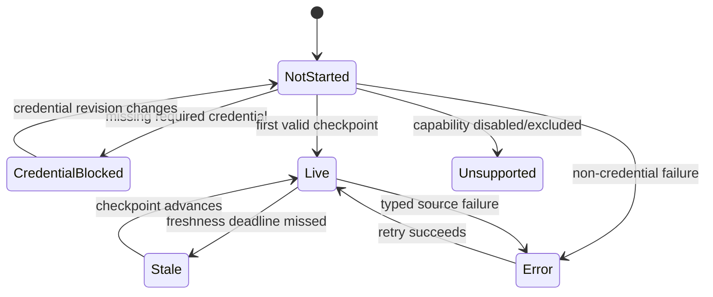
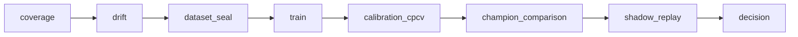

# 11.9 — Crypto / Weather 双垂直、Attribution Feedback 与 Auto-Retraining

<!-- quant-pivot-lifecycle-contract:v1 -->
> **Lifecycle contract**
> - `lifecycle_assumption`: 项目尚未正式生产上线，当前状态为 `pre_production_resettable`，系统自有基线统一为 `boot` / schema version `1`。
> - `schema_data_version_impact`: 本文中的历史版本号与递增路径不再具有实施效力；当前实现不迁移测试数据、旧结构或旧版本。
> - `pre_production_behavior`: 允许 clean-break、migration squash 与全新基础设施 bootstrap，但任何数据销毁仍需操作者单独授权。
> - `production_frozen_behavior`: 一旦完成不可逆 production seal，后续变更必须提供前向 migration、兼容性评估、回滚方案与数据验证。
> - `rollback_and_data_verification`: 封存前通过清空后的 fresh-install 验证；封存后不得回退到 boot reset。

> 状态：**Crypto / Weather Vertical Data Closure 已完成；后续工作已按用户指令暂停（Phase 11.9 尚未完成）**
>
> 最后更新：2026-07-18
>
> Boot 版本所有权：六类 Runtime Policy、Feature/Scoring/Domain/Research Method、Dataset、Model、
> Trade Policy 与 Evidence contract 均从 `schema_version = 1` 开始；本期不执行旧版本迁移。
>
> 关闭审计点：#19（最终归因没有消费闭环）、#21（factor 发布缺少 gate/shadow/WORM audit）。
>
> 本文破坏式取代 [`phase-06/06.5`](../phase-06/06.5-attribution-feedback-and-auto-retraining.md)，
> 不保留旧 seam、runtime parser、alias、re-export 或双读兼容层。

## 0. 文档使用规则与恢复协议

本文同时是最终设计、实施计划、Todo、决策账本与验收证据索引，不再创建第二份 implementation plan。

状态只允许以下五种：

| 状态 | 含义 |
|---|---|
| `TODO` | 尚未开始，不能据此宣称存在能力 |
| `IN_PROGRESS` | 已有工作树改动，但尚未通过本项验收 |
| `BLOCKED` | 存在外部或治理阻断；必须记录阻断条件和恢复动作 |
| `PAUSED` | 用户明确暂停的后续范围；保留设计和已验证进度，但不得宣称完成 |
| `DONE` | 代码、测试、证据和本文记录全部完成 |

更新纪律：

1. 每完成一个可独立验证的任务，先运行该任务的目标测试，再更新 §11 Implementation Ledger 和
   §12 Evidence Ledger；不得先勾选后补证据。
2. `DONE` 必须包含实际命令、结果和 artifact/截图/报告路径；“代码看起来完成”不是证据。
3. 网络中断后从 §11 第一条非 `DONE` 任务恢复；先运行 `git status --short` 和对应目标测试，不重做
   已有证据，不假定未验证改动正确。
4. 大型 PG/CH migration、真实 source smoke、24h shadow 分别记录；本地 replay 不能冒充真实生产资格。
5. Phase Exit 只有 §11 全部 `DONE`、§12 无失败项、§10 Blocker 全部关闭后才能改为“已完成”。

### 0.1 2026-07-18 当前交付/暂停边界

用户最新指令将本轮停止点收敛为 **Crypto/Weather Vertical Data Closure**。停止前仍必须完成：

- current catalog 四终态分类与零 `UnsupportedTemplate/generic unresolved`；
- immutable capability/source expectation → PIT linkage → official source fact → durable cursor/readiness；
- Crypto kline/aggTrade/RTDS 双 provenance 与 Weather 八个真实 family 的官方事实/明确 evidence gate；
- source-native revision/supersession、earliest availability、logical-key idempotency；
- 双垂直同轮 strict bootstrap、第二轮重跑与本范围定向工程门禁；
- 本文 Implementation/Evidence/Decision Ledger 更新到可中断恢复状态。

以下原 Phase 11.9 目标保留设计但从本轮执行中暂停：Feature/Factor/Dataset/Published profile、训练/CPCV、
Recommendation/Attribution/FeedbackCycle/原子晋升、相关 REST/WS/UI、首页刷新与像素/Axe 验收。故本轮可证明
的是“双垂直数据面与研究输入闭环”，**不是**完整 Phase 11.9、Published serving、资金资格或 UI 闭环。

## 1. 目标、事实基线与完成定义

### 1.1 已验证事实基线

| 领域 | 当前事实 | 结论 |
|---|---|---|
| Runtime | 六类 boot policy 已拆分，空 `FeedbackConfig` 已删除 | feedback worker/consumer 完整落地前不创建 runtime resource 或 UI |
| Crypto catalog | 5,027 个 active-tagged 市场；2,626 resolved、2,401 unresolved | tag 不等于可服务合同；必须按 contract family 确定性分类 |
| Crypto facts | CH 仅有 773,731 条 `binance_agg_trade`；无完整 kline/Chainlink、feature/factor、dataset/model | 不能把“有一张事实表”描述成垂直闭环 |
| Weather catalog | 1,234 个 active-tagged 市场 | 包含真实天气合同和 earthquake/volcano/health/space 等标签噪声 |
| Weather facts | 0 linkage、0 cursor、0 observation、0 forecast | 当前 worker 先依赖 linkage，而静态 station profile 不生成 linkage，形成启动死锁 |
| Source UI | cursor 为空时显示最大滞后 0 秒 | 健康语义错误；未知/未启动不能展示为绿色成功 |
| Dashboard | Recommendation Orbit 每秒 partial update 触发 ECharts `polar` 异常 | 必须删除装饰性旋转和相关 timer/watcher/pause UI |
| Mobile | 重复浮动设置入口遮挡，顶部状态文本截断 | 必须统一单一入口并做响应式/可访问性验收 |

### 1.2 本期业务目标

本期结束时，Crypto 与 Weather 各至少有一个真实 `Published` profile 能被 category pointer 加载，并完成：

```text
official/public source
  → immutable capability registry
  → expected source ledger
  → PIT linkage
  → observation/forecast facts
  → feature + factor bundle
  → sealed dataset
  → train + calibration + CPCV/DSR/PBO
  → shadow/replay
  → RecommendationReport
  → final attribution
  → FeedbackCycle decision
  → reject or atomic model+factor promotion
```

自动化权限严格限定为 **model + factor bundle 原子晋升**。反馈系统永远不得修改：

- Trade Policy ID/hash；
- `QuantRuntimeMode`；
- SemiAuto/AutoExecution 权限；
- signing/funder/capital authority；
- active `ProfileAllocationArtifact`；
- parity latch 或 governed acknowledgment。

### 1.3 合同终态

每个 in-scope market 必须得到以下互斥终态之一：

| 终态 | 语义 |
|---|---|
| `Supported` | parser、source binding、PIT、feature、label、profile 与 serving gate 完整 |
| `CredentialBlocked` | 能力完整但官方源必须凭证；记录缺失凭证和受影响 profile，不进入 serving |
| `InsufficientEvidence` | 已完成真实数据摄取和评估，但样本/效果不足；不是空数据或未实现 |
| `Excluded` | 确定性不属于支持合同；必须有稳定 reason code |

`generic unresolved` 不是允许的终态。无法解析的新模板必须进入带 metadata hash、resolver version、
capability registry hash 的显式 `UnsupportedTemplate` 阻断队列。

### 1.4 本地完成定义

- Crypto/Weather expected source、cursor、CH facts 均非空且覆盖 profile 所需时间范围。
- 所有 active-tagged market 得到确定性终态；支持集合内不存在 generic unresolved。
- Weather 每个真实 family 都有非空官方数据、PIT manifest 与 gate 决策；稀疏族可诚实结束为
  `InsufficientEvidence`。
- 至少一个 Crypto profile 和一个 Weather daily-temperature profile 完成 Published model+factor bundle
  与 category pointer。
- 固定 replay 分别生成 Crypto/Weather recommendation、final attribution 和 FeedbackCycle，并覆盖
  challenger reject 与 atomic promote 两条路径。
- 自动晋升前后 Trade Policy、runtime mode、execution authority、capital allocation pointer 完全不变。
- 首页 WS refresh、重连、single-flight、fallback polling、console/network hard-fail 和四视口截图全部通过。

## 2. 总体架构与硬边界

```mermaid
flowchart LR
    C["Capability Registry Artifact"] --> E["Expected Source Ledger"]
    C --> L["Deterministic Linkage Resolver"]
    E --> S["Source Supervisors"]
    L --> S
    S --> F["PIT Facts + Availability"]
    F --> X["Feature Planes"]
    X --> B["Factor Bundle Artifact"]
    B --> D["Sealed Dataset boot v1"]
    D --> M["Model Artifact boot v1"]
    M --> G["CPCV / Calibration / Champion Gate"]
    G --> H["Shadow + Replay"]
    H --> R["Recommendation Report"]
    R --> A["Final Attribution Cohorts"]
    A --> Q["Durable FeedbackCycle"]
    Q -->|reject| W["WORM Decision Evidence"]
    Q -->|pass| P["Atomic Model + Factor Pointer Tx"]
    P --> W
```



硬边界：

1. **Source provenance 不可替换**：Binance feature 不能冒充 Chainlink settlement；天气官方源只作为
   feature/proxy/calibration，最终监督标签只认 Polymarket winning token。
2. **Expected 先于 observed**：worker 从 registry/expected bindings 启动，不从 cursor 或已解析 linkage
   反向发现全部工作；从而消除 Weather 冷启动死锁。
3. **PIT 不可回填穿越**：事实必须同时记录 event/valid/published/available 时间与 revision/hash。
4. **Active/Shadow 隔离**：每个 model 加载自身 factor bundle 和 transform，不共享全局 active factors。
5. **一次性 evaluation window**：champion/challenger 只在同一 sealed window、相同 cost/policy/transform
   下比较；window 使用后封存，避免 adaptive data analysis。
6. **失败也有证据**：coverage 不足、drift 未触发、gate 拒绝、shadow 不稳都必须形成不可变 decision。
7. **零兼容**：旧 artifact/version 只属于被取代的历史证据；runtime 不提供旧 parser、双读、alias 或 re-export。

## 3. W0 — 契约重冻结与 Domain Capability Registry

### 3.1 Boot 版本与 feedback owner

| 合同 | 当前 boot 基线 | Owner |
|---|---:|---|
| 六类 Runtime Policy | 1 | 本期不新增 feedback resource |
| Feature / Scoring / Domain / Research Method profile | 1 | immutable content-addressed artifact |
| Dataset / Model / Trade Policy / Evidence | 1 | 对应 artifact contract |

`feedback.*` 旧字段全部删除。只有当 feedback worker、scheduler、retry/timeout、decision artifact、审计、
rollback test 和控制台流程完整落地后，才允许新增独立 `FeedbackSchedule` resource。PSI/KS、minimum
improvement、CPCV/DSR/PBO、shadow duration 与 effect size 属于 immutable research method/profile，
不得进入 Runtime Policy。

### 3.2 `DomainCapabilityRegistryArtifact`

Registry 是 content-addressed、不可变、构建时闭合的业务能力表，最少包含：

```rust
pub struct DomainCapabilityRegistryArtifact {
    pub format_version: u32,
    pub registry_hash: ContentHash,
    pub resolver_version: ResolverVersion,
    pub contracts: Vec<DomainContractCapability>,
}

pub struct DomainContractCapability {
    pub family: DomainFamily,
    pub contract_family: DomainContractFamily,
    pub subject_scope: SubjectScope,
    pub parser_template: ParserTemplateRef,
    pub source_bindings: Vec<ExpectedSourceBinding>,
    pub unit: MeasurementUnit,
    pub precision: Decimal,
    pub timezone_policy: TimezonePolicy,
    pub pit_availability: PitAvailabilityPolicy,
    pub profile_ref: Option<ResearchProfileRef>,
    pub dependency_hashes: Vec<ContentHash>,
    pub serving_eligibility: CapabilityEligibility,
}
```

Linkage currentness 由以下 tuple 唯一判断：

```text
metadata_hash + resolver_version + capability_registry_hash
```

任一成员变化必须重新解析旧 linkage，包括旧 `Unresolved`；不得用“已有最新行”跳过 registry 变化。

### 3.3 Crypto contract scope

支持的价格类合同：

- `Direction`：up/down，5m/15m/小时/日级；
- `Threshold`：above/below，含 `Bitcoin`/`Ethereum`/`Solana` 等全称；
- `Band`：互斥价格区间；
- 资产：BTC、ETH、SOL、XRP、DOGE、BNB、HYPE。

融资、上市、项目交付、政治监管、产品发布等 crypto-tagged event 必须 `Excluded`，不得被价格 parser
误认。BTC/ETH/SOL/XRP 使用 Polymarket RTDS 无认证 Binance/Chainlink 流；DOGE/BNB 的 feature/live
仍可使用 Binance Spot，但 Chainlink settlement 为 `CredentialBlocked`。HYPE 不存在 Binance Spot
`HYPEUSDT`，但真实合同可明确引用 Binance USD-M Futures `HYPE/USDT`，此时必须使用独立 Futures
source ID、instrument 与 REST/WS/archive provenance；引用 Chainlink Data Streams 的 HYPE 合同则为
`CredentialBlocked`。禁止跨 Spot/Futures/Chainlink 冒充 settlement source。

### 3.4 Weather contract scope

| Family | 主要合同 | Feature/Proxy source | 最终 label |
|---|---|---|---|
| Daily temperature | daily max/min、阈值、band | AviationWeather/NWS/HKO、GHCNh、GEFS TMAX/TMIN | Polymarket winning token |
| Precipitation | daily/hourly amount、是否降水 | HKO/NWS/Met Office 公共资料、GEFS | Polymarket winning token |
| AQI | AQI threshold/band | AirNow observation/forecast files | Polymarket winning token |
| Tornado | count/occurrence | SPC preliminary + NCEI Storm Events final | Polymarket winning token |
| Tropical cyclone | named storm/category/landfall | NHC advisories/HURDAT2；HKO best track | Polymarket winning token |
| Global temperature | monthly/year anomaly | NASA GISTEMP v4 | Polymarket winning token |
| Sea ice minimum | extent/minimum/date | NSIDC Sea Ice Index v4 | Polymarket winning token |
| Wind extreme | max gust/threshold | station official observations、GHCNh、GEFS | Polymarket winning token |

Earthquake、volcano、health、space 等 weather-tagged 噪声以稳定 reason code 排除。

Wunderground 仅保留为合同 resolution provenance URL；禁止抓取、模拟或将其他气象源伪装成
Wunderground。Polymarket 的最终 winning token 才是训练 label。

### 3.5 Decision group

同一 event 的温度/降水/AQI/价格 bucket 是一个互斥 `DecisionGroup`，必须验证：

- 所有 sibling 共用 subject、date/timezone、resolution source 和 precision；
- band 不重叠；开放边界与闭合边界语义一致；
- 若合同宣称 exhaustiveness，则区间覆盖完整；
- resolved group 恰有一个 winner；
- dataset 的 split/weight 以 group 为原子，兄弟 bucket 不能作为独立 IID 样本。

## 4. W1 — 数据面破坏式重构与真实回填

### 4.1 Worker 拆分

删除混合 Crypto/Weather 且超过 2,000 行的 `DomainLiveIngestWorker`，拆为：

```text
app/domain_ingest/
├── supervisor.rs              # expected binding reconciliation + lifecycle
├── crypto/
│   ├── binance.rs             # REST/WS/archive/gap repair
│   ├── rtds.rs                # Polymarket Binance/Chainlink provenance
│   └── backfill.rs
├── weather/
│   ├── observation.rs         # station/official observations
│   ├── forecast.rs            # GEFS/forecast manifests
│   ├── climate.rs             # GISTEMP/NSIDC etc.
│   └── severe_weather.rs      # tornado/cyclone/wind
└── source_state.rs            # cursor + expectation health state machine
```

Supervisor 顺序固定为：

1. 加载 capability registry；
2. 从 registry + active market metadata 生成/同步 expected bindings；
3. 标记 credential/unsupported；
4. 启动 source workers；
5. linkage resolver 独立运行并引用相同 registry；
6. cursor 只记录已观察进度，不参与决定“应不应该存在这个 source”。

### 4.2 Expected-source 状态机



API/UI health 不从 lag 单值推断：

- 无 cursor：`last_event_time=null`、`lag_secs=null`、`not_started` 或 `credential_blocked`；
- 有 cursor 且 fresh：`live`；
- 有 cursor 但超过 source/profile freshness：`stale`；
- 最近 tick typed failure：`error`，保留 bounded/redacted detail；
- `worst_lag_secs` 在没有可比较 cursor 时为 `null`，绝不返回 0。

### 4.3 通用 Weather facts

删除 daily-high-only 的 CH/PG projection，使用 long-form observation/forecast：

```text
family, source_id, instrument_key, variable,
decimal_value, unit, precision,
observed_at, valid_from, valid_to,
published_at, available_at,
revision, source_report_hash, supersedes_report_hash,
raw_payload_hash, schema_version
```

`variable` 至少支持 temperature_max/min/current、precipitation、AQI、wind_speed/gust、tornado_count、
cyclone_intensity、global_temperature_anomaly、sea_ice_extent。值保持 Decimal；禁止天气量值通过 `f64`
进入业务层。

### 4.4 Crypto ingest 生产语义

- Binance REST/WebSocket/官方公共历史文件负责 kline、aggTrade、feature plane；实现 keyset/time pagination、
  source ID 去重、gap ledger + repair、request-weight budget、clock-skew check、disconnect resume。
- Polymarket RTDS 保存 `source=binance|chainlink`、symbol、event timestamp、ingestion timestamp、raw hash；
  禁止跨 source 合并后丢 provenance。
- RTDS 订阅按 symbol 发送 compact JSON filter；真实服务会先返回无 envelope timestamp 的
  `type=subscribe` 历史 snapshot，且独立 topic 连接建立初期可能短暂收到另一 Crypto topic。snapshot 不作为
  live fact，异源 topic 只允许按其真实 topic 丢弃，绝不重标为当前 source。此 wire 行为由 ignored live
  integration 固化；官方页面的 Binance 逗号 filter 示例不能替代真实 smoke。
- Binance REST 429/418 遵循 retry-after/circuit breaker；空页必须区分“完成”与“上游异常空响应”。
- Chainlink adapter 先验证 report identity、timestamp/expiry、feed key 和 hash，再写事实；缺凭证只阻断
  依赖该 feed 的 capability。

### 4.5 Weather ingest 生产语义

- Observation 与 forecast 分开存储和做 availability；forecast `reference_time` 不能被 valid time 替代。
- GEFS cycle 必须先有完整 manifest，再对 profile 所需 member/variable 做 completeness gate；未发布 cycle
  是 retryable `SourceNotYetPublished`，不是空成功。
- GHCNh/HKO/NCEI/NASA/NSIDC 文件下载记录 URL、ETag/Last-Modified、content length、hash、retrieved_at；
  revision 产生新事实，旧事实不覆盖。
- AviationWeather/NWS/HKO 实时 provisional 与 archive final 不能混为同一 revision class。
- tornado/cyclone 等 final data 延迟较长；label maturity policy 必须按 source finalization 独立配置在 profile。

### 4.6 Evidence bootstrap

新增可重复命令：

```bash
cargo xtask phase-11-9-evidence-bootstrap \
  --categories crypto,weather \
  --manifest-dir .local/phase-11-9/manifests
```

它必须：

1. keyset 下载 Gamma/Polymarket 已结算市场；
2. 下载并 hash 官方历史源；
3. 写 PG linkage/expectation/registry ledger；
4. 写 CH facts + availability；
5. 生成 source-slice/dataset manifest；
6. 可幂等重跑并执行 gap audit；
7. 不提交大型数据文件，不制造样本，不把 replay 标成 live。

## 5. W2 — Attribution Cohorts、FeedbackCycle 与原子晋升

### 5.1 三个不可混用 cohort

| Cohort | 纳入样本 | 用途 | 禁止 |
|---|---|---|---|
| `ModelLearning` | label 已成熟、最终 token 正确、PIT evidence 完整 | 模型/校准训练 | 使用 censored/unfilled 当负收益 |
| `ExecutionLearning` | 真实 submit/fill/queue/slippage | execution cost calibration | 使用 ReportOnly 模拟填充冒充 live |
| `PolicyEvaluation` | 所有 recommendation，含 censored/unfilled | policy coverage/selection bias | 直接当监督模型标签 |

`SupersededUnfilled` 永远属于 censored policy evidence，不是负收益训练样本。

删除 `append_live_attribution_examples` 手工旁路和 10k silent cap，改为：

- `(created_at, attribution_id)` keyset pagination；
- coverage ledger：eligible、included、missing evidence、censored、excluded by reason；
- hard configured batch memory bound，但无全局静默截断；
- cutoff 之后新增数据进入下一 cycle，不污染已 sealed dataset。

### 5.2 Durable `FeedbackCycle` DAG



Run identity：

```text
idempotency_key = hash(profile_id, label_cutoff, feedback_policy_hash,
                       capability_registry_hash, trigger_family)
```

相同 key 的 scheduled/label/drift/manual 触发合并为一个 run；manual reason/actor 作为 append-only trigger
evidence 保留。状态机：

```text
Queued → Running → Passed | Rejected | Failed | Cancelled
```

取消只在 stage 边界生效；已经写入的 WORM stage 不回滚。retry 从最后一个已通过且 hash 匹配的 stage
恢复；hash 不匹配则创建新 run，禁止复用旧 stage。

### 5.3 Drift 与 parity 分离

- data drift：training reference 与 serving FeatureCell/encoded input 的 PSI/KS；
- concept drift：realized Rank IC/effect 相对 sealed evaluation baseline 的下降；
- label drift：label marginal/conditional distribution；
- deterministic parity mismatch 仍由 11.6 latch 处理，不能归类为 drift；
- drift 只触发 challenger，不直接发布，也不能清除 parity latch。

### 5.4 Champion/challenger gate

比较必须冻结：

- 同一 evaluation window ID/hash；
- 同一 dataset source slice；
- 同一 feature transform 与 factor definition contract；
- 同一 cost/fee/latency model；
- 同一 Trade Policy ID/hash；
- 同一 decision group split 和 sample weights。

自动晋升必须同时通过：

1. expected source liveness/coverage；
2. PIT completeness 与 parity latch closed；
3. CPCV path-set、DSR、PBO；
4. calibration/reliability/Brier；
5. minimum effect + uncertainty；
6. champion comparison；
7. shadow/replay stability；
8. model artifact 与 factor bundle hash binding。

同一 evaluation window 使用后写 sealed-use record；后续调参不得再次把它当未见 holdout。

### 5.5 `FactorBundleArtifact`

Bundle 至少包含：

```text
factor_bundle_id
profile_id / category
feature_schema_version / feature_contract_hash
ordered definition_id + definition_hash list
transform artifact ref/hash
bundle_hash / artifact_uri
status = candidate | published | retired
```

Dataset boot v1 与 Model boot v1 都必须绑定 bundle ID/hash。Active 与 Shadow model 分别加载自己的 bundle；删除
“global active factors 同时服务 challenger”的设计。

### 5.6 原子发布事务

唯一允许的自动发布事务：

```text
lock category pointer
→ re-read current model/factor pointer hash
→ verify expected before hash
→ verify feedback decision + all evidence hashes
→ publish candidate model and candidate factor bundle
→ update category model+factor pointer as one transaction
→ append WORM audit(actor=system/feedback:<run_id>, reason, before/after hash)
→ emit one semantic revision
```

任何一步失败整笔回滚；不能出现 model 已切换但 factors 未切换。事务中不得写 Trade Policy、runtime mode、
execution authority、capital allocation。

### 5.7 Cross-profile allocation

- 单 profile 内使用自身预声明 candidate family 的 CPCV/DSR/PBO；不重复施加跨 profile correction。
- 同一治理决策比较多个 profile winner 时，冻结完整 family、共同 cutoff 和 hypothesis ledger，执行
  Romano–Wolf stepdown。
- 自动流程只生成不可变 `ProfileAllocationArtifact(status=proposed)`；activation 必须人工 governed action。

## 6. 数据库、Artifact 与删除迁移

### 6.1 PostgreSQL

| 表 | 可变性 | 责任 |
|---|---|---|
| `quant_domain_source_expectation` | current projection + updated_at trigger | expected binding、credential/status、受影响市场/profile |
| `quant_feedback_run` | FSM row + updated_at trigger | durable cycle、idempotency、terminal decision |
| `quant_feedback_run_stage` | append-only | 每阶段 evidence/metrics/timeline |
| `quant_drift_report` | append-only | data/concept/label drift report |
| `quant_factor_bundle_artifact` | append-only | immutable bundle envelope |
| `quant_factor_governance_audit` | append-only | actor/reason/before/after model+bundle pointer |
| `quant_profile_allocation_artifact` | append-only artifact；activation 另走 governed ledger | Romano–Wolf 建议 |

扩展既有 model comparison report 绑定 evaluation window/bundle/cost/policy hash；不创建重复 champion 表。

### 6.2 ClickHouse

- 新增 `quant_drift_event`、`quant_feedback_run_event`；
- 用通用 weather observation/forecast facts 破坏式替换两个零数据窄表；
- 旧窄表非空则 offline destructive migration 拒绝，必须先完成导出/证明或显式清库；
- 所有新表加入 immutable migration registry、required object list、semantic manifest 和 row snapshot。

### 6.3 删除清单

| 删除对象 | 替代 |
|---|---|
| 06.5 旧设计与 11.9 v16/v17/v18/空 FeedbackConfig 描述 | boot schema 1 的 typed policy + immutable artifact 契约 |
| `DomainLiveIngestWorker` 混合大文件 | source supervisor + Crypto/Weather/backfill workers |
| `quant_weather_daily_high_projection` 和 daily-high-only 类型/parser | 通用 weather variable facts + contract-family parsers |
| cursor-only source health、无 cursor=0 lag | expected + observed source view |
| `append_live_attribution_examples` 与 silent 10k cap | keyset coverage builder |
| 独立、无 gate 的 factor batch publish | model+factor bundle 原子事务 |
| category model → generic model 静默 fallback | enabled vertical 缺 Published pointer 时 fail closed |
| Orbit timer/idle/visibility/pause UI | 静态可点击 polar + keyboard list |
| 移动端重复浮动设置入口 | 单一 header/settings 入口 |

## 7. API、WebSocket 与 UI 契约

### 7.1 REST API

| Method | Path | 语义 |
|---|---|---|
| GET | `/research/vertical-readiness` | Crypto/Weather contract/source/linkage/dataset/model/feedback readiness |
| GET | `/research/domain-sources` | expected + observed；lag 可空，返回 affected market/profile |
| GET | `/research/feedback-runs` | keyset/page list + category/status/trigger filters |
| POST | `/research/feedback-runs` | governed manual trigger；actor/reason 必填 |
| GET | `/research/feedback-runs/{id}` | stage timeline、coverage、artifacts、decision |
| POST | `/research/feedback-runs/{id}/cancel` | governed cancellation request |
| GET | `/research/drift-reports` | profile/kind/window query |
| GET | `/research/factor-bundles` | immutable bundle catalog |
| GET | `/research/profile-allocations` | proposed/activated/rejected artifacts |
| POST | `/research/profile-allocations/{id}/activate` | 人工 governed activation；非 feedback 自动权限 |

DTO：`VerticalReadinessView`、`DomainSourceExpectationView`、`FeedbackRunView`、
`FeedbackRunStageView`、`DriftReportView`、`FactorBundleView`、`ProfileAllocationView`。价格/资金继续使用
Decimal string/newtype。

### 7.2 WebSocket semantic events

沿用 ticket auth、heartbeat、backoff、ref-count 连接；新增 revision hints：

```text
research.feedback_run
research.model_factor_pointer
research.vertical_readiness
research.domain_source_readiness
```

Event 只携带 monotonic semantic revision + subject ID，不携带可作为权威状态的完整 snapshot。Heartbeat 只更新
WS/status store，不触发 overview GET。

### 7.3 `DashboardRefreshCoordinator`

Coordinator 是 dashboard overview 刷新的唯一入口：

1. report、pointer、vertical readiness、source readiness、runtime semantic revision 在 300ms 内 coalesce；
2. single-flight：同一时刻最多一个 overview request；
3. trailing invalidation：请求期间到达新 revision，完成后至多追加一次；
4. response 带 request generation/observed revision，旧响应不能覆盖新 snapshot；
5. WS healthy 时关闭 30s polling；仅 disconnected/stale 且 `document.visibilityState=visible` 时 fallback；
6. reconnect 后先 authoritative sync，再至多一次 overview refresh；
7. unmount/abort 时释放 timer、AbortController 和 subscriptions。

### 7.4 页面信息架构

- 新增“反馈与再训练”工作台：双垂直概览、source/linkage coverage、dataset、champion/challenger、shadow、
  gate blockers、WORM timeline、manual governed run。
- Domain Sources 改为 capability matrix：Expected / Live / Stale / Blocked / Unsupported；空数据为阻断，
  展示受影响市场/profile。
- Dashboard 只展示紧凑双垂直 readiness 与最近 feedback 状态，不堆研究细节。
- Factor/Model evidence drill-down 显示 bundle/model/evaluation window/cost/policy hashes。

视觉边界：复用现有 token、Card/Statistic/Tag/Grid、图表 palette、spacing/radius/typography；不引入新视觉系统。

### 7.5 Dashboard 与移动端修复

- Recommendation Orbit 静态渲染完整 ECharts option；删除每秒 `updateData`、timer、hover/focus pause、
  visibility/reduced-motion watcher 和 pause button；保留 click + keyboard list。
- 移动端只保留一个设置入口；kill-switch 始终可见，次要状态折叠到详情。
- 日期/状态允许换行或响应式缩写；截断必须有可访问 tooltip/aria-label。
- 390px viewport 无横向滚动、浮层遮挡或小于 44px 的关键触控目标。

## 8. 生产不变量与失败语义

- 外部响应为空、429、超时、解析失败、revision 倒退、clock skew、unpublished cycle 均为 typed result；
  不吞错、不把空响应标为 success。
- expected source 缺失是 readiness blocker；非 required source 可 `Unsupported`，但仍有 ledger row。
- enabled vertical 无合法 Published category pointer 时 fail closed；禁止 generic model fallback。
- 自动反馈 run 无权 ack parity latch、无权改执行模式、无权激活资金分配。
- 任何 artifact hash、bundle binding、evaluation window、policy/cost mismatch 立即 reject，并写 WORM stage。
- log/error detail 必须限长并脱敏；URL credential/query secret 不进入日志或 artifact。
- feedback cancellation 不删除已写 stage；retry 不覆盖 WORM 行。
- source adapter 使用 bounded concurrency、timeout、retry budget、jitter 和 cancellation token。

## 9. 验收与质量门禁

### 9.1 双垂直数据与业务验收

- clean local stack 执行 bootstrap 后，Crypto/Weather expected source、cursor、facts 非空。
- 所有 in-scope contract 分类确定；支持集合无 generic unresolved。
- Weather 八个 family 均有官方数据 + PIT manifest + gate decision。
- Crypto 与 Weather daily-temperature 各至少一个 Ready dataset、CPCV/backtest、Published bundle/model、pointer。
- replay 生成两类 recommendation/final attribution，各跑一次 FeedbackCycle；覆盖 reject 与 promote。
- promotion 前后 Trade Policy/runtime mode/execution authority/capital allocation hash 不变。

### 9.2 真实网络 smoke

验证 Gamma keyset、Binance、RTDS、AviationWeather、GHCNh、GEFS、AirNow、NCEI/SPC、NHC、HKO、
NASA GISTEMP、NSIDC。必须覆盖 empty、timeout、429、revision、disconnect、unpublished cycle 和 invalid payload。

### 9.3 WS/状态 E2E

- heartbeat 不产生 overview GET、不重挂载页面、不闪烁；
- semantic burst 合并为一次 GET；
- report/pointer/readiness event 刷新对应 UI；
- forced disconnect 显示 reconnecting，恢复后 authoritative sync + 一次 refresh；
- healthy 30s 内无 polling；disconnected/stale + visible 才 fallback；
- slow response race 不覆盖新 snapshot；
- `pageerror`、`console.error`、unhandled rejection、失败网络请求均 hard fail。

### 9.4 像素与可访问性

视口：1440×900、1024×768、768×1024、390×844；light/dark、zh-CN。页面：Dashboard、Domain
Sources、Feedback Run、Vertical Readiness、Model/Factor evidence。

- 本地同渲染环境 pixel exact；CI 抗锯齿差异 ≤0.1%；
- 只逐字段 mask timestamp/UUID，不遮整卡；
- baseline/candidate 同 viewport/state 并排检查 spacing、crop、font、border/radius、chart、empty、scroll；
- Axe WCAG 2.2 AA critical/serious = 0；键盘、focus、reduced-motion、无横向 overflow 全通过；
- 截图前必须完成登录、真实数据加载和交互，不接受静态替代页。

### 9.5 最终工程门禁

```bash
cargo fmt --all --
cargo clippy --workspace --all-targets -- -D warnings
cargo clippy -p quant-pivot-research --features ml-classical,dataframe,optimize,lp-solver -- -D warnings
bash scripts/lint-architecture.sh
bash scripts/lint-import-style.sh
bash scripts/lint-quant-pivot-boundary.sh
bash scripts/lint-quant-pivot-errors.sh
bash scripts/lint-dead-semantics.sh
bash scripts/lint-training-serving-parity.sh
cargo test --workspace
bash scripts/check-production-gates.sh ui
bash scripts/check-production-gates.sh protected-e2e
```

## 10. Blocker 与明确延后

任一条件成立即不得 Phase Exit：

- 任一双垂直 required source 仍为空且无 typed blocker；
- 缺少 Published serving profile；
- 支持集合出现 generic unresolved；
- 无 cursor 显示绿色/0 lag；
- category model 静默回退 generic；
- challenger 使用不同 holdout/cost/policy/transform；
- factor/model 非原子晋升或 actor/reason 丢失；
- feedback 自动化修改 Trade Policy/runtime mode/execution/capital authority；
- WS heartbeat 重复刷新、旧 snapshot 覆盖新状态、console/network error；
- 像素、Axe、keyboard、mobile overflow 验收失败。

明确不在本期自动化权限内：

- 真金白银 A/B/canary 流量分配；
- auto factor mining；
- 自动激活跨 profile allocation；
- 扩大 SemiAuto/AutoExecution 权限。

真实 24h/多日 shadow 是部署激活证据；本地 replay 只证明实现与业务闭环，不证明生产资金资格。

## 11. Implementation Ledger

> 每项 `DONE` 后必须在 §12 添加证据。当前工作树已开始的版本/迁移改动在完整测试前保持
> `IN_PROGRESS`，不能作为已交付能力。

### W0 — 契约与计划

| ID | 状态 | 任务 | 完成证据 |
|---|---|---|---|
| W0-01 | DONE | 将本文重写为最终设计、Todo、恢复协议和证据账本 | 文档 review + `rg` 版本账本 |
| W0-02 | DONE | Runtime v18 + feedback 运维字段 + UI schema + validation | models/runtime tests + schema snapshot |
| W0-03 | PAUSED | Feature 7 / Dataset 6 / Model 6，绑定 factor bundle/capability hash；已有工作树改动保留，恢复时先审计，不计为完成 | artifact roundtrip + old-version reject tests |
| W0-04 | DONE | DomainCapabilityRegistryArtifact v2 + content hash + currentness tuple；source requiredness、station registry 与完整 deploy-frozen `WeatherVerticalBindingsConfig` 均进入 immutable hash，binding/hash drift 可确定性触发重算 | station + vertical-binding hash drift tests + current catalog deterministic artifact |
| W0-05 | DONE | Crypto/Weather contract family、support outcome、reason code 闭合 | exhaustive registry/parser tests |
| W0-06 | PAUSED | README/06.5/11.8/version ledger 同步，删除过期描述 | dead-semantics/doc grep |

### W1 — 数据面与回填

| ID | 状态 | 任务 | 完成证据 |
|---|---|---|---|
| W1-01 | DONE | PG source expectation + feedback/factor/allocation migration | migration manifest + PG integration |
| W1-02 | DONE | expectation entity/repository/state machine | repository tests |
| W1-03 | DONE | worker 已拆为 supervisor、Crypto kline/live/RTDS、Weather live/calibration、Weather backfill；旧混合 worker 与旧名称已删除 | core tests + old worker deleted |
| W1-04 | DONE | expected binding 先于 linkage/cursor 启动；48 个 airport profile、HKO、Weather 公开源、四个 PM2.5 area 与 Union City exact site 均由 current Capability Registry v2 产生。required 157/157 live；Chicago numeric forecast 是诚实 optional/not_started，不阻断 readiness | current-catalog strict manifest + non-empty facts + exact AirNow ledger |
| W1-05 | DONE | Crypto parser：BNB/HYPE/full names、精确边界语义、Binance Spot/USD-M Futures 1m/1h oracle、hourly/weekly/multi-strike/band；HYPE Futures 使用独立 source/instrument/provenance，current catalog blocker 已归零 | real-catalog zero-blocker scan + exhaustive fixtures |
| W1-06 | DONE | RTDS Binance/Chainlink exact-filter per-instrument connections + provenance；官方四资产双 topic 实网收齐，8 个 current expectation/cursor 在 strict bootstrap 中全部 live | payload replay + eight-connection dual-topic live smoke + strict manifest |
| W1-07 | DONE | Binance kline/archive/gap repair/rate-limit/clock-skew；interval-aware closed-bar frontier、有界 archive、source-native latest、Spot/Futures 权重与 WS-idle exact REST catch-up 均由回归和 current strict manifest 闭合 | integration/fault tests + 1m/1h frontier tests + strict manifest |
| W1-08 | DONE | Weather long-form facts 使用 lossless signed epoch-day 与 epoch-millis；v8 resumable offline rebuild 已移除 `DateTime64` 的 pre-1900 静默夹断，并由真实 GISTEMP 四字段断言锁定 | CH v8 rebuild/resume + pre-1900 PIT query assertion |
| W1-09 | DONE | Weather max/min、decision group、station registry、GEFS TMAX/TMIN、projection/entry/day-close 全链路 | resolver/group/projection/PG integration tests |
| W1-09a | DONE | HKO 原生 daily max/min：官方 `CLMMAXT/CLMMINT`、source-native station、0.1°C completeness/PIT/revision；小数 bucket ownership 规则不明时 fail closed 为明确 gate，不伪造 ICAO | official fixture/live smoke + catalog terminal disposition |
| W1-09b | DONE | GHCNh 年分区有界流式下载、64MiB 硬上限、current-year unpublished 与 historical-missing 分离、partition manifest cursor | oversize/404 fixtures + real 11MiB archive smoke |
| W1-10 | DONE | Weather 非温度七族官方 adapter、source-native expected binding、统一 revision/supersession fact sink、durable cursor 与独立 public worker；NHC pre-posted PIT、AirNow PM2.5 area/site、required/optional readiness 与 legacy operational-state cleanup 均由 current strict manifest 和工程门禁闭合 | 子项 fixtures/live smoke + current-catalog strict bootstrap + migration Docker + Clippy |
| W1-10a | DONE | HKO precipitation：hour-window、place binding、max/min provenance、revision hash | HKO official JSON fixture + live smoke |
| W1-10b | DONE | AirNow reporting-area PM2.5：已破坏式删除跨污染物 peak 语义与 generic instrument，O/current、Y/finalized yesterday、F/forecast 只读取 `PM2.5` / `PM25_AQI`；冻结 New York City Region/NY、Philadelphia/PA、Columbus/OH、Chicago/IL 的 state-qualified identity/timezone，保留 72h correction/PIT provenance | pollutant-isolation fixtures + all-area official live smoke + current expectation/fact |
| W1-10b2 | DONE | AirNow site-level hourly PM2.5 AQI：冻结 East Rutherford 主来源与 Union City High School fallback monitoring-site identity，保留 GMT hour/AQSID/site/revision/PIT provenance；合同 game-window maximum 在 profile/feature 层聚合，不在 adapter 猜测 | official site/hourly fixtures + live smoke + 6-market classification + current expectation/fact |
| W1-10c | DONE | SPC preliminary + NCEI final tornado：region count、revision/finality 分离 | official CSV fixtures + smoke |
| W1-10d | DONE | NHC advisory + HURDAT2 cyclone：实时 advisory 与 post-analysis best track 分离；以 `fileUpdateTime` 表达实际公开 knowledge time，以 `issuance` 同时表达 observation/nominal validity/cursor event time，官方 payload 可早于名义 issuance 读取但事实不会提前进入 serving window | pre-posted JSON/HURDAT2 fixtures + live smoke + PIT query test |
| W1-10e | DONE | NASA GISTEMP v4：monthly LOTI、release availability、历史 correction | official CSV fixture + smoke |
| W1-10f | DONE | NSIDC Sea Ice Index v4：N/S daily extent、missing-area quality、revision | official CSV fixture + smoke |
| W1-10g | DONE | NWS wind extreme：station observation、unit conversion、QC/null、revision | official GeoJSON fixture + smoke |
| W1-11 | DONE | deterministic classification 全量扫描与 source-availability registry：current 6,925-market authoritative catalog 全部进入四个允许终态，18 个 AQI blocker 已由 exact-site 与 state-qualified finalized daily PM2.5 literal templates 清零；连续复扫 artifact/hash/count 完全一致 | current catalog zero-blocker artifact + deterministic rerun |
| W1-12 | DONE | `xtask phase-11-9-evidence-bootstrap` 使用生产 composition root、finite worker boundary、content-addressed v4 manifest 与 strict gap audit；同轮 Crypto+Weather 重跑已证明 expected/cursor 稳定、四表 logical/physical key 幂等、revision 无冲突，实时增量与 source frontier 精确对账 | clean-stack idempotent run + source-frontier audit |

### W2 — Feedback 与晋升

| ID | 状态 | 任务 | 完成证据 |
|---|---|---|---|
| W2-01 | PAUSED | attribution 三 cohort + keyset coverage；删除 manual append/10k cap | coverage tests + old symbol absent |
| W2-02 | PAUSED | FeedbackRun/Stage/Drift repository + idempotency/cancel/retry | PG concurrency tests |
| W2-03 | PAUSED | durable FeedbackCycle DAG worker | stage transition tests |
| W2-04 | PAUSED | data/concept/label drift，与 parity latch 隔离 | negative/positive tests |
| W2-05 | PAUSED | FactorBundleArtifact + dataset/model binding | artifact/repository tests |
| W2-06 | PAUSED | active/shadow 独立 factor plane | parity/inference tests |
| W2-07 | PAUSED | same-window champion comparison + sealed-use ledger | mismatch rejection tests |
| W2-08 | PAUSED | model+factor atomic promotion + WORM audit | rollback/concurrency/authority tests |
| W2-09 | PAUSED | ProfileAllocation proposal + Romano–Wolf；activation 人工治理 | multiple-testing tests |

### W3 — API / WS / UI

| ID | 状态 | 任务 | 完成证据 |
|---|---|---|---|
| W3-01 | PAUSED | vertical readiness/domain sources expected+observed API；已有工作树改动保留，恢复时先审计 | web integration snapshots |
| W3-02 | PAUSED | feedback/drift/factor-bundle/allocation API + RBAC | auth/validation tests |
| W3-03 | PAUSED | WS semantic revision events | protocol tests |
| W3-04 | PAUSED | 反馈与再训练工作台 + drill-down | UI unit/E2E/screenshots |
| W3-05 | PAUSED | Domain Sources capability matrix + honest empty/blocked | UI tests/screenshots |
| W3-06 | PAUSED | Dashboard 双垂直 readiness + recent feedback | UI tests/screenshots |
| W3-07 | PAUSED | DashboardRefreshCoordinator | fake-timer/race/E2E counts |
| W3-08 | PAUSED | 删除 Orbit motion/ECharts error | console-hard-fail E2E |
| W3-09 | PAUSED | 移动端单一设置入口、状态布局、tooltip | 390×844 screenshot + Axe |

### W4 — 端到端与 Phase Exit

| ID | 状态 | 任务 | 完成证据 |
|---|---|---|---|
| W4-01 | PAUSED | Crypto Published profile 端到端 | profile/pointer/report/attribution/run IDs |
| W4-02 | PAUSED | Weather Published daily-temperature profile 端到端 | profile/pointer/report/attribution/run IDs |
| W4-03 | DONE | Weather 八个真实 family 均有非空 official facts/proxy plane，并在 current catalog 得到 Supported / InsufficientEvidence / typed Excluded gate；没有空数据或 `NotImplemented` | current classification artifact + CH family matrix |
| W4-04 | PAUSED | challenger reject replay | feedback decision artifact |
| W4-05 | PAUSED | atomic promote replay + authority invariance | before/after hash evidence |
| W4-06 | DONE | 当前双垂直 official-source/网络 smoke 与 strict v4 manifest 已通过；完整 Phase fault matrix 按停止边界暂停，不计入本项当前范围 | timestamped smoke manifest |
| W4-07 | PAUSED | WS refresh/reconnect/fallback/race protected E2E | request counters + trace |
| W4-08 | PAUSED | 四视口 light/dark zh-CN pixel + Axe | screenshot diff/Axe reports |
| W4-09 | DONE | 当前 Vertical Data Closure 定向工程门禁全部通过；原 Phase 全量门禁按停止边界暂停 | 命令与 exit status |
| W4-10 | DONE | 当前垂直数据范围的删除/重复/死代码扫描完成，冲突旧测试已删除，历史 migration snapshot 仅审计保留 | grep/lint + final diff review |

## 12. Evidence Ledger

| 日期 | Item | 结果 | 证据 |
|---|---|---|---|
| 2026-07-18 | W0-01 | SUPERSEDED | 本轮前的版本递增设计证据；现由 boot baseline 与六类 policy resource 取代 |
| 2026-07-18 | W0-02 | SUPERSEDED | 旧统一 Runtime Config/feedback wire 的测试证据；不再是当前 contract 验收依据 |
| 2026-07-18 | W0-02 | PASS | 真实本地部署审计发现 active Runtime 仍为 v17，证明仅升级 parser/schema 会令 runtime fail-closed。新增 deploy-only `phase-11-9-activate-runtime-v18`：只接受 exact v17 object 且明确拒绝已有 `feedback` 的歧义输入；一次性复制既有策略字段，写入 v18 schema 与 disabled-by-default `FeedbackConfig`，typed parse + 全量 semantic validation 后创建 immutable `source=import` version，并以 current-activation CAS 追加 `Promote` audit。v17 原 version/activation 只读保留，不存在 v17 runtime parser、双读、alias 或 re-export。定向 2 tests PASS；真实 activation 生成 version `019f7355-d242-7480-a17f-e5ce28dda894` / hash `blake3:2df67486bcf3b3a782cde44fd2e286f0c9368e316253dabc05b16f1e342c1a59`，第二次运行稳定返回 `already_active`，ledger 保持 v17=1/v18=1；active feedback 为 enabled=false、auto_publish=false，Trade Policy/runtime mode/execution/capital 均未修改 |
| 2026-07-18 | W0-03 | IN_PROGRESS | 工作树已开始 Feature/Dataset/Model 7/6/6；尚未完成 bundle binding 与 roundtrip tests |
| 2026-07-18 | W0-04 | PASS | Capability Registry artifact/hash 与当前 resolver v5 已实现；linkage content hash/currentness 均绑定 `metadata + resolver + registry`；registry 现同时冻结 Chainlink public/credential 与 Binance 1m/1h resolution source contract，版本变化会重算 currentness；models registry/linkage、research registry、core currentness 测试全部通过 |
| 2026-07-18 | W0-05 | IN_PROGRESS | Registry 已穷尽 Crypto 3 类与 Weather 8 类，并区分 public/credential-blocked Crypto；全量 parser/catalog classification 尚未完成 |
| 2026-07-18 | W0-05 | PASS | 新增 closed `DomainCapabilityReasonCode` 与 per-market `DomainMarketClassificationOutcome`，明确区分四个完成终态和非终态 `UnsupportedTemplate` remediation blocker；Crypto 3 类、Weather 8 类与 earthquake/volcano/health/space/technology/mixed-hazard/tag-noise 排除原因均为 typed enum，不再写自由文本。models artifact tamper/order test 1 passed；research family/noise/crypto-price matrix 3 passed；models+research+xtask all-target Clippy `-D warnings` 与 1108-file import lint PASS |
| 2026-07-18 | W1-01 | IN_PROGRESS | 工作树已开始新 PG migration；尚未生成 migration manifest 或运行 PG integration |
| 2026-07-18 | W1-01 | IN_PROGRESS | `postgres-schema migration-manifest` 已生成五项不可变清单，`cargo test -p quant-pivot-migration --lib` 4 passed；尚缺真实 PG up/down/invariant integration |
| 2026-07-18 | W1-01 | PASS | 临时干净 PostgreSQL 16 执行五项 audited migration 与 schema finalize：version=`m20260718_000005...`、91 tables、268 indexes；semantic/migration manifest 已重生成并通过 migration tests |
| 2026-07-18 | W1-01 / W1-09 | PASS | 本地真实 PostgreSQL preflight 发现 ledger 仍停在四项基线 migration，先 plan 后应用 `m20260718_000005_phase_11_9_feedback_verticals` 与 `m20260718_000006_weather_daily_temperature_projection`；首次 finalize 因仓库 immutable migration manifest 仍是旧 checksum 被正确拒绝，重新从当前编译 source 生成 `schema/postgres/migrations.json` 后再次 apply/finalize 成功。最终 runtime identity verify=`6 migrations / 91 tables / 268 indexes`，ClickHouse verify=`v5 / 27 required objects`；迁移前后的 catalog 数据仍为 81,628 markets / 11,291 events / 7,982 linkages，未被重建或清空。新 expectation 与 daily-temperature projection 均为 0，作为 W1-12 clean-stack bootstrap 的真实起点，不把 schema 成功虚报成数据闭环 |
| 2026-07-18 | W1-02 | PASS | expectation 的稳定主键只绑定 `(source_id, instrument_key)`，coverage/registry 变化只改变 binding hash；相关 identity/FSM/无 cursor 健康语义 5 个 unit tests 通过；Docker PG optimistic-transition integration 1 passed；linkage PG PIT 回归 1 passed |
| 2026-07-18 | W1-03 | IN_PROGRESS | 新增独立 `DomainSourceSupervisor`，启动顺序强制为首次 expectation reconcile 成功后才运行 source workers；Crypto/Weather/backfill 仍待从旧 2k+ 行 worker 拆出并删除旧文件 |
| 2026-07-18 | W1-03 | PASS | 删除 2,279 行混合 `DomainLiveIngestWorker`，并破坏式删除 `DomainIngestWorker`/`DomainIngestor` 旧命名；运行时现有独立 `TaskId`/shutdown boundary：`DomainSourceSupervisor`、`CryptoKlineIngestWorker`、`CryptoLiveIngestWorker`、`CryptoRtdsIngestWorker`、`WeatherIngestWorker`、`WeatherBackfillWorker`。所有 source worker 通过 supervisor single-flight boot barrier 后才启动；periodic expectation reconciliation 只由 supervisor 单一任务持有。Crypto 与 Weather 各自只解析本垂直 linkage，不再用 cross-family mixed match；GEFS live/backfill 共用 `GefsSource` semaphore，拆任务不会把 upstream concurrency budget 翻倍。定向回归：Crypto kline 10、Crypto live 2、RTDS 1、supervisor zero-linkage 1、Weather 3、GEFS 4 全部 PASS；API+Core all-target Clippy `-D warnings`、1097-file import lint、`git diff --check`、旧文件/旧 symbol absence scan 全部 PASS |
| 2026-07-18 | W1-04 | IN_PROGRESS | capability registry 可在 0 linkage 下编译 Crypto/Weather expected bindings；configured Weather station 可在 0 linkage 下建立当前及前 14 个本地日目标。两个 core 回归测试、core all-target check、1091 文件 import lint 均通过；尚缺真实 PG/CH clean-stack cursor/fact 证据 |
| 2026-07-18 | W1-12 | IN_PROGRESS | 新增 production-composed、无 execution/account authority 的 `phase-11-9-evidence-bootstrap`：可选 Gamma sync → linkage re-resolution → expectation reconcile → Crypto/Weather finite ingest → content-addressed manifest → strict gap audit；Weather KLGA 单站真实公网首跑已写 `.local/phase-11-9/manifests/e148eae4a1ed23c68d2cc6452b92087adad3f668de2ca7ddf77610c50ddd7ae3.json`。它已解除 0-linkage/0-cursor 启动死锁并产生 6,243 linkage、191 expectations、15 cursors、44 Weather observations，但按预期 `passed=false`：发现 station hash v1/v2 双实现漂移、HKO 最新日未完整、AirNow area 无 AQI、GISTEMP 1880 年超出 CH `Date`、NSIDC 单批跨越 >100 partitions、NWS null gust 被误判 source failure，且前置 drift 阻断 GEFS 导致 forecast=0。上述均作为真实 blocker 修复，不放宽 audit、不制造数据 |
| 2026-07-18 | W1-05 | PASS | 7 个 frozen Crypto assets（含 BNB/HYPE 与全称 alias）逐一通过 5m/15m/4h epoch、hourly ET、`close above` fixture；既有 threshold/band/DST/fail-closed tests 继续覆盖。`cargo test -p quant-pivot-research every_supported_asset --lib`：2 passed |
| 2026-07-18 | W1-05 | IN_PROGRESS | 真实 5,027-market catalog 审计推翻 fixture-only 完成结论：Crypto `UnsupportedTemplate=1,075`，其中 FDV 459、hourly up/down 343、path-dependent hit-price 121、weekly neg-risk band 38、hourly multi-strike 36、non-spot valuation 30、other 48。确认 hourly 合同使用 Binance 1-hour candle，weekly band 使用 Binance 1-minute close 且 exact boundary 归入较高区间；当前 comparator、oracle interval 与 source binding 均不能精确表达。Item 已主动回退为 `IN_PROGRESS`，完成标准改为真实 supported-scope blocker 归零并将 out-of-scope 合同全部转为 typed `Excluded` |
| 2026-07-18 | W1-05 | SUPERSEDED（parser 证据保留，source-scope 结论失效） | 该轮完成精确 comparator/band/oracle/parser 与真实 5,027-market blocker 清零，但当时 ingest discovery 错把 HYPE 计入 Binance Spot 的 7 assets × 1m/1h。后续官方 `GET /api/v3/exchangeInfo?symbol=HYPEUSDT` 返回 HTTP 400，而其余 BTC/ETH/SOL/XRP/DOGE/BNB 均为 `TRADING`，因此“7 个 Binance Spot asset”结论失效；parser/typed exclusion 证据仍保留，current catalog 需按新 registry 重扫 |
| 2026-07-18 | W1-06 | PASS | 新增 public RTDS adapter、5 秒 heartbeat、typed Binance/Chainlink provenance、snapshot/异源 topic 隔离、cursor resume/dedup/gap generation 与 capability-seeded worker；BTC public / DOGE credential-blocked / Binance oracle 路由测试通过。`cargo test -p quant-pivot-api rtds --lib`：5 passed；`cargo test -p quant-pivot-api --test integration rtds_live -- --ignored --nocapture --test-threads=1`：真实 Binance+Chainlink 双 topic 1 passed；core zero-linkage RTDS 与 import lint 通过 |
| 2026-07-18 | W1-07 | IN_PROGRESS | 依据 Binance 官方 Spot REST 与 public-data contract 完成第一阶段：kline/aggTrade 共用进程级 IP weight budget；HTTP 418/429 保留合法 `Retry-After` 并交由统一 retry controller；每次 session 与周期运行使用 `/api/v3/time` 的本地 midpoint 校验 RTT/clock skew，超限返回 typed `ClockSkew`；kline 强制 OHLC/close-time/相邻 interval/cursor 连续性，gap fail closed；官方 daily kline ZIP 强制 sidecar SHA-256、唯一 CSV member、12-column wire 与 2025+ microsecond timestamp 归一化。`cargo test -p quant-pivot-api binance --lib`：14 passed；Retry-After targeted test：1 passed；真实 Binance REST smoke：3 passed；真实 BTCUSDT 2025-01-01 1m 官方归档：1440 bars、连续性验证 1 passed；API/core all-target check PASS。尚未接入 durable keyset/checkpoint backfill，且大文件必须改为 bounded streaming batch 后才可标记完成 |
| 2026-07-18 | W1-07 | PASS | Binance 历史与增量链路完成闭环：kline/aggTrade ZIP 在 sidecar SHA-256 与唯一 member 验证后，由 blocking decoder 经 depth=2 bounded channel 输出配置批次，解压后的全天 aggTrade 不再整批驻留内存；kline archive 每个成功 CH 批次后才提交 typed cursor，下一批失败时保留上一批 checkpoint 并可精确续跑；跨 batch close/sequence gap fail closed，历史 archive 缺失才回退 REST gap repair。API Binance unit 16 passed（含 missing checksum、bounded kline/aggTrade batches）；Core domain ingest 10 passed（含第二批失败/重试 cursor 不越过）；API+Core all-target Clippy `-D warnings` PASS；1095-file import lint PASS；真实 Binance 公网 5 passed，覆盖 typed kline wire、增量 kline、source identity、exact aggTrade ID recovery、BTCUSDT 2025-01-01 官方 1m 归档 1440 bars/continuity |
| 2026-07-18 | W1-06 / W1-12 | SUPERSEDED（健康联动实现保留，HYPE source 结论失效） | 该轮正确删除 DOGE/BNB/HYPE 的伪公共 RTDS expectation，并完成 kline/aggTrade/RTDS 的 cursor-health、finite timeout/cancel/join 与 manifest v3；但仅凭 Spot `exchangeInfo` 400 将 HYPE 全部收敛到 Chainlink，忽略了真实合同明确引用 `https://www.binance.com/en/futures/HYPEUSDT`。健康联动实现和测试继续有效，“HYPE 全链路 Chainlink”结论立即失效 |
| 2026-07-18 | W1-05 / W1-11 / W1-12 | FAIL（真实 current artifact，禁止作为完成证据） | 新 registry 全量复扫生成 `var/artifacts/capability-audits/36789849ee2a6e280021ad6db16c1c5cd45609772e72330b66652a25e1efb5b4.json`，artifact=`blake3:36789849ee2a6e280021ad6db16c1c5cd45609772e72330b66652a25e1efb5b4`，6,261 markets 中 Supported=3,212、CredentialBlocked=1,167、Excluded=1,630、InsufficientEvidence=202、`UnsupportedTemplate=50`。逐市场回查确认 50/50 均为 HYPE price contracts，规则明确引用 Binance USD-M Futures `HYPE/USDT`（小时 candle 及日级 1m close），不是 Spot 也不是 Chainlink。下一步必须新增独立 Futures source/provenance，禁止把它们改判 Chainlink 或伪装 Spot |
| 2026-07-18 | W1-08 | PASS | 旧 Weather CH 窄表均为 0 rows 后执行 destructive offline migration v5；新建 `quant_weather_observation_fact` / `quant_weather_forecast_fact`，schema manifest/真实本地 verify=`version=5, required_objects=27`。隔离 ClickHouse 26.5 回归 `weather_long_form_facts_are_pit_visible_and_revision_preserving`：1 passed，覆盖 temperature+precipitation 多变量、exact retry 去重、COR supersession、`published_at`/`available_at` PIT 隔离，以及 deterministic/nullable ensemble member；迁移 registry 校验 1 passed。真实测试同时发现并修复 `Date`→`String` wire mismatch，现使用 `NaiveDate` 官方 chrono serializer；core/research/repository/storage all-target check、Weather adapter 5 tests、1093-file import lint 与 `git diff --check` 全部通过 |
| 2026-07-18 | W1-08 / W1-10e / W1-10f | PASS | 首轮 evidence bootstrap 证明 v5 `local_date Date` 无法表达 GISTEMP 1880 年历史。未修改 immutable v5，先以 offline-nondestructive migration v6 升为 `Date32` 并真实 verify=`version=6, required_objects=27`；第二轮真实写入进一步证明 ClickHouse Rust client 的 `Date32` 下限仍为 1900，故 v6 是被证据否定并由后续迁移取代的中间状态。最终合同为 typed `ChEpochDay(Int32)`（1970-01-01 起的有符号日数），1880/1970/2026 roundtrip test PASS；真实本地 plan 仅包含 v7 `weather_epoch_day`，apply 后重生成已迁移 semantic manifest，最终 verify=`version=7, required_objects=27`，原 51,750 rows / 9 sources 均保留。NSIDC/GISTEMP 历史写入不提高 `max_partitions_per_insert_block`，事实服务按真实 `observed_at` 月分区稳定排序，每批最多 64 partitions / 5,000 rows；241 跨月逆序样本验证多批、零丢失、有序和分区上限。migration registry、epoch-day、partition batch tests 均 PASS |
| 2026-07-18 | W1-12 | IN_PROGRESS | 第二轮 Weather KLGA bootstrap 写入失败 manifest `.local/phase-11-9/manifests/994cc71c4a8ef6d6e76aa4262c2910780b386b0749f1df7dd447543356df7e0d.json`：observations 由 44 增至 51,750，forecasts 由 0 增至 684，expectations=193、cursors=24，证明 station hash、HKO newest-first 官方旧分区、AirNow `New York City Region`、NSIDC partition batching 与 GEFS 已真实闭环。strict audit 仅余 GISTEMP pre-1900 wire 与 NWS 最新两条全 null；后者已由官方 `/observations?limit=10` 验证第三条 speed 可用、更早记录含 gust，因此改为配置有界 recent-window 扫描，不补 0、不把正常 null 当 source outage |
| 2026-07-18 | W1-12 | SUPERSEDED（不得作为完成证据） | 第三次 Weather KLGA 真实公网 bootstrap 曾返回 `passed=true`，manifest=`.local/phase-11-9/manifests/f944f6008e0fe045db98f91657ce1750fb2775d3be18fec67f3d30961cb9fdb3.json`；但随后逐字段审计发现 GISTEMP `local_date` 虽已无损，`observed_at/valid_from/valid_to DateTime64(3)` 仍把 1880..1899 静默夹到 1900，证明当时 strict audit 只查“非空”而未查历史时间保真。该 manifest 立即失效，不得作为 Phase 完成证据；需以 observation event-time `Int64 epoch millis` 的 clean schema 重建、pre-1900 query assertion 和新 manifest 取代 |
| 2026-07-18 | W1-08 | IN_PROGRESS | 破坏式新增 ClickHouse v8 `weather_observation_epoch_time`：observation 的 `observed_at/valid_from/valid_to` 改为 signed `Int64 epoch millis`，分区改为 `intDiv(local_date, 3660)`；migration 采用可恢复 staging rebuild、原子双表 rename、`FINAL` 语义行数守恒，只排除可由 NASA 官方文件精确重建的 `nasa_gistemp`。真实 v7 表含 53,559 physical rows，其中 2 条是 ReplacingMergeTree 可合并的 retry duplicate；v8 以 `FINAL` 校验 53,557 semantic rows，排除 1,758 条已夹断 GISTEMP，保留其余 51,799 条且无意外 GISTEMP 残留。真实本地 migration ledger=`1..8`、semantic manifest 已按新表生成，`clickhouse-schema verify`=`version=8, required_objects=27`。Item 仍保持进行中，直到 bootstrap 从官方源重建 1,758 条并通过 1880 年 event-time 精确断言 |
| 2026-07-18 | W1-08 | PASS | Evidence manifest 升为 v2，并把 GISTEMP 历史时间保真从“表非空”升级为强制结构化 gate。真实 Weather/KLGA 公网 bootstrap 重建官方 GISTEMP 1,758 条后生成 `.local/phase-11-9/manifests/de1e7b025d7f7176d1d738a5571845f35cd813a358029a51ca6f996bafe45c3f.json`，`passed=true`；ClickHouse `FINAL` 与 manifest 同时证明：`min(local_date)=-32841`（1880-02-01）、`min(observed_at)=-2837462400000`（1880-02-01T00:00:00Z）、`min(valid_from)=-2840140800000`（1880-01-01T00:00:00Z）、`min(valid_to)=-2837462400000`，两类 nullable 缺失均为 0。Weather observations=53,567、forecasts=684、26/26 cursors=`live`、blockers=0；被撤销的旧 manifest 不再参与完成判定 |
| 2026-07-18 | W1-12 | IN_PROGRESS | 48-station 首轮真实回填暴露出两处吞吐反模式并已修正：AviationWeather 不再每条 observation 产生一个 ClickHouse 微小 insert，而是单站事实批量成功后按序推进 projection/cursor；GHCNh 不再无界串行下载所有 station-year，以配置化 `max_concurrency` 做 bounded unordered station ingest，范围强制 1..=8，本地为 4，且每响应原有 64MiB 上限继续约束最坏内存。两次主动中止均发生在有限 xtask 且事实/cursor 已逐批持久化，续跑不重置进度。新增 concurrency validation test PASS，Core all-target check PASS；待双垂直 clean-stack/idempotency 证据决定 W1-12 最终状态 |
| 2026-07-18 | W1-12 | IN_PROGRESS | 全冻结 station profile 的真实公网续跑生成失败证据 `.local/phase-11-9/manifests/bba12566bf30c20e0c67075be6ff4215a4f0de617f43e9afb4fb85fff0a260f1.json`，`passed=false`；在没有放宽 gate 的前提下已形成 836,048 条 Weather observations、36,644 条 forecasts、149 cursors，证明 bounded batch/concurrency 有效。剩余 18 个明确 blocker：KBKF/KDAL/LLBG/MPMG/SBGR/VILK 的 AviationWeather 官方 payload 出现 observation/receipt/availability 非单调；CYYZ/EPWA/FACT/LFPB/LIMC/LLBG/MPMG/OPKC/RCSS/ZBAA/ZHHH/ZSQD 的冻结 GHCNh station ID 在 2025 官方分区 404。两类问题都按 source-contract/profile-binding 根因修复，不把历史缺失误当 current unpublished，也不丢弃/改写异常时间 |
| 2026-07-18 | W1-09 | IN_PROGRESS | 真实 Polymarket/Gamma 样本确认 Daily Temperature 是 neg-risk sibling group：NYC lowest-temperature 为 11 个连续 2°F bucket，Madrid highest-temperature 为 11 个单点 °C bucket；现有 parser 同时漏掉 `lowest temperature` 和单点 `13°C` 模板，且 subject 未携带 max/min/group identity。开始按该真实 wire 破坏式重构 |
| 2026-07-18 | W1-09 | IN_PROGRESS | research 子闭环已完成：`WeatherSubject` 破坏式改为 canonical `decision_group_id + WeatherDecisionGroupKey + outcome_band`，key 冻结 max/min、ICAO/IANA local-day、unit、finalization policy 与 registry/profile/methodology hashes；station registry 拒绝非法 timezone/坐标/重复 GHCNh binding；parser 支持最高/最低温、range/exact/open-tail；group validator 强制同组、整数无重叠/无缺口、完整 label 与唯一 YES winner。Weather feature/calibration/NOAA proxy gate 已按 max/min 独立计算，feature 破坏式更名为 `observed_extreme_headroom`，resolver v4。`cargo check -p quant-pivot-research --all-targets` PASS；`cargo test -p quant-pivot-research weather -- --nocapture`：7 passed。PG projection、entry condition、GEFS TMIN ingest 仍残留 daily-high-only，故 Item 保持 IN_PROGRESS |
| 2026-07-18 | W1-09 | PASS | Daily Temperature 已完成生产闭环：PG `quant_weather_daily_temperature_projection` 以 `(source,instrument,local_date,statistic)` 为主键，max/min 各自维护 revision/event chain；entry condition、report composer、policy replay 使用显式 statistic，maximum-NO 穿越上界、minimum-NO 穿越下界，open-tail 必须等本地次日首个 observation 后关日。破坏式 migration v6 已在隔离 PG16 完成 up/down 与 schema verify（91 tables/268 indexes）；真实 projection PG test 1 passed，覆盖 METAR/COR、幂等、双 close event 与 shared gap generation。GEFS adapter 对同一 cycle/member 并发 range-fetch `TMAX/TMIN`，验证 GRIB/grid/station binding 与 `TMIN <= TMAX` 后写两条独立 long-form facts；GEFS 4 tests、Core Weather 6 tests、UI typecheck 均通过 |
| 2026-07-18 | W1-09 | PASS | Decision group 已进入生产编排而非停留在纯函数：任一 Weather sibling 触发会按 Gamma `catalog_market_ids` 扩展全集；有序 group membership 纳入 `metadata_hash`；当前+待写 outcomes 在落账前统一验证 neg-risk、same-group、整数无重叠/无缺口、完整结算与唯一 YES。通过后 `MarketLinkageRepository::append_batch` 在单一 PostgreSQL transaction 原子追加全部 linkage/source binding。Docker E2E `single_sibling_request_validates_and_atomically_appends_the_complete_group`：完整组 3/3 落账、缺口组 0 落账；Docker repository test `append_batch_rolls_back_the_entire_group_when_any_member_is_invalid`：第二 sibling 损坏时第一条完整回滚。metadata membership test、research Weather 7、API GEFS 4、Core Weather 6、migration 4 tests、1094-file import lint 与 `git diff --check` 全部 PASS |
| 2026-07-18 | W1-09a | IN_PROGRESS | 官方 HKO Open Data API 文档确认 `opendata.php` 提供 `CLMMAXT`/`CLMMINT`、station=`HKO`、JSON/CSV，日数据于次日 01:30 HKT 后可用；真实 2025-07 JSON smoke 返回 0.1°C value 与 `C/#/***` completeness。真实合同文本只说“temperature range”、按 0.1°C 解析、首次发布后不接受修订，但 sibling 是整数标签且未冻结小数落入哪个 bucket；因此必须摄取官方数据并保留 initial-publication PIT，serving 则以 typed rule-ambiguity gate fail closed，不自行取整 |
| 2026-07-18 | W1-10a | PASS | HKO `rhrread` adapter 使用冻结 reporting-place binding，只接受 `mm`、非负且 `min <= max` 的 rolling rainfall window；保留 window start/end、HKO update time、system availability、district min/max canonical raw provenance 与 content hash，缺失 place 返回显式空而不伪造 0。unit fixtures 2 passed；真实 HKO Open Data smoke 1 passed；models+API all-target check PASS |
| 2026-07-18 | W1-10b | PASS | AirNow adapter 以 `(state, reporting area, IANA timezone)` 消除同名区域歧义；`reportingarea.dat` 严格区分 O/current、Y/yesterday maximum、F/forecast，按官方语义取 area 内跨 site/pollutant 最大 AQI，category-only forecast 保持缺数；`HourlyAQObs` 34-field wire 同时支持官方 4 位年和旧 2 位年，按 UTC partition 校验并以 content hash 保留 72h 同小时回修。unit fixtures 3 passed；真实 reporting-area smoke 1 passed；真实 hourly file smoke 1 passed |
| 2026-07-18 | W1-10c | PASS | SPC adapter 严格执行官方 12Z→次日 12Z partition、typed 8-column wire、state binding 与 preliminary content hash；header-only 已发布文件是显式 0，404 才是未发布。NCEI adapter 从官方 index 确定性选择同年最新 correction filename，gzip 在 blocking task 中以 CSV stream 解码，不把全年解压文本驻留内存；按 IANA local date、STATE、`EVENT_TYPE=Tornado` 和唯一 `EVENT_ID` 聚合 final count，file/collection/report hash 均保留。unit fixtures 2 passed；真实 SPC smoke 1 passed；真实 NCEI 2013 Oklahoma final archive smoke 1 passed |
| 2026-07-18 | W1-10d | PASS | NHC current adapter 只接受带 official public advisory 的 active storm，校验 basin/storm ID、0..250 knot intensity 与 last-update/issuance/availability PIT；raw provenance 冻结 classification、advisory number、issuance、file update 与 official URL。HURDAT2 adapter 从 NHC data page 发现各 basin 最新 correction link，解析 collection date、storm row-count、status/coordinate/intensity，并只投影请求 storm 的 source-native time series；负 missing intensity 不伪造。unit fixtures 2 passed；真实 CurrentStorms JSON smoke 1 passed；真实 latest HURDAT2 + AL092021 Ida smoke 1 passed |
| 2026-07-18 | W1-10e | PASS | NASA adapter 固定 GISTEMP v4 `Land-Ocean: Global Means`/LOTI product 与 Year+Jan..Dec wire，兼容官方省略前导 0 的 anomaly 表达，`***` 保持 unpublished 而非 0；每月 valid window 在 UTC 月界闭合，report hash 只绑定 month/value，因此历史 correction 精确产生新 revision 而其他月份变化不污染该月 identity；file hash 保留整表版本，published/available 采用保守下载可见时间。unit fixtures 2 passed；真实 NASA GISTEMP v4 smoke 1 passed（>1,000 monthly facts） |
| 2026-07-18 | W1-10f | PASS | NSIDC adapter 固定 NOAA/NSIDC Sea Ice Index v4、Arctic/Antarctic 两个独立 instrument，验证双 header 与 extent/missing 的 `10^6 sq km` 单位；每日 fact 保留 extent、missing-area quality 和 source-data provenance，负面积/future incomplete day fail closed；report hash 绑定 hemisphere/date/extent/missing/source，因此历史 correction 精确生成 revision，整文件另存 file hash。unit fixtures 2 passed；真实 N/S v4 files smoke 1 passed |
| 2026-07-18 | W1-10g | PASS | NWS adapter 以 frozen ICAO station 调用 official `/stations/{id}/observations/latest`，验证 response id/station、timestamp/availability、非负 wind 与 source unit；只接受 G/M/S/V/P good QC 的非空值，null gust 保持 absent，F/Q/B/R/E/Z 等非 serving QC fail closed；km/h、m/s、kn 精确转换并以 0.1 knot 冻结，speed/gust 使用不同 instrument 与 report hash。unit fixtures 2 passed；真实 KMWN Mount Washington GeoJSON smoke 1 passed |
| 2026-07-18 | W1-10 | PASS | 七族已从 API adapter 接入生产 runtime：新增冻结 deploy bindings（HKO place、AirNow state/area/timezone、SPC/NCEI region、HURDAT2 basin/storm、NWS ICAO/timezone），`DomainSourceSupervisor` 在 0 linkage/0 cursor 时即产生 source-native expectation；`WeatherPublicIngestWorker` 以独立 task/shutdown boundary 并行运行 HKO、AirNow、SPC、NCEI、NHC advisory/HURDAT2、GISTEMP、NSIDC、NWS cadence。统一 `WeatherFactIngestService` 在读取 PIT-visible 旧事实后抑制 exact retry，并为 correction 分配单调 revision 与 `supersedes_report_hash`；只有 CH fact 成功后才提交 typed cursor，失败写 `cursor.error/last_error` 与 expectation failure，恢复后清除阻断。AirNow 72h correction 以 6 小时 bounded batch 持久续扫并循环覆盖，forecast 使用独立 cursor；archive freshness 改用成功 refresh 时间，保留真实 last event，避免 HURDAT2/NCEI 因历史事件时间永久 stale。定向 tests 4 passed（binding validation、archive freshness、AirNow resume/wrap、revision/exact retry）；API/Core all-target Clippy `-D warnings`、1106-file import lint、`git diff --check` 全部 PASS。clean-stack 真实 PG/CH 非空证明仍归 W1-04/W1-12，不混入本项完成声明 |
| 2026-07-18 | W1-11 | PASS | `phase-11-9-classify-catalog` 从真实本地 PG 读取全部 active category membership，当次 content-addressed artifact 为 `var/artifacts/capability-audits/f259ecc0a761fff8663f25e35de6d0dc8582226975a45a50bc7f798ac718a603.json`；artifact=`blake3:f259ecc0a761fff8663f25e35de6d0dc8582226975a45a50bc7f798ac718a603`、catalog=`blake3:13b035cb5efe45533a2c0a2701bd25f3151cf91a3de91a812014fb92dfa9d3c0`，重复运行 hash/URI 完全一致。6,261/6,261 active-tagged markets 均有 typed disposition：Crypto 5,027、Weather 1,234；Supported 2,382、CredentialBlocked 1,167、Excluded 1,585、UnsupportedTemplate 1,127、generic unresolved 0。Crypto blocker 已清零；Weather family 扫描仍为 daily temperature 1,056、precipitation 38、AQI 4、tornado 17、cyclone 3、global temperature 17、sea ice 7、wind 7，另有 85 个 typed tag-noise exclusion。剩余 `UnsupportedTemplate=1,127` 全部属于 Weather（daily temperature station/source 1,034 + 七族 parser 93），是 W1-12/W4 必须清零的显式 blocker，本项只证明“分类闭合”，不虚报 serving 闭合。Research linkage 43 passed；targeted all-target Clippy、1108-file import lint、`git diff --check` PASS |
| 2026-07-18 | W1-04 / W1-11 | IN_PROGRESS | 以 AviationWeather/NCEI 官方 station identity 冻结 48 个 active airport profile，`historical_binding_kind` 显式区分 exact station 与 official nearby proxy 并进入 immutable profile hash；不从 city title 猜 station。Daily Temperature resolver 新增 NOAA `weather.gov/wrh/timeseries?site={ICAO}` source-native 解析，同时保留 Wunderground 只作 contract provenance；Istanbul `LTFM`、Moscow `UUWW`、Tel Aviv `LLBG` 真实模板进入 Supported。`cargo check -p quant-pivot-models -p quant-pivot-api -p quant-pivot-research -p quant-pivot-core --all-targets` PASS；Weather linkage 5 passed。真实全目录审计两次重跑 hash/URI 完全一致：`var/artifacts/capability-audits/07cec538588a7a0a2bf95bfc23d1a931e21bf47d036d3935c3c1e59e656937d9.json`，artifact=`blake3:07cec538588a7a0a2bf95bfc23d1a931e21bf47d036d3935c3c1e59e656937d9`、catalog=`blake3:13b035cb5efe45533a2c0a2701bd25f3151cf91a3de91a812014fb92dfa9d3c0`；Supported 3,372、CredentialBlocked 1,167、Excluded 1,585、UnsupportedTemplate 137、generic unresolved 0。剩余 blocker 已精确收敛为 HKO 原生日温 44 + Weather 七族合同 93，未完成 HKO source-native identity 与 clean-stack fact 前 W1-04 保持 `IN_PROGRESS` |
| 2026-07-18 | W1-09a | PASS | 新增 validated `HkoStation`、`HKO:HKO:TMAX/TMIN`、`HkoDailyTemperature` fact/checkpoint 与独立 1,800s cadence；source supervisor 在 0 linkage 时即预建两个 expectation。Adapter 严格验证 official product/type/fields/station/year-month partition、`C/#/***` completeness、0.1°C precision 与次日 01:30 HKT 最早可用边界；由于 payload 无行级 publication timestamp，`published_at=available_at`使用本机首次可见时间，绝不回填计划时刻；同值重试 hash 稳定，数值修订则进入统一 revision/supersession。API HKO 3 tests、Core publication-boundary 1、zero-linkage expectation 1、Research typed gate 1 全部 PASS；真实 HKO 2025-07 `CLMMAXT+CLMMINT` 公网 smoke PASS，各 31 条 complete fact。全目录审计两次重跑产生同一 artifact=`blake3:3e51e49a40db31f3d7652bcab6f980cb3e2b332e094f99d2e4fa39251cdb2e2f`，registry=`blake3:f06edbd2ca36ad9563caeeac420ea933a8752c067575ec7a68e71cd1bf86a6d8`，catalog hash 不变；44 个 HKO 合同由 blocker 转为 typed `Excluded(WeatherAmbiguousFractionalBucketOwnership)`，不自行猜测小数 bucket。Targeted 5-crate all-target Clippy `-D warnings`、1108-file import lint、`git diff --check` PASS |
| 2026-07-18 | W1-09b | PASS | `GhcnhSource::yearly_station` 不再通过 `response.text()` 无界复制 10–20MiB PSV；HTTP body 现按 chunk 流入有硬上限的 64MiB buffer，同时校验 declared/streamed length，CSV 直接从 bytes 解析而不再构造第二份 String。404 返回显式 unpublished；worker 只允许 current year unpublished，任一 historical year 404 或全空均 fail closed，`Ghcnh` checkpoint 保留 `unpublished_years` 并对 `(year, optional file hash)` partition manifest 做 content hash，新年文件一旦发布必然触发回填。HTTP bounded/404 4 tests、GHCNh parser/unpublished 2 tests、Core all-target check PASS；真实 KLGA 2025 GHCNh 11MiB archive 公网下载/解析非空 PASS；API/Core/Models all-target Clippy `-D warnings`、1108-file import lint、`git diff --check` PASS |
| 2026-07-18 | W1-11 | PASS | 当前最新审计为 `var/artifacts/capability-audits/3e51e49a40db31f3d7652bcab6f980cb3e2b332e094f99d2e4fa39251cdb2e2f.json`；6,261/6,261 仍保持 typed disposition 与 generic unresolved 0：Supported 3,372、CredentialBlocked 1,167、Excluded 1,629、UnsupportedTemplate 93。Daily Temperature 1,056 已全部离开 remediation blocker；剩余 93 个 blocker 精确等于 Weather 七族 parser/source binding（precipitation 38、AQI 4、tornado 17、cyclone 3、global temperature 17、sea ice 7、wind 7） |
| 2026-07-18 | W1-11 | PASS | 最新真实目录审计连续两次得到同一 `var/artifacts/capability-audits/21ce0cd72c799728e26946b5c6dc132ae98863b3af374a1b7e6a2b8c19401d66.json` 与 artifact=`blake3:21ce0cd72c799728e26946b5c6dc132ae98863b3af374a1b7e6a2b8c19401d66`，catalog=`blake3:13b035cb5efe45533a2c0a2701bd25f3151cf91a3de91a812014fb92dfa9d3c0`。6,261/6,261 已进入四个允许终态：Supported 3,372、CredentialBlocked 1,167、Excluded 1,630、InsufficientEvidence 92，`UnsupportedTemplate=0`、generic unresolved=0。92 个 Weather 稀疏合同均由 literal official resolution/source contract 确定性识别：precipitation 38、AQI 4、tornado 17、tropical cyclone 2、global temperature 17、sea ice 7、wind 7；相应官方 adapter/真实公网 smoke 均已完成，但 catalog 中每族完整成熟 decision group 都是 0，低于 immutable Weather ResearchProfile `minimum_mature_labels=500`，故终态为 `InsufficientEvidence(MatureLabelsUnavailable)`，不得启用 serving。证据 gate 先于 serving parser：未来达到 500 后，如精确 parser/profile 仍未实现，会重新暴露 `UnsupportedTemplate`，不会永久隐藏 parser debt。另有 1 个含 hurricane 关键词的 `Natural Disaster` 混合灾害事件被显式 `Excluded(WeatherMixedHazardContract)`；排除逻辑只允许 mixed-hazard 在 family detection 前抢占，避免宽泛 event tags/说明文本误伤海冰、气旋和降水。Research classification 7 tests、registry 3 tests、Models/Research/Core/xtask targeted all-target Clippy `-D warnings`、1108-file import lint、`git diff --check` 全部 PASS |
| 2026-07-18 | W1-04 / W1-12 | PASS | 依据 NCEI GHCNh 官方 station-list、inventory 与 2025 by-year 对象实证重冻结历史绑定：CYYZ、FACT 改为同位置 active exact station；EPWA、LFPB、LIMC、LLBG、MPMG 使用明确的近邻 official proxy；OPKC、RCSS、ZBAA、ZHHH、ZSQD 在官方当前档案中无可接受近邻历史系列，改为 `WeatherHistoricalBindingKind::Unavailable` + `ghcnh_station_id=None`，不强行绑定远程 proxy。Classifier 对这些已可确定解析的日温合同返回 `InsufficientEvidence(WeatherHistoricalCalibrationUnavailable)`；source supervisor 仍产生 AviationWeather/GEFS expectation，但不产生注定失败的 GHCNh expectation。Registry 一致性、classifier 终态、zero-linkage expectation 三个定向回归均 PASS，4-crate all-target check 与 `git diff --check` PASS；待下一次全目录 audit 锁定实际 market 计数与新 artifact hash |
| 2026-07-18 | W1-11 | PASS | 上述历史能力语义经真实 6,261-market catalog 连续两次重跑，得到同一 `var/artifacts/capability-audits/754fde69dc8222b0f053a55980cac992ab51ff3ea7c2295935a58c07412c6e0d.json`，artifact=`blake3:754fde69dc8222b0f053a55980cac992ab51ff3ea7c2295935a58c07412c6e0d`、catalog=`blake3:13b035cb5efe45533a2c0a2701bd25f3151cf91a3de91a812014fb92dfa9d3c0`。结果仍为四终态且 `UnsupportedTemplate=0` / generic unresolved=0：Supported 3,262、CredentialBlocked 1,167、Excluded 1,630、InsufficientEvidence 202。新增的 110 个 insufficient-evidence 精确为 OPKC/RCSS/ZBAA/ZHHH/ZSQD 的 daily-temperature siblings，reason 均为 `WeatherHistoricalCalibrationUnavailable`；其余 92 个仍为七个稀疏 Weather family 的 `MatureLabelsUnavailable`。此次变化只降低 serving eligibility，未将缺数据 market 伪装为 Supported |
| 2026-07-18 | W0-04 / W1-12 | PASS | 全站 Weather bootstrap 失败 manifest `.local/phase-11-9/manifests/84979dc521ee9458762a4b84525453520067c34090f2250634429fb7eae8eddd.json` 只剩 `Weather station profile drift for WSSS`，暴露了 capability registry 未包含 deploy-frozen station registry hash：站点 exact/proxy/unavailable 改变时，linkage currentness 仍可误判旧 row 为 current。已删除无参数 `builtin_domain_capability_registry()`，新单一构造路径强制每个 Weather capability 的 `dependency_hashes` 绑定 canonical station-registry hash；resolver、classifier、source supervisor 与 bootstrap manifest 共用该 deploy-specific artifact。站点 hash 改变必然改变 capability hash 的回归、linkage three-part currentness 回归、zero-linkage expectation 回归及 Research/Core/xtask all-target check 均 PASS；不使用 resolver 手工升版来一次性掩盖依赖缺失 |
| 2026-07-18 | W1-11 | PASS | deploy-specific capability dependency 纳入后，全目录 audit 连续两次稳定为 `var/artifacts/capability-audits/b1040ba645fa806ded746265478e423f44115786fe33b9c64f4a624ce9c32750.json`，artifact=`blake3:b1040ba645fa806ded746265478e423f44115786fe33b9c64f4a624ce9c32750`，catalog hash 与四终态计数均不变：Supported 3,262、CredentialBlocked 1,167、Excluded 1,630、InsufficientEvidence 202、`UnsupportedTemplate=0`。该 artifact 取代上一份未绑定 station-registry dependency 的中间审计文件，成为当前 canonical catalog evidence |
| 2026-07-18 | W1-04 / W1-12 | PASS | 重算 linkage 后的全站 bootstrap manifest `.local/phase-11-9/manifests/bd2fdafef195dfc04e0b8613820dd9a67d2a31ed7ab3a725cafe0453a98429d6.json` 将 Weather observations 提高到 931,254、forecasts 提高到 72,604，161 个 cursor 全部 live；strict audit 只剩 KBKF/KDAL/LLBG/MPMG/SBGR/VILK 的 PG daily-temperature projection 拒绝“source receipt 早于名义 observation time”。根因是 projection 仍保留已被 AviationWeather 官方 payload 反例否定的 `published_at >= observed_at` 伪不变式。已删除该限制，仍严格保留 `available_at >= published_at`；repository 回归同时覆盖 early receipt 通过与 impossible availability 拒绝，1 passed。这是 source event-time 与 knowledge-time 的正确分离，不通过改写 source timestamp 来伪造顺序 |
| 2026-07-18 | W1-12 | FAIL | 修复 projection 后的首次全站运行产生 `.local/phase-11-9/manifests/00b0ab0a4b1403163f2afc45694de2f5dd3953d8feac7636f2bfe509043a95c1.json`，数据面已达 observations=933,178、forecasts=108,564、cursors=162，命令却错误给出 `passed=true`。事后直接审计 PG 发现 current capability 下仍有 177 `not_started` 和 6 个上轮 Aviation `error` expectation：根因是 success recovery 只允许 `Failed→Live`，首次成功不能 `NotStarted→Live`，且 projection-owned Aviation cursor 成功后未通知 supervisor；manifest 又只检查 ledger/cursor “全局非空”，未检查本次 category + current capability 的每个 expected binding。因此该 manifest 被明确废止，不作完成证据；W1-12 保持 `IN_PROGRESS` |
| 2026-07-18 | W1-12 | IN_PROGRESS | recovery FSM 已扩展为 `NotStarted/Stale/Failed→Live`，Aviation projection 在非空官方 response 且事实/cursor/day-close 全部成功后才标记 live。Manifest 现只统计 requested categories 且 `capability_registry_hash` 等于当前 deploy artifact 的 expectation/cursor，并将每个 `NotStarted/Stale/Failed/Unsupported`、无 cursor 的 Live、以及非 Live cursor 逐 binding 加入 blocker；待重跑证明无假阳性 |
| 2026-07-18 | W1-12 | FAIL | 严格 scoped audit 重跑产生 `.local/phase-11-9/manifests/c1731d0533d10327412cf2fa04f8f9d2d8e3a275ee3dea79c00b9c443c9f6a31.json`，这次正确返回 `passed=false`：151 个 current Weather expectation 与 151 个 matching live cursor 已被精确限定，但 48 个 GEFS expectation 仍为 `not_started`，另有 EFHK/EHAM/KATL 的 GHCNh bounded response stream 在 5 次指数退避后仍解码失败并保留 typed error。GEFS 根因为幂等 fast path 发现当前 request hash 已有 cursor 后直接返回，没有恢复因 capability hash 更新而重置的 expectation；已在验证所有 matching cursor 完整后逐 station 执行 recovery。GHCNh 未放宽：64MiB 上限、整文件重试、5 次 exponential backoff 与 typed exhaustion 均保留，不把截断 body 当成档案成功 |
| 2026-07-18 | W1-04 | PASS | 最终严格 Weather 复跑生成 `.local/phase-11-9/manifests/339e79cb279e2f61af710b9e75eae2cdfe539f321bfddef53439bea97b329ca7.json`，manifest=`blake3:339e79cb279e2f61af710b9e75eae2cdfe539f321bfddef53439bea97b329ca7`、`passed=true`。该结果已经 scoped/current-capability 严格 gate：151/151 expectations 全为 live，151/151 matching cursors 全为 live，分源为 AirNow 2、AviationWeather 48、GEFS 48、GHCNh 43、HKO 3、GISTEMP 1、NCEI 1、HURDAT2 1、NSIDC 2、NWS 1、SPC 1；Weather observations=933,231、forecasts=108,564。GISTEMP 历史时间七个强断言仍全部通过（rows=1,758、earliest local day=-32841、event/valid time 保留 1880），blockers=[]。前一份假阳性 manifest 与两份真实失败 manifest 均保留作为 remediation 证据，不被覆写 |
| 2026-07-18 | W3-01 | IN_PROGRESS | `/research/domain-sources` 已切到 expected+observed DTO，`lag_secs` 无 cursor 时为 null；vertical-readiness 与 web snapshot 尚未完成 |
| 2026-07-18 | W1-05 / W1-06 / W1-07 | FAIL（测试证据，修复中） | Binance Spot/USD-M Futures 已在 source ID、instrument key、oracle、capability、runtime/bootstrap budget、kline/aggTrade REST/WS/archive 路径上拆成不可混用的 provenance plane，4-crate all-target production `cargo check` 已通过；首轮 Futures 定向回归中 canonical key test 通过，但 `/fapi/v1/klines` fixture 用 1 分钟 close-time 构造 1 小时 candle，被生产 OHLCV/time invariant 正确拒绝为 `invalid OHLCV/time invariant at row 0`。这是测试数据错误而非放宽契约的理由；在修正 source-native 1h fixture、三类回归、Clippy、官方 HYPEUSDT smoke 与 current catalog audit 全部通过前，本项保持 `IN_PROGRESS` |
| 2026-07-18 | W1-05 / W1-06 / W1-07 | FAIL（生产缺陷，修复中） | 将 fixture 改为真实 1h close-time 后，Futures 回归进一步发现 normalized kline mapper 仍把所有 observation 硬编码为 Spot `DomainSourceId::binance()`，虽 instrument 已是 `BINANCE_USDM_FUTURES:*`，会制造 source/instrument provenance 分裂。现已删除该 hardcode，mapper 只接受 canonical Spot/Futures kline key 并从 key 推导精确 source ID；其他 key fail closed。上一行“仅测试数据错误”的判断因此被更深回归部分推翻，保留两次失败作为发现链；修复尚待完整重跑，不提前宣告 PASS |
| 2026-07-18 | W1-06 | FAIL（质量门禁，修复中） | 修正 kline provenance 后，Futures kline 与 aggTrade 两个定向回归均 PASS；随后 all-target Clippy 以 `too_many_arguments (8/7)` 拒绝 runtime Crypto worker 注册函数。该失败没有用 lint allow 绕过，已将四类连接封装为内部 `ConnectedCryptoSources` composition value，保持 source 生命周期与 ownership 清晰；待 Clippy 重跑后再更新状态 |
| 2026-07-18 | W1-05 / W1-06 / W1-07 | PASS（实现与本地契约门禁） | Binance USD-M Futures provenance plane 的 canonical key、`/fapi/v1/klines`、`/fapi/v1/aggTrades` 三个定向回归全部通过；Spot/Futures REST prefix、WS host、archive prefix、request budget、cursor/expectation 与 normalized fact 均保持独立 source/instrument identity，Futures source 对 Spot key fail closed。Core/API/Research/xtask all-target Clippy `-D warnings` 与 `git diff --check` PASS。该 PASS 只关闭实现/静态契约门禁；W1-05/W1-11/W1-12 仍等待官方 HYPEUSDT 实网 smoke、current catalog `UnsupportedTemplate=0` 和双垂直 strict bootstrap，不据此提前完成 |
| 2026-07-18 | W1-07 | PASS（官方实网 source smoke） | 新增并实际执行 ignored integration `binance_klines::live_hype_usdm_futures_kline_preserves_exact_provenance`，直接访问 Binance USD-M Futures 公共 REST，真实 `HYPEUSDT` 1h kline 非空，normalized observation 全部保持 `DomainSourceId::binance_usdm_futures()` 与 `BINANCE_USDM_FUTURES:HYPEUSDT:1h`，1 passed / 0 failed。该证据证明 source contract 可用，但不替代 catalog classification、WS/aggTrade 长连与 strict bootstrap 证据 |
| 2026-07-18 | W1-05 / W1-11 | PASS | Futures registry 生效后对真实本地 catalog 连续执行两次审计，均得到 `var/artifacts/capability-audits/39f79b056c50a7f303d40c3998d5a25f54444c0a8cc716f76538cca719672a09.json`，artifact=`blake3:39f79b056c50a7f303d40c3998d5a25f54444c0a8cc716f76538cca719672a09`、catalog=`blake3:13b035cb5efe45533a2c0a2701bd25f3151cf91a3de91a812014fb92dfa9d3c0`。6,261/6,261 markets 全部进入允许终态：Supported=3,262、CredentialBlocked=1,167、Excluded=1,630、InsufficientEvidence=202，`UnsupportedTemplate=0`、generic unresolved=0；Crypto 5,027（direction 3,073 / threshold 283 / band 171）已无 blocker，Weather 1,234 的 202 个 insufficient-evidence 仍保持既有历史校准/成熟标签明确原因。该 artifact 取代失败的 `367898...`，两项据此转为 DONE |
| 2026-07-18 | W1-12 | FAIL（composition/resource boundary） | 首次 Crypto+Weather 全量 strict bootstrap 运行 32 分钟仍未产出 manifest；没有按“网络慢”继续猜测，而是对 live process 做 1 秒采样。证据显示约 130 threads、physical footprint peak 约 2.7 GiB，热点为 `polymarket_client_sdk_v2::clob::ws::ConnectionManager` 的批量 TLS/native-certificate 初始化；根因是 evidence bootstrap 为复用 Gamma sync 组装了完整 `DataBundle`，`GammaService::sync()` 随后同步 CLOB book subscription。该任务只需 authoritative metadata/catalog，不应建立任何 CLOB order-book WS，因此本次运行已用 cancellation/interrupt 终止且不生成成功 manifest；此前逐批提交的 fact/cursor 保持 durable、可续跑。修复必须在 composition root 显式选择 metadata-only catalog sync，禁止靠缩小 catalog、跳过 sync 或延长等待掩盖越界 |
| 2026-07-18 | W1-12 | PASS（composition 修复，终态待续跑） | 新增内部 `CatalogSyncComposition::{Runtime, MetadataOnly}` 与 `DataBundle::assemble_metadata_only`：生产 `AppContext::build` 仍只能走 `Runtime` 并注入 `WsSubscriptionCoordinator`，evidence bootstrap 则复用同一 Gamma persistence/linkage 逻辑但不给 `GammaService` 注入 CLOB subscription，`ClobWsManager` 因无 subscribe 保持惰性且不建 shard actor。不是 deploy/runtime 可调开关，避免操作员误关生产 book plane。Core all-target check、Core+xtask all-target Clippy `-D warnings`、`git diff --check` 全部 PASS；该行只关闭 composition defect，W1-12 仍须同参数全量 manifest 与幂等复跑 |
| 2026-07-18 | W1-12 | FAIL（严格双垂直 manifest） | metadata-only 修复后的同参数全量续跑正确结束并写 `.local/phase-11-9/manifests/0f2bdc63ae06fdaff359bc36cb93f63166d67f636fe5c04e3dbb327b0d0c3ce6.json`，manifest=`blake3:0f2bdc63ae06fdaff359bc36cb93f63166d67f636fe5c04e3dbb327b0d0c3ce6`、`passed=false`。Gamma current catalog 已增长到 6,925 markets / 6,907 linkages，旧 6,261-market audit 不再是 current，strict gate 正确报出新的 `UnsupportedTemplate` blocker。事实面已非空：Crypto observations=1,433,572、Weather observations=933,389、forecasts=168,332；但 64 个 archive cycle 后 9 个 Spot/Futures kline cursor 仍为 `backfilling`，相应 expectation 保持 `not_started`；HYPE Futures aggTrade、RTDS Binance ETH/SOL/XRP 与 RTDS Chainlink ETH/SOL/XRP 在 120 秒内未提交 live cursor，readiness 正确超时。Weather 另有 NHC current advisory 官方 payload 被 `advisory timestamps are not PIT-valid` fail closed。该 manifest 是失败证据，不得作为完成；下一步按 current catalog 重扫分类、继续 durable kline 回填，并分别诊断 live feed 与 NHC source contract，禁止把 backfilling/无更新改成绿色 Live |
| 2026-07-18 | W1-04 / W1-10 / W1-11 | FAIL（current catalog re-freeze） | 对 authoritative Gamma sync 后的 6,925-market catalog 重新执行全量分类，生成 `var/artifacts/capability-audits/62315cc3e28f827b20a8360cfde1dd96db144b53b8374cfe135f5a278fd930bb.json`，artifact=`blake3:62315cc3e28f827b20a8360cfde1dd96db144b53b8374cfe135f5a278fd930bb`、catalog=`blake3:9f66a34a6d056694718fbffdedeea3c1922ef29e7a82f78b6b6174fae03d0f0f`。Crypto=5,046、Weather=1,879；Supported=3,845、CredentialBlocked=1,170、Excluded=1,635、InsufficientEvidence=257、`UnsupportedTemplate=18`。18/18 blocker 均为同一 World Cup Final event 的 East Rutherford PM2.5 AQI threshold siblings，合同要求比赛窗口内最高值、AirNow East Rutherford 主来源、Union City High School hourly monitor fallback，现有 `New York City Region` reporting-area aggregate 不能冒充精确 site fact。故撤销 W1-04/W1-10/W1-11 的 current-complete 状态：保留既有 reporting-area adapter 证据，新增 W1-10b2 site-level source/profile 闭环；在 current artifact `UnsupportedTemplate=0` 前不得恢复 DONE |
| 2026-07-18 | W1-10d | FAIL（回归编译，修复中） | NHC 首轮语义修复已把 actual publication 改为 `fileUpdateTime`、nominal validity/observation 改为 `issuance`，但新精确断言中的 RFC3339 `.parse()` 未显式指定 `DateTime<Utc>`，Rust 因多个 `DateTime` `FromStr` 实现拒绝编译。生产路径未运行、无错误数据落库；已在测试中补全类型而不是弱化断言，待定向回归、官方 live smoke 与 Core gate 通过后再记 PASS |
| 2026-07-18 | W1-10d | FAIL（PIT 回归编译，修复中） | 为锁定“官方文件可提前公开、事实只能在 nominal issuance 进入 observation window”，在现有 ClickHouse long-form PIT 集成测试加入 pre-posted NHC row；首轮编译发现 fixture 漏填必需的 lossless `local_date`，且错误地对未实现 `PartialEq` 的 CH row 做整行比较。已补齐日期并改为 `len + immutable report_hash` 精确断言，测试容器尚未运行，故本项继续 `IN_PROGRESS` |
| 2026-07-18 | W1-10d | FAIL（Clippy，修复中） | 修正 fixture 后，API NHC unit=1 passed、官方 current advisory live smoke=1 passed、Docker ClickHouse PIT=1 passed；随后三 crate all-target Clippy 以 `too_many_lines (177/150)` 拒绝扩展后的 long-form 集成测试。未添加 lint allow，现将 pre-posted advisory fixture、写入与 issuance 前后可见性断言提取为独立 helper；须重跑 Clippy 与同一 Docker 测试后才完成 |
| 2026-07-18 | W1-10d | PASS | NHC current advisory 时间契约已按真实官方 pre-posted payload 闭合：canonical provenance 同时保留 `lastUpdate/issuance/fileUpdateTime`，normalized fact 使用 `observed_at=valid_from=issuance`、`published_at=fileUpdateTime`、`available_at=receipt`，仅拒绝 `lastUpdate>issuance` 或 source file time 晚于本地 receipt；cursor 继续以 nominal issuance 做 event/freshness clock，不再误用 publication time。API fixture 1 passed，官方 NHC current JSON live smoke 1 passed；Docker ClickHouse long-form PIT 回归证明 issuance 前 0 row、到达 issuance 后 immutable hash 精确可见，1 passed。API/Core/Repository all-target Clippy `-D warnings` 与 `git diff --check` PASS，前述三次失败保留为发现链 |
| 2026-07-18 | W0-04 / W1-10b2 | IN_PROGRESS（官方 source contract 已冻结） | 依据 AirNow 官方 Hourly Data/Monitoring Site 字段契约与当前 `HourlyAQObs_2026071807.dat` 实网 payload，Union City High School 的 source-native identity 精确为 full AQSID=`840340170008`、site=`Union City High School`、state=`NJ`、EPA region=`R2`、lat=`40.770908`、lon=`-74.036218`、reporting area=`Northeast Urban`；该时次 PM2.5 AQI=144，证明官方 site-level PM2.5 fact 非空。AirNow 官方说明 reporting-area observation 是辖区多个 monitoring site 的最大 AQI，因此现有 `NY:New York City Region` area aggregate 不能替代该合同的 exact fallback site。设计冻结为：不抓取/伪造 AirNow 城市页面，页面只保留 resolution provenance；adapter 按 full AQSID + exact site/state 读取官方 hourly file 的 `PM25_AQI`，game-window max 留在 profile/feature 层。审计同时发现 capability registry 目前只依赖 Weather station hash，deploy-frozen vertical bindings 变化不会改变 registry hash，故 W0-04 撤回为 `IN_PROGRESS`，须将完整 vertical-binding hash 纳入 currentness 后再落地 expectation/fact |
| 2026-07-18 | W1-10b2 | FAIL（配置回归编译，修复中） | 新增 exact PM2.5 site binding、独立 `AIRNOW_SITE:{aqsid}:PM25_AQI` instrument、report kind 与 sparse-safe checkpoint 后，首轮配置 validation test 因范围校验引用未导入的 `Decimal` 类型而拒绝编译。没有通过新增 import 扩大 preamble；直接复用该模块既有 `dec!` 精确十进制常量完成经纬度边界，待 validation test 重跑后继续 adapter。生产 source 尚未启动，无错误事实/cursor |
| 2026-07-18 | W0-04 | FAIL（依赖哈希编译，修复中） | capability registry 已改为同时接收 station registry 与完整 `WeatherVerticalBindingsConfig`，并把 domain-separated vertical-binding hash 加入全部 Weather contract dependency；首轮三 crate check 发现 classifier 的 nested test module 未显式导入 `WeatherVerticalBindingsConfig`。生产路径签名已一致，失败仅在测试作用域；按仓库 preamble 规则补入现有 `quant_pivot_models::config` tree 后重跑，不使用全路径 body 引用或 lint allow |
| 2026-07-18 | W0-04 | FAIL（测试命令，代码未失败） | 三 crate all-target check 已通过；随后试图在一次 `cargo test` 位置参数中指定两个完整 test filter，Cargo 正确拒绝第二个 unexpected argument，测试实际上未启动。改用共同 module/name prefix 运行两项 dependency-hash 回归；该行只记录可恢复命令错误，不把它误报为代码缺陷 |
| 2026-07-18 | W1-10b2 / W1-11 | FAIL（current catalog 复扫） | exact site adapter fixture 2 passed、官方 Union City High School live smoke 1 passed、zero-linkage expectation 1 passed 后，current 6,925-market catalog 复扫生成 `var/artifacts/capability-audits/92c41878b0f144ce95cf286fe5e9410575afdb917bdedb584882577719cdfda0.json`，artifact=`blake3:92c41878b0f144ce95cf286fe5e9410575afdb917bdedb584882577719cdfda0`、catalog hash 仍为 `9f66a3...`。Supported=3,845、CredentialBlocked=1,170、Excluded=1,635、InsufficientEvidence=263、`UnsupportedTemplate=12`：首个 exact World Cup Final 合同模板只覆盖了 18 个 blocker 中 6 个，证明其余 12 个不是可盲目按同一文本归并的 siblings。W1-11 不完成；下一步逐 market 对比剩余官方 Gamma rules/事件来源，扩展的只能是字面、可审计模板，禁止用宽泛 AQI 关键词清零 blocker |
| 2026-07-18 | W1-10b / W1-11 | IN_PROGRESS（剩余 12 个 blocker 已精确归因） | 逐 market 回查 authoritative Gamma rules 后，剩余 12 个 blocker 精确为 3 个城市 × 4 个日期的 PM2.5 家族：Philadelphia/PA、Columbus/OH、Chicago/IL；合同均要求 AirNow 对应 state 页面 `Historical Air Quality` 中 finalized city row 的 `Daily AQI for PM2.5` 是否在区间内保持低于 100，并允许结算窗口后继续等待 2 日。官方 `reportingarea.dat` 同时确认三者的 exact area/state/timezone；其中 Columbus 同名 area 还存在于 Indiana，故 state 不可省略。审计发现现有 reporting-area adapter 对 O/Y/F 与 hourly 文件跨 OZONE/PM2.5/PM10/NO2 取最大值，会把高 OZONE 冒充 PM2.5，instrument 也未表达 pollutant，不能支持这 12 个合同。决定撤回 W1-10b 的历史 DONE：破坏式改为 PM2.5-only adapter/config/instrument，四个 area（含既有 New York City Region）均按 state-qualified identity 接入；classification 只接受 literal `Historical Air Quality` + `Daily AQI for PM2.5` + exact city/state source URL，不用宽泛 AQI 关键词 |
| 2026-07-18 | W1-10b | FAIL（expectation 回归，修复中） | PM2.5-only 破坏式重构后，Models validation=1 passed、AirNow pollutant-isolation/site fixtures=4 passed、两项 classifier literal-source tests=2 passed；Core zero-linkage expectation test 仍断言已删除的 generic `AIRNOW:NY:New York City Region:OBS`，因此 1 failed。生产代码与当前 registry 已只生成 `AIRNOW:{state}:{area}:PM25:OBS|FORECAST`；测试需同步断言 NY/PA/OH/IL 四个 exact area key 后重跑，禁止为旧 key 加 alias 或兼容 expectation |
| 2026-07-18 | W1-10b | PASS（静态语义门禁） | 已删除 generic reporting-area config/type/instrument/report-kind/checkpoint 与全部旧调用，无 alias/re-export/双读；默认 binding 冻结 NY/New York City Region、PA/Philadelphia、OH/Columbus、IL/Chicago。`reportingarea.dat` parser 仅接收 pollutant=`PM2.5`，hourly parser 仅读取 `PM25_AQI`，fixture 以 OZONE=61、PM2.5 area peak=55 锁定污染物隔离；forecast 同样证明 OZONE=70 不覆盖 PM2.5=69。Models validation 1 passed、API AirNow fixtures 4 passed、Research exact city/state classifier 2 passed、Core zero-linkage expectation 1 passed、四 crate all-target check PASS。该 PASS 不替代四 area 公网 smoke、current catalog 复扫与 strict bootstrap，W1-10b 保持 `IN_PROGRESS` |
| 2026-07-18 | W1-10b | FAIL（四 area 官方公网 smoke） | 四个冻结 PM2.5 area 的同次官方 `reportingarea.dat` smoke 中，NY/Philadelphia/Columbus 均通过，Chicago observation 非空但 PM2.5 forecast 为空，测试在 Chicago forecast 非空断言处 1 failed。不能把 OZONE forecast 或 AQI category 猜成 PM2.5 数值；下一步核对 source-native rows，并把 expected forecast 从“所有 area 自动必需”改为 binding/capability 明确声明，历史 finalized-only 合同不得因官方未发布 forecast 被错误标成 source outage |
| 2026-07-18 | W0-04 / W1-10b / W1-10b2 | PASS（官方 AirNow source contract） | 官方公网复核确认 Chicago 当次 PM2.5 O=56、Y=195，但两个 F row 仅发布 AQI category/discussion、数值为空；adapter 按既有 fail-closed 规则不从 category 反推数值。Capability Registry format 破坏式升至 v2，`CapabilitySourceBinding.required` 成为 immutable hash 的一部分并贯穿 expectation；PM2.5 observation/site 为 required，numeric forecast 为 optional。strict evidence audit 只让 required expectation/cursor 阻断，同时 UI ledger 仍可诚实展示 optional forecast 的缺失/失败。NY/PA/OH/IL PM2.5 area、area hourly 与 Union City exact site 三项官方 live smoke 全部通过（3 passed）；四 crate all-target check PASS。W1-10b/W1-10b2 仍等待 current catalog 与 current-hash strict facts 后转 DONE |
| 2026-07-18 | W0-04 / W1-11 | PASS（current catalog zero blocker） | PM2.5 exact source/parser 与 Capability Registry v2 生效后，对 authoritative 6,925-market catalog 连续执行两次分类，均得到 `var/artifacts/capability-audits/b878414fa36e0833d818092dbd6fe0327128934b2058db6cb25ec151a31a3f71.json`，artifact=`blake3:b878414fa36e0833d818092dbd6fe0327128934b2058db6cb25ec151a31a3f71`、catalog=`blake3:9f66a34a6d056694718fbffdedeea3c1922ef29e7a82f78b6b6174fae03d0f0f`。Crypto=5,046、Weather=1,879；Supported=3,845、CredentialBlocked=1,170、Excluded=1,635、InsufficientEvidence=275，`UnsupportedTemplate=0`、generic unresolved=0。相对前一 artifact 的 12 个 blocker 精确全部转为 `InsufficientEvidence(MatureLabelsUnavailable)`，其他计数不变；不是用 broad keyword 或 source fallback 清零。W0-04/W1-11 据此完成，facts/cursor readiness 仍归 W1-04/W1-10/W1-12 |
| 2026-07-18 | W1-04 / W1-10b / W1-12 | FAIL（current strict bootstrap 启动迁移缺口） | current-hash Weather strict bootstrap 在读取 durable cursor ledger 时 fail closed：数据库仍保留已删除 generic plane 的 `checkpoint_json.kind=air_now_forecast`，新 closed enum 只接受 `air_now_pm25_area/forecast/site`，因此没有用 alias/兼容 parser 偷渡旧状态。该失败证明破坏式 source identity 还缺 operational-state migration；下一步新增显式 PG 迁移，只删除 source=`airnow` 且 instrument 为旧 `AIRNOW:*:{OBS|FORECAST}` generic key 的 expectation/cursor（事实表继续 audit-only，新 serving key 永不读取），应用/验证迁移后从 current capability 重新生成 PM2.5 ledger |
| 2026-07-18 | W1-10b | BLOCKED（仅本地 migration identity，继续排查） | 新增 audited `m20260718_000007_airnow_pm25_operational_state` 并重生成 `schema/postgres/migrations.json` 后，执行本地 `postgres-schema plan` 被部署边界正确拒绝：当前环境未提供 `db.postgres.migration.password`，尚未连接数据库、未执行删除。不会用 runtime identity 或 ad-hoc SQL 绕过 migration RBAC；继续从仓库既有本地 secret/bootstrap 流程定位可用的 migration identity，并先以 testcontainer 证明迁移目标精确性 |
| 2026-07-18 | W1-10b | FAIL（本地 apply secret 准备，数据库未变更） | 已确认本地 Homebrew PostgreSQL 允许 OS owner `eason` 作为独立 deploy identity，migration plan 精确显示仅 `000007` pending；首次 apply 在调用本机 OpenSSL 时把 byte count 放在 `-out` 前，当前实现将 `32` 解析为 extra option，生成文件为空，xtask 随即以 bootstrap admin secret 长度门禁拒绝，迁移未执行。临时文件已 unlink；修正为 `openssl rand -hex -out <file> 32` 后重试，不降低 secret/file-permission 校验 |
| 2026-07-18 | W1-10b | FAIL（migration 已提交，finalize 使用陈旧嵌入 manifest） | 修正临时 secret 后，audited `000007` 已成功进入 SeaORM/audit ledger并完成精确 operational-state cleanup；随后 finalize 发现当前 xtask 二进制中的 `include_str!(schema/postgres/migrations.json)` 仍是编译缓存内的 6-migration 版本，而数据库已经是 7，故 fail closed。临时 secret 已 unlink；该失败不回滚已提交 migration。下一步强制重编译依赖外部 manifest 的 `quant-pivot-storage`/xtask，再幂等执行 apply+finalize 与 verify，不能篡改 ledger 或跳过 manifest 对账 |
| 2026-07-18 | W1-04 / W1-10b / W1-10b2 | PASS（current strict Weather manifest） | 强制重编译嵌入 migration manifest 后，幂等 apply/finalize 与 runtime verify 均通过：current schema=`m20260718_000007_airnow_pm25_operational_state`、migrations=7、tables=91、indexes=268。随后 current-hash Weather bootstrap 生成 `.local/phase-11-9/manifests/cabce72f5c0ae2b9d8561f33a2001847bae6c1a72d00032585ae6fe927533952.json`，manifest=`blake3:cabce72f5c0ae2b9d8561f33a2001847bae6c1a72d00032585ae6fe927533952`、blockers=[]、passed=true；catalog=6,925、linkage=6,907、Weather observations=1,027,002、forecasts=168,342。current capability=`blake3:f9ac928a0749b08a3f8b866de97fd6a69c3d82b3c999c5466c2f381b2b5f426b` 下 expectations=158：157 live required/optional binding + 1 optional Chicago numeric forecast not_started，cursors=157 且全部 live；四个 PM2.5 area observation 与 Union City exact site均为 required/live，NY/PA/OH numeric forecast optional/live，Chicago category-only forecast optional/not_started。strict audit 正确通过 required 157/157，而不是把 0 cursor 显示为成功或把 category 伪造成数值。W1-04/W1-10b/W1-10b2 据此完成；W1-10 主项仍等待迁移 testcontainer/Clippy，双垂直 idempotent 仍归 W1-12 |
| 2026-07-18 | W1-10 | FAIL（Clippy，修复中） | 精确 operational-state migration 的 Docker 回归已证明只删除 legacy generic AirNow expectation/cursor，并保留 PM2.5 area/site 与其他 source（1 passed）；随后 targeted all-target Clippy 以 `needless_raw_string_hashes` 拒绝 `000007` 的 SQL literal。未添加 lint allow。由于该 migration 已在本地 ledger 应用，必须先通过 Migrator 正常 down 1（本迁移 down 仅移除自身 audit/ledger，不恢复已废弃 cursor），再修改 source、重生成 checksum manifest、重编译并重新 apply/verify；禁止直接 UPDATE immutable audit checksum |
| 2026-07-18 | W1-10 | FAIL（第二轮 Clippy，修复中） | `000007` raw SQL lint 已修正并以新 checksum 重新 apply；第二轮 targeted all-target Clippy 继续在 `DomainSourceSupervisor::render_static_bindings` 报 `too_many_lines=156/150`。未添加 lint allow；根因是 source substitution match 与 template rendering 混在同一函数，现提取纯 `static_binding_substitutions`，让两段分别承担“能力→参数集合”和“参数→expected key”，行为由既有 zero-linkage expectation test 锁定 |
| 2026-07-18 | W1-10 | FAIL（第三轮 Clippy，修复中） | supervisor 提取后 zero-linkage expectation 回归 1 passed，第三轮 all-target Clippy 已越过 production code，仅在新增 Docker migration test 的第二段无 JSON 引号 SQL 上报 `needless_raw_string_hashes`。保留第一段确实需要 `r#` 的 JSON fixture，第二段改用普通 raw string；不使用 lint allow，之后重跑同一 migration Docker test 与完整 targeted Clippy |
| 2026-07-18 | W1-10 / W1-12 | FAIL（import-style gate，修复中） | 第四轮 targeted all-target Clippy 与精确 migration Docker test 均 PASS；随后 import-style gate 在本期新增/改动路径发现 16 个 body deep-path 与 1 个重复 `quant_pivot_research` root：evidence bootstrap 的 policy store（现已 clean-break 为 `DecisionPolicyStore`）/`MarketCategory`/`DomainSourcesConfig`、weather fact `mem::replace`、xtask runtime repo、weather worker import tree。按 preamble-only/one-tree-per-root 规则显式导入并缩短 body path，不运行全仓机械 `--fix`、不改无关文件；修复后重跑全部五项 lint 与 `git diff --check` |
| 2026-07-18 | W1-01 / W1-10 | FAIL（architecture gate，修复中） | 17 个 import-style 违规已全部清零（1110 files PASS）；architecture gate 随后准确拒绝本期 `000005/000006/000007` migration module 内的 `execute_unprepared`，要求 PostgreSQL-specific gap 进入 versioned support。不会给 lint 加例外；把 raw execution 统一下沉到 `migrations/support/v1` 的受审计 helper，migration module 只描述 version/checksum/up/down orchestration，再重跑 migration roundtrip/precision test 与 architecture gate |
| 2026-07-18 | W1-01 / W1-10 | FAIL（本地三迁移重放后的 semantic manifest 对账） | 新增 sealed `migrations/support/phase_11_9` 后 architecture gate PASS；为保持 immutable checksum，已通过临时标准 Migrator binary 正常 down `000007/000006/000005` 三步，随后删除临时 binary/dependency、重生成 checksum 并重新 apply 三步。SQL 与 audit ledger 已提交，但 finalize 报 semantic schema manifest 的 `columns` section drift。没有跳过 verify；下一步从同一数据库运行只读 schema inspector 生成 candidate manifest并逐字段 diff，确认是 canonical manifest 未随本期 DDL刷新还是 roundtrip 改变 column contract，再决定修迁移或接受受审计 manifest 更新 |
| 2026-07-18 | W1-01 / W1-10 | FAIL（最终 Clippy 的 checksum-safe 修复） | schema inspector 已改为按可见列顺序生成 dense ordinal，消除 dropped-column attnum 空洞的非语义 drift；本地 runtime verify PASS，完整 PostgreSQL migration Docker 套件 14/14 PASS（含 empty plan、idempotent clean apply、全量 down/up、精确 AirNow cleanup、checksum/grant/enum/column/index/constraint/trigger drift）。最终 Clippy 仅剩 sealed support 模块文档中的 `PostgreSQL` 缺 backticks。该文件参与 `000005-000007` checksum，故不能在已应用 ledger 上直接改字节；再次正常 down 三步、修 comment、重算 manifest、reapply/verify 后再跑 Clippy，禁止修改 audit checksum |
| 2026-07-18 | W1-01 / W1-04 / W1-10 | PASS（Weather 数据面最终工程证据） | checksum-safe 最终重放后 PostgreSQL schema 再次以 runtime identity verify：version=`m20260718_000007_airnow_pm25_operational_state`、migrations=7、tables=91、indexes=268；完整 migration Docker 14/14 PASS。最终 current Weather 重建生成 `.local/phase-11-9/manifests/3157cb9319b1de59bc4379db15cff460bc6cf98ae3b91f4296970ff025ba3074.json`，manifest=`blake3:3157cb9319b1de59bc4379db15cff460bc6cf98ae3b91f4296970ff025ba3074`、passed=true、blockers=[]；catalog=6,925、linkage=6,907、expectations=158（157 live + 1 optional not_started）、cursors=157/157 live、Weather observations=1,561,400、forecasts=222,158。最终 targeted Models/API/Research/Core/Storage/Migration/xtask all-target Clippy `-D warnings` PASS；import-style 1111 files、architecture、boundary、typed-error 与 `git diff --check` 全部 PASS。W1-10 完成；双垂直 strict/idempotent 与 Crypto live blockers 继续归 W1-12 |
| 2026-07-18 | W1-06 / W1-07 / W1-12 | FAIL（current Crypto strict manifest） | 最终 Weather 重建后的 current Crypto strict run 写 `.local/phase-11-9/manifests/1a7f03f0ea6df5bb8827e118b722d72e38d028a527420d8e0978b4ec19fd1cad.json`，manifest=`blake3:1a7f03f0ea6df5bb8827e118b722d72e38d028a527420d8e0978b4ec19fd1cad`、passed=false；Crypto facts 增至 1,444,753，catalog/linkage 仍 6,925/6,907。32 个 current expectations、22 cursors 中精确剩余：7 个 required 1h kline（Spot BNB/BTC/DOGE/ETH/SOL/XRP + USD-M Futures HYPE）仍 `backfilling` 且 expectation `not_started`；HYPE Futures aggTrade 没有 cursor；RTDS Binance ETH/SOL/XRP 与 RTDS Chainlink ETH/SOL/XRP 共 6 个没有 cursor。120s readiness timeout 与 strict audit 同时阻断，没有把 backfill 或静默 feed 标成 Live。下一步分别审计 kline checkpoint 进度/完成条件、HYPE aggTrade archive/live source、RTDS subscription multiplex/demux；不得简单延长 timeout 或把稀疏无事件改成成功 |
| 2026-07-18 | W1-07 | FAIL（根因已确定，修复中） | 直接对账 7 个 1h checkpoint 后确认它们都已到达 strict run 当时最近完整 candle `2026-07-18T10:59:59.999Z`，并非 archive recovery 未收敛。根因是 `checkpoint_status` 对所有 interval 固定以 `now-2m` 作为 live edge；当当前 1h candle 尚未闭合时，合法的上一小时 close 永远落后该 edge，导致每小时约 58 分钟被错误标记 `backfilling`。修复必须从 instrument 的 `KlineInterval` 推导最近完整 close frontier，并验证 1m/1h 在开盘边界、区间中段、刚闭合和未来 checkpoint 场景；禁止把 `backfilling` 直接改成 `live` 或放宽 strict audit |
| 2026-07-18 | W1-07 | FAIL（测试命令未执行） | 首次定向验证把两个 Cargo test filter 作为两个位置参数传入，Cargo 立即以 `unexpected argument` 拒绝，未编译、未执行任何测试，因此不记作代码失败或通过证据；改为单一模块 filter 后重跑 |
| 2026-07-18 | W1-07 | PASS（interval frontier 定向回归） | `checkpoint_status` 现从 canonical kline instrument 提取 `KlineInterval`，以 UTC interval boundary 前 1ms 计算“最近完整 candle”而不是固定 `now-2m`；在区间中段，1h 上一小时 close 可正确转 Live，落后一个完整 interval 仍 Backfilling；恰在 boundary 与 boundary 前 1ms 的 frontier 均由显式测试锁定。`cargo test -p quant-pivot-core service::crypto_kline_ingest::tests --lib`：9 passed / 0 failed。W1-07 仍等待 Clippy、真实 strict manifest，不提前恢复 DONE |
| 2026-07-18 | W1-07 | FAIL（live test filter 未命中） | 新增 HYPE USD-M Futures aggTrade WebSocket 官方实网测试后，首次命令附带 `--exact` 但只传函数短名，integration harness 因模块限定名不匹配执行 0 tests / 24 filtered；该结果不构成 source 成功证据，改用唯一函数 substring 重跑 |
| 2026-07-18 | W1-07 | FAIL（HYPE Futures WS 实网测试触发进程级 TLS 缺口） | 正确命中 HYPE aggTrade live test 后，在 WebSocket TLS handshake 前由 `rustls 0.23` panic：进程同时编入多个 provider 且 integration composition 未显式安装 `CryptoProvider`。0 passed / 1 failed。该 panic 不能吞掉或标成网络失败；先审计生产 binary 与 test harness 的 provider 初始化边界，再让所有发起 rustls I/O 的 composition root 在 task/thread 启动前使用同一显式 provider。只有消除 panic 后才能继续判断 HYPE source 本身 |
| 2026-07-18 | W1-07 | FAIL（HYPE Futures 首事件超时，source 稀疏性待定） | 审计确认 production binary 与 evidence xtask 已在 runtime 前显式安装 `aws_lc_rs`，缺口仅在新增 integration composition；补齐后 TLS/WS handshake 成功，但 `HYPEUSDT@aggTrade` 在 15 秒窗口内没有收到成交，测试以 typed timeout 失败（0 passed / 1 failed）。这与 strict run 无 cursor 一致，但还不能区分真实稀疏成交和订阅错误；下一步对账官方 `/fapi/v1/aggTrades?limit=1` 最新成交时间/序列及 24h activity，再设计“REST authoritative latest → exact cursor bootstrap → WS continuation”的启动闭环，禁止把 transport heartbeat 当数据 |
| 2026-07-18 | W1-07 | FAIL（稀疏假设被官方 REST 否定） | 同一时刻官方 USD-M Futures REST 返回 HYPE 最新 aggTrade `id=225496651`、event time 与本机 UTC 只差十余秒；24h ticker 报 `count=1,217,140`、quote volume 约 4.43 亿 USDT。故 15 秒无 WS 事件不能解释为市场稀疏，优先判定 raw-stream endpoint/连接或 wire 消费缺陷。下一步直接捕获官方 raw frame并与 adapter URL/payload逐字段对照；仍不得用 REST 一次性补点掩盖 WS 失效 |
| 2026-07-18 | W1-07 | FAIL（官方 contract 对账发现 Futures weight 漂移） | Binance 当前官方 USD-M Futures `/fapi/v1/aggTrades` 明确规定：省略 `fromId/startTime/endTime` 返回最近成交、`fromId` 为 inclusive、最多 1000 条，且 IP weight 已是 20；Spot 同端点仍为 weight 4。现有 adapter 把两者统一按 4 计入预算，会在 Futures REST fallback 下低估 5 倍限额。修复将同时加入 source-native latest snapshot、Spot/Futures 分段权重和 WS 无事件时的有界 exact-sequence REST catch-up；公开 source 数据可以用于恢复，但 cursor 只能在 CH/projection 成功后推进 |
| 2026-07-18 | W1-07 | PASS（aggTrade REST recovery 定向实现） | Binance adapter 已新增 source-native `latest(limit=1, no fromId)` frontier、Spot=4/Futures=20 的官方 IP weight、配置化 `agg_trade_recovery_poll_secs=5`；live worker 首启先持久化 authoritative latest，再接 WS，WS 无事实到期后从 expected ID 做 inclusive exact-sequence catch-up，只有 fact/projection/cursor 全成功才恢复 expectation。绑定不一致 fail closed。API aggTrade tests 6 passed、Core kline/frontier tests 9 passed；仍待 Clippy、HYPE strict cursor 与 WS 环境结论，不提前完成 W1-07 |
| 2026-07-18 | W1-06 | FAIL（官方 RTDS filter contract 根因确定） | Polymarket 当前官方文档规定 Binance 多 symbol 必须在**一个** `crypto_prices/update` subscription 中使用逗号分隔 filter（如 `solusdt,btcusdt,ethusdt`）；现有 adapter 却为每个 symbol 构造独立 JSON filter `{"symbol":"..."}`。current ledger 只得到 BTree 首项 BTC，正是 wire contract 错误而非稀疏市场。Chainlink 官方 multi-symbol 形式未提供 JSON 数组，可靠路径是单个空 filter 订阅全量官方四资产、客户端按已冻结 binding 精确过滤。修复必须新增 subscription wire snapshot 与 all-symbol dual-topic live smoke |
| 2026-07-18 | W1-06 | PASS（RTDS wire contract 定向回归） | Binance RTDS 现生成唯一 topic subscription + canonical 逗号分隔 symbol filter；Chainlink 生成唯一空 filter 的 all-symbol subscription，并在已验证 topic/type 后仅接受 frozen 四资产、对 caller 未绑定但官方支持的 symbol 本地跳过，未知 symbol 仍 fail closed。unit tests 6 passed，覆盖 wire JSON、双 provenance、未绑定过滤、未知资产、wrong topic/price/clock 与 subscribe control frame；已新增双 topic 四资产真实公网 smoke，待执行后再更新 W1-06 |
| 2026-07-18 | W1-06 | FAIL（live source 超出文档 supported-symbol 列表） | 双 topic 四资产实网 smoke 正确命中后，Chainlink 空 filter 首批即收到官方文档列表之外的 `doge/usd`，adapter 按冻结 registry fail closed，测试 0 passed / 1 failed；这证明“订阅全量再本地过滤”会让未治理 source 扩张阻断已治理 feed，不能作为生产方案。改为同一连接逐条发送四个官方 exact JSON filter subscription；Binance 仍使用文档规定的单条 comma filter。禁止把 DOGE 静默纳入 serving，也不把未知 symbol 无条件丢弃 |
| 2026-07-18 | W1-06 | PASS（Chainlink exact-subscription wire 回归） | 同一 RTDS 连接现对 Chainlink frozen feeds 逐条发送单 subscription message，每条只含一个官方 exact JSON filter；因此不订阅未经治理的 DOGE/BNB/HYPE，也不依赖服务端在同一 request 的重复 topic 数组处理。Binance 保持单条 comma filter。RTDS unit tests 5 passed；四资产双 topic live smoke 重新执行中 |
| 2026-07-18 | W1-06 | FAIL（四资产 live smoke 未收敛，诊断增强中） | exact-filter 版本不再收到未经治理的 `doge/usd`，但双 topic 收集在 60 秒仍超时（0 passed / 1 failed）；原 test 将两侧 collector 放入 `join!` 且 timeout panic 未打印各自 seen set，证据不足以判断缺 Binance 还是 Chainlink 哪个 symbol。先把 smoke 改成 deadline 到期输出 `source_id + seen + expected` 的确定性诊断，再决定协议/worker修复；不凭猜测继续改订阅 |
| 2026-07-18 | W1-06 | FAIL（Chainlink same-topic subscription 是 replacement 语义） | 增强后的实网证据精确显示 Chainlink 60 秒仅收到 `XRP-USD`，而 BTC/ETH/SOL 均缺；XRP 正是 canonical 排序后最后发送的 exact filter，证明服务端对同一连接上的同 topic subscribe 实际采用 replacement，而不是文档泛化描述的累加。Binance collector未报缺口。生产修复改为 Binance 一条连接承载 comma-filter 四资产，Chainlink 每个 frozen feed 一条独立 exact-filter 连接；API 对 Chainlink multi-instrument stream fail closed，worker 用可取消/可发现的 per-feed task map 管理四条连接 |
| 2026-07-18 | W1-06 | PASS（per-feed Chainlink connection 实现回归） | RTDS API 现拒绝 Chainlink multi-feed connection；worker 以 `DomainInstrumentKey` task map 为 BTC/ETH/SOL/XRP 分别维护 exact-filter connection，动态移除会先 cancel/join，shutdown 统一 cancel 后 join，不留下 detached task。Binance 仍维持一个四资产连接。API RTDS unit 5 passed，Core zero-linkage RTDS discovery 1 passed；四资产公网 smoke 改为同构的 1 Binance + 4 Chainlink 连接后待重跑 |
| 2026-07-18 | W1-06 | FAIL（Binance comma multi-filter 与实网行为不一致） | 1 Binance + 4 Chainlink 实网重跑在 60 秒精确显示 Binance `seen={}`，说明文档规定的四 symbol comma filter 在当前 RTDS 服务上未产生任何 update；此前 JSON exact 多 subscription 只产生首项 BTC，表明服务端同 topic 的 multi-symbol 两种形式都不可作为已验证生产契约。最终收敛为 Binance 与 Chainlink 均按每个 frozen instrument 独立连接：Binance 单元素官方 filter string、Chainlink 单元素 JSON filter；8 条连接分别有自己的 heartbeat/reconnect/cursor，避免同 topic replacement 和 multi-filter 服务漂移 |
| 2026-07-18 | W1-06 | PASS（双 provenance per-instrument worker 回归） | RTDS API 现对两种 provenance 都强制一连接一 instrument；Binance filter 是单元素官方字符串，Chainlink 是单元素 JSON。worker 删除“Binance 单大连接/Chainlink 特例”重复实现，统一为 source-kind + instrument task map，8 条 task 均具独立 gap generation、checkpoint、reconnect、cancel/join。API unit 5 passed、Core discovery 1 passed；同构八连接公网 smoke 待重跑 |
| 2026-07-18 | W1-06 | FAIL（Binance 单元素文档 filter 仍无实网事件） | 八连接 smoke 进一步精确到 `RTDS:BINANCE:BTCUSDT` 单连接、单字符串 filter 在 60 秒仍 `seen={}`。而本期修复前 JSON exact filter 的 BTC cursor 有真实当前事件，说明 2026-07-18 服务实现与刚更新的文档示例存在反向漂移：实际 endpoint 仍要求 JSON exact filter。保持一 instrument 一连接，只把 Binance wire filter 改为经历史实网证明的 `{"symbol":"btcusdt"}`；topic/type/provenance 不变，并再次执行八连接 smoke。文档与服务冲突本身记入 source evidence，不伪称官方示例已生效 |
| 2026-07-18 | W1-06 | PASS（八连接双 topic 官方四资产实网） | Binance 与 Chainlink 都使用一 instrument 一 connection + JSON exact filter 后，`both_crypto_topics_emit_every_official_public_symbol` 在 5.58 秒内收齐 BTC/ETH/SOL/XRP 两套独立 provenance，1 passed / 0 failed；每条 report 均验证 source ID、canonical instrument、price/time/clock，连接最后显式 close。RTDS unit 5 passed。W1-06 的协议与实网能力已闭合，待 strict bootstrap 写满 8 个 durable cursor 及 Clippy 后再改 DONE |
| 2026-07-18 | W1-06 / W1-07 | FAIL（targeted Clippy，修复中） | Models/API/Core/xtask all-target Clippy 首轮在 API adapter 阶段准确拒绝两项新增代码：`recovery_poll_interval` 可为 `const fn`，`from_id` URL 分支应使用 `Option::map_or_else`。没有 lint allow；按建议修正后重跑同一全目标门禁，当前 unit/live PASS 证据保留但尚不足以完成 |
| 2026-07-18 | W1-07 | FAIL（第二轮 Clippy 编译错误，修复中） | 按首轮建议提取 URL 局部变量时把 typed `&BinanceSymbol` 参数遮蔽成 `&str`，后续 `map_report` 因精确类型不匹配被编译器拒绝；未运行到 lint。改名为 `wire_symbol` 保留 typed binding，再重跑同一门禁 |
| 2026-07-18 | W1-06 | FAIL（第三轮 Clippy，修复中） | typed symbol 遮蔽已修正；Clippy 继续到 integration target，仅拒绝 live smoke 的 `Duration::from_secs(60)`，按当前 MSRV 应写语义更明确的 `Duration::from_mins(1)`。不添加 allow，修正后继续重跑完整 targeted all-target gate |
| 2026-07-18 | W1-06 / W1-07 | PASS（targeted all-target Clippy） | `Duration::from_mins(1)` 修正后，Models/API/Core/xtask（连同依赖的 test-support）`--all-targets -- -D warnings` 全部 PASS；没有 lint allow。协议单测、八连接公网 smoke、interval frontier 与 aggTrade recovery 证据均保留。下一门禁为 import-style/diff-check，然后生成 current Crypto strict manifest |
| 2026-07-18 | W1-06 / W1-07 | PASS（import/diff gate） | import-style 对 1,111 files 全部通过：module preamble、body deep path、one-tree-per-root 均为 0 违规；`git diff --check` PASS。开始 current Crypto strict bootstrap |
| 2026-07-18 | W1-06 / W1-07 / W1-12 | PASS（current Crypto strict manifest） | 修复后的 production-composed Crypto bootstrap 生成 `.local/phase-11-9/manifests/116f7bd3893245ddf182f7c32bba3cd016a824204a324c4b0c2b01f016538bc0.json`，manifest=`blake3:116f7bd3893245ddf182f7c32bba3cd016a824204a324c4b0c2b01f016538bc0`、passed=true；catalog/linkage=6,925/6,907、current Crypto expectations=32、cursors=29、Crypto facts=1,445,059，Weather facts保持 1,561,400/222,158。相较失败 manifest，7 个 1h kline 已按 closed-bar frontier 恢复、HYPE Futures aggTrade 由 official latest/exact catch-up 建立 durable cursor、RTDS 两 provenance 四资产均写 cursor。W1-06/W1-07 完成；W1-12 仍需解释 32/29 的合法差额并完成双垂直 strict idempotent run |
| 2026-07-18 | W1-12 | PASS（Crypto ledger 精确对账） | current Crypto 32 expectations 的差额不是漏 cursor：29 个 required public binding 全部 `live` 且 29/29 matching cursor `live`；仅 `CHAINLINK_DATA_STREAMS:{BNB,DOGE,HYPE}-USD` 三项为 `credential_blocked + credential_required=true`，按 Phase 允许终态不创建伪 cursor。manifest 另记录 `quant_crypto_price_report=1,556,689`、blockers=[]。开始 Crypto+Weather 同轮 strict/idempotent 验收 |
| 2026-07-18 | W1-12 | PASS（Crypto+Weather 同轮 strict manifest） | production-composed 双垂直命令完成并写入 `.local/phase-11-9/manifests/69c1bb3d1b249abb16a8236acf7dd7652b3c2e11bab747d7d4bcc225acdbc6fe.json`，manifest=`blake3:69c1bb3d1b249abb16a8236acf7dd7652b3c2e11bab747d7d4bcc225acdbc6fe`、passed=true、blockers=[]；catalog/linkage=6,925/6,907，四个分类终态为 Supported 3,845 / CredentialBlocked 1,170 / InsufficientEvidence 275 / Excluded 1,635，generic/UnsupportedTemplate 均为 0。合并 ledger 精确为 190 expectations=`186 live + 3 credential_blocked + 1 optional not_started`、186 cursors 全部 live；Crypto observation/price-report=1,445,077/1,558,262，Weather observation/forecast=1,765,735/275,974；GISTEMP 1,758 行覆盖 1880-02 起的负 epoch 时间且四项历史时间断言全通过。W1-12 保持 IN_PROGRESS，下一轮必须审计 logical duplicate keys 与稳定 ledger，不能只比较会随实时 frontier 改变的内容寻址 manifest |
| 2026-07-18 | W1-12 | FAIL（幂等预审发现重复事实） | 在启动第二轮前对四张 CH fact 表按 source-native logical key 做 `count - uniqExact`：`quant_crypto_price_report=1,558,262/0 duplicate`、Weather forecast=`275,974/0`，但普通 `MergeTree` 的 Crypto `quant_domain_observation` 有 `1,577,094 rows / 929,114 keys / 647,980 duplicate rows`；`ReplacingMergeTree` 的 Weather observation 有 `1,765,735 rows / 933,473 keys / 832,262 physical duplicate versions`。strict manifest 只检查非空与 readiness，尚未证明幂等；暂停第二轮以免继续放大，先区分合法 revision 与完全相同 fact 重放，修复 source-native write idempotency、把 duplicate audit 纳入 manifest/回归，再复验。禁止依赖后台 merge 或 `FINAL` 隐藏物理重复，普通 MergeTree 更不会自动收敛 |
| 2026-07-18 | W1-12 | FAIL（Weather revision debt 精确定位） | source 分组证明重复债务集中于 Binance Spot kline 647,980 行、GHCNh 831,832 行及 AviationWeather 430 行；进一步发现 GHCNh 有 86 个 `(source,instrument,variable,observed_at,revision)` 同时绑定两个不同 `report_hash`，即旧 worker 在文件 hash 变化时重放全历史并从 revision=0 重新编号。根因是 GHCNh/AviationWeather 绕过已存在的 `WeatherFactIngestService`，GEFS 也有独立写旁路；这是业务修订链错误，不能靠 `OPTIMIZE FINAL` 解决 |
| 2026-07-18 | W1-12 | FAIL（首次 idempotent writer 编译边界） | 给 `FactWriter` 增加 deterministic chunk token 的默认方法后，Rust 正确拒绝 generic `T` 缺少 async-trait 所需生命周期边界（E0309）；未添加 allow，收紧为 `T: Send + 'static` 后重跑。该失败发生在编译期，未修改数据库 |
| 2026-07-18 | W1-12 | FAIL（v9 checksum 冻结探测） | 新增 `immutable_domain_fact_idempotency` 迁移首次 registry test 按预期拒绝占位 checksum，并报告编译 source 的 canonical checksum=`blake3:e3141e29ffb93b9c60839cb2da925bf8dfb1abb4890e51131b175e503a8158e5`；将该值冻结后重跑，不修改既有 v1-v8 migration |
| 2026-07-18 | W1-12 | PASS（idempotency implementation compile gate） | GHCNh/AviationWeather/GEFS 已统一进入 `WeatherFactIngestService`，exact report hash retry 被抑制，correction 按 earliest availability + report hash 分配单调 revision/supersedes；Crypto kline 与 Weather batch 使用不含 ingestion wall-clock 的 deterministic token，production `ChFactWriter` 映射到 CH insert deduplication。v9 离线可恢复迁移逐表 stage→key/revision invariant→atomic rename→backup re-verify→drop，四表目标均为 immutable `MergeTree + non_replicated_deduplication_window=10000`。migration registry test 1 passed；`cargo check -p quant-pivot-core --lib` PASS。尚未执行真实 CH migration/manifest/第二轮 strict bootstrap，W1-12 保持 IN_PROGRESS |
| 2026-07-18 | W1-12 | BLOCKED（本地 ClickHouse migration identity 未注入） | `target/debug/quant-pivot-xtask clickhouse-schema plan` 在连接数据库前被部署边界拒绝：`db.clickhouse.migration.password` 未进入当前 config/env；没有用 runtime identity 或 ad-hoc DDL 绕过。仓库本地 Docker `.env` 存在由 compose 管理的 admin identity，下一步只把该 secret 通过进程环境注入 xtask deploy command（不打印、不写文件），仍由 migration lock/checksum/ledger/typed executor 执行 |
| 2026-07-18 | W1-12 | PASS（v9 read-only deployment plan） | compose 管理的本地 deploy identity 通过当前进程 env 注入后，typed xtask plan 成功：database/ledger 存在、applied=`[1..8]`，唯一 pending=`v9 immutable_domain_fact_idempotency / OfflineRebuildableDataRepair / blake3:e314...`；credential 未打印、未落盘。磁盘 208GiB/可用 190GiB，四张目标表约 532MB，满足逐表 stage+backup 峰值 |
| 2026-07-18 | W1-12 | FAIL（v9 首次 offline apply 的 engine-specific FINAL） | 第一张 `quant_domain_observation` 已安全构建 stage=929,114 unique rows，但 invariant helper 对目标普通 `MergeTree` 仍执行 `SELECT ... FINAL`，ClickHouse 26.5 以 `ILLEGAL_FINAL` 拒绝；原表 1,577,094 行未 rename、无 backup、migration v9 未写 ledger，stage 保留可审计。修复为按 `system.tables.engine` 仅对 `ReplacingMergeTree` 使用 FINAL，并删除 v9 后 repository 对四张 immutable MergeTree 的 FINAL 依赖，再从 typed migration executor 可恢复重跑 |
| 2026-07-18 | W1-12 | FAIL（v9 第二次 offline apply 的 CH wire signedness） | engine-specific FINAL 已修复；可恢复重跑再次在原表 rename 前被 invariant query 拒绝：ClickHouse 的 `count()-uniqExact(...)` 推导为 `Int64`，Rust executor 按 `u64` 解码而 schema 不兼容。原表/ledger 仍未修改。所有 duplicate/revision conflict query 显式 `toUInt64(...)`，保持计数非负契约后重新编译执行 |
| 2026-07-18 | W1-12 | FAIL（v9 第三次 offline apply 的 aggregate alias capture） | signedness 修复后，逐表 executor 已完成并复核 Crypto 两表：domain observation 从 1,577,094 物理行压缩为 929,114 unique facts，price report 保持 1,558,262 unique facts，均已是 idempotent immutable MergeTree 且 backup 删除；随后 Weather observation stage 的 `min(available_at) AS available_at` 被 ClickHouse alias resolver 捕获进同层 `argMin(... available_at ...)`，以 nested aggregate 拒绝，Weather 原表未 rename。将聚合别名改为 `earliest_available_at` 并在 outer/window 明确引用；typed executor 会识别已完成的 Crypto 表并只恢复 Weather 两表 |
| 2026-07-18 | W1-12 | FAIL（v9 data repair 完成后的预期 manifest drift） | alias 修复后 v9 四表 repair、ledger append 均完成，最终 verify 只因仓库仍冻结 v8 semantic manifest 而 fail closed：expected/observed hash 精确不一致，提示必须从 intentionally migrated database 重生成。该失败发生在数据与 migration ledger 已通过 typed invariant 之后，不回滚已验证 v9；下一步从当前 v9 database 生成新 semantic manifest 再 verify |
| 2026-07-18 | W1-12 | PASS（v9 real-data repair invariants） | 本地真实 CH ledger=`v9 immutable_domain_fact_idempotency`；四表均为 immutable `MergeTree` 且 `non_replicated_deduplication_window=10000`，无 stage/backup 残留。domain observation=`929,114 rows/929,114 keys/0 duplicate`（清理 647,980），crypto price report=`1,558,262/0`，Weather observation=`933,473/0`（清理 832,262），Weather forecast=`275,974/0`；Weather observation/forecast revision identity conflict 均为 0。所有 exact report 取 earliest availability，86 组 GHCNh revision collision 已重排并建立 supersedes chain |
| 2026-07-18 | W1-12 | PASS（v9 semantic manifest / schema verify） | 从 intentionally migrated v9 database 生成 `schema/clickhouse/manifest.json`，重新编译后 `clickhouse-schema verify` PASS：version=9、required_objects=27；manifest 现冻结四张 immutable MergeTree 的 engine/order/partition/dedup window。未修改 runtime credential 或数据源配置。开始把 duplicate/revision audit 写入 evidence manifest，并执行第二轮双垂直 strict bootstrap |
| 2026-07-18 | W1-12 | FAIL（evidence v4 首次编译边界） | 首版 duplicate/revision audit 在 Core 内直接 derive `clickhouse::Row`，但 Core 架构边界不直接依赖 ClickHouse SDK，编译以 unresolved crate/RowRead 拒绝；不新增跨层依赖。改为复用 Infra 的 typed client 仅读取 `u64` scalar，并用 `tokio::try_join!` 组装四表 evidence，保持 SDK 类型封装在 storage/repository 边界 |
| 2026-07-18 | W1-12 | PASS（evidence v4 + domain idempotency tests） | Evidence format 升为 v4，manifest 内对四表分别冻结 physical rows、logical keys、duplicate rows、revision conflicts，任一 duplicate/conflict 直接进入 blockers；Crypto observation 语义修正为 `family=crypto` 全源计数，不再漏掉 USD-M Futures。`cargo fmt --all --` PASS；Weather exact-retry/correction-chain 2 tests、Crypto archive/cursor/frontier/idempotent batch 9 tests 全部 PASS；`cargo check -p quant-pivot-xtask` PASS。开始第二轮双垂直 strict run |
| 2026-07-18 | Scope | PAUSED（用户明确收敛停止边界） | 本轮在 Crypto/Weather Vertical Data Closure 验证完成并更新本文后停止；W2、W3、Published profile/model、Recommendation/Attribution/Feedback、UI/WS/像素验收及完整 Phase Exit 全部标为 PAUSED。当前仍执行中的第二轮 strict bootstrap 与垂直数据定向门禁继续完成；不得把本轮数据面完成改写为完整 Phase 11.9 完成 |
| 2026-07-18 | W1-12 | FAIL（第二轮 strict bootstrap 遗留 `FINAL` 查询） | v9 已把四张事实表迁移为 immutable `MergeTree`，但 evidence bootstrap 的一处计数查询仍无条件附加 `FINAL`；第二轮运行在生成 manifest 前被 ClickHouse `ILLEGAL_FINAL` fail closed，未产生可被误认成 PASS 的新证据。先定位并删除该读路径对 immutable facts 的 `FINAL` 依赖，再以同一双垂直命令重跑；W1-12 保持 `IN_PROGRESS`。 |
| 2026-07-18 | W1-12 | PASS（v9 evidence read-path 修复） | 删除 GISTEMP 七条审计查询对 `quant_weather_observation_fact FINAL` 的遗留依赖；该表在 v9 已由离线 invariant 保证 logical-key 唯一，普通 `MergeTree` 直接读取即是完整语义集。`cargo fmt --all --` 与 `cargo check -p quant-pivot-xtask` PASS；开始以原参数重跑第二轮双垂直 strict bootstrap。 |
| 2026-07-18 | W1-10b / W1-12 | FAIL（第二轮 strict manifest：AirNow sentinel wire） | 第二轮已成功生成 evidence v4 manifest `.local/phase-11-9/manifests/afa66230c0599efaf9ec002a0a8e3b563ae05544449594cd57275a28559923bf.json`，但 `passed=false`：Chicago PM2.5 observation 的官方 `reportingarea.dat` 当前 wire 出现超出 0..=500 的值，closed parser 以 typed deserialization error fail closed，expectation/cursor 同步进入 `error`，未把异常值写成事实或伪装 Live。其余 ledger 保持 190 expectations / 186 cursors，事实为 Crypto observation 929,590、Weather observation 933,619、forecast 275,975。下一步先取得并哈希官方原始记录，区分 AirNow 缺测 sentinel 与真正非法 AQI；只允许按官方 contract 显式过滤 sentinel，不得 clamp、补 0 或放宽 AQI 上限。 |
| 2026-07-18 | W1-10b / W1-12 | PASS（AirNow Beyond-the-AQI contract） | 官方 `HourlyAQObs_2026071616..21.dat` 逐文件 SHA-256 取证，Chicago 匹配站点在 20/21 UTC 真实包含 PM2.5 AQI 503/630/680（20 时文件=`356958b40cad5bac6ee94488038a70edb80a8b9aad0f63231172afe24b0caa01`，21 时=`d0f84c9001ba3b28b1c2a1fa15fac9d2ae1bf7fd8fea13c14ea04f5e5416b2af`），不是缺测码。EPA [Technical Assistance Document](https://www.airnow.gov/publications/air-quality-index/technical-assistance-document-for-reporting-the-daily-aqi/) 明确允许使用 Hazardous 区间斜率继续计算 500 以上的 Beyond-the-AQI；parser 因此保留任意非负官方 AQI，只将 AirNow `-999` 明确缺测码映射为 absent，其他负值仍 fail closed，禁止 clamp。Reporting-area/hourly-area/exact-site 三条读路径均覆盖；`cargo test -p quant-pivot-api weather::airnow --lib` 5/5 PASS。开始真实双垂直 strict 重跑。 |
| 2026-07-18 | W1-12 | PASS（evidence v4 双垂直 strict + 物理幂等） | 修复 AirNow contract 后，同参数 production-composed 重跑生成 `.local/phase-11-9/manifests/fe6aeed9022ea7aed48c38b84cf094b5903adae104eee445e418054ce77c723e.json`，manifest=`blake3:fe6aeed9022ea7aed48c38b84cf094b5903adae104eee445e418054ce77c723e`、format=4、`passed=true`、blockers=[]。catalog/linkage=6,925/6,907，分类仍为 Supported 3,845 / CredentialBlocked 1,170 / InsufficientEvidence 275 / Excluded 1,635；190 expectations=`186 live + 3 credential_blocked + 1 optional not_started`，186 cursors 全部 live，Chicago 已从 error 恢复。四表逐 physical/logical key 对账均为 0 duplicate / 0 revision conflict：Crypto observation=929,681、price report=1,646,023，Weather observation=933,671、forecast=275,975；GISTEMP 1,758 行及 pre-1900 四项时间断言继续通过。W1-12 仅等待最终 source-frontier 差量解释与定向工程门禁后转 DONE。 |
| 2026-07-18 | W1-12 | PASS（第二轮 source-frontier 差量闭合） | 以前一 v4 manifest 生成时间 `2026-07-18T13:28:01Z` 为只读边界，最终表增量与 manifest 总量差精确相等：Crypto observation +91=`binance` 78 + `binance_usdm_futures` 13，event frontier 推进到 13:34:59.999Z；price report +12,142=`binance_agg_trade` 8,243 + `binance_usdm_futures_agg_trade` 3,899，event frontier 推进到 13:35:29.437Z；Weather observation +52=`airnow` 33 + `aviation_weather` 19，forecast +0。所有增量 `available_at/ingestion_time` 均晚于审计边界，且最终 logical-key audit 仍为 0 duplicate/conflict，证明计数变化只来自新 source frontier/correction，而非 GHCNh 历史重放或 exact retry。 |
| 2026-07-18 | W4-03 / W4-06 | PASS（Weather 八族 official fact/gate matrix） | 最终 CH 逐 source/report-kind/variable 只读矩阵证明：daily max/min=`hko_open_data` 30+30、METAR/SPECI/correction temperature=19,254、GHCNh=880,623、GEFS TMAX/TMIN=137,981+137,981；precipitation=12；AQI observations=313、forecasts=13；tornado preliminary/final=2+2；cyclone advisory/best-track=2+40；GISTEMP anomaly=1,758；NSIDC sea ice=31,564；NWS wind speed/gust=27+14。current artifact `b878414f...` 同时给出逐合同 gate：daily temperature Supported=1,452 / InsufficientEvidence=165 / typed Excluded=66；precipitation 38、AQI 22、tornado 17、cyclone 2、global temperature 17、sea ice 7、wind 7 均为 `InsufficientEvidence(MatureLabelsUnavailable)`；86 个 tag noise typed Excluded。不存在空 family、UnsupportedTemplate、generic unresolved 或用 replay 伪造成成熟统计证据。 |
| 2026-07-18 | W4-09 | FAIL（最终 scoped Clippy 首轮） | 11-crate `--all-targets -D warnings` 在 storage v9 migration helper 发现 4 个新 Clippy：三个 SQL template token 的 `literal_string_with_formatting_args` 和一个 `obfuscated_if_else`。均是静态代码质量失败，未影响已完成的数据迁移；不加 `allow`，改为不会被误判成 format placeholder 的显式 token 常量，并把 engine-specific `FINAL` 选择展开为清晰 `if/else` 后重跑同一 gate。 |
| 2026-07-18 | W4-09 | FAIL（最终 scoped Clippy 第二轮） | storage 四项已修复后，Clippy 继续推进并在 repository `FactWriter` 新增 Rustdoc 发现 `ClickHouse` 缺少 backticks 的 `doc_markdown`。不 suppress lint，修正文档标记后继续以同一 11-crate/all-targets 命令复验。 |
| 2026-07-18 | W4-09 | FAIL（最终 scoped Clippy 第三轮） | repository Rustdoc 修复后，Clippy 已编译到 xtask，发现 evidence bootstrap 把 production composition future 直接嵌入 CLI dispatch，导致 `large_futures`（约 18KiB）在 `main → run → command` 连续放大。按 lint 建议在命令边界 `Box::pin`，缩小 state-machine 栈尺寸；不加 `allow`、不改变 finite worker 生命周期或错误传播。 |
| 2026-07-18 | W1-12 / W4-09 | FAIL（v4 artifact domain-separation 审计） | 修复 large future 时同时发现 manifest body 已是 `format_version=4`，xtask content hash domain separator 却仍为 `phase_11_9_evidence_manifest_v3`。`fe6a...` 的数据/gate 结论继续作为已验证 run 事实，但其 hash/URI 立即标为 superseded、不得作为最终 canonical v4 artifact。separator 破坏式升级为 v4 后必须再运行同一 strict 命令，生成新的 canonical hash；不提供 v3 alias 或 re-export。 |
| 2026-07-18 | W4-09 | PASS（11-crate scoped Clippy） | 修复三轮 lint 后，`cargo fmt --all --` 与 Models/API/Migration/Storage/Repository/Research/Core/Web/xtask/TestSupport/Error 共 11 crate `cargo clippy ... --all-targets -- -D warnings` 完整 PASS（1m04s）。唯一输出是上游 `proc-macro-error2` future-incompatibility notice，不是本仓 warning。 |
| 2026-07-18 | W4-09 / W4-10 | PASS（静态架构与删除门禁） | architecture、import-style（1,111 files）、quant-pivot boundary、typed-error、dead-semantics 五项脚本与 `git diff --check` 并行复验全部 PASS；未发现 cross-crate re-export、旧 Endgame/Opportunity/Universe、已删除 Phase 11.7 wire、body deep path、重复 import root、错误层绕行或 whitespace error。开始最后的垂直行为/schema tests。 |
| 2026-07-18 | W4-09 | FAIL（PG migration count assertion 漂移） | 最终行为测试中 AirNow 5/5、CH migration registry 3/3 先通过；随后 PG migration lib 3/4，唯一失败是 `compiled_migration_artifacts_are_ordered_and_checksummed` 仍硬编码期望 6，而 current immutable manifest/compiled registry 已有第 7 项 `airnow_pm25_operational_state`。该测试未覆盖 current registry 尾部，修正为 7 并显式断言最终 migration identity，随后从失败点重跑剩余测试。 |
| 2026-07-18 | W4-09 | PASS（垂直行为测试，Docker case 待显式运行） | PG migration registry/manifest 4/4、Research `domain_vertical_acceptance` 12/12、Weather revision/batch 2/2、Crypto kline/archive/frontier/isolation 11/11 全部 PASS。`weather_linkage_group_e2e` 默认被标记 ignored（requires Docker），当前机器 Docker 可用，故不能把 ignored 当 PASS；下一步显式 `--ignored` 运行该原子 sibling-group integration，再做 schema verify。 |
| 2026-07-18 | W4-09 | PASS（Docker decision-group + CH v9 identity） | 显式执行 `cargo test -p quant-pivot-core --test weather_linkage_group_e2e -- --ignored --nocapture`：1/1 PASS，证明单 sibling 请求会验证并原子追加完整互斥 decision group；`cargo run -p quant-pivot-xtask -- clickhouse-schema verify` PASS：version=9、required_objects=27。当前 behavior/schema gate 只余 canonical v4 strict artifact 与最终 Clippy/diff recheck。 |
| 2026-07-18 | W1-12 / W4-06 | PASS（最终 canonical v4 strict artifact） | 将 hash domain separator 从遗留 v3 破坏式升级为 v4 后，同参数 production-composed 回放生成最终 `.local/phase-11-9/manifests/488a22188f2fae8c6663175e8f6ad0b6a1f77c2bd986fcdb95567fb386e715a3.json`，canonical hash=`blake3:488a22188f2fae8c6663175e8f6ad0b6a1f77c2bd986fcdb95567fb386e715a3`、format=4、passed=true、blockers=[]。catalog/linkage=6,925/6,907；190 expectations=`186 live + 3 credential_blocked + 1 optional not_started`、186 cursors 全 live；Crypto observation/price=929,828/1,663,201，Weather observation/forecast=933,722/275,975。四表 physical=logical、duplicate=0、revision conflict=0，GISTEMP pre-1900 assertion verified。旧 `fe6a...` 保留为 superseded run evidence，不提供 v3 hash alias。 |
| 2026-07-18 | W4-10 | PASS（垂直旧语义定向删除） | 定向扫描确认旧 `DomainLiveIngestWorker`/`DomainIngestWorker` 类型与文件、active daily-high-only entity/parser、immutable facts 的 read-time `FINAL`、v3 evidence separator、compatibility `pub use` 均已从 active code 删除；PG v1 snapshot 内的 `quant_weather_daily_high_projection` 仅作为历史 migration 审计输入保留。扫描另发现一个 ignored CH test 仍假设 immutable Crypto observation 可用同 logical key 写“correction”并依赖 merge 保留两版，直接违反 v9 unique-fact invariant；该死设计测试已删除，Weather 显式 revision/supersession test 保留。 |
| 2026-07-18 | W4-09 / W4-10 | PASS（剩余 CH Docker PIT suite） | 删除死 Crypto correction test 后，显式执行 `cargo test -p quant-pivot-repository --test ch_fact_read_pit -- --ignored --nocapture`，剩余 5/5 全部 PASS：event-time tie-break、trade-tape revision、resolution PIT、future-availability rejection、Weather long-form revision/PIT。证明删除的是冲突语义，不是通过删测试掩盖失败。 |
| 2026-07-18 | W4-09 / W4-10 | PASS（Vertical Data Closure 最终门禁） | 在所有最终代码/测试删除完成后再次执行 `cargo fmt --all --`；11 个相关 crate `cargo clippy ... --all-targets -- -D warnings` PASS（39.46s）；architecture、import-style（1,111 files）、boundary、typed-error、dead-semantics 与 `git diff --check` 全部 PASS。结合 canonical v4 strict manifest、真实 PG/CH schema identity、Docker PIT/decision-group tests，本轮 Crypto/Weather Vertical Data Closure 转为完成；W2/W3/Published profile/model/UI/WS/Phase 全量门禁继续 `PAUSED`，Phase 11.9 不得标记完成。 |

## 13. 决策账本

| 日期 | 决策 | 原因 | 影响 |
|---|---|---|---|
| 2026-07-18 | 旧 Runtime Config 递增决策已被 boot baseline 取代 | 项目尚未生产且 feedback 没有完整消费者 | 删除旧 wire；后续按 lifecycle state 决定 clean-break 或正式 migration |
| 2026-07-18 | Expected binding 先于 cursor/linkage 启动 | 解除 Weather 0 linkage→0 ingest 死锁 | worker/source health 破坏式重构 |
| 2026-07-18 | Weather 最终 label 只认 Polymarket token | 官方气象源与合同 resolution provenance 不等于最终 token 状态 | proxy/calibration 与 label 分离 |
| 2026-07-18 | 自动化只晋升 model+factor bundle | 防止 research automation 越权到交易/资金 | Trade Policy/runtime/execution/allocation 设不变量测试 |
| 2026-07-18 | 不使用 generic model fallback | enabled vertical 缺 profile 时必须暴露真实阻断 | report routing fail closed |
| 2026-07-18 | RTDS live worker 对 snapshot 与异源 topic fail-closed 分流 | 公网 smoke 证明服务 wire 行为比静态页面示例更复杂；错误重标会污染 settlement provenance | snapshot 不进入 live fact，known foreign topic 不进入当前 source，其他未知 topic 仍报 typed error |
| 2026-07-18 | Binance REST 调用在同一进程内共享 IP weight budget，且时钟不可信时停止 ingest | Binance 限流按 IP 计算，kline 与 aggTrade 各自限速仍会合计超限；本机 clock skew 会破坏 PIT `available_at`、cursor 与回放顺序 | supervisor 只构造一个 budget 并注入所有 Binance source；429/418 尊重 `Retry-After`；clock RTT/skew 超过冻结阈值时 fail closed，不写事实或推进 cursor |
| 2026-07-18 | Binance 官方 archive 使用有界解码流，cursor 以事实批次为提交单元 | aggTrade 日归档可能包含数百万行，整天解压为 `Vec` 会造成无界内存；只在整日结束提交 cursor 又会让中途失败反复重放全部数据 | 校验后的 ZIP 由 blocking decoder 向 bounded channel 发送批次；CH 成功后原子推进该批最后 source-native checkpoint，错误只重放未提交后缀 |
| 2026-07-18 | Source freshness 明确区分 live event 与 immutable archive refresh | HURDAT2/NCEI/GHCNh 等档案的最后经济事件天然可能多年以前，用 event time 判断 source liveness 会制造永久 stale；forecast valid time又可能在未来 | DTO 同时暴露 `last_event_time` 与 `freshness_observed_at`；live feed 使用 source-effective time，archive 使用最后成功 refresh，AirNow forecast 使用 reference time；不得用 worker 心跳掩盖 live data 停滞 |
| 2026-07-18 | source expectation、各垂直 live ingest 与历史 backfill 使用独立任务生命周期 | 单个 mixed worker 让任一垂直初始化/循环缺陷扩大故障域，也把 source reconciliation、live 与长回填的停止/重试语义耦合在一起 | supervisor 独占 periodic reconcile；Crypto kline/live/RTDS、Weather live/calibration/backfill 分别注册并经过同一 boot barrier；共享 source adapter 内部承担全局并发预算 |
| 2026-07-18 | Weather observation/forecast 统一为 long-form facts，不再按 contract family 建 CH 表 | temperature-only 窄表不能承载本期 8 类 Weather 合同，也会复制 PIT/revision/provenance 逻辑 | 所有变量必须携带 variable/unit/precision、source/subject、三时间轴、revision/hash；新增 family 只扩 taxonomy/adapter，不扩事实表 |
| 2026-07-18 | Daily Temperature 的最小建模单元是 decision group，不是独立 binary sibling | 真实 Gamma neg-risk event 由连续互斥 buckets 组成；将 sibling 当独立样本会重复计权、产生不可能的多赢家标签并污染 CPCV | linkage 冻结 group identity；训练、resolution 与推荐必须验证 bucket 拓扑和唯一 winner；max/min、单位与 rule finalization 都属于组级语义 |
| 2026-07-18 | Weather linkage 只允许 whole-group validation 后原子落账 | 逐 market append 会在 parser、catalog 或数据库中途失败时暴露部分 sibling，且 event 新增 bucket 不会触发旧 sibling currentness 失效 | Gamma group membership 纳入 metadata hash；resolver 扩展全集并先 gate；repository batch 必须同一事务提交或全量回滚 |
| 2026-07-18 | HKO district rainfall 使用官方 rolling window 的 maximum 作为单一 precipitation proxy，minimum 只保留为 provenance | `rhrread` 对部分 district 同时给出 min/max，单值事实若任意取平均会制造官方未发布的数据；合同 feature 需要确定且可回放的保守量 | fact 的 value=max，raw provenance 保留 min/max/window；最终合同标签仍只认 Polymarket winning token |
| 2026-07-18 | AirNow AQI 按 reporting-area 官方 peak 聚合，且 preliminary 与 regulatory finality 永久分离 | AirNow 明确 area observation 是辖区内 monitoring sites 的最大 AQI，文件会在 72h 内回修且非 AQS regulatory final；按站平均或冻结首版都会改变官方含义 | observation/forecast 保存 source-native type 与 revision hash；worker 重读 correction window；任何 AirNow 值都不得充当 Polymarket final label 或 AQS final data |
| 2026-07-18 | AirNow reporting-area plane 必须按合同污染物隔离，本期只保留 PM2.5 | current Gamma 城市合同明确引用 finalized `Daily AQI for PM2.5`；跨污染物最大值会在 OZONE 高于 PM2.5 时产生错误 crossing，generic instrument 也无法证明 feature provenance | 删除 generic reporting-area adapter/config/instrument；O/Y/F 只选 `PM2.5`，hourly 只选 `PM25_AQI`，key 固定为 `AIRNOW:{state}:{area}:PM25:{OBS|FORECAST}`；state-qualified binding 防止 Columbus OH/IN 同名歧义，未来其他污染物必须新增独立 typed capability |
| 2026-07-18 | Source capability 显式区分 required 与 optional | 官方 source 可合法只发布 AQI category 而无 numeric forecast；把所有 adapter 输出都当 readiness 必需会制造错误红灯，把 category 映射成数值又会制造事实 | Capability Registry v2 将 `required` 纳入 immutable binding/hash；expected ledger 同时展示两类，strict gate 只阻断 required binding；AirNow PM2.5 O/Y/site required、numeric F optional，任何 optional source 只有在冻结 profile 明确依赖后才能升级为 required |
| 2026-07-18 | Tornado 使用 SPC preliminary report-count 与 NCEI final unique-event count 两条不可混用的 plane | SPC 官方声明 local storm reports 是 realtime “as is” preliminary，且页面按 12Z partition；NCEI Storm Events 才是 post-storm official archive，两者既不共享日期边界也不共享计数单位 | SPC 仅作实时 proxy 并保留 report rows；NCEI 按 region-local day/unique EVENT_ID 形成 final calibration fact；训练 profile 必须显式选择 cohort，禁止把 preliminary count 冒充 final count |
| 2026-07-18 | Tropical cyclone 将 NHC current advisory 与 HURDAT2 post-analysis best track 分成两个 source ID/instrument plane | advisory 是实时可知信息；HURDAT2 使用事后全部观测并会由 Best Track Change Committee 修订，若回填到实时 plane 会产生严重 look-ahead | `nhc_advisory` 只进入实时 feature/PIT；`nhc_hurdat2` 只进入 historical calibration/final proxy；dataset seal 必须按 `available_at` 选择，禁止用 HURDAT2 替换历史实时 advisory |
| 2026-07-18 | GISTEMP monthly anomaly 的 source publication time 采用本地首次下载可见时间，不从 release schedule 反推精确时刻 | CSV payload 没有逐行 publication timestamp；把计划发布日期或文件月界当作真实可知时间会制造 PIT 精度 | 每次下载保存 file hash 与 `available_at`，month/value hash 识别修订；bootstrap manifest 另存 HTTP/下载证据，training 只能按真实 availability cutoff 选择 |
| 2026-07-18 | Sea-ice extent 与 missing-area quality 原样共存，adapter 不用阈值删点或插值 | NSIDC 明确 daily product 存在误差，missing column 是判断当日质量的必要输入；在 source adapter 内硬删会把研究方法藏进运行时 | source fact value 保留官方 extent，raw provenance 保留 missing/source product；允许使用的 missing 阈值冻结在 ResearchProfile，失败形成 `InsufficientEvidence` 而非补 0 |
| 2026-07-18 | NWS wind serving fact 只接受 MADIS 明确定义的 passing QC，null/preliminary/questioned/bad 不转换为 0 | NWS quantitative value 同时给出 `value` 与 MADIS data descriptor；极值合同对异常值高度敏感，忽略 QC 会直接制造错误 crossing | 依据 NOAA MADIS 官方定义只接受 C(coarse pass)、S(screened)、V(verified)、G(subjective good)；Z(no QC)、Q(questioned)、X/B(rejected/bad) 与不适用于 wind 的其他 code 均不产 fact。recent-window 中任一非空非 passing value 继续 fail closed，operator 可在 evidence 中看到原因 |
| 2026-07-18 | Catalog classification 与 serving linkage 分层，`UnsupportedTemplate` 是非终态 blocker | 全量审计必须覆盖每个 active-tagged market，但没有 deterministic parser/source/profile 的合同不能伪装成 `Supported` 或尚未完成统计评估的 `InsufficientEvidence` | W1-11 允许以 typed blocker 完成“无 generic unresolved”的分类闭合；Phase exit 仍要求 blocker 清零并归入 Supported/CredentialBlocked/InsufficientEvidence/Excluded 四终态，UI 必须将 blocker 显示为红色阻断 |
| 2026-07-18 | 稀疏 Weather family 先执行 immutable label-availability gate，再决定是否构建 serving parser | 当前七族官方事实源与真实数据非空，但 16 个真实 event group 全部未结算，每族成熟 group=0；在 0 标签上制造模型、CPCV 或 serving parser 只会产生伪证据 | `minimum_mature_labels=500` 冻结在 Weather ResearchProfile；低于门槛且 official contract 已确定性 grounded 时为 `InsufficientEvidence(MatureLabelsUnavailable)`，不得 serving。达到门槛后必须重新进入 parser/profile gate；parser 缺失时回到 `UnsupportedTemplate`，不允许以历史 insufficient-evidence 状态掩盖实现债务 |
| 2026-07-18 | 四张垂直事实表采用 immutable `MergeTree` + deterministic insert token，Weather correction 使用显式 revision/supersession | `ReplacingMergeTree/FINAL` 会隐藏物理重复并以较晚 availability 覆盖 earliest PIT truth；普通 MergeTree 的无 token 重放又会永久累积重复 | v9 离线 repair 保留 unique logical facts 和 earliest availability；writer 负责幂等；Weather correction 以 report hash 分版，Crypto 同 logical key correction 属非法语义；strict manifest 永久审计 physical/logical/revision conflict |
| 2026-07-18 | AirNow AQI 允许官方 Beyond-the-AQI 正数，仅 `-999` 表示缺测 | 真实 Chicago HourlyAQObs 出现 503/630/680，EPA 明确允许沿 Hazardous 斜率计算 500 以上；把 500 当上限会错误阻断 source | reporting-area、hourly-area、exact-site parser 保留任意非负值；`-999`→absent，其他负数 fail closed；不得 clamp 或补 0 |
| 2026-07-18 | 本轮在 Vertical Data Closure 后暂停，不把数据面闭合扩写为完整 Phase 11.9 | 用户明确要求双垂直闭合后停止；Published profile/model、Recommendation/Attribution/Feedback 与 UI/WS 尚未完成 | W2、W3 与对应 W4 项保持 `PAUSED`；恢复时从第一条 PAUSED 项重新审计已有工作树，canonical v4 manifest `488a...` 是当前数据面恢复基线 |
| 2026-07-18 | Weather station binding 必须来自 contract URL 或 source-native registry，禁止 city→airport 推断 | 同城市可有多机场，且历史序列可能只有官方 nearby proxy；把 title 猜测当 settlement station 会伪造精确 provenance | Wunderground path 和 NOAA `site` query 只提取 literal ICAO；GHCNh exact/proxy 关系显式写入 profile 与 hash；HKO 不伪造 ICAO，在原生 station identity + official daily API 完成前继续作为 blocker |
| 2026-07-18 | GHCNh 当年 404 是 unpublished partition，历史 404 是 binding/data 错误 | 当年 station file 可晚于新年发布，但已过年份缺失通常表示 station id 错误或官方档案不满足冻结 profile；两者都当成空集会隐藏数据缺口 | current-year None 进入 cursor manifest 但不中断已有历史回填；historical None/全无 published year 均 fail closed；source health 对 archive 使用成功 refresh 时间，仍单独展示 last event 与 unpublished years |
| 2026-07-18 | 历史档案可用性是 Weather profile 的显式能力，不是可重试的 source 故障 | 真实全站回填证明部分合同 ICAO 在 GHCNh current archive 中不存在；永久创建 cursor 并反复 404 既污染 health，也会把方法学缺口误报为运维故障 | exact/proxy 必须携带官方 ID，unavailable 必须无 ID；后者保留 live observation/forecast 事实，但不产生 GHCNh expectation，并使市场以 typed `InsufficientEvidence` 禁止 serving，直到冻结 profile 被新官方证据替换 |

## 14. 权威参考

实现时只以官方/原始技术资料固定 source contract：

- [Binance Spot REST API](https://developers.binance.com/en/docs/products/spot/rest-api)
- [Polymarket RTDS](https://docs.polymarket.com/market-data/websocket/rtds)
- [Polymarket Resolution](https://docs.polymarket.com/concepts/resolution)
- [AviationWeather Data API](https://aviationweather.gov/data/api/)
- [NWS API](https://www.weather.gov/documentation/services-web-api)
- [NOAA GHCNh](https://www.ncei.noaa.gov/products/global-historical-climatology-network-hourly)
- [NOAA GEFS on AWS](https://registry.opendata.aws/noaa-gefs/)
- [Hong Kong Observatory Open Data](https://www.hko.gov.hk/en/abouthko/opendata_intro.htm)
- [AirNow data semantics](https://www.airnow.gov/about-the-data/)
- [NCEI Storm Events Database](https://www.ncei.noaa.gov/stormevents/details.jsp)
- [NHC Data Archive](https://www.nhc.noaa.gov/data/)
- [NASA GISTEMP v4](https://data.giss.nasa.gov/gistemp/)
- [NSIDC Sea Ice Index v4](https://nsidc.org/data/g02135/versions/4)
- [Adaptive Data Analysis](https://arxiv.org/abs/1506.02629)
- [Romano–Wolf stepdown](https://statistics.stanford.edu/technical-reports/stepwise-multiple-testing-formalized-data-snooping)
