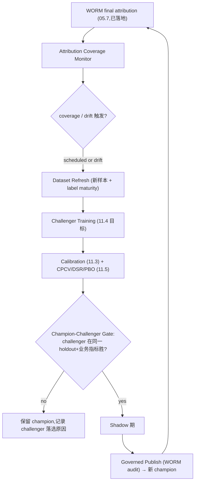

# 11.9 — Attribution Feedback & Auto-Retraining

> 关闭审计点:**#19(06.5 归因→自动再训练完全未实现;最终归因有了,但无 coverage→建集→候选→受治理
> 发布的自动回路 → 研究闭环是开环)**、**#21(factor governance 无 quality gate/shadow/WORM 审计,
> `_actor`/`_reason` 被丢弃)**。
>
> 本子phase **破坏式取代** [`phase-06/06.5`](../phase-06/06.5-attribution-feedback-and-auto-retraining.md)
> (落地时该文档标注 `SUPERSEDED by 11.9`,零 re-export、零旧 seam 命名)。
>
> **11.0 交接(必须删除临时代码):**
> - 向 v11 已冻结的 `feedback` 空段填入字段,**不 bump** schema。
> - **`FeedbackConfig` 获得首个字段后,必须删除** [`json_schema/fields.rs`](../../../../crates/quant-pivot-models/src/runtime_config/json_schema/fields.rs)
>   中 11.0 为空白段引入的临时逻辑:`walk_schema` 内 `is_empty_closed_object` 早退(约 135–141 行)、
>   `is_empty_closed_object` 辅助函数(约 164–175 行)及为其编写的单测。v11 再无空 closed object 段,
>   遗留即死代码(见 §2 删除清单)。

## 1. 目标与闭环定位

闭合系统当前唯一的**开环**:最终 WORM 归因已经写入,但没有任何东西消费它去驱动再训练。11.9 建立
`realized attribution → dataset refresh → challenger training → champion-challenger governed publish`
的自动回路,并把 factor governance 提升到与 model governance 同级(gate + shadow + WORM 审计)。

设计立场(MLOps 最佳实践):

- 自动"每次重训都上线"是危险失败模式;正确模式是 **champion-challenger**:challenger 必须在**同一
  held-out + 业务指标**上打败 champion 才能晋升,晋升用 model registry alias,渐进 shadow/canary 发布
  (<https://datarekha.com/mlops/retraining/>、
  <https://www.snowflake.com/en/developers/guides/ml-champion-challenger-model-deployment/>)。
- retraining 触发用 **scheduled + drift-triggered 组合**;区分 data drift / concept drift / label drift。
- 所有晋升决策要有审计日志(治理)。

闭环定位:11.5(验证)+ 11.3(校准)是 challenger 晋升的门禁;11.10(反事实归因)增强归因质量;
本子phase是"研究闭环"的关门人。

## 2. 删除 / 合并 / 重构清单

| 对象 | 现状 | 处置 |
|---|---|---|
| 06.5 设计(未落地) | 纸面 | **取代**:以 11.9 为权威实现契约,06.5 标 SUPERSEDED。 |
| `append_live_attribution_examples`(手动路径,`training_dataset.rs`) | 手动、丢缺证据样本 | **重构**:纳入自动 feedback pipeline;缺证据样本记录 coverage,不静默丢。 |
| `factor_governance.rs`:publish/retire 无 gate/shadow/audit,`_actor`/`_reason` 丢弃(#21) | 弱治理 | **重构**:引入 factor quality gate + shadow + WORM 审计 + runtime pointer sync,与 model governance 对齐。 |
| 无 drift 检测 / 无 champion-challenger / 无自动 retrain worker | 缺失 | **新增**(§3)。 |
| `json_schema/fields.rs` `is_empty_closed_object` 早退 + 辅助函数(11.0 临时) | `feedback` 仍空时不产 UI leaf | **删除(11.9 Blocker)**:本子phase 向 `FeedbackConfig` 加字段后,v11 再无空 closed object 段;须删除 `walk_schema` 早退块(约 135–141 行)、`is_empty_closed_object`(约 164–175 行)及关联单测;`research`/`feedback` 改由 properties 分支自然产 leaf。 |

## 3. 契约与算法设计

### 3.1 归因反馈 pipeline(#19)



### 3.2 Trait 契约

```rust
/// Turns realized attribution into a governed retraining decision. Never
/// auto-promotes: a challenger must beat the champion on the same held-out and
/// business metrics before governed publish.
pub trait AttributionFeedbackRunner {
    async fn run(&self, trigger: RetrainTrigger) -> QuantResult<FeedbackRunOutcome>;
}

pub enum RetrainTrigger {
    Scheduled { cadence: Cadence },
    DataDrift { detector: DriftKind, statistic: Decimal },   // KS / PSI 超阈值
    ConceptDrift { realized_ic_drop: Decimal },              // 实现 IC 相对回测下滑
    LabelMaturity { newly_matured: u64 },
    Manual { actor: ActorId, reason: String },
}

pub trait ChampionChallengerGate {
    /// Both models evaluated on the SAME frozen holdout + business metrics.
    fn decide(&self, champion: &ModelEval, challenger: &ModelEval) -> ChallengerDecision;
}
```

### 3.3 Drift 检测

- **data drift**:输入特征分布漂移(PSI / KS 检验,复用 11.6 parity 抽样基础设施)。
- **concept drift**:realized IC / 命中率相对回测显著下滑(用 05.7 归因的 realized 收益)。
- **label drift**:标签边际分布漂移。
- 触发只**启动 challenger 流程**,不直接上线(晋升仍需 §3.2 gate)。

### 3.4 Champion-Challenger 晋升

- challenger 与现 champion 在**同一 frozen holdout**上跑,指标包括 11.5 的 DSR/PBO + 业务指标
  (realized Sharpe、hit rate、turnover-adjusted return)。
- challenger 必须**超过 champion + 最小改进阈值**(避免噪声晋升)才进 shadow;shadow 稳定期后
  governed publish(复用既有 `ModelGovernance::publish` + shadow stability,11.5 gate)。
- 晋升/落选都写 WORM 审计(actor=system/feedback_run_id,reason=指标对比)。

### 3.5 Factor Governance 硬化(#21)

把 factor governance 提升到 model governance 同级:

```rust
/// Factor publish/retire now mirror model governance: quality gate + shadow +
/// WORM audit + runtime pointer sync. actor/reason are RECORDED, never dropped.
pub trait FactorGovernance {
    async fn publish(&self, req: PublishFactorRequest, audit: GovernanceAuditInput)
        -> QuantResult<FactorVersion>;
    async fn retire(&self, req: RetireFactorRequest, audit: GovernanceAuditInput)
        -> QuantResult<FactorVersion>;
}
```

- factor quality gate:IC 显著性(11.5)、与既有因子共线阈值(11.1)、coverage。
- factor shadow:新因子先 shadow 参与打分对比,再 publish。
- WORM 审计:actor + reason + before/after hash,写 `quant_factor_governance_audit`。
- runtime pointer sync:published factor set 指针同步到 runtime config(与 model pointer 一致)。

## 4. 新领域类型 / 表 / ClickHouse fact

- `AttributionFeedbackRunId`、`FactorGovernanceAuditId`(factor WORM 审计行;11.0 未预声明,避免死代码)、
  `FeedbackRunOutcome`、`RetrainTrigger`、`DriftKind`、`ChallengerDecision`。
- `FactorVersion` + `quant_factor_governance_audit` 表(WORM,#21)。
- CH facts:`quant_drift_event`、`quant_feedback_run_event`。
- champion/challenger 复用既有 `ModelVersion` + shadow 表。

## 5. deploy-config / schema path

`feedback` 段(schema v11 冻结的顶层 `feedback`;11.0 已预留空骨架,本子phase填字段):

```text
feedback.retrain.cadence               = weekly | daily
feedback.retrain.drift.psi_threshold   = 0.2
feedback.retrain.drift.realized_ic_drop = 0.3
feedback.champion_challenger.min_improvement = 0.05
feedback.champion_challenger.holdout_ref     = <frozen holdout id>
feedback.shadow.min_window_secs        = ...
factors.governance.require_gate        = true
factors.governance.require_shadow      = true
```

## 6. 生产不变量与失败语义

- **不自动上线**:任何 challenger 晋升必过 champion-challenger gate + shadow + governed publish;
  drift 只触发训练,不触发上线。
- **同一 holdout**:champion 与 challenger 必须同一 frozen holdout + 同一 preprocessing(11.6),否则
  比较无效 → gate 拒绝。
- **factor 治理对齐 model**:factor publish/retire 无 gate/shadow/audit → 直接拒绝(#21 fail-closed)。
- **WORM 不可变**:所有晋升/落选/factor 变更写不可变审计,actor/reason 必填(不再丢弃)。
- **coverage 不静默**:归因覆盖不足记录 coverage 指标 + 告警,不静默丢样本。

## 7. 第三方 crate 引入

- drift 统计(PSI/KS)用 `statrs`/`ndarray-stats`。
- 调度复用既有 `tokio-cron-scheduler`(feedback 作为受治理 worker,类比 05.x workers)。
- 不引入外部 MLOps 平台;registry/alias 用项目内 model registry。

## 8. 验收测试

- `challenger_not_promoted_when_not_beating_champion`(#19 安全)。
- `challenger_promoted_only_after_gate_shadow_publish`(#19)。
- `drift_trigger_starts_training_not_deploy`。
- `champion_challenger_uses_same_holdout_and_preprocessing`(11.6)。
- `factor_publish_requires_gate_shadow_audit`(#21)。
- `factor_governance_records_actor_and_reason`(#21,反面:丢弃 → 失败)。
- `attribution_coverage_gap_recorded_not_silent`。
- `runtime_config_schema_walker_emits_feedback_leaves`(11.0 临时 `is_empty_closed_object` skip 已删除;
  `build_schema_fields` / `schema_leaf_paths` 含 `feedback.*` leaf)。
- `empty_closed_object_skip_removed`(反面:11.9 落地后 `fields.rs` 仍含 `is_empty_closed_object` → 失败)。

## 9. Blocker

- 存在任何"重训即上线"的自动路径(无 champion-challenger)。
- factor publish 仍无 gate/shadow/audit / 仍丢弃 actor/reason。
- champion/challenger 用不同 holdout 比较。
- **`json_schema/fields.rs` 仍保留 `is_empty_closed_object` 跳过逻辑**(11.0 临时代码未删)。

## 10. 延后 / 缺口

- 完整 A/B live 流量分配(canary 真金白银)在有多副本部署后(Phase 8+);首版用 shadow + 渐进。
- 自动 factor 发现(auto factor mining)不在本 Phase。
- 回指审计点:#19、#21 在此闭合。
