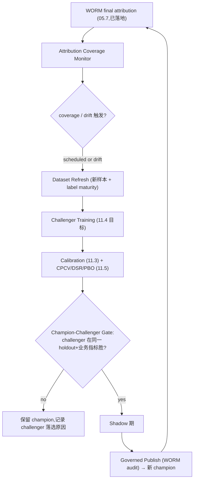

# 11.9 — Attribution Feedback、Profile Expansion 与 Auto-Retraining

> 状态：**设计冻结，尚未实施**。当前仓库是 runtime config **v14**、feature schema **v6**、
> dataset/model artifact v5、Trade Policy v4、Evidence Bundle v2、`FeedbackConfig {}`；
> `json_schema/fields.rs` 的 empty-closed-object 临时处理仍按设计保留。只有 11.9 真正加入首批 feedback
> 字段时才升级 runtime config v14→v15 并删除该临时代码；不得把未来 wire contract 写成当前状态，也不得
> 顺带虚构 feature v7 或 artifact v6。
>
> 关闭审计点:**#19(06.5 归因→自动再训练完全未实现;最终归因有了,但无 coverage→建集→候选→受治理
> 发布的自动回路 → 研究闭环是开环)**、**#21(factor governance 无 quality gate/shadow/WORM 审计,
> `_actor`/`_reason` 被丢弃)**。
>
> 本子phase **破坏式取代** [`phase-06/06.5`](../phase-06/06.5-attribution-feedback-and-auto-retraining.md)
> (落地时该文档标注 `SUPERSEDED by 11.9`,零 re-export、零旧 seam 命名)。
>
> **11.6 / 11.0 交接（必须删除临时代码）：**
> - 当前代码基线是 runtime config **v14**；本子phase 向 `feedback` 空段加入第一批真实字段时升级为
>   **v15**。不得静默改写 v14，也不得回退到旧版本迁移叙述。
> - 11.6 只负责同一证据的确定性 parity；本期只负责跨时间分布/效果 drift。drift 不能覆盖、降级或
>   清除 parity latch。
> - **`FeedbackConfig` 获得首个字段后,必须删除** [`json_schema/fields.rs`](../../../../crates/quant-pivot-models/src/runtime_config/json_schema/fields.rs)
>   中为空白段引入的临时逻辑：`walk_schema` 内 `is_empty_closed_object` 早退、
>   `is_empty_closed_object` 辅助函数及关联单测。v15 再无空 closed object 段，
>   遗留即死代码(见 §2 删除清单)。
> - 本文件是 11.9 的唯一权威实施设计；不存在独立 `implementation-plan`，不得链接另一份会漂移的 todo。

## 1. 目标与闭环定位

闭合系统当前唯一的**开环**:最终 WORM 归因已经写入,但没有任何东西消费它去驱动再训练。11.9 建立
`realized attribution → sim-vs-live queue/slippage calibration → dataset refresh → challenger training →
champion-challenger governed publish` 的自动回路，并把 opportunistic-sell shadow/live attribution 与
factor governance 提升到 model governance 同级（gate + shadow + WORM 审计）。同时承接 11.7.2 明确
延后的 crypto/new-profile 注册、跨 profile winner 比较和资金分配。

设计立场(MLOps 最佳实践):

- 自动"每次重训都上线"是危险失败模式；正确模式是 **champion-challenger**：challenger 必须在
  **同一 held-out + 业务指标**上打败 champion，经过 shadow/canary 与治理审批后才更新 champion pointer；
  自动重训从不等于自动发布。
- retraining 触发用 **scheduled + drift-triggered 组合**;区分 data drift / concept drift / label drift。
- 所有晋升决策要有审计日志(治理)。

闭环定位：11.5（验证）+ 11.3（校准）是 challenger 晋升门禁；11.6 提供 frozen dataset/transform、
immutable factor revision、serving evidence 与 parity latch；11.10 增强反事实归因。本子phase 是研究闭环
的关门人，但不得重新实现 11.6 的 PIT、转换或确定性重放。

## 2. 删除 / 合并 / 重构清单

| 对象 | 现状 | 处置 |
|---|---|---|
| 06.5 设计(未落地) | 纸面 | **取代**:以 11.9 为权威实现契约,06.5 标 SUPERSEDED。 |
| `append_live_attribution_examples`(手动路径,`training_dataset.rs`) | 手动、丢缺证据样本 | **重构**:纳入自动 feedback pipeline;缺证据样本记录 coverage,不静默丢。 |
| `factor_governance.rs`:publish/retire 无 gate/shadow/audit,`_actor`/`_reason` 丢弃(#21) | 弱治理 | **重构**:引入 factor quality gate + shadow + WORM 审计 + runtime pointer sync,与 model governance 对齐。 |
| 无 drift 检测 / 无 champion-challenger / 无自动 retrain worker | 缺失 | **新增**(§3)。 |
| `json_schema/fields.rs` `is_empty_closed_object` 早退 + 辅助函数(11.0 临时) | `feedback` 仍空时不产 UI leaf | **删除(11.9 Blocker)**:本子phase 向 `FeedbackConfig` 加字段后,v15 再无空 closed object 段;须删除 `walk_schema` 早退块(约 135–141 行)、`is_empty_closed_object`(约 164–175 行)及关联单测;`research`/`feedback` 改由 properties 分支自然产 leaf。 |
| 重新实现 parity sampler / feature transform / PIT resolver | 与 11.6 重复并可能再次 skew | **禁止**：只读 11.6 facts、frozen artifacts、run/state；drift 产出独立事件与触发决策。 |
| 可变 Research Program/Profile CRUD | 与 11.7.2 不可变 profile 和 program hash 重复 | **禁止**：新 profile 以新的 immutable ID/version/content hash 注册；program 继续由 profile/track/candidates 计算。 |
| profile 内选择与跨 profile 资金分配共用一套 multiple-testing gate | 重复惩罚不相交画像或漏掉同次资金决策的数据窥探 | **拆分**：单 profile 继续用其 trial-family DSR/PBO；同一次治理决策跨 profile 选 winner/分配资金时才使用 Romano–Wolf stepdown。 |

## 3. 契约与算法设计

### 3.1 归因反馈 pipeline(#19)



### 3.2 Trait 契约

```rust
/// Turns realized attribution into a governed retraining decision. Never
/// auto-promotes: a challenger must beat the champion on the same held-out and
/// business metrics before governed publish.
pub trait AttributionFeedbackRunner {
    async fn run(&self, trigger: RetrainTrigger) -> QuantResult<FeedbackRunOutcome>;
}

pub enum RetrainTrigger {
    Scheduled { cadence: Cadence },
    DataDrift { detector: DriftKind, statistic: Decimal },   // KS / PSI 超阈值
    ConceptDrift { realized_ic_drop: Decimal },              // 实现 IC 相对回测下滑
    LabelMaturity { newly_matured: u64 },
    Manual { actor: ActorId, reason: String },
}

pub trait ChampionChallengerGate {
    /// Both models evaluated on the SAME frozen holdout + business metrics.
    fn decide(&self, champion: &ModelEval, challenger: &ModelEval) -> ChallengerDecision;
}
```

### 3.3 Drift 检测（与确定性 parity 严格分离）

- **data drift**：对 11.6 保存的 serving FeatureCell / encoded input 与 frozen training reference 做 PSI / KS；
  复用事实和样本标识，不复用 parity mismatch 判定。
- **concept drift**:realized IC / 命中率相对回测显著下滑(用 05.7 归因的 realized 收益)。
- **label drift**:标签边际分布漂移。
- 触发只**启动 challenger 流程**,不直接上线(晋升仍需 §3.2 gate)。
- 11.6 parity latch 打开时，允许继续收集 evidence、成熟 label 与训练 challenger，但禁止 publish、报告和
  新入场；任何 drift run 都无权 acknowledge latch。

### 3.4 Champion-Challenger 晋升

- challenger 与现 champion 在**同一 frozen holdout**上跑,指标包括 11.5 的 DSR/PBO + 业务指标
  (realized Sharpe、hit rate、turnover-adjusted return)。
- challenger 必须**超过 champion + 最小改进阈值**(避免噪声晋升)才进 shadow;shadow 稳定期后
  governed publish(复用既有 `ModelGovernance::publish` + shadow stability,11.5 gate)。
- 晋升/落选都写 WORM 审计(actor=system/feedback_run_id,reason=指标对比)。

### 3.5 Factor Governance 硬化(#21)

把 factor governance 提升到 model governance 同级:

```rust
/// Factor publish/retire now mirror model governance: quality gate + shadow +
/// WORM audit + runtime pointer sync. actor/reason are RECORDED, never dropped.
pub trait FactorGovernance {
    async fn publish(&self, req: PublishFactorRequest, audit: GovernanceAuditInput)
        -> QuantResult<FactorVersion>;
    async fn retire(&self, req: RetireFactorRequest, audit: GovernanceAuditInput)
        -> QuantResult<FactorVersion>;
}
```

- factor quality gate:IC 显著性(11.5)、与既有因子共线阈值(11.1)、coverage。
- 治理对象是 11.6 建立的 content-addressed immutable factor revision；禁止覆盖已发布 definition row，
  禁止一个 revision ID 对应多份 definition/input schema。
- factor shadow:新因子先 shadow 参与打分对比,再 publish。
- WORM 审计:actor + reason + before/after hash,写 `quant_factor_governance_audit`。
- runtime pointer sync:published factor set 指针同步到 runtime config(与 model pointer 一致)。

### 3.6 Profile expansion 与跨 profile allocation

- 新 profile 只有在 PIT source、availability、resolution、execution cost、唯一 target horizon、fit span、
  purge/embargo、quality gate 和 activation eligibility 全部实现后才可注册；禁止先放 enum/config 占位。
- 首个 expansion 是 crypto，但必须以自己的 market selector、decision clock、settlement source 和完整
  `ResearchProfileRef` 新版本落地；不得复用 Weather 或 pooled 系数。
- 单 profile winner 仍由该 profile 预声明 experiment family 的 CPCV/DSR/PBO 选择；不在 11.7.2 之上
  重复施加 program-wide Romano–Wolf。
- 当同一 governance decision 同时比较多个 profile winner 或决定共享资金权重时，冻结完整 candidate
  family、共同 decision cutoff 和 hypothesis ledger，并执行 Romano–Wolf stepdown；失败的 profile 不得
  静默从 family 中删除。
- 跨 profile allocation 输出不可变 `ProfileAllocationArtifact`，串联 winner policy、evidence、adjusted
  p-value、cash-budget ceiling、capital reservation 和治理 actor/reason。它只影响 Report/SemiAuto 资金，
  不授予 AutoExecution。

## 4. 新领域类型 / 表 / ClickHouse fact

- `AttributionFeedbackRunId`、`FactorGovernanceAuditId`(factor WORM 审计行;11.0 未预声明,避免死代码)、
  `FeedbackRunOutcome`、`RetrainTrigger`、`DriftKind`、`ChallengerDecision`、
  `ProfileAllocationArtifact`、`CrossProfileHypothesisLedger`。
- `FactorVersion` + `quant_factor_governance_audit` 表(WORM,#21)。
- CH facts:`quant_drift_event`、`quant_feedback_run_event`；读取但不复制 11.6 的
  `quant_feature_event` / `quant_model_input_event` / `quant_feature_parity_event`。
- champion/challenger 复用既有 `ModelVersion` + shadow 表。

## 5. deploy-config / schema path

`feedback` 段（**未来实施目标，不是当前可用配置**；11.7.2 冻结 v14 基线后，本子phase
**v14 → v15**，11.0 预留的空骨架在这里第一次获得真实字段）：

```text
feedback.retrain.cadence               = weekly | daily
feedback.retrain.drift.psi_threshold   = 0.2
feedback.retrain.drift.realized_ic_drop = 0.3
feedback.champion_challenger.min_improvement = 0.05
feedback.champion_challenger.holdout_ref     = <frozen holdout id>
feedback.shadow.min_window_secs        = ...
feedback.execution_calibration.queue_error_gate = ...
feedback.execution_calibration.slippage_error_bps = ...
feedback.opportunistic_sell.require_shadow_live_attribution = true
feedback.profile_allocation.require_romano_wolf_for_multi_profile = true
feedback.profile_allocation.family_cutoff_policy = frozen_decision_cutoff
factors.governance.require_gate        = true
factors.governance.require_shadow      = true
```

该 bump 只描述 runtime-config wire `v14 → v15`。11.9 直接复用 feature v6、dataset/model artifact v5、
Trade Policy v4、Evidence v2、
PIT facts 与 parity latch；除非届时另有经过迁移与 loader fail-closed 设计的真实序列化语义变更，不得在
本期文档或实现中擅自宣称 feature v7 / artifact v6。

## 6. 生产不变量与失败语义

- **不自动上线**:任何 challenger 晋升必过 champion-challenger gate + shadow + governed publish;
  drift 只触发训练,不触发上线。
- **同一 holdout**:champion 与 challenger 必须同一 frozen holdout + 同一 preprocessing(11.6),否则
  比较无效 → gate 拒绝。
- **parity 先于晋升**：model publish 前的 11.6 full dataset/model parity 必须通过且 latch closed；drift
  检测或 challenger 胜出均不能绕过。
- **factor 治理对齐 model**:factor publish/retire 无 gate/shadow/audit → 直接拒绝(#21 fail-closed)。
- **WORM 不可变**:所有晋升/落选/factor 变更写不可变审计,actor/reason 必填(不再丢弃)。
- **coverage 不静默**:归因覆盖不足记录 coverage 指标 + 告警,不静默丢样本。

## 7. 第三方 crate 引入

- drift 统计(PSI/KS)用 `statrs`/`ndarray-stats`。
- 调度复用既有 `tokio-cron-scheduler`(feedback 作为受治理 worker,类比 05.x workers)。
- 不引入外部 MLOps 平台;registry/alias 用项目内 model registry。

## 8. 验收测试

- `challenger_not_promoted_when_not_beating_champion`(#19 安全)。
- `challenger_promoted_only_after_gate_shadow_publish`(#19)。
- `drift_trigger_starts_training_not_deploy`。
- `deterministic_parity_mismatch_is_not_classified_as_data_drift`。
- `drift_run_cannot_acknowledge_or_bypass_parity_latch`。
- `champion_challenger_uses_same_holdout_and_preprocessing`(11.6)。
- `factor_publish_requires_gate_shadow_audit`(#21)。
- `factor_governance_records_actor_and_reason`(#21,反面:丢弃 → 失败)。
- `attribution_coverage_gap_recorded_not_silent`。
- `single_profile_does_not_apply_program_wide_romano_wolf`。
- `multi_profile_allocation_freezes_complete_family_and_stepdown_results`。
- `profile_registration_requires_complete_pit_resolution_cost_horizon_contract`。
- `runtime_config_schema_walker_emits_feedback_leaves`(11.0 临时 `is_empty_closed_object` skip 已删除;
  `build_schema_fields` / `schema_leaf_paths` 含 `feedback.*` leaf)。
- `empty_closed_object_skip_removed`(反面:11.9 落地后 `fields.rs` 仍含 `is_empty_closed_object` → 失败)。

## 9. Blocker

- 存在任何"重训即上线"的自动路径(无 champion-challenger)。
- factor publish 仍无 gate/shadow/audit / 仍丢弃 actor/reason。
- champion/challenger 用不同 holdout 比较。
- 重新实现 feature/PIT/transform/parity 逻辑，或 drift worker 可以清除/绕过 11.6 parity latch。
- 11.6/11.7.2 尚无真实维护窗口、Source Slice restore、ReportOnly shadow 或最新环境门禁证据，却激活
  v15 feedback worker、注册可激活 profile 或分配跨 profile 资金。
- **`json_schema/fields.rs` 仍保留 `is_empty_closed_object` 跳过逻辑**(11.0 临时代码未删)。
- 未冻结完整 cross-profile hypothesis family 就执行 winner selection，或把单 profile 重复施加
  Romano–Wolf 后的结果冒充更安全。

## 10. 延后 / 缺口

- 完整 A/B live 流量分配(canary 真金白银)在有多副本部署后(Phase 8+);首版用 shadow + 渐进。
- 自动 factor 发现(auto factor mining)不在本 Phase。
- 本期启动前，11.6 必须已关闭确定性 replay、FeatureCell/encoded input 证据与锁闸；11.9 只增加
  PSI/KS、next-day/live distribution drift、concept/label drift、calibration、champion-challenger 和自动再训练。
- 当前 11.6 的 W4 代码/页面目标面已有实现，但最终合并态全量门禁尚待重跑；W5 运维切换与
  Docker/loopback/PG/CH 环境型集成验收尚未关闭，因此
  本文件所有 v15 key、worker、表和 API 均仍是待实现契约，不能作为当前生产能力或迁移已完成的证据。
- 回指审计点:#19、#21 在此闭合。

Romano–Wolf 设计依据：[Stepwise Multiple Testing as Formalized Data Snooping](https://statistics.stanford.edu/technical-reports/stepwise-multiple-testing-formalized-data-snooping)。
