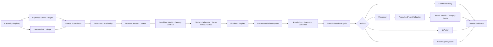

# 11.9 — Crypto / Weather 双垂直、Attribution Feedback 与 Auto-Retraining

<!-- quant-pivot-deployment-contract:v1 -->
> **Deployment contract**
> - `fresh_boot_assumption`: 项目尚未正式生产上线，从全新 boot/schema version 1 部署。
> - `schema_data_version_impact`: 不迁移测试数据、旧结构或旧 artifact；不保留兼容 parser、alias、双读或 re-export。
> - `pre_deployment_behavior`: clean-break 与 fresh bootstrap 合法，但任何环境写入、DDL 或数据销毁都需要操作者明确授权。
> - `post_deployment_behavior`: 首次部署后恢复正常前向 migration、备份、验证与显式回滚纪律。

> 状态：**Phase 11.9 Implementation Closure 已完成，W4-E01..E11 均 DONE；Crypto/Weather Operational Activation 保持 blocked，未宣称真实资金、current Published route 或 24h/多日 shadow。**
>
> 最后更新：2026-07-30
>
> 关闭审计点：#19（归因结果未进入再训练闭环）、#21（factor/model 晋升缺少 gate、shadow 与 WORM audit）。
>
> 本文是 Phase 11.9 当前唯一权威合同。实施期间 4,800+ 行 append-only 恢复、失败与命令流水已迁移到
> [历史实施归档](11.9-implementation-history-2026-07-30.md)，归档不再承载当前状态。

## 0. 当前检查点

- `baseline_branch`: `quant-pivot`
- `baseline_head`: `7dd39fd884b4621c02e8595667aaabb0621f390e`
- `working_tree_summary`: W4-E01..E11 production、system-test、Web、UI 与终态文档改动已闭合；root/UI status 输出行分别为 `55/35`，HEAD 分别保持 `7dd39fd884b4621c02e8595667aaabb0621f390e` / `452b23300e5f8d832034924e57f16fe221bbf405`，index clean，dependency manifests/lockfiles 零 diff，8088/6099 无 owned listener，preexisting Vite 5999 PID 24240 未触碰
- `current_task_id`: `none`
- `current_task_objective`: W4 stop boundary；仅保留 operator-owned Operational Activation 恢复条件，不启动后续 Phase
- `dependency_status`: `W4-E01..E11=DONE；全部前置与 final evidence 闭合`
- `changed_paths`: canonical outcome/feedback/promotion owners、fresh production/system-test evidence、Web auth/WS、UI authoritative read/feedback/dashboard/domain/model/design-token/Playwright、本文与 Phase 11 索引；历史流水仅迁移到同目录只读归档
- `last_passed_command`: post-closure `cargo fmt --all -- --check`、root/UI `git diff --check`、`cargo xtask architecture check` 与 final document/artifact/Git/process audit PASS；此前 full Rust/UI、two fresh production stacks、two protected Chromium 15/15 与 288/288 manual pixel review 已闭合
- `last_failed_command_and_root_cause`: 无未解释 current failure；历史非零命令及后续同范围或更大范围 PASS 保留在只读归档，最近业务缺陷为 Ant primary hover 3.674:1，对 canonical Button interaction token 修复后两轮 15/15
- `evidence_artifacts_and_hashes`: E07/E08/E09 manifests 与 final Chromium run 1/run 2/contact-sheet hashes 见 §9；完整逐命令证据见历史归档 §12
- `active_long_running_command`: none
- `exact_resume_command`: `cargo fmt --all -- --check && git diff --check && git -C ui diff --check && cargo xtask architecture check`
- `next_single_action`: none；W4 已关闭，后续只在操作者明确授权并提供 current 环境后恢复 Operational Activation
- `updated_at`: `2026-07-30T10:32:39+08:00`

## 1. 最终结论与范围

Phase 11.9 有两个不能混淆的结论：

| 结论 | 当前状态 | 判定依据 |
|---|---|---|
| `Implementation Closure` | `DONE`；W4-E01..E11 已完成 | 软件合同、数据闭环、治理、REST/WS/UI、fresh stack、完整工程门禁、像素验收与终态文档 |
| `Operational Activation` | `BLOCKED` | current PG/CH truth、真实成熟标签、activation-eligible profile、统计门禁、真实 shadow/replay、permit 与 serving route |

本期已经实现：

1. Crypto/Weather expected-source、deterministic linkage、PIT facts、typed readiness 与 fail-closed blocker。
2. Resolution outcome、execution outcome、三个互斥 cohort 与 point-in-time sealed Dataset。
3. Durable `FeedbackCycle`、drift/signal/learning/shadow stages 与四个确定性决策终态。
4. Immutable `ModelServingContract`、`PromotionPermit`、model + category route 原子晋升及 WORM evidence。
5. Protected REST/WS、revision replay、RBAC、single-flight/stale suppression、fallback/reconnect 和完整 UI。
6. 两套 fresh production stack、两轮独立 protected Chromium、四视口双主题、Axe 与 288/288 人工像素验收。

本期没有宣称：

- current Crypto/Weather 已 Published 或可承载真实资金；
- current PostgreSQL/ClickHouse 数据与 schema 已由本次代理写入或迁移；
- Crypto `ResearchOnly` profile 已被原地改成 activation eligible；
- Weather 八族已达到真实成熟标签门槛；
- 24 小时或多日真实 ReportOnly shadow 已完成；
- SemiAuto/AutoExecution、capital allocation 或 signing/funder authority 被扩大。

## 2. 业务闭环

关键顺序是 expected-before-observed、PIT-before-training、same-window-before-promotion、
permit-before-route。任何一步缺失都输出 typed blocker，不填 0、不继承历史 PASS、不构造 synthetic
Published。

## 3. 领域合同终态

### 3.1 Source / market 终态

| 终态 | 语义 |
|---|---|
| `Supported` | source binding、parser、PIT、feature、label、profile 与 serving gate 完整 |
| `CredentialBlocked` | 能力完整但官方源凭证缺失；记录受影响 profile，不进入 serving |
| `InsufficientEvidence` | 已摄取和评估真实数据，但样本或效果不足 |
| `Excluded` | 确定性不属于支持合同；必须有稳定 reason code |

`generic unresolved` 不合法。识别到 family 但 parser 缺失时必须进入
`UnsupportedTemplate(RecognizedWeatherFamilyParserUnavailable)`，并绑定 metadata、resolver 与
capability-registry hash。

### 3.2 Feedback decision 终态

| 终态 | 可变更 model/route | 必需证据 |
|---|---:|---|
| `NoAction` | 否 | frozen inputs + decision reason + WORM artifact |
| `ChallengerRejected` | 否 | same-window comparison + multiple-testing/gate failure |
| `CandidateReady` | 否 | 全部研究 gate 通过，但无有效 permit 或尚未执行 promotion |
| `Promoted` | 是，仅原子事务 | valid permit + exact scope/hash + model/route atomic commit + WORM diff |

四态 exact replay 不新增 row、不改变 earliest availability，不修改 Trade Policy、runtime mode、
execution authority、capital allocation、parity 或 deployment authority。

## 4. 实现终态

### 4.1 Outcome、cohort 与 Dataset

- Resolution 与 execution 是两个正交 WORM outcome；未提交、未成交与 nullable economics 保留真实语义。
- Complete backfill 由 PostgreSQL cutoff 冻结 candidate universe，并用 keyset 排空；周期性 pass 使用
  bounded fairness，永久 deferred 首项不会饿死后续 ready truth。
- Resolution 缺 canonical PIT fact 时 typed deferred；execution 只接受 actually-submitted terminal graph。
- Cohort 严格分为 signal、learning、shadow，禁止跨 cohort 复用可见性或标签。
- Dataset 只消费 cutoff 内 canonical truth，manifest/bytes/content hash 同时封存。

### 4.2 FeedbackCycle 与统计治理

- Cycle 以 durable DB state、lease、retry/backoff 与 WORM stage evidence 为 authority；process-local wake
  只缩短延迟，不是 durable truth。
- Champion/challenger 使用相同 sealed window、cost、policy 与 transform；CPCV、DSR、PBO、coverage、
  calibration、multiple testing 与 shadow gates 均 fail closed。
- `ResearchOnly` 是 immutable profile contract，不得通过 UI 或 runtime config 原地升级。

### 4.3 PromotionPermit 与原子晋升

- Permit 绑定 candidate/model/serving/category route、完整 gate snapshot、actor/reason、absolute expiry
  与 base revision。
- Issue/revoke/replay 逐字段验证，不只相信 hash 或 unique violation。
- Promotion 在一个 PostgreSQL transaction 内锁定 permit、model generation 与 category route；冲突、
  stale、expired、revoked 或 scope drift 全部 typed reject。
- WORM evidence 保存 before/after invariant diff；任何受保护 execution/capital field 改变都回滚整笔事务。

### 4.4 REST、WebSocket 与 UI

- REST 只暴露 server-owned validated Request/Query 与 `*View`；admin mutation 需要真实 RBAC、actor、reason、
  revision/CAS，不存在 UI-only authorization。
- WS 使用 single-use ticket、durable revision replay 与 bounded slow-client recovery；Redis outage/state
  loss 后旧 access/refresh/ticket fail closed，新登录才能重建 session authority。
- Dashboard/Feedback 共用一个 `AuthoritativeReadCoordinator`：physical single-flight、one trailing read、
  stale-generation suppression、route-leave/window abort、healthy WS no-polling 与 bounded fallback。
- UI 的 Domain Sources、Feedback、Model detail 与 quality gates 显示 typed unknown/blocked，不把 missing
  cursor、facts、labels 或 readiness 显示为 0。

## 5. 删除、合并与唯一所有权

本期已清除或合并：

- 删除旧单态 terminal helper，统一为 owner-aware terminal contracts。
- 删除 Dashboard 专用 refresh coordinator，所有 authoritative reads 归并到 shared owner。
- 删除被 W4 race matrix 完整覆盖的 31 秒 sleep browser spec 与旧 W3 screenshot spec。
- Redis restart 证据拆回正确边界：infra 验证 pool/cache，production HTTP/WS 验证 auth/session。
- Local icon 只从既有 locked assets 生成，未知 server icon fail closed；不新增 provider fallback 或依赖。
- Model decision、promotion、readiness 均复用 production owner；test harness 只封装证据，不复制算法。
- 零 compatibility wrapper、deprecated alias、forwarding re-export、dual read/write、legacy parser、
  lint suppression 或第二 ledger truth。

## 6. Operational Activation 阻塞与恢复

### 6.1 当前阻塞

| 范围 | 当前 verdict | 精确阻塞 |
|---|---|---|
| PostgreSQL | blocked before current read | bootstrap identity 与 immutable deploy manifest 不匹配 |
| ClickHouse | blocked before current read | 目标 database/schema 不可用 |
| Crypto | `Implementation Closed / Publication Blocked / Operational Activation Blocked` | immutable v2 profile=`ResearchOnly`；19/19 current gates blocked |
| Weather | `Implementation Closed / Operational Activation Blocked` | 八族均 `MatureLabelsUnavailable`；current facts/labels 为 null |
| Shadow/funding | not claimed | 无 current Published route、真实资金、24h 或多日 shadow 完成证据 |

Weather 的 Daily Temperature parser 已实现；Precipitation、AQI、Tornado、Tropical Cyclone、
Global Temperature、Sea Ice、Wind Extreme 七族即使未来各自达到 500 个真实成熟标签，仍需通过显式
parser gate，不能长期用 `MatureLabelsUnavailable` 掩盖 parser 技术债。

### 6.2 唯一恢复顺序

1. 操作者确认目标环境、备份与变更窗口，执行授权的 PG/CH plan/apply/verify；本期没有代替操作者执行。
2. 用 authenticated current reads 生成新的 source/fact/outcome/label truth，不继承本地 fixture 或历史计数。
3. 为 Crypto 创建新的 governed activation-eligible immutable profile version，不原地修改 v2。
4. 按 Crypto profile 和 Weather family 分别累积 mature labels，重跑 parser、coverage、CPCV、
   calibration、same-window 与 multiple-testing gates。
5. 执行真实 24h/多日 ReportOnly shadow/replay，验证 drift、latency、route 与 rollback。
6. 签发 scoped `PromotionPermit`，原子晋升并验证 Published generation、category route 与 WORM diff。
7. 只有以上 current evidence 全部通过，才能单独宣称对应 profile/family Operational Activation。

## 7. 安全与生产不变量

1. Missing credentials、schema、source、label、artifact、permit 或 route 一律 deny。
2. 金额、价格、份额继续使用 Decimal newtypes，不用 `f64`。
3. Private key、funder、capital allocation 与 runtime execution mode 不进入自动模型晋升写集。
4. 日志、artifact 与截图不记录 secret；JWT/refresh/WS ticket 失效语义由服务端持久 authority 决定。
5. 所有队列、replay、poll 与 reconnect 都有 bounded backpressure、timeout、cancellation 与 drain。
6. Current readiness 只认 exact artifact path + content/hash + current environment identity；同 basename
   历史文件不是 authority。

## 8. 验收结果

| Gate | Final-current 结果 |
|---|---|
| Rust | `cargo test --workspace` PASS；strict Clippy zero warnings；function audit `0 hard / 623 review`；architecture PASS |
| UI | format/lint/type/CSpell/structure/API generation PASS；Vitest 93 files / 581 tests；build 18/18、10,213 modules |
| Production stack | 两套独立 fresh PG/CH/Redis/object-store/real binary 环境完成 protected REST/WS、RBAC、WORM、restart 与 teardown |
| Browser | protected Chromium run 1=15/15，run 2=15/15；每轮 144 unique state/theme/viewport combinations |
| A11y/interaction | zero automated findings；Axe critical/serious=0；keyboard/touch/live-region/theme/overflow contracts PASS |
| Pixel | 18 states × 4 viewports × 2 themes × 2 runs = 288/288 人工复核 PASS |
| Hard constraints | root/UI dependency manifests 与 lockfiles零diff；indexes clean；PG/CH schema hashes不变；8088/6099 teardown clean；Vite 5999 preserved |

首次 final-current browser run 暴露 primary hover 对比度 3.674:1；修复 canonical Button mode-aware
interaction token 后，两轮完整 suite 与 288-view 证据全部重新生成。没有禁用 Axe、扩大 allowlist、
局部硬编码页面颜色或沿用修复前截图。

## 9. 权威证据索引

### 9.1 Readiness manifests

| 范围 | Canonical artifact | SHA-256 |
|---|---|---|
| Outcome backfill | `target/phase-11.9/w4-e07-final-20260729T185852Z/outcome-backfill-evidence-v3.json` | `a508796161bf4daf764dd48e3ace83ef146843fc71a39c8842f4cb8cf7bbdab5` |
| Crypto readiness | `target/phase-11.9/w4-e08-final-20260729T194024Z/crypto-readiness-evidence-v1.json` | `a4f9e97c6cdbd65c372cca270996a8ab6bf188c462c9dbaa1b06ba05daf6b181` |
| Weather readiness | `target/phase-11.9/w4-e09-final-20260729T202500Z/weather-readiness-evidence-v1.json` | `2de9b8af38f82e30b7a26f59d12b923d80cfe16f664df80191298a2c97dbdaeb` |

### 9.2 Final visual evidence

| Evidence | SHA-256 |
|---|---|
| Run 1 screenshot aggregate | `e2599a0344d21c79ee2c16e28cd143e92c85e0787bf58a0913a2f071e5a3dcbb` |
| Run 1 final manifest | `2dc4d38ee94b1fdc13bc48cf69440e8c57ca4625c3e0b91213a04fbe6157b764` |
| Run 2 screenshot aggregate | `7606d9c3bb8374b558130aa7a4b83bced09fef9db915dc7ac04fe7e1e351192e` |
| Run 2 final manifest | `ba7ea5955a30cdef199b613b4461da245722f5cd84721eab9ab4b595bf88e667` |
| 18 contact sheets aggregate | `4546c20d52b0bab638e85258f042c1ffde811a44ae92d5347dcd5be1e69e815d` |

### 9.3 Schema identity

| Manifest | SHA-256 |
|---|---|
| PostgreSQL semantic | `f447785567b7cbd0ba02d2268250698e8455acb9e9939877462f7e3592130906` |
| PostgreSQL migration | `584b4af166f3eb1438061b9ccbfc667f342c3e6430cd0856b426c1389546dcf8` |
| ClickHouse | `5c9bda029e274b99f4352aa3c24ca2c370591f12ba829361fee1f8f15e6aec6f` |

### 9.4 历史失败链闭合

归档包含完整 append-only discovery chain。按 177 个 unique evidence item 的最后结果审计，只有 16 个
历史 label 以 `FAIL` 结尾；它们不是 current blocker，均已被任务终态和后续更大范围门禁覆盖：

| Historical labels | Final resolution |
|---|---|
| `W0-04`；`W1-01/W1-04/W1-05/W1-06/W1-07/W1-10/W1-10b/W1-10b2/W1-11/W1-12` 的单项或组合 label | 对应 task 全部 `DONE`；fresh boot、manifest/schema、full workspace、strict Clippy、function/architecture 与 W4-E10 current-byte gates 全部 PASS |
| `W2-S02 / integrated S03-S04` | W2-S02..S04 均 `DONE`；serving contract integration、all-target strict Clippy 与 architecture PASS |
| `W2-S05`、`W2-S06` | 原结果本身记录 `FAIL→PASS` discovery chain；两项均 `DONE`，最终 strict Clippy/function/architecture PASS |
| `W4-E06` atomic transition patch context | 补丁未产生部分状态；后续原子 transition、E06 final gates、两轮15/15 Chromium与288/288 pixel均PASS |

因此不存在“最后一个失败被删除或忽略”的 current 项；原始 FAIL 文本继续保留在归档，canonical 文档只保留
解释关系与 final authority。

完整命令、失败发现、恢复动作、每项 targeted/full gate 与历史 artifact hash 只见
[历史实施归档 §12](11.9-implementation-history-2026-07-30.md#12-evidence-ledger)。归档中的 FAIL
是 append-only 发现链，不是 current failure；最终审计要求每条均有后续同范围或更大范围 PASS。

## 10. 完成与 Blocker 口径

`Implementation Closure` 要求 §11 全部 `DONE/SUPERSEDED`、§12 有 final PASS、完整工程门禁与四态
decision/REST/WS/UI/production-stack 证据闭合。

`Operational Activation` 按 profile/family 独立判定，必须消费 current 环境真实证据。Fixture、disposable
stack、历史 artifact、空值填 0 或 synthetic labels 都不能满足激活条件。

当前结论：

- Phase 11.9 Implementation Closure 已完成；
- Crypto Operational Activation blocked；
- Weather Operational Activation blocked；
- 无真实资金、current Published route 或 24h/多日 shadow 完成声明。

## 11. Implementation Ledger

> 当前表只保留最终 closure workstreams；被取代的 100+ 个实施微任务、依赖转账与失败恢复保存在
> [只读历史归档](11.9-implementation-history-2026-07-30.md#11-implementation-ledger)，不再作为第二进度真相。

| ID | 状态 | 依赖 | 任务 | Final evidence |
|---|---|---|---|---|
| W4-E01 | DONE | 无 | fresh-boot schema/manifest、deletion 与 absence contracts | PG/CH verify + canonical removal scan |
| W4-E02 | DONE | W4-E01 | backend outcome/cohort/fault matrix | models/migration/repository/core/web full gates |
| W4-E03 | DONE | W4-E02 | protected REST/WS、RBAC、revision、restart | real binary + Redis loss + Chromium |
| W4-E04 | DONE | W4-E02 | 四个 deterministic decision 终态 | exact IDs/hashes/invariant diff/replay/restart/rollback |
| W4-E05 | DONE | W4-E03 | Dashboard/Feedback race 与 transport lifecycle | fresh-stack request/active/abort/fallback/recovery counters |
| W4-E06 | DONE | W4-E03,W4-E05 | responsive/a11y/interaction visual closure | 144-state initial matrix + strict current-byte gates |
| W4-E07 | DONE | W4-E02 | current outcome backfill verdict | canonical v3 manifest + fairness/PIT/WORM/replay |
| W4-E08 | DONE | W4-E07 | Crypto current readiness verdict | v1 manifest；19/19 typed blocked |
| W4-E09 | DONE | W4-E07 | Weather per-family readiness verdict | v1 manifest；8/8 MatureLabelsUnavailable |
| W4-E10 | DONE | W4-E02,W4-E03,W4-E04,W4-E05,W4-E06,W4-E07,W4-E08,W4-E09 | full quality、dead/duplicate/compatibility 与 pixel exit | workspace/UI/two stacks/two Chromium/288 pixels |
| W4-E11 | DONE | W4-E10 | canonical doc compaction、README、ledger 与 final declaration | link/state/failure-chain/post-closure gates |

## 12. Evidence Ledger

| 日期 | Item | 结果 | Final-current evidence |
|---|---|---|---|
| 2026-07-30 | W4-E01 | PASS | Fresh PG/CH manifest identity、removed-table absence、canonical deletion scanner 与 architecture gate PASS；未执行未授权 current schema mutation。 |
| 2026-07-30 | W4-E02 | PASS | Real disposable PG/CH/Redis/object store覆盖 payout 0/0.5/1+、ReportOnly Dataset、coverage/drift/credential/decision fault matrix；full backend regressions PASS。 |
| 2026-07-30 | W4-E03 | PASS | Fresh production binary闭合 auth/RBAC/permission drift、Factors read-only、Feedback REST/WS、durable revision、Redis outage/state loss与bounded reconnect。 |
| 2026-07-30 | W4-E04 | PASS | Canonical manifest闭合 NoAction/Rejected/CandidateReady/Promoted 的 exact replay、fresh-owner restart、WORM、permit、atomic route 与 rollback invariant。 |
| 2026-07-30 | W4-E05 | PASS | Production-stack Chromium race matrix 6/6；single-flight、one trailing、stale suppression、route/window abort、fallback/visibility/reconnect 与 failure audit PASS。 |
| 2026-07-30 | W4-E06 | PASS | 144-state四视口双主题 zh-CN、Axe、keyboard/touch/live-region/theme/overflow 与人工像素初始闭环 PASS。 |
| 2026-07-30 | W4-E07 | PASS | Outcome v3 manifest、complete/keyset backfill、bounded fairness、typed deferred/conflict/late/WORM/replay 与 Dataset downstream PASS；current counts诚实为 null。 |
| 2026-07-30 | W4-E08 | PASS | Crypto v1 manifest封存 implementation closed、profile ResearchOnly、19/19 current gates typed blocked、无 activation claim。 |
| 2026-07-30 | W4-E09 | PASS | Weather v1 manifest逐族封存 8/8 MatureLabelsUnavailable、current facts/labels null 与七族 future parser gate。 |
| 2026-07-30 | W4-E10 | PASS | Full Rust/UI、two fresh production stacks、two independent Chromium 15/15、zero automated findings、288/288 manual pixel、hash/index/process/port/absence gates PASS。 |
| 2026-07-30 | W4-E11 | PASS（post-transition state） | Architecture与exact-state validator确认E01..E10 DONE、E11唯一IN_PROGRESS；canonical compaction开始前状态一致。 |
| 2026-07-30 | W4-E11 | PASS（canonical compaction / atomic W4 closure） | 当前权威文档由4,827行实施混合体收敛为349行终态合同，4,832行完整历史冻结到同目录只读归档；11个canonical tasks、123个historical tasks、177个unique evidence labels、16个最后结果为FAIL的历史labels及其DONE/SUPERSEDED映射全部校验通过，canonical/README local links与completion/blocker语义PASS，`cargo xtask architecture check` PASS。同一patch原子置E11 DONE、`current_task_id=none`并停在W4边界；未删除失败历史、修改production/schema/dependency或启动后续Phase。 |
| 2026-07-30 | W4-E11 | PASS（post-closure final acceptance） | `cargo fmt --all -- --check`、root/UI `git diff --check`与`cargo xtask architecture check`全部exit 0。Final read-only composite确认canonical/archive=`350/4832`行、11/11 tasks DONE且均有PASS、8/8 readiness/visual/schema artifacts exact hash、local links与README语义PASS、root/UI HEAD=`7dd39fd…f390e`/`452b233…f405`、status=`55/35`、两个index clean、dependency manifests/locks零diff、8088/6099无listener、preexisting Vite 5999 PID 24240保留、用户Perps文档hash不变；Operational Activation仍blocked，未commit/push/stage或启动后续Phase。 |

## 13. 决策账本

| 日期 | 决策 | 原因 | 影响 |
|---|---|---|---|
| 2026-07-30 | 将 4,800+ 行实施流水迁移为只读历史归档，当前文件只保留终态合同、实现、blocker、证据索引与 final ledger | 设计、恢复日志、临时命令和 current truth 混在一处已妨碍日常审阅；直接删除又会破坏失败发现链与审计可追溯性 | Canonical 文档是唯一进度真相；archive 不可恢复 active task，不参与 current readiness，引用全部指回 canonical |
| 2026-07-30 | Implementation Closure 与 Operational Activation 独立判定 | Disposable stack 证明软件正确但不能证明 current distribution/credentials/funding；环境阻塞也不能否定已验收的软件合同 | 关闭 W4 只声明 Implementation Closure；激活按 profile/family 由 operator-owned current evidence 单独恢复 |
| 2026-07-30 | Current schema/readiness 失败输出 null + typed blocker，不输出 0 或历史值 | 0 会把“不可查询”伪装成“已查询且为空”，历史 lineage 会伪装 current environment | E07/E08/E09 manifests 分别封存 PG/CH blocker、Crypto 19/19 blocked、Weather 8/8 blocked |
| 2026-07-30 | Model + category route 晋升必须由 scoped PromotionPermit 驱动单事务 commit | 分步写会暴露 split-brain generation；仅凭 candidate quality 不包含 operator authority | Invalid/stale/revoked/expired permit 全拒绝；成功与回滚都有 WORM full invariant diff |
| 2026-07-30 | UI refresh、fallback、WS replay 只有一个 authoritative owner | 页面级重复 coordinator 会产生并发读、旧响应覆盖与离页后台更新 | Shared owner实现single-flight、trailing、generation suppression、abort与bounded recovery；旧owner/spec删除 |

## 14. 权威参考

- [Polymarket RTDS](https://docs.polymarket.com/market-data/websocket/rtds)
- [Polymarket Resolution](https://docs.polymarket.com/concepts/resolution)
- [Binance Spot REST API](https://developers.binance.com/en/docs/products/spot/rest-api)
- [NWS API](https://www.weather.gov/documentation/services-web-api)
- [AviationWeather Data API](https://aviationweather.gov/data/api/)
- [NOAA GHCNh](https://www.ncei.noaa.gov/products/global-historical-climatology-network-hourly)
- [AirNow data semantics](https://www.airnow.gov/about-the-data/)
- [NCEI Storm Events Database](https://www.ncei.noaa.gov/stormevents/details.jsp)
- [NHC Data Archive](https://www.nhc.noaa.gov/data/)
- [NASA GISTEMP v4](https://data.giss.nasa.gov/gistemp/)
- [NSIDC Sea Ice Index v4](https://nsidc.org/data/g02135/versions/4)
- [Adaptive Data Analysis](https://arxiv.org/abs/1506.02629)
- [Romano–Wolf stepdown](https://statistics.stanford.edu/technical-reports/stepwise-multiple-testing-formalized-data-snooping)
