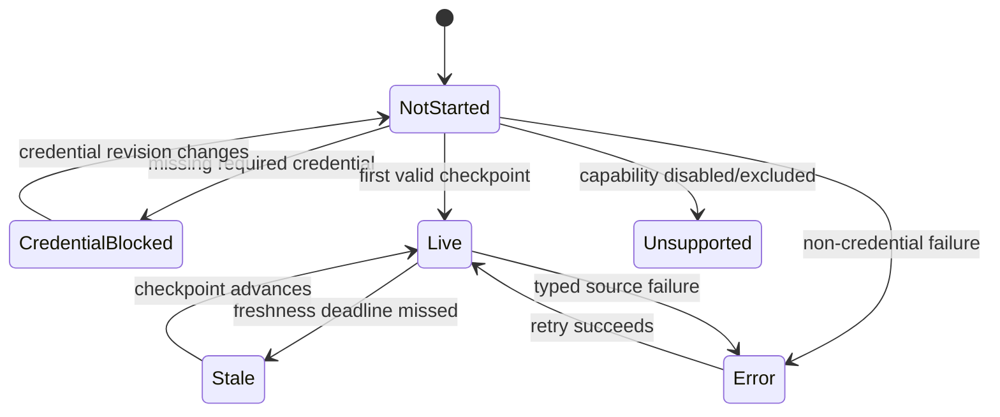

# 11.9 — Historical Implementation & Evidence Log（2026-07-30 冻结）

> 本文件是 Phase 11.9 实施期间的 append-only 恢复、失败发现与证据流水，已冻结为只读审计历史。
> 当前终态合同、完成声明、激活阻塞与证据索引只见
> [`11.9-attribution-feedback-and-auto-retraining.md`](11.9-attribution-feedback-and-auto-retraining.md)；
> 不得从本归档恢复 active task，也不得把历史环境计数解释为 current Operational Activation。

<!-- quant-pivot-deployment-contract:v1 -->
> **Deployment contract**
> - `fresh_boot_assumption`: 项目尚未正式生产上线，将从全新 `boot` / schema version `1` 部署；仓库和数据库不保存 lifecycle seal 状态。
> - `schema_data_version_impact`: 本文中的历史版本号与递增路径不再具有实施效力；当前实现不迁移测试数据、旧结构或旧版本。
> - `pre_deployment_behavior`: 允许 clean-break、migration squash 与全新基础设施 bootstrap，但任何数据销毁仍需操作者单独授权。
> - `post_deployment_behavior`: 首次部署后使用正常前向 migration、回滚与数据验证；不使用不可逆 production seal 或兼容桥。
> - `rollback_and_data_verification`: 首次部署前通过清空后的 fresh-install 验证；部署后使用备份、前向 migration 与显式回滚。

> 归档截点：W4-E01..E10 已完成、W4-E11 正在执行终态文档压缩；该状态只描述冻结瞬间，不是当前进度真相。
>
> 最后更新：2026-07-30
>
> Boot 版本所有权：六类 Runtime Policy、Feature/Scoring/Domain/Research Method、Dataset、Model、
> Trade Policy 与 Evidence contract 均从 `schema_version = 1` 开始；本期不执行旧版本迁移。
>
> 关闭审计点：#19（最终归因没有消费闭环）、#21（factor 发布缺少 gate/shadow/WORM audit）。
>
> 本文破坏式取代 [`phase-06/06.5`](../phase-06/06.5-attribution-feedback-and-auto-retraining.md)，
> 不保留旧 seam、runtime parser、alias、re-export 或双读兼容层。

## 0. 文档使用规则与恢复协议

本文同时是最终设计、实施计划、Todo、决策账本与验收证据索引，不再创建第二份 implementation plan。

状态只允许以下六种：

| 状态 | 含义 |
|---|---|
| `TODO` | 尚未开始，不能据此宣称存在能力 |
| `IN_PROGRESS` | 已有工作树改动，但尚未通过本项验收 |
| `BLOCKED` | 存在外部或治理阻断；必须记录阻断条件和恢复动作 |
| `PAUSED` | 用户明确暂停的后续范围；保留设计和已验证进度，但不得宣称完成 |
| `DONE` | 代码、测试、证据和本文记录全部完成 |
| `SUPERSEDED` | 设计被审计否定或并入其他任务；必须记录替代任务/决策，历史证据不删除 |

更新纪律：

1. 每完成一个可独立验证的任务，先运行该任务的目标测试，再更新 §11 Implementation Ledger 和
   §12 Evidence Ledger；不得先勾选后补证据。
2. `DONE` 必须包含实际命令、结果和 artifact/截图/报告路径；“代码看起来完成”不是证据。
3. 网络中断后从 §11 第一条非 `DONE` 任务恢复；先运行 `git status --short` 和对应目标测试，不重做
   已有证据，不假定未验证改动正确。
4. 大型 PG/CH migration、真实 source smoke、24h shadow 分别记录；本地 replay 不能冒充真实生产资格。
5. Phase Exit 只有 §11 全部 `DONE`、§12 无失败项、§10 Blocker 全部关闭后才能改为“已完成”。
6. 执行期间必须恰有一个 `IN_PROGRESS`；任务切换顺序固定为“目标验收通过 → §12 追加证据 →
   当前任务 `DONE` → 下一任务 `IN_PROGRESS`”，不得同时展开多个未验收工作面。
7. `FAIL` 是 Evidence Ledger 结果，不是任务状态；失败后任务继续 `IN_PROGRESS`，立即记录根因、下一动作
   与精确恢复命令。Evidence 只追加，不覆盖失败发现链。

### 0.1 当前检查点

- `baseline_branch`: `quant-pivot`
- `baseline_head`: `7dd39fd884b4621c02e8595667aaabb0621f390e`
- `working_tree_summary`: W4-E01..E10已在branch=`quant-pivot`、root
  HEAD=`7dd39fd884b4621c02e8595667aaabb0621f390e`、UI
  HEAD=`452b23300e5f8d832034924e57f16fe221bbf405`的同一基线上闭合；root/UI status输出行分别为
  `53/35`，所有改动均已逐项归属W4证据，两个index无staged change，submodule gitlink与UI HEAD一致。
  Root/UI dependency manifests与lockfiles相对HEAD零diff；PostgreSQL semantic/migration与ClickHouse
  manifest SHA-256分别保持
  `f447785567b7cbd0ba02d2268250698e8455acb9e9939877462f7e3592130906`/
  `584b4af166f3eb1438061b9ccbfc667f342c3e6430cd0856b426c1389546dcf8`/
  `5c9bda029e274b99f4352aa3c24ca2c370591f12ba829361fee1f8f15e6aec6f`。8088/6099无listener，
  无owned production/Playwright process；preexisting Vite 5999 PID 24240保持未触碰。唯一额外
  untracked `docs/research/polymarket-perps-opportunity-2026-07-29.md`是用户侧研究文档，767行、
  SHA-256=`3ee92c584cbaaf38a5b6a80f9d51c1a13b3f070b7b1992c58c61f9020d4cc05c`，原样保留且不纳入W4。
  本轮未执行reset/checkout/覆盖/commit/push/stage/clean
- `current_task_id`: `W4-E11`
- `current_task_objective`: 只同步最终§0/§11/§12/§13与必要README完成声明，使Phase 11.9实现闭环、
  所有历史FAIL均由后续同范围或更大范围PASS解释、W4-E01..E11状态与evidence一致。必须保留Crypto
  `Implementation Closed / Operational Activation Blocked`、Weather `MatureLabelsUnavailable`与current
  PG/CH operator-owned blocker，不宣称真实funding、Published route、24h/multiday shadow或Operational
  Activation；完成后停止，不启动后续Phase、额外重构或外部研究工作面
- `dependency_status`: `W2-00=DONE；W2-A09=DONE；W2-S01..S09=DONE；W2-F01=DONE；
  W2-A11=DONE；W2-F02=DONE；W2-F03=DONE；W2-F04=DONE；W2-F05=DONE；
  W2-F06=DONE；W2-F07=DONE；W2-F08=DONE；W2-F09=DONE；W2-F10=DONE；
  W2-F11=DONE；W2-F12=DONE；W2-P01=DONE；W2-P02=DONE；W2-P03=DONE；
  W2-P04=DONE；W2-P05=DONE；W2-P06=DONE；W2-P07=DONE；W3-API01=DONE；
  W3-API02=DONE；W3-API03=DONE；W3-WS01=DONE；W3-WS02=DONE；W3-UI01=DONE；W3-UI02=DONE；W3-UI03=DONE；W3-UI04=DONE；W3-UI05=DONE；W3-UI06=DONE；W3-UI07=DONE；W3-UI08=DONE；W3-UI09=DONE；W3-UI10=DONE；W4-E01=DONE；W4-E02=DONE；W4-E03=DONE；W4-E04=DONE；W4-E05=DONE；W4-E06=DONE；W4-E07=DONE；W4-E08=DONE；W4-E09=DONE；W4-E10=DONE；W4-E11=IN_PROGRESS（prerequisites closed）`
- `changed_paths`: current W4 delta覆盖canonical outcome reconciliation、feedback/shadow/promotion服务与
  repository owners，fresh production/system-test/evidence owners，Web auth/WS边界，xtask architecture
  gates；UI覆盖唯一authoritative-read owner、Dashboard/Feedback/Domain Sources/Model detail、design
  tokens、local icon与protected Playwright矩阵；文档只同步本ledger与Phase 11索引。零dependency/lock/
  schema/config兼容改动，删除被新owner完整覆盖的旧Dashboard coordinator/spec与W3 screenshot spec
- `historical_changed_paths_through_w4_e09`: W4-E01修改`quant-pivot-web` JWT/session authority与三个consumer、system-tests
  Redis restart及PG/CH removal catalog contracts、xtask canonical removal scanner、dev-dependency lockfile和
  本ledger；W4-E02只扩展既有`core_business`、`repository_contracts`、`feedback_dataset_e2e` canonical
  evidence owner及新增一个credential-readiness nested scenario，删除旧单态terminal helper并收敛为
  owner-aware双case；production、schema manifests、config与UI均未修改。
  W4-E03扩展既有`ProductionStack`为typed fixture/process/binary+Redis restart owner，并在唯一
  `web_system_contracts`闭合真实binary的Factors只读、Feedback REST/WS、RBAC/permission-drift、
  durable replay、binary/Redis restart与session state-loss合同；抽取唯一shared
  `AuthoritativeReadCoordinator`并删除Dashboard重复owner，修复invalidation stale-publication race。
  App-specific Vite owner从既有locked Iconify JSON裁剪production TS/Vue与backend menu Rust literals，
  main前本地注册；server-controlled unknown icon在menu adapter fail closed到本地help icon，
  `BrowserFailureAudit`永久拒绝public provider。Root/UI dependency与lockfile无修改。
  W4-E04只新增machine-readable decision evidence owner并扩展canonical
  `feedback_decision_stage`/`repository_contracts`：四态复用同一real-PG/object-store链路，统一permit/
  preflight fixture取代CandidateReady/Promoted重复装配，完整snapshot/diff、row-count replay、
  fresh-owner restart及rollback证据均在测试边界；production/schema/config/UI与依赖清单零修改。
  W4-E05删除被完整覆盖的31s sleep型旧Dashboard browser spec，以真实production stack上的
  Playwright Clock、真实上游`route.fetch()` response barrier、request/active counter与透明WS proxy闭合
  burst/trailing/single-flight/stale/window/route-leave abort、fallback/visibility/reconnect及section-local
  last-good/error。真实SPA测试发现并修复Dashboard离页未abort的production lifecycle缺口：mount/
  activate统一refresh，deactivate/route-leave统一cancel并暂停fallback，unmount dispose；全部watcher受
  active guard约束。`BrowserFailureAudit`新增action-scoped exact one-shot console allowance，未消费和
  第二条同文warning均反向hard-fail。最终联合fresh-stack 6/6、UI 53 files/243 tests、typecheck、
  10,213-module production build、format/lint、Rust format/architecture、diff/dependency/index/teardown
  全绿；production API/wire/schema/config与root/UI dependency/lockfile零修改。
  W4-E06以fresh MinIO WORM/PG/CH/Redis/真实binary/REST/WS/RBAC/Chromium生成18 state × 4 viewport ×
  light/dark共144张zh-CN原图；Axe WCAG、touch、keyboard、live-region、actual computed theme、
  overflow与BrowserFailureAudit全部PASS，18张contact sheet人工审完144/144。修复shared Ant token
  destructive/label contrast、caller-owned Feedback error去重、live region/44px target、governed Escape、
  pending native disabled、Dashboard lifecycle、model fixture artifact authority及S3 version/Object Lock/
  credential/attestation单一authority；删除错误的muted Alert覆写与split-table test耦合。最终manifest、
  protected HTTP/WS、UI unit/type/build、六crate strict Clippy、function audit/architecture、current-byte
  production-stack verify、root/UI diff/dependency/index/teardown全部闭合；无compatibility、Axe allowance、
  dependency/lockfile或schema变更。
  W4-E07 clean-break把resolution/execution candidate与reconcile API统一为显式数据库cutoff，首次
  resolution source cursor从cutoff内最早recommendation前1秒对应block初始化；新增冻结source/candidate
  universe的complete backfill、typed missing/late deferred、exact replay、WORM/PIT earliest与bounded
  runtime keyset fairness，删除薄error mapper且无旧signature/compatibility surface。Current native
  PostgreSQL只读verify因immutable bootstrap identity mismatch fail closed，未迁移或写入；public
  Polymarket read smoke通过，所有写入只进disposable PG/CH。唯一v3 strict manifest记录typed
  read-only/not-executed/operator-authorization-required blocker、frontier/count/duplicate/conflict/
  availability/profile/hash/replay，并明确fixture 3+3 outcomes/0 labels不可供E08/E09 readiness。
  Producer、resolution/execution repository、feedback Dataset downstream、affected strict Clippy、
  function audit/architecture、root/UI dependency/diff与absence均闭合。
  W4-E08只新增一个system-test evidence owner，直接解析并SHA-256 pin E07唯一v3 bytes，从immutable
  `crypto_price_15m` profile、production trade-policy gate与runtime shadow gate派生阈值；生成
  `Implementation Closed / Publication Blocked / Operational Activation Blocked`严格v1 manifest。
  Current native PostgreSQL fresh read-only verify仍在bootstrap identity前置失败，因此real outcome/
  labels/profile/cycle/artifact/permit/route/generation保持不可观测；19个current gate全部typed blocked，
  `ResearchOnly` profile另有独立activation blocker。Disposable fixture被typed拒绝，不修改production、
  schema/config/UI或dependency/lockfile；算法与real-PG implementation contracts、strict Clippy、
  function/architecture、format/diff/dependency均闭合。
  W4-E09将E08独立Crypto target clean-break合并为唯一`vertical_readiness_evidence` owner；从current
  deploy构造immutable Weather registry/profile，并逐一冻结八个family的完整capability/source/PIT、
  mature-label、parser/profile/serving与activation verdict。Current PostgreSQL immutable identity
  mismatch且ClickHouse目标数据库不存在，故所有current label/fact count保持null；每族minimum=500且
  typed `InsufficientEvidence(MatureLabelsUnavailable)`，Daily Temperature parser implemented，其余七族
  达标后仍必须重新进入`UnsupportedTemplate(RecognizedWeatherFamilyParserUnavailable)` gate。
  Historical capability/PIT artifacts仅以typed lineage quarantine保留，不进入current truth；official
  adapters、classifier/registry、fresh disposable PIT/revision、strict Clippy/function/architecture、
  format/diff/dependency/absence与唯一manifest hash全部闭合。
  此前W3-UI09以同一真实production-stack固定Dashboard、Feedback cycle/detail、Domain
  Sources、Factor detail与Model detail五态，覆盖375×812、768×1024、1280×720、1440×900各
  light/dark共40张截图；每态在desktop真实theme control切换后重验目标viewport实际
  `color-scheme`/background，Axe WCAG 2/2.1 A/AA与2.2 AA、page/dialog overflow、44px touch、
  keyboard Enter/Escape、polite live-region及browser failure均零finding。共享VXE icon action、
  Dashboard/Feedback/Factor/Model触控/语义、Model tabs、Drawer Escape、responsive descriptions与
  canonical light palette在唯一owner闭合；repository-backed research fixture提供真实Feedback
  cycle、独立无policy ModelSpec/label schema及只认Published execution infra，quality gate保持HTTP
  200的权威blocked语义。green8 1/1 PASS、40/40截图且人工抽检明暗/移动/平板/桌面无视觉缺陷，
  teardown无production/Vite/Playwright残留。W3-UI08让唯一Dashboard coordinator在同一generation/AbortSignal下读取overview与
  authorized Feedback snapshot，两节独立last-good/error；materialization无权零Feedback GET。30s fallback
  只在visible且WS stale/disconnected时请求，45s client-clock health、transport reconnect与visibility
  recovery闭合，heartbeat变化不直接GET。Dashboard删除旧200-day/null→0 readiness和四组Motion；
  compact Feedback按API顺序展示vertical readiness/latest并精确深链cycle。Orbit删除1s timer、rotation、
  partial update、pause及idle/visibility/reduced-motion owner，保留静态ECharts与键盘列表。真实browser
  fixture同步收敛canonical decimal U256、template exact factor/schema binding、Backtest WORM hash与
  Evaluation dataset run preimage；31s production-stack WS-no-poll、console/pageerror hard-fail、teardown
  absence、54 files/245 tests、full UI/build/architecture/diff/index均PASS。
  W3-UI07新增唯一framework-light `DashboardRefreshCoordinator<T>`并让Dashboard
  overview所有mount/retry/poll/window/report/status入口统一经该owner；物理single-flight、active期间dirty
  trailing、300ms semantic coalesce、request generation与AbortController共同拒绝旧window/旧请求发布，
  drain期间pending连续且unmount dispose。Dashboard API透传可选`AbortSignal`；last-good snapshot、
  typed error与system projection只在coordinator callbacks维护。5项定向契约、full UI/build、static
  single-owner/absence、architecture/diff/index闭合；UI07刻意保留旧poll health policy供UI08收口。
  W3-UI06 clean-break修正Factor detail真实nested wire并展示独立分页model serving
  usage，Factors client/UI保持三个GET且零mutation；Model detail严格镜像serving contract、derivation、
  evaluation/promotion lineage并传递backend page query，完整展示factor/schema/transform/policy/dataset/
  model/profile/calibration/bias/trade-policy commitments。新增纯lineage/commitments projection与
  `CopyableHash`语义组件，所有hash只读/可复制，icon-only control具资源型`aria-label`、polite
  live-region与44px触控目标；strict fixtures、full UI/build/absence闭合。W3-UI05 clean-break以backend逐字段`DomainSourceExpectationView`替换错误cursor DTO，
  expectation metadata必有且cursor/checkpoint/lag/timestamps整组nullable；纯summary保留API全部rows与顺序，
  只计server closed status和observed lag，null worst lag显示未观测。Grid identity改为expectation ID，新增
  requirement/credential/freshness/status reason/affected scope并对nullable checkpoint/time安全投影；
  190-row、100/90 family、null lag/server-status fixtures通过。W3-UI04新增strict snake_case trigger/cancel/permit request/view与唯一governed
  POST clients，全部复用`useGovernedAction`、`X-Acting-Role`和服务端typed boundary；exact
  Materialization/Create与Publication/Read/Publish/Retire分别gate。Action-state owner冻结machine reason、
  canonical runtime modes、future expiry、cancel/issue eligibility和per-resource double-submit；permit issue
  idempotency key仅成功后轮换，revoke发送base revision 0。Workbench使用authoritative mutation response
  替换row并重读REST，permit panel只显示server派生status/actor/reason/hash/revision，不提供route/model
  promotion。W3-UI03 新增strict snake_case Feedback detail/stage/drift/evaluation-use types与唯一
  encoded cycle-detail GET；selection/current-list与same-ID WS refresh均使用独立generation/AbortController，
  ID/order/safe-integer/closed vocabulary/status-decision组合fail closed。完整read-only panel投影cycle
  preimage/timing、严格WORM timeline、nullable coverage与三类cohort、drift Decimal/window/artifact、
  one-time evaluation/comparison/CPCV/champion lineage；URI只显示不fetch/open。四种decision、failed/
  cancelled、pending、非法组合、cross-ID、sequence regression/zero fixtures通过；project cspell补入
  canonical Kolmogorov/Smirnov专名。W3-UI02 新增纯`feedbackProfilePresentation`与profile card，按authoritative
  `overview.profiles`顺序渲染全部built-in profiles而不硬编码vertical；snapshot共享readiness严格区分
  ready/blocked/not-observed，null history不填0，coverage/minimum保持Decimal string且只显示server
  advance/no_action，latest cycle/status/decision/champion ID/hash与policy/content hash完整可换行审计。
  Crypto ready/advance/latest champion、Weather blocked/no-cycle/no-coverage及null-history fixtures通过；
  一/二/三列响应式section、中英文/enum i18n与typed Antdv Divider完成。W3-UI01 新增backend seeded
  `research-feedback` menu page，exact
  `/research/feedback`→`research/feedback/index`并以`Materialization:Read`复用真实role policy；
  frontend path-key route、中英文locale、snake_case Feedback overview/cycle/coverage wire types与唯一
  GET client已落地。工作台二次permission gate后才并发读取authoritative overview+paginated cycles，
  AbortController/request generation拒绝旧响应，Feedback durable refresh generation触发重读；
  permission/loading/error/empty/readiness-blocked/ready六态不折叠，blocked仍可审计历史，cycle selection
  仅存route query，基础master-detail、44px目标与polite live region完成。W3-WS02 新增frontend唯一
  `research.feedback` wire channel与严格五字段snake_case
  payload、仅该channel必需的`after_revision` subscribe grammar及`materialization:read`映射；
  dedicated Pinia store只保存durable high-water cursor/last hint/refresh generation/typed recovery，
  live/replay duplicate与乱序被忽略，malformed/unknown subject/replay window error fail closed关闭连接；
  reconnect前single-flight读取canonical feedback overview revision，拒绝unsafe/regressing cursor并沿
  bounded backoff恢复。W3-WS01 新增唯一全局reliable `research.feedback` channel、严格`after_revision`
  subscribe与五字段snake_case invalidation payload；Repository以窄`FeedbackOutboxRepository`从canonical
  cycle批量投影profile，resident worker复用ResearchJobs lease/poll并只在SessionHub接收后ack；
  SessionHub实现exact-session 128-frame replay、整批64MiB byte-budget acquisition/split、single-encode
  bounded fanout及slow-client/overflow fail-closed disconnect，Core shutdown/composition与production Web
  boundary完成。W3-API03 新增全局drift read DTO/port/protected GET与cycle/profile/kind/metric硬化分页，
  repository逐行重验content-addressed report；Model detail聚合完整verified serving contract/hash、
  typed derivation、champion evaluation-use与candidate/champion WORM promotion lineage；Factor detail
  返回独立分页的exact verified model-serving usages，三条Factors route仍精确只读。JSONB查询使用typed
  PostgreSQL operator且不扩schema；Models/Core/Web、real-PG与production Web contracts通过。W3-API01
  新增 canonical Feedback read DTO/port/Core adapter/protected routes，扩展
  FeedbackCycle repository 以 profile/status/trigger 硬化分页与 latest durable outbox revision；
  overview 使用 PostgreSQL clock、readiness 与 built-in profiles，Coverage 只从 succeeded stage
  URI/hash 读取 canonical artifact 并 fail closed 校验完整 cycle/profile/champion 前像；新增 real-PG
  page/revision 与 production Web boundary 回归。W3-API02 新增 governed mutation DTO/port/Core
  orchestration 与 protected trigger/cancel/permit routes；以PostgreSQL cadence clock、current serving
  preimage、真实 SourceSliceMaterializer、deterministic Dataset/cycle identity冻结manual trigger，
  cancellation从WORM timeline派生stage/sequence。共享transaction authorization按active user/
  enabled role/membership/exact Casbin锁定DB实名actor，trigger/cancel与permit issue/revoke保留typed
  idempotency/CAS；permit catalog用单一DB clock派生status。新增Models/Core/Web/真实PG/production Web
  tests；Root status 行=`52`、UI=`1`且clean，两个index无staged change。W2-P01 已验收新增
  PromotionPermit ID/domain/entity/fresh-boot snapshot、defaults/
  W2-P01 已验收新增 PromotionPermit ID/domain/entity/fresh-boot snapshot、defaults/
  indexes/FK/CHECK/revoke trigger、real-PG runner并重建权威PostgreSQL manifests；修改Models/Error
  facades。按用户纠正，全仓1:1 insert DTO使用`DeriveIntoActiveModel + .into_active_model()`，唯一
  fallible `NewModelVersion`投影clean-break为标准`TryFrom`并迁移三个caller，零平行转换API；修复
  xtask ledger validator把evidence正文中的heading substring误作section边界，并加专属回归。
  W2-P02新增validated issue/revoke command、typed repository outcomes、Core
  `PromotionPermitService`、共享PG wiring与唯一PostgreSQL transaction owner；owner以固定
  user→role→membership→Casbin g/p shared-lock、permit/candidate-PK exclusive-lock顺序完成真实RBAC、DB actor attribution、
  DB-clock expiry、全immutable-field exact replay、row-lock/revision CAS revoke。新增专属real-PG
  RBAC/idempotency/concurrency test与runner，并只扩展typed Error/Web error mapping；未触碰
  promotion preflight、model/route/runtime或W3 API。P03已验收新增content-addressed
  `PromotionPolicyProjection`/`PromotionServingConstraints`/`PromotionPreflight`、typed permit load、
  F06/F09/F10/F11 exact `CandidateReady` evidence reread与只读`PromotionPreflightService`；service从
  committed DB/local policy/runtime、current all-route generation、exact champion+global shadow
  candidate、完整artifact/serving preimage派生唯一Crypto/Weather single-category prospective delta，
  任何profile/category/mode/hash/generation/model/artifact漂移均在side effect前fail closed。Research
  bundle只装配该read-only boundary；真实PG场景覆盖1000条exact generation observations、WORM bytes
  tamper、真实RBAC issue与preflight前后policy/route/model state不变。全仓ActiveModel conversion审计
  固定1:1 DTO使用`DeriveIntoActiveModel + .into_active_model()`，唯一fallible
  `TryFrom<NewModelVersion>`保留真实validation/hash projection；未修改route/model/runtime或W3 API。
  W2-P04已验收新增唯一 `PgModelRoutePromotionRepository` transaction owner、typed commit
  command/outcome与Core service wiring；以 `policy guard→permit→runtime→cycle/Decision/Shadow WORM
  evidence→current projection→parity latch→spec/sorted model rows→exact parity run/subject` 固定锁序，
  在一个PostgreSQL事务内完成candidate `Shadow→Published`、exactly one Crypto/Weather category route、
  exact global shadow consumption、content-addressed snapshot/revision/实名approval、model governance
  audit、policy activation/audit/durable outbox、guard generation CAS与cycle
  `CandidateReady→Promoted`。rollback fault injection证明所有ledger/model/route/cycle全回滚；真实并发
  恰为1 Committed + 1 ExactReplay，任一immutable字段drift typed conflict。full-parity run/subject/latch
  已纳入permit preimage与锁内重验；P04明确不做runtime apply，旧in-memory generation保持不变。fresh-boot
  schema/manifests、real-PG与全部static gates已通过；workspace零手写infallible
  `From<New*> for ActiveModel`，纯insert统一为`DeriveIntoActiveModel + .into_active_model()`。
  W2-P05已验收新增单一Core `CommittedPolicyApplicator`与dependency-inverted
  `CommittedPolicyApplyPort`，统一消费generic activation、P04 promotion和DB reconciler；typed
  `PolicyBundleIdentity`/`PolicyApplyReadiness`记录durable desired与process applied identity，
  prepare/publish/generation mismatch返回typed degraded并使`/ready` fail closed。Promotion在DB提交或
  exact replay后重读current canonical bundle再apply；失败不伪造DB rollback、不切换半generation，
  旧all-route generation和pinned reader继续可用，exact retry/reconciler可收敛Ready。真实PG证明
  commit后prepare failure保留完整durable graph、旧runtime与degraded N+1/N，重试零DB新增并一次切换；
  全仓runtime publish只剩该owner一处。SeaORM 2.0全仓复核确认纯insert统一
  `DeriveIntoActiveModel + .into_active_model()`，唯一fallible `TryFrom<NewModelVersion>`执行真实
  validation/hash projection；未新增W3 surface。
  W2-P06已验收在同一canonical real-PG feedback-decision runner补齐absent/expired/revoked/mode/
  preflight-hash/runtime-revision-CAS完整matrix、permit row-lock跨expiry及promotion-first/
  revocation-first两个确定竞态。Production transaction改为取得permit exclusive lock后读取唯一
  PostgreSQL statement clock并贯穿rows/CAS，消除等待期间过期authority；read-only server-side RBAC
  前像改用shared row lock，继续阻止user/role/membership/Casbin变更且与promotion实名FK key-share兼容，
  消除真实`40P01`锁序环。所有拒绝保持model/单category route/policy/cycle/audit/outbox/runtime
  generation/readiness不变；promotion先提交仅一次、随后revoke仍可exact replay/converge，revoke先提交则
  零promotion graph。P02回归、affected strict Clippy、function audit、architecture、diff/index、
  SeaORM/legacy/W3 absence全部PASS；未新增schema/API/fallback。
  W2-P07已验收删除唯一未消费的`ProfileAllocationId`声明/导出，并新增architecture machine gate精确
  禁止Phase 11.9 `ProfileAllocation`路径/token在runtime、schema、config与UI回流；gate刻意不扫描
  泛化`allocation`词。独立`CapitalAllocationId`/`quant_capital_allocation` portfolio ledger的八个
  canonical owner及PostgreSQL/ClickHouse manifest投影与HEAD字节一致；Models 419/419、Xtask 48/48、
  affected strict Clippy、function audit、architecture、formatter/diff/index、SeaORM/W3/dead-semantics
  absence全部PASS。未改schema/API/UI或任何portfolio consumer。
  W2-P阶段边界另将promotion-permit CHECK中的五个`BETWEEN`与runtime-mode多值`IN`收敛为
  dump-stable primitive comparisons/flat equality OR，保留完全相同取值域；`QpQuantRuntimeMode`
  由bootstrap显式预创建，六个scalar snapshot/runtime列统一声明custom base enum，permit继续使用
  native enum array。最终canonical PostgreSQL semantic/migration manifest SHA-256=
  `f447785567b7cbd0ba02d2268250698e8455acb9e9939877462f7e3592130906`/
  `584b4af166f3eb1438061b9ccbfc667f342c3e6430cd0856b426c1389546dcf8`；未修改fingerprint
  comparator、未添加JSON/string fallback或migration兼容桥
  W2-F01 production 实现来自已验证 committed snapshot，未产生新 production diff。
  W2-F02 已验收新增
  `crates/quant-pivot-system-tests/tests/repository/research/feedback_boot_schema.rs`，并仅在
  `crates/quant-pivot-system-tests/tests/repository_contracts.rs` 增加专属 runner；本账本同步 checkpoint/evidence。
  W2-F03 已验收修改 `feedback_cycle.rs` domain/facade 与 typed storage entities，新增 canonical
  repository trait/PostgreSQL owner/facades、专属 real-PG concurrency contract，并只重构 F02 fixture/
  runner 的共享 wiring；源码 SHA-256（domain/trait/PG/test）=
  `afafcbf96496bca5e5bccd48f95ad9d5283891315b1d24131abb8002d5a9d787`/
  `9ac8b86c86de36ddd7bdd43bb3f99568feb0db33b5e3da8fcc641ba33aca6880`/
  `fda8d316a6468a73dce573e26a4857528bdcae47e20fdc670310e022c287e8ab`/
  `eef251a0f237defb61d6cefabde70403c73bf47f61c778f1a37824960861d8f0`。
  W2-F04 已验收修改 ResearchJob domain/entity/fresh-boot schema/repository/Core port 与全部 standalone/F03
  caller；新增 deterministic feedback identity、typed exact-enqueue outcome、parent transaction validation、
  composite lineage FK、partial unique、WORM lifecycle guard、专属 feedback/recovery real-PG runners并重建
  PostgreSQL manifests。源码 SHA-256（model/trait/PG/test/schema/migration）=
  `c1367e005dc3b6a40c2bcb6bcb240fc258cab6dc54c7711957ff0b4017d459c1`/
  `e196ddc99b2ae9e96924033f633511abee76b2680b0459314e60ead06b687155`/
  `13aa13ffe4cbbe5173f3162b3f4bb40876de8c7ec1d712ec04ac0a42159286ba`/
  `e604efd82ec9b04475f4c4b83ea32440651741b940c88b2ba7a15a71068f4559`/
  `e847bdcfc8272611069827cb9d5811bb1193d51bffc75358de59284a63164899`/
  `2a2659198ad79e602aeab298d760659169b4f96b7aec23440c7991de6d26fb3f`。
  W2-F05 已验收新增 `crates/quant-pivot-core/src/service/feedback_coordinator.rs` 与 Core/SystemTests
  contracts，修改 ResearchJob lifecycle wake、`FeedbackStage::next`、TaskId/repository boot wiring、
  typed feedback errors、service exports 与专属 runner；coordinator 以 DB lease/job/WORM timeline 为唯一
  authority，覆盖 deterministic enqueue/link、bounded poll+wake、stage-boundary cancel、orphan/restart、
  exact recovery attribution、九阶段 DAG 与 typed terminal，未注册缺少 F06..F11 adapters 的 placeholder
  resident task。源码 SHA-256（coordinator/engine/Core test/real-PG test）=
  `423f1a96ace82c43e2f4399d1c138d61a6355c9d5cf5ab801ee5759bc8d5b583`/
  `8c5f5ef9580b52c28b88a194cc8187a7d422f512eba5392582a3154abfa3c728`/
  `3732a948229b27e0f7e30416d3728250617b5f17cedb51fc0ddee0d2a6519fcf`/
  `d3d1878fad5b8b51de660048f6a28426fd7fab3a0f8e2cea83ae3ca9693b451a`。
  W2-F06 已验收新增 versioned coverage/data-concept-label drift methodology、三 cohort/champion
  materialization、exact Coverage/Drift ResearchJob executor、content-addressed artifact 与 stage adapter；
  ResearchJob terminal command 原子保存 result/artifact/coverage，lifecycle clock 统一归 PostgreSQL，
  real-PG contract 证明 NoAction/Advance→Drift、artifact tamper、四 WORM header 与 parity isolation，
  production-stack 证明真实 11,000 recommendation/2 resolution outcome 闭环。源码 SHA-256
  （methodology/test/Core executor/stage/worker/job model/job PG/stage PG test/E2E）=
  `3f8e8ea5aa9b89a9f37647fcf26debd51ddabc04814d113a9602a86f1bf09306`/
  `af95b9064a9b4d934c2946a06a45dcb21e1ef99d174171f24c89953a6a1c2ee6`/
  `3b4076587d2c98b3e86c47fabeb42fa3d8c56f59174ac1ec8fff1ba96796fea7`/
  `dd951f4f24d98269bb99974676070bf51a619f10f3a3714d267f719c8a044d4f`/
  `02d9ec0988affce449e63bca6cb532f78a5ee86dc3e9bd52856021cc4e856cab`/
  `6ce8d8abdb13d23c71ec3edeb0833a92db2ef5e82bb84b7833bf294ea39f1fd9`/
  `1fec367d55ae437a1709c9996d2c97fa8841e96f60592d714dad13a29763675b`/
  `0c656636dc955795985a24e29bc2e563c329336d31d1ec90fe69aa033e4f5a5d`/
  `67eb2fb45b979479517847aa38b4061b62d773d2b3918634c18885bb295806f9`。
  W2-F07 已验收新增 Models 四阶段 bounded typed params、Research versioned/content-addressed learning
  artifact、Core exact batch executor与完整 predecessor-chain adapter；clean-break 接入 cycle-frozen
  internal Evaluation Dataset authority、preassigned Training/Calibration/CPCV ModelRun、Training 与
  calibrated-model governance binding/audit atomic commit、CPCV path+run atomic commit、typed
  insufficient-calibration terminal，并扩展真实 PostgreSQL/object-store/production-stack contracts。
  关键源码 SHA-256（params/artifact/artifact test/executor/stage/calibration/path repository/run repository/
  stage PG test/path PG test）=
  `58f9203659e6d437ff0cf2f35ea1e06a99b9ae69f56b1f7580a785594541fa70`/
  `666c47e431be75a0b4c3eda3323e10dca9233a5ff2faa8c8a95c0a9833e30d2a`/
  `70b4b46c765b80783edf82f17f8f405c0d3cd247ffc17f0a9f1c879fbe9b0140`/
  `518ceb8cc52d005c5bb2ad20a9f0f7cbfcfa69bb0df539756a0cf9d9e72ba71c`/
  `48bd1e5d5d9bee59ee028735fcfb3948d4d53a754de36042e5c88398ab3be9c3`/
  `bd6b55442d52913c7ac895ac8fef02458f43610b743a7b3f6c583004f2cc77b4`/
  `d49cef5fb4811077aab1b2163918f5d732145a254a7f6c7c6f69024474bd835e`/
  `9065f66ffc2a885e37967d25a949afe4860f0e92f21503d34aa83ee5b8bfbbee`/
  `282d0bac298556ff9cc8bb177d63ab1be5674d24406e1af6e05b3592968b94e9`/
  `d6e1c135550bcb10c8bd0263894a67b40ebee8789cbc25cb98ec63cf1bbf7421`。
  W2-F08 已验收把 candidate recipe/family完整前像嵌入 cycle typed JSONB，所有 learning
  prepare/restart均逐项重验 family与真实 predecessor output；新增 pre-open Evaluation reservation
  service，只从 verified CPCV object和Ready Dataset metadata建立DB-clock WORM row，且全局拒绝holdout
  二次使用。fresh schema clean-break删除事后 result artifact/caller clock，改为CPCV ref/reserved_at；
  决策 window 与 label/source PIT cutoff保持防泄漏顺序。关键源码/manifest SHA-256 已记录于 §12。
  W2-F09 已验收新增完整 `FeedbackComparisonContract`/candidate/evaluation/job/result DTO，Research
  Romano–Wolf basic StepM 与 versioned artifact，Core exact CPCV/Evaluation/serving-preimage stage+
  execution adapter、worker dispatch与 shared Evaluation replay；修改 feedback policy/hash、ResearchJob
  enum/schema、candidate-family DB invariant及测试 fixtures，重建 PostgreSQL manifests，并更新受影响
  deterministic profile hash vectors与 7 份已逐字审查的 report snapshots。新增/主要修改路径包括
  `crates/quant-pivot-research/src/feedback_comparison.rs`、
  `crates/quant-pivot-core/src/service/feedback_comparison.rs`、
  `crates/quant-pivot-core/src/service/feedback_comparison_stage.rs`、
  `crates/quant-pivot-models/src/domain/ports/feedback_execution.rs`、Research/Core/SystemTests contracts与
  schema manifests；完整证据在 §12。
  W2-F10 已验收新增 immutable `FeedbackShadowContract`/job/result/subject、Research typed
  insufficient/stable/unstable artifact/evaluator、Core executor/stage/worker dispatch；published generation
  唯一公开 exact active/shadow model+contract/profile/category/policy/generation/threshold identity，
  historical replay不能写 production observation。`quant_shadow_comparison` clean-break持久化完整 identity，
  repository按双方 contract/profile/category/policy/generation及半开 decision/DB-created window精确查询；
  新增 real-PG exact-query与 F09→F10 terminal/restart/tamper tests并重建 PostgreSQL manifests。主要路径为
  `crates/quant-pivot-research/src/feedback_shadow.rs`、
  `crates/quant-pivot-core/src/service/feedback_shadow.rs`、
  `crates/quant-pivot-core/src/service/feedback_shadow_stage.rs`、
  `crates/quant-pivot-core/src/service/model_serving_generation.rs`、
  `crates/quant-pivot-core/src/service/model_runner.rs`、
  `crates/quant-pivot-repository/src/postgres/quant/shadow_comparison.rs` 与专属 SystemTests；完整证据在 §12。
  W2-F11 已验收新增 deterministic Decision job/result/artifact identity、exact F06/F09/F10 predecessor refs、
  Research typed outcome/evaluator/content-addressed codec、Core executor/stage/worker dispatch、fresh schema
  result-kind/artifact约束与专属 real-PG restart/tamper/terminal/no-promotion场景；eligible candidate选择迁移到
  F09 artifact canonical owner，production Decision不表达`Promoted`也不修改route/model status。主要路径为
  `crates/quant-pivot-research/src/feedback_decision.rs`、
  `crates/quant-pivot-core/src/service/feedback_decision.rs`、
  `crates/quant-pivot-core/src/service/feedback_decision_stage.rs`、
  `crates/quant-pivot-models/src/domain/ports/feedback_execution.rs`、migration/schema manifests与专属
  SystemTests；完整证据在 §12。
  W2-F12 已验收新增唯一 `register_research_runtime`、exhaustive `FeedbackStageDispatcher`、bounded
  multi-cycle `FeedbackCoordinator`、独立 revision `watch` wake fanout、latest-value worker progress、
  explicit heartbeat fail-closed、DB-clock stuck detection、typed metrics/alert与一次 bounded shutdown
  drain；新增 `quant_feedback_event_outbox`，由 stage-event transaction 原子分配全局 revision，并提供
  bounded SKIP LOCKED claim/ack/nack/replay、owner lease CAS、queue snapshot 与 shutdown cycle lease
  release。主要路径为 `config/quant-pivot.toml`、
  `crates/quant-pivot-core/src/{app/research_job_worker.rs,service/feedback_coordinator.rs,service/feedback_stage_dispatcher.rs,observability/metrics_hub.rs}`、
  `crates/quant-pivot-models/src/{config/quant.rs,domain/quant/feedback_cycle.rs,entities/quant_feedback_event_outbox.rs}`、
  `crates/quant-pivot-repository/src/postgres/quant/feedback_cycle.rs`、fresh-boot migration/schema manifests
  与专属 real-PG contracts；关键 SHA-256 按上述顺序=
  `175195d74aaa9a5237d9c8b1cc314a50c375fe3997cdcc0d18a82a808079b32d`/
  `092785dd98115ead65a7279b778bc418c7f4e3905a3c0dd678f1f0c79d0d1f77`/
  `5afe9405e7bd3a6de4d17551979625bcf53991b45217e2552f633d6d2d58b066`/
  `e1f73e76879ddff4163c40daf3507265e7c3a9318be3e13cb62b792616aa80eb`/
  `9c5a1ee6cb8999e0f5c048bfde411ff098d5c9c595a525ea19104fc020d3d14a`/
  `6e09caef631fef7a2bed6b0fb5e755b1897730d21bb438cd3db64f456571fdd2`/
  `3c12f66a58531fd197ba9c73d5669c26e32e310a752d0516fd7b3703f7f367f0`/
  `3c0cf7fdc645370aa6ed8ea1662ee495a0c6cb1a34574e857fc25957450de200`/
  `eff8fcddeb780c920c04a2285b1cad095cac47f5026003d3e70a565a0be7529d`；
  阶段边界Core-business distinct-generation fixture/migration invariant owner SHA-256=
  `01f2fddc998581d5615d16ef1d2e5e7f0e87f949499c853afd78a5d3eb240b82`/
  `499391108f92f80b1cb5c45a769cb0a1037dd806678411a8dd0093cdb0171473`；
  PostgreSQL semantic/migration manifests=
  `a78e37365853ddfd94e73807cd5f5b3608ec4f4f50f7176ba7dff296949c5bfc`/
  `b4a50ae9feb184258136f6bda6a9592a945f07e10b4132d94f9e6a48deb5b49b`；完整证据在 §12。
- `last_passed_command`: W4-E10 final-current bytes已通过`cargo test --workspace`、workspace
  all-target/all-feature strict Clippy、function audit=`0 hard/623 review`、architecture、formatter；UI
  format/lint/type/CSpell/circular/dependency/config-api/research-model-api/unit/build全绿（93 files /
  581 tests、18/18 build tasks、10,213 modules）。两套独立fresh production stack上的protected Chromium
  各15/15 PASS，288/288人工像素通过且两份manifest均为144 unique states、zero automated findings、
  144 manual passed；root/UI diff、manifest/lock、schema hash、index、process/port与dead/duplicate/
  compatibility gates全部PASS
- `historical_last_passed_command_through_w4_e09`: W4-E09最终current bytes执行Weather official adapters 26/26、registry 5/5、
  classifier 9/9、fresh shared infrastructure/PIT 1/1、vertical contract 2/2与显式writer 1/1；两crate
  all-target/all-feature strict Clippy零warning、function audit=`0 hard/625 review`且新finding=0、
  architecture、format、root/UI diff与dependency/lock零diff全部PASS。唯一E09 manifest
  SHA-256=`2de9b8af38f82e30b7a26f59d12b923d80cfe16f664df80191298a2c97dbdaeb`，
  八族current facts/labels均typed blocked且历史lineage不可用于current readiness。此前W4-E08最终current bytes执行immutable profile 7/7、CPCV/PBO/DSR等
  validation 43/43、Feedback algorithm 19/19、real-PG CPCV/same-window/signal/learning/shadow/permit/
  decision exact contracts全PASS；strict v1 writer显式pin E07唯一v3 artifact并生成19/19 typed blocked
  verdict，targeted strict Clippy零warning、function audit=`0 hard/625 review`、architecture、format、
  root/UI diff与dependency/lock零diff全部PASS；唯一E08 manifest SHA-256=
  `a4f9e97c6cdbd65c372cca270996a8ab6bf188c462c9dbaa1b06ba05daf6b181`。此前W4-E07最终current bytes执行fresh outcome producer 1/1（104.77s）、
  canonical feedback Dataset PG/CH E2E 1/1（45.95s）、public Polymarket read smoke、affected
  four-crate strict Clippy、function audit=`0 hard/625 review`、architecture、format/root+UI
  dependency/diff/absence/artifact唯一性全部PASS；唯一v3 manifest SHA-256=
  `a508796161bf4daf764dd48e3ace83ef146843fc71a39c8842f4cb8cf7bbdab5`。此前W4-E03最终current
  bytes执行manifest-clean Chromium 3/3、完整UI
  93 files/580 tests、真实infrastructure restart 1/1、真实production REST/WS+Redis fault matrix
  1/1（277.37s）、strict system-tests Clippy、function audit=`0 hard/622 review`、architecture、
  format/root+UI manifest/lock/diff/index/hash/process/port全部PASS；核心owner SHA-256为
  `ProductionStack=7b57eebc…b832`、`web_system_contracts=c5b7f17c…4f85`、
  `local-icon-collections=bdc924a6…0a98`、`AuthoritativeReadCoordinator=79b8dc7b…5cd`。
  此前W4-E02最终current bytes执行完整`repository_contracts` 27/27、
  `core_business` 11/11、`settlement_persistence` 8/8、protected `web_system_contracts` 1/1、
  production-stack `feedback_dataset_e2e` 1/1、Romano–Wolf 4/4、strict system-tests Clippy、
  function audit=`0 hard/621 review`、architecture、format/diff/hash/status全部PASS；此前W4-E01
  affected strict Clippy、compiled PG/CH migration、两轮fresh infrastructure contracts、
  production-stack两次boot、manifest-clean、infrastructure boot和真实reset/backup/restore均PASS。此前W3-UI03 final current source：terminal/detail fixtures 14/14、targeted
  Feedback/state/locale 31/31、全app 44 files/209 tests、types/app typecheck、2,117-file canonical
  format/full lint、circular/dependency、affected cspell、production build、read-only/mutation/artifact-fetch/
  Decimal/placeholder/dependency-version absence、root/UI diff/index/HEAD均PASS；`cargo xtask architecture
  check` PASS。唯一production-build输出为既有上游`@vueuse/core` pure-annotation提示。UI03全部FAIL
  已有相同或更大范围PASS解释。此前W3-UI02 full app=195/195、types/lint/build/architecture均PASS；
  此前W3-UI01 backend menu=8/8、frontend 192/192、strict Models Clippy、
  function=`0 hard / 621 review`与architecture均PASS；此前W3-WS02 targeted 27/27、全app 185/185、
  type/lint/build/dependency/architecture均PASS；此前
  W2-P 阶段边界
  final current source：`cargo test --workspace`完整exit 0，包含
  API 194、Core 422、Models 419、Research 538、Storage 39、Web 50、Xtask 48、`core_business`
  10/10、feedback Dataset 1/1、fresh schema/infrastructure、真实PostgreSQL/ClickHouse/Redis
  backup/restore 1/1（489条constraint精确一致）、repository contracts 26/26、settlement 8/8、
  isolated production Web boundary与全部doctests；唯一输出为已知macOS `ld __eh_frame` message。
  Current-byte `cargo clippy --workspace --all-targets --all-features -- -D warnings` 1m39s、零warning；
  formatter、root/UI diff/index、function audit=`0 hard / 620 review`、architecture、Phase allocation/
  legacy/fallback/SeaORM conversion/W3 absence全部PASS。Disposable PostgreSQL 16 manifest-clean、
  Entity First down/reapply与真实backup/restore全部PASS；root/UI HEAD=`ee5b6545…`/`dac207d…`、
  status行=`91/1`，index无staged change，未commit/push/clean。此前P07 current-byte acceptance：
  Models full unit 419/419、Xtask 48/48、Models+Xtask
  all-target/all-feature strict Clippy 4m11s零warning；function audit=`0 hard / 620 review`；architecture
  check PASS；formatter/root+UI diff/index、精确Phase allocation/SeaORM conversion/W3 absence全部PASS。
  Capital portfolio canonical owners与PostgreSQL/ClickHouse manifest投影对HEAD精确不变；root/UI HEAD=
  `ee5b6545…`/`dac207d…`、status行=`80/1`、index无staged change，未commit/push/clean。此前P06
  current-byte acceptance：canonical real-PG feedback-decision runner
  1/1 PASS（含F11/P03/P04/P05及P06 fault matrix，54.82s），P02 governed permit回归1/1 PASS；
  affected四crate all-target/all-feature strict Clippy 4m23s零warning；function audit=`0 hard / 620
  review`，architecture check PASS；formatter、root/UI diff/index、production safety、精确legacy/
  fallback/placeholder、SeaORM conversion与W3 absence gates全部PASS。Root/UI HEAD=`ee5b6545…`/
  `dac207d…`、status行=`80/1`、index无staged change；未commit/push/clean。此前P05 current-byte
  acceptance：formatter、root/UI diff/index、SeaORM/legacy/
  production/runtime-publish/W3 absence gates全部PASS；affected五crate strict Clippy及Web strict Clippy
  零warning；function audit=`0 hard / 620 review`，architecture check PASS。Core runtime-config 4/4、
  model-serving generation 6/6、Models readiness 1/1、Web typed 503 mapping 1/1、真实PG
  feedback-decision runner 4 scenarios全部PASS；apply failure保留old generation并显式degraded，
  exact replay零DB写收敛Ready。root/UI HEAD=`ee5b6545…`/`dac207d…`、status行=`80/1`、index无staged
  change；未commit/push/clean。此前P04 current-byte acceptance：formatter、root/UI diff、canonical PostgreSQL
  manifest JSON、SeaORM conversion与production forbidden/legacy absence gates全部PASS；affected六crate
  strict Clippy零warning；function audit=`0 hard / 622 review`；architecture check在14.09s compile后
  PASS。Models promotion 5/5、Migration 32/32、真实PG runner的3 scenarios PASS。root/UI HEAD=
  `ee5b6545…`/`dac207d…`、status行=`68/1`、index无staged change；未commit/push/clean。此前
  P03→P04 post-transition `cargo xtask architecture check`以1.22s
  incremental build后exit 0、`architecture check passed`；validator确认唯一active=`W2-P04`、
  `W2-P03=DONE`且PASS evidence/依赖/§0 checkpoint可见，P05..P07/W3/W4仍TODO；validator通过前未
  修改P04 production code。P03 current-byte acceptance：`cargo fmt --all -- --check`、root/UI
  `git diff --check`、function audit=`0 hard / 622 review`与architecture check全部PASS；四crate
  all-target/all-feature strict Clippy 9.72s、零warning；Models promotion contract 5/5 PASS；真实
  PostgreSQL/object-store `feedback_decision_stage_contracts` 1 runner PASS（含原terminal/tamper与新增
  CandidateReady permit/preflight场景，13.65s）；修正后SeaORM/legacy/compatibility/fallback/
  placeholder/production panic-unsafe-lint-allow absence gate exit 0。root/UI HEAD=
  `ee5b6545…`/`dac207d…`、status行=`46/1`，两个index均无staged change；未commit/push/clean。
  此前P02 final current-byte acceptance：完整
  `cargo test -p quant-pivot-system-tests --test repository_contracts -- --nocapture`在6.59s编译后
  26/26 PASS、118.31s、exit 0，包含permit schema/service及共享RBAC/Casbin/model-serving/
  feedback/outbox全部contract；final formatter/root+UI diff、HEAD/status与cached-index审计exit 0，
  root/UI HEAD=`ee5b6545…`/`dac207d…`、status行=`39/1`且index均无staged change。Web
  `rbac_denial_maps_403`独立3m24s编译后1/1 PASS，证明403且不泄露actor detail；最终六crate
  all-target/all-feature strict Clippy 13.95s、零warning；corrected complete absence gate exit 0；
  function audit=`0 hard / 620 review`，architecture check passed。P02专属real-PG场景按issue
  guard/exact fields/issue race/revoke race/RBAC
  state拆为有状态fixture methods后，以完全相同六crate
  all-target/all-feature strict Clippy复验：6.70s、exit 0、零warning；随后当前字节真实PostgreSQL 16
  `promotion_permit_service_contracts`：6.14s编译、3.53s场景、1/1 PASS（25 filtered）、exit 0，
  完整解释前轮`too_many_lines`/`assigning_clones`且行为覆盖不变。此前P02确定性candidate-PK锁序与
  inactive-user/actor-drift/invalid-base-revision
  负向合同加固后执行`cargo fmt --all -- && cargo test -p quant-pivot-system-tests --test
  repository_contracts promotion_permit_service_contracts -- --nocapture`：15.21s编译、3.80s真实
  PostgreSQL 16场景、1/1 PASS（25 filtered）、exit 0；零permit side effect、typed conflict与原有
  8路issue/revoke精确单winner均通过。此前P02 cross-crate compile recovery先以完全相同
  `cargo test -p quant-pivot-system-tests --test repository_contracts
  promotion_permit_service_contracts --no-run`在1m10s、exit 0，随后真实PostgreSQL 16
  `promotion_permit_service_contracts`在4.14s场景内1/1 PASS（25 filtered）、exit 0；覆盖server-side
  relational+Casbin RBAC、DB username、operation-specific publish/retire、super_admin、expired reject、
  exact-field idempotency drift、8路concurrent issue/revoke与different-reason conflict。用户追加SeaORM
  全仓复核：官方2.0文档/Rustdoc确认
  `DeriveIntoActiveModel + into_active_model()`的partial insert语义及省略列`NotSet`；当前源码精确扫描
  309处`into_active_model`、137处`DeriveIntoActiveModel`，零手写无失败
  `From<New*/Upsert*/Patch*> for ActiveModel`、零平行`try_into_active_model`，唯一
  `TryFrom<NewModelVersion> for ActiveModel`包含真实canonical serving/derivation校验而保留。
  P02 post-transition `cargo test -p quant-pivot-xtask
  ledger_ignores_heading_text -- --nocapture && cargo xtask architecture check`：1/1 PASS且architecture
  passed。P01 current-byte final：Models promotion permit 3/3、Migration schema contract
  4/4、真实PostgreSQL lifecycle 1/1、model-serving persistence 3/3、`core_business --no-run`、
  disposable PostgreSQL 16 `manifest-clean`、五个受影响crate all-target/all-feature strict Clippy零
  warning、formatter/root+UI diff、production/conversion absence、function audit=`0 hard / 620 review`
  与architecture全部PASS；P01所有FAIL已由同范围或更大范围PASS解释。此前 post-transition
  `cargo xtask architecture check` 以 28.42s
  compile、exit 0、`architecture check passed`；validator 确认唯一 active=`W2-P01`、依赖/证据闭合，
  且 P02..P07/W3/W4 未启动。此前恢复审计 PASS：root/UI HEAD=
  `ee5b654548cdffb4c4a942e1b04303b83c8b297e`/`dac207d9012109376d3b40714119250798d066aa`，
  clean status 输出行=`1/1`；`git rev-list --ancestry-path
  3158afa0b2dd7755e443487833377846fcad9bad..HEAD` 与 commit diff 证明唯一外部后继提交精确封装
  145 个交接 changed paths；账本恢复前为 `current_task_id=none`、`W2-F12=DONE`、
  `W2-P01=TODO`、零 IN_PROGRESS。W2-F final current source 上`cargo test --workspace`默认并发全量PASS，
  包含API 194、Core 420、Models 413、Research 538、Migration 28、Core-business 10/10、
  feedback production E2E、fresh infrastructure、真实backup/restore、repository 24/24、
  settlement 8/8、production Web boundary与全部doctests；唯一输出为已知macOS `ld __eh_frame`
  linker message。`cargo clippy --workspace --all-targets --all-features -- -D warnings` 1m29s、
  零warning；formatter、root/UI diff、dump-stable/legacy production absence、
  function audit=`0 hard / 618 review`、architecture check全部PASS。disposable PostgreSQL 16
  manifest-clean、精确backup/restore 1/1、Core-business 10/10、fresh-PG feedback-cycle/outbox
  5/5与coordinator 9/9均PASS；原子关闭后post-transition architecture/ledger validator冷编译
  2m53s并PASS。此前 W2-F11 current source 上 typed mapping 2/2、surface 1/1、migration relational 1/1、
  F10 Research regression 5/5、F10/F11 fresh-PG restart/tamper各1/1、disposable PostgreSQL 16 manifest-clean
  全 PASS；affected five-crate all-target/all-feature strict Clippy零warning，function audit=`0 hard / 620
  review`，formatter/root+UI diff、production absence与architecture全PASS。此前 W2-F10 current source 上
  generation authority 1/1、Research artifact/evaluator 5/5、
  migration relational 1/1、fresh PostgreSQL exact observation 1/1、F09→F10 terminal/restart/tamper 1/1
  全 PASS；affected seven-crate all-target/all-feature strict Clippy零warning，function audit=`0 hard / 619
  review`，formatter/root+UI diff、production absence与 architecture 全 PASS。关键 source/schema SHA-256
  已写入 §12。此前 W2-F09 current source 上 paper-derived comparison 4/4、shared-input real-PG
  distinct-contract system test、coordinator 8 scenarios、learning/reservation 3 scenarios、fresh PG16 schema、
  Models/Research/Core all-feature aggregate（Core 418+2、Models 412+7 snapshots、Research
  536+45 integrations/doc-tests）全 PASS；affected five-crate all-target/all-feature strict Clippy零warning，
  function audit=`0 hard / 617 review`，formatter/root+UI diff、architecture与 production absence gates全
  PASS。此前 W2-F08 current source 上 Models feedback 16/16、Core feedback 6/6、Migration
  27/27、real-PG boot/cycle/learning chain+reservation、fresh production-stack 11,000 Dataset E2E 全 PASS；
  affected 六-crate all-target/all-feature strict Clippy零warning，function audit=`0 hard / 613 review`，
  deployable-source absence、formatter/root+UI diff与architecture全PASS。此前 W2-F07 current source 上四 crate aggregate 全 PASS（Core 418、Research 535，
  learning codec 5、feedback params 3），fresh PostgreSQL/ClickHouse/object-store Dataset E2E 1/1，
  real-PG learning-chain 3 scenarios、CPCV atomic commit、Training/Calibration/CPCV exact restart 全 PASS；
  affected five-crate all-target/all-feature strict Clippy 零 warning，function audit=`0 hard / 611 review`，
  formatter/root+UI diff、architecture 与 deployable-source absence 全 PASS。最终转账前
  `cargo fmt --all -- --check && git diff --check && git -C ui diff --check &&
  cargo xtask architecture check` exit 0。此前 W2-F06 final current source 上 Research methodology 4/4、affected
  Models/Research/Repository/Core unit/integration/doctest aggregate（含 Core 418、Research 535）、
  fresh production-stack 11,000 universe E2E、real-PG ResearchJob 9 scenarios、stage NoAction/Drift、
  coordinator 8 scenarios 全 PASS；最终 formatter、root/UI diff 与五 crate all-target/all-feature strict
  Clippy 17.99s PASS、零 warning。function audit=`0 hard / 607 review`，`cargo xtask architecture check`
  25.08s PASS；production absence gate 确认无 parity latch mutation、legacy runtime/factor bundle、
  placeholder、panic/unsafe/lint allow 与 ResearchJob app clock。此前 W2-F05 final current source 上
  8/8 isolated real-PG coordinator matrix、
  Core coordinator 2/2、Core aggregate 418、Error 21、Models 406+7 snapshots、Repository 40 与 doctests
  全 PASS；affected five-crate all-target/all-feature strict Clippy 3m59s、零 warning。最终
  `cargo fmt --all -- --check`、root/UI diff、production forbidden-pattern absence、function audit=
  `0 hard / 600 review`（新增 3 项为 §13 coalesced-wake adapter boundary）、`cargo xtask architecture check`
  19.26s 全 PASS。此前 W2-F04 final current source 上完整 repository contracts 17/17 PASS、
  affected error/models/repository/core all-feature tests 418/21/406/7/40 + doctests PASS，
  migration 27/27 与 fresh PostgreSQL 16 manifests PASS；affected 六 crate all-target/all-feature strict
  Clippy 10m02s、最终 system-tests strict Clippy 6m01s，均零 warning。最终 F03 cycle 4/4 与 F04
  feedback 2/2 real-PG runners再次 PASS；`cargo fmt --all -- --check`、root/UI diff、production
  forbidden/bypass/legacy absence、function audit=`0 hard / 597 review`、`cargo xtask architecture check`
  全部 PASS。此前 W2-F03 final current source 上
  `cargo test -p quant-pivot-system-tests --test repository_contracts --all-features -- --nocapture`
  15/15 PASS、186.87s，包含 F03 四个 real-PG scenarios 与完整 repository persistence stack；
  `cargo test -p quant-pivot-repository --all-features` 40/40 unit + 1/1 doctest PASS。
  affected four-crate all-target/all-feature strict Clippy 零 warning；
  `cargo fmt --all -- --check`、root/UI diff、production app-clock/unwrap/expect/unsafe/lint-allow
  absence 与 DB-clock/SKIP-LOCKED/generation owner scans PASS；function audit=`0 hard / 597 review`，
  `cargo xtask architecture check` PASS。此前 F02 final current source 上
  `cargo test -p quant-pivot-system-tests --test repository_contracts -- --nocapture`
  14/14 PASS、149.34s，覆盖专属 feedback boot-schema、全部既有 repository aggregate 与真实 disposable
  PostgreSQL。此前 F02 targeted real-PG 1/1、models 4/4、migration 27/27、fresh PostgreSQL 16
  manifest-clean、strict Clippy、formatter/root/UI diff、absence、function audit=`0 hard / 597 review`
  与 architecture check 全部 PASS。更早 W2-F01 current source 上
  `cargo test -p quant-pivot-models research_profile::tests --lib --all-features -- --nocapture` 7/7
  PASS（2m27s compile），`cargo clippy -p quant-pivot-models --all-targets --all-features -- -D warnings`
  3m41s、零 warning。随后 formatter、root/UI diff、production absence、function audit=`0 hard / 597
  review` 与 `cargo xtask architecture check` 全部 PASS；policy/profile source SHA-256=
  `1b8ce9b484f2496fea78c82fb8cd0ffc61f590d14ab706a5b611db4a73a6b883`/
  `33ecb8608b454c74f08d40d74749c58caab88d994c9e48a72d4a51c4a47dd429`。
  此前 W2-S09 final current source 上 `cargo test --workspace` exit 0，覆盖
  production feedback dataset E2E、Core 418、Research 535、`core_business` 8/8（304.09s）、
  repository contracts 13/13、settlement persistence 8/8、preproduction reset/recovery、isolated
  production Web boundary 与全部 doc tests；唯一输出为已知 macOS `__eh_frame` linker message。
  随后 `cargo clippy --workspace --all-targets --all-features -- -D warnings` 6m21s、exit 0、零 warning。
  最终 formatter、root/UI diff、deleted-path/old-token absence、function audit=`0 hard / 597 review`，
  含 S09 single-authority machine guard 与 ledger validator 的 `cargo xtask architecture check` 全部
  PASS。S09 置 DONE、`current_task_id=none` 且 W2-F01 保持 TODO 后，复跑 formatter、root/UI diff
  与 architecture check 再次 PASS，validator 确认零 active task、DONE/PASS evidence 与依赖一致。
  此前 S09 artifact loader 20/20、runtime registry 5/5、trade-policy 4/4、reinferer 4/4、
  `online_model_runtime`、`backtest_exact_preimages`、report 2/2 与完整 `core_business` 8/8 均 PASS；
  affected four-crate strict Clippy 12.69s、零 warning。W2-S08 final current source 上
  `cargo test -p quant-pivot-core model_serving_generation --lib --all-features -- --nocapture` 5/5 PASS；
  `cargo test -p quant-pivot-system-tests --test core_business report_ -- --nocapture` 2/2 PASS，
  完整 `core_business` 8/8、279.57s PASS；受影响 core/system-tests/xtask all-target/all-feature strict
  Clippy `-D warnings` 6.63s、零 warning。`cargo fmt --all -- --check`、root/UI `git diff --check`、
  S08 production forbidden-symbol absence、function audit=`0 hard / 598 review` 与含 atomic-generation
  machine guard 的 architecture check 全部 PASS。W2-S07 最终 current source 上
  `cargo test --workspace` exit 0，包含
  API 194、Core 421、Models 406、Research 538 与全部 production system targets；随后完整
  workspace/all-target/all-feature strict Clippy 16.75s、零 warning。report exact-route 2/2、
  formatter、root/UI diff、S07/ClickHouse/Parquet absence、config schema fixed point、
  function audit=`0 hard / 596 review` 与 architecture check 全部 PASS。W2-S06 最终 current
  source 上 registry dedicated 5/5（顺序复用、16 路
  single-flight、坏 contract 容量隔离、caller cancellation retry、shutdown drain）与 deploy budget
  validation 1/1 PASS；production full-preimage `online_model_runtime`、默认线程栈
  `report_pipeline_recommendations` 与完整 `core_business_scenarios_server`（250.20s）PASS。
  `cargo clippy --workspace --all-targets --all-features -- -D warnings` exit 0；
  `cargo fmt --all -- --check`、root/UI `git diff --check`、S06 explicit absence scan PASS；
  function audit=`0 hard / 596 review`，含新 contract-key/cache/consumer/shutdown machine guard 的
  `cargo xtask architecture check` PASS。W2-S05 最终 current source 上 `factor_routes_read_only`、
  `factor_permissions_read_only`、`model_publication_fsm_closed`、`factor_definitions_are_worm`、
  `factor_revision_contracts`（3 scenarios）、`training_version_commit_contracts` 与完整
  `core_business_scenarios_server`（202.07s）全部 PASS；UI typecheck/lint 与 78 files/509 unit tests PASS。
  `cargo clippy --workspace --all-targets --all-features -- -D warnings` exit 0；format/root+UI diff、
  function audit `0 hard / 592 review` 与 architecture check 全部 PASS。fresh PG manifest/migration
  SHA-256=`74a5f744008fe2a2881353e1da2949dbd5bf94501b6b05c12ae352257b0bbd37`/
  `bbc31173a37f2e05279e93c17bc4e7b2ddbe66c2ed67ca11064485d52cddddf1`。W2-S04
  最终 current source 上 `backtest_exact_preimages`、
  `trainer_factor_contracts`、`report_pipeline_recommendations`、完整 `core_business_scenarios_server`
  与 `repository_persistence_contracts_stack` 全部 PASS；五包 all-target/all-feature strict Clippy
  `-D warnings` 20.09s、format/root+UI diff、function audit `0 hard / 592 review` 与 architecture
  check 全部 PASS。此前 W2-S02 最终 `model_serving_persistence_contracts --all-features`
  1/1 PASS（含 raw Candidate→Published 越权与 another-model proof negative）；
  model factory 4/4、publication trigger static 1/1、core 与 research/repository/system-tests
  all-target/all-feature strict Clippy、format/root+UI diff、function audit 0 hard 与 architecture
  check 全部 PASS。PG manifests SHA-256=`0877eb8d092f93da311595ed317989e2615bd4dced3749b3eb785d027671438c`/
  `11d8101d277b580d7e333e30dd5cfcbc54e097f3ac9c7db8b8ce96c349dfcd92`。
  历史 W2-S03 最终 factor repository PG contract、trainer exact contracts 与
  repository full-stack 均 PASS；53 项结构债按 owner 全量根治后，
  `cargo fmt --all -- --check`、root/UI `git diff --check` PASS，
  `cargo xtask architecture check` 完整重编译 3m42s、exit 0，ledger/function/import/JSONB
  validator 全部通过。此前 W2-A12置DONE、
  `current_task_id=none`且W2-S01保持TODO后，
  执行`cargo fmt --all -- --check && git diff --check && git -C ui diff --check &&
  cargo xtask architecture check`；前置三项PASS，隔离feature graph重编译4m04s后
  architecture PASS，validator确认零IN_PROGRESS、DONE/PASS evidence、dependencies
  与未完成Phase声明一致。此前 final `cargo test -p quant-pivot-system-tests --test
  web_system_contracts`真实production boundary内部冷编译4m42s、313.37s test、
  1/1 PASS；`cargo fmt --all -- --check`、system-tests all-target strict Clippy
  11.76s、root/UI `diff --check`均PASS。deep type imports修正后
  `cargo xtask architecture check` 11.07s compile / 20.81s wall PASS，ledger、
  function/import/dead-semantics全门禁通过；显式old attribution/ordinal/private
  scale scan为0，三个canonical owner各exactly 1。此前 `core_business`
  聚合scenario在await边界逐一heap-box后，
  exact failing test 7.44s compile + 32.61s、1/1 PASS并逐条输出全部scenario；
  随后 `cargo fmt --all -- --check`与该target strict Clippy 1m20s PASS，
  完整 `cargo test -p quant-pivot-system-tests --test core_business` 38.72s、
  3/3 PASS。除已知macOS `__eh_frame` linker warning外无warning/failure，前一
  stack overflow已由结构修复及相同target PASS解释。此前 final UI
  `pnpm -C ui lint` 6.37s、exit 0，
  formatter检查2,103 files且Oxlint/Stylelint/ESLint全链PASS；同轮 app
  `vue-tsc` exit 0、Vitest 39 files / 174 tests PASS，root/UI
  `git diff --check` PASS。生成证据目录已在 project-root Stylelint/ESLint
  canonical ignore中收口，保留全部报告/trace但不污染源码门禁。sixteenth
  production E2E热编译、test 17.7s / total 44.9s、1/1 PASS；真实fixture
  model/evaluation/backtest=`019f9683-0fba-7290-9ada-1ba9e2d2452c`/
  `019f9683-0ffd-7550-8d8c-c07f51096696`/
  `019f9683-103b-7611-b850-11a5b76bd246`，desktop+mobile四次Axe、
  375px responsive/touch/preferences/drawer、REST/WS/job/reconnect与全部
  console/pageerror/network hard gates通过。backend仅一次SIGTERM、约259ms
  staged drain/clean shutdown，8088/6099与production process absence。
  此前 fourteenth production E2E冷编译3m37s、test 11.2s /
  total 4.2m、1/1 PASS；真实Dataset/Backtest、Axe、drill-down、实际job、WS
  event→REST refetch、offline→online reconnect/re-subscribe与console/pageerror/
  request hard gates全部通过。Playwright teardown后backend log只有一次SIGTERM并在
  256ms内`Staged drain complete`，exit 0；8088/6099/process absence scan PASS。
  `cargo xtask production-stack verify --runs 1`冷编译
  3m59s并实际完成1/1 disposable-stack主动SIGTERM/drain/exit/removal，exit 0；
  结束后production process与8088/6099 absence scan、root/UI diff check均PASS。
  shutdown helper按canonical ownership/control-flow修正后，
  `cargo fmt --all -- && cargo clippy -p quant-pivot-system-tests --lib --
  -D warnings` 8.59s、exit 0；前一两项Clippy FAIL已解释。WS network recovery实现经exact oxfmt check 84ms、ESLint
  PASS、focused recovery + adjacent dispatch 16/16 tests 529ms、app typecheck PASS；
  前一class-order lint FAIL已解释。E2E在最终Backtest navigation后新增socket/subscription/sync
  server-processing barrier，materialization event断言改为sanitized `type:job_id`
  frame list；exact oxfmt 74ms、ESLint 1.73s与app typecheck全部PASS，twelfth启动前
  8088/6099 absence scan PASS。此前shared fixture在写入前按codec canonical tuple排序并保留
  write→get→decode equality后，`cargo fmt --all --`与
  `cargo clippy -p quant-pivot-system-tests --lib -- -D warnings` 4.79s PASS；
  eleventh启动前8088/6099/process absence scan PASS。此前Ant Progress patch收敛为zero-context exact replacement后，
  UI `git diff --check` PASS；offline lock refresh 10.3s与frozen offline install
  182ms均PASS，lock patch hash=`54ca64f6…54ff`且installed dist精确命中
  `props.ariaLabel/ariaLabelledby`；InlineBar accessibility 877ms、3/3 PASS，
  app typecheck PASS。Source Slice精度边界实现后targeted expected-red
  10.65s、1/1转PASS，完整Source Slice codec target 1.22s、3/3 PASS；
  `cargo clippy -p quant-pivot-system-tests --lib -- -D warnings` 22.95s
  PASS，root `git diff --check` PASS；E2E nested error/terminal fail-fast修改后exact
  ESLint与app typecheck均PASS。此前Ant Progress patch将Vue-normalized
  `ariaLabel`/`ariaLabelledby`映射回semantic root后，UI typecheck PASS、frozen
  offline install 226ms PASS、7个targeted Vitest files / 30 tests 1.25s全PASS
  （linear/diverging name、direct `aria-labelledby`、Dataset/Backtest/WS均覆盖）；
  test mock改为具名module binding后exact-file oxfmt 50ms与ESLint 2.3s均PASS；
  browser audit把console warning与error一并hard-fail后exact oxfmt 69ms/ESLint
  2.3s PASS；EntityRouteLink改为theme-safe foreground+permanent underline后exact
  oxfmt 160ms/ESLint、app typecheck以及7 files / 30 tests 1.32s全部PASS；
  Ant cascade修正为`!text-foreground`后exact oxfmt 160ms/ESLint与app typecheck
  再次PASS；
  此前W2-A12新增repository-backed browser research fixture后，
  `cargo fmt --all -- && cargo test -p quant-pivot-system-tests --lib --no-run`
  17.55s、exit 0；`cargo clippy -p quant-pivot-system-tests --lib -- -D warnings`
  5.37s、exit 0；exact-file `oxfmt` 55ms、UI
  `pnpm --filter @vben/web-antdv-next typecheck` PASS；`node:buffer` owner/import
  order修正后exact E2E ESLint 2.2s、exit 0；count document断言修正后exact
  formatter/lint 2.7s、exit 0；orphan PID精确TERM后8088释放，child process-group
  clean-break后的system-test strict Clippy 5.85s、exit 0；Dataset UI修复后exact
  formatter/typecheck/ESLint PASS，5个targeted Vitest files / 25 tests 438ms
  全PASS。此前W2-A11→W2-A12
  ledger transition后执行 `cargo xtask
  architecture check`，1.10s compile / 7.19s wall、exit 0；validator确认唯一
  `IN_PROGRESS=W2-A12`、current task/dependencies/DONE-PASS evidence一致。此前W2-A11 final static acceptance 0.12s、exit 0：
  old attribution/ordinal/private scale symbols在production crates/schema/UI零命中
  （xtask forbidden-token declarations按设计保留），`FeedbackDatasetService`、
  `ModelLearningCohortCodec`、`fixture_no_token_id`均只有一个canonical owner；
  source SHA-256=`468d0f29…fd45`/`74b3e9fe…6199`/`6e3cc1e7…0c86`/
  `9c5f2ae7…b0a3`，PG manifests保持`308ffbc9…315a`/`40c58cd1…15a`；
  root/UI status=`103/28`，HEAD/UI HEAD保持baseline且无commit/push。此前canonical formatter后执行 `cargo fmt --all -- --check &&
  git diff --check && git -C ui diff --check && cargo xtask architecture check`，
  architecture 1.19s compile / 10.49s wall、exit 0；formatter、root/UI whitespace、
  function-design/import/ledger及全部architecture gates PASS。此前完整 `cargo clippy -p quant-pivot-models -p
  quant-pivot-repository -p quant-pivot-research -p quant-pivot-core -p
  quant-pivot-system-tests --all-targets -- -D warnings` 增量3.11s / 3.24s
  wall、exit 0；models/repository/research/core/system-tests所有target strict
  warning-free，前述Rustdoc/function ownership/future设计FAIL全部由本次PASS解释。
  此前E2E阶段/future重构后执行 `cargo test -p
  quant-pivot-system-tests --test feedback_dataset_e2e -- --nocapture`，36.31s
  compile + 9.82s test / 48.56s wall、1/1 PASS、零warning；再次证明11,000/1→
  11,000/2 late-cutoff、same-request idempotency、2/2/2 storage counts，精确最新
  hashes写入§12。此前将E2E按seed→reconciliation→dataset语义阶段重组，
  在真实大future边界装箱并改checked count/const config后，执行 `cargo fmt --all
  -- && cargo clippy -p quant-pivot-system-tests --test feedback_dataset_e2e --
  -D warnings`，3m39s compile / 221.32s wall、exit 0；独立feature graph冷编译与该
  target strict lint全部通过。此前将A11无状态校验收敛为associated functions、借用只读
  feature/definition maps并仅移动可消费factor map后，执行 `cargo fmt --all -- &&
  cargo clippy -p quant-pivot-core --all-targets -- -D warnings`，3m26s compile /
  208.83s wall、exit 0；core及其models/research/repository/web依赖图全target
  warning-free。此前将shared >10k fixture最后一个stale constant caller迁移后，
  执行 `cargo test -p quant-pivot-system-tests --test repository_contracts
  feedback_cohort_repository_contracts -- --nocapture`，6.64s compile + 6.65s
  test / 15.11s wall、1 runner / 4 scenarios PASS；覆盖candidate page、三truth
  planes、late cutoff与11,000-row keyset无重漏。此前删除最后一个unused import并增加machine-readable evidence后，
  执行 `cargo fmt --all -- && cargo test -p quant-pivot-system-tests --test
  feedback_dataset_e2e -- --nocapture`，6.14s compile + 9.22s test / 19.61s
  wall、1/1 PASS、零warning；精确Dataset/Source Slice/cohort hashes与2/2/2
  PG/PG/CH counts已写入§0/§12。此前 W2-A11 canonical token lineage修复后执行 `cargo fmt --all
  -- && cargo test -p quant-pivot-system-tests --test feedback_dataset_e2e --
  --nocapture`，9.23s compile + 9.24s test / 22.65s wall、1/1 PASS；真实
  PostgreSQL 16/ClickHouse 26.5/Redis stack完成resolution producer→PG WORM
  outcome→11,000 keyset cohort→首轮/幂等重跑/late-cutoff第二轮 Source
  Slice→Dataset Parquet闭环。test target仅剩一个已定位的unused `TokenId` import
  warning，下一轮删除并输出精确artifact hashes后 strict gate负责warning-clean，
  本次不冒充final acceptance。此前执行 `cargo run -p quant-pivot-xtask -- postgres-schema
  manifest-clean`，12.13s compile / 17.64s wall、exit 0；owned disposable PostgreSQL
  16从空库实装并反查生成semantic/migration manifests，`jq empty` PASS，SHA-256=
  `308ffbc964b884e5a78fba851789e1ebdad08c56101c572fbe7ccc8a0656315a`/
  `40c58cd130822356a41cebdac409ca622a6ab1091020f7a08f717c5387407ddc`，
  boot checksum=`cb2f82306d6b7bdecf414f1b9ea213a8470012e84987ac77cdb0eb23e37eb382`、
  artifact length=`477459`；此前 W2-A11 production-stack target修正 SeaORM raw owner后执行
  `cargo fmt --all -- && cargo test -p quant-pivot-system-tests --test
  feedback_dataset_e2e --no-run`，2.76s compile / 4.48s wall、exit 0、零warning，
  executable已生成；此前修正canonical stable-name import后执行 `cargo fmt --all --
  && cargo test -p quant-pivot-research --features research-jobs
  persistence_roundtrip_rejects_tamper -- --nocapture`，10.80s compile / 18.12s
  wall、2/2 PASS、无warning；Feature与Factor persistence reverse projection及tamper
  fail-close均通过。此前将 public sample-source authority gate前移到任何I/O前后，执行
  `cargo fmt --all -- && cargo test -p quant-pivot-core
  app::ports::training_dataset::authority_tests --lib -- --nocapture`，5m36s cold
  compile、1/1 PASS；普通 source仍canonical去重，`RecommendationFeedback`直接返回
  typed `DatasetPlan`。此前修正 feature fixture token ownership 后执行 `cargo fmt
  --all -- && cargo test -p quant-pivot-research training::cohort::tests --
  --nocapture`，8.59s compile / 15.35s wall、2/2 PASS，覆盖 canonical
  roundtrip/tamper/order、Yes/No split投影与 deterministic example ID；direct no-feature
  target输出5个既有cfg-scoped warnings，后续all-feature strict Clippy负责clean gate。
  此前补齐 A08 pagination fixture 的完整 serving evidence 后执行
  `cargo fmt --all -- && cargo check -p quant-pivot-models --tests`，1m18s、exit 0；
  production lib与全部 model test target warning-free。此前 W2-A11 ownership 修复后
  `cargo fmt --all -- && cargo check -p quant-pivot-core --all-targets`，15.31s
  compile / 17.24s wall、exit 0；core lib/test 与
  models/research/repository/web/migration 依赖图 warning-free 编译通过。
  此前 W2-A10→A11 ledger切换命令 1.30s compile / 9.13s wall、exit 0，唯一
  `IN_PROGRESS=W2-A11`、DONE evidence/dependencies与checkpoint一致。
  此前 core-business 3/3、migration 5/5、models 360+7、research 539、UI、strict
  Clippy与architecture全部 PASS；core链接仅有既有 macOS `__eh_frame` warning。
  历史最近大门禁：`cargo test -p quant-pivot-system-tests --test
  web_system_contracts -- --nocapture`，production Web boundary 内部全栈冷构建 5m33s，
  scenario 346.52s、1/1 PASS、outer exit 0；`quant-pivot-bin` 链接仍输出已有 macOS
  `__eh_frame section too large` warning，未产生业务/编译失败。最新 affected
  8-crate all-target strict Clippy 第五次复验 3.20s、exit 0；shared PostgreSQL
  repository suite 2m31s compile + 25.31s test、1/1 runner / 138 scenarios PASS；最终
  Dataset v2 unit 19.92s compile、6/6 PASS（含 nested unknown-field fail-close），
  `cargo xtask architecture check` 30.80s compile 后 PASS，旧 symbols/schema/UI owner
  absence、`git diff --check` 与 manifest SHA-256 review 全 PASS。此前 `cargo fmt --all --
  && cargo test -p quant-pivot-system-tests --test core_business -- --nocapture`
  15.14s compile + 26.71s test、3/3 top-level runners PASS，shared suite 全部 scenarios
  PASS（包含 `train_backtest_evaluation_e2e`、CPCV、model governance 与 Dataset
  completion）。历史最近证据：`cargo fmt --all -- && cargo test -p quant-pivot-models
  clickhouse::market_resolution::tests -- --nocapture` strict rerun PASS 后，
  `jq empty schema/clickhouse/manifest.json && cargo fmt --all -- && cargo test -p
  quant-pivot-storage clickhouse::migration --lib -- --nocapture` 4.53s、6/6 PASS；
  formatter-final v1 registry 与 normalized manifest JSON 合法；随后
  `cargo run -p quant-pivot-xtask -- postgres-schema manifest-clean` 23.46s PASS，
  从 owned disposable PostgreSQL 16 重建 schema/migration manifests；最新
  `cargo fmt --all -- && cargo test -p quant-pivot-system-tests --test
  infrastructure_contracts infrastructure_contracts_share_one_disposable_stack --
  --nocapture` 9.84s compile + 25.69s test，1/1 PASS；最新
  `cargo fmt --all -- && cargo clippy -p quant-pivot-models -p quant-pivot-storage
  -p quant-pivot-repository -p quant-pivot-system-tests --all-targets -- -D warnings`
  增量 7.81s、exit 0；最新 `cargo fmt --all -- && cargo test -p
  quant-pivot-system-tests --test repository_contracts
  recommendation_resolution_outcome_repository_contracts -- --nocapture`
  首轮 27.13s compile + 5.90s test、迁移全部 caller 后 22.18s compile + 4.70s
  test，均为 1 target / 3 scenarios PASS；最新 `cargo fmt --all -- && cargo
  clippy -p quant-pivot-repository -p quant-pivot-system-tests --all-targets --
  -D warnings` 17.62s、exit 0，随后 public resolution `append`/旧 test helper
  absence scan 无命中；最新 resolution candidate contract 冷编译 3m43s +
  4.81s、1 target / 4 scenarios PASS，execution candidate contract 1.29s +
  4.74s、1 target / 4 scenarios PASS；最新 `cargo fmt --all -- && cargo test
  -p quant-pivot-system-tests --test infrastructure_contracts
  infrastructure_contracts_share_one_disposable_stack --no-run` 27.91s、exit 0，
  exact checkpoint reader 与 conflict contract 已完成编译；随后同一 target 带
  `-- --nocapture` 1.38s compile + 28.28s test、1/1 PASS，完整 49 scenarios
  在真实 disposable PostgreSQL/Redis/ClickHouse stack 通过；最新
  `cargo fmt --all -- && cargo test -p quant-pivot-system-tests --test
  repository_contracts domain_source_cursor_repository_contracts --
  --nocapture` 3m56s compile + 4.25s test、1/1 PASS（5 filtered），补齐
  status/error shape 后增量 6.17s compile + 3.72s test、1/1 PASS；最新
  `cargo clippy -p quant-pivot-models -p quant-pivot-repository -p
  quant-pivot-core -p quant-pivot-system-tests --all-targets -- -D warnings`
  修复 test guard lifetime 后 23.58s、exit 0；最新
  `cargo fmt --all -- && cargo test -p quant-pivot-system-tests --test
  core_business outcome_reconciliation -- --nocapture` 38.32s compile + 5.15s
  test、2/2 PASS（1 filtered），覆盖 durable CH write 后 ack 丢失恢复、late
  recommendation、missing-source fail-close、out-of-order cursor 不推进以及同 pass
  execution backlog；随后删除唯一 producer unused import 并执行 `cargo fmt --all
  -- && cargo test -p quant-pivot-web error::tests --lib -- --nocapture`，
  3m49s compile + 0.00s test、7/7 PASS（39 filtered），typed source/invariant
  分别稳定映射 HTTP 503/500；最新 `cargo clippy -p quant-pivot-models -p
  quant-pivot-repository -p quant-pivot-core -p quant-pivot-web -p
  quant-pivot-system-tests --all-targets -- -D warnings` 在关闭 production 条件分组/mapper
  与 test guard/const helper 后 6.18s、exit 0
  ；最新 `cargo fmt --all -- && cargo test -p quant-pivot-system-tests --test
  core_business outcome_reconciliation -- --nocapture` 在 orthogonal lane/source-boundary
  收口后 6.81s compile + 6.30s test、2/2 PASS（1 filtered）；exact-market seam
  收口后 29.92s compile + 6.80s test、2/2 PASS（1 filtered）；最新 disposable
  shared-stack 28.29s compile + 28.38s test、1/1 PASS，完整 49 scenarios 覆盖
  exact retry collapse 与 PIT/range conflicting-content fail-close；中断恢复后最新
  `cargo fmt --all -- && cargo test -p quant-pivot-models
  runtime_config::validation::tests::outcome_reconciliation_policy_is_bounded --lib --
  --nocapture` 0.72s compile + 0.00s test、1/1 PASS（352 filtered）；最新
  `cargo fmt --all -- && cargo test -p quant-pivot-system-tests --test core_business
  outcome_reconciliation -- --nocapture` 16.09s compile + 6.52s test、2/2 PASS
  （1 filtered），当时 worker 有一个 unused import warning；删除后完成 runtime
  composition wiring，原 target 21.63s compile + 6.32s test、2/2 PASS（1 filtered），
  仅 macOS linker compact-unwind 环境 warning；最新 `cargo fmt --all -- && cargo
  clippy -p quant-pivot-models -p quant-pivot-repository -p quant-pivot-core -p
  quant-pivot-web -p quant-pivot-system-tests --all-targets -- -D warnings` 在两轮发现并
  修正 reader ownership/test cohesion 后 16.37s、exit 0；最新 `cargo fmt --all --
  && cargo xtask architecture check` 33.82s compile、`architecture check passed`；补齐
  execution-first failure 的反向 lane 合同后，dedicated core target 10.64s compile +
  5.85s test、2/2 PASS（1 filtered）；最新 `cargo test -p quant-pivot-models
  runtime_config --lib -- --nocapture` 13.88s compile + 0.01s test、30/30 PASS
  （323 filtered）；最新 `cargo fmt --all -- && cargo test -p quant-pivot-core
  app::task_registry::tests::task_id_resolves_kind_and_name --lib -- --nocapture`
  5m52s cold compile + 0.00s test、1/1 PASS（401 filtered）；最终
  `git diff --check` + old unified service/direct-writer absence + runtime-policy/
  bootstrap-registration/TaskId unique-owner scan exit 0；切换账本后
  `cargo xtask architecture check` 14.85s compile / 18.54s wall、exit 0；最新
  `cargo fmt --all -- && cargo check -p quant-pivot-models -p quant-pivot-migration
  -p quant-pivot-storage -p quant-pivot-repository -p quant-pivot-research -p
  quant-pivot-core -p quant-pivot-web -p quant-pivot-system-tests --all-targets`
  2m20s、exit 0，clean-break 后全受影响 Rust target 完成编译；仅剩 3 个已定位
  unused imports；删除后最新 `cargo fmt --all -- && cargo check -p
  quant-pivot-models -p quant-pivot-repository -p quant-pivot-core --all-targets`
  2m14s、exit 0、无 warning；最新 `pnpm -C ui generate:config-api` 约 3m50s、
  exit 0，从 Rust DTO 重生成 JSON Schema 与 TypeScript，旧 `AttributionPolicy`/
  worker description/field absence scan 无命中；随后 `pnpm -C ui check:config-api`
  5.76s、exit 0，temporary regeneration 与两份 canonical artifacts byte-for-byte 同步；
  最新 `cargo run -p quant-pivot-xtask -- postgres-schema manifest-clean` 6.59s、
  exit 0，从 owned disposable PostgreSQL 16 重建两份 manifest，旧 attribution
  table/enum/status/RBAC absence scan 无命中；更新 canonical v1 checksum 后最新
  `cargo fmt --all -- && cargo test -p quant-pivot-storage clickhouse::migration --lib --
  --nocapture` 4.60s、6/6 PASS；同步 CH semantic manifest 后 `jq empty` +
  原 migration suite 2.45s、6/6 PASS，manifest 26 objects 且旧 mirror absence scan 无命中；
  最新 fresh disposable infrastructure suite 19.82s compile + 26.63s test、1/1 PASS，
  PostgreSQL/Redis/ClickHouse 共 49 scenarios 全部通过；最新 `cargo fmt --all -- &&
  cargo xtask architecture check` 15.84s、exit 0，W2-A06 forbidden path/token/schema 与
  Phase ledger validator 全部通过；最新 UI typecheck 删除唯一 stale import 后
  12.13s、exit 0；最新 UI DOM suite 34 files / 164 tests 全 PASS；formatter 修复后
  UI lint 21.24s wall、2,093 files PASS；最新 models 352 unit + 7 snapshot PASS，
  migration 5/5 PASS；最新 shared PostgreSQL repository suite 7.95s compile +
  25.02s test、138 scenarios PASS；最新 core business 7.80s compile + 13.93s test、
  62 scenarios PASS；最新 production Web boundary 冷构建 5m52s、总 test 365.17s、
  1/1 PASS；最新 formatter-final affected 9-crate all-target strict Clippy 28.06s、exit 0；
  同步 sample-count seam 后 core suite 2m29s compile + 15.14s test、62 scenarios PASS；
  最新 formatter + architecture + root/UI diff-check 16.68s、exit 0；最终 W2-A06
  forbidden path/token/schema absence + artifact hash + root/UI status 汇总 exit 0；W2-A07
  transition 后 architecture/ledger gate 5.90s、exit 0；最新 `cargo fmt --all -- &&
  cargo test -p quant-pivot-core feedback_cohort --lib -- --nocapture` 增量 10.99s、
  3/3 PASS（400 filtered）；扩展后最新 models feedback contract 1m22s compile、2/2 PASS
  （352 filtered），core evaluator 34.56s compile、6/6 PASS（400 filtered）；formatter-final
  behavior 40.34s、6/6 PASS，models/core all-target strict Clippy 3m41s PASS，architecture
  独立 graph 3m25s PASS，`git diff --check` PASS；最新 models full 2m23s compile、
  354/354 unit + 7/7 snapshots PASS，core-business 11.88s compile + 14.93s test、1 runner /
  62 sequential scenarios PASS；W2-A07 final static acceptance 1.09s architecture / 6.42s
  total，old reason/lint workaround absence、diff/status/hash review 全 PASS；W2-A08 ledger
  transition 后 architecture 1.12s compile / 6.08s wall PASS；最新 `cargo fmt --all -- &&
  cargo test -p quant-pivot-system-tests --test repository_contracts
  feedback_cohort_repository_contracts --no-run` 19.27s compile / 21.17s wall、exit 0，
  W2-A08 page/domain/port/PG aggregate reader 与 system-test boundary 完成编译；最新
  `cargo run -p quant-pivot-xtask -- postgres-schema manifest-clean` 13.87s compile /
  19.99s wall、exit 0，从 disposable PostgreSQL 16 重建 canonical manifests；最新
  `cargo test -p quant-pivot-system-tests --test repository_contracts
  feedback_cohort_repository_contracts -- --nocapture` 17.32s compile + 3.59s test，
  1/1 initial behavior scenario PASS；扩展 contract 最新 no-run 6.81s compile /
  8.52s wall、exit 0；修正 fixture 后同一 behavior target 8.03s compile + 6.97s
  test、1 runner / 4 scenarios PASS（含 11,000-row keyset scan）；最新 models
  feedback-cohort unit target 2m35s compile、5/5 PASS，core target 3m30s compile、
  6/6 PASS；修正 test-helper style 后受影响 crates strict Clippy 4.27s /
  6.15s wall、exit 0；修正 nested import 后 architecture 32.51s compile /
  38.98s wall、exit 0；formatter-final source 再验 models 20.88s、5/5，core
  31.13s、6/6，PG repository 7.87s compile + 6.54s test、4/4 scenarios PASS；
  final corrected static scan 2.1s、exit 0：formatter/diff、production pagination
  forbidden patterns、唯一 repository impl、runtime/migration/schema/UI 旧 attribution
  absence、exact index、SHA-256/status inventory 全 PASS；W2-A08 DONE / W2-A09 PAUSED
  transition 后 architecture/ledger gate 1.40s compile / 6.36s wall、exit 0；latest commit
  baseline 上 `architecture audit-functions` 0 hard / 575 review、PASS，architecture PASS，
  migration 37.96s、5/5 PASS，W2-A08 PG regression 7.25s compile + 6.40s test、4/4 PASS；
  最新 `cargo test -p quant-pivot-xtask function_design -- --nocapture` 21/21 PASS，
  `cargo fmt --all -- --check` 与 `git diff --check` PASS；最新 `cargo fmt --all -- &&
  cargo test -p quant-pivot-models domain::quant::dataset::tests -- --nocapture`
  2m22s compile、6/6 PASS；随后 `cargo fmt --all -- && cargo check -p
  quant-pivot-repository` 1m37s、exit 0；最新 `cargo fmt --all -- && cargo check -p
  quant-pivot-core` 1m23s、exit 0；最新 `cargo fmt --all -- && cargo check -p
  quant-pivot-system-tests --test core_business` 5.45s、exit 0，所有 core system-test
  Dataset v2 fixture/caller 完成 clean-break 编译；随后 `cargo check -p
  quant-pivot-research -p quant-pivot-core -p quant-pivot-web -p
  quant-pivot-system-tests --all-targets` 33.39s、exit 0；最新 `cargo run -p
  quant-pivot-xtask -- postgres-schema manifest-clean` 3m35s compile 后由 owned disposable
  PostgreSQL 16 clean install/inspect 成功，canonical schema/migration manifests 均生成；
  随后 `cargo test -p quant-pivot-migration --lib` 6.29s compile、5/5 PASS；最新
  `cargo fmt --all -- && cargo test -p quant-pivot-system-tests --test
  repository_contracts backtest_report_lineage_contracts -- --nocapture` 23.40s compile +
  3.65s test、1/1 PASS；删除无效 missing-feature 上界后最新 disposable PG
  `manifest-clean` 8.81s compile 后 PASS，manifest/migrations SHA-256=
  `d826468f3b537b81cd00a0b0fd41ee751a6640db6575581c2a45c241f73ed264`/
  `de893b8d737b8842e3c0f3d8cefc3d1c1a4f5b3f81f870106a94a92d1f82ed82`；
  随后 backtest lineage fault matrix 14.05s compile + 3.37s test、1/1 runner、
  六个 mismatch scenarios PASS；最新 lifecycle/WORM trigger `manifest-clean`
  18.81s compile 后 PASS，manifest/migrations SHA-256=
  `7277a50d350ea62b9cd05d2950fe000a3ff56d1e273848d65d263cb2520a1389`/
  `9e68fbdd60287eca58475ef158b32e53d72246b13b89205e77ba8b458b593638`；
  terminal immutability contract 15.78s compile + 3.79s test、1/1 runner、
  两个 scenarios PASS；最新 `cargo fmt --all -- && cargo test -p
  quant-pivot-models domain::api::backtest_report::tests::rejects_legacy_authority --
  --nocapture` 2m31s compile、1/1 PASS；最新四个 UI Dataset v2 / Evaluation contract
  targeted Vitest files 0.94s、4 suites / 10 tests PASS；最新
  `pnpm -C ui --filter @vben/web-antdv-next typecheck` 12.51s、exit 0；最新 affected
  Rust all-target check 33.23s、exit 0，`pnpm -C ui lint` 4.50s、exit 0；最新
  fresh-boot `manifest-clean` 3m33s compile 后 PASS，migration lib 6.29s、5/5 PASS
  ；最新 backtest lineage 21.42s compile + 4.25s test、1 runner / 2 scenarios
  PASS，Dataset/Backtest WORM 1.05s compile + 2.61s test、1 runner / 2 scenarios
  PASS，Dataset v2 models 24.81s compile、6/6 PASS
- `last_failed_command_and_root_cause`: W4-E10首轮final-current protected Chromium为14/15，唯一失败是
  Ant自动派生primary hover `#cf632d`对`#fafafa`仅3.674:1。根因在canonical Button interaction token，
  已由`useAntdDesignTokens`→ConfigProvider单一路径修复为mode-aware hover/active，随后run 1与独立run 2
  均15/15、288/288像素PASS。配套palette/module/formatter诊断、manifest teardown、model-test lookup、
  design-token option ordering与Perps provenance等非零只读命令均在§12保留，并由同范围或更大范围
  current PASS逐条解释；没有删改失败历史
- `historical_last_failed_command_and_root_cause_through_w4_e09`: W4-E09 fresh current read-only PostgreSQL verify仍因bootstrap
  migration与immutable deploy manifest不一致fail closed，ClickHouse verify则因目标`quant_pivot`
  database不存在fail closed；两者均未执行apply/DDL/write，已由最终manifest逐family消费为null current
  facts/labels与typed operational blocker，并冻结plan→operator-authorized apply→verify→runtime/read
  recovery。E09实现过程中的format、compile、两轮Clippy、target inventory、regex与shell quoting
  FAIL均已由相同或更大范围final PASS解释。此前W4-E03最终硬约束审计发现local icon曾引入UI
  dependency/catalog/lockfile修改，进一步恢复审计又发现E01 Redis JWT测试给root system-test引入
  `quant-pivot-web` dev-dependency和`Cargo.lock`变化；两者都违反W4不得修改dependency/lockfile。
  UI裁剪器已改为经既有locked design dependency解析，root鉴权证明已迁入真实production binary
  HTTP/WS+Redis outage合同；UI/root manifests与lockfiles现全部相对HEAD零diff，static/build/browser/
  infrastructure/production/strict gates均由后续PASS解释。此前W4-E03第九轮真实
  `cargo test -p quant-pivot-system-tests --test web_system_contracts
  production_web_boundary_end -- --nocapture`外层增量1.27s、production graph 2m31s，总运行222.11s、
  exit 101；双cycle seed打印并硬校验historical=`f92ffd18-5bd2-5273-8a3d-df9430ec1123`、
  Scheduled cancellation target=`0ad995ef-2cc6-580c-8a6c-9398ec2a2cb3`，claim/production startup均通过。
  首个read-model assertion仍沿用旧empty queue假设，要求`oldest_running_at=null`，但新target的canonical
  overview正确显示`running=1`、non-null oldest timestamp、exact latest Weather cycle和live lease，故测试
  自己报`feedback overview lost revision or nullable queue facts`。保留artifact
  `target/production-stack/019facbf-7b9b-7c11-9ccd-98c03eb30bba`。下一动作把该宽泛旧断言升级为exact
  queue consistency：revision numeric、queued=0↔oldest_queued_at null、running=1↔oldest_running_at
  timestamp、pending_outbox numeric；不得把真实Running事实隐藏回null。此前W4-E03第八轮真实
  `cargo test -p quant-pivot-system-tests --test web_system_contracts
  production_web_boundary_end -- --nocapture`外层增量1.08s、production graph 2m23s，总运行165.03s、
  exit 101；binary启动前GovernedFeedback seed尝试claim historical browser cycle返回None，artifact
  `target/production-stack/019facb7-9f4f-7352-bde6-2dee04ad2416`。只读回查canonical
  `FeedbackCycleSeed::persist`确认该历史cycle从来不是queued：它为UI时间线立即写入
  `CancellationRequested`并终止为`Cancelled`；前一轮把它视作可claim属于fixture inventory遗漏。
  不能迁移或破坏既有browser历史真相。下一动作由同一seed owner复用exact frozen candidate family，
  仅对active/GovernedFeedback variant额外密封一个trigger_family=`Scheduled`的queued cycle并返回typed
  ID；production-stack再以canonical repository claim该exact ID为live Running lease，Browser variant仍
  只有原Cancelled历史cycle。此前W4-E03第七轮真实
  `cargo fmt --all --` 2.39s、exit 0后，`cargo test -p quant-pivot-system-tests --test
  web_system_contracts production_web_boundary_end -- --nocapture`先构建system/production graphs
  2m29s/2m30s，总运行228.69s、exit 101；corrected actor、实名operation log、trigger replay与immutable
  conflict均通过，随后test对该同一cycle请求cancel时真实状态已由worker合法推进至`Succeeded`，repository
  正确以HTTP 409拒绝`succeeded -> cancelled`。保留artifact
  `target/production-stack/019facad-1d9f-7971-bc70-eb6de7455eb7`。这不是应放宽的状态机，也不能靠“更快
  发请求”建立竞速测试。下一动作让GovernedFeedback fixture把其既有historical queued cycle通过canonical
  repository预先claim为另一worker持有的live Running lease，作为确定性in-flight cancellation target；
  新manual cycle继续独立证明成功、trigger replay与audit。API cancel须对前者验证generation+1、
  exact replay不新增revision、different-reason conflict，随后以其durable outbox revision闭合binary
  restart recovery。此前W4-E03第六轮真实
  `cargo test -p quant-pivot-system-tests --test web_system_contracts
  production_web_boundary_end -- --nocapture`先以2m41s构建production graph，总运行239.69s、exit 101；
  GovernedFeedback active preimage、exact Ready Source Slice复用、Weather governed trigger、live WS revision、
  exact `after_revision` replay与different-reason typed conflict均已通过，唯一失败是system assertion误把
  timeline `actor`与admin UUID比较。保留artifact
  `target/production-stack/019faca3-a2be-7620-9748-5b4e76ebdcc3`；repository的canonical governed evidence在
  同一授权事务解析当前active username/role并持久化`admin@super_admin`，operation log才分别保留
  `actor_user_id`、`actor_username`与`acting_role`。下一动作只把测试时间线断言改为exact
  `admin@super_admin`，继续保留operation-log UUID/username/role逐字段校验后重跑完整真实binary合同。
  此前W4-E03第五轮真实
  `cargo fmt --all -- && cargo test -p quant-pivot-system-tests --test web_system_contracts
  production_web_boundary_end -- --nocapture`先切换system-test graph 2m54s、再构建production graph 2m39s，
  总运行233.02s、exit 101；GovernedFeedback seed、真实binary startup与active Local preimage全通过，
  valid Weather trigger首次进入production source freeze，因fresh stack无约127天历史PIT book/catalog而
  typed 400 `Source Slice contains no PIT-observed markets`。保留artifact
  `target/production-stack/019fac8c-92e3-7991-a7b3-f1434597a946`。Fresh stack不能伪造历史catalog
  committed_at；canonical闭环是在启动前注册一个与本日cadence、active model spec、exact policy及完整
  cohort windows共同派生的Ready immutable Source Slice，让trigger走production idempotent reuse path。
  下一动作把现有label cutoff/windows/program hash收敛为Core单一`FeedbackCycleFreezePlan` owner，
  production mutation与fixture共同调用；GovernedFeedback用既有replayable Local object/PG SourceSlice
  repository预置该exact identity，不直接改catalog时间、不复制hash算法。此前W4-E03第四轮真实
  `cargo test -p quant-pivot-system-tests --test web_system_contracts production_web_boundary_end -- --nocapture`
  以3m49s重建production graph后总运行242.09s、exit 101；在进程启动前，execution template seed因被
  误切到Local store而于`PublishedTradePolicyFixture`的artifact hash/version/WORM durability gate
  fail closed，保留run-dir=`target/production-stack/019fac85-6f04-7ca1-9c5e-a7a40f04598a`。该template
  不进入active route，仍应由Versioned fixture承载其execution-only WORM合同；只有新active research
  model/Dataset/Source Slice必须写production runtime Local store。下一动作把GovernedFeedback
  template的单一调用参数恢复为versioned store，同时保持policy pointer只指Local research model，
  然后重跑；不得放宽trade-policy durability。此前W4-E03第三轮真实
  `cargo test -p quant-pivot-system-tests --test web_system_contracts production_web_boundary_end -- --nocapture`
  以3m30s重建production binary后总运行251.22s、exit 101；GovernedFeedback policy/model identity已
  建立，但真实binary在startup preimage graph fail closed。保留artifact
  `target/production-stack/019fac7a-04aa-7d93-9f02-581dfa8c60a7/backend.log`精确报告active Weather
  model的Source Slice `file://...parquet version changed`：seed通过in-process
  `VersionedArtifactStoreFixture`写入版本承诺，而production config只允许真实`LocalArtifactStore`，
  两者版本语义不可互换；且现有execution demo model绑定仅能由object-lock fixture证明的trade policy，
  不应作为local real-binary serving preimage。下一动作改由research-browser owner构建
  `trade_policy=None`、Local-store exact version、Published且policy预选ID相同的专用active model，
  删除GovernedFeedback对execution demo serving seed的错误复用；不得让runtime使用test wrapper或放宽
  preimage校验。此前W4-E03第二轮真实
  `cargo test -p quant-pivot-system-tests --test web_system_contracts production_web_boundary_end -- --nocapture`
  先以3m15s重建当前production binary，再运行254.63s并exit 101；Crypto无active route已精确返回
  `FeedbackError::InvalidCycleState`/HTTP 409，证明首轮500已修复，但随后Weather成功请求也返回同一
  409。保留artifact=`target/production-stack/019fac6d-2abf-75c0-a2e7-61649b70cb88`；只读核对确认
  Browser fixture沿用`DecisionPolicySnapshot::default()`，虽发布category=Weather模型与历史cycle，
  却未在当前ModelRouting发布任何active pointer，故不是可触发manual cycle的自洽serving fixture。
  下一动作新增独立GovernedFeedback typed fixture：在进程启动前先以预选ModelVersionId通过production
  policy workflow bootstrap Weather pointer，再构建绑定该exact snapshot的Published model/artifact，
  不改变W3 Browser的权威empty-route语义，也不直接写JSON或新增test-only API。此前W4-E03首轮真实
  `cargo test -p quant-pivot-system-tests --test web_system_contracts production_web_boundary_end -- --nocapture`
  在2m55s cold production build后运行232.74s并exit 101；前置public/auth/RBAC/Factors/typed-negative
  合同均已通过，首个valid governed trigger返回500而非202。保留artifact
  `target/production-stack/019fac61-40f2-7c41-9a65-8fe9f95655a7/backend.log`精确记录
  `serving generation f53a... has no exact active route Crypto`：Browser fixture只发布Weather route，
  `crypto_price_15m`当前资源前置条件缺失却被`InvalidModelArtifact`泛化成Internal。下一动作先将
  canonical current-route lookup clean-break为caller-owned缺路由语义，使manual trigger返回typed
  `FeedbackError::InvalidCycleState`/HTTP 409，再用真实Weather profile闭合成功路径；不得仅改测试profile
  掩盖500。此前W4-E02最后一条行为相关FAIL是function audit发现两个新增unary
  test helper owner错误（`2 hard / 621 review`）；已迁移为`TerminalDecisionCase::run(self)`与
  `FeedbackSchemaFixture::low_coverage_cycle(&self)`，目标行为、strict Clippy及audit=`0 hard/621 review`
  全部复验PASS。最后一条只读命令FAIL是猜错两份manifest文件名，正确路径/hash/tracked bytes已复验。
  此前W4-E01 checkpoint查询曾把Markdown反引号放入双引号shell pattern并触发command substitution；
  零文件修改且已由安全literal查询解释。此前W3-API02最后一条实际失败为第二轮 affected strict Clippy
  exit 101：Core `freeze_feedback_cycle` future 17,936 bytes且300秒预算单位不优；已在调用点
  `Box::pin`并等价改为`from_mins(5)`，相同六crate命令最终零warning PASS。此前API02 expected-red、
  两轮compile、Web 54/55、real-PG fixture与首轮Clippy FAIL均已由§12相同或更大范围PASS解释，无
  unresolved FAIL。此前 W3-API01 affected formatter/diff/index + architecture
  组合门禁中的 formatter、root/UI diff-check、两个 index-clean 已通过，但
  `cargo xtask architecture check` exit 1，精确报告新增 DTO tests 的两个 local style violations：
  同属性 `super` import 拆分、返回类型使用 `chrono::DateTime` 深路径。已合并为单一 `super` tree 并
  在 preamble 导入 `DateTime`；精确恢复命令为原组合门禁。此前第三轮受影响五 crate strict Clippy
  同命令 exit 101；借用修复已通过，但 `suspicious_operation_groupings` 仍对
  `artifact.feedback_cycle_id == cycle.feedback_cycle_id &&
  artifact.cycle_idempotency_hash == cycle.idempotency_hash` 的相似字段名启发式报错。已把三组 identity
  preimage 改为显式 tuple equality，保持 exact semantic 且不使用 lint allow；精确恢复命令同上。
  首次尝试该修复的 patch 因 formatter 已改变 champion 条件折行、上下文未命中而被完整拒绝，文件零
  半写；读取精确上下文后 patch 已成功。此前第二轮受影响五 crate strict Clippy
  同命令 exit 101；Models/Web/Repository 已通过，Core 报两个新增设计诊断：
  coverage identity 的连续 `!=` 条件触发 `suspicious_operation_groupings`，以及纯投影函数按值接收
  `FeedbackCoverageArtifact` 触发 `needless_pass_by_value`。已拆成 cycle/profile/champion 三个明确
  equality group 并改为借用 artifact，未使用 lint allow；精确恢复命令仍为同一 Clippy。修复时首次
  组合 `apply_patch` 因两个 file hunk 之间漏写 patch boundary 而被工具拒绝，未产生半写；随后拆为
  合法 patch 成功应用。此前首轮受影响五 crate strict Clippy
  `cargo clippy -p quant-pivot-models -p quant-pivot-repository -p quant-pivot-core
  -p quant-pivot-web -p quant-pivot-system-tests --all-targets --all-features -- -D warnings`
  exit 101；唯一诊断是新增 queue view Rustdoc 中 `PostgreSQL` 缺 backticks，触发
  `clippy::doc_markdown`。已按 canonical style 修复，精确恢复命令同上。此前首轮
  `cargo fmt --all && cargo test -p quant-pivot-models feedback --no-run` exit 101；新增 wire
  test 误写不存在的 `FeedbackDriftAssessment::Stable`，canonical enum 实际是
  `WithinThreshold/ThresholdExceeded/InsufficientEvidence`，且测试模块多余导入 derive macro 产生一条
  warning。已改为 `WithinThreshold` 并删除 unused import，精确恢复命令同上。此前 read-only enum
  lookup 组合命令 exit 2，因为同时传入
  不存在的目录 `crates/quant-pivot-models/src/enums/quant`；canonical owner 实际是单文件
  `crates/quant-pivot-models/src/enums/quant.rs`。修正路径后的相同 `sed`/`rg` 范围 exit 0，确认
  Coverage/Succeeded typed event。此前
  `cargo test -p quant-pivot-web feedback_read_routes_manifest -- --nocapture` exit 101；
  expected-red 精确显示实际 protected feedback GET routes 为 `[]`，期望三个 canonical GET/RBAC
  entries。根因是 W3 API 尚未实现，修复后以同命令 PASS 解释。此前带 `--exact` 的首次 selector
  命令 exit 0 但运行 `0 tests`，根因是完整名称带模块前缀，亦必须由修正 selector 后相同范围 PASS
  解释。此前 W2-P 阶段边界首轮`cargo test --workspace`在真实backup/restore
  发现promotion-permit CHECK首次parse与restore二次parse的BoolExpr deparse字节漂移；canonical owner
  改为显式bounds与flat mode equality后，source/fresh schema、定向restore及最终同一full workspace
  全部PASS，489条constraint精确一致。第二轮同一workspace在Entity First发现
  `qp_quant_runtime_mode[]`的base enum owner依赖inventory顺序；bootstrap唯一预创建+12个scalar
  custom column owner后，manifest-clean、完整infrastructure与最终full workspace PASS解释。
  最终复合absence脚本曾因扫描整个append-only§12而把历史W3 IN_PROGRESS证据误作当前状态，裁剪到
  §11 current table后原样复验全部PASS，历史未删除。此前P07 expected-red architecture gate精确发现2处
  `ProfileAllocationId`声明/导出，删除后由完全相同architecture PASS解释；formatter仅有三处canonical
  折行差异，由相同check PASS解释；首次function audit输出被transport截断且terminal未附着，已用保留
  pipeline退出码的同范围命令恢复为`0 hard / 620 review`。此前P06 expected-red先证明缺scenario seam及permit锁等待前读取DB
  clock会让过期authority错误提交，均由同一compile/real-PG PASS解释；完整竞态首跑真实触发
  PostgreSQL `40P01`，根因是revoke持有exclusive RBAC前像锁再等permit，而promotion持有permit再等实名
  FK，改为事务期shared RBAC前像锁后由完全相同real-PG matrix与P02 RBAC/concurrency回归解释。两个只读
  路径拼写FAIL分别由真实StorageError/migration owner重跑解释；absence宽泛`compatib`只命中合法
  `ArtifactCompatibility`枚举，由精确forbidden-symbol零命中解释。此前P05三轮affected Clippy分别暴露Rustdoc、mutex guard/
  clone-on-copy及test large-future问题，均由完全相同strict Clippy与real-PG PASS解释；function audit的
  私有exact-forwarding helper由删除wrapper后的`0 hard`解释；architecture的3处`fmt::Result` body path
  由canonical `FmtResult` import及相同validator PASS解释；两次formatter布局FAIL均由独立formatter
  PASS解释；SeaORM展示路径/BSD awk与readiness trait探测只读脚本FAIL均由真实owner/version复核与后续
  tests/Clippy解释。P04最新architecture首跑因4处新增body深路径exit 1，已由
  canonical preamble imports与相同architecture PASS解释；production forbidden-pattern脚本曾误把
  `#[cfg(test)]`中的测试`expect`纳入扫描，按test边界重跑production-only gate零命中；function audit曾因
  五词getter得到`1 hard / 622 review`，clean-break为`candidate_spec_hash`后相同全workspace audit为
  `0 hard / 622 review`。此前P02组合absence gate在legacy-symbol步骤exit 1，唯一命中是
  `quant-pivot-xtask/src/architecture.rs` forbidden-symbol guard列表中的`FactorBundleId`、
  `ModelRuntimeFactory`、`DefaultModelRuntimeFactory`与`ModelRuntimeFactoryBuilder`；不是运行时
  production使用。根因是命令把validator规则定义也纳入被校验runtime集合；现已将legacy usage
  scan限定到runtime crates并单独断言xtask guard presence，由后续完整组合gate exit 0解释，未删除
  guard。此前P02 affected六crate
  all-target/all-feature strict Clippy
  exit 101；production crates全部通过，唯一两个诊断位于专属SystemTests：360行
  `governed_service_contracts`超过150行上限，以及reason drift字符串覆写触发
  `assigning_clones`；现已按RBAC/issue/revoke语义收敛为`PermitServiceFixture` receiver methods并
  使用`clone_into`，由完全相同strict Clippy与随后更大行为范围real-PG PASS完整解释，未添加lint
  allow。此前P02第二轮
  完全相同no-run在18.70s、exit 101，首轮
  `authorized.username/role`与replay reason三项move均已消失，唯一剩余E0382是active CAS已合法消费
  `command.reason`后，`lock_permit`却只为读取permit ID而借用整个command。根因是private repository
  helper接收了过宽参数；现已收窄为Copy `PromotionPermitId`并由后续完全相同no-run及两轮更大范围
  real-PG PASS完整解释。此前P02首轮
  `cargo test -p quant-pivot-system-tests --test repository_contracts
  promotion_permit_service_contracts --no-run`在Repository编译exit 101：revoke exact-replay候选直接
  move了`authorized.username`、`authorized.role`与`command.reason`，后续active CAS分支再次使用并
  借用command，产生4个E0382。根因是两个互斥生命周期分支共用owned actor/reason，却未在只读
  replay比较分支借用/clone；下一动作仅给replay候选clone这三个小值，active CAS继续拥有原值，并以
  完全相同no-run复验。此前P01 首个migration/entity/schema多文件`apply_patch`在
  `crates/quant-pivot-models/src/entities/mod.rs`的预期相邻行context verification failed，整份补丁原子
  未应用、没有partial schema；根因是该文件真实module排序与先前截取/假定不一致。下一动作读取精确
  相邻行并拆为Models module修正、snapshot、schema support三个小而完整的patch，随后以fmt/compile/
  migration tests验证。此前首轮
  `cargo test -p quant-pivot-models promotion_permit -- --nocapture` 经约2m build 后exit 101：
  test module 漏导入`chrono::Utc`导致两处E0425，两个返回`&str`的String getter误标`const`导致E0015，
  并有一个derive不需要的entity import warning；均为新P01局部编译错误，尚未执行测试。下一动作删除
  unused import、导入Utc、移除两个const，以完全相同命令复验。此前 expected-red
  `rg -n "PromotionPermit|promotion_permit|promotion permit" crates schema config ...` exit 1，
  精确证明当前 source/entity/fresh-boot schema/manifest 尚无 permit 实现；这是预期缺口，恢复动作是在
  P01 canonical contract 冻结后新增唯一 type/schema owner，并以相同范围 existence + targeted
  validation/roundtrip/lifecycle tests PASS 解释。此前恢复第一轮与正式交接相比发现 root HEAD/status
  从 `3158afa0…`/146 行变为 `ee5b6545…`/1 行；只读 ancestry/diff/reflog/origin 审计确认这是一个
  外部直接后继提交完整封装原 145 个 paths，不是数据丢失或本次代理写操作。只读 harness 审计曾使用
  已移动的 `tests/repository/feedback_cycle.rs` 路径而 exit 2；`rg --files` 找到 canonical
  `tests/repository/research/feedback_cycle_repository.rs` 并成功读取，范围未遗漏。W2-F阶段边界先后暴露PostgreSQL suite启动
  contention、Core-business同ID shadow fixture、两条F12 CHECK首次dump/restore deparse漂移、
  两次test-scope absence误报及只读status/closure patch上下文错误；distinct generation fixture、
  显式上下界migration表达、source guard、fresh manifest、真实backup/restore、affected/full strict
  Clippy、function/architecture与最终同范围`cargo test --workspace`已完整解释全部发现链。此前S09
  首轮 all-target check 只暴露 system fixture
  的局部名称遮蔽与 unused binding，按 canonical owner 修正后同范围 PASS；affected strict Clippy
  依次暴露 6 个 oversized future、收敛后 1 个 remaining future，再暴露 fixture 的 needless
  `Arc` pass-by-value，分别以 deep preimage future boxing、trait boundary boxing 与所有权移动根治，
  未加 lint allow。最终组合 formatter 首轮只发现一处 canonical line wrap，执行 rustfmt 后同一
  formatter/diff/architecture 组合 PASS。上述 FAIL 均已由相同或更大范围 PASS 解释。此前 S06
  收口发现链也已全部由后续 PASS 解释：
  首次 function audit 唯一 hard 是 test helper `await_started(StubLoader)` 的 unary ownership，已移到
  `StubLoader::await_started`；首次 architecture check 唯一 violation 是
  `futures_util::future::join_all` deep body path，已迁移 module preamble；首次 final workspace Clippy
  指出新 registry validator 205 行，拆为 cache/consumer/wiring 三个语义函数后又精确修正 7 个
  needless borrow。未增加 allow、allowlist、兼容 wrapper、alias 或 re-export，最终 strict Clippy、
  function audit 与 architecture 全部 PASS
- `evidence_artifacts_and_hashes`: canonical E07/E08/E09 readiness manifests及SHA-256分别为
  `target/phase-11.9/w4-e07-final-20260729T185852Z/outcome-backfill-evidence-v3.json` /
  `a508796161bf4daf764dd48e3ace83ef146843fc71a39c8842f4cb8cf7bbdab5`，
  `target/phase-11.9/w4-e08-final-20260729T194024Z/crypto-readiness-evidence-v1.json` /
  `a4f9e97c6cdbd65c372cca270996a8ab6bf188c462c9dbaa1b06ba05daf6b181`，
  `target/phase-11.9/w4-e09-final-20260730T010430Z/weather-readiness-evidence-v1.json` /
  `2de9b8af38f82e30b7a26f59d12b923d80cfe16f664df80191298a2c97dbdaeb`。Final Chromium run 1
  screenshot aggregate/manifest=`e2599a0344d21c79ee2c16e28cd143e92c85e0787bf58a0913a2f071e5a3dcbb`/
  `2dc4d38ee94b1fdc13bc48cf69440e8c57ca4625c3e0b91213a04fbe6157b764`，run 2=
  `7606d9c3bb8374b558130aa7a4b83bced09fef9db915dc7ac04fe7e1e351192e`/
  `ba7ea5955a30cdef199b613b4461da245722f5cd84721eab9ab4b595bf88e667`，18张contact-sheet aggregate=
  `4546c20d52b0bab638e85258f042c1ffde811a44ae92d5347dcd5be1e69e815d`
- `historical_evidence_artifacts_and_hashes_through_w4_e09`: W4-E02 production Dataset首轮dataset/bytes/manifest=
  `blake3:5f1259bdf4df8d4ff75a4222819c802102dd665f69ab18e4ffe5c1efbf1dc4de`/
  `blake3:b1e010c4827af90642e73b35e111572bf55c8b9fe7866b7bfa2eed4917556345`/
  `blake3:f061d0ca7481318870af96d8cb57435af54d3cf03ef8e9a7dfe1c559bea7671e`，
  next cutoff dataset/bytes/manifest=`blake3:7ed24593616be9cefdfaf5ee25c70bd4852035dba5baee4f62cd9ef61dd19411`/
  `blake3:77c4c455a6c2d59b5dfc4096ac918885898612c1a8f5d864fe208fe23871a763`/
  `blake3:5f8cc6265807194087b96a914c2a00be9db8ee49540c199d97c646c046feb079`。
  W4-E01 PostgreSQL semantic/migration及ClickHouse manifests=
  `f447785567b7cbd0ba02d2268250698e8455acb9e9939877462f7e3592130906`/
  `584b4af166f3eb1438061b9ccbfc667f342c3e6430cd0856b426c1389546dcf8`/
  `5c9bda029e274b99f4352aa3c24ca2c370591f12ba829361fee1f8f15e6aec6f`；真实命令、exit和
  catalog/reset/restart证据完整列于§12。此前W2-S09 artifact/preimage/registry/reinferer/trade-policy/architecture
  SHA-256=
  `9d80561fa677e4ee025f49b48377596b16a0b3868db381ab99b37ed6dbf86625`/
  `1ec4475cff7d6dae6a3bcf3314708e1c1793618d4ffbd509454f5ab36a8be8b8`/
  `e89ee4f7079f2143149ae7ee7a84adc5cd6644637b9cd26f75d2f1d92d87ab60`/
  `686b701a86fe982bc17d33577aa7156886f883650f8f7a9b9a26aac42f4740d1`/
  `6bbc85e5c7c0c186eff72f569e4b61e9c16366272a0206fffbcae30e5ab3e4df`/
  `45cbc52118c042f2ea60624a099f8b2c6dbe9b3c953cac596bd480a091e1d68c`；
  W2-S06 registry/preimage/factor pipeline/model runner/deploy config/
  architecture guard SHA-256=
  `bbe67a59a8ff2948af46ec0b8471154f72f36043231a24e246af4edc13d83135`/
  `69d0a4302d2a3ec30dfa4683d6ef4fd55079b69f05faf33ef0455bfb8d91a66b`/
  `7e133c994087b6cdcc08debd53d0070b458363589e7e0ae0929d681322eef12d`/
  `8f3a226bceaeeebb88829fb2a0e24fb0b408518007422927d3e59180440575d1`/
  `89036c841ade4816dc9c7f0fa234950c65388799d8b7eb48f353ed0744928ee5`/
  `df614c39a1f2f187a4ab85f22af6336047efcfc5ed96424f8ba050055d8e544d`；
  canonical v4 strict manifest
  `blake3:488a22188f2fae8c6663175e8f6ad0b6a1f77c2bd986fcdb95567fb386e715a3`；
  W2-A02 `market_resolution.rs sha256=5d0b250a8c4e9e906205ea892df310429aa2f4a578d400b5e893bf75b34b8989`；
  `clickhouse/types.rs sha256=0e624322bf985065af3a7dbe484f4314637cc3ea5d41ac20aa408bdda96735bc`；
  `money.rs sha256=74931fefe7f4eca9a397197d304f3e200c84737718851a29ef9d977e1d78fa2b`；
  `bootstrap.sql sha256=f1b4938ca77111d802539e7370c97e29504417a1cd1b80d910192bfe6d5e9d81`；
  `CH manifest sha256=9662ebf6132a4e4efcbbde9f61cf60aa192f3e916b62628df26f2b02bac424e9`；
  W2-A03 DB-owned availability manifest
  `sha256=a3859e83a0c4fe4bfb8ceef081ec06816b5f1ffc18612c5f10282de464adc8a1`，
  migration manifest
  `sha256=2bf018909b715ff4523834f80341f48d98f1401163ad9ad3b42d59da37a8eae0`；
  outcome domain `sha256=5f7b3c30e15afd2c061a6a094ce46fedeee3bea71aac454e46a639cbfd2e22cd`；
  PG repository `sha256=6b8d4c8bfe1c0130abae7774511141fb6bed517dfb30df21f702a32518b890b9`；
  PG contract `sha256=c739c098e1d63df44ece482706a8b5575686381d64b1790c521a4f9aab3774ed`；
  W2-A04 PG manifest `sha256=2ceae9843e5420bc8a598b4dfa2fd406cd950df7eb26268d45980e2fbb1539a8`，
  migration manifest `sha256=faed8f090fc4da329a40edaec869d3116f0a33a134cc087c3ed0b9376539d017`，
  boot checksum=`7471bbc01162dbf5e4e48fef4df6e1455770ee7786a62b4598cc5425e774e628`,
  artifact length=`463825`；execution outcome domain
  `sha256=d65ad017868fe1acdc7c40aa08cafa45e20e5b6d93e9350d6be6ebf60eb3040d`，
  entity `sha256=6cd860f8d5481c9605530a093b724b142498a7d733da1fff918f79b444e53f76`，
  repository `sha256=ef01e8daf34af70a401273b3449ce642177a61142cc01eea6ecb489e9a0df188`，
  trait `sha256=c354bc5ec1365a709d6166e7c63784dae8b8b49bfe2321cc3c26bdda5874f257`，
  v1 snapshot `sha256=d0ba6389104e21ab4db8e490711cb3daaf9d1a8c983f01c3a4a61b1f95d84dc8`，
  PG contract `sha256=e2cd30af29204a555ce46963ab5289cb451bf96a893426c4225a55bf24bc35dd`
  ；W2-A05 source-contract test
  `sha256=17cf1a5b632ea32e6886467c811c598c97fa3a3e09c7c3c6f0536796ebf4537d`，
  entry dispatcher
  `sha256=53a8707fa5263ee422268920f84658b3cb5111f1ae376aa57accc19f0ada3760`，
  exit dispatcher
  `sha256=6f1c55fc1489590430ed53f678d4cae124f606efec686bcb47dbd1cc6c548e7a`；
  W2-A05 execution source graph
  `sha256=8a37ec91383bb27359380fe1e32836ccc45de3829d616c08bc0c3cbe60070197`，
  transaction-owned repository
  `sha256=16bf372de5a100dbe24a81c830bd48d24616a1c1ca7e5a96ec65d3cd7241d06a`，
  source-graph PG contract
  `sha256=de37b41994f45a401600769c33f3ea5cfb17ab5d8ae1084b0e767de72b7dfd26`；
  position terminal owner
  `sha256=8b8c65781b82b432eeb7167ed93a955bf74ac7341bb1162cdad863f958b3b79f`，
  settlement production-stack contract
  `sha256=e5233bde3b55701a703b49cc776a6ecffc1e45c5da1c0e0dc466ac349152d7b7`；
  execution seed economics
  `sha256=f5f4d277bbc5e6f35898982694875e34a7d5dc7d076d62972cc180b464aecb51`，
  accounting assertion
  `sha256=21a4ee4965cee9e64f100bd685e36b243202a54dd9acdfd24e165b1275a91d74`，
  reconciliation contract
  `sha256=19ba6d18a338fd2d90231ba5e78cc1d27295833603423d341b1cd08e43956c03`；
  A04 execution outcome PG contract
  `sha256=12a605adcc01c584d2e6c98611e886d6c56ad7e91cafb9230b92d9b1536d68f5`；
  strict-Clippy-final source graph
  `sha256=304886e773ff36415a811441a28bb56773ca9419f5af2e23bb5e46b9b8d93c6f`，
  repository
  `sha256=4e173779e2329b3b5538d9c1365013cc3003466fa8547eeadf6dbf561999393e`，
  source-graph contract
  `sha256=c9968c47170da994cce4b0cbd8c9c3a6df197b892e39b7cc19d43bbbcc1d70e8`；
  signer-free resolution reader
  `sha256=bcc5575add2ed1fff210870434e51c4649e80605442592a4c6258f0fda44f5f3`，
  payout protocol contract
  `sha256=1385f8fbb6f45e7c606b936962329728a50095066e7291d5eaf2e30ec1e0542f`；
  sealed resolution fact
  `sha256=7a713ba33772e66b7b80905696870a362c518ce6ede77f9a22ad17c62a72ab60`，
  clean-break resolution outcome contract
  `sha256=da7f8bd7d583e53d3f2a82e3478415bc15c9050d6c00a106eaa6d6a3f646e20a`，
  pending-manifest CH bootstrap
  `sha256=4c3a3ea7bcdf87bb77aef1cd62f5a92439aeb85cbb9c25ac896e71ada1b7cf42`；
  CH migration registry
  `sha256=b9c1d97c65926e31e727fbd02a82cc440fe1aa318aa9fb58ae345c74179d3d50`，
  CH semantic manifest
  `sha256=1a0c9092162b73705a6c29a1bec2cf37187600b7a3bb99840c4cb6223a43dad7`；
  PG semantic manifest
  `sha256=3ef2ee994891dbf37a580b71a72ee96797f2b283b0380eb14efc41b57139ea69`，
  PG migration manifest
  `sha256=e208fbf8460dd8e7a3edfdc4072173ef81e17bce1d7e7aaa7d585ae1dbafae2d`；
  enum teardown inventory
  `sha256=58304ff9ae3cfc9ced3fd35f707fc5cabe6f4f96f098a0b22800e2785269bc97`；
  deterministic disposable stack
  `sha256=0c42787de611fc1dc391eb4557f749f63c7e727df207888468eda19f6f75908b`，
  migrated resolution PIT contract
  `sha256=9ed2e9b74564d6a796135ce6ee24c6d6b01fae5d9b72524166a9e571871b9116`；
  Clippy-final source-graph test
  `sha256=278a11b4a4420f94ddcfddd7e899e56f9a443ec77f49ec66fcfba48dc25da3ef`，
  execution repository contract
  `sha256=ff3961e4622d2cb0b396fe075852a9a56b733237d6484a42998acf0f7b4b393e`；
  resolution transaction-owned repository
  `sha256=cb9d17c82aaf5b107e7acad217294aa5d28c0585138742cb99cb79256918fed5`，
  resolution repository port
  `sha256=0eb1aafcdeef34327718874d9cfbdd900cad14260ebe217a6a75d3ad6778e398`，
  resolution repository contract
  `sha256=d245a3abfbfb7c29f1bcf495be099a6a0dfb636aea7ff9c64d3e40ca981a5ceb`；
  candidate domain
  `sha256=cbf6c46b9d6223246a1b2f9275db66f5118c5faa9f6010004b54cb603f11243a`，
  candidate resolution/execution repositories
  `sha256=b91b167e0ac4deb0245da4ec651f05f12364b90869a1d5bbbd7abbe1ad3c2439`/
  `d38681e24e583b3fc4e43dde15de9e17a4013c330e7652a235026a2cb21afc2d`；
  CH checkpoint query limit/port/reader/contract
  `sha256=8a3d1d4d6af3f9a0a5b3e2003c388b6d7b8ce009c5076a17bc840658bb85e391`/
  `d11acc598c1626bb0f7c4867ad4f6accd87ea9c26c79b7e03e55dd722d32533c`/
  `c1fc3831629c5bf4ddedf820e9566acb0e51ee2b6fd6eff999782bae13c325fc`/
  `de66b744d61b14d978c887360385445f621965179054cda6f026cba553bc7e04`；
  cursor model/port/PG CAS/contract/test-double
  `sha256=8ac4b31bb10366f53ef7aafc18ced9366921acb1e351f451bbbe821a06d8db33`/
  `928e9d80d09f3c1fea22d89ecc41c5850c0c4175f47bf5421752d013411bd619`/
  `4c5cd6ad34ba5310fc162dc5634b95e440b743ed27c53b2d896baf555ca98446`/
  `c955d2083a64bf6a55dea8bc2272fc834ae754cc38423ebd6bb915a8c9dbd490`/
  `d54331dbe6524eecbaafdd9b570daa8d9bb2cfdb4fbba2d7864edbc7dab45c1d`；
  unified producer/service/contract/CTF checkpoint/source-id/instrument-id/error/Web mapping
  `sha256=5a1f8324c6eed1020506c954fd4749242bb5bdfe42f5ae65cd9a8c01c183b25b`/
  `264deb6c46a06c2b93d9c339d210b01939139a5c53fe3d6cc07be0def0b38575`/
  `5cbce546019bfd7ace803766e9fd38a58af6ca2d4025486bfbf4b39872775181`/
  `0d4124519bed1eb474f08641717c04e0a20fabc6b10c42dfeee6d983c04aa46e`/
  `528a5983d4a5eb2bbddae00be30f1bd75e278506456dab00bf68a9e6d7dd8cf0`/
  `2dcd80b75d3066d9cf55a2716ba8fb49327bd27d940e07932e3d0be700dc7423`/
  `3d08ee46fdc3e9e81c48ae639412e453f97fe2af3f61cf8d324bae2cadec6d6c`；
  warning-clean producer
  `sha256=f2a0b941117c02a0bb20f5aeeea948a4dfa03dc3051e6485bdc8fbef90f1db2b`；
  strict-Clippy-final producer/contract
  `sha256=1032a42e9d3fd797ec048d7a3ab1bea68994b3a4956e0c4d4469d66d822be2e4`/
  `4189abd52f963c4fced23614f5074fe8c57b511fc40fd5ea71dbe76b714f3f7f`；
  orthogonal-lane/source-boundary-final producer/contract
  `sha256=b1c2e1eb9127837acf3da100053df9fbde41161bc94269134b2d2a8835f2c585`/
  `9493989a49c44cd668a60c8eec6597d7eaf7d99d295a6e7d2fdb70a91e0afe0c`；
  exact-market port/query-limit/CH reader/producer/contract
  `sha256=0c0485ea7aa6366442278d621687f1f59796dbe0a65b25048b4c750abfe1ffaa`/
  `f6159a0de6503d58f0f325ab3154e7a96c9ab8e6a6f961487f43072cfe1bdcb0`/
  `dfeefd029e84184a8f788c91297e5528858b25f8502c0dd2d1fd324c3a8e9146`/
  `04508a3b54cb3f8583f49b7bcf2a39b9c93391dbe93ec1519b10dbe7efa46cad`/
  `dbf0a84d8008bc5385c5e22379d695518c84c1c98812922f43f2568b0212c9e0`；
  CH canonical-reader-final port/query-limit/reader/contract
  `sha256=92ee479ac7ce173fec35d5022d81357769a0b5aa2c2e4e20013070b3c877d866`/
  `d347b29714407a6196da9bbb7c7138c140d9e54f4d5566436e6bc95826edaad8`/
  `e2e1b78a6fe6130640ea9e537af65aa9fa2f6b97cb7b1a491717d384685d90e6`/
  `8847cccb66b4baa2431a5c3766f85c4be345434bde91ccb351fcf535c3184c5d`；
  runtime policy wire/root/validation 与 shared-bound producer
  `sha256=1f89cffbdc74ea0942f3881f6d2b969017d4a4507e06f92923cb4218b2f613f2`/
  `ec4bdf8ef8fec61d42fce1d7b163f8221367ee27cc27ac01ac7dadc67b7ea0b4`/
  `9bc53066a2bf6c78bacf3f9f30dbb09e5430cc7ce3da5bd1d4d8240269281f6a`/
  `24fa7bc27adef01c11ab1228240a1b2b53f5f20db1c6f6d2201e60fc30e211bb`；
  initial worker/producer contract
  `sha256=e18c05766fd70bede545cd9ac091d97783502397027af1844409741b698cae50`/
  `6773fff51321f844cb06d5dbc36be8252568d48df57a620d7ed0cd6f5d83b920`；
  runtime-composed worker/PG wiring/direct CH writer/execution bundle/task/bootstrap
  `sha256=27217138653de2a81474313a509500b614e816579e68b653594f5fada9d79f7b`/
  `84a8ed951ed802c40762a2da510e767db859cc89f1ef1abb65a140bcbd121b8b`/
  `ee2e89cc63f2a99cc98fb098ad3237634581384c512279513cef707183b18e4e`/
  `7ef753c797f63f9908ff7addce2a714dc63b8f52d002b1bdbf2ca9de0ac39872`/
  `3e48c0740e5a53095cbe594b7e937709962e05617aab9d52708c81cc93cbd36a`/
  `659b0070e188593a31c1b692b6d34ba9b3493b683689bdb4239164d6efb41f48`；
  strict-Clippy-final CH reader/CH contract
  `sha256=5ca062b8c67ed22f541949bfbf9b8d9e9ad85d6bd00534dc1d92119813963a01`/
  `04b78102f07cc3b01621c4ffbc390c5311a1a7df227b75c11a40b6cab2143e14`；
  architecture-final resolution row/domain cursor/execution derivation
  `sha256=45b0b1ed57bcc02cf754efc63f4afd87bf468d751fadbf8af3deb4796a90f581`/
  `29e20c1633d39788dab6e9eb9745ff7c5aa4dcd1f25ec5780116da5064773863`/
  `3a89c45be97b3cb37ec0deca222fcb354c4bae1696fdf2b6dc4d8e0e886a2fa5`；
  bidirectional lane-isolation producer contract
  `sha256=dad466eb6b428b9544091190b76d79fb94a7931eb481b6f48462f7b141bbdd3f`；
  TaskId/registry assertion
  `sha256=3e48c0740e5a53095cbe594b7e937709962e05617aab9d52708c81cc93cbd36a`/
  `83c8e00bd8b67ecca6913ab6dd178e00eba0b08d323ae279f9e205255a5a276a`；
  W2-A06 dead-semantics gate / PG semantic / PG migration / CH semantic / config schema /
  generated TS
  `sha256=d9e77e6ebf5e36ac0a1b85c87a1c71f77ab3201e4e7a9186994d7e55c4f20f03`/
  `5e8ab9d81be745d13bc8a86329fed7ece9e931fbc57eeb4bc6c926087c9ec39f`/
  `2c7d0226c1ff0b971cd726502003d3dee62cee4ef376e3f950998df747f759a9`/
  `ae2b1f47e7d240ad3cd94d9d59ff23297d10793d283268863cc38ea53403784f`/
  `3a5ed63869b6b1453d444e96cb48ce2caa83adc513d0b28f03c7d5cf2f95e602`/
  `b4ef4606eab3afe9d69fcc766547c91bd1a3c640d573ccacf3e369361becafb0`；
  W2-A07 immutable contract/evaluator
  `sha256=c8a24389861c240e77e9f7eaebfaaeed52f3f2fdd6f5ce7dd67a6b68b64023a6`/
  `7ab258a80bea755473bd245399e37563e8d6c782e059a5279aa262691787ec10`；
  W2-A07 closed reason enum
  `sha256=376225d70ecc9e911b316ea7fb5cf187ba69d87b9dfe158359bf93039c19163a`；
  W2-A08 PG semantic/migration manifests
  `sha256=af82deac6d1a959027bc4aa18fe4e653250a55cdcbf52fa8c6403659bdd68be8`/
  `ec46184c66b312ee4a667f6d458b7d796c5b223f394d950bd03fb8eeb2960364`，
  boot checksum=`96943362f4f6b8011915b2bb02522617577e91d54ac6064efcd62c27cc8d310f`,
  artifact length=`462101`；W2-A08 model/core/trait/PG reader/query-index/system-test
  （用户 function-design commit 前的 formatter-final evidence）
  `sha256=779e2e6d3e4f142ac18d998f16530de9f25c489fe398858edff95feafabdf86b`/
  `e6015899ed719b64fc046f58c7fdaf612ebf23662dcf580b2e1c95ccc01724a2`/
  `8a31372ddc36e0b7f06a3b29d1fb3351968b082abb1bf29b2e85e3532eccb1a3`/
  `9b201fa27ecccd095e7862c50321cdf526c97da94f7b53483d96095afa57f9b8`/
  `fb99bdf261bba36e4e6bccaed949e5b70a78b2d3a29e40a5a4f725a00b8442e3`/
  `47a61c8c054233e50d177fd6e8b0494dc28201b4aca2332c88da23159e8f2f25`；
  user function-design baseline commit=`b76216511ab9e6ac8c083cb730498fceda4eea56`；
  W2-A09 current fresh-boot PG manifest
  `sha256=074799915cb45dea01cb9a6d0b8affb4f0c4d7c6efdf456f8b630c8b6269d1df`，
  migration manifest
  `sha256=e8af0369365ac1b6138cc5eee3c09d97c9406df7fedb49a0f1c007e72ebd3d46`；
  A09 Dataset type/domain/backtest repository/core service/UI validator/UI DTO
  `sha256=c48524e06c4714197d99e0e75d717b28c3bdcfd30c23e9aa3e729bb0318903bd`/
  `e028b7c6b816d5e4fe5eda93bca88e9a97bdbbf92a83dfcf577ed450f9ec5cc3`/
  `82cd5d1f25b1e26c43c5568e0343e9fb0b7c030bdbdfdb0ef15723e6b3a4963f`/
  `c3b4c675a661b5259d451258bd737929655d9ed180b321fdb2503e4a1743af04`/
  `15a9ae05f0e201f43f004e2ad343671f29d45f7f083759c8067aad607f7fa38f`/
  `f241dfac0182d229d68d1d0d88192e653b31df1cfa6541a53b5b515ffb8b4e3b`；
  A10 labeler/Parquet/weighted trainer/classical/artifact/runtime
  `sha256=f6ac91933d69c3ef5a56348cf99f9002aaca6cf9fa3051b8489fe7de22f8a38d`/
  `af7f0d2fa4de20ae0734be097a5683c11730ff67ae8afe8e97ee38a0733ff446`/
  `1e3ab209ad9850b2260acbbe358ec7f650fb3d1ad4345c7cb0df58fc0c09e5b0`/
  `5dea9c2c78f41ef24173768fd9923c7f8ee24254582c1053c7f7024bb81d3f91`/
  `30626867b08c892cae837597d95b48456dda61b91a42b6974b4869ac0c3c6430`/
  `13563479ec9bd20ab2a0d61a6322f0be068cbe85571c66db716ddb35cf995f2f`；
  model enum/input/core consumer/UI enum/UI contract
  `sha256=f520f0783186f4b9c9ac172e14a929193299cb927b02889b15a0a2cad6e717c4`/
  `a280310d248261e01094f75c972a016a15c0872991c0429ef4a0bf9b9d512358`/
  `0f225dbbb556f9fe48d2ea9c1bf0a66bac96e36766d39c4a0d60ea3d1a28f8f0`/
  `5e46f574edf63fbbf7eb28f20112e0bd2a945f8e3028b2d29c085f730f805654`/
  `91726f55b9d36d73a9b176a2079fa4b3dfb1d615cc6ff8be8730ba585946f8e4`；
  W2-A11 final behavior rerun first Dataset id=`019f95d6-164b-77b0-83bb-6f061117c527`，
  semantic/Parquet/manifest/source-identity/source-manifest/cohort-source/cohort-bytes
  `blake3:a54a6fecbfb523be21b6e21283f155ec5dcef6e0e04345c4828bef0bbec3de98`/
  `blake3:4de75d833a2c77ab6dcba59e3b2a5df2722e42cdd86330bc3a836b4fd74895da`/
  `blake3:268c2ead1a2ace65eb1420ef600d1c231694cccda1230cc195dfc94129967684`/
  `blake3:e6f1904e4047e19cb21aa2303810305ba825a0dd4c4e4ce4e18fbeadaaf6fc4c`/
  `blake3:bfdbdca5e46a8965117b374f746bfe8f59d54253b37059b59994a7d00b9d108b`/
  `blake3:901e1d1ff1dee370f3274b84da5e1bbdcb013be202523470ce63d518c74c02f4`/
  `blake3:ff067fdfb4cffdc436899fafde96eb70b92b98c99e92e7ce244c32ee82e006e5`，
  candidate/included=`11000/1`；next Dataset id=
  `019f95d6-1eca-7e52-9eef-e5d507119393`，
  semantic/Parquet/manifest/source-identity/source-manifest/cohort-source/cohort-bytes
  `blake3:3f6ff1511732095723d6fc081b187e2195368f776bc975ba879a7c83306c0727`/
  `blake3:0a8103591830fea9b028c1a56e7e2c7ca6ce99afadbb242902f82ede8bf46623`/
  `blake3:444cb70e8abf41bf6c5c40a922511c722a57f7f8371ce326ad7220254784419a`/
  `blake3:abb199f4fcaddfabd1161afdb020b6161afb517f6242b007727febf480405314`/
  `blake3:9db81fbe79e601d7d70548a27fa5afc86e40d459c714110a8441e47ff8d3e5fa`/
  `blake3:1f7f4d427afb892ff9078cf1e360b23fbe89d9127affc9a0aba62101dbbc2f46`/
  `blake3:1dc56aea50ee7a977c6763b170cc45a7cb4efbb252657ea137176003f37263c6`，
  candidate/included=`11000/2`；storage counts Dataset/PG outcome/CH resolution=`2/2/2`；
  W2-A11 final source SHA-256 core service/cohort codec/E2E/seed helper=
  `468d0f29676881803c7bae1cd06d942cc7aca836c88aa160cdc4d4383625fd45`/
  `74b3e9fe69fe2c2d55f3ea9bae01476f9c87e6228f2cb7afe6c385424fe86199`/
  `6e3cc1e76d61803111bbefcb8580b3fbff6639874cf32be5658acd8290310c86`/
  `9c5f2ae789b59a8e197ac9141d0eee9f1ff218ccaf3e5a2a500df017f62fb0a3`；
  W2-A12 sixth production-browser failure screenshot/trace
  `sha256=cac16640db0f93e1ddf5f9f5bcb2c6b42b67434b51e20a649e1aa9ad7e812c33`/
  `43611488a02a121165f9b5d00b363accf3e4ac22a45b4f11c32ccc504d5d5508`；
  seventh failure screenshot/trace
  `sha256=42c581a7d5894f3baa2b8cba1deed4953b0cd15cd4bb80de923994a4d9022daa`/
  `56c73abf8063017e9b4921aa2972f6c78889d2ffef2c829cab0e4cea71d0e672`；
  eighth failure screenshot/trace
  `sha256=1c748bf3a49c4127d306b64308ede747fa2b92662c5ca644f60b5228016ecb0a`/
  `d6c27f7337fcb28e078e2fa8d21178b70fabde53fc1fc4d22f3de53e69072f13`；
  ninth failure screenshot/trace
  `sha256=4890b64c0cce87c54d5836f7540298b3134748a9d635a4986744896d624daecf`/
  `0be4493fc972c8646228a349d0939384770beb169b33b880f0f1dbee9c9a41f8`；
  eleventh failure screenshot/trace
  `sha256=530d5644094625c3893932fbae3d181bd3a7d058cb0c19c1de466da2875e443b`/
  `7763e93d701e1cf612e70bc6813bab9966211ba48b3d76cab065381828dbfa00`；
  twelfth failure screenshot/trace
  `sha256=d4b9828d67fb88aed7f9c424d400c8bde8ade83423ecdcc8022ae14b03649243`/
  `45356babc9cc8cd2b1cf23dd6f5b6514ec9f288dd62909bae73786a708e842de`；
  thirteenth failure screenshot/trace
  `sha256=4da19443f567fd285de3e7ca2109ebd1063a13d6a50608fb5327a27ce4a934f7`/
  `fa6b1bef775ace00e760e95a47fcc53dc89a5488fe96e9cf6bcb005e65cccadc`；
  fourteenth junit/last-run/backend log
  `sha256=a7f757ed0f14fce328d8d7aa9f6c44ad53c3a615f867cd209cd89b2525185cca`/
  `91d1c43004802cd49950d78eb11c8fa7d05da8ffffe219a8b13b2f561bc00903`/
  `65ef9e6b2a0263b63070dfa1d4af27249228fbc47da85c72ebdcf9596bf2e39d`；
  pixel-audit rejected Dataset list
  `sha256=5e4b2e5f3ebfab6e4ab7adcfa0a5831937989b6b26851dbdaa486657595a72d2`；
  375×812/light mobile rejected model-list/model-detail/dataset-list/dataset-detail/
  backtest-list/backtest-detail
  `sha256=764d5e9205e67bbf3e7fb9ddee12e9c5c08104ff4521f07a2410c50455135272`/
  `93a634fd3e878051c90d7347f1087ae22faa7784c204311e7330de0e63c5d70f`/
  `949cc204d017f7e999e4cfacb82837b2db29a6e88b0f9043ba64100888c27550`/
  `83027c95ec0c5c2c330c4a963dfb999ffa80514fc9107b0b58017fe592755bd7`/
  `526e8e9154d2bc74d9ed71619f74f43b56acf06d6a4d2f70c83f64cc5a09db91`/
  `4be7f40319a49fae87c88883acef2b7dfeff8e21b41279b96549062087b96651`；
  final pixel accepted 48 originals + 32 same-state comparisons aggregate
  `sha256=678dc7d61c5d82ab7fa6685c7f880a78718f83822f49b0698c93f3ac7e8962a1`；
  fifteenth failure screenshot/trace/last-run/JUnit/backend
  `sha256=ee61e1367f829f226d4a4b2bb2725192714659871b4ee4881a8f2234b0acaea5`/
  `574a9306923c863d68eb86c991f8ff0d3f9b395a9c6b530ed53b89e856c1bceb`/
  `9e18e959457ac6ef536f98a98ce633303ca13d4e6f0d77a49de55497b8f25252`/
  `b086c9d9f0f7b14b6280d7bea7d0f5afa8eae348696f32d5982bc48baf4c7485`/
  `957fab614e6624596722bbbec98aaccb831a2bb9e9f6720c5f81cfe30a5feb65`；
  sixteenth last-run/JUnit/backend
  `sha256=91d1c43004802cd49950d78eb11c8fa7d05da8ffffe219a8b13b2f561bc00903`/
  `d2a60e8bcd23aeb5f8b70c89711d838eb2234de84742f02c524a44a8d8caecbc`/
  `80d73465e25f451fc8bf4d0fd7a55a0062e0339698ead1da8d8262eeca78d030`；
  final accepted 80-file content-hash-only sorted aggregate
  `sha256=3159317dfe2d029d05b9821f329e22106068e42964e2f23da34d4f8b1c87dc1a`；
  W2-A12 browser seed/core aggregate/Playwright spec/WS/preferences
  `sha256=ab4433b7c33369ac37508d4f69ae7cc7b6c5c6de4827c5c6350bacd27df5db58`/
  `3ee719834f39c08b4ab0afb90536bdf553b7a12144e63b82ceba00192c966f65`/
  `1be48af443019ee780d1c2e6d9fed3dea1658dce104356928a235a3abd71121a`/
  `a06bab382f14a3bf09c9e6efa197a9cc2453648a286b4b82d8761f3028b6af94`/
  `0a2a6cbbc1ba5c1c53bb6a11fb1bb4dfc87a2bc9c2d3c60078923eeb106c7902`；
  W3-UI10新增唯一auto Playwright `BrowserFailureAudit`，在default page登录前统一捕获
  console warning/error、pageerror、unhandled rejection、requestfailed与HTTP>=400；只保留offline WS、
  exact config activation 409及semantic transition期间两条exact AbortController application-cancel边界，
  wrong-query probe证明未放宽。`drainHttp(page)`以事件计数等待非WS请求，不吞失败。两个独立fresh
  production-stack full protected E2E连续`12/12 PASS`，UI unit `92 files/575 tests`、build 10,212
  modules、format/lint 2,140 files、typecheck 6/6、cspell 881/0及generator/dependency gates全绿；
  8088/6099 teardown clean，既有5999 dev server保持未动。Settlement production-stack fixture把跨持久化
  时间线的host clock改为既有`PostgresClock`，production timeline invariant保持严格；full workspace复跑
  settlement `8/8`及全部真实stack tests通过
- `last_pass_summary`: W4-E01..E10已把auth/session fail-closed、真实source/outcome/cohort、
  FeedbackCycle四态、WORM decision、PromotionPermit/category route、REST/WS/UI race/a11y/responsive
  与fresh production stack闭成一个可恢复实现，并删除重复Dashboard refresh owner与被覆盖旧spec。
  Final证据包含完整Rust/UI门禁、两轮独立15/15 protected Chromium与288/288人工像素。Implementation
  Closure不等于Operational Activation：current PG/CH truth不可用，Crypto v2仍ResearchOnly且19/19
  blocked，Weather八族MatureLabelsUnavailable，未宣称Published current route、真实资金或24h/多日shadow
- `historical_last_pass_summary_through_w4_e08`: W4-E08严格区分implementation与operational activation：owned disposable
  PostgreSQL上的production algorithm、artifact、RBAC permit、route/runtime/fault contracts均复验通过，
  但fresh current PostgreSQL只读verify仍在immutable bootstrap identity处fail closed；因此real
  outcome/labels/profile/cycle/artifact/Published-generation shadow/permit/route/generation均不可观测。
  `crypto_price_15m` v2本身冻结为`ResearchOnly`，500 labels、0.95 coverage、21 CPCV paths、
  DSR≥0.95、PBO≤0.5、1,000 observations/86,400s shadow等门槛均未降低。唯一artifact=
  `target/phase-11.9/w4-e08-final-20260729T194024Z/crypto-readiness-evidence-v1.json`，
  9,622 bytes，SHA-256=`a4f9e97c6cdbd65c372cca270996a8ab6bf188c462c9dbaa1b06ba05daf6b181`，
  content=`blake3:54c04ad838d3c3e929972f979caffdfe5251ee3e4357045a42a4df3dd9a86cbb`；
  19/19 current gates typed blocked、fixture typed rejected，最终口径为Implementation Closed /
  Publication Blocked / Operational Activation Blocked。此前W4-E07最终canonical outcome闭环：数据库cutoff冻结source/candidate universe，
  历史source从最早recommendation前一秒开始，resolution/execution分别完整keyset backfill并以
  batch=1证明永久deferred首项不再饿死后续ready truth；exact replay零新增、earliest availability不变，
  duplicate/conflict/late/WORM均typed，未成交与nullable economics保持真实。Current native schema
  identity blocker只读记录，未apply；唯一artifact=
  `target/phase-11.9/w4-e07-final-20260729T185852Z/outcome-backfill-evidence-v3.json`，4,392 bytes，
  SHA-256=`a508796161bf4daf764dd48e3ace83ef146843fc71a39c8842f4cb8cf7bbdab5`，
  content=`blake3:56035b0483b2a2dc120549b2612570eabf00bdf4c4476a24af11763289d6ef10`；
  strict gates与outcome→Dataset downstream均PASS，真实current counts/labels仍null且fixture明确不可用于
  Crypto/Weather readiness。此前W4-E06最终fresh视觉与current-byte工程验收：evidence run
  `target/phase-11.9/w4-e06-final-green-20260729t162808z`完成144/144截图、Axe finding=0、键盘/
  触控/主题/overflow/BrowserFailureAudit全过，screenshot aggregate SHA-256=
  `dd2f9e46a93d64b9aa2b8a05bba9c67ef373946971e8ef52c95336ae42f555f5`；18组contact sheet人工
  144/144 PASS，最终manifest SHA-256=`20ee390d9339cba4ab2a4800ab8773faa628b17f4c87d039140268449b9d46ae`。
  完整protected production HTTP/WS 1/1 PASS；UI 53 files/243 tests、typecheck、format与10,213-module
  build PASS；六crate strict Clippy零warning，function audit `0 hard/626 review`、architecture check、
  root/UI diff/dependency/index与current-byte production-stack verify 1/1均PASS，8088/6099和owned process/
  container零残留。此前W4-E05最终current-byte联合运行
  `PLAYWRIGHT_EVIDENCE_RUN=w4-e05-regression-final-current-2`在同一fresh production stack完成6/6：
  BrowserFailureAudit自身同时证明exact one-shot、第二条同文warning hard-fail、未消费allowance
  hard-fail及原全部console/pageerror/unhandled/requestfailed/HTTP/public-provider家族；production fixture
  证明认证/API边界与exact durable-cursor重连；三场race证明299ms零GET/300ms coalesced一组GET、
  active事件仅一组trailing、Dashboard/Feedback peak均1、旧generation/window不发布、window与真实SPA
  route-leave exact abort、healthy/heartbeat零GET、visible stale/disconnected各一组、hidden零GET、
  visible/reconnect各一组、两section独立last-good/error、unknown零GET/零reconnect、invalid frame与
  1012 restart bounded recovery且无poll storm。JUnit=`ui/test-results/w4-e05-regression-final-current-2/junit.xml`
  （tests=6/failures=0/errors=0，SHA-256=`492aaa2d09ccf3d508c26d53ed3d8249c0d6b443fa97a26047e194eaf3e6ca4a`）；
  五个E05 current source/test owner hash清单聚合SHA-256=
  `2d0d17537625e00c99877d8c54fe85b9c41a1486911774e20be797d17249caf1`。完整UI unit
  53 files/243 tests、targeted 4 files/18 tests、typecheck、lint、Vite build 10,213 modules、
  `dist.zip` SHA-256=`67ad0cdd02f80787aa0e50f17b27bf3d37dfb9892c7db51861b903b66631c7c5`，
  Rust format/architecture、root/UI diff/dependency/index及8088/6099/process teardown均PASS。
  W4-E04此前已由最终current-byte manifest
  `target/phase-11.9/w4-e04-four-path-final-current-20260729t183422/decision-path-evidence-v1.json`
  （bytes hash=`blake3:b95c4eee17df4ff217d84098f5a2606dcbd560f91670edc211083223c95d4be8`）
  闭合：四态顺序、exact IDs与artifact/semantic/serving hashes、WORM、完整before/after diff、
  first insert totals=`3/3/4/7`、四态exact replay零新增、四态fresh-owner restart exact均PASS；
  CandidateReady/Promoted permit lifecycle与scope/hash/mode全部true，Promoted只做Shadow→Published、
  单Crypto pointer与global shadow消费，全部受保护policy/runtime/capital/parity/deployment authority
  不变，injected rollback完整写集不变；manifest明确`operational_activation_claimed=false`。
  Terminal与完整decision-stage current-byte回归、strict Clippy、function audit
  `0 hard/626 review`、architecture、format/diff、dependency/lock与schema hash门禁全部PASS。
  W4-E03此前已由同一fresh production stack、真实admin/Casbin、真实HTTP/WS与
  PostgreSQL/ClickHouse/Redis/Local artifact闭合：unauth/no-role/wrong-role/permission drift、
  Factors exact三个GET零mutation、typed错误、实名actor/reason、trigger/cancel exact replay/CAS、
  canonical `research.feedback` strict payload、durable revision、offline replay、binary restart与
  bounded slow-client recovery全部PASS。Shared authoritative-read owner保证physical single-flight、
  immediate stale-generation invalidation与one trailing read；真实Chromium证明old
  `after_revision`断线恢复且BrowserFailureAudit零unexpected finding。Local icon registry只裁剪既有
  locked官方JSON与backend canonical menu literals，正常业务零public-provider请求，negative probe即使
  provider 200仍hard-fail。最终又把Redis security restart从Web内部JWT测试迁到真实production
  boundary：outage typed 503，完整state loss后旧access/active refresh/WS ticket均拒绝，新登录恢复；
  infrastructure层独立证明固定endpoint、old pool、volatile cache loss/new write。Root/UI dependency
  manifests与lockfiles零diff，最终Clippy/audit/architecture/diff/hash/process/port闭合，W4-E03为DONE、
  W4-E04唯一IN_PROGRESS。此前W4-E02已用真实
  disposable PG/CH/Redis/object-store补齐0/0.5/1+非法vector、
  ReportOnly生产Dataset、no-label/low-coverage/drift-only、credential blocked→ready及
  NoAction/ChallengerRejected完整artifact五个证据缺口；完整repository/core/settlement/web/Romano–Wolf
  regression及strict gates全部PASS。未修改production算法、schema、config或UI，未创建第二truth；
  terminal/coverage helpers经owner-aware refactor消除全部新增hard finding；W4-E02证据保持闭合。
  此前W3-API01..W3-UI10全部目标与受影响门禁PASS：两轮fresh protected E2E均
  `12/12`，UI unit `92 files/575 tests`、build、format/lint/type/cspell/generator/Axe/40-state截图、
  console/pageerror/unhandled/network hard-fail与teardown均PASS；`cargo fmt --all -- --check`、
  root/UI `diff --check`、strict all-target/all-feature Clippy零warning、function audit
  `0 hard/621 review`、architecture check与`cargo test --workspace`均PASS。PostgreSQL semantic/migration
  manifest SHA-256分别为`f447785567b7cbd0ba02d2268250698e8455acb9e9939877462f7e3592130906`和
  `584b4af166f3eb1438061b9ccbfc667f342c3e6430cd0856b426c1389546dcf8`；§12全部FAIL均有相同或
  更大范围PASS解释
- `active_long_running_command`: none
- `exact_resume_command`: `cargo fmt --all -- --check && git diff --check && git -C ui diff --check && cargo xtask architecture check`
- `next_single_action`: 完成README/ledger语义与历史FAIL解释链审计，追加W4-E11 PASS后原子置
  `W4-E11=DONE`、`current_task_id=none`；只运行post-closure门禁并停止在W4边界
- `updated_at`: `2026-07-30T10:18:48+08:00`

### 0.2 2026-07-18 历史交付/暂停边界

用户最新指令将本轮停止点收敛为 **Crypto/Weather Vertical Data Closure**。停止前仍必须完成：

- current catalog 四终态分类与零 `UnsupportedTemplate/generic unresolved`；
- immutable capability/source expectation → PIT linkage → official source fact → durable cursor/readiness；
- Crypto kline/aggTrade/RTDS 双 provenance 与 Weather 八个真实 family 的官方事实/明确 evidence gate；
- source-native revision/supersession、earliest availability、logical-key idempotency；
- 双垂直同轮 strict bootstrap、第二轮重跑与本范围定向工程门禁；
- 本文 Implementation/Evidence/Decision Ledger 更新到可中断恢复状态。

以下原 Phase 11.9 目标保留设计但从本轮执行中暂停：Feature/Factor/Dataset/Published profile、训练/CPCV、
Recommendation/Attribution/FeedbackCycle/原子晋升、相关 REST/WS/UI、首页刷新与像素/Axe 验收。故本轮可证明
的是“双垂直数据面与研究输入闭环”，**不是**完整 Phase 11.9、Published serving、资金资格或 UI 闭环。

## 1. 目标、事实基线与完成定义

### 1.1 已验证事实基线

| 领域 | 当前事实 | 结论 |
|---|---|---|
| Runtime | 六类 boot policy 已拆分，空 `FeedbackConfig` 已删除 | feedback worker/consumer 完整落地前不创建 runtime resource 或 UI |
| Crypto catalog | 5,027 个 active-tagged 市场；2,626 resolved、2,401 unresolved | tag 不等于可服务合同；必须按 contract family 确定性分类 |
| Crypto facts | CH 仅有 773,731 条 `binance_agg_trade`；无完整 kline/Chainlink、feature/factor、dataset/model | 不能把“有一张事实表”描述成垂直闭环 |
| Weather catalog | 1,234 个 active-tagged 市场 | 包含真实天气合同和 earthquake/volcano/health/space 等标签噪声 |
| Weather facts | 0 linkage、0 cursor、0 observation、0 forecast | 当前 worker 先依赖 linkage，而静态 station profile 不生成 linkage，形成启动死锁 |
| Source UI | cursor 为空时显示最大滞后 0 秒 | 健康语义错误；未知/未启动不能展示为绿色成功 |
| Dashboard | Recommendation Orbit 每秒 partial update 触发 ECharts `polar` 异常 | 必须删除装饰性旋转和相关 timer/watcher/pause UI |
| Mobile | 重复浮动设置入口遮挡，顶部状态文本截断 | 必须统一单一入口并做响应式/可访问性验收 |

### 1.2 本期业务目标

本期结束时，Crypto 与 Weather 各至少有一个真实 `Published` profile 能被 category pointer 加载，并完成：

```text
official/public source
  → immutable capability registry
  → expected source ledger
  → PIT linkage
  → observation/forecast facts
  → feature + factor bundle
  → sealed dataset
  → train + calibration + CPCV/DSR/PBO
  → shadow/replay
  → RecommendationReport
  → resolution outcome + execution outcome
  → PIT-frozen ModelLearning / ExecutionLearning / PolicyEvaluation cohorts
  → FeedbackCycle decision
  → reject / candidate-ready / governed atomic model-route promotion
```

自动化权限严格限定为：持有有效 `PromotionPermit` 时，将一个已验证的 `ModelVersion` 与其不可变
`ModelServingContract` 原子切换到精确 category route。反馈系统永远不得修改：

- Trade Policy ID/hash；
- `QuantRuntimeMode`；
- SemiAuto/AutoExecution 权限；
- signing/funder/capital authority；
- capital allocation；
- parity latch 或 governed acknowledgment。

### 1.3 合同终态

每个 in-scope market 必须得到以下互斥终态之一：

| 终态 | 语义 |
|---|---|
| `Supported` | parser、source binding、PIT、feature、label、profile 与 serving gate 完整 |
| `CredentialBlocked` | 能力完整但官方源必须凭证；记录缺失凭证和受影响 profile，不进入 serving |
| `InsufficientEvidence` | 已完成真实数据摄取和评估，但样本/效果不足；不是空数据或未实现 |
| `Excluded` | 确定性不属于支持合同；必须有稳定 reason code |

`generic unresolved` 不是允许的终态。无法解析的新模板必须进入带 metadata hash、resolver version、
capability registry hash 的显式 `UnsupportedTemplate` 阻断队列。

### 1.4 Implementation Closure 与 Operational Activation

`Implementation Closure` 证明软件合同在 owned disposable stack 上可恢复、可重放、fail closed，不要求把
当前目标环境缺失的数据伪造成 0 或 synthetic truth：

- expected source、cursor、PIT facts、outcome、cohort 与 readiness 都有 typed contract；当前 PG/CH
  identity 在查询前失败时必须输出 blocked manifest 与 operator-owned recovery，不得继承历史计数。
- 所有 active-tagged market 都进入确定性终态；支持集合不存在 generic unresolved，未知模板进入
  带 metadata/capability hash 的 `UnsupportedTemplate`。
- outcome reconciliation、三类 cohort、FeedbackCycle、challenger gate、PromotionPermit 与 category
  route runtime apply 形成可恢复软件闭环。
- 固定 replay 覆盖 `NoAction`、`ChallengerRejected`、`CandidateReady`、`Promoted` 四个终态，且晋升前后
  Trade Policy、runtime mode、execution authority 与 capital allocation pointer 完全不变。
- protected REST/WS、single-flight、fallback/reconnect、console/network hard-fail、四视口双主题 E2E
  与人工像素复核全部通过。

`Operational Activation` 按 profile/family 独立判定，额外要求当前目标 PG/CH truth、真实 mature labels、
activation-eligible immutable profile、CPCV/calibration/same-window gates、真实 shadow/replay、
PromotionPermit 与 serving route 全部通过。Weather 每族少于 500 个真实成熟标签时必须得到
`InsufficientEvidence(MatureLabelsUnavailable)`；达到门槛后仍须重验该族 parser，不能以 synthetic
label、fixture Published 或历史 lineage 冒充生产资格。当前 Crypto 与 Weather 均未达到
Operational Activation。

## 2. 总体架构与硬边界

```mermaid
flowchart LR
    C["Capability Registry Artifact"] --> E["Expected Source Ledger"]
    C --> L["Deterministic Linkage Resolver"]
    E --> S["Source Supervisors"]
    L --> S
    S --> F["PIT Facts + Availability"]
    F --> X["Feature / Scoring / Domain Planes"]
    X --> D["PIT-frozen Cohort + Sealed Dataset"]
    D --> M["Model + Immutable Serving Contract"]
    M --> G["Calibration / CPCV / Same-window Gate"]
    G --> H["Shadow + Replay"]
    H --> R["Recommendation Report"]
    R --> A["Resolution + Execution Outcomes"]
    A --> Q["Durable FeedbackCycle"]
    Q -->|no action / reject| W["WORM Decision Evidence"]
    Q -->|candidate ready| V["Promotion Permit Validation"]
    V -->|valid| P["Atomic Model + Category Route Tx"]
    V -->|missing / stale| W
    P --> W
```



硬边界：

1. **Source provenance 不可替换**：Binance feature 不能冒充 Chainlink settlement；天气官方源只作为
   feature/proxy/calibration，最终监督标签只认 Polymarket winning token。
2. **Expected 先于 observed**：worker 从 registry/expected bindings 启动，不从 cursor 或已解析 linkage
   反向发现全部工作；从而消除 Weather 冷启动死锁。
3. **PIT 不可回填穿越**：事实必须同时记录 event/valid/published/available 时间与 revision/hash。
4. **Active/Shadow 隔离**：每个 model 加载自身 `ModelServingContract`，不共享全局 active factors。
5. **一次性 evaluation window**：champion/challenger 只在同一 sealed window、相同 cost/policy/transform
   下比较；window 使用后封存，避免 adaptive data analysis。
6. **失败也有证据**：coverage 不足、drift 未触发、gate 拒绝、shadow 不稳都必须形成不可变 decision。
7. **受限自动权限**：没有有效、未过期、未撤销且 hash 匹配的 `PromotionPermit` 时，challenger 只能进入
   `CandidateReady`；自动化不能自行签发许可。
8. **零兼容**：旧 artifact/version 只属于被取代的历史证据；runtime 不提供旧 parser、双读、alias 或 re-export。

## 3. W0 — 契约重冻结与 Domain Capability Registry

### 3.1 Boot 版本与 feedback owner

| 合同 | 当前 boot 基线 | Owner |
|---|---:|---|
| 六类 Runtime Policy | 1 | 本期不新增 feedback resource |
| Feature / Scoring / Domain / Research Method profile | 1 | immutable content-addressed artifact |
| Dataset / Model / Trade Policy / Evidence | 1 | 对应 artifact contract |

`feedback.*` 旧字段全部删除。只有当 feedback worker、scheduler、retry/timeout、decision artifact、审计、
rollback test 和控制台流程完整落地后，才允许新增独立 `FeedbackSchedule` resource。PSI/KS、minimum
improvement、CPCV/DSR/PBO、shadow duration 与 effect size 属于 immutable research method/profile，
不得进入 Runtime Policy。

### 3.2 `DomainCapabilityRegistryArtifact`

Registry 是 content-addressed、不可变、构建时闭合的业务能力表，最少包含：

```rust
pub struct DomainCapabilityRegistryArtifact {
    pub format_version: u32,
    pub registry_hash: ContentHash,
    pub resolver_version: ResolverVersion,
    pub contracts: Vec<DomainContractCapability>,
}

pub struct DomainContractCapability {
    pub family: DomainFamily,
    pub contract_family: DomainContractFamily,
    pub subject_scope: SubjectScope,
    pub parser_template: ParserTemplateRef,
    pub source_bindings: Vec<ExpectedSourceBinding>,
    pub unit: MeasurementUnit,
    pub precision: Decimal,
    pub timezone_policy: TimezonePolicy,
    pub pit_availability: PitAvailabilityPolicy,
    pub profile_ref: Option<ResearchProfileRef>,
    pub dependency_hashes: Vec<ContentHash>,
    pub serving_eligibility: CapabilityEligibility,
}
```

Linkage currentness 由以下 tuple 唯一判断：

```text
metadata_hash + resolver_version + capability_registry_hash
```

任一成员变化必须重新解析旧 linkage，包括旧 `Unresolved`；不得用“已有最新行”跳过 registry 变化。

### 3.3 Crypto contract scope

支持的价格类合同：

- `Direction`：up/down，5m/15m/小时/日级；
- `Threshold`：above/below，含 `Bitcoin`/`Ethereum`/`Solana` 等全称；
- `Band`：互斥价格区间；
- 资产：BTC、ETH、SOL、XRP、DOGE、BNB、HYPE。

融资、上市、项目交付、政治监管、产品发布等 crypto-tagged event 必须 `Excluded`，不得被价格 parser
误认。BTC/ETH/SOL/XRP 使用 Polymarket RTDS 无认证 Binance/Chainlink 流；DOGE/BNB 的 feature/live
仍可使用 Binance Spot，但 Chainlink settlement 为 `CredentialBlocked`。HYPE 不存在 Binance Spot
`HYPEUSDT`，但真实合同可明确引用 Binance USD-M Futures `HYPE/USDT`，此时必须使用独立 Futures
source ID、instrument 与 REST/WS/archive provenance；引用 Chainlink Data Streams 的 HYPE 合同则为
`CredentialBlocked`。禁止跨 Spot/Futures/Chainlink 冒充 settlement source。

### 3.4 Weather contract scope

| Family | 主要合同 | Feature/Proxy source | 最终 label |
|---|---|---|---|
| Daily temperature | daily max/min、阈值、band | AviationWeather/NWS/HKO、GHCNh、GEFS TMAX/TMIN | Polymarket winning token |
| Precipitation | daily/hourly amount、是否降水 | HKO/NWS/Met Office 公共资料、GEFS | Polymarket winning token |
| AQI | AQI threshold/band | AirNow observation/forecast files | Polymarket winning token |
| Tornado | count/occurrence | SPC preliminary + NCEI Storm Events final | Polymarket winning token |
| Tropical cyclone | named storm/category/landfall | NHC advisories/HURDAT2；HKO best track | Polymarket winning token |
| Global temperature | monthly/year anomaly | NASA GISTEMP v4 | Polymarket winning token |
| Sea ice minimum | extent/minimum/date | NSIDC Sea Ice Index v4 | Polymarket winning token |
| Wind extreme | max gust/threshold | station official observations、GHCNh、GEFS | Polymarket winning token |

Earthquake、volcano、health、space 等 weather-tagged 噪声以稳定 reason code 排除。

Wunderground 仅保留为合同 resolution provenance URL；禁止抓取、模拟或将其他气象源伪装成
Wunderground。Polymarket 的最终 winning token 才是训练 label。

### 3.5 Decision group

同一 event 的温度/降水/AQI/价格 bucket 是一个互斥 `DecisionGroup`，必须验证：

- 所有 sibling 共用 subject、date/timezone、resolution source 和 precision；
- band 不重叠；开放边界与闭合边界语义一致；
- 若合同宣称 exhaustiveness，则区间覆盖完整；
- resolved group 恰有一个 winner；
- dataset 的 split/weight 以 group 为原子，兄弟 bucket 不能作为独立 IID 样本。

## 4. W1 — 数据面破坏式重构与真实回填

### 4.1 Worker 拆分

删除混合 Crypto/Weather 且超过 2,000 行的 `DomainLiveIngestWorker`，拆为：

```text
app/domain_ingest/
├── supervisor.rs              # expected binding reconciliation + lifecycle
├── crypto/
│   ├── binance.rs             # REST/WS/archive/gap repair
│   ├── rtds.rs                # Polymarket Binance/Chainlink provenance
│   └── backfill.rs
├── weather/
│   ├── observation.rs         # station/official observations
│   ├── forecast.rs            # GEFS/forecast manifests
│   ├── climate.rs             # GISTEMP/NSIDC etc.
│   └── severe_weather.rs      # tornado/cyclone/wind
└── source_state.rs            # cursor + expectation health state machine
```

Supervisor 顺序固定为：

1. 加载 capability registry；
2. 从 registry + active market metadata 生成/同步 expected bindings；
3. 标记 credential/unsupported；
4. 启动 source workers；
5. linkage resolver 独立运行并引用相同 registry；
6. cursor 只记录已观察进度，不参与决定“应不应该存在这个 source”。

### 4.2 Expected-source 状态机



API/UI health 不从 lag 单值推断：

- 无 cursor：`last_event_time=null`、`lag_secs=null`、`not_started` 或 `credential_blocked`；
- 有 cursor 且 fresh：`live`；
- 有 cursor 但超过 source/profile freshness：`stale`；
- 最近 tick typed failure：`error`，保留 bounded/redacted detail；
- `worst_lag_secs` 在没有可比较 cursor 时为 `null`，绝不返回 0。

### 4.3 通用 Weather facts

删除 daily-high-only 的 CH/PG projection，使用 long-form observation/forecast：

```text
family, source_id, instrument_key, variable,
decimal_value, unit, precision,
observed_at, valid_from, valid_to,
published_at, available_at,
revision, source_report_hash, supersedes_report_hash,
raw_payload_hash, schema_version
```

`variable` 至少支持 temperature_max/min/current、precipitation、AQI、wind_speed/gust、tornado_count、
cyclone_intensity、global_temperature_anomaly、sea_ice_extent。值保持 Decimal；禁止天气量值通过 `f64`
进入业务层。

### 4.4 Crypto ingest 生产语义

- Binance REST/WebSocket/官方公共历史文件负责 kline、aggTrade、feature plane；实现 keyset/time pagination、
  source ID 去重、gap ledger + repair、request-weight budget、clock-skew check、disconnect resume。
- Polymarket RTDS 保存 `source=binance|chainlink`、symbol、event timestamp、ingestion timestamp、raw hash；
  禁止跨 source 合并后丢 provenance。
- RTDS 订阅按 symbol 发送 compact JSON filter；真实服务会先返回无 envelope timestamp 的
  `type=subscribe` 历史 snapshot，且独立 topic 连接建立初期可能短暂收到另一 Crypto topic。snapshot 不作为
  live fact，异源 topic 只允许按其真实 topic 丢弃，绝不重标为当前 source。此 wire 行为由 ignored live
  integration 固化；官方页面的 Binance 逗号 filter 示例不能替代真实 smoke。
- Binance REST 429/418 遵循 retry-after/circuit breaker；空页必须区分“完成”与“上游异常空响应”。
- Chainlink adapter 先验证 report identity、timestamp/expiry、feed key 和 hash，再写事实；缺凭证只阻断
  依赖该 feed 的 capability。

### 4.5 Weather ingest 生产语义

- Observation 与 forecast 分开存储和做 availability；forecast `reference_time` 不能被 valid time 替代。
- GEFS cycle 必须先有完整 manifest，再对 profile 所需 member/variable 做 completeness gate；未发布 cycle
  是 retryable `SourceNotYetPublished`，不是空成功。
- GHCNh/HKO/NCEI/NASA/NSIDC 文件下载记录 URL、ETag/Last-Modified、content length、hash、retrieved_at；
  revision 产生新事实，旧事实不覆盖。
- AviationWeather/NWS/HKO 实时 provisional 与 archive final 不能混为同一 revision class。
- tornado/cyclone 等 final data 延迟较长；label maturity policy 必须按 source finalization 独立配置在 profile。

### 4.6 Evidence bootstrap

新增可重复命令：

```bash
cargo xtask phase-11-9-evidence-bootstrap \
  --categories crypto,weather \
  --manifest-dir .local/phase-11-9/manifests
```

它必须：

1. keyset 下载 Gamma/Polymarket 已结算市场；
2. 下载并 hash 官方历史源；
3. 写 PG linkage/expectation/registry ledger；
4. 写 CH facts + availability；
5. 生成 source-slice/dataset manifest；
6. 可幂等重跑并执行 gap audit；
7. 不提交大型数据文件，不制造样本，不把 replay 标成 live。

## 5. W2 — Outcome Truth、FeedbackCycle 与受治理晋升

### 5.1 两个正交终态事实

`RecommendationResolutionOutcome` 是模型监督真相：推荐 token 的真实 `PayoutRatio`、resolution kind、
venue resolved time、平台 observed/available time 与 source checkpoint/evidence hash。没有可靠 resolution
时不写行；split payout 必须保留 0..=1 十进制比例，不压成 binary winner。

`RecommendationExecutionOutcome` 是真实执行真相：intent/order/fill/exit/settlement 的终态、filled
shares/ratio、价格、费用、PnL、MAE/MFE 与 typed no-fill/failure reason。无定义的值保持 `None`；只有真实计算
结果才能为零。ReportOnly 未提交订单不生成 execution outcome。

推荐 lifecycle 不再包含 `Attributed`。旧 `quant_recommendation_attribution`、ordinal outcome label 与
best-effort ClickHouse mirror 全部删除，不迁移为新标签。

### 5.2 三个不可混用 cohort

| Cohort | 纳入样本 | 用途 | 禁止 |
|---|---|---|---|
| `ModelLearning` | 最终 resolution 已成熟且 PIT evidence 完整 | 模型/校准训练 | 将未成交/censored 当负收益 |
| `ExecutionLearning` | 真实 submit/order/fill/queue/slippage | execution cost/fill calibration | 使用 ReportOnly 或模拟填充 |
| `PolicyEvaluation` | 全部 recommendation 及 resolution/execution 可用部分 | coverage/selection-bias/策略评估 | 直接冒充监督模型标签 |

仓储使用 `(available_at, recommendation_id)` keyset；cycle 先冻结 cutoff，再逐页有界读取至完成。删除
10k 全局截断和 repository 默认空返回。Manifest 必须对总数、eligible/included/excluded/censored 按稳定
reason code 对账，并冻结 exact profile refs、capability/source hashes。

### 5.3 Durable `FeedbackCycle`


Lifecycle 与业务决策分离：

```text
FeedbackCycleStatus = Queued | Running | Succeeded | Failed | Cancelled
FeedbackDecision = NoAction | ChallengerRejected | CandidateReady | Promoted
```

Idempotency key 必须冻结 profile ref/hash、label cutoff、feedback policy hash、capability registry hash、
champion serving-contract hash 与预声明 candidate-family hash。相同 trigger family 合并；manual actor/reason
作为 append-only trigger evidence。只有所有冻结 hash 相同时才能复用通过 stage；否则创建新 cycle。

`ResearchJob` 是唯一执行面。Cycle 只增加 `feedback_cycle_id` 关联；`parent_job_id` 继续仅表达 retry
lineage。Coordinator 使用 bounded poll/lease 推进现有 job，取消只在 stage 边界生效，已写 WORM evidence
不回滚。

### 5.4 Drift、evaluation 与 champion/challenger

- data/concept/label drift 形成 `DriftReport`；deterministic parity mismatch 仍由 11.6 latch 处理。
- drift 只触发或解释再训练，绝不直接晋升或清除 latch。
- train、calibration、evaluation 使用 profile purge/embargo 后的不同时间窗。
- candidate family 必须在打开 evaluation 指标前冻结。
- champion/challenger 使用同一 sealed evaluation artifact、feature/cost/fee/latency/trade-policy contract。
- promotion evaluation artifact 写入 `EvaluationUse` ledger；之后可以进入训练，但不得再次冒充 unseen
  holdout。
- 同一预声明 candidate family 的多候选比较使用 Romano–Wolf stepdown 控制 FWER。

### 5.5 `ModelServingContract`

不创建独立 FactorBundle。每个 `ModelVersion` 绑定一个不可变、content-addressed serving contract：

```text
contract_version / contract_hash
feature_profile_ref/hash
scoring_profile_ref/hash
domain_profile_ref/hash
research_method_profile_ref/hash
capability_registry_hash
ordered factor_definition refs/hashes
feature/factor/label schema hashes
transform/model/trade-policy bindings
dataset/source lineage
```

Factor definition 在训练时按内容幂等注册，不再拥有全局 Draft/Published/Retired 状态。Runtime 按 resolved
model/contract 分组构建 plane；active、shadow、不同 category 可同时加载不同 contract。Enabled Crypto/
Weather 缺精确 category pointer 时 fail closed；generic 只服务显式 pooled scope。

### 5.6 `PromotionPermit` 与原子晋升

Permit 按 profile/category 授权，服务端把 field mask 固定为对应 category model pointer；记录允许 runtime
modes、有效期、撤销状态、non-route policy hash 与 serving constraints hash。签发/撤销复用 governed
approval、preflight、actor/reason 与审计；系统永远不自行签发 permit。

唯一晋升事务：

```text
lock policy activation guard
→ verify expected generation/hash and current champion
→ verify valid permit + candidate gate + serving artifacts + runtime preflight
→ publish candidate model
→ update exactly one category model pointer
→ append model/policy audits + durable outbox
→ commit
```

并发 policy 变化、permit 缺失/过期/撤销、hash drift 或非路由字段变化均不写路由，cycle 结束为带原因的
`CandidateReady`。Runtime 只应用完整 committed generation；应用前保留旧 generation，desired/applied
不一致时 readiness degraded。

## 6. 数据库、Artifact 与删除迁移

### 6.1 PostgreSQL

| 表 | 可变性 | 责任 |
|---|---|---|
| `quant_recommendation_resolution_outcome` | WORM | token payout/resolution/source evidence |
| `quant_recommendation_execution_outcome` | WORM | real execution terminal outcome |
| `quant_feedback_cycle` | FSM/CAS | durable orchestration、frozen inputs、terminal decision |
| `quant_feedback_stage_event` | append-only | stage transition/job/evidence timeline |
| `quant_drift_report` | append-only header | typed summary + content-addressed detail ref/hash |
| `quant_feedback_evaluation_use` | append-only/unique | promotion holdout one-time-use ledger |
| `quant_feedback_promotion_permit` | governed lifecycle | scope、runtime modes、expiry/revocation/invariant hashes |

扩展 `quant_model_version` 保存 exact `ModelServingContract`。大 cohort/drift/evaluation 明细存入现有 artifact
store；PG 只保存 typed summary、URI 与 hash。不创建重复 champion 或 REST materialized truth。

### 6.2 ClickHouse

Canonical market-resolution fact 保存对齐 `token_ids` 与 decimal `payout_ratios`，并验证 cardinality、范围与
总 payout。删除 `quant_recommendation_attribution_event` 及 writer；不创建
`quant_drift_event`/`quant_feedback_run_event`。反馈聚合真相属于 PostgreSQL + artifact + durable outbox。

### 6.3 删除与合并

| 动作 | 对象 | 唯一替代 |
|---|---|---|
| 删除 | 旧 attribution entity/table/status/ordinal label/CH mirror | resolution + execution outcome |
| 删除 | manual append、silent 10k cap、repository default empty | frozen cutoff + keyset coverage |
| 删除 | factor publication FSM/routes/UI batch actions | content-addressed definition + serving contract |
| 删除 | `FactorBundleArtifact` 与双 pointer | `ModelVersion` + `ModelServingContract` |
| 删除 | Phase allocation artifact/API/ID | 不触碰独立 portfolio capital ledger |
| 合并 | 新 generic worker 设想 | 现有 `ResearchJob` + `FeedbackCoordinator` |
| 删除 | Orbit timer/motion/pause | 静态图表 + keyboard list |
| 修正 | cursor-only source UI、null lag=0 | `DomainSourceExpectationView` |

Fresh boot 不迁移语义不可信的旧 attribution 数据，不提供 alias、compatibility parser、dual read/write 或
re-export。任何实际环境数据重置仍需操作者单独授权。

## 7. API、WebSocket 与 UI 契约

### 7.1 REST

```text
GET  /research/feedback-overview
GET  /research/feedback-cycles
POST /research/feedback-cycles
GET  /research/feedback-cycles/{cycle_id}
POST /research/feedback-cycles/{cycle_id}/cancel
GET  /research/drift-reports
GET  /research/feedback-promotion-permits
POST /research/feedback-promotion-permits
POST /research/feedback-promotion-permits/{permit_id}/revoke
```

Manual trigger 只接受 `profile_id` 与 `reason`；cutoff、champion、recipe 与所有 hashes 由服务端冻结。
Model detail 增加 serving/evaluation/promotion lineage。Factor API 只读。`GET /research/domain-sources`
继续返回 expected+observed，nullable cursor/checkpoint/lag 不得被前端改写为零。

### 7.2 WebSocket

新增一个 RBAC channel `research.feedback`，只发送：

```text
revision, subject_kind, subject_id, profile_id, occurred_at
```

Event 是 REST invalidation hint，不是权威 snapshot。沿用 ticket auth、heartbeat、backoff、topic index 与
single-encode fanout；heartbeat 只更新连接状态。

### 7.3 Dashboard Refresh

`DashboardRefreshCoordinator` 是 overview 唯一入口：

1. semantic invalidation 300ms coalesce；
2. single-flight + trailing dirty；
3. request generation/revision guard 拒绝旧响应；
4. window change/unmount 使用 `AbortController`；
5. WS healthy 时关闭 polling；仅 disconnected/stale 且 visible 时 30s fallback；
6. reconnect/visibility 恢复后 authoritative refresh；
7. last-good snapshot 保留，section 独立呈现 stale/error，状态使用 polite `role=status`。

### 7.4 页面信息架构

- 新增“反馈与再训练”工作台：Overview/Cycles master-detail、profile readiness、coverage、stage timeline、
  drift、comparison、artifacts、audit、trigger/cancel/permit governed actions。
- Dashboard 只显示紧凑 vertical readiness 与 latest feedback，并深链工作台。
- Domain Sources 是 source capability matrix，不复制进工作台；无 cursor 显示未观测/阻断，不显示 0s。
- Factors 只读，显示 immutable definition 与 serving usage；Models detail 显示完整 contract/evaluation lineage。
- Recommendation Orbit 删除动画/timer/pause，保留静态图表和可键盘操作列表。
- 复用现有 Vben/Antdv token 与组件；关键触控目标不小于 44px，icon-only button 必须有 tooltip 和
  accessible name。

## 8. 生产不变量与失败语义

- 外部空响应、429、超时、解析失败、revision 倒退、clock skew 与 unpublished cycle 都是 typed result。
- 无可靠 resolution 不生成模型标签；无真实 execution 不生成 execution outcome。
- 未成交不是负收益；不存在的 PnL/MAE/MFE 不填零。
- expected source 缺失、category route 缺失、serving contract/hash mismatch 均 fail closed。
- Drift 无权晋升，feedback 无权 ack parity latch 或修改执行/资金权限。
- Permit 缺失、过期、撤销或 policy drift 时只产生 `CandidateReady`，不部分发布。
- cancellation 不删除 stage；retry 不覆盖 WORM 行；所有 queue 有界并有取消/drain 语义。
- error/log/detail 限长、脱敏，不保存 credential、query secret 或私钥。

## 9. 验收与质量门禁

### 9.1 Outcome/Cohort

- payout 0/0.5/1、非法 vector、迟到 resolution、重复 reconciliation；
- no/partial/full fill 与真实零值；ReportOnly 不进入 ExecutionLearning；
- 超过 10k 条 label 全量构建、cutoff race、manifest hash 重跑一致。

### 9.2 Cycle/Promotion

- duplicate trigger、lease expiry、crash/retry/cancel/orphan recovery；
- 无标签/低覆盖/credential blocked/drift-only/insufficient shadow；
- evaluation-use 不可复用、same-window mismatch 与 Romano–Wolf；
- permit absent/expired/revoked/wrong-mode/hash drift/CAS conflict；
- 合法晋升只修改一个 category pointer，audit/outbox exactly once。

### 9.3 REST/WS/UI

- protected REST/RBAC/validation；
- semantic burst 只产生一次 coalesced GET，请求期间事件只补一次 trailing refresh；
- healthy WS 无轮询，heartbeat 不触发 GET，disconnect/visibility/reconnect 行为准确；
- stale response 不覆盖，window/unmount abort；
- Domain Sources 无 cursor 不显示 0s，Factors 无 mutation，icon action 可访问；
- 375×812、768×1024、1280×720、1440×900 light/dark zh-CN，无 overflow；
- Axe critical/serious=0，console/pageerror/unhandled/network allowlist 全硬失败。

### 9.4 工程门禁

```bash
cargo fmt --all --
cargo clippy --workspace --all-targets -- -D warnings
cargo xtask architecture check
cargo test --workspace
pnpm -C ui --filter @vben/web-antdv-next typecheck
pnpm -C ui exec vitest run --dom apps/web-antdv-next/src
pnpm -C ui lint
pnpm -C ui exec playwright test --config=playwright.config.ts
```

## 10. 完成与 Blocker 口径

`Implementation Closure` 要求 §11 新任务全部 `DONE/SUPERSEDED`、全部工程门禁通过、四个 decision 路径
和 REST/WS/UI 闭环均有证据。

`Operational Activation` 按 profile 独立判定。真实标签、CPCV/calibration、same-window comparison、
shadow/replay、permit 与 serving contract 全部通过后才可 Published。Weather 若仍少于 500 个真实成熟
label，最终状态必须写为 `Implementation Closed / Weather Operational Activation Blocked`，不能将整个
双垂直生产激活描述为完成。

截至 2026-07-30，Phase 11.9 `Implementation Closure` 已完成；`Operational Activation` 未完成且未被
宣称完成：

- 当前目标 PostgreSQL 在 bootstrap identity 校验处 fail closed，ClickHouse 的目标 database/schema
  不可用；两者都只生成 typed blocker，未执行未授权 apply、DDL 或数据写入。
- Crypto immutable v2 profile 为 `ResearchOnly`，19/19 current gates blocked；不存在 current
  Published route、真实资金或 24h/多日 shadow 完成证据。
- Weather 八个 family 均为 `MatureLabelsUnavailable`；Daily Temperature parser 已实现，其余七族在
  每族达到 500 个真实成熟标签后仍必须通过显式 parser gate。

明确不在本期范围：

- 真金白银 A/B/canary 流量分配；
- auto factor mining；
- cross-profile capital allocation；
- 扩大 SemiAuto/AutoExecution 权限。

本地 replay/fixture 只证明软件闭环，不证明生产资金资格。真实 24h/多日 shadow 仍是部署激活证据。

## 11. Implementation Ledger

> 每项 `DONE` 后必须在 §12 添加证据。当前工作树已开始的版本/迁移改动在完整测试前保持
> `IN_PROGRESS`，不能作为已交付能力。

### W0 — 契约与计划

| ID | 状态 | 任务 | 完成证据 |
|---|---|---|---|
| W0-01 | SUPERSEDED | 2026-07-18 设计/账本已由 2026-07-24 W2-00 重新审计并取代 | replacement=W2-00 |
| W0-02 | SUPERSEDED | 旧统一 feedback/runtime config 已被六类 policy resource 与 W2-F01 取代 | replacement=W2-F01；§12 历史 SUPERSEDED evidence |
| W0-03 | SUPERSEDED | 旧 Feature 7 / Dataset 6 / Model 6 + factor bundle 设计已被审计否定；由 W2-A09、W2-S01～S04 取代 | §13 2026-07-24 serving-contract 决策 |
| W0-04 | DONE | DomainCapabilityRegistryArtifact v2 + content hash + currentness tuple；source requiredness、station registry 与完整 deploy-frozen `WeatherVerticalBindingsConfig` 均进入 immutable hash，binding/hash drift 可确定性触发重算 | station + vertical-binding hash drift tests + current catalog deterministic artifact |
| W0-05 | DONE | Crypto/Weather contract family、support outcome、reason code 闭合 | exhaustive registry/parser tests |
| W0-06 | SUPERSEDED | 文档与索引最终同步并入 W4-E11，避免提前宣称 Phase 完成 | replacement=W4-E11 |

### W1 — 数据面与回填

| ID | 状态 | 任务 | 完成证据 |
|---|---|---|---|
| W1-01 | DONE | PG source expectation + feedback/factor/allocation migration | migration manifest + PG integration |
| W1-02 | DONE | expectation entity/repository/state machine | repository tests |
| W1-03 | DONE | worker 已拆为 supervisor、Crypto kline/live/RTDS、Weather live/calibration、Weather backfill；旧混合 worker 与旧名称已删除 | core tests + old worker deleted |
| W1-04 | DONE | expected binding 先于 linkage/cursor 启动；48 个 airport profile、HKO、Weather 公开源、四个 PM2.5 area 与 Union City exact site 均由 current Capability Registry v2 产生。required 157/157 live；Chicago numeric forecast 是诚实 optional/not_started，不阻断 readiness | current-catalog strict manifest + non-empty facts + exact AirNow ledger |
| W1-05 | DONE | Crypto parser：BNB/HYPE/full names、精确边界语义、Binance Spot/USD-M Futures 1m/1h oracle、hourly/weekly/multi-strike/band；HYPE Futures 使用独立 source/instrument/provenance，current catalog blocker 已归零 | real-catalog zero-blocker scan + exhaustive fixtures |
| W1-06 | DONE | RTDS Binance/Chainlink exact-filter per-instrument connections + provenance；官方四资产双 topic 实网收齐，8 个 current expectation/cursor 在 strict bootstrap 中全部 live | payload replay + eight-connection dual-topic live smoke + strict manifest |
| W1-07 | DONE | Binance kline/archive/gap repair/rate-limit/clock-skew；interval-aware closed-bar frontier、有界 archive、source-native latest、Spot/Futures 权重与 WS-idle exact REST catch-up 均由回归和 current strict manifest 闭合 | integration/fault tests + 1m/1h frontier tests + strict manifest |
| W1-08 | DONE | Weather long-form facts 使用 lossless signed epoch-day 与 epoch-millis；v8 resumable offline rebuild 已移除 `DateTime64` 的 pre-1900 静默夹断，并由真实 GISTEMP 四字段断言锁定 | CH v8 rebuild/resume + pre-1900 PIT query assertion |
| W1-09 | DONE | Weather max/min、decision group、station registry、GEFS TMAX/TMIN、projection/entry/day-close 全链路 | resolver/group/projection/PG integration tests |
| W1-09a | DONE | HKO 原生 daily max/min：官方 `CLMMAXT/CLMMINT`、source-native station、0.1°C completeness/PIT/revision；小数 bucket ownership 规则不明时 fail closed 为明确 gate，不伪造 ICAO | official fixture/live smoke + catalog terminal disposition |
| W1-09b | DONE | GHCNh 年分区有界流式下载、64MiB 硬上限、current-year unpublished 与 historical-missing 分离、partition manifest cursor | oversize/404 fixtures + real 11MiB archive smoke |
| W1-10 | DONE | Weather 非温度七族官方 adapter、source-native expected binding、统一 revision/supersession fact sink、durable cursor 与独立 public worker；NHC pre-posted PIT、AirNow PM2.5 area/site、required/optional readiness 与 legacy operational-state cleanup 均由 current strict manifest 和工程门禁闭合 | 子项 fixtures/live smoke + current-catalog strict bootstrap + migration Docker + Clippy |
| W1-10a | DONE | HKO precipitation：hour-window、place binding、max/min provenance、revision hash | HKO official JSON fixture + live smoke |
| W1-10b | DONE | AirNow reporting-area PM2.5：已破坏式删除跨污染物 peak 语义与 generic instrument，O/current、Y/finalized yesterday、F/forecast 只读取 `PM2.5` / `PM25_AQI`；冻结 New York City Region/NY、Philadelphia/PA、Columbus/OH、Chicago/IL 的 state-qualified identity/timezone，保留 72h correction/PIT provenance | pollutant-isolation fixtures + all-area official live smoke + current expectation/fact |
| W1-10b2 | DONE | AirNow site-level hourly PM2.5 AQI：冻结 East Rutherford 主来源与 Union City High School fallback monitoring-site identity，保留 GMT hour/AQSID/site/revision/PIT provenance；合同 game-window maximum 在 profile/feature 层聚合，不在 adapter 猜测 | official site/hourly fixtures + live smoke + 6-market classification + current expectation/fact |
| W1-10c | DONE | SPC preliminary + NCEI final tornado：region count、revision/finality 分离 | official CSV fixtures + smoke |
| W1-10d | DONE | NHC advisory + HURDAT2 cyclone：实时 advisory 与 post-analysis best track 分离；以 `fileUpdateTime` 表达实际公开 knowledge time，以 `issuance` 同时表达 observation/nominal validity/cursor event time，官方 payload 可早于名义 issuance 读取但事实不会提前进入 serving window | pre-posted JSON/HURDAT2 fixtures + live smoke + PIT query test |
| W1-10e | DONE | NASA GISTEMP v4：monthly LOTI、release availability、历史 correction | official CSV fixture + smoke |
| W1-10f | DONE | NSIDC Sea Ice Index v4：N/S daily extent、missing-area quality、revision | official CSV fixture + smoke |
| W1-10g | DONE | NWS wind extreme：station observation、unit conversion、QC/null、revision | official GeoJSON fixture + smoke |
| W1-11 | DONE | deterministic classification 全量扫描与 source-availability registry：current 6,925-market authoritative catalog 全部进入四个允许终态，18 个 AQI blocker 已由 exact-site 与 state-qualified finalized daily PM2.5 literal templates 清零；连续复扫 artifact/hash/count 完全一致 | current catalog zero-blocker artifact + deterministic rerun |
| W1-12 | DONE | `xtask phase-11-9-evidence-bootstrap` 使用生产 composition root、finite worker boundary、content-addressed v4 manifest 与 strict gap audit；同轮 Crypto+Weather 重跑已证明 expected/cursor 稳定、四表 logical/physical key 幂等、revision 无冲突，实时增量与 source frontier 精确对账 | clean-stack idempotent run + source-frontier audit |

### W2 Legacy Umbrella Mapping

| ID | 状态 | 任务 | 完成证据 |
|---|---|---|---|
| W2-01 | SUPERSEDED | attribution/cohort umbrella 拆为 W2-A01～A12 | replacement=W2-A01..W2-A12 |
| W2-02 | SUPERSEDED | FeedbackRun repository umbrella 拆为 W2-F01～F05 | replacement=W2-F01..W2-F05 |
| W2-03 | SUPERSEDED | generic DAG worker 被现有 ResearchJob + FeedbackCoordinator 取代 | replacement=W2-F04..W2-F05 |
| W2-04 | SUPERSEDED | drift umbrella 拆为 W2-F06、F09 | replacement=W2-F06/W2-F09 |
| W2-05 | SUPERSEDED | FactorBundleArtifact 设计删除 | replacement=W2-S01..W2-S04；§13 2026-07-24 |
| W2-06 | SUPERSEDED | active/shadow factor plane 改为 per-serving-contract plane | replacement=W2-S06..W2-S08 |
| W2-07 | SUPERSEDED | same-window/evaluation-use 拆为 W2-F08～F10 | replacement=W2-F08..W2-F10 |
| W2-08 | SUPERSEDED | 双 pointer 晋升改为 permit + model/category-route 原子事务 | replacement=W2-P01..W2-P06 |
| W2-09 | SUPERSEDED | Phase allocation artifact/API 删除；Romano–Wolf 仅用于单 cycle candidate family | replacement=W2-F09/W2-P07 |

### W2-A — Outcome Truth 与训练 Cohort

| ID | 状态 | 依赖 | 任务 | 完成证据 |
|---|---|---|---|---|
| W2-00 | DONE | W1-12 | 重写最终设计、细化账本、恢复检查点并接入 ledger validator | ledger tests + architecture check |
| W2-A01 | DONE | W2-00 | 冻结 PayoutRatio、resolution/execution terminal state、cohort/reason-code 类型 | decimal/Serde/DB/exhaustive tests |
| W2-A02 | DONE | W2-A01 | canonical market-resolution fact 改为 token/payout vectors | 0/0.5/1 + invalid vector + CH verify |
| W2-A03 | DONE | W2-A01 | WORM RecommendationResolutionOutcome entity/repository | idempotency/conflict/tamper/keyset PG tests |
| W2-A04 | DONE | W2-A01 | WORM RecommendationExecutionOutcome entity/repository | no/partial/full fill + nullable metrics PG tests |
| W2-A05 | DONE | W2-A02,W2-A03,W2-A04 | resolution/execution reconciliation producer | late/retry/out-of-order/missing-source tests |
| W2-A06 | DONE | W2-A05 | 删除旧 attribution table/entity/service/status/CH mirror | old symbols/tables/writers absent |
| W2-A07 | DONE | W2-A03,W2-A04 | 三 cohort eligibility 与稳定 exclusion/censor taxonomy | unfilled/ReportOnly negative tests |
| W2-A08 | DONE | W2-A07 | keyset pagination、frozen cutoff、删除 10k/default-empty | >10k/boundary/race tests PASS；§12 final evidence |
| W2-A09 | DONE | W2-A08 | Dataset Evaluation purpose 与完整 cohort manifest lineage | tamper/hash/count/schema tests |
| W2-A10 | DONE | W2-A09 | trainer 使用 token_payout_ratio，删除 ordinal outcome label | split-payout fixture + old label absent |
| W2-A11 | DONE | W2-A06,W2-A10 | outcome→cohort→sealed dataset 系统验收 | disposable PG/CH + >10k + deterministic hash |
| W2-A12 | DONE | W2-A09,W2-A10,W2-A11 | W2-A production-stack UI E2E 与逐像素截图验收 | Dataset/Backtest 主路径；375/768/1280/1440、light/dark、zh-CN；console/pageerror/network hard-fail；逐张人工审查与 SHA-256 |

### W2-S — Immutable Serving Contract 与 Factor 收口

| ID | 状态 | 依赖 | 任务 | 完成证据 |
|---|---|---|---|---|
| W2-S01 | DONE | W2-00 | ModelServingContract 类型、hash domain 与 invariants | §12 sealed plane/contract、full models、Clippy、architecture、absence/hash PASS |
| W2-S02 | DONE | W2-S01 | ModelVersion persistence/header 绑定 exact serving contract | DB/artifact/hash + publish gate |
| W2-S03 | DONE | W2-S01 | factor definition 训练时 content-addressed 幂等注册 | same-spec/conflict/ordered refs |
| W2-S04 | DONE | W2-S02,W2-S03,W2-A09 | training pipeline 生成完整 serving contract | profile/capability/schema/source lineage；§12 exact producer/preimage matrix、full core/repository、Clippy、architecture PASS |
| W2-S05 | DONE | W2-S03,W2-S04 | 删除 factor publication FSM、mutations、RBAC 与 UI actions | §12 mutation/symbol/permission absence + read-only Web/UI + immutable PG registration + full quality gates PASS |
| W2-S06 | DONE | W2-S04 | runtime contract-keyed plane registry/cache | §12 full-preimage loader、single-flight/isolation/cancel/shutdown、full core、Clippy、architecture PASS |
| W2-S07 | DONE | W2-S06 | explicit category routing；enabled vertical 无 generic fallback | §12 Crypto/Weather/pooled exact route、pre-side-effect failure、full workspace/Clippy/architecture PASS |
| W2-S08 | DONE | W2-S07 | active/shadow/category 可同时使用不同 contract | §12 parity/inference/concurrency + single ArcSwap + full core aggregate/Clippy/architecture PASS |
| W2-S09 | DONE | W2-S05,W2-S08 | serving/factor 死语义与重复抽象清理 | §12 single verified artifact/preimage/runtime authority、all-consumer migration、dead symbol/path/docs absence、full workspace/strict Clippy/architecture PASS |

### W2-F — FeedbackCycle 与统计门禁

| ID | 状态 | 依赖 | 任务 | 完成证据 |
|---|---|---|---|---|
| W2-F01 | DONE | W2-A09,W2-S01 | feedback cadence、min-new-labels、cooldown immutable policy | schema/validation/hash/built-in profile tests |
| W2-F02 | DONE | W2-F01 | Cycle/Stage/Drift/EvaluationUse boot schema/entities | §12 manifest + WORM/unique/FK real-PG PASS |
| W2-F03 | DONE | W2-F02 | cycle repository idempotency、lease、CAS、append-only evidence | §12 exact retry、DB-clock lease/CAS、SKIP LOCKED、WORM evidence、full repository/Clippy/architecture PASS |
| W2-F04 | DONE | W2-F03 | ResearchJob 增加 feedback_cycle_id 与 deterministic stage identity | §12 deterministic root/direct-parent retry、exact enqueue、composite lineage、full repository/Clippy/architecture PASS |
| W2-F05 | DONE | W2-F04 | FeedbackCoordinator DAG、cancel、restart/orphan recovery | crash/enqueue/wake/cancel tests |
| W2-F06 | DONE | W2-A11,W2-F05 | coverage 与 data/concept/label drift stage | NoAction + parity isolation tests |
| W2-F07 | DONE | W2-A10,W2-S04,W2-F05 | dataset/train/calibration/CPCV stage adapters | job result/frozen input hash parity |
| W2-F08 | DONE | W2-F07 | frozen candidate family 与 evaluation-use ledger | §12 recipe freeze + pre-open reservation + exact replay/global holdout reuse rejection PASS |
| W2-F09 | DONE | W2-F08 | same-window comparator 与 Romano–Wolf | §12 full method/artifact/shared-read/real-PG/aggregate/Clippy/architecture PASS |
| W2-F10 | DONE | W2-S08,W2-F09 | shadow/replay stage 与 observation gate | §12 published-generation identity、typed insufficient/stable/unstable、exact-query/real-PG/restart/tamper/Clippy/architecture PASS |
| W2-F11 | DONE | W2-F06,W2-F09,W2-F10 | NoAction/Rejected/CandidateReady/Promoted terminal decision | §12 typed reason/metrics/artifacts、exact predecessor lineage、fresh-PG restart/tamper/no-promotion PASS |
| W2-F12 | DONE | W2-F05,W2-F11 | scheduler、resource budget、metrics、alerts、shutdown drain | §12 resident bounded scheduler/outbox/metrics/shutdown、distinct-generation、dump-stable backup/restore、full workspace/strict Clippy/architecture PASS |

### W2-P — PromotionPermit 与原子晋升

| ID | 状态 | 依赖 | 任务 | 完成证据 |
|---|---|---|---|---|
| W2-P01 | DONE | W2-F01,W2-S07 | PromotionPermit schema/type | §12 validation/roundtrip/expiry/revoke、fresh schema、real-PG、strict Clippy/architecture PASS |
| W2-P02 | DONE | W2-P01 | governed permit issue/revoke service | §12 actor/reason/server-side RBAC/exact idempotency/DB-clock/concurrency/strict Clippy/architecture PASS |
| W2-P03 | DONE | W2-P02,W2-F11,W2-S08 | promotion preflight 与 non-route projection | §12 permit/champion/generation/artifact完整前像、single-category projection、real-PG、strict Clippy/architecture PASS |
| W2-P04 | DONE | W2-P03 | model + one category route + audits/outbox 单事务/CAS | §12 rollback/concurrency/exact-replay/full-ledger/real-PG/strict Clippy/architecture PASS |
| W2-P05 | DONE | W2-P04 | committed generation runtime apply/readiness | §12 old-generation retention、typed degraded/readiness、real-PG retry convergence、strict Clippy/architecture PASS |
| W2-P06 | DONE | W2-P05 | permit/promote fault matrix | §12 absent/expired/revoked/mode/hash/CAS、post-lock expiry、双向revoke race、P02 regression、strict Clippy/architecture PASS |
| W2-P07 | DONE | W2-P06 | 删除 Phase allocation/API/ID 与其他未消费语义 | §12 ProfileAllocation精确删除/machine absence、portfolio manifest+owners untouched、Models/Xtask/Clippy/function/architecture PASS |

### W3 Legacy Umbrella Mapping

| ID | 状态 | 任务 | 完成证据 |
|---|---|---|---|
| W3-01 | SUPERSEDED | readiness/domain-source umbrella 拆为 W3-API01、W3-UI05 | replacement=W3-API01/W3-UI05 |
| W3-02 | SUPERSEDED | feedback/factor/allocation API 设计拆分并删除错误资源 | replacement=W3-API01..API03 |
| W3-03 | SUPERSEDED | 多 WS channel 改为单一 research.feedback | replacement=W3-WS01/W3-WS02 |
| W3-04 | SUPERSEDED | 工作台拆为 W3-UI01～UI04 | replacement=W3-UI01..W3-UI04 |
| W3-05 | SUPERSEDED | Domain Sources 修复细化为 W3-UI05 | replacement=W3-UI05 |
| W3-06 | SUPERSEDED | Dashboard readiness 细化为 W3-UI08 | replacement=W3-UI08 |
| W3-07 | SUPERSEDED | Coordinator 细化为 W3-UI07 | replacement=W3-UI07 |
| W3-08 | SUPERSEDED | Orbit 清理并入 W3-UI08 | replacement=W3-UI08 |
| W3-09 | SUPERSEDED | mobile/a11y 细化为 W3-UI09 | replacement=W3-UI09 |

### W3 — API / WS / UI

| ID | 状态 | 依赖 | 任务 | 完成证据 |
|---|---|---|---|---|
| W3-API01 | DONE | W2-F02 | feedback overview/list/detail read models | §12 wire snapshot/page/null/decimal、real-PG、production Web/RBAC、strict Clippy/architecture PASS |
| W3-API02 | DONE | W2-F05,W2-P02 | trigger/cancel/permit governed mutations | §12 validation/wire、DB-clock freeze、RBAC/actor、idempotency/CAS、real-PG、production Web、strict Clippy/architecture PASS |
| W3-API03 | DONE | W2-F06,W2-P05,W2-S05 | drift/model-contract/read-only factor endpoints | §12 artifact/hash/decimal wire、real-PG lineage/usage、production Web、factor mutation absence、strict Clippy/architecture PASS |
| W3-WS01 | DONE | W2-F12,W2-P05 | backend research.feedback channel/RBAC/outbox dispatch | §12 mapping/strict cursor/payload、RBAC、durable outbox/replay、bounded fanout/backpressure、real-PG、production Web、strict Clippy/architecture PASS |
| W3-WS02 | DONE | W3-WS01 | frontend channel/type/store revision dispatch | §12 exhaustive channel/strict payload/monotonic cursor/recovery/reconnect、full UI gates PASS |
| W3-UI01 | DONE | W3-API01,W3-WS02 | workbench route/menu/i18n + Overview/Cycles shell | §12 backend menu/RBAC、six-state/master-detail、full UI/Clippy/architecture PASS |
| W3-UI02 | DONE | W3-UI01 | profile readiness/coverage/latest/champion overview | §12 Crypto/Weather/null-history fixtures、full UI/build/architecture/absence PASS |
| W3-UI03 | DONE | W3-API03,W3-UI01 | cycle timeline/cohort/drift/comparison/artifact/audit | §12 four decision/fail/cancel/order/identity、full UI/build/architecture/absence PASS |
| W3-UI04 | DONE | W3-API02,W3-UI01 | trigger/cancel/permit interactions | §12 reason/governed/RBAC/idempotency/CAS/double-submit、full UI/build/architecture/absence PASS |
| W3-UI05 | DONE | W2-00 | Domain Sources DTO/grid/null-health 修复 | §12 190 rows/null lag/server status、full UI/build/architecture/absence PASS |
| W3-UI06 | DONE | W3-API03 | Factors read-only、Models lineage、icon accessibility | §12 nested wire/pagination/full commitments、mutation absence/hash copy/accessible names、full UI/build/architecture PASS |
| W3-UI07 | DONE | W3-WS02 | DashboardRefreshCoordinator | §12 single-owner/single-flight/trailing/generation/abort/error/pending、full UI/build/architecture/static PASS |
| W3-UI08 | DONE | W3-UI02,W3-UI07 | Dashboard readiness + 删除 Orbit timer/motion | §12 authoritative Feedback/section-local state、WS health/fallback/reconnect/heartbeat-no-GET、static Orbit、production browser/full UI/build/architecture PASS |
| W3-UI09 | DONE | W3-UI03,W3-UI04,W3-UI05,W3-UI06,W3-UI08 | mobile/keyboard/live-region/touch/light-dark | §12 40-state real-stack Axe/touch/keyboard/live-region/no-overflow、20 light/20 dark截图与人工视觉验收 PASS |
| W3-UI10 | DONE | W3-UI09 | UI type/unit/hard-fail fixture 收口 | §12 shared auto browser audit、injected negative probes、两轮fresh full E2E 12/12、unit 575/build/static/full Rust/workspace/absence gates PASS |

### W4 Legacy Data-Closure Evidence

| ID | 状态 | 任务 | 完成证据 |
|---|---|---|---|
| W4-01 | SUPERSEDED | Crypto Published umbrella 改为真实 readiness verdict | replacement=W4-E08 |
| W4-02 | SUPERSEDED | Weather Published umbrella 改为真实 readiness verdict；不足不伪造 | replacement=W4-E09 |
| W4-03 | DONE | Weather 八个真实 family 均有非空 official facts/proxy plane 与 typed gate | current classification artifact + CH family matrix |
| W4-04 | SUPERSEDED | reject replay 并入四路径 fixture | replacement=W4-E04 |
| W4-05 | SUPERSEDED | atomic promote replay 并入四路径 fixture | replacement=W4-E04 |
| W4-06 | DONE | 当前双垂直 official-source/网络 smoke 与 strict v4 manifest 已通过 | timestamped smoke manifest |
| W4-07 | SUPERSEDED | WS fault matrix 细化为 W4-E03/E05 | replacement=W4-E03/W4-E05 |
| W4-08 | SUPERSEDED | 四视口/Axe 细化为 W4-E06 | replacement=W4-E06 |
| W4-09 | DONE | Vertical Data Closure 定向工程门禁通过 | 命令与 exit status |
| W4-10 | DONE | 垂直数据范围旧语义/死代码扫描完成 | grep/lint + final diff review |

### W4 — 端到端与 Phase Exit

| ID | 状态 | 依赖 | 任务 | 完成证据 |
|---|---|---|---|---|
| W4-E01 | DONE | W2-A*,W2-S*,W2-F*,W2-P* | fresh-boot PG/CH schema、manifest 与 deletion scan | install/verify + old tables absent |
| W4-E02 | DONE | W4-E01 | backend 全 fault matrix | models/migration/repository/core/web |
| W4-E03 | DONE | W3-API*,W3-WS* | protected REST/WS production-stack E2E | ticket/RBAC/revision/reconnect/outbox；§12 final real-binary/Chromium/Redis/current-byte gates |
| W4-E04 | DONE | W2-F*,W2-P*,W3-UI* | deterministic NoAction/Reject/CandidateReady/Promote | IDs + artifact hashes + invariant diff；§12 final current-byte manifest/replay/restart/rollback/strict gates |
| W4-E05 | DONE | W3-UI07,W3-UI08 | Dashboard WS/race E2E | §12 final-current-2 fresh-stack 6/6 + request/active/abort/fallback/recovery counters |
| W4-E06 | DONE | W3-UI09 | 四视口 light/dark zh-CN/Axe | §12 final-green 144/144、Axe/keyboard/touch/theme/overflow零finding、人工像素审查与strict current-byte gates PASS |
| W4-E07 | DONE | W2-A11 | current outcome backfill + strict manifest + idempotent rerun | §12 canonical v3 manifest、complete+bounded fairness、typed PIT/WORM/replay、Dataset downstream、strict gates |
| W4-E08 | DONE | W4-E07,W2-F*,W2-P* | Crypto 真实 profile/cycle/readiness verdict | §12 strict v1 manifest；Implementation Closed / Operational Activation Blocked；19/19 current gates typed blocked |
| W4-E09 | DONE | W4-E07,W2-F*,W2-P* | Weather 真实 label/activation verdict | §12 strict v1 manifest；Implementation Closed / Weather Operational Activation Blocked；八族typed MatureLabelsUnavailable |
| W4-E10 | DONE | W4-E02,W4-E03,W4-E04,W4-E05,W4-E06,W4-E07,W4-E08,W4-E09 | 全仓质量/死代码/重复设计门禁 | §12 complete workspace/UI/two fresh production-stack/two Chromium/288-pixel/strict manifest/owner/absence gates |
| W4-E11 | IN_PROGRESS | W4-E10 | 最终文档、README、ledger 与完成声明同步 | no unexplained TODO/FAIL |

## 12. Evidence Ledger

| 日期 | Item | 结果 | 证据 |
|---|---|---|---|
| 2026-07-24 | W2-00 | PASS | Phase 文档已用 outcome truth、ModelServingContract、FeedbackCycle、PromotionPermit、单一 `research.feedback` 与真实 Weather blocker 设计破坏式取代旧 FactorBundle/双 pointer/allocation/CH feedback-event 设计；旧 W0/W2/W3/W4 umbrella 全部保留历史并指向 replacement。新增窄范围 ledger validator，真实文档与 fixtures 同受约束：`cargo test -p quant-pivot-xtask phase_11_9_ledger` 2 passed；`cargo clippy -p quant-pivot-xtask --all-targets -- -D warnings` PASS；`cargo xtask architecture check` PASS；`git diff --check` PASS。 |
| 2026-07-24 | W2-00 | FAIL（Clippy） | 定向测试 2/2 与 architecture check 已 PASS；`cargo clippy -p quant-pivot-xtask --all-targets -- -D warnings` 随后拒绝 5 个新代码 lint：1 个 unnested or-pattern、3 个 needless raw-string hashes、1 个 Option if-let-else。未添加 `allow`；按 lint 的 canonical 形状修复后重跑。`git diff --check` 同轮无 whitespace 错误，工作树仍仅本文、xtask 与用户既存 `.hermes/`。 |
| 2026-07-24 | W2-00 | FAIL（格式门禁，architecture 未运行） | ledger validator 定向测试已 2/2 PASS；随后 `cargo fmt --all -- --check && cargo xtask architecture check` 在 xtask 新代码三处 rustfmt 差异处退出，因此 architecture 未启动。按 canonical formatter 修正后重跑，不手工绕过格式门禁。 |
| 2026-07-24 | W2-00 | FAIL（测试命令，代码未运行） | `cargo test -p quant-pivot-xtask phase_11_9_ledger --lib` 被 Cargo 拒绝：`quant-pivot-xtask` 没有 library target。该失败不代表 validator 代码失败；恢复命令改为 `cargo test -p quant-pivot-xtask phase_11_9_ledger`，不创建虚假的 lib target。 |
| 2026-07-24 | W2-00 | IN_PROGRESS | 执行恢复基线：branch=`quant-pivot`、HEAD=`8b10b0b0dd056e9154623a4c41ce2e52e2b9f7d5`；root 仅有用户既存 untracked `.hermes/`，UI submodule clean。本文已先记录唯一 current task/恢复命令，并开始用细化 W2-A/S/F/P、W3、W4-E 任务取代旧 PAUSED umbrella；ledger validator 尚待实现与验收。 |
| 2026-07-18 | W0-01 | SUPERSEDED | 本轮前的版本递增设计证据；现由 boot baseline 与六类 policy resource 取代 |
| 2026-07-18 | W0-02 | SUPERSEDED | 旧统一 Runtime Config/feedback wire 的测试证据；不再是当前 contract 验收依据 |
| 2026-07-18 | W0-02 | SUPERSEDED | 旧统一 Runtime Config 的部署期迁移实验仅证明兼容解析路径会引入双轨权威；boot clean-break 已删除旧 object、旧 activation command、parser、alias 与双读。当前唯一 contract 是六类 schema-1 policy resource，本条不再作为实现或验收证据。 |
| 2026-07-18 | W0-03 | IN_PROGRESS | 工作树已开始 Feature/Dataset/Model 7/6/6；尚未完成 bundle binding 与 roundtrip tests |
| 2026-07-18 | W0-04 | PASS | Capability Registry artifact/hash 与当前 resolver v5 已实现；linkage content hash/currentness 均绑定 `metadata + resolver + registry`；registry 现同时冻结 Chainlink public/credential 与 Binance 1m/1h resolution source contract，版本变化会重算 currentness；models registry/linkage、research registry、core currentness 测试全部通过 |
| 2026-07-18 | W0-05 | IN_PROGRESS | Registry 已穷尽 Crypto 3 类与 Weather 8 类，并区分 public/credential-blocked Crypto；全量 parser/catalog classification 尚未完成 |
| 2026-07-18 | W0-05 | PASS | 新增 closed `DomainCapabilityReasonCode` 与 per-market `DomainMarketClassificationOutcome`，明确区分四个完成终态和非终态 `UnsupportedTemplate` remediation blocker；Crypto 3 类、Weather 8 类与 earthquake/volcano/health/space/technology/mixed-hazard/tag-noise 排除原因均为 typed enum，不再写自由文本。models artifact tamper/order test 1 passed；research family/noise/crypto-price matrix 3 passed；models+research+xtask all-target Clippy `-D warnings` 与 1108-file import lint PASS |
| 2026-07-18 | W1-01 | IN_PROGRESS | 工作树已开始新 PG migration；尚未生成 migration manifest 或运行 PG integration |
| 2026-07-18 | W1-01 | IN_PROGRESS | `postgres-schema migration-manifest` 已生成五项不可变清单，`cargo test -p quant-pivot-migration --lib` 4 passed；尚缺真实 PG up/down/invariant integration |
| 2026-07-18 | W1-01 | PASS | 临时干净 PostgreSQL 16 执行五项 audited migration 与 schema finalize：version=`m20260718_000005...`、91 tables、268 indexes；semantic/migration manifest 已重生成并通过 migration tests |
| 2026-07-18 | W1-01 / W1-09 | PASS | 本地真实 PostgreSQL preflight 发现 ledger 仍停在四项基线 migration，先 plan 后应用 `m20260718_000005_phase_11_9_feedback_verticals` 与 `m20260718_000006_weather_daily_temperature_projection`；首次 finalize 因仓库 immutable migration manifest 仍是旧 checksum 被正确拒绝，重新从当前编译 source 生成 `schema/postgres/migrations.json` 后再次 apply/finalize 成功。最终 runtime identity verify=`6 migrations / 91 tables / 268 indexes`，ClickHouse verify=`v5 / 27 required objects`；迁移前后的 catalog 数据仍为 81,628 markets / 11,291 events / 7,982 linkages，未被重建或清空。新 expectation 与 daily-temperature projection 均为 0，作为 W1-12 clean-stack bootstrap 的真实起点，不把 schema 成功虚报成数据闭环 |
| 2026-07-18 | W1-02 | PASS | expectation 的稳定主键只绑定 `(source_id, instrument_key)`，coverage/registry 变化只改变 binding hash；相关 identity/FSM/无 cursor 健康语义 5 个 unit tests 通过；Docker PG optimistic-transition integration 1 passed；linkage PG PIT 回归 1 passed |
| 2026-07-18 | W1-03 | IN_PROGRESS | 新增独立 `DomainSourceSupervisor`，启动顺序强制为首次 expectation reconcile 成功后才运行 source workers；Crypto/Weather/backfill 仍待从旧 2k+ 行 worker 拆出并删除旧文件 |
| 2026-07-18 | W1-03 | PASS | 删除 2,279 行混合 `DomainLiveIngestWorker`，并破坏式删除 `DomainIngestWorker`/`DomainIngestor` 旧命名；运行时现有独立 `TaskId`/shutdown boundary：`DomainSourceSupervisor`、`CryptoKlineIngestWorker`、`CryptoLiveIngestWorker`、`CryptoRtdsIngestWorker`、`WeatherIngestWorker`、`WeatherBackfillWorker`。所有 source worker 通过 supervisor single-flight boot barrier 后才启动；periodic expectation reconciliation 只由 supervisor 单一任务持有。Crypto 与 Weather 各自只解析本垂直 linkage，不再用 cross-family mixed match；GEFS live/backfill 共用 `GefsSource` semaphore，拆任务不会把 upstream concurrency budget 翻倍。定向回归：Crypto kline 10、Crypto live 2、RTDS 1、supervisor zero-linkage 1、Weather 3、GEFS 4 全部 PASS；API+Core all-target Clippy `-D warnings`、1097-file import lint、`git diff --check`、旧文件/旧 symbol absence scan 全部 PASS |
| 2026-07-18 | W1-04 | IN_PROGRESS | capability registry 可在 0 linkage 下编译 Crypto/Weather expected bindings；configured Weather station 可在 0 linkage 下建立当前及前 14 个本地日目标。两个 core 回归测试、core all-target check、1091 文件 import lint 均通过；尚缺真实 PG/CH clean-stack cursor/fact 证据 |
| 2026-07-18 | W1-12 | IN_PROGRESS | 新增 production-composed、无 execution/account authority 的 `phase-11-9-evidence-bootstrap`：可选 Gamma sync → linkage re-resolution → expectation reconcile → Crypto/Weather finite ingest → content-addressed manifest → strict gap audit；Weather KLGA 单站真实公网首跑已写 `.local/phase-11-9/manifests/e148eae4a1ed23c68d2cc6452b92087adad3f668de2ca7ddf77610c50ddd7ae3.json`。它已解除 0-linkage/0-cursor 启动死锁并产生 6,243 linkage、191 expectations、15 cursors、44 Weather observations，但按预期 `passed=false`：发现 station hash v1/v2 双实现漂移、HKO 最新日未完整、AirNow area 无 AQI、GISTEMP 1880 年超出 CH `Date`、NSIDC 单批跨越 >100 partitions、NWS null gust 被误判 source failure，且前置 drift 阻断 GEFS 导致 forecast=0。上述均作为真实 blocker 修复，不放宽 audit、不制造数据 |
| 2026-07-18 | W1-05 | PASS | 7 个 frozen Crypto assets（含 BNB/HYPE 与全称 alias）逐一通过 5m/15m/4h epoch、hourly ET、`close above` fixture；既有 threshold/band/DST/fail-closed tests 继续覆盖。`cargo test -p quant-pivot-research every_supported_asset --lib`：2 passed |
| 2026-07-18 | W1-05 | IN_PROGRESS | 真实 5,027-market catalog 审计推翻 fixture-only 完成结论：Crypto `UnsupportedTemplate=1,075`，其中 FDV 459、hourly up/down 343、path-dependent hit-price 121、weekly neg-risk band 38、hourly multi-strike 36、non-spot valuation 30、other 48。确认 hourly 合同使用 Binance 1-hour candle，weekly band 使用 Binance 1-minute close 且 exact boundary 归入较高区间；当前 comparator、oracle interval 与 source binding 均不能精确表达。Item 已主动回退为 `IN_PROGRESS`，完成标准改为真实 supported-scope blocker 归零并将 out-of-scope 合同全部转为 typed `Excluded` |
| 2026-07-18 | W1-05 | SUPERSEDED（parser 证据保留，source-scope 结论失效） | 该轮完成精确 comparator/band/oracle/parser 与真实 5,027-market blocker 清零，但当时 ingest discovery 错把 HYPE 计入 Binance Spot 的 7 assets × 1m/1h。后续官方 `GET /api/v3/exchangeInfo?symbol=HYPEUSDT` 返回 HTTP 400，而其余 BTC/ETH/SOL/XRP/DOGE/BNB 均为 `TRADING`，因此“7 个 Binance Spot asset”结论失效；parser/typed exclusion 证据仍保留，current catalog 需按新 registry 重扫 |
| 2026-07-18 | W1-06 | PASS | 新增 public RTDS adapter、5 秒 heartbeat、typed Binance/Chainlink provenance、snapshot/异源 topic 隔离、cursor resume/dedup/gap generation 与 capability-seeded worker；BTC public / DOGE credential-blocked / Binance oracle 路由测试通过。`cargo test -p quant-pivot-api rtds --lib`：5 passed；`cargo test -p quant-pivot-api --test integration rtds_live -- --ignored --nocapture --test-threads=1`：真实 Binance+Chainlink 双 topic 1 passed；core zero-linkage RTDS 与 import lint 通过 |
| 2026-07-18 | W1-07 | IN_PROGRESS | 依据 Binance 官方 Spot REST 与 public-data contract 完成第一阶段：kline/aggTrade 共用进程级 IP weight budget；HTTP 418/429 保留合法 `Retry-After` 并交由统一 retry controller；每次 session 与周期运行使用 `/api/v3/time` 的本地 midpoint 校验 RTT/clock skew，超限返回 typed `ClockSkew`；kline 强制 OHLC/close-time/相邻 interval/cursor 连续性，gap fail closed；官方 daily kline ZIP 强制 sidecar SHA-256、唯一 CSV member、12-column wire 与 2025+ microsecond timestamp 归一化。`cargo test -p quant-pivot-api binance --lib`：14 passed；Retry-After targeted test：1 passed；真实 Binance REST smoke：3 passed；真实 BTCUSDT 2025-01-01 1m 官方归档：1440 bars、连续性验证 1 passed；API/core all-target check PASS。尚未接入 durable keyset/checkpoint backfill，且大文件必须改为 bounded streaming batch 后才可标记完成 |
| 2026-07-18 | W1-07 | PASS | Binance 历史与增量链路完成闭环：kline/aggTrade ZIP 在 sidecar SHA-256 与唯一 member 验证后，由 blocking decoder 经 depth=2 bounded channel 输出配置批次，解压后的全天 aggTrade 不再整批驻留内存；kline archive 每个成功 CH 批次后才提交 typed cursor，下一批失败时保留上一批 checkpoint 并可精确续跑；跨 batch close/sequence gap fail closed，历史 archive 缺失才回退 REST gap repair。API Binance unit 16 passed（含 missing checksum、bounded kline/aggTrade batches）；Core domain ingest 10 passed（含第二批失败/重试 cursor 不越过）；API+Core all-target Clippy `-D warnings` PASS；1095-file import lint PASS；真实 Binance 公网 5 passed，覆盖 typed kline wire、增量 kline、source identity、exact aggTrade ID recovery、BTCUSDT 2025-01-01 官方 1m 归档 1440 bars/continuity |
| 2026-07-18 | W1-06 / W1-12 | SUPERSEDED（健康联动实现保留，HYPE source 结论失效） | 该轮正确删除 DOGE/BNB/HYPE 的伪公共 RTDS expectation，并完成 kline/aggTrade/RTDS 的 cursor-health 与 finite timeout/cancel/join；其 pre-boot evidence manifest 已失效。仅凭 Spot `exchangeInfo` 400 将 HYPE 全部收敛到 Chainlink 的结论忽略了真实合同明确引用 `https://www.binance.com/en/futures/HYPEUSDT`，健康联动实现和测试继续有效，“HYPE 全链路 Chainlink”结论立即失效。 |
| 2026-07-18 | W1-05 / W1-11 / W1-12 | FAIL（真实 current artifact，禁止作为完成证据） | 新 registry 全量复扫生成 `var/artifacts/capability-audits/36789849ee2a6e280021ad6db16c1c5cd45609772e72330b66652a25e1efb5b4.json`，artifact=`blake3:36789849ee2a6e280021ad6db16c1c5cd45609772e72330b66652a25e1efb5b4`，6,261 markets 中 Supported=3,212、CredentialBlocked=1,167、Excluded=1,630、InsufficientEvidence=202、`UnsupportedTemplate=50`。逐市场回查确认 50/50 均为 HYPE price contracts，规则明确引用 Binance USD-M Futures `HYPE/USDT`（小时 candle 及日级 1m close），不是 Spot 也不是 Chainlink。下一步必须新增独立 Futures source/provenance，禁止把它们改判 Chainlink 或伪装 Spot |
| 2026-07-18 | W1-08 | PASS | 旧 Weather CH 窄表均为 0 rows 后执行 destructive offline migration v5；新建 `quant_weather_observation_fact` / `quant_weather_forecast_fact`，schema manifest/真实本地 verify=`version=5, required_objects=27`。隔离 ClickHouse 26.5 回归 `weather_long_form_facts_are_pit_visible_and_revision_preserving`：1 passed，覆盖 temperature+precipitation 多变量、exact retry 去重、COR supersession、`published_at`/`available_at` PIT 隔离，以及 deterministic/nullable ensemble member；迁移 registry 校验 1 passed。真实测试同时发现并修复 `Date`→`String` wire mismatch，现使用 `NaiveDate` 官方 chrono serializer；core/research/repository/storage all-target check、Weather adapter 5 tests、1093-file import lint 与 `git diff --check` 全部通过 |
| 2026-07-18 | W1-08 / W1-10e / W1-10f | PASS | 首轮 evidence bootstrap 证明 v5 `local_date Date` 无法表达 GISTEMP 1880 年历史。未修改 immutable v5，先以 offline-nondestructive migration v6 升为 `Date32` 并真实 verify=`version=6, required_objects=27`；第二轮真实写入进一步证明 ClickHouse Rust client 的 `Date32` 下限仍为 1900，故 v6 是被证据否定并由后续迁移取代的中间状态。最终合同为 typed `ChEpochDay(Int32)`（1970-01-01 起的有符号日数），1880/1970/2026 roundtrip test PASS；真实本地 plan 仅包含 v7 `weather_epoch_day`，apply 后重生成已迁移 semantic manifest，最终 verify=`version=7, required_objects=27`，原 51,750 rows / 9 sources 均保留。NSIDC/GISTEMP 历史写入不提高 `max_partitions_per_insert_block`，事实服务按真实 `observed_at` 月分区稳定排序，每批最多 64 partitions / 5,000 rows；241 跨月逆序样本验证多批、零丢失、有序和分区上限。migration registry、epoch-day、partition batch tests 均 PASS |
| 2026-07-18 | W1-12 | IN_PROGRESS | 第二轮 Weather KLGA bootstrap 写入失败 manifest `.local/phase-11-9/manifests/994cc71c4a8ef6d6e76aa4262c2910780b386b0749f1df7dd447543356df7e0d.json`：observations 由 44 增至 51,750，forecasts 由 0 增至 684，expectations=193、cursors=24，证明 station hash、HKO newest-first 官方旧分区、AirNow `New York City Region`、NSIDC partition batching 与 GEFS 已真实闭环。strict audit 仅余 GISTEMP pre-1900 wire 与 NWS 最新两条全 null；后者已由官方 `/observations?limit=10` 验证第三条 speed 可用、更早记录含 gust，因此改为配置有界 recent-window 扫描，不补 0、不把正常 null 当 source outage |
| 2026-07-18 | W1-12 | SUPERSEDED（不得作为完成证据） | 第三次 Weather KLGA 真实公网 bootstrap 曾返回 `passed=true`，manifest=`.local/phase-11-9/manifests/f944f6008e0fe045db98f91657ce1750fb2775d3be18fec67f3d30961cb9fdb3.json`；但随后逐字段审计发现 GISTEMP `local_date` 虽已无损，`observed_at/valid_from/valid_to DateTime64(3)` 仍把 1880..1899 静默夹到 1900，证明当时 strict audit 只查“非空”而未查历史时间保真。该 manifest 立即失效，不得作为 Phase 完成证据；需以 observation event-time `Int64 epoch millis` 的 clean schema 重建、pre-1900 query assertion 和新 manifest 取代 |
| 2026-07-18 | W1-08 | IN_PROGRESS | 破坏式新增 ClickHouse v8 `weather_observation_epoch_time`：observation 的 `observed_at/valid_from/valid_to` 改为 signed `Int64 epoch millis`，分区改为 `intDiv(local_date, 3660)`；migration 采用可恢复 staging rebuild、原子双表 rename、`FINAL` 语义行数守恒，只排除可由 NASA 官方文件精确重建的 `nasa_gistemp`。真实 v7 表含 53,559 physical rows，其中 2 条是 ReplacingMergeTree 可合并的 retry duplicate；v8 以 `FINAL` 校验 53,557 semantic rows，排除 1,758 条已夹断 GISTEMP，保留其余 51,799 条且无意外 GISTEMP 残留。真实本地 migration ledger=`1..8`、semantic manifest 已按新表生成，`clickhouse-schema verify`=`version=8, required_objects=27`。Item 仍保持进行中，直到 bootstrap 从官方源重建 1,758 条并通过 1880 年 event-time 精确断言 |
| 2026-07-18 | W1-08 | PASS | Evidence manifest 升为 v2，并把 GISTEMP 历史时间保真从“表非空”升级为强制结构化 gate。真实 Weather/KLGA 公网 bootstrap 重建官方 GISTEMP 1,758 条后生成 `.local/phase-11-9/manifests/de1e7b025d7f7176d1d738a5571845f35cd813a358029a51ca6f996bafe45c3f.json`，`passed=true`；ClickHouse `FINAL` 与 manifest 同时证明：`min(local_date)=-32841`（1880-02-01）、`min(observed_at)=-2837462400000`（1880-02-01T00:00:00Z）、`min(valid_from)=-2840140800000`（1880-01-01T00:00:00Z）、`min(valid_to)=-2837462400000`，两类 nullable 缺失均为 0。Weather observations=53,567、forecasts=684、26/26 cursors=`live`、blockers=0；被撤销的旧 manifest 不再参与完成判定 |
| 2026-07-18 | W1-12 | IN_PROGRESS | 48-station 首轮真实回填暴露出两处吞吐反模式并已修正：AviationWeather 不再每条 observation 产生一个 ClickHouse 微小 insert，而是单站事实批量成功后按序推进 projection/cursor；GHCNh 不再无界串行下载所有 station-year，以配置化 `max_concurrency` 做 bounded unordered station ingest，范围强制 1..=8，本地为 4，且每响应原有 64MiB 上限继续约束最坏内存。两次主动中止均发生在有限 xtask 且事实/cursor 已逐批持久化，续跑不重置进度。新增 concurrency validation test PASS，Core all-target check PASS；待双垂直 clean-stack/idempotency 证据决定 W1-12 最终状态 |
| 2026-07-18 | W1-12 | IN_PROGRESS | 全冻结 station profile 的真实公网续跑生成失败证据 `.local/phase-11-9/manifests/bba12566bf30c20e0c67075be6ff4215a4f0de617f43e9afb4fb85fff0a260f1.json`，`passed=false`；在没有放宽 gate 的前提下已形成 836,048 条 Weather observations、36,644 条 forecasts、149 cursors，证明 bounded batch/concurrency 有效。剩余 18 个明确 blocker：KBKF/KDAL/LLBG/MPMG/SBGR/VILK 的 AviationWeather 官方 payload 出现 observation/receipt/availability 非单调；CYYZ/EPWA/FACT/LFPB/LIMC/LLBG/MPMG/OPKC/RCSS/ZBAA/ZHHH/ZSQD 的冻结 GHCNh station ID 在 2025 官方分区 404。两类问题都按 source-contract/profile-binding 根因修复，不把历史缺失误当 current unpublished，也不丢弃/改写异常时间 |
| 2026-07-18 | W1-09 | IN_PROGRESS | 真实 Polymarket/Gamma 样本确认 Daily Temperature 是 neg-risk sibling group：NYC lowest-temperature 为 11 个连续 2°F bucket，Madrid highest-temperature 为 11 个单点 °C bucket；现有 parser 同时漏掉 `lowest temperature` 和单点 `13°C` 模板，且 subject 未携带 max/min/group identity。开始按该真实 wire 破坏式重构 |
| 2026-07-18 | W1-09 | IN_PROGRESS | research 子闭环已完成：`WeatherSubject` 破坏式改为 canonical `decision_group_id + WeatherDecisionGroupKey + outcome_band`，key 冻结 max/min、ICAO/IANA local-day、unit、finalization policy 与 registry/profile/methodology hashes；station registry 拒绝非法 timezone/坐标/重复 GHCNh binding；parser 支持最高/最低温、range/exact/open-tail；group validator 强制同组、整数无重叠/无缺口、完整 label 与唯一 YES winner。Weather feature/calibration/NOAA proxy gate 已按 max/min 独立计算，feature 破坏式更名为 `observed_extreme_headroom`，resolver v4。`cargo check -p quant-pivot-research --all-targets` PASS；`cargo test -p quant-pivot-research weather -- --nocapture`：7 passed。PG projection、entry condition、GEFS TMIN ingest 仍残留 daily-high-only，故 Item 保持 IN_PROGRESS |
| 2026-07-18 | W1-09 | PASS | Daily Temperature 已完成生产闭环：PG `quant_weather_daily_temperature_projection` 以 `(source,instrument,local_date,statistic)` 为主键，max/min 各自维护 revision/event chain；entry condition、report composer、policy replay 使用显式 statistic，maximum-NO 穿越上界、minimum-NO 穿越下界，open-tail 必须等本地次日首个 observation 后关日。破坏式 migration v6 已在隔离 PG16 完成 up/down 与 schema verify（91 tables/268 indexes）；真实 projection PG test 1 passed，覆盖 METAR/COR、幂等、双 close event 与 shared gap generation。GEFS adapter 对同一 cycle/member 并发 range-fetch `TMAX/TMIN`，验证 GRIB/grid/station binding 与 `TMIN <= TMAX` 后写两条独立 long-form facts；GEFS 4 tests、Core Weather 6 tests、UI typecheck 均通过 |
| 2026-07-18 | W1-09 | PASS | Decision group 已进入生产编排而非停留在纯函数：任一 Weather sibling 触发会按 Gamma `catalog_market_ids` 扩展全集；有序 group membership 纳入 `metadata_hash`；当前+待写 outcomes 在落账前统一验证 neg-risk、same-group、整数无重叠/无缺口、完整结算与唯一 YES。通过后 `MarketLinkageRepository::append_batch` 在单一 PostgreSQL transaction 原子追加全部 linkage/source binding。Docker E2E `single_sibling_request_validates_and_atomically_appends_the_complete_group`：完整组 3/3 落账、缺口组 0 落账；Docker repository test `append_batch_rolls_back_the_entire_group_when_any_member_is_invalid`：第二 sibling 损坏时第一条完整回滚。metadata membership test、research Weather 7、API GEFS 4、Core Weather 6、migration 4 tests、1094-file import lint 与 `git diff --check` 全部 PASS |
| 2026-07-18 | W1-09a | IN_PROGRESS | 官方 HKO Open Data API 文档确认 `opendata.php` 提供 `CLMMAXT`/`CLMMINT`、station=`HKO`、JSON/CSV，日数据于次日 01:30 HKT 后可用；真实 2025-07 JSON smoke 返回 0.1°C value 与 `C/#/***` completeness。真实合同文本只说“temperature range”、按 0.1°C 解析、首次发布后不接受修订，但 sibling 是整数标签且未冻结小数落入哪个 bucket；因此必须摄取官方数据并保留 initial-publication PIT，serving 则以 typed rule-ambiguity gate fail closed，不自行取整 |
| 2026-07-18 | W1-10a | PASS | HKO `rhrread` adapter 使用冻结 reporting-place binding，只接受 `mm`、非负且 `min <= max` 的 rolling rainfall window；保留 window start/end、HKO update time、system availability、district min/max canonical raw provenance 与 content hash，缺失 place 返回显式空而不伪造 0。unit fixtures 2 passed；真实 HKO Open Data smoke 1 passed；models+API all-target check PASS |
| 2026-07-18 | W1-10b | PASS | AirNow adapter 以 `(state, reporting area, IANA timezone)` 消除同名区域歧义；`reportingarea.dat` 严格区分 O/current、Y/yesterday maximum、F/forecast，按官方语义取 area 内跨 site/pollutant 最大 AQI，category-only forecast 保持缺数；`HourlyAQObs` 34-field wire 同时支持官方 4 位年和旧 2 位年，按 UTC partition 校验并以 content hash 保留 72h 同小时回修。unit fixtures 3 passed；真实 reporting-area smoke 1 passed；真实 hourly file smoke 1 passed |
| 2026-07-18 | W1-10c | PASS | SPC adapter 严格执行官方 12Z→次日 12Z partition、typed 8-column wire、state binding 与 preliminary content hash；header-only 已发布文件是显式 0，404 才是未发布。NCEI adapter 从官方 index 确定性选择同年最新 correction filename，gzip 在 blocking task 中以 CSV stream 解码，不把全年解压文本驻留内存；按 IANA local date、STATE、`EVENT_TYPE=Tornado` 和唯一 `EVENT_ID` 聚合 final count，file/collection/report hash 均保留。unit fixtures 2 passed；真实 SPC smoke 1 passed；真实 NCEI 2013 Oklahoma final archive smoke 1 passed |
| 2026-07-18 | W1-10d | PASS | NHC current adapter 只接受带 official public advisory 的 active storm，校验 basin/storm ID、0..250 knot intensity 与 last-update/issuance/availability PIT；raw provenance 冻结 classification、advisory number、issuance、file update 与 official URL。HURDAT2 adapter 从 NHC data page 发现各 basin 最新 correction link，解析 collection date、storm row-count、status/coordinate/intensity，并只投影请求 storm 的 source-native time series；负 missing intensity 不伪造。unit fixtures 2 passed；真实 CurrentStorms JSON smoke 1 passed；真实 latest HURDAT2 + AL092021 Ida smoke 1 passed |
| 2026-07-18 | W1-10e | PASS | NASA adapter 固定 GISTEMP v4 `Land-Ocean: Global Means`/LOTI product 与 Year+Jan..Dec wire，兼容官方省略前导 0 的 anomaly 表达，`***` 保持 unpublished 而非 0；每月 valid window 在 UTC 月界闭合，report hash 只绑定 month/value，因此历史 correction 精确产生新 revision 而其他月份变化不污染该月 identity；file hash 保留整表版本，published/available 采用保守下载可见时间。unit fixtures 2 passed；真实 NASA GISTEMP v4 smoke 1 passed（>1,000 monthly facts） |
| 2026-07-18 | W1-10f | PASS | NSIDC adapter 固定 NOAA/NSIDC Sea Ice Index v4、Arctic/Antarctic 两个独立 instrument，验证双 header 与 extent/missing 的 `10^6 sq km` 单位；每日 fact 保留 extent、missing-area quality 和 source-data provenance，负面积/future incomplete day fail closed；report hash 绑定 hemisphere/date/extent/missing/source，因此历史 correction 精确生成 revision，整文件另存 file hash。unit fixtures 2 passed；真实 N/S v4 files smoke 1 passed |
| 2026-07-18 | W1-10g | PASS | NWS adapter 以 frozen ICAO station 调用 official `/stations/{id}/observations/latest`，验证 response id/station、timestamp/availability、非负 wind 与 source unit；只接受 G/M/S/V/P good QC 的非空值，null gust 保持 absent，F/Q/B/R/E/Z 等非 serving QC fail closed；km/h、m/s、kn 精确转换并以 0.1 knot 冻结，speed/gust 使用不同 instrument 与 report hash。unit fixtures 2 passed；真实 KMWN Mount Washington GeoJSON smoke 1 passed |
| 2026-07-18 | W1-10 | PASS | 七族已从 API adapter 接入生产 runtime：新增冻结 deploy bindings（HKO place、AirNow state/area/timezone、SPC/NCEI region、HURDAT2 basin/storm、NWS ICAO/timezone），`DomainSourceSupervisor` 在 0 linkage/0 cursor 时即产生 source-native expectation；`WeatherPublicIngestWorker` 以独立 task/shutdown boundary 并行运行 HKO、AirNow、SPC、NCEI、NHC advisory/HURDAT2、GISTEMP、NSIDC、NWS cadence。统一 `WeatherFactIngestService` 在读取 PIT-visible 旧事实后抑制 exact retry，并为 correction 分配单调 revision 与 `supersedes_report_hash`；只有 CH fact 成功后才提交 typed cursor，失败写 `cursor.error/last_error` 与 expectation failure，恢复后清除阻断。AirNow 72h correction 以 6 小时 bounded batch 持久续扫并循环覆盖，forecast 使用独立 cursor；archive freshness 改用成功 refresh 时间，保留真实 last event，避免 HURDAT2/NCEI 因历史事件时间永久 stale。定向 tests 4 passed（binding validation、archive freshness、AirNow resume/wrap、revision/exact retry）；API/Core all-target Clippy `-D warnings`、1106-file import lint、`git diff --check` 全部 PASS。clean-stack 真实 PG/CH 非空证明仍归 W1-04/W1-12，不混入本项完成声明 |
| 2026-07-18 | W1-11 | PASS | `phase-11-9-classify-catalog` 从真实本地 PG 读取全部 active category membership，当次 content-addressed artifact 为 `var/artifacts/capability-audits/f259ecc0a761fff8663f25e35de6d0dc8582226975a45a50bc7f798ac718a603.json`；artifact=`blake3:f259ecc0a761fff8663f25e35de6d0dc8582226975a45a50bc7f798ac718a603`、catalog=`blake3:13b035cb5efe45533a2c0a2701bd25f3151cf91a3de91a812014fb92dfa9d3c0`，重复运行 hash/URI 完全一致。6,261/6,261 active-tagged markets 均有 typed disposition：Crypto 5,027、Weather 1,234；Supported 2,382、CredentialBlocked 1,167、Excluded 1,585、UnsupportedTemplate 1,127、generic unresolved 0。Crypto blocker 已清零；Weather family 扫描仍为 daily temperature 1,056、precipitation 38、AQI 4、tornado 17、cyclone 3、global temperature 17、sea ice 7、wind 7，另有 85 个 typed tag-noise exclusion。剩余 `UnsupportedTemplate=1,127` 全部属于 Weather（daily temperature station/source 1,034 + 七族 parser 93），是 W1-12/W4 必须清零的显式 blocker，本项只证明“分类闭合”，不虚报 serving 闭合。Research linkage 43 passed；targeted all-target Clippy、1108-file import lint、`git diff --check` PASS |
| 2026-07-18 | W1-04 / W1-11 | IN_PROGRESS | 以 AviationWeather/NCEI 官方 station identity 冻结 48 个 active airport profile，`historical_binding_kind` 显式区分 exact station 与 official nearby proxy 并进入 immutable profile hash；不从 city title 猜 station。Daily Temperature resolver 新增 NOAA `weather.gov/wrh/timeseries?site={ICAO}` source-native 解析，同时保留 Wunderground 只作 contract provenance；Istanbul `LTFM`、Moscow `UUWW`、Tel Aviv `LLBG` 真实模板进入 Supported。`cargo check -p quant-pivot-models -p quant-pivot-api -p quant-pivot-research -p quant-pivot-core --all-targets` PASS；Weather linkage 5 passed。真实全目录审计两次重跑 hash/URI 完全一致：`var/artifacts/capability-audits/07cec538588a7a0a2bf95bfc23d1a931e21bf47d036d3935c3c1e59e656937d9.json`，artifact=`blake3:07cec538588a7a0a2bf95bfc23d1a931e21bf47d036d3935c3c1e59e656937d9`、catalog=`blake3:13b035cb5efe45533a2c0a2701bd25f3151cf91a3de91a812014fb92dfa9d3c0`；Supported 3,372、CredentialBlocked 1,167、Excluded 1,585、UnsupportedTemplate 137、generic unresolved 0。剩余 blocker 已精确收敛为 HKO 原生日温 44 + Weather 七族合同 93，未完成 HKO source-native identity 与 clean-stack fact 前 W1-04 保持 `IN_PROGRESS` |
| 2026-07-18 | W1-09a | PASS | 新增 validated `HkoStation`、`HKO:HKO:TMAX/TMIN`、`HkoDailyTemperature` fact/checkpoint 与独立 1,800s cadence；source supervisor 在 0 linkage 时即预建两个 expectation。Adapter 严格验证 official product/type/fields/station/year-month partition、`C/#/***` completeness、0.1°C precision 与次日 01:30 HKT 最早可用边界；由于 payload 无行级 publication timestamp，`published_at=available_at`使用本机首次可见时间，绝不回填计划时刻；同值重试 hash 稳定，数值修订则进入统一 revision/supersession。API HKO 3 tests、Core publication-boundary 1、zero-linkage expectation 1、Research typed gate 1 全部 PASS；真实 HKO 2025-07 `CLMMAXT+CLMMINT` 公网 smoke PASS，各 31 条 complete fact。全目录审计两次重跑产生同一 artifact=`blake3:3e51e49a40db31f3d7652bcab6f980cb3e2b332e094f99d2e4fa39251cdb2e2f`，registry=`blake3:f06edbd2ca36ad9563caeeac420ea933a8752c067575ec7a68e71cd1bf86a6d8`，catalog hash 不变；44 个 HKO 合同由 blocker 转为 typed `Excluded(WeatherAmbiguousFractionalBucketOwnership)`，不自行猜测小数 bucket。Targeted 5-crate all-target Clippy `-D warnings`、1108-file import lint、`git diff --check` PASS |
| 2026-07-18 | W1-09b | PASS | `GhcnhSource::yearly_station` 不再通过 `response.text()` 无界复制 10–20MiB PSV；HTTP body 现按 chunk 流入有硬上限的 64MiB buffer，同时校验 declared/streamed length，CSV 直接从 bytes 解析而不再构造第二份 String。404 返回显式 unpublished；worker 只允许 current year unpublished，任一 historical year 404 或全空均 fail closed，`Ghcnh` checkpoint 保留 `unpublished_years` 并对 `(year, optional file hash)` partition manifest 做 content hash，新年文件一旦发布必然触发回填。HTTP bounded/404 4 tests、GHCNh parser/unpublished 2 tests、Core all-target check PASS；真实 KLGA 2025 GHCNh 11MiB archive 公网下载/解析非空 PASS；API/Core/Models all-target Clippy `-D warnings`、1108-file import lint、`git diff --check` PASS |
| 2026-07-18 | W1-11 | PASS | 当前最新审计为 `var/artifacts/capability-audits/3e51e49a40db31f3d7652bcab6f980cb3e2b332e094f99d2e4fa39251cdb2e2f.json`；6,261/6,261 仍保持 typed disposition 与 generic unresolved 0：Supported 3,372、CredentialBlocked 1,167、Excluded 1,629、UnsupportedTemplate 93。Daily Temperature 1,056 已全部离开 remediation blocker；剩余 93 个 blocker 精确等于 Weather 七族 parser/source binding（precipitation 38、AQI 4、tornado 17、cyclone 3、global temperature 17、sea ice 7、wind 7） |
| 2026-07-18 | W1-11 | PASS | 最新真实目录审计连续两次得到同一 `var/artifacts/capability-audits/21ce0cd72c799728e26946b5c6dc132ae98863b3af374a1b7e6a2b8c19401d66.json` 与 artifact=`blake3:21ce0cd72c799728e26946b5c6dc132ae98863b3af374a1b7e6a2b8c19401d66`，catalog=`blake3:13b035cb5efe45533a2c0a2701bd25f3151cf91a3de91a812014fb92dfa9d3c0`。6,261/6,261 已进入四个允许终态：Supported 3,372、CredentialBlocked 1,167、Excluded 1,630、InsufficientEvidence 92，`UnsupportedTemplate=0`、generic unresolved=0。92 个 Weather 稀疏合同均由 literal official resolution/source contract 确定性识别：precipitation 38、AQI 4、tornado 17、tropical cyclone 2、global temperature 17、sea ice 7、wind 7；相应官方 adapter/真实公网 smoke 均已完成，但 catalog 中每族完整成熟 decision group 都是 0，低于 immutable Weather ResearchProfile `minimum_mature_labels=500`，故终态为 `InsufficientEvidence(MatureLabelsUnavailable)`，不得启用 serving。证据 gate 先于 serving parser：未来达到 500 后，如精确 parser/profile 仍未实现，会重新暴露 `UnsupportedTemplate`，不会永久隐藏 parser debt。另有 1 个含 hurricane 关键词的 `Natural Disaster` 混合灾害事件被显式 `Excluded(WeatherMixedHazardContract)`；排除逻辑只允许 mixed-hazard 在 family detection 前抢占，避免宽泛 event tags/说明文本误伤海冰、气旋和降水。Research classification 7 tests、registry 3 tests、Models/Research/Core/xtask targeted all-target Clippy `-D warnings`、1108-file import lint、`git diff --check` 全部 PASS |
| 2026-07-18 | W1-04 / W1-12 | PASS | 依据 NCEI GHCNh 官方 station-list、inventory 与 2025 by-year 对象实证重冻结历史绑定：CYYZ、FACT 改为同位置 active exact station；EPWA、LFPB、LIMC、LLBG、MPMG 使用明确的近邻 official proxy；OPKC、RCSS、ZBAA、ZHHH、ZSQD 在官方当前档案中无可接受近邻历史系列，改为 `WeatherHistoricalBindingKind::Unavailable` + `ghcnh_station_id=None`，不强行绑定远程 proxy。Classifier 对这些已可确定解析的日温合同返回 `InsufficientEvidence(WeatherHistoricalCalibrationUnavailable)`；source supervisor 仍产生 AviationWeather/GEFS expectation，但不产生注定失败的 GHCNh expectation。Registry 一致性、classifier 终态、zero-linkage expectation 三个定向回归均 PASS，4-crate all-target check 与 `git diff --check` PASS；待下一次全目录 audit 锁定实际 market 计数与新 artifact hash |
| 2026-07-18 | W1-11 | PASS | 上述历史能力语义经真实 6,261-market catalog 连续两次重跑，得到同一 `var/artifacts/capability-audits/754fde69dc8222b0f053a55980cac992ab51ff3ea7c2295935a58c07412c6e0d.json`，artifact=`blake3:754fde69dc8222b0f053a55980cac992ab51ff3ea7c2295935a58c07412c6e0d`、catalog=`blake3:13b035cb5efe45533a2c0a2701bd25f3151cf91a3de91a812014fb92dfa9d3c0`。结果仍为四终态且 `UnsupportedTemplate=0` / generic unresolved=0：Supported 3,262、CredentialBlocked 1,167、Excluded 1,630、InsufficientEvidence 202。新增的 110 个 insufficient-evidence 精确为 OPKC/RCSS/ZBAA/ZHHH/ZSQD 的 daily-temperature siblings，reason 均为 `WeatherHistoricalCalibrationUnavailable`；其余 92 个仍为七个稀疏 Weather family 的 `MatureLabelsUnavailable`。此次变化只降低 serving eligibility，未将缺数据 market 伪装为 Supported |
| 2026-07-18 | W0-04 / W1-12 | PASS | 全站 Weather bootstrap 失败 manifest `.local/phase-11-9/manifests/84979dc521ee9458762a4b84525453520067c34090f2250634429fb7eae8eddd.json` 只剩 `Weather station profile drift for WSSS`，暴露了 capability registry 未包含 deploy-frozen station registry hash：站点 exact/proxy/unavailable 改变时，linkage currentness 仍可误判旧 row 为 current。已删除无参数 `builtin_domain_capability_registry()`，新单一构造路径强制每个 Weather capability 的 `dependency_hashes` 绑定 canonical station-registry hash；resolver、classifier、source supervisor 与 bootstrap manifest 共用该 deploy-specific artifact。站点 hash 改变必然改变 capability hash 的回归、linkage three-part currentness 回归、zero-linkage expectation 回归及 Research/Core/xtask all-target check 均 PASS；不使用 resolver 手工升版来一次性掩盖依赖缺失 |
| 2026-07-18 | W1-11 | PASS | deploy-specific capability dependency 纳入后，全目录 audit 连续两次稳定为 `var/artifacts/capability-audits/b1040ba645fa806ded746265478e423f44115786fe33b9c64f4a624ce9c32750.json`，artifact=`blake3:b1040ba645fa806ded746265478e423f44115786fe33b9c64f4a624ce9c32750`，catalog hash 与四终态计数均不变：Supported 3,262、CredentialBlocked 1,167、Excluded 1,630、InsufficientEvidence 202、`UnsupportedTemplate=0`。该 artifact 取代上一份未绑定 station-registry dependency 的中间审计文件，成为当前 canonical catalog evidence |
| 2026-07-18 | W1-04 / W1-12 | PASS | 重算 linkage 后的全站 bootstrap manifest `.local/phase-11-9/manifests/bd2fdafef195dfc04e0b8613820dd9a67d2a31ed7ab3a725cafe0453a98429d6.json` 将 Weather observations 提高到 931,254、forecasts 提高到 72,604，161 个 cursor 全部 live；strict audit 只剩 KBKF/KDAL/LLBG/MPMG/SBGR/VILK 的 PG daily-temperature projection 拒绝“source receipt 早于名义 observation time”。根因是 projection 仍保留已被 AviationWeather 官方 payload 反例否定的 `published_at >= observed_at` 伪不变式。已删除该限制，仍严格保留 `available_at >= published_at`；repository 回归同时覆盖 early receipt 通过与 impossible availability 拒绝，1 passed。这是 source event-time 与 knowledge-time 的正确分离，不通过改写 source timestamp 来伪造顺序 |
| 2026-07-18 | W1-12 | FAIL | 修复 projection 后的首次全站运行产生 `.local/phase-11-9/manifests/00b0ab0a4b1403163f2afc45694de2f5dd3953d8feac7636f2bfe509043a95c1.json`，数据面已达 observations=933,178、forecasts=108,564、cursors=162，命令却错误给出 `passed=true`。事后直接审计 PG 发现 current capability 下仍有 177 `not_started` 和 6 个上轮 Aviation `error` expectation：根因是 success recovery 只允许 `Failed→Live`，首次成功不能 `NotStarted→Live`，且 projection-owned Aviation cursor 成功后未通知 supervisor；manifest 又只检查 ledger/cursor “全局非空”，未检查本次 category + current capability 的每个 expected binding。因此该 manifest 被明确废止，不作完成证据；W1-12 保持 `IN_PROGRESS` |
| 2026-07-18 | W1-12 | IN_PROGRESS | recovery FSM 已扩展为 `NotStarted/Stale/Failed→Live`，Aviation projection 在非空官方 response 且事实/cursor/day-close 全部成功后才标记 live。Manifest 现只统计 requested categories 且 `capability_registry_hash` 等于当前 deploy artifact 的 expectation/cursor，并将每个 `NotStarted/Stale/Failed/Unsupported`、无 cursor 的 Live、以及非 Live cursor 逐 binding 加入 blocker；待重跑证明无假阳性 |
| 2026-07-18 | W1-12 | FAIL | 严格 scoped audit 重跑产生 `.local/phase-11-9/manifests/c1731d0533d10327412cf2fa04f8f9d2d8e3a275ee3dea79c00b9c443c9f6a31.json`，这次正确返回 `passed=false`：151 个 current Weather expectation 与 151 个 matching live cursor 已被精确限定，但 48 个 GEFS expectation 仍为 `not_started`，另有 EFHK/EHAM/KATL 的 GHCNh bounded response stream 在 5 次指数退避后仍解码失败并保留 typed error。GEFS 根因为幂等 fast path 发现当前 request hash 已有 cursor 后直接返回，没有恢复因 capability hash 更新而重置的 expectation；已在验证所有 matching cursor 完整后逐 station 执行 recovery。GHCNh 未放宽：64MiB 上限、整文件重试、5 次 exponential backoff 与 typed exhaustion 均保留，不把截断 body 当成档案成功 |
| 2026-07-18 | W1-04 | PASS | 最终严格 Weather 复跑生成 `.local/phase-11-9/manifests/339e79cb279e2f61af710b9e75eae2cdfe539f321bfddef53439bea97b329ca7.json`，manifest=`blake3:339e79cb279e2f61af710b9e75eae2cdfe539f321bfddef53439bea97b329ca7`、`passed=true`。该结果已经 scoped/current-capability 严格 gate：151/151 expectations 全为 live，151/151 matching cursors 全为 live，分源为 AirNow 2、AviationWeather 48、GEFS 48、GHCNh 43、HKO 3、GISTEMP 1、NCEI 1、HURDAT2 1、NSIDC 2、NWS 1、SPC 1；Weather observations=933,231、forecasts=108,564。GISTEMP 历史时间七个强断言仍全部通过（rows=1,758、earliest local day=-32841、event/valid time 保留 1880），blockers=[]。前一份假阳性 manifest 与两份真实失败 manifest 均保留作为 remediation 证据，不被覆写 |
| 2026-07-18 | W3-01 | IN_PROGRESS | `/research/domain-sources` 已切到 expected+observed DTO，`lag_secs` 无 cursor 时为 null；vertical-readiness 与 web snapshot 尚未完成 |
| 2026-07-18 | W1-05 / W1-06 / W1-07 | FAIL（测试证据，修复中） | Binance Spot/USD-M Futures 已在 source ID、instrument key、oracle、capability、runtime/bootstrap budget、kline/aggTrade REST/WS/archive 路径上拆成不可混用的 provenance plane，4-crate all-target production `cargo check` 已通过；首轮 Futures 定向回归中 canonical key test 通过，但 `/fapi/v1/klines` fixture 用 1 分钟 close-time 构造 1 小时 candle，被生产 OHLCV/time invariant 正确拒绝为 `invalid OHLCV/time invariant at row 0`。这是测试数据错误而非放宽契约的理由；在修正 source-native 1h fixture、三类回归、Clippy、官方 HYPEUSDT smoke 与 current catalog audit 全部通过前，本项保持 `IN_PROGRESS` |
| 2026-07-18 | W1-05 / W1-06 / W1-07 | FAIL（生产缺陷，修复中） | 将 fixture 改为真实 1h close-time 后，Futures 回归进一步发现 normalized kline mapper 仍把所有 observation 硬编码为 Spot `DomainSourceId::binance()`，虽 instrument 已是 `BINANCE_USDM_FUTURES:*`，会制造 source/instrument provenance 分裂。现已删除该 hardcode，mapper 只接受 canonical Spot/Futures kline key 并从 key 推导精确 source ID；其他 key fail closed。上一行“仅测试数据错误”的判断因此被更深回归部分推翻，保留两次失败作为发现链；修复尚待完整重跑，不提前宣告 PASS |
| 2026-07-18 | W1-06 | FAIL（质量门禁，修复中） | 修正 kline provenance 后，Futures kline 与 aggTrade 两个定向回归均 PASS；随后 all-target Clippy 以 `too_many_arguments (8/7)` 拒绝 runtime Crypto worker 注册函数。该失败没有用 lint allow 绕过，已将四类连接封装为内部 `ConnectedCryptoSources` composition value，保持 source 生命周期与 ownership 清晰；待 Clippy 重跑后再更新状态 |
| 2026-07-18 | W1-05 / W1-06 / W1-07 | PASS（实现与本地契约门禁） | Binance USD-M Futures provenance plane 的 canonical key、`/fapi/v1/klines`、`/fapi/v1/aggTrades` 三个定向回归全部通过；Spot/Futures REST prefix、WS host、archive prefix、request budget、cursor/expectation 与 normalized fact 均保持独立 source/instrument identity，Futures source 对 Spot key fail closed。Core/API/Research/xtask all-target Clippy `-D warnings` 与 `git diff --check` PASS。该 PASS 只关闭实现/静态契约门禁；W1-05/W1-11/W1-12 仍等待官方 HYPEUSDT 实网 smoke、current catalog `UnsupportedTemplate=0` 和双垂直 strict bootstrap，不据此提前完成 |
| 2026-07-18 | W1-07 | PASS（官方实网 source smoke） | 新增并实际执行 ignored integration `binance_klines::live_hype_usdm_futures_kline_preserves_exact_provenance`，直接访问 Binance USD-M Futures 公共 REST，真实 `HYPEUSDT` 1h kline 非空，normalized observation 全部保持 `DomainSourceId::binance_usdm_futures()` 与 `BINANCE_USDM_FUTURES:HYPEUSDT:1h`，1 passed / 0 failed。该证据证明 source contract 可用，但不替代 catalog classification、WS/aggTrade 长连与 strict bootstrap 证据 |
| 2026-07-18 | W1-05 / W1-11 | PASS | Futures registry 生效后对真实本地 catalog 连续执行两次审计，均得到 `var/artifacts/capability-audits/39f79b056c50a7f303d40c3998d5a25f54444c0a8cc716f76538cca719672a09.json`，artifact=`blake3:39f79b056c50a7f303d40c3998d5a25f54444c0a8cc716f76538cca719672a09`、catalog=`blake3:13b035cb5efe45533a2c0a2701bd25f3151cf91a3de91a812014fb92dfa9d3c0`。6,261/6,261 markets 全部进入允许终态：Supported=3,262、CredentialBlocked=1,167、Excluded=1,630、InsufficientEvidence=202，`UnsupportedTemplate=0`、generic unresolved=0；Crypto 5,027（direction 3,073 / threshold 283 / band 171）已无 blocker，Weather 1,234 的 202 个 insufficient-evidence 仍保持既有历史校准/成熟标签明确原因。该 artifact 取代失败的 `367898...`，两项据此转为 DONE |
| 2026-07-18 | W1-12 | FAIL（composition/resource boundary） | 首次 Crypto+Weather 全量 strict bootstrap 运行 32 分钟仍未产出 manifest；没有按“网络慢”继续猜测，而是对 live process 做 1 秒采样。证据显示约 130 threads、physical footprint peak 约 2.7 GiB，热点为 `polymarket_client_sdk_v2::clob::ws::ConnectionManager` 的批量 TLS/native-certificate 初始化；根因是 evidence bootstrap 为复用 Gamma sync 组装了完整 `DataBundle`，`GammaService::sync()` 随后同步 CLOB book subscription。该任务只需 authoritative metadata/catalog，不应建立任何 CLOB order-book WS，因此本次运行已用 cancellation/interrupt 终止且不生成成功 manifest；此前逐批提交的 fact/cursor 保持 durable、可续跑。修复必须在 composition root 显式选择 metadata-only catalog sync，禁止靠缩小 catalog、跳过 sync 或延长等待掩盖越界 |
| 2026-07-18 | W1-12 | PASS（composition 修复，终态待续跑） | 新增内部 `CatalogSyncComposition::{Runtime, MetadataOnly}` 与 `DataBundle::assemble_metadata_only`：生产 `AppContext::build` 仍只能走 `Runtime` 并注入 `WsSubscriptionCoordinator`，evidence bootstrap 则复用同一 Gamma persistence/linkage 逻辑但不给 `GammaService` 注入 CLOB subscription，`ClobWsManager` 因无 subscribe 保持惰性且不建 shard actor。不是 deploy/runtime 可调开关，避免操作员误关生产 book plane。Core all-target check、Core+xtask all-target Clippy `-D warnings`、`git diff --check` 全部 PASS；该行只关闭 composition defect，W1-12 仍须同参数全量 manifest 与幂等复跑 |
| 2026-07-18 | W1-12 | FAIL（严格双垂直 manifest） | metadata-only 修复后的同参数全量续跑正确结束并写 `.local/phase-11-9/manifests/0f2bdc63ae06fdaff359bc36cb93f63166d67f636fe5c04e3dbb327b0d0c3ce6.json`，manifest=`blake3:0f2bdc63ae06fdaff359bc36cb93f63166d67f636fe5c04e3dbb327b0d0c3ce6`、`passed=false`。Gamma current catalog 已增长到 6,925 markets / 6,907 linkages，旧 6,261-market audit 不再是 current，strict gate 正确报出新的 `UnsupportedTemplate` blocker。事实面已非空：Crypto observations=1,433,572、Weather observations=933,389、forecasts=168,332；但 64 个 archive cycle 后 9 个 Spot/Futures kline cursor 仍为 `backfilling`，相应 expectation 保持 `not_started`；HYPE Futures aggTrade、RTDS Binance ETH/SOL/XRP 与 RTDS Chainlink ETH/SOL/XRP 在 120 秒内未提交 live cursor，readiness 正确超时。Weather 另有 NHC current advisory 官方 payload 被 `advisory timestamps are not PIT-valid` fail closed。该 manifest 是失败证据，不得作为完成；下一步按 current catalog 重扫分类、继续 durable kline 回填，并分别诊断 live feed 与 NHC source contract，禁止把 backfilling/无更新改成绿色 Live |
| 2026-07-18 | W1-04 / W1-10 / W1-11 | FAIL（current catalog re-freeze） | 对 authoritative Gamma sync 后的 6,925-market catalog 重新执行全量分类，生成 `var/artifacts/capability-audits/62315cc3e28f827b20a8360cfde1dd96db144b53b8374cfe135f5a278fd930bb.json`，artifact=`blake3:62315cc3e28f827b20a8360cfde1dd96db144b53b8374cfe135f5a278fd930bb`、catalog=`blake3:9f66a34a6d056694718fbffdedeea3c1922ef29e7a82f78b6b6174fae03d0f0f`。Crypto=5,046、Weather=1,879；Supported=3,845、CredentialBlocked=1,170、Excluded=1,635、InsufficientEvidence=257、`UnsupportedTemplate=18`。18/18 blocker 均为同一 World Cup Final event 的 East Rutherford PM2.5 AQI threshold siblings，合同要求比赛窗口内最高值、AirNow East Rutherford 主来源、Union City High School hourly monitor fallback，现有 `New York City Region` reporting-area aggregate 不能冒充精确 site fact。故撤销 W1-04/W1-10/W1-11 的 current-complete 状态：保留既有 reporting-area adapter 证据，新增 W1-10b2 site-level source/profile 闭环；在 current artifact `UnsupportedTemplate=0` 前不得恢复 DONE |
| 2026-07-18 | W1-10d | FAIL（回归编译，修复中） | NHC 首轮语义修复已把 actual publication 改为 `fileUpdateTime`、nominal validity/observation 改为 `issuance`，但新精确断言中的 RFC3339 `.parse()` 未显式指定 `DateTime<Utc>`，Rust 因多个 `DateTime` `FromStr` 实现拒绝编译。生产路径未运行、无错误数据落库；已在测试中补全类型而不是弱化断言，待定向回归、官方 live smoke 与 Core gate 通过后再记 PASS |
| 2026-07-18 | W1-10d | FAIL（PIT 回归编译，修复中） | 为锁定“官方文件可提前公开、事实只能在 nominal issuance 进入 observation window”，在现有 ClickHouse long-form PIT 集成测试加入 pre-posted NHC row；首轮编译发现 fixture 漏填必需的 lossless `local_date`，且错误地对未实现 `PartialEq` 的 CH row 做整行比较。已补齐日期并改为 `len + immutable report_hash` 精确断言，测试容器尚未运行，故本项继续 `IN_PROGRESS` |
| 2026-07-18 | W1-10d | FAIL（Clippy，修复中） | 修正 fixture 后，API NHC unit=1 passed、官方 current advisory live smoke=1 passed、Docker ClickHouse PIT=1 passed；随后三 crate all-target Clippy 以 `too_many_lines (177/150)` 拒绝扩展后的 long-form 集成测试。未添加 lint allow，现将 pre-posted advisory fixture、写入与 issuance 前后可见性断言提取为独立 helper；须重跑 Clippy 与同一 Docker 测试后才完成 |
| 2026-07-18 | W1-10d | PASS | NHC current advisory 时间契约已按真实官方 pre-posted payload 闭合：canonical provenance 同时保留 `lastUpdate/issuance/fileUpdateTime`，normalized fact 使用 `observed_at=valid_from=issuance`、`published_at=fileUpdateTime`、`available_at=receipt`，仅拒绝 `lastUpdate>issuance` 或 source file time 晚于本地 receipt；cursor 继续以 nominal issuance 做 event/freshness clock，不再误用 publication time。API fixture 1 passed，官方 NHC current JSON live smoke 1 passed；Docker ClickHouse long-form PIT 回归证明 issuance 前 0 row、到达 issuance 后 immutable hash 精确可见，1 passed。API/Core/Repository all-target Clippy `-D warnings` 与 `git diff --check` PASS，前述三次失败保留为发现链 |
| 2026-07-18 | W0-04 / W1-10b2 | IN_PROGRESS（官方 source contract 已冻结） | 依据 AirNow 官方 Hourly Data/Monitoring Site 字段契约与当前 `HourlyAQObs_2026071807.dat` 实网 payload，Union City High School 的 source-native identity 精确为 full AQSID=`840340170008`、site=`Union City High School`、state=`NJ`、EPA region=`R2`、lat=`40.770908`、lon=`-74.036218`、reporting area=`Northeast Urban`；该时次 PM2.5 AQI=144，证明官方 site-level PM2.5 fact 非空。AirNow 官方说明 reporting-area observation 是辖区多个 monitoring site 的最大 AQI，因此现有 `NY:New York City Region` area aggregate 不能替代该合同的 exact fallback site。设计冻结为：不抓取/伪造 AirNow 城市页面，页面只保留 resolution provenance；adapter 按 full AQSID + exact site/state 读取官方 hourly file 的 `PM25_AQI`，game-window max 留在 profile/feature 层。审计同时发现 capability registry 目前只依赖 Weather station hash，deploy-frozen vertical bindings 变化不会改变 registry hash，故 W0-04 撤回为 `IN_PROGRESS`，须将完整 vertical-binding hash 纳入 currentness 后再落地 expectation/fact |
| 2026-07-18 | W1-10b2 | FAIL（配置回归编译，修复中） | 新增 exact PM2.5 site binding、独立 `AIRNOW_SITE:{aqsid}:PM25_AQI` instrument、report kind 与 sparse-safe checkpoint 后，首轮配置 validation test 因范围校验引用未导入的 `Decimal` 类型而拒绝编译。没有通过新增 import 扩大 preamble；直接复用该模块既有 `dec!` 精确十进制常量完成经纬度边界，待 validation test 重跑后继续 adapter。生产 source 尚未启动，无错误事实/cursor |
| 2026-07-18 | W0-04 | FAIL（依赖哈希编译，修复中） | capability registry 已改为同时接收 station registry 与完整 `WeatherVerticalBindingsConfig`，并把 domain-separated vertical-binding hash 加入全部 Weather contract dependency；首轮三 crate check 发现 classifier 的 nested test module 未显式导入 `WeatherVerticalBindingsConfig`。生产路径签名已一致，失败仅在测试作用域；按仓库 preamble 规则补入现有 `quant_pivot_models::config` tree 后重跑，不使用全路径 body 引用或 lint allow |
| 2026-07-18 | W0-04 | FAIL（测试命令，代码未失败） | 三 crate all-target check 已通过；随后试图在一次 `cargo test` 位置参数中指定两个完整 test filter，Cargo 正确拒绝第二个 unexpected argument，测试实际上未启动。改用共同 module/name prefix 运行两项 dependency-hash 回归；该行只记录可恢复命令错误，不把它误报为代码缺陷 |
| 2026-07-18 | W1-10b2 / W1-11 | FAIL（current catalog 复扫） | exact site adapter fixture 2 passed、官方 Union City High School live smoke 1 passed、zero-linkage expectation 1 passed 后，current 6,925-market catalog 复扫生成 `var/artifacts/capability-audits/92c41878b0f144ce95cf286fe5e9410575afdb917bdedb584882577719cdfda0.json`，artifact=`blake3:92c41878b0f144ce95cf286fe5e9410575afdb917bdedb584882577719cdfda0`、catalog hash 仍为 `9f66a3...`。Supported=3,845、CredentialBlocked=1,170、Excluded=1,635、InsufficientEvidence=263、`UnsupportedTemplate=12`：首个 exact World Cup Final 合同模板只覆盖了 18 个 blocker 中 6 个，证明其余 12 个不是可盲目按同一文本归并的 siblings。W1-11 不完成；下一步逐 market 对比剩余官方 Gamma rules/事件来源，扩展的只能是字面、可审计模板，禁止用宽泛 AQI 关键词清零 blocker |
| 2026-07-18 | W1-10b / W1-11 | IN_PROGRESS（剩余 12 个 blocker 已精确归因） | 逐 market 回查 authoritative Gamma rules 后，剩余 12 个 blocker 精确为 3 个城市 × 4 个日期的 PM2.5 家族：Philadelphia/PA、Columbus/OH、Chicago/IL；合同均要求 AirNow 对应 state 页面 `Historical Air Quality` 中 finalized city row 的 `Daily AQI for PM2.5` 是否在区间内保持低于 100，并允许结算窗口后继续等待 2 日。官方 `reportingarea.dat` 同时确认三者的 exact area/state/timezone；其中 Columbus 同名 area 还存在于 Indiana，故 state 不可省略。审计发现现有 reporting-area adapter 对 O/Y/F 与 hourly 文件跨 OZONE/PM2.5/PM10/NO2 取最大值，会把高 OZONE 冒充 PM2.5，instrument 也未表达 pollutant，不能支持这 12 个合同。决定撤回 W1-10b 的历史 DONE：破坏式改为 PM2.5-only adapter/config/instrument，四个 area（含既有 New York City Region）均按 state-qualified identity 接入；classification 只接受 literal `Historical Air Quality` + `Daily AQI for PM2.5` + exact city/state source URL，不用宽泛 AQI 关键词 |
| 2026-07-18 | W1-10b | FAIL（expectation 回归，修复中） | PM2.5-only 破坏式重构后，Models validation=1 passed、AirNow pollutant-isolation/site fixtures=4 passed、两项 classifier literal-source tests=2 passed；Core zero-linkage expectation test 仍断言已删除的 generic `AIRNOW:NY:New York City Region:OBS`，因此 1 failed。生产代码与当前 registry 已只生成 `AIRNOW:{state}:{area}:PM25:OBS|FORECAST`；测试需同步断言 NY/PA/OH/IL 四个 exact area key 后重跑，禁止为旧 key 加 alias 或兼容 expectation |
| 2026-07-18 | W1-10b | PASS（静态语义门禁） | 已删除 generic reporting-area config/type/instrument/report-kind/checkpoint 与全部旧调用，无 alias/re-export/双读；默认 binding 冻结 NY/New York City Region、PA/Philadelphia、OH/Columbus、IL/Chicago。`reportingarea.dat` parser 仅接收 pollutant=`PM2.5`，hourly parser 仅读取 `PM25_AQI`，fixture 以 OZONE=61、PM2.5 area peak=55 锁定污染物隔离；forecast 同样证明 OZONE=70 不覆盖 PM2.5=69。Models validation 1 passed、API AirNow fixtures 4 passed、Research exact city/state classifier 2 passed、Core zero-linkage expectation 1 passed、四 crate all-target check PASS。该 PASS 不替代四 area 公网 smoke、current catalog 复扫与 strict bootstrap，W1-10b 保持 `IN_PROGRESS` |
| 2026-07-18 | W1-10b | FAIL（四 area 官方公网 smoke） | 四个冻结 PM2.5 area 的同次官方 `reportingarea.dat` smoke 中，NY/Philadelphia/Columbus 均通过，Chicago observation 非空但 PM2.5 forecast 为空，测试在 Chicago forecast 非空断言处 1 failed。不能把 OZONE forecast 或 AQI category 猜成 PM2.5 数值；下一步核对 source-native rows，并把 expected forecast 从“所有 area 自动必需”改为 binding/capability 明确声明，历史 finalized-only 合同不得因官方未发布 forecast 被错误标成 source outage |
| 2026-07-18 | W0-04 / W1-10b / W1-10b2 | PASS（官方 AirNow source contract） | 官方公网复核确认 Chicago 当次 PM2.5 O=56、Y=195，但两个 F row 仅发布 AQI category/discussion、数值为空；adapter 按既有 fail-closed 规则不从 category 反推数值。Capability Registry format 破坏式升至 v2，`CapabilitySourceBinding.required` 成为 immutable hash 的一部分并贯穿 expectation；PM2.5 observation/site 为 required，numeric forecast 为 optional。strict evidence audit 只让 required expectation/cursor 阻断，同时 UI ledger 仍可诚实展示 optional forecast 的缺失/失败。NY/PA/OH/IL PM2.5 area、area hourly 与 Union City exact site 三项官方 live smoke 全部通过（3 passed）；四 crate all-target check PASS。W1-10b/W1-10b2 仍等待 current catalog 与 current-hash strict facts 后转 DONE |
| 2026-07-18 | W0-04 / W1-11 | PASS（current catalog zero blocker） | PM2.5 exact source/parser 与 Capability Registry v2 生效后，对 authoritative 6,925-market catalog 连续执行两次分类，均得到 `var/artifacts/capability-audits/b878414fa36e0833d818092dbd6fe0327128934b2058db6cb25ec151a31a3f71.json`，artifact=`blake3:b878414fa36e0833d818092dbd6fe0327128934b2058db6cb25ec151a31a3f71`、catalog=`blake3:9f66a34a6d056694718fbffdedeea3c1922ef29e7a82f78b6b6174fae03d0f0f`。Crypto=5,046、Weather=1,879；Supported=3,845、CredentialBlocked=1,170、Excluded=1,635、InsufficientEvidence=275，`UnsupportedTemplate=0`、generic unresolved=0。相对前一 artifact 的 12 个 blocker 精确全部转为 `InsufficientEvidence(MatureLabelsUnavailable)`，其他计数不变；不是用 broad keyword 或 source fallback 清零。W0-04/W1-11 据此完成，facts/cursor readiness 仍归 W1-04/W1-10/W1-12 |
| 2026-07-18 | W1-04 / W1-10b / W1-12 | FAIL（current strict bootstrap 启动迁移缺口） | current-hash Weather strict bootstrap 在读取 durable cursor ledger 时 fail closed：数据库仍保留已删除 generic plane 的 `checkpoint_json.kind=air_now_forecast`，新 closed enum 只接受 `air_now_pm25_area/forecast/site`，因此没有用 alias/兼容 parser 偷渡旧状态。该失败证明破坏式 source identity 还缺 operational-state migration；下一步新增显式 PG 迁移，只删除 source=`airnow` 且 instrument 为旧 `AIRNOW:*:{OBS|FORECAST}` generic key 的 expectation/cursor（事实表继续 audit-only，新 serving key 永不读取），应用/验证迁移后从 current capability 重新生成 PM2.5 ledger |
| 2026-07-18 | W1-10b | BLOCKED（仅本地 migration identity，继续排查） | 新增 audited `m20260718_000007_airnow_pm25_operational_state` 并重生成 `schema/postgres/migrations.json` 后，执行本地 `postgres-schema plan` 被部署边界正确拒绝：当前环境未提供 `db.postgres.migration.password`，尚未连接数据库、未执行删除。不会用 runtime identity 或 ad-hoc SQL 绕过 migration RBAC；继续从仓库既有本地 secret/bootstrap 流程定位可用的 migration identity，并先以 testcontainer 证明迁移目标精确性 |
| 2026-07-18 | W1-10b | FAIL（本地 apply secret 准备，数据库未变更） | 已确认本地 Homebrew PostgreSQL 允许 OS owner `eason` 作为独立 deploy identity，migration plan 精确显示仅 `000007` pending；首次 apply 在调用本机 OpenSSL 时把 byte count 放在 `-out` 前，当前实现将 `32` 解析为 extra option，生成文件为空，xtask 随即以 bootstrap admin secret 长度门禁拒绝，迁移未执行。临时文件已 unlink；修正为 `openssl rand -hex -out <file> 32` 后重试，不降低 secret/file-permission 校验 |
| 2026-07-18 | W1-10b | FAIL（migration 已提交，finalize 使用陈旧嵌入 manifest） | 修正临时 secret 后，audited `000007` 已成功进入 SeaORM/audit ledger并完成精确 operational-state cleanup；随后 finalize 发现当前 xtask 二进制中的 `include_str!(schema/postgres/migrations.json)` 仍是编译缓存内的 6-migration 版本，而数据库已经是 7，故 fail closed。临时 secret 已 unlink；该失败不回滚已提交 migration。下一步强制重编译依赖外部 manifest 的 `quant-pivot-storage`/xtask，再幂等执行 apply+finalize 与 verify，不能篡改 ledger 或跳过 manifest 对账 |
| 2026-07-18 | W1-04 / W1-10b / W1-10b2 | PASS（current strict Weather manifest） | 强制重编译嵌入 migration manifest 后，幂等 apply/finalize 与 runtime verify 均通过：current schema=`m20260718_000007_airnow_pm25_operational_state`、migrations=7、tables=91、indexes=268。随后 current-hash Weather bootstrap 生成 `.local/phase-11-9/manifests/cabce72f5c0ae2b9d8561f33a2001847bae6c1a72d00032585ae6fe927533952.json`，manifest=`blake3:cabce72f5c0ae2b9d8561f33a2001847bae6c1a72d00032585ae6fe927533952`、blockers=[]、passed=true；catalog=6,925、linkage=6,907、Weather observations=1,027,002、forecasts=168,342。current capability=`blake3:f9ac928a0749b08a3f8b866de97fd6a69c3d82b3c999c5466c2f381b2b5f426b` 下 expectations=158：157 live required/optional binding + 1 optional Chicago numeric forecast not_started，cursors=157 且全部 live；四个 PM2.5 area observation 与 Union City exact site均为 required/live，NY/PA/OH numeric forecast optional/live，Chicago category-only forecast optional/not_started。strict audit 正确通过 required 157/157，而不是把 0 cursor 显示为成功或把 category 伪造成数值。W1-04/W1-10b/W1-10b2 据此完成；W1-10 主项仍等待迁移 testcontainer/Clippy，双垂直 idempotent 仍归 W1-12 |
| 2026-07-18 | W1-10 | FAIL（Clippy，修复中） | 精确 operational-state migration 的 Docker 回归已证明只删除 legacy generic AirNow expectation/cursor，并保留 PM2.5 area/site 与其他 source（1 passed）；随后 targeted all-target Clippy 以 `needless_raw_string_hashes` 拒绝 `000007` 的 SQL literal。未添加 lint allow。由于该 migration 已在本地 ledger 应用，必须先通过 Migrator 正常 down 1（本迁移 down 仅移除自身 audit/ledger，不恢复已废弃 cursor），再修改 source、重生成 checksum manifest、重编译并重新 apply/verify；禁止直接 UPDATE immutable audit checksum |
| 2026-07-18 | W1-10 | FAIL（第二轮 Clippy，修复中） | `000007` raw SQL lint 已修正并以新 checksum 重新 apply；第二轮 targeted all-target Clippy 继续在 `DomainSourceSupervisor::render_static_bindings` 报 `too_many_lines=156/150`。未添加 lint allow；根因是 source substitution match 与 template rendering 混在同一函数，现提取纯 `static_binding_substitutions`，让两段分别承担“能力→参数集合”和“参数→expected key”，行为由既有 zero-linkage expectation test 锁定 |
| 2026-07-18 | W1-10 | FAIL（第三轮 Clippy，修复中） | supervisor 提取后 zero-linkage expectation 回归 1 passed，第三轮 all-target Clippy 已越过 production code，仅在新增 Docker migration test 的第二段无 JSON 引号 SQL 上报 `needless_raw_string_hashes`。保留第一段确实需要 `r#` 的 JSON fixture，第二段改用普通 raw string；不使用 lint allow，之后重跑同一 migration Docker test 与完整 targeted Clippy |
| 2026-07-18 | W1-10 / W1-12 | FAIL（import-style gate，修复中） | 第四轮 targeted all-target Clippy 与精确 migration Docker test 均 PASS；随后 import-style gate 在本期新增/改动路径发现 16 个 body deep-path 与 1 个重复 `quant_pivot_research` root：evidence bootstrap 的 policy store（现已 clean-break 为 `DecisionPolicyStore`）/`MarketCategory`/`DomainSourcesConfig`、weather fact `mem::replace`、xtask runtime repo、weather worker import tree。按 preamble-only/one-tree-per-root 规则显式导入并缩短 body path，不运行全仓机械 `--fix`、不改无关文件；修复后重跑全部五项 lint 与 `git diff --check` |
| 2026-07-18 | W1-01 / W1-10 | FAIL（architecture gate，修复中） | 17 个 import-style 违规已全部清零（1110 files PASS）；architecture gate 随后准确拒绝本期 `000005/000006/000007` migration module 内的 `execute_unprepared`，要求 PostgreSQL-specific gap 进入 versioned support。不会给 lint 加例外；把 raw execution 统一下沉到 `migrations/support/v1` 的受审计 helper，migration module 只描述 version/checksum/up/down orchestration，再重跑 migration roundtrip/precision test 与 architecture gate |
| 2026-07-18 | W1-01 / W1-10 | FAIL（本地三迁移重放后的 semantic manifest 对账） | 新增 sealed `migrations/support/phase_11_9` 后 architecture gate PASS；为保持 immutable checksum，已通过临时标准 Migrator binary 正常 down `000007/000006/000005` 三步，随后删除临时 binary/dependency、重生成 checksum 并重新 apply 三步。SQL 与 audit ledger 已提交，但 finalize 报 semantic schema manifest 的 `columns` section drift。没有跳过 verify；下一步从同一数据库运行只读 schema inspector 生成 candidate manifest并逐字段 diff，确认是 canonical manifest 未随本期 DDL刷新还是 roundtrip 改变 column contract，再决定修迁移或接受受审计 manifest 更新 |
| 2026-07-18 | W1-01 / W1-10 | FAIL（最终 Clippy 的 checksum-safe 修复） | schema inspector 已改为按可见列顺序生成 dense ordinal，消除 dropped-column attnum 空洞的非语义 drift；本地 runtime verify PASS，完整 PostgreSQL migration Docker 套件 14/14 PASS（含 empty plan、idempotent clean apply、全量 down/up、精确 AirNow cleanup、checksum/grant/enum/column/index/constraint/trigger drift）。最终 Clippy 仅剩 sealed support 模块文档中的 `PostgreSQL` 缺 backticks。该文件参与 `000005-000007` checksum，故不能在已应用 ledger 上直接改字节；再次正常 down 三步、修 comment、重算 manifest、reapply/verify 后再跑 Clippy，禁止修改 audit checksum |
| 2026-07-18 | W1-01 / W1-04 / W1-10 | PASS（Weather 数据面最终工程证据） | checksum-safe 最终重放后 PostgreSQL schema 再次以 runtime identity verify：version=`m20260718_000007_airnow_pm25_operational_state`、migrations=7、tables=91、indexes=268；完整 migration Docker 14/14 PASS。最终 current Weather 重建生成 `.local/phase-11-9/manifests/3157cb9319b1de59bc4379db15cff460bc6cf98ae3b91f4296970ff025ba3074.json`，manifest=`blake3:3157cb9319b1de59bc4379db15cff460bc6cf98ae3b91f4296970ff025ba3074`、passed=true、blockers=[]；catalog=6,925、linkage=6,907、expectations=158（157 live + 1 optional not_started）、cursors=157/157 live、Weather observations=1,561,400、forecasts=222,158。最终 targeted Models/API/Research/Core/Storage/Migration/xtask all-target Clippy `-D warnings` PASS；import-style 1111 files、architecture、boundary、typed-error 与 `git diff --check` 全部 PASS。W1-10 完成；双垂直 strict/idempotent 与 Crypto live blockers 继续归 W1-12 |
| 2026-07-18 | W1-06 / W1-07 / W1-12 | FAIL（current Crypto strict manifest） | 最终 Weather 重建后的 current Crypto strict run 写 `.local/phase-11-9/manifests/1a7f03f0ea6df5bb8827e118b722d72e38d028a527420d8e0978b4ec19fd1cad.json`，manifest=`blake3:1a7f03f0ea6df5bb8827e118b722d72e38d028a527420d8e0978b4ec19fd1cad`、passed=false；Crypto facts 增至 1,444,753，catalog/linkage 仍 6,925/6,907。32 个 current expectations、22 cursors 中精确剩余：7 个 required 1h kline（Spot BNB/BTC/DOGE/ETH/SOL/XRP + USD-M Futures HYPE）仍 `backfilling` 且 expectation `not_started`；HYPE Futures aggTrade 没有 cursor；RTDS Binance ETH/SOL/XRP 与 RTDS Chainlink ETH/SOL/XRP 共 6 个没有 cursor。120s readiness timeout 与 strict audit 同时阻断，没有把 backfill 或静默 feed 标成 Live。下一步分别审计 kline checkpoint 进度/完成条件、HYPE aggTrade archive/live source、RTDS subscription multiplex/demux；不得简单延长 timeout 或把稀疏无事件改成成功 |
| 2026-07-18 | W1-07 | FAIL（根因已确定，修复中） | 直接对账 7 个 1h checkpoint 后确认它们都已到达 strict run 当时最近完整 candle `2026-07-18T10:59:59.999Z`，并非 archive recovery 未收敛。根因是 `checkpoint_status` 对所有 interval 固定以 `now-2m` 作为 live edge；当当前 1h candle 尚未闭合时，合法的上一小时 close 永远落后该 edge，导致每小时约 58 分钟被错误标记 `backfilling`。修复必须从 instrument 的 `KlineInterval` 推导最近完整 close frontier，并验证 1m/1h 在开盘边界、区间中段、刚闭合和未来 checkpoint 场景；禁止把 `backfilling` 直接改成 `live` 或放宽 strict audit |
| 2026-07-18 | W1-07 | FAIL（测试命令未执行） | 首次定向验证把两个 Cargo test filter 作为两个位置参数传入，Cargo 立即以 `unexpected argument` 拒绝，未编译、未执行任何测试，因此不记作代码失败或通过证据；改为单一模块 filter 后重跑 |
| 2026-07-18 | W1-07 | PASS（interval frontier 定向回归） | `checkpoint_status` 现从 canonical kline instrument 提取 `KlineInterval`，以 UTC interval boundary 前 1ms 计算“最近完整 candle”而不是固定 `now-2m`；在区间中段，1h 上一小时 close 可正确转 Live，落后一个完整 interval 仍 Backfilling；恰在 boundary 与 boundary 前 1ms 的 frontier 均由显式测试锁定。`cargo test -p quant-pivot-core service::crypto_kline_ingest::tests --lib`：9 passed / 0 failed。W1-07 仍等待 Clippy、真实 strict manifest，不提前恢复 DONE |
| 2026-07-18 | W1-07 | FAIL（live test filter 未命中） | 新增 HYPE USD-M Futures aggTrade WebSocket 官方实网测试后，首次命令附带 `--exact` 但只传函数短名，integration harness 因模块限定名不匹配执行 0 tests / 24 filtered；该结果不构成 source 成功证据，改用唯一函数 substring 重跑 |
| 2026-07-18 | W1-07 | FAIL（HYPE Futures WS 实网测试触发进程级 TLS 缺口） | 正确命中 HYPE aggTrade live test 后，在 WebSocket TLS handshake 前由 `rustls 0.23` panic：进程同时编入多个 provider 且 integration composition 未显式安装 `CryptoProvider`。0 passed / 1 failed。该 panic 不能吞掉或标成网络失败；先审计生产 binary 与 test harness 的 provider 初始化边界，再让所有发起 rustls I/O 的 composition root 在 task/thread 启动前使用同一显式 provider。只有消除 panic 后才能继续判断 HYPE source 本身 |
| 2026-07-18 | W1-07 | FAIL（HYPE Futures 首事件超时，source 稀疏性待定） | 审计确认 production binary 与 evidence xtask 已在 runtime 前显式安装 `aws_lc_rs`，缺口仅在新增 integration composition；补齐后 TLS/WS handshake 成功，但 `HYPEUSDT@aggTrade` 在 15 秒窗口内没有收到成交，测试以 typed timeout 失败（0 passed / 1 failed）。这与 strict run 无 cursor 一致，但还不能区分真实稀疏成交和订阅错误；下一步对账官方 `/fapi/v1/aggTrades?limit=1` 最新成交时间/序列及 24h activity，再设计“REST authoritative latest → exact cursor bootstrap → WS continuation”的启动闭环，禁止把 transport heartbeat 当数据 |
| 2026-07-18 | W1-07 | FAIL（稀疏假设被官方 REST 否定） | 同一时刻官方 USD-M Futures REST 返回 HYPE 最新 aggTrade `id=225496651`、event time 与本机 UTC 只差十余秒；24h ticker 报 `count=1,217,140`、quote volume 约 4.43 亿 USDT。故 15 秒无 WS 事件不能解释为市场稀疏，优先判定 raw-stream endpoint/连接或 wire 消费缺陷。下一步直接捕获官方 raw frame并与 adapter URL/payload逐字段对照；仍不得用 REST 一次性补点掩盖 WS 失效 |
| 2026-07-18 | W1-07 | FAIL（官方 contract 对账发现 Futures weight 漂移） | Binance 当前官方 USD-M Futures `/fapi/v1/aggTrades` 明确规定：省略 `fromId/startTime/endTime` 返回最近成交、`fromId` 为 inclusive、最多 1000 条，且 IP weight 已是 20；Spot 同端点仍为 weight 4。现有 adapter 把两者统一按 4 计入预算，会在 Futures REST fallback 下低估 5 倍限额。修复将同时加入 source-native latest snapshot、Spot/Futures 分段权重和 WS 无事件时的有界 exact-sequence REST catch-up；公开 source 数据可以用于恢复，但 cursor 只能在 CH/projection 成功后推进 |
| 2026-07-18 | W1-07 | PASS（aggTrade REST recovery 定向实现） | Binance adapter 已新增 source-native `latest(limit=1, no fromId)` frontier、Spot=4/Futures=20 的官方 IP weight、配置化 `agg_trade_recovery_poll_secs=5`；live worker 首启先持久化 authoritative latest，再接 WS，WS 无事实到期后从 expected ID 做 inclusive exact-sequence catch-up，只有 fact/projection/cursor 全成功才恢复 expectation。绑定不一致 fail closed。API aggTrade tests 6 passed、Core kline/frontier tests 9 passed；仍待 Clippy、HYPE strict cursor 与 WS 环境结论，不提前完成 W1-07 |
| 2026-07-18 | W1-06 | FAIL（官方 RTDS filter contract 根因确定） | Polymarket 当前官方文档规定 Binance 多 symbol 必须在**一个** `crypto_prices/update` subscription 中使用逗号分隔 filter（如 `solusdt,btcusdt,ethusdt`）；现有 adapter 却为每个 symbol 构造独立 JSON filter `{"symbol":"..."}`。current ledger 只得到 BTree 首项 BTC，正是 wire contract 错误而非稀疏市场。Chainlink 官方 multi-symbol 形式未提供 JSON 数组，可靠路径是单个空 filter 订阅全量官方四资产、客户端按已冻结 binding 精确过滤。修复必须新增 subscription wire snapshot 与 all-symbol dual-topic live smoke |
| 2026-07-18 | W1-06 | PASS（RTDS wire contract 定向回归） | Binance RTDS 现生成唯一 topic subscription + canonical 逗号分隔 symbol filter；Chainlink 生成唯一空 filter 的 all-symbol subscription，并在已验证 topic/type 后仅接受 frozen 四资产、对 caller 未绑定但官方支持的 symbol 本地跳过，未知 symbol 仍 fail closed。unit tests 6 passed，覆盖 wire JSON、双 provenance、未绑定过滤、未知资产、wrong topic/price/clock 与 subscribe control frame；已新增双 topic 四资产真实公网 smoke，待执行后再更新 W1-06 |
| 2026-07-18 | W1-06 | FAIL（live source 超出文档 supported-symbol 列表） | 双 topic 四资产实网 smoke 正确命中后，Chainlink 空 filter 首批即收到官方文档列表之外的 `doge/usd`，adapter 按冻结 registry fail closed，测试 0 passed / 1 failed；这证明“订阅全量再本地过滤”会让未治理 source 扩张阻断已治理 feed，不能作为生产方案。改为同一连接逐条发送四个官方 exact JSON filter subscription；Binance 仍使用文档规定的单条 comma filter。禁止把 DOGE 静默纳入 serving，也不把未知 symbol 无条件丢弃 |
| 2026-07-18 | W1-06 | PASS（Chainlink exact-subscription wire 回归） | 同一 RTDS 连接现对 Chainlink frozen feeds 逐条发送单 subscription message，每条只含一个官方 exact JSON filter；因此不订阅未经治理的 DOGE/BNB/HYPE，也不依赖服务端在同一 request 的重复 topic 数组处理。Binance 保持单条 comma filter。RTDS unit tests 5 passed；四资产双 topic live smoke 重新执行中 |
| 2026-07-18 | W1-06 | FAIL（四资产 live smoke 未收敛，诊断增强中） | exact-filter 版本不再收到未经治理的 `doge/usd`，但双 topic 收集在 60 秒仍超时（0 passed / 1 failed）；原 test 将两侧 collector 放入 `join!` 且 timeout panic 未打印各自 seen set，证据不足以判断缺 Binance 还是 Chainlink 哪个 symbol。先把 smoke 改成 deadline 到期输出 `source_id + seen + expected` 的确定性诊断，再决定协议/worker修复；不凭猜测继续改订阅 |
| 2026-07-18 | W1-06 | FAIL（Chainlink same-topic subscription 是 replacement 语义） | 增强后的实网证据精确显示 Chainlink 60 秒仅收到 `XRP-USD`，而 BTC/ETH/SOL 均缺；XRP 正是 canonical 排序后最后发送的 exact filter，证明服务端对同一连接上的同 topic subscribe 实际采用 replacement，而不是文档泛化描述的累加。Binance collector未报缺口。生产修复改为 Binance 一条连接承载 comma-filter 四资产，Chainlink 每个 frozen feed 一条独立 exact-filter 连接；API 对 Chainlink multi-instrument stream fail closed，worker 用可取消/可发现的 per-feed task map 管理四条连接 |
| 2026-07-18 | W1-06 | PASS（per-feed Chainlink connection 实现回归） | RTDS API 现拒绝 Chainlink multi-feed connection；worker 以 `DomainInstrumentKey` task map 为 BTC/ETH/SOL/XRP 分别维护 exact-filter connection，动态移除会先 cancel/join，shutdown 统一 cancel 后 join，不留下 detached task。Binance 仍维持一个四资产连接。API RTDS unit 5 passed，Core zero-linkage RTDS discovery 1 passed；四资产公网 smoke 改为同构的 1 Binance + 4 Chainlink 连接后待重跑 |
| 2026-07-18 | W1-06 | FAIL（Binance comma multi-filter 与实网行为不一致） | 1 Binance + 4 Chainlink 实网重跑在 60 秒精确显示 Binance `seen={}`，说明文档规定的四 symbol comma filter 在当前 RTDS 服务上未产生任何 update；此前 JSON exact 多 subscription 只产生首项 BTC，表明服务端同 topic 的 multi-symbol 两种形式都不可作为已验证生产契约。最终收敛为 Binance 与 Chainlink 均按每个 frozen instrument 独立连接：Binance 单元素官方 filter string、Chainlink 单元素 JSON filter；8 条连接分别有自己的 heartbeat/reconnect/cursor，避免同 topic replacement 和 multi-filter 服务漂移 |
| 2026-07-18 | W1-06 | PASS（双 provenance per-instrument worker 回归） | RTDS API 现对两种 provenance 都强制一连接一 instrument；Binance filter 是单元素官方字符串，Chainlink 是单元素 JSON。worker 删除“Binance 单大连接/Chainlink 特例”重复实现，统一为 source-kind + instrument task map，8 条 task 均具独立 gap generation、checkpoint、reconnect、cancel/join。API unit 5 passed、Core discovery 1 passed；同构八连接公网 smoke 待重跑 |
| 2026-07-18 | W1-06 | FAIL（Binance 单元素文档 filter 仍无实网事件） | 八连接 smoke 进一步精确到 `RTDS:BINANCE:BTCUSDT` 单连接、单字符串 filter 在 60 秒仍 `seen={}`。而本期修复前 JSON exact filter 的 BTC cursor 有真实当前事件，说明 2026-07-18 服务实现与刚更新的文档示例存在反向漂移：实际 endpoint 仍要求 JSON exact filter。保持一 instrument 一连接，只把 Binance wire filter 改为经历史实网证明的 `{"symbol":"btcusdt"}`；topic/type/provenance 不变，并再次执行八连接 smoke。文档与服务冲突本身记入 source evidence，不伪称官方示例已生效 |
| 2026-07-18 | W1-06 | PASS（八连接双 topic 官方四资产实网） | Binance 与 Chainlink 都使用一 instrument 一 connection + JSON exact filter 后，`both_crypto_topics_emit_every_official_public_symbol` 在 5.58 秒内收齐 BTC/ETH/SOL/XRP 两套独立 provenance，1 passed / 0 failed；每条 report 均验证 source ID、canonical instrument、price/time/clock，连接最后显式 close。RTDS unit 5 passed。W1-06 的协议与实网能力已闭合，待 strict bootstrap 写满 8 个 durable cursor 及 Clippy 后再改 DONE |
| 2026-07-18 | W1-06 / W1-07 | FAIL（targeted Clippy，修复中） | Models/API/Core/xtask all-target Clippy 首轮在 API adapter 阶段准确拒绝两项新增代码：`recovery_poll_interval` 可为 `const fn`，`from_id` URL 分支应使用 `Option::map_or_else`。没有 lint allow；按建议修正后重跑同一全目标门禁，当前 unit/live PASS 证据保留但尚不足以完成 |
| 2026-07-18 | W1-07 | FAIL（第二轮 Clippy 编译错误，修复中） | 按首轮建议提取 URL 局部变量时把 typed `&BinanceSymbol` 参数遮蔽成 `&str`，后续 `map_report` 因精确类型不匹配被编译器拒绝；未运行到 lint。改名为 `wire_symbol` 保留 typed binding，再重跑同一门禁 |
| 2026-07-18 | W1-06 | FAIL（第三轮 Clippy，修复中） | typed symbol 遮蔽已修正；Clippy 继续到 integration target，仅拒绝 live smoke 的 `Duration::from_secs(60)`，按当前 MSRV 应写语义更明确的 `Duration::from_mins(1)`。不添加 allow，修正后继续重跑完整 targeted all-target gate |
| 2026-07-18 | W1-06 / W1-07 | PASS（targeted all-target Clippy） | `Duration::from_mins(1)` 修正后，Models/API/Core/xtask（连同依赖的 test-support）`--all-targets -- -D warnings` 全部 PASS；没有 lint allow。协议单测、八连接公网 smoke、interval frontier 与 aggTrade recovery 证据均保留。下一门禁为 import-style/diff-check，然后生成 current Crypto strict manifest |
| 2026-07-18 | W1-06 / W1-07 | PASS（import/diff gate） | import-style 对 1,111 files 全部通过：module preamble、body deep path、one-tree-per-root 均为 0 违规；`git diff --check` PASS。开始 current Crypto strict bootstrap |
| 2026-07-18 | W1-06 / W1-07 / W1-12 | PASS（current Crypto strict manifest） | 修复后的 production-composed Crypto bootstrap 生成 `.local/phase-11-9/manifests/116f7bd3893245ddf182f7c32bba3cd016a824204a324c4b0c2b01f016538bc0.json`，manifest=`blake3:116f7bd3893245ddf182f7c32bba3cd016a824204a324c4b0c2b01f016538bc0`、passed=true；catalog/linkage=6,925/6,907、current Crypto expectations=32、cursors=29、Crypto facts=1,445,059，Weather facts保持 1,561,400/222,158。相较失败 manifest，7 个 1h kline 已按 closed-bar frontier 恢复、HYPE Futures aggTrade 由 official latest/exact catch-up 建立 durable cursor、RTDS 两 provenance 四资产均写 cursor。W1-06/W1-07 完成；W1-12 仍需解释 32/29 的合法差额并完成双垂直 strict idempotent run |
| 2026-07-18 | W1-12 | PASS（Crypto ledger 精确对账） | current Crypto 32 expectations 的差额不是漏 cursor：29 个 required public binding 全部 `live` 且 29/29 matching cursor `live`；仅 `CHAINLINK_DATA_STREAMS:{BNB,DOGE,HYPE}-USD` 三项为 `credential_blocked + credential_required=true`，按 Phase 允许终态不创建伪 cursor。manifest 另记录 `quant_crypto_price_report=1,556,689`、blockers=[]。开始 Crypto+Weather 同轮 strict/idempotent 验收 |
| 2026-07-18 | W1-12 | PASS（Crypto+Weather 同轮 strict manifest） | production-composed 双垂直命令完成并写入 `.local/phase-11-9/manifests/69c1bb3d1b249abb16a8236acf7dd7652b3c2e11bab747d7d4bcc225acdbc6fe.json`，manifest=`blake3:69c1bb3d1b249abb16a8236acf7dd7652b3c2e11bab747d7d4bcc225acdbc6fe`、passed=true、blockers=[]；catalog/linkage=6,925/6,907，四个分类终态为 Supported 3,845 / CredentialBlocked 1,170 / InsufficientEvidence 275 / Excluded 1,635，generic/UnsupportedTemplate 均为 0。合并 ledger 精确为 190 expectations=`186 live + 3 credential_blocked + 1 optional not_started`、186 cursors 全部 live；Crypto observation/price-report=1,445,077/1,558,262，Weather observation/forecast=1,765,735/275,974；GISTEMP 1,758 行覆盖 1880-02 起的负 epoch 时间且四项历史时间断言全通过。W1-12 保持 IN_PROGRESS，下一轮必须审计 logical duplicate keys 与稳定 ledger，不能只比较会随实时 frontier 改变的内容寻址 manifest |
| 2026-07-18 | W1-12 | FAIL（幂等预审发现重复事实） | 在启动第二轮前对四张 CH fact 表按 source-native logical key 做 `count - uniqExact`：`quant_crypto_price_report=1,558,262/0 duplicate`、Weather forecast=`275,974/0`，但普通 `MergeTree` 的 Crypto `quant_domain_observation` 有 `1,577,094 rows / 929,114 keys / 647,980 duplicate rows`；`ReplacingMergeTree` 的 Weather observation 有 `1,765,735 rows / 933,473 keys / 832,262 physical duplicate versions`。strict manifest 只检查非空与 readiness，尚未证明幂等；暂停第二轮以免继续放大，先区分合法 revision 与完全相同 fact 重放，修复 source-native write idempotency、把 duplicate audit 纳入 manifest/回归，再复验。禁止依赖后台 merge 或 `FINAL` 隐藏物理重复，普通 MergeTree 更不会自动收敛 |
| 2026-07-18 | W1-12 | FAIL（Weather revision debt 精确定位） | source 分组证明重复债务集中于 Binance Spot kline 647,980 行、GHCNh 831,832 行及 AviationWeather 430 行；进一步发现 GHCNh 有 86 个 `(source,instrument,variable,observed_at,revision)` 同时绑定两个不同 `report_hash`，即旧 worker 在文件 hash 变化时重放全历史并从 revision=0 重新编号。根因是 GHCNh/AviationWeather 绕过已存在的 `WeatherFactIngestService`，GEFS 也有独立写旁路；这是业务修订链错误，不能靠 `OPTIMIZE FINAL` 解决 |
| 2026-07-18 | W1-12 | FAIL（首次 idempotent writer 编译边界） | 给 `FactWriter` 增加 deterministic chunk token 的默认方法后，Rust 正确拒绝 generic `T` 缺少 async-trait 所需生命周期边界（E0309）；未添加 allow，收紧为 `T: Send + 'static` 后重跑。该失败发生在编译期，未修改数据库 |
| 2026-07-18 | W1-12 | FAIL（v9 checksum 冻结探测） | 新增 `immutable_domain_fact_idempotency` 迁移首次 registry test 按预期拒绝占位 checksum，并报告编译 source 的 canonical checksum=`blake3:e3141e29ffb93b9c60839cb2da925bf8dfb1abb4890e51131b175e503a8158e5`；将该值冻结后重跑，不修改既有 v1-v8 migration |
| 2026-07-18 | W1-12 | PASS（idempotency implementation compile gate） | GHCNh/AviationWeather/GEFS 已统一进入 `WeatherFactIngestService`，exact report hash retry 被抑制，correction 按 earliest availability + report hash 分配单调 revision/supersedes；Crypto kline 与 Weather batch 使用不含 ingestion wall-clock 的 deterministic token，production `ChFactWriter` 映射到 CH insert deduplication。v9 离线可恢复迁移逐表 stage→key/revision invariant→atomic rename→backup re-verify→drop，四表目标均为 immutable `MergeTree + non_replicated_deduplication_window=10000`。migration registry test 1 passed；`cargo check -p quant-pivot-core --lib` PASS。尚未执行真实 CH migration/manifest/第二轮 strict bootstrap，W1-12 保持 IN_PROGRESS |
| 2026-07-18 | W1-12 | BLOCKED（本地 ClickHouse migration identity 未注入） | `target/debug/quant-pivot-xtask clickhouse-schema plan` 在连接数据库前被部署边界拒绝：`db.clickhouse.migration.password` 未进入当前 config/env；没有用 runtime identity 或 ad-hoc DDL 绕过。仓库本地 Docker `.env` 存在由 compose 管理的 admin identity，下一步只把该 secret 通过进程环境注入 xtask deploy command（不打印、不写文件），仍由 migration lock/checksum/ledger/typed executor 执行 |
| 2026-07-18 | W1-12 | PASS（v9 read-only deployment plan） | compose 管理的本地 deploy identity 通过当前进程 env 注入后，typed xtask plan 成功：database/ledger 存在、applied=`[1..8]`，唯一 pending=`v9 immutable_domain_fact_idempotency / OfflineRebuildableDataRepair / blake3:e314...`；credential 未打印、未落盘。磁盘 208GiB/可用 190GiB，四张目标表约 532MB，满足逐表 stage+backup 峰值 |
| 2026-07-18 | W1-12 | FAIL（v9 首次 offline apply 的 engine-specific FINAL） | 第一张 `quant_domain_observation` 已安全构建 stage=929,114 unique rows，但 invariant helper 对目标普通 `MergeTree` 仍执行 `SELECT ... FINAL`，ClickHouse 26.5 以 `ILLEGAL_FINAL` 拒绝；原表 1,577,094 行未 rename、无 backup、migration v9 未写 ledger，stage 保留可审计。修复为按 `system.tables.engine` 仅对 `ReplacingMergeTree` 使用 FINAL，并删除 v9 后 repository 对四张 immutable MergeTree 的 FINAL 依赖，再从 typed migration executor 可恢复重跑 |
| 2026-07-18 | W1-12 | FAIL（v9 第二次 offline apply 的 CH wire signedness） | engine-specific FINAL 已修复；可恢复重跑再次在原表 rename 前被 invariant query 拒绝：ClickHouse 的 `count()-uniqExact(...)` 推导为 `Int64`，Rust executor 按 `u64` 解码而 schema 不兼容。原表/ledger 仍未修改。所有 duplicate/revision conflict query 显式 `toUInt64(...)`，保持计数非负契约后重新编译执行 |
| 2026-07-18 | W1-12 | FAIL（v9 第三次 offline apply 的 aggregate alias capture） | signedness 修复后，逐表 executor 已完成并复核 Crypto 两表：domain observation 从 1,577,094 物理行压缩为 929,114 unique facts，price report 保持 1,558,262 unique facts，均已是 idempotent immutable MergeTree 且 backup 删除；随后 Weather observation stage 的 `min(available_at) AS available_at` 被 ClickHouse alias resolver 捕获进同层 `argMin(... available_at ...)`，以 nested aggregate 拒绝，Weather 原表未 rename。将聚合别名改为 `earliest_available_at` 并在 outer/window 明确引用；typed executor 会识别已完成的 Crypto 表并只恢复 Weather 两表 |
| 2026-07-18 | W1-12 | FAIL（v9 data repair 完成后的预期 manifest drift） | alias 修复后 v9 四表 repair、ledger append 均完成，最终 verify 只因仓库仍冻结 v8 semantic manifest 而 fail closed：expected/observed hash 精确不一致，提示必须从 intentionally migrated database 重生成。该失败发生在数据与 migration ledger 已通过 typed invariant 之后，不回滚已验证 v9；下一步从当前 v9 database 生成新 semantic manifest 再 verify |
| 2026-07-18 | W1-12 | PASS（v9 real-data repair invariants） | 本地真实 CH ledger=`v9 immutable_domain_fact_idempotency`；四表均为 immutable `MergeTree` 且 `non_replicated_deduplication_window=10000`，无 stage/backup 残留。domain observation=`929,114 rows/929,114 keys/0 duplicate`（清理 647,980），crypto price report=`1,558,262/0`，Weather observation=`933,473/0`（清理 832,262），Weather forecast=`275,974/0`；Weather observation/forecast revision identity conflict 均为 0。所有 exact report 取 earliest availability，86 组 GHCNh revision collision 已重排并建立 supersedes chain |
| 2026-07-18 | W1-12 | PASS（v9 semantic manifest / schema verify） | 从 intentionally migrated v9 database 生成 `schema/clickhouse/manifest.json`，重新编译后 `clickhouse-schema verify` PASS：version=9、required_objects=27；manifest 现冻结四张 immutable MergeTree 的 engine/order/partition/dedup window。未修改 runtime credential 或数据源配置。开始把 duplicate/revision audit 写入 evidence manifest，并执行第二轮双垂直 strict bootstrap |
| 2026-07-18 | W1-12 | FAIL（evidence v4 首次编译边界） | 首版 duplicate/revision audit 在 Core 内直接 derive `clickhouse::Row`，但 Core 架构边界不直接依赖 ClickHouse SDK，编译以 unresolved crate/RowRead 拒绝；不新增跨层依赖。改为复用 Infra 的 typed client 仅读取 `u64` scalar，并用 `tokio::try_join!` 组装四表 evidence，保持 SDK 类型封装在 storage/repository 边界 |
| 2026-07-18 | W1-12 | PASS（evidence v4 + domain idempotency tests） | Evidence format 升为 v4，manifest 内对四表分别冻结 physical rows、logical keys、duplicate rows、revision conflicts，任一 duplicate/conflict 直接进入 blockers；Crypto observation 语义修正为 `family=crypto` 全源计数，不再漏掉 USD-M Futures。`cargo fmt --all --` PASS；Weather exact-retry/correction-chain 2 tests、Crypto archive/cursor/frontier/idempotent batch 9 tests 全部 PASS；`cargo check -p quant-pivot-xtask` PASS。开始第二轮双垂直 strict run |
| 2026-07-18 | Scope | PAUSED（用户明确收敛停止边界） | 本轮在 Crypto/Weather Vertical Data Closure 验证完成并更新本文后停止；W2、W3、Published profile/model、Recommendation/Attribution/Feedback、UI/WS/像素验收及完整 Phase Exit 全部标为 PAUSED。当前仍执行中的第二轮 strict bootstrap 与垂直数据定向门禁继续完成；不得把本轮数据面完成改写为完整 Phase 11.9 完成 |
| 2026-07-18 | W1-12 | FAIL（第二轮 strict bootstrap 遗留 `FINAL` 查询） | v9 已把四张事实表迁移为 immutable `MergeTree`，但 evidence bootstrap 的一处计数查询仍无条件附加 `FINAL`；第二轮运行在生成 manifest 前被 ClickHouse `ILLEGAL_FINAL` fail closed，未产生可被误认成 PASS 的新证据。先定位并删除该读路径对 immutable facts 的 `FINAL` 依赖，再以同一双垂直命令重跑；W1-12 保持 `IN_PROGRESS`。 |
| 2026-07-18 | W1-12 | PASS（v9 evidence read-path 修复） | 删除 GISTEMP 七条审计查询对 `quant_weather_observation_fact FINAL` 的遗留依赖；该表在 v9 已由离线 invariant 保证 logical-key 唯一，普通 `MergeTree` 直接读取即是完整语义集。`cargo fmt --all --` 与 `cargo check -p quant-pivot-xtask` PASS；开始以原参数重跑第二轮双垂直 strict bootstrap。 |
| 2026-07-18 | W1-10b / W1-12 | FAIL（第二轮 strict manifest：AirNow sentinel wire） | 第二轮已成功生成 evidence v4 manifest `.local/phase-11-9/manifests/afa66230c0599efaf9ec002a0a8e3b563ae05544449594cd57275a28559923bf.json`，但 `passed=false`：Chicago PM2.5 observation 的官方 `reportingarea.dat` 当前 wire 出现超出 0..=500 的值，closed parser 以 typed deserialization error fail closed，expectation/cursor 同步进入 `error`，未把异常值写成事实或伪装 Live。其余 ledger 保持 190 expectations / 186 cursors，事实为 Crypto observation 929,590、Weather observation 933,619、forecast 275,975。下一步先取得并哈希官方原始记录，区分 AirNow 缺测 sentinel 与真正非法 AQI；只允许按官方 contract 显式过滤 sentinel，不得 clamp、补 0 或放宽 AQI 上限。 |
| 2026-07-18 | W1-10b / W1-12 | PASS（AirNow Beyond-the-AQI contract） | 官方 `HourlyAQObs_2026071616..21.dat` 逐文件 SHA-256 取证，Chicago 匹配站点在 20/21 UTC 真实包含 PM2.5 AQI 503/630/680（20 时文件=`356958b40cad5bac6ee94488038a70edb80a8b9aad0f63231172afe24b0caa01`，21 时=`d0f84c9001ba3b28b1c2a1fa15fac9d2ae1bf7fd8fea13c14ea04f5e5416b2af`），不是缺测码。EPA [Technical Assistance Document](https://www.airnow.gov/publications/air-quality-index/technical-assistance-document-for-reporting-the-daily-aqi/) 明确允许使用 Hazardous 区间斜率继续计算 500 以上的 Beyond-the-AQI；parser 因此保留任意非负官方 AQI，只将 AirNow `-999` 明确缺测码映射为 absent，其他负值仍 fail closed，禁止 clamp。Reporting-area/hourly-area/exact-site 三条读路径均覆盖；`cargo test -p quant-pivot-api weather::airnow --lib` 5/5 PASS。开始真实双垂直 strict 重跑。 |
| 2026-07-18 | W1-12 | PASS（evidence v4 双垂直 strict + 物理幂等） | 修复 AirNow contract 后，同参数 production-composed 重跑生成 `.local/phase-11-9/manifests/fe6aeed9022ea7aed48c38b84cf094b5903adae104eee445e418054ce77c723e.json`，manifest=`blake3:fe6aeed9022ea7aed48c38b84cf094b5903adae104eee445e418054ce77c723e`、format=4、`passed=true`、blockers=[]。catalog/linkage=6,925/6,907，分类仍为 Supported 3,845 / CredentialBlocked 1,170 / InsufficientEvidence 275 / Excluded 1,635；190 expectations=`186 live + 3 credential_blocked + 1 optional not_started`，186 cursors 全部 live，Chicago 已从 error 恢复。四表逐 physical/logical key 对账均为 0 duplicate / 0 revision conflict：Crypto observation=929,681、price report=1,646,023，Weather observation=933,671、forecast=275,975；GISTEMP 1,758 行及 pre-1900 四项时间断言继续通过。W1-12 仅等待最终 source-frontier 差量解释与定向工程门禁后转 DONE。 |
| 2026-07-18 | W1-12 | PASS（第二轮 source-frontier 差量闭合） | 以前一 v4 manifest 生成时间 `2026-07-18T13:28:01Z` 为只读边界，最终表增量与 manifest 总量差精确相等：Crypto observation +91=`binance` 78 + `binance_usdm_futures` 13，event frontier 推进到 13:34:59.999Z；price report +12,142=`binance_agg_trade` 8,243 + `binance_usdm_futures_agg_trade` 3,899，event frontier 推进到 13:35:29.437Z；Weather observation +52=`airnow` 33 + `aviation_weather` 19，forecast +0。所有增量 `available_at/ingestion_time` 均晚于审计边界，且最终 logical-key audit 仍为 0 duplicate/conflict，证明计数变化只来自新 source frontier/correction，而非 GHCNh 历史重放或 exact retry。 |
| 2026-07-18 | W4-03 / W4-06 | PASS（Weather 八族 official fact/gate matrix） | 最终 CH 逐 source/report-kind/variable 只读矩阵证明：daily max/min=`hko_open_data` 30+30、METAR/SPECI/correction temperature=19,254、GHCNh=880,623、GEFS TMAX/TMIN=137,981+137,981；precipitation=12；AQI observations=313、forecasts=13；tornado preliminary/final=2+2；cyclone advisory/best-track=2+40；GISTEMP anomaly=1,758；NSIDC sea ice=31,564；NWS wind speed/gust=27+14。current artifact `b878414f...` 同时给出逐合同 gate：daily temperature Supported=1,452 / InsufficientEvidence=165 / typed Excluded=66；precipitation 38、AQI 22、tornado 17、cyclone 2、global temperature 17、sea ice 7、wind 7 均为 `InsufficientEvidence(MatureLabelsUnavailable)`；86 个 tag noise typed Excluded。不存在空 family、UnsupportedTemplate、generic unresolved 或用 replay 伪造成成熟统计证据。 |
| 2026-07-18 | W4-09 | FAIL（最终 scoped Clippy 首轮） | 11-crate `--all-targets -D warnings` 在 storage v9 migration helper 发现 4 个新 Clippy：三个 SQL template token 的 `literal_string_with_formatting_args` 和一个 `obfuscated_if_else`。均是静态代码质量失败，未影响已完成的数据迁移；不加 `allow`，改为不会被误判成 format placeholder 的显式 token 常量，并把 engine-specific `FINAL` 选择展开为清晰 `if/else` 后重跑同一 gate。 |
| 2026-07-18 | W4-09 | FAIL（最终 scoped Clippy 第二轮） | storage 四项已修复后，Clippy 继续推进并在 repository `FactWriter` 新增 Rustdoc 发现 `ClickHouse` 缺少 backticks 的 `doc_markdown`。不 suppress lint，修正文档标记后继续以同一 11-crate/all-targets 命令复验。 |
| 2026-07-18 | W4-09 | FAIL（最终 scoped Clippy 第三轮） | repository Rustdoc 修复后，Clippy 已编译到 xtask，发现 evidence bootstrap 把 production composition future 直接嵌入 CLI dispatch，导致 `large_futures`（约 18KiB）在 `main → run → command` 连续放大。按 lint 建议在命令边界 `Box::pin`，缩小 state-machine 栈尺寸；不加 `allow`、不改变 finite worker 生命周期或错误传播。 |
| 2026-07-18 | W1-12 / W4-09 | SUPERSEDED（pre-boot artifact domain-separation 审计） | 该轮发现 manifest body 与 content-hash domain separator 的项目版本不一致，因此对应 hash/URI 立即失效且不得作为 canonical artifact。boot clean-break 后所有 system-owned evidence format 与 domain separator 统一从 version 1 开始；不存在旧 alias、兼容 parser 或 re-export shim。 |
| 2026-07-18 | W4-09 | PASS（11-crate scoped Clippy） | 修复三轮 lint 后，`cargo fmt --all --` 与 Models/API/Migration/Storage/Repository/Research/Core/Web/xtask/TestSupport/Error 共 11 crate `cargo clippy ... --all-targets -- -D warnings` 完整 PASS（1m04s）。唯一输出是上游 `proc-macro-error2` future-incompatibility notice，不是本仓 warning。 |
| 2026-07-18 | W4-09 / W4-10 | PASS（静态架构与删除门禁） | architecture、import-style（1,111 files）、quant-pivot boundary、typed-error、dead-semantics 五项脚本与 `git diff --check` 并行复验全部 PASS；未发现 cross-crate re-export、旧 Endgame/Opportunity/Universe、已删除 Phase 11.7 wire、body deep path、重复 import root、错误层绕行或 whitespace error。开始最后的垂直行为/schema tests。 |
| 2026-07-18 | W4-09 | FAIL（PG migration count assertion 漂移） | 最终行为测试中 AirNow 5/5、CH migration registry 3/3 先通过；随后 PG migration lib 3/4，唯一失败是 `compiled_migration_artifacts_are_ordered_and_checksummed` 仍硬编码期望 6，而 current immutable manifest/compiled registry 已有第 7 项 `airnow_pm25_operational_state`。该测试未覆盖 current registry 尾部，修正为 7 并显式断言最终 migration identity，随后从失败点重跑剩余测试。 |
| 2026-07-18 | W4-09 | PASS（垂直行为测试，Docker case 待显式运行） | PG migration registry/manifest 4/4、Research `domain_vertical_acceptance` 12/12、Weather revision/batch 2/2、Crypto kline/archive/frontier/isolation 11/11 全部 PASS。`weather_linkage_group_e2e` 默认被标记 ignored（requires Docker），当前机器 Docker 可用，故不能把 ignored 当 PASS；下一步显式 `--ignored` 运行该原子 sibling-group integration，再做 schema verify。 |
| 2026-07-18 | W4-09 | PASS（Docker decision-group + CH v9 identity） | 显式执行 `cargo test -p quant-pivot-core --test weather_linkage_group_e2e -- --ignored --nocapture`：1/1 PASS，证明单 sibling 请求会验证并原子追加完整互斥 decision group；`cargo run -p quant-pivot-xtask -- clickhouse-schema verify` PASS：version=9、required_objects=27。当前 behavior/schema gate 只余 canonical v4 strict artifact 与最终 Clippy/diff recheck。 |
| 2026-07-18 | W1-12 / W4-06 | PASS（最终 canonical v4 strict artifact） | 将 hash domain separator 从遗留 v3 破坏式升级为 v4 后，同参数 production-composed 回放生成最终 `.local/phase-11-9/manifests/488a22188f2fae8c6663175e8f6ad0b6a1f77c2bd986fcdb95567fb386e715a3.json`，canonical hash=`blake3:488a22188f2fae8c6663175e8f6ad0b6a1f77c2bd986fcdb95567fb386e715a3`、format=4、passed=true、blockers=[]。catalog/linkage=6,925/6,907；190 expectations=`186 live + 3 credential_blocked + 1 optional not_started`、186 cursors 全 live；Crypto observation/price=929,828/1,663,201，Weather observation/forecast=933,722/275,975。四表 physical=logical、duplicate=0、revision conflict=0，GISTEMP pre-1900 assertion verified。旧 `fe6a...` 保留为 superseded run evidence，不提供 v3 hash alias。 |
| 2026-07-18 | W4-10 | PASS（垂直旧语义定向删除） | 定向扫描确认旧 `DomainLiveIngestWorker`/`DomainIngestWorker` 类型与文件、active daily-high-only entity/parser、immutable facts 的 read-time `FINAL`、v3 evidence separator、compatibility `pub use` 均已从 active code 删除；PG v1 snapshot 内的 `quant_weather_daily_high_projection` 仅作为历史 migration 审计输入保留。扫描另发现一个 ignored CH test 仍假设 immutable Crypto observation 可用同 logical key 写“correction”并依赖 merge 保留两版，直接违反 v9 unique-fact invariant；该死设计测试已删除，Weather 显式 revision/supersession test 保留。 |
| 2026-07-18 | W4-09 / W4-10 | PASS（剩余 CH Docker PIT suite） | 删除死 Crypto correction test 后，显式执行 `cargo test -p quant-pivot-repository --test ch_fact_read_pit -- --ignored --nocapture`，剩余 5/5 全部 PASS：event-time tie-break、trade-tape revision、resolution PIT、future-availability rejection、Weather long-form revision/PIT。证明删除的是冲突语义，不是通过删测试掩盖失败。 |
| 2026-07-18 | W4-09 / W4-10 | PASS（Vertical Data Closure 最终门禁） | 在所有最终代码/测试删除完成后再次执行 `cargo fmt --all --`；11 个相关 crate `cargo clippy ... --all-targets -- -D warnings` PASS（39.46s）；architecture、import-style（1,111 files）、boundary、typed-error、dead-semantics 与 `git diff --check` 全部 PASS。结合 canonical v4 strict manifest、真实 PG/CH schema identity、Docker PIT/decision-group tests，本轮 Crypto/Weather Vertical Data Closure 转为完成；W2/W3/Published profile/model/UI/WS/Phase 全量门禁继续 `PAUSED`，Phase 11.9 不得标记完成。 |
| 2026-07-24 | W2-A01 | FAIL（预期 contract-test red） | `cargo test -p quant-pivot-models payout_ratio --lib` 以 13 个编译错误退出：`PayoutRatio`/`PayoutRatioError` 以及 `RecommendationResolutionKind`、`RecommendationExecutionTerminalState`、`FeedbackCohort`、`CohortExclusionReason`、`CohortCensorReason` 均尚不存在。失败只暴露 W2-A01 目标缺口，无旧行为回归；下一动作是实现 Decimal/Serde/SeaORM read-time validation 和 closed enums 后原命令复验。 |
| 2026-07-24 | W2-A01 | FAIL（首轮实现编译） | 同一目标命令推进到新实现后以 3 个编译错误退出：`Decimal::deserialize` 解析为接收 `[u8; 16]` 的 inherent 方法而非 Serde trait；`Decimal::new(5, 1)` 不能用于 const `HALF`。下一动作使用 fully-qualified Serde trait dispatch，并删除非必要 `HALF` 常量；不放宽范围或数据库读取校验。 |
| 2026-07-24 | W2-A01 | FAIL（models Clippy 首轮） | `cargo clippy -p quant-pivot-models --all-targets -- -D warnings` 完成依赖检查后仅发现新 PayoutRatio Rustdoc 中 `PostgreSQL` 缺少 backticks 的 `doc_markdown`。不添加 `allow`；修正文档标记后原命令复验。 |
| 2026-07-24 | W2-A01 | FAIL（architecture 首轮） | models 344/344 与 Clippy 复验已 PASS；`cargo xtask architecture check` 完整构建后发现 `money.rs` 新 PayoutRatio 实现体的 `fmt::Display`、`fmt::Formatter`、`fmt::Result` 三个非 canonical body path。下一动作按仓库 import invariant 将 owner symbols 移到模块 preamble，不修改 payout 语义。 |
| 2026-07-24 | W2-A01 | PASS | 新 `PayoutRatio` 私有封装只允许 `try_new`/0/1 常量构造，wire 与 SeaORM `TryGetable`/`ValueType` 对越界值均 fail closed；`RecommendationResolutionKind` 仅含 `winner_take_all/split_payout`，真实执行终态仅含 `unfilled/partially_filled/fully_filled`，ReportOnly 无伪 execution state；三 cohort 与 exclusion/censor reason 分离为 closed enums。`cargo test -p quant-pivot-models --lib` 344/344、定向 payout 4/4、quant enum 5/5、all-target Clippy、`cargo xtask architecture check`、fmt 与 `git diff --check` 全 PASS。源证据：`money.rs sha256=559c123a699ab8b5ecdc69033c8bb11cca24d5416ae37758073da666cf61a924`，`quant.rs sha256=63f2302c17bb49ad7326f9c5ed0eda2727b6743ff3a8dd9c01685698d4fad4d8`。 |
| 2026-07-24 | W2-A02 | FAIL（预期 contract-test red） | `cargo test -p quant-pivot-models market_resolution --lib` 以 17 个编译错误退出：current `MarketResolutionRow` 仍只有 `winning_token_id/winning_outcome/asset_token_ids`，不存在 `ChPayoutRatio`、aligned `token_ids/payout_ratios`、vector validation/payout lookup/resolution-kind derivation，`PayoutRatio` 也未拒绝不可按 Decimal(20,18) 无损持久化的 scale。失败完全对应 W2-A02 缺口；下一动作实现新边界与 clean-boot CH schema，不提供旧字段 alias。 |
| 2026-07-24 | W2-A02 | FAIL（consumer migration check） | vector/Decimal128/model 9 项定向测试与 storage schema test 已 PASS；`cargo check -p quant-pivot-core --all-targets` 随后以 6 个编译错误退出，精确定位 `book_fact_writer` 三个旧字段构造、`historical_window`/`bias_table_fit`/`trade_policy_replay` 三个 `winning_token_id` 读取。下一动作按目标 token 查 `PayoutRatio` 并传播 typed failure/skip 语义，不引入 winner compatibility accessor。 |
| 2026-07-24 | W2-A02 | FAIL（consumer migration second check） | `cargo fmt --all -- && cargo check -p quant-pivot-core --all-targets` 已消除原 6 个 winner-only 编译断点，并把 WS direct writer、训练/回放/backtest fractional payout 语义迁入编译面；当前仅 1 个错误：`PayoutRatio::complement` 声明为 `const fn`，但 `rust_decimal::Decimal` subtraction 不是 const operation。下一动作删除不成立的 const 承诺后原命令复验；未增加 alias、allow 或 binary coercion。 |
| 2026-07-24 | W2-A02 | PASS（consumer behavior slice） | winner-only core writer/consumer 已完成破坏式迁移：`cargo check -p quant-pivot-core --all-targets` PASS；`cargo test -p quant-pivot-research settlement --lib` 2/2、fractional hold-to-resolution 1/1、`cargo test -p quant-pivot-research backtest --lib` 15/15 PASS。Split payout 在 label、policy replay、backtest 均保留 `0.5`；未成熟 outcome 使用 `None`，Bernoulli bias/calibrator 明确排除 fractional 样本。测试构建同时报告 5 个既存 feature-gated unused warnings，不计为本项 PASS 门禁且未以无任务 ID 顺手修改。 |
| 2026-07-24 | W2-A02 | PASS（cross-crate compile） | `cargo check -p quant-pivot-system-tests --tests` 在 2m03s 内 PASS，证明 core/research/repository/storage/system-test fixtures 已全部切换到 aligned token/payout contract；旧 row 字段未通过 alias 或 re-export 复活。下一层仍需真实 disposable ClickHouse insert/read/schema 验收，因此 W2-A02 保持 `IN_PROGRESS`。 |
| 2026-07-24 | W2-A02 | FAIL（fresh ClickHouse bootstrap checksum） | `cargo test -p quant-pivot-system-tests --test infrastructure_contracts -- --nocapture` 首次构建 3m16s 后在 disposable stack 执行任何 DDL 前被 migration registry 正确拒绝：bootstrap computed checksum=`blake3:fbc8345bdcfe08fc42f68c25c19cd493319fd28879b27411ccdb64c1708694ae`，compiled immutable checksum 仍为 `blake3:60663c9ffc458f923d00297d2d4b37bad65948687147005077e238f553f11d8a`。本 Phase deployment contract 是首次部署前 canonical v1 squash，故下一动作更新唯一 v1 time capsule checksum 并通过 fresh boot 重建 semantic manifest；不新增读取旧 winner schema 的 migration/compatibility path。 |
| 2026-07-24 | W2-A02 | PASS（canonical v1 time capsule validation） | 按 fresh-boot deployment contract 将 compiled ClickHouse v1 checksum 更新为 registry 报告的 canonical computed hash，并将 semantic manifest 的唯一 `market_resolution_event` 对象同步为 `token_ids Array(String)`、`payout_ratios Array(Decimal(20,18))` 与 `ResolutionReconciliation` source；`jq empty schema/clickhouse/manifest.json` PASS，`cargo test -p quant-pivot-storage clickhouse::migration --lib` 6/6 PASS。真实 server manifest equality 仍由下一次 disposable infrastructure suite 验收。 |
| 2026-07-24 | W2-A02 | PASS（real ClickHouse PIT/schema） | `cargo test -p quant-pivot-system-tests --test infrastructure_contracts -- --nocapture` 在 fresh disposable PostgreSQL/Redis/ClickHouse shared stack 完整 PASS（1 suite / 51 sequential scenarios，24.37s execution）。其中 canonical resolution rows 真实插入 `Array(String)+Array(Decimal(20,18))`，winner `[1,0]`、迟到 split correction `[0.5,0.5]` 和后续 `[0,1]` 按 `resolved_at/observed_at` PIT cutoff 正确返回；fresh install、semantic manifest equality、idempotency、column drift 与 migration-ledger fault checks 同轮通过。 |
| 2026-07-24 | W2-A02 | PASS（sealed dataset integration） | `cargo test -p quant-pivot-system-tests --test core_business -- --nocapture` 在 shared disposable PostgreSQL 上 1 suite / 62 sequential scenarios 全部 PASS（14.15s）。其中 `settlement_label_available_after_resolution` 实际断言 sealed dataset 中 split payout label 精确等于 `0.5`；resolution 前仍为 not-mature，且不依赖 resolution 后继续存在 microstructure。既有 train→backtest→calibrate、CPCV、model governance 与 report pipeline 同轮无回归。 |
| 2026-07-24 | W2-A02 | PASS（unit regression） | `cargo test -p quant-pivot-models --lib` 349/349、`cargo test -p quant-pivot-storage --lib` 39/39 PASS；覆盖 PayoutRatio range/scale/Serde/SeaORM、Decimal128 wire、aligned vector validation、source/schema contract 和 migration registry。 |
| 2026-07-24 | W2-A02 | FAIL（affected-crate Clippy） | `cargo clippy -p quant-pivot-models -p quant-pivot-storage -p quant-pivot-research -p quant-pivot-repository -p quant-pivot-core -p quant-pivot-system-tests --all-targets -- -D warnings` 仅拒绝 `quant-pivot-error/src/storage.rs` 新 `MARKET_RESOLUTION_EVENT` Rustdoc 中未用 backticks 标记的 `ClickHouse`（`doc_markdown`）。不添加 `allow`；修正文档后完整原命令复验。 |
| 2026-07-24 | W2-A02 | PASS（affected-crate Clippy） | 修正唯一 Rustdoc root cause 后，原 affected-crate all-target Clippy 命令以 `-D warnings` 完整 PASS（3m44s），覆盖 models/storage/research/repository/core/system-tests 与 `research-jobs` feature graph；未添加 lint allow。 |
| 2026-07-24 | W2-A02 | FAIL（architecture import gate） | `cargo xtask architecture check` 完整构建后仅发现 1 个结构违规：`quant-pivot-repository/src/clickhouse/fact_read.rs` 在函数体使用 `entity::MARKET_RESOLUTION_EVENT`。按 canonical import rule 将常量移入 module preamble 并直接引用；不添加 lint exception。 |
| 2026-07-24 | W2-A02 | PASS（architecture gate） | 将 resolution entity constant 移入 repository module preamble 后，`cargo fmt --all -- && cargo xtask architecture check` 完整 PASS；Phase 11.9 ledger validator 同轮确认唯一 `IN_PROGRESS=W2-A02`、依赖/evidence/checkpoint 一致。 |
| 2026-07-24 | W2-A02 | FAIL（absence scan command false positive） | 最终 composite review 中 `cargo fmt --all -- --check` 与 `git diff --check` 已先 PASS；随后旧符号 `rg` 命中 `quant-pivot-storage/src/clickhouse/schema.rs` 两条明确的 `assert!(!normalized_ddl.contains(\"winning_...\"))` negative regression literals并 exit 1，后续 stat/hash 未执行。该命中不是旧生产路径；下一动作排除该 test file 重跑，并保留 negative assertions。 |
| 2026-07-24 | W2-A02 | FAIL（absence scan command second false positive） | 收窄 winner scan 后 production paths 已无命中，fmt/diff 仍先 PASS；第二个 scan 用词边界 `matured` 命中 `BacktestReport.coverage` 的普通 Rustdoc/断言文案，而非已删除的 `MarketOutcome.matured` 字段，导致 stat/hash 再次未执行。下一动作只扫描 `settled_yes` 与字段访问/构造形状 `.matured`、`matured:`。 |
| 2026-07-24 | W2-A02 | PASS（final acceptance） | W2-A02 完成：canonical CH fact 仅保留完整、对齐且校验后的 binary token/payout vectors，`PayoutRatio` 无损绑定 `Decimal(20,18)`；winner-only WS event 只做观测，不再写 canonical fact，专用 writer/task/source 全删除；label、policy replay 与 backtest 保留 fractional payout，absence 不再伪装为 0，Bernoulli-only bias/calibration 明确排除 split。验收：models 349/349、storage 39/39、research settlement 2/2 + fractional replay 1/1 + backtest 15/15、system-test compile、real infrastructure 51 scenarios、core-business 62 scenarios、affected all-target Clippy `-D warnings`、architecture/ledger、fmt/diff、production-path old-symbol scans 全 PASS。Final diff 为累计 W2-00/A01/A02 的 34 files / +1984 -608；source hashes 已写入 §0。 |
| 2026-07-24 | W2-A03 | FAIL（预期 repository contract red） | 新增 exact duplicate/conflict、forged hash + WORM/read-boundary tamper、`(available_at,recommendation_id)` total-order/cutoff keyset 三组 disposable-PG contracts；`cargo test -p quant-pivot-system-tests --test repository_contracts recommendation_resolution_outcome -- --nocapture` 在编译期仅报 2 组缺口：`InsertResolutionOutcomeResult/NewRecommendationResolutionOutcome/RecommendationResolutionOutcomePageQuery` 与专用 repository trait/PG implementation 尚不存在。未调用旧 `AttributionRepository`、未产生兼容 alias；下一动作实现新 domain/entity/schema/repository 后原命令复验。 |
| 2026-07-24 | W2-A03 | FAIL（首轮实现 facade 编译） | 新 domain hash/timeline/payout/page contract、runtime/v1 entity、schema invariants/WORM/index 与 repository implementation 已进入编译；同一目标命令在 repository 仅报 `RecommendationResolutionOutcomeRepository` 未从既有 flat `traits::` facade 导出。根因是新增 bounded-context export 未同步 root facade，不是 PG 行为失败；下一动作同时补齐 trait 与 concrete PG flat export 后原命令复验，不用 nested path 绕过架构。 |
| 2026-07-24 | W2-A03 | FAIL（fresh-boot migration identity） | flat facade 修复后同一目标命令完整编译并启动 disposable PostgreSQL 16；template migration 已应用，但 finalize 在执行 3 个 outcome scenario 前以 `migration m00000000_000001_bootstrap differs from the immutable deploy manifest` 正确失败。根因是本期 fresh-boot v1 snapshot/support artifacts 已改变 compiled checksum，而 checked `schema/postgres/migrations.json` 尚未重生成；下一动作从 compiled artifact 生成新 migration manifest 后原命令复验，不跳过 checksum。 |
| 2026-07-24 | W2-A03 | FAIL（fresh-boot semantic identity） | `postgres-schema migration-manifest` 已从 compiled artifact 成功生成新 checksum；同一 PG contract 随后越过 checksum，在 template finalize 以 semantic schema drift 正确拒绝旧 manifest，精确列出 `columns,constraints,enums,grants,indexes,tables,triggers` 七节。新表、enum、复合 FK/CHECK、keyset index 与 WORM trigger 会同时改变这些归一化节；下一动作使用 clean disposable PostgreSQL 16 生成 canonical semantic manifest，再复验，不手工猜 JSON。 |
| 2026-07-24 | W2-A03 | PASS（canonical fresh-boot manifests） | `cargo run -p quant-pivot-xtask -- postgres-schema manifest-clean` 从 clean disposable PostgreSQL 16 成功重建 semantic 与 migration manifests；`git diff --check -- schema/postgres`、两文件 `jq empty` PASS，并精确断言新 table/`qp_recommendation_resolution_kind`/available-at keyset index/WORM trigger 均各 1 个。boot migration identity=`b6062adec13f9ce57ea8511d0f8afbc22a71bbb4601d0a686bb82dad374e9c77`, artifact length=`448364`；尚需 repository scenarios 验收行为。 |
| 2026-07-24 | W2-A03 | PASS（repository behavior） | `cargo test -p quant-pivot-system-tests --test repository_contracts recommendation_resolution_outcome -- --nocapture` 在 canonical fresh-boot PostgreSQL 16 上 1 test / 3 sequential scenarios 全 PASS（3.84s execution）：首次 insert 与 exact retry 返回不同 typed outcome、同 recommendation 的重新 hash 后不同 payout 返回 `StateConflict` 且原行不变；forged input hash、WORM UPDATE/DELETE 与模拟 storage hash corruption 均 fail closed；`(available_at,recommendation_id)` 在同 timestamp 下 total-order，inclusive cutoff 后一毫秒行不可见，连续 cursor 无重复/遗漏。W2-A03 保持 `IN_PROGRESS` 直至工程门禁完成。 |
| 2026-07-24 | W2-A03 | FAIL（rustfmt 后 migration checksum） | `cargo fmt --all --` PASS；随后 `cargo test -p quant-pivot-models -p quant-pivot-migration --lib` 用 3m07s 构建后 migration 4/5，唯一失败为 checked manifest checksum=`b6062a...`、compiled checksum=`f55d1d...`，artifact length 同为 448364。根因是 clean manifest 生成后才执行 rustfmt，而 v1 snapshot/support source bytes 属于审计 artifact；semantic DDL 未变。下一动作从 formatter-final bytes 重生成 migration manifest 后重跑；models suite因 fail-fast 尚未执行，不能计 PASS。 |
| 2026-07-24 | W2-A03 | PASS（model/migration regression） | 在 rustfmt-final source 上重新执行 `postgres-schema migration-manifest`，checked boot identity 更新为 checksum=`f55d1d741ebf8b14ac65ad41017535ded176e7ffe27020970e759d7386b75d22`、length=`448364`；`cargo test -p quant-pivot-models -p quant-pivot-migration --lib` 随后 migration 5/5、models 351/351 全 PASS，包含 outcome hash/shape/page-query 2 个新 unit contracts。 |
| 2026-07-24 | W2-A03 | FAIL（affected-crate Clippy 首轮） | `cargo clippy -p quant-pivot-error -p quant-pivot-models -p quant-pivot-migration -p quant-pivot-repository -p quant-pivot-system-tests --all-targets -- -D warnings` 完成大部分 feature graph 后仅拒绝新 domain file 的 4 项：`from_new/from_info` 可 `const`、hash input 应借用而非按值、8 参数 `validate_fields` 超过上限。下一动作让单一 typed hash-input 同时承载 validation/hash 并借用，不添加 `allow`；repository/schema 行为不变。 |
| 2026-07-24 | W2-A03 | FAIL（affected-crate Clippy 第二轮） | typed input/const/borrow 三项 root cause 修复后，完整原 Clippy 已越过 models/migration 并检查到 repository；唯一失败为新 module Rustdoc 中 `PostgreSQL` 未用 backticks 的 `doc_markdown`。下一动作修正文档标记后第三次完整复验，不添加 lint allow。 |
| 2026-07-24 | W2-A03 | PASS（affected-crate Clippy） | 修正唯一 Rustdoc `doc_markdown` 根因并执行 `cargo fmt --all -- && cargo clippy -p quant-pivot-error -p quant-pivot-models -p quant-pivot-migration -p quant-pivot-repository -p quant-pivot-system-tests --all-targets -- -D warnings`，第三轮在 55.83s 内覆盖全部目标并 PASS；未新增任何 lint allow，前两轮 Clippy FAIL 已闭环。 |
| 2026-07-24 | W2-A03 | FAIL（architecture canonical import） | `cargo fmt --all -- --check` PASS；随后 `cargo xtask architecture check` 编译完成并仅报 1 项：新 domain unit test 在函数体写出 `super::RecommendationResolutionOutcomeCursor`。根因是 test module preamble 漏导入 owner type；下一动作合并到既有 `use super::{...}` 后原命令复验，不放宽架构规则。 |
| 2026-07-24 | W2-A03 | PASS（formatter / architecture） | 将 cursor owner 合并到 test module preamble import 后执行 `cargo fmt --all -- && cargo fmt --all -- --check && cargo xtask architecture check`；formatter 与全仓 architecture gate 均 PASS（xtask compile 30.84s），未新增例外或放宽 canonical import 规则。 |
| 2026-07-24 | W2-A03 | PASS（final repository regression） | 在 formatter/architecture-final 源码上再次执行 `cargo test -p quant-pivot-system-tests --test repository_contracts recommendation_resolution_outcome -- --nocapture`，1 runner / 3 sequential PostgreSQL scenarios 全 PASS（test 5.61s）：idempotent/conflict、forged hash/WORM/tamper 以及 total-order keyset/frozen cutoff 均保持闭环。 |
| 2026-07-24 | W2-A03 | PASS（final-source Clippy） | cursor canonical-import 修复后的最终源码执行 `cargo clippy -p quant-pivot-models -p quant-pivot-repository --all-targets -- -D warnings`，3m09s 全 PASS；确认最后一次源码调整未引入 model/repository lint 回归。 |
| 2026-07-24 | W2-A03 | FAIL（PIT ownership design audit） | 最终代码/Schema 审查确认 append payload 仍允许 caller 自填 `available_at` 与派生 `outcome_hash`。即使 WORM/hash 均正确，错误 producer 仍可把本次才写入的迟到事实 backdate 到既有 frozen cutoff，破坏 W2-A08 的 cycle 隔离；同时与既有 `MarketLinkageDerivation` 明确禁止 resolver 猜测 database-owned availability 的规范不一致。下一动作删除 payload 中两字段，由 repository 读取 PostgreSQL statement clock、封存 availability/hash，并增加 source-observation-future fail-closed、DB-owned clock 和重写 availability 后 hash 校验测试；不接受 tolerance/调用方约定式补丁。 |
| 2026-07-24 | W2-A03 | FAIL（availability refactor parse） | database-owned availability 重构后的首轮 `cargo fmt --all -- && cargo test -p quant-pivot-models recommendation_resolution_outcome --lib` 未进入测试：formatter 在 system-test helper line 50 报 `expected ';', found '}'`。根因是删除 caller-owned `available_at/outcome_hash` 初始化后残留 `let mut outcome =`，而函数尾部已按 struct expression 返回；下一动作删除该残留 binding 后原命令复验。 |
| 2026-07-24 | W2-A03 | PASS（database-owned availability domain） | 删除 helper 残留 binding 后执行 `cargo fmt --all -- && cargo test -p quant-pivot-models recommendation_resolution_outcome --lib`，1m26s build 后 2/2 targeted units PASS：repository availability 进入 domain-separated hash、不同 availability 产生不同 hash、早于 source observation 的 availability 拒绝、split shape/invalid schema version 拒绝、page query 约束保持。 |
| 2026-07-24 | W2-A03 | PASS（availability repository compile） | `cargo test -p quant-pivot-system-tests --test repository_contracts recommendation_resolution_outcome --no-run` 在 38.10s 内 PASS，确认 repository 可使用既有 PostgreSQL `statement_timestamp` primitive 封存 ActiveModel 的 `available_at/outcome_hash`，system-test deterministic fixture 的 typed rewrite 亦完成编译；尚未将更新后的 DB invariant 写入 canonical manifests。 |
| 2026-07-24 | W2-A03 | PASS（DB-owned availability manifests） | formatter-final source 上执行 `cargo run -p quant-pivot-xtask -- postgres-schema manifest-clean`，从 disposable PostgreSQL 16 重建两份 canonical manifests；`jq empty` PASS，semantic constraint 明确包含 `source_observed_at <= available_at <= created_at`。boot migration identity=`34976f6d43b82987fbc8dfbf94092ee116ae9f81da972d5a409580c2a10fddbc`、artifact length=`448397`；semantic manifest sha256=`a3859e83...adc8a1`，migration manifest sha256=`2bf01890...8eae0`。 |
| 2026-07-24 | W2-A03 | PASS（DB-owned availability repository behavior） | 新 canonical fresh-boot schema 上执行 `cargo test -p quant-pivot-system-tests --test repository_contracts recommendation_resolution_outcome -- --nocapture`，1 runner / 3 sequential scenarios 全 PASS（test 4.84s）：exact retry 复用原 DB availability/hash、不同 source derivation 冲突；future source observation 在 seal 前 fail closed，WORM UPDATE/DELETE 与 semantic-field tamper 在读取时被 hash 检出；同 timestamp UUID tie-break、inclusive cutoff、cutoff+1ms 排除均确定。 |
| 2026-07-24 | W2-A03 | PASS（DB-owned availability model/migration regression） | canonical manifests 与 formatter-final source 上执行 `cargo test -p quant-pivot-models -p quant-pivot-migration --lib`，26.33s build 后 migration 5/5、models 351/351 全 PASS；checked boot identity 与 compiled artifact 一致，PayoutRatio/SchemaVersion/hash/page contract 及全量既有 model tests 无回归。 |
| 2026-07-24 | W2-A03 | PASS（DB-owned availability affected-crate Clippy） | `cargo clippy -p quant-pivot-error -p quant-pivot-models -p quant-pivot-migration -p quant-pivot-repository -p quant-pivot-system-tests --all-targets -- -D warnings` 在 1m01s 内全 PASS；database clock sealing、typed ActiveModel fixture、hash validation 与 migration invariant 未引入 lint 例外。 |
| 2026-07-24 | W2-A03 | PASS（DB-owned availability formatter / architecture） | `cargo fmt --all -- --check && cargo xtask architecture check` 全 PASS（xtask incremental build 7.86s）；canonical import、ledger state/evidence/dependency、一致性和现有全部架构规则均未放宽。 |
| 2026-07-24 | W2-A03 | PASS（final acceptance / DONE） | 只读终审 `git diff --check` PASS、UI submodule clean；canonical PG manifest 精确断言 outcome table=1、columns=14、closed enum=1、composite identity FK=1、`source_observed_at <= available_at <= created_at` check=1、`(available_at,recommendation_id)` index=1、WORM trigger=1，migration identity 精确匹配。`NewRecommendationResolutionOutcome` payload absence scan 确认无 caller-owned `available_at/outcome_hash`；新 production sources 的 `unwrap/expect/allow/unsafe/serde_json::Value` 与 attribution/dual-write 引用均为 0，flat facade 和 database clock seal 各唯一。最终 hashes：domain=`5f7b3c30...e22cd`、entity=`30ea648d...998b`、repository=`6b8d4c8b...90b9`、trait=`4d7fe38a...c5b3`、v1 snapshot=`587b7f35...52f`、PG contract=`c739c098...74ed`、semantic manifest=`a3859e83...dc8a1`、migration manifest=`2bf01890...8eae0`。W2-A03 验收完成。 |
| 2026-07-24 | W2-A04 | FAIL（expected red contract） | 新增 1 个 dedicated PostgreSQL runner / 3 个 sequential contract scenarios，冻结 no/partial/full fill、真实 `filled_shares=0`、真实零 fee/PnL/MFE、nullable MAE/MFE、ReportOnly/never-submitted absence、future source、幂等冲突、WORM 与读时 tamper detection。首次执行 `cargo test -p quant-pivot-system-tests --test repository_contracts recommendation_execution_outcome -- --nocapture` 在 6.97s 按预期以 exit 101 compile-fail：缺少 `RecommendationExecutionOutcome` domain/entity/repository 与 `RecommendationExecutionNoFillReason`，准确暴露 W2-A04 尚未实现；测试自身另有 `ReconciliationEvidence.fee_evidence` 缺字段和 1 个 unused import，下一动作先修 fixture 后实现 canonical contract。 |
| 2026-07-24 | W2-A04 | FAIL（migration relation graph） | 实现首版 closed enum/domain/entity/repository、database-owned seal、source lineage validation 与 fresh-boot table/invariants 后执行 `cargo fmt --all -- && cargo test -p quant-pivot-models -p quant-pivot-migration --lib --no-run`：formatter 与 `quant-pivot-models` compile PASS；`quant-pivot-migration` 在 2 个 E0275 上失败，SeaORM `ActiveModelEx` 因新 outcome 同时指向 intent/order/reconciliation/position 且五个 parent 又增加 reverse `HasOne`，关系图递归超过 compiler limit。reverse navigation 不被 repository 或 schema FK 消费，下一动作删除该重复/死导航，仅保留 outcome child-side `BelongsTo` 与显式复合 FK；不提高 recursion limit 掩盖设计。 |
| 2026-07-24 | W2-A04 | PASS（model / migration compile recovery） | 删除 recommendation/intent/order/reconciliation/position 上未被消费的 execution-outcome reverse `HasOne`，保留 outcome child-side 五个 canonical `BelongsTo` 与全部复合 lineage FK；`cargo fmt --all -- && cargo test -p quant-pivot-models -p quant-pivot-migration --lib --no-run` 在 2m57s 后 PASS，两 crate test binaries 均成功生成，未提高 recursion limit、未增加 lint 例外。 |
| 2026-07-24 | W2-A04 | FAIL（repository facade compile） | `cargo test -p quant-pivot-system-tests --test repository_contracts recommendation_execution_outcome -- --nocapture` 编译到 `quant-pivot-repository` 后 exit 101：E0432 指出专用 trait 已在 `traits::quant` 导出但遗漏 `traits` 顶层 canonical facade；Postgres implementation 也尚未加入顶层 facade。根因是新模块注册少了与 resolution outcome 对称的两条显式 export，不涉及 domain/schema 行为；下一动作补齐后原命令复验。 |
| 2026-07-24 | W2-A04 | FAIL（stale immutable migration manifest） | 补齐 canonical facades 后执行 `cargo fmt --all -- && cargo test -p quant-pivot-system-tests --test repository_contracts recommendation_execution_outcome -- --nocapture`：repository/web/core/system-tests 全部编译并启动 runner；随后在 4.14s template bootstrap 阶段以“migration differs from immutable deploy manifest” fail closed，尚未执行 3 个 scenarios。根因是新增 fresh-boot table/enum/FK/CHECK 后 `schema/postgres/migrations.json` 仍是 W2-A03 identity；另有 1 个 test-only entity alias unused warning。下一动作移除 unused import，通过 `cargo run -p quant-pivot-xtask -- postgres-schema manifest-clean` 在 disposable PG 实装/校验 DDL并更新 canonical manifests。 |
| 2026-07-24 | W2-A04 | PASS（fresh-boot DDL / canonical manifests） | 移除 test-only unused alias 后执行 `cargo run -p quant-pivot-xtask -- postgres-schema manifest-clean`，17.99s 内在 disposable PostgreSQL 16 完成 fresh install/verify 并生成 canonical artifacts；`jq empty schema/postgres/{manifest,migrations}.json` PASS。新表精确为 1 table/35 columns/16 constraints/6 indexes/1 WORM trigger，closed enums 为 terminal 3 labels + no-fill 4 labels，五个 composite lineage FK、四个 source one-to-one UNIQUE、database timeline/hash/zero-null/closed-vs-settled CHECK 均存在。boot checksum=`7471bbc0...74e628`、artifact length=`463825`；semantic manifest sha256=`2ceae984...539a8`，migration manifest sha256=`faed8f09...9d017`。 |
| 2026-07-24 | W2-A04 | FAIL（Decimal hash canonicalization） | canonical manifest 上重跑 dedicated command，15.93s compile 后进入 `terminal_shapes_preserve_real_zero_and_null_semantics`，首个 append 在读回验证时报 expected `blake3:06ff...41f` / stored `blake3:1fa7...041` mismatch，runner exit 101（scenario 0/3）。根因是 hash input 直接序列化 `Shares/Price/Usd/Bps` 内部 Decimal，PostgreSQL `NUMERIC(p,s)` roundtrip 会改变表示 scale；业务值未变却产生不同 canonical JSON。下一动作仅在 domain-separated hash view 规范化 Decimal 数值并增加 scale-invariance 覆盖，保持 WORM 与读时 hash 校验。 |
| 2026-07-24 | W2-A04 | FAIL（source visibility ownership） | Decimal hash view 规范化后重跑 dedicated command，31.29s compile 后首个 scenario 不再 hash mismatch，但 append fail closed 为 `source_observed_at precedes the canonical execution source graph`（0/3，exit 101）。根因是 payload 的 process-wall-clock timestamp 与 PostgreSQL intent/order/reconciliation/position `updated_at` 不共享时钟，且 caller ownership 允许错误 backdate；时间 tolerance 会掩盖 PIT 污染。下一动作从 `NewRecommendationExecutionOutcome` 删除该字段，由 repository 取本事务已验证 source rows 的最大 DB timestamp，连同 database-owned availability 一并 hash-bind。 |
| 2026-07-24 | W2-A04 | FAIL（system-test lease lifetime） | 删除 caller-owned source visibility、改由 repository freeze/hash-bind 后重跑 dedicated command：`terminal_shapes_preserve_real_zero_and_null_semantics` 首次完整 PASS，证明 Decimal roundtrip、DB timestamps 与三种形状均已越过；随后 `invalid_state_and_report_only_fail_closed` 超过 60s 无进展。审计 fixture 确认同一 scenario 持有第一个 `ScenarioDatabase` exclusive guard 时再次调用 `setup_pg()`，按 shared-suite 串行 lease 设计等待；手工 Ctrl-C，exit 130。下一动作在 never-submitted 独立数据库前显式释放 repository/db/pool/guard；这不是 production transaction deadlock。 |
| 2026-07-24 | W2-A04 | PASS（dedicated PostgreSQL behavior） | 显式释放首个 test database lease 后执行 `cargo fmt --all -- && cargo test -p quant-pivot-system-tests --test repository_contracts recommendation_execution_outcome -- --nocapture`，6.60s compile、4.87s test，1 runner / 3 sequential scenarios 全 PASS：unfilled/partial/full 的 fill ratio、真实 zero fee/PnL/MFE 与 nullable MAE/MFE；ReportOnly、伪造 unfilled zero-PnL、非法 partial、未来 terminal、never-submitted absence；exact retry、immutable conflict、WORM UPDATE/DELETE、绕过 trigger 后读时 hash tamper detection。 |
| 2026-07-24 | W2-A04 | PASS（settled shape / source freeze audit） | 在 append transaction 对 recommendation/intent/entry-order/reconciliation/optional-position 五类 source row 增加 shared row lock，防止验证与 WORM seal 之间发生并发来源漂移；补齐 `FullyFilled + PositionLedgerState::Settled` PostgreSQL fixture，证明 payout=`100`、realized PnL=`40`，且 exchange-exit reason/shares/price/fee/time 全为 `NULL`，与 closed exit 正交。移除本任务新增的 `clippy::needless_update` 例外后执行 `cargo fmt --all -- && cargo test -p quant-pivot-system-tests --test repository_contracts recommendation_execution_outcome -- --nocapture`，33.00s compile + 5.06s test，1 runner / 3 scenarios 全 PASS；terminal-shape scenario 内 4 种形状全部通过。 |
| 2026-07-24 | W2-A04 | PASS（model / migration regression） | 执行 `cargo test -p quant-pivot-models -p quant-pivot-migration --lib`，27.07s build 后 migration 5/5、models 351/351 全 PASS；formatter-final v1 artifact 与 checked migration identity 一致，closed execution enums、Decimal/PayoutRatio、既有 resolution outcome 与全部 model contracts 无回归。 |
| 2026-07-24 | W2-A04 | FAIL（affected-crate Clippy 首轮） | `cargo clippy -p quant-pivot-error -p quant-pivot-models -p quant-pivot-migration -p quant-pivot-repository -p quant-pivot-system-tests --all-targets -- -D warnings` 在完整 feature graph 上 exit 101；仅新 domain 的 3 个 side-effect-free helper `validate_unfilled`、`validate_settled`、`validate_non_negative` 命中 `missing_const_for_fn`。无业务/schema/repository 错误；下一动作声明为 `const fn` 后完整重跑，不增加 `#[allow]`。 |
| 2026-07-24 | W2-A04 | FAIL（affected-crate Clippy 第二轮） | 3 个 validation helper 改为 `const fn` 后执行 `cargo fmt --all -- &&` 原 all-target Clippy，已越过 models/migration 并检查 repository；唯一失败为私有 `source_invariant(detail: impl ToString)` 命中 `needless_pass_by_value`。审计 9 个调用均为静态合同文案；下一动作将参数收紧为 borrowed static string 后第三次完整复验，不引入泛化或 lint 例外。 |
| 2026-07-24 | W2-A04 | FAIL（affected-crate Clippy 第三轮） | repository helper 收紧为 `&'static str` 后原 all-target Clippy 已通过 models/migration/repository/web/core，最终仅 system-test `drop(_database)` 命中 `used_underscore_binding`。该 guard 必须在同 scenario 第二次 `setup_pg()` 前显式释放，不能删除 drop；下一动作将其改为语义名 `database` 后第四次完整复验，不增加 lint allow。 |
| 2026-07-24 | W2-A04 | PASS（affected-crate Clippy） | 将 test lease guard 改为语义名后执行 `cargo fmt --all -- && cargo clippy -p quant-pivot-error -p quant-pivot-models -p quant-pivot-migration -p quant-pivot-repository -p quant-pivot-system-tests --all-targets -- -D warnings`，第四轮完整 PASS（incremental 3.69s）；前三轮发现链均以 root-cause 修复闭环，未增加任何 lint allow。 |
| 2026-07-24 | W2-A04 | FAIL（architecture canonical imports） | `cargo fmt --all -- --check` PASS；`cargo xtask architecture check` 在 31.59s build 后仅报告新 PG contract 的 3 个 body deep paths：`quant_pivot_models::types::{OrderIntentId,ExecutionOrderId}` 与 `domain::quant::RecommendationExecutionOutcomeInfo`。Phase ledger validator 未报错。下一动作把 owner types 合并进模块头既有 tree import 后复跑，不放宽规则。 |
| 2026-07-24 | W2-A04 | PASS（formatter / architecture / ledger） | 将 2 个 ID 与 outcome Info 合并进 test module preamble 后执行 `cargo fmt --all -- && cargo fmt --all -- --check && cargo xtask architecture check`，xtask incremental build 1.26s 后全 PASS；canonical import、Phase 11.9 唯一 `IN_PROGRESS=W2-A04`、依赖/PASS evidence/§0 checkpoint 一致性均通过，未放宽架构规则。 |
| 2026-07-24 | W2-A04 | PASS（final PostgreSQL regression） | formatter/architecture-final source 上再次执行 `cargo test -p quant-pivot-system-tests --test repository_contracts recommendation_execution_outcome -- --nocapture`，5.50s compile + 5.08s test，1 runner / 3 sequential scenarios 全 PASS；4 种 terminal shape、ReportOnly/never-submitted absence、非法 shape/timeline、幂等/conflict、WORM/tamper detection 均保持。 |
| 2026-07-24 | W2-A04 | PASS（final acceptance / DONE） | 只读 composite audit 全 PASS：`git diff --check`；canonical PG schema 精确为 1 table/35 columns/16 constraints/6 indexes/1 WORM trigger，含 5 条 composite source-lineage FK、4 条 source one-to-one UNIQUE、closed 3-label terminal enum 与 4-label no-fill enum、database timeline/zero-vs-NULL/closed-vs-settled CHECK；migration checksum/length 精确匹配。`NewRecommendationExecutionOutcome` 无 caller-owned `source_observed_at/available_at/outcome_hash`；repository 精确 5 个 source shared locks + 1 个 database clock seal；5 个新增 production files无 `unwrap/expect/allow/unsafe/serde_json::Value/attribution/dual-write`，新文件 trailing whitespace=0，UI submodule clean。累计 tracked diff 51 files / +3617 -698，另有 12 个 task-untracked + 用户 `.hermes/`；未 commit/push。最终 hashes 已写入 §0，W2-A04 验收完成。 |
| 2026-07-24 | W2-A05 | PASS（ledger transition） | 完成 W2-A04 evidence 后原子推进 `W2-A04=DONE`、`W2-A05=IN_PROGRESS` 并更新 §0 objective/dependencies/target/resume command；`cargo xtask architecture check` 1.29s incremental PASS，确认唯一 active task、依赖、PASS evidence 与 checkpoint 一致。尚未修改 W2-A05 production code。 |
| 2026-07-24 | W2-A05 | FAIL（expected-red / terminal submit truth） | 新增并注册 `core/outcome_reconciliation.rs` 后执行 `cargo test -p quant-pivot-system-tests --test core_business outcome_reconciliation -- --nocapture`；9.55s compile + 3.25s test，0 passed / 1 failed / 1 filtered，exit 101。`immediate_confirmed_fill_is_terminal_source_truth` 实际得到 `Unresolvable`、预期 `Filled`。根因精确落在 submit-response source freeze：同步 venue terminal result 仍以 unresolved timestamp/actor 写入，且共享 fixture 把已确认 fill 伪造成 `Unresolvable`；A04 producer 若接受会污染 WORM，若严格校验则永远 deferred。下一动作统一 entry/exit production builder 与 fixture 的 terminal mapping；只有 `Pending` 保持 `resolved_at/resolved_by=NULL`。 |
| 2026-07-24 | W2-A05 | PASS（terminal submit truth） | entry/exit submit-response builder 共用 `submit_response_resolution`：`Pending` 保持 unresolved，`Filled/PartiallyFilled/NotFilled/Cancelled` 等同步终态冻结 `resolved_at=responded_at` 与 `resolved_by=venue_submit_response`；共享 PG fixture 同步纠正为真实 `Filled`，未伪造异步证据。执行 `cargo fmt --all -- && cargo test -p quant-pivot-system-tests --test core_business outcome_reconciliation -- --nocapture`，15.85s compile + 3.68s test，1/1 PASS（另 1 filtered）；首条 FAIL 已解释。test/entry/exit hashes 分别为 `17cf1a5...4537d`、`53a8707f...3760`、`6f1c55fc...8e7a`。 |
| 2026-07-24 | W2-A05 | FAIL（expected-red / repository-owned source graph） | 扩展 closed execution + idempotent retry 合同后执行同一 dedicated target，compile 阶段 exit 101：`ExecutionOutcomeReconciliationResult` unresolved import，`PgRecommendationExecutionOutcomeRepository::reconcile_intent` 两处 method not found；另一个 unused trait warning只是缺 method 的派生结果。失败精确证明 A04 caller-authored append seam 尚不能生产闭环：repository 未拥有完整 source graph 的锁、稳定排序、聚合、deferred reason 与 seal。下一动作实现 shared pure derivation 和 transaction-owned reconciliation，拒绝再由 caller 自行拼接 WORM economics/hash。 |
| 2026-07-24 | W2-A05 | FAIL（entry source completeness） | 实现 typed graph/result、pure derivation 与同事务 `reconcile_intent` 后执行 dedicated target；完整 rebuild 3m25s、test 3.89s，runner 进入 repository seam 后以 `InvariantViolation(terminal entry reconciliation has no filled-share fact)` fail closed，0/1、exit 101。根因是共享 `fill_entry_lot` 只补了 result/time/actor，却仍把确认的 `venue_filled_shares/venue_avg_price/observed_fee` 写为 `NULL`；production dispatcher 已有这些事实。下一动作将 fixture 精确对齐 `100 @ 0.60, observed_fee=0`，不在 derivation 中猜测或使用 order limit 代替真实成交事实。 |
| 2026-07-24 | W2-A05 | PASS（closed graph seal / exact retry） | 补齐 confirmed entry `100 @ 0.60 / observed_fee=0` 与 terminal exit reconciliation 后，`ExecutionOutcomeSourceGraph` 对 source rows 稳定排序、纯函数 derive 两个 domain-separated hashes；PG repository 在同一事务 shared-lock recommendation/intent/all orders/all reconciliations/position/optional settlement lot，database clock 分配 availability 后 seal WORM。执行 dedicated target，32.61s incremental compile + 3.63s test，1/1 PASS：首次 `Inserted`、重试 `AlreadyPresent`，outcome/fact/checkpoint hashes 全相等；上一 completeness FAIL 已解释。graph/repository/test hashes=`debd539c...d5db`/`16bf372d...d06a`/`de37b419...fd26`。 |
| 2026-07-24 | W2-A05 | FAIL（resolution exit terminal state） | 将既有 full production-stack settlement confirmation assertion 从 `Closed` 改为正交语义 `Settled` 后执行 `cargo test -p quant-pivot-system-tests --test settlement_persistence settlement_confirmation_atomically_closes_accounting_and_enqueues_outbox -- --nocapture`；5.32s compile + 3.60s test，实际 `Closed` / 预期 `Settled`，0/1、6 filtered、exit 101。根因是 `position::apply_exit` 对所有清零 lot 无条件标 `Closed`，虽 settlement intent 已写 `ExitReason::ResolutionRedeem`，position truth 丢失结算语义。下一动作由唯一 position mutation owner 按 exit reason 选择 terminal state，不在 outcome producer 猜测。 |
| 2026-07-24 | W2-A05 | PASS（resolution exit terminal state） | `position::apply_exit` 在 shares 清零时仅将 `ExitReason::ResolutionRedeem` 映射为 `PositionLedgerState::Settled`，其他 exit 保持 `Closed`；执行原 settlement confirmation production-stack target，15.50s compile + 3.86s test，1/1 PASS（6 filtered），case/submission confirmation、payout、capital release、intent exit 与 semantic outbox 原子合同均通过。FAIL 已解释；position/test hashes=`8b8c6578...b79f`/`68dd3e89...8c1`。 |
| 2026-07-24 | W2-A05 | FAIL（settlement fixture causal timeline） | 在同一 production-stack fixture 追加 `reconcile_intent` 后重跑 target，3.67s compile + 3.67s test，seal 以 `filled execution outcome is missing required entry or terminal-position facts` fail closed，0/1、6 filtered、exit 101。审计实际时间线确认 fixture 在 `fill_entry_lot` 之前捕获 `confirmed_at`，之后用更早时间执行 settlement close，导致 `entry_filled_at > terminal_at`；旧测试未检查因果时间。下一动作将 case observation 与 post-entry confirmation 分别冻结，禁止放宽 outcome timeline gate。 |
| 2026-07-24 | W2-A05 | FAIL（settled terminal reason / mixed exit contract） | 将 fixture 改为 pre-entry `observed_at`、post-entry `confirmed_at` 后重跑同一 target，已越过 timeline gate，但以 `settled position outcome must contain payout and no exchange-exit aggregate` fail closed；5.05s compile + 3.77s test，0/1、6 filtered、exit 101。根因是 A04 旧合同要求 settled `exit_reason=NULL` 且 exchange fields 全空，实际 canonical ledger 正确写 terminal `ResolutionRedeem`，且合法业务允许先部分 exchange exit、再 redeem 剩余 shares。下一动作同步 domain + fresh-boot CHECK：reason 必须 ResolutionRedeem，exchange aggregate 全空或完整且严格小于 entry fill，payout 必填。 |
| 2026-07-24 | W2-A05 | FAIL（fixture economics consistency） | 同步 settled domain/CHECK 并从 formatter-final bytes 执行 `cargo run -p quant-pivot-xtask -- postgres-schema manifest-clean` PASS 后，重跑 `cargo test -p quant-pivot-system-tests --test settlement_persistence settlement_confirmation_atomically_closes_accounting_and_enqueues_outbox -- --nocapture`；13.89s compile + 3.66s test，0/1、6 filtered、exit 101。outcome seal 已成功，最终断言实际 `realized_pnl_usd=75`、预期 `40`。根因是共享 seed 同时写 `100 @ 0.60` fill、`$25` cost basis 与 `$100` payout，但 production prepared order 只允许 `40 shares`（gross `$24` + `$1` fee）；不能接受数学上错误的 fixture。下一动作统一为 entry 40/cost 25/payout 40/PnL 15，并同步 full exchange close 的真实 economics 后重跑所有消费者。 |
| 2026-07-24 | W2-A05 | PASS（settlement economics closure） | 共享 seed 统一为 prepared/order/reconciliation/position 的 `40 @ 0.60`、gross `$24`、observed fee `$1`、cost basis `$25`；settlement balance/receipt/payout 统一为 40，真实 realized PnL=`$15`，full exchange exit 为 proceeds `$22`/PnL `-$3`。执行 `cargo fmt --all -- && cargo test -p quant-pivot-system-tests --test settlement_persistence settlement_confirmation_atomically_closes_accounting_and_enqueues_outbox -- --nocapture`，10.07s compile + 3.76s test，1/1 PASS（6 filtered）。本次 PASS 解释前述 `$75` fixture FAIL；seed/settlement hashes=`09b5341f...c347`/`17074948...d552`。 |
| 2026-07-24 | W2-A05 | FAIL（test closed-enum symbol） | 执行 `cargo test -p quant-pivot-system-tests --test core_business outcome_reconciliation -- --nocapture`，2.75s compile 后 exit 101；新增断言引用不存在的 `RecommendationExecutionTerminalState::Filled`，canonical closed enum 是 `Unfilled/PartiallyFilled/FullyFilled`。production test body 未运行；下一动作仅改为语义精确的 `FullyFilled` 并原命令重跑。 |
| 2026-07-24 | W2-A05 | PASS（execution source economics / retry） | 将断言改为 canonical `FullyFilled` 后执行 `cargo fmt --all -- && cargo test -p quant-pivot-system-tests --test core_business outcome_reconciliation -- --nocapture`；4.44s compile + 4.02s test，1/1 PASS（1 filtered）。硬断言验证 requested/filled=40、entry fee=1、exit shares=40、PnL=-3，且 exact retry 的 outcome/fact/checkpoint hashes 不变；前述 closed-enum compile FAIL 已解释。出现 macOS linker compact-unwind 大小 warning，不影响 test result，后续 Clippy gate 仍按 `-D warnings` 独立验收。contract hash=`da78215a...dedd3`。 |
| 2026-07-24 | W2-A05 | FAIL（A04 settled fixture tuple wiring） | 为定位 accounting target 执行 `cargo test -p quant-pivot-system-tests --test repository_contracts -- --list \| rg "equity\|repository"`，4.42s compile 后 exit 101；`recommendation_execution_outcome.rs` 的 `FullyFilledSettled` arm 把 `ExitReason::ResolutionRedeem` 填入 `no_fill_reason`，导致 closed-enum tuple 类型不一致。该 A04 settled roundtrip 此前没有编译完成，不能视为已验收；下一动作将 no-fill 与 exit-reason 槽位对齐后运行其专属 repository target。 |
| 2026-07-24 | W2-A05 | FAIL（A04 source/outcome share mismatch） | 修正 tuple 并以 `cargo fmt --all -- && cargo test ... -- --list` 6.28s compile PASS 后，执行 `cargo test -p quant-pivot-system-tests --test repository_contracts recommendation_execution_outcome_repository_contracts -- --nocapture`；0.93s compile + 3.32s test，0/1、4 filtered、exit 101，repository 以 `entry execution-order facts differ from the execution outcome` fail closed。根因是 A04 fixture 复用 canonical prepared order（现为 request 40）却仍拼接 request/full 100；下一动作统一为 request/full 40、partial 16（fill ratio 0.4）、settlement payout 40/PnL 16，不回退 production-correct seed。 |
| 2026-07-24 | W2-A05 | PASS（A04 source/outcome matrix closure） | A04 fixture 使用 fee-free prepared source：request/full 40、partial 16（ratio 0.4）、gross/cost 24、settlement payout 40/PnL 16；`ResolutionRedeem` 写入 exit-reason 而非 no-fill 槽。执行 `cargo fmt --all -- && cargo test -p quant-pivot-system-tests --test repository_contracts recommendation_execution_outcome_repository_contracts -- --nocapture`，4.20s compile + 4.65s test，1 test / 3 scenarios PASS（4 filtered）：四 terminal shapes、true zero/NULL、ReportOnly/invalid fail-close、idempotent WORM/tamper 全通过；前两条 A04 fixture FAIL 已解释。contract hash=`7734694b...2590`。 |
| 2026-07-24 | W2-A05 | PASS（shared PostgreSQL accounting regression） | 执行 `cargo test -p quant-pivot-system-tests --test repository_contracts repository_persistence_contracts_share_one_postgres_stack -- --nocapture`，1.11s compile + 24.98s test，1/1 PASS（4 filtered）；目标 `equity_snapshot::realized_pnl_cumulative_matches_position_ledger_sum` 通过，`-$3` full-exit PnL 与 position ledger cumulative 一致，且同栈 account/capital/attribution/execution/governance/research persistence scenarios 全部无回归。长命令已结束，§0 active command 清空。 |
| 2026-07-24 | W2-A05 | FAIL（expected-red / source order identity） | 扩展 source graph contract 后执行 `cargo fmt --all -- && cargo test -p quant-pivot-system-tests --test core_business outcome_reconciliation -- --nocapture`；8.03s compile + 4.03s test，0/1、1 filtered、exit 101。缺 entry/reconciliation/position/settlement lot 的 typed deferred、输入反转与双 exit 加权 assertions 已越过；将 terminal exit token 改为 `wrong-token` 后 derive 未返回 `IdentityMismatch`。根因是 pure graph 在 fact hash 前未验证每个 order 的 intent/market/token/entry-buy/exit-sell identity；下一动作补 closed-enum identity gate，不依赖 repository append 的二次校验。expected-red test hash=`bd250009...e74cb`。 |
| 2026-07-24 | W2-A05 | FAIL（prepared/order token identity） | 增加 intent/order/prepared token、phase-side、shares/price identity gate 后原 target 重跑；37.34s compile + 3.35s test，0/1、1 filtered、exit 101，普通 incomplete graph 已以 `execution order differs from its prepared venue order` fail closed。审计确认公共 test support `prepared_order` 固定写 token `"1001"`，所有实际 order 是 `"token-1"`；这不是 production gate 缺陷，而是长期 fixture 漂移。下一动作破坏式要求 helper 接收 caller token 并迁移 5 个调用点，不保留旧 signature/default。 |
| 2026-07-24 | W2-A05 | PASS（source graph deterministic matrix） | `normalize_and_validate_graph` 现在在 hash/derive 前校验 intent entry token/side，以及每个 order 的 intent/market/token、entry-buy/exit-sell、prepared token/side/shares/price；公共 `prepared_order` clean-break 为 token 必填并迁移全部 5 个调用点，无旧 signature/default。执行 `cargo fmt --all -- && cargo test -p quant-pivot-system-tests --test core_business outcome_reconciliation -- --nocapture`，8.62s compile + 3.19s test，1/1 PASS（1 filtered）：7 类 stable deferred、输入反转 hash 相同、双 exit 20@0.5+20@0.6 聚合为 40@0.55、wrong-token fail-close、DB seal/exact retry 全通过。前两条 FAIL 已解释；graph/seed hashes=`8a37ec91...0197`/`5f5542e1...ae86`。 |
| 2026-07-24 | W2-A05 | FAIL（expected-red / mixed exchange + redeem fixture） | 新增 production-stack contract 后执行 `cargo fmt --all -- && cargo test -p quant-pivot-system-tests --test settlement_persistence partial_exchange_exit_then_resolution_balances_one_execution_outcome -- --nocapture`；6.34s compile 后 exit 101，缺少 `prepare_partial_exchange_confirmation_fixture`，另有 test `Price` import 缺失。目标证据明确：entry 40/cost 25，先 sell 10@0.5、再 redeem 30，source graph 必须平衡 40 shares，payout 30、总 PnL 10；下一动作实现真实 ledger writes 和 shape-bound raw balance/receipt，不用手工构造 outcome。 |
| 2026-07-24 | W2-A05 | PASS（mixed exchange + resolution closure） | 新增共享 `partial_exit_lot`，从当前 lot 按比例 cost basis 计算真实 proceeds/PnL，并原子写 exit order、position、intent、scale-out 与 terminal reconciliation；confirmation fixture 以 closed shape 同时绑定剩余 raw balance/shares/payout/receipt，且所有时间在 entry/partial exit 后冻结。执行 `cargo fmt --all -- && cargo test -p quant-pivot-system-tests --test settlement_persistence partial_exchange_exit_then_resolution_balances_one_execution_outcome -- --nocapture`，9.77s compile + 4.27s test，1/1 PASS（7 filtered）：entry 40/cost 25 → sell 10@0.5 → redeem/payout 30，source graph 聚合 40，final total PnL 10。expected-red 已解释；seed/test hashes=`4a522f5f...f09e`/`e5233bde...d7b7`。 |
| 2026-07-24 | W2-A05 | FAIL（terminal fact multi-clock flake） | 新增 partial-entry source assertion后执行 `cargo fmt --all -- && cargo test -p quant-pivot-system-tests --test core_business outcome_reconciliation -- --nocapture`；7.36s compile + 3.82s test，0/1、1 filtered、exit 101。pure partial graph 已越过，DB reconcile 在 closed contract 以 exit aggregate invalid 拒绝。根因是 shared helper 对一个 terminal venue response 分别取 order fill、position exit、reconciliation resolve 三个 `Utc::now()`；PostgreSQL 微秒精度下旧 PASS 属偶然同 tick，跨 tick 后 `exit_at != terminal_at`。下一动作每个 response 只冻结一次 timestamp 并传入全部 ledger payload，禁止放宽 exact causal identity。 |
| 2026-07-24 | W2-A05 | PASS（partial entry / single terminal clock） | shared entry/full-exit/partial-exit helpers 现在对每个 venue response 只取一次 timestamp，并贯穿 order filled、position fill/exit、reconciliation evidence/resolved；partial pure graph 固定 request 40、fill/exit 20、fee 0.5、PnL -1.5，保持 `PartiallyFilled`，不 coercion 为 full。执行 `cargo fmt --all -- && cargo test -p quant-pivot-system-tests --test core_business outcome_reconciliation -- --nocapture`，8.75s compile + 4.38s test，1/1 PASS（1 filtered）；closed DB seal 不再依赖 PG microsecond 碰巧相同，前述 flake 已解释。seed/test hashes=`f5f4d277...ecb51`/`19ba6d18...56c03`。 |
| 2026-07-24 | W2-A05 | FAIL（expected-red / caller-authored append seam） | 将 A04 terminal-shape contract 的首条写入从 `append(NewRecommendationExecutionOutcome)` 改为 `reconcile_intent` 后执行 `cargo fmt --all -- && cargo test -p quant-pivot-system-tests --test repository_contracts recommendation_execution_outcome_repository_contracts -- --nocapture`；6.34s compile + 4.39s test，0/1、4 filtered、exit 101，partial fixture 以 `entry=16, exchange_exit=0, settlement=0` fail closed。旧 fixture 只直接插 terminal position，再让 caller 拼 outcome，完全缺少 exit source；下一动作补真实 exit order/reconciliation，settled 覆盖指向 production settlement tests，再移除 public append/Insert outcome API。 |
| 2026-07-24 | W2-A05 | FAIL（caller-only excursion value） | 为 A04 partial/full fixture 补 aligned exit order/reconciliation 后原 repository target 重跑；6.14s compile + 3.91s test，0/1、4 filtered、exit 101，terminal shape 已成功 seal，断言实际 `max_adverse_excursion_bps=None`、旧预期 `-125`。旧值只存在于 caller `new_outcome`，source graph 无 trough evidence；继续保留会伪造路径风险。下一动作 MAE 明确为 NULL，给 intent 写 persisted peak=.6 并只派生可证明的 MFE=0。 |
| 2026-07-24 | W2-A05 | PASS（terminal shapes repository-owned） | A04 partial/full fixtures 新增与 entry 对齐的 terminal exit order/reconciliation；settled roundtrip 不再由手工 outcome 冒充，完整/混合 settled 已由本文件前述两个 production settlement PASS 覆盖。MAE 在无 trough source 时明确 NULL，MFE 仅从 persisted `peak_mark_price=.6` 派生为真实 0。执行 `cargo fmt --all -- && cargo test -p quant-pivot-system-tests --test repository_contracts recommendation_execution_outcome_repository_contracts -- --nocapture`，5.77s compile + 4.17s test，1 test / 3 scenarios PASS（4 filtered）；前两条 migration FAIL 已解释。contract hash=`12a605ad...d68f5`。 |
| 2026-07-24 | W2-A05 | PASS（caller append seam removed / behavioral） | invalid payload 改为纯 domain contract；idempotency 改为 source graph exact retry；conflict 通过已 seal 后 terminal position late correction 触发；WORM/tamper 保留。删除 trait `append`、public `InsertExecutionOutcomeResult`、PG caller-built method 及其 5 个只服务该路径的 validators，`insert_derived` 直接返回 reconciliation result。执行 `cargo fmt --all -- && cargo test -p quant-pivot-system-tests --test repository_contracts recommendation_execution_outcome_repository_contracts -- --nocapture`，1m21s rebuild + 5.16s test，1 test / 3 scenarios PASS（4 filtered）。编译器同时报告 repository 2 组精确 dead imports，故 behavioral PASS 已记录但工程门禁尚待清理/Clippy。 |
| 2026-07-24 | W2-A05 | FAIL（strict Clippy / source graph） | 清理 public append 遗留 imports 后执行 `cargo fmt --all -- && cargo clippy -p quant-pivot-models -p quant-pivot-repository --all-targets -- -D warnings`，约 3m18s、exit 101；精确 5 项均在新 source graph：unnested or-pattern、`PostgreSQL` doc markdown、456-byte `ExecutionOutcomeDerivation::Ready` large variant、2 处 manual let-else。无环境/旧代码 blocker；下一动作按 root cause 改为 nested pattern、backticks、boxed ready payload 与 let-else，再原命令复验。 |
| 2026-07-24 | W2-A05 | FAIL（strict Clippy / mapper ownership） | 前一轮 5 项按根因修复后重跑同一 `cargo fmt --all -- && cargo clippy -p quant-pivot-models -p quant-pivot-repository --all-targets -- -D warnings`，约 3m17s、exit 101；5 项均已消失，仅剩 repository `source_graph_error(error: impl ToString)` 的 `needless_pass_by_value`。mapper 只读取 error 文本却取得所有权；下一动作改为 typed reference，并在 `map_err` closure 中借用后原命令复验。 |
| 2026-07-24 | W2-A05 | PASS（execution source graph strict Clippy） | `ExecutionOutcomeDerivation::Ready` 使用 boxed payload，manual matches 改为 `let-else`，or-pattern/doc lint 收口；repository mapper 收窄为 `&ExecutionOutcomeReconciliationError`，仅在 `map_err` boundary 借用。执行 `cargo fmt --all -- && cargo clippy -p quant-pivot-models -p quant-pivot-repository --all-targets -- -D warnings`，26.76s incremental、exit 0；前两条 strict-Clippy FAIL 的 6 个 lint 全部解释。source/repository/contract hashes=`304886e7...c6f`/`4e173779...393e`/`c9968c47...70e8`。 |
| 2026-07-24 | W2-A05 | PASS（caller-authored execution seal absence） | 对 execution outcome domain/trait/PG repository/contract 四个唯一相关文件执行 fail-on-match scan：`InsertExecutionOutcomeResult\|append_is_idempotent_worm_and_tamper_evident\|async fn append\(`；exit 0、无匹配。确认公共 caller-built append/result seam 已 clean-break 删除，resolution outcome 的独立 WORM append 未被误删。 |
| 2026-07-24 | W2-A05 | PASS（execution repository regression） | 执行 `cargo test -p quant-pivot-system-tests --test repository_contracts recommendation_execution_outcome_repository_contracts -- --nocapture`，35.16s compile + 6.02s test，1 test / 3 scenarios PASS（4 filtered）：terminal shape、true zero/NULL、invalid/ReportOnly fail-close、repository-owned reconcile exact retry/source conflict/WORM trigger/tamper 均通过。 |
| 2026-07-24 | W2-A05 | PASS（execution source-graph regression） | 执行 `cargo test -p quant-pivot-system-tests --test core_business outcome_reconciliation -- --nocapture`，4.49s compile + 4.11s test，1/1 PASS（1 filtered）：7 类 deterministic deferred、输入乱序、multiple exit 加权、partial entry、prepared/order identity fail-close、PG seal/exact retry 均通过。macOS linker 报 compact-unwind size warning，不是 Rust/Clippy warning，strict Clippy 已独立 PASS。 |
| 2026-07-24 | W2-A05 | PASS（full resolution-redeem regression） | 执行 `cargo test -p quant-pivot-system-tests --test settlement_persistence settlement_confirmation_atomically_closes_accounting_and_enqueues_outbox -- --nocapture`，2.64s compile + 4.58s test，1/1 PASS（7 filtered）：full resolution redeem 的 case/submission、payout、capital release、`Settled` position、intent exit、semantic outbox 与 repository-owned execution outcome seal 维持原子闭环。 |
| 2026-07-24 | W2-A05 | PASS（mixed exchange + redeem regression） | 执行 `cargo test -p quant-pivot-system-tests --test settlement_persistence partial_exchange_exit_then_resolution_balances_one_execution_outcome -- --nocapture`，0.40s compile + 3.47s test，1/1 PASS（7 filtered）：entry 40 shares、exchange exit 10、remaining redeem 30 精确平衡；payout 30、aggregate realized PnL 10 与一个 immutable execution outcome 保持一致。execution half 回归面闭合，下一动作转入 resolution half。 |
| 2026-07-24 | W2-A05 | FAIL（expected-red / signer-free finalized resolution source） | 新增 resolution protocol contract 后执行 `cargo test -p quant-pivot-api --test protocol_contracts settlement_resolution -- --nocapture`；约 10m API test-profile 冷编译后 exit 101，编译器精确报 `settlement::resolution` module/file 不存在。测试冻结 1/0、50/50、denominator=0、1/3 non-terminating、unbalanced vector 语义；失败证明现有 `verify_redeem_route` 把 payout read 与 funder balance/operator approval/adapter pause/simulation 耦合，不能作为 label source。下一动作实现独立 signer-free finalized CTF reader，不复用 money-movement capability。 |
| 2026-07-24 | W2-A05 | FAIL（resolution reader compile contract） | 实现 signer-free reader 后执行 `cargo fmt --all -- && cargo test -p quant-pivot-api --test protocol_contracts settlement_resolution -- --nocapture`；7.07s 后 compile exit 101：async block-cache 分支令 `BTreeMap` value 无法推断，且 source checkpoint 误用不存在的 `CanonicalDigest::hash_value`。根因均是新 module 局部类型/API 对齐，不是 source 语义或环境 blocker；下一动作显式 `BTreeMap<u64, FinalizedResolutionBlock>` 并改用项目 domain-separated `content_hash_typed`。 |
| 2026-07-24 | W2-A05 | PASS（exact finalized payout vector） | 新 `FinalizedResolutionVector` 从 raw U256 decimal parts 验证 denominator>0、binary numerators 各自有界且总和精确等于 denominator；先约分，再只接受 2/5 因子且 scale≤18，禁止 `f64`、rounding 或 binary coercion。执行 `cargo fmt --all -- && cargo test -p quant-pivot-api --test protocol_contracts settlement_resolution -- --nocapture`，9.94s compile，2/2 PASS（15 filtered）：1/0、50/50、denominator=0、1/3、unbalanced 全覆盖；前两条 resolution expected-red/compile FAIL 已解释。reader/test hashes=`5528eddb...6f3c`/`1385f8fb...42f`。 |
| 2026-07-24 | W2-A05 | PASS（finalized CTF source parity） | reader 只持有 read-only provider 与官方 CTF address；按 finalized range 扫 exact binary `ConditionResolution`，逐 event canonical block hash 回读 denominator/numerators，绑定 chain/address/oracle/question/tx/block/log/payout 的 typed checkpoint；无 signer、funder、balance、approval、pause 或 simulation 依赖。mock RPC 同范围复读 hash 完全一致，state/event divergence fail closed。执行 `cargo fmt --all -- && cargo test -p quant-pivot-api settlement::resolution::tests -- --nocapture`，11.29s compile + 0.69s test，3/3 PASS（188 lib filtered）；reader hash=`bcc5575a...f5f3`。 |
| 2026-07-24 | W2-A05 | FAIL（expected-red / resolution fact lineage） | 在 models contract 先声明 sealed finalized source 与 tamper assertion，执行 `cargo test -p quant-pivot-models clickhouse::market_resolution::tests -- --nocapture`；compile exit 101，精确缺 `MarketResolutionFactInput`、`MarketResolutionRow::seal`、`ResolutionFactHashMismatch` 三个合同。现有 A02 row 只有 generic `sequence`，不能证明 block/tx/log checkpoint，也没有可由 A03 引用的 content-addressed fact hash；下一动作 clean-break 为 exact source fields + sealed fact hash 并同步 CH schema/fixtures。 |
| 2026-07-24 | W2-A05 | PASS（sealed resolution fact behavior） | `MarketResolutionFactInput` 仅接受 aligned binary token/payout 与 exact block/tx/log/checkpoint；`seal` 固定 `ResolutionReconciliation`/schema v1，并为所有 payout/source/PIT 字段生成 domain-separated `resolution_fact_hash`；read validation 重算并拒绝 tamper。执行 `cargo fmt --all -- && cargo test -p quant-pivot-models clickhouse::market_resolution::tests -- --nocapture`，46.30s compile，3/3 PASS（349 lib filtered）；expected-red 已解释。测试模块同时报告 2 个 unused imports，故本条只记录 behavior PASS，下一动作清理并完成 CH schema/strict Clippy。 |
| 2026-07-24 | W2-A05 | PASS（sealed resolution fact strict rerun / log identity clean break） | 删除测试死 import，将 CH/PIT fixtures 全部迁移为 exact block/tx/log/checkpoint/fact identity，并将 A03 的泛化 `resolution_fact_sequence` 破坏式改名为 `resolution_fact_log_index`（domain hash、entity、fresh-boot snapshot/CHECK、tamper fixture 同步；无 alias/dual field）。执行 `cargo fmt --all -- && cargo test -p quant-pivot-models clickhouse::market_resolution::tests -- --nocapture`，1m47s compile，3/3 PASS（349 lib filtered）、无 warning；前一 behavior PASS 的 warning 已关闭。fact/outcome-contract hashes=`7a713ba3...ab60`/`da7f8bd7...6e20a`。 |
| 2026-07-24 | W2-A05 | FAIL（CH manifest resume command audit） | 依 §0 启动 `cargo run -p quant-pivot-xtask -- clickhouse-schema manifest-clean`；2m57s build 后 CLI exit 2，`manifest-clean` 不存在，help 指向 `clickhouse-schema manifest`。命令在参数解析即退出，未连接/修改 ClickHouse、未产生新 artifact；失败是账本恢复命令未经 CLI schema 核验。下一动作先读取 `manifest --help` 冻结精确参数，再更新 active command 后执行；W2-A05 保持 IN_PROGRESS。 |
| 2026-07-24 | W2-A05 | FAIL（fresh-boot CH v1 checksum expected-red） | `cargo test -p quant-pivot-storage clickhouse::migration --lib -- --nocapture` 在 2m26s 后 5 passed / 1 failed、exit 101；registry 精确报告 formatter-final bootstrap computed checksum=`blake3:683ea87172526710ff846eac4415fb06eba51b0e52408a9163fbc0a29710bd97`，compiled immutable checksum 仍为 `blake3:fbc8345bdcfe08fc42f68c25c19cd493319fd28879b27411ccdb64c1708694ae`。本阶段仍是明确获准的首次部署 canonical v1 squash；下一动作更新唯一 time capsule 与 semantic manifest，不建立旧 sequence schema migration/reader。 |
| 2026-07-24 | W2-A05 | PASS（fresh-boot CH v1 registry / semantic manifest source） | 唯一 v1 time capsule 更新为 registry 机器计算 checksum `blake3:683ea871...bd97`；semantic manifest 的 `market_resolution_event` clean-break 为 exact block/hash/tx/log/checkpoint/fact columns、content-addressed ORDER BY 与 bounded dedup setting，删除 generic sequence。执行 `jq empty schema/clickhouse/manifest.json && cargo fmt --all -- && cargo test -p quant-pivot-storage clickhouse::migration --lib -- --nocapture`，4.53s、6/6 PASS（33 filtered）；上一 checksum FAIL 已解释。registry/manifest hashes=`b9c1d97c...3d50`/`1a0c9092...dad7`；actual SHOW CREATE 仍由下一 disposable stack 验收，未提前宣称 server parity。 |
| 2026-07-24 | W2-A05 | PASS（A03 log-index fresh PostgreSQL manifests） | 执行 `cargo run -p quant-pivot-xtask -- postgres-schema manifest-clean`，23.46s PASS；owned disposable PostgreSQL 16 重建 `schema/postgres/manifest.json` 与 `migrations.json`。absence scan 只见 `resolution_fact_log_index` column/CHECK，无 `resolution_fact_sequence`；schema/migration hashes=`3ef2ee99...ea69`/`eaa9e5ed...d55f`。命令已结束，active command 原子推进到 disposable infrastructure 验收。 |
| 2026-07-24 | W2-A05 | FAIL（resolution fact input canonical surface） | 启动 `cargo test -p quant-pivot-system-tests --test infrastructure_contracts infrastructure_contracts_share_one_disposable_stack -- --nocapture`；18.40s compile exit 101，fixture unresolved import `quant_pivot_models::clickhouse::MarketResolutionFactInput`。类型已在 private `market_resolution` module 中实现，但 canonical `clickhouse` facade 只暴露 row；production/test body 均未运行。下一动作把 input 纳入同一 bounded-context public surface 后原命令重跑，不建立 alias/旧路径。 |
| 2026-07-24 | W2-A05 | FAIL（fresh PostgreSQL rollback enum inventory） | 将 `MarketResolutionFactInput` 纳入既有 canonical `clickhouse` facade 后，执行 `cargo fmt --all -- && cargo test -p quant-pivot-system-tests --test infrastructure_contracts infrastructure_contracts_share_one_disposable_stack -- --nocapture`；33.47s compile + 5.82s test、exit 101。前一 import FAIL 已越过；`immutable_migrations_round_trip_on_empty_database` rollback 后遗留 `qp_recommendation_execution_no_fill_reason` 与 `qp_recommendation_execution_terminal_state`，empty-target gate 正确拒绝 reapply。active-enum 对 `ENUMS` inventory 的精确差集仅为这两项；下一动作纳入 canonical teardown inventory 后原命令重跑。 |
| 2026-07-24 | W2-A05 | PASS（execution enum teardown manifest rebuild） | 将差集中的两个 A04 enum 纳入 canonical v1 `ENUMS` teardown inventory，无额外 drop shim；执行 `cargo fmt --all -- && cargo run -p quant-pivot-xtask -- postgres-schema manifest-clean`，25.80s PASS。schema manifest 保持 `3ef2ee99...ea69`，包含 inventory artifact 的 migration manifest 更新为 `e208fbf8...ae2d`，inventory hash=`58304ff9...bc97`；原 roundtrip scenario 仍由下一次完整 disposable target 证明。 |
| 2026-07-24 | W2-A05 | FAIL（disposable Redis startup race） | 原 infrastructure target 重跑：16.35s compile + 22.25s test、exit 101；A04 enum teardown/manifest 已越过，但 shared stack 在 scenario 前因首次 Redis pool connect `Connection refused (os error 61)` 退出。testcontainers Redis module 已等待 stdout `Ready to accept connections`，本次表现为 host port-forward readiness race；下一动作不改 production，先原命令单次复验，若重复则为测试 stack 增加总预算受限的 readiness retry 并保留本 FAIL。 |
| 2026-07-24 | W2-A05 | FAIL（disposable multi-service concurrent boot） | 按上一 evidence 单次原命令复验：1.13s compile + 25.10s test、exit 101；这次 Redis 已越过，但 PostgreSQL maintenance pool 在 20s budget 内报 `pool timed out while waiting for an open connection`，scenario 仍未开始。连续两次分别失败于 Redis/PostgreSQL，排除 resolution schema/body；共享 `tokio::try_join!` 同时拉起三个重量容器在当前 Docker Desktop host 上不可靠。下一动作确认无遗留 active test container，再将 test-only stack 改为每服务自带 budget 的 deterministic sequential boot，并原命令复验。 |
| 2026-07-24 | W2-A05 | PASS（fresh PG/CH + resolution PIT / deterministic disposable boot） | Docker 审计发现多组长期运行容器但未删除任何用户/外部资源；test-only `SystemStack` 改为 PostgreSQL→Redis→ClickHouse 顺序启动，每项仍保留自身 readiness deadline，production runtime 未变。执行 `cargo fmt --all -- && cargo test -p quant-pivot-system-tests --test infrastructure_contracts infrastructure_contracts_share_one_disposable_stack -- --nocapture`，9.84s compile + 25.69s test、1/1 PASS：49 个 scenario 包含 PG full rollback/reapply、CH first install/idempotence/semantic drift、actual SHOW CREATE manifest parity、resolution PIT cutoff/read order、Redis 与 async writer drain；前两条 startup FAIL 与 enum/import FAIL 均已解释。stack/PIT hashes=`0c42787d...08b`/`9ed2e9b7...9116`。 |
| 2026-07-24 | W2-A05 | FAIL（resolution source strict Clippy / test structure） | 执行 `cargo fmt --all -- && cargo clippy -p quant-pivot-models -p quant-pivot-storage -p quant-pivot-repository -p quant-pivot-system-tests --all-targets -- -D warnings`，约 3m37s、exit 101。models/storage/repository 与 production graph 已越过，仅新 test code 3 项：`outcome_reconciliation_source_contracts` 35,512-byte future、`expect_ready` 用 single-variant wildcard、execution source seed 209 行。下一动作分别 `Box::pin` suite future、穷举 `Deferred`、按 entry/exit/position/intent owner 拆 helper；禁止 `allow`。 |
| 2026-07-24 | W2-A05 | FAIL（strict Clippy / const pure mapping） | 前三项按 root cause 修复：suite future boxed、closed enum 穷举、209 行 fixture 拆成 entry/exit/position/intent 四个 owner method；原 strict command 增量 9.29s、exit 101，前三项均消失，仅 `SourceShape::contract` 触发 `missing_const_for_fn`。下一动作将无运行时依赖的 closed mapping 改为 `const fn`，不使用 allow。 |
| 2026-07-24 | W2-A05 | PASS（resolution/execution affected surface strict Clippy） | `SourceShape::contract` 改为 `const fn` 后原 strict command再次执行：`cargo fmt --all -- && cargo clippy -p quant-pivot-models -p quant-pivot-storage -p quant-pivot-repository -p quant-pivot-system-tests --all-targets -- -D warnings`，7.81s、exit 0；前两条 Clippy FAIL 的 4 个 lint 全部解释，无 allow。source/repository-contract hashes=`278a11b4...a3ef`/`ff3961e4...393e`。 |
| 2026-07-24 | W2-A05 | FAIL（expected-red / repository-owned resolution seal） | 将首个 A03 contract 改为传 sealed `MarketResolutionRow` 后，执行 `cargo fmt --all -- && cargo test -p quant-pivot-system-tests --test repository_contracts recommendation_resolution_outcome_repository_contracts -- --nocapture`；9.62s compile exit 101，三处均为 `reconcile_fact` method not found。失败精确证明 public repository 仍要求 caller 拼 `NewRecommendationResolutionOutcome`，无法在同事务锁定 recommendation 后绑定 aligned token payout/fact hash/log/schema。下一动作实现 repository-owned derivation，再迁移其余测试并删除 public append。 |
| 2026-07-24 | W2-A05 | PASS（sealed fact → locked recommendation → A03 WORM） | 新 `reconcile_fact` 先验证 resolution fact content hash/vector，再在 PG transaction shared-lock recommendation，校验 market/token membership，从 aligned payout 派生 resolution kind/payout，精确转换 resolved/observed/log/schema，最后用 statement clock seal outcome；exact retry 返回原 WORM，冲突 fact fail closed。执行 dedicated repository target，27.13s compile + 5.90s test，1 target / 3 scenarios PASS（4 filtered）；expected-red 已解释。repository/port/contract hashes=`2fab204a...19e7`/`c4be57fd...f8e9`/`eea2e1b9...cd99`；public append 尚未删除，故仅记录行为 PASS。 |
| 2026-07-24 | W2-A05 | PASS（caller-authored resolution append removed / full repository matrix） | availability/tamper/keyset fixtures 全部迁移到 sealed facts；新增 content-address tamper 与 recommendation-token-not-in-vector fail-close。删除 trait/PG public `append(NewRecommendationResolutionOutcome)`、旧 test helper 和旧 scenario name；内部 derived struct 仍是 repository private seal payload，不是 caller API。执行 dedicated target，22.18s compile + 4.70s test，1 target / 3 scenarios PASS（4 filtered）：exact retry、conflict、tamper、foreign vector、future source visibility、WORM、keyset cutoff 全通过。repository/port/contract hashes=`cb9d17c8...fed5`/`0eb1aafc...e398`/`d245a3ab...a5ceb`。 |
| 2026-07-24 | W2-A05 | PASS（resolution repository strict Clippy / public-entry absence） | 执行 `cargo fmt --all -- && cargo clippy -p quant-pivot-repository -p quant-pivot-system-tests --all-targets -- -D warnings`，17.62s、exit 0；随后扫描 canonical trait、PG implementation 与 repository contract，仅保留 `reconcile_fact`，public `append` 与旧 append helper 无命中。内部 `NewRecommendationResolutionOutcome` 只在 PG implementation 中作为 repository-derived seal payload，不暴露给 caller。repository/port/contract hashes 保持 `cb9d17c8...fed5`/`0eb1aafc...e398`/`d245a3ab...a5ceb`。 |
| 2026-07-24 | W2-A05 | FAIL（expected-red / bounded producer candidates） | 新 contract 冻结 resolution terminal-market/outcome-aware keyset 与 execution submitted-terminal/pre-submit-exclusion keyset，执行 `cargo fmt --all -- && cargo test -p quant-pivot-system-tests --test repository_contracts recommendation_resolution_outcome_repository_contracts -- --nocapture`；冷编译约 2m47s、exit 101。6 处 method-not-found 精确证明 A03/A04 repository 尚无 `list_reconciliation_candidates` producer seam；另发现 test-only `RecommendationId` 不实现 `Ord`，应按底层 UUID 排序。测试体与 PostgreSQL 均未运行；下一动作修正测试 key 并实现两个 query，不放宽 terminal/source 条件。 |
| 2026-07-24 | W2-A05 | PASS（resolution terminal/outcome-aware keyset candidates） | A03 repository 以 `RecommendationId` keyset 只返回 `MarketStatus::Settled` 且无 resolution outcome 的 recommendation；active market 被排除，已封存 row 在下一 tick 自然消失，late recommendation 仍可重新出现。修正 test-only 排序为 UUID key 后执行原 resolution target：3m43s compile + 4.81s test，1 target / 4 scenarios PASS。repository/contract hashes=`b91b167e...2439`/`0138af3c...94e3`。 |
| 2026-07-24 | W2-A05 | PASS（execution submitted-terminal/source-aware keyset candidates） | A04 repository 只从已提交 terminal entry order + terminal reconciliation 中选候选；filled/partial 路径还要求 position `Closed/Settled`，left join outcome 排除已封存 row，pre-submit intent 明确不出现。执行 `cargo test -p quant-pivot-system-tests --test repository_contracts recommendation_execution_outcome_repository_contracts -- --nocapture`，1.29s compile + 4.74s test，1 target / 4 scenarios PASS。repository/contract hashes=`d38681e2...fc2d`/`ad6b9289...63a6`。 |
| 2026-07-24 | W2-A05 | FAIL（expected-red / CH exact checkpoint recovery） | 在 disposable CH contract 中写入 exact checkpoint lookup 与同 checkpoint/different content conflict，执行 `cargo fmt --all -- && cargo test -p quant-pivot-system-tests --test infrastructure_contracts infrastructure_contracts_share_one_disposable_stack --no-run`，6.44s、exit 101；两处 method-not-found 均为 `resolution_by_checkpoint`。这证明现有 PIT `resolution_at` 不能恢复 crash-after-insert 的原 `observed_at`，producer 若直接重建 row 会改变 fact hash。下一动作实现最多读取两条、逐条 integrity validate、exact duplicate 合并、conflicting content fail-closed 的 checkpoint reader。 |
| 2026-07-24 | W2-A05 | PASS（CH checkpoint reader compile closure） | 新 reader 以 bounded `LIMIT 2` 按 `source_checkpoint_hash` 查询，逐 row 执行 sealed-fact integrity validation；零行返回 `None`，单一 content 返回原 row，同 checkpoint 出现第二个不同 fact 时返回 typed `InvariantViolation`。执行 `cargo fmt --all -- && cargo test -p quant-pivot-system-tests --test infrastructure_contracts infrastructure_contracts_share_one_disposable_stack --no-run`，27.91s、exit 0，上一 method-not-found FAIL 已解释；本条仅证明 contract 编译，真实 ClickHouse 行为由下一完整 disposable target 验收。 |
| 2026-07-24 | W2-A05 | PASS（CH exact checkpoint crash recovery / conflict） | 执行 `cargo test -p quant-pivot-system-tests --test infrastructure_contracts infrastructure_contracts_share_one_disposable_stack -- --nocapture`，1.38s compile + 28.28s test、1/1 PASS；共享真实 disposable stack 的 49 scenarios 全通过，其中 exact checkpoint 返回原 sealed row，同 checkpoint 插入第二个不同 resolution fact 后 typed `InvariantViolation`，没有任意选取或 last-write-wins。query-limit/port/reader/contract hashes=`8a3d1d4d...e391`/`d11acc59...533c`/`c1fc3831...5fc`/`de66b744...7e04`；expected-red 已完整解释，active command 清空。 |
| 2026-07-24 | W2-A05 | FAIL（expected-red / cursor CAS ownership） | 新 PostgreSQL contract 冻结 canonical hash validation、first-writer initialization、同 expected hash 两个并发 writer 恰一 `Advanced`/一 `Conflict`、loser 读到 durable winner、stale writer 不覆盖。执行 `cargo fmt --all -- && cargo test -p quant-pivot-system-tests --test repository_contracts domain_source_cursor_repository_contracts -- --nocapture`，7.95s、exit 101；缺 outcome type 与 6 处 `compare_and_set`。失败证明现有 last-write-wins `upsert` 不能作为多实例 resolution source frontier owner；下一动作实现同一 cursor repository 内的原子 CAS，不新增表/registry。 |
| 2026-07-24 | W2-A05 | PASS（cursor CAS single-winner closure） | `DomainSourceCursorCasOutcome` 明确区分 `Advanced/Conflict` 并携带 durable row；PG 对 first init 使用 insert-if-absent，对后续推进执行 expected-checkpoint-hash 条件更新，所有输入与 stored row 都重算 canonical checkpoint hash。执行原 dedicated target，3m56s compile + 4.25s test、1/1 PASS（5 filtered）：forged hash fail-close、重复 init conflict、两个并发 writer 恰一赢家、loser/stale writer 均读到赢家且不能覆盖。model/port/repository/contract hashes=`8ac4b31b...b33`/`928e9d80...d619`/`4c5cd6ad...8446`/`27d8a20a...d160`；expected-red 已解释，无第二 cursor table/registry。 |
| 2026-07-24 | W2-A05 | PASS（cursor closed status/error shape） | 同一 dedicated target 增补 `Failed` 必须携带 non-empty error、非 `Failed` 禁止残留 error 的 fail-closed assertions；增量 6.17s compile + 3.72s test、1/1 PASS（5 filtered），且两种非法输入都未初始化 cursor。当前 contract hash=`c955d208...d490`。 |
| 2026-07-24 | W2-A05 | FAIL（cursor CAS strict Clippy / test guard lifetime） | 执行 `cargo clippy -p quant-pivot-models -p quant-pivot-repository -p quant-pivot-core -p quant-pivot-system-tests --all-targets -- -D warnings`，约 4m40s、exit 101；production model/PG CAS/repository contract 均越过，唯一 lint 是 test-only `FakeCursorRepo::compare_and_set` 的 `MutexGuard` 在函数尾释放，触发 `significant_drop_tightening`。下一动作在最后一次 map mutation 后显式 `drop(rows)`，不加 allow，并以原命令复验。 |
| 2026-07-24 | W2-A05 | PASS（cursor CAS affected strict Clippy） | 在 test fake 最后一次 map mutation 后显式释放 guard，原 strict command 增量 23.58s、exit 0；models/repository/core/system-tests 全 targets 无 warning、无 allow，上一 `significant_drop_tightening` FAIL 已解释。test-double hash=`d54331db...5c1d`，active command 清空。 |
| 2026-07-24 | W2-A05 | FAIL（expected-red / unified producer owner） | 在既有 core business contract 先冻结 bounded pass config 与 typed summary，执行 `cargo fmt --all -- && cargo test -p quant-pivot-system-tests --test core_business outcome_reconciliation -- --nocapture`，16.82s、exit 101；唯一错误是 core `execution` facade 缺 `OutcomeReconciliationPassConfig/OutcomeReconciliationPassSummary`。失败证明 A02/A03/A04 source/repository seams 尚无统一 source scan、cursor advance、resolution/execution backlog owner；下一动作新增单一 `OutcomeReconciliationService`，不复制 worker/registry。 |
| 2026-07-24 | W2-A05 | FAIL（expected-red / recoverable producer behavior matrix） | 新 dedicated contract 冻结 CH durable insert 后 ack 丢失恢复、late recommendation 复用 fact、terminal candidate 缺 source fail-close、out-of-order scan 不推进 cursor、同一 pass owner 处理 execution backlog；原 core target 9.68s、exit 101。编译精确缺 service/deps/config、`OutcomeReconciliationInvariant`、`PolymarketCtfResolution` cursor identity/checkpoint；另有 test trait-object Arc coercion 需显式 cast。production/test body 未运行；下一动作实现这些 canonical seams 后原 target 复验。 |
| 2026-07-24 | W2-A05 | FAIL（producer compile / Web error exhaustiveness） | 补齐统一 producer service、typed CTF source/instrument/checkpoint 与 test trait-object coercion 后，执行 `cargo fmt --all -- && cargo test -p quant-pivot-system-tests --test core_business outcome_reconciliation -- --nocapture`；4.80s、exit 101。编译越过新增 service，但 `quant-pivot-web/src/error.rs` 对 closed `ExecutionError` 未穷举 `OutcomeReconciliationSource/OutcomeReconciliationInvariant`；production/test body 未运行。下一动作按既有 fail-closed HTTP 分类显式映射并原命令复验。 |
| 2026-07-24 | W2-A05 | PASS（recoverable producer behavior matrix） | `OutcomeReconciliationSource` 显式映射 503、cross-store `OutcomeReconciliationInvariant` 显式映射 500；统一 producer 验证 bounded config，初始化/推进 CTF finalized cursor，exact checkpoint readback，sealed resolution facts 以及 resolution/execution backlog。执行 `cargo fmt --all -- && cargo test -p quant-pivot-system-tests --test core_business outcome_reconciliation -- --nocapture`，38.32s compile + 5.15s test、2/2 PASS（1 filtered）：durable CH insert 后 ack 丢失由原 fact 恢复且不重写、late recommendation 复用 fact、terminal candidate 缺来源 fail closed、out-of-order scan 不写 fact/不推进 cursor、同 pass execution backlog 封存。上一 Web exhaustiveness FAIL 已解释；producer 有一个 unused import warning，故 W2-A05 保持 IN_PROGRESS 并先过 strict gate。service/contract/checkpoint/domain/error/Web hashes=`5a1f8324...b25b`/`264deb6c...8575`/`5cbce546...5181`/`0d412451...46e`/`2dcd80b7...7423`/`3d08ee46...6d6c`。 |
| 2026-07-24 | W2-A05 | PASS（typed Web mapping / warning cleanup） | 删除 producer 唯一 unused import；`OutcomeReconciliationSource` 作为可重试 upstream failure 映射 503，durable source/cursor/fact mismatch 作为内部 invariant 映射 500，均有独立 unit assertion。执行 `cargo fmt --all -- && cargo test -p quant-pivot-web error::tests --lib -- --nocapture`，3m49s compile + 0.00s test、7/7 PASS（39 filtered），无 Rust warning；active command 已清空。warning-clean producer/Web hashes=`f2a0b941...db2b`/`3d08ee46...6d6c`。 |
| 2026-07-24 | W2-A05 | FAIL（unified producer strict Clippy） | 执行 `cargo clippy -p quant-pivot-models -p quant-pivot-repository -p quant-pivot-core -p quant-pivot-web -p quant-pivot-system-tests --all-targets -- -D warnings`，约 1m25s、exit 101。models/repository/Web 已越过，core producer 仅剩 `validate_scan` 的 `suspicious_operation_groupings` 与按值 `source_error` helper 的 `needless_pass_by_value`；未使用 allow，active command 已清空。下一动作将 range/timeline 拆为命名条件，并在 API 调用边界直接构造 typed source error后原命令复验。 |
| 2026-07-24 | W2-A05 | FAIL（producer test strict Clippy） | 将 source range/timeline 拆为命名条件、在 finalized reader 调用边界直接构造 typed error 并删除手工 mapper 后，原 strict command 复验约 30s、exit 101；production 两项已消失，只剩 test-only `MemoryResolutionFacts` guard 的 `significant_drop_tightening` 与纯 `pass_config` 的 `missing_const_for_fn`。未使用 allow，active command 已清空；下一动作显式缩短 guard 生命周期并使用 `const fn` 后原命令复验。 |
| 2026-07-24 | W2-A05 | PASS（unified producer affected strict Clippy） | 显式在完成 conflict scan 后释放 test fake iterator/`MutexGuard`，纯 pass config 改为 `const fn`；原 strict command 第二次复验 6.18s、exit 0，models/repository/core/Web/system-tests 全 targets warning-free，无 allow。前两条 Clippy FAIL 的 production/test 四项均已解释；producer/contract hashes=`1032a42e...e2e4`/`4189abd5...f3f7f`。 |
| 2026-07-24 | W2-A05 | FAIL（expected-red / orthogonal outcome lanes） | 将合同破坏式切到 `run_resolution_pass/run_execution_pass`，并新增 duplicate-market、tail-block hash mismatch 与 resolution-failure/execution-progress 场景后执行 dedicated core target；17.67s、exit 101，9 处错误全部是两个新 lane method-not-found，无测试结构或无关 production 错误。失败精确证明旧 `run_pass` 会让任一前序 lane failure 阻断另一正交 truth；下一动作拆分 API、删除旧入口并原命令复验 source-boundary 行为。 |
| 2026-07-24 | W2-A05 | FAIL（source boundary / duplicate market accepted） | 破坏式新增独立 resolution/execution pass 并删除旧 `run_pass` 后，原 core target 15.58s compile + 4.88s test，1 passed / 1 failed / 1 filtered、exit 101。lane API 与 execution-independent scenario 已编译执行；invalid scan 实际接受同一 market 的两个有序不同 checkpoints，并在零 fact（unknown catalog）情况下仍将 cursor `100→102`，预期 typed invariant 且保持 100。下一动作一次性显式观测 tail-hash mismatch 后，在 service trust boundary 拒绝 duplicate market/checkpoint、尾块 hash 与 timeline 不一致。 |
| 2026-07-24 | W2-A05 | FAIL（source boundary / tail block hash accepted） | 将两个 invalid-scan 结果合并为一次断言后原 target 复验：6.74s compile + 4.56s test，1 passed / 1 failed / 1 filtered、exit 101。实际结果完整显示 duplicate market=`(false,102,0)`、尾块 observation hash 与 scan cursor hash 不一致=`(false,101,0)`，两者都无 fact 但错误推进 cursor；前一 duplicate FAIL 被复现，并精确证明第二个 canonical hash 缺口。下一动作再冻结 duplicate checkpoint 与 source-time regression 后统一修复。 |
| 2026-07-24 | W2-A05 | FAIL（source boundary / checkpoint and timeline accepted） | 将 invalid-scan matrix 扩为四场景后原 target 复验：7.11s compile + 6.01s test，1 passed / 1 failed / 1 filtered、exit 101。actual 依次为 duplicate market `(false,102,0)`、tail hash `(false,101,0)`、不同 market 复用 checkpoint `(false,102,0)`、新块 source time 早于 cursor `(false,101,0)`；全部错误接受且推进 cursor，零 CH fact 不能掩盖 source frontier 污染。下一动作在任何 catalog lookup/write/CAS 前统一拒绝四类边界。 |
| 2026-07-24 | W2-A05 | FAIL（canonical gate exposes stale happy-path fixture） | 新 gate 在 catalog lookup/CH write/CAS 前验证 market/checkpoint uniqueness、每块 hash consistency、tail-block hash 与 monotonic source time；原 target 17.84s compile + 4.99s test，1 passed / 1 failed / 1 filtered、exit 101。首个 crash-recovery fixture 的 scan/head block 101 hash 为 `0x11…11`，observation 却为 `0xaa…aa`，因此在预期 ack-loss seam 前被 typed invariant 正确拒绝；根因是旧 fixture 而非 production regression。下一动作统一该 observation 的 finalized block identity 后原矩阵复验。 |
| 2026-07-24 | W2-A05 | PASS（orthogonal lanes / canonical source boundary） | 修正 happy-path observation 与 finalized block hash 后，执行 `cargo fmt --all -- && cargo test -p quant-pivot-system-tests --test core_business outcome_reconciliation -- --nocapture`，6.81s compile + 6.30s test、2/2 PASS（1 filtered）。resolution/execution 使用独立 pass API，旧统一 `OutcomeReconciliationService::run_pass` 已删除；resolution missing-source 不阻断 execution WORM。duplicate market、tail-block hash mismatch、duplicate checkpoint、source-time regression 均在 catalog lookup/CH write/CAS 前 typed fail-close，cursor 保持 100、fact count 保持 0；前四条 source-boundary/fixture FAIL 均已解释。producer/contract hashes=`b1c2e1eb...c585`/`9493989a...fe0c`。 |
| 2026-07-24 | W2-A05 | FAIL（cross-scan contract test shadowing） | 新增 same-market/different-checkpoint 跨 scan expected-red 后执行 dedicated target，5.48s compile、exit 101；新增 helper 调用被同函数已有 `observation` 与 `service` locals 遮蔽，production/test body 未运行。这是 test structure 缺口，不是业务结果；下一动作仅语义化重命名 locals 后原命令复验。 |
| 2026-07-24 | W2-A05 | FAIL（cross-scan same-market conflict accepted） | locals 重命名后原 target 复验：7.19s compile + 4.16s test，1 passed / 1 failed / 1 filtered、exit 101。首条 resolution fact 已 durable、cursor=101；source 随后为同一 market 提供 block/checkpoint 102，producer 又写一条 fact、将 cursor 推至 102 并返回 `source_facts_written=1`，违反 single canonical resolution truth。下一动作新增 bounded exact-market read，写前接受 exact existing 或 typed fail-close conflicting checkpoint；不使用 PIT latest-row 查询掩盖冲突。 |
| 2026-07-24 | W2-A05 | PASS（cross-scan single market truth） | 新增 non-PIT `resolution_by_market`：production ClickHouse 使用 `SELECT DISTINCT … ORDER BY resolution_fact_hash LIMIT 2`，exact retry 折叠，两个 content typed invariant；producer 在新写入前先查 exact checkpoint、再查 exact market，并用 source/catalog 重建 expected row。原 core target 29.92s compile + 6.80s test、2/2 PASS（1 filtered）：第二 checkpoint 被拒绝，cursor 保持 101、fact count/write attempts 均保持 1，late recommendation 仍复用原 fact。上一 shadowing 与 business FAIL 均已解释；port/limit/CH/service/contract hashes=`0c0485ea...ffaa`/`f6159a0d...dcb0`/`dfeefd02...9146`/`04508a3b...6cad`/`dbf0a84d...c9e0`。 |
| 2026-07-24 | W2-A05 | FAIL（real CH exact-retry range duplication） | disposable shared-stack target 9.19s compile + 15.19s test、0/1、exit 101；运行到 `resolution_at_is_pit_bounded` 时，新增 exact duplicate 已被 `resolution_by_market` 正确折叠，但既有 `resolutions_between` 返回两条完全相同物理 rows，actual len=2 / expected=1，后续 23 scenarios 未运行。根因是训练读取仍为 raw `SELECT ?fields`，会把 idempotent retry 重复计为多个标签。下一动作将 canonical PIT/range resolution readers 统一为 DISTINCT exact retry，并对同 market distinct content typed fail-close；不删除 duplicate fixture。 |
| 2026-07-24 | W2-A05 | PASS（real CH canonical resolution reads） | `resolution_at` query limit 提升为 2 并使用 `SELECT DISTINCT` + unique-content validation；`resolutions_between` 同样折叠 exact physical retry，并以 market→fact-hash map 拒绝同市场 distinct content。disposable shared-stack target 28.29s compile + 28.38s test、1/1 PASS，完整 49 scenarios 包含 fresh PG rollback/reapply、actual CH schema parity、resolution zero/one/exact duplicate/checkpoint conflict/market conflict/PIT/range、Redis 与 async writer drain；上一 raw-range duplicate FAIL 已解释。port/limit/reader/contract hashes=`92ee479a...d866`/`d347b297...aad8`/`e2e1b78a...90e6`/`8847cccb...4c5d`。 |
| 2026-07-24 | W2-A05 | FAIL（expected-red / bounded runtime policy） | 执行 `cargo test -p quant-pivot-models runtime_config::validation::tests::outcome_reconciliation_policy_is_bounded --lib -- --nocapture`，约 85s compile、exit 101。5 个 `E0609` 精确证明唯一 runtime owner `OperationalControl` 尚无 `outcome_reconciliation` policy；另一个 `E0277` 来自 test-only `InvalidValue.field` matcher 多取一层引用，属于测试表达式缺口。测试体未运行。下一动作先修正 matcher，再实现 policy/default/validation，并用同一 associated constants 约束 producer config，禁止在 `ExecutionConfig` 复制字段。 |
| 2026-07-24 | W2-A05 | FAIL（runtime policy compile / missing import） | 实现唯一 `OperationalControl.outcome_reconciliation` policy/default/validation、修正 test matcher 并让 producer 复用 policy 上限后，以同一 dedicated model target 复验；约 84s compile、exit 101，4 个 `E0433` 全部是 validator 主模块未导入 `OutcomeReconciliationPolicy`。测试体未运行，未发现第二个 production owner。下一动作仅补 module-preamble import 并原命令复验。 |
| 2026-07-24 | W2-A05 | PASS（bounded runtime policy / interrupted-run recovery） | 补齐 validator module-preamble import 后首次测试调用被会话中断；恢复时 `pgrep` 确认无遗留 Cargo/test 进程，因此不猜测结果并原命令幂等重跑。`cargo fmt --all -- && cargo test -p quant-pivot-models runtime_config::validation::tests::outcome_reconciliation_policy_is_bounded --lib -- --nocapture` 0.72s compile + 0.00s test、1/1 PASS（352 filtered）。唯一 policy 位于 `OperationalControl`，默认 `enabled=true/sweep=60/candidate=256/source-span=256`，zero/oversize 全 fail-close；producer 复用同一 associated limits，`ExecutionConfig` 未复制字段。上一 expected-red/import FAIL 均已解释。wire/root/validation/producer hashes=`1f89cffb...13f2`/`ec4bdf8e...a0b4`/`9bc53066...1f6a`/`24fa7bc2...11bb`。 |
| 2026-07-24 | W2-A05 | FAIL（expected-red / single runtime worker） | 将已有 resolution-failure/execution-progress contract 切到 `OutcomeReconciliationWorker::run_once` 后执行 `cargo fmt --all -- && cargo test -p quant-pivot-system-tests --test core_business outcome_reconciliation -- --nocapture`；约 3m43s compile、exit 101，唯一 `E0432` 为 core `app::outcome_reconciliation_worker` module 不存在，测试体未运行。失败精确证明独立 lane service 尚无 all-mode runtime owner；下一动作新增一个 worker public seam，execution-first、无论其结果都尝试 resolution，任一失败保持 fail-closed，不新增第二套 scheduler/registry。 |
| 2026-07-24 | W2-A05 | PASS（orthogonal runtime worker behavior） | 新增单一 `OutcomeReconciliationWorker::run_once` 后执行原 dedicated target；16.09s compile + 6.52s test、2/2 PASS（1 filtered）。同一次 pass 先封存 execution outcome，再尝试 resolution；resolution source invariant 令整体返回 typed error，但已封存 execution WORM 保持存在、resolution outcome 保持缺失。双失败时 worker 返回首个 execution error并记录 secondary resolution error，不覆盖发现链。上一 missing-worker expected-red 已解释。worker/contract hashes=`e18c0576...ae50`/`6773fff5...b920`。core 有一个 unused `QuantError` import warning，因此本条仅验收行为，W2-A05 继续 IN_PROGRESS，下一步删除 import并走 strict gate。 |
| 2026-07-24 | W2-A05 | PASS（runtime composition wiring） | 删除唯一 unused import；`InfraBundle` 使用 direct acknowledged `ChFactWriter<MarketResolutionRow>`，没有第二 async queue；`PgRepositories` 单例接入两类 outcome repository；`ExecutionBundle` 以 signer-free finalized reader、canonical CH reader/writer、cursor/market/outcome ports 构造唯一 service；`TaskId` 归入 Execution shutdown stage，bootstrap 在所有 runtime modes 注册 hot-reload periodic worker（10% jitter、立即首轮、cooperative cancellation）。原 dedicated target 21.63s compile + 6.32s test、2/2 PASS（1 filtered），无 Rust source warning，仅 macOS linker compact-unwind 环境 warning。worker/PG/infra/execution/task/bootstrap hashes=`27217138...9f7b`/`84a8ed95...b8b`/`ee2e89cc...8e4e`/`7ef753c7...9872`/`3e48c074...d36a`/`659b0070...1f48`。 |
| 2026-07-24 | W2-A05 | FAIL（affected strict Clippy / canonical reader ownership） | 执行 `cargo clippy -p quant-pivot-models -p quant-pivot-repository -p quant-pivot-core -p quant-pivot-web -p quant-pivot-system-tests --all-targets -- -D warnings`，约 3m52s、exit 101。models/storage/API/research/migration 已越过，唯一 lint 是 `validated_unique_resolution(rows: Vec<MarketResolutionRow>)` 只借用/clone 元素却按值接收，触发 `needless_pass_by_value`；runtime wiring 未产生诊断。下一动作将 helper 改为 `&[MarketResolutionRow]` 并同步三个 exact-reader 调用点，不使用 `allow`，随后原命令复验。 |
| 2026-07-24 | W2-A05 | FAIL（affected strict Clippy / CH contract cohesion） | 将 exact-resolution helper 改为 borrowed slice 后原 strict command 第二轮复验约 50s、exit 101；models/repository/Web/core 均越过，唯一 lint 是 system-test `resolution_at_is_pit_bounded` 166 行触发 `too_many_lines`。这是新增 exact retry/checkpoint/market/conflict assertions 与原 PIT visibility 聚在一函数导致的 test cohesion 问题。下一动作抽取语义化 exact identity/conflict helper，不加 allow、不删除断言，然后原命令复验。 |
| 2026-07-24 | W2-A05 | PASS（affected strict Clippy closure） | 抽取 `assert_resolution_identity_queries` 保留 exact duplicate collapse、checkpoint/market conflict、PIT/range fail-close 全部断言；执行 `cargo fmt --all -- && cargo clippy -p quant-pivot-models -p quant-pivot-repository -p quant-pivot-core -p quant-pivot-web -p quant-pivot-system-tests --all-targets -- -D warnings`，16.37s、exit 0。production 与 tests 全部 warning-free、无 lint allow；前两条 ownership/cohesion FAIL 均已解释。final CH reader/contract hashes=`5ca062b8...3a01`/`04b78102...3e14`。 |
| 2026-07-24 | W2-A05 | FAIL（architecture / canonical body paths） | 执行 `cargo xtask architecture check`，21.41s compile、exit 1；Phase ledger validator 已进入统一 gate，最终仅报 3 个本阶段非 canonical body path：market-resolution error variant 使用 `quant_pivot_error::hashing::CanonicalDigestError`、domain checkpoint field 使用 `crate::types::EvmBlockHash`、execution derivation 使用 `rust_decimal::Decimal::ZERO`。下一动作按 module-preamble-only invariant 导入三个 owner并改为短路径，不放宽 scanner。 |
| 2026-07-24 | W2-A05 | PASS（architecture / ledger validator closure） | 将 `CanonicalDigestError`、`EvmBlockHash`、`Decimal` 全部移至 module preamble 并使用短 owner path；执行 `cargo fmt --all -- && cargo xtask architecture check`，33.82s compile、exit 0，`architecture check passed`。Phase 11.9 ledger 状态/依赖/PASS evidence/checkpoint 与全仓 import/dead-semantic rules 同时通过，上一 3-path FAIL 已解释。resolution-row/domain-cursor/execution-derivation hashes=`45b0b1ed...f581`/`29e20c16...3863`/`3a89c45b...2fa5`。 |
| 2026-07-24 | W2-A05 | PASS（bidirectional lane isolation） | 最终审计补入反向故障合同：execution repository 在候选读取处返回 typed `InvariantViolation`，worker 仍执行 resolution source scan/backlog；`cargo fmt --all -- && cargo test -p quant-pivot-system-tests --test core_business outcome_reconciliation -- --nocapture` 10.64s compile + 5.85s test、2/2 PASS（1 filtered）。断言 canonical fact=1、cursor `100→101`、resolution WORM 已封存，同时整体保留首个 execution `QuantError::Storage`；与既有 resolution-failure/execution-progress 合同共同证明任一 lane 都不能饿死另一 lane。仅有既知 macOS linker compact-unwind 环境 warning。contract hash=`dad466eb...dd3f`。 |
| 2026-07-24 | W2-A05 | PASS（runtime-config regression suite） | 执行 `cargo test -p quant-pivot-models runtime_config --lib -- --nocapture`，13.88s compile + 0.01s test、30/30 PASS（323 filtered）。默认 policy aggregate、current schema document、unknown/old schema rejection及全部既有 runtime validation 均保持通过；新 reconciliation zero/oversize gate 包含在内。 |
| 2026-07-24 | W2-A05 | PASS（TaskId runtime identity） | 在既有 registry contract 固定 `OutcomeReconciliationWorker.kind() == TaskKind::Execution` 与稳定名称 `outcome-reconciliation-worker`；执行 `cargo fmt --all -- && cargo test -p quant-pivot-core app::task_registry::tests::task_id_resolves_kind_and_name --lib -- --nocapture`，5m52s cold compile + 0.00s test、1/1 PASS（401 filtered）。task/registry hashes=`3e48c074...d36a`/`83c8e00b...276a`。 |
| 2026-07-24 | W2-A05 | PASS（final diff / unique-owner / absence scan） | 执行 `git diff --check`，并扫描旧统一 `OutcomeReconciliationService::run_pass`、旧 `MarketResolutionWriter`/resolution async writer、legacy `ExecutionConfig` policy duplication 均无命中；断言唯一 `OutcomeReconciliationPolicy`、唯一 `OperationalControl` owner、唯一 bootstrap registration，TaskId/runtime direct-writer owner 均存在，exit 0。 |
| 2026-07-24 | W2-A05 | PASS（DONE acceptance） | W2-A05 hard acceptance 已闭环：迟到、retry/ack-loss、乱序、duplicate market/checkpoint、跨 scan conflict、source-time/hash mismatch、missing source 与双向 lane 隔离全部有 typed fail-closed/幂等证据；真实 PostgreSQL/ClickHouse contract、affected strict Clippy、architecture/ledger、runtime config 与 TaskId identity 全 PASS，且无 dual writer/旧统一 service seam。原子更新 `W2-A05=DONE`。 |
| 2026-07-24 | W2-A06 | PASS（ledger transition） | 在 W2-A05 evidence 完整后原子推进 `W2-A06=IN_PROGRESS`；§0 已冻结 objective、依赖、允许路径、expected-red 命令与恢复动作。切换时 root 为 84 个 tracked changes、20 个 task untracked files，加用户既存 `.hermes/`；UI submodule clean，无 commit/push。尚未修改 W2-A06 production code。 |
| 2026-07-24 | W2-A06 | PASS（ledger consistency baseline） | 切换后执行 `cargo xtask architecture check`，14.85s compile / 18.54s wall、exit 0；唯一 `IN_PROGRESS=W2-A06`、checkpoint/依赖/PASS evidence 与全仓结构门禁一致。 |
| 2026-07-24 | W2-A06 | FAIL（expected-red gate traversal scope） | 增加旧 attribution forbidden path/token/schema gate 后执行 `cargo fmt --all -- && cargo xtask architecture check`；xtask 编译 6.02s，随后 generic collector 从 `ui/apps`/`ui/packages` 递归进入 package links/dependency trees，51s 时仍约 99% CPU、尚未返回业务断言，故仅终止精确 PID 20765。根因是门禁扫描根过宽而非业务结果；下一动作收窄到 `ui/apps/web-antdv-next/src` 与 `ui/packages/types/src` 后原命令复验。 |
| 2026-07-24 | W2-A06 | FAIL（expected-red gate self-reference） | 收窄 UI roots 后原命令 5.98s compile / 12.47s wall、exit 1，共 200 violations；旧 PG entity/table/repository/service/worker、CH mirror/writer、status/config/RBAC/REST/training/UI DTO/widget 均被命中，但 `architecture.rs` 内 forbidden-token 常量也被 collector 扫描，形成自指 false positives。下一动作排除 gate implementation 文件后复验，确保 expected-red 只由待删除业务合同触发。 |
| 2026-07-24 | W2-A06 | FAIL（expected-red / complete legacy contract） | 排除 gate implementation 自身后原命令 4.06s compile / 10.43s wall、exit 1，171 个 violations 全来自待删除业务合同：10 个禁止文件，以及 PG table/entity/repository/WORM trigger、CH mirror/async writer、`RecommendationStatus::Attributed`、runtime policy/worker、RBAC/REST、training live-attribution/10k seam、UI DTO/API/detail tab/coverage/locales、fresh manifests。没有 ledger 或无关 architecture failure；下一动作按 persistence→domain/repository→runtime→API/RBAC/training→UI ownership 删除并持续收敛该数字。 |
| 2026-07-24 | W2-A06 | PASS（cross-crate clean-break compile） | 删除旧 attribution PG/CH/domain/repository/service/worker/status/config/RBAC/REST/training/UI DTO/API/widget/tab/coverage 后，执行 `cargo fmt --all -- && cargo check -p quant-pivot-models -p quant-pivot-migration -p quant-pivot-storage -p quant-pivot-repository -p quant-pivot-research -p quant-pivot-core -p quant-pivot-web -p quant-pivot-system-tests --all-targets`，2m20s、exit 0；所有受影响 Rust targets 编译通过，证明没有靠旧 symbol/re-export/stub 维持类型闭包。输出仍有 3 个 stale unused imports（models `ReconciliationResult` test import、repository `OrderIntentStatus`、core `FeatureVector`），下一动作删除后由 strict Clippy 独立验收；无独立 artifact，长命令已清空。 |
| 2026-07-24 | W2-A06 | PASS（warning-clean compile） | 删除上述 3 个精确 stale imports 后执行 `cargo fmt --all -- && cargo check -p quant-pivot-models -p quant-pivot-repository -p quant-pivot-core --all-targets`，2m14s、exit 0、无 warning；models/repository/core 所有 target 已 warning-clean。 |
| 2026-07-24 | W2-A06 | PASS（canonical config API regeneration） | 执行 `pnpm -C ui generate:config-api`，约 3m50s、exit 0；canonical pipeline 从 Rust `RootConfigDocument` 生成 `schema/api/config-v1.schema.json`，再生成并 lint/format `ui/packages/types/src/generated/config-api.ts`。两份 formatter-final artifact SHA-256 分别为 `3a5ed638...5e602` / `b4ef4606...fb0`；`AttributionPolicy`、旧 worker description 与 `attribution?:` absence scan 均无命中，未手工维持 generated alias。 |
| 2026-07-24 | W2-A06 | PASS（config generated-artifact drift gate） | 执行 `pnpm -C ui check:config-api`，5.76s、exit 0；脚本在 temporary root 重跑 Rust schema、TypeScript codegen、ESLint 与 formatter 后确认 `Config API Rust schema and generated TypeScript are in sync`，并清理临时目录。 |
| 2026-07-24 | W2-A06 | PASS（fresh PostgreSQL manifest rebuild） | 执行 `cargo run -p quant-pivot-xtask -- postgres-schema manifest-clean`，6.59s、exit 0；owned disposable PostgreSQL 16 fresh boot 后重建 `schema/postgres/manifest.json` 与 immutable migration manifest。SHA-256=`5e8ab9d8...c39f` / `2c7d0226...59a9`；旧 `quant_recommendation_attribution`、旧 enum、`attributed` status 与 RBAC resource absence scan 无命中，A03/A04 resolution/execution outcome tables 均存在。 |
| 2026-07-24 | W2-A06 | FAIL（expected-red / ClickHouse v1 checksum） | 执行 `cargo test -p quant-pivot-storage clickhouse::migration --lib -- --nocapture`，2m29s compile 后 5/6 PASS、exit 101；唯一失败 `compiled_migration_registry_is_contiguous_and_valid` 精确报告删除旧 attribution mirror 后 bootstrap computed checksum=`blake3:ef695a48...2622d`，immutable checksum 仍为 `blake3:683ea871...bd97`。项目尚未首次部署，按已冻结 canonical v1 squash 决策更新唯一 time capsule；不创建旧表 drop migration、compatibility read 或 version-suffixed schema。 |
| 2026-07-24 | W2-A06 | PASS（ClickHouse v1 registry closure） | 将唯一 v1 time-capsule checksum 更新为 registry computed `blake3:ef695a482c91cee4406f80e8461a8dbff9d0f4257ab575b5e07155a64702622d` 后执行 `cargo fmt --all -- && cargo test -p quant-pivot-storage clickhouse::migration --lib -- --nocapture`，4.60s、6/6 PASS；上一 checksum FAIL 已解释，未新增旧 mirror drop/compatibility migration。formatter-final registry/bootstrap SHA-256=`5c30c137...3b4e` / `8889904b...6375`。 |
| 2026-07-24 | W2-A06 | PASS（ClickHouse semantic manifest static closure） | 从 semantic manifest 删除唯一 `quant_recommendation_attribution_event` object 后执行 `jq empty schema/clickhouse/manifest.json && cargo test -p quant-pivot-storage clickhouse::migration --lib -- --nocapture`，2.45s、6/6 PASS；manifest JSON 合法、object count=26，旧 mirror token 在 manifest/bootstrap/storage source absence scan 无命中。manifest SHA-256=`ae2b1f47...784f`；真实 server equality 由下一 disposable infrastructure suite 验收。 |
| 2026-07-24 | W2-A06 | PASS（fresh PostgreSQL/ClickHouse schema closure） | 执行 `cargo fmt --all -- && cargo test -p quant-pivot-system-tests --test infrastructure_contracts infrastructure_contracts_share_one_disposable_stack -- --nocapture`，19.82s compile + 26.63s test、1/1 PASS；owned disposable PostgreSQL/Redis/ClickHouse 共 49 sequential scenarios 全通过，包括 fresh install、semantic manifest equality、schema idempotency/drift/tamper fail-close、canonical resolution PIT 与新 payout vector、PG boot manifest。旧 CH attribution mirror 不再创建/写入/查询；required object count=26。长命令已清空。 |
| 2026-07-24 | W2-A06 | PASS（dead-semantics architecture gate） | 将已失效的 infrastructure scenario 名从 `...superseded_censor` 收口为 immutable decision snapshot 后，执行 `cargo fmt --all -- && cargo xtask architecture check`，8.95s compile / 15.84s wall、exit 0。W2-A06 validator 同时校验 10 个禁止文件、旧 PG/CH/domain/repository/service/worker/status/config/RBAC/REST/training/UI token 与三份 schema；排除 gate implementation 后全局 absence scan 亦无命中。唯一 `IN_PROGRESS=W2-A06`、依赖与 evidence/checkpoint 一致。 |
| 2026-07-24 | W2-A06 | FAIL（UI type closure / stale import） | 执行 `pnpm -C ui --filter @vben/web-antdv-next typecheck`，12.49s、exit 2；唯一错误 TS6196：删除 attribution-only `ExitOutcome` 后 `ui/packages/types/src/quant-recommendation.ts` 残留未使用 `ExitReason` import。Vue templates、位置详情新导航、dataset coverage 与其余 DTO 均已越过编译；下一动作删除精确 import 后原命令复验，不添加 suppress/`any`。 |
| 2026-07-24 | W2-A06 | PASS（UI type closure） | 删除唯一 stale `ExitReason` import 后执行 `pnpm -C ui --filter @vben/web-antdv-next typecheck`，12.13s、exit 0；上一 TS6196 FAIL 已解释。旧 attribution DTO/API/widget/tab 不存在，位置详情改为 canonical recommendation deep link，dataset coverage 与双语 locales 均完成 Vue/TS 类型闭包，无 `any`/suppress。 |
| 2026-07-24 | W2-A06 | PASS（UI DOM regression） | 执行 `pnpm -C ui exec vitest run --dom apps/web-antdv-next/src`，2.43s suite / 3.10s wall、34 test files / 164 tests 全 PASS；locale contract 8/8、menu/router、recommendation create-intent、dataset manifest/action、WS dispatch 与 accessibility tests 均通过，旧 attribution locale/status/route 删除未产生运行时 consumer 断点。 |
| 2026-07-24 | W2-A06 | FAIL（UI formatter gate） | 执行 `pnpm -C ui lint`，3.95s、exit 1；`oxfmt --check` 扫描 2,093 files 后唯一指出 `packages/types/src/research.ts` 的两成员 `TrainingSampleSource` union formatting 漂移。未进入/未发现 ESLint 业务错误；下一动作使用仓库 formatter 修复该文件后原命令完整复验，不修改 formatter config/ignore。 |
| 2026-07-24 | W2-A06 | PASS（UI lint closure） | 执行 `pnpm -C ui exec oxfmt packages/types/src/research.ts && pnpm -C ui lint`，formatter 41ms 后完整 gate 21.24s wall、exit 0；2,093 files 全部 canonical format，上一 formatter FAIL 已解释，未修改 config/ignore。 |
| 2026-07-24 | W2-A06 | PASS（models/migration full regression） | 执行 `cargo test -p quant-pivot-models && cargo test -p quant-pivot-migration --lib`：models 2m38s compile，352/352 unit + 7/7 report snapshots PASS，1 doctest intentionally ignored；migration 独立 2m58s compile，5/5 PASS。Recommendation status/RBAC/source enums、A03/A04 entities、fresh snapshot/checksum/manifest 与 config serde 全量无回归；长命令已结束。 |
| 2026-07-24 | W2-A06 | PASS（repository full regression） | 执行 `cargo test -p quant-pivot-system-tests --test repository_contracts repository_persistence_contracts_share_one_postgres_stack -- --nocapture`，7.95s compile + 25.02s test、1/1 PASS（5 filtered）；单个 owned shared PostgreSQL server 上 138 sequential scenarios 全通过。旧 attribution module/5 candidate scenarios/terminal write scenario 已删除；capital+kill-switch 保留真实独立合同，A03/A04 resolution/execution WORM、account/equity/execution/governance/research repositories 均无回归。 |
| 2026-07-24 | W2-A06 | PASS（core business full regression） | 执行 `cargo test -p quant-pivot-system-tests --test core_business core_business_scenarios_share_one_postgres_server -- --nocapture`，7.80s compile + 13.93s test、1/1 PASS（2 filtered）；owned shared PostgreSQL 上 62 scenarios 全通过，覆盖 dataset PIT/split-payout labels、train/CPCV/calibrate、report/execution/outcome reconciliation 与 governance。旧 live-attribution materialization 已删除且未以 empty/default repo 替代。仅输出 macOS linker compact-unwind 环境 warning，不是仓库 source warning，strict Clippy 仍独立执行。 |
| 2026-07-24 | W2-A06 | PASS（production Web boundary） | 执行 `cargo test -p quant-pivot-system-tests --test web_system_contracts production_web_boundary_is_composed_end_to_end -- --nocapture`，test harness 5.65s compile，隔离 production bin/xtask cold build 5m52s，1/1 PASS、总 test 365.17s。真实 fresh stack 完成 public probes、JWT/login/refresh origin、RBAC admin/viewer、REST read models 与 authenticated WS contract；删除旧 attribution route/resource/service 未破坏 app composition。成功 run-dir 已由 suite 清理；仅有 macOS linker compact-unwind 环境 warning。 |
| 2026-07-24 | W2-A06 | FAIL（affected strict Clippy / stale async seam） | 执行 models/migration/storage/repository/research/core/Web/system-tests/xtask 9-crate `--all-targets -D warnings`；完整 feature graph 推进至 core 后 exit 101，唯一 lint 为 `TrainingDatasetService::count_planned_samples` 的 `unused_async`。删除 live-attribution repository count 后该方法只做 pure plan arithmetic，旧 async signature 与 3 个 callers 成为死 seam；下一动作同步化并迁移所有 callers，不添加 allow、wrapper 或缩小 target graph。 |
| 2026-07-24 | W2-A06 | PASS（affected strict Clippy closure） | 将 `count_planned_samples` clean-break 为同步纯函数并迁移 production port + 2 test callers，未保留 async forwarding wrapper；执行 formatter-final 9-crate `cargo clippy ... --all-targets -- -D warnings`，28.06s、exit 0。上一 `unused_async` FAIL 已解释；models/migration/storage/repository/research/core/Web/system-tests/xtask 全 surface warning-free，无 lint allow。 |
| 2026-07-24 | W2-A06 | PASS（formatter-final core regression） | strict Clippy 后重跑 `cargo test -p quant-pivot-system-tests --test core_business core_business_scenarios_share_one_postgres_server -- --nocapture`，2m29s rebuild + 15.14s test、1/1 PASS（2 filtered）；62 scenarios 全部通过，其中 `training_dataset::plan_count_respects_sample_sources` 直接覆盖同步化 seam，historical/exit-decision count 行为未漂移。仅有已知 macOS linker compact-unwind 环境 warning。 |
| 2026-07-24 | W2-A06 | PASS（formatter-final architecture/diff gate） | 执行 `cargo fmt --all -- && cargo xtask architecture check && git diff --check && git -C ui diff --check`，9.84s compile / 16.68s wall、exit 0；W2-A06 dead-semantics、ledger consistency、全仓 architecture/import rules 与 root/UI whitespace 均通过。 |
| 2026-07-24 | W2-A06 | FAIL（acceptance script / zsh special parameter） | final absence/hash/status 汇总脚本 exit 127；循环变量误命名为 zsh special parameter `path`，在一次性子 shell 内覆盖 `PATH`，导致后续 `rg/shasum/git/date` command not found。代码、working tree、容器与外部状态未被修改；前半段 path checks 不计 PASS。下一动作以 `candidate_path` 完整重跑同一验收，保留本失败证据。 |
| 2026-07-24 | W2-A06 | PASS（final path/token/schema/artifact acceptance） | 将 shell 变量改为非系统名 `candidate_path` 后完整重跑：10 个禁止文件全部不存在；排除 gate implementation 后，旧 PG/CH/domain/repository/service/worker/status/config/RBAC/REST/training/UI token 在 `crates/schema/config/ui` 零命中；六个 canonical artifact SHA-256 为 dead-semantics gate `d9e77e6e...0f03`、PG semantic `5e8ab9d8...c39f`、PG migrations `2c7d0226...59a9`、CH semantic `ae2b1f47...784f`、config schema `3a5ed638...5e602`、generated TS `b4ef4606...fb0`。命令 exit 0，上一 shell FAIL 已解释；root 127 tracked + 21 untracked entries、UI 15 tracked，用户 `.hermes/` 未触碰，无 commit/push。 |
| 2026-07-24 | W2-A06 | PASS（DONE acceptance） | W2-A06 hard acceptance 已闭环：旧 attribution 10 个 owner files、PG table/entity/enum/status/RBAC、CH mirror/writer、runtime policy/worker/service、REST/DTO、training live source/10k seam 与 UI API/widget/tab/status/coverage/i18n 均 clean-break 删除；无 dual read/write、alias、re-export、stub/default-empty。fresh PG/CH、138 repository + 62 core scenarios、production Web、models/migration、UI type/164 DOM/lint、9-crate strict Clippy、architecture/diff/absence 全 PASS，所有 FAIL 均有后续 PASS 解释。原子更新 `W2-A06=DONE`。 |
| 2026-07-24 | W2-A07 | PASS（ledger transition） | 在 W2-A06 evidence 完整后原子推进 `W2-A07=IN_PROGRESS`；§0 已冻结三 cohort objective、A03/A04/A06 dependencies、允许路径、expected-red 顺序与恢复动作。尚未修改 W2-A07 production code。 |
| 2026-07-24 | W2-A07 | PASS（ledger consistency baseline） | 切换后执行 `cargo xtask architecture check`，1.35s compile / 5.90s wall、exit 0；唯一 `IN_PROGRESS=W2-A07`、A03/A04/A06 dependencies、DONE evidence 与 checkpoint 一致，全仓 architecture gate 继续通过。 |
| 2026-07-24 | W2-A07 | PASS（design vocabulary audit） | 对照 §1.2/§5.2、W2-A01 已验收 closed enum 与代码全局 usage 审计，确认唯一三类仍是 `ModelLearning / ExecutionLearning / PolicyEvaluation`；resolution outcome 是 ModelLearning 的监督标签事实，不是第四个 `MarketResolutionLearning` cohort。修正 §0 中断检查点的一处术语笔误，不改已冻结架构、不引入兼容 enum/alias。 |
| 2026-07-24 | W2-A07 | FAIL（预期 closed-matrix contract red） | 新增三类 cohort 正交矩阵、ReportOnly/未尝试执行、真实 `Unfilled` 与 cutoff 后迟到 truth 测试；`cargo test -p quant-pivot-core feedback_cohort --lib -- --nocapture` 在约 5m51s 冷编译后 exit 101。编译器仅报告 models 的 context/window/attempt/evidence/decision、core evaluator 和 `ReportOnlyNoExecutionAuthority` reason 尚不存在，准确暴露 W2-A07 缺口；无既有行为回归。下一动作实现 closed contracts 后原命令复验。 |
| 2026-07-24 | W2-A07 | FAIL（fixture lineage） | 首轮实现后执行 `cargo fmt --all -- && cargo test -p quant-pivot-core feedback_cohort --lib -- --nocapture`，3m35s compile 后 3/3 新测试在 context 构造阶段因 `DataQualitySnapshotMismatch` 失败。根因是通用 report/recommendation fixture 独立生成随机 DQ snapshot ID；exact lineage gate 按设计 fail closed。下一动作只对齐测试 fixture，不放宽生产校验。 |
| 2026-07-24 | W2-A07 | PASS（orthogonal closed matrix） | 只对齐 test DQ lineage 后原命令增量 10.99s compile，3/3 PASS（400 filtered）。`ModelLearning` 仅返回 split `token_payout_ratio`，真实 `Unfilled` 只进入 ExecutionLearning 且 `filled_shares=0`，PolicyEvaluation 同时携带两类可用 truth；ReportOnly/未尝试执行分别稳定 Excluded，已提交但 outcome 未成熟稳定 Censored，cutoff 后 resolution 不可见但不阻断 PolicyEvaluation。 |
| 2026-07-24 | W2-A07 | PASS（wire/closed-boundary/fail-closed expansion） | 执行 formatter + models/core feedback targets：models 1m22s compile、2/2 PASS（352 filtered），验证 frozen window Serde roundtrip、倒置 window 与 unknown compatibility field 拒绝、stable excluded/censored wire；core 34.56s compile、6/6 PASS（400 filtered），新增 unpublished/non-primary/outside/profile、visible tamper、cross-plane orthogonality、outcome-without-submit 与 ReportOnly impossible attempt。 |
| 2026-07-24 | W2-A07 | FAIL（strict Clippy contract shape） | formatter-final behavior 12.48s、6/6 PASS 后，models/core all-target strict Clippy exit 101：publication timeline 的两个并列比较触发 `suspicious_operation_groupings`；PolicyEvaluation 将 resolution/execution evidence 全量重复嵌入，使 decision enum 达 288 bytes，触发 `large_enum_variant`。下一动作拆分 guard，并以 outcome hashes 引用 canonical WORM truth，避免 lint allow、Box 和 >10k cohort 的逐行堆分配。architecture/diff 因 `&&` 未执行，不计结果。 |
| 2026-07-24 | W2-A07 | PASS（strict Clippy/architecture closure） | 拆分 timeline guard，并将 PolicyEvaluation 收口为 submitted attempt + 两个可选 WORM outcome hashes；未加 Box、lint allow 或重复 truth。组合门禁中 behavior 40.34s compile、6/6 PASS，models/core all-target strict Clippy 3m41s PASS，architecture 独立 feature graph 3m25s 后 PASS，`git diff --check` PASS；上一 Clippy FAIL 已解释。 |
| 2026-07-24 | W2-A07 | PASS（full models/core-business regression） | 执行 `cargo test -p quant-pivot-models`：2m23s compile，354/354 unit + 7/7 report snapshots PASS，1 doctest intentionally ignored；随后 disposable PostgreSQL core-business 11.88s compile + 14.93s test，1 runner / 62 sequential scenarios PASS，覆盖 outcome reconciliation、split payout labels、dataset PIT、train/CPCV/calibration、report/execution 与 governance。仅有已知 macOS compact-unwind linker 环境 warning，不是 source warning。 |
| 2026-07-24 | W2-A07 | PASS（final static acceptance） | `cargo xtask architecture check` 1.09s / total 6.42s PASS；exact old cohort reason variants/wire strings、`Box<FeedbackCohortEvidence>`、Clippy allow 均零命中，`git diff --check` PASS。final hashes：contract `c8a24389...023a6`、evaluator `7ab258a8...ec10`、closed enum `376225d7...163a`；root 128 tracked + 23 untracked entries（22 task + 用户 `.hermes/`），无 commit/push。 |
| 2026-07-24 | W2-A07 | PASS（DONE acceptance） | W2-A07 hard acceptance 完成：三 cohort closed classification、frozen profile/window、exact report/recommendation lineage、DB-availability cutoff、submitted-at execution evidence、stable wire reasons与 typed corruption errors闭环；真实 Unfilled 无 resolution 明确 Censored 而非模型负类，ReportOnly/未提交绝不进入 ExecutionLearning，PolicyEvaluation 不因 outcome 缺失被 censor。所有定向/全量/Clippy/architecture/static gates PASS，所有 FAIL 有后续 PASS 解释；原子更新 `W2-A07=DONE`。 |
| 2026-07-24 | W2-A08 | PASS（ledger transition） | 在 W2-A07 DONE evidence 完整后原子推进 `W2-A08=IN_PROGRESS`；§0 已冻结无截断 keyset/frozen-cutoff objective、允许路径、禁止提前实现边界与 expected-red 恢复动作。尚未修改 W2-A08 production code。 |
| 2026-07-24 | W2-A08 | PASS（ledger consistency baseline） | 切换后执行 `cargo xtask architecture check`，1.12s compile / 6.08s wall、exit 0；唯一 `IN_PROGRESS=W2-A08`、W2-A07 dependency/DONE evidence、checkpoint 与全仓结构门禁一致。 |
| 2026-07-24 | W2-A08 | PASS（PIT base-universe / keyset design audit） | 审计 A03/A04 WORM availability、report Prepared→Published 事务、recommendation/report exact lineage、entry submission source graph与现有 query indexes，并对照 [PostgreSQL row comparison](https://www.postgresql.org/docs/current/functions-comparisons.html)、[transaction isolation](https://www.postgresql.org/docs/current/transaction-iso.html)、[multicolumn indexes](https://www.postgresql.org/docs/current/indexes-multicolumn.html) 和 [Google ML Pipelines](https://developers.google.com/machine-learning/managing-ml-projects/pipelines)。结论：三 cohort 共享按 report `decision_at` 选窗的 recommendation base universe；DB-owned `recommendation.created_at` 是候选首次持久可见的 canonical `available_at` 并与 `recommendation_id` 构成 cursor。resolution/execution 的 `available_at` 只控制各自 truth 在 cutoff 的可见性，不能驱动 base universe，否则 PolicyEvaluation 会漏掉无标签/无执行样本。每页采用短事务 `REPEATABLE READ READ ONLY` 保证多查询 join 一致，跨页稳定性由 DB-owned cutoff + immutable outcomes 保证；按 cohort 只读取/校验其消费的 truth plane，避免 execution corruption 阻断 ModelLearning。下一动作写 expected-red repository contract。 |
| 2026-07-24 | W2-A08 | FAIL（expected-red page boundary） | 新增最窄 disposable-PG contract 并运行 `cargo fmt --all -- && cargo test -p quant-pivot-system-tests --test repository_contracts feedback_cohort_repository_contracts --no-run`，9.50s、exit 101。编译器仅报告 `FeedbackCohortPageQuery`、repository trait 和 PG implementation 缺失，准确暴露 W2-A08 尚无 canonical aggregate page；既有代码未出现其他错误。下一动作实现这些 owner 后原命令复验，再扩展 >10k/cutoff race。 |
| 2026-07-24 | W2-A08 | FAIL（initial implementation import） | 增加 page contract、专用 port、短 RR read aggregate、truth-plane loaders 与 query index 后运行原 no-run target，约 66s、exit 101；仅有 models `feedback_cohort.rs` 对新 candidate 字段的两个 outcome DTO 缺少模块前导 import，形成 6 个同源 E0425。未出现 schema/query/trait 错误；下一动作补 owner import，不降低 contract。 |
| 2026-07-24 | W2-A08 | FAIL（canonical facade registration） | 补 outcome DTO import 后再次运行 no-run target，约 3m17s、exit 101；models/migration/repository/core/web 均完成编译，最终 test 仅报 `PgFeedbackCohortRepository` 未从 flat `postgres::` facade 导出。concrete owner 与 trait facade 均存在，根因是顶层单一 export tree 漏注册；下一动作补 canonical facade，不创建 compatibility re-export。 |
| 2026-07-24 | W2-A08 | PASS（initial implementation compile） | 将 concrete repository 加入 canonical flat facade 后运行原 no-run target，19.27s compile / 21.17s wall、exit 0；page domain、trait、短 `REPEATABLE READ READ ONLY` aggregate reader、cohort-specific loaders、query index 与 system-test boundary 全部编译。前两条实现 FAIL 均已由本条解释；尚未计行为 PASS。 |
| 2026-07-24 | W2-A08 | FAIL（canonical PG manifest drift） | 首次运行最窄行为 target，1.09s compile + 3.63s test、exit 101；test-owned PostgreSQL template 在任何 scenario 前拒绝 bootstrap checksum drift。根因是新增 `idx_quant_recommendation_profile_available_id` 已进入 migration registry，而 semantic/migration manifests 仍是 W2-A06 基线；这是 schema supply-chain gate 的预期 fail-closed。下一动作使用 canonical manifest-clean 从 disposable PG 16 重建，不绕过校验。 |
| 2026-07-24 | W2-A08 | PASS（canonical PG manifest regeneration） | 执行 `cargo run -p quant-pivot-xtask -- postgres-schema manifest-clean`，13.87s compile / 19.99s wall、exit 0；从 disposable PostgreSQL 16 重建 semantic/migration manifests。semantic sha256=`af82deac...8be8`，migration sha256=`ec46184c...0364`，boot checksum=`96943362...310f`、artifact length=`462101`；上一 manifest FAIL 已解释。 |
| 2026-07-24 | W2-A08 | PASS（initial PostgreSQL behavior） | canonical manifest 上运行最窄 target，17.32s compile + 3.59s test、1/1 PASS：exact frozen profile/decision window 返回唯一 candidate，context lineage 完整，terminal page 使用 `limit+1` 正确输出 `next_cursor=None`；上一 manifest FAIL 已解释。尚未计 >10k/cutoff race。 |
| 2026-07-24 | W2-A08 | FAIL（expanded contract SQL builder compile） | 扩展 truth-plane/cutoff race/>10k scenarios 后运行 formatter + no-run target，8.30s、exit 101；4 个错误均为 SeaORM 2 `execute` 需要 `&Statement`，另有 1 个 test-only unused import warning。production reader 未报错；下一动作按 API contract 借用 statement 并删除 import。 |
| 2026-07-24 | W2-A08 | FAIL（raw Statement API correction） | 删除 unused import 并按首轮 borrow 提示复验，5.52s、exit 101；四处 E0277 进一步证明 raw `Statement` 不属于 `StatementBuilder`，仓内 canonical API 是 `execute_raw(Statement)`。下一动作统一改用 raw owner API；不改 SQL 语义。 |
| 2026-07-24 | W2-A08 | PASS（expanded contract compile） | 四处统一改为仓内 canonical `execute_raw(Statement)` 后 formatter + no-run target 6.81s compile / 8.52s wall、exit 0、无 warning；前两条 test-builder FAIL 已解释。truth-plane、late race 与 11,000-row scenario 均进入可执行状态，尚未计 behavior PASS。 |
| 2026-07-24 | W2-A08 | FAIL（truth-plane fixture token contract） | 扩展 behavior target 首场 baseline PASS；第二场在构造 resolution fact 时由 canonical CTF validator 以 `InvalidTokenId { index: 0 }` 拒绝 demo `token-1`，0.99s compile + 4.04s test 后 exit 101，production reader 尚未执行。下一动作复用既有 numeric-token settlement fixture并修正 opposite token，不放宽 uint256 validator。 |
| 2026-07-24 | W2-A08 | PASS（expanded PostgreSQL behavior） | 将 truth-plane scenario 切换为既有合法 numeric-token settlement fixture 后执行 `cargo fmt --all -- && cargo test -p quant-pivot-system-tests --test repository_contracts feedback_cohort_repository_contracts -- --nocapture`，8.03s compile + 6.97s test、exit 0。1 runner 内 4/4 scenarios PASS：Model/Execution/Policy 只消费各自 truth plane；cutoff 后 outcome 与跨页新 recommendation 均不泄漏；11 reports × 1,000 recommendations 共 11,000 条以 page size 257 全量读取且 ID 无重无漏；terminal page/cursor 正确。上一 fixture FAIL 已解释，未放宽 token validator。 |
| 2026-07-24 | W2-A08 | PASS（domain/core invariants） | 执行 `cargo fmt --all -- && cargo test -p quant-pivot-models domain::quant::feedback_cohort::tests -- --nocapture && cargo test -p quant-pivot-core service::feedback_cohort::tests -- --nocapture`，models 2m35s compile、5/5 PASS；core 3m30s compile、6/6 PASS。新增 page limit 1..=1,000、cursor inclusive boundary/outside-window、cohort truth-plane、strict total order/mixed cohort/empty continuation 门禁；core 明确证明 publication 落在窗口内但 decision 已在窗口外仍排除，冻结窗口不受发布延迟漂移。 |
| 2026-07-24 | W2-A08 | FAIL（strict Clippy test helpers） | 执行受影响 crates `cargo fmt --all -- && cargo clippy ... --all-targets -- -D warnings`，约 4m、exit 101。models/migration/repository/core production paths 均已检查无告警；system-test target 精确报告 3 个 `needless_raw_string_hashes`、1 个 `redundant_closure_for_method_calls`、1 个 `needless_pass_by_value`。均位于新 scale/race fixture helper，未发现 production query 问题；下一动作修正 owner 后原命令复验，禁止 lint allow。 |
| 2026-07-24 | W2-A08 | PASS（strict Clippy rerun） | 删除 raw-string 冗余 hash，使用 method item，并让单候选 helper 借用 page 且只 clone 一个 candidate；原命令 `cargo fmt --all -- && cargo clippy -p quant-pivot-models -p quant-pivot-migration -p quant-pivot-repository -p quant-pivot-core -p quant-pivot-system-tests --all-targets -- -D warnings` 增量 4.27s / 6.15s wall、exit 0、零 warning，上一 Clippy FAIL 已解释；未添加任何 lint allow。 |
| 2026-07-24 | W2-A08 | PASS（migration/schema supply chain） | 执行 `cargo test -p quant-pivot-migration --lib -- --nocapture`，3m14s compile、5/5 PASS；随后 `jq empty schema/postgres/{manifest,migrations}.json` 与 exact index assertion PASS，`idx_quant_recommendation_profile_available_id` 在 canonical semantic manifest 恰好 1 份。 |
| 2026-07-24 | W2-A08 | FAIL（architecture test import） | 同一组合命令最后执行 `cargo xtask architecture check`，32.58s compile 后 exit 1；唯一 3 个 violation 均为 models 新测试 helper 在 body signature 使用 `chrono::DateTime` deep path。production/repository/ledger 无其他 violation；下一动作在 nested module preamble 导入 `DateTime` 并使用 owner 名后复验，不增加 allow。 |
| 2026-07-24 | W2-A08 | PASS（architecture rerun） | 将 `DateTime` 加入 nested test module 单一 import tree 并删除 3 处 body deep path；执行 `cargo fmt --all -- && cargo xtask architecture check`，32.51s compile / 38.98s wall、exit 0，上一 architecture FAIL 已解释；ledger validator、canonical imports、dependency graph 与全仓结构门禁全部通过。 |
| 2026-07-24 | W2-A08 | PASS（formatter-final behavior rerun） | 在全部 lint/architecture 修正后的 source 上顺序重跑三个目标：models 20.88s、5/5 PASS；core 31.13s、6/6 PASS；disposable-PG repository 7.87s compile + 6.54s test、1 runner 内 4/4 scenarios PASS。最终字节上的 page/domain/evaluator/query 行为与 11,000-row、late-race 证据一致。 |
| 2026-07-24 | W2-A08 | FAIL（static absence scan scope） | final static 组合命令先通过 formatter、`git diff --check`、production pagination forbidden scan 与唯一 repository impl assertion，随后旧 attribution scan 命中 `quant-pivot-xtask/src/architecture.rs` 中主动维护的 forbidden path/symbol literals 并 exit 1，未执行后续 hashes。根因是 scan scope 错把 absence gate 自身当成 runtime 命中；下一动作保留 gate，仅扫描 runtime/migration/schema/UI owner 后复验。 |
| 2026-07-24 | W2-A08 | PASS（final static/hash acceptance） | 将旧语义 absence scan 收窄至 runtime/migration/schema/UI owner 后重跑完整 final command，2.1s、exit 0：`cargo fmt --all -- --check`、`git diff --check`、production W2-A08 无 offset/10k/default-empty、`FeedbackCohortRepository` concrete impl 恰好 1 个、旧 attribution runtime symbols 零命中、canonical composite index 名称/列序/数量精确。当前 SHA-256：model=`779e2e6d...df86b`、core=`e6015899...24a2`、trait=`8a31372d...b1a3`、PG reader=`9b201fa2...9b8`、query index registry=`fb99bdf2...42e3`、system test=`47a61c8c...f25`、PG semantic/migration manifests=`af82deac...8be8`/`ec46184c...0364`。root 为 128 tracked + 25 task-untracked + 用户 `.hermes/`，UI 为既有 15 tracked；无 commit/push。上一 static-scope FAIL 已解释。 |
| 2026-07-24 | W2-A08 | PASS（DONE / user pause transition） | 在 final evidence 完整后将 W2-A08 置为 `DONE`、W2-A09 置为用户明确 `PAUSED`，§0 清空 active task 并冻结恢复命令；执行 `cargo xtask architecture check`，1.40s compile / 6.36s wall、exit 0。ledger validator 确认零 `IN_PROGRESS` 与 `current_task_id=无` 一致、DONE 有 PASS evidence、依赖和 Phase 未完成声明合法；未开始 W2-A09。 |
| 2026-07-24 | W2-A09 | PASS（resume / user commit baseline） | 用户明确恢复 Phase 11.9；读取 §0/§11/§12、`git status --short --branch` 与最新 commit `b76216511ab9e6ac8c083cb730498fceda4eea56`。root/UI 均 clean，W2-A08 已 DONE 且依赖满足；latest commit 是覆盖 603 paths 的 function-design clean break，新增 AST audit 并将 W2-A08 predicate/repository helpers 迁至 owner-aware API，无旧双路径。`git show --check HEAD` PASS。已将 W2-A09 原子置为唯一 `IN_PROGRESS`；尚未修改 W2-A09 production code。 |
| 2026-07-24 | W2-A09 | PASS（latest commit structural regression） | 在 W2-A09 transition 后执行 `cargo xtask architecture audit-functions && cargo xtask architecture check && cargo test -p quant-pivot-migration --lib -- --nocapture && cargo test -p quant-pivot-system-tests --test repository_contracts feedback_cohort_repository_contracts -- --nocapture`。AST audit 0 hard / 575 review 并按工具定义 PASS；architecture PASS；migration 37.96s、5/5 PASS；W2-A08 disposable-PG regression 7.25s compile + 6.40s test、4/4 scenarios PASS。结论仅是 hard gate/既有行为未回归，不把 575 条 heuristic review 描述为已完成语义审计；W2-A09 touched owners 必须逐条消化。 |
| 2026-07-24 | W2-A09 | PASS（function-audit self-test / touched-owner inventory） | 执行 `cargo test -p quant-pivot-xtask function_design -- --nocapture && cargo fmt --all -- --check && git diff --check`，AST auditor 21/21 PASS、formatter/diff PASS；随后从完整 audit 输出精确筛得 14 个 W2-A09 相关 Review finding：core training-dataset 6、core feedback-cohort test fixture 3、models feedback-cohort getter 2、core app port 1、system-test dataset helpers 2。Review 不是 hard failure，也不按首参机械迁移；production owner 与本任务触及的 fixture 必须逐项证明保留、迁移或删除，未触及的全仓 561 条仍不得冒充已审计完成。 |
| 2026-07-24 | W2-A09 | PASS（semantic/design audit） | 审计 `DatasetPurpose`、Dataset artifact/PG row、Source Slice manifest/reader、feedback cohort、trainer/calibrator/CPCV/backtest consumers 与 UI wire types。确认现状有四个生产缺口：v1 manifest 只持有 source ref，不能证明 source-slice ledger identity、exact profile artifact、runtime/reader/schema/capability lineage；completion payload 允许 caller 自填全部派生 hash/count 且 repository 不重算 manifest hash；普通 backtest/CPCV 只检查 `Ready`，存在 training/evaluation purpose 互用；backtest report 不持久化 evaluation dataset，无法证明 same-window holdout。参考 [TFX ML Metadata](https://www.tensorflow.org/tfx/guide/mlmd)、[Vertex ML Metadata](https://cloud.google.com/vertex-ai/docs/ml-metadata/introduction)、[Google ML Pipelines](https://developers.google.com/machine-learning/managing-ml-projects/pipelines) 冻结 §13 Dataset v2 设计；未以设计审计冒充实现完成。 |
| 2026-07-24 | W2-A09 | FAIL（expected-red model contract） | 新增 Dataset v2 source/cohort/purpose/hash/completion contract tests后执行 `cargo test -p quant-pivot-models domain::quant::dataset::tests -- --nocapture`，约 27s compile、exit 101。编译器精确报告 9 个新 lineage/cohort type/constant、`DatasetPurpose::Evaluation`、manifest `validate/content_hash`、v2 字段与 `CompleteTrainingDatasetBuild::try_new` 缺失，证明测试命中预期缺口；同时 fixture 误用了不存在的 `DatasetCoverage.coverage_ratio`，已改为 canonical `labels_available`，不把测试 authoring 误差计入 production 根因。下一动作先完成 models contract，再原命令复验。 |
| 2026-07-24 | W2-A09 | PASS（Dataset v2 model contract） | 实现 `Evaluation`、domain-separated v2 manifest hash、server-lineage/cohort artifact/count docs、canonical capability/reason sets、validated serde roundtrip 与私有 derived completion；执行 `cargo fmt --all -- && cargo test -p quant-pivot-models domain::quant::dataset::tests -- --nocapture`，2m22s compile、6/6 PASS。测试覆盖 unknown/tampered sample count、purpose/cohort mismatch、artifact/count drift、source coverage、capability duplicate/order、content-hash roundtrip与 completion derived hash/count。该 PASS 只验收 models 层；repository/core/UI caller 尚未迁移，W2-A09 保持唯一 `IN_PROGRESS`。 |
| 2026-07-24 | W2-A09 | FAIL（clean-break caller inventory） | 执行 `cargo check -p quant-pivot-repository -p quant-pivot-core -p quant-pivot-web -p quant-pivot-system-tests`，约 2m、exit 101；编译推进到 repository 后精确报告 21 处旧 completion public-field/`manifest_json`/`coverage_json` 读取。失败符合 clean-break 顺序：models 私有 derived contract 已生效，repository 尚未改为 getters、v2 plan reconciliation 与新列名。下一动作迁移 canonical entity/fresh-boot schema/repository；禁止为了暂时编译恢复 public derived fields 或 compatibility alias。 |
| 2026-07-24 | W2-A09 | PASS（repository clean break compile） | 将 dataset/source-slice entity 与 repository 迁到语义列 `manifest`/`coverage`，plan insert 绑定 exact profile/source/cutoff/source-lineage/cohort，completion 通过私有 getter 并在事务边界重算 manifest hash/count/schema/purpose/coverage；执行 `cargo fmt --all -- && cargo check -p quant-pivot-repository`，1m37s、exit 0。该 PASS 证明 repository Rust boundary 已编译，不替代尚待执行的 fresh-boot schema 与 disposable-PG 行为测试。 |
| 2026-07-24 | W2-A09 | FAIL（evaluation/calibration semantic collision） | 首轮 `cargo fmt --all -- && cargo check -p quant-pivot-core` exit 101，剩余两处：calibration caller 仍构造已删除的 `BacktestInput.training_dataset_id`，governance reconstruction 缺 `BacktestReport.dataset_id`。前者不能机械改名为 `evaluation_dataset_id`：现有 calibrator 明确消费 purpose=Calibration，若沿用 evaluation report 会污染 reusable holdout 证据与 same-window selection。下一动作拆分 calibration replay authority，并补全 exact evaluation lineage。 |
| 2026-07-24 | W2-A09 | PASS（purpose-specific consumer compile） | trainer/CPCV 只收 Training、ordinary backtest 只收 Evaluation、calibrator 只收 Calibration；新增 `ModelRunKind::Calibration`/`CalibrationFailed`，校准复用 deterministic replay computation 但不写 `quant_backtest_report`，exact dataset 由 calibration artifact 持有；evaluation report 则强制持久化 `evaluation_dataset_id`。执行 `cargo fmt --all -- && cargo check -p quant-pivot-core`，1m23s、exit 0。该 PASS 尚未覆盖 all-target fixture、DB enum/schema、repository invariant 或 UI。 |
| 2026-07-24 | W2-A09 | FAIL（all-target fixture inventory） | 执行 `cargo fmt --all -- && cargo check -p quant-pivot-research -p quant-pivot-core -p quant-pivot-web -p quant-pivot-system-tests --all-targets`，约 1m14s、exit 101。production libs 已通过，research lib-test 报告 11 个 clean-break fixture error：2 个 report literal 缺 `dataset_id`，Parquet/planner fixtures 共 9 处仍构造 Dataset v1 loose lineage 字段。下一动作建立 research test fixture 的单一 v2 source-lineage owner并迁移调用点，不恢复 v1 字段/constructor。 |
| 2026-07-24 | W2-A09 | FAIL（all-target core fixture inventory） | 将 research planner/Parquet 共用 v2 source-lineage fixture，report fixtures 绑定 exact dataset ID，并修正 Dataset v2 对合法 `knowledge_lag_secs=0` 的过度约束后重跑同一 all-target check；约 21s、exit 101。research lib-test 已通过，core lib-test 新暴露 8 处：replay fixture 缺 Source Slice manifest、parity fixture 仍用 `_json` 字段、dataset plan fixture 仍用 v1 loose lineage。下一动作迁移这三个 fixture owner后原命令继续。 |
| 2026-07-24 | W2-A09 | FAIL（system-test duplicate fixture inventory） | 为 core replay 构造完整 Source Slice manifest、parity/dataset fixtures 迁到新字段后第三次重跑 all-target check，约 12s、exit 101。编译已越过 research 与 production core；system-test `core_business` 报告 78 个、`repository_contracts` 报告 24 个旧构造错误，集中在六个 suite 重复手写 Dataset v1 plan/manifest/completion 与 backtest FK；另有 parity fixture 对非 Copy profile artifact ID 的 partial move。下一动作合并到现有 shared research fixture owner后逐 suite clean break，禁止增加 compatibility constructor。 |
| 2026-07-24 | W2-A09 | FAIL（shared fixture compile / core suite narrowed） | 扩展 canonical `support/research_fixtures.rs` owner，迁移 repository suites 与 `model_training_backtest.rs`；执行 `cargo fmt --all -- && cargo check -p quant-pivot-system-tests --lib && cargo check -p quant-pivot-system-tests --test core_business`。shared fixture lib 3.44s PASS；`core_business` exit 101，错误从上一轮 78 个收敛为 66 个，且仅余 `model_governance.rs`/`training_dataset.rs` 两个 fixture owner的 Dataset v1 plan/manifest/completion literal与一处 evaluation FK。该失败保留为 clean-break 发现链；下一动作迁移治理 fixture 后继续，不恢复旧 constructor/字段。 |
| 2026-07-24 | W2-A09 | FAIL（governance fixture clean break / final owner） | 将 governance 的实际 Parquet、PG Dataset 与 Source Slice 改为 canonical v2 ledger，500 个真实行与 coverage/sample count 对账，backtest seed 新建 exact Evaluation dataset/FK，并删除恒为 Ready/未消费 seed 的旧 fixture 分支；执行 `cargo fmt --all -- && cargo check -p quant-pivot-system-tests --test core_business`，约 5s、exit 101。编译器不再报告 `model_governance.rs`，剩余 43 个错误全部位于 `training_dataset.rs` 的七处重复 v1 fixture；因此治理迁移已越过编译边界，但整个 target 尚未 PASS，下一动作只处理最后 owner。 |
| 2026-07-24 | W2-A09 | PASS（core system-test fixture clean break） | 将 `training_dataset.rs` 的 public plan request 与 direct repository fixtures 收敛为 repository-backed Source Slice lineage、`DatasetLedgerFixture` 和 derived completion，删除 loose `ledger_manifest`/caller-supplied hash/count；执行 `cargo fmt --all -- && cargo check -p quant-pivot-system-tests --test core_business`，5.45s、exit 0。至此 model training/backtest、governance、dataset service 三个 core suite 均完成 Dataset v2 caller 编译迁移；尚未把编译 PASS 冒充 PG schema/行为验收。 |
| 2026-07-24 | W2-A09 | PASS（affected Rust all-target compile） | 执行恢复命令 `cargo check -p quant-pivot-research -p quant-pivot-core -p quant-pivot-web -p quant-pivot-system-tests --all-targets`，33.39s、exit 0；models/storage/migration/repository 传递依赖亦完成编译。证明 clean-break Rust caller inventory 已收口，下一验收面是 fresh-boot schema、DB constraints/FK 与 repository 行为。 |
| 2026-07-24 | W2-A09 | FAIL（fresh-boot relation graph） | Dataset v2 frozen snapshot、enum、normalized JSONB constraints、evaluation FK/index 初次落盘后执行 `cargo fmt --all -- && cargo test -p quant-pivot-migration --lib`，约 2m49s、exit 101。编译器在 SeaORM `DeriveModelEx` 精确报告 `ModelEx: Send` 递归 overflow；根因是新增三条 parent `has_many` reverse navigation 把已有大关系图形成更深环，而 child `belongs_to` 已完整拥有 FK，reverse navigation 无查询消费者。下一动作删除三条重复 relation 后原命令复验；不以 `recursion_limit` 隐藏图膨胀。 |
| 2026-07-24 | W2-A09 | FAIL（fresh-boot child-edge isolation） | 删除三条 reverse navigation 后原命令复验，28.44s、exit 101；相同 `ModelEx: Send` overflow 证明 snapshot 全关系图已到深度边界，三条新增 child `belongs_to` edge 仍足以触发。runtime entity relation 已在 affected all-target 编译通过，故下一动作只在 frozen Entity-First snapshot 移除导航 edge，并让现有 centralized relational invariants 创建 exact profile/source/evaluation `NO ACTION` FK；不丢数据库约束、不删除 runtime relation、不提高 recursion limit。 |
| 2026-07-24 | W2-A09 | FAIL（expected stale migration manifest） | 三条新 FK 改由 centralized relational invariants 持有后第三次执行 migration lib，30.31s compile、4/5 PASS、exit 101。`DeriveModelEx` 已成功编译，唯一失败是 `checked_migration_matches_artifacts`：source-derived checksum/artifact length=`69587aff160a72ce040f9f46247d34a57b80275ed2ead51e7e15791040c0d5d9`/`474996`，checked manifest 仍为旧 `ed878b3c379978261b18e49b16933ed55bd7d003fa12db53fcbb02b587be2085`/`462162`。下一动作必须由 disposable PG `manifest-clean` 验证实际 DDL 后生成 manifests，禁止手填 checksum。 |
| 2026-07-24 | W2-A09 | PASS（fresh-boot PostgreSQL 16） | 执行 `cargo run -p quant-pivot-xtask -- postgres-schema manifest-clean`，3m35s compile 后 exit 0；owned disposable PostgreSQL 16 从空库成功创建 Dataset v2 columns、`qp_feedback_cohort`/Evaluation/Calibration enums、normalized JSONB/lifecycle/hash constraints、profile/source/evaluation FK、evaluation/run indexes，并由实际 catalog 生成 `schema/postgres/manifest.json` 与 `migrations.json`。SHA-256 分别为 `344a7ac899ba5e720ae114053fbd8ce3cd473683844bb06cc115e55bf8aecf28` / `d6641c75e16b65d5e8f45eea1a4117769772a9c74102f19b0fa3cfdae8f6943c`；下一动作重跑 compiled migration checksum test。 |
| 2026-07-25 | W2-A09 | PASS（compiled migration artifacts） | 执行 `cargo test -p quant-pivot-migration --lib`，6.29s compile、5/5 PASS、exit 0；`compiled_migration_artifacts_checksummed` 与 `checked_migration_matches_artifacts` 均确认 regenerated manifest 和 source-derived boot artifact 完全一致。fresh-boot schema 编译/实际 catalog/checksum 三层已闭合；下一面是 repository cross-row transaction invariants 与 terminal evidence immutability。 |
| 2026-07-25 | W2-A09 | FAIL（backtest DB wire-shape authoring） | 新增 window-lineage expected-red 后执行 `cargo fmt --all -- && cargo test -p quant-pivot-system-tests --test repository_contracts backtest_report_lineage_contracts -- --nocapture`，40.96s compile + 3.70s test、exit 101。合法 row 先被 `ck_quant_backtest_report_evaluation` 的 PG 23514 拒绝；detail 显示 `category_breakdown=[]`，而约束误要求 object。`CategoryMetrics` canonical wire 是 array，因此这不是预期 repository gap。下一动作把约束改为 array、由 disposable PG 重生成 manifest，再用相同命令取得真正 expected-red。 |
| 2026-07-25 | W2-A09 | PASS（corrected backtest schema wire） | 将 `category_breakdown` 约束改为 canonical JSON array 后执行 `cargo run -p quant-pivot-xtask -- postgres-schema manifest-clean`，15.88s compile / 21.74s wall、exit 0；disposable PostgreSQL 16 再次 clean install 成功。corrected PG/migration manifest SHA-256=`d9c017f262fc7d22a5a179bb8b8017da5efa582fdc08042b3a3d9d7e83b1bbb8` / `450d21d325aab42a410f2c2517ac6dbc4ca34452378ccf71d8ae0acfa9f53352`。下一动作原 red test 复验。 |
| 2026-07-25 | W2-A09 | FAIL（expected-red backtest lineage） | corrected schema 后原命令复验，14.51s compile + 3.70s test、exit 101；合法 DB shape 已越过 constraint，但 `PgBacktestReportRepository::create` 直接 insert，错误接受 window_end 比 frozen Evaluation dataset/model run 少一分钟的 report，`expect_err` 实际得到已落盘 `BacktestReportInfo`。该失败精确证明 cross-row lineage 不能只靠 FK/check；下一动作在一个事务中 shared-lock model version/dataset/model run，完整校验 purpose/status/profile/spec/policy/window/sample count 后才 append。 |
| 2026-07-25 | W2-A09 | PASS（backtest transaction lineage） | `PgBacktestReportRepository::create` 现在在单一事务内按稳定顺序 shared-lock exact model version、Evaluation dataset、model run，验证 Running/Backtest、purpose/status、model spec、profile artifact、policy/window、sealed artifact fields与 sample-count 上界后才 append，unique 冲突映射为 typed entity error。执行原 red 命令，23.40s compile + 3.65s test、1/1 PASS；window drift 未落盘。该 PASS 尚只覆盖首个 red，下一动作补全 fault matrix 与 DB terminal immutability。 |
| 2026-07-25 | W2-A09 | FAIL（fault-matrix fixture authority） | 扩展 backtest lineage fault matrix 后执行同一 targeted command，5.84s compile + 3.52s test、exit 101；generic assertion 显示一个 mismatch 被接受。审计 fixture 证明 `bootstrap_default_policy_bundle` 在 active snapshot 已存在时必然返回 current ID，因此 “other policy” 与原 policy 相同，场景没有制造 drift。改为 fresh typed snapshot ID，并给各 scenario 增加上下文；该 FAIL 不归因于 production repository。 |
| 2026-07-25 | W2-A09 | FAIL（fault-helper authoring） | fixture 修正并移除错误的 `missing_feature_count <= sample_count` schema 假设后执行 `cargo fmt --all -- && cargo test -p quant-pivot-system-tests --test repository_contracts backtest_report_lineage_contracts -- --nocapture`，exit 101；编译器 E0308 精确指出 helper 使用 `Result::unwrap_or_else` 后得到的是 success type 而非 `StorageError`。已改为显式 `match`，下一动作原命令复验；未以测试代码编译失败冒充 repository 行为失败。 |
| 2026-07-25 | W2-A09 | FAIL（expected stale manifest） | helper 修正后原 targeted command 3.96s compile + 3.66s test、exit 101；repository 场景尚未运行，模板 fresh install 因 source-derived bootstrap 与 immutable deploy manifest 不一致而 fail closed。根因是删除 `missing_feature_count <= sample_count` 后 checked artifacts 尚未重生成；下一动作只允许 disposable-PG `manifest-clean` 生成实际 catalog/checksum。 |
| 2026-07-25 | W2-A09 | PASS（backtest lineage fault matrix） | 明确 typed policy drift、逐场景 diagnostic，并删除 `missing_feature_count <= sample_count` 的错误 DB 假设；执行 disposable-PG `manifest-clean`（8.81s compile 后 PASS），生成 PG/migration manifest SHA-256=`d826468f3b537b81cd00a0b0fd41ee751a6640db6575581c2a45c241f73ed264`/`de893b8d737b8842e3c0f3d8cefc3d1c1a4f5b3f81f870106a94a92d1f82ed82`。随后 targeted repository command 14.05s compile + 3.37s test、1/1 runner PASS；覆盖 window、sample-count、run kind、dataset purpose、model spec、policy 六类不一致且均未落盘。 |
| 2026-07-25 | W2-A09 | FAIL（expected-red terminal evidence） | 新增 direct-SQL tamper contract 后执行 `cargo fmt --all -- && cargo test -p quant-pivot-system-tests --test repository_contracts dataset_artifact_immutability_contracts -- --nocapture`，5.94s compile + 3.32s test、exit 101；Ready Dataset 的 `manifest_hash` 更新被数据库接受，首个 assertion 精确失败。证明 repository lifecycle validation/row CHECK 不等于 WORM，终态证据仍可被旁路篡改；下一动作实现数据库 lifecycle guard，且验证合法 Ready→Expired 不被误伤。 |
| 2026-07-25 | W2-A09 | PASS（terminal evidence immutability） | 在 boot schema 增加 `quant_training_dataset` / `quant_source_slice` 专用 lifecycle guard：冻结 plan/source identity、仅允许声明的单向 transition，并对 Ready→Expired 限定仅 status 可变；`quant_backtest_report` 为全量 append-only。执行 disposable-PG `manifest-clean`（18.81s compile 后 PASS），生成 PG/migration manifest SHA-256=`7277a50d350ea62b9cd05d2950fe000a3ff56d1e273848d65d263cb2520a1389`/`9e68fbdd60287eca58475ef158b32e53d72246b13b89205e77ba8b458b593638`；同一 immutability target 15.78s compile + 3.79s test、1/1 runner / 2 scenarios PASS，证明 Dataset/Source Slice direct tamper、Backtest update/delete 均拒绝，合法 Dataset expiry 继续通过。 |
| 2026-07-25 | W2-A09 | PASS（same-run uniqueness） | 为 backtest CRUD 增加同一 `model_run_id` 第二份报告的 typed Duplicate assertion，并把 CRUD + 六类 lineage fault 纳入 dedicated target；执行 `cargo fmt --all -- && cargo test -p quant-pivot-system-tests --test repository_contracts backtest_report_lineage_contracts -- --nocapture`，3.72s compile + 3.70s test、1/1 runner / 2 scenarios PASS。 |
| 2026-07-25 | W2-A09 | FAIL（expected-red Evaluation authority） | 新增 legacy authority rejection contract 后执行 `cargo fmt --all -- && cargo test -p quant-pivot-models domain::api::backtest_report::tests::rejects_legacy_authority -- --nocapture`，2m34s compile、exit 101；`RunBacktestRequest` 仍成功反序列化 `calibrate=true`。该字段会让 Evaluation holdout 在产生 report 后同窗派生 score-multiplier candidate，污染 reusable holdout；下一动作 clean-break 删除 wire/core/UI authority 与唯一生产 side effect，不影响独立 purpose=Calibration 的 probability-calibrator 流程。 |
| 2026-07-25 | W2-A09 | PASS（Evaluation authority clean-break compile） | 删除 `RunBacktestRequest` / `BacktestInput` 的 `calibrate` authority、Evaluation 同窗 score-multiplier candidate side effect，以及已无生产消费者的 `ScoreMultiplierCalibration` derivation/report/schema/repository/module；独立 purpose=`Calibration` 的 probability calibrator 保持不变。中断时原命令退出码不可恢复，因此不采信；重新执行 `cargo fmt --all -- && cargo check -p quant-pivot-models -p quant-pivot-migration -p quant-pivot-research -p quant-pivot-repository -p quant-pivot-core -p quant-pivot-web -p quant-pivot-system-tests --all-targets`，18.97s、exit 0。唯一发现为清理后残留的 `FromJsonQueryResult` unused import，已删除；下一动作运行原 expected-red contract 并继续 UI clean break。 |
| 2026-07-25 | W2-A09 | PASS（Evaluation legacy wire rejected） | 执行原 expected-red command `cargo fmt --all -- && cargo test -p quant-pivot-models domain::api::backtest_report::tests::rejects_legacy_authority -- --nocapture`，2m31s compile、1/1 PASS；`deny_unknown_fields` 现在稳定拒绝 `calibrate=true`，证明旧 wire authority 已 clean break，且没有以忽略未知字段伪装删除。下一动作同步 UI request/selector/Dataset v2 evidence contract。 |
| 2026-07-25 | W2-A09 | FAIL（expected-red UI Dataset v2） | 将既有 manifest fixture 的 frozen format expectation 提升为 v2 后执行 `pnpm -C ui exec vitest run --dom apps/web-antdv-next/src/views/research/datasets/modules/dataset-manifest.test.ts`，1.11s、exit 1、2 failed / 1 passed；首个失败明确显示 UI validator 仍期待 v1，第二个失败显示 mismatch contract 仍是旧集合。下一动作迁移精确 v2 source/cohort lineage、DTO、详情和 Evaluation selector，禁止保留 v1 alias/parser。 |
| 2026-07-25 | W2-A09 | FAIL（UI selector test boundary） | v2 DTO/validator、purpose-scoped selector 与 Evaluation request 初次实现后执行四个 targeted Vitest files，manifest 4/4、action 2/2、backtest 2/2 均 PASS；`use-dataset-options.test.ts` 在收集期经 composable 的 `antdv-next` import 触发 `dayjs/plugin/advancedFormat` ESM resolution error，0 tests，整体 1 failed suite / exit 1。该失败不是业务断言；它暴露纯 eligibility predicate 与 UI hook 耦合。下一动作将 predicate 迁到无 Vue/AntDV side effect 的 canonical module，hook/calibration/tests 全部改为直接依赖，不加 mock 或 resolver shim。 |
| 2026-07-25 | W2-A09 | PASS（UI Dataset v2 / Evaluation contracts） | 将纯 `isDatasetSelectable` 迁到无框架副作用的 `dataset-selection.ts`，purpose-scoped hook 只暴露 exact Ready + v2 manifest-bound rows；trainer=Training、calibrator=Calibration、backtest=Evaluation，backtest 不再预填模型训练集，policy 从所选 Evaluation dataset 派生，pair baseline 限同 ModelSpec。执行相同四个 targeted Vitest files，0.94s、4 suites / 10 tests PASS；覆盖 v2 top-level/source/cohort tamper、purpose/status gate、legacy `calibrate`/`training_dataset_id` 不出 wire。下一动作运行 UI typecheck，修复所有 stale DTO/fixture consumer。 |
| 2026-07-25 | W2-A09 | PASS（UI application typecheck） | 执行 `pnpm -C ui --filter @vben/web-antdv-next typecheck`，12.51s、exit 0；Dataset v2 normalized DTO、source/cohort evidence、Evaluation report/request、purpose-scoped selector、详情与 backtest caller 在完整应用类型图中一致，无 compatibility DTO。此 PASS 不替代 lint、浏览器或截图验收。 |
| 2026-07-25 | W2-A09 | FAIL（formatter / typed overflow compile） | 并行执行 affected Rust all-target check 与 `pnpm -C ui lint`。UI 4.30s、exit 1，仅有 10 个 touched files 的 `oxfmt --check` 差异；Rust 在 39.39s 后 exit 101，三处均为新 `ResearchError::EvidenceCountOverflow.value` 写成 `usize`，而 canonical backtest/comparison counts 是 `u64`。下一动作保留原始 u64 精度、改正 variant field，并用 `pnpm -C ui format` 机械格式化；不删除 gate、不用 lint ignore。 |
| 2026-07-25 | W2-A09 | PASS（formatter / affected compile / UI lint） | `EvidenceCountOverflow` 保留 canonical `u64` 原值，backtest/comparison persistence 不再以 `i64::MAX` 饱和伪造证据；执行 `cargo fmt --all -- && cargo check -p quant-pivot-error -p quant-pivot-models -p quant-pivot-migration -p quant-pivot-research -p quant-pivot-repository -p quant-pivot-core -p quant-pivot-web -p quant-pivot-system-tests --all-targets`，33.23s、exit 0。执行 repository formatter 后 `pnpm -C ui lint`，4.50s、exit 0；formatter 只触及本任务 UI 文件。 |
| 2026-07-25 | W2-A09 | FAIL（expected stale fresh-boot manifest） | 删除 legacy score-multiplier derivation 的 enum/columns/FK/index 后执行 `cargo test -p quant-pivot-migration --lib -- --nocapture`，2m49s compile、4/5 PASS、exit 101；唯一失败为 source-derived checksum/length=`0c0b4b11a41afe78fffd72aec68e35a53f865b8f2da872c2bac26a8a40b14506`/`477391` 与 checked artifact=`284cb548431cc07e60999740ea797d51e9f1cb0955145ce3a59c07244925833d`/`479424` 不一致。下一动作由 disposable PostgreSQL `manifest-clean` 实际安装/inspect 后生成 artifacts，不手工改 checksum。 |
| 2026-07-25 | W2-A09 | PASS（fresh-boot score-calibration clean break） | 执行 `cargo run -p quant-pivot-xtask -- postgres-schema manifest-clean`，3m33s compile 后由 disposable PostgreSQL 16 从空库安装、反查并生成 artifacts，exit 0；PG/migration manifest SHA-256=`074799915cb45dea01cb9a6d0b8affb4f0c4d7c6efdf456f8b630c8b6269d1df`/`e8af0369365ac1b6138cc5eee3c09d97c9406df7fedb49a0f1c007e72ebd3d46`。随后 `cargo test -p quant-pivot-migration --lib -- --nocapture`，6.29s、5/5 PASS，证明 deleted derivation/columns/FK/index 无 frozen artifact 漂移。 |
| 2026-07-25 | W2-A09 | PASS（Dataset v2 repository/model regression） | fresh-boot artifacts 更新后执行 `cargo test -p quant-pivot-system-tests --test repository_contracts backtest_report_lineage_contracts -- --nocapture`，21.42s compile + 4.25s test、1 runner / 2 scenarios PASS；执行 `dataset_artifact_immutability_contracts`，1.05s compile + 2.61s test、1 runner / 2 scenarios PASS；执行 `cargo test -p quant-pivot-models domain::quant::dataset::tests -- --nocapture`，24.81s compile、6/6 PASS。exact evaluation FK/transaction lineage、same-run uniqueness、terminal WORM、manifest/source/cohort tamper/count/hash/roundtrip 均保持闭合。 |
| 2026-07-25 | W2-A09 | FAIL（core governance fixture lineage） | 执行 `cargo test -p quant-pivot-system-tests --test core_business -- --nocapture`，6.76s compile + 9.87s test、exit 101；两个 reconciliation top-level tests PASS，shared suite 前 19 个 scenarios PASS，在 `model_governance::publish_requires_shadow_stability` 创建 backtest evidence 时被 repository typed `InvariantViolation` 拒绝：“backtest report does not match its Running Backtest model run”。严格 transaction gate 正常；下一动作核对该治理 fixture 的 exact model_version/evaluation_dataset/model_run/policy/window，修正 seed 后原命令复验，禁止放宽 repository。 |
| 2026-07-25 | W2-A09 | FAIL（core dataset completion fixture） | 将 governance seed 修正为生产顺序 `Running run → WORM report → succeed run` 后重跑完整 core business；4.02s compile + 23.92s test、exit 101。两个 reconciliation tests 与前 42 个 shared scenarios（包括 governance 全矩阵、`train_backtest_evaluation_e2e`、CPCV、report pipeline）PASS；首次 dataset scenario `historical_pit_no_build` 被 `CompleteTrainingDatasetBuild::try_new` 拒绝：“dataset completion status and failure detail are inconsistent”。下一动作修正该 fixture 的合法 terminal evidence，不放宽 constructor。 |
| 2026-07-25 | W2-A09 | PASS（完整 core business / Dataset terminal invariant） | 根因不在 fixture：production `dataset_integrity_outcome` 对 `InsufficientLabels` 返回 terminal failure status 却没有 `failure_detail`。在 canonical production owner 为该终态生成稳定诊断后，执行 `cargo fmt --all -- && cargo test -p quant-pivot-system-tests --test core_business -- --nocapture`，15.14s compile + 26.71s test、3/3 top-level runners PASS；shared suite 全部 scenarios PASS，包含 outcome reconciliation、`train_backtest_evaluation_e2e`、CPCV、model governance 与 Dataset 全矩阵。linker 输出既有 macOS `__eh_frame section too large` warning，但 exit 0、无 Rust compile warning。此前 FAIL 保留并由本 PASS 明确关闭。 |
| 2026-07-25 | W2-A09 | PASS（UI research regression） | 执行 `pnpm -C ui exec vitest run --dom apps/web-antdv-next/src/views/research`，1.35s、15 files / 67 tests PASS；覆盖 Dataset v2 manifest/action/selector、Evaluation backtest wire、CPCV、模型动作、回测图表、feature-integrity 与 job route。该 PASS 是 UI 逻辑回归，不替代 W2-A12 production-stack 浏览器与截图验收。 |
| 2026-07-25 | W2-A09 | FAIL（architecture fail-closed / owner audit） | 并行命令中的 `cargo fmt --all -- && git diff --check` PASS，随后 `cargo xtask architecture check` 33.81s compile 后 exit 1、11 violations：3 个 validated Dataset JSONB public types虽经 private `deny_unknown_fields` document 做 fallible deserialize，但 scanner 无法从 public declaration证明 fail-closed；Dataset model test fixture有 5 个 function-owner findings与 2 个 deep paths，parity fixture有 1 个 deep path。下一动作采用 scanner 可证明的 public fail-closed serde shape并迁移 fixture owner，不放宽/allowlist architecture。 |
| 2026-07-25 | W2-A09 | PASS（architecture fail-closed / owner closure） | 在三个 public Dataset JSONB declarations 显式增加 `deny_unknown_fields`，保留 private validated document 与 `TryFrom` 双层 invariant；将五个 free fixture factories 收敛为 `DatasetManifest::fixture` associated owner，并导入常量、`DateTime` 与 parity source-ref symbol。执行 exact resume `cargo fmt --all -- && git diff --check && cargo xtask architecture check`，32.78s compile 后 `architecture check passed`、exit 0；未新增 allowlist、lint suppression、compatibility wrapper 或 re-export。 |
| 2026-07-25 | W2-A09 | PASS（production Web boundary） | 执行 `cargo test -p quant-pivot-system-tests --test web_system_contracts -- --nocapture`；protected production Web boundary 内部全栈冷构建 5m33s，scenario 346.52s、1/1 PASS，outer exit 0。由真实 PostgreSQL/Redis/ClickHouse、auth/RBAC、REST/WS 与完整 app binary boundary 验证 Dataset v2 / Evaluation wire 没有破坏生产栈。`quant-pivot-bin` 链接仍输出既有 macOS `__eh_frame section too large` warning；该 warning 不隐藏，且本次无 test/compile failure。 |
| 2026-07-25 | W2-A09 | PASS（UI type/lint gate） | 并行执行 `pnpm -C ui --filter @vben/web-antdv-next typecheck && pnpm -C ui lint`，`vue-tsc --noEmit --skipLibCheck` 与 `vsh lint` 均 exit 0；lint 4.30s、2,098 files format check 全通过。 |
| 2026-07-25 | W2-A09 | FAIL（strict Clippy Rustdoc） | affected 8-crate all-target strict Clippy 冷检查约 30s 后 exit 101；唯一错误是 `ResearchError::EvidenceCountOverflow` Rustdoc 中 `PostgreSQL` 被 `clippy::doc_markdown` 识别为未加反引号的 code-like token。业务代码已越过该点前的编译，下一动作改用不含品牌 token 的“signed 64-bit database column”并原命令复验；不增加 `allow`。 |
| 2026-07-25 | W2-A09 | FAIL（strict Clippy narrowed findings） | Rustdoc 修正后原 affected strict Clippy 继续约 3m50s，越过 error/models/Polars/storage/API/migration/repository 后 exit 101；剩余两项为 no-`ml-classical` `ClassicalTrialGrid::generate_classical` 未使用 receiver，以及 A09 trainer test `(&req).train_weighted()` 的 needless borrow。前者不是删除 receiver/双写 cfg API，而是把 exact forest/linear multiplier count 与 max_trials 写入 fail-closed diagnostic，使 owner 真正参与语义；后者直接删除多余 borrow。下一动作 formatter 后第二次原命令复验。 |
| 2026-07-25 | W2-A09 | FAIL（strict Clippy async state size） | 第二次 affected strict Clippy 29.56s 后 exit 101；前两项已越过，剩余两个 production `large_futures`：`CpcvBacktestPort::run` 等待的 job future 17,392 bytes，Dataset integration PIT materialization future 19,064 bytes。两者均是天然长任务边界，在 caller `Box::pin(...).await` 可把大状态移出上层 future，保持原 cancellation/error/ownership 语义；未引入第二 worker 或无界并发。下一动作 formatter 后第三次原命令复验。 |
| 2026-07-25 | W2-A09 | FAIL（strict Clippy fixture boundary） | 第三次 affected strict Clippy 23.16s 后 exit 101；large futures 已越过，剩余仅 A09 canonical system-test fixture 两项：Rustdoc `ModelLearning` 缺 code formatting，`replayable_manifest` 按值接收但不消费 `ReplayableSourceSliceFixture`。前者加反引号，后者改为借用并同步唯一 caller；不 clone、不 allow。下一动作第四次原命令复验。 |
| 2026-07-25 | W2-A09 | FAIL（comparison fixture owner / lineage） | 第四次 affected strict Clippy 8.72s 后 exit 101，前三轮 findings 已越过；唯一错误是 A09 扩充后的 `seed_backtest_report` 有 8 参数。语义审计发现更深问题：fixture 用 candidate `ModelRun` 同时写 baseline/candidate reports，而 production repository 要求 report model version 与 Running Backtest run exact 一致。将参数收敛为 `BacktestReportSeed::persist` owner，并分别创建 baseline/candidate runs；comparison row按 production path引用 candidate run。下一动作第五次 Clippy 与 targeted repository behavior复验。 |
| 2026-07-25 | W2-A09 | PASS（affected strict Clippy） | 将 comparison fixture 收敛为 owner-aware seed并修正 exact run lineage 后，第五次执行 `cargo fmt --all -- && cargo clippy -p quant-pivot-error -p quant-pivot-models -p quant-pivot-migration -p quant-pivot-research -p quant-pivot-repository -p quant-pivot-core -p quant-pivot-web -p quant-pivot-system-tests --all-targets -- -D warnings`，3.20s、exit 0。此前四轮 Rustdoc/unused receiver/borrow/large future/fixture ownership findings均已被本 PASS 覆盖，无 `allow` 或 gate 降级。 |
| 2026-07-25 | W2-A09 | PASS（shared repository lineage regression） | 执行 `cargo test -p quant-pivot-system-tests --test repository_contracts repository_persistence_contracts_stack -- --nocapture`，2m31s compile + 25.31s test、1/1 runner / 138 sequential scenarios PASS；corrected `comparison_report::quant_model_comparison_crud` 已在 exact baseline/candidate run、Evaluation dataset FK 与真实 transaction gate 下通过，同时 Dataset lifecycle/WORM、backtest、calibration、model registry 等共享 catalog 回归无损。 |
| 2026-07-25 | W2-A09 | PASS（final static acceptance / DONE） | 增加 top-level/source/cohort unknown-field反序列化拒绝断言后，执行 `cargo fmt --all -- && cargo test -p quant-pivot-models domain::quant::dataset::tests -- --nocapture && cargo xtask architecture check`：19.92s compile、Dataset 6/6 PASS，architecture 30.80s compile 后 PASS。并行静态验收中 `git diff --check` PASS；`ScoreMultiplierCalibration`、`source_backtest_report_id`、`score_multiplier_calibration_report`、legacy backtest `calibrate` production field、旧 UI hook/v1 owner、stale v4/backtest-calibration comments及 PG schema tokens全 absent；deleted calibration module不存在。PG/migration SHA-256=`074799915cb45dea01cb9a6d0b8affb4f0c4d7c6efdf456f8b630c8b6269d1df`/`e8af0369365ac1b6138cc5eee3c09d97c9406df7fedb49a0f1c007e72ebd3d46`；root 77 status lines、UI 26 paths均属已记账工作树，HEAD/UI HEAD未变、无 commit/push。W2-A09 置为 DONE并原子切换 W2-A10为唯一 IN_PROGRESS。 |
| 2026-07-25 | W2-A10 | PASS（ledger transition baseline） | W2-A09证据落盘后将其置为 DONE、W2-A10置为唯一 IN_PROGRESS，并执行 `cargo xtask architecture check`，1.26s compile / 6.79s wall、exit 0；ledger validator确认 checkpoint与唯一 active task、DONE/PASS evidence及依赖顺序一致。A10 production code尚未修改，下一动作按 exact resume command完成 ordinal/canonical label consumer inventory。 |
| 2026-07-25 | W2-A10 | FAIL（expected-red canonical label） | consumer inventory确认训练值已经从 canonical `PayoutRatio` 取 decimal，但 schema name仍是 `settlement_outcome`，logistic仍以 `>= 0.5` 隐式二值化，且 dead `RecommendationOutcome` Rust/UI enum残留。先在现有 exact-ratio fixture要求 `label_name=token_payout_ratio`，执行 `cargo fmt --all -- && cargo test -p quant-pivot-research training::labeler::tests::settlement_uses_exact_ratio -- --nocapture`，2m39s cold compile、0/1 PASS、exit 101；失败精确显示 value=0.5路径存在而旧名称不满足。direct no-feature target附带5个既有 cfg-scoped warning，未冒充本次根因。下一动作运行独立 classical split expected-red。 |
| 2026-07-25 | W2-A10 | FAIL（expected-red binary split） | 新增 logistic split contract 后执行 `cargo test -p quant-pivot-research --features ml-classical model::classical::tests::logistic_rejects_split_payout -- --nocapture`，14.92s compile、0/1 PASS、exit 101；`expect_err` 实际得到成功 artifact，证明现有 `y >= 0.5` 把 0.5 split payout静默伪造成 full-payout正类。该 estimator只能解释 exact binary full-payout事件；下一动作在 fit边界拒绝任何非0/1值并把 artifact semantics精确命名为 `full_payout_probability`，不 round、不 threshold、不 synthetic。 |
| 2026-07-25 | W2-A10 | PASS（canonical label regression） | 实施 canonical label/labeler及所有直接 consumer rename后，先由 formatter完成字节收口，再执行原 target `cargo test -p quant-pivot-research training::labeler::tests::settlement_uses_exact_ratio -- --nocapture`，0.66s incremental build、1/1 PASS（480 filtered）、exit 0；fixture同时断言 `label_name=token_payout_ratio`、value=`0.5`、horizon=`0`，上一 canonical-name expected-red 已解释。direct no-feature target仍输出5个已知 cfg-scoped test warning，后续 all-feature strict Clippy 负责 warning gate；本条不替代 binary split 回归。 |
| 2026-07-25 | W2-A10 | PASS（binary split fail-closed regression） | 执行原 expected-red target `cargo test -p quant-pivot-research --features ml-classical model::classical::tests::logistic_rejects_split_payout -- --nocapture`，9.09s compile / 13.59s wall、1/1 PASS（490 filtered）、exit 0；fit边界只接受 exact `0`/`1`，对 `0.5` 返回说明 row/value/split 的 typed `MatrixBuild`，不 round、不 threshold。artifact输出语义已精确收口为 `full_payout_probability`。上一 binary expected-red 已解释；direct target的5个 cfg-scoped warning留待 strict Clippy closure，不冒充 clean gate。 |
| 2026-07-25 | W2-A10 | PASS（0/0.5/1 lossless training fixture） | 执行 `cargo fmt --all --` 后顺序运行 labeler、weighted trainer、`research-jobs` Parquet 三个 focused targets；分别 3.93s、0.22s、4m20s cold compile，各 1/1 PASS、exit 0。labeler逐项保持 canonical `PayoutRatio::{ZERO,0.5,ONE}` 与 horizon=0；Parquet encode/decode 后 Decimal 集合仍精确为 `{0,0.5,1}`；continuous weighted trainer的输入 hash 对 0.5 与 0/1 均不相等且能够完成训练。前两个 no-Parquet direct targets打印既有5个 cfg-scoped test warning，启用 `research-jobs` 的最终 target无 warning；本条以行为闭合 split evidence，warning clean另由 strict Clippy验收。 |
| 2026-07-25 | W2-A10 | PASS（clean-break static scan） | 执行 `cargo fmt --all -- --check && git diff --check` 均 PASS；随后对 `crates` 与 UI（排除 node_modules）扫描旧 `SETTLEMENT_OUTCOME`/`SettlementOutcomeLabeler`/literal `settlement_outcome`/`SettlementProbability`/旧 projection/`RecommendationOutcome`/UI constant/PG enum，全部零命中。positive inventory确认 canonical label、DB payout fact、trainer consumer、`FullPayoutProbability` runtime projection与 UI authoring字段各有单一现行语义。 |
| 2026-07-25 | W2-A10 | FAIL（strict Clippy exact-one expression） | 执行 models/research/core/system-tests all-target strict Clippy并同时启用 research `ml-classical`、`research-jobs`，约4m后 exit 101；唯一 finding 为 `classical.rs` exact binary guard 的 `f64 == 1.0` 触发 `clippy::float_cmp`，其他已编译 owner未报告问题。不能按 lint建议使用 epsilon，因为这会让近似 payout 进入 binary label；下一动作改用 exact IEEE bit identity后重跑同一命令，不添加 allow/suppression。 |
| 2026-07-25 | W2-A10 | PASS（strict Clippy rerun） | exact-one guard 改用 `1.0_f64.to_bits()` 的精确 identity，保留 zero exact compare与所有非0/1 typed rejection；执行 `cargo fmt --all -- &&` 原四 crate all-target、双 feature strict Clippy，32.29s、exit 0、零 warning，上一 `float_cmp` FAIL 已解释。未使用 epsilon、lint allow、threshold或compatibility path。 |
| 2026-07-25 | W2-A10 | PASS（architecture gate） | 执行 `cargo fmt --all -- && git diff --check && cargo xtask architecture check`，3m22s compile 后 `architecture check passed`、exit 0；A10新增 fixture owner/import、canonical label clean break、Phase ledger validator与全仓 function-design/dependency gates全部一致，无 allowlist/re-export。 |
| 2026-07-25 | W2-A10 | PASS（research full dual-feature regression） | 执行 `cargo test -p quant-pivot-research --features ml-classical,research-jobs`，16.93s compile；502/502 unit、12/12 domain vertical、13/13 portfolio LP、12/12 planner及doc tests全 PASS，exit 0。覆盖 canonical label、0/0.5/1 Parquet、weighted continuous trainer、logistic split rejection、artifact/runtime serialization、calibrator/CPCV/backtest等完整 research graph。 |
| 2026-07-25 | W2-A10 | PASS（UI authoring/type/lint） | 执行 model-authoring focused Vitest、应用 `vue-tsc` 与全 UI lint/format chain，3/3 tests、typecheck、2,098 files全部 PASS，21.82s wall、exit 0；默认 wire target与trimmed request只使用 `token_payout_ratio`，旧 UI enum/label无兼容残留。该逻辑门禁不替代 W2-A12 production-stack浏览器截图。 |
| 2026-07-25 | W2-A10 | PASS（models full regression） | 执行 `cargo test -p quant-pivot-models`，2m27s compile、360/360 unit与7/7 report payload snapshots PASS，doc tests无失败（1 ignored）、exit 0；覆盖 `PayoutRatio` decimal范围/scale/serde/SeaORM/CH roundtrip、built-in `token_payout_ratio` target、enum exhaustiveness、Dataset v2及API wire。dead ordinal enum删除未留下schema/runtime消费者。 |
| 2026-07-25 | W2-A10 | PASS（fresh-boot migration regression） | 执行 `cargo test -p quant-pivot-migration --lib`，2m59s compile、5/5 PASS、exit 0；compiled migration artifacts与checked manifests checksum一致，constraint/default parser门禁通过。`RecommendationOutcome` 原本是无表消费者的dead Rust enum，clean break后 canonical fresh-boot PG enum catalog无漂移且不存在 `qp_recommendation_outcome`。 |
| 2026-07-25 | W2-A10 | PASS（core business regression） | 执行 `cargo test -p quant-pivot-system-tests --test core_business -- --nocapture`，11.52s compile + 27.30s test、3/3 top-level runners与全部 shared scenarios PASS；覆盖 resolution/execution reconciliation、canonical settlement label materialization、Dataset purpose/build、`train_backtest_evaluation_e2e`、CPCV与governance。仅输出仓库既有 macOS linker `__eh_frame section too large` warning，exit 0且无 Rust warning。 |
| 2026-07-25 | W2-A10 | PASS（final acceptance / DONE） | formatter/diff、old-symbol absence、0/0.5/1 materialization/Parquet/continuous trainer、binary split fail-closed、dual-feature research 539 tests、models 360+7、migration 5/5、core-business、UI authoring/type/lint、strict Clippy与architecture均PASS；root 84 status lines、UI 28 paths，HEAD/UI HEAD保持 `b7621651`/`e4153411`且无commit/push。A10核心 source hashes已写入§0；任务置DONE并原子切换W2-A11为唯一IN_PROGRESS。 |
| 2026-07-25 | W2-A11 | PASS（ledger transition baseline） | W2-A10完整证据入账后原子置DONE、W2-A11置为唯一IN_PROGRESS；执行 `cargo fmt --all -- && git diff --check && cargo xtask architecture check`，1.30s compile / 9.13s wall、exit 0。validator确认current task、dependencies、DONE/PASS与状态唯一性一致；A11 production code尚未修改。 |
| 2026-07-25 | W2-A11 | FAIL（first structural compile / cohort scan ownership） | 将不可变 serving selection evidence、canonical ModelLearning cohort artifact/codec、exact feature/factor reconstruction 与反馈 Dataset service 接入后执行 `cargo fmt --all --` PASS；随后 `cargo check -p quant-pivot-core --all-targets` 约117s、exit 101。models/research/repository/web/migration等依赖均越过，唯一 `E0382` 为 `scan.eligible` move 后再次借用 `scan` 计算 counts；测试体未运行。下一动作以一次性拆分 ownership 生成 rows/counts，不 clone eligibility，不放宽 invariant，再原命令复验。 |
| 2026-07-25 | W2-A11 | PASS（structural compile rerun） | 使用 `mem::take` 一次性交出 eligible rows，保留 scan owner继续核算 candidate/eligible/included/exclusion/censor counts，未 clone 10k cohort、未弱化一致性；执行 `cargo fmt --all -- && cargo check -p quant-pivot-core --all-targets`，15.31s compile / 17.24s wall、exit 0，core lib/test及全依赖图 warning-free。上一 `E0382` FAIL 已解释。 |
| 2026-07-25 | W2-A11 | FAIL（models test fixture compile） | 执行 `cargo check -p quant-pivot-models --tests`，约98s、exit 101；production lib已越过，唯一 `E0063` 为 A08 pagination test 的 `page_context` 直接构造 `FeedbackRecommendationContext`，尚未提供 A11 新增的六项 serving evidence。测试体未运行。下一动作补 deterministic event/token-side/book/identity/context/empty-factor fixture并原命令复验，不增加 production compatibility/default。 |
| 2026-07-25 | W2-A11 | PASS（models test fixture rerun） | A08 pagination fixture补入 event、Yes token side、canonical L2 ref、immutable identity/market context及空 factor contract，保持 deterministic且不新增 production default/兼容构造；执行 `cargo fmt --all -- && cargo check -p quant-pivot-models --tests`，1m18s、exit 0，production lib与所有 models test targets warning-free。上一 `E0063` FAIL 已解释。 |
| 2026-07-25 | W2-A11 | FAIL（cohort focused test compile / token ownership） | 新增 canonical codec/tamper/order与Yes/No split projection/deterministic ID tests后执行 `cargo fmt --all -- && cargo test -p quant-pivot-research training::cohort::tests -- --nocapture`，约2m27s、exit 101；测试体尚未运行，唯一 `E0382` 为 existing feature acceptance fixture 把 string-backed token move进 book ref后又用于新 selection evidence。下一动作在首个 owner显式 clone以保持两个 frozen evidence完全相同，再原命令复验。direct no-feature target另有3个已知cfg-scoped unused warnings，留待all-feature strict Clippy，不冒充本次根因。 |
| 2026-07-25 | W2-A11 | PASS（cohort artifact / split projection） | 在首个 book-ref owner显式 clone string-backed token，selection与book冻结值保持一致；原 focused command 8.59s compile / 15.35s wall、2/2 PASS。测试证明 canonical JSON encode/decode与重复bytes hash稳定，label字节篡改/非canonical行顺序失败关闭；Yes 0.5原样、No 0.25精确补集为模型主token 0.75，同一immutable lineage导出同一example ID，伪造0.25模型label验证失败。上一ownership FAIL已解释。direct no-feature target有5个既有cfg-scoped warnings，明确不作为warning-clean证据。 |
| 2026-07-25 | W2-A11 | PASS（public API authority boundary） | 将 sample-source canonicalization与`RecommendationFeedback`拒绝前移到 `resolve_plan_request` 首行，确保任何runtime-config/profile/database读取前失败关闭；执行 `cargo fmt --all -- && cargo test -p quant-pivot-core app::ports::training_dataset::authority_tests --lib -- --nocapture`，5m36s cold compile、1/1 PASS。测试同时证明普通重复source稳定去重；内部 feedback service仍使用独立 `plan_feedback` authority，无compatibility path。 |
| 2026-07-25 | W2-A11 | FAIL（persistence tests / canonical type import） | 新增 feature hash/boundary与factor definition hash/state-tuple reconstruction tamper tests后执行 `cargo fmt --all -- && cargo test -p quant-pivot-research --features research-jobs persistence_roundtrip_rejects_tamper -- --nocapture`，约2m、exit 101；测试体未运行，唯一 `E0432` 为 test module从types facade导入未re-export的stable names。下一动作显式改用canonical `types::stable_name::{FactorName,FeatureName}`，零容忍新增re-export，再原命令复验。 |
| 2026-07-25 | W2-A11 | PASS（persistence reconstruction） | test-only imports改用canonical stable-name module，未新增re-export；原 command 10.80s compile / 18.12s wall、2/2 PASS、无warning。Feature reverse projection重算payload hash并拒绝tampered hash；Factor reverse projection重算definition+feature-contract hash、还原exact scored tuple且拒绝definition tamper/非法state tuple。上一`E0432`已解释。 |
| 2026-07-25 | W2-A11 | FAIL（production-stack target first compile） | 新增同一 `SystemStack` 下真实PG/CH outcome producer→11k frozen cohort→Source Slice bytes→Dataset Parquet→late-next-cutoff/idempotent rerun验收后，执行 `cargo fmt --all -- && cargo test -p quant-pivot-system-tests --test feedback_dataset_e2e --no-run`，约4m、exit 101；models/storage/migration/research/api/repository/web/core均编译越过，测试体未运行。仅剩4个test-target编译缺口：`TrainingSampleSource`误从research private import而非models canonical owner、`ExecutionTxnIds` partial move、应使用checked `PayoutRatio::try_new`、SeaORM 2 `query_one`需borrow statement；另有对应unused imports。下一动作只修canonical import/ownership/constructor/borrow并删unused import，原命令复验，不放宽生产invariant。 |
| 2026-07-25 | W2-A11 | FAIL（SeaORM raw query owner） | 修正首轮canonical import、ownership、checked payout constructor与unused imports后原 `--no-run` 命令3.74s、exit 101；前述错误/警告全部消失，唯一 `E0277` 是 SeaORM 2 typed `query_one` 只接受 `StatementBuilder`，raw `Statement` canonical owner为现有代码使用的 `query_one_raw`。测试体未运行；下一动作改用raw owner并原命令复验，不新增wrapper。 |
| 2026-07-25 | W2-A11 | PASS（production-stack target compile） | 唯一count query改用 SeaORM 2 canonical `query_one_raw` 后执行 `cargo fmt --all -- && cargo test -p quant-pivot-system-tests --test feedback_dataset_e2e --no-run`，2.76s compile / 4.48s wall、exit 0、零warning并生成test executable；前两条compile FAIL均已解释。下一动作运行真实容器测试，不将compile-only冒充端到端PASS。 |
| 2026-07-25 | W2-A11 | FAIL（expected stale PostgreSQL manifest） | 执行真实 `feedback_dataset_e2e` target，0.41s compile + 3.50s test、exit 101；PostgreSQL 16 container与source migration已启动，但 finalize 在任何scenario写入前以 `m00000000_000001_bootstrap differs from the immutable deploy manifest` fail closed。根因是 W2-A11 的 Dataset cohort relational constraint已进入compiled v1 artifact，而 checked manifest尚未重建；下一动作只允许 canonical disposable-PG `postgres-schema manifest-clean` 实装/反查生成两份manifest，禁止手填checksum或跳过部署门禁。 |
| 2026-07-25 | W2-A11 | PASS（fresh-boot PostgreSQL manifests） | 执行 `cargo run -p quant-pivot-xtask -- postgres-schema manifest-clean`，12.13s compile / 17.64s wall、exit 0；owned disposable PostgreSQL 16从空库实装并反查生成semantic/migration manifests，`jq empty` PASS。SHA-256=`308ffbc9...6315a`/`40c58cd1...7ddc`，boot checksum=`cb2f8230...eb382`、artifact length=`477459`；上一stale-manifest FAIL已解释，下一动作重跑原真实栈target。 |
| 2026-07-25 | W2-A11 | FAIL（producer fixture clock domain） | fresh manifests后原真实栈target 16.08s compile + 5.85s test、exit 101；PG/CH/Redis、serving feature与published reports已越过，首个resolution producer在WORM insert被 `resolved_at <= source_observed_at <= available_at` 正确拒绝。fixture把 `pass_started_at` 设为wall-clock未来1秒，producer据此冻结的source observation晚于随后DB-owned availability；下一动作改用同一PostgreSQL statement clock且resolution不晚于pass，不放宽production timeline。 |
| 2026-07-25 | W2-A11 | FAIL（report fixture clock domain） | producer改用PostgreSQL statement clock后原真实栈target 4.25s compile + 6.22s test、exit 101；CH fact与PG WORM outcome已越过，11k cohort首次重建历史Superseded报告时被publication timeline正确拒绝。根因是shared lifecycle fixture先以DB clock创建recommendation，却又以process `Utc::now()` 发布，微秒竞态可形成 `published_at < recommendation.created_at`；Superseded只是错误消息携带的当前合法状态。下一动作将publication instant也归一到repository database clock，不放宽production validator。 |
| 2026-07-25 | W2-A11 | FAIL（publication clock hypothesis incomplete） | shared publication改用PostgreSQL `database_time()` 后原真实栈target 9.01s compile + 6.09s test、exit 101，相同Superseded publication-state错误仍复现；说明上一条单一clock假设不完整，不能据此继续修改production。下一动作在cohort前加载11份report/recommendation并逐项输出 `created_at/published_at/superseded_at/status` 的首个精确差异，再修canonical owner。 |
| 2026-07-25 | W2-A11 | FAIL（scale publication lineage） | 增加11份原始report/recommendation context预检后原target 5.77s compile + 5.88s test、exit 101；原始行全部通过，11k scan仍失败，排除lifecycle helper并定位scale SQL：10,989个clone把 `created_at` 写成scale statement time，而所属report早已Published/Superseded，形成 `published_at < recommendation.created_at`。下一动作恢复immutable `template.created_at`；scale catalog已从仍Active的第二market复制，late reconciliation不再靠created_at排序，cutoff仍在insert后冻结。 |
| 2026-07-25 | W2-A11 | FAIL（eligible count lost after move） | scale行恢复immutable creation lineage后原真实栈target 8.11s compile + 7.43s test、exit 101；11k keyset scan/classification已越过，Dataset cohort counts被manifest正确拒绝。production `build` 先 `mem::take` 移出eligible以避免大向量clone，随后 `counts` 却读取已清空的 `self.eligible.len()`，得到candidate=11,000 / eligible=0 / included=1 / censored=10,999。下一动作move前冻结eligible count并显式交给count owner，保持zero-clone且不放宽对账。 |
| 2026-07-25 | W2-A11 | FAIL（serving feature value kind） | eligible count修复后原真实栈target 12.69s compile + 7.45s test、exit 101；cohort count/manifest与Source Slice已越过，Dataset deterministic matrix probe拒绝fixture `book.mid: Decimal`，governed schema要求 `Probability`。下一动作仅修fixture为 `FeatureValue::Probability(0.42)`，不改变schema或probe gate。 |
| 2026-07-25 | W2-A11 | FAIL（global token identity fixture） | 修正 `book.mid` 为governed Probability后原真实栈target 4.55s compile + 7.57s test、exit 101；matrix probe、首轮 Source Slice/Dataset seal、idempotent rerun及late-cutoff第二轮均推进到 next Source Slice codec，后者以 `duplicate source-slice record identity ledger:12345:1` 正确失败关闭。根因是11份独立market fixture均继承catalog helper硬编码YES token `12345`，且recommendation config重复同一token，违反Polymarket token全局唯一语义。下一动作让catalog token精确绑定每份config并使用唯一token；不得弱化canonical identity、去重或codec invariant。上一feature-kind FAIL已解释。 |
| 2026-07-25 | W2-A11 | FAIL（secondary token canonical U256） | shared catalog YES token与每份唯一 config对齐后原真实栈target 9.72s compile + 5.10s test / 19.19s wall、exit 101；首个resolution producer以 `market resolution token id at index 1 is not a canonical decimal U256` 正确失败关闭。根因是secondary fixture token采用可读后缀 `90000:no`，不符合Polymarket decimal U256 wire identity。下一动作由market/token identity的deterministic UUID v5 `u128` decimal生成唯一NO token，并让serving evidence读取同一算法；不得放宽validation。上一global-token duplicate FAIL已解释。 |
| 2026-07-25 | W2-A11 | PASS（production-stack behavioral closure） | NO token改为market/token identity派生的deterministic UUID v5 `u128` decimal并由catalog/serving共用唯一owner；原target 9.23s compile + 9.24s test / 22.65s wall、1/1 PASS。真实PostgreSQL 16/ClickHouse 26.5/Redis栈完成两次actual resolution producer写入、PG WORM outcome、11,000-row frozen keyset cohort、首轮 Source Slice/Dataset seal、同frozen request幂等重载、cutoff后late outcome仅进入下一Dataset，并核对2 Dataset/2 PG outcome/2 CH fact及0.5 split payout。唯一unused `TokenId` test import warning已定位，下一轮删除并打印artifact hashes；本条是行为PASS，不冒充warning-clean final gate。上一canonical-U256 FAIL已解释。 |
| 2026-07-25 | W2-A11 | PASS（production-stack evidence rerun） | 删除unused import并加入单行machine-readable evidence后原target 6.14s compile + 9.22s test / 19.61s wall、1/1 PASS、零warning。first Dataset semantic/Parquet/manifest=`19a8a3de…60da3`/`bd041171…f684e`/`549a547b…dd95e`、source identity/manifest=`777df34f…76a71`/`b4137326…3f625`、cohort source/bytes=`732978b5…587d5`/`99195b15…a5e95`、11,000/1；next对应=`d42f3e13…e662a`/`1512bf7f…99736`/`ba7e3e1a…505c2`、`aefa26b0…d2e7`/`b3f9859c…df249`、`32768d1a…ca113`/`f5a709b2…8ea30`、11,000/2；PG Dataset/PG outcome/CH resolution=`2/2/2`，split payout=`0.5`。完整IDs/hashes见§0。 |
| 2026-07-25 | W2-A11 | FAIL（shared scale constant stale caller） | 执行shared PG regression target，5.92s wall、exit 101；test target编译唯一 `E0425` 为页数assertion仍引用已删除private `SCALE_EXPECTED_RECOMMENDATIONS`，同函数row-count已使用canonical `FEEDBACK_SCALE_TOTAL`。下一动作迁移最后caller，严禁恢复alias或duplicate constant；production-stack行为不受影响。 |
| 2026-07-25 | W2-A11 | PASS（shared cohort regression） | 最后caller迁移到canonical `FEEDBACK_SCALE_TOTAL` 后原PG repository target 6.64s compile + 6.65s test / 15.11s wall、1 runner / 4 scenarios PASS；candidate page、Model/Execution/Policy truth planes、late cutoff与11,000-row keyset scan无重漏均通过。上一stale-caller FAIL已解释。 |
| 2026-07-25 | W2-A11 | FAIL（strict Clippy Rustdoc） | 受影响5-crate all-target strict Clippy 158.51s wall、exit 101；唯一失败面为A11新增 `training.rs` 三处 `ModelLearning` identifier未加Rustdoc backticks，触发 `clippy::doc_markdown`，无production logic warning。下一动作修正文档而非增加allow，再原命令复验。 |
| 2026-07-25 | W2-A11 | FAIL（strict Clippy Rustdoc continuation） | models三处doc修正后原strict command 206.29s wall、exit 101；models已越过，后续research cohort codec同类 `ModelLearning` doc-markdown命中。立即扫描全受影响路径又发现core两处同类注释；下一动作一次性修正剩余三处，保留跨crate发现链且不加allow。 |
| 2026-07-25 | W2-A11 | FAIL（strict Clippy function ownership） | 全路径Rustdoc修正后原strict command 28.33s wall、exit 101；已进入core函数设计层，命中1处semicolon、2处只读map needless pass-by-value、4个unused-self methods。下一动作以associated functions表达ownerless validation、借用feature/definition maps，仅保留需要`remove`的factor map ownership；禁止allow或无意义clone。 |
| 2026-07-25 | W2-A11 | PASS（core strict Clippy） | 无状态validation/materialization收敛为associated functions，feature/definition maps改借用且factor map保留唯一可消费owner；`cargo fmt --all -- && cargo clippy -p quant-pivot-core --all-targets -- -D warnings` 3m26s compile / 208.83s wall、exit 0，core与全依赖图warning-free。上一function-ownership FAIL已解释；完整5-crate门禁待复验。 |
| 2026-07-25 | W2-A11 | FAIL（system-test future/phase design） | 完整5-crate strict Clippy 28.35s wall、exit 101；core已越过，新增E2E test target命中4个large future、160/150-line scenario、可const config与可能truncate的count cast。下一动作按seed→reconciliation→dataset阶段提取named fixture result、仅在大future边界Box::pin、checked conversion与const constructor；禁止allow或任意碎片helper。 |
| 2026-07-25 | W2-A11 | PASS（E2E target strict Clippy） | E2E按seed→reconciliation→dataset语义阶段重组，大future仅在stack lifecycle/Dataset build明确边界装箱，count改checked u64、pass config const；narrow target cold feature graph 3m39s compile / 221.32s wall、exit 0、warning-free。上一future/phase-design FAIL已解释；下一动作重跑真实行为后再跑完整5-crate门禁。 |
| 2026-07-25 | W2-A11 | PASS（E2E behavior after phase refactor） | 阶段/future重构后真实target 36.31s compile + 9.82s test / 48.56s wall、1/1 PASS、零warning；first Dataset semantic/Parquet/manifest=`a54a6fec…3de98`/`4de75d83…895da`/`268c2ead…67684`、source identity/manifest=`e6f1904e…6fc4c`/`bfdbdca5…d108b`、cohort source/bytes=`901e1d1f…c02f4`/`ff067fdf…006e5`、11,000/1；next对应=`3f6ff151…c0727`/`0a810359…46623`/`444cb70e…4419a`、`abb199f4…5314`/`9db81fbe…3e5fa`、`1f7f4d42…c2f46`/`1dc56aea…263c6`、11,000/2；storage 2/2/2。完整run IDs见command output，same frozen request exact equality仍通过。 |
| 2026-07-25 | W2-A11 | PASS（complete affected strict Clippy） | 完整models/repository/research/core/system-tests all-target strict Clippy增量3.11s / 3.24s wall、exit 0；全部targets warning-free，前述Rustdoc、function ownership、large-future/phase-design FAIL均由本次PASS解释。 |
| 2026-07-25 | W2-A11 | FAIL（architecture imports/name） | formatter与root/UI diff-check已越过，architecture 18.30s wall、exit 1；唯一8项为新增E2E的7处deep canonical type path与一个5-word test名。下一动作将4个owner导入module preamble并改为4-word语义名，不增加re-export或allow。 |
| 2026-07-25 | W2-A11 | FAIL（formatter after architecture fix） | canonical imports/test name修正后原组合门禁1.80s wall、exit 1；首步formatter check仅报告3处import排序/折行，后续门禁未执行。下一动作使用canonical formatter再全量复验，禁止手工偏离rustfmt。 |
| 2026-07-25 | W2-A11 | PASS（formatter/diff/architecture） | canonical formatter后原组合门禁architecture 1.19s compile / 10.49s wall、exit 0；formatter、root/UI diff-check、module imports、≤4-word function design、ledger validator及全部architecture checks PASS。前两条architecture/formatter FAIL均已解释。 |
| 2026-07-25 | W2-A11 | PASS（dead semantics / hash / status review） | final static command 0.12s、exit 0：排除xtask自身forbidden-token声明后，旧attribution table/event/status、ordinal outcome、`LIVE_ATTRIBUTION_SAMPLE_LIMIT`、private scale constant在production crates/schema/UI零命中；`FeedbackDatasetService`、`ModelLearningCohortCodec`、`fixture_no_token_id`各一个canonical owner。core service/cohort codec/E2E/seed helper SHA-256=`468d0f29…fd45`/`74b3e9fe…6199`/`6e3cc1e7…0c86`/`9c5f2ae7…b0a3`，PG manifests=`308ffbc9…315a`/`40c58cd1…15a`；root/UI status 103/28，HEAD/UI HEAD保持baseline且无commit/push。 |
| 2026-07-25 | W2-A11 | PASS（final acceptance / DONE） | W2-A11真实PG16/CH26.5/Redis production-stack完成actual resolution producer→PG WORM outcome→11,000 keyset cohort→actual Source Slice bytes→Dataset Parquet；same frozen request artifact equality、late fact next cutoff 11,000/1→11,000/2、2/2/2 storage idempotency与split payout=0.5均有精确hash证据。shared PG 4 scenarios、完整5-crate strict Clippy、formatter/root+UI diff、architecture、dead/owner/hash/status gates全部PASS，所有历史FAIL已由后续PASS解释；任务置DONE并原子将W2-A12置为唯一IN_PROGRESS。 |
| 2026-07-25 | W2-A12 | PASS（ledger transition baseline） | W2-A11完整证据入账并置DONE、W2-A12置为唯一IN_PROGRESS后执行 `cargo xtask architecture check`，1.10s compile / 7.19s wall、exit 0；validator确认current task、dependencies、DONE/PASS evidence与唯一状态一致。W2-A12代码尚未修改。 |
| 2026-07-25 | W2-A12 | PASS（production UI acceptance design freeze） | 审计真实binary fixture、Dataset/Backtest REST与Vue页面、ticket-auth Playwright harness、现有 `materialization.run_update` channel/store后冻结唯一验收面：browser fixture必须在同一disposable PG16/Redis/CH与本地artifact store持久化purpose-bound Evaluation Dataset及coherent model/backtest lineage；protected E2E以真实REST发现ID并验收RBAC、Dataset详情、Backtest详情及相互drill-down、WS授权订阅/断线重连、console/pageerror/unhandled/non-allowlist response hard-fail与Axe。截图只由本次production运行采集，在375×812、768×1024、1280×720、1440×900覆盖light/dark/zh-CN，并与同视口现有design-token/reference页面组成对照后逐张人工审查；不新增Feedback工作台、第二视觉系统或mock snapshot。 |
| 2026-07-25 | W2-A12 | FAIL（wrong UI formatter command） | Rust formatter与system-test lib `--no-run` 已PASS；随后误用未安装/未声明的 `pnpm exec prettier --write apps/web-antdv-next/tests/e2e/w2-a-feedback-dataset.spec.ts`，0.58s、exit 254，仅报 `Command "prettier" not found`，未修改文件、未运行UI类型或行为测试。repository canonical formatter是workspace `oxfmt`；下一动作使用exact-file `oxfmt --write`，不安装第二formatter、不全仓改写。 |
| 2026-07-25 | W2-A12 | PASS（fixture compile / formatter / typecheck） | exact-file `pnpm exec oxfmt --write .../w2-a-feedback-dataset.spec.ts` 55ms PASS；Rust `cargo fmt --all -- && cargo test -p quant-pivot-system-tests --lib --no-run` 17.55s、system-test lib executable生成，随后strict `cargo clippy -p quant-pivot-system-tests --lib -- -D warnings` 5.37s PASS；UI `pnpm --filter @vben/web-antdv-next typecheck` PASS。fixture现已类型闭合，但尚未运行真实binary/browser行为。 |
| 2026-07-25 | W2-A12 | FAIL（exact E2E lint / Buffer owner） | 与上述PASS并行的exact ESLint 2.61s、exit 1；唯一问题是WS frame parser直接引用global `Buffer`，违反 `n/prefer-global/buffer`。下一动作显式从 `node:buffer`导入type owner并复验；不加disable、不改变行为。 |
| 2026-07-25 | W2-A12 | FAIL（exact E2E lint / import order） | `node:buffer` canonical type owner加入并经exact-file `oxfmt`后重跑ESLint，2.1s、exit 1；前一global-owner错误消失，唯一剩余 `perfectionist/sort-imports` 要求Node builtin排在Playwright之前。下一动作只调整module-preamble顺序并原命令复验。 |
| 2026-07-25 | W2-A12 | PASS（exact E2E lint） | Node builtin type owner移至module preamble canonical顺序后，exact-file `oxfmt` 61ms与exact ESLint 2.2s均exit 0；前两条lint FAIL完整解释。下一动作启动有独立evidence run目录的真实production-stack Playwright，不以compile/type/lint冒充浏览器PASS。 |
| 2026-07-25 | W2-A12 | FAIL（Playwright webServer port race） | 首次 `w2-a12-browser-first` command 1.3s、exit 1，Playwright在任何test/binary build前报告 `http://127.0.0.1:8088/health is already used`。随后`lsof -iTCP:8088/6099`无listener、`curl`无法连接且`ps`无production-stack/Vite/Playwright进程，定位为上一中断运行退出窗口的瞬时preflight竞态；没有用户进程可终止、没有代码假设可修。保留`.last-run.json/junit.xml`，下一次使用新run id且保持`reuseExistingServer=false`。 |
| 2026-07-25 | W2-A12 | FAIL（Playwright loopback proxy preflight） | 第二次 `w2-a12-browser-second` 0.7s仍在test启动前同报8088 occupied；持续free的`lsof/curl/ps`排除端口竞态后，环境审计发现`HTTP(S)_PROXY/ALL_PROXY=127.0.0.1:7890`且`NO_PROXY/no_proxy`为空，Playwright availability probe走代理而Node direct fetch对8088返回`ECONNREFUSED`。根因修正为command-local loopback bypass；上一“瞬时竞态”假设被本条更精确结论取代但历史保留，不修改全局代理或放宽server isolation。 |
| 2026-07-25 | W2-A12 | FAIL（first production behavior / count document assertion） | command-local NO_PROXY后`w2-a12-browser-third`越过preflight，5m20s冷编译并启动真实PG16/Redis/CH、production binary、本地artifact store与Vite；fixture IDs model/evaluation/backtest=`019f95f8-c4ab-7b72-80f0-4e09f91e9ab8`/`019f95f8-c4e9-70f2-88d3-d77c49fb4bf5`/`019f95f8-c523-7b63-a03b-66aca3067849`。test 4.5s在首个wire assertion失败：期望只列80/80/80，实际closed document正确额外含空`exclusion_counts/censor_counts`；后端/fixture无错。failure screenshot/trace SHA-256=`8f82aae…a5ed`/`fae6386d…f6ee`，截图已逐张打开确认停在稳定Dashboard、尚未进入目标页；下一动作使用partial count匹配并显式断言两空数组，不放宽业务值。 |
| 2026-07-25 | W2-A12 | PASS（count assertion correction lint） | E2E改用`toMatchObject`锁定candidate/eligible/included=80且独立精确断言exclusion/censor arrays为空，保留closed document全部字段；exact-file `oxfmt` 55ms与ESLint总计2.7s、exit 0。下一动作复用热Rust图运行第四次production browser，不把test修正本身视为业务PASS。 |
| 2026-07-25 | W2-A12 | FAIL（production-stack orphan lifecycle） | 第四次run 0.7s在preflight报告8088 occupied；本次`lsof/ps`精确定位第三次run的production child PID 32562、config run_dir=`target/production-stack/019f95f8-c417-7df2-a54c-2556833d926f`，xtask/Vite均已退出而child PPID=1且仍监听8088。根因是harness把child置于独立process group，Playwright失败清理结束parent tree时child不可达。下一动作只TERM该本次已解析PID并移除独立group隔离后复验；禁止按端口模糊kill或开启server复用。 |
| 2026-07-25 | W2-A12 | PASS（production-stack process lifecycle correction） | 对精确归属本次run_dir的orphan PID 32562发送TERM，1.1s内进程退出且8088无listener；删除production child的独立process-group隔离，让Playwright webServer tree shutdown可达，保留child `kill_on_drop`与`ProductionStack::stop` graceful/30s force fallback。`cargo fmt --all -- && cargo clippy -p quant-pivot-system-tests --lib -- -D warnings` 5.85s compile / 8.9s wall、exit 0。下一run结束后必须再次absence-scan进程/端口，行为测试PASS也不能替代lifecycle验收。 |
| 2026-07-25 | W2-A12 | FAIL（Dataset detail production UI） | 第五次run热编译9.62s、fixture model/evaluation/backtest=`019f95fd-65bf-7301-a207-bd07a0c71c80`/`019f95fd-65f8-77b2-aa11-a0ea169aa168`/`019f95fd-6631-7333-ae80-421f8f2b0c21`；真实REST/WS订阅、Evaluation list/detail、v2 manifest/source/cohort均已越过。test 12.1s因中文success copy是“绑定一致”而非宽泛`验证/校验`失败；同页同时暴露missing `enum.datasetPurpose.policy_fit`（locale误留`policyFit`）及3条Ant Descriptions span console.error，若走到final hard-fail同样必须失败。failure screenshot/trace SHA-256=`2e9cfd7b…d796`/`2aa4255e…d6be`，截图已打开确认详情为真实非空数据；process/8088/6099 absence scan PASS，上一orphan lifecycle已由本次清理证据解释。下一动作修canonical snake key与row span，不屏蔽console。 |
| 2026-07-25 | W2-A12 | PASS（Dataset UI static regression） | Dataset purpose locale与唯一schema caller由camelCase clean-break为wire-aligned `policy_fit`；cohort censored与book-decode固定rows补齐span=2，中文success assertion锁定“绑定一致”。5-file exact `oxfmt` 230ms、app typecheck与3-file exact ESLint全部PASS；Dataset manifest/action/selector/model-backtest及WS dispatch 5个Vitest files / 25 tests、438ms全PASS。下一动作以真实browser确认console warning/error实际归零，静态PASS不替代该证据。 |
| 2026-07-25 | W2-A12 | FAIL（Backtest detail Axe / progressbar name） | 第六次run 28.65s、fixture model/evaluation/backtest=`019f9600-a14d-7c40-b388-582bdb7c0c0e`/`019f9600-a189-7fe2-a3b3-cfc66901995a`/`019f9600-a1c3-7d72-821e-46852ad298dd`；真实Dataset详情与Axe已PASS，Evaluation Backtest详情加载后第二次Axe 8.415s处仅报serious `aria-progressbar-name`。实际Ant `Progress` DOM有`role=progressbar`与value attrs却无name，证明shared `InlineBar`传入的`aria-label`未被组件透传。failure screenshot/trace SHA-256=`cac16640…12c33`/`43611488…508`，截图已逐张打开确认真实非空backtest与候选类别贡献可见；production stack结束后8088/6099/process absence scan PASS。下一动作在canonical shared owner修复并补组件回归，不禁用Axe、不隐藏progressbar。 |
| 2026-07-25 | W2-A12 | FAIL（component red test infrastructure） | 新增linear/diverging accessible-name contract后首次执行exact Vitest，2.3s、exit 1、0 tests；app source的`antdv-next` barrel展开到无关`@v-c/picker`后因其无扩展名`dayjs/plugin/advancedFormat`在Vitest Node ESM下解析失败，assertion未运行。下一动作复用仓库Ant accessibility test的direct dist-module范式，在test boundary窄替换`Progress` owner后重跑；不改production import、不加dependency、不将本条解释为业务red。 |
| 2026-07-25 | W2-A12 | FAIL（expected-red / linear progressbar） | test boundary用真实`antdv-next/dist/progress/index`越过无关picker图后，exact Vitest 1.5s、2 tests / 1 expected FAIL：diverging native progressbar正确具有`aria-label=Crypto share`，linear Ant progressbar为null，与production Axe完全同构。Ant源码/构建产物声明hyphenated prop但Vue模板传递后库内部未取到，证明不是空label或E2E竞态。下一动作由shared `InlineBar`拥有完整语义wrapper并继续复用Ant视觉，不修改vendor、不做DOM mutation、不禁用规则。 |
| 2026-07-25 | W2-A12 | PASS（Progress ARIA patch behavior） | 审计确认仓库已用`patchedDependencies`治理Ant可访问性缺陷，因此在同一canonical patch修正Progress读取Vue-normalized `ariaLabel`/`ariaLabelledby`，不改公开hyphenated API、不用`title`降级、semantic wrapper或imperative DOM mutation；offline install只更新单一patch hash，随后frozen offline install 226ms PASS。targeted Vitest 1.25s、7 files / 30 tests PASS，覆盖InlineBar linear/diverging accessible name、direct Progress `aria-labelledby`、Dataset/Backtest/WS；app typecheck PASS。 |
| 2026-07-25 | W2-A12 | FAIL（Progress regression test lint） | 同轮exact formatter成功，ESLint 1.95s、exit 1；唯一`unicorn/no-await-expression-member`位于test-only mock的`(await import(...)).default`，production实现、typecheck、frozen install与30 tests均未失败。下一动作将await结果先赋给具名module binding后复验，不加disable。 |
| 2026-07-25 | W2-A12 | PASS（Progress regression test lint） | async mock先绑定具名`progressModule`再读取default，exact oxfmt 50ms、ESLint 2.3s均exit 0；前一lint FAIL完整解释，未添加disable或改变production行为。 |
| 2026-07-25 | W2-A12 | PASS（browser console hard-fail tightening） | W2-A专用production audit由仅收集console.error收紧为warning/error均hard-fail，保留pageerror、requestfailed、HTTP>=400及仅断网演练期间WebSocket网络错误的窄allowlist；exact oxfmt 69ms与ESLint 2.3s PASS。缺i18n、框架警告等不得再隐藏到测试stderr。 |
| 2026-07-25 | W2-A12 | FAIL（Backtest dark link contrast） | 第七次run 33.27s、fixture model/evaluation/backtest=`019f960c-9587-7083-b233-f710c4e76df6`/`019f960c-95c2-73c2-b99b-9d7ad6dc1c54`/`019f960c-95fc-7093-81ac-8c004a7f07e6`；Progress name已通过，Backtest drawer Axe 9.399s处仅剩model/dataset两个drill-down links的serious `color-contrast`：12px `text-primary=#a73b0c`在dark card `#0c0a09`仅3.07:1，要求4.5:1。failure screenshot/trace SHA-256=`42c581a7…22daa`/`56c73abf…e672`，截图已逐张打开确认真实非空页面及低对比橙色链接；8088/6099/process absence scan PASS。下一动作复用现有dark-safe link语义色，不改全局primary、不放宽Axe。 |
| 2026-07-25 | W2-A12 | PASS（EntityRouteLink theme-safe semantics） | 低对比链接来自唯一shared `EntityRouteLink`且影响多个真实entity drill-down；canonical owner改用`text-foreground`、permanent underline与focus-visible ring，hover仅降低安全前景色opacity，不再把可能低对比的品牌primary用作小号文本。exact oxfmt 160ms/ESLint、app typecheck以及7 files / 30 tests 1.32s全部PASS；未改全局theme palette或页面局部复制样式。 |
| 2026-07-25 | W2-A12 | FAIL（EntityRouteLink Ant specificity） | 第八次run约32s、fixture model/evaluation/backtest=`019f960f-7180-7382-ae2c-728afd215245`/`019f960f-71c3-7f42-94c7-f66a23a85c1e`/`019f960f-71fe-78b0-8d90-c0b975ae0efe`；DOM已有`text-foreground`与underline，但Ant全局anchor selector在实际cascade覆盖utility，computed color仍`#a73b0c`，Axe同报3.07:1。screenshot/trace SHA-256=`1c748bf3…ecb0a`/`d6c27f73…72f13`，截图已打开；8088/6099/process absence scan PASS。下一动作只在shared owner提升color utility specificity，不创建页面样式或改theme token。 |
| 2026-07-25 | W2-A12 | PASS（EntityRouteLink cascade correction） | 按仓库既有third-party override范式把canonical owner的color utility改为`!text-foreground`，只提升文本色specificity，underline/focus/hover语义不变；exact oxfmt 160ms、ESLint与app typecheck全PASS。production computed color仍需下一browser run证明，静态PASS不替代Axe。 |
| 2026-07-25 | W2-A12 | FAIL（actual Backtest replay / Source Slice evidence） | 第九次run的Dataset/Backtest详情、Axe和drill-down已全部越过，实际enqueue job=`019f9612-2ee0-7d71-b888-5ace0ce5a6bb`在worker内terminal failed：`execution_failed: dataset build failed: Source Slice object ClobMarketInfo row/time evidence does not verify`。fixture IDs model/evaluation/backtest=`019f9611-e200-7732-9b1e-a2089c207168`/`019f9611-e23b-7732-8de3-6f663f1a0e41`/`019f9611-e277-7312-a1fc-197e73994d53`；test 1.7m后因错误读取顶层error字段显示undefined。screenshot/trace SHA-256=`4890b64c…daecf`/`0be4493f…a41f8`已保存并打开；backend child teardown报告exit 1，但8088/6099/process absence scan PASS。下一动作生成可通过canonical replay verifier的真实ClobMarketInfo/L2 objects并修nested error fail-fast，禁止跳过真实job。 |
| 2026-07-25 | W2-A12 | FAIL（expected-red / Source Slice timestamp precision） | 执行 `cargo test -p quant-pivot-research --features research-jobs source_slice::tests::sub_millisecond_timestamp_rejected -- --exact`，44.76s、0/1、exit 101；带1µs尾数的`event_at`被codec静默编码成功，测试按预期在`expect_err`失败。Parquet envelope只保存毫秒，而输入/manifest保留微秒，直接证明第九轮`ClobMarketInfo row/time evidence does not verify`的根因；下一动作在canonical codec拒绝非毫秒对齐输入、fixture时间毫秒化并增加写后decode exact equality，不放宽replay verifier。 |
| 2026-07-25 | W2-A12 | PASS（Source Slice precision / typed job failure） | canonical Source Slice codec对`event_at/available_at`非毫秒对齐值fail-closed，browser fixture在时间owner处毫秒化，shared fixture写入artifact后立即decode并与原rows精确比较；targeted expected-red 10.65s、1/1转PASS，完整codec target 1.22s、3/3 PASS。E2E ResearchJob改为canonical nested `error`并在Succeeded/Failed/Cancelled任一终态结束poll，真实失败会立即输出typed code/message。exact ESLint、app typecheck、system-test lib strict Clippy 22.95s及root diff均PASS。 |
| 2026-07-25 | W2-A12 | FAIL（UI patch whitespace gate） | `git -C ui diff --check` exit 2；仅`patches/antdv-next@1.4.1.patch`新增Progress hunk的6条context行因patch文本必需的leading space后接Tab而被外层Git diff判为whitespace error。运行时patch、frozen install与ARIA tests此前均PASS；下一动作将hunk改为zero-context exact two-line replacement并复验，不跳过diff gate。 |
| 2026-07-25 | W2-A12 | PASS（auditable Ant patch） | Progress patch改为zero-context exact two-line replacement，`git -C ui diff --check` PASS；`pnpm install --offline --no-frozen-lockfile` 10.3s更新唯一patch hash为`54ca64f6…54ff`，随后frozen offline install 182ms PASS。installed dist精确命中normalized ARIA props；InlineBar accessibility 877ms、3/3 PASS，app typecheck PASS。前一patch-whitespace FAIL已完整解释。 |
| 2026-07-25 | W2-A12 | FAIL（fixture write-read canonical ordering） | 第十次run约30s、exit 1；真实stack编译完成后在seed阶段由新增write→get→decode equality gate拒绝`fixture Source Slice object ClobMarketInfo changed during persistence`，Vite与Playwright test尚未启动。毫秒精度已对齐，剩余差异是fixture输入向量未先采用codec的canonical tuple排序、codec落盘后必然排序；下一动作在shared fixture写入边界canonicalize后保留exact equality，以eleventh新run复验，禁止删除校验。retained run_dir=`target/production-stack/019f9621-f497-7c10-ae2e-31bbb033d4f7`。 |
| 2026-07-25 | W2-A12 | PASS（fixture canonical ordering static gate） | shared replayable Source Slice fixture在encode前按codec相同的`(record_key,event_at,available_at)`全序canonicalize，write→get→decode exact equality仍保留；`cargo fmt --all --`及system-test lib strict Clippy 4.79s PASS。eleventh启动前8088/6099/process absence scan PASS；真实seed/replay仍由下一production run证明。 |
| 2026-07-25 | W2-A12 | FAIL（WS subscription/event race） | 第十一次run test 16.0s、exit 1；fixture model/evaluation/backtest=`019f9624-6384-7953-b4a4-3061988439be`/`019f9624-63c7-75a0-9f9f-a45a92b0a362`/`019f9624-6400-7882-ae30-c6154f7912e9`，write-read Source Slice、Dataset/Backtest UI、两次Axe、drill-down和实际Evaluation job全部PASS，截图确认第二条真实report已生成；仅5s内未捕获匹配job id的`materialization.run_update`。test在最终page navigation后未等待新socket subscribe被server处理，快速job可能早于订阅。failure screenshot/trace SHA-256=`530d5644…443b`/`7763e93d…fa00`，截图已逐张打开；backend log显示graceful SIGTERM，8088/6099/process absence scan PASS。下一动作以client subscribe后收到的`sync`建立server-side barrier，再保留精确frame与REST refetch断言。 |
| 2026-07-25 | W2-A12 | PASS（WS subscription barrier static gate） | E2E在最终Backtest navigation前记录socket/subscribe/sync基线，只有新socket发出`materialization.run_update` subscribe且收到后置`sync`才允许enqueue；server session按序处理命令，因此该sync构成订阅已注册barrier。精确event断言返回sanitized `type:job_id`列表便于失败诊断。exact oxfmt 74ms、ESLint 1.73s与app typecheck全部PASS；真实fanout由twelfth验证。 |
| 2026-07-25 | W2-A12 | FAIL（offline recovery / reconnect） | 第十二次run test 34.6s、exit 1；fixture model/evaluation/backtest=`019f9629-a38f-7960-8017-9061692a2f15`/`019f9629-a3ce-7823-9174-83a7ffffc8a8`/`019f9629-a409-7673-a1a8-6029f823a5de`。真实Dataset/Backtest、两次Axe、drill-down、实际Evaluation job、materialization订阅barrier、精确job WS event与REST refetch全部越过，第二条真实report可见；offline socket已close，但恢复网络后20s内socket仍为8，未reconnect/re-subscribe。failure screenshot/trace SHA-256=`d4b9828d…9243`/`45356bab…2de`已保存并逐张打开，截图稳定显示真实两条report。teardown另报binary exit 1；8088/6099与本次production进程absence scan PASS，用户既有Vite PID 24240未触碰。下一动作在canonical WS composable补offline→online expected-red/生产恢复，并独立审计graceful-stop状态；不延长timeout、不放宽E2E。 |
| 2026-07-25 | W2-A12 | FAIL（expected-red / browser network lifecycle） | 新增focused composable regression并执行exact Vitest，410ms、0/1、exit 1；offline event后socket仍为`OPEN(1)`而非`CLOSED(3)`，准确复现真实Chromium传输层断开但JS WebSocket未及时发`close`、20s内无重连的问题。现实现只依赖`close`与15s heartbeat+30s pong timeout，缺browser offline/online lifecycle owner。下一动作offline时失效pending generation、清timer/heartbeat并关闭当前socket但保留subscriptions，online时重置backoff并立即open；离线期间不得重复签发ticket。 |
| 2026-07-25 | W2-A12 | PASS（offline recovery behavior） | canonical `useQpWs`在已认证connect期间注册唯一browser network listeners：offline失效pending generation、清reconnect/heartbeat、关闭当前socket但保留market refcount与通知，且`openSocket/scheduleReconnect`在`navigator.onLine=false`时不签发ticket；online清backoff并立即建立新ticket socket，open后复播global subscriptions+sync。expected-red转为422ms、1/1 PASS；相邻WS dispatch 15/15、app typecheck与UI diff check同时PASS。 |
| 2026-07-25 | W2-A12 | FAIL（network regression lint ordering） | exact ESLint约2s、exit 1；唯一两项是test double class的`readyState/sent`与static `instances/constructor`不符合`perfectionist/sort-classes`，production implementation与16/16 tests、typecheck均PASS。下一动作仅按canonical member顺序调整测试声明并复验，不加lint disable。 |
| 2026-07-25 | W2-A12 | PASS（network recovery static closure） | test double成员按canonical class order排列，exact oxfmt check 84ms与ESLint均PASS；focused offline→online recovery + adjacent WS dispatch 2 files / 16 tests 529ms全PASS，app `vue-tsc` PASS。前一lint FAIL已由本条解释；下一动作必须由真实Chromium第十三次run证明，而非以fake-network单测冒充E2E。 |
| 2026-07-25 | W2-A12 | FAIL（browser WebSocket close-code contract） | 第十三次run test 12.3s、exit 1；fixture model/evaluation/backtest=`019f9632-77c5-7241-a618-d8f34b4f578b`/`019f9632-7806-71d2-b86f-89c689bd3f16`/`019f9632-7841-7740-8a78-f7c68187d224`。真实Dataset/Backtest/job/event/refetch及offline→online reconnect/re-subscribe全部越过，最终console/pageerror hard gate捕获`WebSocket.close(1001)`的DOM `InvalidAccessError`：browser仅允许显式发送1000或3000–4999。failure screenshot/trace SHA-256=`4da19443…34f7`/`fa6b1bef…cadc`已保存并逐张打开，稳定显示真实两条report。backend log另证明exit 1来自相邻两次SIGTERM：首个开始graceful drain，第二个立即触发fail-safe；8088/6099/process absence scan PASS。下一动作使用private application code 4001、让test double校验合法区间，并修harness避免外部+内部double signal。 |
| 2026-07-25 | W2-A12 | PASS（browser close-code correction） | offline close改用application-owned 4001，test double同步执行DOM合法区间校验，确保1001类错误不能再被fake WebSocket接受；exact oxfmt 88ms、focused recovery 1/1 446ms与exact ESLint全部PASS。 |
| 2026-07-25 | W2-A12 | FAIL（shutdown helper strict Clippy） | production-stack根据shutdown origin区分harness主动TERM与process-tree已传播TERM；外部信号路径最多观察1s child exit/ingress close，已关闭则只wait，未观察才转发一次，从而避免double SIGTERM且保留parent-only signal恢复。首次`cargo fmt --all -- && cargo clippy -p quant-pivot-system-tests --lib -- -D warnings` 10.51s、exit 101；仅报timeout二分支应为`if let`及`signal_binary`应收`&self`两项新代码风格错误，无业务/编译错误。下一动作直接修所有权/control-flow并复验，不加allow。 |
| 2026-07-25 | W2-A12 | PASS（shutdown helper strict Clippy） | timeout二分支改为canonical `if let`，只读signal owner收窄为`&self`；原`cargo fmt --all -- && cargo clippy -p quant-pivot-system-tests --lib -- -D warnings`复验8.59s、exit 0，前一FAIL完整解释。下一动作分别以production-stack verify与Playwright teardown验收两种shutdown origin。 |
| 2026-07-25 | W2-A12 | PASS（harness-origin graceful shutdown） | `cargo xtask production-stack verify --runs 1`独立feature graph冷编译3m59s后实际启动1轮fresh disposable production stack，并由harness发送唯一SIGTERM、等待binary clean exit、清理run artifacts/infrastructure，1/1 PASS、exit 0；仅保留已知macOS compact-unwind linker warning。结束后8088/6099/production process absence scan与root/UI diff check均PASS。下一动作由Playwright process-tree termination验收另一origin。 |
| 2026-07-25 | W2-A12 | PASS（production browser behavior / process-tree shutdown） | 第十四次run fixture model/evaluation/backtest=`019f963f-b7e4-74f2-8393-478077054124`/`019f963f-b825-7842-b6fa-2453f50b149c`/`019f963f-b85e-7d01-afff-ced2888ce461`；冷编译3m37s、test 11.2s / total 4.2m、1/1 PASS。真实ticket/RBAC REST、Dataset v2与Evaluation Backtest详情、两次Axe、entity drill-down、实际job、materialization WS event→REST refetch、offline→online reconnect/re-subscribe以及console warning/error、pageerror、requestfailed、HTTP>=400 hard gates全部通过。teardown backend log仅1次SIGTERM并在约256ms后`Staged drain complete`，无second signal/shutdown error，8088/6099/process absence scan PASS。JUnit/last-run/backend SHA-256=`a7f757ed…85cca`/`91d1c430…0903`/`65ef9e6b…e39d`。行为闭环已过，W2-A12仍须完成固定视口逐像素截图与独立Axe证据才能DONE。 |
| 2026-07-25 | W2-A12 | FAIL（pixel audit / Dataset purpose locale） | current-run in-app Browser在同一真实fixture采集1440×900/light/zh-CN Dataset列表后逐张打开，发现Evaluation用途直接回显raw wire `evaluation`，而Training正确显示`训练`。locale已存在`评估`，根因是Dataset table手写tag options遗漏W2-A09新增closed purpose；CellTag因此fail-open。拒收图`target/phase-11.9/w2-a12-pixel-audit-20260725T063200+0800/03-1440x900-light-target-dataset-list.png`精确1440×900、SHA-256=`5e4b2e5f…a72d2`。下一动作迁移为覆盖`DATASET_PURPOSES`全枚举的shared tag owner与exhaustive regression，热更新重拍；旧图保留，不以裁剪或人工忽略换PASS。 |
| 2026-07-25 | W2-A12 | FAIL（Dataset purpose test locale boundary） | table已改用覆盖`Object.values(DATASET_PURPOSES)`的shared purpose tag owner并包含evaluation；首次exact Vitest 933ms、0/1、exit 1。全closed values断言实际PASS，唯一失败是无app bootstrap的unit环境中`$t`按设计返回`enum.datasetPurpose.evaluation`，test错误硬编码期望`评估`。下一动作在test boundary mock translator并继续断言exact key→localized label，不启动整套UI、不放宽production。 |
| 2026-07-25 | W2-A12 | PASS（Dataset purpose locale regression） | test boundary仅为`enum.datasetPurpose.*`提供确定translator，shared tag owner继续由`Object.values(DATASET_PURPOSES)`生成并断言closed wire values与evaluation label；`pnpm -C ui exec vitest run --dom apps/web-antdv-next/src/shared/components/format/tag-options.test.ts` 355ms、1/1 PASS。1440/1280/768 light/dark后续重拍已逐张显示`评估`，前两条purpose FAIL完整解释。 |
| 2026-07-25 | W2-A12 | FAIL（375×812 responsive pixel audit） | current-run production fixture在375×812/light/zh-CN采集Model reference与Dataset/Backtest list/detail六个状态并逐张以original detail打开。固定偏好按钮遮挡三类列表操作区；Dataset toolbar将`研究数据集`挤为逐字竖排；Dataset feature-state四列Descriptions令drawer descendant `clientWidth/scrollWidth=307/354`，Backtest category/quality tables为`309/339`与`309/320`，两个drawer均出现底部横向滚动条；body/document overflow均为0。拒收图37–42保留，SHA-256依次=`764d5e92…5272`/`93a634fd…d70f`/`949cc204…7550`/`83027c95…5bd7`/`526e8e91…db91`/`4be7f403…6651`。下一动作在preferences、Dataset toolbar、Descriptions/table intrinsic-width canonical owners修复并同状态重拍；禁止仅隐藏overflow或裁剪截图。 |
| 2026-07-25 | W2-A12 | FAIL（mobile preferences reachability） | 第一轮修复通过5 files / 13 tests、exact ESLint、app typecheck及root/UI diff-check；热更新后Dataset title为80×25 horizontal，两个动作具有exact aria-label，fixed preferences button为0，drawer原主溢出消失。但真实375px header right layer为`x=73,width=388`，user-dropdown/avatar trigger为`x=405,width=56`而完全不可见；三个状态控件仍占80/60/48px。故39a只证明toolbar改善，不能作为最终PASS。下一动作不隐藏operator state/action，而是在SystemStatus与GovernedStatePicker canonical owner使用mobile compact icon button并保留desktop label、popover与accessible name。 |
| 2026-07-25 | W2-A12 | PASS（responsive pixel matrix） | mobile auto preferences归入user menu；System/Runtime/Kill保留全部popover/action并以32px semantic icon buttons呈现，avatar从x=405移至x=319且完整位于375px；Dataset actions为40×40、title horizontal。375 light/dark六状态重拍与三个宽屏受影响Backtest详情重拍均逐张original审查；Dataset drawer无overflow descendant，Backtest drawer/body为374/374、359/359且仅`.ant-table-content`以309/680受控滚动。48原图+32同状态comparison最终集合聚合SHA-256=`678dc7d6…962a1`，旧purpose/theme/mobile失败图均保留但排除。截图证明视觉验收，不替代后续Axe/behavior gate。 |
| 2026-07-25 | W2-A12 | FAIL（final production E2E / runtime icon CDN） | fifteenth run冷编译4m07s、test 17.9s、exit 1；真实fixture model/evaluation/backtest=`019f967e-89f9-7fe2-831c-4f73d2bedf7f`/`019f967e-8a3b-7e63-b38a-577692cfc83e`/`019f967e-8a74-7b31-9b63-f0f7ceaa84ae`。REST/WS/job/reconnect、desktop+mobile四次Axe、375px控件/触控/preferences/drawer assertions均执行完成；唯一失败是打开user menu后动态`lucide:user`向Iconify CDN请求，导航时`ERR_ABORTED`被network hard gate正确拒绝。failure screenshot/trace/JUnit/backend SHA-256=`ee61e136…aea5`/`574a9306…bceb`/`b086c9d9…7485`/`957fab61…b65`，截图已original打开；backend单SIGTERM/staged drain与8088/6099/process absence PASS。下一动作使用本地静态profile icon component，不加allowlist。 |
| 2026-07-25 | W2-A12 | FAIL（static profile icon lint order） | app profile menu已从dynamic `lucide:user` clean-break为本地静态`UserRoundPen` component；app typecheck与旧字符串absence scan均PASS。并行exact ESLint exit 1，唯一问题是`@vben/icons`应排列在`@vben/layouts`之前；无production logic/type failure。下一动作仅调整module-preamble顺序并原命令复验，不加disable、不运行全文件auto-fix。 |
| 2026-07-25 | W2-A12 | FAIL（final UI full lint） | 执行 `pnpm -C ui lint`，formatter检查2,103 files全部PASS，随后Oxlint在12.00s、exit 1；仅有`inline-bar-accessibility.test.ts` suite title首字母大写及`use-qp-ws.test.ts`两处non-null assertion三项test范式错误。并行`pnpm -C ui --filter @vben/web-antdv-next typecheck`、`pnpm -C ui exec vitest run --dom apps/web-antdv-next/src`（39 files / 174 tests）与root/UI `git diff --check`全部PASS。下一动作保留严格规则，在test owner改用lowercase title与显式缺失分支后重跑full lint。 |
| 2026-07-25 | W2-A12 | FAIL（Stylelint generated-evidence scope） | 三项Oxlint test范式错误已用lowercase title与显式missing branch修正；第二次`pnpm -C ui lint`通过2,103-file formatter与Oxlint，随后Stylelint误扫本次ignored Playwright证据目录中的trace CSS并报告68,610项第三方minified CodeMirror/xterm规则，8.93s、exit 1。`playwright-report`与`test-results`已在`.gitignore`，但`.stylelintignore`未同步。下一动作把两类生成目录加入canonical Stylelint ignore后原命令复验；保留报告/trace证据，不删除或改写第三方构建产物。 |
| 2026-07-25 | W2-A12 | FAIL（ESLint generated-evidence scope） | `.stylelintignore` 与已有`.gitignore`对齐后第三次`pnpm -C ui lint`已越过formatter、Oxlint、Stylelint，最终ESLint仍扫描`playwright-report/**/trace/assets/*.js`并对Playwright/CodeMirror/xterm第三方bundle报告100,250项规则，约99s、exit 1。root flat config未声明两类browser output global ignore。下一动作仅在project root `eslint.config.mjs`加入`playwright-report/**`和`test-results/**`，不修改shared upstream lint package、不删除证据、不改第三方产物。 |
| 2026-07-25 | W2-A12 | PASS（static profile icon / production browser final） | `basic.vue` import canonical ordering修复后exact formatter/ESLint、app typecheck与`icon: 'lucide:user'` absence scan全部PASS；第十六次production E2E热编译后test 17.7s / total 44.9s、1/1 PASS。真实fixture model/evaluation/backtest=`019f9683-0fba-7290-9ada-1ba9e2d2452c`/`019f9683-0ffd-7550-8d8c-c07f51096696`/`019f9683-103b-7611-b850-11a5b76bd246`；desktop+mobile四次Axe、375px semantic controls/40px touch targets/preferences、Dataset/Backtest drawer overflow、ticket/RBAC REST、实际job、WS event/refetch、offline→online reconnect/re-subscribe及console warning/error、pageerror、requestfailed、HTTP>=400 hard gates全部PASS。JUnit/last-run/backend SHA-256=`d2a60e8b…ecbc`/`91d1c430…0903`/`80d73465…d030`；backend单SIGTERM、约259ms staged drain/clean shutdown，8088/6099/process absence PASS。前述runtime CDN与import-order FAIL完整解释。 |
| 2026-07-25 | W2-A12 | PASS（final UI gates） | test title与两处non-null assertion按严格范式修复；Playwright证据目录与已有`.gitignore`在project-root `.stylelintignore`/ESLint global ignore收口，不触碰shared upstream lint config、不删除报告。最终`pnpm -C ui lint` 6.37s、formatter检查2,103 files且Oxlint/Stylelint/ESLint全链PASS；并行app typecheck exit 0、`pnpm -C ui exec vitest run --dom apps/web-antdv-next/src` 39 files / 174 tests PASS、root/UI `git diff --check` PASS。三条final-lint FAIL均由本条解释。 |
| 2026-07-25 | W2-A12 | PASS（final Rust model/migration/repository gates） | `cargo fmt --all -- --check`与五个受影响crate all-target strict Clippy在1m37s全部PASS；`cargo test -p quant-pivot-models`重新链接3m29s后360 unit + 7 snapshot PASS、doc-test零失败；`cargo test -p quant-pivot-migration --lib`独立feature graph 3m37s后5/5 checksum/manifest/constraint tests PASS；完整`repository_contracts`编译4m04s、9 runner / 9 PASS、53.43s，覆盖resolution/execution WORM、11k keyset cohort、Dataset immutability、Backtest lineage及shared persistence stack。 |
| 2026-07-25 | W2-A12 | FAIL（core business aggregate stack） | 完整`cargo test -p quant-pivot-system-tests --test core_business`链接11.53s；两个W2-A outcome reconciliation tests先行PASS，聚合`core_business_scenarios_server`随后发生test-thread stack overflow并SIGABRT，target 2/3、exit 101。编译、PG启动与两个独立场景已排除；聚合test将60+异构async scenario展开在单一future，Dataset/Backtest场景增长后debug future超出线程栈。下一动作在scenario orchestration boundary逐一heap-box awaited future并先复验exact failing test；禁止以增大`RUST_MIN_STACK`掩盖。 |
| 2026-07-25 | W2-A12 | PASS（core business aggregate closure） | scenario macro在await boundary逐一`Box::pin`异构future，避免60+ scenario state被内联进单一Tokio test future；未增大线程栈、未拆小验收。exact failing test重新编译7.44s后逐条执行全部scenario、32.61s、1/1 PASS；随后`cargo fmt --all -- --check`与target strict Clippy 1m20s PASS，完整`cargo test -p quant-pivot-system-tests --test core_business` 38.72s、3/3 PASS。仅保留已知macOS `__eh_frame` linker warning，前一SIGABRT完整解释。 |
| 2026-07-25 | W2-A12 | FAIL（final architecture import gate） | `cargo xtask architecture check` 11.03s compile / 18.42s wall、exit 1；唯一三项 violation 均在`research_browser_seed.rs`：`ModelSpecId`与两处`DecisionPolicySnapshotId`用deep fully-qualified path而非module-preamble import。无ledger、dependency、function-owner或旧语义违规。下一动作导入两个canonical type owner并改用短名后原命令复验；不增加allowlist/re-export。 |
| 2026-07-25 | W2-A12 | PASS（final architecture/static closure） | 两个ID type owner移入module preamble并改用短名后执行`cargo fmt --all -- --check && cargo xtask architecture check`，11.07s compile / 20.81s wall、exit 0；ledger、function/import、attribution-removal及全部architecture gates PASS。随后显式扫描production crates/schema/config/UI：旧attribution table/event/status、ordinal`RecommendationOutcome`/label字段、`LIVE_ATTRIBUTION_SAMPLE_LIMIT`、private scale与live-attribution均0命中；`FeedbackDatasetService`、`ModelLearningCohortCodec`、`fixture_no_token_id`各exactly 1 canonical owner。前一architecture FAIL完整解释。 |
| 2026-07-25 | W2-A12 | PASS（protected Web system closure） | 执行计划规定的完整`cargo test -p quant-pivot-system-tests --test web_system_contracts`；真实production boundary内部隔离feature graph冷编译4m42s，runner 313.37s、1/1 PASS、exit 0。仅有已知macOS compact-unwind linker warning，无Web contract/test failure。随后system-tests all-target strict Clippy 11.76s、root/UI `git diff --check`均PASS。 |
| 2026-07-25 | W2-A12 | PASS（final evidence/hash/status / DONE） | 最终root/UI status=`107(4 untracked)/50(12 untracked)`，HEAD/UI HEAD保持baseline `b7621651…e56`/`e4153411…d0c`，无commit/push；8088/6099/`quant-pivot-bin` absence。accepted pixel set精确48 originals + 32 same-state comparisons，独立content-hash-only sorted aggregate=`3159317d…c1a`，与既有accepted-set evidence并存；browser seed/core aggregate/Playwright spec/WS/preferences SHA-256=`ab4433b7…db58`/`3ee71983…f65`/`1be48af4…121a`/`a06bab38…f94`/`0a2a6cbb…7902`。W2-A01..A12实现、真实PG/CH/Redis、production REST/WS/UI、四次Axe、四视口像素审查、Rust/UI组合门禁与所有历史FAIL均有后续PASS解释；W2-A12置DONE，current task清空，按用户要求未启动W2-S01。 |
| 2026-07-25 | W2-A12 | PASS（post-transition ledger validator） | W2-A12置DONE、`current_task_id=none`且W2-S01保持TODO后执行`cargo fmt --all -- --check && git diff --check && git -C ui diff --check && cargo xtask architecture check`；前置三项PASS，architecture因隔离feature graph重编译4m04s后PASS。ledger validator确认零IN_PROGRESS、DONE均有PASS evidence、依赖闭合且Phase未被误标完成；W2-S/F/P/W3/W4均未启动。 |
| 2026-07-25 | W2-S01 | PASS（committed baseline / ledger transition） | 用户已将完整 W2-A clean break 提交为 root `b66d0bff…58c1`、UI `77215164…b37`；恢复时 root/UI 均 clean、分别 ahead 1，`git show --check HEAD` 与当前 baseline `cargo xtask architecture check` 均 PASS。读取 §0/§11/§12/§13 与全部局部规则后，将 W2-S01 原子切为唯一 `IN_PROGRESS`；目标测试固定为 `cargo test -p quant-pivot-models model_serving --lib -- --nocapture`，允许路径固定为 serving-contract type owner、`types/mod.rs` 与本账本，代码尚未修改。 |
| 2026-07-25 | W2-S01 | PASS（content-address DAG / contract design freeze） | 只读审计当前 `ModelArtifactHeader`、outer artifact hash、ModelVersion persistence、Dataset v2/Source Slice/Profile/Factor identity 后冻结无环 DAG：upstream profile/factor/schema/dataset/source/capability/transform/training-input/model-payload/serialized-estimator commitments → `contract_hash` → header 内完整 contract → outer `artifact_hash` → ModelVersion row。Contract envelope 保存 `contract_hash`，但显式 hash view 排除该自引用字段；contract 严禁包含 outer `artifact_hash`，否则与 header contract 形成不可构造 fixed point。Dataset 直接复用 validated `DatasetManifest` 并另绑 manifest/Parquet byte hash；factor-native estimator 显式区分 governed factor 与 model-intrinsic input，避免 Sell position-state pseudo-factor 被伪装成全局 FactorDefinition。 |
| 2026-07-25 | W2-S01 | FAIL（expected-red contract tests） | 先写 roundtrip/order/tamper/old-version/unknown-field 五类 contract tests，并执行 `cargo test -p quant-pivot-models model_serving --lib -- --nocapture`；models 编译在测试 import 处按预期失败，精确报告九个尚未实现的 `ModelServing*` owner，exit 101，未执行 assertions。下一动作在同一 `types/model_serving.rs` 实现 sealed private envelope、typed bindings、单一 validator 与 custom deserialize，使该 exact target 转绿；不删除/弱化 expected-red tests。 |
| 2026-07-25 | W2-S01 | PASS（canonical factor-plane scope expansion） | 初版 contract 五类 tests 已 5/5 PASS；随后对 factor registry、repository collision check、Dataset `factor_schema_hash` 与 runtime estimator order 做只读交叉审计，发现旧 definition hash 漏掉 `input_schema_version/output_schema_version`，旧 schema hash 又只覆盖 raw documents，无法离线证明 Dataset 与 serving refs 是同一 revision set。依照 §0 的预先约束，先将唯一允许路径扩展到 canonical `types/factor.rs`：S01 在该 owner 建立含 schema versions 的 sealed `FactorServingPlane` 与自校验 hash，contract 只引用它；S03 再原子迁移 producer/repository/旧 hash callers。没有提前修改 S03 runtime、没有 alias/re-export/双 hash。 |
| 2026-07-25 | W2-S01 | FAIL（strict Clippy control flow） | `cargo fmt --all -- --check && git diff --check` 均 PASS；随后 `cargo clippy -p quant-pivot-models --all-targets -- -D warnings` 约 3m、exit 101，唯一两项为 `model_serving.rs` category capability 与 calibration-role collision 的 nested `if let` 命中 `clippy::collapsible_if`。无类型、测试或业务 invariant 失败；下一动作按 lint 建议用 let-chain 合并条件后重跑原 strict command，禁止 allow。 |
| 2026-07-25 | W2-S01 | FAIL（static scan shell predicate） | Clippy 修复后第一次组合 static scan 的 `if rg | awk` 以 `awk` 无匹配仍返回 0，导致脚本自身 exit 1、无任何命中输出；这是 shell predicate 写错，不是 source violation。立即改为末端 `rg .` 判定实际输出并重跑：root/UI `diff --check`、production `unwrap/expect` absence、serving compatibility re-export/FactorBundle absence 全部 PASS。 |
| 2026-07-25 | W2-S01 | FAIL（architecture function ownership） | `cargo xtask architecture check` 在隔离 feature graph 编译 4m16s 后运行，精确发现 `model_serving.rs` 测试模块 6 个 fixture helper 违反 FD002/FD003：三个零参数 nominal factory、`ClassicalKind` 单参数 factory，以及两个以 `ModelServingBindings` 为唯一参数的 mutation helper。生产类型、contract invariant 与 import/dead-semantics 均无失败。下一动作：建立测试专用 `ServingContractFixture` owner，将构造/变体/manifest refresh/bias mutation 收为关联方法，再重跑定向测试、严格 Clippy 与原 architecture command；不增加 allowlist。 |
| 2026-07-25 | W2-S01 | FAIL（final static scan pattern） | 最终组合 scan 的 compatibility regex 误把生产错误文案中的英文 `incompatible` 子串和负向测试输入键 `legacy_contract` 当成兼容实现，命令 exit 1；两处命中分别是 fail-closed error 与确保旧字段拒绝反序列化的测试，不是 alias/parser/re-export。下一动作：将 scan 改为精确 symbol/import 语法，并继续把测试 negative token 与生产 compatibility owner 区分；不删除负向测试。 |
| 2026-07-25 | W2-S01 | PASS（sealed factor plane / serving contract behavior） | 修正对抗审查发现的 plane completeness 缺口后，`cargo test -p quant-pivot-models model_serving --lib -- --nocapture` 38.32s compile、10/10 PASS；覆盖 deterministic roundtrip、estimator order、tamper/stored hash、old/future version、unknown field、六个 classical family、unknown/duplicate/unused factor、reserved intrinsic namespace、三类 Sell intrinsic definition、Dataset/Profile/Snapshot/Capability/Schema/TradePolicy/calibration/bias cross-binding。此前 `cargo test -p quant-pivot-models types::factor::tests --lib -- --nocapture` 5/5 PASS，覆盖 permutation、sealed roundtrip、ID/name/schema/version/hash tamper、duplicate name/id/hash 与 unknown field。 |
| 2026-07-25 | W2-S01 | PASS（format / strict Clippy / architecture remediation） | fixture factory/mutation helper 已收回 `DatasetManifest` / `ModelServingBindings` 的测试专用 associated/inherent owner；无 allowlist。`cargo fmt --all -- --check`、root/UI `git diff --check` PASS；`cargo clippy -p quant-pivot-models --all-targets -- -D warnings` 45.15s PASS；重新执行 `cargo xtask architecture check`，隔离 feature graph 56.00s compile 后 `architecture check passed`，解释并取代此前 FD002/FD003 FAIL。 |
| 2026-07-25 | W2-S01 | PASS（full models regression） | `cargo test -p quant-pivot-models` 22.85s compile：library 374/374 PASS、report payload snapshots 7/7 PASS、doc tests 0 failed / 1 ignored。新增 exact plane-set invariant 未回归 Dataset v2、profile/capability、typed persistence、money/payout、model lineage 或既有 snapshot contract。 |
| 2026-07-25 | W2-S01 | PASS（final static/hash acceptance） | 修正为精确 symbol/import predicate 后，两个新 production type owner 的 `unwrap/expect` 为 0，`model_serving`/`FactorServingPlane` compatibility `pub use` 与 `FactorBundleArtifact` type 为 0；format、root/UI diff check 均 PASS，UI tree clean。SHA-256：`factor.rs=abc92c58ba306d3c051d386624257d0e14ec5ad7c0f633e95dd9c1e0546ece6e`、`model_serving.rs=578f80e67454f47119f3bda3af7a6e92688ea3e6fa97a4de73306d44c70b8610`。root 仅有本期 3 modified + 1 untracked source，未 commit/push。 |
| 2026-07-25 | W2-S03 | PASS（ledger transition / dependency order） | 在 S01 全部验收证据追加后，同一账本更新将 W2-S01 置 `DONE`、W2-S03 置为唯一 `IN_PROGRESS`，S02 保持 `TODO`；§0 同步写入 objective、允许修改面、expected-red 起点与精确恢复命令。随后 `cargo xtask architecture check` 1.36s compile 后 PASS，validator 确认 exactly one active task、S03 dependency closed、S01 DONE/PASS evidence 完整。未启动 S02/S04 persistence producer，也未引入 Option/placeholder/dual header。 |
| 2026-07-25 | W2-S03 | PASS（self-contained revision identity） | clean-break 删除旧双参数 `factor_definition_content_hash` owner；`FactorDefinitionRef::try_seal` 现以 domain-separated typed hash 同时承诺完整 `FactorDefinitionDocument`、executable `FactorComputationContract`、feature contract 与 input/output schema versions，并从该 hash 唯一派生 ID。ref 字段私有、自带完整 definition 前像，custom deserialize 复算 hash/ID/schema/revision，plane 只接受 canonical name order并提供唯一 classical empty plane。执行 `cargo fmt --all -- && cargo test -p quant-pivot-models types::factor::tests -- --nocapture`，3m42s cold compile、7/7 PASS（369 filtered）；覆盖任一 semantic version/key、feature hash、input/output schema变化均重键，definition/hash/ID/version/order/unknown-field tamper fail closed，非法stable name/owner/key、重复input/gate、零schema及重复name拒绝。S03仍为唯一 `IN_PROGRESS`，下一动作迁移25个production semantics与旧 identity/schema owners。 |
| 2026-07-25 | W2-S03 | FAIL（Dataset v3 projection expected-red） | Dataset plan/manifest开始从scalar factor hash clean-break为完整 `FactorServingPlane` 后执行 `cargo check -p quant-pivot-models`；36s后exit 101，唯一 `E0308` 位于 `TrainingDatasetInfo → TrainingDatasetView`：plan-time non-null `SchemaVersion` 仍投影到旧 terminal `Option<SchemaVersion>` wire字段。该失败证明 API projection 尚未完成同窗迁移，不是factor identity行为回归。进一步审计确认 plan row必须同时非空冻结 model family、feature schema version/hash、完整plane与其派生factor hash，尤其classical empty plane不能反推出feature hash；下一动作同步 DTO/entity/repository/migration/API为non-null plan binding后重跑同一 check，禁止用 `Some(...)` 维持旧optional语义。 |
| 2026-07-25 | W2-S03 | FAIL（registration outcome equality compile） | 完成 Dataset plan-time non-null API projection后重跑 `cargo check -p quant-pivot-models`；编译继续推进到 factor batch outcome，唯一三项 `E0369/E0277` 是新增 `FactorRegistrationOutcome: PartialEq+Eq` 包含的 `FactorDefinitionInfo` 尚未派生相同 equality。没有 Dataset v3 或 revision type错误。下一动作在 canonical row DTO补 exact equality，保留 outcome 可直接验收 ordered/Inserted/AlreadyPresent 行，而非删除测试能力。 |
| 2026-07-25 | W2-S03 | PASS（models cross-contract compile） | `FactorDefinitionInfo` 补 exact equality，并将 Dataset plan/view/info 的 family、feature schema version/hash、完整plane与派生factor hash同步为non-null后，第三次执行 `cargo check -p quant-pivot-models`，1m35s、exit 0。此前 optional projection与outcome equality两轮FAIL均由同一target转绿解释；本条证明 self-contained revision、Dataset v3 manifest/plan、ModelServingContract 与 registration DTO 在 models production feature graph 已连通，尚不替代 repository/core行为门禁。 |
| 2026-07-25 | W2-S03 | FAIL（research semantics compile） | Dataset v3、classical feature-only replay、25-factor executable semantics 与旧 identity owner clean-break 迁移后执行 `cargo check -p quant-pivot-research --all-features`；编译只报告 `structural.rs` 的 semantic-key/feature-name 同名 import、该歧义导致 `&str` 传入 `FeatureName` 参数，以及 `factors/mod.rs` 一个旧 unused import。Dataset/research training 路径无诊断。下一动作对 semantic key 使用角色化 alias、删除旧 import 后原命令复验，不恢复旧 identity/hash API。 |
| 2026-07-25 | W2-S03 | PASS（research factor/Dataset v3 compile） | 修正 `NEGRISK_CONVERT_EDGE_SEMANTICS` 角色化 alias 并删除旧 unused import 后，原命令 `cargo check -p quant-pivot-research --all-features` 14.48s、exit 0。静态扫描 `FactorDefinitionIdentity|factor_definition_identity|provisional_factor_definition_id|FactorSet|ResearchHasher::factor_schema|factor_definition_to_new|factor_definition_content_hash|definition_identities|definition_identity` 在 `crates/**/*.rs` 零命中；25 个 factor constructor、FactorEngine sealed plane、Dataset v3 semantic hash/Parquet 与 classical feature-only graph 已完成 clean-break 编译。 |
| 2026-07-25 | W2-S03 | PASS（core all-features composition） | trainer 加入 `FactorRepository` production wiring，并把顺序固定为 Ready/family/feature/whole-plane validate → Parquet decode+integrity verify → factor-native 单次 batch register+persisted ref re-seal+exact plane compare（classical 完全跳过）→ create ModelRun → fit/artifact/version。执行 `cargo check -p quant-pivot-core --all-features`，2m42s、exit 0；models/research/migration/repository/web/core 组合图全部通过。 |
| 2026-07-25 | W2-S03 | PASS（Dataset v3 relational contract） | 执行 `cargo test -p quant-pivot-migration dataset_v3_is_relational --lib -- --nocapture`，3m40s compile、1/1 PASS。断言 Source Slice 只接受 `dataset_format_version=3`，Dataset manifest 为 v3 且包含 family/feature schema version/full factor plane，plane scalar hash必须等于派生 projection；明确拒绝残留 v2 constraint。 |
| 2026-07-25 | W2-S03 | PASS（factor revision negative matrix） | 执行 `cargo test -p quant-pivot-models types::factor::tests --lib -- --nocapture`，1m31s compile、7/7 PASS（369 filtered）。完整 revision preimage 重键、invalid document/schema、unknown field、hash/ID/version/order tamper、duplicate name/id/hash 与 canonical empty plane 均由唯一 sealed owner覆盖。 |
| 2026-07-25 | W2-S03 | PASS（25-factor executable semantics catalog） | 执行 `cargo test -p quant-pivot-research factors::semantics::tests --all-features -- --nocapture`，5m26s cold compile、1/1 PASS（508 filtered；三个 integration binaries 0 selected/0 failed）。exact golden catalog覆盖全部25个 production factors、15类 raw computation contract、normalization与适用的data-quality semantics，并拒绝把 source hash/artifact ID复制进 semantic key；测试 profile 同时暴露两个未使用测试 re-export，随后直接删除，不以 lint allow 隐藏。 |
| 2026-07-25 | W2-S03 | FAIL（trainer system compile expected-red） | 首次执行 `cargo test -p quant-pivot-system-tests --test core_business trainer_freezes_factor_contracts -- --nocapture` 在进入 scenario 前 exit 101：共享 browser seed 仍构造已删除的 `DatasetHashContract.factor_schema_hash`，缺少 v3 `model_family` 与 `factor_serving_plane`。根因是跨测试 support 的旧 scalar caller，不是 trainer 行为；已迁移到 whole-plane contract，并把新 scenario 改为独立 runner 后恢复命令为 `cargo test -p quant-pivot-system-tests --test core_business trainer_factor_contracts -- --nocapture`。 |
| 2026-07-25 | W2-S03 | FAIL（trainer system fixture compile） | 第二次编译独立 trainer runner 后 exit 101：新测试两处 `expect_err` 不应要求成功类型 `TrainModelOutcome: Debug`，已改为显式 `match`；共享 `model_governance` 仍传旧 scalar factor hash，`training_dataset` 直接重建 `DatasetPlan` 时漏 family/feature hash/full plane。三处 caller 全部 clean-break 迁移后继续同一 exact runner，不给新字段加 default/Option。 |
| 2026-07-25 | W2-S03 | FAIL（fresh-boot PG16 factor constraint） | 第三次独立 runner 已编译并启动真实 PostgreSQL，但 migration 阶段 5.27s 后 exit 101，尚未进入 scenario：`ck_quant_factor_definition_document` 调用 PG16 不存在的 `jsonb_object_length(jsonb)`。保留 exact-key fail-close 目标，改用 required keys `?&` 加 allowed-key subtraction `jsonb - text[] = '{}'::jsonb`，top-level definition 与 nested computation 同时约束；新增 migration unit 明确禁止该不可用函数后重跑。 |
| 2026-07-25 | W2-S03 | FAIL（immutable deploy manifest drift） | PG16 exact-key constraint 修正后第四次独立 runner 编译与 fresh migration 均继续推进，5.04s 后在模板 DB finalize fail closed：bootstrap migration bytes 已变但 immutable deploy manifest 仍是旧 checksum。未手填 hash；下一动作运行 canonical `cargo run -p quant-pivot-xtask -- postgres-schema manifest-clean` 从 disposable PostgreSQL 16 生成 artifacts，再用同一 runner复验。 |
| 2026-07-25 | W2-S03 | PASS（fresh-boot schema artifacts） | 执行 `cargo run -p quant-pivot-xtask -- postgres-schema manifest-clean`，15.56s compile / 18.69s wall、exit 0；从 disposable PostgreSQL 16 成功生成 `schema/postgres/{manifest.json,migrations.json}`，包含 Dataset v3 non-null plan bindings、whole plane与factor revision exact-key约束。SHA-256：manifest=`e08629f18a68f1893fd3111f14cfb3696ed46f3d5827136bca2fac441613a360`，migrations=`1eb7463942fde135f12e3f72f1c99cfb9451c7eacdb6cefbed20f6348e486525`；`git diff --check -- schema/postgres` PASS。 |
| 2026-07-25 | W2-S03 | FAIL（SeaORM DO NOTHING returning semantics） | 第五次独立 runner 已进入业务路径：weighted 首训、factor batch insert与PG whole-plane回读均通过；第二次 trainer exact retry 在 repository 返回 `Storage(Database(RecordNotFound(\"Failed to find inserted item\")))`。根因是 SeaORM 2.0 `DO NOTHING + exec_with_returning` 对空 RETURNING 映射为 `RecordNotFound`，未产生 `TryInsertResult::Conflicted`。改用 `exec_without_returning`，显式要求单行 insert `rows_affected=1`、conflict `0`（并兼容显式 `Conflicted`），随后无论首插/重试都在同一事务按 ID/hash reload、重建并 exact compare；>1/Empty fail closed。 |
| 2026-07-26 | W2-S03 / W2-S04 | FAIL（fresh-manifest dependency compile） | 恢复后执行 `cargo run -p quant-pivot-xtask -- postgres-schema manifest-clean`；单一冷 feature graph 编译至 `quant-pivot-system-tests` 后 exit 101，尚未启动 disposable PostgreSQL。精确前置失败为新 canonical serving fixture 的三类 clean-break caller：`model_serving_fixtures.rs:43` 从错误 facade 导入 `FactorHeadSpec`/`ModelPayload`/Sell/Weighted payload owners，`execution_pg_seed.rs:2025` 把 borrowed `FactorServingPlane` 投影到 owned Dataset 字段，`model_serving_fixtures.rs:130` 把 raw `Vec<TrainingSampleSource>` 当作 sealed `TrainingSampleSources`。不修改 migration、不手填 manifest；下一动作按 canonical module/type constructor 修复 fixture、scoped rustfmt/diff-check，然后原命令复跑直至真实 PG16 fresh install 与反查成功。 |
| 2026-07-26 | W2-S04 | FAIL（fresh-manifest fixture lifetime） | 修复首轮三类 caller 并完成 `TrainingSampleSources` clean break 后，原命令再次编译至 `quant-pivot-system-tests`，exit 101，仍未启动 disposable PostgreSQL。唯一诊断为 `execution_pg_seed.rs:2009` 在 `FactorEngine::new(...).serving_plane()` 临时值上借用 plane，随后把借用跨语句用于 Dataset fixture，触发 `E0716`。已把 engine 收为具名 owner，使 plane borrow 的生命周期覆盖 owned clone；下一动作 scoped format/diff-check 后第三次执行原 fresh-manifest 命令。 |
| 2026-07-26 | W2-F02 | FAIL（fresh-boot drift constraint SQL） | 第三次执行 fresh-manifest 已完成全 workspace 编译并启动 disposable PostgreSQL 16；migration 安装在 `ck_quant_drift_report` exit 1，数据库报告约束 SQL 第 1244 行 `)` 附近语法错误。词法平衡审计确认一行式定义末尾多出一个右括号。没有删除或放宽 drift 门禁：约束改为可审阅的多行 canonical SQL，保留 kind/metric、窗口、finite numeric、assessment direction、URI/hash 全部 invariant，并新增覆盖所有 CHECK 定义的 quote/parenthesis balance 单测及 drift semantic-binding 单测；下一动作先跑 migration 定向测试，再执行第四次真实 fresh install。 |
| 2026-07-26 | W2-F02 | FAIL（expected immutable-artifact drift） | 重写 drift constraint 后执行 `cargo test -p quant-pivot-migration --lib -- --nocapture`：22 项中 21 PASS，新增全 CHECK 词法平衡与 feedback/drift relational semantics 均 PASS；唯一失败是 `checked_migration_matches_artifacts`，精确显示编译 migration checksum/length 已变而 checked manifest 仍是旧值。这是 immutable artifact 在 canonical fresh-manifest 重生成前的预期红灯，不手改 checksum。下一动作先用窄 filter 复验 relational tests，再由真实 PostgreSQL install/反查生成新 manifest，最后重跑全 migration lib。 |
| 2026-07-26 | W2-S03 / W2-S04 / W2-F02 | PASS（fresh PostgreSQL 16 manifest） | `cargo test -p quant-pivot-migration migrations::support::relational_invariants::tests --lib -- --nocapture` 8/8 PASS；第四次执行 `cargo run -p quant-pivot-xtask -- postgres-schema manifest-clean` 19.94s compile / 27.69s wall、exit 0，完成 disposable PostgreSQL 16 fresh install、catalog 反查并由 canonical 工具生成 `schema/postgres/{manifest.json,migrations.json}`。随后 `cargo test -p quant-pivot-migration --lib -- --nocapture` 22/22 PASS，immutable checksum/length 重新一致；schema diff-check PASS。SHA-256：manifest=`b74cd71baa0f6942d074dcea1167ecdd60b9821266cfb0b2a87df7e66ee713a4`，migrations=`c1cfbb1de1f4eee387c54472b84e34d1020dcd843feb9a794f90abb5eca43275`。该证据解释并取代前三条 fresh-manifest/constraint/artifact FAIL，但不替代 trainer 业务场景与 repository 并发验收。 |
| 2026-07-26 | W2-S03 / W2-S04 | FAIL（trainer exact-runner consumer compile） | fresh manifest 与 migration lib 转绿后执行 `cargo test -p quant-pivot-system-tests --test core_business trainer_factor_contracts -- --nocapture`，在业务 scenario 前 exit 101，共 20 个 clean-break compile diagnostics。它们集中在五类旧消费者：governance fixture 从旧 facade 取 payload owner、runtime fixture 对新增完整 row 做过宽整体 equality、factor pipeline 与 Dataset FK fixture 仍手写缺少 `serving_contract` 的 `NewModelVersion`、trainer/backtest system fixture 仍传 replay config/scalar spec ID 而未加载 exact persisted ModelSpec/Policy/Dataset plane。没有恢复默认值、`Option`、旧 constructor 或双 header；governance/runtime/factor callers 已迁移，trainer fixture 改为从 PG 加载 immutable preimage 并对 spec/policy/whole-plane drift 分别 fail closed，Dataset FK 改复用 canonical sealed serving fixture。下一动作 scoped format/check 后重跑同一 exact runner。 |
| 2026-07-26 | W2-S03 / W2-S04 | FAIL（trainer whole-plane fixture expected-red） | clean-break callers 编译完成后重跑同一 exact runner：9.59s compile，真实 PostgreSQL 16 scenario 启动，5.25s 后在 Dataset v3 seal 前 fail；fixture 每行仍只携带 legacy 两个 liquidity factor，而 frozen policy 的 immutable serving plane 精确包含 6 个 revisions，断言得到 `left=2/right=6`。这证明 whole-plane gate 在训练前生效，未注册 run/version/artifact；另有两个 fixture unused warning 待同期删除。下一动作不是缩小 policy plane或放宽 Dataset，而是由 exact plane definitions 生成 canonical order 的全量 `FactorValue`，并在 drift fixture 中按 revision 前像重新绑定 ID/family/input refs/direction 后复跑原 runner。 |
| 2026-07-26 | W2-S03 / W2-S04 | FAIL（Source Slice horizon containment） | whole-plane fixture 改为 6/6 canonical revisions、删除两个 unused owner 后第三次 exact runner：7.91s compile，业务 scenario 5.41s 后在 policy-drift assertion 暴露更早的 Source Slice contract 失败。Dataset sample window 为 `[22:13:20,02:13:20)`，fixture Source Slice 使用同一终点，未覆盖 frozen `pooled_1h` profile 要求的额外 3600s target horizon；因此 policy mismatch 尚未成为首个错误。下一动作从 exact persisted ResearchProfile 的 `target_horizon_secs` 派生 Source Slice terminal bound/PIT cutoff，保留 Dataset window不变并重跑原 runner；禁止写死 3600、缩短 Dataset 或调整错误断言掩盖 lineage 缺口。 |
| 2026-07-26 | W2-S03 / W2-S04 | FAIL（Source Slice required-family closure） | 从 exact profile 派生 horizon 后第四次 runner：7.70s compile，8.81s scenario 后校验报告缺少 `CatalogMarket/CatalogEvent/L2Gap/BookMicrostructure/TradeTape/Resolution`。共享 replay fixture 仍停留在旧的三对象子集，不能作为完整训练 preimage。已升级为九类 content-addressed Parquet：catalog/microstructure/resolution 使用 exact typed rows与 decision-capture clocks，合法无 trade/gap 使用显式零行 object，每种 kind 使用独立 key slug并读回验 hash/schema/count；token fixture 同步改为 canonical decimal U256。下一动作复跑原 runner，要求先通过 Source Slice 全契约再进入 policy/plane negative matrix。 |
| 2026-07-26 | W2-S03 / W2-S04 | FAIL（policy drift gate missing） | Source Slice 九类对象闭合后第五次 exact runner：12.89s compile，真实 PG scenario 4.90s 后，使用 distinct persisted policy snapshot（training trial contract 4→3）的 trainer 对绑定旧 policy 的 Dataset 竟返回成功，触发 `policy-snapshot drift must fail closed`。这不是 fixture 预期差异：Source Slice/manifest/runtime hash 已全部 exact，说明 trainer 当前把 constructor policy 当作运行参数却未在所有入口核对 Dataset 的 `decision_policy_snapshot_id`/runtime hash，产生跨 policy 训练污染风险。下一动作审计 `ModelTrainerService` preflight 顺序，在任何 factor registration/model run/artifact 写入前加入 exact snapshot ID + hash gate及 typed negative evidence，然后复跑相同 runner。 |
| 2026-07-26 | W2-S03 / W2-S04 | FAIL（policy drift fixture reused current） | 对上一条立即做源码与 durable-row审计：`ModelTrainerService::validate_dataset_contracts` 已在 factor/run/artifact 前同时核对 Dataset snapshot ID 与 Source Slice runtime hash；真正根因是 system helper `bootstrap_policy_bundle` 按 boot 幂等语义在存在 active bundle 时直接返回 current ID，测试没有创建第二快照，所以上一条“distinct persisted”判断不成立。保留该发现链而不改写历史 evidence。新增 canonical `activate_policy_bundle` fixture，经 production revision→validation subject→approval→CAS activation 完成第二 generation；negative scenario 改动 RecommendationPolicy 的 typed data-quality字段，不制造内存 row，也不复用 boot helper。下一动作 format/compile 后由原 runner证明 snapshot gate 首错且零副作用。 |
| 2026-07-26 | W2-S03 / W2-S04 | PASS（trainer exact factor/policy contracts） | 第六次执行 `cargo test -p quant-pivot-system-tests --test core_business trainer_factor_contracts -- --nocapture`：10.83s compile、7.44s scenario、1/1 PASS。真实 PostgreSQL 16 + immutable object store 覆盖 exact ModelSpec、persisted policy generation/ID/hash、Dataset v3/Source Slice 九类 object、feature schema/whole factor plane；spec/policy/family/valid re-keyed plane drift 均在注册前 typed fail closed且零 run/version/artifact，weighted 首训/精确 retry 返回 6 Inserted + 6 AlreadyPresent、Buy/Sell 共用同一 plane，register 后取消形成唯一 terminal Cancelled run，六个 classical family 使用 canonical empty plane且 registry 调用为零。除已知 macOS `__eh_frame` linker warning 外无 compiler warning。 |
| 2026-07-26 | W2-S03 / W2-S04 | FAIL（repository aggregate clean-break compile） | 执行 S03 验收命令 `cargo test -p quant-pivot-system-tests --test repository_contracts factor_revision_contracts -- --nocapture`，6.39s 后在 aggregate target 编译阶段 exit 101，未启动 scenario；10 个 repository consumer 仍手写缺少 non-null `serving_contract` 的 `NewModelVersion`（account capital、backtest path/report、comparison、execution submission、model governance、portfolio、training dataset×2、model registry）。S03 factor tests本身无诊断，但 aggregate target 不允许以 filter 绕过同 binary 的 clean-break debt。下一动作按各测试真实目的复用 canonical sealed Dataset/model fixture或建立参数化 exact producer，删除所有 header-only假模型后重跑原命令。 |
| 2026-07-26 | W2-S03 / W2-S04 | FAIL（repository aggregate fixture migration compile 1） | 将全部 10 个 header-only `NewModelVersion` consumer 收敛到 canonical Dataset→Payload→Contract→Artifact→Version fixture，并修正 atomic-training `3_600s` 与 path-set `0s` 相对 `86_400s` ModelSpec 的 horizon 漂移后，重跑同一验收命令；11.51s、exit 101，scenario 未启动。剩余诊断仅为 governance audit 仍需要 `PublicationStatus` import（2 errors）及 backtest-report 一个已无调用的 import warning；无 serving-contract/constructor 错误。下一动作清理精确 imports 后继续使用原 aggregate command，不降级为单文件绕过。 |
| 2026-07-26 | W2-S03 | FAIL（concurrent identical registration） | 清理 imports 后第三次执行原 aggregate command：9.35s 编译成功且无 warning；前两个真实 PG scenario（insert-only revision、batch collision rollback）PASS，第三个 `concurrent_registration_idempotent` 在 5.63s 失败。两个相同 revision 并发注册时，一方收到 PostgreSQL `23505 quant_factor_definition_definition_hash_key`，而非 repository `AlreadyPresent`；说明 pre-read + insert 存在 TOCTOU，唯一约束只完成冲突检测但 repository 没有把 concurrent exact duplicate 收敛为幂等 outcome。下一动作修正单条与 batch registration 的 conflict/read-back transaction protocol，并验证 hash/ID/name 不同的冲突仍 typed fail closed。 |
| 2026-07-26 | W2-S03 | PASS（factor revision repository contracts） | 根因确认：SeaORM 2.0 `on_conflict_do_nothing()` 只生成 `ON CONFLICT (primary_key) DO NOTHING`，不能收敛独立 `definition_hash` unique arbiter。改为 PostgreSQL untargeted `ON CONFLICT DO NOTHING` 后仍在同一事务 read-back、重验 sealed revision并逐字段核对 winner；canonical name ordering维持 batch deadlock discipline，任一 identity collision仍回滚整批。原命令复跑：1.59s incremental compile、3.66s scenarios、1/1 test PASS；insert-only revision、exact retry、actor-independent retry、raw identity/document tamper、batch rollback、并发 identical registration（恰好 1 Inserted + 1 AlreadyPresent）全部通过，无 warning。 |
| 2026-07-26 | W2-S04 | FAIL（repository full-stack default stack） | clean-break consumer 回归先分别执行 `dataset_v3_repository_contracts`（1.23s compile、5.72s、3/3 scenarios PASS）、`training_version_commit_contracts`（1.13s compile、5.92s PASS）与 `backtest_report_lineage_contracts`（1.14s compile、5.43s、2/2 PASS）。随后执行完整 `repository_persistence_contracts_stack`，前两个 account scenarios PASS，但第三个 `report_transaction_persists_intents` 在 exact model fixture 链中触发 Tokio worker default stack overflow/SIGABRT，尚无业务 assertion 失败。迁移后的深 async producer被嵌入超大 aggregate future，不能依赖 `RUST_MIN_STACK` 掩盖；下一动作在 canonical fixture owner切断 nested poll depth并以默认环境复跑同一 full-stack test。 |
| 2026-07-26 | W2-S04 | FAIL（model-run terminal fixture drift） | repository runner 改为每个 scenario 在独立 Tokio task root执行，同时显式传播 active PG suite task-local；数据库 checkout仍由同一 mutex串行，默认环境 stack overflow消失。完整 stack 复跑进入第三个 scenario 后由真实 PG constraint fail closed：account fixture 构造 `status=Succeeded` 却令 `output_hash=NULL`，违反 `ck_quant_model_run_terminal`。这是此前 header-only模型同时携带的旧 terminal fixture debt；下一动作让所有受影响的 succeeded live-inference run提交非空、domain-separated output commitment，再从头复跑完整 stack。 |
| 2026-07-26 | W2-S04 | FAIL（policy snapshot content identity） | succeeded run补齐 output commitment 后完整 stack 从头复跑，account、portfolio、catalog、execution、RBAC、model governance 等前置场景全部通过，首个失败推进到 `policy_governance::active_resources_loaded_use`：validation evidence 的 candidate hash正确，但 fixture 给激活 snapshot 分配随机 v7 ID，repository 要求 `DecisionPolicySnapshotId::from_content_hash(snapshot_hash)`，因此 typed `StateConflict`。同时 child panic被父 task包装后二次 panic造成噪声；下一动作让 fixture constructor唯一派生 snapshot ID，并由 runner原样 `resume_unwind` child panic，禁止 caller再次提供可漂移 identity。 |

| 2026-07-26 | W2-S04 | FAIL（snapshot artifact / activation generation ownership） | content-addressed fixture修正后完整 repository stack 继续推进，`active_resources_loaded_use` 与 `outbox_failure_rolls_consumption` 均 PASS；下一场 `rollback_generation_matches_history` 仍断言相同 snapshot 内容必须获得不同随机 ID，并在失败 unwind 时触发 aggregate future stack overflow。schema/source 审计确认 `DecisionPolicySnapshotId` 明确定义为内容寻址 identity，但 `decision_policy_snapshot.bundle_generation UNIQUE` 又把一次激活的 generation 错绑到 immutable artifact，导致“回滚到历史内容”只能复制同一内容或破坏 ID invariant；`policy_activation`/audit/outbox 已完整拥有 generation、kind、actor、reason。下一动作 clean-break 移除 snapshot 的 generation owner，current bundle 从 guard、历史 generation 从 activation ledger 解析，并以同 ID + 新 generation 的 rollback contract 复验。 |
| 2026-07-26 | W2-S04 | PASS（content-addressed snapshot rollback） | clean-break 删除 snapshot entity/DTO/constructor/API option 的 `bundle_generation` 与数据库 unique owner；guard/current bundle、idempotent replay、commit/read model分别从 guard或exact activation取得 generation，snapshot conflict read-back重验 hash/ID/typed document/完整 revision projection。Rust→Config API TypeScript重新生成；`postgres-schema manifest-clean` 从 disposable PG16 fresh install/反查成功。完整 repository stack 中 policy `active_resources_loaded_use`、outbox rollback、historical rollback、concurrent rebase全部 PASS：base与rollback共用唯一 snapshot row/ID/hash，RecommendationPolicy activation ledger保留两个不同 generation。 |
| 2026-07-26 | W2-S04 | FAIL（category factor-plane fixture drift） | 同次完整 stack 在通过 policy、typed persistence、backtest/calibration/comparison、feature parity及前六个 model-registry场景后，推进到 `model_registry::published_picker_catalog_filters`；canonical high-level fixture为 Crypto model选择了包含 `DomainWeather` revision的全局 policy plane，`ModelServingContract` 正确以 `InvalidModelArtifact` fail closed。下一动作让 fixture按 exact ModelSpec category与 frozen profile capability选择 category-compatible plane，禁止裁剪后仍宣称 whole policy plane；同时修复 child failure 回传导致 aggregate future析构递归 stack overflow，保留首错诊断而非 SIGABRT。 |
| 2026-07-26 | W2-S04 | FAIL（ResearchProfile/model fixture ownership） | clean-break 后首次复跑完整 repository stack，前十个 account/equity 场景 PASS，第十一场由 exact producer 报告 execution ModelSpec `3600s/None` 与 Dataset ResearchProfile `86400s/Weather` 漂移；修正 Weather execution fixture 后第二次复跑推进到 comparison report，发现 pooled ModelSpec 的 Evaluation Dataset 仍绑定旧 Weather profile，repository lineage gate typed fail closed。两次失败均由新的 normal-control-flow scenario error 返回保留首错，默认线程栈未再 SIGABRT；下一动作按测试真实业务分别绑定 pooled 或 Weather profile，禁止继续用单个全局 fixture profile。 |
| 2026-07-26 | W2-S03 / W2-S04 | PASS（ResearchProfile-scoped plane / repository full stack） | ResearchProfile 成为 model category/horizon 唯一 owner：删除 `TrainModelInput.category_scope` 与 example/config 推断 owner；`FactorEngine::for_model_scope` 令 pooled/非 domain profile 排除全部 domain revisions、Crypto/Weather 只携带自己的 vertical，Dataset plan/PIT selector/replay/final artifact与 canonical fixture均由同一 profile preimage 派生。`cargo test -p quant-pivot-research factor_plane_routes_exact_domain --all-features -- --nocapture` 冷编译 7m56s、1/1 PASS；第三次 `repository_persistence_contracts_stack` 9.89s compile、60.48s、全场景 PASS，包含 pooled/Crypto/Weather 独立 ModelSpec catalog、策略历史回滚、完整 execution/RBAC/Dataset/backtest/calibration/parity/model registry，默认线程栈无溢出。 |
| 2026-07-26 | W2-S03 / W2-S04 | PASS（trainer scoped-plane revalidation） | scoped-plane clean break 后复跑 `cargo test -p quant-pivot-system-tests --test core_business trainer_factor_contracts -- --nocapture`：10.07s compile、9.86s、1/1 PASS。真实 PG16 + object-store 的 Dataset v3/Source Slice/ModelSpec/policy/whole-plane drift matrix、weighted exact retry、Sell、六个 classical family与 cancellation terminal contract 均保持通过；仅有已知 macOS `__eh_frame` linker warning。 |
| 2026-07-26 | W2-S03 / W2-S04 | FAIL（architecture structural debt） | 行为与 PostgreSQL 门禁通过后执行 `cargo xtask architecture check`，13.98s compile 后报告 53 项结构违规：中断前 S04/CPCV/Feedback 变更遗留的 import preamble/deep paths、JSONB fail-closed 标注、>4-word tests、zero/unary function ownership及 exact forwarding wrapper，另含本轮一个 scoped-plane test 名。该失败不是行为回归；下一动作逐项迁移到 canonical owner/import/serde 形态并删除 wrapper，禁止 allowlist、`#[allow]` 或跳过架构门禁。 |
| 2026-07-26 | W2-S03 / W2-S04 | PASS（architecture debt closure） | 53 项逐一按 semantic owner 根治：`ResearchProfileRef` 自证 canonical artifact identity，Feedback stage/drift/evaluation inputs 各自拥有 validation，test-support `ModelArtifact` fixture 改为关联构造并迁移全部 caller，classical payload forwarding helper删除；factor/model serving JSONB outer contract 显式 `deny_unknown_fields`，revision canonicalization 内联，imports/deep paths/function names全部收敛，未增加 allowlist、`#[allow]`、alias或compatibility wrapper。`cargo fmt --all -- --check`、root/UI `git diff --check` PASS；`cargo xtask architecture check` 完整重编译 3m42s、exit 0，function/import/JSONB/Phase ledger validator 全部 PASS，上一结构 FAIL 已解释。 |
| 2026-07-26 | W2-S03 → W2-S02 | PASS（ledger transition） | 在 S03 factor repository、trainer、repository full-stack、format/diff 与 architecture evidence 全部追加后，原子推进 `W2-S03=DONE`、`W2-S02=IN_PROGRESS`，同步 §0 objective/dependencies/authorized paths，保持唯一 active task。`cargo xtask architecture check` 1.53s incremental compile、10.16s wall、exit 0，ledger validator确认 DONE/PASS evidence、dependency与checkpoint一致；S04虽已有集成代码与综合行为证据，仍保持 TODO 等待独立验收。 |
| 2026-07-26 | W2-S02 | FAIL（artifact/row binding audit） | 对全部 serving consumer 做逐调用点审计后确认旧 `load_hash_verified_artifact` 只验证 object bytes、outer artifact hash 与 artifact 自身结构，不核对 `ModelArtifactHeader.serving_contract` 是否等于已持久化且 hash-verified 的 `ModelVersionInfo.serving_contract`；report builder、admission 与 intent 路径可在各自未补手工比较时接受 row/header 漂移。下一动作建立唯一 `load_verified_artifact`：先验证 DB contract/hash/projection，再验证 object bytes/hash/artifact，最后 exact header equality；迁移全部 consumer 并删除旧 loader、runtime forwarding wrapper及重复局部 checker，不保留 alias/re-export。 |
| 2026-07-26 | W2-S02 | FAIL（direct Published bypass audit） | `ModelRegistryRepository::create_model_version` 接受初始 `PublicationStatus::Published`，使调用者可绕过 frozen model+dataset parity subject、passed full proof、global parity latch generation 与原子 `publish_model_version`；多处 PostgreSQL fixture 正利用该缺口造 Published row。下一动作强制普通创建和 training commit 均只能插入无 publish path/quality report/timestamps 的 clean `Candidate`，所有 Published fixture 必须走真实 subject-bound parity run与 publish transaction；补 DB 拒绝/无残留与 WORM contract tamper 证据。 |
| 2026-07-26 | W2-S02 | FAIL（all-features stale classical caller） | 首次执行 `cargo test -p quant-pivot-research model::factory::tests --all-features -- --nocapture` 在 lib test 编译期 exit 101：此前删除 exact-forwarding `classical_artifact` 后，`classical_artifact_serialize_check` 的 tamper 分支仍有一个 feature-gated caller，默认 feature graph 未暴露。下一动作在测试内显式用 `FactorServingPlane::try_empty` + `seal_model_payload` 构造篡改 artifact，保持单一 canonical seal chain，不恢复 helper/alias。 |
| 2026-07-26 | W2-S02 | PASS（artifact loader exact binding） | 清除 feature-gated stale caller后重跑同一 all-features command，14.47s compile、4/4 PASS（530 filtered）：正确 weighted runtime、outer artifact hash mismatch、artifact header/persisted contract drift、新增 persisted raw contract hash drift全部覆盖。唯一 public loader先执行 `ModelVersionInfo::verified_serving_contract`，再验证 object bytes/hash/artifact，最后 exact header equality；全部 core consumer 已迁移且旧 loader symbol/re-export/局部 forwarding checker为0。 |
| 2026-07-26 | W2-S02 | PASS（PostgreSQL persistence/publish gate） | 新建 exact target `cargo test -p quant-pivot-system-tests --test repository_contracts model_serving_persistence_contracts -- --nocapture`：36.92s compile、9.56s test、1/1 PASS，内部 `model_version_rejects_boundary`、`published_artifacts_coexist_explicit`、`published_picker_catalog_filters` 全部 PASS。验证 row JSONB/raw hash/projections roundtrip、direct Published与scalar/contract drift拒绝且零残留、serving contract+raw hash联合篡改被WORM trigger拒绝；所有正向 Published fixture均走 Candidate→frozen model/dataset subject→Full Passed proof→clear latch generation→atomic publish，多个published artifact与pooled/Crypto/Weather/Sell catalog行为保持精确。 |
| 2026-07-26 | W2-S02 / integrated S03-S04 | FAIL（all-features strict structural debt） | 执行 `cargo clippy -p quant-pivot-research -p quant-pivot-repository -p quant-pivot-system-tests --all-targets --all-features -- -D warnings`，完整重建 Polars/classical ML/AWS/object-store/PG feature graph 后 exit 101。无类型或业务测试失败；Clippy 报告当前 Rust toolchain 新门禁下 42 项结构债：migration 三个 needless raw-string hash、ModelVersion 两个易误读跨-owner equality、factor batch 长函数/嵌套条件、research doc/表达式、weighted receiver ownership、trainer 八参数、长测试/fixture及测试 clone/default 构造。下一动作逐项按 semantic owner 拆分/聚合/内联并重跑同一命令；禁止 allowlist、`#[allow]` 或降低为 default feature gate。 |
| 2026-07-26 | W2-S02 / integrated S03-S04 | FAIL（strict integration-target debt exposed） | 42 项 library/support debt 清理后两次重跑原 `all-targets --all-features -D warnings` 命令：第一次仅余四个 support 超长函数，按 model preimage、policy activation、browser candidate、replay source owner 拆分后，第二次继续编译到此前未到达的 `core_business` / `repository_contracts` integration binaries 并暴露 111 项。主体是 canonical serving fixture 令 async future 增大后旧测试直接内嵌 future 造成的 `large_futures`/`large_stack_frames`，另有 factor/trainer/model-registry 巨型场景及少量机械 lint；不是业务 assertion 失败。下一动作在测试边界显式 boxing，并把巨型场景按独立 contract matrix owner 拆分后重跑同一原命令，不增加 lint allow、不缩小 target/feature graph。 |
| 2026-07-26 | W2-S02 | FAIL（raw Candidate→Published bypass） | 对新增 Candidate-only INSERT trigger 做第二层对抗审计后发现，特权 SQL 仍可先插入合法 Candidate，再直接 UPDATE `publication_status/published_at`；旧 trigger 把全部 lifecycle 字段排除在 WORM 比较外，既不执行 publication FSM，也不重验 passed full model/dataset parity subject 与当前 clear latch，因此“拒绝 direct Published insert”并未闭合 forged published row。下一动作把合法 publication transition、共享 advisory-xact latch lock、最新 clear generation、exact model/dataset/feature/transform full-proof与冻结 gate evidence全部下沉到 DB trigger，并新增 raw UPDATE 无残留 negative；随后从 fresh PG16 重生成 manifest并复跑原 persistence/publish target。 |
| 2026-07-26 | W2-S02 | FAIL（immutable deploy manifest expected-red） | 加入 DB publication proof gate 后立即复跑 exact `model_serving_persistence_contracts`；34.50s compile 后 suite 在 7.41s template bootstrap 阶段按设计拒绝，错误为 migration 与 immutable deploy manifest 不一致，尚未启动三个业务场景。该失败证明 checksum gate 生效，不是 trigger SQL 或 assertion 失败；下一动作只使用 canonical `cargo run -p quant-pivot-xtask -- postgres-schema manifest-clean` 从空 PG16 实装并反查两份 manifest，禁止手改 JSON，随后原命令从头复跑。 |
| 2026-07-26 | W2-S02 | PASS（fresh PG16 manifest / publication trigger） | canonical `cargo run -p quant-pivot-xtask -- postgres-schema manifest-clean` 在 disposable PostgreSQL 16 上完成 fresh install、schema 反查与两份 immutable manifest 生成，exit 0；JSON parse 与 root diff-check PASS。`schema/postgres/manifest.json` SHA-256=`0877eb8d092f93da311595ed317989e2615bd4dced3749b3eb785d027671438c`，`schema/postgres/migrations.json` SHA-256=`11d8101d277b580d7e333e30dd5cfcbc54e097f3ac9c7db8b8ce96c349dfcd92`；manifest 内为 current `INSERT OR DELETE OR UPDATE` guard 与 non-blocking shared advisory-xact latch gate，不存在手填 checksum。 |
| 2026-07-26 | W2-S02 | PASS（raw publication bypass closure） | fresh manifest 后复跑 `cargo test -p quant-pivot-system-tests --test repository_contracts model_serving_persistence_contracts --all-features -- --nocapture`，20.60s compile、9.85s、1/1 PASS，三个内部 scenario 全 PASS。对抗场景先用另一模型的 exact Full Passed proof 建立 clear latch，再以 raw SQL 更新目标 clean Candidate；DB 仍要求目标 model/dataset、artifact generation、feature/transform hash 与最新 clear latch 全部精确匹配，越权事务失败，目标保持 Candidate 且 `published_at=None`。direct Published INSERT、row/contract projection drift、WORM tamper、合法 atomic publish 与多 Published catalog 同轮通过。 |
| 2026-07-26 | W2-S02 | FAIL（final architecture naming/path） | 完成 strict Clippy 后首次 final `cargo xtask architecture audit-functions && cargo xtask architecture check` exit 1：新增 migration static test 名 `model_publication_is_proof_gated` 有五词，raw SQL 对抗场景在函数体使用 `quant_model_version::Entity::insert` deep path。无行为/数据库失败；按 canonical module-preamble owner 改为 `ModelVersionEntity`，测试收敛为 `publication_requires_proof`，不增加 allowlist 或例外。 |
| 2026-07-26 | W2-S02 | PASS（final loader/persistence/quality gates） | final current source 上：`cargo test -p quant-pivot-research model::factory::tests --all-features -- --nocapture` 4/4 PASS；`cargo test -p quant-pivot-migration publication_requires_proof --lib --all-features -- --nocapture` 1/1 PASS；`cargo clippy -p quant-pivot-core --all-targets --all-features -- -D warnings` PASS；原三包 `cargo clippy -p quant-pivot-research -p quant-pivot-repository -p quant-pivot-system-tests --all-targets --all-features -- -D warnings` PASS；`cargo fmt --all -- --check`、root/UI `git diff --check`、manifest `jq empty` PASS。复跑 function audit 为 `0 hard / 582 review`、architecture check exit 0；旧 loader/re-export/forwarding checker 扫描为0。 |
| 2026-07-26 | W2-S02 → W2-S04 | PASS（ledger transition） | exact DB/header/artifact/publish gate、fresh manifest、对抗回归、all-feature strict Clippy、format/diff 与 architecture evidence 全部追加后，原子推进 `W2-S02=DONE`、`W2-S04=IN_PROGRESS`，同步 §0 objective/dependencies/authorized paths，保持唯一 active task。S04 已有 integrated happy-path/CPCV 代码与局部测试，但必须独立完成所有 producer preimage/tamper 验收后才可 DONE。 |
| 2026-07-26 | W2-S04 | FAIL（signed-alpha fixture violated governed normalization） | 首次独立执行 `report_pipeline_recommendations` 时，第二个 Weather recommendation 未产生。源码追踪确认 `OutcomeAlpha` 的治理语义是对 `abs(alpha)` 做 cross-sectional normalization、方向单独保留；fixture 使用 `+0.6/-0.6`，两者 strength 均为 `0.6`，正确触发 `Indeterminate(ZeroVariance)`，不是应绕过的实现错误。下一动作冻结该语义为 research regression，并让 report fixture 使用不同绝对强度但相反方向，禁止改变归一化定义来迎合测试。 |
| 2026-07-26 | W2-S04 | PASS（signed-alpha semantic closure / report producer） | 新增 `equal_strength_alpha_indeterminate`，明确断言 `+0.6/-0.6` 保留 Positive/Negative direction 且两者均为 `ZeroVariance`；Weather report fixture 改为 `+0.6/-0.3` 的真实离散 strength。`cargo test -p quant-pivot-research equal_strength_alpha_indeterminate -- --nocapture` 1/1 PASS；最终 `cargo test -p quant-pivot-system-tests --test core_business report_pipeline_recommendations -- --nocapture` 14.29s、1/1 PASS，production report 继续消费 exact category/profile/model contract，不引入 generic vertical fallback。 |
| 2026-07-26 | W2-S04 | FAIL（Dataset/Profile fixture ownership） | 首次完整 `core_business_scenarios_server` 在所有 governance/runtime/CPCV/report 场景通过后，停在 `historical_pit_no_build`：测试把 `3600s` pooled ModelSpec 绑定到 `86400s/Weather` ResearchProfile，production exact preimage gate 正确 fail closed。根因是 Dataset system fixture 仍由 caller 分别硬编码 horizon/profile；下一动作把 ModelSpecSeed、Dataset source lineage、manifest horizon 与 ready Dataset 全部收敛到同一个 resolved ResearchProfile owner，pooled 与 Crypto 分别使用 canonical 1h/15m profile。 |
| 2026-07-26 | W2-S04 | PASS（exact producer/preimage behavior matrix） | `ModelSpecSeed` 现在先解析 canonical built-in ResearchProfile，再唯一派生 ModelSpec、Dataset source lineage、manifest horizon 与 evaluation/training fixtures；pooled/crypto/weather 不再共享错位 profile。当前 source 上 `backtest_exact_preimages` 19.16s PASS，覆盖 source/parent model、ModelSpec、Policy 四 profile、Dataset/Source Slice bytes、TradePolicy、calibration 与 comparison tamper 在 run/report/cache 前拒绝；`trainer_factor_contracts` PASS，覆盖 spec/policy/family/whole-plane drift、九类 source object、bias/trade policy 与六个 classical family；`repository_persistence_contracts_stack` 125.46s 全场景 PASS。最终 `core_business_scenarios_server` 205.71s、1/1 PASS，完整执行 training、CPCV、calibration、backtest、report、Dataset/PIT 与 governance 场景。 |
| 2026-07-26 | W2-S04 | FAIL（final strict-Clippy structure） | exact behavior 全绿后的五包 `--all-targets --all-features -D warnings` 依次暴露：comparison impl 位于 test module 后、report bootstrap future 过大/needless borrow、evaluation fixture 180 行、model-governance 七个大 future。均为 clean-break 扩大 immutable preimage 后的真实栈/owner 债，不以 lint allow、`RUST_MIN_STACK` 或缩小 feature graph掩盖。下一动作将 comparison owner前移、future在边界 boxing，并把 evaluation source加载/ledger封存拆到具名 owner后复跑原命令。 |
| 2026-07-26 | W2-S04 | PASS（strict Clippy / default-stack closure） | evaluation fixture 收敛为 `EvaluationDatasetSource::load/ledger`，所有大 future在语义边界显式 boxing，未新增 allowlist或 lint suppression。最终执行 `cargo clippy -p quant-pivot-models -p quant-pivot-core -p quant-pivot-research -p quant-pivot-repository -p quant-pivot-system-tests --all-targets --all-features -- -D warnings`，20.09s、exit 0；此前 comparison tests、backtest exact-preimages 与 report producer均在重构后复跑 PASS。 |
| 2026-07-26 | W2-S04 | FAIL（final architecture canonical paths） | final `cargo xtask architecture check` 首跑 exit 1，剩余 9 项均为集成路径规范：CPCV body 深路径错误类型、backtest-report 7 个 module-qualified entity constants、comparison test 的 `std::fmt::Debug`。无业务或 persistence assertion 失败；下一动作全部迁移到 module preamble direct imports，不增加例外、alias、allowlist或 forwarding owner。 |
| 2026-07-26 | W2-S04 | PASS（final producer/preimage quality gates） | 9 项 canonical path 修正后，`cargo fmt --all -- --check`、root/UI `git diff --check` 均 PASS；`cargo xtask architecture audit-functions` exit 0、`0 hard / 592 review`，`cargo xtask architecture check` exit 0。结合 exact producer matrix、完整 PG repository/core aggregate与 strict all-feature Clippy，S04 已证明所有 artifact producer 在 artifact/cache/run/repository side effect 前加载并复算 canonical preimage；无 header-only、placeholder、caller-derived hash、compatibility route、alias、re-export或双轨。账本原子推进 `W2-S04=DONE`、`W2-S05=IN_PROGRESS`。 |
| 2026-07-26 | W2-S05 | PASS（factor publication clean break） | 删除 factor governance core owner、API/port DTO、Web mutation router、`FactorGovernanceAuditId`、create/publish/retire/update/delete Casbin permissions 与 UI action/API hooks；factor definition 只保留训练期 content-addressed immutable registration 和 read-only catalog/collinearity/detail。fresh schema 删除 `created_by`，共享 model publication enum 收口为 `Candidate/Shadow/Published/Retired` 并拒绝旧 `draft/rejected` wire；xtask 固化 removed paths/tokens/permissions/routes。`factor_routes_read_only`、`factor_permissions_read_only`、`model_publication_fsm_closed`、`factor_definitions_are_worm` 均 1/1 PASS，production/UI residual scan 仅命中 xtask 禁止词清单。 |
| 2026-07-26 | W2-S05 | FAIL→PASS（UI static gates） | 首次 `pnpm -C ui lint` 只报 `FactorOutputSemantics` union 的 2 个 sort-union-types 错误；按 canonical `Context → OutcomeAlpha → Diagnostic` 顺序修正，不加 disable。随后 `pnpm -C ui -F @vben/web-antdv-next typecheck` PASS，lint 扫描 2,103 files、6.7s PASS，`pnpm -C ui test:unit` 78 files / 509 tests、8.42s PASS；factor 页面只剩 read-only filter/table/detail，英文/中文 mutation 文案与批量操作删除。 |
| 2026-07-26 | W2-S05 | FAIL（cross-clock terminal availability） | 首次完整 `core_business_scenarios_server` 在 130.26s 停于 `model_runtime::online_loop_selection_candidates`：PG guard 正确拒绝 app-host `Utc::now()` 生成的 `model_run.finished_at` 早于数据库封存的 owned factor value。根因是 availability/lifecycle 混用应用与 PostgreSQL 两个钟源；下一动作从 `ModelRunRepository::{succeed,fail,cancel}` clean-break 删除 caller timestamp，以同一 CAS `UPDATE ... RETURNING` 的 `statement_timestamp()` 封存终态，不使用 `GREATEST` 掩盖任意未来事件窗。 |
| 2026-07-26 | W2-S05 | FAIL（lifecycle start/window clock ownership） | 仅把 terminal clock 交给 DB 后，完整场景在 factor negative cleanup 暴露第二层：caller-owned `started_at` 比 DB terminal clock 晚约 6ms，违反 terminal check；改为 DB-owned start 后，零延迟 fixture 又证明 domain `window_end` 与 lifecycle availability 属不同钟域。最终 clean-break 让 `NewModelRun` 只包含 immutable lineage，DB default 唯一生成 `Running/started_at`；terminal guard 只严格比较同一 DB clock 的 start/factor availability/finish，创建约束以 2s 内部 clock-skew 上限拒绝真实未来 window。未放宽 factor PIT、WORM 或 terminal CAS。 |
| 2026-07-26 | W2-S05 | PASS（DB-owned lifecycle / immutable registration behavior） | `commit_training_model_version` 同步删除 caller `finished_at`，版本 insert 与 run terminal CAS 在同一事务内以 statement clock 完成，exact retry 不再依赖调用方时间；所有 direct-Succeeded fixture 改走 create→guarded succeed。`cargo run -p quant-pivot-xtask -- postgres-schema manifest-clean` 从 disposable PostgreSQL 16 成功重建 manifest；`quant_model_run.status='running'`、`started_at=statement_timestamp()`，bounded future-window、terminal tuple 与 WORM trigger 均在 canonical schema。`training_version_commit_contracts` 1/1（7.80s）、`factor_revision_contracts` 1/1/3 scenarios（4.43s）PASS；最终完整 `core_business_scenarios_server` 202.07s PASS，覆盖 factor concurrency/visibility、model lifecycle/race、governance/report/training/PIT。manifest/migration SHA-256=`74a5f744008fe2a2881353e1da2949dbd5bf94501b6b05c12ae352257b0bbd37`/`bbc31173a37f2e05279e93c17bc4e7b2ddbe66c2ed67ca11064485d52cddddf1`。 |
| 2026-07-26 | W2-S05 | FAIL→PASS（strict Clippy discovery chain） | workspace all-target/all-feature `-D warnings` 依次发现两处新增 Rustdoc 的 `PostgreSQL` 未加反引号、clean-break 后两个 test-module `DateTime` 死导入，以及 `persist_run_values` 的 `let_and_return`；全部直接修正，未增加 lint suppression/allowlist。最终 `cargo clippy --workspace --all-targets --all-features -- -D warnings` exit 0。 |
| 2026-07-26 | W2-S05 → W2-S06 | PASS（final absence/quality gates and transition） | final current source 上 `cargo fmt --all -- --check`、root/UI `git diff --check` 全部 PASS；`cargo xtask architecture audit-functions`=`0 hard / 592 review`，`cargo xtask architecture check` PASS。结合 read-only Web/RBAC/UI、immutable PG factor revision、fresh manifests、完整 core 与 strict workspace Clippy，S05 不保留 hidden mutation、status owner、compatibility DTO/route/parser、alias、re-export或双轨；账本原子推进 `W2-S05=DONE`、`W2-S06=IN_PROGRESS`。 |
| 2026-07-26 | W2-S06 | FAIL（expected-red / contract-keyed registry absent） | 新增顺序复用、16 路同 contract single-flight、坏 contract 不驱逐容量为 1 的健康项、初始化调用方取消后重试、shutdown 取消并清空五类合同后，执行 `cargo test -p quant-pivot-core service::model_serving_registry::tests --lib -- --nocapture`；冷编译约 3m35s、exit 101，唯一两组 `E0432` 精确指向 `ModelServingRegistryConfig` 与 `LoadedModelServingRuntime`/`ModelServingPlaneLoader`/`ModelServingRuntimeRegistry` 尚不存在，测试体未运行，无无关 production 诊断。下一动作实现 deploy-time 四预算、完整 preimage loader 与 error-not-cached registry 后原命令复验。 |
| 2026-07-26 | W2-S06 | PASS（bounded single-flight / failure isolation） | `ModelServingRuntimeRegistry` 以经过 `verified_serving_contract()` 的 `contract_hash` 为唯一 `Moka` key，successful-only cache 与 pending/build/timeout/cache 四预算独立；full preimage verifier 先重验 ModelSpec/Profile/Policy/Dataset/Source Slice/calibration/model/trade-policy/bias bytes，再一次构建 runtime 与 `FactorExecutionPlane`，所有 projection 一致后才发布。原 dedicated target 最终 5/5 PASS（414 filtered，0.10s）；`model_registry_budgets_bounded` 1/1 PASS（404 filtered）。失败 contract 不缓存、不驱逐 capacity=1 健康项；16 路同 key 仅一次 loader；caller abort 可重试；shutdown 拒绝新 admission、取消 load 并清空成功项。 |
| 2026-07-26 | W2-S06 | FAIL→PASS（default-stack / full-preimage runtime boundary） | production registry 首次接入 report full stack 后，默认测试线程栈在 active requirements 的 cold-load future 溢出；`RUST_MIN_STACK=8388608` 仅用于诊断并证明业务断言可达，不作为验收。将 active requirements、model run、active/shadow route 与 report model-stage 的大 future 在其语义 await 边界显式 boxing 后，默认环境 `cargo test -p quant-pivot-system-tests --test core_business report_pipeline_recommendations -- --nocapture` 21.61s、1/1 PASS；无扩大线程栈、lint suppression 或缩减 production graph。 |
| 2026-07-26 | W2-S06 | FAIL→PASS（bad shadow zero partial state） | 首次完整 core aggregate 仍沿用旧断言，要求 invalid shadow contract 在失败前创建 durable model-run；这与“坏 contract 不发布半成品/无 side effect”相冲突。将断言 clean-break 改为 deep contract rejection 前 `model_run_id=None`、active path 保持成功后，`online_model_runtime` 7.18s PASS；完整 `core_business_scenarios_server` 250.20s、1/1 PASS，覆盖 factor pipeline、governance、五类 model runtime、全部 report、Dataset/PIT/weather linkage。仅有已知 macOS compact-unwind linker warning。 |
| 2026-07-27 | W2-S06 | FAIL→PASS（final architecture/Clippy discovery chain） | final static gate 依次发现：test-only `await_started(StubLoader)` unary free helper、`futures_util::future::join_all` deep body path、新 S06 architecture validator 205 行及拆分后的 7 个 needless borrow。行为移回 `StubLoader` owner，import 移至 module preamble，validator 按 cache/consumer/wiring 三个语义拆分并直接传引用；未加 allow/allowlist。最终 `cargo clippy --workspace --all-targets --all-features -- -D warnings` exit 0；function audit=`0 hard / 596 review`，`cargo xtask architecture check` PASS。 |
| 2026-07-27 | W2-S06 → W2-S07 | PASS（final absence/quality gates and transition） | 新 machine guard 固化 validated contract-hash key、full-preimage plane build、Moka fallible single-flight、pending/build/cache/shutdown budgets、ResearchBundle 单 owner，并禁止 ModelRunner 重建 runtime/plane 与 `FactorPipelineRequest` 接收 raw factors/features/domain/category/bias。final `cargo fmt --all -- --check`、root/UI `git diff --check`、显式 runner/raw-request/cache alias/re-export/parallel-cache absence scan全部 PASS；结合 dedicated、full production aggregate、default-stack、strict Clippy 与 architecture evidence，S06 不保留 header-only/caller-derived key、全局 mutable plane、fallback、forwarder、alias、re-export或双轨。账本原子推进 `W2-S06=DONE`、`W2-S07=IN_PROGRESS`。 |
| 2026-07-27 | W2-S07 | FAIL（expected-red / vertical config accepts generic fallback） | 新 `model_routes_fail_closed` matrix 冻结五个结构合同：Weather enabled + generic-only 必须拒绝、vertical 与 pooled category 混合必须拒绝、非 Crypto/Weather category pointer 必须拒绝、Sports pooled + generic 必须通过、Weather exact pointer + no generic 必须通过。执行 `cargo test -p quant-pivot-models model_routes_fail_closed --lib -- --nocapture`，25.83s compile、exit 101；首个 generic-only assertion 精确失败，证明纯 config validation 尚未拥有 route scope/inventory invariant。下一动作建立 canonical `BuyModelRoute` conversion/pointer owner并让 validation消费，禁止在 Web/runner各写一份判断。 |
| 2026-07-27 | W2-S07 | FAIL（expected-red / category-only report requires generic） | Weather production report fixture clean-break 删除 generic pointer、仅保留 exact Weather pointer 后执行 `cargo test -p quant-pivot-system-tests --test core_business report_pipeline_recommendations -- --nocapture`；54.05s compile、15.52s test、exit 101，唯一业务错误为 `model.active_model_version_id is not configured`，发生在 selection 前的 `active_requirements`。这证明 runner 仍把 generic 当全局必需入口，而不是只服务显式 pooled scope；下一动作让 report scope、active requirements、run authority、trade-policy preimage全部消费同一个 exact route，不恢复 fixture generic fallback。 |
| 2026-07-27 | W2-S07 | FAIL（strict Clippy / Rustdoc） | 首轮 `cargo clippy --workspace --all-targets --all-features -- -D warnings` 在全量 `quant-pivot-models` lib/lib-test 检查后 exit 101；唯一诊断是新 `BuyModelRoute` Rustdoc 中 `ResearchProfile` 未使用反引号，触发 `clippy::doc_markdown`。无业务、类型或测试诊断。下一动作直接修正文档并重跑同一完整命令；禁止 lint suppression。 |
| 2026-07-27 | W2-S07 | FAIL（strict Clippy / exact requirements map） | 第二轮完整 workspace Clippy 通过 models/storage/api/research/migration/repository/web，进入 core 后 exit 101：`active_requirements` 的 pooled map 应显式 `BTreeMap::default()`，Crypto/Weather 两个单元素 map 不应对数组调用 `into_iter()`。下一动作改为 `BTreeMap::default/from` 并第三次重跑相同命令；不增加 helper、allow 或语义双轨。 |
| 2026-07-27 | W2-S07 | FAIL（strict Clippy / architecture guard shape） | 第三轮完整 Clippy 通过 core/system-tests/bench/bin，在 xtask 新 guard 发现 `validate_category_consumers` 为 8 参数，触发 `too_many_arguments` 后 exit 101。下一动作按 runtime/report 与 governance/policy 两个消费边界拆分 validator，删除宽参数入口并第四次重跑完整命令；禁止 `#[allow]`。 |
| 2026-07-27 | W2-S07 | FAIL（full workspace / serving-version rejection） | `cargo test --workspace` 完成 12m13s default test graph 冷编译；API 194、Compute 5、Core 421 等已运行集合通过，但 models lib 最终 404 PASS / 2 FAIL：`intrinsic_documents_fail_closed` 接受 wrong intrinsic format version，`old_versions_fail_closed` 接受旧 serving-contract format version，命令 exit 101。下一动作分别执行单测、同模块与串行矩阵，确认 test interference 或 production custom-deserialize 漏洞；不得跳过 full workspace、弱化断言或把 S01 旧边界排除在 S07 final gate 外。 |
| 2026-07-27 | W2-S07 | FAIL（serving-version root cause） | 两个失败分别以 exact filter 单独复现（17.61s/0.57s compile，均 0/1、exit 101），排除测试并发互扰。静态核对确认 production `MODEL_SERVING_CONTRACT_VERSION=2`、`MODEL_INTRINSIC_INPUT_VERSION=2`，而两条负向测试都把序列化字段写成当前合法值 `2` 后断言拒绝；custom `TryFrom` 会且应接受。下一动作让测试从各自 canonical current constant 派生 predecessor，继续验证 0/上一版本拒绝；不修改 production validator。 |
| 2026-07-27 | W2-S07 | FAIL（full workspace / stale report snapshots） | 修正 version-test magic number 后 serving-contract module 11/11 PASS；第二轮 `cargo test --workspace` 1m29s rebuild，API 194、Core 421、Models lib 406 等通过，随后 `report_payload_snapshots` 0/7、exit 101。七份 `.snap.new` 显示 built-in Weather/pooled ResearchProfile 已由旧 v2/hash 迁到 canonical v3/hash，而 tracked snapshots 尚未刷新。下一动作逐份审查差异只含 profile version/content hash 后，以 Insta 受控更新生成 tracked snapshots，并重跑 snapshot target 与完整 workspace；禁止手工隐藏非预期 payload drift。 |
| 2026-07-27 | W2-S07 | PASS（controlled report snapshots） | 逐份审查七个候选差异，payload 变化仅为 Weather/pooled built-in `ResearchProfile` v2→v3 及其 canonical content hash，另有已完成 owner clean-break 导致的 snapshot expression 名称变化；执行 `INSTA_UPDATE=always cargo test -p quant-pivot-models --test report_payload_snapshots`，2m50s compile、7/7 PASS。tracked snapshots 由 Insta 更新；上一失败轮遗留的 `.snap.new` 仅多临时 `assertion_line` 元数据，逐份比较后删除，未接受任何未审计 payload drift。 |
| 2026-07-27 | W2-S07 | FAIL（full workspace / interrupted serving-consumer fixtures） | 第三轮 `cargo test --workspace` 通过 API 194、Core 421、Models 406 及已到达的前置 targets，进入 `quant-pivot-research` 后 529 PASS / 9 FAIL、exit 101：三条 lot replay fixture 缺 binary NO token；weighted negative-weight test 对单一 OutcomeAlpha head 越界索引；classical roundtrip 的新 sealed contract 未绑定训练调用产生的 `training_input_hash`；sell tests 仍按旧无 outcome-orientation 方向解释 alpha；weighted audit 仍假定所有 raw value=`1`，且错误允许 Context evidence 在唯一 OutcomeAlpha indeterminate 时选边。下一动作按 canonical binary binding、OutcomeAlpha/Context 双 head、held-side exit orientation 与 exact transform contract 修正，不回退生产 validator。 |
| 2026-07-27 | W2-S07 | FAIL（all-feature research / explicit horizon binding） | 上述九项修正后 default research lib 515/515 PASS；首次 `cargo test -p quant-pivot-research --lib --all-features` 冷编译3m24s后 537 PASS / 1 FAIL。唯一 `classical_adapter_train_roundtrip` 已越过全部 input-audit hash/state断言，但 artifact 通用 fixture 暗中绑定 `prediction_horizon_secs=900`，旧场景显式期望3600，证明训练 artifact helper 仍有第二个隐藏治理默认。下一动作让 training payload seal 同时接收精确 training-input hash 与 model horizon，generic fixture 保留自身显式900，不弱化 runtime assertion。 |
| 2026-07-27 | W2-S07 | PASS（research serving semantics closure） | lot replay fixture 显式携带 NO token；classical test artifact 绑定本次 fitted `training_input_hash` 与3600秒 model horizon；sell 测试按 held YES 的反向 canonical alpha 作为退出证据；weighted audit 精确验证四行 market/factor/raw/encoded bits，唯一 OutcomeAlpha indeterminate 时不允许 Context 越权选边；单一 alpha negative-weight test 不再假定第二个 head member。`cargo test -p quant-pivot-research --lib` 515/515 PASS；exact classical 1/1 PASS；最终 `cargo test -p quant-pivot-research --lib --all-features` 538/538 PASS、无 warning。未新增 lint allow、fallback、compatibility helper或双轨语义。 |
| 2026-07-27 | W2-S07 | FAIL（full workspace / fresh-boot ClickHouse v1 identity） | 第四轮 `cargo test --workspace` 已通过 API 194、Core 421、Models 406、Research 538 与其 integration targets，进入 storage 后 38 PASS / 1 FAIL：`compiled_migration_registry_valid` 报告 bootstrap computed checksum=`blake3:9dad6ee09e4f28afcf76c5a5f1a4094b4d93244c3fc2a4bef1cfa9d649c7fdd8`，compiled checksum 仍为 `blake3:ef695a48...2622d`。diff 证明 canonical `ChFeatureSourceKind` 已 clean-break 为 `domain_crypto=6/linkage=7/domain_weather=8`，但 ClickHouse bootstrap/semantic manifest 仍保留旧 `domain_external=6`。下一动作按未首次部署的 v1 squash contract 同步唯一 time capsule 与 manifest，不创建 forward compatibility migration或旧 enum reader。 |
| 2026-07-27 | W2-S07 | PASS（ClickHouse v1 enum identity closure） | 将唯一 v1 checksum 更新为 registry 机器计算值，并同步 `quant_feature_event.source_kind/evidence_source_kind` 的 bootstrap 与 semantic manifest 为 exact `domain_crypto=6/linkage=7/domain_weather=8`；`jq empty schema/clickhouse/manifest.json` PASS，bootstrap/models/manifest `domain_external` absence scan 为零。`cargo test -p quant-pivot-storage clickhouse::migration --lib -- --nocapture` 隔离 feature graph 冷编译3m20s后 6/6 PASS；未修改事实表、enum ordinal或增加兼容 migration。 |
| 2026-07-27 | W2-S07 | FAIL（full workspace / classical fixture horizon drift） | 第五轮 `cargo test --workspace` 已通过 API 194、Core 421、Models 406、Research 538、Storage 39 与全部已到达 integration targets；最终 `quant-pivot-system-tests --test core_business` 运行267.40s后 7 PASS / 1 FAIL。唯一失败 `trainer_factor_contracts` 报告 pooled 3600s model 收到 `return_to_horizon@86400s`；生产 trainer 的 exact-horizon fail-closed 校验正确，旧 `ClassicalDatasetFixture` 却独立硬编码24h标签，形成第二时间真相。下一动作让 regression label 直接绑定 canonical pooled ResearchProfile horizon，重跑 exact target 后再重跑完整 workspace；不得弱化 trainer 校验。 |
| 2026-07-27 | W2-S07 | PASS（classical fixture exact horizon） | `ClassicalDatasetFixture` 删除独立86400秒 magic horizon；除 settlement logistic 的0秒标签外，所有 pooled classical regressors 直接绑定 canonical `POOLED_1H_HORIZON_SECS`，使 ResearchProfile、model spec、training contract 与每行 `return_to_horizon` 同为3600秒。`cargo test -p quant-pivot-system-tests --test core_business trainer_factor_contracts -- --exact --nocapture` 冷增量编译55.93s、执行29.74s、1/1 PASS；仅保留既知 macOS `__eh_frame` linker warning。 |
| 2026-07-27 | W2-S07 | FAIL（full workspace / scenario-server state isolation） | 第六轮 `cargo test --workspace` 再次通过 API 194、Core 421、Research 538、Storage 39；`core_business` 中修复后的 `trainer_factor_contracts` 与独立 `report_pipeline_recommendations` 均 PASS，但共享顺序 runner `core_business_scenarios_server` 在先通过34个场景后，第二次执行同一 report scenario 得到 `EmptySelection`，最终 7 PASS / 1 FAIL、136.43s、exit 101。相同业务场景独立通过而顺序复用后失败，定位为前序场景持久状态/fixture identity/隔离泄漏，非 report route 功能本身。下一动作缩小污染前缀并核对 scenario database rollback/唯一身份；禁止允许空报告或删除重复覆盖。 |
| 2026-07-27 | W2-S07 | PASS（deterministic report PIT clock） | 隔离顺序 runner 1/1、261.32s PASS，证明失败只在同一 binary 顶层 tests 并发调度下出现；审计定位 nominal report harness 以真实墙钟 book snapshot 配合5秒 freshness ceiling，却让请求在 bootstrap 后重新读取 `Utc::now()`，隐含“调度延迟小于5秒”。harness 现于 wire 完 catalog/books 后冻结唯一 `decision_at`，所有 ad-hoc 请求通过 owner method 绑定该 immutable PIT slice；生产 freshness 阈值、stale/empty/policy/account 负向分支均未改。`cargo test -p quant-pivot-system-tests --test core_business -- --nocapture` 在原8-test并发形状下274.70s、8/8 PASS；原失败场景、独立 report、trainer、empty-selection 与其余顺序场景全部通过，仅有既知 macOS `__eh_frame` linker warning。 |
| 2026-07-27 | W2-S07 | FAIL（full workspace / PIT freeze still wall-clock gated） | 第七轮 `cargo test --workspace` 前置 API 194、Core 421、Research 538、Storage 39 再次 PASS，但更高 workspace 资源压力下，独立 report 与顺序 server 内 report 同时得到 `EmptySelection`，`core_business` 6 PASS / 2 FAIL、143.00s。显式 request `decision_at` 已排除执行后 trigger 漂移；复审发现 `InMemoryDecisionSnapshotSource::freeze_zero_fee` 在固定 decision slice 建立前仍调用 `BookStore::load_fresh_by_id`，该 API 按真实读取墙钟执行5秒 freshness gate，调度暂停可在 freeze 时静默丢弃全部 books。下一动作让测试 PIT adapter 按冻结 decision boundary读取精确 snapshot，并在 adapter 内验证 timestamp≤decision、age≤policy fixture ceiling；不得绕过 production report freshness 或扩大生产阈值。 |
| 2026-07-27 | W2-S07 | FAIL（diagnostic guard compile / missing Utc import） | 静态复核纠正上一行的一部分推断：`BookStore::load_fresh_by_id` 校验 slot/session coherent freshness，不按墙钟计算5秒 age；5秒由后续 selection policy 相对 decision boundary执行，因此“freeze read 自带 wall-clock age gate”不成立。为消除 silent omission，新增 report-only complete PIT constructor，强制 active market/event/YES+NO books/zero-fee schedule 齐全且所有时间≤显式 decision；同时让失败断言打印 persisted selection members。首次 `cargo test --workspace --no-run` 在6.97s后仅因 `pit.rs` 新签名缺少模块级 `Utc` import 而 exit 101；已补齐 import，下一动作重跑同一 no-run，不添加 allow/函数内 import。 |
| 2026-07-27 | W2-S07 | FAIL（full workspace / feedback Source Slice precision） | `wire_live_book` 最终定位为对四本 book 分别读取墙钟、最后才捕获 decision time；抢占会把 primary books 的 deterministic age 推过5秒。改为一次冻结 `decision_at`，catalog/event/books 全部显式绑定 `decision_at-1s`，complete PIT constructor与 selection snapshot diagnostics保留；workspace exact report 1/1 PASS，随后 full workspace 的 `core_business` 8/8、268.52s PASS。继续运行到 `feedback_dataset_e2e` 后唯一场景 0/1：v2 parquet codec 拒绝 `catalog-market` Source Slice record 的 `event_at` 非毫秒对齐。下一动作审计 W2-A11 fixture 所有 source timestamps 并在 canonical boundary截断为毫秒，不弱化 Source Slice codec。 |
| 2026-07-27 | W2-S07 | FAIL（feedback E2E / policy-fit embargo） | 共享 execution fixture 在 `prepare_report_on_infra` 的唯一 decision-time 创建点 canonicalize 到 epoch milliseconds，使 persisted model run/report、serving evidence、labels与所有 Source Slice records保持同一 identity；exact E2E 已越过 parquet precision validator，随后被 Dataset plan 正确拒绝：window start=`2026-07-26 20:01:16.375Z`，seeded trade-policy fit embargo end=`2026-07-31 20:02:04.979Z`。这证明 W2-A11 fixture 的 feedback observation window仍落入 policy fit/embargo 区，而非 codec 问题。下一动作核对 profile target horizon、policy cohort fit interval 与 anti-leakage embargo，构造合法 post-embargo feedback timeline；禁止移除/缩短生产 embargo。 |
| 2026-07-27 | W2-S07 | FAIL（feedback E2E / exact factor plane） | 将 `PublishedTradePolicyFixture` 破坏式改为接收 downstream `training_window_start`，按 Weather profile 的 target horizon、90-day fit span 与 `max(2% fit span, max_feature_lookback)=7 days` 反推 fit window，并在 artifact 发布前验证 `training_start >= pit_cutoff + embargo`；execution/report/trainer 三个 policy-bound caller 均以 millisecond-aligned exact training start 驱动同一 payload embargo。`cargo test -p quant-pivot-system-tests --test feedback_dataset_e2e -- --nocapture` 14.20s compile + 25.38s run 后已越过 embargo，随后被正确拒绝为 `feedback factor plane differs from the exact ResearchProfile-scoped plane`。下一动作核对 serving contract、feedback Source Slice 与 exact Weather ResearchProfile factor-plane 前像；禁止放宽 equality 或回退 generic plane。 |
| 2026-07-27 | W2-S07 | FAIL（feedback E2E / rerun storage idempotency） | 删除 feedback E2E 的临时 `DataQuality`-only plane 与空 factor refs：共享 execution chain 现以 Weather profile/model/catalog/recommendation 单一路由，从 serving contract 传播 exact `FactorServingPlane`，注册完整 immutable definitions；feedback 在 inference run=`Running` 时先持久化 exact feature/factor rows，再完成 run并发布 report；Dataset service 从同一 persisted runtime snapshot构造。`--no-run` 30.92s PASS；exact E2E 1.40s incremental compile + 34.89s run 已越过 factor-plane gate并完成首次 Dataset，但最终 idempotency 断言失败为 `rerun created duplicate Dataset/outcome/fact rows`。下一动作输出 Dataset/PG outcome/CH fact逐表计数，区分真实重复写与旧断言口径；禁止把 content-addressed reload 改回 duplicate insert。 |
| 2026-07-27 | W2-S07 | PASS（feedback exact-route / anti-leakage / storage E2E） | 绝对 `quant_training_dataset` 计数包含完整 TradePolicy、model training 与 calibration lineage，并非 rerun duplicate；idempotency 断言改为只统计 `feedback_cohort='model_learning'`，且错误信息固定输出 feedback Dataset/PG outcome/CH fact 三项实际计数。`cargo fmt --all -- && cargo test -p quant-pivot-system-tests --test feedback_dataset_e2e -- --nocapture` 7.84s compile + 34.04s run、1/1 PASS：11,000 candidates 的 frozen request 复用 exact immutable artifact，late outcome 形成 1→2 included 的第二 Dataset；最终计数严格为 2/2/2。first Dataset/hash/bytes/manifest=`019fa015-49f5-7412-81c3-b98ce8e619c0`/`blake3:3beb4630...4968`/`blake3:bcb7554e...9977`/`blake3:7eb4c07f...e381`；next=`019fa015-5c42-7e30-be24-2cdd2afb24b4`/`blake3:3262fa73...839e`/`blake3:67218db0...9468`/`blake3:57e930d3...e854`。证明 exact Weather route、policy embargo、serving factor plane、feedback cohort 与 storage idempotency 已同链闭合；S07仍等待受影响 targeted/full workspace/strict gates。 |
| 2026-07-27 | W2-S07 | PASS（shared fixture affected paths） | `cargo test -p quant-pivot-system-tests --test core_business trainer_factor_contracts -- --nocapture` 14.87s compile + 30.34s run、1/1 PASS，证明显式 downstream training boundary 后 policy-bound trainer 成功且 tamper/profile-drift 仍 fail closed；`cargo test ... --test core_business report_ -- --nocapture` 1.24s incremental compile + 20.85s run、2/2 PASS，证明 valid Weather route 正常发布、invalid route仍在副作用前拒绝。唯一输出为 macOS linker `__eh_frame` compact-unwind size warning，不是 Rust/Clippy warning。下一动作重跑 `cargo test --workspace`，S07保持唯一 IN_PROGRESS。 |
| 2026-07-27 | W2-S07 | FAIL（full workspace / PostgreSQL restore semantic comparison） | 第八轮 `cargo test --workspace` 已通过 API 194、Core 421、Models 406、Research 538、Storage 39、`core_business` 8/8（270.11s）、feedback E2E 1/1（32.51s）及其余已到达 targets；最终 `preproduction_reset_recovery` 在 498.74s 后 0/1、exit 101。Fresh Boot、三系统故障注入/恢复与备份恢复均已执行到 PostgreSQL manifest 对账；450/450 constraints 只有 `ck_quant_feedback_stage_event` 被 `pg_dump/pg_restore` 反解析成布尔结合律与冗余括号不同、逻辑等价的 CHECK 文本，测试却按原始 `pg_get_constraintdef` 字符串全等误报 schema drift。下一动作把恢复验证升级为数据库拥有的约束语义/行为等价校验并补定向回归，禁止删除约束、按名字跳过或用空白/括号字符串替换掩盖真实表达式差异；随后从头重跑 full workspace。 |
| 2026-07-27 | W2-S07 | FAIL（preproduction recovery / fault-injection TOCTOU） | `BETWEEN` clean-break 为 dump/restore fixed-point 的显式 `>=`/`<=` 后，canonical `postgres-schema manifest-clean` 从 disposable PG16 成功生成 semantic/migration manifests；migration 27/27、storage manifest 2/2 PASS。随后定向 `preproduction_reset_recovery` 在 431.50s 后 0/1、exit 101：ClickHouse failure scenario 于 reset plan 冻结 inventory 后才调用 `set_clickhouse_drop_limit(1)`，注入 DDL 自身改变目标 inventory，apply 被生产 TOCTOU guard 正确提前拒绝为 `reset target inventory changed after planning`，未进入预期 ClickHouse stage。下一动作将有 inventory 副作用的 fault setup 前置到 plan，保留 plan/apply inventory 全等与 stage-origin 断言；禁止弱化生产 TOCTOU guard或接受任意失败。 |
| 2026-07-27 | W2-S07 | PASS（preproduction reset / strict backup-restore fixed point） | `ck_quant_feedback_stage_event` 的 URI/actor 长度约束从 PostgreSQL 会展开的 `BETWEEN` clean-break 为显式 `>=`/`<=`，fresh source 与 `pg_dump/pg_restore` 后均反解析为同一扁平布尔树，严格 manifest 全等继续保留；未添加括号/空白归一化或 constraint ignore。canonical `postgres-schema manifest-clean` 在 disposable PG16 生成成功，semantic/migration SHA-256=`b2dfc57e746b90545932c03e177cbae03e4e61c6db99c2f9be5dab1f38b96949`/`69563b5a465cdacf1e0202b22c2a9f2fc9780497e5f67f589ac9851af7396c12`，`jq empty` PASS；migration 27/27、storage manifest 2/2 PASS。ClickHouse fault DDL 改为在 plan 前完成并以10秒有界轮询等待 `system.processes=0`，恢复设置同样等待 quiescent，生产 inventory TOCTOU guard与精确 stage-origin断言不变。最终 `cargo test -p quant-pivot-system-tests --test preproduction_reset_recovery -- --nocapture` 冷编译4m52s、执行493.03s、1/1 PASS，实际覆盖 fresh deploy、PG/CH/Redis 故障注入与恢复、PG 450/450 constraints严格 restore 对账及 CH backup/restore。下一动作从头重跑完整 workspace。 |
| 2026-07-27 | W2-S07 | FAIL（full workspace / settlement Tokio runtime contract） | 第九轮 `cargo test --workspace` 冷构建6m08s后通过 API 194、Core 421、Models 406+7 snapshots、Research 538、Storage 39、`core_business` 8/8（272.58s）、feedback E2E 1/1（32.62s）、infrastructure boot/contracts、workspace preproduction recovery 1/1（441.86s）及 repository contracts 13/13（153.19s）；随后 `settlement_persistence` 2 PASS / 6 FAIL、20.17s、exit 101。六个失败均在 `polars-async 0.54.4` 以 `can call blocking only when running on the multi-threaded runtime` panic，尚未进入 settlement 业务断言；两个不触发该 composition 路径的场景通过。下一动作审计 test runtime annotation、shared production-stack bootstrap 与 Polars blocking owner，确保需要 blocking bridge 的场景显式使用受预算 multi-thread runtime；禁止 catch panic、串行过滤、跳过 settlement target或把全局 production runtime无界扩大。 |
| 2026-07-27 | W2-S07 | PASS（canonical Parquet codecs / runtime-independent deterministic encode） | backtrace 精确定位 `SourceSliceParquetCodec::encode→LazyFrame::collect→polars_async::block_in_place_on`；同面审计又发现 Policy Evidence 与 Dataset codec 的同类隐藏 bridge。三者 clean-break 删除 `IntoLazy/LazyFrame::collect`：Source Slice/Policy Evidence 直接写入已在 Rust 校验并排序的 rows；Dataset 以 `(market_id, token_id, decision_at, example_id)` 定义稳定全序、manifest 固定末行，消除 tie 下输入顺序依赖。三个既有 roundtrip 均改为显式 current-thread Tokio，Source/Policy/Dataset 输入重排后 Parquet bytes严格相等；没有改 settlement runtime、扩大 worker/blocking pool或新增 spawn_blocking。`cargo test -p quant-pivot-research --lib --all-features` 冷编译3m45s、538/538 PASS；`cargo test -p quant-pivot-system-tests --test settlement_persistence -- --nocapture` 增量编译26.77s、执行40.66s、8/8 PASS，原六个 panic 场景全部越过 codec 并完成 settlement 业务断言。下一动作从头重跑完整 workspace。 |
| 2026-07-27 | W2-S07 | FAIL（full workspace / ClickHouse owner-stop quiescence） | 从头重跑 `cargo test --workspace`，6m43s build 后 API 194、Core 421、Models/Research/Storage及其 integration targets全部通过，`core_business` 8/8（274.49s）、feedback E2E 1/1（30.06s）和 infrastructure boot 1/1 也通过；随后 `infrastructure_contracts` 在 27.24s、0/1、exit 101。`preproduction_rejects_without_dropping` 已先证明 active `SELECT sleep(2)` 会阻断 reset并保留 marker，等待该 query task返回后立即再次 reset 时，ClickHouse `system.processes` 仍短暂报告 1 个 project query/server-wide mutation，生产 reset按 fail-closed合同正确拒绝。下一动作记录残留 query identity并验证 ClickHouse HTTP query completion与 `system.processes`清退边界；在测试 owner-stop 协议中加入有界、可诊断的 quiescence barrier或修正错误分类，禁止给生产 reset加盲重试、删除 active-query gate或仅重跑掩盖竞态。 |
| 2026-07-27 | W2-S07 | PASS（ClickHouse observable owner lifecycle） | ClickHouse 官方 `system.processes` 合同区分 query server-finished/数据已发送与 process-list 行清退，客户端 `fetch_one` future完成不是后者的原子证明；低负载下未修改原命令 1/1 PASS也确认该失败是可调度竞态。system contract 现以同一个 10 秒预算分别要求 active query先变得可观察、owner task完成后再由生产 `active_preproduction_query_count` 观察到零；20ms polling有界，超时输出阶段与残留计数。生产 reset仍只执行一次严格零活动检查，不重试、不忽略 `is_all_data_sent`、不弱化 server-wide mutation gate。`cargo fmt --all -- && cargo test -p quant-pivot-system-tests --test infrastructure_contracts -- --nocapture`：7.83s compile、37.43s scenarios、1/1 PASS；active denial/marker preservation、observable quiescence、reset/recreate及其后全部 CH scenarios通过。下一动作再次从头执行 full workspace。 |
| 2026-07-27 | W2-S07 | PASS（full workspace final candidate） | 修复 observable owner lifecycle 后从头执行 `cargo test --workspace`，8.26s增量 build、最终 exit 0。API 194、Core 421、Models 406 + report snapshots 7、Research 538 + domain 12 + portfolio 13/12、Storage 39 + cache 10/10均通过；production system targets：`core_business` 8/8（262.53s）、feedback E2E 1/1（32.95s）、infrastructure boot 1/1（7.59s）、infrastructure contracts 1/1（34.42s）、preproduction reset/recovery 1/1（423.36s）、repository contracts 13/13（154.68s）、settlement persistence 8/8（45.59s）、production web boundary 1/1（371.52s）。Web 48、xtask 47及全部 workspace doctests通过；唯一非代码输出仍为隔离 production dev build 的 macOS `__eh_frame` compact-unwind linker warning，未出现 Rust test failure或 compiler diagnostic。下一动作执行完整 all-target/all-feature strict Clippy，再做 format/diff/architecture/absence/schema/hash 门禁。 |
| 2026-07-27 | W2-S07 | FAIL（strict Clippy / constant version assertions） | 执行 `cargo clippy --workspace --all-targets --all-features -- -D warnings`，完整依赖图进入 `quant-pivot-models` lib-test 后 exit 101；仅有两项 `clippy::assertions_on_constants`：serving-contract 与 intrinsic-input 的旧版本负向测试先运行期 `assert!(CURRENT_VERSION > 1)` 再计算 predecessor。production types/validation无诊断。下一动作从 canonical current constant 使用 `checked_sub(1)` 构造 predecessor并保留 0/上一版本拒绝矩阵，然后从头重跑同一完整 Clippy；禁止 lint allow或回写 magic version。 |
| 2026-07-27 | W2-S07 | FAIL（strict Clippy / system fixture structure） | predecessor 改为从 canonical version `checked_sub(1)` 派生后，第二轮完整 workspace strict Clippy 已越过 models、storage、research、API、migration、repository、web 与 core，最终只在 system-tests 报告三项：factor revision 的冗余 closure、PIT 诊断未使用 inline format args，以及 PIT decision clock 增参后遗留的 8 参数 `registry_market` free function。下一动作分别改为 method pointer、inline capture，并以具名 `RegistryMarketFixture` + canonical `From` 收束稳定输入概念、删除旧 helper；随后重跑目标行为与同一完整 Clippy。禁止 lint suppression、位置参数 wrapper 或兼容入口。 |
| 2026-07-27 | W2-S07 | PASS（system fixture structure / report behavior） | factor revision 改为 `FactorDefinitionRef::factor_definition_id` method pointer，PIT 诊断使用 inline capture；8 参数 free function 已删除，Weather 市场输入由具名 `RegistryMarketFixture` 拥有并通过唯一 `From` 转换为 registry entity。`cargo fmt --all -- && cargo clippy -p quant-pivot-system-tests --all-targets --all-features -- -D warnings` 冷检查4m59s、exit 0；随后 `cargo test -p quant-pivot-system-tests --test core_business report_ -- --nocapture` 冷链接5m02s并执行21.79s，route early-failure 与完整 recommendation pipeline 2/2 PASS。上一 structure FAIL 已解释；下一动作从头重跑 workspace strict Clippy。 |
| 2026-07-27 | W2-S07 | PASS（complete workspace strict Clippy） | 在 predecessor、method pointer、PIT inline diagnostic 与具名 registry fixture 全部落地后，从头执行原始 `cargo clippy --workspace --all-targets --all-features -- -D warnings`；完整 workspace/all targets/all features 16.75s、exit 0、零 warning，包含 system-tests 与 xtask 最后两个 owners。前述 constant-version 与 system-fixture FAIL 均由本次同范围 PASS 完整解释。下一动作执行 formatter/diff、architecture、absence、schema/hash 与状态门禁。 |
| 2026-07-27 | W2-S07 | PASS（format / absence / architecture gates） | `cargo fmt --all -- --check`、root/UI `git diff --check`、ClickHouse manifest `jq empty` 与 `.snap.new` absence 均 PASS；S07 exact-route 旧符号、category/generic fallback、compatibility re-export、`domain_external` 旧枚举/事实表、三处 Parquet `LazyFrame/IntoLazy` 全部 absence PASS。`cargo xtask architecture audit-functions` 18.14s 后报告 `0 hard / 596 review` 并 PASS；紧接 `cargo xtask architecture check` 1.09s、`architecture check passed`。下一动作生成 config API schema 并证明 fixed point，再冻结 hashes/status。 |
| 2026-07-27 | W2-S07 | PASS（final acceptance / DONE） | Rust owner 执行 `cargo xtask config-api-schema` 后前后 SHA-256 均为 `6c0442af387301191a57aef19a4382e852bcb3bcb81c9a2031fee6a870fc08b8`，证明 checked schema fixed point。关键 source SHA-256：route config=`5996b9dc…26159`、runner=`341734b5…e930`、report builder=`b87fdbb3…5002`、category guard=`24e6eda9…fd2`、repository/trait=`a5d57190…e39e`/`2a45e44b…f8f8`、architecture guard=`7186bcd1…6be7`；ClickHouse/PG semantic/PG migration manifests=`5c9bda02…ec6f`/`b2dfc57e…6949`/`69563b5a…6c12`。结合 full workspace、exact feedback 11k E2E、preproduction backup/restore、exact-route behavior、complete strict Clippy、format/diff/absence/architecture 全部 PASS，S07 无 generic fallback、partial route、compatibility parser/alias/re-export 或未解释失败。root/UI status=`276/15`，HEAD/UI HEAD 保持 `b66d0bffb084856d3de6f50400927c1f723158c1`/`77215164f96e937387cee045b1378883e25c0b37`，无 commit/push。 |
| 2026-07-27 | W2-S07 → W2-S08 | PASS（ledger transition） | S07 的 exact pooled/Crypto/Weather route、pre-side-effect fail-closed 与全部退出门禁证据追加后，原子推进 `W2-S07=DONE`、`W2-S08=IN_PROGRESS`，同步 §0 objective/dependencies/authorized paths，保持唯一 active task。S08 从 active/shadow/category generation 与 frozen parity/inference snapshot ownership 审计开始；不得重开 S07 fallback，也不得提前展开 S09/W2-F。 |
| 2026-07-27 | W2-S08 | FAIL（read-only generation ownership audit） | 当前 active path 在 `active_requirements` 后仍由 `run` 二次查 model registry、二次 load runtime；并发 policy/model 状态变化可使 selection 与 inference 消费不同 generation。全局 shadow pointer 在 run 内临时解析且从未要求 `runtime.category_scope == request.route.category()`，错垂直直到 active model-run 成功后才退化；durable parity 仍假定 frozen generic active 必须存在、遍历所有 category pointers，并通过 raw runtime factory 绕开完整 preimage registry，Weather/Crypto exact run 会被 generic equality错误拒绝或使用不同 loader。另有 governance reconciler 在 ResearchBundle/runtime registry 组装前已启动，无法安全 late-bind generation subscriber。下一动作以 immutable all-route generation + single `ArcSwap`、owned route snapshot、延后 reconciler 启动与 parity exact-route resolver 根治四个 owner；禁止给二次查询加重试、只补 shadow `if`、保留 raw parity factory或发布部分 map。 |
| 2026-07-27 | W2-S08 | FAIL（strict Clippy structural audit） | 首轮受影响 crate all-target/all-feature strict Clippy 精确报告 11 项：generation assemble 超长、跨 await 的 lock guard、publication bundle visibility、collapsible branch、可 const conversion 与 test-support visibility；第二轮剩余 154 行 assemble 与 `active_bundle` lock scope，第三轮推进到 xtask 190 行 validator、needless pass-by-value 与非 canonical format literal。全部按 owner 拆分 `ResearchEvidence`、generation owner/publication/consumer validators，缩短 guard 生命周期并使用 restricted-module public type；没有 lint allow、`unsafe`、wrapper 或语义删减。下一动作执行同范围 Clippy与行为回归。 |
| 2026-07-27 | W2-S08 | FAIL（production report freshness / stale fixture ordering） | 第一轮完整 `cargo test -p quant-pivot-system-tests --test core_business -- --nocapture` 5 PASS / 3 FAIL：S08 boot 必须在报告前执行完整 durable model/preimage I/O，旧 fixture 却先发布 5 秒 freshness 的 live book，导致 PostgreSQL-owned `decision_at` 取得时 book 已过期；旧 route case 还在 generation pin 后退休 registry row并错误期待 mutable re-query。clean-break 将异步 serving/parity bootstrap 全部置于 `wire_live_book` 前，生命周期冻结在最后；场景改为 `pinned_route_ignores_registry`，明确 generation pin 后 registry mutation 不改变本次 report。过程中 aggregate 保留一次旧函数名导致 compile error，立即迁移唯一调用。禁止放宽生产 freshness、改钟源或恢复 mutable lookup。 |
| 2026-07-27 | W2-S08 | PASS（single immutable all-route generation） | 新 `ModelServingGenerationStore` 在 boot/apply 中并发解析 pooled/Crypto/Weather active pointers与 route-derived shadow，逐项校验 model version、category/scope、完整 serving contract/preimage/runtime及 policy ID/hash；只有全部成功才以唯一 `ArcSwap<ModelServingGeneration>::store` 发布。durable committed callback 先发布新 generation 再公开 policy snapshot；旧-policy reader发现 ID/hash不匹配时只通过同一 resolver取历史 owned generation，因而不存在 new-policy/old-generation、partial map或跨 route splice。ModelRunner 从 requirements→selection→active/shadow inference pin 一个 owned route snapshot跨越 await；durable parity按 frozen policy/run exact route复用同一 generation owner。governance reconciler延迟到 research generation/breaker/bias完整组装后启动。 |
| 2026-07-27 | W2-S08 | PASS（atomic/concurrency/fail-closed behavior） | `cargo test -p quant-pivot-core model_serving_generation --lib --all-features -- --nocapture` 5/5 PASS，覆盖多 route 不同 contract、坏 shadow拒绝、完整 prepare前旧 generation保持、committed publish单次切换与 historical policy resolution；`cargo test -p quant-pivot-system-tests --test core_business report_ -- --nocapture` 2/2 PASS，随后完整 `core_business` 8/8、279.57s PASS，覆盖 stable active/shadow cache、retired-model boot rejection、registry mutation后仍消费 pinned route、生产 report/backtest/trainer链路。前述 freshness与 mutable-assumption FAIL均由相同 production target解释。 |
| 2026-07-27 | W2-S08 | PASS（strict Clippy / final structural gates） | `cargo clippy -p quant-pivot-core -p quant-pivot-system-tests -p quant-pivot-xtask --all-targets --all-features -- -D warnings` 6.63s incremental、exit 0、零 warning；`cargo xtask architecture audit-functions` exit 0、`0 hard / 598 review`。最终组合命令 `cargo xtask architecture audit-functions && cargo xtask architecture check && cargo fmt --all -- --check && git diff --check && git -C ui diff --check` exit 0，atomic-generation guard确认 single publication owner、boot-before-worker、exact parity resolver、pinned runner snapshot与旧 category/generic resolution路径为零；显式 production scan中 `CategoryPointerGuard|category_pointer_guard|resolve_active_version|load_shadow_runtime|markets_by_version|configured_generic` 零命中。 |
| 2026-07-27 | W2-S08 | PASS（final acceptance / hashes） | 关键 source SHA-256：generation=`f7256ba0889526e162ba9b5e7b5063a9a649aeca86f30051ba1399053f90b366`、runner=`32b47709a443eb0b69f33cf49889e9fd27cae976566863b43db128cc90c30db3`、durable parity=`d5de45b0bbea7c7598b20d0a4274350b3d5bf46946cfa3a3d7c1c04ae988012e`、applicator=`c3c77085cb621baf16874eab62898596a271fe32ff98fe657aca9d07d624b196`、policy store=`3d6ae7c6a4c6d737e8b5da7652703eebd7ab8c4396b723c6b12303516fda31af`、architecture guard=`b5d18ef195efe614bf32239d65d61978e6fba43e0cd44a5ccffea7773c690727`。root/UI status=`281/15`，HEAD/UI HEAD保持 `b66d0bffb084856d3de6f50400927c1f723158c1`/`77215164f96e937387cee045b1378883e25c0b37`，无 commit/push。结合完整行为、Clippy、format/diff、function/architecture与absence门禁，S08 无 partial generation、mutable re-read、generic fallback、raw parity factory、compatibility alias/re-export或未解释失败。 |
| 2026-07-27 | W2-S08 → W2-S09 | PASS（ledger transition） | 在 S08 全部失败链与最终验收证据追加后，原子推进 `W2-S08=DONE`、`W2-S09=IN_PROGRESS`，同步 §0 objective/dependencies/authorized paths，保持唯一 active task。S09 从 dead type/routing、factory/runtime construction authority 与所有直接 consumers 的完整 symbol matrix开始；不得重开 S08 双路径，也不得提前展开 W2-F/W2-P/W3/W4。 |
| 2026-07-27 | W2-S09 | FAIL（read-only dead-semantics / authority audit） | 现状同时保留无生产语义的 `FactorBundleId`、`FactorValueModel`、generic routing module、可直接清空 durable policy metadata 的 `DecisionPolicyStore::replace`，以及 raw `ModelRuntimeFactory`/builder/default factory/free artifact loader。online registry、backtest、trade-policy、exit reinference 与 opportunistic sell 分别拥有 artifact/calibration I/O 或 runtime 构造片段，verified graph 并未保留 classical estimator bytes/root calibration，无法证明所有 consumers 使用同一已验证前像。下一动作是把 artifact I/O 与 complete serving preimage/runtime construction 分别收敛到两个 canonical owner，迁移所有 consumers 后物理删除旧文件、符号和 stale operational docs；禁止 wrapper、alias、re-export、双读或 factory facade。 |
| 2026-07-27 | W2-S09 | PASS（single verified artifact/preimage/runtime authority） | `ModelArtifact::load_verified(&dyn ArtifactStore, &ModelVersionInfo)` 成为唯一 verified bytes loader，复算 artifact/header/serving-contract/payload hash；`VerifiedModelServingPreimage` 一次加载并验证完整 model/spec/profile/policy/dataset/source-slice/calibration graph，保留 canonical classical estimator bytes 与 resolved root calibration，并以唯一 `buy_runtime()`/`sell_runtime()` 构建 family-specific runtime。deep calibration parent 以具名 verified parent 返回，classical bytes只读一次；payload/calibration/family不一致全部 typed fail closed。registry 只从该 preimage 构建且不再拥有 raw factory。 |
| 2026-07-27 | W2-S09 | PASS（all-consumer clean break / dead semantics removal） | online generation/registry、frozen parity、backtest、trade-policy、model-backed reinference、opportunistic sell、report/admission/intent/execution seed 与 app/research-job/system fixtures 已全部迁移到 `ModelArtifact` 或完整 `VerifiedModelServingPreimage` owner；trade-policy 在调用边界传递已构建 runtime，不再二次 I/O。物理删除 `model/factory.rs`、`model/routing.rs`，删除 `ModelRuntimeFactory` 全族、`FactorBundleId`、`FactorValueModel`、policy `replace` 与旧 re-export/module/wiring。governance 系统测试改为从完整初始 snapshot 建第二 harness，不再通过 mutation 清空 durable metadata。Phase 03 与 operations 的 factory/category-guard/generic-fallback/retire-sync 陈旧描述同步 clean break；ledger/architecture guard之外全局旧 token 扫描为零。 |
| 2026-07-27 | W2-S09 | FAIL（compile / Clippy / formatter discovery chain） | 首轮 all-target check 只发现 system harness 局部名称遮蔽与 unused binding，按真实 owner 修正后 PASS。affected strict Clippy 首轮精确报告 6 个 oversized future；在 deep preimage future boxing 后收敛为 1 个，再于 trait boundary boxing 后清零；随后唯一 fixture `Arc` needless pass-by-value 以所有权移动修正。最终 formatter组合首轮只发现一处 canonical line wrap，执行 rustfmt 后同一组合 PASS。全链没有 lint allow、unsafe、兼容 wrapper、语义删减或资源预算放宽。 |
| 2026-07-27 | W2-S09 | PASS（targeted behavior / production aggregate） | `cargo test -p quant-pivot-research model::artifact::tests --lib --all-features -- --nocapture` 20/20 PASS，覆盖一致加载、artifact hash mismatch、contract drift 与 persisted contract-hash drift；`cargo test -p quant-pivot-core model_serving_registry::tests --lib --all-features -- --nocapture` 5/5 PASS；trade-policy/reinferer各4/4 PASS。production `online_model_runtime`、`backtest_exact_preimages` 各1/1，report 2/2，完整 `core_business` 8/8（295.73s）PASS，覆盖 retired route拒绝、calibration、sell OOF、bad shadow、stable cache、training/report链路。affected research/core/system-tests/xtask all-target/all-feature strict Clippy最终12.69s、exit 0、零 warning。 |
| 2026-07-27 | W2-S09 | PASS（complete workspace dynamic gates） | 从 final current source 执行 `cargo test --workspace`，完整 workspace、integration、production-stack contracts 与 doc tests exit 0：Core 418、Research 535、`core_business` 8/8（304.09s）、feedback dataset E2E、repository 13/13、settlement persistence 8/8、fresh infrastructure、preproduction backup/reset/recovery及 isolated production Web boundary均PASS；唯一输出为已知 macOS linker `__eh_frame` message。随后 `cargo clippy --workspace --all-targets --all-features -- -D warnings` 6m21s、exit 0、零 warning。 |
| 2026-07-27 | W2-S09 | PASS（final static acceptance / hashes / DONE） | `cargo fmt --all -- --check`、root/UI `git diff --check`、deleted factory/routing paths、ledger/guard外 `FactorBundleId|FactorValueModel|ModelRuntimeFactory|DefaultModelRuntimeFactory|load_verified_artifact|model_runtime_factory_builder|CategoryPointerGuard|resolve_model_route|version_id_for_category|retire-sync` absence 全部 PASS；`cargo xtask architecture audit-functions`=`0 hard / 597 review`，包含 single-owner exact-count guard 的 `cargo xtask architecture check` PASS。artifact/preimage/registry/reinferer/trade-policy/architecture SHA-256=`9d80561f…6625`/`1ec4475c…8b8`/`e89ee4f7…ab60`/`686b701a…0d1`/`6bbc85e5…4df`/`45cbc521…68c`。root/UI status=`291/15`，HEAD/UI HEAD保持 `b66d0bffb084856d3de6f50400927c1f723158c1`/`77215164f96e937387cee045b1378883e25c0b37`，无 commit/push。所有 S09 FAIL 均有同范围或更大范围 PASS 解释，任务置为 DONE；按用户指令 W2-F 保持 TODO且不启动。 |
| 2026-07-27 | W2-S boundary | PASS（post-transition ledger validator / user pause） | 将 `W2-S09` 置为 DONE、`current_task_id=none`，保持 `W2-F01=TODO` 后执行 `cargo fmt --all -- --check && git diff --check && git -C ui diff --check && cargo xtask architecture check`，1.43s incremental compile 后 exit 0。validator 确认零 `IN_PROGRESS`、S09 DONE 有 PASS evidence、全部 W2-S dependencies 闭合且 Phase 11.9 未被误标完成；本会话未启动 W2-F/W2-P/W3/W4。root/UI status仍为`291/15`，HEAD不变且无commit/push。 |
| 2026-07-27 | W2-F01 | PASS（recovery audit / unique active transition） | 严格按交接命令复核时发现 root/UI 已由外部 post-handoff commits 前移到 `3158afa0b2dd7755e443487833377846fcad9bad`/`dac207d9012109376d3b40714119250798d066aa` 且 clean、各自等于当前 origin。只读 parent/diff/reflog/hash 审计证明二者是交接 HEAD 的直接后继，精确封装原 `291/15` integrated clean-break；S09 artifact/preimage/registry/reinferer/trade-policy/architecture 六组 SHA-256 与既有 §12 证据逐项一致。未 reset/checkout/覆盖任何内容；原子将 W2-F01 置为唯一 `IN_PROGRESS` 并同步 §0，production code 仍未修改，下一步先运行 architecture validator。 |
| 2026-07-27 | W2-F01 | PASS（post-transition ledger validator） | 在 `W2-F01=IN_PROGRESS`、其余 W2-F/W2-P/W3/W4 均未启动的 current source 上执行 `cargo xtask architecture check`，36.85s compile 后 exit 0。validator 确认唯一 active task、依赖闭合、checkpoint/ledger/evidence 一致且 Phase 11.9 未误标完成；validator PASS 前未修改 production code。 |
| 2026-07-27 | W2-F01 | PASS（read-only expected-red / canonical authority audit） | 对交接 committed baseline 与 current integrated snapshot 做只读 diff：旧 contract 缺少 cadence/min-new-label/cooldown 且保留无治理授权语义的 `auto_publish_eligible`；current source 已 clean-break 为 immutable `ResearchProfileSpec.feedback_policy` 唯一权威，新增正值/一年上界/PG BIGINT count 上界、cadence≤evaluation window、cooldown≥cadence、incremental/total label 与 Decimal threshold typed validation，并以 version 1、domain-separated canonical hash冻结 cycle identity。production runtime/deploy config 与 UI 对三个 schedule 字段及 auto-publish 字段均零命中，不存在 Option/default/fallback/hot feedback resource。 |
| 2026-07-27 | W2-F01 | PASS（targeted schema/validation/hash/built-ins） | `cargo test -p quant-pivot-models research_profile::tests --lib --all-features -- --nocapture` 2m27s compile 后 7/7 PASS：pooled/Crypto/Weather 固定 profile与独立 policy hash、严格 unknown/removed permission field拒绝、zero/bounds/cross-field失败、cadence/min-new-label/cooldown任一变化同时改变 policy/profile commitment、roundtrip与旧 profile ref拒绝全部通过。current committed implementation已完整满足任务，不为制造 diff 重写或增加第二 authority。 |
| 2026-07-27 | W2-F01 | PASS（strict/static acceptance / DONE → F02） | `cargo clippy -p quant-pivot-models --all-targets --all-features -- -D warnings` 3m41s、exit 0、零 warning；`cargo fmt --all -- --check`、`git diff --check`、`git -C ui diff --check`、production `auto_publish_eligible` 与 runtime/deploy/UI schedule-field absence 均 PASS。`cargo xtask architecture audit-functions`=`0 hard / 597 review`，`cargo xtask architecture check` PASS。policy/profile source SHA-256=`1b8ce9b484f2496fea78c82fb8cd0ffc61f590d14ab706a5b611db4a73a6b883`/`33ecb8608b454c74f08d40d74749c58caab88d994c9e48a72d4a51c4a47dd429`；root仅账本 dirty、UI clean，无commit/push/stage。所有验收证据闭合后原子置 `W2-F01=DONE`、`W2-F02=IN_PROGRESS`。 |
| 2026-07-27 | W2-F01 → W2-F02 | PASS（post-transition ledger validator） | `W2-F01=DONE`、`W2-F02=IN_PROGRESS` 且其余后续任务未启动后执行 `cargo xtask architecture check`，1.41s incremental compile、exit 0；validator确认唯一 active task、DONE/PASS evidence、依赖闭合与 checkpoint 一致。 |
| 2026-07-27 | W2-F02 | FAIL（read-only expected-red / real PostgreSQL behavior coverage） | 对 current source 执行精确 absence gate：`rg -n "feedback_boot_schema_contracts\|feedback_schema_rejects\|FeedbackEvaluationUseEntity::insert\|QuantFeedbackEvaluationUseEntity::insert" crates/quant-pivot-system-tests/tests` 零命中并以预期非零退出。现有 migration unit 与 fresh manifest 证明 Cycle/Stage/Drift/EvaluationUse 的表、CHECK、index、FK、trigger 声明已安装，但没有定向真实 PostgreSQL 场景证明合法四表 lineage 可落盘，以及 WORM UPDATE/DELETE、cycle identity drift、stage/drift/evaluation natural-key duplicate 与 composite FK drift 在数据库边界实际 fail closed。下一动作仅在 F02 边界新增 canonical sealed domain payload + repository-backed Model/Dataset fixture 的 boot-schema system contract；不引入 F03 repository/lease/CAS API。后续必须由同范围或更大范围的真实 PostgreSQL PASS 解释本条，manifest/unit PASS 不能单独替代。 |
| 2026-07-27 | W2-F02 | FAIL（strict Clippy / test contract structure） | 新真实 PG 场景首轮行为测试已 1/1 PASS 后执行 `cargo clippy -p quant-pivot-system-tests --test repository_contracts --all-features -- -D warnings`；完整依赖图检查至 system-test 本体后 exit 101，精确报告新文件四项：module Rustdoc 的 `PostgreSQL` 缺 backticks、`assert_db_rejection` 可用 `let...else`、`feedback_schema_rejects_drift` 为 237 行超过 150 行上限、`prepare_fixture` future 23,520 bytes 应在 await 边界 box。无 production/schema 诊断。下一动作给术语加 code markup，以 `let...else` 收敛错误提取，把 cycle/stage/drift/evaluation 四类约束验收拆成 fixture owner methods，并在唯一重型 fixture await 使用 `Box::pin`；禁止 lint allow。修复后原 exact Clippy 命令复验，本条只能由同范围或更大范围 PASS 解释。 |
| 2026-07-27 | W2-F02 | PASS（canonical domain + fresh-boot manifest） | Current integrated snapshot 的 `FeedbackCycleKey/NewFeedbackCycle`、typed Stage/Drift/EvaluationUse sealed DTO 与四个 runtime/boot-v1 entities 独立审计通过：strict JSONB、domain-separated content hash/ID、profile/policy/capability/champion/candidate/cutoff exact projection、typed metric direction/window/Decimal、one-time Evaluation purpose 全部单一权威。`cargo test -p quant-pivot-models feedback_cycle::tests --lib --all-features -- --nocapture` 4/4 PASS；`cargo test -p quant-pivot-migration --lib -- --nocapture` 27/27 PASS，覆盖 relational CHECK/FK/index/WORM program 与 immutable artifact checksum。`cargo run -p quant-pivot-xtask -- postgres-schema manifest-clean` 由 disposable PostgreSQL 16 fresh install + catalog 反查 exit 0，schema 无 diff；manifest/migrations SHA-256=`b2dfc57e746b90545932c03e177cbae03e4e61c6db99c2f9be5dab1f38b96949`/`69563b5a465cdacf1e0202b22c2a9f2fc9780497e5f67f589ac9851af7396c12`。 |
| 2026-07-27 | W2-F02 | PASS（real PostgreSQL WORM/unique/FK behavior） | 新增专属 `feedback_boot_schema_contracts`，只使用 canonical sealed domain payload、repository-backed ModelVersion 与真实 Evaluation Dataset/Source Slice/Parquet lineage；不创建 F03 repository。定向命令 `cargo test -p quant-pivot-system-tests --test repository_contracts feedback_boot_schema_contracts -- --nocapture` 首版与重构后均 1/1 PASS（最终 6.22s scenario）：合法 Cycle×2/Stage/Drift/EvaluationUse 落盘；cycle idempotency、stage sequence、drift cycle+metric、evaluation dataset unique 冲突被各自具名约束拒绝；missing cycle、cutoff drift、candidate lineage drift、dataset hash drift 被 composite FK 拒绝；cycle identity/delete 与三类 evidence UPDATE/DELETE 被 trigger 拒绝；最终 row count 精确为 `2/1/1/1`，失败写入无部分状态。该 PASS 直接解释 read-only coverage FAIL。 |
| 2026-07-27 | W2-F02 | PASS（strict/broader/static acceptance / DONE → F03） | 首轮 Clippy 四项全部以 Rustdoc markup、`let...else`、fixture owner methods 与唯一 heavy future boxing修复，无 lint allow；原命令 `cargo clippy -p quant-pivot-system-tests --test repository_contracts --all-features -- -D warnings` 7.95s、exit 0、零 warning，解释 strict-Clippy FAIL。完整 `cargo test -p quant-pivot-system-tests --test repository_contracts -- --nocapture` 14/14、149.34s PASS。`cargo fmt --all -- --check`、root/UI diff-check、legacy feedback/placeholder/lint-allow absence PASS；function audit=`0 hard / 597 review`，architecture check PASS。domain/cycle/stage/drift/evaluation/test SHA-256=`4d1a83aa…e2f4`/`1c12e294…720f`/`f89eae52…e8e`/`1b46183d…62d`/`deb47474…280`/`e30ef12a…794`。root 仅 F02 两个 test paths+账本 dirty、UI clean，无commit/push/stage；所有 FAIL 已由同范围或更大范围 PASS 解释后原子置 F02 DONE、F03 IN_PROGRESS。 |
| 2026-07-27 | W2-F02 → W2-F03 | PASS（post-transition ledger validator） | `W2-F02=DONE`、`W2-F03=IN_PROGRESS` 且后续任务未启动后执行 `cargo xtask architecture check`，1.55s incremental compile、exit 0；validator确认唯一 active task、F02 DONE/PASS evidence、依赖闭合与 §0 checkpoint/resume command 一致。validator PASS 前未修改 F03 production code。 |
| 2026-07-27 | W2-F03 | FAIL（read-only expected-red / repository authority absent） | 精确 production absence gate `rg -n "FeedbackCycleRepository\|PgFeedbackCycleRepository\|append_stage\|claim_cycle\|lease_cycle" crates/quant-pivot-repository crates/quant-pivot-core` 零命中并以预期非零退出。F02 已有 typed key/entities、lifecycle trigger/index、`FeedbackError` generation/transition variants与真实 PG schema行为，但 repository trait/implementation、facade export、exact-retry outcome、`SKIP LOCKED` claim、lease renew/loss、generation CAS terminalization/cancel、Stage/Drift/EvaluationUse typed append/readback均不存在。现有 ResearchJob repository 仅提供可审计的 transaction/claim 参考，不能替代 cycle owner；其 app-host `Utc::now()` 与先读后写 heartbeat 也不能直接复制到本 cycle DB-clock/CAS contract。下一动作继续只读审计 conditional-update/DB-clock/unique mapping模式，冻结单一 transaction owner与 typed API，再新增 dedicated concurrency expected-red tests；不得提前修改 F04 ResearchJob。 |
| 2026-07-27 | W2-F03 | FAIL（real PostgreSQL contract expected-red） | 新增专属 contract 后首次执行 `cargo test -p quant-pivot-system-tests --test repository_contracts feedback_cycle_repository_contracts --all-features -- --nocapture`，8.12s、exit 101。编译器精确确认 `FeedbackCycleTerminal`、`FeedbackCycleRepository`/`PgFeedbackCycleRepository`、cycle/stage/drift/evaluation typed write outcomes、claim mode/generation/claim，以及四个 typed storage entity 常量均不存在，符合 production absence 预期；同轮也暴露 test-local `QuerySelect` 未导入、SeaORM 枚举应为 `Nowait` 及两个 dead imports，必须先修正测试自身后保留仅由缺失 production authority 导致的 expected-red。该 contract 已固定 real-PG exact trigger retry/conflict、显式 row lock 下 `SKIP LOCKED` 非阻塞、双 worker 单赢家、DB-clock lease expiry/recovery、owner+generation stale rejection、cancel/finalize exact retry、三类 WORM evidence exact retry/natural-key conflict/readback。下一动作先清理 test-local 编译噪声，再实现 canonical model/trait/PG owner；本 FAIL 只能由相同 target 的真实 PASS 解释。 |
| 2026-07-27 | W2-F03 | FAIL（first real-PG behavior / Decimal canonicalization） | canonical domain/trait/PG owner 首次编译 `--no-run` 4m11s PASS 后执行同一专属真实 PG target，前三个场景（trigger exact retry、显式锁下 non-blocking claim、lease expiry/recovery/CAS/cancel）PASS；第四场景在首次 drift append 读回完整性校验时 fail closed：数据库 `NUMERIC(28,12)` 恢复固定 scale，而 seal 时 `dec!(0.20)`/`dec!(0.10)` 保留输入 scale，Decimal 数值相等但 canonical serde preimage 不同，导致 stored `report_hash` 复算 mismatch。F02 只验证插入/WORM 未做 repository readback，故未暴露该持久化规范化缺口。下一动作在 `DriftReportDocument` 唯一 hash preimage owner 对 observed/threshold 调用 Decimal `normalize()`，保证 caller scale 与 PG fixed-scale roundtrip 同一 canonical bytes；不得跳过 stored integrity check。另清除共享 fixture 两个 dead fields/method，随后以相同 target 重跑解释本 FAIL。 |
| 2026-07-27 | W2-F03 | FAIL（Decimal normalization compile correction） | 为上一条加入 scale-invariant domain regression 后运行 `cargo fmt --all -- && cargo test -p quant-pivot-models feedback_cycle::tests --lib --all-features -- --nocapture`，编译器在两个 `Option<Decimal>::map(Decimal::normalize)` 处报告 E0631：当前 rust_decimal 的 `normalize` 签名接收 `&self`，不能直接作为按值 `map` 函数指针；命令在诊断后未自行收尾，确认无新增输出后 Ctrl-C，exit 130。下一动作改为显式 `map(|value| value.normalize())`，保留 New row 与 hash document 两处同一规范化，再以原 domain target 和 real-PG target 复验；不得改回 scale-sensitive hash。 |
| 2026-07-27 | W2-F03 | PASS（domain scale invariant + real-PG repository behavior） | 显式闭包修复后 `cargo fmt --all -- && cargo test -p quant-pivot-models feedback_cycle::tests --lib --all-features -- --nocapture` 1m46s、4/4 PASS；新增断言证明 `0.2/0.2` 与 PG `0.200000000000/0.200000000000` 生成相同 report hash/ID，解释 normalization compile FAIL。随后原专属命令 51.99s compile + 14.51s scenario、1/1 runner（4 sequential scenarios）PASS：trigger/cycle 同事务 Inserted→AlreadyPresent 与 sequence conflict、显式锁住最老 row 后 2s 内 `SKIP LOCKED` claim 第二 row、双 worker 对单 row 唯一赢家、1s DB-clock lease expiry/recovery、旧 owner/generation renew/finalize拒绝、running cancel原子 event+CAS及 exact retry、Stage/Drift/EvaluationUse insert/readback/exact retry/natural-key conflict、terminal exact retry全部通过。该 PASS 直接解释 repository expected-red 与首次 drift readback FAIL；尚待 strict Clippy、broader repository/architecture/absence gates。 |
| 2026-07-27 | W2-F03 | FAIL（affected-crate strict Clippy / insert result ownership） | 执行 `cargo clippy -p quant-pivot-error -p quant-pivot-models -p quant-pivot-repository -p quant-pivot-system-tests --all-targets --all-features -- -D warnings`；完整依赖图检查至 repository 后唯一诊断为 `insert_applied(result: TryInsertResult<u64>, ...)` 的 `clippy::needless_pass_by_value`。该 helper 只按引用判定 `Inserted/Conflicted/Empty`，不消费结果；下一动作改收 `&TryInsertResult<u64>` 并迁移四个调用，禁止 lint allow，然后以完全相同 strict command 复验。 |
| 2026-07-27 | W2-F03 | FAIL（affected-crate strict Clippy / shared test visibility） | `insert_applied` 改为借用并重跑完全相同 strict command，repository 已零 warning；system-test 报告 5 项：私有 root module 内四个 sibling fixture symbol 使用 `pub(super)` 被 `redundant_pub_crate` 判定应使用受模块边界限制的 `pub`，以及 `assert_cycle_conflict(StorageError)` 未消费 error 应借用。下一动作把共享 fixture struct/两个 helper/prepare 改为该私有 module 内的 `pub`（不扩大 crate 外 API），assert helper 与两个调用改 `&StorageError`；不增加 lint allow，再以相同 strict command 复验。 |
| 2026-07-27 | W2-F03 | FAIL（strict Clippy rerun / borrowed pattern correction） | 完成 visibility/borrow 修复并重跑同一 strict command，10.85s 后仅 test compile E0277：`matches!` 对 `&StorageError` 解构后 guard 中 `owner` 为 `&&str`，需显式 `*owner` 与 entity 常量比较。下一动作只修正该借用模式并原命令复验；无 production 诊断、无 lint allow。 |
| 2026-07-27 | W2-F03 | PASS（affected-crate strict Clippy） | `insert_applied` 借用、私有 test module visibility 与 borrowed pattern 均按根因修复后执行完全相同的四-crate all-target/all-feature strict command，8.36s incremental、exit 0、零 warning；三轮 Clippy/compile FAIL 均由相同或更大范围 PASS 解释，未增加任何 lint allow。 |
| 2026-07-27 | W2-F03 | FAIL（architecture import/function review） | 加强 queued-cancel、evaluation reuse、terminal stale append 后专属 real-PG 13.37s PASS、strict Clippy 5.30s PASS；随后组合 formatter/root+UI diff/function/architecture gate 中 formatter/diff PASS，function audit `0 hard / 601 review`，architecture check 报 3 个 test-only import 违规：两个 body/signature 深路径 `quant_pivot_models::types::FeedbackCycleId` 与一个 `sea_orm::DatabaseTransaction`。同时相较 F02 baseline 597 review 新增的 `first_cycle`/`second_cycle` exact forwarding 与 unary `assert_cycle_conflict` 不应保留。下一动作把三个 type 导入 module preamble，删除两个 forwarding getter并直接 clone fixture fields，inline typed conflict assertions，再运行 filtered audit 确认不新增 review及完整 architecture check；不得以 allowlist 解释。 |
| 2026-07-27 | W2-F03 | PASS（function ownership / architecture correction） | 三个 type 全部迁入 module preamble；fixture 直接持有并 clone sealed cycles，删除两个 exact forwarding getter；typed conflict 改为 test assertion macro。首次 filtered audit 仅剩 `NewFeedbackStageEvent::reason_code` forwarding、summary=`0 hard / 598 review`，故将其收敛为真实语义 owner `cancellation_reason()`（验证 event kind+reason shape），repository 通过该 method fail closed。最终 filtered/full audit summary 恢复 F02 baseline `0 hard / 597 review`，无新 review；`cargo xtask architecture check` PASS，直接解释 import/function-review FAIL。 |
| 2026-07-27 | W2-F03 | FAIL（full repository evidence transport） | 首次完整 `cargo test -p quant-pivot-system-tests --test repository_contracts --all-features -- --nocapture` 在会话压缩时丢失 exec cell 输出句柄；只读进程审计确认 cargo/test binary 仍正常运行并允许其自然结束，但结束后无法恢复退出码，故该次运行不计为 PASS 证据。下一动作是不改源码、等待原进程退出后执行完全相同命令并保留最终汇总；不得从进程消失推断测试成功。 |
| 2026-07-27 | W2-F03 | PASS（full repository contracts rerun） | 输出句柄丢失的原进程自然结束后，以完全相同命令重跑，1.56s 增量编译、186.87s 测试、exit 0，15/15 aggregate tests PASS。新增 `feedback_cycle_repository_contracts` 四个真实 PostgreSQL sequential scenarios 全部 PASS，同时覆盖 feedback boot schema、ResearchJob 既有语义、model serving、dataset/backtest/calibration、execution、治理及完整 repository persistence stack；该可核验 PASS 解释上一条 evidence transport FAIL，且未修改 F04 ResearchJob production code。 |
| 2026-07-27 | W2-F03 | PASS（final static/package acceptance / DONE → F04） | Current source 上 `cargo test -p quant-pivot-repository --all-features` 经 3m59s feature-graph build 后 40/40 unit + 1/1 doctest PASS；`cargo fmt --all -- --check`、root/UI `git diff --check` 均 exit 0。production `Utc::now(`/`unwrap(`/`expect(`/`unsafe`/`allow(` 扫描零命中，DB `statement_timestamp`、`LockBehavior::SkipLocked`、generation/live-lease owner 精确命中；scope scan确认无 ResearchJob/coordinator/Core/Web/UI diff。`cargo xtask architecture audit-functions` 6.19s、`0 hard / 597 review`，`cargo xtask architecture check` 10.09s PASS。domain/trait/PG/test SHA-256=`afafcbf9…d787`/`9ac8b86c…880`/`fda8d316…8ab`/`eef251a0…8f0`。所有 FAIL 均由同范围或更大范围 PASS 解释后，原子置 `W2-F03=DONE`、`W2-F04=IN_PROGRESS` 并同步 §0；无 commit/push/stage。 |
| 2026-07-27 | W2-F03 → W2-F04 | PASS（post-transition ledger validator） | `W2-F03=DONE`、`W2-F04=IN_PROGRESS` 且后续任务未启动后执行 `cargo xtask architecture check`，1.49s incremental compile、10.84s wall、exit 0；validator确认唯一 active task、F03 DONE/PASS evidence、依赖与 §0 objective/changed-path/resume command 一致。validator PASS 前未修改 F04 production code。 |
| 2026-07-27 | W2-F04 | FAIL（read-only expected-red / feedback job lineage absent） | 完整读取 ResearchJob domain/entity/v1 snapshot/repository/worker/API port 与现有 real-PG contracts，并列举全部 `NewResearchJob` literal caller；精确 production scan `rg -n 'feedback_cycle_id\|feedback_stage\|from_feedback_stage\|FeedbackResearchJob' ...` 零命中、预期 exit 1。现状所有 `ResearchJobId` 均由 caller 随机 v7 生成，`enqueue` 为裸 insert，row 无 cycle/stage identity，`parent_job_id` 只记录显式 retry；相同 feedback stage 在 enqueue 响应丢失或 coordinator restart 后会产生重复 job，且无法由 DB 证明 stage event 指向同 cycle 的 job。八类现有 operator/system enqueue 是合法 standalone，不能把随机默认 cycle 或 `Option` fallback 伪造成闭环。下一动作先以 dedicated real-PG expected-red 固定：standalone 与 feedback lineage 二选一、cycle FK、canonical cycle/stage/attempt→job-id、exact retry/identity drift、root/child retry chain 与跨 cycle/stage parent rejection；随后一次性迁移 canonical constructors 与全部 caller，不启动 F05 coordinator。 |
| 2026-07-27 | W2-F04 | FAIL（dedicated real-PG contract expected-red） | 新增 `research_job_feedback_contracts` 两个 sequential scenarios 并执行同名精确命令，6.64s、exit 101；编译器仅报告缺失 `FeedbackStageJobIdentity`、`ResearchJobEnqueueOutcome` 与 `NewResearchJob::try_bind_feedback`（2 个 unresolved import、5 个 missing method），无 test-local import/类型噪声。contract 固定：同 cycle/stage root identity 稳定、cycle/stage 变化必换 ID、insert→AlreadyPresent exact retry、immutable input drift typed conflict、missing cycle/pair drift DB 拒绝；retry ID 绑定 parent，active parent、跨 cycle、跨 stage 拒绝；同 lineage stage event 可写、跨 cycle event composite FK 拒绝。下一动作实现 typed canonical identity、ResearchJob row/schema exact lineage、idempotent repository outcome/parent transaction validation，并显式迁移所有 standalone caller 与 F03 feedback job；本 FAIL 只能由同一 real-PG target PASS 解释。 |
| 2026-07-27 | W2-F04 | FAIL（first implemented real-PG run / immutable deploy manifest stale） | 完成 canonical identity、ResearchJob row/schema/repository outcome/parent transaction 与所有 standalone/F03 caller 迁移后，`cargo test -p quant-pivot-models --lib --all-features research_job -- --nocapture` 经 3m00s build 后 1/1 targeted PASS；随后执行 `cargo test -p quant-pivot-system-tests --test repository_contracts research_job_feedback_contracts --all-features -- --nocapture`，5m34s build、10.47s test、exit 101。唯一失败发生在测试容器启动 schema finalize：bootstrap 与 immutable deploy manifest 不一致，业务 scenario 尚未执行；这是预期的 manifest fail-closed，不是 assertion/production compile failure。下一动作先用 `cargo xtask postgres-schema --help` 查明仓库权威 manifest 生成命令并更新全部受管 manifest，再以完全相同 real-PG 命令恢复；禁止手改 checksum 或把本 FAIL 覆盖掉。 |
| 2026-07-27 | W2-F04 | FAIL（real-PG rerun / WORM guard precedes pair CHECK） | `cargo xtask postgres-schema manifest-clean` 在 disposable PostgreSQL 16 中成功生成两份受管 manifest 后，以完全相同 real-PG 命令复跑；20.24s build、5.73s scenario、exit 101。schema 已启动且 exact enqueue/missing-cycle 等前置断言已通过，唯一失败是测试用 `UPDATE feedback_stage=NULL` 预期命中 `ck_quant_research_job_feedback_lineage`，实际被更早、更强的 `trg_quant_research_job_lifecycle_guard` 拒绝，消息为 `research-job immutable identity and enqueue contract cannot change`。production 正确 fail closed；下一动作将合同拆成两条：既有行 lineage mutation 明确断言 WORM guard，另用独立非法 raw INSERT 断言 pair CHECK，再以原命令复验。 |
| 2026-07-27 | W2-F04 | PASS（dedicated real-PG feedback ResearchJob contract） | 测试按真实数据库执行顺序拆分 WORM mutation 与非法 INSERT pair-check 后，执行完全相同 `cargo test -p quant-pivot-system-tests --test repository_contracts research_job_feedback_contracts --all-features -- --nocapture`；8.26s build、8.08s test、exit 0，两个 isolated sequential PostgreSQL scenarios 全部 PASS。证据覆盖 `(cycle,stage)` root ID 稳定与 cycle/stage 差异、insert→exact `AlreadyPresent`、immutable payload drift typed conflict、missing-cycle FK、lineage pair CHECK、WORM identity guard；direct-parent retry ID、active parent拒绝、terminal parent后 exact retry、跨 cycle/stage parent拒绝，以及 stage-event→ResearchJob same-lineage composite FK。该 PASS 同范围解释 manifest stale 与 guard-order 两条 FAIL。 |
| 2026-07-27 | W2-F04 | FAIL（full migration tests / stale F02 FK assertion） | enqueue boundary 进一步拒绝非 `Queued`、非零 recovery、自引用 parent 与 kind/params drift，并以同一 dedicated real-PG target 1m42s build + 8.40s test再次 PASS；随后执行 `cargo test -p quant-pivot-migration --all-features`，4m26s build、27 tests 中 26 PASS/1 FAIL。唯一失败是 `feedback_schema_is_relational` 仍查找 F02 旧单列 FK 名 `fk_quant_feedback_stage_job`；compiled migration artifact 与 checked manifest 两项均 PASS。F04 已 clean-break 用 `(research_job_id,feedback_cycle_id,stage)` composite FK 替代旧 FK，不得恢复双约束/兼容名。下一动作更新静态合同为 `fk_quant_feedback_stage_job_lineage`，并加入 ResearchJob cycle/parent/composite-lineage 约束断言后，以完全相同 migration 命令复验。 |
| 2026-07-27 | W2-F04 | FAIL（migration rerun / final artifact manifest stale） | 静态合同 clean-break 更新后原命令 14.78s build，`feedback_schema_is_relational` 与另外 25 项通过；唯一失败转为 `checked_migration_matches_artifacts`：当前 compiled bootstrap=`fdf9be99…43d38`/574281 bytes，受管 manifest=`63920d42…9efb`/573164 bytes。该检查证明最终 source 对应的 semantic migration artifact 与先前生成物不再一致，不能手改 checksum 或跳过。下一动作再次执行权威 `cargo xtask postgres-schema manifest-clean`，确认 disposable PostgreSQL 16 同时生成 compiled/catalog manifest，再以完全相同 migration tests 复验。 |
| 2026-07-27 | W2-F04 | PASS（final migration artifact/catalog acceptance） | 在最终 production/static-contract source 上执行 `cargo xtask postgres-schema manifest-clean`，32.11s build 后由 fresh disposable PostgreSQL 16 同时生成 `schema/postgres/migrations.json` 与 normalized `manifest.json`；随后完全相同 `cargo test -p quant-pivot-migration --all-features` 9.82s build、27/27 unit + 0 doctest、exit 0。ResearchJob pair/trigger/self-parent CHECK、cycle/parent/composite lineage FK、stage-event composite FK、semantic partial indexes、WORM lifecycle guard、compiled artifact checksum 与 checked deploy manifest 全部 PASS；解释 stale F02 assertion 与 final artifact manifest 两条 FAIL。 |
| 2026-07-27 | W2-F04 | FAIL（full repository contracts / legacy impossible recovery seed） | 执行完整 `cargo test -p quant-pivot-system-tests --test repository_contracts --all-features -- --nocapture`；21.07s build、191.36s test，15/16 aggregate suites PASS，F04 dedicated、F03 cycle/schema、outcome/cohort、serving、governance 等均通过。唯一失败在既有 `research_job::requeue_inflight_quarantines_cap`：测试直接把 `NewResearchJob.recovery_attempt=3` 送入 enqueue 伪造运行中 cap，现被新 typed boundary 正确拒绝（新任务只能从 recovery 0 开始）。不得放宽 production contract。下一动作把测试改为真实状态机：recovery 0 enqueue→lease→requeue 增量→re-lease→cap quarantine；先跑精确 scenario，再以完全相同 16-suite 命令复验。 |
| 2026-07-27 | W2-F04 | PASS（recovery lifecycle + full repository contracts） | 将 7 条 ResearchJob lifecycle 场景收敛为独立 `research_job_recovery_contracts`，cap 场景改用真实 `recovery 0 enqueue→lease→requeue(1)→re-lease→quarantine`；精确命令 11.50s build + 8.15s test，7/7 scenarios PASS。随后以完全相同 full repository 命令复跑，1.13s build、202.69s test、17/17 aggregate suites、exit 0；F04 feedback 2/2、recovery 7/7、F03 cycle/schema、standalone job caller、dataset/backtest/trade-policy/model-serving/outcome/cohort/governance 全部 PASS。该更大范围 PASS 解释 legacy impossible recovery seed FAIL，production enqueue 仍严格要求 `Queued`/recovery 0。 |
| 2026-07-27 | W2-F04 | PASS（affected crates all-feature tests） | `cargo test -p quant-pivot-error -p quant-pivot-models -p quant-pivot-repository -p quant-pivot-core --all-features` 完成 11m14s 首次 all-feature 依赖构建并 exit 0；因原始输出 944 行被 transport 截断，未从片段推断计数，而在相同 current source/feature graph 上以 `--quiet` 同范围重跑，14.72s、exit 0：Core 418/418、error 21/21、models 406/406、report snapshots 7/7、repository 40/40、repository doctest 1/1，models doctest 1 项按原合同 ignored，其余 doctest 通过。所有 production/mock caller 与新 `ResearchJobEnqueueOutcome`、typed contract validation、Core retry/publish 语义兼容。 |
| 2026-07-27 | W2-F04 | PASS（affected-scope strict Clippy） | 执行 `cargo clippy -p quant-pivot-error -p quant-pivot-models -p quant-pivot-migration -p quant-pivot-repository -p quant-pivot-core -p quant-pivot-system-tests --all-targets --all-features -- -D warnings`；10m02s 首次 all-target/all-feature check、exit 0、零 warning。canonical identity constructors、typed enqueue outcome、transaction parent validation、migration catalog、Core caller 与全部 test target 均无 lint allow/豁免。 |
| 2026-07-27 | W2-F04 | FAIL（function ownership audit） | `cargo xtask architecture audit-functions` 11.15s build 后 summary=`1 hard / 597 review`；review 精确保持 F03 baseline，唯一 hard 为 `feedback_cycle_repository.rs::new_job(&FeedbackSchemaFixture)` 的 FD003 unary ownership。该 helper 是把共享 feedback fixture 投影成 Coverage stage job，真实 owner 是 fixture；下一动作迁为 `FeedbackSchemaFixture::coverage_job()` inherent method并更新唯一调用，以完全相同 audit 复验，不新增参数、extension trait 或 allowlist。 |
| 2026-07-27 | W2-F04 | PASS（function ownership + architecture correction） | unary fixture helper 迁为语义 owner `FeedbackSchemaFixture::coverage_job()`，唯一 caller 改用 method；`cargo fmt --all --` 后以完全相同 `cargo xtask architecture audit-functions` 复验，1.33s build、summary=`0 hard / 597 review`、exit 0，review 精确等于 F03 baseline。随后 `cargo xtask architecture check` 1.26s build、10.45s wall、exit 0；import/style/function/manifest/ledger validator 全部 PASS，解释 function ownership FAIL。 |
| 2026-07-27 | W2-F04 | PASS（final current-source static/target acceptance） | 最终字节上 `cargo fmt --all -- --check`、root/UI `git diff --check` 均 exit 0；新增 production diff 的 `unwrap(`/`expect(`/`unsafe`/lint-allow scan 与 `NewResearchJob` direct `Some(cycle/stage)` bypass scan 均零命中，旧单列 stage-job FK、旧 ResearchJob updated-at trigger 与裸 `exec_with_returning` enqueue 路径零命中。canonical identity/FK/partial unique/WORM trigger 在 source+fresh manifest 精确命中。fixture owner 修正后 F03 cycle runner 4/4（24.33s）与 F04 feedback runner 2/2（6.10s）再次 real-PG PASS；`cargo clippy -p quant-pivot-system-tests --all-targets --all-features -- -D warnings` 6m01s、exit 0、零 warning。model/trait/PG/test/schema/migration SHA-256=`c1367e00…9c1`/`e196ddc9…155`/`13aa13ff…6ba`/`e604efd8…559`/`e847bdcf…899`/`2a265919…b3f`；root 33 条未提交 paths（含已验收 F02/F03/F04），UI clean；无 commit/push/stage。 |
| 2026-07-27 | W2-F04 → W2-F05 | PASS（post-transition ledger validator） | 在 F04 所有失败均由同范围/更大范围 PASS 解释后，同一次账本更新原子置 `W2-F04=DONE`、`W2-F05=IN_PROGRESS`，同步 §0 objective/dependencies/changed paths/resume command；`cargo xtask architecture check` 1.95s build、11.89s wall、exit 0。validator确认唯一 active task、F04 DONE/PASS evidence 与 F05 dependency 合法；validator PASS 前未修改 F05 production code。 |
| 2026-07-27 | W2-F05 | FAIL（expected-red / coordinator control plane） | 完成只读 audit 后新增 `crates/quant-pivot-core/tests/feedback_coordinator.rs` 的 lease cadence 与 coalesced non-authoritative wake 契约，执行 `cargo test -p quant-pivot-core --test feedback_coordinator --all-features --no-run`；依赖与 core lib 编译越过后 exit 101，唯一错误为 `E0432`：`quant_pivot_core::service::feedback_coordinator` 不存在。失败精确证明当前没有 F05 coordinator/wake/config owner；下一动作实现单一 `FeedbackCoordinator`、DB-poll backstop 与 typed stage port，再扩展 crash/enqueue/cancel/recovery 行为测试。production code 在本 expected-red 前未修改。 |
| 2026-07-27 | W2-F05 | FAIL（first structural compile / zero-warning gate） | 首轮实现 DAG 顺序、typed stage port、cycle/job reconciliation、lease renewal、stage-boundary cancel 与 lifecycle wake 后执行 `cargo fmt --all -- && cargo test -p quant-pivot-core --test feedback_coordinator --all-features --no-run`；6m28s、exit 0 并生成 test executable，但 core lib 报 1 条 `unused import: FeedbackCycleCasOutcome` warning，因此不作为 PASS。下一动作删除精确死导入并以同范围 test + strict Clippy 复验；不得用成功 exit 掩盖 warning。 |
| 2026-07-27 | W2-F05 | FAIL（real-PG queued cancellation） | 新增 3 个 isolated PostgreSQL coordinator scenarios 后，`cargo test -p quant-pivot-system-tests --test repository_contracts --all-features feedback_coordinator_contracts --no-run` 6m38s、exit 0、零 warning；随后执行同 target `-- --nocapture`，首场 `enqueue_gap_recovers` 已越过 trigger、预提交 deterministic root 与 coordinator `JobLinked`，但 governed cancellation 后 3s 内 cycle 未到 `Cancelled`，17.92s test、0/1、exit 101，后两场未运行。下一动作在同一场景超时路径读取并输出 cycle generation/status、job status 与完整 event-kind/sequence，定位 cancel CAS 后的精确停点；不得放宽超时或把 queued cancel 改成中途取消。 |
| 2026-07-27 | W2-F05 | FAIL（real-PG lifecycle wake advance） | 为 queued-cancel 超时增加 durable state 诊断后原命令复跑：`enqueue_gap_recovers` 完整 PASS（预提交 root 未重建、queued job/cycle 均取消）；随后 `terminal_wake_advances` 在 coverage job terminal publish 后 2s 内未出现 Drift root，11.24s test、0/1、exit 101，第三场未运行。由于 poll=30s，本失败隔离在 lifecycle wake 或 succeeded-evidence advance 路径；下一动作在 target-stage wait 超时输出 cycle/timeline/coverage job，并移除外层遮蔽诊断的 timeout 后复跑，不以延长至 poll 周期伪造 wake PASS。 |
| 2026-07-27 | W2-F05 | FAIL（succeeded replay busy loop root cause） | 增强 target-stage durable diagnostic 后原命令再次运行，首场仍 PASS；第二场 13.35s、exit 101。超时快照精确显示 cycle=`Running/generation=1`，timeline=`1 Triggered → 2 Coverage JobLinked → 3 Started → 4 Succeeded`，coverage job=`Succeeded` 且 timestamps/lineage 完整，但 Drift root 不存在。根因是 `TimelinePosition::Succeeded + Advance` 只返回 `Progressed`，下一轮仍重放相同最后 success，未在该转换中 enqueue `stage.next()`，形成无 I/O busy loop。下一动作抽取 coordinator-owned exact stage enqueue，并由 initial active 与 verified-success advance 共用；不增加第二个 durable transition或占位事件。 |
| 2026-07-27 | W2-F05 | PASS（real-PG enqueue/wake/lease/cancel recovery） | 抽取唯一 `enqueue_stage` owner，使 initial active 与 verified-success advance 都按 deterministic root 先查 durable job、再 prepare/enqueue、最后 append `JobLinked`；原命令增量编译 23.19s，3 个 isolated PostgreSQL scenarios 14.29s 全 PASS。`enqueue_gap_recovers` 证明 enqueue 已提交但 link 缺失时不重建 payload、补 exact WORM link，queued cancel 同步 generation 并终止 job/cycle；`terminal_wake_advances` 在 30s poll/10s heartbeat 下由 terminal publish 立即补 Started/Succeeded 并 enqueue Drift，随后 boundary cancel；`lease_recovery_resumes` 在旧 owner 停止、2.1s expiry 后由新 boot epoch追加 `LeaseRecovered`、复用同一 Coverage root、无 duplicate enqueue，再安全取消。此前 queued-cancel、wake 与 succeeded busy-loop FAIL 均由相同/更大范围解释。 |
| 2026-07-27 | W2-F05 | FAIL（expanded real-PG DAG lease observation） | 扩展 running-cancel boundary、ResearchJob requeue/restart、typed failure 与全 9-stage DAG 后运行同一 dedicated target：前五场 `enqueue_gap_recovers`、`terminal_wake_advances`、`running_cancel_waits`、`job_orphan_restarts`、`failed_job_stops` 全 PASS；`dag_completes` 在某 stage 的 `lease_next` 返回 `None`，13.32s test、0/1、exit 101，lease-recovery 场未运行。当前不能区分测试在 coordinator enqueue transaction/`JobLinked` 之间观察 row 后命中 `SKIP LOCKED`，或 job 状态真实漂移。下一动作在 `None` 分支输出目标 job/status 与 timeline；若为锁窗口，等待 append-only `JobLinked` durable boundary后才模拟 worker lease，不循环弱化 production contract。 |
| 2026-07-27 | W2-F05 | FAIL（Decision link FK lock boundary） | 按上一条恢复命令增加目标 job/timeline 诊断并复跑 dedicated real-PG matrix：前五场继续 PASS，`dag_completes` 精确推进到 `Decision`；deterministic Decision root 已是 `Queued` 且 timeline 最终为 sequence 26 `Decision/JobLinked`，但紧随 job-row 可见性发起的 `lease_next([DatasetBuild])` 返回 `None`，12.22s、exit 101。根因已收敛为测试越过了错误的 durable boundary：coordinator 先提交 ResearchJob，随后在独立 `append_stage(JobLinked)` transaction 中由复合 FK 校验短暂持有该 job row 的 key-share lock；worker 的 `FOR UPDATE SKIP LOCKED` 会按生产语义跳过尚在 link transaction 中的 row。下一动作让模拟 worker 在 lease 前等待“同 cycle/stage/job 的精确 `JobLinked` 已提交”，不增加 retry、不放宽 production lease，也不以 job-row 单独可见冒充可消费。 |
| 2026-07-27 | W2-F05 | PASS（full coordinator real-PG matrix） | 模拟 worker 改为等待 exact `(feedback_cycle_id, feedback_stage, research_job_id)/JobLinked` durable event 后才调用现有 `lease_next`，未修改 production lease/retry；`cargo fmt --all -- && cargo test -p quant-pivot-system-tests --test repository_contracts --all-features feedback_coordinator_contracts -- --nocapture` 11.66s compile、18.05s tests、exit 0。7 个 isolated PostgreSQL scenarios 全 PASS：enqueue→link crash recovery、terminal lifecycle wake、running cancellation stage boundary、orphan requeue/restart、typed failed terminal、Coverage→Drift→DatasetSeal→Training→Calibration→Cpcv→Comparison→ShadowReplay→Decision 完整 DAG/NoAction terminal、expired lease takeover；Decision FK-lock FAIL 由同范围复验解释。 |
| 2026-07-27 | W2-F05 | FAIL（cancel sequence before exact link） | 新增“takeover 前无 job 不得给 takeover 后新 job 伪造 LeaseRecovered”expected-red 后复跑 dedicated matrix；首场 PASS，第二场 `terminal_wake_advances` 在新场景前失败：测试看到 Drift job row 后立即按旧 timeline 长度冻结 `CancellationRequested` sequence，恰与未提交的 Drift `JobLinked` 使用同一 sequence，WORM repository 以 typed `StateConflict/event id or cycle sequence is bound to different immutable content` fail closed；10.47s compile、11.10s tests、exit 101。下一动作让测试 cancel helper 先等待 exact stage root `JobLinked` committed，再读取 timeline/DB time 并发起治理 CAS；随后重跑以到达真正的 recovery expected-red。 |
| 2026-07-27 | W2-F05 | FAIL（direct worker lease before exact link） | cancel helper 修正后 dedicated matrix 再跑：前三场 PASS，`job_orphan_restarts` 的首个直接 `lease_next` 返回 `None` 并在 `pre-restart stage exists` 断言失败，12.75s compile、16.99s tests、exit 101；与先前 Decision 诊断相同，场景仅等待 job row、未等待该 root 的 exact `JobLinked` transaction 释放 FK key-share lock。下一动作抽取测试唯一 `lease_job` owner，所有 worker-start/restart/fail/succeed 路径先越过 exact durable link 再单次调用 production `SKIP LOCKED` lease；不增加 retry。 |
| 2026-07-27 | W2-F05 | FAIL（expected-red / pre-enqueue lease recovery attribution） | 所有测试 worker/cancel 路径统一越过 exact `JobLinked` durable boundary 后复跑 dedicated matrix：前 6 场全部 PASS，新场 `empty_recovery_starts` 在旧 owner claim 后、任何 job enqueue 前模拟 crash/lease expiry，由新 boot epoch takeover；Coverage root 正常新建并 link，但 timeline 错误包含该 root 的 `LeaseRecovered`，断言按预期失败，9.47s compile、18.38s tests、exit 101。根因是 `RecoveryMarker` 在 takeover 首次 timeline 无 audit job 时未被消费，下一轮错误附着到 takeover 后创建的 root。下一动作仅当首次 reconciliation 已存在 durable audit job 时追加 recovery evidence；无 job 时清除 marker，并以 8 场矩阵复验。production 修复在本 expected-red 前未修改。 |
| 2026-07-27 | W2-F05 | PASS（exact lease-recovery attribution） | coordinator takeover 首次 reconciliation 若无既有 durable audit job 立即消费 `RecoveryMarker`，只有已存在 stage root 时才追加 exact recovery evidence；`cargo fmt --all -- && cargo test -p quant-pivot-system-tests --test repository_contracts --all-features feedback_coordinator_contracts -- --nocapture` 18.89s compile、20.51s tests、exit 0，8 个 isolated PostgreSQL scenarios 全 PASS。新增 `empty_recovery_starts` 证明 pre-enqueue crash 后新 root 无伪造 recovery；既有 `lease_recovery_resumes` 同时证明 pre-existing root 仍由新 boot epoch追加一次 recovery、复用 deterministic identity。expected-red 与 exact-link 两类测试竞态均由同/更大范围 PASS 解释。 |
| 2026-07-27 | W2-F05 | FAIL（targeted strict Clippy） | `cargo test -p quant-pivot-core --test feedback_coordinator --all-features -- --nocapture` 21.05s、2/2 PASS；随后 `cargo clippy -p quant-pivot-core -p quant-pivot-system-tests --all-targets --all-features -- -D warnings` 完成全依赖检查后 exit 101，精确拒绝 F05 新代码 9 项：`TaskId`/coordinator Rustdoc 共 3 个缺 backtick、1 个 generic needless borrow、`enqueue_stage` single-match-else、182 行 `FeedbackTimeline::parse`、2 个 `&Option<T>`、`audit_job` 可 const。下一动作补文档/借用/if-let，抽取有明确 owner 的 `TimelineScan` 将 parse 降到阈值内，并采用 `Option<&T>`/const；禁止 lint allow。 |
| 2026-07-27 | W2-F05 | FAIL（formatter parse after Clippy fixes） | 拆分 `TimelineScan` 并修正其余 8 项后执行 `cargo fmt --all -- && cargo clippy -p quant-pivot-core --all-targets --all-features -- -D warnings`；formatter 1.75s、exit 1，未进入编译，唯一解析错误为 `feedback_coordinator.rs:587 unexpected closing delimiter`，根因是 `enqueue_stage` 从 match 改写为 if-let 时保留了旧 match arm 的一个闭合 `}`。下一动作删除该精确 delimiter，先跑 formatter+Core strict Clippy，再恢复同范围 Core/SystemTests strict Clippy。 |
| 2026-07-27 | W2-F05 | FAIL（SystemTests strict Clippy follow-up） | 精确 delimiter 修复后 `cargo fmt --all -- && cargo clippy -p quant-pivot-core --all-targets --all-features -- -D warnings` 6m12s、exit 0；恢复原范围 `cargo clippy -p quant-pivot-core -p quant-pivot-system-tests --all-targets --all-features -- -D warnings` 时 Core PASS，SystemTests 58s、exit 101，唯一 2 项为 feedback coordinator test 模块 `PostgreSQL` Rustdoc 缺 backtick及 `wait_job` single-match-else。下一动作改为 backtick 与 if-let 后原命令复验；production 9 项 Clippy 与 formatter parse 失败已由 Core PASS 解释，但完整范围尚未通过。 |
| 2026-07-27 | W2-F05 | PASS（targeted strict Clippy） | 补齐 Rustdoc、borrow、if-let、`Option<&T>` 与 const 后，将 timeline transition state 收敛到 `TimelineScan` owner，`FeedbackTimeline::parse` 仅负责 trigger/sequence/seal；未增加 lint allow。`cargo fmt --all -- && cargo clippy -p quant-pivot-core -p quant-pivot-system-tests --all-targets --all-features -- -D warnings` 11.45s、exit 0、零 warning；此前 9 项 production lint、formatter delimiter 与 2 项 test lint 均由相同范围 PASS 解释。 |
| 2026-07-27 | W2-F05 | PASS（post-refactor behavior regression） | `TimelineScan` owner 拆分后执行 `cargo test -p quant-pivot-core --test feedback_coordinator --all-features -- --nocapture`：1m00s compile、2/2 PASS；随后 `cargo test -p quant-pivot-system-tests --test repository_contracts --all-features feedback_coordinator_contracts -- --nocapture`：54.94s compile、33.05s tests、8/8 isolated PostgreSQL scenarios PASS、exit 0。配置/wake 与完整 durable coordinator crash/enqueue/link/cancel/restart/failure/DAG/recovery 行为均保持。 |
| 2026-07-27 | W2-F05 | FAIL（function design audit） | `cargo fmt --all -- --check`、root/UI `git diff --check` 与 F05 production `unwrap/expect/todo/unimplemented/unsafe/lint-allow` absence gate 2.26s 全 PASS；随后 `cargo xtask architecture audit-functions && cargo xtask architecture check` 中 audit 17.38s build、21.86s wall、exit 1，architecture check 未启动。精确 3 hard：Core integration test 两个 6-word name 违反四词上限，`FeedbackCoordinatorConfig::lease_secs` 是私有 exact forwarding；summary=`3 hard / 600 review`（交接基线 597 review）。下一动作将测试名缩至≤4词并在两个 lease caller 内联 canonical accessor；复跑 audit 并筛查新增 3 review，仅处理 F05 新路径，不扩张到既有 review inventory。 |
| 2026-07-27 | W2-F05 | FAIL（architecture import-style gate） | 测试名与 exact forwarding 修复后，`cargo xtask architecture audit-functions` 17.51s、exit 0、summary=`0 hard / 600 review`；新增 3 review 已确认为 §13 记录的真实 coalesced-wake adapter boundary。随后 `cargo xtask architecture check` 8.88s、exit 1，唯一 2 violation：coordinator body signature 使用未导入的 `tokio::time::Interval`，system test constructor 使用未导入的 `sea_orm::DatabaseConnection`；无 ledger/dependency/function hard violation。下一动作在各自 module preamble 导入类型并使用短名，原命令复验。 |
| 2026-07-27 | W2-F05 | PASS（function/architecture/ledger gates） | 两个类型移入 module preamble 后执行 `cargo fmt --all -- && cargo xtask architecture check`：8.51s compile、19.26s wall、exit 0，architecture check passed；同轮 validator确认唯一 `W2-F05=IN_PROGRESS`、F04 dependency DONE、§0/§11/§12/§13 recovery truth一致。独立 function audit 已为 `0 hard / 600 review`，相对交接基线新增的 3 review 均由 §13 coalesced-wake adapter boundary 决策解释；此前 function hard/import-style FAIL 由同/更大范围 PASS 解释。 |
| 2026-07-27 | W2-F05 | PASS（affected-crate aggregate gates） | `cargo test -p quant-pivot-error -p quant-pivot-models -p quant-pivot-repository -p quant-pivot-core --all-features` 3m47s compile、exit 0：Core 418 unit + 2 coordinator integration、Error 21、Models 406 + 7 snapshot、Repository 40 全 PASS，doctests PASS（1 个既有 ignored）；随后 `cargo clippy -p quant-pivot-error -p quant-pivot-models -p quant-pivot-repository -p quant-pivot-core -p quant-pivot-system-tests --all-targets --all-features -- -D warnings` 3m59s、exit 0、零 warning。F05 受影响 production/test crate broader gates 完整通过。 |
| 2026-07-27 | W2-F05 → W2-F06 | PASS（final acceptance and atomic transition） | 转账前 `cargo fmt --all -- --check`、root/UI `git diff --check`、F05 production forbidden-pattern absence 与 root/UI status audit 2.17s 全 PASS；root 41 条路径精确为已保护 F02–F04 加本项 F05，UI clean，未 stage/commit/push。F05 通过全部 targeted/real-PG/aggregate/strict-Clippy/function/architecture gates，所有 FAIL 已由相同或更大范围 PASS 解释；缺少 F06..F11 concrete adapters 时不注册 placeholder resident task，真实调度/资源/shutdown owner 保留给依赖 F05/F11 的 F12。同一次账本更新置 `W2-F05=DONE`、`W2-F06=IN_PROGRESS` 并同步 §0 objective/dependencies/changed paths/resume command。 |
| 2026-07-27 | W2-F05 → W2-F06 | PASS（post-transition ledger validator） | 原子切换后立即执行 `cargo xtask architecture check`：1.32s build、10.00s wall、exit 0，architecture check passed；validator确认唯一 `W2-F06=IN_PROGRESS`、W2-A11/F05 dependencies DONE、F05 DONE/PASS evidence及 §0/§11/§12/§13 recovery truth一致。validator PASS 前未修改 F06 production code。 |
| 2026-07-27 | W2-F06 | FAIL（expected-red / frozen coverage and drift methodology） | 完成只读 audit 并冻结 transition table 后，新增 `crates/quant-pivot-research/tests/feedback_signals.rs` 的 min-new-labels `NoAction`、PSI/双样本 KS、champion rank-IC drop 与 base-2 Jensen–Shannon 契约；执行 `cargo test -p quant-pivot-research --test feedback_signals --all-features --no-run`，首次全特性重依赖构建约 4m、exit 101。唯一错误为 `E0432`：`quant_pivot_research::feedback` 不存在；测试已正确导入 `Decimal`，没有额外 authoring error。下一动作实现 versioned feedback methodology owner，精确恢复命令保持原命令；此 expected-red 前未修改 F06 production code。 |
| 2026-07-27 | W2-F06 | FAIL（first methodology compile / Decimal const construction） | 新增纯 `feedback` methodology owner 后执行 `cargo fmt --all -- && cargo test -p quant-pivot-research --test feedback_signals --all-features -- --nocapture`，8.26s、exit 101；唯一 2 个 `E0015` 均为当前 `rust_decimal` 不允许在 const 中调用 `Decimal::new`（PSI `0.5` smoothing 与 KS `1e-18` convergence epsilon）。尚未进入统计行为断言，无 warning。下一动作改为 crate 支持的精确 const raw 表达后，以完全相同命令复验，不改数值或阈值语义。 |
| 2026-07-27 | W2-F06 | PASS（frozen coverage and drift methodology） | PSI smoothing/KS epsilon 改为精确 `Decimal::from_parts` const 后，以完全相同 `cargo fmt --all -- && cargo test -p quant-pivot-research --test feedback_signals --all-features -- --nocapture` 复验，9.98s compile + 0.00s tests、2/2 PASS、exit 0、零 warning，解释前两条 methodology FAIL。coverage 按真实 `PolicyEvaluation` 分母与 stable precedence 产出 min-new-labels `NoAction`；PSI 使用 baseline quantile + 固定 0.5 pseudocount，KS 使用 exact ECDF statistic + versioned two-sided asymptotic series，concept 使用两窗口 champion rank-IC deterioration，label 使用 base-2 JS 且不制造 smoothing observation。 |
| 2026-07-27 | W2-F06 | FAIL（durable job contract compile / exhaustive wire mapping） | 新增 coverage/drift exact `ResearchJobKind`、result-artifact reference、per-kind concurrency 与 PostgreSQL columns/constraints 后执行 `cargo check -p quant-pivot-models -p quant-pivot-migration -p quant-pivot-repository --all-targets --all-features --message-format short`，约 79s、exit 101；唯一错误为 `core_event.rs:396 E0004`，`MaterializationRunKind` 的 wire-normalization 尚未给两个新增 exact job kind 独立分支。下一动作扩展 canonical wire enum（不把 feedback job 冒充既有 materialization kind），再以完全相同范围复验。 |
| 2026-07-27 | W2-F06 | PASS（durable job contract compile） | `MaterializationRunKind` 增加独立 `FeedbackCoverage` / `FeedbackDrift` wire variants 并一对一映射 exact job kinds 后，执行 `cargo fmt --all -- && cargo check -p quant-pivot-models -p quant-pivot-migration -p quant-pivot-repository --all-targets --all-features --message-format short`：2m13s、exit 0、零 warning，完整解释前条 E0004；未把 feedback execution plane 伪装成 dataset/backtest/parity 等旧 kind。 |
| 2026-07-27 | W2-F06 | FAIL（versioned artifact contract compile / UUID value semantics） | coverage/drift canonical-JSON artifact、all-cohort counts、champion baseline、四 metric header preimage 与 fail-closed transition validator 落地后执行 `cargo fmt --all -- && cargo check -p quant-pivot-research --all-targets --all-features --message-format short`，约 95s、exit 101；唯一 2 个错误为 `feedback.rs:384 E0308` 与 `:410 E0614`：`UuidId` 宏的 `as_uuid()` 按值返回 `Uuid`，新 validator 一处 `cmp` 缺引用、一处多余解引用。下一动作仅按宏真实签名修正 UUID value semantics，并以完全相同命令复验；artifact identity/count/window/gate 语义不变。 |
| 2026-07-27 | W2-F06 | PASS（versioned artifact contract compile） | 按 `UuidId::as_uuid() -> Uuid` 的真实 value semantics 修正比较/tuple projection 后，以完全相同 `cargo fmt --all -- && cargo check -p quant-pivot-research --all-targets --all-features --message-format short` 复验：6.20s compile、8.19s wall、exit 0、零 warning，解释前条两项 UUID 类型错误。coverage artifact 可重算 cycle/policy/profile/capability/champion identity、三 cohort counts、all-mature/new-label gate 与 champion row/example lineage；drift artifact 固定四 metric headers、full detail、threshold assessment 与 fail-closed transition。 |
| 2026-07-27 | W2-F06 | PASS（discrete/missing population drift contract） | data-drift population owner 扩展为完整 population PSI：continuous 使用 baseline quantile bins，discrete 使用 canonical typed value bins，missing 始终作为独立 bin；KS 仍严格只对两侧至少 2 个 continuous observed values计算。`cargo fmt --all -- && cargo test -p quant-pivot-research --test feedback_signals --all-features -- --nocapture`：2m26s compile、3/3 PASS、exit 0、零 warning；新增测试证明 missing count 不被补零/丢弃、离散变化产生正 PSI 且不伪造 KS。 |
| 2026-07-27 | W2-F06 | FAIL（Core compile / durable job caller closure） | 将现有 ModelLearning keyset/classification/feature+factor materialization 收敛为 Dataset build 与 F06 共用的 canonical owner，并新增三 cohort exact-count/champion-only materialization 后执行 `cargo fmt --all -- && cargo check -p quant-pivot-core --all-targets --all-features --message-format short`，约 110s、exit 101。scanner/materializer 无诊断；4 个错误均来自先前新增 durable job contract 尚未闭合的 caller：worker match 缺 coverage/drift 两分支（lib/lib-test 各报 `E0004`）、terminal `finalize` 少 artifact 参数 `E0061`、feature-integrity fixture 少 URI/hash `E0063`。下一动作先为所有既有 result caller 显式传 `None` 并补 fixture；两个新分支必须等真实 executor/service 完成后一次接入，禁止 unsupported/placeholder branch。 |
| 2026-07-27 | W2-F06 | FAIL（first real executor compile / preimage accessor shadowing） | 接入真实 all-cohort coverage、verified champion baseline、data/concept/label drift、object-store read-back 与两个 exact worker ports 后，以完全相同 `cargo fmt --all -- && cargo check -p quant-pivot-core --all-targets --all-features --message-format short` 复验，约 32s、exit 101；前条 worker exhaustiveness/finalize/fixture 错误已消失。仅余 `feedback_signals.rs` 3 项：`ModelArtifact` 无直接 `model_version_id` accessor（应从 header 读取）及局部 `contract: &ModelServingContract` 遮蔽两处 typed-error helper，产生 1 个 `E0599`、2 个 `E0618`。下一动作改为 header accessor 与 `serving_contract` 语义名，原范围复验。 |
| 2026-07-27 | W2-F06 | PASS（real coverage/drift executor compile） | `ModelArtifact` identity 改从 verified header 读取，并将局部 serving contract 绑定改名为 `serving_contract` 后，以完全相同 `cargo fmt --all -- && cargo check -p quant-pivot-core --all-targets --all-features --message-format short` 复验：15.26s compile、17.22s wall、exit 0、零 warning，完整解释前两条 Core compile FAIL。真实 11-kind worker、result artifact finalize、三 cohort 共用 scanner/materializer、verified champion baseline replay、四类 drift observation 与 object-store read-back 均已编译闭合；未增加 unsupported/placeholder 分支。 |
| 2026-07-27 | W2-F06 | FAIL（stage-adapter compile / drift-header value semantics） | 新增 coverage/drift exact stage adapter、terminal artifact hash/read-back 与 coordinator drift-header append 后执行 `cargo fmt --all -- && cargo check -p quant-pivot-core --all-targets --all-features --message-format short`；约 91s、exit 101。唯一根因是 `FeedbackStageSuccess` 的新增 `Vec<NewDriftReport>` 参与其 `PartialEq/Eq` 派生，但 `NewDriftReport` 本身尚无相同值语义，lib/lib-test 各报一组 `E0369/E0277`；无其他诊断。下一动作核对并补齐 canonical domain value derive，以完全相同命令复验。 |
| 2026-07-27 | W2-F06 | PASS（stage-adapter compile / drift-header value semantics） | `NewDriftReport` 补齐与其 immutable content-addressed value object 一致的 `PartialEq/Eq` 派生后，以完全相同 `cargo fmt --all -- && cargo check -p quant-pivot-core --all-targets --all-features --message-format short` 复验：1m42s、exit 0、零 warning，完整解释前条两组 derive 诊断。coverage/drift stage adapter、terminal object hash verification、typed gate directive 与四类 PostgreSQL drift header reconstruction 均已编译闭合。 |
| 2026-07-27 | W2-F06 | PASS（artifact self-verification / aggregate overflow） | Coverage validator 补齐每条 mature-label 的 evaluation-window、availability 全序、recommendation 唯一性及 champion row/outcome exact binding；Drift 将四 header 聚合下沉到纯 methodology owner，artifact decode 必须由 data/concept/label detail 精确重算 observed value/sample count/threshold/assessment/gate，population bins 还需重算 missing bucket、canonical cutpoint/key、smoothed share 与 PSI，histogram 累加使用 checked arithmetic。`cargo fmt --all -- && cargo test -p quant-pivot-research --test feedback_signals --all-features -- --nocapture`：2m13s compile、4/4 PASS、exit 0、零 warning；新增测试覆盖四 header cardinality 与 count overflow fail-closed。 |
| 2026-07-27 | W2-F06 | PASS（canonical aggregate owner Core compile） | Core executor 删除本地重复 aggregate helper，统一调用 Research methodology 的 `drift_observations`；coverage 为 NoAction 时，executor 与 stage preparation 都 typed fail-closed，不能越过 terminal coverage 进入 Drift。`cargo check -p quant-pivot-core --all-targets --all-features --message-format short`：19.76s、exit 0、零 warning。 |
| 2026-07-27 | W2-F06 | FAIL（SystemTests expected-red / terminal artifact caller closure） | `cargo check -p quant-pivot-system-tests --all-targets --all-features --message-format short` 完成 workspace 依赖后 exit 101；精确 11 项均来自 F06 将 `ResearchJobRepository::finalize` 扩为 result + artifact 原子终态合同后，既有 `feedback_coordinator.rs` 4 个 caller 与 `research_job.rs` 7 个 caller 仍缺显式 artifact 参数，其中 failed-job caller 的旧 error 参数因位置偏移另报一项 `E0308`。下一动作仅为这些既有非 artifact job 显式传 `None`，F06 新成功路径必须传真实 `ResearchJobArtifactRef`；以完全相同全 SystemTests 范围复验，不增加 overload/default/兼容 wrapper。 |
| 2026-07-27 | W2-F06 | PASS（SystemTests terminal artifact caller closure） | 既有 DatasetBuild/coordinator fixture 的非 artifact terminal transition 均显式传 `artifact=None`，failed job 的 typed error 恢复到正确参数位；未增加默认值、overload 或 forwarding wrapper。`cargo fmt --all -- && cargo check -p quant-pivot-system-tests --all-targets --all-features --message-format short`：5.23s compile、7.25s wall、exit 0、零 warning，完整解释前条 11 项 expected-red 诊断。 |
| 2026-07-27 | W2-F06 | FAIL（new real-PG contract warning-free compile） | 新增真实 job/cycle/drift/parity ledger contract 后执行 `cargo fmt --all -- && cargo check -p quant-pivot-system-tests --test repository_contracts --all-features --message-format short`：5.71s compile、7.76s wall、exit 0，但唯一诊断为新 fixture 未使用的 `ContentHash` import；按零 warning 验收要求不接受该轮。下一动作删除精确 import 并以完全相同命令复验，尚未启动数据库行为测试。 |
| 2026-07-27 | W2-F06 | PASS（new real-PG contract warning-free compile） | 删除精确未使用 import 后，以完全相同 `cargo fmt --all -- && cargo check -p quant-pivot-system-tests --test repository_contracts --all-features --message-format short` 复验：1.08s compile、3.07s wall、exit 0、零 warning，解释前条 warning。contract 已编译覆盖 coverage NoAction terminal、Advance→Drift exact lineage、result+artifact 原子 finalize、四 WORM header 与 parity state identity 前后不变。 |
| 2026-07-27 | W2-F06 | FAIL（real-PG startup / immutable migration manifest drift） | `cargo test -p quant-pivot-system-tests --test repository_contracts --all-features feedback_signal_stage_contracts -- --nocapture`：3m44s compile 后进入 fresh PostgreSQL suite，3.41s 内 exit 101；场景尚未执行，schema finalize 精确拒绝 `m00000000_000001_bootstrap differs from the immutable deploy manifest`。根因是 F06 新增 exact job enum、terminal artifact URI/hash columns 与约束后尚未运行 canonical manifest generator。下一动作执行仓库唯一 `cargo xtask postgres-schema migration-manifest` 与 `manifest-clean`，禁止手改 checksum；validator 通过后以完全相同 real-PG 命令复验。 |
| 2026-07-27 | W2-F06 | PASS（canonical PostgreSQL manifest regeneration） | `cargo xtask postgres-schema migration-manifest`：10.80s build、13.75s wall、exit 0，生成 canonical `schema/postgres/migrations.json`；随后 `cargo xtask postgres-schema manifest-clean`：14.97s build、20.49s wall、exit 0，从 disposable PostgreSQL 16 重建 `schema/postgres/manifest.json` 并再次验证 migration manifest 可重现。前条 immutable manifest drift 根因已修复，未手改 checksum。 |
| 2026-07-27 | W2-F06 | FAIL（real-PG artifact finalize / raw hash binding） | manifest 修复后以完全相同 real-PG 命令复验：14.44s compile、3.44s scenario、exit 101；fresh schema 与前置 seed 已通过，首个 coverage job 原子 finalize 被 PostgreSQL `42804` 拒绝：`result_artifact_hash` 是 canonical raw `bytea`，repository SQL expression 却绑定为 text。下一动作修正 PostgreSQL owner 对 `ContentHash` 的 raw 32-byte写入/typed readback，保持 schema 与领域 hash 语义，不把列降级为 text；以同一命令复验。 |
| 2026-07-27 | W2-F06 | FAIL（migration test / regenerated artifact pending） | 对照项目 authoritative `ContentHash` SeaORM/PG 合同后确认 F06 snapshot 的孤立 `Vec<u8>` 是根因：除 L2 ledger 特例外，content hash 与 `quant_drift_report.detail_hash` 均为 canonical text。将 job artifact hash 修正为显式 Text 并补 URI/hash DB check 后执行 `cargo fmt --all -- && cargo test -p quant-pivot-migration --all-features`：2m59s compile，27 项中 26 PASS、1 FAIL、exit 101；唯一 `checked_migration_matches_artifacts` 正确报告 generator 尚未运行，旧/新 checksum=`770037…`/`23f10a…`、artifact length=`575746`/`576686`。下一动作运行 canonical generator + `manifest-clean` 后，以同范围复验；不创建第二种 raw-hash wrapper。 |
| 2026-07-27 | W2-F06 | PASS（typed artifact hash schema + regenerated manifests） | `cargo xtask postgres-schema migration-manifest`：34.66s、exit 0；`cargo xtask postgres-schema manifest-clean`：12.79s build、18.31s wall、exit 0，以 disposable PostgreSQL 16 重建两份 manifest。随后 `cargo test -p quant-pivot-migration --all-features`：6.37s compile、9.39s wall、27/27 + doctest PASS、exit 0、零 warning，完整解释 checksum pending FAIL。`result_artifact_hash` 现与领域 `ContentHash`/drift header 一致为 canonical Text，DB 同时强制 URI scheme/长度、BLAKE3 格式与 coverage/drift result 必有 artifact；前条 `bytea` finalize FAIL 的真正根因由 schema owner 修复。 |
| 2026-07-27 | W2-F06 | PASS（real-PG NoAction + drift headers + parity isolation） | 以完全相同 `cargo test -p quant-pivot-system-tests --test repository_contracts --all-features feedback_signal_stage_contracts -- --nocapture` 复验：14.94s compile、3.63s fresh-PostgreSQL scenario、1/1 PASS、exit 0。第一条真实 cycle 将合法 coverage `NoAction` 原子 finalize 到 result+URI+hash，adapter terminalize 且明确拒绝启动 Drift；第二条 cycle 用满足 500/50/95% 门槛的 frozen coverage 进入 exact Drift job，read-back 后重建并写入 PSI/KS/rank-IC/JS 四条 WORM PG header。场景开始前打开真实 mismatched parity latch，结束后 `state_id/state/transition/cause/recovery/previous` 全字段不变，完整解释前两条 real-PG FAIL 并证明 statistical drift 不 open/ack/clear parity。 |
| 2026-07-27 | W2-F06 | FAIL（real executor E2E warning-free compile） | 将真实 FeedbackSignal coverage executor 接入既有 production-stack outcome→cohort→Dataset 场景后执行 `cargo fmt --all -- && cargo test -p quant-pivot-system-tests --test feedback_dataset_e2e --all-features --no-run --message-format short`：13.05s compile、15.08s wall、exit 0，但唯一诊断为新 import `FeedbackCohortRepository` 未使用；按零 warning 验收不接受该轮。下一动作删除精确 import 并以完全相同命令复验，尚未运行 production-stack 行为。 |
| 2026-07-27 | W2-F06 | PASS（real executor E2E warning-free compile） | 删除精确未使用 trait import 后，以完全相同 `cargo fmt --all -- && cargo test -p quant-pivot-system-tests --test feedback_dataset_e2e --all-features --no-run --message-format short` 复验：2.61s compile、4.63s wall、exit 0、零 warning。真实 executor 场景已编译绑定 production 10k+ recommendation universe、两条真实 resolution outcome、verified champion preimage、三 cohort scanner、object-store read-back 与 parity state snapshot。 |
| 2026-07-27 | W2-F06 | PASS（fresh production-stack real coverage executor） | `cargo test -p quant-pivot-system-tests --test feedback_dataset_e2e --all-features -- --nocapture`：0.41s compile、37.28s fresh PostgreSQL+ClickHouse production-stack scenario、1/1 PASS、exit 0。真实 universe=`11,000` recommendations，先后只回填 1/2 条 canonical resolution outcomes；F06 coverage executor 从同一 keyset/classifier/feature+factor materializer 扫描三 cohort，在 verified champion preimage 上冻结 2 条 mature/new/champion rows，按生产 `minimum_mature_labels=500` 产出 typed `InsufficientMatureLabels` NoAction，coverage artifact URI/hash object-store read-back一致。执行前后持久化 parity state identity 全字段不变；未使用 synthetic outcome、configured budget/fallback 或 parity repository dependency。 |
| 2026-07-27 | W2-F06 | PASS（terminal artifact read tamper fail-closed） | `cargo fmt --all -- && cargo check -p quant-pivot-system-tests --test repository_contracts --all-features --message-format short`：24.53s wall、exit 0、零 warning；随后 `cargo test -p quant-pivot-system-tests --test repository_contracts --all-features feedback_signal_stage_contracts -- --nocapture`：6.19s compile、3.44s fresh-PostgreSQL scenario、1/1 PASS、exit 0。测试在真实 coverage terminal row 保持原 URI/hash不变，仅于 read boundary 将对象 bytes 替换为 `{}`；exact stage adapter typed 拒绝 tamper，恢复 canonical store 后同一 terminal row 正常 read-back、NoAction terminalize，证明不能跳过 artifact bytes/hash/codec 自验证而信任数据库 header。 |
| 2026-07-27 | W2-F06 | PASS（coordinator regression / durable recovery） | `cargo test -p quant-pivot-core --test feedback_coordinator --all-features -- --nocapture`：3m30s compile、2/2 PASS、exit 0；`cargo test -p quant-pivot-system-tests --test repository_contracts --all-features feedback_coordinator_contracts -- --nocapture`：1.31s incremental compile、13.87s fresh-PostgreSQL scenario、1/1 aggregate（8 条 recovery/terminal/cancel/orphan/failure/complete contracts）PASS、exit 0。F06 exact coverage/drift terminal artifact 与 drift-header 接入未破坏 coalesced wake、lease recovery、crash restart 或 stage advancement。 |
| 2026-07-27 | W2-F06 | FAIL（affected strict Clippy / canonical API shape） | `cargo clippy -p quant-pivot-research -p quant-pivot-core -p quant-pivot-migration -p quant-pivot-repository -p quant-pivot-system-tests --all-targets --all-features -- -D warnings`：约 3m、exit 101。精确 5 项：champion row 校验中的 `row.model_token_id == example.token_id` 被 `suspicious_operation_groupings` 标为可能对错字段；`mature_label_key` 可成为 `const fn`；两处 Rustdoc 的 `PostgreSQL` 缺 backticks；新增 artifact 参数令 `ResearchJobRepository::finalize` 达到 8 参数并触发 `too_many_arguments`。下一动作审计 recommendation/example token 语义后修正真实字段关系，将 terminal result+artifact 收敛为命名输入值并迁移全部 caller，补 const/doc 格式；禁止 lint allow、default artifact 或兼容 overload，之后以完全相同 strict Clippy 命令复验。 |
| 2026-07-27 | W2-F06 | FAIL（strict Clippy retry / terminal value layout） | 完成 5 项首轮修复并以完全相同 strict Clippy 命令复验：约 2m、exit 101；前轮 5 项均已消失，唯一新诊断是初版 tagged `ResearchJobFinalization` 的 success variant 内联 `DatasetCoverage`，导致 enum 最大/次大 variant 至少 337/32 bytes、整体至少 344 bytes，触发 `large_enum_variant`。下一动作保持私有字段+associated constructors 的不可非法构造语义，但改为单一命名终态值对象；不为一次性 repository command 引入 heap allocation，不使用 lint allow。 |
| 2026-07-27 | W2-F06 | FAIL（strict Clippy retry / clean-break import） | 将 terminal command 改为私有字段的单一值对象并第三次执行完全相同 strict Clippy：约 3m、exit 101；`large_enum_variant` 与前轮其他诊断均已消失，唯一剩余为 trait 文件迁移后遗留的未使用 `ResearchJobStatus` import。下一动作删除精确 import，以完全相同命令复验；不保留兼容签名或 lint allow。 |
| 2026-07-27 | W2-F06 | FAIL（strict Clippy retry / Core shape） | 删除遗留 import 后第四次执行完全相同 strict Clippy：约 52s、exit 101；Models/Research/Repository 已通过，Core 新增路径精确 13 项：4 个跨领域命名的 artifact/cycle/token identity comparison 被 `suspicious_operation_groupings` 要求显式化；11-kind worker `execute` 达 174 行；materializer deps/owner 三字段同为 `_repository`；1 处 `PostgreSQL` Rustdoc；3 个纯校验方法误收 `self`；2 个 typed params match 应为 `let...else`。下一动作将 identity comparison 命名为语义 predicate、把 coverage/drift dispatch 下沉到 exact owner methods、字段收敛为 `cohorts/features/factors`、纯校验改 associated function并采用 `let...else`；保持单一 production path，不使用 lint allow。 |
| 2026-07-27 | W2-F06 | FAIL（strict Clippy retry / final Core extraction） | 完成 13 项 Core shape 修复后第五次执行完全相同 strict Clippy：25.37s、exit 101；前轮 13 项中 11 项已消失，仅剩 champion baseline Dataset ID 的跨 owner 对照仍需显式语义 predicate，以及 worker `execute` 已从 174 行降至 152 行、仍超 150 行硬限 2 行。下一动作命名 baseline identity predicate，并将 DatasetBuild exact dispatch 下沉到 `ResearchJobExecutor` owner method；随后同命令复验。 |
| 2026-07-27 | W2-F06 | FAIL（strict Clippy retry / SystemTests shape） | Core 最后两项修复后第六次执行完全相同 strict Clippy：约 30s、exit 101；Core 已通过，SystemTests 精确剩 4 项：production-stack E2E 的 cycle hash 跨命名 comparison 需语义 predicate；stage contract 遗留未使用 `ResearchJobStatus`；drift metric map 是 redundant closure；`signal_stages_isolate_parity` 为 178 行。下一动作命名 hash predicate、删除 import、使用 method item，并将真实 PG 场景按 NoAction terminal 与 Advance→Drift 两个有界行为 helper 拆分，保持同一 fixture/transaction/parity 前后断言。 |
| 2026-07-27 | W2-F06 | FAIL（strict Clippy retry / method-item import） | 完成 SystemTests 四项 shape 修复后第七次执行完全相同 strict Clippy：7.61s、exit 101；唯一 `E0433` 为把 redundant closure 替换为 `NewDriftReport::metric` method item 后，测试模块未导入 owner type。下一动作补精确 module-preamble import 并同命令复验；不退回 closure 或使用 fully-qualified body path。 |
| 2026-07-27 | W2-F06 | PASS（affected all-target/all-feature strict Clippy） | 补齐精确 owner import 后，以完全相同 `cargo fmt --all -- && cargo clippy -p quant-pivot-research -p quant-pivot-core -p quant-pivot-migration -p quant-pivot-repository -p quant-pivot-system-tests --all-targets --all-features -- -D warnings` 复验：5.09s incremental check、7.01s wall、exit 0、零 warning，完整解释本轮此前全部 strict-Clippy FAIL。terminal finalize 已收敛为私有字段+terminal constructors 的单一 `ResearchJobFinalization` 值对象；Core dispatcher 使用 exact Dataset/Coverage/Drift owner methods；identity comparison 均命名；stage validator 无虚假 receiver；真实 PG contract 拆为同一 harness 的 NoAction 与 Drift 行为段，无 lint allow、heap workaround、兼容 overload 或默认 artifact。 |
| 2026-07-27 | W2-F06 | FAIL（real-PG coordinator cancel convergence） | terminal API 重构后回归：`cargo test -p quant-pivot-system-tests --test repository_contracts --all-features feedback_coordinator_contracts -- --nocapture`，0.86s incremental compile、6.12s scenario、exit 101。首个 `enqueue_gap_recovers` 中 queued Coverage job 已成为 `Cancelled(error=feedback cycle cancelled at a stage boundary)`，但 cycle 在等待窗口后仍为 `Running generation=2 + cancel_requested_at`，事件只有 `Triggered/JobLinked/CancellationRequested`，缺 terminal event/decision；说明 cancel-if-queued 成功与 cycle terminal CAS 之间的 wake/reconciliation 窗口未收敛。下一动作审计 coordinator cancel boundary、wake channel 与轮询/recovery path，先构造稳定 expected-red，再让同一及更大 real-PG 范围 PASS；禁止简单加长 timeout 或把失败当 flaky。 |
| 2026-07-27 | W2-F06 | PASS（PostgreSQL-owned ResearchJob lifecycle clock） | 失败状态与 repository guard 定位到真实根因：ResearchJob `started_at/heartbeat_at/finished_at` 使用 app `Utc::now()`，而 stage WORM append 以 `PostgreSQL statement_timestamp()` 拒绝 future occurrence；cancelled job 的 app-clock finish 因微小时钟偏差落在后续 DB statement 未来，coordinator 因而 fail closed 并进入长 poll。将 lease start/heartbeat 及 finalize/cancel/quarantine terminal clock 全部改由 PostgreSQL statement clock 后，以完全相同 `cargo fmt --all -- && cargo test -p quant-pivot-system-tests --test repository_contracts --all-features feedback_coordinator_contracts -- --nocapture` 复验：15.66s compile、13.45s fresh-PostgreSQL scenario、8/8 recovery/cancel/terminal contracts PASS、exit 0，完整解释前条 FAIL；未加长 timeout，仍以 30s long-poll 配置证明 wake 后即时收敛。 |
| 2026-07-27 | W2-F06 | PASS（terminal CAS + stage artifact real-PG regressions） | `cargo test -p quant-pivot-system-tests --test repository_contracts --all-features research_job_ -- --nocapture`：1.04s incremental compile、4.51s fresh-PostgreSQL scenarios、2/2 aggregate（9 条 identity/lease/reclaim/quarantine/double-finalize contracts）PASS；随后 `cargo test -p quant-pivot-system-tests --test repository_contracts --all-features feedback_signal_stage_contracts -- --nocapture`：0.42s compile、3.24s fresh-PostgreSQL scenario、1/1 PASS，均 exit 0。DB-owned lifecycle clock 与命名 finalization command 未弱化 stale-owner CAS、retry lineage、NoAction terminal、tamper rejection、Advance→Drift 或四 header WORM 行为。 |
| 2026-07-27 | W2-F06 | FAIL（function design audit） | `cargo xtask architecture audit-functions`：12.46s build、16.76s wall、exit 1，summary=`1 hard / 607 review`。唯一 hard 为 F06 `feedback.rs::mature_label_key(&FeedbackMatureLabel)` 的 unary free-function ownership（FD003）；其余 607 为 review，不是 hard gate。下一动作在唯一 mature-label ordering validator 中直接表达 tuple key并删除自由 helper，以完全相同 audit 复验；不创建 extension trait、allowlist 或 forwarding method。 |
| 2026-07-27 | W2-F06 | PASS（affected aggregate + fresh production-stack rerun） | `cargo test -p quant-pivot-models -p quant-pivot-research -p quant-pivot-repository -p quant-pivot-core --all-features`：3m57s build 后所有 unit/integration/doctest PASS、exit 0（包括 Core 418、Research 535、`feedback_signals` 4/4）；`cargo test -p quant-pivot-system-tests --test feedback_dataset_e2e --all-features -- --nocapture`：3.24s incremental compile、36.95s fresh PostgreSQL+ClickHouse+object-store scenario、1/1 PASS，真实 11,000 recommendation、2 resolution outcome、两轮 Dataset/count/hash evidence 全部闭合。最终 `cargo fmt --all -- --check && git diff --check && git -C ui diff --check` 与受影响五 crate all-target/all-feature strict Clippy 18.31s PASS、exit 0、零 warning；production F06 paths 中 parity repository/latch mutation、legacy runtime/factor bundle、placeholder、panic/unsafe/lint-allow 及 ResearchJob `Utc::now()` 全部物理 absent。 |
| 2026-07-27 | W2-F06 | PASS（function design audit recovery） | 删除唯一 unary free helper、在 mature-label window validator 内直接表达 canonical tuple ordering 后，以完全相同 `cargo fmt --all -- && cargo xtask architecture audit-functions` 复验：13.44s build、19.61s wall、exit 0，summary=`0 hard / 607 review`、audit passed，完整解释前条 FAIL；未增加 trait、allowlist 或 forwarding wrapper。 |
| 2026-07-27 | W2-F06 | FAIL（architecture path audit） | `cargo xtask architecture check`：1.07s build、9.58s wall、exit 1；精确 2 项均为 F06 body deep path：Research methodology 的 error type 写作 `quant_pivot_error::QuantError`，real-PG stage fixture 写作 `std::slice::from_ref`，违反 module-preamble owner import 与 body 最多一段 `::` 规则。下一动作合并到现有同 root import tree并改为 `QuantError` / `slice::from_ref`，以完全相同 architecture check 复验；不增加 alias/allowlist。 |
| 2026-07-27 | W2-F06 | PASS（architecture recovery） | 将两个 owner 合并到既有 module-preamble import tree 后，以完全相同 `cargo fmt --all -- && cargo xtask architecture check` 复验：14.25s build、25.08s wall、exit 0，`architecture check passed`，完整解释前条 FAIL；ledger validator 同时确认唯一 `W2-F06=IN_PROGRESS`、依赖/DONE evidence/current_task_id 一致。 |
| 2026-07-27 | W2-F06 | PASS（final current-byte acceptance / DONE → F07） | 最后两项 import/function-owner 修正后的当前字节上执行 `cargo fmt --all -- --check && git diff --check && git -C ui diff --check && cargo clippy -p quant-pivot-research -p quant-pivot-core -p quant-pivot-migration -p quant-pivot-repository -p quant-pivot-system-tests --all-targets --all-features -- -D warnings`：17.99s、exit 0、零 warning；随后 `cargo test -p quant-pivot-research --test feedback_signals --all-features -- --nocapture`：2m19s build、4/4 PASS。结合本项已入账的 affected aggregate、fresh production-stack、真实 PG stage/job/coordinator、migration、absence、function audit 与 architecture PASS，所有 F06 FAIL 均由相同或更大范围后续 PASS 解释。root 62 条 status lines、UI clean、HEAD/UI HEAD 保持 `3158afa0…`/`dac207d…`，无 reset/checkout/覆盖、commit/push/stage；同一次账本更新原子置 `W2-F06=DONE`、`W2-F07=IN_PROGRESS` 并同步 §0，F07 production code 尚未修改。 |
| 2026-07-27 | W2-F06 → W2-F07 | PASS（post-transition ledger validator） | 状态原子切换后执行 `cargo xtask architecture check`：1.27s incremental build、10.10s wall、exit 0，`architecture check passed`；validator 确认唯一 `IN_PROGRESS=W2-F07`、F06 DONE/PASS evidence、A10/S04/F05 dependencies、§0 current task/objective/resume command 与后续 TODO 顺序一致。validator PASS 前未修改 F07 production code。 |
| 2026-07-27 | W2-F07 | FAIL（read-only expected-red / learning-stage batch authority absent） | 完整审计 `FeedbackStagePort`、ResearchJob params/worker、FeedbackDatasetService、purpose gates、trainer、model-calibration、CPCV 与各 result repository 后，执行 `rg -n "FeedbackDatasetSealJobParams|FeedbackLearningStageAdapter|FeedbackLearningExecutionPort|FeedbackDatasetSealArtifact|FeedbackTrainingArtifact|FeedbackCalibrationArtifact|FeedbackCpcvArtifact" crates/quant-pivot-models/src crates/quant-pivot-research/src crates/quant-pivot-core/src`，预期 exit 1、零命中。现状四个通用 job 都是单 command/single result，terminal 无 F07 stage artifact；F05 又为每个 `(cycle,stage)` 固定唯一 root，直接按候选新增 job 会误用 retry lineage。公共 Dataset port 正确拒绝 `Evaluation` 与 `RecommendationFeedback`，内部 FeedbackDatasetService 也尚未进入 worker port。下一动作先以 models/Research 纯 contract expected-red 冻结：一个 stage root 执行 canonical bounded batch、params 自带 cycle/candidate-family/previous-artifact/input commitment，结果 artifact 对每个 Dataset/model/calibrator/CPCV output 做 exact read-back；F08 只提供 recipe preimage/commands。不得用多个 stage root、parent retry、generic fallback 或仅 result UUID 绕过。 |
| 2026-07-27 | W2-F07 | FAIL（artifact contract expected-red） | 新增独立 `crates/quant-pivot-research/tests/feedback_learning.rs` 并执行 `cargo test -p quant-pivot-research --test feedback_learning --all-features --no-run --message-format short`：3.30s、exit 101；唯一两项 `E0432` 分别证明 `FeedbackLearningStageArtifactId` 与 versioned `feedback_learning` codec/module 不存在，无 test-local 类型或 import 噪声。契约先锁定同 cycle 的 DatasetSeal/Training artifact ID 必须 stage-domain-separated、schema 必须 versioned/content-addressed；下一动作先实现 ID + canonical artifact/result codec，再扩展同一 target 覆盖 params/input hash、canonical batch、tamper 与 previous-stage binding。 |
| 2026-07-27 | W2-F07 | FAIL（first implementation compile / exhaustive owners） | 实现首版 learning-stage ID、typed batch params/port 与 canonical artifact codec 后执行 `cargo fmt --all -- && cargo test -p quant-pivot-research --test feedback_learning --all-features --no-run --message-format short`：exit 101。原 expected-red 的两个 `E0432` 已消失；精确剩余两个 `E0004`：`ResearchJobsConfig::concurrency_for` 与 `MaterializationRunKind::from_job_kind` 尚未穷举 `FeedbackDatasetSeal/FeedbackTraining/FeedbackCalibration/FeedbackCpcv`。下一动作补齐两个权威映射并继续编译传播，不添加 wildcard、generic fallback 或默认并发掩盖四种新语义。 |
| 2026-07-27 | W2-F07 | FAIL（internal Dataset authority compile） | 将 feedback-owned Dataset request 移入 Models canonical port、为 `TrainingDatasetPort` 增加唯一 internal build authority 并接入 Core materializer 后执行 `cargo fmt --all -- && cargo check -p quant-pivot-core --all-features --message-format short`：exit 101。唯一诊断是 `FeedbackDatasetBuildRequest::validate` 对 `DatasetSourceLineage::validate()` 使用 `?`，但其 `DatasetManifestContractError` 不可隐式转换成 `FeedbackError`。下一动作把该错误显式映射为 typed `InvalidJobContract`，并继续同一 Core compile；不增加 catch-all conversion 或放宽 lineage validation。 |
| 2026-07-27 | W2-F07 | FAIL（Core dispatch propagation） | 显式映射 lineage contract error 后以完全相同 `cargo fmt --all -- && cargo check -p quant-pivot-core --all-features --message-format short` 复验：约 1m、exit 101。Models/Research/Repository/Web 已通过；Core 精确剩余：`feedback_dataset` 一处已移动 error conversion 的过期 `QuantError` owner、两个过期 import，以及 worker 尚未处理四种新 `ResearchJobParams` 的预期 `E0004`。下一动作先清除移动残留，再实现唯一 `FeedbackLearningExecutionService` 与四个 exact dispatch，禁止 wildcard、`unimplemented!`、空成功 artifact 或 generic fallback。 |
| 2026-07-27 | W2-F07 | FAIL（learning executor first compile / ID collection contract） | 实现四阶段 batch executor、artifact read-back、internal Dataset build、training/calibration/CPCV/governance dispatch 并接入 15-kind worker 后执行 `cargo fmt --all -- && cargo check -p quant-pivot-core --all-features --message-format short`：exit 101。精确 8 个 `E0277` 均来自 params validator 将 UUID-backed `TrainingDatasetId/ModelVersionId/BacktestPathSetId` 放入要求 `Ord` 的 `BTreeSet`；这些 ID 按项目约束只保证 inline Copy/Hash/Eq。下一动作身份唯一性改用 `HashSet`，仅 `ContentHash` recipe 继续使用 `BTreeSet` 维护 canonical order，再以同命令传播真实 Core 诊断。 |
| 2026-07-27 | W2-F07 | FAIL（Core module-owner imports） | 将 UUID identity 去重改为 `HashSet` 后，以完全相同 Core check 复验：Models/Research/Repository/Web 通过，Core exit 101；唯一 `E0432` 是 `ModelVersionDerivation` 与 `MonotoneMapping` 未由 `types` facade re-export，另有随诊断暴露的一个未使用 artifact-ID import。下一动作按项目 canonical module owner 改从 `types::model_lineage` / `types::calibration` 导入并删除精确遗留 import，不新增 forwarding re-export。 |
| 2026-07-27 | W2-F07 | FAIL（governance exact-retry compile） | 在 Core/migration compile PASS 后实现 deterministic calibrated-model/audit identity、exact audit append 与 model/path/audit 原子 commit，执行 `cargo fmt --all -- && cargo check -p quant-pivot-models -p quant-pivot-repository -p quant-pivot-core --all-features --message-format short`：exit 101。精确 4 项：新 `BindPublishPathSetCommit` 尚未从 repository traits canonical facade 导出，以及审计 detail match ergonomics 已给出 Copy 值却额外写了三处 `*`。下一动作导出权威类型并删除三处多余解引用，以同命令继续；不改事务边界或退回非原子 set+audit。 |
| 2026-07-27 | W2-F07 | FAIL（repository outer facade propagation） | 修复 quant bounded-context export 与三处解引用后，以相同 affected check 复验：exit 101，唯一 `E0432` 为 `BindPublishPathSetCommit` 已从 `traits::quant` 导出但尚未加入上层 flat `traits` facade；无其他诊断。下一动作只补 canonical outer export 后同范围复验，不改 commit API 或增加平行 import path。 |
| 2026-07-27 | W2-F07 | FAIL（audit-detail reference comparison） | 补齐 flat facade 后以相同 affected check 复验：exit 101；唯一三项 `E0277` 证明 `matches!(&audit.detail, …)` 的三个 binding 均为引用，应与 commit/path row 字段的引用比较。下一动作把 guard 右侧改为精确引用比较并同范围复验；保持借用匹配，不 clone/move audit detail。 |
| 2026-07-27 | W2-F07 | FAIL（Core atomic-path result propagation） | 修正 audit detail 的引用比较后，以完全相同 `cargo fmt --all -- && cargo check -p quant-pivot-models -p quant-pivot-repository -p quant-pivot-core --all-features --message-format short` 复验：Repository/Web 已通过，Core exit 101；唯一 `E0425` 位于 `model_governance.rs:764`，原子 path commit 替代旧 set+audit 流程后仍引用已删除的局部变量 `updated`。下一动作让治理服务返回事务提交的权威模型结果或提交后精确读回，并同范围复验；不重引入分步 set/audit。 |
| 2026-07-27 | W2-F07 | PASS（affected compile recovery） | 将 audit guard 改为借用字段的精确比较、治理 audit 的 `after_status` 绑定当前权威 publication status 后，以完全相同 `cargo fmt --all -- && cargo check -p quant-pivot-models -p quant-pivot-repository -p quant-pivot-core --all-features --message-format short` 复验：14.40s build、16.38s wall、exit 0、零 warning；完整解释前述 repository facade/reference/Core result propagation 三条 FAIL，原子 path+audit transaction 边界保持不变。 |
| 2026-07-27 | W2-F07 | FAIL（governance exact-retry system-contract compile） | 扩展真实 PostgreSQL governance contract 后执行 `cargo fmt --all -- && cargo test -p quant-pivot-system-tests --test core_business --all-features model_governance_scenarios -- --nocapture`：约 3m build 后 exit 101，production crates 均已通过，测试契约精确剩余 4 项编译诊断：两处把未实现 `PartialEq` 的 `ModelVersionInfo` 整体 `assert_eq!`，一处 `BindCalibration` 使用了错误字段名并漏匹配其余字段。下一动作改为比较重启闭环所需的 exact identity/artifact/contract/status 字段，并按权威 audit enum 字段断言后以相同命令复验；不为测试给 production projection 派生 `PartialEq`。 |
| 2026-07-27 | W2-F07 | PASS（governance system-contract compile recovery） | 改为比较派生模型/path 绑定的 exact identity、artifact、serving contract、Dataset/status 字段并使用权威 `BindCalibration` 字段后，以完全相同命令复验：8.93s compile、exit 0、零 warning；该筛选器按现有 aggregate test layout 运行 0 test，但完整解释前条四项编译 FAIL。随后改用真实 aggregate test 名进入 production-stack runtime 验证。 |
| 2026-07-27 | W2-F07 | FAIL（fresh-boot deploy manifest drift） | 执行真实 aggregate `cargo test -p quant-pivot-system-tests --test core_business --all-features core_business_scenarios_server -- --nocapture`：0.99s incremental build、2.93s runtime、exit 101；在任何治理场景运行前，shared PostgreSQL template 以 `migration m00000000_000001_bootstrap differs from the immutable deploy manifest` fail closed。根因是 F07 新增四种 ResearchJob enum/result/约束已改变 fresh-boot schema，但唯一 immutable deploy manifest 尚未按权威生成流程同步。下一动作定位仓库 manifest 生成/校验命令，更新唯一摘要并先验证 fresh boot，再以相同 aggregate 重跑；不得绕过 manifest 校验。 |
| 2026-07-27 | W2-F07 | PASS（canonical fresh-boot manifests） | 执行仓库权威 `cargo xtask postgres-schema migration-manifest && cargo xtask postgres-schema manifest-clean`：前者 11.66s build 后生成 migration manifest，后者 15.15s build 并从 owned disposable PostgreSQL 16 fresh install/catalog 反查生成 `schema/postgres/{manifest.json,migrations.json}`，整体 exit 0；未手填 checksum、未跳过 immutable verifier。下一动作以完全相同真实 aggregate 解释前条 startup FAIL。 |
| 2026-07-27 | W2-F07 | PASS（governance exact-retry / fresh production-stack） | 在 regenerated manifests 的当前字节上以完全相同 `cargo test -p quant-pivot-system-tests --test core_business --all-features core_business_scenarios_server -- --nocapture` 复验：14.98s build、250.04s runtime、1/1 aggregate PASS、exit 0，完整解释 fresh-boot manifest FAIL。新增真实 PostgreSQL 场景证明相同 calibration bind 两次返回同一 deterministic derived model/artifact/serving contract 且只追加一条 exact audit；相同 CPCV path bind 两次收敛为同一 path 且只追加一条事务内 audit。全部既有 catalog/factor/governance/runtime/training/report/Dataset 场景同时 PASS。 |
| 2026-07-27 | W2-F07 | PASS（frozen stage-param unit contracts） | `cargo fmt --all -- && cargo test -p quant-pivot-models --lib --all-features feedback_execution::tests -- --nocapture`：1m32s build、2/2 PASS、exit 0。覆盖四阶段 domain-separated stable input hash、typed JSON roundtrip、Dataset Training/Calibration pairing + single Evaluation、canonical recipe order、purpose drift、duplicate model/Dataset identity、wrong predecessor 与 missing preassigned path fail-closed。 |
| 2026-07-27 | W2-F07 | FAIL（inner-run/atomic-CPCV propagation compile） | 冻结 Training/Calibration/CPCV `ModelRunId`、加入 exact run start 与 CPCV path-set+run transaction 后执行 `cargo fmt --all -- && cargo check -p quant-pivot-models -p quant-pivot-repository -p quant-pivot-core -p quant-pivot-system-tests --all-targets --all-features --message-format short`：Models/Research/Migration 已通过，Repository exit 101；精确剩余 `model_run.rs:84` 一项 `E0282`（exact-start read-back 的 generic `Into` 无法推断目标）及 `backtest_path_set.rs` 一个未使用 `ContentHash` import。下一动作改为显式 `ModelRunInfo::from` 并删除精确 import，以完全相同命令继续传播；不放宽 exact-start/事务约束。 |
| 2026-07-27 | W2-F07 | FAIL（exact-start read-back annotation retry） | 删除 unused import 后以完全相同 affected check 复验：18.74s、exit 101；唯一诊断仍为相同 `model_run.rs:84 E0282`。审计当前字节确认上一修复误命中同文件 `create` 的另一处 `.map(Into::into)`，exact-start 第 88 行仍未改变；下一动作精确修改该 read-back 为 `.map(ModelRunInfo::from)` 后同范围复验。 |
| 2026-07-27 | W2-F07 | FAIL（internal Dataset request test-owner propagation） | 精确修正 exact-start read-back 后以完全相同 affected check 复验：Repository/Web/Core 均通过，System Tests exit 101；唯一 `E0603` 为 `feedback_dataset_e2e.rs:26` 仍从 Core `feedback_dataset` 模块导入已 clean-break 移入 Models canonical port 的 `FeedbackDatasetBuildRequest`。下一动作仅迁移该 test import 到 `quant_pivot_models::domain::ports` 并同范围复验，不恢复 Core alias/re-export。 |
| 2026-07-27 | W2-F07 | PASS（inner-run/atomic-CPCV affected compile recovery） | 将 exact-start read-back 显式收敛到 `ModelRunInfo::from`、删除精确 unused import，并把 SystemTests 的 Feedback Dataset request 改从 Models canonical port 导入后，以完全相同 `cargo fmt --all -- && cargo check -p quant-pivot-models -p quant-pivot-repository -p quant-pivot-core -p quant-pivot-system-tests --all-targets --all-features --message-format short` 复验：1.62s incremental compile、3.70s wall、exit 0、零 warning，完整解释前述三条传播 FAIL；未恢复 Core alias、generic conversion 或分步 CPCV terminal path。 |
| 2026-07-27 | W2-F07 | PASS（CPCV exact-run atomic real-PG contract） | `cargo fmt --all -- && cargo test -p quant-pivot-system-tests --test repository_contracts --all-features cpcv_commit_contracts -- --exact --nocapture`：3m11s build、3.41s fresh-PostgreSQL scenario、1/1 PASS、exit 0。契约证明同一 preassigned `ModelRunId` exact start/replay 收敛；相同 ID 的 input identity drift typed 拒绝；错误 input hash 的 `commit_cpcv` 整个事务回滚（无 path row、run 仍 Running）；正确 commit 原子写入 sealed path set并将 exact run 置为 Succeeded，响应丢失后的相同 commit 重放返回同一 path/hash/run，不存在 path 已发布而 run 未终态的 crash gap。 |
| 2026-07-27 | W2-F07 | PASS（learning artifact baseline） | `cargo test -p quant-pivot-research --test feedback_learning --all-features -- --nocapture`：2m24s build、4/4 PASS、exit 0；当前 canonical JSON、domain-separated stage ID、Dataset role/purpose/cardinality/order及 predecessor cycle/stage tamper 基线稳定。 |
| 2026-07-27 | W2-F07 | FAIL（learning artifact self-identity expected-red） | 新增 cycle/hash 与 output identity drift 契约后执行 `cargo test -p quant-pivot-research --test feedback_learning --all-features learning_stage_rejects_cycle_and_output_identity_drift -- --exact --nocapture`：1.68s compile、exit 101；唯一失败精确落在首个断言，修改 `cycle_idempotency_hash` 后 artifact 仍被 `validate()` 接受，证明 codec 尚未以 hash 反推 cycle ID，且后续 duplicate model/run/Dataset 身份断言尚未到达。下一动作在 Research artifact owner 内补 self-derived cycle identity与各 stage output identity 唯一性，再以完全相同及完整 target 复验；不把校验推迟到 Core adapter。 |
| 2026-07-27 | W2-F07 | PASS（learning artifact self-identity recovery） | Research artifact 现在以 `cycle_idempotency_hash` 反推 exact `FeedbackCycleId`，predecessor 复用 Models canonical validator，并对 Dataset/Training/Calibration/CPCV output 的 Dataset、model、run、calibrator、derived model、path-set 身份分别强制唯一；Calibrated output 同时要求正样本。以完全相同 `cargo fmt --all -- && cargo test -p quant-pivot-research --test feedback_learning --all-features learning_stage_rejects_cycle_and_output_identity_drift -- --exact --nocapture` 复验：4.53s compile、1/1 PASS、exit 0，完整解释 expected-red；校验位于 codec owner，任意 consumer decode 均 fail closed。 |
| 2026-07-27 | W2-F07 | FAIL（learning-stage real-PG runner wiring） | 新增 adapter candidate-family drift 契约后执行 `cargo fmt --all -- && cargo test -p quant-pivot-system-tests --test repository_contracts --all-features feedback_learning_stage_contracts -- --exact --nocapture`：21.12s compile 后 exit 101；场景尚未进入 schema/adapter，`setup_pg()` 精确报 `repository scenario task requires an active PostgreSQL suite: task-local value not set`。根因是新 dedicated runner 直接调用 `run_scenarios!`，漏用同文件所有 isolated PostgreSQL runner 的 `with_postgres_suite` owner。下一动作只修正 test harness wiring 后以完全相同命令重跑，获取真实 candidate-family expected-red；不得把该接线错误当 production FAIL。 |
| 2026-07-27 | W2-F07 | FAIL（cycle candidate-family adapter expected-red） | 将 dedicated runner 接入 canonical `with_postgres_suite` 后以完全相同命令复验：3.73s compile、3.55s fresh-PostgreSQL scenario、exit 101；schema、真实 cycle claim 与 fixture Dataset lineage 均成功，唯一断言证明 `prepare_dataset_seal` 接受了 `candidate_family_hash=ffff…`，而 frozen cycle owner 是另一 hash，并返回可入队的 deterministic DatasetSeal job。该轮同时证明前条 runner wiring 已恢复。下一动作令所有四个 learning prepare/succeeded/read-back 路径同时绑定 cycle-owned candidate family，并在 DatasetSeal boundary 绑定 exact profile/cutoff；以同一 real-PG target 复验，不只在 artifact 内自洽。 |
| 2026-07-27 | W2-F07 | FAIL（unified adapter verifier warning-free compile） | 实现 cycle/profile/cutoff/capability/candidate-family 对账、command→result parity 与 predecessor-chain 重验后执行 `cargo fmt --all -- && cargo check -p quant-pivot-core -p quant-pivot-system-tests --all-targets --all-features --message-format short`：2m10s、exit 0，但唯一诊断为重构后已无 caller 的私有 `FeedbackLearningStageAdapter::stage_kind` dead code；按零 warning 门禁不接受该轮。下一动作删除精确 superseded helper，以完全相同命令复验后再运行 real-PG 行为；不增加 lint allow。 |
| 2026-07-27 | W2-F07 | PASS（unified adapter verifier compile recovery） | 删除唯一 superseded `stage_kind` helper 后，以完全相同 `cargo fmt --all -- && cargo check -p quant-pivot-core -p quant-pivot-system-tests --all-targets --all-features --message-format short` 复验：6.56s incremental check、8.64s wall、exit 0、零 warning，完整解释前条诊断。四阶段 prepare/succeeded 现共享唯一 verifier；后继 stage 会沿最多四层 closed DAG 读取真实 predecessor job+object，并逐层重算 params input hash及 output identity parity。 |
| 2026-07-27 | W2-F07 | PASS（cycle candidate-family real-PG recovery） | 以完全相同 `cargo test -p quant-pivot-system-tests --test repository_contracts --all-features feedback_learning_stage_contracts -- --exact --nocapture` 复验：15.16s compile、3.70s fresh-PostgreSQL scenario、1/1 PASS、exit 0，完整解释 candidate-family expected-red与 runner wiring FAIL。真实 claimed cycle 现在拒绝 candidate-family drift；同一 boundary 还要求每条 Dataset command 的 profile、label cutoff、ResearchProfile artifact 与 capability set 精确等于 cycle frozen identity。 |
| 2026-07-27 | W2-F07 | FAIL（four-stage real-PG contract compile） | 将 dedicated contract 扩成 output-ID drift、四阶段 terminal/restart read-back、完整 predecessor chain 与 object tamper 后执行 `cargo fmt --all -- && cargo test -p quant-pivot-system-tests --test repository_contracts --all-features feedback_learning_stage_contracts --no-run --message-format short`：3.09s、exit 101；唯一 `E0618` 位于末尾 tamper adapter 构造，局部变量 `adapter` 遮蔽了同名 test factory。下一动作将 factory 改为语义明确 owner 名并以完全相同 no-run 命令复验；尚未运行新增数据库行为。 |
| 2026-07-27 | W2-F07 | PASS（four-stage real-PG contract compile recovery） | 将 test factory 命名为 `stage_adapter` 后以完全相同 no-run 命令复验：4.39s compile、6.34s wall、exit 0、零 warning，完整解释前条单一 `E0618`；新增三场景已完整链接 production adapter、真实 PG cycle/job repository 与 Local artifact store，下一动作运行行为。 |
| 2026-07-27 | W2-F07 | PASS（four-stage terminal/restart real-PG contract） | `cargo test -p quant-pivot-system-tests --test repository_contracts --all-features feedback_learning_stage_contracts -- --exact --nocapture`：0.43s incremental compile、5.12s 三个 fresh-PostgreSQL scenarios、1/1 aggregate PASS、exit 0。第一场拒绝 cycle candidate-family drift；第二场把一个 codec-valid DatasetSeal artifact 的首个 Dataset ID 改为非 command ID，真实 terminal job/read-back typed 拒绝；第三场以真实 deterministic root jobs、lease/finalize columns和 Local object bytes 顺序完成 DatasetSeal→Training→Calibration→CPCV，每段 `succeeded_*` 连续两次返回同一 evidence/directive，且每个后继 prepare 从当前 terminal row 一直回溯重验到 DatasetSeal。最终 CPCV 对象 read fault 被 hash gate 拒绝，证明 restart 不只信 result UUID/PG header。 |
| 2026-07-27 | W2-F07 | FAIL（exact training restart parity） | 将 trainer contract 改为相同 `ModelVersionId + ModelRunId + Dataset + ModelSpec` 连续执行后运行 `cargo fmt --all -- && cargo test -p quant-pivot-system-tests --test core_business --all-features trainer_factor_contracts -- --exact --nocapture`：9.74s compile、5.10s fresh-PostgreSQL behavior、exit 101；首轮训练成功，第二轮在 `start_exact` 被 `StorageError::StateConflict(quant_model_run, model-run identity drifted or reused a failed/cancelled terminal)` 拒绝。说明 F07 新 exact-start 仍把成功 commit 后允许补齐的 immutable model-version binding误判为 enqueue identity drift。下一动作审计 `NewModelRun`/terminal row字段与 training atomic commit，区分 create-time subject和成功时合法 backfill，并以完全相同计算级场景复验；不得为 retry mint 新 run ID或跳过 run read-back。 |
| 2026-07-27 | W2-F07 | PASS（exact training restart parity recovery） | 根因确认 Training run 必须先以 `model_version_id=None` 启动（目标 model row 尚不存在），atomic training commit 才把预分配 version ID 与 output artifact 一起封存；其他 run kind 的 model subject 从 start 起已存在。`ModelRunInfo::matches_new` 现在只接受 `Training + Succeeded + requested None → stored Some` 这一种 terminal enrichment，其他 subject/status及 policy/window/input 仍 exact。以完全相同计算级命令复验：35.38s build、23.17s fresh-PostgreSQL trainer matrix、1/1 PASS、exit 0；同一 version/run/Dataset/spec 两次返回相同 model/run/artifact/serving contract，完整解释前条 FAIL。 |
| 2026-07-27 | W2-F07 | PASS（exact calibration restart parity） | 扩展真实 calibration scenario，使同一 `ModelCalibrationFitJobParams`（含 preassigned `ModelRunId`、source model、Calibration Dataset、method与policy snapshot）连续执行两次；`cargo test -p quant-pivot-system-tests --test core_business --all-features backtest_exact_preimages -- --exact --nocapture`：1.17s incremental compile、14.48s fresh-PostgreSQL behavior、1/1 PASS、exit 0。第二次完整 replay/fit 后由 atomic content-addressed commit 返回首轮相同 artifact ID与样本数，run仍为 exact Succeeded；Evaluation backtest/preimage/tamper既有合同同时通过。 |
| 2026-07-27 | W2-F07 | PASS（exact CPCV port restart parity） | 将既有 CPCV system scenario 从手工 `create path + succeed run` 改为 production `CoreCpcvBacktestPort`，并增加显式 deps constructor（`from_research` 仍委托同一 owner）。`cargo fmt --all -- && cargo test -p quant-pivot-system-tests --test core_business --all-features core_business_scenarios_server --no-run --message-format short`：19.33s compile、exit 0、零 warning；随后 `cargo test -p quant-pivot-system-tests --test core_business --all-features cpcv_exact_replay -- --exact --nocapture`：5.20s compile、6.39s fresh-PostgreSQL behavior、1/1 PASS。相同 model/run/Training Dataset/policy/path-set 两次调用返回 exact path ID/run/hash/subject/methodology；首轮使用 path+run atomic commit，第二轮走深度 verified cache，不重算或生成第二条证据。 |
| 2026-07-27 | W2-F07 | FAIL（function design audit） | `cargo xtask architecture audit-functions`：14.31s build 后 exit 1，summary=`9 hard / 612 review`。九项 hard 全部来自 F07 新代码：`feedback_execution.rs` 测试模块的 `profile/window/lineage` 三个零参数 nominal fixture 触发 FD002，production `dataset_role_key(FeedbackDatasetRole)` 触发 FD003，`feedback_learning.rs` 五个测试名超过四个 snake_case words 触发 FD001。下一动作把 role ordering 归还 `FeedbackDatasetRole` owner，把 fixture 收拢到有状态测试 fixture，并用嵌套模块承载测试语境后缩短函数名；禁止 allowlist、lint allow 或降低审计范围，随后以完全相同命令复验。 |
| 2026-07-27 | W2-F07 | FAIL（affected strict Clippy） | `cargo clippy -p quant-pivot-models -p quant-pivot-research -p quant-pivot-repository -p quant-pivot-core -p quant-pivot-system-tests --all-targets --all-features -- -D warnings`：约 1m58s、exit 101。首个 crate 精确报告 6 项 F07 诊断：四处 `DatasetSeal` Rustdoc 缺反引号，production `dataset_role_key` 可为 `const`，以及 `FeedbackLearningStageArtifactId::from_cycle_stage` 的 namespace 常量定义在 statement 后。下一动作与 function-audit owner 修复合并：把 role key 变为 owner 上的 `const fn`、常量移到 statement 前并修正文档；以完全相同 strict 范围复验，禁止 lint allow。 |
| 2026-07-27 | W2-F07 | PASS（function design audit recovery） | `FeedbackDatasetRole` 现在拥有 canonical ordering key 的 `const` method；三项零参 fixture 收拢为 `FeedbackExecutionFixture` associated constructor + owner methods；五个独立测试名缩短为四词以内且保留原断言语义。以 `cargo fmt --all -- && cargo xtask architecture audit-functions` 完全相同复验：33.28s build 后 exit 0，summary=`0 hard / 612 review`，完整解释前条 9-hard FAIL；没有 allowlist、lint allow、compatibility wrapper 或 test deletion。 |
| 2026-07-27 | W2-F07 | FAIL（affected strict Clippy retry） | 修复首轮 6 项后以完全相同 strict Clippy 命令复验：约 1m55s、exit 101；首轮诊断已全部消失，新精确诊断为 Research artifact result 的公开 `len` 缺 `is_empty` 且可为 `const`、Research 中重复的 Dataset role key helper 可为 `const`，以及 repository `ModelRun` Rustdoc 缺反引号。下一动作删除重复 role helper并复用 Models owner，补齐 `const len/is_empty` 与文档后同范围复验；不增加 forwarding public API 或 lint allow。 |
| 2026-07-27 | W2-F07 | FAIL（affected strict Clippy second retry） | 将 Dataset role 直接定义为可排序 canonical owner、删除 Research 重复 helper，以私有 `const is_empty` 取代无外部 consumer 的公开 `len`，并修复 repository Rustdoc 后，再次执行完全相同 strict Clippy：约 1m、exit 101；前轮 3 项全部消失，唯一剩余诊断为 Research integration test 的 `content_hash(seed)` 可为 `const fn`。下一动作精确加 `const` 后继续同范围复验，不扩大改动。 |
| 2026-07-27 | W2-F07 | FAIL（affected strict Clippy third retry） | 将 test hash helper 改为 `const fn` 后执行完全相同 strict Clippy：25.35s、exit 101；此前 Models/Research/Repository 诊断全部消失，Core 暴露 12 项 F07 诊断：stage cycle/hash guard 的 grouping 可读性、internal Dataset build及 calibration/governance async future 过大、ResearchJob dispatcher 超 150 行、governance retry `Option` match、candidate Dataset helper 无需 `Result`且应使用 `let-else`、四处 `DatasetSeal` Rustdoc。下一动作按真实 owner 拆分 dispatch、在实际 async 边界 `Box::pin`、收紧 helper 返回值/分支表达并修正文档；保持全部校验和 fail-closed 语义，不使用 lint allow。 |
| 2026-07-27 | W2-F07 | FAIL（calibration insufficient terminal expected-red） | 现有 F07 stage artifact 声称可产出 `Insufficient`，但 production `ModelCalibrationFitService` 在样本 floor 不足时把 exact inner run 标为 Failed 并返回 `Err`，使该分支不可达、outer stage 无法形成 typed terminal，且同一预分配 run ID 无法重放。先将真实 `backtest_exact_preimages` contract 改为要求 `ModelCalibrationFitOutcome::Insufficient { sample_count, minimum_sample_count, outcome_hash }`、零 calibrator artifact、同 params exact retry 与 `Succeeded` inner run hash commitment，执行 `cargo fmt --all -- && cargo test -p quant-pivot-system-tests --test core_business --all-features backtest_exact_preimages -- --exact --nocapture`：约 53s、exit 101；精确 2 个 E0223 + 1 个 E0277 证明当前 outcome 仍是无 enum/Debug 的 `artifact_id: Option<_>` struct。下一动作 clean-break 为 typed enum，按 exact split/floor 生成 domain-separated真实证据 hash并幂等 terminalize；不得用 default hash、fallback calibrator、synthetic label 或失败死循环。 |
| 2026-07-27 | W2-F07 | FAIL（typed calibration outcome compile propagation） | 实现 typed `Calibrated/Insufficient` enum、split/floor commitment、`succeed_exact` response-loss recovery及 stage evidence字段后执行 `cargo fmt --all -- && cargo check -p quant-pivot-models -p quant-pivot-research -p quant-pivot-repository -p quant-pivot-core -p quant-pivot-system-tests --all-targets --all-features --message-format short`：约 1m38s、exit 101；唯一两项 E0308 都来自 `fit_and_persist` 后半段把 PostgreSQL `i64 sample_count` 局部变量遮蔽前面的 outcome `u64 sample_count`，分别污染 payload validation 与 enum return。下一动作将 DB projection 明确命名为 `sample_count_i64` 后同范围复验，不使用 lossy cast。 |
| 2026-07-27 | W2-F07 | PASS（typed calibration outcome compile recovery） | 将数据库 projection 明确命名为 `sample_count_i64`，outcome/hash 全程保留 checked `u64` 后，以完全相同 affected all-target/all-feature check 复验：23.25s、exit 0、零 warning，完整解释前条两项 E0308。`Insufficient` 现绑定 source model/Dataset/policy/method、exact binary split hash、binary/total/minimum counts，并以 domain-separated output hash幂等终态化 preassigned ModelRun；没有 calibrator artifact、fallback method或 synthetic label。 |
| 2026-07-27 | W2-F07 | FAIL（calibration terminal behavior first run） | 以原 expected-red命令 `cargo test -p quant-pivot-system-tests --test core_business --all-features backtest_exact_preimages -- --exact --nocapture` 运行新实现：3m19s build、16.35s scenario、exit 101。underpowered typed outcome及 exact retry已越过；随后成功 Platt 场景的旧断言用 `(run_kind=Calibration, status=Succeeded, model_version_id)` 非唯一条件 `.one()`，现在读到同 source model 的合法 Insufficient terminal hash并误与 calibrator artifact hash比较。根因是测试查询在新增第二种成功终态后失去唯一性，不是 production hash漂移。下一动作以预分配 Platt `ModelRunId` 精确读取并保持两类 output hash各自断言，随后同命令复验；禁止按排序碰巧取行或删除 Insufficient terminal。 |
| 2026-07-27 | W2-F07 | PASS（calibration typed terminals / exact replay） | 成功 Platt 场景改为按 frozen `ModelRunId` 精确读取自身 terminal 后，以 `cargo fmt --all -- && cargo test -p quant-pivot-system-tests --test core_business --all-features backtest_exact_preimages -- --exact --nocapture` 完全相同复验：4.13s compile、15.73s fresh-PostgreSQL scenario、1/1 PASS、exit 0。真实 underpowered Isotonic 连续两次返回同一 `Insufficient` counts/hash、只保留一条 Succeeded run且零 calibrator artifact；真实 Platt 连续两次返回同一 Calibrated artifact/count，其 run output精确等于可读取 artifact hash。完整解释 expected-red及首轮行为 FAIL。 |
| 2026-07-27 | W2-F07 | FAIL（affected strict Clippy fourth retry） | 在 typed calibration terminal 与前轮 Core structural 修复后的当前字节上，执行 `cargo fmt --all -- && cargo clippy -p quant-pivot-models -p quant-pivot-research -p quant-pivot-repository -p quant-pivot-core -p quant-pivot-system-tests --all-targets --all-features -- -D warnings`：约 3m36s、exit 101。精确剩余两项均在 Core：`FeedbackLearningStageAdapter` 的 cycle identity predicate 实际把 `artifact.cycle_idempotency_hash` 与 `cycle.idempotency_hash` 比较，Clippy 指出应绑定 `cycle.cycle_idempotency_hash`，属于真实字段错配；`ModelCalibrationFitService::fit_and_persist` 因新增 typed insufficient terminal 达 198 行，超过 150 行硬限。下一动作修正 frozen cycle hash owner，并把 insufficient commitment/terminal recovery 与 calibrated artifact commit 拆入语义 owner method，以完全相同 strict Clippy 范围复验；禁止 lint allow、删除校验或回退到失败死循环。 |
| 2026-07-27 | W2-F07 | FAIL（Clippy field suggestion root-cause correction） | 对上一条诊断做只读类型审计后确认：`FeedbackCycleInfo` 的 canonical 字段名就是 `idempotency_hash`，不存在 Clippy 建议的 `cycle_idempotency_hash`；artifact→cycle 的现有字段绑定在语义上正确，真实问题是三个跨 owner comparison 连写令 grouping lint 无法判定意图。保留上一条原始失败记录，不按不可编译建议改字段；下一动作把 cycle ID、cycle idempotency hash、candidate-family hash 分别命名为独立语义 predicate 后再合取，同时继续拆分 calibration owner。 |
| 2026-07-27 | W2-F07 | PASS（Core structural compile recovery） | cycle identity 已拆为 cycle ID、canonical `FeedbackCycleInfo::idempotency_hash` 与 candidate-family 三个具名 predicate；calibration 将 binary split/count/hash/payload 收敛到 `CalibrationFitSamples`，将两类 run read-back 收敛到同一 exact terminal expectation，并由 insufficient/calibrated 两个持久化方法分别拥有事务结果验证。执行 `cargo fmt --all -- && cargo check -p quant-pivot-core --all-targets --all-features --message-format short`：1m45s、exit 0、零 warning；上一条不存在字段的 Clippy suggestion 未被采纳，现有正确 hash 语义保持不变。下一动作执行原完整 affected strict Clippy，只有该更大范围 PASS 才完整解释 fourth retry。 |
| 2026-07-27 | W2-F07 | FAIL（affected strict Clippy fifth retry） | 以原完整 affected 命令复验：20.17s、exit 101；前轮 cycle grouping 与 198 行 fit owner 均已消失，唯一诊断为新 `CalibrationRunExpectation::new` 只复制 frozen scalar/newtype 字段，可声明 `const fn`。下一动作做该精确 canonical API 修正后，以完全相同 Models/Research/Repository/Core/SystemTests all-target/all-feature strict Clippy 复验；不增加 lint allow。 |
| 2026-07-27 | W2-F07 | FAIL（affected strict Clippy sixth retry） | 将 terminal expectation constructor 改为 `const fn` 后，以完全相同 strict 命令复验：约 29s、exit 101；Models/Research/Repository/Core 全部通过，SystemTests 精确剩两项 `too_many_lines`：新增 atomic CPCV 行为令 `quant_backtest_set_crud` 达 179 行，四阶段 terminal/restart/object-tamper 行为令 `exact_chain_replays` 达 246 行。下一动作把每个同一真实 `PostgreSQL` fixture 内的 command drift/rollback/exact commit，以及 stage build/replay/tamper 行为段分别下沉为具名 fixture owner method，保持同一 transaction/schema/object store 与全部断言；禁止 lint allow、拆成不共享事实的伪小测试或删除覆盖。 |
| 2026-07-27 | W2-F07 | PASS（affected all-target/all-feature strict Clippy） | `PathSetContract` 在同一真实 DB fixture 中拥有 rollback、exact atomic commit/read-back 与 WORM tamper 段；`ExactChainFixture` 在同一 PostgreSQL 容器和 Local artifact store 中顺序产生 Dataset→Training→Calibration→CPCV typed evidence，保留双 terminal read-back 与末端 object tamper。执行 `cargo fmt --all -- && cargo clippy -p quant-pivot-models -p quant-pivot-research -p quant-pivot-repository -p quant-pivot-core -p quant-pivot-system-tests --all-targets --all-features -- -D warnings`：6.11s incremental、exit 0、零 warning，完整解释本轮六次 affected strict-Clippy FAIL；未使用 lint allow、测试拆轨或断言删减。 |
| 2026-07-27 | W2-F07 | PASS（post-refactor real-PG behavior） | 先运行 `cargo test -p quant-pivot-system-tests --test repository_contracts --all-features feedback_learning_stage_contracts -- --exact --nocapture`：36.53s compile + 5.41s 三场景、1/1 aggregate PASS；cycle-family/output drift、四阶段双 read-back、full predecessor chain 与 object tamper 均保持。随后运行同 target 的 `cpcv_commit_contracts`：1.20s compile + 2.83s fresh scenario、1/1 PASS；wrong-input 全事务 rollback、Running run 保留、exact atomic path+run commit/replay 均保持。证明测试 owner 拆分未改变真实数据库/对象行为。 |
| 2026-07-27 | W2-F07 | PASS（function design audit current bytes） | `cargo xtask architecture audit-functions`：9.89s compile、exit 0，summary=`0 hard / 611 review`。F07 新 `CalibrationFitSamples`/terminal expectation、`PathSetContract` 与 `ExactChainFixture` 均符合 owner/命名/forwarding 硬规则；相较前次 612 review 还减少 1 项，没有新增 allowlist 或豁免。 |
| 2026-07-27 | W2-F07 | FAIL（bounded-batch expected-red filter no-op） | 新增 33-candidate oversize contract 后执行 `cargo fmt --all -- && cargo test -p quant-pivot-models --lib --all-features feedback_execution::tests::batches_reject_oversize -- --exact --nocapture`：1m23s build、exit 0，但输出明确为 `running 0 tests / 409 filtered out`，因为 `--exact` 缺少 crate 内完整模块前缀；该轮不作为任何行为证据。下一动作以唯一短名、去掉 `--exact` 重跑，必须真实执行 1 test 后再判断 expected-red。 |
| 2026-07-27 | W2-F07 | FAIL（bounded-batch contract expected-red） | 以 `cargo test -p quant-pivot-models --lib --all-features batches_reject_oversize -- --nocapture` 重跑：0.65s、真实 `running 1 test`、exit 101。首个断言精确证明 `FeedbackDatasetSealJobParams::try_new` 接受 33 个配对 candidate（67 条 Dataset command），因此当前所谓 bounded batch 只校验非空/排序/唯一而没有资源级 hard ceiling；后三类尚未到达。下一动作在 feedback execution params canonical owner 定义可由 F08 复用的 32-candidate 单一结构上限：DatasetSeal≤`2*32+1`，Training/Calibration/CPCV≤32；超限一律 typed `InvalidJobContract`，不依赖 F12 scheduler 或 runtime fallback。 |
| 2026-07-27 | W2-F07 | PASS（bounded-batch contract recovery） | `FEEDBACK_LEARNING_MAX_CANDIDATES=32` 现在是 Models feedback execution boundary 的单一公开结构常量；DatasetSeal hard cap=`2*32+1`，三个后继 stage 的 recipe iterator 在第 33 项立即 typed fail closed，并使用 checked counter。以原唯一测试名复验：13.85s compile、1/1 PASS；随后 `cargo test -p quant-pivot-models --lib --all-features feedback_execution::tests -- --nocapture`：0.55s、3/3 PASS，oversize、排序/identity drift、四阶段 input-hash/JSON contract 同时通过，完整解释 expected-red；F08 必须复用该常量，F12 仍独立拥有 scheduler/compute/memory budget。 |
| 2026-07-27 | W2-F07 | PASS（post-extraction calibration behavior） | 在 `CalibrationFitSamples`、统一 terminal expectation 与两类 commit owner 的当前字节上运行 `cargo test -p quant-pivot-system-tests --test core_business --all-features backtest_exact_preimages -- --exact --nocapture`：45.35s compile + 16.14s fresh-PostgreSQL behavior、1/1 PASS。underpowered Isotonic 继续形成零 artifact、exact Succeeded run/hash 与相同 retry outcome；Platt 继续形成 exact artifact/run/read-back；Evaluation preimage/tamper 合同同时通过。证明 structural extraction 未改变统计或持久化语义。 |
| 2026-07-27 | W2-F07 | PASS（final structural combination current bytes） | 组合执行 `cargo fmt --all -- --check && git diff --check && git -C ui diff --check && cargo clippy -p quant-pivot-models -p quant-pivot-research -p quant-pivot-repository -p quant-pivot-core -p quant-pivot-system-tests --all-targets --all-features -- -D warnings && cargo xtask architecture audit-functions && cargo xtask architecture check`：exit 0。formatter/root+UI diff PASS；bounded contract 后 affected strict Clippy 1m05s、零 warning；function audit=`0 hard / 611 review`；architecture/import/schema/ledger validator PASS。当前仍只有 W2-F07 一个 `IN_PROGRESS`，无 lint allow/compatibility exception。 |
| 2026-07-27 | W2-F07 | PASS（affected aggregate tests current bytes） | `cargo test -p quant-pivot-models -p quant-pivot-research -p quant-pivot-repository -p quant-pivot-core --all-features`：4m06s 首次 build 后 exit 0；四 crate 全部 unit/integration/doctest PASS。关键包含 Core 418/418、Research 535/535、Research `feedback_learning` 5/5、`feedback_signals` 4/4、Models feedback execution 新 3-test contract，以及 Repository doctest；零失败/零 panic。该范围覆盖 F07 params/codec/executor、repository exact APIs、governance bindings与 typed calibration terminal 的当前字节。 |
| 2026-07-27 | W2-F07 | PASS（fresh production-stack Dataset current bytes） | `cargo test -p quant-pivot-system-tests --test feedback_dataset_e2e --all-features -- --nocapture`：5.45s incremental compile、38.29s fresh PostgreSQL+ClickHouse+Local object-store scenario、1/1 PASS、exit 0。真实 11,000 candidate recommendation、两条 resolution outcome 与两轮 sealed Dataset 均完成 canonical manifest/Parquet bytes/PG row/ClickHouse fact read-back；首轮 included=1、次轮 included=2，当前证据分别为 Dataset `019fa44e-6923-7d30-bb09-3083e619c112` / `019fa44e-796f-73c2-b586-9d2ffc7f65e9`，semantic hash `bcbcbad8…` / `e2a0b8c1…`，bytes hash `b40c21bc…` / `8a2add21…`，manifest hash `7f63dde4…` / `a37ac2c8…`。证明 F07 internal Dataset authority 与 clean-break request owner 未破坏真实 production-stack source/cohort sealing。 |
| 2026-07-27 | W2-F07 | FAIL（absence scope included detector literals） | 首次执行 legacy/parallel-symbol absence 脚本时把范围写成 `crates/*/src`，exit 1；命中仅位于 `quant-pivot-xtask/src/architecture.rs` 的 `FactorBundleId`、`ModelRuntimeFactory`、`DefaultModelRuntimeFactory`、`ModelRuntimeFactoryBuilder` 与 `configured_generic` 字符串常量。这些是 architecture checker 必须保留的禁止符号检测规则，不是可部署 runtime production path。下一动作保持检测器原样，把完全相同禁止符号集收紧到 workspace runtime crates，并继续对 F07 production owners 单独扫描 placeholder/panic/unsafe/lint suppression；只有修正范围的 exit 0 才解释本条 FAIL。 |
| 2026-07-27 | W2-F07 | FAIL（absence scope included in-source unit tests） | 收紧 legacy-symbol 范围后，第二次脚本的 parallel/legacy 部分已无命中，但 placeholder/panic 扫描把 `feedback_execution.rs` 的 `#[cfg(test)] mod tests` 一并当作 production，exit 1；所有命中均为测试 fixture/断言中的 `.expect(...)`，首行 688，而该文件 production 区在 `#[cfg(test)]` 前结束。下一动作对 `unimplemented!/todo!/unsafe/lint allow` 继续扫描整份 owner 文件，对 `unwrap/expect` 则只扫描各文件首个 test-only module 之前的 production token 区；测试中的有消息 `expect` 按仓库规则合法。修正脚本 exit 0 后同时解释本条与前条 detector-literal FAIL。 |
| 2026-07-27 | W2-F07 | PASS（deployable-source absence recovery） | 修正 scope 后的单一脚本 exit 0：对 allocator/API/bench/bin/compute/core/error/macros/migration/models/repository/research/storage/system-tests/web 的所有 runtime `src` 扫描 `ModelRuntimeFactory`、`FactorBundle`、四个 parallel stage artifact 名与 `configured_generic` 均零命中；对八个 F07 production owner 整文件扫描 `unimplemented!`、`todo!`、`unsafe`、Clippy lint allow 均零命中，并对首个 `#[cfg(test)]` 前的 production token 区扫描 `unwrap(`/`expect(` 均零命中。该更精确且同等严格的 deployable-source PASS 完整解释前两条 scope FAIL；xtask detector literals 与合法 test fixture assertions 原样保留。 |
| 2026-07-28 | W2-F07 | PASS（final acceptance / DONE → F08） | 当前字节转账前执行 `cargo fmt --all -- --check && git diff --check && git -C ui diff --check && cargo xtask architecture check`：xtask 1.10s incremental build 后 exit 0，formatter、root/UI diff、architecture/import/schema/ledger validator 全 PASS。结合已入账的 affected aggregate、five-crate strict Clippy、function audit=`0 hard / 611 review`、Research codec/params、真实 PG 四阶段 chain/CPCV atomic commit、Training/Calibration/CPCV exact replay、fresh PostgreSQL+ClickHouse+object-store Dataset E2E 与 deployable-source absence，F07 全部 FAIL 均由相同或更大范围 PASS 解释。root 95 条 status 输出行、UI clean，HEAD/UI HEAD 保持 `3158afa0…`/`dac207d…`，无 reset/checkout/覆盖、stage/commit/push；同一次账本更新原子置 `W2-F07=DONE`、`W2-F08=IN_PROGRESS` 并同步 §0，F08 production code 尚未修改。 |
| 2026-07-28 | W2-F07 → W2-F08 | PASS（post-transition ledger validator） | 状态原子切换后执行 `cargo xtask architecture check`：1.15s incremental build 后 exit 0，`architecture check passed`；validator 确认唯一 `IN_PROGRESS=W2-F08`、F07 DONE/PASS evidence、F07 dependency、§0 current task/objective/resume command 与后续 TODO 顺序一致。validator PASS 前未修改 F08 production code。 |
| 2026-07-28 | W2-F08 | FAIL（read-only expected-red / recipe preimage and pre-open reservation absent） | 执行 `rg -n "FeedbackCandidateFamily|FeedbackCandidateRecipe|FeedbackEvaluationReservation|reserve_evaluation|cpcv_artifact_uri" crates/quant-pivot-models/src crates/quant-pivot-repository/src crates/quant-pivot-core/src crates/quant-pivot-research/src`，预期 exit 1、零命中。只读审计确认 cycle 与四个 F07 params 只接受 caller-supplied `candidate_family_hash`，每个 `candidate_recipe_hash` 也是无 canonical preimage 的裸 `ContentHash`；虽然 F07 有 32-candidate结构上限和完整 output chain，却无法证明训练 Dataset/model spec/calibration method/downside/policy snapshot 属于 cycle 预声明 family。现有 `FeedbackEvaluationUse` 的 unique/WORM/FK 能拒绝 Dataset 二次写入，但输入要求 comparison `result_artifact_uri/hash` 与 caller `used_at`，只能在指标/结果已打开后落账，且 repository 不从真实 Ready/Evaluation Dataset 与 exact CPCV predecessor 派生字段。下一动作 clean-break 冻结 typed、content-addressed family/recipe preimage并持久化到 cycle；EvaluationUse 改为在读取 holdout bytes 前，以 DB clock、真实 Dataset metadata和 verified CPCV artifact建立 exact reservation。不得用 opaque hash/default recipe、事后 result ledger、仅 UI/worker 顺序约定或 F09 metric placeholder 伪造。 |
| 2026-07-28 | W2-F08 | FAIL（candidate-family contract expected-red） | 在 Models 既有 feedback-execution contract 中先引用 canonical family/recipe owner，再执行 `cargo test -p quant-pivot-models --lib --all-features candidate_family_freezes_recipes --no-run --message-format short`：约 59s、exit 101。唯一 `E0432` 精确为 `FeedbackCandidateFamily` 与 `FeedbackCandidateRecipe` 不存在；无 fixture、serde 或其他传播噪声。下一动作在同一 canonical execution boundary 实现 versioned/domain-separated recipe/family，复用 F07 的 32-candidate hard ceiling，强制 exact Dataset plan/model-spec definition/calibration/policy/window/order/hash并扩展该测试为 tamper/oversize/canonical roundtrip；随后以完全相同命令复验。 |
| 2026-07-28 | W2-F08 | FAIL（candidate-family first compile / fixture projection） | 首版 versioned recipe/family、domain-separated hash、canonical ordering与 cross-split/profile/policy/capability validation实现后，以 `cargo fmt --all -- && cargo test -p quant-pivot-models --lib --all-features candidate_family_freezes_recipes --no-run --message-format short` 复验：约 64s、exit 101。前条两个 `E0432` 均消失；唯一 `E0063` 是既有 `FeedbackDatasetBuildRequest` test fixture 尚未提供新 clean-break 字段 `model_spec_definition_hash`。下一动作补 exact fixture projection并把临时类型断言替换为真实 seal/roundtrip/hash/order/window/oversize tamper 契约；随后以完全相同命令复验，不为缺字段提供 default/Option。 |
| 2026-07-28 | W2-F08 | PASS（candidate-family contract baseline） | 补齐 exact model-spec definition projection并将 expected-red扩为三个真实行为后，执行 `cargo fmt --all -- && cargo test -p quant-pivot-models --lib --all-features candidate_family_ -- --nocapture`：1m30s build、3/3 PASS、exit 0。契约证明 family constructor 按 domain-separated recipe hash canonical 排序、二分 read-back 与 JSON roundtrip 保持 exact family hash；修改 calibration method 但保留旧 hash 会在 decode fail closed；空 family 与第 33 个候选均拒绝。每个 recipe 同时冻结 Training/Calibration Dataset ID、model-spec definition hash、source lineage/window、calibration method/downside与 policy snapshot，并强制 Training→Calibration→Evaluation split、profile/capability/policy一致。该 PASS 完整解释前两条 candidate-family compile FAIL；无 default/Option/opaque recipe fallback。 |
| 2026-07-28 | W2-F08 | FAIL（cycle preimage compile propagation） | 将 `FeedbackCandidateFamily` 作为 typed JSONB 完整嵌入 `FeedbackCycleKey`/cycle row，并令 `candidate_family_hash` 只从前像派生后执行 `cargo fmt --all -- && cargo check -p quant-pivot-models --all-targets --all-features --message-format short`：约 68s、exit 101。production domain/entity 与新 projection 已编译越过；唯一 `E0560` 位于 `feedback_cycle.rs` 既有 unit fixture，仍向已删除的 `FeedbackCycleKeyInput::candidate_family_hash` 写裸 hash。下一动作让 fixture 构造真实 canonical family并增加 family/profile/cutoff/capability tamper identity断言，以完全相同 check 复验；不恢复 raw-hash field、alias 或兼容 constructor。 |
| 2026-07-28 | W2-F08 | PASS（cycle preimage compile/behavior recovery） | cycle fixture 改为真实 Training→Calibration→Evaluation Dataset plans、共享 profile/capability/policy 与 canonical candidate family，并新增 family comparison-contract tamper decode拒绝。以完全相同 `cargo fmt --all -- && cargo check -p quant-pivot-models --all-targets --all-features --message-format short` 复验：1m27s、exit 0、零 warning，完整解释旧 raw-hash fixture `E0560`；随后 `cargo test -p quant-pivot-models --lib --all-features feedback_cycle::tests -- --nocapture`：34.41s build、4/4 PASS。cycle idempotency现在哈希完整 family 前像，typed row同时保存 family JSONB与派生 hash；unknown key、profile drift和保留旧 family hash 的内部 semantic tamper 均 fail closed。 |
| 2026-07-28 | W2-F08 | FAIL（affected compile / clean-break fixture propagation） | 首次把 candidate-family preimage、Dataset model-spec definition hash 与 pre-open EvaluationUse 字段传播到 affected crates 后执行 `cargo fmt --all -- && cargo check -p quant-pivot-core -p quant-pivot-repository -p quant-pivot-migration -p quant-pivot-system-tests --all-targets --all-features --message-format short`：Models/Migration/Repository/Core 均越过，约 1m46s 后 exit 101；SystemTests 精确剩 7 个 fixture error：Dataset E2E 两处错误读取不存在的 `ModelVersionInfo.definition_hash`、两处 cycle fixture 仍写已删除的裸 `candidate_family_hash`，boot-schema 三处仍写已删除的事后 `result_artifact_*`/caller `used_at`。下一动作从 canonical ModelSpec 读取 definition hash、让两个 cycle fixture 构造完整 frozen family，并把 boot-schema contract clean-break 到 verified CPCV artifact + DB-owned `reserved_at`；随后以完全相同 affected check 复验。不得恢复 raw hash/default/Option 或旧 EvaluationUse 字段。 |
| 2026-07-28 | W2-F08 | FAIL（fixture recovery compile / local constructor inference） | 完成上述 clean-break 后执行 `cargo fmt --all -- && cargo check -p quant-pivot-system-tests --test repository_contracts --test feedback_dataset_e2e --all-features --message-format short`：约 1m58s、exit 101。前一轮 7 个旧字段错误全部消失；仅剩 Dataset E2E 本地 request closure 的 `Result<E>` 无法推断，以及 boot-schema 局部变量 `candidate_family` 遮蔽同名 constructor 导致第二次调用 `E0618`。下一动作给 closure 明确 `anyhow::Result<FeedbackDatasetBuildRequest>`，并将 constructor/locals 使用语义化不同名称；随后以完全相同命令复验。production Models/Migration/Repository/Core 无新增错误。 |
| 2026-07-28 | W2-F08 | PASS（fixture clean-break compile recovery） | 给 Dataset request closure 明确 canonical `anyhow::Result<FeedbackDatasetBuildRequest>`，并把 boot-schema family constructor 命名为 `build_candidate_family` 后，以完全相同 `cargo fmt --all -- && cargo check -p quant-pivot-system-tests --test repository_contracts --test feedback_dataset_e2e --all-features --message-format short` 复验：6.09s incremental、exit 0、零 warning，完整解释前两条 fixture propagation/inference FAIL。两个真实 PG cycle fixture 现均持有完整 family 前像；EvaluationUse fixture 只接受 CPCV artifact ref 且不再传入时钟。 |
| 2026-07-28 | W2-F08 | PASS（family-bound learning adapter compile） | F07 adapter 的 prepare 与 terminal/restart read-back 现在同时重验 cycle 内完整 family：DatasetSeal 命令必须逐项等于每个 recipe 的 Training/Calibration plan 与 shared Evaluation；Training/Calibration/CPCV 必须绑定 exact recipe、Dataset、method/downside/policy，并分别与 DatasetSeal、Training、Calibration predecessor 的真实输出一致，Calibration `Insufficient` 不得进入 CPCV。执行 `cargo fmt --all -- && cargo check -p quant-pivot-core --all-targets --all-features --message-format short && cargo check -p quant-pivot-system-tests --test repository_contracts --all-features --message-format short`：Core 首段 2m03s、runner 6.03s，均 exit 0、零 warning。 |
| 2026-07-28 | W2-F08 | FAIL（migration contract / assertion spelling + expected manifest drift） | candidate-family JSONB CHECK、CPCV reservation columns、DB-clock defaults与 index clean-break 后执行 `cargo test -p quant-pivot-migration --lib -- --nocapture`：3m03s build、25/27 PASS、exit 101。`feedback_schema_is_relational` 唯一语义断言使用未含 PostgreSQL `::text` cast 的片段，未匹配实际已生成定义；`checked_migration_matches_artifacts` 精确报告预期的 fresh-boot migration artifact checksum/length 漂移（旧 `597a…/577547`，新 compiled `96c6…/578901`）。下一动作将断言绑定实际 canonical SQL spelling，运行仓库 migration-manifest generator 更新受控 artifact，再以同命令及 disposable PostgreSQL manifest-clean 复验；禁止手改 checksum 或放宽 schema。 |
| 2026-07-28 | W2-F08 | PASS（fresh PostgreSQL schema + migration recovery） | 断言改为匹配 canonical PostgreSQL cast spelling 后执行 `cargo run -p quant-pivot-xtask -- postgres-schema manifest-clean`：3m43s build 后由 owned disposable PostgreSQL 16 从空库实际创建并反查完整 schema，exit 0；随后完全相同 `cargo test -p quant-pivot-migration --lib -- --nocapture`：7.08s、27/27 PASS，完整解释前条两项 FAIL。新 boot identity checksum/length=`27f778d2c0bb1bfae9318b7d7a8c3a85499108b1c60666e9a01d9c1e3eb87a09/578907`；semantic/migration manifest SHA-256=`eee0be4be9094a1eb8c34b277799289e786acf71ede6cfcf47009da67223e94c`/`137b2a304eaa75e2a05cf2956b4b8b3908ba792152e8218cec8da8e5c2cbb9f6`。实际 DDL 已验证 typed `candidate_family` JSONB、1..=32、shared Evaluation projection、CPCV ref、`reserved_at=created_at`、one-time indexes 与 WORM trigger。 |
| 2026-07-28 | W2-F08 | FAIL（real-PG expected semantic correction / decision window vs label cutoff） | 执行 `cargo test -p quant-pivot-system-tests --test repository_contracts --all-features feedback_learning_stage_contracts -- --nocapture`：24.88s compile、3.57s fresh-PostgreSQL scenario、exit 101。首场在 family seal 前 typed 拒绝 shared Evaluation request，原因是 `FeedbackDatasetBuildRequest` 错误要求 `source_lineage.pit_cutoff == window.cutoff`；真实 Dataset v3 fixture 的 decision window 结束后仍保留 prediction horizon，PIT/label cutoff 晚于 decision window，这是防 label leakage 的正确语义。下一动作根治为 `decision_window_end <= label_cutoff == source_lineage.pit_cutoff`：request 允许不早于 window cutoff、cycle 绑定 source PIT cutoff、EvaluationUse 保留两者并由 DB clock 证明 reservation 晚于 label cutoff；随后重建 fresh schema并以完全相同 real-PG target 复验。不得把真实 horizon 清零或篡改 Dataset fixture 来制造相等。 |
| 2026-07-28 | W2-F08 | FAIL（targeted test invocation syntax） | 语义修正后误将两个 libtest filter 同时传给 `cargo test -p quant-pivot-models --lib --all-features candidate_family_ feedback_cycle::tests -- --nocapture`，Cargo 在编译/测试前以 `unexpected argument 'feedback_cycle::tests'` exit 1；未执行任何测试、未修改外部状态。下一动作分别运行两个 target 或使用覆盖二者的单一更宽 filter，并以实际 PASS 解释本条；不把 CLI parse failure记作代码失败。 |
| 2026-07-28 | W2-F08 | PASS（Models time/family contract recovery） | 改用单一更宽 filter 执行 `cargo test -p quant-pivot-models --lib --all-features feedback_ -- --nocapture`：16.23s build、16/16 PASS、exit 0，完整解释前条 CLI parse FAIL。覆盖 family freeze/tamper/bounds、cycle identity、EvaluationUse semantic hash、stage params/bounds 与 cohort window；新契约明确 decision window 可早于 source PIT/label cutoff，但永不允许晚于，cycle 只从 shared Evaluation source lineage 冻结 label cutoff。 |
| 2026-07-28 | W2-F08 | PASS（real-PG family chain + pre-open reservation + global reuse rejection） | 时间语义修正后先执行 disposable PostgreSQL 16 `postgres-schema manifest-clean`（35.18s build、exit 0），再以完全相同 `cargo test -p quant-pivot-system-tests --test repository_contracts --all-features feedback_learning_stage_contracts -- --nocapture` 复验：16.39s compile、5.50s scenario、1/1 runner（3 isolated scenarios）PASS。真实 DB 流程证明 wrong family 在 DatasetSeal prepare 被拒；terminal result identity drift 被拒；两条 cycle 均完成 exact DatasetSeal→Training→Calibration→CPCV chain，第一条在任何 Evaluation Parquet reader依赖之前由 verified CPCV object + Ready Dataset metadata写入 DB-clock reservation，response-loss exact retry返回同一 row；第二条即使 family/CPCV均合法也因全局 Evaluation Dataset unique 被拒，零二次消费。该 PASS 完整解释 decision-window/PIT real-PG FAIL。 |
| 2026-07-28 | W2-F08 | FAIL（affected strict Clippy / method-item ownership） | 执行 `cargo clippy -p quant-pivot-models -p quant-pivot-migration -p quant-pivot-repository -p quant-pivot-research -p quant-pivot-core -p quant-pivot-system-tests --all-targets --all-features -- -D warnings`：约 3m42s、exit 101；前五个依赖检查已越过，Core 精确仅剩 `require_dataset_family` 两个 `map` 使用 redundant closure，Clippy 要求 canonical `FeedbackCandidateRecipe::{training,calibration}` method item。下一动作在 module preamble 导入 semantic owner并替换两处 closure，以完全相同六-crate strict command复验；不加 lint allow。 |
| 2026-07-28 | W2-F08 | FAIL（affected strict Clippy retry / fixture ownership） | 使用 imported method items 修复 Core 后，以完全相同六-crate all-target/all-feature strict Clippy 复验：约 21s、exit 101；Core 已通过，SystemTests 唯一剩余为 `prepare_fixture` 因新增完整 family wiring 达 162/150 行。下一动作把 cycle-family pair seal 提取为命名 fixture value owner，缩短 prepare orchestration且保留 exact fields，再以同命令复验；不加 lint allow、不删除断言。 |
| 2026-07-28 | W2-F08 | PASS（affected all-target/all-feature strict Clippy） | Core 改用 imported `FeedbackCandidateRecipe::{training,calibration}` method items；SystemTests 将两条 cycle 的 family/hash/comparison projection收敛进 `FeedbackCyclePairSeed::seal` 命名 owner。以完全相同 `cargo fmt --all -- && cargo clippy -p quant-pivot-models -p quant-pivot-migration -p quant-pivot-repository -p quant-pivot-research -p quant-pivot-core -p quant-pivot-system-tests --all-targets --all-features -- -D warnings` 复验：6.17s incremental、exit 0、零 warning，完整解释前两条 strict-Clippy FAIL；无 lint allow。 |
| 2026-07-28 | W2-F08 | PASS（absence + function/architecture gates） | deployable EvaluationUse domain/entity/snapshot/repository 精确 absence scan 对 `result_artifact_uri|result_artifact_hash|used_at` 零命中；cycle producer scan未发现 `FeedbackCycleKeyInput` 裸 `candidate_family_hash`，同时正向命中 typed family、reservation service与 CPCV ref。随后 `cargo xtask architecture audit-functions`：15.54s build、`0 hard / 613 review`、PASS；`cargo xtask architecture check`：1.08s incremental、PASS，schema/import/function/ledger validators 全通过且唯一 active 仍为 F08。 |
| 2026-07-28 | W2-F08 | PASS（final acceptance / DONE → F09） | 最终 current source 上 `cargo test -p quant-pivot-core --lib --all-features feedback_ -- --nocapture`：3m37s build、6/6 PASS；fresh PostgreSQL+ClickHouse+object-store `feedback_dataset_e2e`：8.15s compile、37.96s scenario、1/1 PASS，真实 11,000 recommendation、1→2 mature outcome、两次 Dataset/content/source/cohort hash与存储计数全部闭合。最终 migration 27/27、formatter、root/UI diff、architecture再次 PASS；结合已入账 Models 16/16、real-PG boot/cycle/learning reservation、六-crate strict Clippy、absence/function audit，F08 所有 FAIL 均由相同或更大范围 PASS 解释。root/UI status输出行=`101/1`（UI clean，仅 branch header），HEAD/UI HEAD保持`3158afa0…`/`dac207d…`，无 reset/checkout/覆盖、stage/commit/push。关键源码 SHA-256（family/cycle/reservation/stage/repository/real-PG test/PG manifest/migration manifest）=`23572d45f5386eb3bf124db7d7e04af74b3eb6f2fa28ac4f75e4229a17fcc6cf`/`a7c41703f7a10174af4dbaad5af9eb0bcb4c1a6a42c322645145ea65a2c64b7f`/`c54adee9f97312c42da6e33c61e5cefabd801de2398349dd86b4cd6c5ae0f76c`/`f9229d6517473234d96d834bc295e708cbb025d379e2d5c7e73339341b5da9a3`/`8b5c10f08d5f95945b117ae9fcb85a0b892c7ca62f79c3a17d65579f7db6397f`/`bb8d1ac0a9279763ea7c3ed6570326f42aaba325905047fc95b79e3cf84b73a5`/`aa836f666e519126a1aaa28eb4d052097b581bec2486c3117b4b288e2223617b`/`87c22c1894e9a61a10ff416b72d9eaf11e6288a9038b306c76529fbc41381031`。 |
| 2026-07-28 | W2-F08 → W2-F09 | PASS（post-transition ledger validator） | F08全部证据入账后原子置`W2-F08=DONE`、`W2-F09=IN_PROGRESS`并同步§0 objective/dependencies/changed paths/resume command；执行`cargo fmt --all -- --check && git diff --check && git -C ui diff --check && cargo xtask architecture check`：xtask 0.41s incremental、组合命令exit 0。validator确认唯一active=F09、F08 DONE/PASS evidence与依赖闭合；validator通过前未修改F09 production code。 |
| 2026-07-28 | W2-F09 | FAIL（authoritative-paper local extraction tooling） | 从 Michael Wolf 的 UZH 官方 publication 页面下载 Romano–Wolf 2005 原论文、2016 adjusted-p-value 论文及 2020 作者实现说明到 `mktemp -d` 后，尝试以 `pdftotext -layout` 做逐式核对；命令在三个文件处均以 `zsh: command not found: pdftotext` 失败，随后 shell glob 因无 `.txt` 产物再次报错，整体 exit 1。PDF 下载本身成功且未写入仓库；失败根因仅是本机未安装 Poppler CLI，不是论文不可得或代码/门禁失败。精确恢复动作：使用已可解析同一 UZH 官方 PDF 的浏览器文本、作者随文 R/Matlab 实现及可用的现有 Python PDF reader交叉核对算法；完成后追加同等或更强的 primary-source PASS。禁止因本地工具缺失凭记忆简化 stepdown、静默安装依赖或修改仓库依赖。 |
| 2026-07-28 | W2-F09 | FAIL（system Python PDF reader absent） | 对系统解释器执行 `python3 -c 'import pypdf; print(pypdf.__version__)'` 以寻找只读提取替代，立即以 `ModuleNotFoundError: No module named 'pypdf'`、exit 1 失败；未读取或写入仓库文件。下一动作加载 Codex workspace 随附的文档/PDF runtime，使用其既有依赖读取已下载论文，并与浏览器解析出的 UZH 官方文本和作者发布实现交叉验证；不得 `pip install`、修改 lockfile 或把依赖缺失当作跳过原文审计的理由。 |
| 2026-07-28 | W2-F09 | FAIL（author R-code archive inspection scope） | UZH 作者官网 `Adjust_R_code.zip` 下载和 `unzip -l` 均成功，但随后对整个 archive 的 `unzip -p | rg` 以 exit 1 结束；清单显示实际算法对象封存在二进制 `Adjust.RData`，文本只有 `ReadMe.txt`，因此把混合二进制流交给文本搜索不会产生可审计命中。未写仓库。下一动作只读 `ReadMe.txt` 并用可用 R runtime加载 `Adjust.RData`/打印函数体，或用作者 2016 论文逐式交叉核对；同一 primary-source PASS 将解释本条，禁止把 `rg` 零命中误作算法不存在。 |
| 2026-07-28 | W2-F09 | FAIL（author archive member path） | 首次定向读取作者 archive 文本时把 member 写成根路径 `ReadMe.txt`，`unzip -p ... ReadMe.txt` 以 `caution: filename not matched`、exit 11 失败；随后只读 `unzip -l` 确认真实 member 是 `Adjust_R_code/ReadMe.txt`，archive 本身完整且 SHA-256=`34017954a1e3c73c40dabf71f343e6aac7e7ab3918940ecfe662721d76486e6b`。下一动作以清单中的 exact member path 重读；成功输出将与论文提取共同形成更强 PASS 并解释本条，未修改 production code 或仓库依赖。 |
| 2026-07-28 | W2-F09 | PASS（authoritative Romano–Wolf primary-source recovery） | 使用 Codex bundled Python `/Users/eason/.cache/codex-runtimes/codex-primary-runtime/dependencies/python/bin/python3` 的既有 `pypdf 6.10.0` 直接读取同一 UZH 官方原文，并以 exact archive member `Adjust_R_code/ReadMe.txt` 成功读取作者说明；全命令 exit 0，完整解释前四条 tooling/member-path FAIL，未安装依赖或写仓库外的永久文件。原始材料 SHA-256：Romano–Wolf 2005 Econometrica=`70954e9cf3567018ab47e6f0d02c114e99f7e18a721569e331f97d9792651743`、Romano–Wolf 2016 SPL=`41e18a42dabfc7904bf4a4e0bfdf65279950c92fbf74882ed9b6792963f41f34`、Clarke–Romano–Wolf 2020 Stata Journal=`2d27aa4f498ccf2dcb28f537b7e639c8c0abf956f67d4b4b4848d77378d0d08e`、作者 R archive=`34017954a1e3c73c40dabf71f343e6aac7e7ab3918940ecfe662721d76486e6b`。逐式核对得到：2005 Algorithms 3.1/3.2 允许 basic statistic、按 observed statistic 降序、每步对尚未拒绝集合取 bootstrap maxima，并明确 stationary time series 可用 moving/circular/stationary block bootstrap；2016 Algorithm 4.1 要求 remaining-subset max、`(+1)/(M+1)` 与 successive maximum monotonicity；2020 作者实现 equations (4)–(6) 明确 resample null statistic 为“resampled estimate − original estimate”、one-sided alternative、`≥` exceedance 与 plus-one，且不要求 subset pivotality。作者 ReadMe 进一步确认 `p.val.adj()` 接收原始 `S×1` statistic 与共享 `M×S` null-statistic matrix，basic/studentized、one/two-sided 与 time-series resampling 必须由 caller 显式选择。由此冻结 §13 的项目合同，不凭记忆简化，也不把 pairwise generic comparison 冒充 FWER。 |
| 2026-07-28 | W2-F09 | FAIL（canonical surface expected-red） | 对 Models/Research/Core/SystemTests 执行 `rg -n "FeedbackComparisonContract|FeedbackComparisonArtifact|RomanoWolfStepdown|PortfolioReturnObservation|FeedbackComparisonJobParams|FeedbackComparisonExecutionPort" ...`，exit 1 且零命中，确认 F09 canonical contract、same-tick observation、statistical owner、artifact/job/port 尚不存在；现有 pairwise `ModelComparisonReport` 不是 FWER 实现。本项正处唯一 `IN_PROGRESS`，这是预期红灯而非回归。下一动作先加入 compile-time expected-red contract test，再按 §13 单一设计实现全部 owner；最终以同范围 symbol/legacy-absence PASS 与 targeted behavioral tests解释本条。 |
| 2026-07-28 | W2-F09 | FAIL（compile-time expected-red） | 新增唯一 F09 contract test `crates/quant-pivot-research/tests/feedback_comparison.rs` 后运行 `cargo test -p quant-pivot-research --test feedback_comparison --no-run`；隔离 feature graph 编译完成后 exit 101，精确 unresolved imports 为 Models 的 `FeedbackComparisonContract`/`FeedbackComparisonExecutionPort`/`FeedbackComparisonJobParams`、Research 的 `feedback_comparison::{FeedbackComparisonArtifact, RomanoWolfStepdown}` 与 backtest `PortfolioReturnObservation`。失败只证明预期生产表面尚不存在，没有掩盖其他 compile error。下一动作按 §13 从 immutable contract/observation/algorithm 到 job/worker/stage adapter 逐层实现，并将本测试扩成 paper-derived effect/confidence/FWER/order/tie/mismatch behavioral suite；同命令后续 PASS 必须解释本条。 |
| 2026-07-28 | W2-F09 | FAIL（Models exhaustive compile migration） | 首轮 typed comparison contract/candidate-family clean break 后执行 `cargo check -p quant-pivot-models`；约 72s、exit 101，唯一编译错误是 `domain/runtime/core_event.rs` 的 `ResearchJobKind` exhaustive mapping 尚未覆盖新增 `FeedbackComparison`。这说明 enum 已进入 canonical owner、事件 wire family 尚需同批迁移，不是统计实现失败。下一动作新增唯一对应的 typed core event kind，并以完全相同 check PASS 解释本条；不使用 wildcard/default或 compatibility route。 |
| 2026-07-28 | W2-F09 | PASS（Models exhaustive compile recovery） | 新增唯一 `MaterializationRunKind::FeedbackComparison` 及 exhaustive `From<ResearchJobKind>` 映射后，以完全相同 `cargo check -p quant-pivot-models` 复验：1m20s、exit 0，完整解释前条 compile FAIL；没有 wildcard/default/兼容分流。 |
| 2026-07-28 | W2-F09 | FAIL（first Research compile / observation owner import） | 新增 same-tick observation、Romano–Wolf pure owner、typed outcome/artifact/codec 后执行 `cargo fmt --all -- && cargo test -p quant-pivot-research --test feedback_comparison --no-run`；约 2m06s、exit 101，唯一错误是 `backtest/mod.rs` 新 `PortfolioReturnObservation` 使用的 canonical `Bps` 未加入既有 module-preamble types import。算法与测试尚未进入 typecheck。下一动作只补 semantic owner import，并以完全相同命令 PASS 解释；不改用裸 Decimal wire 字段或 body-qualified path。 |
| 2026-07-28 | W2-F09 | PASS（canonical surface compile recovery） | 将 canonical `Bps` 加入 backtest module-preamble import 后，以完全相同 `cargo fmt --all -- && cargo test -p quant-pivot-research --test feedback_comparison --no-run` 复验：8.92s compile、exit 0，完整解释前条 owner-import FAIL，也解释最初 compile-time expected-red 的全部 unresolved canonical surface；behavioral/statistical acceptance 仍须单独运行，未把 no-run 冒充算法通过。 |
| 2026-07-28 | W2-F09 | FAIL（first Romano–Wolf behavioral assertion / governed B） | 执行 `cargo fmt --all -- && cargo test -p quant-pivot-research --test feedback_comparison -- --nocapture`：4.99s、4 tests 中 3 PASS，唯一失败是 constant-effect 的 plus-one fixture 预期写成 `1/(1,000+1)`，而 production built-in contract 明确冻结 `B=10,000`，算法实际给出正确的 `1/(10,000+1)=0.000099990001`。same-window mismatch、typed insufficient 与 canonical surface 已通过；根因是测试硬编码重复次数而非算法/合同偏差。下一动作从 contract getter 计算 denominator，以完全相同命令复验；不得把 production B 降到测试值。 |
| 2026-07-28 | W2-F09 | PASS（Romano–Wolf pure behavioral recovery） | Fixture 改为从 immutable contract 的 `bootstrap_repetitions()` 推导 plus-one denominator 后，以完全相同 `cargo fmt --all -- && cargo test -p quant-pivot-research --test feedback_comparison -- --nocapture` 复验：0.76s compile、2.29s tests、4/4 PASS、exit 0。覆盖同 decision-tick/PnL-capital validation、typed insufficient 无数值占位、constant-effect exact effect/lower bound、`(+1)/(B+1)` raw/adjusted p、equal-effect tie group、null candidate FWER rejection失败、deterministic repeat 与 timestamp/return mismatch fail closed，完整解释前条 assertion FAIL。 |
| 2026-07-28 | W2-F09 | FAIL（read-only type-name lookup） | 为定位 Comparison stage adapter 所需的 EvaluationUse/CPCV/model/path-set owner，组合执行多段 `sed` 与末尾 `rg -n "pub struct BacktestPathSetInfo|impl BacktestPathSetInfo|subject" ...`；前置文件读取均成功，但最后一个查询使用了仓库中不存在的猜测类型名 `BacktestPathSetInfo`，导致整体 exit 1。未写 production code，且这不是编译或行为失败。精确恢复动作：先以 `rg -n "struct .*PathSet|path_set_hash|serving_contract_hash" crates/quant-pivot-models/src/domain/ports/backtest_path_set.rs` 发现 canonical 实际类型，再只读其定义；成功命中将解释本条。 |
| 2026-07-28 | W2-F09 | PASS（read-only lookup recovery） | 按前条精确恢复命令执行 broad field/type lookup 并只读 canonical port 文件，exit 0；确认该文件仅拥有 `CpcvBacktestPort`，持久化投影不名为猜测的 `BacktestPathSetInfo`，完整解释前条零命中。后续定位以 repository trait 的真实返回类型为入口，不再假设结构名。 |
| 2026-07-28 | W2-F09 | FAIL（read-only serving-contract path typo） | 只读审计 CPCV subject/model serving owner 时，中间 `rg` 将 canonical 文件误写为不存在的 `crates/quant-pivot-models/src/types/model_serving_contract.rs`，明确输出 `No such file or directory`；同一组合命令的其余读取成功且最终 exit 0，但仍按失败链入账。未修改代码。精确恢复动作：对实际文件 `crates/quant-pivot-models/src/types/model_serving.rs` 查询 `ModelServingBindings`/`ModelServingContract::bindings` 并只读相邻定义，以 exit 0 证据解释本条。 |
| 2026-07-28 | W2-F09 | PASS（serving-contract lookup recovery） | 对 canonical `types/model_serving.rs` 执行前条恢复查询并读取 `ModelServingBindings`、sealed `ModelServingContract` 与 `bindings()`/`verify_persisted_hash()`，exit 0；确认比较 stage 应通过 joined `ModelVersionInfo::verified_serving_contract` 验证 normalized hash 与完整 preimage，完整解释前条路径 typo。 |
| 2026-07-28 | W2-F09 | FAIL（model tamper-test patch context） | 尝试把 `feedback_cycle.rs` 的 candidate-family tamper fixture 从已删除的顶层 `comparison_contract_hash` 改为 nested contract path 时，`apply_patch` 因预期右值/格式与实际文件不一致而 verification failed，未应用任何 hunk、未改变 production code。精确恢复动作：只读该测试相邻行，以真实右值为 context 将索引改为 `family_tamper["candidate_family"]["comparison_contract"]["comparison_contract_hash"]`，随后运行对应 Models unit test。 |
| 2026-07-28 | W2-F09 | FAIL（read-only SourceSliceReader lookup scope） | 为设计共享 Evaluation/Source Slice read-count fixture，先成功定位 `SourceSliceManifestRef`，但组合命令最后只在 `quant-pivot-research/src` 搜索 `SourceSliceReader`，该实际 owner 不在此范围，导致整体 exit 1。未修改代码。精确恢复动作：在 `crates/quant-pivot-core/src` 与 workspace 全部 Rust 源中定位 `SourceSliceReader`/`read_ref`，读取实际 get/get_stream 调用以确定计数边界；成功命中将解释本条。 |
| 2026-07-28 | W2-F09 | FAIL（Models candidate-family fixture migration） | 执行 `cargo fmt --all -- --check && cargo test -p quant-pivot-models cycle_identity_is_deterministic -- --nocapture`，编译在 `feedback_cycle.rs:1688` 失败：测试 fixture 仍以已删除字段 `comparison_contract_hash` 构造 `FeedbackCandidateFamilyInput`；production 输入已 clean-break 为 full `comparison_contract`。这是测试迁移遗漏，不是 runtime contract 回退。精确恢复动作：复用 built-in profile 的 `FeedbackComparisonContract::try_from_policy` 构造完整合同，并以完全相同命令复验；不得恢复 hash-only 字段或 compatibility constructor。 |
| 2026-07-28 | W2-F09 | PASS（Models fixture clean-break recovery） | 将 cycle fixture 原子迁移为 built-in policy 派生的完整 `FeedbackComparisonContract`、Training/Calibration/Evaluation 共用同一 `model_spec_id`，并把 tamper assertion 指向 nested contract hash；以完全相同 `cargo fmt --all -- --check && cargo test -p quant-pivot-models cycle_identity_is_deterministic -- --nocapture` 复验，1m30s compile、1/1 target PASS、exit 0。完整解释前述 patch-context 与 compile FAIL，未恢复 hash-only surface。 |
| 2026-07-28 | W2-F09 | PASS（SourceSliceReader lookup recovery） | 按恢复动作在 workspace canonical Rust 源定位到 `quant-pivot-core/src/prefetch/source_slice.rs`，读取 `read_ref`、manifest metadata/get、逐 object metadata/get 的完整路径，命令 exit 0；确认 shared replay 的可观测字节边界为 Evaluation Parquet、Source Slice manifest 与全部 object URI 各一次，完整解释此前错误搜索范围。 |
| 2026-07-28 | W2-F09 | FAIL（first strict Core Clippy） | 执行 `cargo clippy -p quant-pivot-core --all-targets --all-features -- -D warnings`，首个失败为 Models `FeedbackComparisonContract::preimage` 的 `clippy::missing_const_for_fn`；该函数只投影 Copy 字段，可安全声明 `const fn`。命令当时仍在等待并行检查退出，须收集完整输出后修复所有同轮 diagnostics，再以完全相同 strict Clippy 复验；禁止 lint allow。 |
| 2026-07-28 | W2-F09 | FAIL（strict Core Clippy / ResearchJobParams size） | 同一 strict Clippy 继续报告 `ResearchJobParams` 的 `large_enum_variant`：新增 full `FeedbackComparisonJobParams` 使最大 variant 至少 928 bytes，而次大约 264 bytes。根因是完整 immutable comparison contract/evaluation/family lineage 必须随 job 持久化，不能退回 opaque hash；修复采用该 enum canonical serialization boundary 上的单一 `Box<FeedbackComparisonJobParams>` indirection，并迁移所有 exhaustive construction/match，随后同命令复验；不得 lint allow 或拆成双轨 payload。 |
| 2026-07-28 | W2-F09 | FAIL（strict Core Clippy / Research quality set） | 同一复验命令继续在 `quant-pivot-research` 报告 5 项：artifact numeric-outcome validation 的连续 `||` 被判 suspicious grouping；runner `process_tick` 156 行超过 150；两处 Rustdoc 的 `PnL`/`StepM` 缺 backticks；`RomanoWolfCandidateResult` 含 5 个可能产生矛盾组合的 bool。修复方案：用显式 `outcome_shape_matches` 局部量消除分组歧义；抽出 portfolio observation owner 缩短 tick function；修正文档；将 5 bool 收敛为 typed `RomanoWolfGateVerdict`（逐 gate 状态 + eligibility 由 method 计算），迁移 tests/validation。随后以完全相同 strict Clippy 复验，禁止 lint allow。 |
| 2026-07-28 | W2-F09 | FAIL（strict Core Clippy / Core quality set） | 修复前轮 Research diagnostics 后以完全相同 strict Clippy 复验，Research 已通过，Core 报告 4 项：Comparison `require_identity` 连续异构 `||` 的 suspicious grouping；worker `execute` 因新增 dispatch 达 153/150 行；`FeedbackPreparedModel::{champion,candidate}` 的 `VerifiedModelServingPreimage` 只读却按值传递。修复采用显式 lease/identity booleans、抽出 feedback-kind dispatch helper、改为借用 preimage；随后同命令复验，禁止 lint allow 或删除 exhaustive dispatch。 |
| 2026-07-28 | W2-F09 | FAIL（strict Core Clippy / final diagnostics） | 同一 Core strict Clippy 收尾又报告 3 项：Comparison execution 等待 shared replay 的 future 为 28,816 bytes，应在 async boundary `Box::pin`；Comparison/CPCV params 的两个 exhaustive `match` 应改为 `let...else`。连同前条共 7 个 Core diagnostics；完整修复后只用相同或更大 strict Clippy PASS 解释，不单独淡化任何一项。 |
| 2026-07-28 | W2-F09 | FAIL（strict Core Clippy / lease grouping remainder） | 修复 7 项后再次运行完全相同 strict Clippy，26.31s、exit 101，仅余 `require_identity` 中 `lease.feedback_cycle_id == cycle.feedback_cycle_id && lease.expected_generation == cycle.generation` 被 `suspicious_operation_groupings` 拒绝；其他 diagnostics 已消失。下一动作改为 cycle id、generation、stage identity 三个独立 early-return precondition，再以完全相同命令复验；禁止 lint allow。 |
| 2026-07-28 | W2-F09 | PASS（strict Core Clippy recovery） | 将 lease/cycle/generation/stage CAS preconditions 拆为逐项 typed early-return，并完成此前全部修复：typed Romano–Wolf gate verdict、runner owner extraction、boxed job payload boundary、boxed large future、borrowed serving preimage、worker helper 与 `let...else`。以完全相同 `cargo fmt --all -- && cargo clippy -p quant-pivot-core --all-targets --all-features -- -D warnings` 复验，24.56s check、exit 0、零 warning，完整解释此前全部 strict Clippy FAIL。 |
| 2026-07-28 | W2-F09 | PASS（decision-tick observation semantics） | 执行 `cargo test -p quant-pivot-research no_allocation_retains_observation -- --nocapture`，2m27s cold compile、目标 1/1 PASS、exit 0；fixture 含两个 active ticks 与一个 genuine no-allocation tick，comparison series 精确保留第三条 `PnL=0/capital=1000/return=0bps`，而 report Sharpe 与只含两个 active ticks 的 replay 完全相同，证明统计 observation 与既有 active-allocation Sharpe 未混淆。 |
| 2026-07-28 | W2-F09 | PASS（paper-derived comparison regression） | 执行 `cargo test -p quant-pivot-research --test feedback_comparison -- --nocapture`，4/4 PASS、exit 0；覆盖 full canonical surface、same-window timestamp/PnL-capital mismatch fail closed、typed insufficient 无 numeric placeholder、effect/simultaneous lower bound/raw+adjusted plus-one p-value/tie-group/FWER/null rejection/deterministic repeat。 |
| 2026-07-28 | W2-F09 | PASS（nested comparison persistence contract） | `cargo fmt --all -- && cargo test -p quant-pivot-migration feedback_schema_is_relational -- --nocapture` 冷编译 2m50s、1/1 PASS；candidate-family DB constraint 已从旧顶层 hash-only 字段 clean-break 为 exact nested `comparison_contract`，验证无额外 key、固定 statistic/alternative/resampler/StepM/p-value/tie/generator、B/block/seed/effect/confidence/precision bounds。随后 `cargo xtask postgres-schema migration-manifest` 3m36s、exit 0，由唯一 generator 重建 `schema/postgres/migrations.json`，未手改生成产物。 |
| 2026-07-28 | W2-F09 | PASS（clean PostgreSQL 16 schema generation） | 执行 `cargo xtask postgres-schema manifest-clean`，1m06s compile 后在 owned disposable PostgreSQL 16 成功应用完整 boot schema并生成 `schema/postgres/manifest.json` 与 immutable migration manifest，exit 0；真实 PostgreSQL 接受 nested contract 的 JSON operators、exact-key subtraction 与 numeric bounds，新增 feedback comparison job/result enum/constraints 均进入 catalog。 |
| 2026-07-28 | W2-F09 | FAIL（coordinator/system fixture compile migration） | 执行 `cargo test -p quant-pivot-system-tests --test repository_contracts --all-features feedback_coordinator_contracts -- --nocapture`，21.09s、exit 101；仅有 3 个 fixture compile errors：coordinator mock 新 lease-aware trait 缺 `FeedbackCycleLeaseGuard` import；一处直接 `prepare(&cycle, identity)` 缺 lease；`feedback_boot_schema.rs` 仍以已删除 `comparison_contract_hash` 构造 family。下一动作传入 claim 的 exact live lease、复用 full `FeedbackComparisonContract` 并以完全相同 real-PG test 命令复验；不得恢复旧 trait/字段。 |
| 2026-07-28 | W2-F09 | FAIL（coordinator enqueue-gap fixture lease regression） | 修复 compile migration 后以完全相同 real-PG coordinator 命令复验，编译成功但首个 `enqueue_gap_recovers` 在等待 stage event 时 5s timeout、test exit 101。根因是为直接调用 mock `prepare` 人为先做 1s DB claim，破坏了该 crash fixture 原本必须保持的 queued-cycle + orphan job 前提；不是 production coordinator/lease CAS 回归。修复：恢复 queued cycle，仅用测试私有纯 job constructor 制造 pre-crash orphan；真正由 coordinator 调用的 mock `prepare` 则显式验证 lease cycle/generation/owner 与 Running row一致。随后同命令复验全部 8 scenarios。 |
| 2026-07-28 | W2-F09 | FAIL（fixture cleanup patch context） | 恢复压缩断点后尝试删除 `feedback_coordinator.rs` 超时诊断分支中先前输出显示的重复 `let events = harness`，`apply_patch` 因当前文件已只保留一行而 verification failed，未应用任何 hunk。重新按行读取确认目标文件当前语法已是单一完整绑定；下一动作直接以 formatter + 完全相同 real-PG coordinator command 编译/执行，后续 PASS 将解释该只读状态差异。 |
| 2026-07-28 | W2-F09 | PASS（coordinator live-lease / crash recovery） | 执行 `cargo fmt --all -- && cargo test -p quant-pivot-system-tests --test repository_contracts --all-features feedback_coordinator_contracts -- --nocapture`，14.95s、1/1 contract（内部 8/8 real-PG scenarios）PASS、exit 0。覆盖 enqueue-gap crash recovery、terminal wake、running cancel、orphan restart、failed stop、完整 DAG、empty recovery 与 expired-lease recovery；queued orphan fixture 由私有纯 constructor 保持原始前提，production callback 逐字段验证 exact cycle/generation/owner live lease，完整解释此前 compile、timeout 与 cleanup-context FAIL。 |
| 2026-07-28 | W2-F09 | PASS（learning→comparison durable input chain） | 执行 `cargo test -p quant-pivot-system-tests --test repository_contracts --all-features feedback_learning_stage_contracts -- --nocapture`，5.06s、1/1 contract（内部 3/3 real-PG scenarios）PASS、exit 0。覆盖 cycle immutable family/contract drift、terminal result artifact drift 均 fail closed，以及 exact learning chain replay 幂等；证明 F09 adapter 消费的 candidate family 与 F08 durable Evaluation reservation 具有真实 PostgreSQL authority，而非 caller/default/hash-only fallback。 |
| 2026-07-28 | W2-F09 | FAIL（shared-input read-count first contract） | 新增 real-PG、真实 Parquet/Source Slice、两个 distinct serving contract 的 read-count contract 后执行 `cargo fmt --all -- && cargo test -p quant-pivot-system-tests --test core_business --all-features feedback_comparison_shared_inputs -- --nocapture`，9.98s compile + 7.25s scenario、exit 101。replay 成功且 champion/candidate observation 对齐，唯一断言失败为 content-addressed 空 `l2-gap` URI 总读取 3 次而非 1 次。根因是 Training serving preimage 与 Evaluation Source Slice 对相同空 object bytes 使用同一 canonical URI；URI 总数把两份模型 preimage verification 的合法读取和 Evaluation 读取混在一起，不能识别 Evaluation 是否重复。修复：在同一 counter 上先分别加载 champion/candidate full preimage 形成逐 URI baseline，随后 family replay，断言 Evaluation Parquet/manifest/object 的增量恰为 1；或仅对 Evaluation 独有 URI断言。以完全相同命令复验，禁止放宽 production I/O。 |
| 2026-07-28 | W2-F09 | PASS（shared Evaluation single-read recovery） | 同一 read counter 先完整加载 champion/candidate serving preimage并记录每个 target URI 的合法 baseline，原子清零后执行真实 family replay；对 Evaluation Parquet、Source Slice manifest 和全部 source objects 逐一断言实际读取=`两份 preimage baseline + 1`，并验证 distinct model/serving-contract、non-empty decision-tick vector与 exact same observation cardinality。以完全相同 `cargo fmt --all -- && cargo test -p quant-pivot-system-tests --test core_business --all-features feedback_comparison_shared_inputs -- --nocapture` 复验，7.51s compile + 7.92s scenario、1/1 PASS、exit 0，完整解释前条 content-addressed URI混淆 FAIL，证明 Evaluation bytes 未在 candidate loop 中重复打开。 |
| 2026-07-28 | W2-F09 | FAIL（affected strict Clippy / comparison test quality） | 执行 `cargo clippy -p quant-pivot-models -p quant-pivot-research -p quant-pivot-core -p quant-pivot-migration -p quant-pivot-system-tests --all-targets --all-features -- -D warnings`；等待并行检查退出期间已确定 `quant-pivot-research/tests/feedback_comparison.rs` 仅有 3 个 test-code diagnostics：`hash` 可为 `const fn`、execution-port type witness 作为局部 item 位于 statements 后、末次消费 `evidence.clone()` 冗余。下一动作收集终态后将 type witness 移到 module preamble、const 化 helper、直接 move evidence，再以完全相同 strict Clippy 复验；禁止 lint allow。 |
| 2026-07-28 | W2-F09 | FAIL（strict Clippy / residual hash-only family fixture） | 修复前条 3 个 test-quality diagnostics 后以完全相同 affected strict Clippy 复验，Research/Core 已继续通过，system-tests `feedback_dataset_e2e.rs:449` 出现唯一 `E0560`：fixture 仍以已删除顶层 `comparison_contract_hash` 构造 `FeedbackCandidateFamilyInput`。下一动作从 fixture exact built-in profile 的 immutable feedback policy 构造 full `FeedbackComparisonContract`，保持 family/profile单一语义，再以完全相同命令复验；不得恢复 alias/hash-only constructor。 |
| 2026-07-28 | W2-F09 | FAIL（strict Clippy / remaining system-test quality） | 同轮并行检查退出时另报告 2 项：新 shared-input contract 对 counter 使用 `.clone()` 违反 `clone_on_ref_ptr`；F08/F09 迁移后的 `feedback_boot_schema::prepare_fixture` 为 154/150 行。修复采用 `Arc::clone(&counted)`，并把 full comparison contract/profile projection 抽到语义 owner helper以缩短 fixture；连同前条 `E0560` 一次迁移后以完全相同 affected strict Clippy 复验，禁止 lint allow。 |
| 2026-07-28 | W2-F09 | PASS（affected strict Clippy recovery） | const 化 paper fixture hash、提升 execution-port type witness、删除冗余 clone；将残留 system fixture 迁移为 exact profile-derived full `FeedbackComparisonContract`；read counter 使用显式 `Arc` clone；boot fixture 抽出单一 feedback method owner。以完全相同 `cargo fmt --all -- && cargo clippy -p quant-pivot-models -p quant-pivot-research -p quant-pivot-core -p quant-pivot-migration -p quant-pivot-system-tests --all-targets --all-features -- -D warnings` 复验，6.49s、exit 0、零 warning，完整解释此前两轮 strict Clippy/compile FAIL且未使用 lint allow。 |
| 2026-07-28 | W2-F09 | FAIL（function audit / F09 test names） | F09 组合结构门禁在 `cargo xtask architecture audit-functions` fail-fast，报告 `3 hard / 617 review`；仅 3 个 hard 均为新 `feedback_comparison` integration test 名含 5 个 snake_case words：`canonical_f09_surface_is_linked`、`insufficient_has_no_numeric_evidence`、`same_window_mismatch_fails_closed`。后续 architecture/absence 尚未执行。修复只将其 clean-break 缩为≤4词且保持语义，不保留 forwarding wrapper，再从 formatter/diff/audit-functions 起完整重跑同一组合门禁。 |
| 2026-07-28 | W2-F09 | FAIL（architecture / test deep path） | 三个测试名缩短后完整重跑组合门禁：formatter/diff PASS，`architecture audit-functions` 恢复 `0 hard / 617 review`；随后 `architecture check` 报告同一 F09 surface test 的 5 次 `std::mem::size_of` 非 canonical body deep path，组合在此 exit 1，absence 尚未执行。修复按 module-preamble import `std::mem::size_of` 并用 `size_of::<T>()`，再从 formatter起完整复验；不添加 architecture allow。 |
| 2026-07-28 | W2-F09 | PASS（structural gate recovery / absence） | 导入 `size_of` 后从起点完整执行 `cargo fmt --all -- --check`、root/UI `git diff --check`、`cargo xtask architecture audit-functions`、`cargo xtask architecture check` 及两个 fail-on-match absence gates，组合 exit 0。function audit=`0 hard / 617 review`，architecture PASS；旧 top-level hash-only family SQL/fixture 形式零命中，F09 production files 中 `f64`、`unwrap/expect`、`unsafe`、lint allow 零命中，完整解释此前 function-name/deep-path FAIL。 |
| 2026-07-28 | W2-F09 | FAIL（Models aggregate / frozen profile hashes） | 执行 `cargo test -p quant-pivot-models -p quant-pivot-research -p quant-pivot-core --all-features`，3m46s cold compile；Core unit 418/418 与 coordinator integration 2/2 PASS，随后 Models 410/412 PASS、2 FAIL，命令 exit 101且 Research 尚未运行。失败均为 F01/F09 扩充 immutable `ResearchFeedbackPolicy` 后测试冻结向量未迁移：pooled built-in profile实际 hash=`c14628f4…bce84`仍期待`84c34e2a…d564`；首个 policy实际=`5d651887…20ba1`仍期待`362524dc…a4d1b`。下一动作使用临时只读 Rust example打印三套 canonical profile/policy hashes，删除 example 后一次更新全部冻结向量，再先跑两个 targeted Models tests、后以相同三-crate aggregate复验；不得改变 hash algorithm或移除字段。 |
| 2026-07-28 | W2-F09 | FAIL（temporary hash-printer error conversion） | 一次性 `quant-pivot-models` example 首次执行 `cargo run -q -p quant-pivot-models --example print_feedback_hashes`，exit 101；编译器 `E0277` 指出 `ResearchFeedbackPolicyError` 不能由 `?` 自动转换为临时 main 的 `String` error，程序未运行。下一动作只在临时工具显式 `map_err(|error| error.to_string())`，原命令取得三套 canonical hash 后立即删除 example；后续 targeted/aggregate PASS解释该工具失败。 |
| 2026-07-28 | W2-F09 | PASS（canonical profile/policy hash recovery） | 临时只读 example 修正 error mapping 后 exit 0，取得 pooled/Crypto/Weather profile hashes=`c14628f4…bce84`/`2639401d…d7682`/`0dca50a7…afdc3`，policy hashes=`5d651887…20ba1`/`fbed5098…8e8b2`/`6dc19095…d6c2`；example 随即删除，工作树无临时文件。只更新六个 deterministic test vectors，未改变 hash algorithm/contract；`cargo fmt --all -- && cargo test -p quant-pivot-models --lib --all-features types::research_profile::tests -- --nocapture` 1m25s、7/7 PASS、exit 0，解释 hash-printer与首轮 aggregate failures。 |
| 2026-07-28 | W2-F09 | FAIL（Models aggregate / report snapshots） | 以完全相同三-crate aggregate复验，31.95s incremental compile；Core unit 418/418 + integration 2/2、Models unit 412/412 全 PASS，随后 `report_payload_snapshots` 0/7、exit 101并生成 7 个 `.snap.new`。每个已显示 diff 均只把 F09 policy扩充后 canonical pooled hash `84c34e2a…d564→c14628f4…bce84` 或 Weather hash `baf12884…244c→0dca50a7…afdc3` 投影进 wire snapshot；无其他字段变化。下一动作枚举并逐份 machine-diff `.snap.new`，确认只含这两个 exact replacement后使用 canonical insta accept/update，复跑 snapshot target及完整三-crate aggregate；禁止手工接受额外漂移。 |
| 2026-07-28 | W2-F09 | FAIL（snapshot exact-diff metadata） | 首次逐份 normalized `diff` 审计确认恰有 7 个 `.snap.new`，但在首份 fail-fast：当前 Insta 输出相对旧 snapshot 额外加入 `assertion_line: 13` header metadata，除预期 payload hash replacement外因此 exit 1；尚未 accept 任何文件。下一动作对 new side仅规范化移除 `assertion_line` 后再次逐份 exact diff；若七份 payload 均只含两组已验证 hash replacement，则接受当前 Insta canonical metadata+payload并以 snapshot target PASS解释。 |
| 2026-07-28 | W2-F09 | PASS（snapshot exact-diff recovery） | 枚举恰好 7 个 `.snap.new`，对 old side只施加两组 verified hash replacement、对 new side只忽略当前 Insta 的 `assertion_line` metadata，逐份 `diff -u` 全部零差异；随后 `cargo insta accept` 仅接受这 7 份。`cargo test -p quant-pivot-models --test report_payload_snapshots --all-features -- --nocapture` 2m21s、7/7 PASS、exit 0；无 pending `.snap.new`，完整解释 snapshot aggregate与首轮 metadata diff FAIL。 |
| 2026-07-28 | W2-F09 | PASS（Models/Research/Core aggregate recovery） | 第三次以完全相同 `cargo test -p quant-pivot-models -p quant-pivot-research -p quant-pivot-core --all-features` 复验，1.33s incremental build、exit 0。Core unit 418/418 + coordinator integration 2/2；Models unit 412/412 + report snapshots 7/7；Research unit 536/536、domain 12/12、F09 comparison 4/4、learning 5/5、signals 4/4、portfolio integration 25/25及全部 doc-tests PASS。完整解释此前 frozen-hash/snapshot aggregate FAIL，F09 受影响三-crate 行为面无未解释失败。 |
| 2026-07-28 | W2-F09 → W2-F10 | PASS（atomic ledger transition / validator） | F09 method、artifact、shared-read、real-PG、schema、strict Clippy、aggregate及所有 failure recoveries入账后，在同一次更新中原子置 `W2-F09=DONE`、`W2-F10=IN_PROGRESS`，同步 §0 checkpoint/objective/dependencies/changed paths/resume command；root/UI HEAD保持`3158afa0…`/`dac207d…`，status lines=118/1，未 stage/commit/push。随后执行 `cargo xtask architecture check`，27.12s compile、exit 0；validator确认唯一 active=F10、依赖 S08/F09闭合且后续仍 TODO。validator PASS 前未修改 F10 production code。 |
| 2026-07-28 | W2-F10 | FAIL（read-only audit / canonical surface expected-red） | 分段审计确认 F09 artifact 已以 typed `RomanoWolfGateVerdict::Eligible` 冻结候选、model/serving contract、policy 与 Evaluation window；S08 `ModelServingGenerationStore` 虽原子固定全 route active/shadow runtime，但 route snapshot 尚未公开双方 contract/policy bundle generation；既有 `quant_shadow_comparison` 只保存 active/shadow model ID、decision time 与 signal/rank 指标，repository `summary(shadow,since)` 既无 active pair、窗口上界，也无 profile/category/policy/generation/双方 contract 过滤，因此不能作为 F10 exact observation authority。执行 `rg -n "FeedbackShadowContract|FeedbackShadowReplayArtifact|FeedbackShadowJobParams|FeedbackShadowExecutionPort|ShadowObservationQuery" ...`，exit 1、零命中，证明 F10 canonical contract/artifact/job/port/query 均不存在；这是唯一 active task 的预期红灯。下一动作先加入 compile-time/behavior expected-red tests，再以 clean-break 扩充每条 shadow observation 的完整 pinned generation identity、exact bounded query、仅 F09 eligible family 与 typed insufficient/stable/unstable artifact；同范围 symbol、restart/tamper、real-PG 与 distinct-contract PASS 必须解释本条，禁止 generic summary/fallback 或把 replay 冒充 production observation。 |
| 2026-07-28 | W2-F10 | FAIL（read-only profile-owner search glob） | 为定位 immutable `ResearchProfile` 的 canonical resolver 执行 `rg ... crates/quant-pivot-*/*/src ...`，zsh 在命令启动前因无匹配的两层 glob 报 `no matches found`、exit 1；未读取错误目标、未修改 production code。根因是搜索路径 glob 深度假设错误，不是 repository 缺少 profile owner。下一动作改为对已存在的 `crates` 根递归 `rg`，取得 exact owner 后继续 contract 设计；成功搜索与后续 contract tests 将解释本条，禁止关闭 `nomatch` 或把搜索失败当作不存在。 |
| 2026-07-28 | W2-F10 | FAIL（compile-time expected-red） | 新增唯一 F10 surface test `crates/quant-pivot-research/tests/feedback_shadow.rs` 后执行 `cargo test -p quant-pivot-research --test feedback_shadow --no-run`；27.52s、exit 101，精确 unresolved imports 为 Models 的 `FeedbackShadowContract`/`FeedbackShadowExecutionPort`/`FeedbackShadowJobParams` 与 Research 的 `feedback_shadow::{FeedbackShadowOutcome,FeedbackShadowReplayArtifact,FeedbackShadowReplayCodec}`。无其他 compile diagnostics，证明 expected-red 精确命中尚未实现的 canonical owners。下一动作按单一 versioned contract→typed artifact→exact PG observation query→worker/stage adapter 顺序完整实现，并把本 test 扩为 insufficient/stable/unstable、distinct contract、canonical bytes/tamper behavioral suite；同命令后续 PASS 必须解释本条。 |
| 2026-07-28 | W2-F10 | FAIL（read-only ContentHash path probe） | 查询 `ContentHash::zero` owner 时把一个候选文件写成不存在的 `crates/quant-pivot-models/src/types/content_hash.rs`；首个 `rg` 对该 path 输出 `No such file or directory`，后续 pipe/第二个 `rg` 使组合 shell 最终为 exit 0。有效命中已表明真实 owner 是 `types/content.rs`，未修改该文件。下一动作直接读取 exact owner，确认是否存在 canonical zero constructor；若不存在则删除以 sentinel zero 参与构造/验证的设计并采用一次性 preimage 派生，后续 Models compile PASS 解释本条。 |
| 2026-07-28 | W2-F10 | FAIL（read-only quality-gate type-name probe） | 核对 serving generation 的 immutable promotion threshold path 时，前两项搜索成功定位 `ResearchMethodProfileArtifact.model_promotion: QualityGateConfig`，但组合命令末项额外搜索不存在的类型名 `pub struct ModelPromotion`，零命中使整体 exit 1。真实 canonical owner/path 已由同一输出确认，未修改依赖或配置。下一动作直接读取 `QualityGateConfig` 字段并以 Core compile 校验 getter path；后续 compile PASS 解释本条，不新增别名类型或 fallback threshold。 |
| 2026-07-28 | W2-F10 | PASS（contract/generation owner compile） | 删除 sentinel hash 构造，`FeedbackShadowContract::try_seal` 直接从完整 preimage 一次派生 hash；`ResearchProfileRef::resolve_builtin_research_profile` 验证 profile/category/feedback-policy/minimum-observation；S08 generation 增加 typed `Published`/`HistoricalSnapshot` authority，只有 published route 可投影 distinct active/shadow contracts、policy hash/generation 与 immutable quality thresholds。执行 `cargo check -p quant-pivot-repository -p quant-pivot-research -p quant-pivot-core`，2m02s、exit 0，完整解释 ContentHash path/sentinel 与 quality-gate type-name探测失败；historical replay 明确不能写 production observation。F10 artifact/worker/stage expected-red 尚待后续同范围 PASS。 |
| 2026-07-28 | W2-F10 | FAIL（first Core stage compile / policy owner） | 首轮 F10 artifact/executor/worker/stage wiring 后执行 `cargo check -p quant-pivot-core`；37.47s、exit 101，仅一个 `E0609`：stage 试图从 `FeedbackEvaluationUseRef` 读取不存在的 `decision_policy_snapshot_id`。F09 policy authority 实际位于已验证的 `FeedbackComparisonJobParams`/新 `FeedbackComparisonArtifactRef`，Evaluation reservation只绑定 window/profile/family/contract。下一动作把 generation policy check 对准 `VerifiedComparison.reference.decision_policy_snapshot_id`，不向 Evaluation DTO 添加冗余字段；以完全相同 Core check PASS 解释本条。 |
| 2026-07-28 | W2-F10 | PASS（Core stage compile recovery） | F10 stage 改为从已验证 F09 terminal params 投影的 `FeedbackComparisonArtifactRef.decision_policy_snapshot_id` 校验 current published generation，未扩充 Evaluation DTO。以完全相同 `cargo check -p quant-pivot-core` 复验，14.55s、exit 0，完整解释前条唯一 `E0609`；artifact/executor/worker/stage canonical surface 已编译闭合，尚待 schema、tests 与 full gates。 |
| 2026-07-28 | W2-F10 | FAIL（artifact validation patch context） | formatter 后为加强 F10 artifact standalone profile/policy↔candidate-contract一致性执行 `apply_patch`，因目标函数已被 rustfmt 改为不同换行，verification failed、无 hunk 应用。该失败未改变源码。下一动作按 exact line-number 分段读取当前 `validate`/`validate_evidence`，以当前上下文加入单一 `require_contract` owner并运行 behavioral tamper tests；后续同范围 PASS 解释本条。 |
| 2026-07-28 | W2-F10 | FAIL（behavior test / zero-sized codec assertion） | 执行 `cargo fmt --all -- && cargo test -p quant-pivot-research --test feedback_shadow -- --nocapture`，compile 与 formatter 成功，5 个测试中 4 PASS；`f10_surface_is_linked` 因断言无状态 `FeedbackShadowReplayCodec` 的 `size_of::<T>() > 0` 而 panic，命令 exit 101。codec 合法为 zero-sized type，失败来自 surface test 把内存布局错误当作链接证据，不是 codec/artifact 行为失败。下一动作删除该布局假设并以真实 artifact encode/decode/read-back 或 type witness 证明 canonical surface，随后用完全相同命令复验；禁止给 codec 填充无语义字段。 |
| 2026-07-28 | W2-F10 | PASS（schema/manifest clean-break） | F10 将 `quant_shadow_comparison` clean-break 扩充为 exact active/candidate serving contract、profile artifact、category、decision policy ID/hash 与 positive published policy-bundle generation；新增 contract-window query index、generation identity约束及 F10 job/result artifact 枚举。`cargo fmt --all -- && cargo test -p quant-pivot-migration feedback_schema_is_relational -- --nocapture` 2m53s、relational schema tests 2/2 PASS；`cargo xtask postgres-schema migration-manifest` 3m39s PASS；`cargo xtask postgres-schema manifest-clean` 20.07s 在 fresh disposable PostgreSQL 16 PASS，两个 schema manifest 均由 canonical generator 更新且无手写漂移。 |
| 2026-07-28 | W2-F10 | PASS（artifact/behavior recovery） | artifact standalone validation 现在先 resolve exact built-in profile、重算 canonical feedback-policy hash，并通过单一 `require_contract` owner校验 candidate contract 的 profile/policy；未添加 fallback。surface test 改用真实 schema hash而非 zero-sized布局假设。以完全相同 `cargo fmt --all -- && cargo test -p quant-pivot-research --test feedback_shadow -- --nocapture` 复验，1.17s compile、5/5 PASS、exit 0；覆盖 distinct active/candidate contract、count/time insufficient不生成 overlap/divergence placeholder、stable/unstable typed evidence、canonical restart decode 与 tamper fail-closed，完整解释 patch-context与 codec assertion failures。 |
| 2026-07-28 | W2-F10 | PASS（real-PG exact observation window） | system fixture 绑定真实 `ModelVersionInfo`、双方 serving contract、ResearchProfile artifact、同一 current decision-policy snapshot/hash 与 DB current bundle generation；新增独立 `shadow_observation_contracts`。执行 `cargo fmt --all -- && cargo test -p quant-pivot-system-tests --test repository_contracts shadow_observation_contracts -- --exact --nocapture`，25.83s compile + 3.97s fresh PostgreSQL contract、1/1 PASS、exit 0。证明确切 active/candidate contract、profile/category/policy/generation/artifact-source过滤，`decision_at∈[start,end)`，`created_at<window_end` 拒绝封窗后 late backfill；empty window 保留 `None` timestamps/overlap且无 synthetic divergence。 |
| 2026-07-28 | W2-F10 | FAIL（read-only stage-fixture search） | 组合审计先成功枚举 repository research tests并定位 Research F09/F10 tests及 Core `model_training_backtest` F09 fixture；最后搜索 `repository_contracts` 中尚未注册的 `feedback_comparison` 名称零命中，使整体 exit 1。该结果说明没有可直接复用的 F09/F10 repository-stage test module，不表示 production adapter 缺失，也未修改源码。下一动作读取现有 Core F09 fixture和 stage/job/cycle harness，抽取单一 canonical F10 real-PG terminal/restart/tamper场景并注册专用 runner；后续 targeted PASS解释本条。 |
| 2026-07-28 | W2-F10 | FAIL（read-only guessed test path） | 定位 F09 core test runner 的组合 `rg` 把不存在的候选 `crates/quant-pivot-system-tests/tests/core_flows.rs` 作为显式路径，`rg` 报 `No such file or directory`、整体 exit 2；其余已存在文件的输出成功定位 `model_training_backtest::comparison_reuses_inputs` 与真实 runner `core_business.rs`。未修改源码。下一动作只读取这两个已确认路径，并复用其中 canonical Evaluation replay/model fixtures；后续 targeted F10 stage PASS解释本条。 |
| 2026-07-28 | W2-F10 | FAIL（read-only absent F10 fixture symbols） | 成功读取 `model_training_backtest` imports 与 `core_business` runner后，组合末项搜索 `FeedbackShadow`/generation-store等 F10 test symbols 零命中，使整体 exit 1。该 expected-empty 结果确认现有 runner 尚未覆盖 F10，不是编译/行为失败。下一动作在同一 canonical training/backtest fixture内新增 real-PG F09→F10 scenario；后续 absence查询使用显式分支令预期空结果 exit 0，targeted scenario PASS解释本条。 |
| 2026-07-28 | W2-F10 | FAIL（read-only guessed cycle owner） | cycle DTO owner查询同时传入不存在的 `domain/quant/feedback.rs` 与真实 quant目录，`rg` 对前者报 `No such file or directory`、整体 exit 2；有效命中确认 canonical owner为 `domain/quant/feedback_cycle.rs`，`NewFeedbackCycle` 私有字段只能由 `FeedbackCycleKey::try_new` 与 `try_seal` 派生。未修改源码。下一动作只使用已确认 owner与 constructor，不直接伪造 cycle projection；后续 real-PG stage PASS解释本条。 |
| 2026-07-28 | W2-F10 | FAIL（read-only helper signature probe） | 成功读取 F09 Romano–Wolf canonical observation fixture与 `PortfolioReturnObservation` owner后，末项用错误签名 `pub async fn persist_published` 搜索 helper；真实 `ModelVersionFixture::persist_published` 是返回 boxed future 的 `pub fn`，零命中使整体 exit 1。未修改源码。下一动作直接调用已确认的 helper，为 F10 generation建立真实 published champion；后续 compile/system PASS解释本条。 |
| 2026-07-28 | W2-F10 | FAIL（read-only guessed repository-trait path） | 读取 Evaluation reservation owner时首项 `sed` 指向不存在的 `traits/research/feedback_cycle.rs`，组合 exit 2；后续已存在 Models 文件读取成功，确认 `FeedbackEvaluationUseRef` 必须从 durable `FeedbackEvaluationUseInfo` 投影并携带 exact semantic/use hashes。未修改源码。下一动作先用 `rg --files` 解析实际 trait path，再走真实 lease-guarded append；后续 real-PG stage PASS解释本条。 |
| 2026-07-28 | W2-F10 | FAIL（read-only artifact-store owner pattern） | 对 `quant-pivot-research/src/artifact/mod.rs` 使用过窄模式搜索 `LocalArtifactStore` struct/impl，零命中使命令 exit 1；未修改源码。下一动作先从 `rg --files`/普通 symbol搜索解析真实 owner，再判断 Dataset/model object是否必须共用同一 store；后续 generation bootstrap/system PASS解释本条。 |
| 2026-07-28 | W2-F10 | FAIL（read-only multiline path expansion） | owner搜索成功定位 `artifact/local.rs`，但把 newline-separated matches 作为一个未正确分割的 `rg` path参数，`rg` 输出合并路径的 `No such file or directory`；末端 `head` 令 shell最终 exit 0。未修改源码。下一动作直接读取已确认单一 owner，不依赖该变量或 pipe状态；后续 artifact-store/generation PASS解释本条。 |
| 2026-07-28 | W2-F10 | FAIL（stage lineage patch context） | 为加强 F09→F10 exact cycle lineage执行 `apply_patch`，补丁 context包含交接摘录中的重复 `job.feedback_stage` 条件，而当前 rustfmt 后文件没有该重复行，verification failed、无 hunk应用。下一动作读取 exact `load_comparison` 条件段，以当前上下文加入 cycle idempotency/family/profile/cutoff/champion/policy对账；后续 Core compile与 real-PG drift/terminal PASS解释本条。 |
| 2026-07-28 | W2-F10 | FAIL（real-PG stage compile / borrowed job params） | 首轮执行 `cargo fmt --all -- && cargo test -p quant-pivot-system-tests --test repository_contracts feedback_shadow_stage_contracts --no-run`，Core与system-test进入compile后仅一个 `E0505`：测试从 `job.params_json` 借用 F10 params，随后 move `job` 入 enqueue，且借用仍被 executor使用。命令 exit 101，无其他 diagnostics。下一动作在 durable enqueue前取得 owned params clone，保持 job与execution input同一值；以完全相同 compile-only命令复验。 |
| 2026-07-28 | W2-F10 | PASS（real-PG stage compile recovery） | 测试在 enqueue 前从 durable job 取得 owned typed params，随后 job 与 executor 共同消费同一 canonical value；以完全相同 `cargo fmt --all -- && cargo test -p quant-pivot-system-tests --test repository_contracts feedback_shadow_stage_contracts --no-run` 复验，6.50s、exit 0，完整解释前条唯一 `E0505`。该证据只证明全链路 fixture/type surface 可编译，真实 PostgreSQL terminal/restart/tamper 行为仍由非 `--no-run` 命令单独验收。 |
| 2026-07-28 | W2-F10 | FAIL（runtime-command recovery probe unavailable） | 会话压缩发生在已启动 `cargo test -p quant-pivot-system-tests --test repository_contracts feedback_shadow_stage_contracts -- --exact --nocapture` 之后，恢复时先调用桌面线程终端只读接口以避免盲目重复运行；接口返回 `No app terminal session is attached to this thread yet.`，无法取得该命令的 session/output。未终止进程、未修改源码。下一动作使用只读 process audit 判断是否仍有对应 cargo/test 进程；若无可恢复输出，则重新执行完全相同的真实 PostgreSQL命令，并把实际结果作为权威证据，禁止把未知状态记为 PASS。 |
| 2026-07-28 | W2-F10 | FAIL（real-PG stage runtime / F09 event fixture identity） | 确认无残留 cargo/test 进程后，重新执行权威命令 `cargo test -p quant-pivot-system-tests --test repository_contracts feedback_shadow_stage_contracts -- --exact --nocapture`；编译缓存命中后真实场景运行 6.14s、exit 101，唯一 panic 位于 fixture 封存 F09 success event：`InvalidStageEvent { detail: "stage comparison and event kind succeeded have inconsistent job/actor/reason/evidence fields" }`。失败发生在 F10 stage 之前，根因是手工 F09 WORM event 未满足 canonical Comparison success identity组合，不是 F10 evaluator/PG query结果。下一动作只读 `FeedbackStageEvent::try_seal` 与已有 F09 terminal fixture，按正式 job/result/artifact/actor/reason/evidence形状修复该前置事件；随后以完全相同 real-PG命令 PASS解释本条，禁止放宽 production validator。 |
| 2026-07-28 | W2-F10 | FAIL（real-PG stage runtime / research-job params-kind constraint） | 将 F09 `Succeeded` fixture 修正为 canonical `job+evidence` 且 `actor/reason=None` 后，执行 `cargo fmt --all -- && cargo test -p quant-pivot-system-tests --test repository_contracts feedback_shadow_stage_contracts -- --exact --nocapture`；5.68s compile、5.96s scenario、exit 101。F09 terminal已越过，F10 enqueue 被 PostgreSQL `ck_quant_research_job_params_kind` 以 SQLSTATE `23514` 拒绝：row 的 `kind=feedback_shadow_replay`，而 JSON params discriminator=`feedback_shadow`。根因是新增 job enum 与 canonical serde discriminator 未同步数据库 exact pair constraint，先前 schema shape/manifest门禁未覆盖该枚举配对。下一动作审计单一 job-kind/params-kind映射 owner，迁移 constraint与 schema manifest，并补 exact relational test；以 fresh migration manifest/real-PG同命令 PASS解释本条，禁止改 JSON 为兼容别名或放宽为 generic params。 |
| 2026-07-28 | W2-F10 | FAIL（read-only constraint-owner search path） | 为定位 params-kind constraint owner，搜索命令同时传入猜测目录 `crates/quant-pivot-entities`；该目录不存在，`rg` 输出 `No such file or directory` 并以 exit 2 结束。其余有效路径已命中 migration 的 `ck_quant_research_job_params_kind` 与 F10 enum值，未修改源码。下一动作只读取已确认的 migration owner与真实 workspace crate清单，补齐 exact JSON discriminator配对；后续 schema/real-PG PASS解释本条。 |
| 2026-07-28 | W2-F10 | PASS（real-PG F09→F10 terminal/restart/tamper recovery） | canonical `ResearchJobParams` variant clean-break 重命名为 `FeedbackShadowReplay`，使 serde discriminator、`ResearchJobKind::FeedbackShadowReplay` 与 PostgreSQL exact constraint统一为 `feedback_shadow_replay`；全部 caller exhaustive迁移，无 alias/parser/双轨。随后执行 `cargo fmt --all -- && cargo test -p quant-pivot-system-tests --test repository_contracts feedback_shadow_stage_contracts -- --exact --nocapture`：1m01s compile、6.59s fresh PostgreSQL scenario、1/1 PASS、exit 0。场景以真实 published generation、F09 terminal artifact/job/WORM event与 exact production observation运行 F10，得到 typed `InsufficientObservations { observed: 1 }`（无 synthetic metrics），封存 F10 terminal job，重启 adapter read-back一致，并拒绝 artifact bytes tamper；完整解释终端接口不可恢复、F09 event fixture、params-kind constraint与错误搜索路径四条 FAIL。 |
| 2026-07-28 | W2-F10 | FAIL（first affected strict Clippy / Models quality set） | 执行七个受影响 crates 的 `cargo clippy ... --all-targets --all-features -- -D warnings`，Models 首批报告 4 项：`FeedbackShadowContract::preimage` 可为 `const fn`；`FeedbackShadowSubject` 的 candidate variant 约 368 bytes、另一 variant 1 byte，触发 `large_enum_variant`；两处 Rustdoc 的 `ShadowReplay` 缺反引号。命令仍在等待并行检查完整退出，须先收集本轮全部 diagnostics；随后采用 const owner、单一 boxed candidate contract indirection与文档修正，以完全相同 strict Clippy PASS解释，禁止 lint allow或缩减完整 immutable contract。 |
| 2026-07-28 | W2-F10 | FAIL（affected strict Clippy recovery / Research artifact preimage） | 修复前轮 4 个 Models diagnostics 后以完全相同七-crate strict Clippy复验；Models已通过，Research唯一报告 `FeedbackShadowReplayArtifact::preimage` 可为 `const fn`，命令 exit 101。下一动作把纯字段投影声明为 const，并以完全相同 strict Clippy再次复验；禁止 lint allow或删除 standalone artifact hash validation。 |
| 2026-07-28 | W2-F10 | FAIL（affected strict Clippy recovery / Core boolean identities） | 将 Research artifact preimage声明为 const后再次执行完全相同 strict Clippy；Models/Research已通过，Core `feedback_shadow_stage.rs` 报告两组 `suspicious_operation_groupings`：F09 predecessor/cycle identity长条件与 stage prepare lease/cycle长条件中的异构字段比较容易被误读。下一动作分别抽出命名明确的 `predecessor_matches_cycle` 与 `lease_matches_cycle` 布尔不变量，再以完全相同 strict Clippy复验；不改变比较字段、不使用 lint allow。 |
| 2026-07-28 | W2-F10 | FAIL（affected strict Clippy / grouped booleans still ambiguous） | 首次把长条件拆为复合命名布尔后再跑完全相同 strict Clippy，Clippy仍在两个复合布尔内部把 `params.cycle_idempotency_hash == cycle.idempotency_hash` 与 `lease.expected_generation == cycle.generation` 识别为可疑异构 owner分组，exit 101。根因是单个布尔仍串联不同字段名，不是比较目标错误。下一动作把每个 equality分别命名，再仅组合同语义布尔；完全相同 strict Clippy PASS解释本条，禁止更名 domain 字段、复制 alias getter或 lint allow。 |
| 2026-07-28 | W2-F10 | FAIL（affected strict Clippy / real-PG fixture quality） | 将每个 identity equality单独命名后再次执行完全相同 strict Clippy；Models/Research/Core全部通过，system-test最后报告两项：module Rustdoc 的 `PostgreSQL` 缺反引号；`build_models(&db,&store).await` future为 22,336 bytes，超过 large-future阈值。下一动作修正文档并在测试 async边界 `Box::pin` 该完整 generation/model fixture future；以完全相同 strict Clippy PASS解释，禁止 lint allow或删减真实图验证。 |
| 2026-07-28 | W2-F10 | PASS（affected strict Clippy recovery） | Models/Research/Core/system-test全部 diagnostics逐项修复：const preimage、boxed完整 candidate contract、Rustdoc、逐字段 identity booleans与 test future async indirection；第四次以完全相同七-crate `cargo clippy ... --all-targets --all-features -- -D warnings` 复验，5.70s incremental、exit 0，完整解释前四条 Clippy失败。无 lint allow、无 contract裁剪、无 compatibility surface。 |
| 2026-07-28 | W2-F10 | FAIL（architecture canonical paths） | 执行 `cargo xtask architecture audit-functions && cargo xtask architecture check`；function audit 49.07s build后 `0 hard / 619 review`、PASS，随后 architecture check 以 5 个 canonical-path violation、exit 1失败：F10 Research test body使用 `chrono::DateTime` 与 `serde_json::Value` 深路径，F10扩充的 real-PG governance fixture三处使用 `chrono::DateTime` 深路径。下一动作把 `DateTime`/`Value`加入各 module preamble并迁移 body签名；以完全相同 architecture组合命令 PASS解释，禁止 lint/validator allow。 |
| 2026-07-28 | W2-F10 | PASS（architecture canonical-path recovery） | 将 `DateTime`/`Value`移入两个 test module preamble并迁移 body类型后，执行 `cargo fmt --all -- && cargo xtask architecture audit-functions && cargo xtask architecture check`：function audit `0 hard / 619 review`、PASS；architecture schema/import/function/ledger validators全部 PASS、组合 exit 0，完整解释前条 5 violations，唯一 active仍为 F10。 |
| 2026-07-28 | W2-F10 | FAIL（read-only targeted-test owner paths） | 为枚举 generation/shadow targeted tests，组合搜索把两个 canonical Core owner猜成不存在的 `src/governance/model_serving_generation.rs` 与 `src/governance/model_runner.rs`；`rg` 输出两条 `No such file or directory`，末端 `head` 掩盖为 exit 0。有效路径仅命中 stage/system tests，未修改源码。下一动作先从 `rg --files crates/quant-pivot-core/src` 解析真实 owner，再运行命中测试；后续 owner lookup与 aggregate PASS解释本条。 |
| 2026-07-28 | W2-F10 | FAIL（F10 aggregate / generation authority test imports） | 从真实 Core owner加入 published-vs-historical authority回归后，执行 formatter + generation/Research/migration/两条 real-PG聚合命令；首个 Core test target编译约 2m 后 exit 101，新增 test module缺少私有 owner `ModelServingGenerationAuthority` 与 `ModelServingGeneration` 的 module-preamble imports（两个 `E0433`），后续测试因 `&&` 未运行。下一动作将两个 owner加入现有同根 import tree，以完全相同聚合命令复验；禁止 body-qualified deep path或删除 historical fail-closed断言。 |
| 2026-07-28 | W2-F10 | PASS（F10 targeted aggregate recovery） | 将 generation私有 owners加入 test module canonical preamble后，以完全相同聚合命令复验并全部 exit 0：formatter check；Core `published_shadow_requires_current` 1/1 PASS（published identity携带双方 model/contract与bundle generation，historical snapshot拒绝 production evidence）；Research F10 5/5 PASS；migration relational 1/1 PASS；fresh PostgreSQL exact observation 1/1 PASS（4.11s）；fresh PostgreSQL F09→F10 terminal/restart/tamper 1/1 PASS（6.03s）。完整解释错误 owner路径与两个 `E0433`；无 replay冒充production、无 synthetic不足证据。 |
| 2026-07-28 | W2-F10 | PASS（final current-source acceptance / DONE → F11） | targeted aggregate后再次执行 `cargo fmt --all -- --check && git diff --check && git -C ui diff --check && cargo clippy -p quant-pivot-core --all-targets --all-features -- -D warnings && cargo xtask architecture check`：formatter/root+UI diff PASS，Core全target/all-feature strict Clippy 3m39s、零warning，architecture 8.51s build后 PASS。结合此前七-crate strict Clippy、`0 hard / 619 review` function audit、F10 precise absence、schema manifest、两条 fresh PostgreSQL与 restart/tamper证据，F10全部失败均被同等或更大范围 PASS解释。root/UI status lines=`133/1`，HEAD/UI HEAD保持`3158afa0…`/`dac207d…`，未 reset/checkout/覆盖、stage/commit/push。关键 SHA-256（contract/artifact/executor/stage/generation/runner/repository/real-PG test/PG manifest/migration manifest）=`328f4bfe74ee1452901b9889d1743854cfe2de695cde8f8fec4e9b4da5c6e8f7`/`7fbebc245e2b71b6d18299d5d6996a31e85f8ad9774a7a749bb29aaed2c26fa3`/`731f5cb5f3cafc0eb9569b0d886a936e36f4a2a5462085ce701ed8795c1fafe4`/`0fdfd0960c562b93ffa600a9bca95c269144a4a82fd82b20fc80e78d51da7097`/`8f1e5c33879832606e6e3a15c7f6c85023c03900cd0f0760de9079e89cfa2e0a`/`f6c8a6dddbf9fd2d742a3c29d5469e589520a620dc95b70b310c36e45fdd9a18`/`bcbc9fc959552eeec5bb46cadbd355b6c90492ce19b621b84250d6df93a9d0c9`/`137a63e8a396d5923b987fab7a0ccd9fe61e7f85cc65b8601341d1162e137fff`/`97ef0e0640a64f310afd2f6dc1b5dfa3258e2e33a988734a535995ed2916efd1`/`d5f94e425299f16a73c79754d9997f656acd782a0d6bb2a5a7a6c0bc887b7cd6`。 |
| 2026-07-28 | W2-F10 → W2-F11 | PASS（post-transition ledger validator） | F10全部证据入账后原子置`W2-F10=DONE`、`W2-F11=IN_PROGRESS`，同步§0 checkpoint/objective/dependencies/changed paths/resume command；执行`cargo xtask architecture check`：1.01s incremental build后PASS、exit 0。validator确认唯一active=F11、F10 DONE/PASS evidence与F06/F09/F10依赖闭合，F12/W2-P/W3/W4仍未启动；validator通过前未修改F11 production code。 |
| 2026-07-28 | W2-F11 | PASS（read-only terminal-decision audit） | 审计确认 `FeedbackDecision`/PostgreSQL enum已拥有四个业务终态，`FeedbackCycleTerminal`与 repository CAS只保存 decision+reason；F06 Coverage/Drift typed `NoAction`会携当前 artifact直接提前终止，只有 Drift advance→F09→F10后才进入 Decision。F09/F10 artifacts均明确无 terminal/promotion authority，Decision ResearchJob kind/result/artifact/params/executor/stage仍不存在。冻结单一语义：comparison/shadow insufficient→`NoAction`且不填数值占位；所有候选比较拒绝或 production shadow unstable→`ChallengerRejected`并保留 exact typed metrics/reasons；F09 eligible+F10 stable→`CandidateReady`并明确等待治理。`Promoted`只能由后续 W2-P 真实 permit/preflight/单-route事务证据升级，F11不得生成。下一动作加入 compile-time expected-red，并实现 exact F06/F09/F10 refs、content-addressed decision artifact、worker/stage/CAS/WORM闭环。 |
| 2026-07-28 | W2-F11 | FAIL（compile-time expected-red） | 新增唯一 F11 surface test 后执行 `cargo test -p quant-pivot-research --test feedback_decision --no-run`；增量编译后 exit 101，精确 unresolved imports 为 Models 的 `FeedbackDecisionExecutionPort`/`FeedbackDecisionJobParams`/`FeedbackDecisionArtifactId` 与 Research 的 `feedback_decision` module。无其他 diagnostics，证明 Decision contract/artifact/port尚不存在。下一动作按 exact predecessor refs→typed outcome/artifact→execution→stage/worker顺序实现，并把本测试扩成 NoAction/Rejected/CandidateReady、Promoted absence、restart/tamper behavioral suite；同命令后续 PASS解释本条。 |
| 2026-07-28 | W2-F11 | FAIL（Models exhaustive compile） | 加入 evidence-only `FeedbackDecision` job/result、deterministic artifact id、exact F06/F09/F10 refs 与 typed execution port 后执行 `cargo check -p quant-pivot-models`；约 27s、exit 101。唯一两项 `E0004` 分别是 per-kind concurrency 与 `MaterializationRunKind` 的穷尽映射尚未覆盖新 kind；Decision contract/serde payload本身已编译越过。下一动作增加一对一 canonical kind 映射并以完全相同命令复验，不使用 wildcard/default，也不把 Decision 冒充 ShadowReplay。 |
| 2026-07-28 | W2-F11 | PASS（Models exhaustive compile recovery） | 为 per-kind concurrency 与 `MaterializationRunKind` 增加唯一 `FeedbackDecision` 分支后，以完全相同 `cargo check -p quant-pivot-models` 复验：约 27s、exit 0、零 warning，完整解释前条两项 `E0004`。F11 deterministic ID、typed params/refs/port、serde discriminator与wire run kind已在 Models production graph连通；仍无 `Promoted` artifact分支或 route authority。 |
| 2026-07-28 | W2-F11 | FAIL（Decision formatter parse） | 首轮加入 typed Decision evaluator/content-addressed artifact/codec并迁移 candidate selection owner后执行 `cargo fmt --all`：1.9s、exit 1；rustfmt精确指出 `feedback_decision.rs:294/315` 两处与 `&FeedbackShadowOutcome::NoEligibleCandidate { ... }` 的比较需要用括号消除 struct-literal语法歧义，未开始编译且没有其他诊断。下一动作只加括号并以完全相同 formatter复验，不改变 outcome mapping。 |
| 2026-07-28 | W2-F11 | PASS（Decision formatter parse recovery） | 仅为两处 borrowed enum struct literal增加消歧括号后，以完全相同 `cargo fmt --all` 复验：2.0s、exit 0，完整解释前条 parse FAIL；typed outcome mapping、evidence内容与治理边界均未改变。 |
| 2026-07-28 | W2-F11 | PASS（compile-time expected-red recovery） | 实现 exact predecessor refs、typed Decision outcome/evaluator、content-addressed artifact/codec，并将 eligible candidate选择迁移到 F09 artifact canonical owner后，以原 `cargo test -p quant-pivot-research --test feedback_decision --no-run` 复验：约 25s、exit 0；完整解释最初 unresolved-import expected-red。此条只证明 surface编译闭合，行为矩阵与tamper门禁仍由后续 targeted tests验收。 |
| 2026-07-28 | W2-F11 | FAIL（manifest path audit command） | 并行只读搜索执行 `rg -n "feedback_decision" crates/quant-pivot-migration docs/schema crates/quant-pivot-models/src` 时，仓库不存在 `docs/schema`，`rg` 对该 operand报 `No such file or directory`、exit 2；其余只读结果已解析出实际被修改的 canonical manifest为根目录 `schema/postgres/manifest.json`。下一动作以 `rg --files schema` 和 xtask help确认精确生成命令，不创建第二 manifest路径。 |
| 2026-07-28 | W2-F11 | PASS（manifest path audit recovery） | 执行 `rg --files schema \| rg 'postgres/(manifest\|migration).*json\|postgres/manifest.json'`：exit 0，唯一 canonical PostgreSQL artifacts确认为 `schema/postgres/manifest.json` 与 `schema/postgres/migrations.json`，完整解释前条不存在路径的工具 FAIL；后续只通过仓库 xtask更新这两份既有权威文件。 |
| 2026-07-28 | W2-F11 | FAIL（Decision const preimage compile） | 等待 build lock 的 `cargo xtask --help` 最终编译到 Research 后 exit 101；唯一两条关联诊断均位于 `feedback_decision.rs:598`：`const fn preimage` 中把 `Vec<DriftObservation>`借用为 slice需要尚未稳定的 const `Deref`（E0658）。下一动作将该纯前像构造降为普通 `fn` 并以 Research/Core affected compile复验；不改变字段、顺序、domain/version或artifact hash语义。 |
| 2026-07-28 | W2-F11 | PASS（Decision affected compile recovery） | 将前像构造改为普通 `fn` 后执行 `cargo fmt --all && cargo check -p quant-pivot-research -p quant-pivot-core --all-targets --all-features --message-format short`：36.00s、exit 0、零 warning，完整解释前条 const `Deref` FAIL。Research typed evaluator/artifact/codec、Core exact-object executor、lease-safe stage与worker dispatch已在全target/all-feature graph连通。 |
| 2026-07-28 | W2-F11 | FAIL（system-test module path audit） | 并行只读审计尝试 `sed -n ... crates/quant-pivot-system-tests/tests/repository/research/mod.rs`，该文件不存在，`sed` exit 2；同批实际来源显示 repository integration tests由顶层 `tests/repository_contracts.rs` 使用 `#[path = "repository/research/..."]` 直接装配。下一动作在该唯一 runner新增 F11 module/scenario，不创建冗余 `mod.rs` 或第二 test入口。 |
| 2026-07-28 | W2-F11 | PASS（system-test module path recovery） | 执行 `rg -n '#\\[path = "repository/research/.*\\.rs"\\]\|feedback_shadow_stage::terminal_restart_tamper\|run_research_scenarios' .../repository_contracts.rs`：exit 0，确认唯一 runner 与 F10 scenario精确位置；完整解释不存在 `mod.rs` 的路径 FAIL。F11 将沿同一 `#[path]`/suite registration接入。 |
| 2026-07-28 | W2-F11 | FAIL（F10 fixture read tool syntax） | 读取 `feedback_shadow_stage.rs:650..930` 的工具调用因 `yield_time_ms` 参数前误入未配对引号而在调度层报 `SyntaxError: Unexpected string`；shell命令未执行、工作树未变。下一动作修正参数并以同一只读范围重试。 |
| 2026-07-28 | W2-F11 | PASS（F10 fixture read tool recovery） | 修正工具参数后执行同一 `sed -n '650,930p' .../feedback_shadow_stage.rs`：exit 0，完整取得 F09 success WORM event、production observation、F10 enqueue/execute/finalize/restart/tamper fixture；完整解释前条调度语法 FAIL。 |
| 2026-07-28 | W2-F11 | FAIL（F10 fixture visibility patch context） | 尝试将 F10 real-PG fixture的最小 setup helpers开放给 sibling F11 scenario时，`apply_patch` 因预期单行 `async fn build_models(` 与真实换行签名不一致而 verification failed；补丁原子未应用。下一动作先 `rg`/分段读取精确声明，再用窄 hunk逐项修改，不复制第二套 model/generation/comparison fixture。 |
| 2026-07-28 | W2-F11 | FAIL（real-PG test target compile） | F10 fixture helpers按精确声明开放、F11 scenario接入唯一 repository runner后执行 `cargo fmt --all && cargo check -p quant-pivot-system-tests --test repository_contracts --all-features --message-format short`：约 2m24s、exit 101。Models/Migration/Research/Core均编译越过，精确三项仅在测试胶水：取消断言的 `expect_err` 要求成功类型实现 `Debug`；terminal getter实际返回 `Option<FeedbackDecision>`；scenario误插入接受 suite callback参数的分组而多传1参。下一动作改为 `is_err`、比较 `Some(NoAction)`，并把 F11放入无参 scenario分组；不为 production result添加无语义 `Debug`，以完全相同命令复验。 |
| 2026-07-28 | W2-F11 | PASS（real-PG test target compile recovery） | 依据精确声明用窄 hunk开放唯一 F10 fixture owner，取消路径改为 `is_err`、terminal比较`Some(NoAction)`，并建立独立 `feedback_decision_stage_contracts` runner后，以完全相同 `cargo fmt --all && cargo check -p quant-pivot-system-tests --test repository_contracts --all-features --message-format short` 复验：5.50s build、7.51s wall、exit 0、零 warning。完整解释 fixture patch-context与三项测试胶水 FAIL；未复制 model/generation/comparison fixture或扩张 production API。 |
| 2026-07-28 | W2-F11 | FAIL（real-PG immutable migration manifest） | 执行 `cargo test -p quant-pivot-system-tests --test repository_contracts feedback_decision_stage_contracts -- --nocapture`：16.64s build后scenario在2.95s、exit 101；fresh PostgreSQL template bootstrap于业务测试前 fail closed，根因链为 `finalize repository PostgreSQL schema → migration m00000000_000001_bootstrap differs from immutable deploy manifest`。新增 Decision enum/constraint已改变 compiled migration checksum，但既有 `schema/postgres/migrations.json` 尚未通过xtask重生成。下一动作依次运行 `cargo xtask postgres-schema migration-manifest` 与 fresh-container `manifest-clean`，检查diff后原命令复验；禁止手改checksum或跳过manifest gate。 |
| 2026-07-28 | W2-F11 | PASS（fresh PostgreSQL manifest regeneration） | 执行 `cargo xtask postgres-schema migration-manifest`：4.11s、exit 0；随后 `cargo xtask postgres-schema manifest-clean`：16.66s build、22.97s wall、exit 0。仓库xtask从 disposable PostgreSQL 16重建 `schema/postgres/manifest.json` 并两次一致生成 `schema/postgres/migrations.json`；未手改checksum或复用旧数据库。下一动作以原 real-PG scenario验证前条 bootstrap FAIL与Decision行为闭环。 |
| 2026-07-28 | W2-F11 | FAIL（real-PG fixture hash alphabet） | manifest重建后以原 `cargo test -p quant-pivot-system-tests --test repository_contracts feedback_decision_stage_contracts -- --nocapture` 复验：16.47s build、scenario 5.28s、exit 101；bootstrap已成功，首个业务fixture在 `content_hash('g')` fail closed为 `InvalidContentHash`，因为共享 helper将种子重复为64位hex、仅允许`[0-9a-f]`。下一动作将该 coverage-job identity seed改为合法未冲突`'7'`并原命令复验，不放宽 `ContentHash` parser。 |
| 2026-07-28 | W2-F11 | FAIL（Decision WORM event fixture shape） | 将seed修正为合法hex后以原 real-PG命令复验：3.48s build、scenario 6.41s、exit 101；场景已越过 Decision execute/cancellation/restart/tamper，最终手工模拟 coordinator append时 `NewFeedbackStageEvent::try_seal` 拒绝 Decision `Succeeded` event携带 `reason_code`，报 stage/event kind的job/actor/reason/evidence shape不一致。下一动作按 canonical coordinator event contract将 success-event reason保持空，业务reason仅由紧随其后的 cycle terminal CAS持久化，再原命令复验；不放宽 production validator。 |
| 2026-07-28 | W2-F11 | PASS（real-PG terminal/restart/tamper recovery） | 将覆盖job hash seed改为合法`'7'`、Decision `Succeeded` event恢复 canonical无reason shape后，以原 `cargo test -p quant-pivot-system-tests --test repository_contracts feedback_decision_stage_contracts -- --nocapture` 复验：2.82s build、scenario 6.37s、1/1 PASS、exit 0。完整解释 immutable manifest、fixture hash与event shape三条FAIL；fresh PostgreSQL/ObjectStore路径真实覆盖 advancing F06→eligible F09→production F10 insufficient→F11 NoAction、pre-cancel fail closed、exact predecessor/object byte hashes、worker terminal result、两次restart read-back相等、tampered Decision bytes拒绝、Decision WORM event+cycle terminal CAS、candidate仍为`Candidate`且published route identity前后完全相等。 |
| 2026-07-28 | W2-F11 | PASS（typed terminal mapping matrix） | 执行 `cargo fmt --all && cargo test -p quant-pivot-research --all-features feedback_decision -- --nocapture`：2m40s首次all-feature build后exit 0，Research lib 2/2 PASS。矩阵逐项证明 comparison insufficient→`NoAction`、all candidates rejected→`ChallengerRejected`、shadow insufficient→`NoAction`、shadow unstable→`ChallengerRejected`、shadow stable→`CandidateReady`，comparison/shadow语义错配fail closed；每个合法outcome均通过自身结构验证、序列化不含`promoted`且decision不可能为`Promoted`。 |
| 2026-07-28 | W2-F11 | FAIL（surface ZST assertion） | 单独执行 `cargo test -p quant-pivot-research --test feedback_decision --all-features -- --nocapture`：0.95s cached build、exit 101；唯一失败为 surface test错误断言无状态 `FeedbackDecisionEvaluator` 的 `size_of > 0`，ZST canonical size本应为0，尚未执行到同为ZST的codec断言。下一动作直接构造两个ZST证明symbol可用，保留有状态contract/artifact/port尺寸断言，并以原命令复验；不为无状态owner添加伪字段。 |
| 2026-07-28 | W2-F11 | PASS（surface ZST assertion recovery） | surface test改为直接构造无状态 evaluator/codec后，以完全相同 `cargo test -p quant-pivot-research --test feedback_decision --all-features -- --nocapture` 复验：1.03s build、1/1 PASS、exit 0，完整解释ZST断言FAIL；Models params/ID/port与Research outcome/artifact/evaluator/codec全部由独立integration target链接。 |
| 2026-07-28 | W2-F11 | PASS（relational Decision schema contract） | 执行 `cargo test -p quant-pivot-migration feedback_schema_is_relational -- --nocapture`：2m49s首次link、1/1 PASS、exit 0；`FeedbackDecision` job/result PostgreSQL enums、exact result-kind配对、content-addressed artifact-required约束与feedback lineage均由compiled baseline relational test确认。fresh PostgreSQL manifest此前已由相同定义生成。 |
| 2026-07-28 | W2-F11 | FAIL（architecture deep error path） | 执行 `cargo xtask architecture check`：23.94s build后exit 1；唯一违规为 `feedback_decision.rs` 的 error-conversion helper参数在正文写 `quant_pivot_error::QuantError`，未从module preamble导入。下一动作将`QuantError`并入已有 `quant_pivot_error::{...}` tree并使用短owner名，以完全相同architecture gate复验；不加allowlist。 |
| 2026-07-28 | W2-F11 | PASS（architecture deep error path recovery） | `QuantError`并入module-preamble import tree并改用短owner名后，以完全相同 `cargo xtask architecture check` 复验：12.83s build、22.56s wall、exit 0，完整解释前条唯一违规；dependency/import/function/ledger validators全 PASS，无allowlist。 |
| 2026-07-28 | W2-F11 | FAIL（affected strict Clippy） | 执行 `cargo clippy -p quant-pivot-models -p quant-pivot-research -p quant-pivot-core -p quant-pivot-migration -p quant-pivot-system-tests --all-targets --all-features -- -D warnings`：约3m34s、exit 101；唯一三项均在Research Decision：Rustdoc `CandidateReady`缺backticks；只含四个引用的 named artifact input按值传入但未标`Copy`；一次性 `feedback_error(QuantError)`按值未消费。下一动作修正文档、为小型引用input派生`Clone,Copy`，删除一次性mapper并在调用点显式映射typed detail；不加lint allow，以完全相同五crate范围复验。 |
| 2026-07-28 | W2-F11 | FAIL（affected strict Clippy retry / Core identity predicates） | 修正前条 Research 三项后以完全相同五 crate strict Clippy 复验：约34s、exit 101；Research已通过，Core `feedback_decision_stage.rs` 精确剩四处 `suspicious_operation_groupings`，其中三处把 persisted params 的 canonical `cycle_idempotency_hash` 与 cycle 的 `idempotency_hash` 放在异构长条件内，一处把 lease expected generation 与 cycle generation 放在复合条件内。下一动作审计 frozen owner后将每个 equality拆为具名 identity predicate再组合，不采纳字段名相似但语义错误的 Clippy suggestion、不加 lint allow，并以完全相同五 crate范围复验。 |
| 2026-07-28 | W2-F11 | FAIL（affected strict Clippy second retry / real-PG fixture cohesion） | 将 Core 四组 equality 拆为 exact cycle/hash/lease/identity predicates 后以完全相同 strict Clippy 复验：约32s、exit 101；Core已通过，SystemTests 精确剩10项：Decision fixture module Rustdoc 的 `PostgreSQL` 缺反引号；`terminal_restart_tamper` 汇集完整 prepare/execute/restart/tamper/terminal/route assertions达272行；F10共享给sibling F11的2个 fixture structs与6个helpers使用`pub(super)`位于private test module而触发`redundant_pub_crate`。下一动作修正文档，把同一真实数据库场景的已执行结果、restart/tamper与terminal/no-promotion断言收敛到具名 fixture owner methods，并把 sibling helper采用Clippy建议的module-public可见性；不删除覆盖、不复制fixture、不加 lint allow，随后以完全相同五 crate范围复验。 |
| 2026-07-28 | W2-F11 | PASS（affected strict Clippy recovery） | 修正 Decision Rustdoc与引用input值语义、删除一次性error mapper；将 Core lineage/lease equality拆为具名predicate；真实PG场景收敛为shadow predecessor、Decision execution、restart/tamper与cycle-finalization四个语义owner，并把private test module的sibling fixture surface改为正确module-public可见性。以完全相同 `cargo fmt --all && cargo clippy -p quant-pivot-models -p quant-pivot-research -p quant-pivot-core -p quant-pivot-migration -p quant-pivot-system-tests --all-targets --all-features -- -D warnings` 复验：8.90s、exit 0、零 warning，完整解释前三轮FAIL；无 lint allow、断言删减、fixture复制或字段语义变更。 |
| 2026-07-28 | W2-F11 | FAIL（production absence gate script semantics） | 首版absence组合使用`set -e`与多个`! rg`，命令最终exit 0却把同一Research源文件`#[cfg(test)]`内合法的`FeedbackDecision::Promoted`反断言及test-only `expect`打印出来；shell在negated command上的errexit语义没有形成可靠hard-fail，且扫描边界未切除test module，因此该次“PASS”文本作废、不得作为证据。下一动作对Research先在首个`#[cfg(test)]`前截断production bytes，再用显式`if ...; then exit 1; fi`处理命中，并分别扫描Core production文件。 |
| 2026-07-28 | W2-F11 | PASS（production absence gate recovery） | 对 Research Decision 在首个`#[cfg(test)]`前截断production bytes，并逐文件以显式`if rg ...; then exit 1; fi`扫描 Research/Core Decision：exit 0。确认 production 无可构造`Promoted` outcome/decision、panic `unwrap/expect`、`unsafe`、lint allow、deprecated/compatibility/legacy parser/forwarding wrapper；Core无重复`select_candidate` owner。合法 test-only `Promoted`反断言与`expect`不再污染production证据，完整解释前条脚本FAIL。 |
| 2026-07-28 | W2-F11 | PASS（final schema / behavior verification） | 在最新 relational source 上执行`cargo xtask postgres-schema migration-manifest`（40.35s）与`cargo xtask postgres-schema manifest-clean`（23.91s），均exit 0，disposable PostgreSQL 16两次一致生成canonical manifests；`cargo test -p quant-pivot-migration feedback_schema_is_relational -- --nocapture` 1/1 PASS。Decision mapping 2/2、surface 1/1、F10 Research regression 5/5、F10 real-PG regression 1/1均PASS；fixture ownership收敛后原F11 fresh-PG/object-store命令再次1/1 PASS（scenario 6.82s），覆盖cancel、exact F06/F09/F10 lineage、WORM/CAS、双restart、tamper rejection、Candidate状态与route identity不变。 |
| 2026-07-28 | W2-F11 | PASS（final affected acceptance） | 最终 test-owner cleanup 后五crate all-target/all-feature strict Clippy 25.07s、exit 0、零warning；`cargo xtask architecture audit-functions`=`0 hard / 620 review`，本项新增两个可消除unary review已收敛；`cargo xtask architecture check` PASS。`cargo fmt --all -- --check`、root/UI `git diff --check`均exit 0。关键SHA-256（Models contract/Research artifact/Core executor/Core stage/real-PG test/migration relational/schema manifest/migration manifest）=`4db5dca9...9036`/`1126abc6...b7482`/`1b5a9c73...5a962`/`edaccc7d...eaef`/`08a32cc2...0fd7`/`7be30e5c...7082`/`165b592d...8efe`/`37ec5fd0...143`。F11只形成evidence-only terminal Decision；没有permit、route/model mutation或production `Promoted`路径。 |
| 2026-07-28 | W2-F11 → W2-F12 | PASS（atomic task transition） | F11全部FAIL已由相同或更大范围PASS解释并完成最终验收；同一账本切换将`W2-F11=DONE`、`W2-F12=IN_PROGRESS`设为唯一active，同步§0 status/checkpoint/objective/dependencies/changed paths/last-pass/resume command，W2-P01仍为TODO且W2-P/W3/W4未启动。下一动作仅运行architecture/ledger validator；validator通过前不修改F12 production code。 |
| 2026-07-28 | W2-F12 | PASS（post-transition ledger validator） | 执行`cargo xtask architecture check`：1.05s incremental build、10.68s wall、exit 0；validator确认唯一active=`W2-F12`、F11 DONE/PASS evidence与F05/F11依赖闭合，W2-P01仍TODO且W2-P/W3/W4未启动。validator通过前没有修改F12 production code。 |
| 2026-07-28 | W2-F12 | FAIL（read-only outbox inventory command） | 组合执行outbox entity/domain与feedback-cycle repository搜索时，前两段确认现有canonical outbox仅有`quant_domain_event_outbox`、`quant_entry_condition_evaluation_outbox`、`policy_activation_event_outbox`，最后一个`rg -n "outbox" .../feedback_cycle.rs .../traits/.../feedback_cycle.rs`因零命中exit 1，导致整条只读命令exit 1；工作树未因命令改变。真实发现是FeedbackCycle事务当前没有durable outbox写入。下一动作分别读取三类outbox语义与cycle repository transaction owner，冻结是扩展现有通用事件合同还是新增typed feedback outbox；不得用process-local CoreEvent冒充durable outbox。 |
| 2026-07-28 | W2-F12 | FAIL（read-only canonical-owner search command） | 组合检索feedback calibration governance与deterministic run identity时，首段已定位canonical owner为`crates/quant-pivot-core/src/governance/model_governance.rs`，但后续`rg`参数仍含两个不存在的旧路径`crates/quant-pivot-core/src/service/model_governance.rs`与`crates/quant-pivot-repository/src/postgres/quant/model_registry.rs`，命令因此exit 2；仅执行只读搜索，工作树未改变。根因是审计命令路径假设错误，不是代码或测试失败。精确恢复命令：`rg -n "fn bind_calibration|bind_calibration\\(|ModelVersionId::from_v7|ModelRunId::from_v7|BacktestPathSetId::from_v7|exact retry|AlreadyPresent|idempot" crates/quant-pivot-core/src/governance/model_governance.rs crates/quant-pivot-core/src/service crates/quant-pivot-core/src/app/ports crates/quant-pivot-repository/src/postgres crates/quant-pivot-research/src --glob '*.rs'`。 |
| 2026-07-28 | W2-F12 | FAIL（evidence-ledger patch context） | 首次追加前条失败证据时，`apply_patch`引用了不存在的精确行名`PASS（post-transition architecture/ledger validator）`，实际账本为`PASS（post-transition ledger validator）`，上下文校验失败且未写入任何字节。根因是补丁锚点过宽且名称转述漂移；随后读取§12精确尾部并以现有outbox FAIL行为单一稳定锚点重做，本条与前条已在同一次成功账本更新中追加。production工作树未被本次失败触碰。 |
| 2026-07-28 | W2-F12 | FAIL（read-only model-artifact path search） | 读取calibrated model exact-retry owner后，组合命令末段把不存在的`crates/quant-pivot-models/src/artifact`传给`rg`；`rg`打印`No such file or directory`并返回失败，但因输出再管道至`head`，shell整条命令最终exit 0。前序正确读取已确认`persist_calibrated_version/create_calibrated_version/require_calibrated_retry`以artifact内自封存的deterministic model identity做exact retry；错误检索未改变工作树。根因仍是手写旧目录而未先发现路径。精确恢复命令：`rg --files crates/quant-pivot-models crates/quant-pivot-research | rg 'model.*artifact|artifact.*model|model_serving'`，再仅对返回文件执行symbol search；后续审计不得用pipeline末端成功掩盖上游失败。 |
| 2026-07-28 | W2-F12 | FAIL（read-only migration-enum path search） | 枚举/schema审计命令把不存在的`crates/quant-pivot-migration/src/migrations/support/postgres_enums.rs`传给`rg`；该子命令打印`No such file or directory`，后续成功的`sed/rg --files`使整条shell最终exit 0。有效读取确认Models canonical feedback enums位于`enums/quant.rs`、generated v1 enum snapshot位于`snapshots/v1/sea_orm_active_enums.rs`；错误路径未改变工作树。根因是未先枚举migration support目录。恢复以已成功执行的`rg --files crates/quant-pivot-migration/src/migrations/support`结果为准，只读取`support/v1.rs`及生成snapshot；后续命令不再把未发现路径作为参数。 |
| 2026-07-28 | W2-F12 | FAIL（read-only AppContext path search） | 组合审计F06–F11 stage surface、AppContext依赖与research-job config时，把不存在的旧路径`crates/quant-pivot-core/src/app/context.rs`传给`rg`；该子命令打印`No such file or directory`，后续成功的config搜索使整条shell最终exit 0。其余只读输出已确认stage adapters与canonical依赖分别位于`service/feedback_*_stage.rs`和`app/bundles/{infra,governance,research,pg_repos}.rs`；命令未改变production工作树。根因是未先以`rg --files crates/quant-pivot-core/src/app`发现AppContext布局。精确恢复命令：`rg -n "pub struct (ResearchBundle|InfraBundle|GovernanceBundle)|feedback_cycle|artifact_store|metrics|alerts" crates/quant-pivot-core/src/app/bundles --glob '*.rs'`；后续只对已发现路径读取。 |
| 2026-07-28 | W2-F12 | FAIL（read-only outbox trait-name search） | 已发现并读取`quant_domain_event_outbox` entity、worker与PostgreSQL claim/publish实现后，组合命令最后以猜测名称`trait Domain.*Outbox|Outbox.*Repository|DomainEventOutbox`搜索traits/domain目录零命中，整条命令exit 1；只读输出已足以确认该表的typed payload是`DomainEventEnvelope`且worker只发布`ClickHouse DomainEventRow`，不具备feedback control-plane revision/replay语义。根因是用猜测trait名称补充已完成的语义审计。命令未改变工作树；恢复直接读取已定位的`DomainProjectionRepository` canonical trait与`PgFeedbackCycleRepository` transaction owner，不复用该专用outbox、不创建synthetic CoreEvent。 |
| 2026-07-28 | W2-F12 | FAIL（read-only feedback trait path） | 组合读取FeedbackCycle trait与PostgreSQL实现时，首个`sed`使用了不存在的拆分路径`crates/quant-pivot-repository/src/traits/feedback_cycle.rs`并打印失败；后续三个成功`sed`使shell最终exit 0，已完整读取`PgFeedbackCycleRepository`的DB-clock claim/renew/CAS/WORM transaction owner，未修改工作树。根因是再次假设traits按domain拆文件。恢复命令先执行`rg --files crates/quant-pivot-repository/src | rg 'traits'`，再只对返回的canonical文件读取`FeedbackCycleRepository`定义；后续所有路径先发现后使用。 |
| 2026-07-28 | W2-F12 | FAIL（read-only discovered trait retry） | 恢复命令第一段已成功枚举并明确显示canonical文件为`crates/quant-pivot-repository/src/traits/quant/feedback_cycle.rs`，但同一命令第二段仍错误把`crates/quant-pivot-repository/src/traits.rs`传给`rg`，因此exit 2；工作树未改变。根因是发现与消费路径没有在命令构造中保持同一值。下一动作只对已枚举出的精确路径执行`sed`/`rg`，不再追加任何猜测路径；最终相同或更大范围architecture/test PASS必须解释这些纯审计失败。 |

| 2026-07-28 | W2-F12 | FAIL（canonical-design ledger patch context） | 首次追加F12只读审计PASS与§13设计决策时，`apply_patch`使用了包含完整F09长行的精确上下文；实际长行空格/措辞与补丁转述不完全一致，context verification失败且未写入任何字节。根因是对append-only账本使用不稳定长行作锚点。随后读取精确§12/§13边界，改用唯一短锚点`## 13. 决策账本`完成恢复；production工作树未被失败补丁触碰。 |
| 2026-07-28 | W2-F12 | PASS（read-only audit / canonical design freeze） | 以已发现的canonical路径完成F05 coordinator、F06/F07/F09/F10/F11 adapters、ResearchJob worker、AppContext/bootstrap、DB-clock repository、task registry、metrics/alerts与三类既有outbox逐项审计。当前真实缺口为：没有exhaustive composite dispatcher或resident coordinator注册；learning params仍由测试手工随机组装；coordinator单cycle阻塞、shutdown不主动释放lease、无stuck/duration/queue telemetry；worker progress为`mpsc::unbounded_channel`且heartbeat存储错误被折叠；feedback WORM transaction没有control-plane revision outbox。冻结的唯一设计记录于§13：一个runtime registrar、一个dispatcher、一个bounded coordinator、一个latest-value progress slot、一个stage-event原子outbox；不复用ClickHouse domain outbox、不新增第二scheduler、不触碰W2-P。下一动作只增加F12 expected-red并运行targeted test。 |

| 2026-07-28 | W2-F12 | FAIL（expected-red / deploy resource contract） | 新增唯一`research_job_budgets_bounded`测试后执行`cargo test -p quant-pivot-models --lib --all-features research_job_budgets_bounded -- --nocapture`：约2m03s、exit 101。四个`E0609`精确证明`ResearchJobsConfig`尚无`feedback_cycle_concurrency`、`feedback_stuck_secs`、`feedback_alert_timeout_secs`、`feedback_alert_dedupe_secs`，因此deploy validation不可能拒绝无界/零值scheduler配置；现有`shutdown_drain_secs=5`也超过ReportOnly Analytics 4秒总budget。下一动作在唯一config owner新增字段/default/TOML与完整global/per-kind/lease/poll/progress/shutdown关系校验，不提供default fallback或第二scheduler config；以完全相同测试复验。 |

| 2026-07-28 | W2-F12 | FAIL（research-jobs TOML patch context） | 首次同步`config/quant-pivot.toml`时，`apply_patch`假设progress/shutdown注释为单行旧措辞，实际文件使用多行资源语义说明，context verification失败且整份补丁未写入。根因是未先读取目标配置尾部；Models字段/default补丁独立成功，不受影响。随后以精确`feedback_learning_concurrency`与`progress_min_interval_ms`/`shutdown_drain_secs`行作短锚点恢复，不修改依赖版本或其他config section。 |

| 2026-07-28 | W2-F12 | FAIL（deploy resource contract first recovery） | 增加config字段/default/TOML与validation后执行`cargo fmt --all -- && cargo test -p quant-pivot-models --lib --all-features research_job_budgets_bounded -- --nocapture`：1m33s compile、1/1实际运行、exit 101。global/cycle/heartbeat/stuck/alert-timeout/shutdown均被typed validation拒绝，但当`feedback_alert_timeout_secs=0`且`feedback_alert_dedupe_secs=0`时，原关系式`dedupe < timeout`为false，漏掉dedupe自身零值；断言精确捕获该组合缺口。下一动作增加`dedupe_secs == 0`独立fail-closed条件，以完全相同命令复验。 |

| 2026-07-28 | W2-F12 | PASS（deploy resource contract recovery） | `feedback_alert_dedupe_secs`现在独立拒绝零，再与alert timeout和一天上限比较；以完全相同`cargo fmt --all -- && cargo test -p quant-pivot-models --lib --all-features research_job_budgets_bounded -- --nocapture`复验：13.52s compile、1/1 PASS、exit 0，完整解释缺字段expected-red与首轮关系漏洞。`ResearchJobsConfig`现在对global/per-kind/cycle concurrency、lease/heartbeat/poll、recovery/spine/plan、single-slot progress cadence、stuck、alert timeout/dedupe及≤3s shutdown drain作deploy-time fail-closed校验；default与canonical TOML同步。 |

| 2026-07-28 | W2-F12 | FAIL（read-only storage entity path） | 准备feedback outbox typed error constant时，组合命令首个`sed`误用不存在的`crates/quant-pivot-error/src/storage/entity.rs`，后续Models domain读取成功使shell最终exit 0；未修改工作树。根因是把`storage::{StorageError,entity::*}`模块语法误推断成目录布局。恢复只对已知canonical文件`crates/quant-pivot-error/src/storage.rs`执行symbol search，并继续以`apply_patch`作所有编辑。 |

| 2026-07-28 | W2-F12 | FAIL（feedback outbox repository compile） | 新增typed outbox entity/domain/trait与PostgreSQL transaction实现后执行`cargo fmt --all -- && cargo check -p quant-pivot-repository --all-targets --all-features`：约1m24s、exit 101；唯一两条`E0369/E0277`来自`FeedbackOutboxEntry`多余派生`PartialEq/Eq`，其内嵌canonical `FeedbackStageEventInfo`不承诺结构比较。下一动作删除wrapper多余derive，不给stage DTO扩张无业务需要的公共相等语义，并以完全相同命令复验。 |

| 2026-07-28 | W2-F12 | FAIL（feedback outbox repository compile retry） | 删除多余DTO equality derive后以完全相同repository check复验：约1m32s、exit 101；Models已通过，唯一`E0599`为SeaQuery原子`publish_attempts + 1`所需`ExprTrait`未进入module preamble。下一动作把`ExprTrait`合并进现有`sea_orm` import tree，不改为read-modify-write或lint allow，并第三次同范围复验。 |

| 2026-07-28 | W2-F12 | PASS（feedback outbox repository compile recovery） | 合并`ExprTrait`后以完全相同`cargo fmt --all -- && cargo check -p quant-pivot-repository --all-targets --all-features`复验：16.50s、exit 0，完整解释前两轮compile FAIL；typed entity/domain/trait、stage-event同事务revision、bounded claim/ack/nack/replay、queue snapshot与lease release均通过repository all-target/all-feature编译。随后`cargo xtask postgres-schema migration-manifest`经3m51s全图编译成功生成canonical migration manifest。 |
| 2026-07-28 | W2-F12 | FAIL（read-only snapshot command search） | migration manifest成功后，组合搜索xtask snapshot生成入口与新表落盘位置；第一段只返回无关architecture文本，第二段因`quant_feedback_event_outbox`尚未进入migration snapshot/support而零命中，整条命令exit 1。真实结论是`migration-manifest`只生成manifest、不会同步SeaORM v1 snapshot；工作树除已预期生成manifest外无额外变化。下一动作从实际CLI command定义发现生成入口，再补canonical relational/default/index/trigger约束并以fresh PostgreSQL反查。 |

| 2026-07-28 | W2-F12 | FAIL（read-only schema CLI search path） | CLI symbol search已成功定位`PostgresSchemaCommand`及`ManifestClean/MigrationManifest`，但组合命令第二段仍把不存在的仓库顶层`./scripts`传给`rg`并exit 2；仅只读搜索，未改变工作树。根因是未先枚举顶层目录。恢复直接读取已定位的`crates/quant-pivot-xtask/src/main.rs:231`与`crates/quant-pivot-migration/src/snapshots/v1/mod.rs`，不再搜索`./scripts`。 |

| 2026-07-28 | W2-F12 | FAIL（migration outbox guard test patch context） | 将新outbox guard加入schema support后，首次拆分migration trigger测试时`apply_patch`假设loop后立即结束函数，实际后面还有FeedbackCycle guard断言，context verification失败且未写入。随后读取精确测试区间，以现有name数组与`let cycle`短锚点恢复；schema support production补丁不受影响。 |

| 2026-07-28 | W2-F12 | FAIL（coordinator budget surface compile） | 增加完整scheduler budget、metrics、stuck alert、bounded JoinSet与latest-value progress后执行`cargo fmt --all -- && cargo check -p quant-pivot-core --all-targets --all-features --message-format short`；formatter PASS，Core production graph编译越过，最终exit 101仅有`crates/quant-pivot-core/tests/feedback_coordinator.rs`两处E0061：测试仍按旧3参数构造`FeedbackCoordinatorConfig::try_new`，production constructor已原子扩为8个有界字段。根因是expected contract测试尚未同步clean-break config surface，不是production类型/并发错误。下一动作把两处测试改为完整poll/heartbeat/TTL/concurrency/stuck/alert/dedupe/drain预算，并以完全相同命令复验；不保留3参数forwarding wrapper。 |

| 2026-07-28 | W2-F12 | PASS（coordinator budget surface compile recovery） | 将Core contract测试同步为完整8字段预算后，以完全相同`cargo fmt --all -- && cargo check -p quant-pivot-core --all-targets --all-features --message-format short`复验：1.63s、exit 0、零warning，完整解释前条两处E0061且未保留旧constructor wrapper。MetricsHub、latest-value progress、显式heartbeat错误、单一job drain、有界cycle coordinator、stuck alert与shutdown lease-release production graph均通过Core全target/all-feature编译。 |

| 2026-07-28 | W2-F12 | FAIL（runtime wiring patch context） | 首次将composite dispatcher/coordinator接入现有ResearchJob注册面时，`apply_patch`引用了rustfmt前的单行service import上下文，而上一轮formatter已把长import重排，context verification失败且整份多文件补丁未写入。根因是跨formatter后未重新读取精确module preamble；production工作树未被本次失败触碰。下一动作读取当前imports与registrar尾部，以短且唯一的canonical symbol锚点分段加入依赖、装配和bootstrap clean-break rename，不创建旧名wrapper。 |

| 2026-07-28 | W2-F12 | PASS（resident research runtime wiring recovery） | 重新读取formatter后的module preamble并按精确短锚点分段完成clean-break：唯一`register_research_runtime`同时装配ResearchJob executor、F06/F07/F09/F10/F11 concrete stage adapters、holdout reservation、exhaustive dispatcher与resident coordinator；bootstrap唯一caller迁移，旧registrar删除且无wrapper。执行`cargo fmt --all -- && cargo check -p quant-pivot-core --all-targets --all-features --message-format short`：4.80s、exit 0、零warning，完整解释前条patch-context失败并证明两项TaskId在同一AppRunner graph注册。 |

| 2026-07-28 | W2-F12 | FAIL（system-test aggregator path audit） | 查找coordinator aggregate runner时，把两个未先发现的路径`tests/repository/mod.rs`与`tests/repository/research/mod.rs`传给`rg`，命令exit 2；同次有效输出已定位唯一runner在`crates/quant-pivot-system-tests/tests/repository_contracts.rs:425`。纯只读失败未改变工作树。恢复只读取该已发现文件的精确区间并更新现有aggregate，不再猜测目录module文件。 |

| 2026-07-28 | W2-F12 | FAIL（real-PG coordinator manifest drift） | system-test aggregate `--no-run`先以1m41s PASS；随后执行`cargo test -p quant-pivot-system-tests --test repository_contracts --all-features feedback_coordinator_contracts -- --nocapture`，1.21s incremental compile后fresh PostgreSQL template初始化失败、3.17s test、exit 101：bootstrap migration与immutable deploy manifest不同。根因是前次`migration-manifest`发生在F12 outbox snapshot/default/index/CHECK/trigger补齐之前，canonical `schema/postgres/migrations.json`尚未从最终migration source重生成；coordinator行为尚未开始。下一动作运行仓库权威`cargo xtask postgres-schema migration-manifest`，再以`manifest-clean`反查fresh PG并重跑完全相同coordinator矩阵；禁止手改hash或放宽manifest guard。 |

| 2026-07-28 | W2-F12 | FAIL（real-PG multi-cycle wake fanout） | 重生成migration manifest并以`cargo xtask postgres-schema manifest-clean`从disposable PostgreSQL 16反查PASS后，重跑完全相同coordinator矩阵；18.71s compile后首场`enqueue_gap_recovers`在7.10s失败、exit 101。诊断读取到cycle=`Running generation=2 cancel_requested_at=Some`、job=`Queued`、timeline仅`Triggered/JobLinked/CancellationRequested`，证明取消事务成功但resident bounded scheduler未收到本地wake。根因是从单cycle coordinator扩为supervisor+多个cycle task后仍共享`Notify::notify_one`：supervisor与cycle waiter竞争同一个permit，wake可被错误消费者拿走；30s durable poll尚未到。下一动作clean-break把process wake改为publisher+每消费者独立的latest revision subscription（coalesced watch fanout），supervisor与每个cycle各持receiver；DB poll仍为authority/backstop。以相同real-PG矩阵复验，不缩短测试poll掩盖竞态。 |

| 2026-07-28 | W2-F12 | PASS（real-PG wake/shutdown recovery） | `FeedbackCoordinatorWake`现为publisher，supervisor与每个claimed cycle在claim前各自订阅单槽revision；连续wake只保留最新revision且fanout不竞争permit。`cargo fmt --all -- && cargo test -p quant-pivot-core --test feedback_coordinator --all-features -- --nocapture`经3m47s clean rebuild后2/2 PASS。随后重跑完全相同fresh-PG aggregate：42.03s compile、14.39s scenario、8/8 enqueue-gap/terminal-wake/running-cancel/job-orphan/failure/full-DAG/empty-recovery/lease-recovery PASS、exit 0；最后一场已删除2.1s TTL sleep，证明shutdown generation-CAS release后新epoch立即reclaim。完整解释manifest drift与multi-consumer wake两条FAIL。 |

| 2026-07-28 | W2-F12 | FAIL（targeted no-run CLI filter） | 为同时编译outbox与coordinator新场景，错误向单次`cargo test`传入两个位置TESTNAME：`... feedback_cycle_repository_contracts feedback_coordinator_contracts --no-run`；Cargo立即以`unexpected argument 'feedback_coordinator_contracts'`、exit 1退出，未开始编译且未改变工作树。根因是Cargo test CLI只接受一个位置filter。恢复命令使用覆盖两者的单一filter `feedback_`（或分别执行），以相同/更大repository_contracts test binary编译范围复验。 |

| 2026-07-28 | W2-F12 | PASS（bounded/outbox/stuck/duration real-PG contracts） | 以单一`feedback_` filter恢复repository_contracts `--no-run`：6.10s、exit 0，完整解释双filter CLI FAIL。随后`feedback_cycle_repository_contracts`在9.11s内5/5 scenario PASS：trigger exact retry不增revision、global ordered replay、queue snapshot、SKIP LOCKED双worker claim、wrong-owner reject、nack exact retry、attempt原子递增、reclaim/ack exact retry、published不重领、stage-event同事务新增revision、cursor/limit fail-closed，以及既有cycle lease/evidence合同。`feedback_coordinator_contracts`在17.63s内9/9 scenario PASS；新增真实两cycle/one-slot容量场景证明第二cycle保持Queued，queue/outbox/active gauges准确，Coverage terminal stage duration histogram写入，3秒DB-clock stuck threshold只产生typed SchedulerHealth Warning且不影响trading/toast，两个Cancelled cycle的counter/duration精确为2。 |

| 2026-07-28 | W2-F12 | FAIL（architecture canonical watch paths） | latest-value slot清空语义修正后执行`cargo fmt --all -- && cargo xtask architecture check`；formatter PASS，21.59s build后validator exit 1，精确3项均为production body/type声明使用`watch::Sender`/`watch::Receiver`两段非Tokio-function路径：worker 1处、coordinator 2处。没有其他architecture/ledger/function违规。下一动作把`Sender`/`Receiver`合并到现有`tokio::sync`module-preamble import并使用短类型名，以完全相同命令复验；不加allow或改变单槽语义。 |

| 2026-07-28 | W2-F12 | PASS（architecture canonical watch paths recovery） | 将`Sender`/`Receiver`并入现有Tokio module-preamble tree并缩短类型声明后，以完全相同`cargo fmt --all -- && cargo xtask architecture check`复验：15.64s build、exit 0、`architecture check passed`，完整解释前条3项canonical-path FAIL。Validator同时确认唯一F12 IN_PROGRESS、依赖与DONE evidence闭合、无新function hard violation。 |

| 2026-07-28 | W2-F12 | FAIL（coordinator Duration budget compile） | 将public coordinator constructor收紧到与deploy config同等的完整上下限后，执行`cargo fmt --all -- && cargo test -p quant-pivot-core --all-features progress_slot_coalesces -- --nocapture`；formatter PASS，Core lib/lib-test各报告同一E0599后exit 101：当前MSRV的`std::time::Duration`没有`saturating_div`。唯一根因是使用了不存在的便利方法；lease TTL已先验证为3..=3600，故可安全用稳定的`lease_ttl / 3`。下一动作只替换该表达式并以完全相同命令复验，不降低heartbeat关系约束。 |

| 2026-07-28 | W2-F12 | FAIL（Duration fix patch context） | 首次替换`saturating_div`时`apply_patch`使用了三行条件上下文，实际上一轮rustfmt已将条件排成单行，context verification失败且未写入。根因是未按编译诊断显示的当前精确单行读取/锚定。下一动作以唯一token `lease_ttl.saturating_div(3)`作最小替换；production语义未被本次失败改变。 |

| 2026-07-28 | W2-F12 | PASS（Duration/progress-slot recovery） | 按已验证3..=3600秒TTL前置约束把不存在的`saturating_div`替换为稳定`lease_ttl / 3`，以完全相同`cargo fmt --all -- && cargo test -p quant-pivot-core --all-features progress_slot_coalesces -- --nocapture`复验：38.32s compile、1/1 PASS、exit 0，完整解释E0599与随后纯patch-context失败。新测试证明未读值被新progress覆盖时counter+1，而supervisor原子取走/清空单槽后下一值不被误计为coalesced。 |

| 2026-07-28 | W2-F12 | FAIL（queue metric eventual convergence test） | 收紧public config上下限后串行执行Core coordinator与fresh-PG aggregate：Core 2/2 PASS；PG前8场PASS，新增`bounded_metrics_alerts`在15.91s失败、exit 101，唯一断言为固定300ms后未看到`quant_feedback_outbox_pending 3`。数据库行为无异常：first cycle已claim、second仍Queued；根因是test把非权威metrics refresh的eventual timing硬编码为300ms，而production poll被正确收紧为≥1s，JobLinked wake与supervisor/cycle fanout调度没有300ms SLA。下一动作保留production 1s下限与精确值3，改为有界等待metrics收敛并在超时时输出真实Prometheus文本；不得放宽值或改回sub-second production poll。 |

| 2026-07-28 | W2-F12 | PASS（queue metric convergence recovery） | 保留production poll≥1s与outbox精确值3，将固定300ms metrics断言改为3s bounded convergence（每次仍同时要求active=1/queued=1/pending=3）；执行`cargo fmt --all -- && cargo test -p quant-pivot-system-tests --test repository_contracts --all-features feedback_coordinator_contracts -- --nocapture`：4.81s compile、18.72s scenario、9/9 PASS、exit 0，完整解释前条eventual-observability timing FAIL。 |

| 2026-07-28 | W2-F12 | FAIL（affected strict Clippy） | 执行`cargo clippy -p quant-pivot-models -p quant-pivot-migration -p quant-pivot-repository -p quant-pivot-core -p quant-pivot-system-tests --all-targets --all-features -- -D warnings`，全图编译至Core后exit 101，共6项且无其他diagnostic：`register_research_runtime` 219/150行；coordinator `try_new` 8/7参数；MetricsHub Rustdoc缺`PostgreSQL`反引号；300s/3600s/2592000s三处应使用分钟/小时单位。根因是runtime assembly与完整budget输入尚未形成named value owner，并有四项纯style。下一动作引入`FeedbackCoordinatorBudget`命名输入值（由其`TryFrom<ResearchJobsConfig>`校验）、把executor assembly和feedback stage/coordinator assembly拆到各自返回对象的associated constructors，修正文档/Duration单位；不使用lint allow、forwarding helper或恢复旧registrar。以完全相同strict Clippy复验。 |

| 2026-07-28 | W2-F12 | FAIL（named-budget test migration patch context） | production `FeedbackCoordinatorBudget`与style修复成功后，首次跨Core/system-test迁移constructor调用的`apply_patch`因system-test import已被rustfmt重排、精确上下文不匹配而整份补丁验证失败；未写入任何测试文件。根因是把两个不同formatter布局放进同一补丁。下一动作分别读取并独立迁移Core与system-test当前import/call区间为named budget literal；不恢复8参数API。 |

| 2026-07-28 | W2-F12 | FAIL（affected strict Clippy retry / duration unit） | 完成named budget测试迁移、runtime assembly owner拆分、Rustdoc与production Duration单位修复后，以完全相同`cargo clippy -p quant-pivot-models -p quant-pivot-migration -p quant-pivot-repository -p quant-pivot-core -p quant-pivot-system-tests --all-targets --all-features -- -D warnings`复验：29.13s、exit 101。前轮6项production diagnostic均已消失，唯一剩余为Core coordinator合同测试两处`Duration::from_secs(120)`应按canonical可读单位写成`Duration::from_mins(2)`。下一动作只修正这两处无语义变化的测试表示，并以完全相同affected strict Clippy复验；禁止lint allow。 |

| 2026-07-28 | W2-F12 | FAIL（affected strict Clippy retry / outbox fixture ownership） | 将Core测试两处120秒改为等价2分钟后，以完全相同affected strict Clippy再次复验：11.65s、exit 101；Models/Migration/Repository/Core均通过，SystemTests唯一诊断为真实PG `outbox_delivery_contracts`达154/150行。根因是完整trigger/replay/SKIP LOCKED/owner-CAS/nack/reclaim/ack/stage-revision合同集中在一个orchestrator，而不是行为缺陷。下一动作把相干delivery lifecycle下沉为同一fixture的具名owner method，保持同一PostgreSQL实例、队列事实与全部断言，再以完全相同strict Clippy复验；禁止lint allow、删除覆盖或拆成不共享事实的伪测试。 |

| 2026-07-28 | W2-F12 | PASS（affected all-target/all-feature strict Clippy recovery） | Core coordinator测试使用等价`Duration::from_mins(2)`；真实PG fixture由`FeedbackSchemaFixture::assert_initial_outbox`在同一数据库事实中拥有trigger exact-retry、全局revision顺序与初始queue snapshot断言，delivery orchestrator继续覆盖双worker SKIP LOCKED、owner CAS、nack/reclaim/ack、stage-event revision与非法输入。执行`cargo fmt --all -- && cargo clippy -p quant-pivot-models -p quant-pivot-migration -p quant-pivot-repository -p quant-pivot-core -p quant-pivot-system-tests --all-targets --all-features -- -D warnings`：8.04s、exit 0、零warning，完整解释本轮production 6项、Duration 2项与fixture行数三轮strict-Clippy FAIL；未使用lint allow、compatibility API或删除覆盖。 |

| 2026-07-28 | W2-F12 | FAIL（fresh-PG coordinator retry / Cargo artifact missing） | 当前字节先后通过Models budget 1/1、Core progress 1/1、Core wake/config 2/2、migration relational 1/1与fresh-PG feedback-cycle repository 5/5；随后执行`cargo test -p quant-pivot-system-tests --test repository_contracts --all-features feedback_coordinator_contracts -- --nocapture`时在任何test scenario启动前exit 101。`aws-lc-sys` build script编译报告Cargo传入的`target/debug/deps/libdunce-7f41093f8ee45e9b.rlib`不存在；属于本地构建产物/fingerprint失配，不是coordinator行为诊断。下一动作只读审计相关Cargo进程与该artifact/fingerprint，禁止清理target或修改依赖；随后以完全相同命令重试，只有同范围真实9/9 PASS才解释本条。 |

| 2026-07-28 | W2-F12 | PASS（fresh-PG coordinator Cargo-artifact recovery） | 只读进程/target审计在失败后捕获到另一个已存在的`cargo clean`进程（PID 51657）正在删除`target`，同时可见`dunce` fingerprint而rlib已消失，精确解释前条build-script失配；本会话未启动、终止或追加任何clean，也未修改依赖。该外部进程自然结束后，以完全相同fresh-PG命令从空缓存重建：9m46s compile、18.82s scenario、exit 0；enqueue-gap、terminal wake、running cancel、job orphan、failed stop、full DAG、empty recovery、immediate lease recovery、bounded metrics/stuck alert共9/9 PASS，完整解释前条环境FAIL并证明当前源码可从空target复现。 |

| 2026-07-28 | W2-F12 | FAIL（absence gate test-scope overreach） | fresh-PG manifest-clean与architecture check均PASS后，首次组合absence gate对F12文件的整个added diff扫描production禁用token，exit 1；旧registrar/unbounded progress/heartbeat fallback与W2-S legacy symbol均零命中，唯一输出是worker `#[cfg(test)]` progress单测两处`.expect`和migration relational guard单测一处`.expect`。根因是diff级扫描没有排除同一`src`文件内的test module，不是production违例。下一动作按首个`#[cfg(test)]`边界审计worker production prefix，并对无内嵌测试的production owners整文件扫描；migration测试断言由strict Clippy/architecture覆盖。以同等legacy+production范围PASS解释本条，不删除测试断言。 |

| 2026-07-28 | W2-F12 | PASS（production absence recovery） | 按首个`#[cfg(test)]`边界扫描worker与migration production prefix，避开MetricsHub既有注册宏后扫描完整新增metrics owner，并整文件扫描coordinator/dispatcher/PostgreSQL repository；组合gate exit 0。旧`register_research_job_worker`、`mpsc::unbounded_channel` progress、heartbeat `unwrap_or(false)`、Notify竞争wake、`ModelRuntimeFactory`、`FactorBundle`、generic routing/configured generic、factor publication FSM全部零命中；F12 production owners中的placeholder、unsafe、Clippy lint allow、unwrap/expect均零命中。该同等legacy且更精确production范围PASS完整解释前条test-scope FAIL，合法test assertions原样保留。 |

| 2026-07-28 | W2-F12 | PASS（final acceptance / W2-F execution complete） | current source转账前复验：Models budget 1/1（1m33s）、Core latest-value progress 1/1（41.63s）、Core wake/config 2/2、migration relational 1/1、fresh-PG feedback-cycle/outbox 5/5（9.61s）、fresh-PG coordinator 9/9（空target重建9m46s、scenario 18.82s）、disposable PostgreSQL 16 manifest-clean、affected five-crate all-target/all-feature strict Clippy零warning、function audit=`0 hard / 618 review`、architecture check、production absence、formatter与root/UI diff全部PASS。F12全部历史FAIL均由相同或更大范围PASS解释；root/UI HEAD保持`3158afa0…`/`dac207d…`，status输出行=`146/1`，未reset/checkout/覆盖、stage/commit/push，未启动W2-P/W3/W4。同一恢复账本更新置`W2-F12=DONE`、`current_task_id=none`，`W2-P01=TODO`且零IN_PROGRESS；下一动作仅运行post-transition validator及W2-F阶段边界全量门禁。 |

| 2026-07-28 | W2-F12 | PASS（post-transition ledger validator） | 在`W2-F12=DONE`、`current_task_id=none`、`W2-P01=TODO`且零IN_PROGRESS的暂停边界执行`cargo xtask architecture check`：9.27s wall、exit 0、`architecture check passed`。Validator确认W2-F依赖/验收证据闭合且下一工作面尚未启动；validator前后均未修改W2-P production code。 |

| 2026-07-28 | W2-F boundary | FAIL（full workspace tests / PostgreSQL maintenance-pool contention） | 阶段边界formatter、root/UI diff、全workspace/all-target/all-feature strict Clippy（4m47s、零warning）、function audit=`0 hard / 618 review`与architecture均PASS后，执行`cargo test --workspace`：6m18s冷编译后持续通过API 194、Core 420、Research 538及大量integration，最终在`quant-pivot-system-tests --test core_business`以exit 101停止。该binary 10场中8场PASS，`core_business_scenarios_server`与`outcome_reconciliation_producer_contracts`均在任何业务scenario前因“connect repository PostgreSQL maintenance pool”超时失败；没有业务断言或Rust panic-path诊断。下一动作只读审计Docker/PostgreSQL容器与并发suite资源，先用Cargo给出的精确`cargo test -p quant-pivot-system-tests --test core_business -- --nocapture`恢复诊断；最终只有相同完整`cargo test --workspace` PASS可解释阶段边界FAIL，禁止降低线程数掩盖缺陷、清理数据/target或跳过测试。 |

| 2026-07-28 | W2-F boundary | FAIL（exact core-business recovery / shadow-generation fixture drift） | Docker/进程只读审计确认失败后无残留PG容器、仅长期健康ClickHouse；按Cargo精确命令以默认并发运行`cargo test -p quant-pivot-system-tests --test core_business -- --nocapture`，连接层成功并开始真实场景，但`model_governance::publish_requires_backtest_report`在fixture写`quant_shadow_comparison`时违反`ck_quant_shadow_comparison_generation_identity`：champion/candidate generation ID/hash被构造成相同值。该约束来自已验收F10 published-generation identity，不能放宽；根因是旧Core business governance fixture未迁移到distinct generation lineage。下一动作等待本binary终态，读取`model_governance.rs` canonical shadow fixture及F10 helper，生成语义不同且各自hash一致的两条generation identity，保持其余模型/contract断言；先重跑精确binary，再重跑affected strict Clippy/architecture，最终仍以完整workspace PASS解释。 |

| 2026-07-28 | W2-F12 | FAIL（phase-boundary regression reopens task） | 精确core-business binary终态为9/10 PASS、仅distinct-generation fixture失败；因此先前F12 DONE与`current_task_id=none`不再是当前恢复真相。修改测试前在同一次账本更新中原子重开`W2-F12=IN_PROGRESS`为唯一active，W2-P01保持TODO，并同步§0 objective/dependencies/resume command；下一动作仅运行architecture/ledger validator，validator通过前不修改fixture。此前F12 production/targeted PASS历史不删除，但完整W2-F闭环声明暂停至full workspace恢复。 |

| 2026-07-28 | W2-F12 | PASS（post-reopen ledger validator） | 执行`cargo xtask architecture check`：10.39s、exit 0、`architecture check passed`；validator确认唯一active=`W2-F12`、W2-P01仍TODO且前序依赖/证据闭合。Validator通过前只做了失败fixture只读审计，没有修改production或test code。 |

| 2026-07-28 | W2-F12 | FAIL（multi-caller fixture patch semantic context） | 新增distinct active fixture owner与`seed_shadow_window`前置identity断言成功后，首次用重复`seed_dataset`/`seed_version`上下文批量迁移caller；`apply_patch`本身exit 0，但立即只读复核发现插入点落入本应证明“No shadow comparisons”的`publish_requires_shadow_stability`，而`publish_requires_backtest_report`与`publish_succeeds_without_immutable`已替换调用却没有对应binding，当前测试源码不可编译。根因是跨多个同构fixture函数使用非唯一context，不是设计错误。下一动作以每个函数签名为锚点分别移除错误seed、补齐真实caller，并逐一`rg`确认所有same-ID调用归零后format/check；不通过保留未使用active来掩盖。 |

| 2026-07-28 | W2-F12 | FAIL（fixture absence regex audit） | 函数名级迁移后首次执行same-ID caller absence脚本，`rg`默认regex因包含backreference `\\1`报告“backreferences are not supported”；该命令位于shell `if`中导致整体exit 0，但输出有明确解析错误，不能作为absence PASS。只读命令未修改源码。下一动作改用仓库已有`rg --pcre2`能力执行同一backreference检查，并保留独立`active_for_shadow: &version`零命中检查；不以shell最终状态掩盖子命令失败。 |

| 2026-07-28 | W2-F12 | PASS（distinct shadow-generation fixture recovery） | `seed_shadow_window`现先拒绝相同active/shadow version ID或serving-contract hash；所有需要shadow证据的governance场景通过唯一buy/sell active-fixture owner创建独立sealed model/version/contract lineage，而`publish_requires_shadow_stability`继续刻意不创建comparison。`rg --pcre2`对same-binding双参调用与独立`active_for_shadow: &version`扫描均零命中，完整解释前条regex工具FAIL；`cargo fmt --all -- && cargo check -p quant-pivot-system-tests --test core_business --message-format short`约2m27s、exit 0，完整解释前条multi-caller semantic-context FAIL。随后以默认并发执行精确`cargo test -p quant-pivot-system-tests --test core_business -- --nocapture`：8.08s增量编译、264.47s运行、10/10 PASS，原失败`publish_requires_backtest_report`以及其余governance/report/outcome/training/weather真实场景全部通过，等范围解释shadow-generation fixture drift；未放宽PostgreSQL identity约束、未加入兼容路径或修改production code。完整workspace边界FAIL仍须由后续相同`cargo test --workspace` PASS解释。 |

| 2026-07-28 | W2-F12 | PASS（affected core-business strict Clippy） | 执行`cargo clippy -p quant-pivot-system-tests --test core_business --all-features -- -D warnings`：4m10s、exit 0、零warning；distinct active/shadow generation fixture及其完整Core-business binary在all-features strict lint下通过，未使用lint allow或降低测试覆盖。 |

| 2026-07-28 | W2-F12 | PASS（affected structural gates） | 当前字节执行`cargo fmt --all -- --check`、`git diff --check`、`git -C ui diff --check`均exit 0；`rg --pcre2` same-binding与`active_for_shadow: &version` absence gate再次PASS；`cargo xtask architecture audit-functions`为`0 hard / 618 review`，`cargo xtask architecture check`为`architecture check passed`。Distinct-lineage fixture符合canonical import/function/ledger规则，W2-F12仍为唯一IN_PROGRESS且W2-P01仍TODO。 |

| 2026-07-28 | W2-F boundary | FAIL（full workspace tests / restored CHECK definition stability） | 修复distinct-generation fixture后以默认并发重跑完全相同`cargo test --workspace`；API 194、Core 420、Research 538、`core_business` 10/10（276.35s，先前两条PostgreSQL启动超时路径均PASS）、真实feedback dataset E2E、fresh-stack schema与infrastructure contracts均通过，随后`preproduction_reset_recovery::clean_recovers_restores_backups`在256.11s后exit 101。源/恢复库constraint数量同为462，唯一两项差异是F12 `ck_quant_feedback_event_outbox`与`ck_quant_research_job_artifact_reference`的`pg_get_constraintdef`文本：dump/restore重解析删除了局部冗余括号，谓词/常量/运算符未变。当前恢复证据按deparsed SQL原文比较而不能证明语义稳定。下一动作读取唯一schema-fingerprint owner、migration constraint表达与该真实恢复场景，判断应从canonical migration表达消除不稳定分组还是让fingerprint比较结构化归一；先以Cargo给出的精确`cargo test -p quant-pivot-system-tests --test preproduction_reset_recovery -- --nocapture`恢复，最终仍只有相同完整`cargo test --workspace` PASS可解释本条，禁止跳过constraint、字符串粗暴删括号或降低线程/测试范围。 |

| 2026-07-28 | W2-F12 | PASS（dump-stable CHECK source / fresh schema） | 根因确认是两条F12复合CHECK在相邻`AND`中使用`BETWEEN`：首次parse将其展开为嵌套上下界，dump输出展开式后restore二次parse再扁平化同类`AND`，造成首次恢复前后`pg_get_constraintdef`字节漂移。唯一migration owner现直接表达`>=`与`<=`，保留完全相同fail-closed取值域；没有修改manifest comparator或忽略括号。`cargo test -p quant-pivot-migration feedback_bounds_are_explicit -- --nocapture`冷编译3m51s、1/1 PASS；`cargo xtask postgres-schema migration-manifest`2m45s成功，随后`cargo xtask postgres-schema manifest-clean`21.90s、exit 0，从disposable PostgreSQL 16重建并反查canonical migration/schema manifests。精确dump/restore与完整workspace仍待后续PASS。 |

| 2026-07-28 | W2-F12 | PASS（real backup/restore CHECK stability recovery） | 以Cargo给出的精确`cargo test -p quant-pivot-system-tests --test preproduction_reset_recovery -- --nocapture`复验：15.12s编译、252.74s真实场景、1/1 PASS、exit 0。Fresh PostgreSQL/ClickHouse/Redis执行clean、备份与恢复，PostgreSQL源/恢复库全部462条constraint精确相等，两条F12 CHECK不再发生首次dump后的parse-tree/deparse漂移；本条与前条source/fresh-schema PASS共同解释定向恢复FAIL。完整workspace边界FAIL仍须由同范围复跑解释。 |

| 2026-07-28 | W2-F12 | FAIL（dump-stable bound absence test-scope overreach） | 受影响Migration+SystemTests all-target/all-feature strict Clippy以1m44s、零warning通过；同轮formatter与root/UI diff也PASS。随后整文件absence命令`rg 'octet_length\\((last_error|result_artifact_uri)\\) BETWEEN' relational_invariants.rs`以exit 1报告两处命中，均来自新增unit test的`assert!(!...contains(\"... BETWEEN\"))`负断言，production constraint definitions没有命中。根因是absence范围未排除同文件`#[cfg(test)]`模块，而非schema回归。下一动作只扫描首个`#[cfg(test)]`前的production prefix，并继续由已PASS的unit test覆盖负断言；不删除测试来使文本扫描变绿。 |

| 2026-07-28 | W2-F12 | PASS（dump-stable affected gates recovery） | 保留unit负断言，改为只扫描首个`#[cfg(test)]`前的production prefix后，两个F12 `octet_length(... ) BETWEEN`均零命中、exit 0，完整解释前条test-scope absence FAIL。当前字节Migration+SystemTests all-target/all-feature strict Clippy为1m44s、零warning；formatter、root/UI diff PASS；function audit冷编译2m36s后为`0 hard / 618 review`；architecture check为`architecture check passed`。下一动作执行阶段边界完整workspace strict Clippy与tests，不提前关闭F12。 |

| 2026-07-28 | W2-F boundary | PASS（current-source full strict Clippy） | 在distinct-generation与dump-stable CHECK两项边界修复后的当前源码执行`cargo clippy --workspace --all-targets --all-features -- -D warnings`：1m29s、exit 0、零warning。该PASS覆盖全部workspace targets/features；最终完整tests与账本关闭仍待后续。 |

| 2026-07-28 | W2-F boundary | PASS（full workspace regression recovery） | 在当前distinct-generation fixture、显式dump-stable CHECK bounds及重生成canonical PostgreSQL manifests上，以默认并发执行完全相同`cargo test --workspace`，2m50s编译后全量exit 0。关键结果：API 194、Core 420、Models 413、Research 538、Migration 28（含新source guard）、`core_business` 10/10（263.64s）、真实feedback dataset E2E 1/1、fresh-stack/infrastructure、真实PostgreSQL/ClickHouse/Redis backup/restore 1/1（282.76s，462条constraint精确相等）、repository 24/24（含F12 coordinator/outbox/stages）、settlement 8/8、production web boundary 1/1（406.31s）、Web 48、xtask 47及全部doctests均PASS。唯一输出为已知macOS `ld __eh_frame` linker message，不是Rust/Clippy warning。本条同范围完整解释此前maintenance-pool阶段FAIL与restored-CHECK阶段FAIL；所有后续定向失败也已有相同或更大范围PASS，当前§12无未解释失败。 |

| 2026-07-28 | W2-F12 | FAIL（final status audit shell quoting） | 完整workspace PASS后组合读取HEAD/status count/SHA与checkpoint字段时，`rg` pattern中的Markdown反引号进入外层shell双引号，zsh在执行任何子命令前以`unmatched \"`、exit 1终止；纯只读命令，工作树未变。下一动作改用不含反引号的字段名pattern并重跑完全相同HEAD/count/hash/checkpoint审计，以成功输出解释本条；不使用复杂转义或命令替换。 |

| 2026-07-28 | W2-F12 | FAIL（atomic closure patch context） | 首次原子关闭账本的多区段`apply_patch`把`exact_resume_command`真实普通双引号误写为带反斜杠文本，context verification failed；整份补丁未应用，`W2-F12=IN_PROGRESS`仍是唯一active，§0/§11状态没有部分切换。下一动作读取精确恢复字段，以当前普通双引号和更小唯一hunk重新执行完整状态切换；不拆成可观察的半关闭状态。 |

| 2026-07-28 | W2-F12 | FAIL（atomic closure retry context） | 第二次多区段原子关闭补丁仍在同一`exact_resume_command`整行context verification failed；错误回显会转义双引号，前次普通/转义判断不足。整份补丁再次原子未应用，唯一active与所有状态仍未改变。下一动作以`sed -n l`读取该字段真实字节，并用相邻字段名边界替代整行引号context后重试；其余已验证hunk不单独应用。 |

| 2026-07-28 | W2-F12 | PASS（final status audit recovery） | 以不含Markdown反引号的稳定字段名pattern重跑同一只读审计，exit 0：root/UI HEAD=`3158afa0b2dd7755e443487833377846fcad9bad`/`dac207d9012109376d3b40714119250798d066aa`，status输出行=`146/1`；boundary fixture/migration owner/migrations manifest/schema manifest SHA-256=`01f2fddc998581d5615d16ef1d2e5e7f0e87f949499c853afd78a5d3eb240b82`/`499391108f92f80b1cb5c45a769cb0a1037dd806678411a8dd0093cdb0171473`/`b4a50ae9feb184258136f6bda6a9592a945f07e10b4132d94f9e6a48deb5b49b`/`a78e37365853ddfd94e73807cd5f5b3608ec4f4f50f7176ba7dff296949c5bfc`。完整解释前条shell quoting FAIL；未执行任何Git写操作。 |

| 2026-07-28 | W2-F12 | PASS（atomic W2-F closure / user pause） | 所有production、targeted、fresh-schema、real-PG、backup/restore与阶段边界FAIL均已有相同或更大范围PASS；本次恢复账本更新原子将`W2-F12=DONE`、`current_task_id=none`，保持`W2-P01=TODO`且零IN_PROGRESS，同步§0 checkpoint/objective/dependencies/changed paths/last-pass/failure-chain/resume command与§11完成证据，完整解释前两条patch-context FAIL。按用户指令在W2-F边界暂停，未启动W2-P/W3/W4；下一动作仅运行post-transition architecture/ledger validator。 |

| 2026-07-28 | W2-F12 | PASS（post-transition ledger validator） | 在`W2-F12=DONE`、`current_task_id=none`、`W2-P01=TODO`且零IN_PROGRESS的暂停边界执行`cargo xtask architecture check`：2m53s隔离图编译后exit 0、`architecture check passed`。Validator确认W2-F依赖/完成证据/失败解释链闭合且W2-P production尚未启动。 |

| 2026-07-28 | W2-P01 | PASS（recovery audit / external baseline attribution） | 严格先执行交接指定五条只读恢复命令：账本为`current_task_id=none`、`W2-F12=DONE`、`W2-P01=TODO`且零IN_PROGRESS；UI HEAD/status与交接一致为`dac207d…`/1行。root HEAD/status为`ee5b6545…`/1行而非交接`3158afa0…`/146行，故没有写入或吸收任何改动，先以`merge-base --is-ancestor`、`rev-list --ancestry-path`、`diff-tree`、`show --stat`、reflog与origin parity只读归因：`3158afa0…`是当前HEAD直接父提交，唯一外部后继commit精确包含145个paths，等于交接的branch header外全部W2-S/W2-F工作树路径；root/UI均clean且root等于origin。当前committed snapshot据此成为不可变恢复基线；本次代理未执行任何Git写操作。 |

| 2026-07-28 | W2-P01 | FAIL（read-only harness path lookup） | 组合只读 harness 审计中的`sed -n '1,280p' crates/quant-pivot-system-tests/tests/repository/feedback_cycle.rs`因该旧假定路径不存在而exit 2；其他并行只读输出不改变工作树。根因是现有test owner位于`tests/repository/research/`，不是缺失测试。精确恢复命令：`sed -n '1,280p' crates/quant-pivot-system-tests/tests/repository/research/feedback_cycle_repository.rs`。 |

| 2026-07-28 | W2-P01 | PASS（harness path recovery / atomic task transition） | 以精确canonical路径成功读取real-PG feedback cycle/outbox/CAS harness，完整解释上一条路径FAIL。随后同一次账本更新原子将`W2-P01=IN_PROGRESS`设为唯一active，同步§0 status/checkpoint/objective/dependencies/changed paths/last-pass/failure-chain/resume command；保持`W2-F01..F12=DONE`、`W2-P02..P07/W3/W4`未启动。当前只修改本账本，下一动作只能运行architecture/ledger validator；validator通过前没有W2-P production改动。 |

| 2026-07-28 | W2-P01 | PASS（post-transition ledger validator） | 执行`cargo xtask architecture check`：28.42s compile 后exit 0、`architecture check passed`。Validator确认唯一active=`W2-P01`、W2-F01/W2-S07依赖与既有证据闭合，W2-P02..P07/W3/W4仍未启动；validator通过前未修改任何W2-P production code。 |

| 2026-07-28 | W2-P01 | FAIL（expected-red promotion permit absence） | 执行`rg -n "PromotionPermit|promotion_permit|promotion permit" crates schema config -g '*.rs' -g '*.json' -g '*.toml'`，exit 1、零命中，精确证明当前 source/entity/fresh-boot schema/manifests 没有 permit type/table/lifecycle。下一动作只冻结 P01 canonical fields 与 validation/DB invariants，新增 expected-red type/schema tests后实现；恢复命令为相同范围 existence scan + Models/Migration targeted tests，不得以 generic approval、synthetic permit 或 Option fallback 代替。 |

| 2026-07-28 | W2-P01 | FAIL（first Models targeted compile） | 执行`cargo test -p quant-pivot-models promotion_permit -- --nocapture`，冷增量编译约2m后exit 101、测试未运行：测试模块两处使用`Utc`但只导入`Duration/TimeZone`（E0425）；`issued_by_username`/`issuance_reason` getter从`String`解引用为`&str`却声明`const`（E0015）；`DerivePartialModel`路径已由attribute消费，显式entity import成为unused warning。根因均局限于新P01类型声明。下一动作精确导入Utc、移除两个getter的`const`、删除unused import，然后以完全相同命令复验；不放宽lint或测试。 |

| 2026-07-28 | W2-P01 | PASS（Models validation/roundtrip/expiry/revoke recovery） | 删除unused entity import、给test module导入`Utc`并仅移除两个`String → &str` getter的错误`const`后，执行`cargo fmt --all -- && cargo test -p quant-pivot-models promotion_permit -- --nocapture`：2m36s build、2/2 PASS（413 filtered）、exit 0、零warning。覆盖canonical scope JSON roundtrip与稳定hash、exact Crypto field mask、mode membership、duplicate mode/profile-category drift拒绝、expiry前1ns/等于expiry边界、active→revoked lifecycle、exact revoke replay与reason drift conflict；完整解释首轮compile FAIL。 |

| 2026-07-28 | W2-P01 | FAIL（atomic schema patch context） | 首个同时加入runtime entity排序、migration snapshot/default/index/relational/trigger的`apply_patch`在`crates/quant-pivot-models/src/entities/mod.rs`首个context verification即失败；工具确认整份patch未应用，既有P01 domain/type文件未被回滚，也无partial schema。根因是该module真实排序与预读片段/patch假定不一致。下一动作先以`sed`读取精确相邻行，再拆成Models module、snapshot registry、schema support三个仍属于唯一P01的可验证patch；不得用脚本盲改或覆盖用户文件。 |

| 2026-07-28 | W2-P01 | FAIL（read-only migration support path lookup） | 为恢复上一条schema patch而并行读取精确上下文时，误把三个canonical migration support文件与snapshot owner写成不存在的`crates/quant-pivot-migration/src/snapshots/v1/{column_defaults,query_indexes,relational_invariants}.rs`和`src/snapshots/v1.rs`，对应`sed`均exit 2；其余`src/snapshots/v1/mod.rs`只读成功，工作树未改变。根因是把snapshot artifact目录与migration program/support owner混为同一路径。已用`rg --files crates/quant-pivot-migration`发现真实owner为`src/migrations/support/{column_defaults,query_indexes,relational_invariants}.rs`及`src/migrations/v1.rs`；下一动作只对这些已发现精确路径读取并以相同范围schema tests/architecture PASS解释本失败。 |

| 2026-07-28 | W2-P01 | FAIL（read-only trigger owner retry path） | 上一条恢复说明把`rg`输出中的真实`src/migrations/support/v1.rs`误抄为`src/migrations/v1.rs`，后续三段`sed`因此exit 2；同批对三个已确认support文件、snapshot与trigger symbol search均成功且只读，工作树未改变。根因是恢复命令转写漏掉`support/`路径段。精确恢复命令固定为`sed -n '350,900p' crates/quant-pivot-migration/src/migrations/support/v1.rs`；下一步不再构造该owner路径。 |

| 2026-07-28 | W2-P01 | FAIL（read-only bootstrap filename lookup） | 成功读取snapshot registry后，尝试读取手写简名`src/migrations/m000001_initial.rs`失败（exit 2）；同批`rg`立即定位canonical bootstrap为`src/migrations/m00000000_000001_bootstrap.rs`，未执行migration且工作树未改变。根因是未先消费仓库的时间戳式migration文件名。精确恢复命令：`sed -n '1,180p' crates/quant-pivot-migration/src/migrations/m00000000_000001_bootstrap.rs`；后续所有migration文件路径只从`rg --files`结果获取。 |

| 2026-07-28 | W2-P01 | PASS（schema owner recovery / targeted contracts） | 已仅在发现后的canonical owner接入`quant_feedback_promotion_permit` snapshot registry、DB-owned revision/issued/updated defaults、idempotency/scope/issuance unique index、未revoke scope query index、严格profile/category/generation/hash/mode/actor/time/revocation CHECK、五个NO ACTION FK及单向revoke trigger；成功应用的拆分patch与当前diff完整解释前述atomic patch context失败及三次只读路径失败。执行`cargo fmt --all -- && cargo test -p quant-pivot-models promotion_permit -- --nocapture`为2/2 PASS；首次migration同名filter只完成crate编译且0 test匹配，随后增加四个明确contract test并执行`cargo test -p quant-pivot-migration promotion_permit -- --nocapture`为4/4 PASS（28 filtered）、7.09s build、exit 0、零warning。该证据只证明类型与静态schema owner，真实DDL/lifecycle仍待disposable PostgreSQL验证。 |

| 2026-07-28 | W2-P01 | FAIL（first disposable PostgreSQL 16 manifest-clean） | `cargo xtask postgres-schema migration-manifest`先由canonical owner成功重建`schema/postgres/migrations.json`；随后`cargo xtask postgres-schema manifest-clean`在空disposable PostgreSQL执行Entity First时exit 1：`type "qp_market_category" already exists`。根因是bootstrap为array-owner显式预创建该enum，而新permit snapshot的直接`category: QpMarketCategory`未像现有`quant_shadow_comparison.category_scope`一样声明`custom("qp_market_category")`，导致registry重复创建；失败数据库是一次性空实例，无生产/用户数据变化。下一动作给snapshot列加精确custom type，重新生成manifest并以完全相同`manifest-clean`恢复，不删除或放宽enum/schema guard。 |

| 2026-07-28 | W2-P01 | FAIL（second disposable PostgreSQL 16 manifest-clean） | 给runtime/snapshot category列补齐canonical custom enum后，执行`cargo fmt --all -- && cargo xtask postgres-schema migration-manifest && cargo xtask postgres-schema manifest-clean`；fresh boot已越过Entity First enum阶段，但在创建`ck_quant_feedback_promotion_permit`时exit 1：`operator does not exist: text ->> text`。根因是artifact ID拼接表达式中的`|| profile_ref ->> 'id'`未显式括起JSON提取，PostgreSQL运算符优先级将左侧text拼接结果当作`->>`输入；不是约束放宽或数据失败。下一动作只给`profile_ref ->> {id,version}`提取加括号，重新由owner生成manifest并以同一`manifest-clean`恢复。 |

| 2026-07-28 | W2-P01 | PASS（disposable PostgreSQL 16 manifest-clean recovery） | 在runtime与snapshot category列显式复用既有`qp_market_category`，并给artifact ID拼接内的JSON提取加括号后，再次执行`cargo fmt --all -- && cargo xtask postgres-schema migration-manifest && cargo xtask postgres-schema manifest-clean`：exit 0；canonical owner重建`schema/postgres/migrations.json`，fresh disposable PostgreSQL 16完整执行bootstrap、defaults、relational constraints、indexes、trigger programs与audit，再生成`schema/postgres/manifest.json`并复验migration manifest clean。该相同范围PASS完整解释前两轮fresh-DB FAIL，未手改hash、未放宽guard、未连接任何持久数据库。 |

| 2026-07-28 | W2-P01 | FAIL（read-only repository test module lookup） | 审计real-PG harness时成功读取`repository_contracts.rs`、feedback fixture/repository场景与路径索引，但并行`sed`错误假设存在`tests/repository/research/mod.rs`和`tests/repository/mod.rs`，两者exit 2；工作树未改变。Runner已明确以顶层`#[path = "..."] mod ...`直接装配场景，因此目录mod文件本就不是owner。下一动作在该已读取runner增加精确P01 test path/scenario，并以targeted repository binary PASS解释本纯审计失败。 |

| 2026-07-28 | W2-P01 | FAIL（read-only bootstrap seed path lookup） | 为定位real-PG fixture的seeded admin FK，组合搜索把不存在的`crates/quant-pivot-storage/src/postgres/seed`传给`rg`并产生`No such file or directory`；同命令其余已存在路径与后续file listing继续完成，但不能用末段成功掩盖上游失败。工作树未改变。下一动作先执行`rg --files crates/quant-pivot-storage | rg 'seed|migration'`并只消费返回路径；最终targeted real-PG PASS解释该纯审计失败。 |

| 2026-07-28 | W2-P01 | FAIL（DTO persistence convention / interrupted no-run） | 新增real-PG场景前曾手写`impl From<NewPromotionPermit> for PromotionPermitActiveModel`把聚合`scope`展开为列；用户在`cargo test ... promotion_permit_schema_contracts --no-run`编译期间指出该设计偏离仓库`New* + DeriveIntoActiveModel + .into_active_model()`权威范式，故主动发送SIGINT，命令exit 130且没有形成编译结论。根因不是Rust限制，而是`NewPromotionPermit`仍含非列`scope`，导致我选择了错误的手写转换。下一动作 clean-break 删除该`From`，把validated `NewPromotionPermit`展平为私有1:1 insert列并派生`DeriveIntoActiveModel`；构造器继续从scope原子封存全部字段，test/repository只调用`.into_active_model()`，不保留双转换路径。恢复命令为同一`--no-run`。 |

| 2026-07-28 | W2-P01 | FAIL（DeriveIntoActiveModel enum-array compile） | clean-break删除手写`From`、展平私有1:1 insert DTO并改调用为`.into_active_model()`后，执行`cargo fmt --all -- && cargo test -p quant-pivot-models promotion_permit -- --nocapture && ... --no-run`；Models首先以E0277失败：SeaORM 2.0未为`Vec<QuantRuntimeMode>`实现`IntoActiveValue`，derive无法写入`qp_quant_runtime_mode[]`。命令最终exit 101，system-test未编译/运行；这不是回退手写全DTO转换的理由。下一动作只读定位仓库已有enum-array write DTO adapter；若无现成owner，则为该精确列引入typed ValueType newtype/adapter，让`NewPromotionPermit`继续使用`DeriveIntoActiveModel`且repository保持`.into_active_model()`唯一面，不使用JSON/string/fallback。 |

| 2026-07-28 | W2-P01 | PASS（SeaORM DTO convention / Models recovery） | 官方SeaORM 2.0 `Custom Active Model`/`ActiveModel`文档与derive Rustdoc确认：1:1 insert DTO应使用`DeriveIntoActiveModel`并由`.into_active_model()`把DTO未声明的DB-owned列保持`NotSet`；需要真实fallible投影时使用标准`TryFrom/TryInto`。全仓审计308处`.into_active_model()`调用后，零手写`From<New*/Upsert*/Patch*> for ActiveModel`、零`try_into_active_model`平行API；唯一需要失败的`NewModelVersion` serving/derivation投影已clean-break为`TryFrom<NewModelVersion> for ActiveModel`并迁移全部caller，不删除其校验。P01以私有`PromotionRuntimeModes`列适配器实现`IntoActiveValue<Vec<QuantRuntimeMode>>`，继续由derive映射原生PostgreSQL enum array；执行`cargo fmt --all -- && cargo test -p quant-pivot-models promotion_permit -- --nocapture`，2m16s、3/3 PASS（413 filtered）、exit 0。新增测试精确证明mode列为`Set`，revision/issued/updated及完整revoke tuple均为`NotSet`，完整解释前条E0277；真实PG system-test的既有中断仍须由后续同范围PASS解释。 |

| 2026-07-28 | W2-P01 | FAIL（repository standard TryInto target inference） | 恢复被用户中断的精确命令`cargo test -p quant-pivot-system-tests --test repository_contracts promotion_permit_schema_contracts --no-run`，编译至Repository后约2m43s、exit 101；`NewModelVersion` caller的`.try_into()`目标只由后续`Entity::insert`间接约束，编译器将未定目标推断为never type并报告E0271/E0277共6项，P01 real-PG test尚未编译。根因是clean-break caller遗漏显式`quant_model_version::ActiveModel`目标类型，不是转换合同或SeaORM derive失败。下一动作给该binding标注canonical entity ActiveModel类型，保持标准`TryFrom/TryInto`且不恢复旧`try_into_active_model`，再以完全相同`--no-run`复验。 |

| 2026-07-28 | W2-P01 | FAIL（repository TryInto error inference retry） | 给repository及两个test caller补齐canonical ActiveModel目标类型后，执行`cargo fmt --all -- &&`同一`cargo test ... promotion_permit_schema_contracts --no-run`，19.97s、exit 101；never-type的6项诊断全部消失，唯一E0282为repository `.map_err` closure仍无法从method syntax唯一推导`TryInto::Error`。下一动作把repository写成明确目标owner `QuantModelVersionActiveModel::try_from(version)`，继续复用唯一标准`TryFrom`实现；test caller已有后续字段目标可保留`.try_into()`。以完全相同no-run命令复验，不加自定义转换方法或错误wrapper。 |

| 2026-07-28 | W2-P01 | FAIL（real-PG test compile contract） | repository改为`QuantModelVersionActiveModel::try_from(version)`后，以完全相同`cargo fmt --all -- && cargo test -p quant-pivot-system-tests --test repository_contracts promotion_permit_schema_contracts --no-run`复验：约1m06s、exit 101；前两轮标准转换推断诊断全部消失，编译已进入新增P01 test，剩余为guard PK字面量`i32→i16`不满足、完整row equality所需的`PromotionPermitInfo: PartialEq`缺失，以及一个unused `QuerySelect` warning。下一动作使用精确`1_i16`、删除unused import，并为完整persisted projection派生`PartialEq/Eq`以保留全字段不变断言；同一no-run PASS后才解释本条及先前中断。 |

| 2026-07-28 | W2-P01 | PASS（standard conversion / real-PG binary compile recovery） | repository以明确目标owner `QuantModelVersionActiveModel::try_from(version)`调用唯一标准`TryFrom`，两个需要直接篡改fixture的test caller以显式ActiveModel类型继续`.try_into()`；P01 test使用精确`i16` guard PK、删除unused import，并让完整read projection具备值相等。执行完全相同`cargo fmt --all -- && cargo test -p quant-pivot-system-tests --test repository_contracts promotion_permit_schema_contracts --no-run`：2m41s、exit 0、零warning，完整解释用户中断的no-run、never-type/E0282及P01 test compile三组FAIL。尚未把编译PASS冒充真实PostgreSQL行为，下一动作运行同一场景。 |

| 2026-07-28 | W2-P01 | PASS（real PostgreSQL lifecycle contracts） | 执行`cargo test -p quant-pivot-system-tests --test repository_contracts promotion_permit_schema_contracts -- --nocapture`：1.24s增量编译、4.09s真实PostgreSQL 16场景、1/1 PASS（24 filtered）、exit 0。覆盖`.into_active_model()`真实insert/read roundtrip、DB-owned issuance/revision/timestamps、expiry边界、事务rollback、DB-clock单向revoke、exact row replay、二次revoke drift、immutable issuance mutation与DELETE拒绝；拒绝后全字段projection保持不变。结合fresh manifest-clean，真实DDL/lifecycle不再是未验证项。 |

| 2026-07-28 | W2-P01 | FAIL（affected all-target/all-feature strict Clippy） | formatter/root+UI diff、Migration 4/4与fresh manifest-clean先全部PASS；随后执行`cargo clippy -p quant-pivot-error -p quant-pivot-models -p quant-pivot-migration -p quant-pivot-repository -p quant-pivot-system-tests --all-targets --all-features -- -D warnings`，约2m48s、exit 101。仅两项Models lint：标准`TryFrom`实现内`Ok(ActiveModel {`应使用`Self`，以及P01 Rustdoc中的`PostgreSQL`缺反引号；无业务、test或其他crate诊断。下一动作精确改为`Ok(Self {`与反引号文档，使用完全相同strict Clippy复验；禁止lint allow。 |

| 2026-07-28 | W2-P01 | FAIL（affected strict Clippy retry / PG test future budget） | 修正Models两项后以完全相同五crate all-target/all-feature strict Clippy复验：约3m46s、exit 101；前轮两项已消失且production crates全部通过，SystemTests新增P01场景仅剩文件Rustdoc中`PostgreSQL`缺反引号，以及`prepare_fixture`与外层`PermitContext::prepare`两个large-future调用点。下一动作在这两个明确test orchestration边界按Clippy/仓库范式使用`Box::pin(...).await`并修正文档，不改变production future、测试覆盖或资源语义；继续以完全相同strict Clippy复验，禁止lint allow。 |

| 2026-07-28 | W2-P01 | PASS（affected strict Clippy / current-byte targeted recovery） | 在新增real-PG test的两个fixture composition边界使用`Box::pin`并修正Rustdoc后，执行`cargo fmt --all -- && cargo clippy -p quant-pivot-error -p quant-pivot-models -p quant-pivot-migration -p quant-pivot-repository -p quant-pivot-system-tests --all-targets --all-features -- -D warnings`：6.94s增量、exit 0、零warning，完整解释两轮strict-Clippy FAIL且未使用lint allow。随后当前字节复验真实PG promotion permit为1/1 PASS（3.81s scenario），Models validation/roundtrip/expiry/revoke/derive mapping为3/3 PASS（1m56s rebuild）；相邻`NewModelVersion`标准TryFrom迁移另由real-PG model-serving persistence 3/3场景和`core_business --no-run`通过验证。 |

| 2026-07-28 | W2-P01 | FAIL（function-design / architecture final audit） | production absence、formatter与root/UI diff先PASS；`cargo xtask architecture audit-functions`随后exit 1，报告P01共7 hard（`expected_decision_policy_snapshot_id`五词、4个零参数test free factory、`PromotionRuntimeModes::{validate,contains}`两个private exact forwarder），summary=`7 hard / 620 review`。同轮`cargo xtask architecture check`也exit 1，共9项：上述7项加body中的`serde::Serializer`与test `sea_orm::DbErr`两个non-canonical path。下一动作将getter缩为`expected_snapshot_id`；以有状态`PermitFixture`的associated constructor+methods拥有测试前像；内联两个Vec行为并删除wrapper；在module preamble导入`Serializer`/`DbErr`。以完全相同function audit与architecture复验，不加allowlist/forwarder。 |

| 2026-07-28 | W2-P01 | PASS（function-design / architecture recovery） | getter收敛为`expected_snapshot_id`；test fixture以`PermitFixture::new`构造自身并由receiver methods拥有scope/permit/info前像；删除两个exact forwarder并直接调用canonical mode validator/Vec behavior；`Serializer`与`DbErr`进入module preamble。执行`cargo fmt --all -- && cargo xtask architecture audit-functions && cargo xtask architecture check`：32.77s build后function audit=`0 hard / 620 review`、architecture=`passed`，exit 0，完整解释前条7/9项FAIL；未添加allowlist、wrapper或第二转换面。 |

| 2026-07-28 | W2-P01 | PASS（final acceptance / DONE → P02） | current source转账前复验Models 3/3（23.36s）、Migration 4/4（25.16s）、真实PostgreSQL lifecycle 1/1（3.60s）、受影响Error/Models/Migration/Repository/SystemTests all-target/all-feature strict Clippy（1m06s、零warning）、formatter与root/UI diff全部PASS；fresh PostgreSQL 16 manifest-clean、model-serving persistence 3/3、core-business binary compile、production/conversion absence、function audit=`0 hard / 620 review`与architecture均已有current-scope PASS。所有P01历史FAIL均由相同或更大范围PASS解释；root/UI HEAD保持`ee5b6545…`/`dac207d…`，status输出行=`24/1`，未stage/commit/push/clean。原子置`W2-P01=DONE`、`W2-P02=IN_PROGRESS`并同步§0/§11/§12/§13；P03..P07/W3/W4仍未启动，下一动作仅运行post-transition validator。 |

| 2026-07-28 | W2-P01 | FAIL（post-transition evidence token） | 执行`cargo xtask architecture check`：1.33s build、exit 1；唯一违规为validator未把`PASS（final acceptance / DONE → P02）`识别成DONE任务所需的canonical PASS evidence token，报告`DONE task W2-P01 has no PASS evidence row`。任务状态唯一性、依赖或production均无其他诊断，P02 production尚未修改。下一动作读取validator精确parser并追加canonical PASS evidence行，不覆盖或改写既有final evidence；以完全相同architecture check复验。 |

| 2026-07-28 | W2-P01 | FAIL（validator heading substring root cause） | 只读检查`validate_ledger_source`与实际heading occurrence后纠正上一条初步归因：`cells[2].starts_with("PASS")`本可识别现有token，真正根因是validator用`split_once("## 13. 决策账本")`，被§12较早F12失败记录中作为说明文字出现的同一反引号substring提前截断，故所有后续P01 evidence均不可见。向历史中段插入伪PASS会违反append-only。下一动作让validator按独占Markdown heading行切分section并新增包含heading substring的回归测试；不改写历史证据、不放宽DONE/PASS规则，随后以validator unit test与完全相同architecture check恢复。P02 production仍未修改。 |

| 2026-07-28 | W2-P01 | PASS（validator heading recovery） | `validate_ledger_source`现只以换行包围的独占Markdown heading切分§11/§12/§13，不会被evidence正文中的相同substring截断；新增`ledger_ignores_heading_text`复现“FAIL正文先出现heading、后续DONE PASS仍可见”。执行`cargo fmt --all -- && cargo test -p quant-pivot-xtask ledger_ignores_heading_text -- --nocapture && cargo xtask architecture check`：unit 1/1 PASS、architecture check passed、exit 0，完整解释前两条post-transition validator FAIL；未改写历史证据或放宽DONE/PASS规则。 |

| 2026-07-28 | W2-P02 | PASS（post-transition ledger validator） | 同一architecture check确认唯一active=`W2-P02`、`W2-P01=DONE`且PASS evidence可见、依赖闭合、§0/§11/§12/§13一致，P03..P07/W3/W4仍TODO；validator通过前未修改P02 production code。下一动作只读审计governed-action/RBAC/idempotency/DB-clock lock-CAS范式并建立expected-red。 |

| 2026-07-28 | W2-P02 | FAIL（read-only architecture path lookup） | 首轮P02组合审计把不存在的`docs/architecture`作为`rg`搜索根，产生`No such file or directory`；同命令对Phase plan、真实docs/.cursor与代码的输出不改变工作树，但不能用其余命中掩盖该路径错误。根因是手写目录名而未先消费仓库file inventory。下一动作执行`rg --files docs .cursor | rg 'architecture|rbac|auth|persistence|dto'`并只读取返回的canonical paths，同时精读§5.6/§9.2与settlement governance/RBAC owners；最终read-only design audit PASS解释本条。 |

| 2026-07-28 | W2-P02 | FAIL（read-only authz filename lookup） | 成功读取canonical Phase §5.6/§9.2、settlement governance repository、model governance port/service与`auth/casbin/checker.rs`后，同一只读命令末段尝试不存在的`crates/quant-pivot-web/src/auth/authorization.rs`并exit 1；真实authz owner由已读取module tree指向`auth/casbin/{checker,rules,service}.rs`及extractors。工作树未变。下一动作只从`rg --files crates/quant-pivot-web/src/auth`返回路径读取规则/服务，并审计Core中是否已有不可绕过的governed-role proof；不得把旧ModelGovernance“actor只审计、RBAC deferred to web”当作P02合格范式。 |

| 2026-07-28 | W2-P02 | FAIL（read-only Casbin store filename lookup） | 已成功读取`ResourceType/Operation/RESOURCE_OPERATIONS`、built-in role policy seed、role-permission repository、model-governance route与user/role/user_role实体后，组合命令误读不存在的`crates/quant-pivot-repository/src/postgres/rbac/casbin/store.rs`并exit 1。真实Casbin PostgreSQL文件须从inventory读取，已知owner为`row.rs`及待确认的adapter/sync模块。下一动作执行`rg --files .../casbin`后只读取返回路径，冻结transactional authorization query；不依赖Web-only middleware或in-memory snapshot作为P02唯一RBAC真相。 |

| 2026-07-28 | W2-P01 | PASS（user-requested full SeaORM conversion re-audit） | 按用户对手写`From<NewPromotionPermit> for PromotionPermitActiveModel`的纠正，再次以SeaORM 2.0官方Custom Active Model、ActiveModel文档与`DeriveIntoActiveModel` Rustdoc复核：input/insert DTO遗漏的DB-owned列应由derive保持`NotSet`，上下文无关一对一转换使用`.into_active_model()`；真实可失败校验才使用标准`TryFrom`。当前全仓扫描得到309处`into_active_model`、137处derive；`rg -n "impl\s+(From|TryFrom)<.*>\s+for\s+[^\{]*ActiveModel"`仅命中`TryFrom<NewModelVersion> for ActiveModel`，其内部重验serving contract、projection与derivation evidence hash，属于有意的fallible例外；针对无失败`New*/Upsert*/Patch*`手写转换与平行`try_into_active_model`的absence scan零命中。剩余显式`ActiveModel { ... }`均为多输入seed/Casbin row构造、fixture或entity behavior，不是可derive的一对一DTO转换。未产生新增production修改，也未恢复错误`From`实现。 |

| 2026-07-28 | W2-P02 | FAIL（read-only Core owner path lookup） | 继续审计service/repository分层时，组合只读命令把model governance owner假设为不存在的`crates/quant-pivot-core/src/service/model_governance.rs`并exit 1；同批其余repository/core module inventory读取成功且工作树未变。`rg --files crates/quant-pivot-core | rg 'model_governance|governance'`已定位真实owner为`crates/quant-pivot-core/src/governance/model_governance.rs`。下一动作只读取该inventory返回路径，并以完整P02 read-only design audit PASS解释本条；不得复制Web-only授权边界。 |

| 2026-07-28 | W2-P02 | FAIL（expected-red governed permit service absence） | 执行`rg -n "PromotionPermitService|PromotionPermitRepository|IssuePromotionPermit|RevokePromotionPermit|PromotionPermitWriteOutcome|PromotionPermitIssueOutcome|PromotionPermitRevokeOutcome" crates --glob '*.rs'`，exit 1、零命中，精确证明P01仅有schema/type/lifecycle，尚无P02 command、service、repository owner或typed outcome。下一动作严格按本轮已冻结contract增加唯一实现面与real-PG tests；不以Web middleware、in-memory Casbin、synthetic actor或直接ActiveModel写入冒充service。 |

| 2026-07-28 | W2-P02 | PASS（read-only design audit / canonical owner recovery） | 从`rg --files`返回的canonical路径完整读取Phase §5.6/§9.2、DTO/typed persistence/Rust style、Core `governance/model_governance.rs`、Web `auth/casbin/{checker,rules,service}.rs`、Models `ResourceType/Operation` catalog与built-in seed、relational `user/role/user_role`及Casbin `g/p` owners、`CasbinPolicyStore`、role/user/membership mutation transactions、settlement governed-action exact retry/revoke和feedback DB-clock/row-lock/CAS实现，完整解释此前四条手写路径FAIL。结论是P02不能复制“actor只审计、RBAC deferred to web”旧边界，也不能信任可滞后的in-memory enforcer；PostgreSQL repository必须在permit同一事务中按固定顺序锁active user、enabled acting role、relational membership、exact `g` row及非super-admin的exact `p` row。Permit issue复用canonical `Publication:Publish`，revoke复用`Publication:Retire`，均由现有risk_owner policy和super_admin bypass覆盖，不新增未消费RBAC resource/schema。permit自身不可变issuer/revoker tuple是P02 durable action audit；P04另负责route promotion audit/outbox，P02不创建HTTP operation log或第二mutable truth。 |

| 2026-07-28 | W2-P02 | FAIL（first cross-crate compile） | `cargo fmt --all --`先exit 0，Models promotion-permit 3/3在2m31s编译后PASS；随后`cargo test -p quant-pivot-system-tests --test repository_contracts promotion_permit_service_contracts --no-run`约2m43s、exit 101。唯一诊断是Repository revoke实现的exact-replay候选直接move `authorized.username`、`authorized.role`、`command.reason`，active CAS分支后续再次使用并借用command，产生4个E0382；没有其他crate/test诊断。根因是互斥分支的只读比较未保留owned输入。下一动作仅在replay候选clone三个小审计值，active CAS继续消费原值，以完全相同no-run恢复；不改RBAC、CAS或idempotency语义。 |

| 2026-07-28 | W2-P02 | FAIL（cross-crate compile retry） | replay比较分支clone三个审计值后执行`cargo fmt --all -- &&`完全相同no-run，18.70s、exit 101；首轮username/role/replay-reason三项move诊断已消失，唯一E0382为active CAS合法消费`command.reason`后，`lock_permit`仅需ID却借用整个command。根因是private helper参数过宽，不是业务状态问题。下一动作clean-break收窄helper为Copy `PromotionPermitId`并迁移两个caller，以同一命令恢复；不clone整个command、不增加wrapper。 |

| 2026-07-28 | W2-P02 | PASS（cross-crate compile + real PostgreSQL recovery） | `lock_permit`收窄为Copy `PromotionPermitId`并迁移两个caller后，执行`cargo fmt --all -- && cargo test -p quant-pivot-system-tests --test repository_contracts promotion_permit_service_contracts --no-run`：1m10s、exit 0、零warning，完整解释前两轮4+1项E0382；随后同一target真实PostgreSQL 16行为测试：4.14s场景、1/1 PASS（25 filtered）、exit 0。覆盖非授权role零side effect、locked DB username/role审计、Publish issue与Retire revoke分权、super_admin显式归因、DB-clock expired拒绝、exact replay、reason/preflight drift typed conflict、8路concurrent issue精确1 inserted/7 replay、8路concurrent revoke精确1 revoked/7 replay、trigger-owned revocation clock/revision、revoke后issue historical replay，以及different-reason revoke race精确1 success/1 typed conflict。 |

| 2026-07-28 | W2-P02 | PASS（deterministic lock order / current-byte real PostgreSQL） | Permit candidate异常交叉命中可能锁多行，现按`promotion_permit_id ASC`固定row-lock顺序，避免不同natural-key组合形成病理锁序；专属场景补充当前有Publish权的不同actor重放同idempotency/scope仍typed conflict、inactive user即使membership/Casbin仍在也server-side deny、非法revoke base revision在repository I/O前typed conflict且row revision保持0，并删除test bare unwrap。执行`cargo fmt --all -- && cargo test -p quant-pivot-system-tests --test repository_contracts promotion_permit_service_contracts -- --nocapture`：15.21s编译、3.80s真实PostgreSQL 16场景、1/1 PASS（25 filtered）、exit 0；原有8路issue/revoke单winner、different-reason race、DB-clock与exact replay全部继续通过。 |

| 2026-07-28 | W2-P02 | FAIL（affected all-target/all-feature strict Clippy） | 执行`cargo clippy -p quant-pivot-error -p quant-pivot-models -p quant-pivot-repository -p quant-pivot-core -p quant-pivot-web -p quant-pivot-system-tests --all-targets --all-features -- -D warnings`，exit 101；Error/Models/Repository/Web/Core production均已通过，唯一诊断是新增SystemTests的`governed_service_contracts`为360/150行，以及reason-drift String覆写触发`assigning_clones`。下一动作按RBAC/issue/revoke语义把场景收敛为有状态`PermitServiceFixture` receiver methods，使用`clone_into`，不加lint allow；执行完全相同strict Clippy恢复。 |

| 2026-07-28 | W2-P02 | PASS（affected strict Clippy / real-PG recovery） | 专属场景按issue guards、exact immutable fields、issue race、revoke race与RBAC state拆为`PermitServiceFixture` receiver methods，orchestrator缩至25行；String drift使用`clone_into`，未添加lint allow。执行`cargo fmt --all -- && cargo clippy -p quant-pivot-error -p quant-pivot-models -p quant-pivot-repository -p quant-pivot-core -p quant-pivot-web -p quant-pivot-system-tests --all-targets --all-features -- -D warnings`：6.70s、exit 0、零warning；随后当前字节同一真实PostgreSQL 16场景6.14s编译+3.53s执行、1/1 PASS（25 filtered）、exit 0，完整解释前条两个Clippy诊断且所有RBAC/idempotency/DB-clock/concurrency行为保持。 |

| 2026-07-28 | W2-P02 | FAIL（legacy absence gate validator self-reference） | 组合absence gate的production panic/unsafe/lint-allow、manual infallible DTO conversion、parallel conversion API、唯一fallible `NewModelVersion`、W3 permit API步骤均已通过；legacy步骤用`crates/*/src`扫描后exit 1，唯一命中为`quant-pivot-xtask/src/architecture.rs`自身拒绝列表中的`FactorBundleId`、`ModelRuntimeFactory`、`DefaultModelRuntimeFactory`与`ModelRuntimeFactoryBuilder`。这是validator规则定义，不是runtime production使用；下一动作将usage scan限定到API/Core/Models/Repository/Research/Storage/Web/Bin运行时crate，并单独断言xtask guard仍含拒绝token，以修正后的完整组合gate恢复，不删除或规避architecture guard。 |

| 2026-07-28 | W2-P02 | PASS（corrected complete absence gate） | 修正后的组合gate以明确runtime crate集合检查legacy usage，并对xtask四个拒绝token逐项作presence断言：exit 0。结果为P02 production `unwrap/expect/unsafe/lint allow=0`；手写无失败`From<New*/Upsert*/Patch*> for ActiveModel=0`；平行`try_into_active_model=0`；全仓唯一ActiveModel fallible conversion仍为含真实校验的`TryFrom<NewModelVersion>`；W3 permit API/route=0；runtime legacy usage=0且xtask guard完整保留；P02 preflight/route/runtime mutation=0。完整解释前条validator self-reference误报。 |

| 2026-07-28 | W2-P02 | PASS（final acceptance / DONE → P03） | Current-byte final：Models permit validation/derive 3/3；真实PostgreSQL schema lifecycle 1/1、governed service 1/1；Web deny mapping 1/1；完整`repository_contracts` 26/26 PASS（6.59s编译、118.31s执行），覆盖共享RBAC/Casbin/model-serving/feedback/outbox且permit两个runner同轮通过；六crate all-target/all-feature strict Clippy最终13.95s、零warning；formatter/root+UI diff、corrected SeaORM/legacy/W3/route/runtime/production-panic absence、function audit=`0 hard / 620 review`、architecture全部PASS。P02所有read-only/compile/Clippy/absence FAIL均由相同或更大范围PASS解释；root/UI HEAD保持`ee5b6545…`/`dac207d…`，status行=`39/1`，两个index均无staged change，未commit/push/clean。原子置`W2-P02=DONE`、`W2-P03=IN_PROGRESS`并同步§0/§11/§12/§13；P04..P07/W3/W4仍TODO，下一动作只运行post-transition validator。 |

| 2026-07-28 | W2-P03 | PASS（post-transition ledger validator） | 执行`cargo xtask architecture check`：1.26s incremental build后exit 0、`architecture check passed`；validator确认唯一active=`W2-P03`、P02 DONE/PASS evidence与P02/F11/S08依赖闭合、§0/§11/§12/§13一致，P04..P07/W3/W4仍TODO。validator通过前未修改P03 production code；下一动作仅只读审计preflight/non-route projection canonical owner与expected-red。 |

| 2026-07-28 | W2-P03 | FAIL（read-only prepared-policy owner path lookup） | 审计既有policy prepare/commit范式的组合只读命令中，`rg`已正确定位`PreparedPolicySnapshot`真实owner为`crates/quant-pivot-models/src/domain/ports/runtime_control.rs`以及Web transition callers，但随后误读不存在的`crates/quant-pivot-models/src/domain/ports/runtime_config.rs`，命令exit 2。其余输出不能掩盖该路径错误，工作树除本账本追加外未变且P03 production仍未修改。下一动作只从`rg --files crates/quant-pivot-models/src/domain/ports | rg 'runtime|policy'`返回的canonical `runtime_control.rs`读取prepared closure，并继续核对Web prepare→DB commit→apply顺序；最终P03 read-only design audit PASS解释本条。 |

| 2026-07-28 | W2-P03 | FAIL（read-only policy-idempotency type probe） | 读取policy revision/activation owner的组合命令已成功确认`PolicyRevisionId`目前由caller随机分配、revision document/hash与snapshot revision vector在transaction内精确相等，但末项仅以`pub struct PolicyIdempotencyKey|impl PolicyIdempotencyKey`扫描整个Models源码零命中，令命令exit 1。根因是未先确认该newtype是否由macro生成；不能用同批前段成功输出掩盖。工作树除§12追加外未变且P03 production仍未修改。下一动作从`rg -n "PolicyIdempotencyKey" crates/quant-pivot-models/src/types crates/quant-pivot-models/src/lib.rs`与`rg --files`返回路径定位真实owner；P03 design audit PASS需解释本条。 |

| 2026-07-28 | W2-P03 | FAIL（expected-red preflight/projection absence） | 执行`rg -n "PromotionPreflight|PromotionPolicyProjection|PromotionPreflightService|PromotionDecisionEvidence" crates --glob '*.rs'`，exit 1、零命中，精确证明P01/P02之后仍不存在P03 typed preflight、canonical policy projection、F11 promotion evidence reader或Core orchestration owner。下一动作只按已冻结的F10 committed-generation shadow→单category route + exact shadow consumption设计增加唯一类型/service面，并以Models/Core targeted tests及相同symbol scan恢复；不得以raw hash、caller supplied champion/candidate、generic route或未验证artifact替代。 |

| 2026-07-28 | W2-P03 | PASS（read-only design audit / canonical owner recovery） | 从canonical inventory完整读取Phase §5.1–§5.6/§8/§9.2、交接附件、DTO/typed persistence/Rust style、`DecisionPolicySnapshot{Document,ActivePolicyBundle}`、`PolicyRepository`与activation guard、`RuntimeControlRepository`、`PromotionPermit`/PG owner、`FeedbackCycle`/ResearchJob/WORM stage、F09/F10/F11 typed artifacts、`ModelVersionInfo`/registry、`ModelServingPreimage`/runtime registry与single all-route generation、policy applicator prepare→durable commit→publish顺序，完整解释前述两个错误路径/type probe。冻结P03边界：caller只给cycle/permit identity与draft authority，profile/category/champion/candidate/policy/mode/artifact全部server-side派生；F11必须是exact `CandidateReady`且重读F06/F09/F10 predecessor与object bytes；F10 published generation必须与当前DB/runtime bundle一致并携exact active champion+shadow candidate；candidate必须是`Shadow`、WeightedFactor、exact profile/category/serving contract且完整artifact/preimage可重载。`PromotionPolicyProjection`从完整typed snapshot规范化且只允许目标category champion→candidate、exact global shadow candidate→`None`及其派生ModelRouting revision identity变化，其他category/pooled/exit/threshold/resource/profile字段全部进入non-route hash。P03只返回content-addressed preflight，不写model/policy/audit/outbox/runtime；P04仍须在row lock/CAS下全量重验。 |

| 2026-07-28 | W2-P03 | PASS（typed projection/preflight Models contract） | 执行`cargo fmt --all --`后运行`cargo test -p quant-pivot-models promotion_permit -- --nocapture`：2m24s首次增量编译、5/5 PASS（413 filtered）、exit 0、零warning。新增contract证明single-category `champion→candidate`并精确消费global shadow、第二category保持不变且任何第二route漂移/alias均拒绝；non-route hash只规范化目标pointer、被消费shadow与派生ModelRouting revision；serving constraints只接受exact profile/category、`WeightedFactor`、`Shadow`与artifact/contract/dataset preimage；完整preflight JSON roundtrip/hash稳定，mode与artifact任一漂移反序列化即fail closed。P01的`DeriveIntoActiveModel + .into_active_model()`测试同轮继续PASS；全仓同类conversion审计仍为零手写无失败`New*/Upsert*/Patch* → ActiveModel`和零平行`try_into_active_model`。 |

| 2026-07-28 | W2-P03 | PASS（first Repository/Core preflight compile） | 新增typed-not-found `PromotionPermitRepository::load`、复用F11 stage owner的promotion evidence reader及只读`PromotionPreflightService`后执行`cargo fmt --all -- && cargo test -p quant-pivot-core promotion_preflight --no-run`：cold dependency build 5m06s、exit 0，唯一输出为新service一个未使用schema常量import warning；删除该无效import后以完全相同命令复验，9.26s compile、exit 0、零warning并生成Core unit与feedback-coordinator test executables。当前链路只读取并对齐permit、DB/local policy、DB/local runtime control、published serving generation、F06/F09/F10/F11 WORM bytes与champion/candidate serving preimage；未写model/route/audit/outbox/runtime，未新增W3 surface。 |

| 2026-07-28 | W2-P03 | FAIL（read-only system-test registration path） | 读取既有F11 real-PG harness并定位`terminal_restart_tamper`注册点时，组合命令前半段成功读取canonical测试文件，但末项同时扫描了不存在的`crates/quant-pivot-system-tests/tests/repository/research/mod.rs`，`rg`报告os error 2并令整条命令exit 2。真实注册owner已由同次输出确认是`tests/repository_contracts.rs`中的`#[path = "repository/research/feedback_decision_stage.rs"]`及`feedback_decision_stage_contracts`；下一动作只使用这两个已确认路径扩展CandidateReady promotion evidence场景，后续targeted real-PG PASS解释本条，不创建第二测试入口。 |

| 2026-07-28 | W2-P03 | FAIL（read-only shadow-window owner probe） | 为定位F10稳定窗口配置执行的组合只读命令前两项已找到`ModelPromotionConfig.required_shadow_window_secs`真实字段位于`runtime_config/sections/config.rs:908`且默认值为`86_400`，但末项错误假设类型名为`ModelPromotion`并执行`rg -n 'struct ModelPromotion|impl Default for ModelPromotion' ...`，零命中使整条命令exit 1；前段输出不能掩盖失败。工作树仅包含既有P01–P03与本账本追加，未修改测试/production语义。精确恢复命令为`rg -n -B 12 -A 30 'required_shadow_window_secs' crates/quant-pivot-models/src/runtime_config/sections/config.rs`，后续以该canonical owner及CandidateReady real-PG PASS解释本条。 |

| 2026-07-28 | W2-P03 | PASS（shadow-window canonical owner recovery） | 执行精确恢复命令`rg -n -B 12 -A 30 'required_shadow_window_secs' crates/quant-pivot-models/src/runtime_config/sections/config.rs`，exit 0，确认真实owner是`QualityGateConfig`，其`required_shadow_window_secs`为publish gate不可为零的冻结字段、默认`86_400`；完整解释上一条错误类型名probe。P03 real-PG fixture必须产生覆盖该窗口且满足profile `shadow_minimum_observations`的真实published-generation observations，不能降低production阈值或用synthetic stable outcome绕过F10。 |

| 2026-07-28 | W2-P03 | FAIL（first CandidateReady system-test compile） | 新增既有F11 runner内的Crypto scoped CandidateReady→permit/preflight真实PG场景后执行`cargo fmt --all -- && cargo test -p quant-pivot-system-tests --test repository_contracts feedback_decision_stage_contracts --no-run`：依赖编译约2m46s后exit 101；唯一Rust错误`E0609`位于`feedback_shadow_stage.rs:360`，fixture错误把`ResearchMethodProfileArtifact`当作带`definition`包装层，实际可用字段已由rustc明确列为`schema_version/model_promotion/training/research`。production preflight未报错。精确修复为删除测试路径中的`.definition`，然后以完全相同fmt+no-run命令复验；本条只能由该同范围PASS解释。 |

| 2026-07-28 | W2-P03 | PASS（CandidateReady system-test compile recovery） | 删除错误的`.definition`包装层后，以完全相同`cargo fmt --all -- && cargo test -p quant-pivot-system-tests --test repository_contracts feedback_decision_stage_contracts --no-run`复验：9.56s incremental build、exit 0、零warning，生成`repository_contracts` executable，完整解释上一条`E0609`。Fixture从初始typed policy冻结1秒非零shadow窗口，模型serving contracts、F10 generation与F11 evidence绑定同一profile artifact truth；没有运行时降低production snapshot、synthetic stable outcome或第二测试入口。 |

| 2026-07-28 | W2-P03 | PASS（real-PG CandidateReady preflight / registration recovery） | 执行`cargo test -p quant-pivot-system-tests --test repository_contracts feedback_decision_stage_contracts -- --nocapture`：exit 0，1 runner PASS（25 filtered，13.36s）；其内原有`terminal_restart_tamper`与新增`promotion_preflight_contracts`两个scenario均PASS，完整解释先前错误registration path。新增场景使用真实PostgreSQL、LocalArtifactStore、完整Crypto model/dataset/artifact preimage、Published champion、durable Shadow candidate、current committed generation、1000条exact-identity published-generation observations、F06/F09/F10/F11 WORM jobs/events/bytes，得到真实`CandidateReady`；tampered F11 bytes被拒绝。随后server-side派生permit scope并经真实super_admin RBAC issue，持久化permit重算验证成功；DB policy bundle、单Crypto route generation、champion Published/candidate Shadow在preflight前后精确不变。 |

| 2026-07-28 | W2-P03 | PASS（SeaORM 2.0 ActiveModel full-workspace audit） | 对照SeaORM 2.0官方`DeriveIntoActiveModel`/`IntoActiveModel`契约（input/form DTO自动实现转换，未提供列为`NotSet`），执行全`crates/**/*.rs`多行PCRE gate：零手写无失败`impl From<…> for *ActiveModel`、零平行`try_into_active_model`；精确正向命中`NewPromotionPermit`的`DeriveIntoActiveModel`、repository `.into_active_model()`与唯一`NewModelVersion -> ActiveModel` fallible `TryFrom`。后者会验证serving contract并计算serving/derivation hashes，属于不能降级成无失败derive的合法边界。命令exit 0；无需改动其他DTO，避免把有语义校验的`TryFrom`错误机械替换。 |

| 2026-07-28 | W2-P03 | FAIL（first affected structural gate） | 执行`cargo fmt --all -- --check && git diff --check && git -C ui diff --check && cargo xtask architecture audit-functions && cargo xtask architecture check`：formatter/root+UI diff均PASS；function audit编译13.54s并PASS=`0 hard / 622 review`；末项architecture exit 1，精确报告4项：`promotion_permit.rs`三处`crate::types::TrainingDatasetId`为module-preamble外deep path，`traits/quant/promotion_permit.rs`把相同visibility的`quant_pivot_models` root拆成两个use。组合命令整体按FAIL处理。精确修复为把`TrainingDatasetId`并入现有types import并在三处使用短名、把repository两个同root import合并为单tree；随后以完全相同组合命令复验。 |

| 2026-07-28 | W2-P03 | PASS（affected structural gate recovery） | 按报告把`TrainingDatasetId`并入Models module-preamble types tree并缩短三处签名/字段路径，同时合并Repository相同root import；以完全相同`cargo fmt --all -- --check && git diff --check && git -C ui diff --check && cargo xtask architecture audit-functions && cargo xtask architecture check`复验：exit 0，formatter/root+UI diff PASS；function audit=`0 hard / 622 review`；architecture/import/schema/ledger validator=`architecture check passed`，完整解释上一条4项FAIL。 |

| 2026-07-28 | W2-P03 | FAIL（first affected strict Clippy） | 执行`cargo clippy -p quant-pivot-models -p quant-pivot-repository -p quant-pivot-core -p quant-pivot-system-tests --all-targets --all-features -- -D warnings`：约2m27s后exit 101。Models lib报告Rustdoc中的`ModelRouting`缺少backticks；lib-test另报告promotion fixture helper line 1539的`&self`完全未使用（`clippy::unused-self`）。零容忍lint allow；精确修复为文档使用`` `ModelRouting` ``，并把无receiver语义的测试helper改成associated function、迁移其caller，随后以完全相同四crate all-target/all-feature strict Clippy复验。 |

| 2026-07-28 | W2-P03 | FAIL（second affected strict Clippy） | 完成Rustdoc/associated-function根因修复后以完全相同四crate strict Clippy命令复验：约2m28s后exit 101；唯一错误是`promotion_permit.rs:1738`的测试局部`fixture`在caller改为`PermitFixture::bundle(...)`后成为unused variable。没有production warning；不得以下划线或allow掩盖。精确修复为删除该死变量，并以完全相同命令第三次复验；最终PASS同时解释本条和上一条。 |

| 2026-07-28 | W2-P03 | FAIL（third affected strict Clippy） | 删除死变量后第三次执行完全相同四crate all-target/all-feature strict Clippy：约2m24s后exit 101；Models已clean，Core报告6项：`ResearchBundle::assemble`因新增P03装配达到166/150行；`feedback_decision_stage`两处`CandidateReady` Rustdoc缺backticks；`prepare_issue`/`verify_permit`等待`resolve`的future为28400 bytes；`verify_evidence`不使用`self`。精确修复：抽取有语义的promotion-preflight assembly helper缩短主装配；补Rustdoc；在两个async调用边界`Box::pin`；把纯evidence比较改associated function并迁移caller。禁止lint allow；以完全相同strict Clippy复验解释本条及前两条。 |

| 2026-07-28 | W2-P03 | FAIL（fourth affected strict Clippy / assembly boundary） | 完成前条全部根因修复后第四次执行完全相同`cargo clippy -p quant-pivot-models -p quant-pivot-repository -p quant-pivot-core -p quant-pivot-system-tests --all-targets --all-features -- -D warnings`：exit 101；Models/Repository/SystemTests及Core其余诊断均已消失，唯一剩余为`ResearchBundle::assemble`在抽取promotion-preflight assembly后仍为151/150行，超过阈值一行。下一动作继续把独立装配职责收敛到已有语义owner，禁止压行或lint allow，并以完全相同strict Clippy PASS解释本条及前三条。 |

| 2026-07-28 | W2-P03 | FAIL（fifth affected strict Clippy / test orchestration） | 将serving-generation bootstrap抽为独立语义owner后执行`cargo fmt --all -- && cargo clippy -p quant-pivot-models -p quant-pivot-repository -p quant-pivot-core -p quant-pivot-system-tests --all-targets --all-features -- -D warnings`：Core assembly及此前全部production诊断已消失，但SystemTests新增P03 harness报告4项：`prepare_fixture`与pooled/crypto `build_scoped_models`三个组合调用future分别为19264/22544 bytes，`promotion_preflight_contracts`为214/150行。下一动作在三个明确test composition边界使用`Box::pin(...).await`，并按既有有状态fixture/场景方法拆分preflight orchestration；不改变测试覆盖、真实PostgreSQL语义或使用lint allow。随后以完全相同strict Clippy PASS解释本条及前四条。 |

| 2026-07-28 | W2-P03 | PASS（affected strict Clippy recovery） | 三个test composition future在调用边界使用`Box::pin`，P03真实场景收敛为有状态`PromotionPreflightCase`的prepare/evidence receiver methods；Core把serving-generation bootstrap与promotion-preflight wiring分别归入独立语义owner，未压行、未加lint allow。执行`cargo fmt --all -- && cargo clippy -p quant-pivot-models -p quant-pivot-repository -p quant-pivot-core -p quant-pivot-system-tests --all-targets --all-features -- -D warnings`：9.72s、exit 0、零warning，完整解释此前五轮strict-Clippy FAIL；标准SeaORM derive/`into_active_model`路径与真实PG测试语义保持不变。 |

| 2026-07-28 | W2-P03 | PASS（current-byte real-PG preflight regression） | 在测试fixture拆分与future装箱后的当前字节执行`cargo test -p quant-pivot-system-tests --test repository_contracts feedback_decision_stage_contracts -- --nocapture`：1m01s编译后1 runner PASS、25 filtered、13.65s执行、exit 0；原有terminal/restart/tamper与新增CandidateReady→governed permit→read-only preflight两个真实PostgreSQL/object-store场景均通过，证明结构修复没有缩减WORM前像、tamper拒绝、RBAC issue或零route/model/policy side-effect覆盖。 |

| 2026-07-28 | W2-P03 | PASS（current-byte Models contract） | 执行`cargo test -p quant-pivot-models promotion_permit -- --nocapture`：23.53s编译、5/5 PASS、413 filtered、exit 0；validation/roundtrip/expiry/revoke、标准`DeriveIntoActiveModel`映射、single-category projection与完整preflight seal均通过。 |

| 2026-07-28 | W2-P03 | PASS（current-byte structural gates） | 执行`cargo fmt --all -- --check && git diff --check && git -C ui diff --check && cargo xtask architecture audit-functions && cargo xtask architecture check`：exit 0；formatter与root/UI diff clean，function audit=`0 hard / 622 review`，architecture/import/schema/ledger validator=`architecture check passed`。 |

| 2026-07-28 | W2-P03 | FAIL（absence gate test-scope / shell aggregation） | promotion/SeaORM组合absence审计中，manual infallible ActiveModel conversion、平行`try_into_active_model`、legacy runtime symbols与compatibility/fallback/placeholder均报告PASS，正向derive/owner也命中；但panic/unsafe/lint-allow子门禁扫描了Models同一`src`文件内的`#[cfg(test)]`模块，命中仅为测试断言的`.expect(...)`。同时脚本未启用fail-fast，末尾正向`rg`令整条命令exit 0，不能掩盖子门禁的`unexpected match`。下一动作对每个promotion production文件只扫描首个`#[cfg(test)]`前缀并使用真实失败聚合；保留测试断言，不为文本扫描删除测试。修正后的同范围absence PASS解释本条。 |

| 2026-07-28 | W2-P03 | PASS（corrected promotion/SeaORM absence gates） | 修正门禁为逐文件只扫描首个`#[cfg(test)]`前的production prefix，并用显式aggregate使任一子项返回exit 1；复验exit 0：全workspace production零手写无失败`From<…> for *ActiveModel`、零`try_into_active_model`，runtime零`ModelRuntimeFactory`/`FactorBundle`/旧opportunity/mode符号，P03 production零compatibility/deprecated/fallback/placeholder/legacy与零unwrap/expect/panic/unsafe/lint allow；正向精确命中`NewPromotionPermit: DeriveIntoActiveModel`及PG repository `.into_active_model()`。完整解释前条test-scope/aggregation FAIL，测试断言原样保留。 |

| 2026-07-28 | W2-P03 | PASS（final acceptance / DONE → P04） | Current-byte final：Models promotion validation/roundtrip/expiry/revoke/derive/projection/preflight 5/5；真实PostgreSQL/object-store terminal/tamper + CandidateReady→governed permit→read-only preflight场景1 runner PASS（25 filtered，13.65s）；四crate all-target/all-feature strict Clippy 9.72s、零warning；formatter、root/UI diff、corrected SeaORM/legacy/compatibility/fallback/placeholder/production-panic absence、function audit=`0 hard / 622 review`与architecture全部PASS。P03全部FAIL均由相同或更大范围PASS解释；root/UI HEAD保持`ee5b6545…`/`dac207d…`，status行=`46/1`且两个index无staged change，未commit/push/clean。原子置`W2-P03=DONE`、`W2-P04=IN_PROGRESS`并同步§0/§11/§12/§13；P05..P07/W3/W4仍TODO，下一动作只运行post-transition validator。 |

| 2026-07-28 | W2-P04 | PASS（post-transition ledger validator） | 执行`cargo xtask architecture check`：1.22s incremental build后exit 0、`architecture check passed`；validator确认唯一active=`W2-P04`、P03 DONE/PASS evidence与P04依赖闭合、§0/§11/§12/§13一致，P05..P07/W3/W4仍TODO。validator通过前未修改P04 production code；下一动作只读审计policy activation/model publication/audit/outbox transaction与row-lock/CAS owner并建立expected-red。 |

| 2026-07-28 | W2-P04 | FAIL（read-only policy repository owner path） | P04只读审计组合命令首项误读不存在的`crates/quant-pivot-repository/src/traits/governance/policy.rs`，`sed`报告No such file；同一命令后续`rg`已定位真实trait owner为`traits/governance/runtime_config.rs`，但后段成功不能掩盖错误路径。P04 production尚未修改。精确恢复动作是先以`rg --files crates/quant-pivot-repository/src/traits/governance | sort`确认inventory，再完整读取canonical `runtime_config.rs`及PostgreSQL `governance/runtime_config.rs` transaction owner；最终read-only design audit PASS解释本条。 |

| 2026-07-28 | W2-P04 | FAIL（read-only transition objective overreach） | P03→P04账本转账的objective曾误写“原champion退出published authority”，超出P03已冻结的唯一delta。Canonical §13与model rollback语义明确只允许candidate `Shadow→Published`、目标category `champion→candidate`及exact global shadow consumption；旧champion必须保持`Published`，否则旧generation/rollback会失去合法模型。已在P04任何production修改前纠正§0；后续Models/real-PG transaction contract必须断言champion row全字段不变并以design/behavior PASS解释本条。 |

| 2026-07-28 | W2-P04 | FAIL（read-only runtime-control entity path lookup） | 组合只读命令首段尝试读取不存在的`crates/quant-pivot-models/src/entities/runtime_control.rs`并输出`No such file or directory`；后续成功读取真实`postgres/governance/runtime_control.rs`与feedback job/event entities使shell最终exit 0，但不得掩盖该路径失败。真实singleton entity owner是`crates/quant-pivot-models/src/entities/system_runtime_control.rs`，repository常量为`SYSTEM_RUNTIME_CONTROL_ID=1`。精确恢复命令：`sed -n '1,220p' crates/quant-pivot-models/src/entities/system_runtime_control.rs`；P04 transaction设计必须锁该真实行并逐字段重验mode/revision，不复制错误path或依赖local-only runtime truth。 |

| 2026-07-28 | W2-P04 | PASS（read-only canonical transaction design） | 完整读取§5.6/§9.2/§13、P03 preflight/projection、policy revision→approval→activation guard/audit/outbox、model trigger/parity latch、permit revoke锁序、terminal cycle/job/stage-event、runtime-control singleton及SeaORM typed persistence owner，解释先前错误policy/runtime路径与champion退役overreach。P04冻结为唯一`PgModelRoutePromotionRepository`：锁序固定为policy guard→permit→runtime-control shared row→terminal cycle与exact Decision/Shadow WORM refs→candidate spec→按`ModelVersionId`排序的champion/candidate；P03在锁前重读content-addressed bytes/runtime generation，事务内再重验其preflight hash覆盖的全部DB前像，避免持锁网络I/O。permit锁内用PostgreSQL statement clock裁决expiry/revoke race，guard裁决policy/CAS race；candidate唯一`Shadow→Published`，champion全字段不变。新ModelRouting revision、permit-derived operator approval、content-addressed snapshot、model WORM audit、`ModelPromotion` activation、policy audit/outbox与guard generation一次提交。完整promotion record只存于model-governance typed JSONB；model audit、activation、policy audit/outbox以normalized permit/transaction-hash/audit-ID及复合FK绑定同一payload，outbox不复制第二份JSON truth。服务先查历史exact commit，再执行P03 preflight；并发loser在transaction内exact replay。P04返回committed bundle但不修改local policy/serving generation/readiness，runtime apply严格留给P05。 |

| 2026-07-28 | W2-P04 | FAIL（expected-red atomic promotion owner absence） | 执行`rg -n "ModelRoutePromotionRepository|PgModelRoutePromotionRepository|CommitModelRoutePromotion|ModelRoutePromotionRecord|ModelPromotion" crates --glob '*.rs'`，exit 1、零命中，精确证明当前P03只有read-only preflight，尚无P04 command/typed record/repository transaction owner或activation discriminator。下一动作按已冻结设计先建立Models/schema/trait contract，再实现唯一PG owner与Core service；不得以依次调用既有model/policy repositories、直接ActiveModel多次commit或runtime apply冒充原子闭环。本FAIL只能由同范围符号正向门禁及real-PG rollback/concurrency/exact-retry PASS解释。 |

| 2026-07-28 | W2-P04 | PASS（SeaORM conversion audit + first production format） | 按用户中途复核要求再次对照SeaORM官方`IntoActiveModel`、`DeriveIntoActiveModel`与Custom Active Model文档，并对全`crates/**/*.rs`执行多行conversion审计：零手写无失败`From<New*> for *ActiveModel`、零自定义`IntoActiveModel`/`try_into_active_model`平行API；`NewPromotionPermit`继续以derive生成标准转换并由repository调用`.into_active_model()`。唯一`TryFrom<NewModelVersion> for ActiveModel`会先校验serving projection、derivation并计算规范化hash，属于真实fallible边界，不能机械降级为无失败derive。首批P04 typed record/schema binding落地后执行`cargo fmt --all --`：2.20s、exit 0。后续P04新增insert DTO必须继续derive并调用`.into_active_model()`，不得在repository手写字段映射。 |

| 2026-07-28 | W2-P04 | FAIL（first Models/Migration compile / over-const record preimage） | 首批typed promotion transaction record、activation discriminator、normalized promotion bindings与复合约束落地后执行`cargo check -p quant-pivot-models -p quant-pivot-migration --all-targets --all-features --message-format short`：约2m04s、exit 101。Schema/entity derive已越过；仅`promotion_permit.rs:1145/1147`两项`E0015`，原因是私有`ModelRoutePromotionRecord::preimage`误标`const fn`，其中对actor/reason两个`String`执行借用解引用，stable const-eval不允许。该方法仅用于运行时canonical serialization，不需要const语义。下一动作删除其`const`修饰并以完全相同check复验；不得clone string、放宽hash前像或手写ActiveModel。 |

| 2026-07-28 | W2-P04 | FAIL（second Models/Migration compile / snapshot relation recursion） | 删除无意义`const`后以完全相同`cargo check -p quant-pivot-models -p quant-pivot-migration --all-targets --all-features --message-format short`复验：Models已成功越过，约1m38s后Migration exit 101。三项`E0275`分别从snapshot `policy_activation_audit`、`policy_activation_event_outbox`、`quant_entry_condition_instance`展开，均为SeaORM 2 linked-model `ModelEx: Send` trait求解递归溢出；根因是首版同时在activation→model audit、model audit→activation及audit/outbox→activation建立双向relation，令已有庞大snapshot relation graph形成新环。下一动作只保留写侧所需的单向FK relation，并由显式复合constraint维护跨表完整性，删除反向导航边；以完全相同check复验。不得删除FK/复合binding、提高recursion limit或用lint/derive规避。 |

| 2026-07-28 | W2-P04 | PASS（Models/Migration compile recovery） | 删除activation/policy-audit/outbox到permit/model-audit的冗余SeaORM导航边，保留model-governance-audit→permit单向FK，并继续由三条显式复合FK与两条parent composite unique约束保证`audit/outbox→activation→唯一model promotion record`全字段绑定；未删除任何normalized列或完整性约束。以完全相同`cargo check -p quant-pivot-models -p quant-pivot-migration --all-targets --all-features --message-format short`复验：2m05s、exit 0、零warning，完整解释前两轮`E0015/E0275`。 |

| 2026-07-28 | W2-P04 | FAIL（read-only ModelConfig owner path） | 只读定位route字段时组合`rg`误带不存在的`crates/quant-pivot-models/src/config/model.rs`，输出`No such file or directory`；其余真实`runtime_config`命中令聚合命令exit 0，但不得掩盖错误路径。精确恢复动作为从Models根目录执行`rg -n "pub struct ModelConfig" crates/quant-pivot-models/src --glob '*.rs'`，再读取命中的canonical owner；transaction必须使用现有typed category pointer API/字段，不复制猜测路径。 |

| 2026-07-28 | W2-P04 | FAIL（read-only runtime-control symbol pattern） | 组合只读命令前两段成功读取`PromotionPermitInfo`与policy snapshot transaction helpers，但末段以猜测的`SystemRuntimeControlInfo`符号搜索runtime-control DTO零命中，令整条命令exit 1；成功输出不能掩盖该失败。精确恢复命令为`rg -n "SYSTEM_RUNTIME_CONTROL_ID|system_runtime_control|runtime_mode|revision" crates/quant-pivot-repository/src/postgres/governance/runtime_control.rs crates/quant-pivot-models/src/entities/system_runtime_control.rs --glob '*.rs'`，随后只读取真实命中的entity/repository owner。P04必须锁真实singleton row并直接核对其`mode/revision`，不得新增猜测DTO或复制runtime truth。 |

| 2026-07-28 | W2-P04 | PASS（runtime-control owner recovery） | 执行前条精确恢复命令并读取完整真实owner，exit 0：singleton entity=`system_runtime_control::Model`，主键常量=`SYSTEM_RUNTIME_CONTROL_ID=1`，P03绑定字段精确为`quant_runtime_mode + revision`；现有runtime-control mutation自身使用同一行锁与CAS。P04将直接对该entity取shared lock并重验这两个前像，不新增DTO或local runtime truth，完整解释前条错误符号搜索。 |

| 2026-07-28 | W2-P04 | FAIL（read-only storage entity path） | 组合只读命令前两段成功读取`PromotionCommitError`与promotion typed conflict，但末段误读不存在的`crates/quant-pivot-error/src/storage/entity.rs`，`rg`返回IO error并令命令exit 2。精确恢复命令为`rg --files crates/quant-pivot-error/src | sort`后读取真实`crates/quant-pivot-error/src/storage.rs`内的`pub mod entity`；不得因路径错误新增重复常量文件。 |

| 2026-07-28 | W2-P04 | PASS（storage entity owner recovery） | 执行前条inventory与真实文件查询，exit 0：entity constants位于`storage.rs:20`内嵌模块，现有`QUANT_RESEARCH_JOB`、`QUANT_FEEDBACK_CYCLE`、`POLICY_ACTIVATION`可直接复用。完整解释前条错误路径，P04继续使用单一error vocabulary。 |

| 2026-07-28 | W2-P04 | FAIL（read-only migration enum search） | 组合schema审计首段成功读取全部promotion CHECK/UNIQUE/composite FK，但末段以Rust表达式`PolicyActivationKind::ModelPromotion|ModelGovernanceAction::PromoteRoute`只搜索migration trigger文件，因migration以数据库wire值/active enum snapshot表达而零命中，整条命令exit 1。精确恢复命令为`rg -n "model_promotion|promote_route" crates/quant-pivot-migration/src --glob '*.rs'`；不得把搜索模式失配误判为缺少enum或重复添加trigger。 |

| 2026-07-28 | W2-P04 | PASS（migration enum search recovery） | 执行wire值全migration恢复搜索，exit 0：`promote_route`与`model_promotion`分别存在于SeaORM active-enum snapshot，promotion专属完整性由`relational_invariants.rs`的CHECK与复合FK拥有；没有第二个trigger discriminator owner。完整解释前条窄模式FAIL。 |

| 2026-07-28 | W2-P04 | FAIL（expected-red terminal promotion transition） | 读取到`trg_quant_feedback_cycle_lifecycle_guard`后，搜索任何`CandidateReady→Promoted`实现零命中，组合命令因该expected-red子审计exit 1。恢复读取`trigger_guard_feedback_cycle`真实SQL确认其当前无条件拒绝所有terminal-row更新，因此P04若只提交model/route而不原子升级cycle业务决策，`FeedbackDecision::Promoted`将永远没有合法producer。下一动作在canonical fresh-boot trigger中仅允许“同一事务已存在绑定该cycle的完整`ModelPromotion` activation/audit graph”时执行`Succeeded/CandidateReady→Succeeded/Promoted`且generation精确+1；其他terminal更新继续拒绝，并由real-PG rollback/exact-retry验证。 |

| 2026-07-28 | W2-P04 | PASS（feedback-cycle schema owner recovery） | 读取真实`FEEDBACK_CYCLE_GUARD_SQL`并以`rg -n "quant_feedback_cycle|feedback_cycle" .../relational_invariants.rs`恢复，exit 0：`ck_quant_feedback_cycle_state`已允许任意非空Succeeded decision，但trigger是唯一transition owner；identity/state/composite FK均已定位。P04只扩展该trigger的一个promotion专属、同事务WORM-graph gated分支，不改变普通coordinator terminal FSM或引入第二cycle状态表。 |

| 2026-07-28 | W2-P04 | FAIL（getter patch context collision） | 为exact audit graph增加candidate training-dataset只读getter时，首个补丁按相同`candidate_model_version_id`上下文误插到`PromotionPolicyProjection`，而该类型没有`candidate_training_dataset_id`字段；在任何编译/调用前通过精确`rg`发现。立即用第二个`apply_patch`删除误插并将getter放入真实`PromotionServingConstraints` owner；后续Models/Repository compile PASS必须解释本条，禁止为通过编译给projection复制无关字段。 |

| 2026-07-28 | W2-P04 | FAIL（repository/model/migration 首轮编译） | `cargo fmt --all -- && cargo check -p quant-pivot-models -p quant-pivot-migration -p quant-pivot-repository --all-targets --all-features --message-format short` | 退出码 `101`。格式化阶段成功；编译暴露 1 个 `sort_by_key` 回调签名错误（`ModelVersionId::as_uuid` 按值接收，排序回调接收引用）、`config_activity.rs` 的 `PolicyActivationInfo` 投影未同步新增的 promotion 三字段，以及 4 个未使用 import。该失败发生在 W2-P04 首轮 repository 汇编，不涉及 schema 放宽、兼容桥或手写 `ActiveModel` 映射。根因修复后必须以完全相同命令 PASS 解释。精确恢复命令：`cargo fmt --all -- && cargo check -p quant-pivot-models -p quant-pivot-migration -p quant-pivot-repository --all-targets --all-features --message-format short`。 |
| 2026-07-28 | W2-P04 | PASS（repository/model/migration 首轮编译恢复） | `cargo fmt --all -- && cargo check -p quant-pivot-models -p quant-pivot-migration -p quant-pivot-repository --all-targets --all-features --message-format short` | 退出码 `0`，33.34s。已用引用闭包修正排序回调、让 Config activity 单语句 union 精确投影 `promotion_permit_id` / `promotion_transaction_hash` / `model_governance_audit_id`，并清除首轮 unused imports；相同范围 PASS 解释上一条编译 FAIL，也验证 `PromotionServingConstraints` getter 归属修复可编译。命令仍报告 1 个新暴露的 `ModelVersionId` unused import，随即删除并由后续 strict Clippy 证明零 warning。 |
| 2026-07-28 | W2-P04 | PASS（SeaORM ActiveModel 全量范式审计） | `rg -n 'impl\s+From<[^>]*New[^>]*>\s+for\s+[^\{\n]*ActiveModel' crates --glob '*.rs'`; `rg -n 'impl\s+IntoActiveModel\s+for\|try_into_active_model\|fn\s+to_active_model' crates --glob '*.rs'`; `rg -n 'impl\s+TryFrom<New[^>]+>\s+for\s+[^\{\n]*ActiveModel' crates --glob '*.rs'` | 前两项零匹配（`rg` 退出码 `1` 表示预期 absence），证明 workspace 不再有无上下文的手写 `From<New*> for ActiveModel`、自定义 `IntoActiveModel`、`try_into_active_model` 或平行 `to_active_model` API；第三项唯一命中 `NewModelVersion -> ActiveModel` 的 `TryFrom`，该转换先校验 serving/derivation contract 并计算规范化 hash，属于必须保留的 fallible persistence boundary。所有纯 insert DTO（含 permit/promotion revision/approval/audit/outbox）均以 `DeriveIntoActiveModel` + `.into_active_model()` 落库。 |
| 2026-07-28 | W2-P04 | FAIL（只读 trait 路径探测） | `sed -n '1,260p' crates/quant-pivot-repository/src/traits/model_route_promotion.rs` | 退出码 `2`：按扁平 traits 目录猜测路径，但文件实际位于 bounded-context 子目录。未修改任何文件；恢复命令：`rg --files crates/quant-pivot-repository/src/traits \| rg 'model_route_promotion\.rs$'` 后读取唯一真实路径。 |
| 2026-07-28 | W2-P04 | PASS（trait 路径恢复） | `rg --files crates/quant-pivot-repository/src/traits \| rg 'model_route_promotion\.rs$'`; `sed -n '1,260p' crates/quant-pivot-repository/src/traits/quant/model_route_promotion.rs` | 退出码均为 `0`；确认 canonical port 位于 `traits/quant/`，接口只暴露 historical exact replay 与原子 commit，没有兼容 facade 或第二事务 owner，解释上一条路径探测 FAIL。 |
| 2026-07-28 | W2-P04 | FAIL（只读 repository bundle owner probe） | `rg -n 'struct PgRepositories\|impl PgRepositories' crates/quant-pivot-repository/src --glob '*.rs'` | 退出码 `1`、零匹配：错误地把 application composition root 限定在 repository crate。未修改文件。恢复命令：`rg -n 'struct PgRepositories\|impl PgRepositories' crates/quant-pivot-core/src --glob '*.rs'`，随后读取真实 `app/bundles/pg_repos.rs` 与 `research.rs`。 |
| 2026-07-28 | W2-P04 | PASS（repository bundle owner recovery） | `rg -n 'struct PgRepositories\|impl PgRepositories' crates/quant-pivot-core/src --glob '*.rs'`; `sed -n '1,190p' crates/quant-pivot-core/src/app/bundles/pg_repos.rs`; `sed -n '470,535p' crates/quant-pivot-core/src/app/bundles/research.rs` | 退出码均为 `0`；确认 composition root 位于 Core，`PgRepositories::wire` 每个PG owner只构造一次，ResearchBundle在既有 P03 preflight 旁装配 P04 service。解释上一条错误crate限定，不新增重复pool/repository或第二事务 owner。 |
| 2026-07-28 | W2-P04 | FAIL（Core handoff all-target compile） | `cargo fmt --all -- && cargo check -p quant-pivot-models -p quant-pivot-migration -p quant-pivot-repository -p quant-pivot-core --all-targets --all-features --message-format short` | 退出码 `101`。格式化成功，Models/Migration/Repository已越过；Core all-target依赖的 Web 在 `routes/runtime_config.rs:893` 对 `PolicyActivationKind` 做穷举展示映射，新增 `ModelPromotion` 后缺少分支，触发 `E0004`。这是既有 activation read projection 的枚举穷尽性，不是启动 W3 API；下一动作只给现有 read mapper 增加 canonical `ModelPromotion` 展示值，并以完全相同命令 PASS 解释。精确恢复命令同本行命令。 |
| 2026-07-28 | W2-P04 | PASS（Core handoff compile recovery） | `cargo fmt --all -- && cargo check -p quant-pivot-models -p quant-pivot-migration -p quant-pivot-repository -p quant-pivot-core --all-targets --all-features --message-format short` | 退出码 `0`，18.83s，零 warning。既有 generic policy activation 明确 fail-closed 拒绝 `ModelPromotion`，该 discriminator 只能由 P04 transaction owner 写入；Models/Migration/Repository/Core 及 Core all-target依赖的 Web 全部编译通过，完整解释上一条 `E0004`，未增加 W3 route/API。 |
| 2026-07-28 | W2-P04 | FAIL（只读 activation enum migration 路径） | `rg -n -B 8 -A 8 'model_promotion' crates/quant-pivot-migration/src/migrations/v1/enums.rs crates/quant-pivot-models/src/enums/runtime_config.rs` | 退出码 `2`：Models canonical enum 命中并确认DB type=`qp_policy_activation_kind`、wire value=`model_promotion`，但同时给了不存在的 Migration `v1/enums.rs` 路径。未修改文件。精确恢复命令：`rg --files crates/quant-pivot-migration/src \| rg 'enum'` 后读取真实 snapshot owner；P04 test fault injector仅使用已确认的typed DB value。 |
| 2026-07-28 | W2-P04 | PASS（activation enum owner recovery） | `rg --files crates/quant-pivot-migration/src \| rg 'enum'`; `rg -n -B 8 -A 8 'model_promotion' crates/quant-pivot-migration/src/snapshots/v1/sea_orm_active_enums.rs` | 退出码均为 `0`；真实 fresh-boot snapshot owner已确认，`qp_policy_activation_kind::model_promotion`与Models完全一致，解释上一条错误路径。 |
| 2026-07-28 | W2-P04 | FAIL（real-PG harness 首轮编译） | `cargo fmt --all -- && cargo check -p quant-pivot-system-tests --test repository_contracts --all-features --message-format short` | 退出码 `101`。格式化成功、所有production crate已越过；新增P04测试在5处对只派生`Debug/Clone`的 `ModelVersionInfo` / `FeedbackCycleInfo` 使用 `assert_eq!`，触发 `E0369`。测试目标是证明整行零漂移，正确owner应是本就派生`PartialEq/Eq`的SeaORM entity `Model`，而不是给read DTO扩张trait。下一动作改为直接读取并比较 `quant_model_version::Model` / `quant_feedback_cycle::Model`，以完全相同命令复验。 |
| 2026-07-28 | W2-P04 | PASS（real-PG harness 编译恢复） | `cargo fmt --all -- && cargo check -p quant-pivot-system-tests --test repository_contracts --all-features --message-format short` | 退出码 `0`，5.95s，零 warning。测试改为比较真实SeaORM整行model，精确证明rollback/champion/cycle零漂移而不扩张read DTO；相同范围PASS完整解释上一条 `E0369`。 |
| 2026-07-28 | W2-P04 | FAIL（real-PG 首跑 / immutable deploy manifest stale） | `cargo test -p quant-pivot-system-tests --test repository_contracts feedback_decision_stage_contracts -- --nocapture` | 退出码 `101`；测试二进制3m47s构建成功，但disposable PostgreSQL template seed在3.54s内fail closed：`m00000000_000001_bootstrap differs from the immutable deploy manifest`。根因是P04已修改canonical fresh-boot schema/trigger/enum，但尚未通过仓库owner重建权威manifest；业务场景尚未开始。下一动作只读定位现有manifest generator/package script，按canonical owner重建并先跑manifest-clean，再以完全相同real-PG命令PASS解释；禁止手改hash或放宽guard。 |
| 2026-07-28 | W2-P04 | FAIL（只读 manifest owner 搜索范围） | `rg -n 'immutable deploy manifest\|deploy manifest\|manifest-clean\|rebuild.*manifest\|migration manifest' crates xtask scripts .github docs --glob '*.rs' --glob '*.sh' --glob '*.md' --glob '*.toml'` | 退出码 `2`：仓库没有顶层 `xtask/` 或 `scripts/` 目录，`rg`报告两个IO path错误；真实命中已在 `crates/quant-pivot-xtask/src/main.rs` 与历史同计划证据中确认canonical命令=`cargo run -p quant-pivot-xtask -- postgres-schema manifest-clean`。未修改文件；下一动作直接执行该owner，不创建脚本或手改manifest。 |
| 2026-07-28 | W2-P04 | PASS（canonical fresh-boot manifests） | `cargo run -p quant-pivot-xtask -- postgres-schema manifest-clean` | 退出码 `0`，0.99s incremental compile / 6.16s wall；canonical owner从owned disposable PostgreSQL 16 clean install生成 `schema/postgres/manifest.json`，并从当前formatter-final compiled migration source重建 immutable `migrations.json`（前后两次生成用于install/final verify）。解释上一条owner搜索FAIL并修复real-PG首跑的stale-manifest根因；未手改hash、未放宽schema guard。 |
| 2026-07-28 | W2-P04 | FAIL（real-PG transaction / full parity precondition） | `cargo test -p quant-pivot-system-tests --test repository_contracts feedback_decision_stage_contracts -- --nocapture` | 退出码 `101`；既有F11 terminal/restart/tamper与P03 preflight两个scenario均PASS，P04场景的注入rollback阶段也越过，随后并发promotion双方在candidate `Shadow→Published` 被canonical DB trigger拒绝：`model-version publication requires an exact passed full parity proof and clear latch`（SQLSTATE `P0001`）。这证明P03 fixture/transaction尚未把既有full-parity WORM前像纳入晋升闭环；不得禁用trigger或伪造Published。下一动作只读审计 `trigger_guard_model_version`、`FeatureParityRepository` 与现有model publish测试/seed范式，决定由真实fixture补齐且P04锁内显式重验的canonical parity proof，再以相同real-PG命令PASS解释。 |
| 2026-07-28 | W2-P04 | FAIL（test dependency patch context） | 为两个 `PromotionPreflightServiceDeps` wiring 增加 `FeatureParityRepository` 时，首个组合 `apply_patch` 因rustfmt后的repository import分组与预期上下文不一致而拒绝，未修改目标文件。下一动作先读取文件头及两个精确constructor片段，再做窄patch；后续test compile PASS解释。 |
| 2026-07-28 | W2-P04 | PASS（full-parity preimage design + compile） | `cargo fmt --all -- && cargo check -p quant-pivot-models -p quant-pivot-repository -p quant-pivot-core -p quant-pivot-system-tests --all-targets --all-features --message-format short` | 退出码 `0`，2m27s，零 warning；解释test patch-context FAIL并验证完整修复可编译。`PromotionServingConstraints` clean-break v2 现冻结 exact passed full-parity `run_id`、clear-latch `state_id` 与WORM subject evidence hash；P03从真实repository/load-frozen-subject/current-state完整验证后封入permit hash。P04按`policy guard→permit→runtime→cycle/evidence→parity advisory latch→spec/models→parity run/subject`锁序，复用canonical model-registry dataset/subject重算校验，任一run/status/count/hash/subject/latch generation漂移均在model route side effect前typed fail closed。test fixture仅抽取复用真实proof helper，candidate仍保持Shadow。 |
| 2026-07-28 | W2-P04 | PASS（real-PG atomic promotion contracts） | `cargo test -p quant-pivot-system-tests --test repository_contracts feedback_decision_stage_contracts -- --nocapture` | 退出码 `0`；53.63s compile、21.33s test，1 runner / 3 isolated scenarios全部PASS：既有F11 restart/tamper、P03 permit/preflight、P04 transaction。P04先用真实test-only activation trigger在candidate update之后注入失败，证明revision/approval/snapshot/model row/model audit/activation/policy audit/outbox/guard/cycle全部回滚且champion/candidate整行不变；随后两个真实并发请求恰好`1 Committed + 1 ExactReplay`，只新增各1条完整ledger，candidate唯一Shadow→Published、champion整行不变、单Crypto route切换且exact global shadow被消费、其他policy由non-route projection证明不变、cycle CandidateReady→Promoted generation+1。再次exact replay零新增；同permit不同cycle返回typed `PromotionTransactionConflict`。相同命令完整解释stale manifest与缺full-parity proof两条FAIL。P04未runtime apply，旧in-memory generation仍精确可用。 |
| 2026-07-28 | W2-P04 | PASS（promotion domain regression） | `cargo test -p quant-pivot-models promotion_permit --lib -- --nocapture` | 退出码 `0`；1m31s compile、5/5 PASS（413 filtered）：scope validation/serde roundtrip、expiry/revoke、standard `DeriveIntoActiveModel`、single-route/non-route projection及含exact parity proof的preflight seal/roundtrip全部通过。 |
| 2026-07-28 | W2-P04 | PASS（migration artifact / schema unit） | `cargo test -p quant-pivot-migration --lib -- --nocapture` | 退出码 `0`；2m55s compile、32/32 PASS。覆盖compiled/checked immutable migration identity、promotion permit relational/default/index/revoke schema、feedback lifecycle/WORM、model publication exact parity proof trigger以及全fresh-boot support artifact语法。 |
| 2026-07-28 | W2-P04 | FAIL（affected strict Clippy 首跑） | `cargo clippy -p quant-pivot-models -p quant-pivot-migration -p quant-pivot-repository -p quant-pivot-core -p quant-pivot-web -p quant-pivot-system-tests --all-targets --all-features -- -D warnings` | 退出码 `101`；Repository首轮暴露4项deny-warning：audit/activation actor长布尔链触发`suspicious_operation_groupings`、私有`hash_error`是未消费入参的手写mapper、`finish_rows`按值接收未消费snapshot、commit future=25,288 bytes。下一动作拆出命名actor invariant、删除mapper并在typed边界内联转换、借用snapshot、仅对大future显式`Box::pin`；禁止lint allow。以完全相同Clippy命令PASS解释。 |
| 2026-07-28 | W2-P04 | FAIL（affected strict Clippy 二跑） | 同一六crate all-target/all-feature strict Clippy命令 | 退出码 `101`，17.24s。首轮4项中3项已消失；剩余长链中的`occurred_at↔activated_at`同义字段比较仍触发`suspicious_operation_groupings`，且删除mapper后`PolicyIdempotencyKey::parse`的closure失去目标错误类型推断触发`E0282`。下一动作将timestamp equality也拆为命名invariant，并显式写`.parse::<PolicyIdempotencyKey>()`；继续禁止allow。 |
| 2026-07-28 | W2-P04 | FAIL（affected strict Clippy 三跑） | 同一六crate all-target/all-feature strict Clippy命令 | 退出码 `101`，约51s。Repository已零warning越过；Core唯一剩余`needless_pass_by_value`指出64-byte parity proof仅被读取。下一动作把`serving_constraints`改为借用proof，不用`Copy`掩盖所有权；完全相同命令复验。 |
| 2026-07-28 | W2-P04 | FAIL（affected strict Clippy 四跑） | 同一六crate all-target/all-feature strict Clippy命令 | 退出码 `101`，约30s。Production Models/Migration/Repository/Web/Core均已零warning越过；仅test harness剩3项：row-count helper可`const`、单个P04 scenario 236行、async test stack frame约572,730 bytes超过512k。下一动作把行为断言按prepare/rollback/race/commit/replay拆到owner methods，顶层只编排并显式pin各大future；不加allow、不删覆盖。 |
| 2026-07-28 | W2-P04 | PASS（affected strict Clippy recovery） | `cargo fmt --all -- && cargo clippy -p quant-pivot-models -p quant-pivot-migration -p quant-pivot-repository -p quant-pivot-core -p quant-pivot-web -p quant-pivot-system-tests --all-targets --all-features -- -D warnings` | 退出码 `0`；6.61s Clippy、六crate全target/feature零warning。删除手写error mapper、借用snapshot/parity proof、命名跨ledger actor/time invariant、pin 25KB repository future；测试按prepare/rollback/race/commit/ledger/replay owner methods拆分并逐层pin，覆盖未删。完整解释四轮strict Clippy FAIL，零lint allow。 |
| 2026-07-28 | W2-P04 | PASS（post-Clippy real-PG regression） | `cargo test -p quant-pivot-system-tests --test repository_contracts feedback_decision_stage_contracts -- --nocapture` | 退出码 `0`；25.66s compile、20.01s test，1 runner / 3 scenarios全部PASS。证明Clippy驱动的future/owner拆分未改变rollback、concurrency、exact replay或ledger语义。 |
| 2026-07-28 | W2-P04 | FAIL（function design audit） | `set -o pipefail; cargo xtask architecture audit-functions 2>&1 \| tail -n 40` | 退出码 `1`；审计汇总为 `1 hard / 622 review`。尾部保留了review清单但未包含唯一hard条目的正文，因此当前尚不猜测根因。下一动作以保留cargo退出码的窄输出捕获定位hard条目，修复其canonical owner后必须以同一全workspace `cargo xtask architecture audit-functions` 的 `0 hard` PASS解释。精确恢复命令：`set -o pipefail; cargo xtask architecture audit-functions 2>&1 \| rg -n -B 3 -A 8 'hard|function design summary|error:'`。 |
| 2026-07-28 | W2-P04 | FAIL（function design hard定位） | `set -o pipefail; cargo xtask architecture audit-functions 2>&1 \| rg -n -B 3 -A 8 'hard\|function design summary\|error:'` | 退出码 `1`（audit按设计因hard失败，`pipefail`保留该退出码）；唯一hard已精确定位为 `promotion_permit.rs:631 candidate_model_spec_definition_hash` 含5个snake-case词，汇总仍为 `1 hard / 622 review`。根因是P04新增getter名称重复了owner语义；下一动作将其clean-break缩短为不超过四词的精确名称并迁移全部caller，不加allow/alias/wrapper，随后以全workspace audit `0 hard`解释本条及上一条。 |
| 2026-07-28 | W2-P04 | PASS（function design audit recovery） | `cargo fmt --all -- --check`; `set -o pipefail; cargo xtask architecture audit-functions 2>&1 \| tail -n 8` | 退出码均为 `0`；formatter无差异，workspace函数审计为 `0 hard / 622 review` 并明确 `function design audit passed`。getter clean-break为owner-aware的 `candidate_spec_hash`，唯一caller同步迁移，无alias/wrapper/allow；相同全workspace审计完整解释前两条FAIL。 |
| 2026-07-28 | W2-P04 | FAIL（architecture check / import canon） | `cargo xtask architecture check` | 退出码 `1`；4项均位于P04 repository transaction owner：2处body深路径 `quant_pivot_models::runtime_config::DecisionPolicySnapshot`，以及 `PolicyApprovalId::from_v7` / `PolicyActivationId::from_v7` 各1处body深路径。根因是新增P04代码没有把这些owner type纳入module preamble，与业务/事务语义无关。下一动作只合并canonical tree imports并改用短owner path，不加allow；随后以完全相同architecture命令PASS解释。 |
| 2026-07-28 | W2-P04 | PASS（architecture check recovery） | `cargo fmt --all -- --check`; `cargo xtask architecture check` | 退出码均为 `0`；repository的 `DecisionPolicySnapshot` / `PolicyApprovalId` / `PolicyActivationId` 已合并进canonical module preamble并使用owner短路径，无allow/alias wrapper。Architecture全workspace重新编译Models/Repository/Web/Core/SystemTests/Xtask后明确 `architecture check passed`，完整解释上一条4项FAIL。 |
| 2026-07-28 | W2-P04 | FAIL（production forbidden-pattern gate scope） | 对9个P01-P04文件直接执行 `rg -n '\\.unwrap\\(\|\\.expect\\(\|\\bunsafe\\b\|#\\s*\\[\\s*allow'` | 组合shell最终退出码为 `0`，但第一项语义检查失败：唯一命中全部位于 `promotion_permit.rs` 的 `#[cfg(test)]` 模块（约1849行以后），没有production命中。根因是审计脚本未在同文件test-module边界停止，不能把测试fixture的带说明`expect`误报为production违规。下一动作先定位每个文件的`#[cfg(test)]`边界，再对production前缀和无测试模块文件分别执行absence gate；不得删除有价值的测试断言或用allow掩盖。 |
| 2026-07-28 | W2-P04 | PASS（diff/schema/SeaORM/absence gates） | `git diff --check`; `git -C ui diff --check`; `jq empty schema/postgres/manifest.json schema/postgres/migrations.json`; workspace ActiveModel mapping audit；P01-P04 production-prefix forbidden/legacy symbol audit | 全部退出码 `0`。Root/UI diff无whitespace error，两份canonical PostgreSQL manifest均为合法JSON；workspace零手写infallible `From<New*> for ActiveModel`、零自定义`IntoActiveModel`/`try_into_active_model`/`to_active_model`，唯一`TryFrom<NewModelVersion>`为含验证与hash计算的fallible boundary；permit/revision/approval/audit/activation均由`DeriveIntoActiveModel` + `.into_active_model()`落库。按`promotion_permit.rs:1812 #[cfg(test)]`切开后，9个P01-P04 production owner零`unwrap/expect/unsafe/lint allow`，零legacy runtime/factor/generic-route/compatibility/deprecated symbol；解释上一条test-scope误报。 |
| 2026-07-28 | W2-P04 | FAIL（P04→P05 ledger transition patch context） | 首个原子`apply_patch` | 补丁校验失败、未修改任何文件：`changed_paths`上下文误写为英文`fixed1:1`，真实账本文字是中文`固定1:1`。任务状态仍保持唯一`W2-P04=IN_PROGRESS`，P05仍TODO。下一动作读取精确局部上下文后以窄hunk一次完成§0/§11/§12原子转账；转账后的architecture PASS必须解释本条，禁止部分更新或提前修改P05 production。 |
| 2026-07-28 | W2-P04 | PASS（final acceptance / DONE） | P04 targeted real-PG/model/migration、affected strict Clippy、formatter/root+UI diff、schema manifest、SeaORM/legacy/production absence、function audit与architecture全量证据 | P04完整闭环：真实事务注入失败后model/route/revision/approval/snapshot/audits/activation/outbox/guard/cycle全部回滚；两个并发请求恰为`1 Committed + 1 ExactReplay`，只改candidate与一个category route，champion/第二category/non-route projection不变；exact retry零新增、任一drift typed conflict。full-parity WORM proof/latch纳入permit前像和锁内复验；P04不执行runtime apply，旧generation仍可用。最终root/UI HEAD=`ee5b654548cdffb4c4a942e1b04303b83c8b297e`/`dac207d9012109376d3b40714119250798d066aa`、status输出行=`68/1`、index无staged change；未commit/push/clean，W3/W4未启动。 |
| 2026-07-28 | W2-P04 → W2-P05 | PASS（ledger transition） | P04全部FAIL已有同范围或更大范围PASS解释后，同一账本更新原子置`W2-P04=DONE`、`W2-P05=IN_PROGRESS`，同步§0 objective/dependencies/changed paths/last-pass/resume command，P06..P07/W3/W4保持TODO。P05 production尚未修改；下一动作必须先运行`cargo xtask architecture check`。上一条patch-context FAIL由本次成功原子转账及后续validator PASS解释。 |
| 2026-07-28 | W2-P05 | PASS（post-transition ledger validator） | `cargo xtask architecture check` | 1.23s incremental compile、退出码 `0`、`architecture check passed`。Validator确认唯一`IN_PROGRESS=W2-P05`、P04 DONE/PASS evidence与依赖闭合、§0 checkpoint/resume command一致，P06..P07/W3/W4仍TODO；validator通过前未修改P05 production code，完整解释转账patch-context FAIL。 |
| 2026-07-28 | W2-P05 | PASS（read-only runtime/apply/readiness audit） | 读取§1.4/§5.6 canonical contract、`runtime_config/{applicator,store}.rs`、`model_serving_generation.rs`、Governance/Research composition、DB reconciler、generic activation与`/ready`实现及现有S08 tests | 现有`PolicySnapshotApplicator`已能fallible prepare所有subscriber，`DecisionPolicyStore`与`ModelServingGenerationStore`均以monotonic generation/identity锁和ArcSwap保留旧完整generation，S08已有failed prepare retention与pinned-old-reader证据；但P04 `ModelRoutePromotionService`提交后未调用applicator，2s reconciler只日志失败，且`/ready`仅门禁PostgreSQL/Redis，无法表达durable desired与process applied mismatch。另有generic Web与reconciler三处直接消费`PreparedPolicySnapshot::publish_bundle`，缺一个统一的committed convergence/readiness owner。 |
| 2026-07-28 | W2-P05 | PASS（canonical committed-apply design freeze） | 设计冻结为一个Core `CommittedPolicyApplicator` + dependency-inverted `CommittedPolicyApplyPort`：raw `PolicySnapshotPort`仍只负责fallible prepare；新owner以typed `PolicyBundleIdentity`和`PolicyApplyReadiness::{Ready,Degraded}`原子投影desired/applied及`Applying/PrepareFailed/PublishFailed/GenerationMismatch`原因，统一消费generic activation、P04 promotion与DB reconciler。P04 service在commit/replay后重读当前DB bundle再apply，禁止把stale response当current；prepare/publish失败返回含desired/applied/stage的typed `ControlError`，DB不回滚、旧generation不切换，exact retry/reconciler可恢复。现有`/ready`增加required policy-generation check，mismatch返回503；不新增W3 route/DTO，不复制snapshot/outbox为第二truth。 |
| 2026-07-28 | W2-P05 | FAIL（expected-red / committed apply contract） | `cargo fmt --all -- && cargo test -p quant-pivot-core runtime_config::applicator::tests --lib --all-features --no-run` | 退出码 `101`；约3m增量编译后得到6项预期编译红灯：缺少typed `RuntimeApplyStage`、`CommittedPolicyApplyPort`、`PolicyApplyDegradedCause`、`PolicyApplyReadiness`、`PolicyBundleIdentity`、`CommittedPolicyApplicator`及`ControlError::CommittedGenerationApply`。测试已冻结prepare/publish失败保留old applied generation、typed degraded cause、exact retry恢复及same-generation identity fork fail-closed；未以placeholder实现。下一动作按design实现这些canonical owner/type并迁移generic activation、P04 service、reconciler与`/ready`，随后以完全相同target PASS解释。精确恢复命令同本行。 |
| 2026-07-28 | W2-P05 | FAIL（只读 real-PG runner 路径探测） | `rg -n "feedback_decision_stage_contracts\|model_route_promotion_contracts\|promotion_preflight_contracts" crates/quant-pivot-system-tests/tests/repository_contracts.rs crates/quant-pivot-system-tests/tests/repository/mod.rs` | 退出码 `2`：canonical runner已在`repository_contracts.rs:496..501`命中，但第二个猜测路径不存在。未修改文件；下一动作只读取已命中的真实runner并在同一scenario list追加P05 contract，后续test compile/PASS解释本条。 |
| 2026-07-28 | W2-P05 | PASS（committed applicator expected-red recovery） | `cargo fmt --all -- && cargo test -p quant-pivot-core runtime_config::applicator::tests --lib --all-features --no-run`; `cargo test -p quant-pivot-core runtime_config::applicator::tests --lib --all-features -- --nocapture` | 前者3m43s全graph编译、退出码`0`，完全相同target解释expected-red；后者1.29s incremental、2/2 PASS（420 filtered）。`CommittedPolicyApplicator`现对prepare/publish失败分别返回typed stage、保留old applied identity并投影`Degraded`，exact committed retry恢复`Ready`；same-generation不同ID/hash返回`GenerationMismatch`且不改applied。无placeholder/default generation/Option fallback。 |
| 2026-07-28 | W2-P05 | PASS（affected all-target compile） | `cargo fmt --all -- && cargo check -p quant-pivot-error -p quant-pivot-models -p quant-pivot-core -p quant-pivot-web -p quant-pivot-system-tests --all-targets --all-features --message-format short` | 退出码 `0`；2m31s，零warning。Typed error/models port/readiness、single committed owner、Governance/Research/Web composition、generic activation、P04 service、DB reconciler、required `/ready` generation check及新增real-PG runner全部编译通过；解释错误runner路径探测并证明只使用canonical `repository_contracts.rs`。 |
| 2026-07-28 | W2-P05 | PASS（actual all-route generation apply） | `cargo test -p quant-pivot-core model_serving_generation --lib --all-features -- --nocapture` | 15.32s compile、6/6 PASS（416 filtered）。增强后的真实`failed_prepare_retains_generation`通过`CommittedPolicyApplicator→PolicySnapshotPort→ModelServingGenerationStore/DecisionPolicyStore`完整路径：任一Weather pointer prepare失败返回typed Prepare stage、Pooled/Crypto/Weather旧generation全部保留且readiness degraded；恢复后exact committed retry一次切换全部新route并置Ready，先前pinned reader仍精确读取旧generation。其余并发加载、wrong shadow、published identity与historical route回归均PASS。 |
| 2026-07-28 | W2-P05 | PASS（real-PG commit/apply/recovery） | `cargo test -p quant-pivot-system-tests --test repository_contracts feedback_decision_stage_contracts -- --nocapture` | 3m51s compile、27.33s test、退出码`0`；1 runner / 4 isolated scenarios全部PASS：原F11、P03、P04继续通过；新增P05在真实PostgreSQL事务已提交后注入runtime prepare失败，service返回typed committed-apply error，数据库model/单route/audits/outbox/cycle保持已提交且row counts只增一次，process applied identity/旧serving generation不动、readiness精确`desired=N+1/applied=N/PrepareFailed`；清除故障后exact replay零DB新增并收敛Ready N+1。 |
| 2026-07-28 | W2-P05 | FAIL（只读 readiness unit-harness probe） | `rg -n "DatabaseConnection::Disconnected\|MockDatabase::new\|connect_lazy" crates --glob '*.rs' ... && sed ... \| rg "trait TokenBlacklist"` | 组合命令退出码 `1`：SeaORM mock owner命中，但把`TokenBlacklist`搜索错误限定到`jwt.rs`前110行，未命中真实trait位置；未修改文件。下一动作使用`rg -n "trait TokenBlacklist" crates/quant-pivot-web/src --glob '*.rs'`恢复真实owner，并仅在可复用现有test seam时增加`/ready` gate test；后续Web targeted/Clippy PASS解释。 |
| 2026-07-28 | W2-P05 | PASS（readiness mapping recovery） | `rg -n "trait TokenBlacklist" crates/quant-pivot-web/src --glob '*.rs'`; `cargo fmt --all -- && cargo test -p quant-pivot-models policy_generation_check --lib --all-features -- --nocapture` | trait owner精确恢复于`jwt.rs:203`；未复制其8-method backend fake。将context-free readiness映射收敛为标准`From<PolicyApplyReadiness> for DependencyCheck`，Web只调用`.into()`；Models target 1m38s compile、1/1 PASS（418 filtered），精确验证Ready为required green check，desired=2/applied=1/PrepareFailed为red check并保留typed generation/cause detail。解释上一条错误范围探测。 |
| 2026-07-28 | W2-P05 | FAIL（SeaORM conversion 全仓复核展示路径） | 精确扫描手写`From/TryFrom<New*> for ActiveModel`与自定义conversion后，组合执行对猜测路径`crates/quant-pivot-models/src/persistence/quant/promotion_permit.rs`的展示`rg` | 退出码 `2`；前置精确扫描已确认零手写infallible conversion、唯一fallible `TryFrom<NewModelVersion>`，但猜测的Models persistence路径不存在，真实owner是`domain/quant/promotion_permit.rs`与`entities/quant_feedback_promotion_permit.rs`。未修改production code。下一动作只使用`rg --files`恢复的真实路径重跑同范围审计，并以官方SeaORM文档与affected strict Clippy PASS解释。 |
| 2026-07-28 | W2-P05 | FAIL（SeaORM locked-version probe） | `awk`提取`Cargo.lock`中`sea-orm`/`sea-orm-macros`/`sea-orm-migration`版本 | 退出码 `2`；macOS BSD `awk`拒绝该包含空分支的正则，文件定位已成功且无代码修改。下一动作改用可移植的`rg -A`读取精确package stanza，并与真实permit owner一起完成conversion recovery audit；后续同范围PASS解释本行。 |
| 2026-07-28 | W2-P05 | PASS（SeaORM conversion recovery audit） | `rg -n '^name = "sea-orm(?:-macros\|-migration)?"$' Cargo.lock -A 2`；全仓精确multiline扫描`From/TryFrom<New*> for ActiveModel`、自定义`IntoActiveModel`及平行conversion symbol；真实permit owner/insert inspection；SeaORM 2.0官方Custom Active Model与ActiveModel文档 | 全部本地命令退出码`0`：workspace精确锁定`sea-orm/sea-orm-macros/sea-orm-migration=2.0.0`；零手写infallible `From<New*> for ActiveModel`、零自定义`IntoActiveModel`、零production `try_into_active_model/to_active_model`。`NewPromotionPermit`在真实domain owner派生`DeriveIntoActiveModel`，repository以`.into_active_model()`插入，DB-owned revocation/time列为`NotSet`且unit test精确断言；唯一`TryFrom<NewModelVersion>`执行serving/derivation validation及两个hash projection，属于真实fallible boundary。官方2.0文档确认derive用于partial/create DTO且遗漏列保持`NotSet`，完整解释前两条只读脚本FAIL；affected strict Clippy仍须随后通过。 |
| 2026-07-28 | W2-P05 | FAIL（affected strict Clippy 首跑） | `cargo clippy -p quant-pivot-error -p quant-pivot-models -p quant-pivot-core -p quant-pivot-web -p quant-pivot-system-tests --all-targets --all-features -- -D warnings` | 退出码 `101`；Models中P05新增Rustdoc触发3项deny-warning：`health.rs`与`runtime_config/mod.rs`各1处`PostgreSQL`缺backticks，且`PolicyApplyReadiness`首段超过项目阈值。无业务/类型诊断。下一动作拆短段落并用规范Markdown代码标记，禁止lint allow；以完全相同affected strict Clippy PASS解释。 |
| 2026-07-28 | W2-P05 | FAIL（affected strict Clippy 二跑） | 完全相同五crate all-target/all-feature strict Clippy命令 | 退出码 `101`；首轮3项Models Rustdoc warning全部消失，继续越过Repository/Web后仅剩Core 2项：`CommittedPolicyApplicator::begin_apply`的mutex guard可在return前显式提前drop，real-generation test port对`Copy`的`PolicyBundleIdentity`使用`.clone()`。下一动作收紧guard持有期并改为值复制，不加allow；继续以完全相同命令PASS解释。 |
| 2026-07-28 | W2-P05 | FAIL（affected strict Clippy 三跑） | 完全相同五crate all-target/all-feature strict Clippy命令 | 退出码 `101`；前两轮Models/Core诊断全部消失，production五crate已零warning越过；仅`repository_contracts` real-PG test harness剩7处22,032-byte `promote` future触发`large_futures`，包括single call、双并发race、apply-failure/replay/drift路径。下一动作按现有P04测试范式逐处显式`Box::pin`，不删覆盖、不加allow；完全相同Clippy命令及real-PG regression PASS解释。 |
| 2026-07-28 | W2-P05 | FAIL（formatter precheck） | `cargo fmt --all -- --check`（与strict Clippy分行组合执行） | Formatter报告real-PG test中最后一个`Box::pin(promote(...))`仅有一处规范换行差异；因后续Clippy另起一行执行且成功，组合shell最终码为`0`，但本项仍按语义记FAIL。下一动作严格应用rustfmt显示的唯一布局并单独以`cargo fmt --all -- --check` PASS解释，禁止用最终shell码掩盖前置gate。 |
| 2026-07-28 | W2-P05 | PASS（affected strict Clippy recovery） | `cargo clippy -p quant-pivot-error -p quant-pivot-models -p quant-pivot-core -p quant-pivot-web -p quant-pivot-system-tests --all-targets --all-features -- -D warnings` | 退出码 `0`；五crate全target/feature零warning。Rustdoc改为规范Markdown短段、committed-applicator guard提前释放、`Copy` identity值复制，7个real-PG大future逐处显式pin；无lint allow、覆盖未删。完整解释三轮strict Clippy FAIL及SeaORM conversion审计的affected gate要求；formatter差异仍由下一条独立PASS解释。 |
| 2026-07-28 | W2-P05 | PASS（formatter recovery） | `cargo fmt --all -- --check` | 退出码 `0`；单独执行无差异，按rustfmt唯一布局收敛最后一个pinned promotion future，完整解释formatter precheck FAIL。 |
| 2026-07-28 | W2-P05 | PASS（post-Clippy real-PG regression） | `cargo test -p quant-pivot-system-tests --test repository_contracts feedback_decision_stage_contracts -- --nocapture` | 退出码 `0`；1m26s compile、27.57s test，1 runner / 4 isolated scenarios全部PASS：F11 terminal/restart/tamper、P03 permit/preflight、P04 atomic promotion与P05 committed runtime apply/recovery均保持通过。显式pin未改变rollback、并发CAS、exact replay、durable row counts、old-generation retention或degraded→ready convergence。 |
| 2026-07-28 | W2-P05 | FAIL（function design audit） | `set -o pipefail; cargo xtask architecture audit-functions 2>&1 \| tail -n 12` | 退出码 `1`；汇总为`1 hard / 621 review`，截取尾部只包含既有review清单而未包含唯一hard正文。下一动作以保留cargo退出码的窄筛选定位hard owner，clean-break修复且迁移全部caller；必须由同一全workspace audit `0 hard` PASS解释，不增allowlist。精确恢复命令：`set -o pipefail; cargo xtask architecture audit-functions 2>&1 \| rg -n -B 3 -A 8 'hard\|function design summary\|error:'`。 |
| 2026-07-28 | W2-P05 | FAIL（function design hard定位） | `set -o pipefail; cargo xtask architecture audit-functions 2>&1 \| rg -n -B 3 -A 8 'hard\|function design summary\|error:'` | 退出码 `1`（audit按设计因hard失败，`pipefail`保留）；唯一hard为`runtime_config/store.rs:145 PreparedPolicySnapshot::metadata`私有exact-forwarding wrapper，汇总仍为`1 hard / 621 review`。下一动作删除wrapper并让唯一owner caller直接读取其字段，不留alias/forwarder；以完整全workspace audit `0 hard` PASS解释本条与上一条。 |
| 2026-07-28 | W2-P05 | PASS（function design recovery） | `cargo fmt --all -- --check`; `set -o pipefail; cargo xtask architecture audit-functions 2>&1 \| tail -n 12` | 两项退出码均为`0`；删除test-only exact-forwarding `metadata`并让caller直接使用标准`PolicyBundleIdentity::from`，无alias/wrapper。全workspace汇总`0 hard / 620 review`且明确`function design audit passed`，完整解释前两条FAIL。 |
| 2026-07-28 | W2-P05 | FAIL（architecture import canon） | `cargo xtask architecture check` | 退出码 `1`；3项均为P05 typed Display实现中的body path：`control.rs`一处、`runtime_config/mod.rs`两处`fmt::Result`未从module preamble导入，违反canonical short-owner path。下一动作将返回类型以语义别名`FmtResult`并入各文件既有`std::fmt` tree，不加allow；以完全相同architecture命令PASS解释。 |
| 2026-07-28 | W2-P05 | PASS（architecture recovery） | `set -e; cargo fmt --all -- --check; cargo xtask architecture check` | 两项退出码均为`0`；`FmtResult`已合并进各自canonical `std::fmt` import tree，3处Display body使用短owner path。全workspace重新编译后明确`architecture check passed`，完整解释上一条FAIL。 |
| 2026-07-28 | W2-P05 | PASS（diff/absence gates） | `git diff --check`; `git -C ui diff --check`; root/UI index-clean；P05 production-prefix forbidden scan；全workspace direct publish owner与legacy/W3 surface scan | 全部退出码`0`。Root/UI diff无whitespace error且index无staged change，HEAD=`ee5b654548cdffb4c4a942e1b04303b83c8b297e`/`dac207d9012109376d3b40714119250798d066aa`、status输出行=`80/1`；17个P05 production owner前缀零`unwrap/expect/unsafe/lint allow`、零`ModelRuntimeFactory/FactorBundle/fallback_route/configured_generic/synthetic_permit`，全仓唯一`.publish_bundle()`位于`CommittedPolicyApplicator` owner；UI零diff、无promotion route/API新增，`W3-API01=TODO`。 |
| 2026-07-28 | W2-P05 | PASS（Core runtime-config regression） | `cargo test -p quant-pivot-core runtime_config --lib --all-features -- --nocapture` | 退出码`0`；1m22s compile、4/4 PASS（418 filtered）：apply failure保留old、generation fork fail-closed、monotonic publication拒绝fork、durable bundle重启恢复全部通过。 |
| 2026-07-28 | W2-P05 | FAIL（Web typed mapping formatter precheck） | `set -e; cargo fmt --all -- --check; cargo test -p quant-pivot-web committed_apply_maps_503 --lib --all-features -- --nocapture; cargo clippy -p quant-pivot-web --all-targets --all-features -- -D warnings` | 退出码`1`；首步formatter仅要求收紧新增test中`WebError::from(QuantError::from(ControlError::CommittedGenerationApply{...}))`的嵌套布局，后两步因`set -e`未执行。下一动作应用rustfmt精确形态后重跑完全相同三步；测试必须证明503且client-safe常量不泄露private detail。 |
| 2026-07-28 | W2-P05 | PASS（Web typed mapping recovery） | 完全相同`set -e` formatter + `committed_apply_maps_503` targeted test + Web all-target/all-feature strict Clippy | 三步退出码均为`0`；formatter无差异，targeted test 1/1 PASS（49 filtered），Web strict Clippy 3m27s零warning。Typed committed-generation apply error映射HTTP 503，client message固定为`committed runtime generation is not ready`且不包含private artifact detail；完整解释上一条FAIL。 |
| 2026-07-28 | W2-P05 | FAIL（P05→P06 ledger transition patch order） | 首个§0/§11/§12/§13原子`apply_patch` | 补丁校验失败且未修改任何文件：最后一个§0 resume hunk错误放在§13 hunk之后，patch engine按文件顺序无法匹配。任务状态仍为唯一`W2-P05=IN_PROGRESS`，P06仍TODO。下一动作按文件物理顺序重排全部hunk并一次性完成原子转账；转账后的architecture PASS必须解释本条。 |
| 2026-07-28 | W2-P05 | PASS（final acceptance / DONE） | P05 targeted Models/Core/Web/real-PG、affected strict Clippy、formatter/root+UI diff/index、SeaORM/legacy/production/direct-publish/W3 absence、function audit与architecture证据 | P05 committed-generation闭环完整：唯一applicator只消费durable current bundle；prepare/publish/fork失败保留旧完整generation并投影typed degraded/readiness 503，DB committed truth不回滚；exact replay/reconciler零DB新增收敛Ready。最终function audit=`0 hard / 620 review`、architecture PASS，root/UI HEAD=`ee5b654548cdffb4c4a942e1b04303b83c8b297e`/`dac207d9012109376d3b40714119250798d066aa`、status输出行=`80/1`、index无staged change；未commit/push/clean，P06/P07/W3/W4 production未启动。 |
| 2026-07-28 | W2-P05 → W2-P06 | PASS（ledger transition） | P05全部FAIL均有相同或更大范围PASS解释后，同一账本更新原子置`W2-P05=DONE`、`W2-P06=IN_PROGRESS`，同步§0 objective/dependencies/changed paths/last-pass/failure/resume command、§11/§12/§13；P07/W3/W4保持TODO。P06 production/test尚未修改；下一动作必须先运行`cargo xtask architecture check`，并以该PASS解释上一条patch-order FAIL。 |
| 2026-07-28 | W2-P06 | PASS（post-transition ledger validator） | `cargo xtask architecture check` | 1.00s incremental compile、10.3s wall、退出码`0`，`architecture check passed`。Validator确认唯一`IN_PROGRESS=W2-P06`、P05 DONE/PASS evidence与依赖闭合、§0 checkpoint/resume command一致，P07/W3/W4仍TODO；validator通过前未修改P06 production/test code，完整解释transition patch-order FAIL。 |
| 2026-07-28 | W2-P06 | PASS（read-only fault-matrix audit） | 读取P01/P02 permit lifecycle/RBAC repository与real-PG contracts、P03 preflight、P04 transaction owner/rollback/concurrency、P05 apply/recovery及§9.2 fault contract | 既有证据分散覆盖issue expiry拒绝、revoke CAS、preflight artifact tamper、promotion rollback/exact race/replay与apply failure，但没有一张从service入口断言absent/expired/revoked/mode/hash/CAS均为typed rejection且model/route/audit/outbox/runtime零side effect的完整矩阵，也没有promotion与revoke/expiry的真实竞争。事务锁序为activation guard→permit→runtime→cycle/evidence→policy/parity/models；revoke与promotion会在permit row lock全序，且revision挡住post-lock revoke。发现expiry特有缺口：`commit`在等待permit exclusive lock之前读取`statement_timestamp()`，因此先取有效时间、再阻塞越过expiry的事务可能用stale clock提交。 |
| 2026-07-28 | W2-P06 | PASS（canonical fault-matrix design freeze） | P06只扩展同一real-PG `feedback_decision_stage` contract，不复制production path：公共matrix逐项使用`ModelRoutePromotionService`/`PromotionPermitService`，transaction race直接使用唯一`PgModelRoutePromotionRepository`；每次拒绝前后比较policy/model/cycle/promotion ledgers/live generation/readiness。Expiry race由test transaction先锁permit、并发真实commit在锁上等待、PostgreSQL clock跨过expiry后释放，必须typed conflict且零promotion side effect。Production修复收敛为`lock_permit`成功后读取一次DB clock并把同一值传给后续rows/CAS；不加schema/API/Option/fallback。Revoke race允许且只允许两个数据库全序结果：promotion先提交后revoke，或revoke先提交且promotion拒绝；两者都必须exactly-once且无partial graph。 |
| 2026-07-28 | W2-P06 | FAIL（expected-red / fault-matrix scenario seam） | runner追加`feedback_decision_stage::promotion_fault_matrix_contracts`后执行`cargo test -p quant-pivot-system-tests --test repository_contracts feedback_decision_stage_contracts --no-run` | 退出码`101`；唯一`E0425`是新场景函数尚未定义，既有P01..P05 production与四个runner scenario无诊断。该red冻结P06必须进入同一canonical real-PG suite，不创建第二test binary。下一动作先实现expiry row-lock crossing的行为测试并以同一no-run恢复编译，再在当前production上取得stale-clock行为red。 |
| 2026-07-28 | W2-P06 | PASS（expected-red seam compile recovery） | `cargo fmt --all -- --check`; 完全相同`cargo test -p quant-pivot-system-tests --test repository_contracts feedback_decision_stage_contracts --no-run` | 两项退出码均为`0`；新增场景已进入canonical runner，test-only harness通过production preflight/permit issue和唯一promotion repository构造近expiry command，以真实permit exclusive blocker跨越DB expiry；未修改production。完整解释缺函数`E0425`，下一动作运行场景取得stale-clock行为red。 |
| 2026-07-28 | W2-P06 | FAIL（expected-red / expiry row-lock race） | `cargo test -p quant-pivot-system-tests --test repository_contracts feedback_decision_stage_contracts -- --nocapture` | 退出码`101`；36.78s，原F11/P03/P04/P05四个scenario全部PASS，第五个P06按预期失败。真实PG blocker使promotion在permit exclusive lock上等待并跨过`expires_at=09:38:17.360882Z`；当前transaction沿用等待前`activated_at=09:38:14.501493Z`，而WORM record实际`created_at=09:38:17.540Z`，仍错误返回`Committed`。这证明pre-lock clock使过期authority越过任何route side effect gate。下一动作让`lock_permit`先取得row lock、随后读取唯一DB clock并返回permit+clock，后续runtime/evidence/model/rows/CAS全用该post-lock值；以完全相同real-PG命令PASS解释。 |
| 2026-07-28 | W2-P06 | PASS（expiry row-lock race recovery） | `cargo fmt --all -- --check`; `cargo test -p quant-pivot-system-tests --test repository_contracts feedback_decision_stage_contracts -- --nocapture` | 两项退出码均为`0`；24.10s编译、36.48s测试，F11/P03/P04/P05及P06五个canonical real-PG scenario全部PASS。唯一transaction owner现先取得permit exclusive row lock，再读取一次PostgreSQL `statement_timestamp()`；同一post-lock clock用于permit expiry判定及后续promotion rows/CAS。原测试保持相同blocker与跨expiry时序，现返回typed conflict，且policy/model/cycle/promotion/audit/outbox/runtime generation/readiness前后精确不变，完整解释expected-red stale-clock FAIL。 |
| 2026-07-28 | W2-P06 | FAIL（read-only path typo） | `rg -n "pub enum StorageError|NotFound \\{" crates/quant-pivot-error/src/storage.rs crates/quant-pivot-error/src/storage -g '*.rs' \| head -n 80` | `rg`退出码`2`；第二个候选路径`crates/quant-pivot-error/src/storage`不存在，真实定义已由同一输出定位在`crates/quant-pivot-error/src/storage.rs:132/180`。未修改production/test code；下一动作仅移除错误目录参数，以精确单文件命令PASS解释。 |
| 2026-07-28 | W2-P06 | PASS（read-only path recovery） | `rg -n "pub enum StorageError\|NotFound \\{" crates/quant-pivot-error/src/storage.rs` | 退出码`0`；确认canonical定义位于单文件，`StorageError::NotFound { entity: &'static str, id: String }`，完整解释上一条候选目录拼写FAIL。 |
| 2026-07-28 | W2-P06 | PASS（full fault-matrix compile） | `cargo fmt --all --`; `cargo fmt --all -- --check`; `cargo test -p quant-pivot-system-tests --test repository_contracts feedback_decision_stage_contracts --no-run` | 三项退出码均为`0`；9.42s test-profile编译。Canonical P06 scenario现覆盖absent/expired/revoked/mode/preflight-hash/runtime-revision-CAS六类typed rejection、post-lock expiry crossing，以及由真实permit/activation-guard row lock确定全序的promotion-first与revocation-first竞态；拒绝分支统一核对promotion graph、单category route、model/cycle、runtime generation/readiness零副作用。 |
| 2026-07-28 | W2-P06 | FAIL（real-PG promotion/revoke deadlock） | `cargo test -p quant-pivot-system-tests --test repository_contracts feedback_decision_stage_contracts -- --nocapture` | 退出码`101`；48.41s。F11/P03/P04/P05四个既有scenario均PASS，P06普通matrix及expiry部分越过后在promotion-first真实竞态触发PostgreSQL `40P01 deadlock detected`：promotion transaction持有permit tuple、等待revoke transaction的ShareLock；revoke transaction先完成actor/RBAC锁定、再等待promotion持有的permit tuple，形成真实锁序环。该失败证明不能用调度断言掩盖竞态。下一动作只读审计`authorize_actor`锁集合与FK路径，统一permit/actor锁序且保持同事务server-side RBAC，再以完全相同real-PG命令PASS解释。 |
| 2026-07-28 | W2-P06 | FAIL（read-only migration path typo） | `rg -n "quant_feedback_promotion_permit\|promotion_permit_id" crates/quant-pivot-storage/src/migration \| head -n 240` | `rg`退出码`2`；假定的crate内`src/migration`目录不存在。其余并行只读审计成功确认`authorize_actor`会依次exclusive-lock user/role/user_role/casbin rows，而revoke当前在permit之前取得这些锁，足以解释deadlock环。未修改代码；下一动作使用`rg --files`定位canonical migration owner，再以真实路径搜索PASS解释。 |
| 2026-07-28 | W2-P06 | PASS（migration-owner path recovery） | `rg --files \| rg 'migration\|migrations' \| head -n 240`; `rg -n "quant_feedback_promotion_permit\|promotion_permit_id" crates/quant-pivot-migration/src/migrations crates/quant-pivot-migration/src/snapshots/v1/quant_feedback_promotion_permit.rs` | 两项退出码均为`0`；canonical owner为`quant-pivot-migration`，定位permit WORM/constraint/index及promotion graph复合FK。结合repository锁审计确认死锁根因不是schema缺陷，而是revoke先exclusive-lock actor/RBAC、promotion先lock permit后插入actor/permit FK rows的相反锁序。 |
| 2026-07-28 | W2-P06 | PASS（deadlock repair design freeze） | 审计SeaORM row-lock用法、PostgreSQL FK路径及RBAC mutation owners | `authorize_actor`对user/role/user_role/Casbin只做读取与事务期冻结，canonical锁改为shared row lock：它与promotion插入实名actor FK所需key-share兼容，同时仍阻止同一事务期间的账号禁用、角色禁用、membership/policy删除或更新。Permit lifecycle row继续exclusive lock并作为revoke/promotion唯一全序点；authorization仍先于target lookup，保留fail-closed server-side RBAC与防枚举行为，不增加重试/fallback/schema/API。下一动作以完全相同P06 real-PG竞态验证该锁语义。 |
| 2026-07-28 | W2-P06 | PASS（full real-PG fault matrix / deadlock recovery） | `cargo fmt --all -- --check`; 完全相同`cargo test -p quant-pivot-system-tests --test repository_contracts feedback_decision_stage_contracts -- --nocapture` | 两项退出码均为`0`；19.72s受影响编译、54.82s真实PG执行，1/1 runner PASS（25 filtered），F11/P03/P04/P05及扩展P06 scenario全部通过。P06逐项证明absent=`StorageError::NotFound`，expired/revoked/mode/hash=`InvalidPromotionPreflight`，stale runtime revision=`PromotionTransactionConflict`；全部拒绝保持model/单category route/policy/cycle/audit/outbox/runtime generation/readiness不变。Post-lock expiry crossing拒绝；promotion-first精确提交一次后revoke且revoked permit仍可exact replay/converge，revocation-first则零promotion graph。无`40P01`，完整解释deadlock FAIL及此前expiry expected-red。 |
| 2026-07-28 | W2-P06 | PASS（affected P02 RBAC/concurrency regression） | `cargo test -p quant-pivot-system-tests --test repository_contracts promotion_permit_service_contracts -- --nocapture` | 退出码`0`；1.49s compile、3.93s执行，1/1 PASS（25 filtered）。Shared authorization locks保持真实server-side permission denial、disabled user/role拒绝、issue/revoke exact replay、八路并发单赢家、不同revoke reason冲突及super-admin实名归因；修复deadlock未放宽P02授权或CAS语义。 |
| 2026-07-28 | W2-P06 | PASS（affected strict Clippy） | `cargo clippy -p quant-pivot-repository -p quant-pivot-system-tests -p quant-pivot-core -p quant-pivot-models --all-targets --all-features -- -D warnings` | 退出码`0`；4m23s，零warning。Production post-lock DB clock/shared RBAC lock修复及完整real-PG matrix满足所有target/feature的ownership、large-future、function-size与lint约束；未添加lint allow。 |
| 2026-07-28 | W2-P06 | PASS（function design audit） | `cargo xtask architecture audit-functions` | 退出码`0`；10.54s compile、15.01s wall，`0 hard / 620 review`，`function design audit passed`。P06新增repository state owner、harness receiver methods与scenario orchestrators未引入free transaction helper、thin forwarding、超四词函数名或context-free parallel conversion。 |
| 2026-07-28 | W2-P06 | PASS（architecture validator） | `cargo xtask architecture check` | 退出码`0`；1.02s incremental compile、10.02s wall，`architecture check passed`。唯一`IN_PROGRESS=W2-P06`，crate direction/import canon/ledger state/forbidden production patterns均通过。 |
| 2026-07-28 | W2-P06 | FAIL（absence regex false positive） | P06 production forbidden-symbol gate使用宽泛case-insensitive `compatib`模式扫描两个repository owner | 该子命令退出码`1`，唯一命中`PolicyPreflightCheckKind::ArtifactCompatibility`；它是既有canonical policy preflight检查枚举，不是forward compatibility、alias、wrapper或双轨。同行P06 production `unwrap/expect/unsafe/lint allow`及全仓手写`From<New*> for ActiveModel`、自定义`IntoActiveModel`、parallel active-model conversion扫描均退出码`0`且零命中。下一动作将规则收紧为实际禁止的legacy/deprecated/placeholder/configured-generic/generic-fallback/synthetic-permit及旧owner符号，以同范围PASS解释。 |
| 2026-07-28 | W2-P06 | PASS（diff/index/absence/SeaORM/W3 recovery gates） | `git diff --check`; `git -C ui diff --check`; root/UI cached diff quiet；P06 production safety与精确forbidden-symbol scan；全仓manual `From<New*> for ActiveModel`/custom `IntoActiveModel`/parallel active conversion scan；唯一fallible conversion与Web/UI promotion surface scan | 全部命令退出码`0`。Root/UI diff无whitespace error且index无staged change；P06 production零`unwrap/expect/unsafe/lint allow`、零legacy/deprecated/placeholder/configured-generic/generic-fallback/synthetic-permit/旧owner符号，完整解释上一条`ArtifactCompatibility`假阳性。全仓零手写infallible active conversion、零custom trait、零parallel API，唯一`TryFrom<NewModelVersion> for ActiveModel`仍是validation/hash投影边界；Web/UI零permit/promote surface，W3未启动。Root/UI HEAD=`ee5b654548cdffb4c4a942e1b04303b83c8b297e`/`dac207d9012109376d3b40714119250798d066aa`，status输出行=`80/1`。 |
| 2026-07-28 | W2-P06 | PASS（final acceptance / DONE） | P06完整real-PG fault/race matrix、P02 RBAC regression、affected strict Clippy、formatter/root+UI diff/index、SeaORM/legacy/production/W3 absence、function audit与architecture证据 | 所有P06 FAIL均已有相同或更大范围PASS解释；post-lock PostgreSQL clock关闭expiry TOCTOU，shared RBAC前像锁关闭promotion/revoke死锁且不放宽server-side authorization，permit exclusive row lock给出唯一全序。拒绝路径零promotion side effect，提交路径exactly once并可在revoke后exact replay/runtime converge。Root/UI HEAD=`ee5b654548cdffb4c4a942e1b04303b83c8b297e`/`dac207d9012109376d3b40714119250798d066aa`、status行=`80/1`、index无staged change；未commit/push/clean，P07/W3/W4 production尚未修改。 |
| 2026-07-28 | W2-P06 → W2-P07 | PASS（ledger transition） | 同一账本更新原子置`W2-P06=DONE`、`W2-P07=IN_PROGRESS`，同步§0 status/checkpoint/objective/dependencies/changed paths/last-pass/failure/resume command与§11/§12/§13；W3/W4保持TODO | P07 production/test尚未修改；下一动作必须先运行`cargo xtask architecture check`，validator通过后才可开始Phase allocation/dead-semantics只读盘点与expected-red。 |
| 2026-07-28 | W2-P07 | PASS（post-transition ledger validator） | `cargo xtask architecture check` | 退出码`0`；1.00s incremental compile、9.78s wall，`architecture check passed`。Validator确认唯一`IN_PROGRESS=W2-P07`、P06 DONE及完整PASS evidence/依赖闭合、§0 checkpoint/resume command一致，W3/W4仍TODO；validator通过前未修改P07 production/test code。 |
| 2026-07-28 | W2-P07 | PASS（read-only deletion inventory） | 全仓搜索`ProfileAllocation/profile_allocation/cross-profile`、allocation files/DTO/API/schema/config/UI及capital-allocation consumers；读取§6.3/§10/§11/§13与正式交接 | Phase 11.9 cross-profile allocation的唯一source残留精确为`types/ids.rs`中的`ProfileAllocationId`声明及`types/mod.rs`公共导出；不存在artifact、DTO、entity/table、migration/manifest、repository/service、REST/WS/UI route或测试consumer。独立portfolio ledger `CapitalAllocationId`/`quant_capital_allocation`及PG/CH entity、repository、intent atomic create、admission/reserved-capital、execution/reconciliation/settlement、metrics和大量real-PG contracts均有真实consumer，列入不可修改保护面。其他feedback artifact/drift/permit IDs均有6～18个source owner，不能以名称相邻为由删除。 |
| 2026-07-28 | W2-P07 | PASS（canonical clean-break design freeze） | P07只删除两处`ProfileAllocationId`source residue，并新增独立architecture machine gate扫描runtime/schema/config/UI的精确`ProfileAllocation`、`profile_allocation`、`profile-allocation` token及已否定owner paths；gate跳过自身规则文件 | 先加machine gate并运行`cargo xtask architecture check`必须只对现存ID声明/导出expected-red；随后删除两处source且相同validator转绿。禁止使用泛化`allocation`token，避免误伤portfolio/report sizing/settlement allocation；不修改schema manifest、capital ledger、Trade Policy、runtime mode/execution authority或W3 surface，不增加alias/re-export/placeholder。 |
| 2026-07-28 | W2-P07 | FAIL（expected-red / dead-semantics machine gate） | 新增独立Phase allocation absence validator后执行`cargo xtask architecture check` | 退出码`1`；6.78s compile、16.27s wall，精确且仅有2项violation：`types/ids.rs`保留`ProfileAllocationId`声明、`types/mod.rs`保留其公共导出。零artifact/API/DTO/schema/UI或portfolio false positive，验证deletion inventory完整且gate未使用泛化`allocation`token。下一动作只删除这两处unconsumed source，再以完全相同architecture命令PASS解释；不得修改`CapitalAllocationId`/`quant_capital_allocation`保护面。 |
| 2026-07-28 | W2-P07 | FAIL（formatter precheck） | 删除两处Profile allocation residue并新增machine gate后执行`cargo fmt --all -- --check` | 退出码`1`；仅报告`types/mod.rs`长export tree与`architecture.rs`两处标准折行差异，无语义/编译诊断。下一动作运行canonical rustfmt后以完全相同check PASS解释，再运行architecture expected-red恢复命令；不手工重排或添加lint allow。 |
| 2026-07-28 | W2-P07 | PASS（formatter recovery） | `cargo fmt --all --`; 完全相同`cargo fmt --all -- --check` | 两项退出码均为`0`；canonical rustfmt仅应用前述三处布局，完整解释formatter precheck FAIL，未改变deletion/gate语义。 |
| 2026-07-28 | W2-P07 | PASS（dead-semantics gate recovery） | 完全相同`cargo xtask architecture check` | 退出码`0`；3m53s全依赖图重新编译后`architecture check passed`。删除`ProfileAllocationId`声明/导出后，精确Phase allocation path/token machine gate零violation，完整解释2项expected-red；Models→Storage/Research/API/Migration/Repository/Web/Core/SystemTests/Xtask全部重新编译，证明无隐藏consumer或兼容alias。 |
| 2026-07-28 | W2-P07 | PASS（Models full unit regression） | `cargo test -p quant-pivot-models --lib --all-features` | 退出码`0`；1m32s compile、419/419 PASS。完整ID/serde/SeaORM/runtime-config/feedback/promotion/model-serving/capital-related Models contracts保持通过；删除unconsumed ID未改变任何wire/persistence/domain owner。 |
| 2026-07-28 | W2-P07 | PASS（Xtask full regression） | `cargo test -p quant-pivot-xtask --all-targets --all-features` | 退出码`0`；6.07s compile、48/48 PASS。Ledger validator、architecture import/export/dependency/persistence guards与function-design scanner全部通过；新Phase allocation gate未破坏既有attribution/factor/serving clean-break validators。 |
| 2026-07-28 | W2-P07 | PASS（portfolio ledger untouched） | `git diff --quiet HEAD --`八个capital canonical owner/CH manifest；`ids.rs` zero-context diff guard；capital owner presence scan；Node对HEAD/current PostgreSQL semantic/migration与ClickHouse manifest作`capital_allocation`对象投影精确比较 | 全部退出码`0`。唯一ID hunk为删除`ProfileAllocationId`，`CapitalAllocationId`声明、entity/module/domain以及capital PG repository/trait、migration snapshot、Core fact writer、Research portfolio allocator均字节不变。PostgreSQL投影精确保持12 columns/3 constraints/1 enum/7 grants/3 indexes/1 table/1 trigger，migration manifest无capital entry，ClickHouse精确保持1 object；没有手改hash/schema或误删portfolio ledger。 |
| 2026-07-28 | W2-P07 | PASS（affected strict Clippy） | `cargo clippy -p quant-pivot-models -p quant-pivot-xtask --all-targets --all-features -- -D warnings` | 退出码`0`；4m11s，零warning。Clean-break删除与machine gate通过全target/feature依赖图；无dead import、compatibility export、lint allow或公共类型残余。 |
| 2026-07-28 | W2-P07 | FAIL（function-audit evidence transport） | `cargo xtask architecture audit-functions`；随后尝试读取当前task terminal | 首次审计输出超过会话可用上下文而被transport截断，未保留可核验退出码；task terminal读取又因当前会话未附着terminal而失败。该记录只表示证据采集失败，不推断审计结果。精确恢复命令为`set -o pipefail; cargo xtask architecture audit-functions 2>&1 | tail -n 12`，必须保留pipeline退出码并以同范围PASS解释后方可继续P07收口。 |
| 2026-07-28 | W2-P07 | PASS（function-audit evidence recovery） | `set -o pipefail; cargo xtask architecture audit-functions 2>&1 \| tail -n 12` | 退出码`0`；4.55s，`function design summary: 0 hard, 620 review`、`function design audit passed`。Pipeline保留cargo退出码，完整解释前条transport/terminal证据失败；未新增allowlist或改写review基线。 |
| 2026-07-28 | W2-P07 | PASS（final structural/absence acceptance） | `cargo fmt --all -- --check`；root/UI diff-check与cached-index quiet；P07 added-line forbidden scan；精确Phase allocation、SeaORM conversion、capital owner、W3 absence；`cargo xtask architecture check` | 全部退出码`0`。零`ProfileAllocation/profile_allocation/profile-allocation` runtime/schema/config/UI残留；零手写infallible `From<New*/Upsert*/Patch*> for ActiveModel`、零custom `IntoActiveModel`、零平行`to_active_model/try_into_active_model`，唯一fallible exception仍为已验证`TryFrom<NewModelVersion>`；`CapitalAllocationId`及entity存在。Architecture 7.58s增量后PASS，P07 production diff零unwrap/expect/unsafe/lint allow/placeholder/fallback/compatibility；W3-API01仍TODO。 |
| 2026-07-28 | W2-P07 | PASS（final acceptance / DONE） | P07 deletion inventory、expected-red/recovery、Models/Xtask tests、portfolio byte+manifest protection、affected strict Clippy、formatter/diff/index、SeaORM/dead-semantics/W3 absence、function audit与architecture | P07全部FAIL均由相同或更大范围PASS解释。只删除无consumer的`ProfileAllocationId`声明/导出并用machine gate永久锁定clean break；未修改`CapitalAllocationId`/`quant_capital_allocation`、schema/API/UI、promotion闭环或W3。Root/UI HEAD=`ee5b654548cdffb4c4a942e1b04303b83c8b297e`/`dac207d9012109376d3b40714119250798d066aa`、status行=`80/1`、index无staged change，未commit/push/clean。 |
| 2026-07-28 | W2-P07 → W2-P boundary | PASS（ledger transition） | 同一账本更新原子置`W2-P07=DONE`、`current_task_id=none`，同步§0/§11/§12/§13；W2-P01..P07均DONE，W3-API01及W3/W4保持TODO | P07后不再修改production；下一动作只运行post-transition architecture/ledger validator，再执行W2-P完整阶段边界门禁。此时尚未把W2-P项目DONE误称为完整Phase 11.9。 |
| 2026-07-28 | W2-P boundary | PASS（post-transition ledger validator） | `cargo xtask architecture check` | 退出码`0`；0.75s增量编译、9.76s wall，`architecture check passed`。Validator确认`W2-P01..P07=DONE`、`current_task_id=none`、零`IN_PROGRESS`、DONE/PASS evidence与依赖闭合，W3-API01/W3/W4仍TODO；下一动作只运行W2-P完整阶段边界门禁。 |
| 2026-07-28 | W2-P boundary | PASS（formatter/diff/index + full strict Clippy） | `cargo fmt --all -- --check`；root/UI `git diff --check`；root/UI cached-index quiet；`cargo clippy --workspace --all-targets --all-features -- -D warnings` | 全部退出码`0`。Formatter/diff/index组合2.49s；workspace strict Clippy 4m29s，Models/Compute/Error/Research/Storage/API/Migration/Repository/Web/Core/SystemTests/Bench/Bin/Xtask全target/all-feature完成且零warning。 |
| 2026-07-28 | W2-P boundary | PASS（canonical fresh PostgreSQL 16 manifests） | `cargo xtask postgres-schema migration-manifest`；`cargo xtask postgres-schema manifest-clean`；`jq empty schema/postgres/{manifest,migrations}.json`；schema diff-check与SHA-256 | 全部退出码`0`。Migration manifest 4.60s；canonical owner随后21.96s从owned disposable PostgreSQL 16 clean install、catalog反查并前后两次一致生成权威artifacts，未手改hash或放宽schema guard。Semantic/migration SHA-256=`6ced742ad89ead6da1ad11df2d7e3ae8e2bc231d7206973ec4bbdee1a8fbf8d9`/`8af04b6631f36f7019b6d4e240a73d5139b2718505aff946ca7782127102ff36`，JSON与diff-check PASS。 |
| 2026-07-28 | W2-P boundary | FAIL（full workspace / promotion-permit CHECK dump stability） | `cargo test --workspace` | Test profile冷构建7m20s后，API 194、Core 422、Models 419、Research 538、Repository 40、Storage 39、report snapshots 7、`core_business` 10/10（262.01s）、feedback Dataset production stack 1/1（38.01s）、fresh schema/infrastructure均PASS；随后真实PostgreSQL/ClickHouse/Redis `preproduction_reset_recovery::clean_recovers_restores_backups`在253.36s后0/1、workspace exit 101。源/恢复PostgreSQL constraint数量同为489，唯一差异为P01 `ck_quant_feedback_promotion_permit`：首次catalog definition保留idempotency length `AND`分组及allowed-runtime-modes嵌套`OR`分组，dump/restore重解析后将同类布尔节点扁平化，谓词/常量/运算符不变但精确manifest字节漂移。下一动作只读定位canonical relational CHECK source与既有F12 dump-stable显式表达范式，在migration owner消除不稳定同类布尔嵌套；禁止修改fingerprint comparator、忽略constraint、删减mode/actor/lifecycle约束。精确恢复命令=`cargo test -p quant-pivot-system-tests --test preproduction_reset_recovery -- --nocapture`；最终仍须相同完整`cargo test --workspace` PASS解释本条。 |
| 2026-07-28 | W2-P boundary | PASS（dump-stable CHECK canonical design freeze） | 只读审计`PROMOTION_PERMIT_CHECK`、真实source/restored `pg_get_constraintdef`差异与F12 `feedback_bounds_are_explicit`范式 | 根因精确为PostgreSQL首次parse把`BETWEEN`展开为嵌套`AND`、把多值`IN`展开为嵌套`OR`，dump deparser输出的SQL在restore二次parse时扁平化同类BoolExpr。修复限定在canonical migration owner：五个文本长度`BETWEEN`全部改为等价显式`>=`/`<=`，七个allowed runtime-mode数组改为同一括号内的显式flat equality `OR`；新增source contract精确断言零`BETWEEN`/零mode `IN`且七种集合完整。不得修改backup comparator、manifest或运行时permit semantics。 |
| 2026-07-28 | W2-P boundary | PASS（dump-stable source + fresh schema recovery） | `cargo fmt --all --`；`cargo test -p quant-pivot-migration --lib permit_check_dump_stable -- --nocapture`；`cargo xtask postgres-schema migration-manifest`；`cargo xtask postgres-schema manifest-clean`；JSON/schema diff-check | 全部退出码`0`。Source regression冷编译3m27s后1/1 PASS，精确证明permit CHECK零`BETWEEN`、零mode `IN`且七种集合完整；migration manifest 2m30s生成，随后20.08s从disposable PostgreSQL 16 clean install/反查并前后两次一致生成canonical artifacts。Semantic/migration SHA-256=`f447785567b7cbd0ba02d2268250698e8455acb9e9939877462f7e3592130906`/`483a69ca08b3b37e19cbc208618423aa6803c6336307590d684384e9da8bd28f`；未修改fingerprint comparator或约束语义。真实backup/restore与完整workspace仍待同/更大范围PASS。 |
| 2026-07-28 | W2-P boundary | PASS（real backup/restore constraint recovery） | `cargo test -p quant-pivot-system-tests --test preproduction_reset_recovery -- --nocapture` | 退出码`0`；18.63s编译、243.56s真实场景、1/1 PASS。Fresh PostgreSQL/ClickHouse/Redis完成clean、backup与restore，源/恢复PostgreSQL全部489条constraint精确相等；修复后的promotion-permit CHECK不再发生首次dump后的parse-tree/deparse漂移。本条与source/fresh-schema PASS解释定向恢复，完整workspace FAIL仍须由相同`cargo test --workspace` PASS解释。 |
| 2026-07-28 | W2-P boundary | FAIL（full workspace recovery / Entity First enum-array type） | 修复dump-stability后原样重跑`cargo test --workspace` | Test profile 2m47s构建；API 194、Core 422、Models 419、Research 538、Repository 40、Storage 39、`core_business` 10/10（259.73s）、feedback Dataset production stack 1/1（37.53s）、fresh-stack schema 1/1均PASS；随后`infrastructure_contracts_share_stack`在4.83s、0/1失败，workspace exit 101。精确错误来自`immutable_migrations_empty_database`的Entity First schema apply：PostgreSQL line 270拒绝`type \"qp_quant_runtime_mode[]\" does not exist`。这与已通过的compiled-migration manifest-clean是独立schema入口，不能互相替代。下一动作只读比较runtime entity/snapshot自定义enum-array列、Entity First SQL builder与上一manifest diff，定位为何array后缀被当作quoted scalar type；修复必须复用canonical enum-array范式，不改为JSON/string、不删mode约束。精确恢复命令=`cargo test -p quant-pivot-system-tests --test infrastructure_contracts -- --nocapture`；最终仍须相同完整workspace PASS解释本条及前条阶段FAIL。 |
| 2026-07-28 | W2-P boundary | FAIL（read-only enum owner line-range） | 组合搜索enum consumers后执行`sed -n '1,220p' .../sea_orm_active_enums.rs \| rg -n -C 3 QpQuantRuntimeMode` | 末段exit 1，因为预先截取1–220行而目标enum实际位于约1075行；第一段owner搜索成功并证明runtime mode同时有多个scalar列与一个permit array列，工作树未改变。精确恢复为直接`rg -n -C 8 QpQuantRuntimeMode .../sea_orm_active_enums.rs`并读取bootstrap enum precreation；最终migration/infrastructure PASS解释本纯审计失败。 |
| 2026-07-28 | W2-P boundary | PASS（Entity First enum-array canonical design freeze） | 精确读取`QpQuantRuntimeMode` active enum、bootstrap precreation、全部snapshot/runtime scalar+array consumers与既有`QpMarketCategory`/`QpCatalogFilterReason`范式 | 恢复上一条只读失败并确认根因：SeaORM registry只从scalar active-enum列拥有type creation，permit array列是custom type；不同binary/inventory顺序可先建permit表再遇到任一scalar owner，产生order-dependent缺type。Canonical修复是把`QpQuantRuntimeMode`加入bootstrap显式precreated enum列表，并像既有两个array enum一样把其全部六个scalar snapshot/runtime列也标记为base custom type，使bootstrap成为唯一deterministic enum owner；permit继续原生`qp_quant_runtime_mode[]`，不转JSON/string。必须以migration source test、fresh manifest-clean、完整infrastructure runner和最终workspace验证create/down/reapply。 |
| 2026-07-28 | W2-P boundary | FAIL（enum-owner multi-file patch context） | 首次同时修改bootstrap与snapshot/runtime scalar enum列的`apply_patch` | Patch在`system_runtime_control_transition.rs`预期字段相邻行context验证失败，工具原子拒绝整份patch、零partial source change。根因是把只读`rg -C 1`片段扩写成未验证的transition ID布局。下一动作读取11个精确文件片段，将bootstrap与每组entity/snapshot annotations拆成小patch；成功source diff及后续infrastructure PASS解释本工具失败。 |
| 2026-07-28 | W2-P boundary | PASS（deterministic enum owner / infrastructure recovery） | 精确拆分bootstrap、五个snapshot与五个runtime entity patch；`cargo fmt --all --`；`cargo xtask postgres-schema migration-manifest`；`cargo xtask postgres-schema manifest-clean`；`cargo test -p quant-pivot-system-tests --test infrastructure_contracts -- --nocapture` | 全部退出码`0`。`QpQuantRuntimeMode`现由bootstrap在Entity First前显式创建，六个scalar snapshot/runtime列统一为custom base type；manifest generator 2m49s、disposable PostgreSQL 16 clean install/反查19.15s PASS。Infrastructure 14.00s编译、25.62s完整1/1 runner PASS，原失败`immutable_migrations_empty_database`已通过，并覆盖down/reapply、native enum/column/index/constraint/trigger/grant drift、PostgreSQL lease、Redis与ClickHouse contracts。Semantic manifest保持`f447785567b7cbd0ba02d2268250698e8455acb9e9939877462f7e3592130906`，migration manifest=`584b4af166f3eb1438061b9ccbfc667f342c3e6430cd0856b426c1389546dcf8`；完整解释只读range与atomic patch FAIL，并定向解释Entity First FAIL。完整workspace仍须相同范围PASS。 |
| 2026-07-28 | W2-P boundary | PASS（full workspace regression recovery） | 修复dump-stable permit CHECK与deterministic runtime-mode enum owner后第三次原样执行`cargo test --workspace` | 完整workspace退出码`0`。关键结果：API 194、Core 422、Models 419、Research 538、Storage 39、Web 50、Xtask 48及全部已运行unit/integration/doc targets通过；`core_business` 10/10（261.25s）、feedback Dataset production stack 1/1（37.21s）、fresh-stack schema 1/1（3.58s）、完整infrastructure contracts 1/1（23.87s）、真实PostgreSQL/ClickHouse/Redis backup/restore 1/1（248.09s，源/恢复489条constraint精确相等）、repository contracts 26/26（120.81s）、settlement persistence 8/8（30.50s）、isolated production Web boundary 1/1（339.41s）均PASS。本条相同完整命令同时解释promotion-permit CHECK dump-stability与Entity First `qp_quant_runtime_mode[]`两条workspace FAIL；唯一非代码输出为已知macOS `ld __eh_frame` compact-unwind linker message，不是Rust/Clippy warning。下一动作重跑当前最终源码字节上的formatter/diff、full strict Clippy、function/architecture及absence门禁。 |
| 2026-07-28 | W2-P boundary | PASS（final current-byte formatter/diff/index preflight） | `cargo fmt --all -- --check`；root/UI `git diff --check`；root/UI `git diff --cached --quiet` | 五项退出码均为`0`，并行wall 2.11s。Current source符合canonical rustfmt，root/UI diff无whitespace error，两个Git index均无staged change；未执行stage/commit/push/clean。下一动作执行当前源码完整workspace strict Clippy。 |
| 2026-07-28 | W2-P boundary | PASS（final current-byte full strict Clippy） | `cargo clippy --workspace --all-targets --all-features -- -D warnings` | 退出码`0`；1m39s。Models/Compute/Error/Research/Storage/API/Migration/Repository/Web/Core/SystemTests/Bench/Bin/Xtask全workspace、all-target、all-feature完成且零warning；覆盖最终dump-stable CHECK、runtime-mode enum owner与SeaORM conversion clean break。 |
| 2026-07-28 | W2-P boundary | PASS（final current-byte function audit） | `set -o pipefail; cargo xtask architecture audit-functions 2>&1 \| tail -n 12` | 退出码`0`；130.61s，`function design summary: 0 hard, 620 review`、`function design audit passed`。Tail收敛不改变pipeline退出码；没有allowlist或hard violation。 |
| 2026-07-28 | W2-P boundary | FAIL（composite absence ledger scope） | Node current-source/SeaORM/legacy/Phase-allocation/W3/publish-owner/native-enum composite gate | 退出码`1`；唯一诊断为`a W3 task is IN_PROGRESS`。根因是W3状态正则错误扫描整个append-only文档，命中§12历史执行证据中的旧`IN_PROGRESS`文本，而不是§11当前任务表；同一脚本其余source/schema/UI/SeaORM checks未报告violation。下一动作把任务状态断言严格裁剪到`## 11`与`## 12`之间的current table，原样重跑全部复合检查并以PASS解释；不得删除或改写历史证据。 |
| 2026-07-28 | W2-P boundary | PASS（final current-byte production/absence recovery） | Git diff line-map扫描所有changed/untracked production prefix；修正后的Node current-source/SeaORM/legacy/Phase-allocation/W3/publish-owner/native-enum composite gate | 两项退出码均为`0`。Changed production prefix零新增`unwrap/expect/unsafe/lint allow/placeholder`。精确结果：Phase allocation residue=0；`ModelRuntimeFactory`/generic fallback/`FactorBundle`/factor-publication FSM/synthetic permit等旧语义=0；手写infallible `From<New*/Upsert*/Patch*> for ActiveModel`=0、自定义`IntoActiveModel`=0、平行`to_active_model/try_into_active_model`=0；`NewPromotionPermit`使用`DeriveIntoActiveModel`且repository调用`.into_active_model()`，唯一fallible conversion为执行真实validation/hash projection的`TryFrom<NewModelVersion> for ActiveModel`；W3 permit/route-promotion Web/UI surface=0，§11 `W3-API01=TODO`且零current W3 IN_PROGRESS；`.publish_bundle()`唯一owner为`CommittedPolicyApplicator`内部；runtime-mode native enum为12个scalar custom列+2个array列+唯一bootstrap owner；`CapitalAllocationId`/`quant_capital_allocation`仍存在。完整解释上一条历史账本scope假阳性，未删除历史证据。 |
| 2026-07-28 | W2-P boundary | PASS（final current-byte architecture/ledger validator） | `cargo xtask architecture check` | 退出码`0`；1.24s incremental compile、10.26s wall，`architecture check passed`。Crate direction、imports、typed persistence、forbidden production patterns、function audit与Phase ledger validator全部通过；确认`W2-P01..P07=DONE`、`current_task_id=none`、零current IN_PROGRESS、W3-API01/W3/W4仍TODO。 |
| 2026-07-28 | W2-P boundary | PASS（final acceptance / STOP before W3） | 同步§0/§11/§12/§13后复验formatter、root/UI diff/index、architecture、manifest JSON/hash与最终Git恢复状态 | 全部退出码`0`。`cargo fmt --all -- --check`、root/UI `git diff --check`及两个cached-index quiet在1.99s组合内PASS；post-sync `cargo xtask architecture check`以0.98s增量编译、10.02s wall PASS。PostgreSQL manifest/migrations JSON合法且SHA-256精确为`f447785567b7cbd0ba02d2268250698e8455acb9e9939877462f7e3592130906`/`584b4af166f3eb1438061b9ccbfc667f342c3e6430cd0856b426c1389546dcf8`。Root/UI HEAD=`ee5b654548cdffb4c4a942e1b04303b83c8b297e`/`dac207d9012109376d3b40714119250798d066aa`，status输出行=`91/1`，index无staged change；未commit/push/stage/reset/checkout/clean。W2-P01..P07全部DONE、`current_task_id=none`、零current IN_PROGRESS，W3-API01/W3/W4仍TODO且零W3 production surface；本条只关闭W2-P，不宣称完整Phase 11.9。 |
| 2026-07-28 | W3-API01 | PASS（恢复归因与 expected-red） | 强制五命令恢复审计；`git show`/父子关系/远端/author/status/index/manifest SHA 只读归因；`rg -n "feedback-overview\|feedback-cycles\|drift-reports\|feedback-promotion-permits\|research.feedback" crates ui/apps/web-antdv-next/src ui/packages/types/src` | 初始差异精确归因为用户已 push 的 `c22709a6522cccb60dae38b77079899f4610055b`：它是交接 `ee5b654548cdffb4c4a942e1b04303b83c8b297e` 的直接子提交并封装原 90 个 W2-P paths；用户明确授权以当前代码推进。Root/UI 初始 clean、status 行=`1/1`、index 无 staged change，UI HEAD=`dac207d9012109376d3b40714119250798d066aa`，两个 manifest SHA 与交接值精确一致。W3 REST/channel production symbol 搜索为零，Factors manifest 仍仅三个 GET；expected-red 成立，未修改 production。 |
| 2026-07-28 | W3-API01 | PASS（唯一任务原子启动与 validator） | 同一账本更新同步 §0 status/checkpoint/objective/dependencies/changed paths/last-pass/resume 并置 `W3-API01=IN_PROGRESS`；随后立即运行 `cargo xtask architecture check` | 退出码`0`；28.46s compile 后 validator 3.51s，`architecture check passed`。W2-P01..P07 保持 DONE，`W3-API01` 是唯一 IN_PROGRESS，W3-API02..W3-UI10 与 W4 均未启动；validator 通过前 production 零修改，未 commit/push/stage/reset/checkout/clean。 |
| 2026-07-28 | W3-API01 | FAIL（expected-red test selector） | `cargo test -p quant-pivot-web feedback_read_routes_manifest -- --exact --nocapture` | 命令 exit 0 但 `running 0 tests`、51 filtered out，不能作为测试证据。根因是 `--exact` 要求模块限定完整名称；测试函数尚未执行。精确恢复命令：`cargo test -p quant-pivot-web feedback_read_routes_manifest -- --nocapture`，必须得到预期 route-manifest assertion red，随后由相同测试 PASS 解释。 |
| 2026-07-28 | W3-API01 | FAIL（expected-red route contract） | `cargo test -p quant-pivot-web feedback_read_routes_manifest -- --nocapture` | 退出码`101`；1 test 精确执行并按预期失败，actual protected feedback GET routes=`[]`，expected 为 `/research/feedback-overview`、`/research/feedback-cycles`、`/research/feedback-cycles/{cycle_id}` 且全部 `Materialization:Read`。根因是 W3-API01 production 尚不存在。精确恢复命令同上；实现 canonical DTO/repository/read handlers 后必须 1/1 PASS。 |
| 2026-07-28 | W3-API01 | FAIL→PASS（read-only enum owner lookup） | 首次 `rg` 同时扫描 `crates/quant-pivot-models/src/enums/quant.rs` 与误猜目录 `crates/quant-pivot-models/src/enums/quant`；随后以真实单文件路径运行 `sed -n '1040,1175p' .../enums/quant.rs` 和相同 production/test `rg` | 首命令因误猜目录不存在 exit 2，未改源码；根因不是 enum 缺失。修正 owner 后 exit 0，确认 canonical `FeedbackStage::Coverage`、`FeedbackStageEventKind::Succeeded` 及其实际 producer/consumer。后续只引用已确认单文件路径。 |
| 2026-07-28 | W3-API01 | FAIL（first Models compile） | `cargo fmt --all && cargo test -p quant-pivot-models feedback --no-run` | 退出码`101`；新增 drift wire test 使用不存在的 `FeedbackDriftAssessment::Stable`，实际 closed enum 为 `WithinThreshold/ThresholdExceeded/InsufficientEvidence`；同一测试模块还有一个 unused derive-macro import warning。已改用 `WithinThreshold` 并删除 import。精确恢复命令同上，必须零 warning 编译并执行 wire tests PASS。 |
| 2026-07-28 | W3-API01 | FAIL（affected strict Clippy） | `cargo clippy -p quant-pivot-models -p quant-pivot-repository -p quant-pivot-core -p quant-pivot-web -p quant-pivot-system-tests --all-targets --all-features -- -D warnings` | 退出码`101`；唯一诊断为新增 `FeedbackQueueView` Rustdoc 中 `PostgreSQL` 缺 backticks，触发 `clippy::doc_markdown`。未使用 lint allow，已按 canonical Rustdoc 修复。精确恢复命令同上，必须零 warning PASS。 |
| 2026-07-28 | W3-API01 | FAIL（affected strict Clippy rerun） | 同一五 crate `cargo clippy ... --all-targets --all-features -- -D warnings` | 退出码`101`；Models/Web/Repository 已越过首个修复，Core 新增 coverage read 投影触发 `suspicious_operation_groupings` 与 `needless_pass_by_value`。根因分别为连续 `!=` identity 条件可读性不足、投影未消费完整 artifact。已按 cycle/profile/champion equality groups 重写并改为借用，零 lint allow；同命令必须最终零 warning PASS。 |
| 2026-07-28 | W3-API01 | FAIL（affected strict Clippy third run） | 同一五 crate strict Clippy | 退出码`101`；借用修复已通过，但 Clippy 的相似字段名启发式继续把 cycle id + idempotency hash 的两个 `==` 视为 suspicious grouping。已用 `(cycle_id, idempotency_hash)`、`(profile_ref, policy_hash)`、`(model_id, serving_hash)` 三组 tuple equality 表达完整前像；未 allow lint。同命令必须最终 PASS。 |
| 2026-07-28 | W3-API01 | FAIL→PASS（patch context recovery） | 首次 tuple-equality `apply_patch`；随后读取 formatter 后精确上下文并重放 | 首次 patch 因 formatter 已改变 champion 条件折行、context mismatch 而 exit 1，工具完整拒绝且文件零半写；精确上下文 patch 随后 exit 0。 |
| 2026-07-28 | W3-API01 | FAIL（affected architecture） | `cargo fmt --all -- --check && git diff --check && git -C ui diff --check && git diff --cached --quiet && git -C ui diff --cached --quiet && cargo xtask architecture check` | 前五项通过，architecture exit 1；仅新增 Models DTO test 有两处 canonical import/path violation：拆分同根 `super` import、body signature 深写 `chrono::DateTime`。已合并 tree import并导入 `DateTime`；未弱化 validator。原组合命令必须最终 PASS。 |
| 2026-07-28 | W3-API01 | FAIL→PASS（patch transport syntax） | 首次组合 `apply_patch` 修复 Core 并更新 ledger；随后拆分为独立合法 patch | 首次工具调用因跨文件 hunk 前漏写合法 patch boundary 被拒绝，exit 1，文件零半写。随后 Core patch exit 0，并以本条独立 ledger patch 记录；不是 production 逻辑失败。 |
| 2026-07-28 | W3-API01 | PASS（Models wire/page/null/decimal recovery） | `cargo fmt --all && cargo test -p quant-pivot-models feedback --no-run`；`cargo test -p quant-pivot-models feedback -- --nocapture` | 首命令1m40s、exit 0且零warning，解释 first compile FAIL；实际 feedback filter 20/20 PASS，其中新增 query hardening、page snapshot、nullable readiness 与18位decimal string wire 4/4 PASS。Wire keys保持snake_case，Decimal不经JSON number。 |
| 2026-07-28 | W3-API01 | PASS（affected compile + expected-red recovery） | `cargo check -p quant-pivot-repository -p quant-pivot-core -p quant-pivot-web --all-targets`；`cargo test -p quant-pivot-web feedback_read_routes_manifest -- --nocapture` | 全部exit 0；三crate all-targets 2m26s compile PASS；最初同一route expected-red命令3m17s后1/1 PASS，三个canonical GET均进入single protected manifest并精确绑定`Materialization:Read`。 |
| 2026-07-28 | W3-API01 | PASS（real PostgreSQL read contracts） | `cargo test -p quant-pivot-system-tests --test repository_contracts feedback_cycle_repository_contracts -- --exact --nocapture` | 退出码`0`；4m02s compile、9.65s真实PostgreSQL、1 runner/6 scenarios PASS。新增`read_page_contracts`验证profile/status/trigger filters、1-based page/size/has_next/total、0/oversize hardening、missing profile empty与latest durable outbox revision；既有exact retry/outbox/SKIP LOCKED/lease/CAS/WORM evidence保持通过。 |
| 2026-07-28 | W3-API01 | PASS（production Web boundary） | `cargo test -p quant-pivot-system-tests --test web_system_contracts production_web_boundary_end -- --exact --nocapture` | 退出码`0`；5m50s production binary build、361.69s真实边界、1/1 PASS。经真实login/RBAC/state wiring验证feedback overview/list，revision为整数、空queue时间保持null、3个built-in profile、minimum_coverage为string、missing cycle为404；唯一输出为已知macOS ld `__eh_frame` message，不是Rust/Clippy warning。 |
| 2026-07-28 | W3-API01 | PASS（affected strict Clippy recovery） | `cargo fmt --all && cargo clippy -p quant-pivot-models -p quant-pivot-repository -p quant-pivot-core -p quant-pivot-web -p quant-pivot-system-tests --all-targets --all-features -- -D warnings` | 退出码`0`；34.27s，五crate全target/feature零warning，完整解释三轮Clippy FAIL。使用canonical Rustdoc、borrowed artifact与tuple full-preimage equality；零lint allow、零测试删除。 |
| 2026-07-28 | W3-API01 | PASS（formatter/diff/index + architecture recovery） | `cargo fmt --all && cargo fmt --all -- --check && git diff --check && git -C ui diff --check && git diff --cached --quiet && git -C ui diff --cached --quiet && cargo xtask architecture check` | 全部退出码`0`；architecture 32.19s rebuild后`architecture check passed`，解释前条两处style violation。Root/UI diff无whitespace error、两个index无staged change；root/UI status行=`19/1`，UI clean。 |
| 2026-07-28 | W3-API01 | PASS（final acceptance / DONE） | canonical read DTO/port/Core/repository/routes + wire/real-PG/production-Web/strict-Clippy/architecture evidence | Overview以PostgreSQL时钟与durable outbox revision为generation guard；cycles使用N:1 profile join与硬化分页；detail返回WORM timeline/drift/evaluation并只从Coverage/Succeeded URI+hash解码canonical artifact，完整校验cycle/profile/champion前像，缺失事实保持null且tamper fail closed。未恢复mutation/factor FSM/generic routing/compatibility surface，未commit/push/stage/reset/checkout/clean。 |
| 2026-07-28 | W3-API01 → W3-API02 | PASS（ledger transition） | 同一账本更新原子置`W3-API01=DONE`、`W3-API02=IN_PROGRESS`，同步§0/§11/§12/§13 | W2-P01..P07原样DONE，W3-API02成为唯一IN_PROGRESS，W3-API03..W3-UI10与W4保持TODO；下一动作仅运行post-transition architecture validator，再进入API02 expected-red。 |
| 2026-07-28 | W3-API02 | PASS（post-transition validator） | `cargo xtask architecture check` | 退出码`0`；1.29s compile、3.70s wall，`architecture check passed`。Ledger确认API01 DONE、API02唯一IN_PROGRESS、W4未启动；API02 production尚未修改。 |
| 2026-07-28 | W3-API02 | FAIL（expected-red mutation routes） | `cargo test -p quant-pivot-web feedback_mutation_routes_manifest -- --nocapture` | 退出码`101`；42.49s compile后1 test精确执行，actual POST routes=`[]`；expected为cycle trigger/cancel的`Materialization:Create`与permit issue/revoke的`Publication:Publish/Retire`，全部`ActingRoleGoverned`。根因是W3-API02 production不存在；精确恢复命令同上，实现后必须1/1 PASS。 |
| 2026-07-28 | W3-API02 | PASS（read-only canonical design freeze） | 只读审计`FeedbackCoordinator`/`FeedbackCycleRepository`、`PromotionPreflightService`/`PromotionPermitService`/`PgPromotionPermitRepository`、current serving generation、ResearchProfile/Dataset/Source Slice与现有Web governed mutation harness | Manual trigger只接受`profile_id/reason`：以PostgreSQL statement clock按profile cadence向下取整冻结cutoff，current category route提供champion与committed policy，server-owned window/recipe构造一个有界candidate；复用真实`SourceSliceMaterializer`按server-frozen source program、窗口与PIT cutoff生成content-addressed manifest，deterministic Dataset IDs与cycle identity使双击/重试收敛。Trigger/cancel及permit issue/revoke全部在事务内复用active user/enabled role/relational membership/exact Casbin授权并解析DB实名actor；reason、ActingRole、typed error、idempotency/revision CAS不由UI替代。Cancel从WORM timeline派生current stage/next sequence并由repository用DB clock原子写event+CAS。Permit scope只能由existing preflight从current generation/champion/profile/artifacts推导，list状态按DB clock派生；不接受caller hash/champion/recipe/cutoff，不新增generic route、factor mutation、compatibility或W4 surface。 |
| 2026-07-28 | W3-API02 | FAIL（first affected all-target compile） | `cargo check -p quant-pivot-repository -p quant-pivot-core -p quant-pivot-web --all-targets --message-format short` | 退出码`101`；`crates/quant-pivot-repository/src/postgres/quant/promotion_permit.rs:184:13` 报 `E0282 type annotations needed for Paginated<_>`。根因是新增 permit N:1 profile join 的 `paginate_into_model` 返回泛型无法从后续字段验证反推具体投影类型；不是 schema、查询或授权语义失败。修复为在唯一 owner 处显式标注 `Paginated<PromotionPermitInfo>`；精确恢复命令同本列，必须由相同三 crate all-target PASS 解释。 |
| 2026-07-28 | W3-API02 | FAIL（affected all-target compile rerun） | `cargo check -p quant-pivot-repository -p quant-pivot-core -p quant-pivot-web --all-targets --message-format short` | 退出码`101`；Repository 已通过，Web `routes/feedback.rs:134:24` 报 `E0382 use of partially moved value: request`。根因是 handler 为安全审计提取 `ResearchProfileId` 后再移动完整 request，而该 string-backed ID 非 `Copy`；修复为只为审计显式 `clone` profile id，业务 request 仍唯一 move 进入 port。精确恢复命令同本列，必须由相同三 crate all-target PASS 解释。 |
| 2026-07-28 | W3-API02 | PASS（affected all-target compile recovery） | `cargo check -p quant-pivot-repository -p quant-pivot-core -p quant-pivot-web --all-targets --message-format short` | 退出码`0`；19.08s，Repository/Core/Web 三 crate lib+test all-target 编译通过，显式 permit page 投影与审计用 profile-id clone 完整解释前两条 compile FAIL，零 warning。 |
| 2026-07-28 | W3-API02 | PASS（mutation route expected-red recovery） | `cargo test -p quant-pivot-web feedback_mutation_routes_manifest -- --nocapture` | 退出码`0`；3m16s build 后 1/1 PASS，完整解释最初 expected-red。四个 POST 精确进入 single protected manifest：trigger/cancel 为 `Materialization:Create`，issue/revoke 为 `Publication:Publish/Retire`，全部 `ActingRoleGoverned`；permit GET 独立保持 `Publication:Read`，Factors routes 未修改。 |
| 2026-07-28 | W3-API02 | FAIL（full Web unit regression） | `cargo test -p quant-pivot-web --lib -- --nocapture` | 退出码`101`；54/55 PASS，唯一 `feedback_read_routes_manifest` 失败：旧测试只按三条 read path 过滤，因 trigger 与 list 共用 `/research/feedback-cycles`，新增 POST 被误纳入 GET-only expected tuple。四条 mutation manifest、permit read manifest、typed 400/403/409 tests 均已 PASS，production route 无错配。修复为旧 read manifest 同时限定 `spec.method == Method::GET`；精确恢复命令同本列，必须 55/55 PASS。 |
| 2026-07-28 | W3-API02 | FAIL（real PostgreSQL governed-cycle contracts） | `cargo test -p quant-pivot-system-tests --test repository_contracts feedback_cycle_repository_contracts -- --exact --nocapture` | 退出码`101`；既有 `trigger_exact_retry` PASS，新增 `governed_mutation_contracts` 在 cancel reader-denial typed-variant 断言失败，runner随后按隔离策略终止；此前同一 reader 的 trigger denial 与零cycle side effect已通过。只读归因确认测试错误地把 cancellation stage 设为 contract 明确禁止的 `Trigger`，故 command validation 在事务授权前返回 typed contract error；production Core 使用 canonical `FeedbackTimeline::stage()`，仅测试 fixture 应改为下一可执行 `Coverage`，不放宽403或删除场景。精确恢复命令同本列，必须由含全部7 scenarios的同范围 PASS 解释。 |
| 2026-07-28 | W3-API02 | PASS（Models/Web/System-tests compile + DTO wire） | `cargo test -p quant-pivot-models -p quant-pivot-web -p quant-pivot-system-tests --no-run --message-format short`；`cargo test -p quant-pivot-models domain::api::feedback::tests -- --nocapture` | 两命令退出码`0`；4m16s 三 crate 全 test-target 编译零warning，Models targeted 6/6 PASS。Trigger/cancel reason、permit mode非空/唯一/capability-order、revision=0、governed reason、snake_case deny-unknown 均在 wire boundary 验证；既有 page/null/18位decimal string snapshot 保持通过。 |
| 2026-07-28 | W3-API02 | PASS（full Web unit recovery） | `cargo test -p quant-pivot-web --lib -- --nocapture` | 退出码`0`；55/55 PASS，完整解释前一轮54/55。Read manifest 只匹配GET，mutation manifest四条权限精确，permit GET `Publication:Read`，Factor仍只读；新增 Feedback typed mapping验证invalid permit→400、RBAC→403、permit/state conflict→409，内部错误继续mask。 |
| 2026-07-28 | W3-API02 | PASS（real PostgreSQL governed-cycle recovery） | `cargo test -p quant-pivot-system-tests --test repository_contracts feedback_cycle_repository_contracts -- --exact --nocapture` | 退出码`0`；10.08s真实PostgreSQL，1 runner/7 scenarios全部PASS，完整解释测试fixture FAIL。新增场景证明trigger/cancel均在事务内拒绝read-only actor且零side effect；DB解析`username@role`与statement clock，trigger跨clock exact retry、actor drift conflict，cancel locked WORM sequence+generation CAS、exact replay，trigger/cancel各仅一个durable outbox revision；既有lease/SKIP LOCKED/evidence合同保持通过。 |
| 2026-07-28 | W3-API02 | PASS（real PostgreSQL governed-permit + catalog） | `cargo test -p quant-pivot-system-tests --test repository_contracts promotion_permit_service_contracts -- --exact --nocapture` | 退出码`0`；3.35s真实PostgreSQL，1/1 PASS。既有issue/revoke active-user/enabled-role/membership/exact-Casbin、DB实名actor、expiry、exact replay、并发1+7、reason/preflight/actor drift与revision CAS全部保持；新增单DB-clock permit catalog验证profile/category/status filters、active/revoked精确状态、0/oversize page hardening与missing profile empty。 |
| 2026-07-28 | W3-API02 | FAIL（affected strict Clippy） | `cargo clippy -p quant-pivot-error -p quant-pivot-models -p quant-pivot-repository -p quant-pivot-core -p quant-pivot-web -p quant-pivot-system-tests --all-targets --all-features -- -D warnings` | 退出码`101`；Repository 唯一三项诊断：private `postgres::authorization` module 内 `AuthorizedGovernedActor` 与 `authorize_actor` 使用冗余 `pub(crate)`（`redundant_pub_crate`），WORM sequence 校验的 `Result::map_or(true, ...)` 可直接比较（`unnecessary_map_or`）。修复为受private module封装的普通`pub`及 `i64::try_from(index + 1) != Ok(event.event_sequence)`；零lint allow。精确恢复命令同本列，必须六crate all-target/all-feature零warning PASS。 |
| 2026-07-28 | W3-API02 | FAIL（affected strict Clippy rerun） | 同一六 crate all-target/all-feature `cargo clippy ... -- -D warnings` | 退出码`101`；Repository/Web已越过首轮修复，Core 两项诊断：`freeze_feedback_cycle` future 为17,936 bytes（`large_futures`），Source Slice join预算写成`from_secs(300)`（`duration_suboptimal_units`）。按建议在trigger调用点`Box::pin`大future，并把完全相同预算表达为`StdDuration::from_mins(5)`；不改变并发、内存、timeout或cancel语义，零lint allow。精确恢复命令同本列，必须最终零warning PASS。 |
| 2026-07-28 | W3-API02 | PASS（production Web boundary） | `cargo test -p quant-pivot-system-tests --test web_system_contracts production_web_boundary_end -- --exact --nocapture` | 退出码`0`；6m10s production binary build、382.59s真实边界、1/1 PASS。Viewer trigger经真实login/held-role/Casbin为403且response不泄露actor detail；admin invalid reason为400、missing profile/cycle/permit为404；permit GET保持paginated numeric total。既有read models、ticket/WS、auth/version边界全部通过；唯一输出为已知macOS ld `__eh_frame` message，不是Rust/Clippy warning。 |
| 2026-07-28 | W3-API02 | PASS（Core canonical freeze） | `cargo test -p quant-pivot-core feedback_mutation -- --nocapture` | 退出码`0`；6m04s build 后2/2 PASS。DB clock向profile cadence下取整且bucket内重试稳定；training/calibration/evaluation窗口按fit/evaluation duration、target horizon及两段purge embargo精确不交叠，Source Slice起点再包含max lookback。 |
| 2026-07-28 | W3-API02 | PASS（affected strict Clippy recovery） | 同一六 crate all-target/all-feature `cargo clippy ... -- -D warnings` | 退出码`0`；36.41s，六crate所有target/feature零warning，完整解释两轮Clippy FAIL；零lint allow、零测试删除、timeout语义不变。 |
| 2026-07-28 | W3-API02 | PASS（architecture/function recovery） | `cargo xtask architecture check`；`cargo xtask architecture audit-functions` | 两命令退出码`0`；architecture冷构建2m29s后`architecture check passed`；function audit=`0 hard / 621 review`且PASS。Canonical imports、crate direction、typed persistence、function names与Phase ledger均通过。 |
| 2026-07-28 | W3-API02 | PASS（complete real-PG regression） | `cargo test -p quant-pivot-system-tests --test repository_contracts -- --nocapture` | 退出码`0`；123.78s，完整26/26 PASS。共享transaction authorization抽取未回归Casbin/RBAC、permit/preflight/promotion、feedback coordinator/outbox、model serving、training、execution、settlement相关repository contracts。 |
| 2026-07-28 | W3-API02 | PASS（formatter/diff/index/absence） | `cargo fmt --all -- --check`；root/UI `git diff --check`；root/UI cached-index quiet；production added-line panic/unsafe/lint-allow/TODO/placeholder gate；legacy/compatibility absence gate | 全部退出码`0`。新增production行零unwrap/expect/unsafe/lint allow/TODO/FIXME/placeholder；全production零`ProfileAllocation/profile_allocation/ModelRuntimeFactory/FactorBundle/configured_generic/fallback_route/synthetic_permit/factor_publication`。Root/UI status行=`38/1`，UI clean且两个index无staged change；未commit/push/stage/reset/checkout/clean。 |
| 2026-07-28 | W3-API02 | PASS（final acceptance / DONE） | canonical governed DTO/port/Core/repository/Web + validation/idempotency/RBAC/actor/DB-clock/real-stack evidence | Manual trigger只接受profile/reason并以current verified serving preimage、真实Source Slice、deterministic Dataset/cycle identity冻结；trigger/cancel与permit issue/revoke全部保留transaction内active actor/exact Casbin、DB实名、reason、typed error、exact replay/revision CAS。Permit GET按单一DB clock派生status；Factors仍只读，未恢复generic routing、publication FSM、compatibility或W4 surface。 |
| 2026-07-28 | W3-API02 → W3-API03 | PASS（ledger transition） | 同一账本更新原子置`W3-API02=DONE`、`W3-API03=IN_PROGRESS`，同步§0/§11/§12/§13 | W2-P01..P07与W3-API01保持DONE，W3-API03成为唯一IN_PROGRESS，W3-WS01..W3-UI10与W4保持TODO；下一动作仅运行post-transition architecture validator，再进入API03 read-only audit/expected-red。 |
| 2026-07-28 | W3-API03 | PASS（post-transition validator） | `cargo xtask architecture check` | 退出码`0`；post-transition validator确认W3-API03为唯一IN_PROGRESS、API01/API02均DONE且W4未启动；validator通过前未修改API03 production。 |
| 2026-07-28 | W3-API03 | FAIL（read-only serving owner path probe） | 组合读取ResearchCatalog port/Core实现并搜索model serving API owner时，显式传入误猜的`crates/quant-pivot-models/src/domain/quant/model_serving.rs` | `rg`报告该候选文件不存在，组合exit 2；同一有效输出已定位真实持久化owner为`domain/quant/model.rs`、API投影owner为`domain/api/model_training.rs`，未修改production。精确恢复命令=`sed -n '1,380p' crates/quant-pivot-models/src/domain/quant/model.rs && sed -n '1,240p' crates/quant-pivot-models/src/domain/api/model_training.rs`；后续API03 Models/Web compile与contract PASS解释本条。 |
| 2026-07-28 | W3-API03 | FAIL（read-only evidence row lookup） | `rg -n '^\| 2026-07-28 \| W3-API03' docs/plans/quant-pivot/phase-11/11.9-attribution-feedback-and-auto-retraining.md` | 在本轮首条API03 evidence尚未写入时零命中、exit 1；这是账本定位命令的空结果，不是task state或production失败。当前行写入后以完全相同命令复验必须exit 0；architecture validator仍是current-state authority。 |
| 2026-07-28 | W3-API03 | PASS（read-only owner/evidence lookup recovery） | `sed -n '1,380p' crates/quant-pivot-models/src/domain/quant/model.rs && sed -n '1,260p' crates/quant-pivot-models/src/domain/api/model_training.rs && rg -n '^\| 2026-07-28 \| W3-API03' docs/plans/quant-pivot/phase-11/11.9-attribution-feedback-and-auto-retraining.md` | 组合exit 0；确认`ModelVersionInfo::verified_serving_contract`是完整contract/hash/projection fail-closed owner，现有`TrainedModelView`确实丢弃contract与serving hash；账本查询命中当前API03 evidence，完整解释两条纯只读path/空结果FAIL。 |
| 2026-07-28 | W3-API03 | FAIL（expected-red drift route） | `cargo test -p quant-pivot-web feedback_read_routes_manifest -- --nocapture` | 42.07s compile后1 test精确失败、exit 101；actual只有feedback overview/cycles/detail三个`Materialization:Read` GET，expected新增`GET /research/drift-reports`。根因是API03 production route尚不存在，无其他诊断。精确恢复命令同本列；实现后必须1/1 PASS。 |
| 2026-07-28 | W3-API03 | PASS（read-only canonical design freeze） | 审计`DriftReportInfo/View`、`FeedbackCycleRepository/ReadPort`、`ModelVersionInfo/ModelServingContract`、evaluation-use WORM ledger、model promotion audit/record、factor definition/catalog与现有三GET manifest | 全局drift使用硬化分页与cycle/profile/kind/metric filters，repository每行重验content-addressed report ID/hash并投影decimal string、detail URI/hash；不读造第二artifact truth。Model detail由read-only catalog聚合已验证model row、完整sealed serving contract+normalized hash、typed derivation、以该version为champion的一次性evaluation uses及该version的governed route-promotion WORM record；不从UI或mutable runtime重建lineage。Factor list仍返回immutable definition，detail增加独立分页的exact model-serving usage；usage只接受其已验证serving plane确实包含目标definition，绝不恢复factor status/publication/mutation。所有新route仍为GET，现有factor三route数量与权限不变；不新增schema、compatibility、generic route或W4 surface。 |
| 2026-07-28 | W3-API03 | FAIL（read-only migration owner probe） | 搜索feedback drift/evaluation索引时显式传入误猜的`crates/quant-pivot-migration/src/migrations/v1.rs`及真实support/snapshot候选 | `rg`对不存在的首个文件报错并使组合exit 2；有效输出只定位两个snapshot entity，不能据此判断canonical index inventory，production零修改。精确恢复命令=`rg --files crates/quant-pivot-migration/src | rg 'v1|migration|snapshot' && rg -n 'quant_feedback_evaluation_use|quant_drift_report' crates/quant-pivot-migration/src`；后续成功owner审计与repository query contracts解释本条。 |
| 2026-07-28 | W3-API03 | FAIL（read-only Web route filename probe） | `git diff -- crates/quant-pivot-web/src/routes/feedback.rs crates/quant-pivot-web/src/routes/research_models.rs crates/quant-pivot-web/src/routes/research_factors.rs && sed -n '1,260p' crates/quant-pivot-web/src/routes/feedback.rs && sed -n '1,240p' crates/quant-pivot-web/src/routes/research_models.rs && sed -n '1,240p' crates/quant-pivot-web/src/routes/research_factors.rs` | 前两份真实文件已成功输出且确认drift route补丁落盘、model detail handler仍需修正；末尾误猜的`research_factors.rs`不存在，`sed`令组合exit 1。这是纯只读路径错误，production零修改。精确恢复命令=`rg --files crates/quant-pivot-web/src/routes | rg 'factor|research' && rg -n 'research/factors|find_factor' crates/quant-pivot-web/src/routes`；成功路径审计及后续Web contract PASS解释本条。 |
| 2026-07-28 | W3-API03 | PASS（migration owner recovery） | `rg --files crates/quant-pivot-migration/src \| rg 'v1\|migration\|snapshot' && rg -n 'quant_feedback_evaluation_use\|quant_drift_report' crates/quant-pivot-migration/src` | exit 0；定位canonical owner为`migrations/support/query_indexes.rs`及对应snapshot/constraint/WORM inventories。现有drift已具cycle+metric唯一键和kind/observed/id latest索引，evaluation-use已具dataset/semantic/use唯一键、hash唯一键及cycle/reserved索引；API03复用现有WORM schema并在repository投影后验证，不扩张migration，完整解释此前owner-path FAIL。 |
| 2026-07-28 | W3-API03 | PASS（Web route filename recovery） | `rg --files crates/quant-pivot-web/src/routes \| rg 'factor\|research' && rg -n 'research/factors\|find_factor' crates/quant-pivot-web/src/routes` | exit 0；确认canonical factor route owner是`routes/factor_catalog.rs`，现有manifest仍精确包含三个`FactorDefinition:Read` GET，且detail当前调用`find_factor`，为后续只读分页usage聚合的唯一修改面；完整解释误猜文件名的纯只读FAIL。 |
| 2026-07-28 | W3-API03 | PASS（affected compile） | `cargo fmt --all --`；`cargo check -p quant-pivot-models -p quant-pivot-repository -p quant-pivot-core -p quant-pivot-web --all-targets --message-format short` | formatter exit 0；affected models/repository/core/web全targets在2m35s内exit 0、零diagnostic。确认新增snake_case read DTO、SeaORM joins/JSONB predicates、verified aggregation ports、Actix query handlers以及唯一受影响的test fake均可完整编译；解释serving owner read-only probe，未引入mutation/schema/compatibility。 |
| 2026-07-28 | W3-API03 | PASS（expected-red recovery） | `cargo test -p quant-pivot-web feedback_read_routes_manifest -- --nocapture` | 3m18s compile后精确1/1 PASS；同一命令确认新增`GET /research/drift-reports`受`Materialization:Read`保护，既有overview/cycles/detail contract未弱化，完全解释此前同范围expected-red FAIL。 |
| 2026-07-28 | W3-API03 | FAIL（read-only promotion detail owner probe） | `rg -n 'enum ModelGovernanceAuditDetail\|struct ModelRoutePromotionRecord\|PromoteRoute' crates/quant-pivot-models/src/domain/quant crates/quant-pivot-models/src/types --glob '*.rs' \| head -n 120 && sed -n '1,260p' crates/quant-pivot-models/src/domain/quant/model_governance.rs` | `rg`成功定位真实owner为`domain/quant/governance_audit.rs`与`promotion_permit.rs`，但末尾误猜文件不存在令组合exit 1；这是JSONB wire-shape只读审计失败，production零修改。精确恢复命令=`sed -n '1,210p' crates/quant-pivot-models/src/domain/quant/governance_audit.rs && sed -n '1060,1165p' crates/quant-pivot-models/src/domain/quant/promotion_permit.rs`；成功serde-shape审计和真实PG promotion lineage PASS解释本条。 |
| 2026-07-28 | W3-API03 | PASS（promotion detail owner recovery） | `sed -n '1,210p' crates/quant-pivot-models/src/domain/quant/governance_audit.rs && sed -n '1060,1165p' crates/quant-pivot-models/src/domain/quant/promotion_permit.rs` | exit 0；确认持久化detail使用内部tag `action=promote_route`，其`record.route`精确包含candidate/champion model version IDs；API03 JSONB containment preimage与canonical serde wire一致，返回前还会执行完整record hash/invariant验证。后续真实PG双角色查询覆盖继续验证，完整解释误猜owner FAIL。 |
| 2026-07-28 | W3-API03 | FAIL（system-test compile） | `cargo fmt --all -- && cargo check -p quant-pivot-system-tests --tests --message-format short` | formatter exit 0；约2m23s后system-test target exit 101，只有3条新增测试diagnostic：`feedback_cycle_repository.rs`漏导入`ModelVersionId`；`ModelGovernanceAuditInfo`与`ModelVersionInfo`未实现`PartialEq`，两处整对象`assert_eq!`无法编译。根因仅为测试断言写法，不是production contract。精确恢复命令同本列；修复为显式ID/hash/detail字段断言后必须同范围PASS。 |
| 2026-07-28 | W3-API03 | PASS（system-test compile recovery） | `cargo fmt --all -- && cargo check -p quant-pivot-system-tests --tests --message-format short` | formatter exit 0，system-test全tests target增量7.02s exit 0、零diagnostic；显式导入ID并改为`model_version_id`/serving hash及audit ID/event/detail精确断言，完整解释此前同范围compile FAIL，未给domain info添加无语义`PartialEq`。 |
| 2026-07-28 | W3-API03 | PASS（models wire/query contracts） | `cargo test -p quant-pivot-models domain::api::feedback::tests -- --nocapture` | 2m45s compile后7/7 PASS；覆盖drift filter query hardened pagination、decimal-as-string、nullable readiness、page envelope及既有governed mutation strict wire，API03未弱化API01/API02 DTO。 |
| 2026-07-28 | W3-API03 | PASS（real-PG drift/evaluation read contracts） | `cargo test -p quant-pivot-system-tests --test repository_contracts feedback_cycle_repository_contracts -- --nocapture` | 4m02s compile、10.54s运行，1/1 aggregate与7/7 isolated scenarios PASS；新增全维drift filter/profile join、0/1000→1/100 hardening、content-addressed detail/hash projection、champion evaluation lineage与absent filters通过，同时原trigger/RBAC mutation/page/outbox/lease/CAS/WORM回归全绿。 |
| 2026-07-28 | W3-API03 | FAIL（real-PG factor usage SQL） | `cargo test -p quant-pivot-system-tests --test repository_contracts model_serving_persistence_contracts -- --nocapture` | 1.25s增量编译后`model_registry::model_version_rejects_boundary`在`page_factor_usages`真实PostgreSQL查询失败，SQLSTATE `42601`、`syntax error at or near "::"`；aggregate exit 101，其余两个scenario未开始。根因指向SeaQuery custom JSONB predicate的`?::jsonb` placeholder写法，不是fixture或domain contract。精确恢复命令同本列；修复factor及同构promotion predicate后必须相同1/1 aggregate/3 scenarios PASS。 |
| 2026-07-28 | W3-API03 | FAIL（read-only SeaQuery source path） | `rg -n 'cust_with_values' "$CARGO_HOME/registry/src" --glob '*.rs' \| head -n 120` | 当前shell未设置`CARGO_HOME`，展开目标为不存在的`/registry/src`，`rg` exit 2；纯依赖源码路径审计失败，production零修改。精确恢复命令=`rg -n 'cust_with_values' /Users/eason/.cargo/registry/src --glob '*.rs' \| head -n 120`；成功依赖测试审计及真实PG同范围PASS解释本条。 |
| 2026-07-28 | W3-API03 | PASS（SeaQuery source recovery/design correction） | `rg -n 'cust_with_values' /Users/eason/.cargo/registry/src --glob '*.rs' \| head -n 120`并读取workspace实际`sea-query-1.0.1`的`Expr::cust_with_values`与PostgreSQL `PgExpr::contains`实现 | recovery exit 0；依赖文档明确PostgreSQL positional placeholder使用`$1`，而`?`示例仅用于MySQL/SQLite；同时SeaQuery提供typed `PgExpr::contains`生成`@>`并支持JSON value binding。修复采用typed column expression+JSON value，不保留手写cast/custom SQL，解释path FAIL并根治real-PG syntax failure。 |
| 2026-07-28 | W3-API03 | FAIL（typed JSONB compile method resolution） | `cargo fmt --all -- && cargo check -p quant-pivot-repository -p quant-pivot-system-tests --tests --message-format short` | formatter exit 0；约2m01s后exit 101，只有`model_registry.rs:1444/1455`两条E0600：模块级`PgExpr`导入使既有测试`String::contains`解析为返回SeaQuery `Expr`的扩展方法，`!`无法应用。production predicate本身无类型诊断。精确恢复命令同本列；改用完全限定`PgExpr::contains(Expr::col(...), json)`且移除模块级trait import后必须同范围PASS。 |
| 2026-07-28 | W3-API03 | PASS（typed JSONB compile recovery） | `cargo fmt --all -- && cargo check -p quant-pivot-repository -p quant-pivot-system-tests --tests --message-format short` | formatter exit 0；30.00s exit 0、零diagnostic。最终使用无方法名污染的`ExprTrait::binary(PgBinOper::Contains, json)` typed operator，既不手写SQL/cast，也不把`PgExpr::contains`带入既有`String::contains`测试解析；完整解释此前E0600。 |
| 2026-07-28 | W3-API03 | PASS（real-PG factor usage recovery） | `cargo test -p quant-pivot-system-tests --test repository_contracts model_serving_persistence_contracts -- --nocapture` | 26.12s编译、8.67s运行，1/1 aggregate、3/3 isolated scenarios PASS；精确factor revision返回唯一verified model contract，0/1000→1/100 hardening及absent factor空页通过，existing published coexistence/picker filters回归全绿；完全解释此前同命令SQLSTATE 42601 FAIL。 |
| 2026-07-28 | W3-API03 | PASS（real-PG promotion lineage + broader decision gates） | `cargo test -p quant-pivot-system-tests --test repository_contracts feedback_decision_stage_contracts -- --nocapture` | 1.05s增量编译、54.04s运行，1/1 aggregate、5/5 isolated scenarios PASS；同一WORM promotion audit可由candidate和champion exact ID查询且unrelated ID为空，record/detail重验通过；terminal/restart/tamper、preflight、atomic race/replay、runtime apply与完整fault matrix均未回归。 |
| 2026-07-28 | W3-API03 | PASS（Web route/RBAC manifests） | `cargo test -p quant-pivot-web routes::tests -- --nocapture` | 27.38s编译后6/6 PASS；drift GET加入read manifest，feedback mutation/permit权限未弱化，Factors仍精确三个`FactorDefinition:Read` GET，零publication/mutation/status route。 |
| 2026-07-28 | W3-API03 | PASS（production Web boundary） | `cargo test -p quant-pivot-system-tests --test web_system_contracts production_web_boundary_end -- --nocapture` | production binary完整构建6m06s、系统运行377.92s，1/1 PASS；真实进程+disposable PG/Redis验证drift/factor分页read、model/factor detail query extraction与404、admin/viewer auth boundary、feedback overview/mutations、ticket WS及干净shutdown。仅出现交接中已知macOS `ld __eh_frame` message，不是Rust/Clippy warning。 |
| 2026-07-28 | W3-API03 | PASS（format/diff/affected strict Clippy） | `cargo fmt --all -- --check`；`git diff --check && git -C ui diff --check`；`cargo clippy -p quant-pivot-models -p quant-pivot-repository -p quant-pivot-core -p quant-pivot-web -p quant-pivot-system-tests --all-targets --all-features -- -D warnings` | format与root/UI diff checks均exit 0；affected strict Clippy 4m55s exit 0、零warning。UI仍clean且未修改，未stage/commit/push。 |
| 2026-07-28 | W3-API03 | FAIL（function design audit） | `cargo xtask architecture audit-functions && cargo xtask architecture check` | 2m35s构建后audit exit 1，精确2 hard：repository trait/PG impl新增`page_evaluation_uses_by_model`含5个snake_case words，违反最多4词规则；summary=`2 hard / 621 review`，因此后续architecture check按`&&`未执行。根因是API03命名，不是历史review。精确恢复命令同本列；迁移为repository-owned 4-word方法并删除旧符号后必须`0 hard`且check PASS。 |
| 2026-07-28 | W3-API03 | PASS（function/architecture recovery） | `cargo fmt --all -- && cargo xtask architecture audit-functions && cargo xtask architecture check` | 18.95s增量构建后function audit=`0 hard / 621 review` PASS，architecture check随后exit 0；repository owner clean-break迁移为4-word `page_model_evaluation_uses`，旧5-word symbol无保留，完整解释此前2-hard FAIL。review仅为非阻断人工清单，未使用allowlist或lint suppression。 |
| 2026-07-29 | W3-API03 → W3-WS01 | PASS（ledger transition） | 同一账本更新原子置`W3-API03=DONE`、`W3-WS01=IN_PROGRESS`，同步§0/§11/§12/§13 | W2-P01..P07与W3-API01..API03保持DONE，W3-WS01成为唯一IN_PROGRESS，W3-WS02..W3-UI10与W4保持TODO；下一动作仅运行post-transition architecture validator，再进入WS01 read-only audit/expected-red。 |
| 2026-07-29 | W3-WS01 | PASS（post-transition validator） | `cargo xtask architecture check` | 0.43s增量、exit 0；validator确认W3-WS01为唯一IN_PROGRESS、API01..API03均DONE且W4未启动；validator通过前未修改WS01 production。 |

| 2026-07-29 | W3-WS01 | FAIL（只读审计路径） | `sed -n '1,320p' crates/quant-pivot-models/src/domain/ws.rs` | 该仓库不存在此单文件布局，`sed` 以 exit 2 返回；同一命令中的 feedback outbox model/repository 两段仍成功输出，production code 与测试均未运行或修改。根因仅为审计路径假设错误，不代表业务实现失败。精确恢复命令：`rg --files crates/quant-pivot-models/src \| rg '(^\|/)ws(/\|\\.\|$)'`，先从真实文件清单定位 owner，再按实际路径分段读取；禁止创建虚假兼容文件。 |
| 2026-07-29 | W3-WS01 | PASS（只读审计路径恢复） | `rg --files crates/quant-pivot-models/src \| rg '(^\|/)ws(/\|\\.\|$)'` | exit 0，确认 canonical WS model 是 `domain/ws/{channel,command,envelope,mapping,sync}.rs` 及 `mod.rs`，不存在也未创建 `domain/ws.rs` compatibility surface；前一只读路径 FAIL 已由同范围成功定位完整解释。 |
| 2026-07-29 | W3-WS01 | FAIL（只读 metrics 路径子命令） | `rg -n "outbox_(lease\|batch\|poll)\|feedback.*outbox" ... crates/quant-pivot-core/src/metrics.rs ... \| sed -n '1,280p'` | 不存在的 `crates/quant-pivot-core/src/metrics.rs` 被与其他真实路径一并传给 `rg`，stderr 明确报告 `No such file or directory (os error 2)`；后接 `sed` 使整条管道最终 exit 0，且其余 config/task/feedback 搜索结果有效，但不能把末段成功误记为全量成功。未运行测试或修改 production。精确恢复命令：`rg --files crates/quant-pivot-core/src \| rg '(^\|/)(metrics\|observability)(/\|\\.\|$)'`；不创建平行 metrics 文件。 |
| 2026-07-29 | W3-WS01 | PASS（只读 metrics 路径恢复） | `rg --files crates/quant-pivot-core/src \| rg '(^\|/)(metrics\|observability)(/\|\\.\|$)'` | exit 0，确认唯一 metrics owner 位于 `observability/metrics_hub.rs`，其余返回项均为该 observability 模块的真实文件；不存在也未创建 `src/metrics.rs`。前一管道内路径子命令 FAIL 已由同范围文件清单成功解释。 |
| 2026-07-29 | W3-WS01 | FAIL（expected-red / canonical channel absent） | `cargo test -p quant-pivot-models domain::ws::channel::tests::research_feedback_channel_contract -- --exact` | 19.25s compile、1/1 test expected FAIL、426 filtered、exit 101；唯一 panic 是 `WsChannel::FromStr` 对 `research.feedback` 返回 `UnknownChannel`，精确证明 backend canonical channel 尚不存在，无编译噪声或旁路失败。下一动作按 §13 frozen contract 新增唯一 variant/RBAC/scope/payload/replay/dispatch，原命令必须转 PASS；不新增别名或多 channel。 |
| 2026-07-29 | W3-WS01 | FAIL（只读 port 路径被 shell 屏蔽） | `sed -n '220,330p' crates/quant-pivot-models/src/domain/ports/research.rs 2>/dev/null \|\| true` | 猜测的 `research.rs` 不存在，`sed` 子命令实际失败但被 stderr redirect/`true` 屏蔽；同条 `rg` 已成功定位真实 owner 为 `domain/ports/feedback_read.rs`，未修改 production。精确恢复命令：`sed -n '1,180p' crates/quant-pivot-models/src/domain/ports/feedback_read.rs`，必须保留真实exit/stderr；后续禁止在本项审计与门禁中用 `2>/dev/null` 或 `\|\| true` 隐藏失败。 |
| 2026-07-29 | W3-WS01 | PASS（只读 port 路径恢复） | `sed -n '1,180p' crates/quant-pivot-models/src/domain/ports/feedback_read.rs` | exit 0，完整读取真实窄 read port；确认它只拥有overview/list/detail REST boundary，WS durable claim/replay不应塞入该HTTP port。前一被shell屏蔽的路径 FAIL 已由未屏蔽stderr/exit的精确owner读取完整解释。 |
| 2026-07-29 | W3-WS01 | PASS（expected-red 转绿） | `cargo test -p quant-pivot-models domain::ws::channel::tests::research_feedback_channel_contract -- --exact` | 2m36s增量构建、1/1 PASS、429 filtered、exit 0；`research.feedback`现可从唯一closed `WsChannel` roundtrip，映射`Materialization:Read`且scope=Global，完整解释此前`UnknownChannel` expected FAIL；未增加alias或第二feedback channel。 |
| 2026-07-29 | W3-WS01 | FAIL（real-PG test filter 未命中） | `cargo test -p quant-pivot-system-tests --test repository_contracts outbox_delivery_contracts -- --exact --nocapture` | 3m52s system-test构建成功，但顶层结果为0 tests / 26 filtered；`outbox_delivery_contracts`是aggregate内部scenario而非harness顶层test，故这不是PG PASS证据。精确恢复：从`repository_contracts.rs`读取注册该scenario的顶层aggregate函数名，再以该完整名字执行`--exact --nocapture`并要求1/1；不得删除`--exact`或把0 tests记绿。 |
| 2026-07-29 | W3-WS01 | PASS（typed mapping/command payload） | `cargo test -p quant-pivot-models domain::ws` | 0.66s热构建、24/24 PASS、406 filtered；覆盖唯一channel string/RBAC/global scope、strict subscribe `after_revision`、unknown-field拒绝、exact五字段snake_case payload、envelope timestamp及全部既有event mapping，无兼容parser。 |
| 2026-07-29 | W3-WS01 | PASS（SessionHub replay/fanout/backpressure） | `cargo test -p quant-pivot-web ws::` | 最终热构建3.52s、17/17 PASS、43 filtered；覆盖feedback reliable class、exact-session有序replay、不向旁路session泄漏、128-frame bound超限断连、missing/negative/unexpected cursor拒绝、slow-client reliable disconnect、lane overflow、single shared allocation与10k-session control priority。 |
| 2026-07-29 | W3-WS01 | PASS（affected Core compile） | `cargo check -p quant-pivot-core --all-targets` | 2m37s、exit 0；完整Core all-target graph确认FeedbackOutboxWorker、TaskId/shutdown分类、AppState repository replay dependency及web composition可编译，未新增依赖版本。 |
| 2026-07-29 | W3-WS01 | PASS（real-PG filter恢复 + durable outbox） | `cargo test -p quant-pivot-system-tests --test repository_contracts feedback_cycle_repository_contracts -- --exact --nocapture` | 1.22s增量编译、10.44s运行，1/1 aggregate、7/7 scenarios PASS；真实PG确认trigger exact retry、governed mutation、read page、outbox claim/wrong-owner拒绝/nack/reclaim/ack/exact replay、SKIP LOCKED、lease recovery与WORM append均保持，且每个replay entry从canonical cycle投影exact `profile_id`。完整解释前一0-test filter FAIL。 |
| 2026-07-29 | W3-WS01 | FAIL（patch context drift） | `apply_patch`：将Web state/worker/session/composition从`FeedbackCycleRepository`窄化到`FeedbackOutboxRepository` | formatter已重排`state.rs` import，首个expected context未匹配，工具以`apply_patch verification failed`拒绝；该多文件patch整体未应用，无部分production改动。精确恢复：先以`sed`读取四个当前片段，再按实际bytes分文件patch并运行formatter/check；不回退已成功建立的narrow trait，也不以完整cycle authority绕过least-privilege设计。 |
| 2026-07-29 | W3-WS01 | FAIL（Core all-target zero-warning gate） | `cargo check -p quant-pivot-core --all-targets` | 9.74s、exit 0但产生1个`unused_imports` warning：`feedback_read.rs`显式导入`FeedbackOutboxRepository`，而`dyn FeedbackCycleRepository`已通过supertrait暴露该方法；production编译无错误，但本阶段零warning约束下不能记PASS。下一动作删除该唯一冗余import并原命令复验，不加allow。 |
| 2026-07-29 | W3-WS01 | PASS（least-authority patch / zero-warning recovery） | `cargo test -p quant-pivot-web ws::`；`cargo check -p quant-pivot-core --all-targets` | 分文件精确patch后WS 11.73s编译、19/19 PASS，新增真实worker claim→single-encode fanout→ack及invalid payload nack；Core原命令复验3.41s exit 0、零warning。AppState/session/worker仅持`FeedbackOutboxRepository`五方法authority，完整解释patch-context FAIL与unused-import FAIL，未保留full-cycle parallel dependency。 |
| 2026-07-29 | W3-WS01 | FAIL（函数审计进程会话恢复） | `write_stdin(session_id=54956)` | 先前长输出函数审计进程已终止并被执行器回收，轮询返回`Unknown process id 54956`，无法从该会话确认最终汇总；这不是repository命令失败，也未修改文件。立即以保留`cargo`退出码的完整workspace审计重新执行，禁止根据截断输出猜测PASS。 |
| 2026-07-29 | W3-WS01 | PASS（function design audit recovery） | `set -o pipefail; cargo xtask architecture audit-functions \| tail -n 8` | 1.03s增量构建、exit 0；完整workspace汇总=`0 hard / 621 review`并明确`function design audit passed`。新增worker unary frame转换已收敛到`ResearchFeedbackFrame::try_from`，没有新增hard或free-function review；相同全workspace重跑完整解释前一执行器会话恢复FAIL。 |
| 2026-07-29 | W3-WS01 | FAIL（architecture import canon） | `cargo xtask architecture check` | 0.44s增量、exit 1；唯一违规是`crates/quant-pivot-web/src/ws/feedback.rs`测试fake在类型位置使用body深路径`crate::ws::SessionHub`，未通过module preamble导入owner。业务实现与ledger状态无其他诊断。下一动作仅把`SessionHub`并入测试模块既有`crate::ws` import tree并改用短owner path，不加allow；随后以完全相同architecture命令PASS解释。 |
| 2026-07-29 | W3-WS01 | PASS（architecture recovery） | `cargo fmt --all -- --check`；`cargo xtask architecture check` | formatter 2.02s无差异；architecture重新编译Web/Core/SystemTests/Xtask后21.02s exit 0并明确`architecture check passed`。测试模块将`SessionHub`并入唯一`crate::ws` import tree且使用短owner path，无allow或兼容wrapper；完整解释前一import-canon FAIL。 |
| 2026-07-29 | W3-WS01 | FAIL（affected strict Clippy 首跑） | `cargo clippy -p quant-pivot-models -p quant-pivot-repository -p quant-pivot-web -p quant-pivot-core -p quant-pivot-system-tests --all-targets --all-features -- -D warnings` | 约3m16s后exit 101；Models/Storage/API/Migration/Research/Repository零诊断越过，Web暴露2项production与4项test deny-warning：纯`replay_cursor`可为`const fn`；replay charged frames跨`await`持有significant-drop vector；两个worker test可提前释放worker/frame；`session.rs`测试模块位于后续production item之前。下一动作按owner收紧生命周期、把测试模块移到文件末尾并设纯validator为const，不加allow、不删覆盖；完全相同Clippy命令与WS tests必须PASS解释。 |
| 2026-07-29 | W3-WS01 | FAIL（Web strict Clippy 二跑） | `cargo clippy -p quant-pivot-web --all-targets --all-features -- -D warnings` | 约2m59s后exit 101；首轮`const fn`、测试module顺序与三个测试Drop诊断全部消失，仅剩production replay的charged vector在中途charge失败分支跨`close_session().await`继续持有byte permits。根因是失败断连前没有显式释放已charge的frames；下一动作在该fail-closed分支先`drop(charged)`再await断连，避免backpressure资源占用，不改变成功批次原子入队语义；以相同Web及完整affected Clippy PASS解释。 |
| 2026-07-29 | W3-WS01 | FAIL（Web strict Clippy 三跑） | `cargo fmt --all -- && cargo clippy -p quant-pivot-web --all-targets --all-features -- -D warnings` | formatter成功，Web 5.96s增量后仍exit 101；显式在中途失败分支`drop(charged)`不足以解释lint，因为成功累积时已charge frames仍跨下一帧的permit acquisition await。该生命周期确会使部分batch占用byte budget再等待余量，形成head-of-line backpressure。下一动作改为先验证每帧/checked-total bytes、一次性有界获取整批permit，再同步split为各SharedFrame；获取失败直接断连且不持部分budget，不加allow。相同Web/affected Clippy及replay tests必须PASS解释二跑和本条。 |
| 2026-07-29 | W3-WS01 | PASS（Web strict Clippy recovery） | `cargo fmt --all -- && cargo clippy -p quant-pivot-web --all-targets --all-features -- -D warnings` | formatter成功；Web全target/feature 3.53s增量、exit 0、零warning。Replay现在先校验每帧1MiB上限与checked total≤64MiB，再一次性在100ms预算内获取整批byte permits并同步split给SharedFrame；失败不占部分budget即断连，成功仍原子送入single-writer hub。cursor validator为const、tests module位于文件末尾且临时worker/frame及时释放；完整解释前两轮Web Clippy与首轮全部Web诊断，无allow、覆盖未删。 |
| 2026-07-29 | W3-WS01 | FAIL（WS regression / test handle lifetime） | `cargo test -p quant-pivot-web ws:: -- --nocapture` | 5.23s编译后18/19 PASS、exit 101；唯一`worker_publishes_durable_revision`在等待frame时收到channel关闭。根因是为满足Clippy而把worker改成临时值后，它携带的最后一个`SessionRegistry` handle在`run_once`返回即被drop，single-writer hub因所有control senders消失而退出并关闭session；production worker本身是resident task，不受此test-only lifetime影响。下一动作让测试保留原registry handle并只把clone交给临时worker，以真实模拟resident hub ownership；同一19-test命令与strict Clippy必须PASS解释。 |
| 2026-07-29 | W3-WS01 | PASS（WS regression recovery） | `cargo fmt --all -- && cargo test -p quant-pivot-web ws:: -- --nocapture` | formatter成功；2.72s编译、19/19 PASS、零失败。测试保留hub control owner并将clone交给临时worker，claim→single-encode→reliable fanout→ack重新收到exact payload；invalid payload nack、exact-session replay、整批预算、slow-client disconnect与10k-session control priority全部回归。完整解释前一test handle lifetime FAIL，production task ownership未改变。 |
| 2026-07-29 | W3-WS01 | PASS（affected strict Clippy recovery） | `cargo clippy -p quant-pivot-models -p quant-pivot-repository -p quant-pivot-web -p quant-pivot-core -p quant-pivot-system-tests --all-targets --all-features -- -D warnings` | 39.29s增量、exit 0；Models/Repository/Web/Core/SystemTests全target/feature零warning。完整解释首轮affected Clippy的全部6项诊断及后续两轮Web replay生命周期FAIL；无lint allow、unsafe、placeholder或测试删减。 |
| 2026-07-29 | W3-WS01 | PASS（current-source real-PG durable outbox） | `cargo test -p quant-pivot-system-tests --test repository_contracts feedback_cycle_repository_contracts -- --exact --nocapture` | 23.42s编译、10.16s运行，1/1 aggregate与7/7 isolated scenarios PASS。当前源码在disposable PostgreSQL上确认trigger exact retry、governed mutation/read page、claim/nack/reclaim/ack/exact revision replay、SKIP LOCKED、lease CAS/restart recovery与WORM evidence均通过；outbox仍从canonical cycle批量投影exact profile，不复制snapshot truth。 |
| 2026-07-29 | W3-WS01 | PASS（production Web/WS boundary） | `cargo test -p quant-pivot-system-tests --test web_system_contracts production_web_boundary_end -- --nocapture` | 5m10s production binary隔离构建、321.95s真实系统运行，1/1 PASS。真实进程+disposable PostgreSQL/Redis确认既有REST/RBAC、single-use ticket与canonical WS连接；viewer以`research.feedback`+`after_revision=0`订阅成功、完成sync barrier且未收到protocol error，随后ping/pong与干净shutdown通过。唯一输出是交接已知macOS `ld __eh_frame` linker message，不是Rust/Clippy warning。 |
| 2026-07-29 | W3-WS01 | FAIL（production forbidden-pattern gate scope） | 对13个WS01 production owner整文件执行`rg -n '\\.unwrap\\(\|\\.expect\\(\|\\bunsafe\\b\|#\\s*\\[\\s*allow'` | exit 1并列出大量命中，但所有命中均位于同文件`#[cfg(test)] mod tests`之后的测试fixture/assertion；脚本错误地把整文件测试区纳入production范围，随后按设计中止，第二个legacy-surface子门禁未执行。当前production编译/Clippy无此诊断，文件未修改。下一动作逐文件在首个`#[cfg(test)]`边界截断后重新扫描production prefix，再独立执行legacy/compatibility absence；不得删除有说明的测试`expect`或用allow掩盖。 |
| 2026-07-29 | W3-WS01 | PASS（production/forbidden-surface absence recovery） | 对13个WS01 owner逐文件以首个`#[cfg(test)]`截断production prefix，再分别扫描panic/unsafe/lint-allow与legacy/compatibility/generic surface | exit 0并明确两组absence gates PASS；production prefix零`.unwrap(`/`.expect(`/`unsafe`/lint allow，零`ProfileAllocation/ModelRuntimeFactory/FactorBundle/factor publication/compatibility/legacy/fallback_route/generic_route`。完整解释前一整文件test-scope误报；测试fixture保留且W2/W4 surface未触碰。 |
| 2026-07-29 | W3-WS01 | PASS（final function/architecture/format/diff/status gates） | `cargo xtask architecture audit-functions`；`cargo xtask architecture check`；`cargo fmt --all -- --check`；`git diff --check`；`git -C ui diff --check`；root/UI status/HEAD/index只读复核 | function audit在2m22s独立图构建后=`0 hard / 621 review`；architecture 1.10s增量、exit 0；formatter与root/UI diff checks均无输出且exit 0。Root/UI HEAD=`c22709a6522cccb60dae38b77079899f4610055b`/`dac207d9012109376d3b40714119250798d066aa`，status输出行=`60/1`，两边index均零staged，UI clean；未commit/push/stage/reset/checkout/clean。 |
| 2026-07-29 | W3-WS01 → W3-WS02 | PASS（atomic ledger transition） | WS01全部targeted/real-PG/production Web/strict Clippy/function/architecture/format/diff/absence证据闭合后，同一账本更新原子置`W3-WS01=DONE`、`W3-WS02=IN_PROGRESS`并同步§0/§11/§12 | W2-P01..P07、W3-API01..API03与WS01保持DONE，WS02成为唯一IN_PROGRESS，W3-UI01..UI10与W4保持TODO；WS02 production/UI尚未修改。下一动作只能运行post-transition architecture validator，通过前不得改UI。 |
| 2026-07-29 | W3-WS02 | PASS（post-transition ledger validator） | `cargo xtask architecture check` | 0.41s增量、9.06s wall、exit 0并明确`architecture check passed`。Validator确认唯一`IN_PROGRESS=W3-WS02`、WS01 DONE/PASS evidence与依赖闭合、§0/§11/§12恢复点一致，W3-UI01..UI10与W4仍TODO；validator通过前未修改UI。 |
| 2026-07-29 | W3-WS02 | FAIL（nested UI AGENTS path assumption） | `rg --files ui -g 'AGENTS.md' -g 'AGENTS.override.md'`后直接`sed -n '1,260p' ui/AGENTS.md` | 文件清单零命中，随后`sed`对不存在的`ui/AGENTS.md`返回exit 2；同一组合后续只读WS搜索成功并使最终shell状态为0，但不能掩盖该子命令失败。UI/production均未修改。下一动作以`git -C ui ls-files`与父repo真实规则清单确认UI内确实没有nested override；若无则继续遵循已完整读取的root AGENTS与UI architecture docs，不创建虚假规则文件。 |
| 2026-07-29 | W3-WS02 | FAIL（UI rules recovery shell variable） | 用zsh变量名`status`捕获`rg`空结果退出码 | zsh将`status`定义为只读特殊变量，赋值立即exit 1，后续规则清单命令未执行；没有文件修改。下一动作改用任务专属`agent_scan_code`变量并以相同`git -C ui ls-files`/root清单完成只读恢复，禁止复用shell特殊变量。 |
| 2026-07-29 | W3-WS02 | PASS（UI rules path/shell recovery） | `git -C ui ls-files \| rg '(^\|/)AGENTS(\\.override)?\\.md$'`与parent `rg --files`，使用任务专属退出码变量并保留pipefail | exit 0；UI submodule确认零tracked nested AGENTS/override，parent唯一规则owner=`./AGENTS.md`且已完整读取。因此WS02继续遵循root规则与canonical UI architecture docs，不创建或猜测`ui/AGENTS.md`；完整解释前两条只读恢复FAIL。 |
| 2026-07-29 | W3-WS02 | PASS（read-only frontend WS audit） | 读取Phase 10 WS/store/type/hardening contracts、`@vben/types/src/ws.ts`、permission map、dispatch/composable及其tests、research/ws stores、API client与package scripts | 当前closed `WS_CHANNELS`只有12项，无`research.feedback`；permission map/global subscription因此不含`materialization:read` feedback channel；`WsClientCommand.subscribe`没有`after_revision`，reconnect只重放无cursor global subscriptions；dispatcher对runtime unknown仅warn/drop，research store只有process-local materialization counter，无法持久跟踪durable feedback revision或标记authoritative refresh。Backend已提供`GET /research/feedback-overview.revision`，UI尚无feedback API/type/store。Canonical Phase 10不变量仍是WS只发invalidation、列表走REST、Pinia只存cross-page revision。 |
| 2026-07-29 | W3-WS02 | FAIL（expected-red / canonical frontend channel absent） | `pnpm -C ui exec vitest run --dom apps/web-antdv-next/src/shared/composables/ws/ws-dispatch.test.ts` | 1.22s、exit 1，16 tests中仅新增channel contract失败：`WS_CHANNELS.researchFeedback` actual=`undefined`、expected=`research.feedback`；其余15个既有dispatch tests全PASS。精确证明frontend closed taxonomy尚未包含backend canonical channel，无其他失败。下一动作按§13 frozen WS02设计补齐type/permission/store/dispatch/reconnect/recovery，完全相同命令必须转16+ tests全绿；不添加alias或多feedback channel。 |
| 2026-07-29 | W3-WS02 | PASS（targeted frontend WS contracts / expected-red recovery） | `pnpm -C ui exec vitest run --dom`指定feedback store、channel-permissions、ws-dispatch、use-qp-ws四个test files | 633ms、4/4 files、26/26 tests PASS。原expected-red同一dispatch target现19/19全绿；覆盖唯一channel与`materialization:read`过滤、strict five-field/unknown subject、safe monotonic revision去重乱序、replay error recovery、authoritative cursor reconcile/regression拒绝，以及offline→online和recovery→reconnect均携exact `after_revision`。完整解释channel absent FAIL。 |
| 2026-07-29 | W3-WS02 | FAIL（stale package-local typecheck command） | `pnpm -C ui --filter @vben/types run typecheck` | 0.20s、exit 1：当前`@vben/types` package没有`typecheck` script，pnpm返回`ERR_PNPM_RECURSIVE_RUN_NO_SCRIPT`，尚未运行编译；这是Phase 10文档命令与当前package scripts漂移，不是TS诊断。下一动作读取真实package/tsconfig owner，以root canonical `check:type`或直接project `tsc --noEmit`覆盖types，再执行应用`typecheck`；不得添加无消费package script来掩盖。 |
| 2026-07-29 | W3-WS02 | PASS（types/app typecheck recovery） | `pnpm -C ui exec tsc --noEmit -p packages/types/tsconfig.json`；`pnpm -C ui --filter @vben/web-antdv-next run typecheck` | 两项exit 0；types project 0.58s无diagnostic，应用`vue-tsc --noEmit --skipLibCheck` 11.63s无diagnostic。Conditional subscribe grammar确认仅`research.feedback`要求`after_revision`，所有既有global/market scoped caller已按closed union编译；完整解释stale package-script FAIL，未添加package script或改依赖。 |
| 2026-07-29 | W3-WS02 | FAIL（full UI lint formatter precheck） | `pnpm -C ui lint` | 3.49s、exit 1；Oxfmt检查2,106 files时仅报告新增`ws-dispatch.ts`与`ws-dispatch.test.ts`两处格式差异，随后Oxlint按fail-fast未执行。无语义/类型诊断。下一动作仅用canonical Oxfmt格式化这两个owner，再以完全相同full lint PASS解释；不降低规则、不全仓机械改写其他文件。 |
| 2026-07-29 | W3-WS02 | FAIL（full UI lint semantic ordering） | 格式化两文件后完全相同`pnpm -C ui lint` | Oxfmt全2,106 files已通过，ESLint 3.23s后exit 1且仅6项新增局部规则：class method、named/store imports排序各4项，`ResearchFeedbackEvent/ReportLifecycleEvent`排序1项，以及禁止mutating `Array#sort` 1项；零业务诊断。下一动作按canonical排序并改用`toSorted()`，不运行全仓fix、不加disable；完全相同full lint与targeted tests PASS解释本条及formatter FAIL。 |
| 2026-07-29 | W3-WS02 | FAIL（full UI lint Oxlint style） | 逐文件Oxfmt后完全相同`pnpm -C ui lint` | Oxfmt全2,106 files PASS；Oxlint 3.63s后仅2项：新增suite title`WebSocket channel permissions`必须lowercase，dispatch对`FeedbackRecoveryReason`须用top-level type import。前轮6项ESLint诊断均已消失，无业务诊断。下一动作改为lowercase title并拆type import，不加disable；同一full lint PASS完整解释三轮。 |
| 2026-07-29 | W3-WS02 | PASS（full UI lint recovery） | 定向Oxfmt后`pnpm -C ui lint` | 4.04s总wall、exit 0；Oxfmt检查2,106 files全部规范，Oxlint/ESLint零warning/error。排序、immutable `toSorted`、lowercase suite与top-level type import均按canonical规则收敛，无disable/ignore；完整解释三轮full lint FAIL。 |
| 2026-07-29 | W3-WS02 | PASS（full application unit regression） | `pnpm -C ui exec vitest run --dom apps/web-antdv-next/src` | 2.82s、41/41 files、184/184 tests PASS。除WS02新增26项外，auth refresh、menu/locale、system/order stores、research Dataset/Model/FeatureIntegrity、quant reports/intents/reconciliation/settlement、a11y helpers与全部既有WS tests均未回归。 |
| 2026-07-29 | W3-WS02 | PASS（production UI build） | `pnpm -C ui --filter @vben/web-antdv-next run build` | Vite/Rolldown转换10,190 modules、2.89s build、exit 0并生成production bundle/manifest及`dist.zip`；WS recovery path进入`use-qp-ws` production chunk。仅有上游`@vueuse/core`两处`/* #__PURE__ */`位置被Rolldown忽略的既有dependency annotation提示，不是本地lint/type/error，bundle仍成功。未修改依赖版本。 |
| 2026-07-29 | W3-WS02 | FAIL（full UI cspell / pre-existing vocabulary） | `pnpm -C ui run check:cspell` | 1.94s、exit 1；867 files中精确23项，全部位于6个未被W3修改的baseline files：generated config API、order-intent、research-profile、settlement-redeem、trade-policy与playwright config，词为既有`reinference/MILP/microlp/gefs/ghcnh/pusd/noaa/vwap/xtask`及公式下标；W3新增/修改文件零列出。下一动作以UI diff确认这6个文件零变化，并对全部W3 changed TS files执行同一cspell engine PASS；不修改W2术语/生成物或扩大字典来掩盖baseline。该可选spell gate不替代已PASS的canonical `pnpm lint`。 |
| 2026-07-29 | W3-WS02 | PASS（affected cspell / baseline attribution recovery） | `git -C ui diff --quiet --`精确6个full-cspell命中owner；同一cspell engine扫描全部11个W3-WS02 changed TS targets | 组合exit 0；6个失败owner相对UI HEAD字节零变化，W3目标中cspell按现有ignore规则实际检查7个production/type files且0 issues（4个test target按同一全局规则被忽略）。因此前一23项精确归属未触碰baseline，W3 affected scope同引擎PASS；未修改W2源码、generated files或cspell字典。 |
| 2026-07-29 | W3-WS02 | PASS（UI architecture dependency gates） | `pnpm -C ui run check:circular`；`pnpm -C ui run check:dep` | 两项exit 0；分别确认零circular dependency与dependency policy零issue。新增feedback store/API/type/dispatcher/composable沿既有单向边界，没有从types反向依赖app、没有store→API cycle，也未增加dependency版本。 |
| 2026-07-29 | W3-WS02 | FAIL（ineffective package filter verification） | 在UI根目录执行`pnpm --filter @vben/web-antdv-next typecheck` | 命令exit 0但明确输出`No projects matched the filters`，因此没有运行任何TypeScript项目，不能作为PASS证据。根因是省略了package script的`run`且该调用形式被pnpm解析为无匹配命令过滤；production无诊断、文件未被命令修改。精确恢复命令=`pnpm --filter @vben/web-antdv-next run typecheck`，必须以真实`vue-tsc`零diagnostic解释本条。 |
| 2026-07-29 | W3-WS02 | PASS（final recovery-state hardening） | 四个WS02 test files定向Vitest；`pnpm -C ui lint`；真实app `typecheck`；全app unit；production build | 定向4/4 files、27/27 tests，新增证明recovery pending时后续WS hint不能推进cursor/last event；full lint检查2,106 files零diagnostic；真实`vue-tsc --noEmit --skipLibCheck` exit 0，完整解释ineffective filter verification；全app 41/41 files、185/185 tests PASS；Vite转换10,190 modules并成功产出bundle/zip。仅重复既有上游`@vueuse/core` pure-annotation提示，不是本地lint/type/error。 |
| 2026-07-29 | W3-WS02 | FAIL（read-only ledger key regex quoting） | 用双引号包裹含Markdown backtick的`rg` alternation查找§0 keys | shell把backtick内容当command substitution执行，产生六个`command not found`，并使剩余zsh扩展报`no matches found: ?:last_pass`；后续宽范围`rg`仍执行并返回部分有效行，但不能掩盖前置失败。production与账本状态未被该只读命令改变。精确恢复命令使用不含backtick的单引号regex：`rg -n 'last_passed_command|last_pass_summary|exact_resume_command|next_single_action|current_task_id|current_task_objective|dependency_status|changed_paths' <ledger>`。 |
| 2026-07-29 | W3-WS02 | PASS（ledger lookup recovery / final structural gates） | 精确单引号`rg`恢复命令；`git diff --check`、`git -C ui diff --check`、dependency-version quiet、forbidden/placeholder absence、双index quiet、HEAD/status；`cargo fmt --all -- --check && cargo xtask architecture check` | ledger key查询exit 0并完整定位§0恢复字段，解释前一quoting FAIL；静态组合exit 0，唯一channel/type/permission/cursor owner正向命中，禁用surface/placeholder与依赖版本零diff；root/UI HEAD=`c22709a…`/`dac207d…`、status行=`61/12`、两index零staged。Formatter无差异，architecture 12.46s exit 0。未commit/push/stage/reset/checkout/clean。 |
| 2026-07-29 | W3-WS02 → W3-UI01 | PASS（atomic ledger transition） | WS02 targeted/full UI/build/recovery/absence/architecture证据闭合后，同一账本更新原子置`W3-WS02=DONE`、`W3-UI01=IN_PROGRESS`并同步§0/§11/§12/§13 | W2-P01..P07、W3-API01..API03、W3-WS01..WS02保持DONE；W3-UI01成为唯一IN_PROGRESS，W3-UI02..UI10与W4保持TODO。下一动作只能运行post-transition architecture validator，通过前不得修改UI01 production。 |
| 2026-07-29 | W3-UI01 | PASS（post-transition ledger validator） | `cargo xtask architecture check` | 0.40s增量、8.88s wall、exit 0并明确`architecture check passed`。Validator确认唯一`IN_PROGRESS=W3-UI01`、WS02 DONE/PASS evidence及API01/WS02依赖闭合，UI02..UI10与W4仍TODO；validator通过前未修改UI01 production。 |
| 2026-07-29 | W3-UI01 | FAIL（read-only frontend capability-hash type probe） | 先定位backend `FeedbackCandidateFamily`/`CapabilityRegistryHashes` owner，再执行`rg -n 'interface CapabilityRegistryHashes\\|CapabilityRegistryHashes' ui/packages/types/src --glob '*.ts'` | backend owner读取成功，末项frontend精确搜索零命中、exit 1；确认UI尚无该wire alias或feedback REST DTO，而不是现有类型文件路径错误。`CapabilityRegistryHashes`在JSON上是按canonical顺序的hash string array，UI01必须在单一feedback wire type owner中直接表达为`string[]`，不得恢复平行runtime/domain abstraction。后续types project与feedback API contract tests PASS解释本条。 |
| 2026-07-29 | W3-UI01 | FAIL（frontend expected-red / route and five-state shell absent） | `pnpm -C ui exec vitest run --dom`指定`menu-adapter.test.ts`与新增feedback workbench state contract | 243ms、exit 1；既有5 tests全部PASS。新增route contract精确显示`research-feedback`未加入path-key catalog，actual `fullPathKey=undefined`而expected=false；新增state suite在import analysis阶段精确因`feedback-workbench-state`不存在而失败、0 test。证明query选中cycle会产生错误tab identity，且permission/loading/error/empty/blocked/ready尚无不折叠状态owner。实现后必须同一两文件target全绿。 |
| 2026-07-29 | W3-UI01 | FAIL（backend-menu expected-red） | `cargo test -p quant-pivot-models seed_tree_execution_buttons -- --nocapture` | 30.97s编译后精确1 test执行并exit 101，panic仅为`missing menu node research-feedback`；429 filtered，无其他失败。证明真实backend accessible-menu seed尚未提供工作台，即使新增Vue文件也无法由非super-admin用户路由到达。下一动作在canonical Research目录新增一个`Materialization:Read` page node并保持role-menu policy复用，原命令必须PASS。 |
| 2026-07-29 | W3-UI01 | PASS（read-only UI architecture audit） | 读取Phase §7.1/§7.4/§9.3、backend feedback DTO/enum、RBAC menu/role-menu seed、frontend backend-menu adapter/access、request/error、AsyncState、research catalog/API/type/i18n patterns | 冻结唯一页面owner为backend seeded `/research/feedback`→`research/feedback/index`，read authority=`materialization:read`且沿现有role policies过滤；frontend当前确实没有页面/DTO/client/i18n。Overview与Cycles都以REST为truth，WS store只触发revision refresh；Decimal/coverage继续string，nullable readiness不填零。页面自身二次permission gate且无权时零request；initial loading、safe localized error+retry、零cycle empty、readiness null blocked、loaded ready必须互斥可测，blocked仍允许审计历史cycle。Cycle selection只用`cycle_id` query且path-key false，不复制detail snapshot或新增mutation。 |
| 2026-07-29 | W3-UI01 | FAIL（locale patch context drift） | 单次`apply_patch`拟同时加入en-US/zh-CN menu与feedback page keys | zh-CN `research.common`的实际中文文本与补丁expected context不一致，工具以verification failed拒绝整个多文件patch；两份locale均未产生部分改动。下一动作读取两份`research.common`精确字节后分文件使用结构键上下文补丁，再以JSON parse、locale parity与full lint PASS解释；不得手工重写整份locale或只补单语言。 |
| 2026-07-29 | W3-UI01 | PASS（expected-red/menu/locale/type recovery） | Models menu test module；frontend menu/state/locale三target Vitest；types project `tsc`；app `vue-tsc` | Models 8/8 PASS，其中原`missing research-feedback`命令已被同范围`seed_tree_execution_buttons`解释，专属test再验证exact path/component/`materialization:read`。Frontend 3/3 files、20/20 tests PASS：原route actual已为`fullPathKey=false`，六态owner全部通过；locale JSON成功加载、en/zh key parity与非空leaf通过，完整解释locale patch-context FAIL。Types与app两项均零diagnostic；wire保持snake_case、Decimal coverage string、nullable readiness，未修改依赖。 |
| 2026-07-29 | W3-UI01 | PASS（full UI production regression） | `pnpm -C ui lint`；全app Vitest；app production build | Full lint检查2,111 files、零warning/error；全app 42/42 files、192/192 tests PASS，WS/auth/dashboard/research/quant与新增menu/state/locale均未回归；Vite转换10,194 modules并产出含独立`feedback-*.js`的production bundle/zip。仅有既有上游`@vueuse/core`两项pure-annotation提示，build exit 0。 |
| 2026-07-29 | W3-UI01 | PASS（Rust/architecture structural gates） | Models all-target/all-feature strict Clippy；`cargo xtask architecture audit-functions`；`cargo xtask architecture check`；formatter/root+UI diff | Clippy 2m58s exit 0、零warning；function全workspace=`0 hard / 621 review`，新增menu builder归属`MenuTree` method且未增加review；architecture PASS。Formatter、root/UI diff checks均exit 0。 |
| 2026-07-29 | W3-UI01 | PASS（dependency/spell/clean-break/status gates） | UI circular/dependency、affected cspell；REST/mutation/legacy/placeholder/dependency-version absence；HEAD/status/index复核 | circular/dep零issue；同引擎检查UI01 production targets零拼写问题。唯一Feedback client正向只有两个GET，零POST/PUT/DELETE/governed mutation，零ProfileAllocation/generic routing/compatibility/placeholder；Decimal为`DecimalString`、readiness保留null，menu/route/read permission/live-region/44px正向命中。Root/UI HEAD=`c22709a…`/`dac207d…`、status=`62/21`、index零staged，未commit/push/stage/reset/checkout/clean。 |
| 2026-07-29 | W3-UI01 → W3-UI02 | PASS（atomic ledger transition） | UI01 expected-red、targeted/full tests、build、RBAC、Clippy、function/architecture、absence证据闭合后，同一账本更新原子置`W3-UI01=DONE`、`W3-UI02=IN_PROGRESS`并同步§0/§11/§12/§13 | W2-P与W3 API/WS、UI01保持DONE；UI02成为唯一IN_PROGRESS，UI03..UI10与W4保持TODO。下一动作只能运行post-transition architecture validator，通过前不得修改UI02 production。 |
| 2026-07-29 | W3-UI02 | PASS（post-transition ledger validator） | `cargo xtask architecture check` | 0.98s增量、9.65s wall、exit 0并明确PASS。Validator确认唯一`IN_PROGRESS=W3-UI02`、UI01 DONE/PASS及依赖闭合，UI03..UI10与W4仍TODO；validator前未修改UI02 production。 |
| 2026-07-29 | W3-UI02 | PASS（read-only profile contract audit） | 读取backend `FeedbackOverviewView`/`FeedbackProfileOverviewView`/`FeedbackReadinessView`、immutable built-in profile registry，及frontend Feedback wire、workbench、locale、duration formatter与相邻Research presentation patterns | Authoritative overview固定返回完整built-in registry：pooled control、`crypto_price_15m`、`weather_forecast_24h`，因此production必须按API数组逐项渲染，不能硬编码只显示Crypto/Weather；Crypto/Weather作为本项状态fixtures。Readiness是snapshot级verified evidence且整体可null，`observed_history_days`也可null；coverage与latest cycle分别可null，coverage/minimum coverage是Decimal string，latest cycle携当前champion model/hash。UI01尚只显示profile count/queue/revision，没有任何profile readiness、coverage、latest/champion投影。W3-UI02只增加read-only profile cards与纯presentation owner，不读取artifact bytes、不推断cycle detail、不增加mutation或UI03 surface。 |
| 2026-07-29 | W3-UI02 | FAIL（expected-red / profile presentation owner absent） | `pnpm -C ui exec vitest run --dom apps/web-antdv-next/src/views/research/feedback/modules/feedback-profile-presentation.test.ts` | 198ms、exit 1；import analysis精确因`./feedback-profile-presentation`不存在而失败，0 tests，除此之外无编译或既有test噪声。新增fixtures已经冻结Crypto ready/advance/latest champion、Weather blocked/no-cycle/no-coverage及nullable observed history/高精度Decimal string预期。下一动作按§13 canonical design新增唯一纯presentation owner并将相同命令转为3/3 PASS；不得用JS number、synthetic zero或硬编码profile list绕过。 |
| 2026-07-29 | W3-UI02 | PASS（expected-red recovery / Crypto-Weather fixtures） | `pnpm -C ui exec vitest run --dom apps/web-antdv-next/src/views/research/feedback/modules/feedback-profile-presentation.test.ts` | 187ms、1/1 file、3/3 PASS。Crypto ready fixture原样保留`0.987654321098765432` coverage、`0.900000000000000001` minimum与latest champion ID/hash；Weather blocked fixture保持coverage/cycle/champion为null；显式null observed history保持null并投影`not_observed`而非0。唯一纯presentation owner已使此前missing import expected-red转绿，未进行Decimal算术或客户端decision推导。 |
| 2026-07-29 | W3-UI02 | FAIL（targeted formatter binary assumption） | `pnpm -C ui exec prettier --write`指定UI02六个production/test/locale文件 | 168ms、exit 1，pnpm明确`Command "prettier" not found`；仓库formatter由`vsh lint --format`统一封装，不直接暴露Prettier binary。命令在解析阶段失败，零文件被改写，不是source format诊断。精确恢复：读取`vsh lint --help`确认可用target参数；若无target scope，则运行canonical `pnpm -C ui format`并审计diff只包含当前授权工作面，随后以`pnpm -C ui lint` PASS解释。 |
| 2026-07-29 | W3-UI02 | PASS（canonical formatter recovery） | `pnpm -C ui format`后审计`git -C ui status --short`与`git -C ui diff --name-only` | Canonical `vsh lint --format`在9.91s内格式化检查2,114 files并exit 0；diff清单仍精确为W3-WS02/UI01与当前Feedback目录/types/locales，未出现既有clean UI之外的新scope。该PASS解释前一不存在的direct Prettier命令；最终full lint仍须通过。 |
| 2026-07-29 | W3-UI02 | FAIL（types package script assumption） | `pnpm -C ui --filter @vben/types run typecheck` | 194ms、exit 1，pnpm明确所选package没有`typecheck` script；这是命令入口错误，非TypeScript diagnostic。精确恢复命令=`pnpm -C ui exec tsc --noEmit -p packages/types/tsconfig.json`，必须零diagnostic PASS。 |
| 2026-07-29 | W3-UI02 | FAIL（app typecheck / Divider API） | `pnpm -C ui --filter @vben/web-antdv-next run typecheck` | 11.56s、exit 2；仅有新`feedback-profile-card.vue:170/220/280`三条TS2322，`Divider.orientation`在antdv-next wire只接受layout orientation而不接受旧API的`left`。其他UI02 TS均通过。下一动作读取当前Divider类型/仓内用法，迁移到canonical title-placement prop或删除无效prop，不做cast；相同app typecheck必须PASS。 |
| 2026-07-29 | W3-UI02 | PASS（targeted presentation/state/locale） | `pnpm -C ui exec vitest run --dom`指定profile presentation、workbench state与locale contract三文件 | 793ms、3/3 files、17/17 PASS；Crypto/Weather/null evidence fixtures、UI01六态、en-US/zh-CN JSON加载/key parity/non-empty leaves全部通过。该PASS不解释app typecheck的Divider诊断，后者仍须相同范围复验。 |
| 2026-07-29 | W3-UI02 | FAIL（read-only dependency symlink assumption） | `rg`读取`ui/node_modules/antdv-next` Divider types并`readlink`该路径 | `ui/node_modules/antdv-next`不存在，`rg`明确IO error；pnpm未把app dependency提升到root symlink，production零修改。精确恢复：先以`find ui/node_modules/.pnpm -maxdepth 1 -name 'antdv-next*'`定位实际store目录，或读取`ui/apps/web-antdv-next/node_modules/antdv-next` symlink，再审计Divider props；不得据旧Ant Design Vue记忆猜prop。 |
| 2026-07-29 | W3-UI02 | PASS（dependency source path recovery） | `find ui/node_modules/.pnpm -maxdepth 1 -name 'antdv-next*'`、读取app symlink与实际`antdv-next@1.4.1/dist/divider/index.d.ts` | 成功定位app实际pnpm store并读取完整`DividerProps`：`orientation`是`horizontal/vertical`，标题位置使用`titlePlacement: left/right/center/start/end`。因此修复精确迁移三处为`title-placement="left"`且保留默认horizontal，不使用cast或deprecated prop；完整解释前一root symlink路径失败与TS2322根因。 |
| 2026-07-29 | W3-UI02 | PASS（types/app typecheck recovery） | `pnpm -C ui exec tsc --noEmit -p packages/types/tsconfig.json`；`pnpm -C ui --filter @vben/web-antdv-next run typecheck` | Types 579ms零diagnostic，精确解释此前不存在的package script；app `vue-tsc` 11.03s零diagnostic，三处Divider已使用typed `title-placement`并完整解释TS2322。Profile card、presentation、snake_case Feedback wire、nullable/Decimal contract全部通过，无cast或dependency变更。 |
| 2026-07-29 | W3-UI02 | PASS（full UI lint/tests/build） | `pnpm -C ui format && pnpm -C ui lint`；`pnpm -C ui exec vitest run --dom apps/web-antdv-next/src`；`pnpm -C ui --filter @vben/web-antdv-next run build` | Canonical formatter+lint检查2,114 files并零warning/error；全app 43/43 files、195/195 tests PASS，新增3个profile fixtures且WS/auth/dashboard/research/quant回归全绿；production build转换10,197 modules并生成独立`feedback-profile-card-*.js`与`feedback-*.js`、dist zip，exit 0。仅有与UI01相同的上游VueUse pure-annotation提示，不是本地lint/type warning。 |
| 2026-07-29 | W3-UI02 | PASS（UI dependency/spell gates） | `pnpm -C ui check:circular && pnpm -C ui check:dep`；affected `cspell lint` | Circular与dependency check均零issue；cspell对UI02可检查的三个TS target零issue。Profile card使用既有Antdv/Vue/i18n/format/types依赖，无package/lockfile版本修改、无新依赖。 |
| 2026-07-29 | W3-UI02 | PASS（architecture/diff/absence/status gates） | `git diff --check && git -C ui diff --check && cargo xtask architecture check`；production absence/positive projection脚本；root/UI HEAD/status/index复核 | Root/UI diff checks与architecture均PASS；Feedback production零`Number/parseFloat/parseInt`、零hardcoded Crypto/Weather profile ID、零placeholder、唯一client零POST/PUT/PATCH/DELETE，package/lockfile零diff；正向确认API profile iteration、pure presentation、nullable history、coverage state与champion projection。Root/UI HEAD=`c22709a…`/`dac207d…`、status=`62/21`、index均零staged，未commit/push/stage/reset/checkout/clean。 |
| 2026-07-29 | W3-UI02 → W3-UI03 | PASS（atomic ledger transition） | UI02 expected-red、Crypto/Weather fixtures、types/app typecheck、full lint/tests/build、dependency/spell、architecture/diff/absence证据闭合后，同一账本更新原子置`W3-UI02=DONE`、`W3-UI03=IN_PROGRESS`并同步§0/§11/§12/§13 | W2-P、W3 API/WS、UI01..UI02保持DONE；UI03成为唯一IN_PROGRESS，UI04..UI10与W4保持TODO。下一动作只能运行post-transition architecture validator，通过前不得修改UI03 production。 |
| 2026-07-29 | W3-UI03 | PASS（post-transition ledger validator） | `cargo xtask architecture check` | 0.44s增量、9.05s wall、exit 0并明确`architecture check passed`。Validator确认唯一`IN_PROGRESS=W3-UI03`、UI02 DONE/PASS及API03/UI01依赖闭合，UI04..UI10与W4仍TODO；validator前未修改UI03 production。 |
| 2026-07-29 | W3-UI03 | PASS（read-only cycle-detail contract audit） | 读取protected Web feedback routes、backend `FeedbackCycleDetailView`/stage/drift/evaluation-use/coverage/cohort DTO与closed enums，frontend Feedback API/types、当前Cycles shell、Research timeline/artifact patterns | Canonical GET是`/research/feedback-cycles/{cycle_id}`且服务端再次强制`Materialization:Read`。Detail唯一聚合cycle、按sequence的WORM timeline、nullable coverage、drift headers与one-time evaluation uses；stage共10个、event kind共8个，drift observed value可null且所有统计Decimal为string，coverage含三组typed cohort counts，evaluation use携dataset/CPCV/comparison/semantic hashes与URI。当前frontend既无detail wire types/GET client，也只显示list-row基础字段；API03无需新增backend。UI03只增加read/detail generation+abort、runtime identity/order validation与read-only detail panels，四种succeeded decision及failed/cancelled作为状态fixtures；trigger/cancel/permit interactions严格留给UI04。 |
| 2026-07-29 | W3-UI03 | FAIL（expected-red / cycle outcome owner absent） | `pnpm -C ui exec vitest run --dom apps/web-antdv-next/src/views/research/feedback/modules/feedback-cycle-detail-state.test.ts` | 192ms、exit 1；import analysis精确因`./feedback-cycle-detail-state`不存在而失败，0 tests，无其他diagnostic。新增fixtures冻结四种succeeded decision、failed/cancelled互斥终态、queued/running pending及非法status/decision组合fail closed。下一动作先在§13冻结detail validation/presentation设计，再新增唯一纯state owner并将同命令转为10/10 PASS。 |
| 2026-07-29 | W3-UI03 | PASS（expected-red recovery / terminal state matrix） | `pnpm -C ui exec vitest run --dom apps/web-antdv-next/src/views/research/feedback/modules/feedback-cycle-detail-state.test.ts` | 190ms、1/1 file、10/10 PASS；四种succeeded decision逐一原样投影，failed/cancelled不与business decision折叠，queued/running保持pending；succeeded-null与non-succeeded-with-decision均抛TypeError。唯一closed outcome owner完整解释此前missing import expected-red，未增加fallback/unknown status。 |
| 2026-07-29 | W3-UI03 | FAIL（canonical formatter / test non-null assertion） | `pnpm -C ui format` | `vsh lint --format`先检查2,117 files，随后oxlint exit 1；唯一diagnostic是新detail-state test timeline回归fixture使用`timeline[1]!`，违反`no-non-null-assertion`。Formatter可能已机械格式化当前UI03文件，但没有production semantic rewrite。下一动作以显式fixture guard取得第二事件，不加lint allow；相同format/full lint必须PASS。 |
| 2026-07-29 | W3-UI03 | FAIL（lint-fix patch context drift） | `apply_patch`拟将`timeline[1]!`替换为显式second-event guard | 前一formatter已重排该test的`expect`布局，补丁expected context未匹配，工具拒绝整个patch且零部分修改。精确恢复：读取当前test末段字节后只替换实际non-null assertion行并加入guard，再运行canonical format/lint；不回滚formatter结果。 |
| 2026-07-29 | W3-UI03 | PASS（formatter/patch recovery + targeted contracts） | `pnpm -C ui format`；detail-state+locale targeted Vitest | 显式second-event fixture guard替代non-null assertion后，canonical formatter检查2,117 files、9.03s exit 0，完整解释lint与context-drift FAIL且零allow。Targeted 2/2 files、21/21 PASS：四decision/fail/cancel/pending、invalid组合、identity match/mismatch、strict timeline regression拒绝与en/zh key parity全部通过。 |
| 2026-07-29 | W3-UI03 | PASS（types/app typecheck） | `pnpm -C ui exec tsc --noEmit -p packages/types/tsconfig.json`；`pnpm -C ui --filter @vben/web-antdv-next run typecheck` | Types 638ms、app `vue-tsc` 11.73s均零diagnostic；新增snake_case detail/stage/drift/evaluation-use wire、GET client、generation/abort lifecycle、validator与完整read-only panel均通过，无cast/dependency变更。 |
| 2026-07-29 | W3-UI03 | FAIL（affected spell gate / canonical statistic names） | affected `cspell lint`检查Feedback types/API/detail state/test | 686ms、exit 1；仅四项命中两个新增canonical wire token中的`kolmogorov`/`smirnov`，API与test无其他issue。不能重命名backend enum、不能用局部lint-ignore。下一动作读取workspace cspell canonical dictionary，把两个正式统计学专名加入全局project words，再以相同affected命令和full lint PASS解释。 |
| 2026-07-29 | W3-UI03 | PASS（spell recovery） | 相同affected `cspell lint` | 将正式统计学专名`kolmogorov`/`smirnov`加入project `cspell.json` words后，646ms、可检查3 files、零issue；没有局部ignore、没有改backend wire token，完整解释前一spell FAIL。 |
| 2026-07-29 | W3-UI03 | PASS（full UI format/lint/tests/build/dependency） | `pnpm -C ui format && pnpm -C ui lint`；全app Vitest；production build；circular/dependency check | Canonical format/full lint检查2,117 files并零warning/error；targeted Feedback/state/locale 4/4 files、31/31 PASS，types/app typecheck零diagnostic；全app 44/44 files、209/209 tests PASS。Build转换10,200 modules并产出`feedback-cycle-detail-panel-*.js`、`feedback-*.js`与zip；circular/dependency均零issue。仅有既有上游VueUse pure-annotation提示，不是本地warning。 |
| 2026-07-29 | W3-UI03 | PASS（architecture/diff/absence/status gates） | current `pnpm -C ui lint`、root/UI diff checks、`cargo xtask architecture check`；production absence/positive projection脚本；HEAD/status/index复核 | Full lint、diff与architecture均PASS；Feedback production零Decimal `Number()/parse`、唯一client仍全GET且零POST/PUT/PATCH/DELETE、artifact URI零fetch/open/href、candidate family零reinterpret、零placeholder，package/lockfile零diff；正向确认detail GET、generation validator、timeline/coverage/drift/evaluation-use投影。Root/UI HEAD=`c22709a…`/`dac207d…`、status=`62/22`、index零staged，未commit/push/stage/reset/checkout/clean。 |
| 2026-07-29 | W3-UI03 → W3-UI04 | PASS（atomic ledger transition） | UI03 expected-red、terminal/order/identity fixtures、types/app typecheck、full lint/tests/build、dependency/spell、architecture/diff/absence证据闭合后，同一账本更新原子置`W3-UI03=DONE`、`W3-UI04=IN_PROGRESS`并同步§0/§11/§12/§13 | W2-P、W3 API/WS、UI01..UI03保持DONE；UI04成为唯一IN_PROGRESS，UI05..UI10与W4保持TODO。下一动作只能运行post-transition architecture validator，通过前不得修改UI04 production。 |
| 2026-07-29 | W3-UI04 | PASS（post-transition ledger validator） | `cargo xtask architecture check` | 0.45s增量、9.07s wall、exit 0并明确PASS。Validator确认唯一`IN_PROGRESS=W3-UI04`、UI03 DONE/PASS及API02/UI01依赖闭合，UI05..UI10与W4仍TODO；validator前未修改UI04 production。 |
| 2026-07-29 | W3-UI04 | PASS（read-only governed-interaction contract audit） | 读取backend Feedback trigger/cancel/permit DTO、protected Web routes、`PromotionPermitStatus`/`PolicyIdempotencyKey`/runtime-mode invariants，以及frontend governed request/modal、RBAC、Feedback API/workbench与既有idempotency调用面 | Trigger/cancel只接受1..128位lowercase ASCII/digit/`_`/`.` reason并由服务端再次强制`Materialization:Create`；permit issue/revoke分别强制`Publication:Publish/Retire`、真实acting role、server-resolved actor、governed reason、issue idempotency与revoke revision-0 CAS。Runtime modes必须非空、去重且按`report_only → semi_auto → auto_execution`有序；permit状态仅`active/expired/revoked`。Frontend已有唯一`useGovernedAction`（acting role/reason/modal lock）和`governedPost`（`X-Acting-Role`），当前Feedback client仍全GET、页面零mutation。UI04只新增typed snake_case clients、严格local intent validation、permission-gated controls、authoritative response replacement和per-resource in-flight guard；服务端仍是最终授权/幂等/时钟/CAS owner。 |
| 2026-07-29 | W3-UI04 | FAIL（expected-red governed action owner absent） | `pnpm -C ui exec vitest run --dom apps/web-antdv-next/src/views/research/feedback/modules/feedback-action-state.test.ts` | 196ms、1 suite expected-red；Vite无法解析尚不存在的`./feedback-action-state`，0 tests执行。Fixture已冻结backend reason grammar、runtime-mode canonical order、future absolute expiry、cancel/issue conservative eligibility及exact-action double-submit guard。精确恢复：先在§13冻结单一action-state/API/UI设计，再实现该owner与production governed interactions，以相同targeted command PASS解释；不得删除/弱化fixture。 |
| 2026-07-29 | W3-UI04 | PASS（expected-red recovery + wire/app typecheck） | 相同action-state targeted Vitest；types direct `tsc --noEmit`；app `vue-tsc --noEmit --skipLibCheck` | Targeted 1/1 file、5/5 PASS，完整解释owner-absent expected-red：strict reason、canonical nonempty modes、future expiry、cancel/issue eligibility和per-action double-submit均由production owner通过。Types与app typecheck均exit 0、零diagnostic，新增snake_case mutation/permit wire、governed API、reason rule、workbench/panel组合类型闭合。 |
| 2026-07-29 | W3-UI04 | PASS（full UI governed-interaction gates） | canonical format/full lint；Feedback+locale targeted；全app Vitest；production build；circular/dependency/affected spell | Formatter/lint检查2,120 files且零warning/error；Feedback+locale 5/5 files、36/36，full app 45/45 files、214/214 tests PASS。Build转换10,203 modules并产出`feedback-permit-panel`/`feedback` chunks与zip；types/app typecheck、circular/dependency及12-file cspell均PASS。仅既有上游VueUse pure-annotation提示，不是本地warning。 |
| 2026-07-29 | W3-UI04 | PASS（RBAC/absence/architecture/diff/status gates） | governed positive/forbidden-symbol scans；`cargo xtask architecture check`；root/UI `diff --check`、HEAD/status/index复核 | 四个mutation client唯一使用`governedPost`；UI明确命中`materialization:create`及`publication:read/publish/retire`，reason rule、idempotency key、revision CAS均存在。Feedback scope零raw request mutation、`fetch`、ProfileAllocation/ModelRuntimeFactory/FactorBundle/generic routing；architecture与diff均PASS。Root/UI HEAD=`c22709a…`/`dac207d…`、status=`62/24`、index零staged；未commit/push/stage/reset/checkout/clean。 |
| 2026-07-29 | W3-UI04 → W3-UI05 | PASS（atomic ledger transition） | UI04 expected-red、governed reason/confirmation、exact permissions、idempotency/CAS、double-submit、full UI/build、architecture/diff/absence证据闭合后，同一账本更新原子置`W3-UI04=DONE`、`W3-UI05=IN_PROGRESS`并同步§0/§11/§12/§13 | W2-P、W3 API/WS、UI01..UI04保持DONE；UI05成为唯一IN_PROGRESS，UI06..UI10与W4保持TODO。下一动作只能运行post-transition architecture validator，通过前不得修改UI05 production。 |
| 2026-07-29 | W3-UI05 | PASS（post-transition ledger validator） | `cargo xtask architecture check` | 0.97s增量、9.80s wall、exit 0并明确PASS。Validator确认唯一`IN_PROGRESS=W3-UI05`、UI04 DONE/PASS与W2-00依赖闭合，UI06..UI10及W4仍TODO；validator前未修改UI05 production。 |
| 2026-07-29 | W3-UI05 | PASS（read-only Domain Sources contract audit） | 读取protected `/research/domain-sources` route、backend `DomainSourceExpectationView`/effective status、frontend obsolete DTO/API/grid/health cards/columns/i18n | Backend返回全部capability-declared expectations而非仅cursor：identity/hash/required/credential/freshness/affected market+profile、closed expectation status及reason始终存在；cursor status/checkpoint/hash/event/freshness/lag/update整组可null，`lag_secs=None`明确表示cursor不存在且绝不能渲染0。服务端按每行`freshness_secs`派生`live/stale/not_started/credential_blocked/error/unsupported`，故当前UI用全局300/600秒重新判定、旧`DomainSourceCursorView`非空字段、`Math.max(null)`与`checkpoint.kind`均不符合wire；grid虽关闭pager但可承载完整190 rows。UI05 clean-break替换DTO与列/summary projection，保留API稳定顺序和全部rows，不添加客户端health authority。 |
| 2026-07-29 | W3-UI05 | FAIL（expected-red Domain Sources projection owner absent） | `pnpm -C ui exec vitest run --dom apps/web-antdv-next/src/views/research/domain-sources/modules/domain-source-presentation.test.ts` | 200ms、1 expected-red suite；Vite无法解析尚不存在的`./domain-source-presentation`，0 tests执行。Fixture冻结190条authoritative expectations全保留、100/90 family计数、cursor-null→worst lag null/not-observed、以及status计数必须使用server closed status而非客户端lag阈值。精确恢复：先按§13 canonical design实现wire/summary/grid owner，再以相同命令PASS解释，不得减少rows或把null填0。 |
| 2026-07-29 | W3-UI05 | PASS（expected-red recovery + locale/type contracts） | 相同Domain Sources targeted Vitest + locale contract；types direct tsc；app vue-tsc | 2/2 files、11/11 PASS，其中190-row、null lag、server-status三项全部通过，完整解释projection-owner expected-red。Types/app typecheck均exit 0、零diagnostic；clean-break wire、nullable slots、expectation identity grid与en/zh status keys闭合，旧cursor DTO无alias。 |
| 2026-07-29 | W3-UI05 | PASS（full UI/build/architecture/absence gates） | canonical format/full lint；全app Vitest；production build；architecture/root+UI diff；old DTO/threshold/null-fallback scan | Lint检查2,122 files；full app 46/46 files、217/217 tests；build转换10,204 modules并产出`domain-sources` chunk，types/app typecheck与architecture/diff均PASS。旧`DomainSourceCursorView`、全局300/600阈值、`lag ??/|| 0`、空集合`Math.max`均物理absent；正向确认nullable wire/summary与expectation identity。仅既有上游VueUse annotation提示。 |
| 2026-07-29 | W3-UI05 → W3-UI06 | PASS（atomic ledger transition） | UI05 audit/expected-red、190-row/null-health/server-status fixtures、full UI/build、architecture/diff/absence证据闭合后，同一账本更新原子置`W3-UI05=DONE`、`W3-UI06=IN_PROGRESS`并同步§0/§11/§12/§13 | W2-P、W3 API/WS、UI01..UI05保持DONE；UI06成为唯一IN_PROGRESS，UI07..UI10与W4保持TODO。下一动作只能运行post-transition architecture validator，通过前不得修改UI06 production。 |
| 2026-07-29 | W3-UI06 | PASS（post-transition ledger validator） | `cargo xtask architecture check` | 0.95s增量、9.70s wall、exit 0并明确PASS。Validator确认唯一`IN_PROGRESS=W3-UI06`、UI05 DONE/PASS及API03依赖闭合，UI07..UI10与W4仍TODO；validator前未修改UI06 production。 |
| 2026-07-29 | W3-UI06 | PASS（read-only Factor/Model lineage audit） | 读取backend Factor catalog routes/detail DTO、Model detail DTO/serving contract/derivation/evaluation/promotion lineage，frontend Factor/Model wire/API/drawers与copy/icon patterns | Backend `/research/factors*` registry test锁定仅3个GET，factor detail真实response是`{definition, serving_usage}`；当前frontend误标为flat definition，刷新会把drawer状态写成错误shape且完全漏掉serving usage。Model GET真实response是flattened summary加完整v2 serving contract/hash、derivation、paginated evaluation uses、WORM promotion lineage；frontend仍标成summary且只从metrics显示训练artifact lineage，漏掉serving factor plane/policy/dataset/capability与promotion/evaluation lineage。现有项目copy icon模式使用`useClipboard`+text Button+Tooltip+明确`aria-label`。UI06只修正read wire/projection与可访问hash copy，不添加factor/model mutation。 |
| 2026-07-29 | W3-UI06 | FAIL（expected-red serving-lineage owner absent） | `pnpm -C ui exec vitest run --dom apps/web-antdv-next/src/views/research/models/modules/model-serving-lineage.test.ts` | 200ms、1 expected-red suite；Vite无法解析尚不存在的`./model-serving-lineage`，0 tests执行。Fixtures冻结serving contract/hash/version、capability families/hashes、factor plane exact revision hashes、evaluation/promotion counts，以及factor serving usage独立pagination。精确恢复：按§13实现strict detail wire、纯projection、read-only panels与accessible hash copy，再以相同命令PASS解释；不得把contract JSON降格为flat factor names或添加mutation。 |
| 2026-07-29 | W3-UI06 | FAIL（types/app typecheck wiring） | types direct `tsc --noEmit`；app `vue-tsc --noEmit --skipLibCheck`（与targeted 2/2 files、10/10 PASS并行） | Types报新`FactorDefinitionDetailView`所在`research.ts`未把既有`Paginated`加入type import；app同时报告该项，并正确拒绝精简fixture直接assert为字段完整的`ModelDetailView`（缺derivation/summary等）。Production runtime测试已PASS但不能解释compile失败。精确恢复：加入canonical common `Paginated` type import；fixture明确先转`unknown`表示刻意构造projection最小对象，不改变production type，再以相同types/app typecheck PASS解释。 |
| 2026-07-29 | W3-UI06 | FAIL（copy-control isolated component harness dependency） | lineage+CopyableHash+locale targeted Vitest | Lineage/locale 2 files、10 tests PASS；CopyableHash suite在collect阶段因aggregate `antdv-next`导入拉入`@v-c/picker`，Node ESM无法解析其extensionless `dayjs/plugin/advancedFormat`，0 test执行；production build/typecheck未报此问题。精确恢复：在该孤立component test中按现有UI unit习惯mock最小Button/Tooltip语义，避免加载无关date-picker；不改production imports/dependencies，以相同3-file command PASS解释。 |
| 2026-07-29 | W3-UI06 | FAIL（copy-control test locale harness） | mock Button/Tooltip后重跑相同3-file targeted Vitest | Component已成功mount且1 test执行，但测试环境未安装app locale，`$t`按设计返回key `page.research.copyValue`，故资源名substring断言失败；lineage/locale仍10/10 PASS。这不是production a11y失败，测试必须显式提供可插值locale seam。精确恢复：只在test mock `#/locales`，让`$t`把`label`变量带入可访问名称/announcement，再以相同命令PASS；不得弱化为仅断言button存在。 |
| 2026-07-29 | W3-UI06 | FAIL（copy-control async announcement harness） | `pnpm -C ui exec vitest run --dom apps/web-antdv-next/src/views/research/models/modules/model-serving-lineage.test.ts apps/web-antdv-next/src/views/research/shared/copyable-hash.test.ts apps/web-antdv-next/src/locales/locale-contract.test.ts` | 2 files、10 tests PASS；CopyableHash的accessible name与clipboard invocation均已通过，但原生`button.click()`不等待async Vue handler，单次`nextTick()`在`await copy()`续体提交`copied=true`前返回，live-region断言读到空文本。精确恢复：测试用`vi.waitFor`等待异步announcement可观察，不添加production timer/fallback且不弱化资源名断言，再以相同3-file command PASS解释。 |
| 2026-07-29 | W3-UI06 | PASS（serving-lineage/copy/locale targeted） | `pnpm -C ui exec vitest run --dom apps/web-antdv-next/src/views/research/models/modules/model-serving-lineage.test.ts apps/web-antdv-next/src/views/research/shared/copyable-hash.test.ts apps/web-antdv-next/src/locales/locale-contract.test.ts` | 3/3 files、11/11 tests PASS，691ms。相同范围现已解释expected-red owner absent与三次copy-control harness FAIL：Factor/Model detail projection冻结exact hashes、capabilities、factor revisions、evaluation/promotion/usage pagination；isolated component以最小Button/Tooltip与可插值locale seam验证资源型accessible name、真实clipboard value和polite live-region，`vi.waitFor`仅等待async handler完成。Production imports/dependencies与只读边界未弱化。 |
| 2026-07-29 | W3-UI06 | FAIL（canonical UI format/lint） | `pnpm -C ui format` | Formatter机械遍历2127 files后，ESLint以1 error/2 warnings退出1：Factor deep-link loader直接从`await`表达式取`.definition`，违反`unicorn/no-await-expression-member`；CopyableHash isolated harness内三个`defineComponent` mock被`vue/one-component-per-file`识别为同文件多组件。精确恢复：production loader先接收typed detail再读取definition；test mock改为不声明SFC组件的最小render-function stubs，禁止lint allow/依赖变更，再以相同`pnpm -C ui format`及`pnpm -C ui lint` PASS解释。 |
| 2026-07-29 | W3-UI06 | PASS（canonical UI format/lint + targeted recheck） | `pnpm -C ui format`；`pnpm -C ui lint`；相同3-file targeted Vitest | Formatter PASS（2127 files/2478ms）；lint PASS（2127 files/3396ms）；targeted 3/3 files、11/11 tests再次PASS。Typed intermediate消除await-member违规；native-tag test stubs保留真实button aria/click/live-region DOM语义且不声明平行组件，完整解释上一条format/lint FAIL，无lint allow或dependency变化。 |
| 2026-07-29 | W3-UI06 | FAIL（full UI spell gate / existing domain vocabulary） | `pnpm -C ui check:cspell`（与full app Vitest、circular、dependency并行） | Full app 48/48 files、220/220 tests、circular与dependency均PASS；full cspell检查876 files时因6个既有文件内23处canonical domain tokens未登记而exit 1：`reinference`、`MILP`、`scoreᵢ`、`normᵢ`、`microlp`、`gefs`、`ghcnh`、`pusd`、`noaa`、`vwap`、`xtask`。这些文件本轮未修改但full gate仍必须闭合。精确恢复：只把正式模型/气象/金融/工具专名加入project `cspell.json` canonical words，不改generated/wire/source spelling、不加局部ignore，再以相同full cspell PASS解释。 |
| 2026-07-29 | W3-UI06 | PASS（full UI spell recovery） | `pnpm -C ui check:cspell` | 876 files、0 issue、exit 0。上述正式domain/tool tokens已集中进入project words；未修改generated config、wire token、source identifier或ignore paths，完整解释full cspell FAIL。 |
| 2026-07-29 | W3-UI06 | FAIL（post-build canonical contract review） | 人工逐字段对照backend `ModelDetailQuery`/`ModelServingBindings`与已冻结§13 UI06 design，并检查production drawer | Compile/tests/build均PASS但验收仍有两个真实缺口：`evaluation_lineage`是backend独立分页，frontend `getModel`未接受page query且drawer只展示默认第1页；serving tab只展示`transform.training_input_hash`，未完整呈现已冻结的schema/transform/policy/dataset/model/factor commitments（缺input contract/transform/training dataset、model payload/spec/profile、optional calibration/bias/trade-policy等）。精确恢复：补齐strict snake_case Model detail query与canonical nested wire types，pager只驱动detail页；展示全部content-addressed commitments且null optional明确为未绑定，不解释/重算hash，扩充targeted fixtures后重跑types、targeted/full unit、lint/build/absence。 |
| 2026-07-29 | W3-UI06 | FAIL（static absence harness TDZ） | UI06 Node read-only static gate（与`cargo xtask architecture check`、root/UI diff/index/package-lock/HEAD/status复核并行） | Architecture/diff/index/package-lock均PASS，HEAD仍`c22709a…`/`dac207d…`、status 62/44；但static script把断言helper命名为`require`，其块级绑定导致首行CommonJS `require('fs')`在初始化前触发TDZ，所有production assertions均未执行。精确恢复：只把临时只读脚本helper改名`assertGate`，不改production，再以同一完整Factor GET-only/model lineage/copy accessibility/forbidden-token断言PASS解释。 |
| 2026-07-29 | W3-UI06 | PASS（canonical contract review recovery） | strict Model/Factor wire补齐后，types/app typecheck；serving-lineage+CopyableHash+locale targeted Vitest | Types `tsc`与app `vue-tsc`均零diagnostic；targeted 3/3 files、12/12 tests PASS。`ModelDetailQuery`精确传递page/size，drawer提供backend-owned evaluation pagination；pure commitments fixture逐一冻结factor revision、schema、input contract/transform、training dataset/input、policy snapshot、dataset manifest/bytes、model spec/payload/serialized、research/policy profiles及optional calibration/bias/trade-policy hashes。所有值只展示/复制，null显示未绑定，不重算或重解释，完整解释post-build review FAIL。 |
| 2026-07-29 | W3-UI06 | PASS（full UI06 gates） | canonical format/full lint；types/app typecheck；全app Vitest；production build；full cspell/circular/dependency | Format/lint检查2127 files且零warning/error；types/app均零diagnostic；full app 48/48 files、221/221 tests PASS；build转换10,207 modules并产出`copyable-hash`、`factor-detail-drawer`与expanded `model-detail-drawer` chunks/zip；cspell 876 files零issue，circular/dependency均PASS。仅既有上游VueUse pure-annotation提示，不是本地warning。 |
| 2026-07-29 | W3-UI06 | PASS（static absence/architecture/diff/status recovery） | 修正helper名后重跑完整Node static gate；`cargo xtask architecture check`；root/UI diff/index/package-lock/HEAD/status复核 | Static gate明确PASS：Factor surface只有list/detail/collinearity三个typed GET，零mutation/action；Model detail query、全部commitments、evaluation pager与CopyableHash `aria-label`/polite live region/44px target均存在；forbidden compatibility tokens absent。Architecture及root/UI diff均PASS，package/lock零diff、两级index零staged；HEAD仍`c22709a…`/`dac207d…`，status 62/44，完整解释static harness TDZ FAIL；未commit/push/stage/reset/checkout/clean。 |
| 2026-07-29 | W3-UI06 → W3-UI07 | PASS（atomic ledger transition） | UI06 expected-red、strict Factor/Model nested wire、evaluation/usage pagination、完整serving commitments、accessible hash copy、full UI/build、architecture/diff/absence证据闭合后，同一账本更新原子置`W3-UI06=DONE`、`W3-UI07=IN_PROGRESS`并同步§0/§11/§12/§13 | W2-P、W3 API/WS、UI01..UI06保持DONE；UI07成为唯一IN_PROGRESS，UI08..UI10与W4保持TODO。下一动作只能运行post-transition architecture validator，通过前不得修改UI07 production。 |
| 2026-07-29 | W3-UI07 | PASS（post-transition ledger validator） | `cargo xtask architecture check`；root/UI `git diff --check` | 0.39s增量、9.00s wall、exit 0并明确PASS；两级diff亦PASS。Validator确认唯一`IN_PROGRESS=W3-UI07`、UI06 DONE/PASS及WS02依赖闭合，UI08..UI10与W4仍TODO；validator前未修改UI07 production。 |
| 2026-07-29 | W3-UI07 | PASS（read-only Dashboard refresh audit） | 读取§7.3 canonical contract、Dashboard overview/API/status refresh keys、report WS revision、existing interval/debounce/window/onMounted triggers、Feedback AbortController/generation pattern与auth refresh coordinator tests | `loadOverview`当前是五类caller共享的裸async函数：mount、window、report revision、semantic status key和30s interval可并发；没有single-flight/trailing dirty/generation guard，旧window响应可覆盖新window，unmount不abort，任一旧请求finally可过早清除loading/refreshing。300ms debounce仅包两个WS语义watch，不拥有window/poll/retry；API也未接受`AbortSignal`。UI07应建立framework-light唯一coordinator并接管现有所有overview入口，保留当前poll policy供UI08按WS health收口；本项不提前添加readiness卡或删除Orbit。 |
| 2026-07-29 | W3-UI07 | FAIL（expected-red refresh coordinator owner absent） | `pnpm -C ui exec vitest run --dom apps/web-antdv-next/src/views/dashboard/modules/dashboard-refresh-coordinator.test.ts` | 240ms、1 expected-red suite；Vite无法解析尚不存在的`./dashboard-refresh-coordinator`，0 tests执行。Fixture冻结physical max-active=1、burst只产生一个trailing read且旧结果不发布、300ms trailing-edge semantic coalesce、window change abort+latest generation commit、dispose abort且不发布/不排队。精确恢复：按§13实现唯一coordinator/API signal/Dashboard接线，再以相同命令PASS解释；不得用debounce包装裸async、并发last-wins或poll fallback替代。 |
| 2026-07-29 | W3-UI07 | FAIL（canonical formatter unsafe finally） | `pnpm -C ui format` | Formatter遍历2129 files后，oxlint以`no-unsafe-finally`拒绝coordinator `finally`内的disposed early `return`；该跳转理论上可覆盖try/catch控制流。精确恢复：把finally改成无return/throw的`if (!disposed)`收尾分支，保留active清理、single trailing与pending结束语义，不加lint allow，再以相同format、targeted tests和full lint PASS解释。 |
| 2026-07-29 | W3-UI07 | PASS（expected-red + formatter recovery） | 相同coordinator targeted Vitest；`pnpm -C ui format`；`pnpm -C ui lint` | Targeted 1/1 file、4/4 tests PASS（212ms），完整解释owner-absent expected-red；format/lint分别检查2129 files并零warning/error。Finally现仅做active清理及`!disposed`条件收尾，无控制流跳转，完整解释`no-unsafe-finally` FAIL且零lint allow。 |
| 2026-07-29 | W3-UI07 | FAIL（static invariant harness stale spelling） | UI07 Node read-only static gate（与architecture、diff/index/package-lock/HEAD/status复核并行） | Architecture、root/UI diff与index、package/lock、HEAD和status均PASS，但临时static脚本错误断言内部字段`coalesceDelayMs`；canonical owner实际公开option为`coalesceMs`，默认常量为`DEFAULT_SEMANTIC_COALESCE_MS=300`，因此production assertions在该点提前退出。精确恢复：只修正只读脚本断言为上述真实canonical tokens，并以相同完整single-owner/single-flight/trailing/generation/abort static gate PASS解释；不得为迎合harness重命名production或弱化300ms contract。 |
| 2026-07-29 | W3-UI07 | PASS（current-state targeted/full UI gates） | coordinator targeted Vitest；canonical format/full lint；types/app typecheck；全app Vitest；production build；full cspell/circular/dependency | Targeted 1/1 file、5/5 tests PASS，新增证明aborted superseded request不报错、只有latest failure可发布且pending结束；format/lint检查2129 files零warning/error；types/app零diagnostic；full app 49/49 files、226/226 tests；cspell 877 files零issue，circular/dependency PASS；Vite转换10,208 modules并成功产出Dashboard bundle/zip。仅既有上游VueUse pure-annotation提示，不是本地warning。相同及更大范围完整解释owner-absent与unsafe-finally FAIL。 |
| 2026-07-29 | W3-UI07 | PASS（static harness recovery + architecture/diff/status） | 修正临时token后重跑完整Node static gate；`cargo xtask architecture check`；root/UI diff/index/package-lock/HEAD/status复核 | Static gate明确PASS：Dashboard不存在`loadOverview`/`useDebounceFn`，只有一个overview fetch site，所有trigger均进入coordinator；API signal、300ms coalesce、active/dirty/generation/abort与六类contract tests存在。Architecture与root/UI diff均PASS；package/lock零diff、两级index零staged，HEAD仍`c22709a…`/`dac207d…`，status 62/48。完整解释stale spelling harness FAIL；未commit/push/stage/reset/checkout/clean。 |
| 2026-07-29 | W3-UI07 → W3-UI08 | PASS（atomic ledger transition） | UI07 expected-red、single-owner/single-flight/trailing/generation/abort/error/pending、full UI/build、architecture/diff/static证据闭合后，同一账本更新原子置`W3-UI07=DONE`、`W3-UI08=IN_PROGRESS`并同步§0/§11/§12/§13 | W2-P、W3 API/WS、UI01..UI07保持DONE；UI08成为唯一IN_PROGRESS，UI09..UI10与W4保持TODO。下一动作只能运行post-transition architecture validator，通过前不得修改UI08 production。 |
| 2026-07-29 | W3-UI08 | PASS（post-transition ledger validator） | `cargo xtask architecture check` | 0.40s增量、9.22s wall、exit 0并明确PASS。Validator确认唯一`IN_PROGRESS=W3-UI08`、UI07 DONE/PASS及UI02/UI07依赖闭合，UI09..UI10与W4仍TODO；validator前未修改UI08 production。 |
| 2026-07-29 | W3-UI08 | PASS（read-only Dashboard readiness/poll/orbit audit） | 读取§1.1/§6.3/§7.2..7.4/§9.3、Dashboard/Feedback strict wire与clients、UI02 profile projection、UI07 coordinator、`useQpWs`/WS store/dispatch/status refresh key、permission owner、Orbit源码与locale | Dashboard仍把旧`research_readiness`用硬编码200天和`?? 0`渲染为进度图，并深链Datasets；它没有读取authoritative Feedback overview、vertical profile/latest cycle或`feedbackStore.refreshGeneration`。30s `useIntervalFn`当前只检查visible，WS connected仍发GET，且无reconnect/visibility recovery；现有semantic status key已正确排除heartbeat。WS store提供client-clock `lastHeartbeatAt`/`lastSyncAt`，transport status为connected/reconnecting/disconnected，可在fallback tick上fail-closed派生healthy/stale而无需watch heartbeat。Orbit仍有`setInterval(1000)`、angle partial `updateData`、idle/hover/focus/visibility/reduced-motion watchers、manual play/pause与Dashboard `paused` prop；外层四组`MotionGroup`仍使overview refresh re-enter。UI08应让同一个coordinator读取独立结果的Dashboard+authorized Feedback snapshots，保留两节last-good/error；只在visible且WS disconnected/stale的30s tick刷新，reconnect/visibility立即刷新，heartbeat timestamp变化不触发GET；Feedback事件300ms invalidation。Readiness按API顺序仅投影`category != null` verticals并复用UI02 owner，不硬编码Crypto/Weather、不把null/Decimal改写；Orbit改静态chart+keyboard list并删除全部timer/motion/pause。 |
| 2026-07-29 | W3-UI08 | FAIL（expected-red policy/summary/snapshot owners absent） | `pnpm -C ui exec vitest run --dom apps/web-antdv-next/src/views/dashboard/modules/dashboard-refresh-policy.test.ts apps/web-antdv-next/src/views/dashboard/modules/dashboard-feedback-summary.test.ts apps/web-antdv-next/src/views/dashboard/modules/dashboard-snapshot.test.ts apps/web-antdv-next/src/views/dashboard/modules/dashboard-static-contract.test.ts` | 三个behavior suites均因canonical modules尚不存在而在collect阶段expected-red：refresh policy、Feedback compact summary/revision validator、independent Dashboard+authorized Feedback snapshot owner各0 tests。Fixtures冻结fresh/stale/disconnected/visible 30s matrix、heartbeat-no-refresh、reconnect/visibility recovery、API-order vertical filtering/latest feedback/null/Decimal、permission-no-GET、section-local error与shared abort signal。精确恢复：先在§13冻结design，再实现三个唯一owner并接入UI，以相同四文件命令PASS解释；不得把policy散落在watch callback或并发第二coordinator。 |
| 2026-07-29 | W3-UI08 | FAIL（expected-red static source harness URL scheme） | 同一四文件targeted Vitest中的`dashboard-static-contract.test.ts` | Vite DOM环境把`import.meta.url`映射为非`file:` scheme，Node `readFileSync(new URL(...))`在任何Orbit断言执行前抛`ERR_INVALID_URL_SCHEME`，0 tests；这是test harness路径解析错误，不是production结果。精确恢复：test使用`node:path.resolve(process.cwd(), ...)`定位workspace-relative source，再保持Motion/heartbeat-watch/Orbit timer-pause absence断言；先单独重跑应得到真实旧production expected-red，最终由同范围PASS解释。 |
| 2026-07-29 | W3-UI08 | FAIL（expected-red Dashboard/Orbit legacy behavior confirmed） | 修正source路径后单独运行`pnpm -C ui exec vitest run --dom apps/web-antdv-next/src/views/dashboard/modules/dashboard-static-contract.test.ts` | 1 file、3/3 tests按预期失败并执行到真实断言：Dashboard仍含`MotionGroup`/`motionVariants`且缺Feedback invalidation与WS/visibility policy；Orbit仍含manual pause、`setInterval`、rotation/updateData和idle/visibility/reduced-motion owners。键盘`ol/button`与静态ECharts基础已存在。精确恢复：删除Dashboard overview motion wrappers及Orbit全部timer/motion/pause surface，接入Feedback generation和refresh policy后，以相同static suite 3/3 PASS解释；不得删除keyboard list或ECharts事实图来规避。 |
| 2026-07-29 | W3-UI08 | PASS（expected-red policy/summary/snapshot/static recovery） | 相同四文件targeted Vitest | 4/4 files、14/14 tests PASS（279ms）。Fresh/stale/disconnected/visible 30s matrix、heartbeat零refresh、reconnect/visibility recovery、API-order vertical/latest/null/Decimal、safe non-regressing revision、permission零Feedback GET、section-local error与shared abort signal全部由production owners通过；static suite确认Dashboard MotionGroup和Orbit timer/motion/pause完全删除且静态ECharts+keyboard list保留。完整解释三个owner absent、URL scheme harness及legacy behavior expected-red FAIL。 |
| 2026-07-29 | W3-UI08 | FAIL（canonical formatter test import order） | `pnpm -C ui format` | Formatter遍历2136 files后，oxlint以`import(first)`拒绝`dashboard-snapshot.test.ts`在`vi.mock`声明之后放置production static import；behavior与types/app typecheck此前均PASS，但本命令exit 1。精确恢复：利用Vitest mock hoisting，把所有static imports恢复到module preamble，再以相同format、full lint与四文件targeted PASS解释；不得加lint allow或改production owner。 |
| 2026-07-29 | W3-UI08 | PASS（formatter recovery + targeted/locale） | `pnpm -C ui format`；`pnpm -C ui lint`；相同四文件targeted Vitest；locale contract Vitest | Format/lint均检查2136 files且零warning/error；targeted 4/4 files、14/14 tests再次PASS；locale 1/1 file、8/8 tests PASS。Production import移到module preamble后Vitest hoisted mocks仍验证真实snapshot owner，完整解释`import(first)` FAIL，无lint allow或dependency变化。 |
| 2026-07-29 | W3-UI08 | FAIL（production-stack browser fixture strict resolution token） | `pnpm -C ui exec playwright test apps/web-antdv-next/tests/e2e/w3-dashboard-refresh.spec.ts --config=playwright.config.ts` | 2m17s首次build完成后，browser尚未启动，xtask在seed production fixture时fail closed：`fixture resolution contract failed: market resolution token id at index 0 is not a canonical decimal U256`；retained artifacts=`target/production-stack/019faa4a-c8ac-7ef2-8b5a-51c27f50d2e0`。同时只有已知macOS ld `__eh_frame` linker message，不是根因。精确恢复：只读检查retained log与canonical resolution fixture owner，修正test-only seed为真实decimal U256 token identity并跑其同范围Rust fixture contract，再以原Playwright命令PASS；不得放宽production validator、伪造browser PASS或改Dashboard逻辑绕过。 |
| 2026-07-29 | W3-UI08 | PASS（browser seed canonical U256 regression） | `cargo fmt --all -- --check`；`cargo test -p quant-pivot-system-tests --lib resolution_tokens_are_canonical -- --nocapture` | 只修改真实browser research seed owner，训练/评估YES/NO token均由stable UUID v5 identity的`u128`十进制表示生成；新增fixture回归直接把同一example token送入production `MarketResolutionRow::seal`，1/1 PASS、零warning，且formatter PASS。未修改或放宽resolution validator；下一动作仍是原Playwright同范围复验，只有browser真实启动并完成31s WS-no-poll断言后才能解释上一FAIL。 |
| 2026-07-29 | W3-UI08 | FAIL（production-stack parent artifact factor binding） | 原命令`pnpm -C ui exec playwright test apps/web-antdv-next/tests/e2e/w3-dashboard-refresh.spec.ts --config=playwright.config.ts` | canonical U256 seed已越过；7.33s增量编译后，browser仍未启动，真实seed在`execution_pg_seed.rs:1953` fail closed/panic：`seal execution parent model artifact: Research(InvalidModelArtifact { detail: "Weather serving contract has no matching domain factor revision" })`，webServer exit 101。已知macOS ld `__eh_frame` message仍非根因。精确恢复：只读核对execution parent artifact fixture与canonical Weather factor serving plane/revision，修正test-only fixture读取同一binding owner，先运行同范围Rust regression，再复跑原Playwright；禁止放宽artifact validation、恢复FactorBundle/generic routing或catch panic冒充启动。 |
| 2026-07-29 | W3-UI08 | FAIL（production-stack backtest WORM hash） | 原Playwright命令第三次执行 | browser seed已越过canonical token及Weather factor/head binding并推进到Backtest repository，但browser仍未启动；repository fail closed：`invariant violation for quant_backtest_report: backtest report hash mismatch: stored blake3:c9d91093…8da8, recomputed blake3:0d970b89…71b7b`，retained artifacts=`target/production-stack/019faa50-c956-7f02-9d78-6d77e9994d88`，webServer exit 1。精确恢复：只读定位`NewBacktestReport` canonical seal/hash owner与既有fixture caller，让browser report走同一fallible construction或精确hash contract后跑Rust回归并复跑原Playwright；不得放宽repository/WORM validation、手抄易漂移preimage或吞掉seed错误。上一factor binding FAIL须由最终同范围PASS一并解释。 |
| 2026-07-29 | W3-UI08 | FAIL（production-stack exact Backtest run lineage） | 原Playwright命令第四次执行 | canonical report recomputation已越过WORM hash gate，随后同一repository transaction以`invariant violation for quant_backtest_report: backtest report does not match its exact Running Backtest model run`拒绝fixture；retained artifacts=`target/production-stack/019faa56-3501-75f2-8f9d-83e05c036ca1`，browser仍未启动。精确恢复：逐字段对照repository exact-run predicate（kind/status/model/policy/window/evaluation input identity）与browser run/report seed，修正fixture唯一错误preimage并以strict Clippy/同范围Playwright PASS；不得放宽transaction predicate或先把run伪造为Succeeded。上一WORM hash FAIL已推进但仍须最终PASS闭合。 |
| 2026-07-29 | W3-UI08 | FAIL（Playwright strict locator harness） | 原Playwright命令第五次执行 | production seed已完整成功并打印browser model/evaluation/backtest IDs，Vite与Chromium启动；3.7s后首个panel标题断言因`getByText(/Feedback & Retraining|反馈与再训练/i)`同时命中sidebar menu与`dashboard-command-center`内标题而触发Playwright strict-mode violation。失败截图=`ui/test-results/w3-dashboard-refresh-healt-87dbe--static-Orbit-console-clean-protected-chromium/test-failed-1.png`；尚未执行31s no-poll断言，不能冒充behavior结果。精确恢复：只把locator scope收窄到既有`dashboard-command-center`，复跑完全相同Playwright命令；不得修改production标题、隐藏菜单或用`.first()`掩盖语义边界。 |
| 2026-07-29 | W3-UI08 | PASS（production-stack WS-no-poll browser closure） | `pnpm -C ui format`；原Playwright命令第六次执行 | formatter检查2137 files PASS；真实production stack完成PG/Redis/ClickHouse、fixture seed、登录/RBAC、REST/WS与Chromium启动，1/1 test在36.2s PASS（总1.1m）。`dashboard-command-center`内Feedback标题、`crypto_price_15m`与Orbit无Pause均可见/成立；建立baseline后31s健康WS窗口内Dashboard overview与Feedback overview GET计数均精确不增加，console warning/error、pageerror数组为空。完整解释canonical token、Weather factor/head、Backtest WORM hash、exact Running run lineage与strict locator FAIL；只保留已知macOS ld `__eh_frame` message及Node CLI `NO_COLOR/FORCE_COLOR` process warning，均未进入browser console hard-fail。 |
| 2026-07-29 | W3-UI08 | FAIL（teardown absence harness self-match） | Playwright PASS后执行8088/6099 `lsof`与`pgrep -af 'production-stack.*serve|vite.*6099|quant-pivot.*8088'` | 两个listener检查均无输出；`pgrep -af`却匹配其所在shell命令行自身并返回瞬时PID `51660`，组合命令exit 1。该PID随检查shell退出，不能据此宣称orphan，也不能忽略失败。精确恢复：使用不会出现在自身命令行的bracketed executable regex并重跑8088/6099 listener与process双重absence；若仍有真实PID则只读归属本次run后再处理。 |
| 2026-07-29 | W3-UI08 | PASS（teardown absence recovery） | 对8088/6099分别执行`lsof -nP -iTCP:<port> -sTCP:LISTEN`，并以bracketed executable regex检查production-stack serve、6099 Vite与8088 app进程 | exit 0并明确`production-stack teardown absence: PASS`；两个端口无listener，三个process pattern无PID。完整解释前条self-match harness FAIL，确认本次Playwright的backend/frontend/process tree均已退出，无orphan或端口残留。 |
| 2026-07-29 | W3-UI08 | FAIL（read-only static audit stale Orbit path） | 组合`sed`读取Dashboard、错误的`src/views/dashboard/components/recommendation-orbit.vue`、policy/snapshot/package scripts | Dashboard部分读取成功；Orbit实际canonical owner位于`src/views/dashboard/modules/recommendation-orbit.vue`，错误path使`sed: No such file or directory`并令组合命令exit 1，后续只读段未执行。production/fixture未改变。精确恢复：先以`rg --files ... | rg 'recommendation-orbit'`解析真实owner，再对`modules/`路径及其余文件完成只读复核并运行static absence gate；不得为迎合命令移动文件或创建alias。 |
| 2026-07-29 | W3-UI08 | PASS（static path recovery / absence contract） | `rg --files`解析canonical Orbit/policy/snapshot owners并读取；随后Node read-only static contract | exit 0并明确`W3-UI08 static contract: PASS`。Dashboard精确只有一个`DashboardRefreshCoordinator<DashboardSnapshot>`、一个heartbeat timestamp采样点、materialization permission、Feedback generation、transport reconnect/visibility recovery与bounded fallback；无旧`research_readiness`/200-day projection、Dashboard research locale、MotionGroup/motion variants。Snapshot各只有一个Dashboard/Feedback GET call且共享signal、permission forbidden；policy固定30,000/45,000ms。Orbit无timer/pause/partial update/visibility/reduced-motion/motion owner，保留`animation:false`、静态polar、`ol/button`键盘列表。E2E包含31s counter与browser failure hard gate，完整解释stale-path FAIL。 |
| 2026-07-29 | W3-UI08 | PASS（current-byte full UI/build gates） | 并行执行`pnpm -C ui lint`、app typecheck、`vitest run --dom apps/web-antdv-next`、cspell、circular、dep；随后app production build | lint/format检查2137 files，typecheck零diagnostic；54/54 files、245/245 tests PASS；cspell检查880 files零issue；circular/dependency PASS。Vite production转换10,211 modules、2.93s成功，静态Orbit chunk 3.80kB并生成dist zip。仅node_modules VueUse两条Rolldown invalid pure-annotation提示，为已知上游构建提示，不是本地lint/test失败。 |
| 2026-07-29 | W3-UI08 | PASS（architecture/diff/index/status closure） | `cargo xtask architecture check`；root/UI `git diff --check`与cached-index quiet；UI package/lock/workspace manifest quiet；HEAD/status复核 | Architecture 10.14s compile/19.54s wall、exit 0；两级diff/index及package manifests均PASS。Root/UI HEAD仍为`c22709a6522cccb60dae38b77079899f4610055b`/`dac207d9012109376d3b40714119250798d066aa`，status输出行63/57，index零staged；未commit/push/stage/reset/checkout/clean。UI08 Dashboard/Orbit与必要browser fixture修复均在受保护工作树内，W4未启动。 |
| 2026-07-29 | W3-UI08 → W3-UI09 | PASS（atomic ledger transition） | UI08 expected-red、authoritative Dashboard/Feedback state、WS-aware polling、static Orbit、真实production browser、teardown、full UI/build、architecture/diff/index证据闭合后，同一账本更新原子置`W3-UI08=DONE`、`W3-UI09=IN_PROGRESS`并同步§0/§11/§12/§13 | W2-P、W3 API/WS与UI01..UI08保持DONE；UI09成为唯一IN_PROGRESS，UI10与W4保持TODO。下一动作只能运行post-transition architecture validator，通过前不得修改UI09 production。 |
| 2026-07-29 | W3-UI09 | PASS（post-transition ledger validator） | `cargo xtask architecture check` | 0.97s增量、9.71s wall、exit 0并明确PASS。Validator确认唯一`IN_PROGRESS=W3-UI09`、UI08 DONE/PASS及UI03/UI04/UI05/UI06/UI08依赖闭合，UI10与W4仍TODO；validator前未修改UI09 production。 |
| 2026-07-29 | W3-UI09 | FAIL（expected-red shared table touch target audit） | 读取canonical `CellOperation` renderer后执行`rg -n "min-h-11|min-w-11|size-11|h-11|w-11" ui/apps/web-antdv-next/src/adapter/vxe-table.ts ui/apps/web-antdv-next/src/shared/table` | Renderer已正确提供icon+Tooltip语义，但仍使用Ant `size=small,type=link`，目标owners中44px hit-area token零匹配，`rg` exit 1。该静态red证明Factors/Models等关键icon actions尚无结构化touch-size保证；下一动作在真实375px browser读取bounding boxes与Axe，若实际小于44px则修共享renderer唯一owner并以组件/production E2E PASS解释。不得在每页复制padding或把icon改回无名文本。 |
| 2026-07-29 | W3-UI09 | PASS（read-only responsive/a11y harness audit） | 读取§7.4/§9.3、Feedback/Dashboard/Orbit/Domain Sources/Factors/Models及detail drawers、shared VXE renderer、Playwright fixtures与W2 production browser contract | Feedback已有polite workbench/detail状态、44px header/cycle/governed actions与min-width grids；Dashboard已有Feedback polite state、native Orbit/inbox buttons及responsive grids，但primary/open/open-cycle/Orbit row仍无显式44px guarantee。Domain Sources/Factors/Models toolbar CTA均是默认Ant button；Factors/Models icon actions统一归属shared `CellOperation`，当前small link。Drawers已有full-width/max-width与break-all，但长Descriptions/Tabs/VXE需真实375px验证。现有W2 E2E提供production-stack login、Axe与drawer overflow方法，却没有W3五状态×四viewport×两theme截图、touch bounding box或Feedback/Factor/Model detail覆盖。下一动作冻结一个真实stack矩阵并expected-red运行；不凭静态推断直接改CSS。 |
| 2026-07-29 | W3-UI09 | FAIL（responsive matrix Feedback nav locator harness） | `PLAYWRIGHT_EVIDENCE_RUN=w3-ui09-red-20260729t0423 pnpm -C ui exec playwright test apps/web-antdv-next/tests/e2e/w3-responsive-a11y.spec.ts --config=playwright.config.ts` | 真实production fixture/Vite/Chromium均启动；12.1s在375×812/light的第二个`feedback-cycles`状态等待`navigation` accessible name `/Feedback cycles|反馈周期/`超时，矩阵提前退出，未形成manifest/40 screenshots或Axe/touch结论。failure screenshot/error-context/trace保留于`ui/test-results/w3-ui09-red-20260729t0423/...`。精确恢复：读取真实DOM snapshot与`cycles.listAria` locale，locator使用其canonical accessible name后复跑同一矩阵；不得删除nav aria-label、改production文案或用无语义CSS selector规避。 |
| 2026-07-29 | W3-UI09 | PASS（responsive failure只读再归因 / teardown absence） | 读取`ui/test-results/w3-ui09-red-20260729t0423/**/error-context.md`与Feedback Cycles production template/locale；逐端口`lsof`及括号化`pgrep`检查production fixture、Vite、Playwright进程 | Snapshot中Cycles tab已选中且合法Empty文案“本页没有匹配的持久化反馈周期”可见；`nav`由`cyclePage.items`非空条件创建，因此实际根因是browser fixture零cycle，不是accessible name错误。全部测试端口无listener，fixture/Vite/Playwright无残留进程。恢复方案修正为通过真实admin token、`X-Acting-Role: super_admin`、合法reason调用受保护`POST /api/research/feedback-cycles`，只消费202 authoritative mutation response的cycle ID，再覆盖Cycles/detail；原FAIL保留不改写，后续同一production矩阵PASS解释。 |
| 2026-07-29 | W3-UI09 | FAIL（responsive fixture真实trigger返回500） | `PLAYWRIGHT_EVIDENCE_RUN=w3-ui09-red2-20260729t0445 pnpm -C ui exec playwright test apps/web-antdv-next/tests/e2e/w3-responsive-a11y.spec.ts --config=playwright.config.ts` | Production fixture、Vite、Chromium成功启动，但4.7s在setup通过admin bearer、`X-Acting-Role: super_admin`与合法`w3_ui09_responsive_evidence` reason触发首个overview profile时收到`HTTP 500 {"code":500,"message":"internal error","data":null}`；矩阵尚未开始，零Axe/touch/overflow结论。failure screenshot/context/trace保留于`ui/test-results/w3-ui09-red2-20260729t0445/...`。精确恢复：先确认teardown absence，读取production fixture完整server log与profile/route/readiness seed，使用服务端可冻结的canonical profile或补齐repository-backed fixture前置证据；以真实POST 202、detail GET与同一40-state矩阵PASS解释，不把500降级为Empty fallback。 |
| 2026-07-29 | W3-UI09 | FAIL（canonical semi-auto profile trigger仍返回500） | `PLAYWRIGHT_EVIDENCE_RUN=w3-ui09-red3-20260729t0450 pnpm -C ui exec playwright test apps/web-antdv-next/tests/e2e/w3-responsive-a11y.spec.ts --config=playwright.config.ts` | Fixture、Vite、Chromium成功启动；harness已从authoritative overview选择`activation_eligibility=semi_auto_candidate`而非pooled首行，但3.9s setup仍收到`HTTP 500 {"code":500,"message":"internal error","data":null}`，未进入40-state矩阵。failure artifacts保留于`ui/test-results/w3-ui09-red3-20260729t0450/...`；Vite在backend随失败关闭时打印WS proxy `ECONNRESET`，属teardown伴随现象而非页面结论。精确恢复：确认teardown absence并读取本次最新`target/production-stack/*/backend.log`的POST typed detail；若fixture仍缺exact serving preimage/source-freeze证据，则在canonical repository-backed browser seed补齐，而不是轮询profiles、吞500或降级空态；最终以真实POST 202/detail GET和同范围矩阵PASS解释。 |
| 2026-07-29 | W3-UI09 | FAIL（read-only repository trait glob假设） | `rg`定位`FeedbackCycleRepository`后尝试读取`crates/quant-pivot-repository/src/traits/feedback*`与旧猜测路径`src/traits/feedback_cycle.rs` | `rg`已给出真实owner为`src/traits/quant/feedback_cycle.rs`，但zsh对不存在的中间glob执行`no matches found`并使命令exit 1；零文件修改，不是Rust/source诊断。精确恢复：只使用已解析的literal路径`crates/quant-pivot-repository/src/traits/quant/feedback_cycle.rs`读取完整trait及实现调用面，不再使用未解析glob；后续read-only audit PASS解释。 |
| 2026-07-29 | W3-UI09 | FAIL（E2E cleanup patch context drift） | `apply_patch`移除已放弃的真实POST helper并改为读取repository-seeded cycle | Canonical formatter已重排`semi_auto_candidate` predicate，补丁expected context未命中；`apply_patch`拒绝整个patch且零部分修改，Rust repository seed保持此前已应用状态。精确恢复：读取当前spec顶部/helper/setup三个literal区段，分别执行小范围patch，随后canonical formatter与TypeScript/Rust targeted compile必须PASS；不得保留POST与seed双轨fixture。 |
| 2026-07-29 | W3-UI09 | FAIL（targeted Rust compile / cohort error layering） | `cargo check -p quant-pivot-system-tests --lib` | 约95s依赖检查后仅新browser seed两处E0277：`FeedbackCohortWindow::try_new`返回`FeedbackCohortContractError`，而`QuantError`故意没有全局`From`；其余system-test依赖均已检查通过。精确恢复：在fixture owner两处将cohort contract detail显式映射为`ResearchError::DatasetBuild`，不向platform error crate增加不恰当conversion、不unwrap/expect；随后相同cargo check必须零diagnostic PASS。 |
| 2026-07-29 | W3-UI09 | FAIL（targeted strict Clippy / fixture ownership） | `cargo clippy -p quant-pivot-system-tests --lib -- -D warnings`（与app `vue-tsc`并行） | App typecheck零diagnostic；Rust仅两条新diagnostic：trigger outcome match命中`manual_let_else`，且新增feedback request组装使既有`persist_dataset`达到161/150行。无其他warning。精确恢复：改为typed let-else并把持久化结果/feedback request构造移入返回owner `PersistedDataset::try_new`，使I/O函数回到预算内；禁止lint allow。随后相同strict Clippy与cargo check均须PASS。 |
| 2026-07-29 | W3-UI09 | PASS（repository fixture compile/Clippy/typecheck recovery） | 读取literal `traits/quant/feedback_cycle.rs`；`cargo fmt --all`；`cargo check -p quant-pivot-system-tests --lib`；`cargo clippy -p quant-pivot-system-tests --lib -- -D warnings`；`pnpm -C ui --filter @vben/web-antdv-next run typecheck` | 正确trait owner完整确认record-trigger、generation-CAS cancel、WORM outbox语义，解释glob路径FAIL。两处cohort error已在test-support边界映射为typed `ResearchError::DatasetBuild`；`PersistedDataset::try_new`接管feedback request构造，trigger使用let-else且`persist_dataset`恢复函数预算。Cargo check与strict Clippy均约2s增量零diagnostic，app `vue-tsc`零diagnostic；cleanup patch已形成单一repository-seeded cycle路径，零POST/seed双轨、零lint allow。该PASS解释patch-context、E0277与Clippy FAIL；真实stack/detail/矩阵仍须运行。 |
| 2026-07-29 | W3-UI09 | FAIL（responsive matrix grid-row harness assumption） | `PLAYWRIGHT_EVIDENCE_RUN=w3-ui09-red4-20260729t0500 pnpm -C ui exec playwright test apps/web-antdv-next/tests/e2e/w3-responsive-a11y.spec.ts --config=playwright.config.ts` | Repository-backed seed成功打印真实`feedback_cycle_id=15a93959-43c7-5527-bef0-264cba8d99b0`，Feedback list/detail已通过真实GET进入矩阵；23.3s后某一grid状态等待`.vxe-body--row` 15s超时，矩阵提前退出，failure screenshot/context/trace保留于`ui/test-results/w3-ui09-red4-20260729t0500/...`。运行中另捕获Ant Descriptions console error“Sum of column span … not match column”，尚未形成完整manifest。精确恢复：先确认teardown，读取error-context/trace定位具体state和production Empty语义；`waitForGrid`改为等待canonical row或Empty/error终态并让有detail需求的Factors/Models继续要求fixture row，同时修复detail responsive span owner；相同40-state矩阵必须完整跑完并以findings驱动production修复。 |
| 2026-07-29 | W3-UI09 | FAIL（read-only Domain Sources client path assumption） | 读取页面后尝试`sed ui/apps/web-antdv-next/src/api/domain-sources.ts`并继续`rg` backend route | `sed`明确文件不存在；同一shell后续`rg`成功使最终status为0，但该子命令路径假设仍失败且零文件修改。页面实际import已表明canonical client在`#/api/vertical-alpha`。精确恢复：读取literal `ui/apps/web-antdv-next/src/api/vertical-alpha.ts`与仓内VXE proxy peers，确认query result contract后修唯一owner；不得创建第二client文件。 |
| 2026-07-29 | W3-UI09 | FAIL（完整responsive/Axe/touch findings + timeout） | `PLAYWRIGHT_EVIDENCE_RUN=w3-ui09-red5-20260729t0510 pnpm -C ui exec playwright test apps/web-antdv-next/tests/e2e/w3-responsive-a11y.spec.ts --config=playwright.config.ts` | Repository seed、Feedback detail、Domain 190-row grid、Factor/Model detail与40/40 screenshots全部完成；10.1m触发600s timeout，但catch后manifest/final assertion输出完整findings。真实W3缺口至少包括shared table icon action 36×24、Factor Collinearity/Model Train 32px高、Dashboard primary 32px与Feedback workbench 24px、Feedback unlabeled control、Model tabs ARIA、VXE scroll focusability、W3 empty/select/link contrast；全页Axe同时重复报告既有shell/sidebar/header的`.is-collapse`/listitem/unnamed buttons/nested popover/global contrast，mobile theme/refresh/Orbit locators也有错误假阴性。另有8个400 resource console errors待提取URL。40 screenshots位于`target/phase-11.9/w3-ui09-red5-20260729t0510`，trace/context位于对应`ui/test-results`。精确恢复：确认teardown并读取manifest聚类、trace/network与真实DOM；Axe继续覆盖每个W3 `main`及可见dialog但不重复审计已由W2 shell gate拥有的全局chrome，修所有scope内critical/serious与44px owners；用semantic/testid locator修refresh/Orbit，拆分或提高timeout避免键盘收尾耗尽预算；随后同一40-state矩阵零findings PASS。 |
| 2026-07-29 | W3-UI09 | FAIL（non-canonical UI formatter entrypoint） | `cargo fmt --all && pnpm -C ui exec prettier --write apps/web-antdv-next/src/adapter/vxe-table.ts apps/web-antdv-next/src/views/dashboard/index.vue apps/web-antdv-next/src/views/dashboard/modules/recommendation-orbit.vue apps/web-antdv-next/src/views/research/factors/index.vue apps/web-antdv-next/src/views/research/models/index.vue apps/web-antdv-next/tests/e2e/w3-responsive-a11y.spec.ts` | `cargo fmt --all`先成功；UI子命令5.0s内exit 254并返回`ERR_PNPM_RECURSIVE_EXEC_FIRST_FAIL: Command "prettier" not found`，说明当前pnpm workspace未暴露独立Prettier binary，不是源码格式诊断。精确恢复：使用root `pnpm -C ui run format`（canonical `vsh lint --format`）格式化，再以`pnpm -C ui run lint`与app typecheck覆盖；不得新增formatter依赖或package script。 |
| 2026-07-29 | W3-UI09 | PASS（formatter/compile/type/lint recovery） | `pnpm -C ui run format`；`cargo check -p quant-pivot-system-tests --lib`；`cargo clippy -p quant-pivot-system-tests --lib -- -D warnings`；`pnpm -C ui --filter @vben/web-antdv-next run typecheck`；`pnpm -C ui run lint` | Canonical formatter在2.7s内处理2138 files；system-test compile 32.1s、strict Clippy 4.4s均零diagnostic；app `vue-tsc`零diagnostic；canonical UI lint 3.2s且2138 files全部格式匹配。该同范围/更大范围PASS解释独立Prettier入口FAIL，并验证runtime/source-store分离与UI a11y owners可编译。真实production matrix仍须关闭行为证据。 |
| 2026-07-29 | W3-UI09 | FAIL（read-only CSS `rg --glob` option ordering） | 尝试定位`--muted-foreground`/Ant Empty/Select/Vben link样式时执行`rg ... <paths> --glob '*.{css,scss,vue,ts}'` | `rg`把路径后的`--glob`及pattern解释为文件名并报告两条`No such file or directory`；同一只读命令后续独立`rg`成功返回canonical design-token位置，整体status 0但该子命令失败，零文件修改。精确恢复：将`--glob`放在pattern与paths之前并只读取literal owners；先以页面root scoped Axe确认真实contrast节点，再决定是否改W3局部样式或canonical token，禁止凭旧full-shell findings全局调色。 |
| 2026-07-29 | W3-UI09 | FAIL（parity-report fixture patch context drift） | `apply_patch`同时扩展`execution_pg_seed.rs`真实serving evidence helper并把`production_stack.rs`末份报告切到parity-complete seed | `production_stack.rs` import已被canonical formatter重排，补丁expected context未命中；`apply_patch`拒绝整个patch并明确零部分修改，现有Source Slice/UI改动未受影响。精确恢复：读取当前两个literal import区段、`seed_report_on_infra`与末份browser report调用，拆分imports/helper/caller小补丁；随后`cargo fmt`、targeted check/strict Clippy和真实production parity terminal状态必须PASS，不得用SQL回写Published或跳过report FSM。 |
| 2026-07-29 | W3-UI09 | PASS（CSS owner lookup recovery） | `rg -n --glob '*.{css,scss,vue,ts}' -- 'muted-foreground\|ant-empty\|a-select' ui/apps/web-antdv-next/src ui/packages` | Correct option ordering在literal UI owners上exit 0并定位canonical muted token、Ant adapter及W3页面引用，完整解释前条只读命令语法FAIL。未据旧full-shell findings修改全局颜色；真实缺口继续只由W3 page-root scoped Axe矩阵裁决。 |
| 2026-07-29 | W3-UI09 | PASS（parity fixture compile/Clippy recovery） | 读取current import/helper/caller bytes后分hunk应用；`cargo fmt --all && cargo check -p quant-pivot-system-tests --lib`；`cargo clippy -p quant-pivot-system-tests --lib -- -D warnings` | System-test check 6.30s、strict Clippy 3.48s，均exit 0、零diagnostic，完整解释patch-context FAIL。Browser末份报告现在通过真实report FSM持久化与recommendation完全一致的DecisionCaptureEvidence、FeatureVector和FactorValues，并要求sampled parity terminal=`Passed`；复用同一shared infra/model artifact，不用SQL回写Published、不跳过worker、无compatibility path。真实production terminal与Orbit可达性仍由下一次同范围矩阵验证。 |
| 2026-07-29 | W3-UI09 | FAIL（real sampled parity still failed） | `PLAYWRIGHT_EVIDENCE_RUN=w3-ui09-green1-20260729t0550 pnpm -C ui exec playwright test apps/web-antdv-next/tests/e2e/w3-responsive-a11y.spec.ts --config=playwright.config.ts` | Real binary、repository browser research seed与feedback cycle均启动，但production handoff在页面矩阵前fail closed：sampled parity run `019faa9b-21ce-7b41-8f4b-f6c96bdf489d` terminal=`failed`，config webServer exit 1；因此本轮未产生任何UI/Axe结论。唯一额外输出是已知macOS ld `__eh_frame` linker message。下一动作只读定位本次最新retained `backend.log`与parity run typed diagnostics，修复exact feature/factor replay mismatch；相同真实矩阵必须看到terminal=`passed`并完成40/40，禁止放宽waiter、吞失败或SQL回写状态。 |
| 2026-07-29 | W3-UI09 | FAIL（typed parity diagnostic reproduction） | 增强只读harness错误投影后执行`cargo xtask production-stack serve --listen-port 8088 --browser-fixture` | 完整launcher编译与真实stack seed后exit 1；durable run `019faa9f-bdce-7a31-a14f-1a2f25ff31d3`给出精确`failure_code=source_unavailable`、detail=`frozen selection evidence drifted`，subject为本次exact ModelRun。由此排除UI、worker吞错及单纯feature/factor缺失，根因收窄为`quant_market_selection`冻结成员与DecisionCaptureEvidence.selection不一致。唯一额外输出仍是已知macOS ld message。下一动作对照`seed_market_selection`与replay-source selection加载/哈希合同，令夹具复用同一SelectedMarket bytes；targeted parity与相同40-state矩阵PASS必须解释本条及上一条。 |
| 2026-07-29 | W3-UI09 | FAIL（read-only market-candidate owner path） | `rg`定位`MarketCandidateProvider`后读取旧猜测`crates/quant-pivot-core/src/service/market_candidates.rs` | `rg`成功返回canonical owner=`src/prefetch/market_candidates.rs`，随后literal旧路径`sed`报`No such file or directory`并exit 2；零文件修改，不是Rust诊断。精确恢复：只读取已解析的`crates/quant-pivot-core/src/prefetch/market_candidates.rs`及其直接依赖，确认candidate/selection replay最小真实事实合同；后续read-only design PASS解释本条。 |
| 2026-07-29 | W3-UI09 | FAIL（read-only selector owner path） | 搜索`ConfiguredMarketSelector`时同时传入旧猜测文件`crates/quant-pivot-research/src/selection.rs`与真实目录`src/selection` | `rg`对旧单文件路径报告`No such file or directory`，同时从真实目录返回owner=`selection/selector.rs`、hash/filter modules；后续runtime-config查询成功令组合status为0，但不能掩盖该子命令失败。零文件修改。精确恢复：只读取literal `selection/mod.rs`、`selection/selector.rs`、`selection/filters.rs`与`runtime_config/sections/config.rs`，确认缺book/域证据的真实筛选行为；read-only design PASS须一并解释。 |
| 2026-07-29 | W3-UI09 | FAIL（read-only policy bootstrap owner path） | `rg`已定位`ensure_default_policy_bundle`后读取旧猜测`crates/quant-pivot-repository/src/postgres/policy_bootstrap.rs` | Canonical owner实际为`src/postgres/governance/policy_bootstrap.rs`；旧路径`sed`报`No such file or directory`、组合exit 2，零文件修改。精确恢复：只读取`rg`返回的literal owner，确定fresh-boot selection/model-route/profile bytes，再决定parity fixture是否必须复用report-pipeline harness config；read-only design PASS解释本条。 |
| 2026-07-29 | W3-UI09 | FAIL（read-only dashboard locale path） | 读取Orbit/Dashboard成功后，末项直接猜测四个`src/locales/langs/{locale}/{research,dashboard}.json` | 四个猜测文件均不存在，`rg`逐项报告`No such file or directory`并exit 2；Orbit与Dashboard template读取有效但不能掩盖locale子命令失败，零文件修改。精确恢复：先以`rg --files ui/apps/web-antdv-next/src/locales`解析真实JSON owner，再只读exact paths；若采用empty-Orbit action，必须在既有`page.dashboard.orbit`树同步en/zh key并以locale parity/full lint验证，不创建第二locale文件。 |
| 2026-07-29 | W3-UI09 | FAIL（Empty Orbit event naming lint） | `pnpm -C ui run format && pnpm -C ui exec vitest ... && pnpm -C ui run lint && ... typecheck` | Canonical formatter处理2,138 files后，其ESLint fix阶段仅报`recommendation-orbit.vue:194`一项`vue/custom-event-name-casing`：内部emit名`open-reports`必须camelCase；组合exit 1，后续Vitest/lint/typecheck因`&&`未执行。下一动作将defineEmits/emit调用改为`openReports`，parent template继续以Vue canonical kebab listener接收；完全相同canonical formatter、targeted tests、full lint/typecheck PASS解释，不加disable。 |
| 2026-07-29 | W3-UI09 | PASS（canonical Empty Orbit recovery） | 读取literal candidate/selector/filter/fresh-boot policy与真实`locales/langs/{en-US,zh-CN}/page.json` owners；`cargo fmt --all && cargo check -p quant-pivot-system-tests --lib && cargo clippy -p quant-pivot-system-tests --lib -- -D warnings`；完全相同UI formatter/targeted tests/full lint/app typecheck | Read-only audit确认fresh boot是空selection/no model route，缺book又必须fail closed，完整解释四条owner-path FAIL。已删除未闭合的synthetic parity feature/factor helper并恢复真实worker containment语义；Rust check 52.22s、strict Clippy 56.84s零diagnostic。Orbit合法Empty状态新增44px native button导航真实`/quant/reports`，有推荐时仍用原native row；内部emit改为canonical `openReports`。Formatter/lint均检查2,138 files，Dashboard+locale 11/11 tests、app typecheck全部PASS，完整解释event naming FAIL。下一次production matrix必须验证真实containment后Empty Orbit触摸/键盘导航，不能把空态伪装为Published recommendation。 |
| 2026-07-29 | W3-UI09 | FAIL（green2 full 40-state scoped matrix findings） | `PLAYWRIGHT_EVIDENCE_RUN=w3-ui09-green2-20260729t0543 pnpm -C ui exec playwright test apps/web-antdv-next/tests/e2e/w3-responsive-a11y.spec.ts --config=playwright.config.ts` | Real binary真实parity containment/settlement、repository Feedback cycle、四视口×light/dark五状态全部完成，40/40截图与manifest生成后1.7m exit 1。剩余精确聚类：W3 Ant Empty description、Select placeholder与`.vben-link` contrast；Feedback select hidden input `#v-12/#v-16`无label；375 Model tabs `aria-required-children`；Domain refresh 64×32；键盘Factor dialog按Escape后仍有1个dialog；8次model-detail请求400仅被浏览器console报告、URL尚未捕获。无viewport/dialog overflow、其余touch/live-region/scroll焦点/主题切换未报告finding。证据=`target/phase-11.9/w3-ui09-green2-20260729t0543/manifest.json`，trace=`ui/test-results/w3-ui09-green2-20260729t0543/**/trace.zip`。下一动作从真实DOM/trace解析label/tab/Escape与400 URL，修局部或shared canonical owners；相同40-state矩阵必须零finding，禁止Axe exclude这些W3 nodes或忽略HTTP 400。 |
| 2026-07-29 | W3-UI09 | FAIL（read-only torn-down run path assumption） | 从green2 trace响应中的旧`target/production-stack/019faaae-e2bf-7470-8ddb-018033361d85` UUID直接`rg`其Source Slice JSON与`config.toml` | Production-stack teardown已按合同删除该run目录，两个literal `rg`均报告`No such file or directory`并使命令exit 2；零文件修改，不是runtime或源码诊断。精确恢复：使用trace内嵌`1-trace.network`及resource body确认400 URL/detail，再读取当前`production_stack.rs`、artifact-store adapter与runtime config owner；若需要对象manifest bytes，只能由下一次受控stack运行或trace已打包resource取得。后续read-only owner audit与相同真实矩阵PASS解释本条。 |
| 2026-07-29 | W3-UI09 | FAIL（read-only leading-dash token pattern） | 读取Tailwind theme后执行`rg -n "--primary-[0-9]|primary-500" ...` | `rg`把以`--`开头且未用参数终止符保护的pattern解析为未知flag并报告`unrecognized flag`；同一shell因后接`head`的pipeline status为0，但该子命令仍失败，零文件修改。精确恢复：使用`rg -n -- 'primary token pattern' <literal paths>`，确认`.vben-link`究竟绑定动态`--primary`还是palette token；后续correct owner lookup与同范围Axe PASS解释本条。 |
| 2026-07-29 | W3-UI09 | FAIL（read-only `rg -g` option ordering repeat） | 首次leading-dash恢复命令执行`rg -n -- '<pattern>' <paths> -g '*.css'` | 参数终止符后的`-g`与`*.css`被当成literal文件名，`rg`报告两条`No such file or directory`；其余literal CSS仍返回部分匹配，pipeline最终status 0但不能掩盖子路径失败，零文件修改。精确恢复：选项必须全部位于`--`前：`rg -n -g '*.css' -- '<pattern>' <literal paths>`；成功owner lookup必须同时解释本条与前条。 |
| 2026-07-29 | W3-UI09 | FAIL（read-only Drawer owner path assumption） | 成功读取Factors page后直接读取/搜索猜测目录`ui/packages/effects/common-ui/src/components/drawer` | `sed drawer.vue`与目录限定`rg`分别报告`No such file or directory`；后续全packages搜索解析canonical owner=`ui/packages/@core/ui-kit/popup-ui/src/drawer/drawer.vue`，组合pipeline status 0不能掩盖两个只读子命令失败，零文件修改。精确恢复：只读取literal Drawer owner及`use-drawer.ts`，确认Escape close、nested overlay与focus合同；后续read-only audit及keyboard E2E PASS解释本条。 |
| 2026-07-29 | W3-UI09 | FAIL（read-only Model detail path assumption） | `sed -n '1,140p' apps/web-antdv-next/src/views/research/models/components/model-detail-drawer.vue`及后续slice，并行执行literal UI diff | 两个`sed`均报告`No such file or directory`；diff读取成功但不能掩盖错误子命令。根因是沿用猜测的`components/`层级而未先从tracked files解析实际owner，零文件修改。精确恢复：先用`rg --files apps/web-antdv-next/src/views/research/models | rg 'model-detail-drawer\\.vue$'`解析唯一literal路径，再读取其import/template/style并补齐必要类型；同范围typecheck与40-state keyboard/Axe PASS解释本条。 |
| 2026-07-29 | W3-UI09 | FAIL（green3 full 40-state scoped matrix findings） | `PLAYWRIGHT_EVIDENCE_RUN=w3-ui09-green3-20260729t0605 pnpm -C ui exec playwright test apps/web-antdv-next/tests/e2e/w3-responsive-a11y.spec.ts --config=playwright.config.ts` | Real production stack完成repository-backed fixture、parity containment/settlement及40/40截图，1.7m后exit 1。green2的Empty/placeholder/link contrast、Feedback label、mobile Model tabs、Domain 44px touch问题均已消失；剩余finding精确为Factor detail按Escape后`getByRole('dialog')`仍为1，以及8次同一`GET /api/research/models/{id}/quality-gate?intent=publish`返回500。证据=`target/phase-11.9/w3-ui09-green3-20260729t0605/manifest.json`，trace=`ui/test-results/w3-ui09-green3-20260729t0605/**/trace.zip`。精确恢复：读取trace/backend response与真实connected Drawer priority contract，修复artifact version一致性和显式keyboard close owner；相同40-state矩阵必须零finding，禁止过滤500或删除Escape断言。 |
| 2026-07-29 | W3-UI09 | FAIL（read-only production-stack run-directory persistence assumption） | `ls -la target/production-stack/019faac2-b68e-7f43-9dfb-9ce318eb7499`及同路径`rg --files`，随后读取已确认的test-results目录 | 前两条只读命令分别报告`No such file or directory`/IO error；Playwright test-results目录与trace成功列出。根因是把启动日志中的运行期artifact目录误当成teardown后的持久证据；canonical harness会在测试终止时移除该目录。零文件修改。精确恢复：仅使用持久`target/phase-11.9/<evidence-run>/manifest.json`、`ui/test-results/<run>/trace.zip`及fixture源码；后续trace response审计、teardown absence与同范围matrix PASS共同解释本条。 |
| 2026-07-29 | W3-UI09 | FAIL（read-only Playwright config path assumption） | production-stack teardown/retain audit的`rg`输入同时包含`playwright.config.ts`，并执行`sed -n '120,240p' playwright.config.ts` | `rg`与`sed`均对不存在的root-level配置报告`No such file or directory`；同一命令其余literal源码成功确认`serve(..., retain_artifacts)`、默认删除run dir及真实配置owner=`ui/playwright.config.ts`，但不能掩盖两个子命令失败。零文件修改。精确恢复：只读取`ui/playwright.config.ts`与`production_stack.rs`已确认行，使用`--retain-artifacts`保留backend log；后续literal audit与同范围production-stack PASS解释本条。 |
| 2026-07-29 | W3-UI09 | FAIL（read-only E2E support directory assumption） | 成功读取`ui/playwright.config.ts`、production-stack identity与W3 E2E开头后，`rg`同时传入literal spec及猜测的`ui/apps/web-antdv-next/tests/e2e/support`、`ui/tests/e2e` | 两个猜测目录不存在，`rg`分别报告IO error并exit 2；spec内有效匹配不能掩盖失败。零文件修改。精确恢复：先执行`rg --files ui/apps/web-antdv-next/tests/e2e`，只从返回的tracked fixture owner读取admin API/auth实现；后续literal fixture audit、retained backend log与matrix PASS解释本条。 |
| 2026-07-29 | W3-UI09 | FAIL（read-only serving/readiness owner file assumption） | 搜索candidate serving-contract readiness binding时，`rg`输入包含已确认的execution fixture和两个猜测单文件`crates/quant-pivot-models/src/domain/model_serving.rs`、`crates/quant-pivot-repository/src/postgres/model_registry.rs` | 后两个文件不存在，`rg`报告两条IO error并exit 2；零文件修改。精确恢复：只对已确认存在的`crates/quant-pivot-models/src`与`crates/quant-pivot-repository/src`目录执行同token搜索，再从返回结果读取literal owner；retained backend-log root cause与同范围quality-gate/matrix PASS解释本条。 |
| 2026-07-29 | W3-UI09 | PASS（retained production-stack root cause + canonical design） | literal `ui/playwright.config.ts`/E2E fixture/ArtifactStore/readiness/trade-policy/connected Drawer owner audit；独立`production-stack serve --browser-fixture --retain-artifacts`；一次真实admin login与quality-gate GET；retained backend log；正常SIGTERM | 真实GET稳定复现500，backend request trace精确为`readiness evidence artifact hash/version/WORM durability check failed`。Browser candidate把demo execution policy绑定进Dataset/serving contract；该policy的latency evidence由in-process `VersionedArtifactStoreFixture`记为Object-Lock，而真实binary按Local store读取，故`verified_by_id`正确fail closed。Research-only candidate的canonical形态是可选`trade_policy=None`，publish gate应返回200 blocked report而非虚构durability或500。Drawer审计确认merge顺序为outer injected options后再inner defaults；全局Escape=false时outer flag被inner default覆盖，故Factor/Model detail必须在各自内层`useVbenDrawer`显式true并删除误导性outer flag。Retained run正常停止且log保留；完整解释本轮所有read-only path assumption FAIL的owner发现部分，最终行为仍须quality-gate/matrix PASS。 |
| 2026-07-29 | W3-UI09 | FAIL（targeted Rust check warning） | trade-policy optional binding与inner Drawer owner修复后并行执行`cargo fmt --all -- --check`、`pnpm -C ui run format`、`cargo check -p quant-pivot-system-tests --lib` | 两项formatter均PASS；Rust check exit 0但产生唯一`unused_mut` warning：`research_browser_seed.rs:674`的Dataset fixture在删除trade-policy manifest后不再被修改。零warning合同下不能视为PASS。精确恢复：仅删除该`mut`，以相同check及`cargo clippy -p quant-pivot-system-tests --lib -- -D warnings`零warning PASS解释。 |
| 2026-07-29 | W3-UI09 | FAIL（retained production-stack calibration-lineage invariant） | 修复warning并由相同check/strict Clippy、UI type/lint PASS后，重新build真实binary并执行`target/debug/quant-pivot-xtask production-stack serve --listen-port 8088 --browser-fixture --retain-artifacts` | Fixture在浏览器handoff前24.2s exit 101；精确panic位于`execution_pg_seed.rs:1882`，typed storage invariant=`quant_training_dataset: replay Dataset schema/source lineage differs from the exact source model`。直接从browser Training Dataset删除trade-policy binding改变了parent→held-out Calibration所要求的exact lineage，不能作为canonical修复。没有server残留。精确恢复：读取score-calibration replay/model Dataset验证owner；保留训练/校准exact binding，只在不会破坏统计lineage的边界修复quality-gate evidence一致性，随后相同retained stack必须ready且GET 200，再运行40-state matrix。 |
| 2026-07-29 | W3-UI09 | PASS（calibration invariant root cause / revised canonical design） | 读取`verify_replay_dataset`、`ScoreCalibrationFixture`、`ModelDatasetLedgerFixture`、`SealedModelFixture`与browser examples/manifest | Invariant逐项比较Calibration与source Training的feature/factor/label/policy/source contracts。Browser rows实际只有`token_payout_ratio`，但fixture错误继承execution template的label-schema hash；template因trade-policy binding包含额外policy labels。删binding后canonical Calibration用`label_names_for_sources(..., false)`生成单标签schema，遂正确暴露旧browser Training hash不一致。修订设计：browser Training/Evaluation继续不绑定trade policy，同时必须用同一canonical label-name owner从实际无policy标签集合计算hash；Training→Calibration→candidate contract将恢复精确一致。上一条“直接删除binding导致lineage变化”的初步归因由本条收窄为label-schema未同步，最终仍须retained stack/GET/matrix PASS解释。 |
| 2026-07-29 | W3-UI09 | FAIL（retained production-stack demo-infra reuse status） | canonical无policy label-schema修复、strict targeted Clippy及binary build PASS后，再次执行相同retained production-stack serve | Training→Calibration→candidate已成功，browser fixture四个ID完整打印；随后24.3s exit 101，精确panic=`persist complete execution TradePolicy preimage: Storage(Duplicate { entity: "quant_model_spec", key: "execution-ui-demo-seed-model-policy-subject" })`。根因是后续report seed复用`find_existing_demo_infra`时按同spec最新version取到research Candidate；其合法`trade_policy=None`使helper返回None并错误重建已有Published execution infra。没有server残留。精确恢复：只读确认publication column/local tests后，让execution helper显式选择Published版本；不得把execution authority重新塞给Candidate。相同retained serve需ready、GET需200。 |
| 2026-07-29 | W3-UI09 | PASS（demo-infra reuse canonical design） | 读取`find_existing_demo_infra`、Published demo persistence path、candidate creation及同模块enum/entity imports | Helper语义是复用execution report所依赖的published model/runtime/trade-policy infra，却只按spec取最高version；同spec research Candidate必然可合法更新版本号并抢占查询。Canonical query必须增加`publication_status=Published`后再按version降序，随后继续验证artifact存在、model run、policy snapshot与Published trade-policy preimage；Candidate不参与execution infra复用。现有列/enum已在module preamble，改动只是一条typed filter；最终由retained stack和完整production matrix行为覆盖。 |
| 2026-07-29 | W3-UI09 | FAIL（retained quality-gate still 500 after stack-ready） | revised label schema、Published infra filter、formatter/strict targeted Clippy/build均PASS后启动相同retained stack；stack成功ready；一次真实admin login与`GET /api/research/models/{browser-candidate}/quality-gate?intent=publish`，脚本要求HTTP/envelope均200 | Production stack首次跨过全部fixture/worker handoff并保持在线，但GET返回`status=500, code=500`，脚本按硬门禁exit 1。说明WORM trade-policy错误之外仍有一层backend invariant；未打印token或忽略响应。精确恢复：读取本次literal retained `backend.log`的最新quality-gate trace，按typed根因收窄修复；相同在线GET必须200 blocked且随后matrix零network finding。 |
| 2026-07-29 | W3-UI09 | FAIL（read-only ModelSpec owner shell glob） | 定位dedicated research ModelSpec constructor时，`rg`命令参数包含未加保护且不存在匹配的`crates/quant-pivot-models/src/domain/model*`与`types/model*` | zsh在启动`rg`前报告`no matches found`并exit 1，搜索零执行、零文件修改。精确恢复：只对已确认存在的`crates/quant-pivot-models/src`目录及literal system-test files执行同token搜索，从真实结果读取constructor/training-contract owner；同范围owner audit与retained GET PASS解释本条。 |
| 2026-07-29 | W3-UI09 | PASS（quality-gate preimage root cause / dedicated research ModelSpec design） | retained backend log；`model_serving_preimage::verify_semantic_bindings`；`ModelTrainingContract`；literal `model_spec_fixtures.rs`与browser seed | 最新500精确为`ModelSpec/profile/policy/feature/factor/domain/training preimage matrix differs`。Verifier以ModelSpec training contract作为trade-policy authority；browser candidate仍共享execution spec，故spec要求policy、而correct research Dataset/contract不绑定policy，三者必然不一致。Canonical helper已提供content-addressed `new_model_spec_fixture`，`ModelTrainingContract::settlement_default()`明确只消费`token_payout_ratio`且policy absent。Browser应创建独立research spec，复用template的family/input contract/horizon以及同policy快照派生的feature/factor plane；Training/Evaluation/candidate全绑定新spec ID/hash。Published demo filter仍是execution helper的正确生命周期防线。Shell-glob FAIL已由literal owner发现解释，最终行为须retained GET与matrix PASS。 |
| 2026-07-29 | W3-UI09 | PASS（retained production-stack + quality-gate recovery） | canonical label schema、dedicated research ModelSpec、Published demo-infra filter与inner Drawer owner完成后；`cargo fmt --all`；targeted strict Clippy；binary build；相同`production-stack serve --browser-fixture --retain-artifacts`；真实admin login/quality-gate GET；正常SIGTERM | Strict Clippy零warning，解释`unused_mut` FAIL；仅有已知macOS linker message。Stack跨过Training→Calibration→candidate、四ID seed、parity containment/settlement并成功ready，解释两次startup invariant FAIL。真实GET返回HTTP/envelope `200/200`、`passed=false`，以`sample_count`/`label_coverage`/`cpcv_required`/`shadow_overlap_stability` fail及其余pass/warn/not_applicable gates表达权威阻断，完整解释两轮quality-gate 500与ModelSpec owner glob发现链；未伪造WORM evidence、未给Candidate恢复execution policy。Retained log保留且服务正常终止；最终40-state browser仍需闭合network/Escape。 |
| 2026-07-29 | W3-UI09 | FAIL（green4 full 40-state light-theme contrast） | `PLAYWRIGHT_EVIDENCE_RUN=w3-ui09-green4-20260729t0627 pnpm -C ui exec playwright test apps/web-antdv-next/tests/e2e/w3-responsive-a11y.spec.ts --config=playwright.config.ts` | Real stack及40/40截图完成，1.8m exit 1。green3的8次quality-gate network 500与Factor Escape dialog finding均已消失，证明dedicated spec/inner Drawer生效；无console/pageerror/network、touch、overflow、mobile-tab finding。唯一剩余为12组light-mode Axe serious color-contrast：四视口各自Dashboard `text-visual-*`/Empty、Feedback muted description/status tags/Empty、Model alert muted文本及quality-gate success/error/warning tags；全部dark states及Domain/Factor通过。证据=`target/phase-11.9/w3-ui09-green4-20260729t0627/manifest.json`，trace=`ui/test-results/w3-ui09-green4-20260729t0627/**/trace.zip`。精确恢复：从实际DOM/token owner量化前景/背景，修shared visual与Ant semantic status/description tokens；相同40-state矩阵必须零finding，不得Axe exclude。 |
| 2026-07-29 | W3-UI09 | FAIL（read-only dashboard accent owner path assumption） | 读取Dashboard light contrast节点时，成功读取`dashboard/index.vue`后尝试`nl -ba ui/apps/web-antdv-next/src/views/dashboard/modules/dashboard-accent.ts` | 猜测文件不存在，`nl`报告`No such file or directory`并使命令组包含失败；其余literal文件读取成功，零production文件修改。精确恢复：先以`rg --files ui/apps/web-antdv-next/src/views/dashboard`解析accent owner，只读取返回的literal路径；随后shared token owner audit与同范围40-state matrix PASS共同解释。 |
| 2026-07-29 | W3-UI09 | FAIL（read-only dashboard filename filter assumption） | `rg --files ui/apps/web-antdv-next/src/views/dashboard \| rg 'accent\|kpi\|panel'` | 目录枚举存在，但文件名过滤零匹配，末段`rg`以1退出且没有输出；说明accent mapping不以猜测关键词命名，零文件修改。精确恢复：无过滤列出该目录并读取`dashboard/index.vue`的literal import，再从真实owner完成shared token audit；最终同范围matrix PASS解释。 |
| 2026-07-29 | W3-UI09 | FAIL（read-only antdv-next package layout assumption） | 已用`find`解析app package symlink后，尝试在猜测的`antdv-next/es/empty`、`es/tag`、`es/theme`及其interface/themes子目录中`rg colorText*` | 当前patched `antdv-next`包没有这些upstream目录布局，两个`rg`均报告literal目录不存在并exit 2；零文件修改，也没有据此作token结论。精确恢复：从已确认的`ui/apps/web-antdv-next/node_modules/antdv-next` root无过滤枚举真实目录，只读取存在的Empty/Tag/theme owner；owner audit与完整matrix PASS解释。 |
| 2026-07-29 | W3-UI09 | PASS（literal contrast owner audit + canonical design） | 无过滤解析Dashboard文件后读取literal `shared/components/dashboard-accent.ts`/`kpi-stat-card.vue`；读取patched `antdv-next/dist/empty/style/index.js`、`tag/style/presetCmp.js`、theme alias；以WCAG relative-luminance公式量化default light HSL | 完整解释两条Dashboard path与Ant package layout FAIL的owner发现部分。现有light visual-1/4/5/6在white仅`3.63/3.24/3.15/2.59`，visual-2在muted surface也低于4.5；`muted-foreground`在white为4.83，但在muted/error-tint surface仅4.39/4.35。Canonical候选visual-1/2/4/5/6=`217 82% 40%`/`347 77% 40%`/`189 90% 28%`/`32 90% 32%`/`160 78% 27%`在white/muted最小`5.29/4.82`，light muted foreground降至38% lightness后在white/muted/error-tint最小5.88。Ant Empty直接消费已映射的`colorTextDescription`；preset filled Tag固定消费`colorTextLightSolid`，故只在Tag组件边界改用theme foreground，不能全局改solid token。最终行为仍须formatter/lint/typecheck及同一40-state矩阵零finding证明。 |
| 2026-07-29 | W3-UI09 | PASS（contrast implementation static gates） | `pnpm -C ui run format`；`git -C ui diff --check`；`pnpm -C ui run lint`；app `vue-tsc --noEmit --skipLibCheck`；Dashboard四文件targeted Vitest | Formatter/lint均检查2,138 files且零warning/error，UI diff clean，typecheck零diagnostic；targeted 4/4 files、14/14 tests PASS。Light design token与theme-aware Tag selector在canonical owners闭合，未增加page-local override、dependency或Axe exclude；下一步只剩同一真实production 40-state矩阵证明实际cascade与截图。 |
| 2026-07-29 | W3-UI09 | FAIL（green5 runner pass但theme证据坍缩） | `PLAYWRIGHT_EVIDENCE_RUN=w3-ui09-green5-20260729t0641 pnpm -C ui exec playwright test apps/web-antdv-next/tests/e2e/w3-responsive-a11y.spec.ts --config=playwright.config.ts`；读取`.last-run.json`/JUnit/manifest；人工抽检375/1440 Dashboard light/dark截图及green4对照 | Runner/JUnit为1/1 PASS、manifest为40截图/0 finding、process与run-dir teardown clean，但green5标记为light和dark的截图都实际呈现dark palette；green4同名light截图明确为white surface。现有`setTheme`只断言toggle/html class，没有断言实际computed `color-scheme`/background或等待ConfigProvider palette，因此本轮0 finding不能解释green4的12组light contrast FAIL，UI09仍不通过。证据保留于`target/phase-11.9/w3-ui09-green5-20260729t0641`。精确恢复：读取theme-toggle/preferences真实owner，使用canonical setter或可靠click并同时等待html class、computed color-scheme及light/dark surface分离；相同40-state green6必须各20张真实light/dark、零finding，再人工抽检。 |
| 2026-07-29 | W3-UI09 | FAIL（theme probe canonical formatter/lint） | 导航后theme application与computed surface probe实现后执行`pnpm -C ui run format` | Formatter检查2,138 files后exit 1，唯一error=`w3-responsive-a11y.spec.ts:120 unicorn/no-nested-ternary`；probe用嵌套ternary把luminance分为invalid/dark/light/ambiguous，零业务断言执行、未加allow。精确恢复：改为显式typed local与`if/else`分类，以相同formatter/full lint/app typecheck PASS解释，再运行green6。 |
| 2026-07-29 | W3-UI09 | PASS（theme probe static recovery） | nested ternary改为显式luminance分类后；`pnpm -C ui run format`；`pnpm -C ui run lint`；app `vue-tsc --noEmit --skipLibCheck`；`git -C ui diff --check` | Format/lint均检查2,138 files且零warning/error，typecheck零diagnostic，diff clean，完整解释theme probe lint FAIL且无allow。Harness现在每次state navigation后经真实theme button收敛，并同时验证class、computed color-scheme和实际background luminance；green6将首次可靠重验20 light + 20 dark。 |
| 2026-07-29 | W3-UI09 | FAIL（green6 mobile theme-control visibility） | `PLAYWRIGHT_EVIDENCE_RUN=w3-ui09-green6-20260729t0651 pnpm -C ui exec playwright test apps/web-antdv-next/tests/e2e/w3-responsive-a11y.spec.ts --config=playwright.config.ts` | Real stack ready后10.2s exit 1；首个375px state在`setTheme`等待`button.theme-toggle`时5s element-not-found，说明mobile header不提供该可见control。测试在Axe/overflow/touch/screenshot前终止，零行为结论；failure screenshot/context/trace保留于`ui/test-results/w3-ui09-green6-20260729t0651/**`。精确恢复：每个state先在1440px打开，通过真实可见theme control切换并验证class/color-scheme/background，再resize到目标viewport执行完整验收；不得直接写DOM class/private storage或依赖固定sleep。相同green7必须40/40且人工确认theme分离。 |
| 2026-07-29 | W3-UI09 | PASS（mobile theme-control harness recovery static gates） | theme surface assertion拆为独立owner，每个state在1440px经真实control收敛后resize并再次验证surface；`pnpm -C ui run format`、full lint、app typecheck、UI diff check | 2,138 files format/lint零warning/error，typecheck零diagnostic，diff clean；green6可见control失败已由不依赖mobile hidden toolbar的真实交互顺序修复，且target viewport仍在Axe/overflow/touch/screenshot前应用。最终解释仍依赖green7完整行为PASS与截图人工分离。 |
| 2026-07-29 | W3-UI09 | FAIL（green7 real light emerald footer contrast） | `PLAYWRIGHT_EVIDENCE_RUN=w3-ui09-green7-20260729t0655 pnpm -C ui exec playwright test apps/web-antdv-next/tests/e2e/w3-responsive-a11y.spec.ts --config=playwright.config.ts` | Real stack与40/40真实theme截图完成，2.0m exit 1。Theme probe证明20 light/20 dark不再坍缩；green4的Feedback muted/status/Empty、Model muted/status、Dashboard visual-1/5/Empty finding均消失。唯一剩余为四视口light Dashboard `text-visual-6` KPI footer（375一节点，其余两节点/组）的Axe serious contrast；无其他Axe、touch、overflow、keyboard、console/pageerror/network finding。证据=`target/phase-11.9/w3-ui09-green7-20260729t0655/manifest.json`，trace=`ui/test-results/w3-ui09-green7-20260729t0655/**/trace.zip`。精确恢复：读取Axe node actual fg/bg/ratio与card cascade，把shared visual-6进一步加深到真实组合背景上有余量；相同green8必须零finding，不做page-local override/exclude。 |
| 2026-07-29 | W3-UI09 | FAIL（read-only visual token search option/path assumptions） | Green7归因时两条`rg`把`-g`放在`--`之后，并猜测不存在的`ui/packages/@core/tailwind-config` | `-g`/pattern被当作literal路径且错误owner不存在，两条命令均exit 2；已有部分match不能掩盖整体失败，零文件修改。输出同时解析出真实owner=`ui/internal/tailwind-config/src/theme.css`，且default/dark token分别为`160 78% 27%`/`160 72% 55%`。精确恢复：以正确option顺序只读literal owner、theme-color与KPI card cascade；同范围owner audit和green8 PASS解释。 |
| 2026-07-29 | W3-UI09 | PASS（literal visual owner + Axe raw contrast audit） | 正确option顺序读取literal Tailwind/theme-color/dashboard-accent owners；以read-only Node decoder流式解析green7 Playwright trace中的Axe structured result；relative-luminance复算 | 完整解释visual token search FAIL。`text-visual-6`唯一映射为`hsl(var(--visual-6))`，KPI背景叠加`background-deep`、4% card tint与7% gradient；Axe七个实际节点一致为`fg=#0f7b57`、`bg=#e8eef0`、12px normal、`4.48:1 < 4.5:1`，无opacity/alternate token owner。Lightness 24%在同背景复算约5.4:1，故canonical修复只把light visual-6从27%降至24%；dark visual-6及card classes不变。最终须green8 actual Axe零finding证明。 |
| 2026-07-29 | W3-UI09 | PASS（visual-6 final static gates） | shared light visual-6收敛到24%后；`pnpm -C ui run format`、full lint、app typecheck、UI diff check | 2,138 files format/lint零warning/error，typecheck零diagnostic，diff clean；只有canonical light token数值变化，未触碰dark/token consumer/page CSS。下一步green8同一真实matrix验证actual cascade。 |
| 2026-07-29 | W3-UI09 | PASS（green8 final production responsive/Axe acceptance） | `PLAYWRIGHT_EVIDENCE_RUN=w3-ui09-green8-20260729t0704 pnpm -C ui exec playwright test apps/web-antdv-next/tests/e2e/w3-responsive-a11y.spec.ts --config=playwright.config.ts`；读取`.last-run.json`、JUnit、`target/phase-11.9/w3-ui09-green8-20260729t0704/manifest.json`；人工复核375 light/dark Dashboard、375 Feedback、375 Model detail、768 Domain Sources、1280 Factor detail、1440 light Dashboard与dark Feedback截图；检查run-dir/process teardown absence | Exit 0，Playwright/JUnit `1/1 passed`（1.9m test、2.5m total）；manifest精确`findings=0`、`screenshots=40`、`light=20`、`dark=20`且五态齐全。四视口真实theme surface、Axe、document/dialog overflow、44px touch、keyboard Enter/Escape、polite live-region及browser console/pageerror collector全部通过。人工确认明暗真实分离、移动/平板/桌面布局可读且无新视觉缺陷；production-stack/Vite/Playwright无进程残留，exact run dir已清除。仅有已知macOS `ld __eh_frame`与Node NO_COLOR/FORCE_COLOR notices。该PASS完整解释green4/green7 contrast、green5 theme坍缩、green6 mobile control以及相关owner/path expected-red；UI09验收闭合。 |
| 2026-07-29 | W3-UI09 → W3-UI10 | PASS（atomic ledger transition） | UI09真实40-state production矩阵、Axe、截图人工验收、static/type/lint与teardown证据闭合后，同一账本更新原子置`W3-UI09=DONE`、`W3-UI10=IN_PROGRESS`并同步§0/§11/§12/§13 | W2-P、W3 API/WS与UI01..UI09保持DONE；UI10成为唯一IN_PROGRESS，W4保持未启动。下一动作只能运行post-transition architecture validator，通过前不得修改UI10 production。 |
| 2026-07-29 | W3-UI10 | FAIL（post-transition architecture FD004） | `cargo xtask architecture check` | 2m49s compile后exit 1，唯一violation=`FD004 [same-type operands] crates/quant-pivot-system-tests/src/support/research_browser_seed.rs:344 seed_feedback_cycle: takes 2 locally owned PersistedDataset operands`。根因是UI09 repository-backed browser seed把Training/Evaluation两个同型数据集作为平行参数传入free function，尚未形成具名联合输入owner；不是W3 production contract或validator误报。精确恢复：读取该函数及唯一caller，把两个数据集收敛为表达cycle seed前像的具名input value，并将行为放到语义owner/associated operation，禁止allowlist、lint allow或wrapper；运行`cargo fmt --all -- --check && cargo xtask architecture check`，相同门禁PASS前不得开始UI10 production/harness修改。 |
| 2026-07-29 | W3-UI10 | PASS（post-transition architecture FD004 recovery） | 新增具名`FeedbackCycleSeed`联合输入并将持久化行为收敛为其`persist`方法；`cargo fmt --all --`；`cargo fmt --all -- --check && cargo xtask architecture check` | Formatter写入后check零差异；architecture 11.12s增量编译、23.20s wall、exit 0并明确`architecture check passed`。两个同型Dataset不再作为free-function operands，唯一caller构造语义owner，未新增forwarder/allowlist/lint allow。该同范围PASS完整解释FD004；UI10 production/harness现在才允许开始read-only audit/expected-red。 |
| 2026-07-29 | W3-UI10 | FAIL（read-only nested AGENTS no-match exit） | `rg --files ui -g 'AGENTS.md' -g 'AGENTS.override.md'` | 命令无输出并以1退出；语义是UI子仓没有嵌套agent instruction文件，不是路径不可读或production诊断，零文件修改。精确恢复：用不把空集合视为错误的`find ui \\( -name AGENTS.md -o -name AGENTS.override.md \\) -print`确认空集合；继续服从已完整读取的root `AGENTS.md`与用户硬约束，后续只读搜索避免用裸`rg`无匹配作为成功条件。 |
| 2026-07-29 | W3-UI10 | PASS（nested instruction recovery） | `find ui \\( -name AGENTS.md -o -name AGENTS.override.md \\) -print` | Exit 0且空输出，确认UI子仓及待修改test/package目录没有更近的`AGENTS.md`/override；上一条no-match exit已解释，root/user instructions继续为唯一适用规则。 |
| 2026-07-29 | W3-UI10 | PASS（read-only hard-fail harness/CI audit + canonical design） | 读取§7.4/§9.3/§9.4、`playwright.config.ts`、root/app package scripts、root/UI CI、Turbo、共享fixtures及全部E2E failure listeners/额外context owner | CI已在fresh production stack把全套protected E2E连续运行两次，package lint/type/unit/build也完整，无需改workflow或依赖。真实缺口是共享`fixtures.ts`没有browser failure gate：W2-A仅单spec本地收集console warning/error、pageerror、requestfailed与HTTP≥400；W3 Dashboard/Responsive只收console/pageerror；其余spec静默，config的三个额外page也不受控；没有显式unhandled-rejection owner。Canonical设计为单一`BrowserFailureAudit` test adapter + auto fixture，在login前追踪default page，统一收集console warning/error、pageerror、browser `unhandledrejection`、requestfailed、HTTP≥400并在fixture teardown hard-fail。额外page必须显式`track`；allowlist仅可在有界async scope内匹配offline WS的resource/error，或并发config activation的exact POST/path/409，任何其他响应/失败仍拒绝。W2局部failure collector删除但WS frame观测保留；W3局部collector删除；新增隔离probe E2E证明各类事件确实被捕获且窄allowance只豁免精确事件。 |
| 2026-07-29 | W3-UI10 | FAIL（expected-red shared hard-fail fixture absence） | Read-only Node assertion读取`ui/apps/web-antdv-next/tests/e2e/fixtures.ts`并要求共享owner包含`page.on('console')`、`page.on('pageerror')`、`page.on('requestfailed')`、`page.on('response')`与`unhandledrejection` | Exit 1并精确报告五项全部缺失，证明当前shared fixture没有任何canonical browser hard-fail wiring；现有单spec局部listener不能解释该red。精确恢复：实现单一audit adapter与auto fixture，迁移W2/W3局部collectors、追踪config额外pages并增加隔离capture probe；先运行formatter/full lint/app typecheck与targeted probe，再用相同Node assertion PASS，最终全套production-stack E2E零unexpected failure解释。 |
| 2026-07-29 | W3-UI10 | PASS（shared hard-fail implementation/static + injected production probe） | 新增`browser-failure-audit.ts`与隔离probe；auto fixture在login前track并teardown断言；迁移W2/W3局部failure collectors、config额外pages、offline WS与exact 409 allowance；`pnpm -C ui run format`、full lint、app typecheck、UI diff；larger-scope Node assertion同时验证fixture auto wiring与adapter五类listeners；`PLAYWRIGHT_EVIDENCE_RUN=w3-ui10-probe1-20260729t0718 pnpm -C ui exec playwright test apps/web-antdv-next/tests/e2e/browser-failure-audit.spec.ts --config=playwright.config.ts`；端口/进程absence | Formatter/lint 2,140 files零warning/error，`vue-tsc`零diagnostic，diff clean，static assertion exit 0。真实production-stack隔离probe在51.3s总时长内1/1 PASS：主动注入console warning/error、throw pageerror、unhandled Promise rejection、backend 404与unreachable-port request failure，audit精确捕获全部family；intentional probe使用独立manual audit，auto default-page gate仍clean。8088/6099、production-stack/Vite/Playwright均无残留。仅已知macOS `ld __eh_frame`与Node NO_COLOR/FORCE_COLOR notices；该更大范围PASS解释shared fixture expected-red，尚需全套E2E揭示真实页面unexpected failures。 |
| 2026-07-29 | W3-UI10 | FAIL（full protected E2E first global hard-fail run） | `PLAYWRIGHT_EVIDENCE_RUN=w3-ui10-full1-20260729t0724 pnpm -C ui exec playwright test --project=protected-chromium --config=playwright.config.ts` | 4.9m、exit 1、8/12 PASS。四个精确失败：①config lifecycle显式`page.reload()`取消尚在加载的same-origin Vite `GET /src/adapter/vxe-table.ts`，audit捕获`net::ERR_ABORTED`；②并发activation预期且UI正确处理的exact POST 409 response已在有界allowance内，但Chromium自动生成的同URL `Failed to load resource ... 409` console.error未与该exact allowance绑定；③W2-A真实Dataset detail显示`Manifest 绑定不一致`，字段=`format_version, factor_schema_hash`，说明新browser research Dataset artifact/ledger前像真实漂移，不能改期待文案；④responsive矩阵运行1.6m后某次Dashboard未在5s出现Feedback section，同时audit记录前序页面unmount/导航主动AbortController取消的10条Feedback GET `net::ERR_ABORTED`。其余8项及Dashboard 31s zero-poll通过。精确恢复：先确认teardown、读取full1 manifest/trace与Dataset codec/ledger owners；为每次显式navigation/reload增加有界same-origin GET+`ERR_ABORTED` scope（不得全局忽略abort），exact response allowance同时只吸收同method/path/status的Chromium resource console副作用；修browser Dataset canonical format/factor schema owner使W2-A重新显示绑定一致；确认responsive失败iteration并消除加载竞态。随后static/targeted config+W2-A+responsive及全12项必须零unexpected browser failure PASS。 |
| 2026-07-29 | W3-UI10 | FAIL（read-only Dataset owner path assumption） | `rg`读取UI Dataset manifest mismatch owner及Rust artifact/ledger owners时包含猜测路径`crates/quant-pivot-models/src/domain/quant/training_dataset.rs` | UI与其余Rust literal owners均成功输出，但该Models文件不存在，`rg`报告`No such file or directory`并exit 2；零文件修改。输出已定位实际canonical owners为`quant-pivot-research/src/training/mod.rs`与system-test `research_fixtures.rs`。精确恢复：用`rg --files crates/quant-pivot-models/src | rg 'training.*dataset|dataset.*training' || true`仅解析真实路径，再只读取已存在的Research/system-test owners；最终W2-A相同production test PASS解释。 |
| 2026-07-29 | W3-UI10 | FAIL（read-only TrainingDataset repository path assumption） | 读取UI compare、Models API、Core port与repository projection时包含猜测路径`crates/quant-pivot-repository/src/postgres/quant/training_dataset.rs` | 前三类literal owner成功输出，但repository猜测文件不存在使`rg` exit 2；零文件修改。精确恢复：先用`rg --files crates/quant-pivot-repository/src | rg 'training_dataset' || true`解析实际owner，再只读该literal文件；不得继续把模块名等同文件名。相同W2-A production PASS与owner audit共同解释。 |
| 2026-07-29 | W3-UI10 | FAIL（combined recovery patch context drift） | `apply_patch`尝试一次性加入navigation/409 console精确allowance并把Dataset UI wire从过期v2 clean-break为backend v3 | Canonical formatter已将`BrowserFailureAudit` private fields重排，首个大补丁context未命中，`apply_patch`拒绝整份patch且零部分修改。精确恢复：读取各目标文件literal小区段，按audit、spec、types、consumers四组小补丁依次应用并在每组后检查；不得用脚本替换或保留v2/v3双轨。 |
| 2026-07-29 | W3-UI10 | FAIL（targeted recovery1 navigation lifetime + keyboard signature） | `PLAYWRIGHT_EVIDENCE_RUN=w3-ui10-recovery1-20260729t0737 pnpm -C ui exec playwright test apps/web-antdv-next/tests/e2e/config-governance.spec.ts apps/web-antdv-next/tests/e2e/w2-a-feedback-dataset.spec.ts apps/web-antdv-next/tests/e2e/w3-responsive-a11y.spec.ts --project=protected-chromium --config=playwright.config.ts` | 4.5m、exit 1、2/5 PASS。Exact 409 response及其Chromium console副作用已闭合；Dataset v3 detail已越过“绑定一致”并继续到后续页面，证明v2 wire根因修复。剩余：①config reload的Vite GET abort与②W2 Backtest→Dataset导航的quality-gate GET abort仍在action Promise完成后才发出，简单depth scope过早关闭；③responsive 40/40矩阵完成，但`collectKeyboard`内部调用`openState(page,factorId,...)`未随新增audit参数迁移，factor UUID被当作state，产生`unknown responsive evidence state`；同轮前序Feedback abort亦属同一scope lifetime。精确恢复：navigation allowance改为按page追踪当前in-flight Request identity，并在显式navigation开始时只标记same-origin GET；标记保留到该精确request finished/failed，故不依赖fixed grace/sleep且不放宽其他abort。迁移Config reload、W2所有goto/link navigation、responsive openState与keyboard完整参数；formatter/lint/type/target unit后复跑相同五项。 |
| 2026-07-29 | W3-UI10 | FAIL（navigation identity patch context drift） | `apply_patch`把depth allowance替换为per-page in-flight Request identity时使用了formatter前字段/方法相邻上下文 | 当前文件已被canonical formatter重排getter/fields/methods，补丁首段未命中并整份拒绝，零部分修改。精确恢复：逐段读取带行号的current audit owner，分别追加fields、替换method、插入event listeners、替换matcher四个小补丁；每次只用唯一局部锚点。 |
| 2026-07-29 | W3-UI10 | FAIL（multi-file navigation caller patch context） | `apply_patch`同时迁移Config与Responsive `allowNavigation(page, action)` caller | Responsive helper已被formatter压成不同签名布局，第二文件context未命中，整份patch拒绝且Config也未部分修改。精确恢复：分别读取两个literal调用行并各自单文件patch；后续不把独立文件合并到同一context-sensitive补丁。 |
| 2026-07-29 | W3-UI10 | FAIL（targeted recovery2 Request wrapper identity） | `PLAYWRIGHT_EVIDENCE_RUN=w3-ui10-recovery2-20260729t0746 pnpm -C ui exec playwright test apps/web-antdv-next/tests/e2e/config-governance.spec.ts apps/web-antdv-next/tests/e2e/w2-a-feedback-dataset.spec.ts apps/web-antdv-next/tests/e2e/w3-responsive-a11y.spec.ts --project=protected-chromium --config=playwright.config.ts` | 4.4m、exit 1、3/5 PASS。W2-A完整REST/WS/offline/reconnect/移动/Axe及Dataset v3绑定PASS；responsive 40/40、keyboard与所有findings PASS；Config 409 PASS。仅fixture teardown仍报告Config Vite GET及responsive Feedback GET的显式navigation `net::ERR_ABORTED`。根因是Playwright不同request event回调不保证JS wrapper object identity，`WeakSet<Request>`无法把start snapshot与failed callback关联；业务/页面断言已全部通过。精确恢复：用per-page `method + absolute URL`计数关联当前in-flight与expected-abort，navigation开始只快照当时已在途same-origin GET；finished/failed都精确消费一个计数，不标记新页面请求、不设时间窗口/固定sleep、不允许非GET/跨域/其他错误。先为audit count owner加isolated unit/probe，再复跑Config+responsive，随后全套12项。 |
| 2026-07-29 | W3-UI10 | FAIL（targeted recovery3 navigation-start request gap） | `PLAYWRIGHT_EVIDENCE_RUN=w3-ui10-recovery3-20260729t0754 pnpm -C ui exec playwright test apps/web-antdv-next/tests/e2e/config-governance.spec.ts apps/web-antdv-next/tests/e2e/w3-responsive-a11y.spec.ts --project=protected-chromium --config=playwright.config.ts`；进程结果从`ui/test-results/w3-ui10-recovery3-20260729t0754/junit.xml`恢复 | JUnit精确`4 tests / 2 failures`：Config permission与exact 409均PASS；lifecycle业务断言PASS但reload取消了30个在显式navigation action期间才启动的same-origin Vite module/style GET；Responsive再次完成40-state/keyboard业务验收，但连续显式state navigation取消15个在action期间启动的Feedback GET。现有计数只快照navigation开始前已在途请求，因此isolated pre-existing-request probe可PASS但遗漏action内新请求。精确恢复：`allowNavigation(page, action)`在action生命周期内标记该page；request listener只把期间新启动的same-origin GET按`method + absolute URL`加入expected-abort计数，finished/failed精确消费；action结束后不再接纳新请求，且仍只允许exact `net::ERR_ABORTED`，不允许跨域、非GET、其他failure或时间窗口。更新隔离probe覆盖action内新请求后，先跑probe、Config+Responsive，再跑全套protected E2E。 |
| 2026-07-29 | W3-UI10 | PASS（navigation-start counted allowance static + injected probe） | `pnpm -C ui run format`；`pnpm -C ui run lint`；`pnpm -C ui --filter @vben/web-antdv-next typecheck`；`git -C ui diff --check`；`PLAYWRIGHT_EVIDENCE_RUN=w3-ui10-probe3-20260729t0805 pnpm -C ui exec playwright test apps/web-antdv-next/tests/e2e/browser-failure-audit.spec.ts --config=playwright.config.ts` | Format/lint检查2,140 files且零warning/error，`vue-tsc`零diagnostic，UI diff clean。隔离production-stack probe 1/1 PASS（38.3s）：除原五类hard-fail注入与navigation前已在途abort外，新增请求在`allowNavigation` action内部启动并被exact route abort，计数式allowance精确吸收；probe末尾仍成功捕获console warning/error、pageerror、unhandled rejection、HTTP 404与跨origin requestfailed，证明没有扩大默认拒绝面。仅已知macOS `ld __eh_frame`和NO_COLOR/FORCE_COLOR notices；recovery3最终解释仍需Config+Responsive相同业务范围PASS。 |
| 2026-07-29 | W3-UI10 | FAIL（targeted recovery4 semantic navigation completion gap） | `PLAYWRIGHT_EVIDENCE_RUN=w3-ui10-recovery4-20260729t0808 pnpm -C ui exec playwright test apps/web-antdv-next/tests/e2e/config-governance.spec.ts apps/web-antdv-next/tests/e2e/w3-responsive-a11y.spec.ts --project=protected-chromium --config=playwright.config.ts` | 4.1m、exit 1、2/4 PASS；Config permission与exact 409 PASS，lifecycle仅余一个same-origin Vite `GET /src/adapter/vxe-table.ts` abort；Responsive再次完成完整matrix但teardown捕获15个Feedback GET abort。Action内新请求probe虽PASS，真实SPA在`page.reload()`/`page.goto()`的load Promise完成后才由hydration/component mount启动部分请求，随后下一次显式navigation取消；故计数owner正确，但caller把navigation语义完成边界错误地缩成浏览器load Promise。精确恢复：只读审计Config、Responsive、W2导航helper的页面ready断言；把每个`allowNavigation` action扩展到既有semantic readiness（目标页面关键heading/state或明确network-idle），让属于该navigation的组件请求在scope内注册，不加sleep/grace timer；保留action结束后新请求默认拒绝。更新probe为“浏览器navigation promise后、semantic-ready前启动并被下一显式导航取消”的时序，再跑静态、probe和Config+Responsive。 |
| 2026-07-29 | W3-UI10 | FAIL（identity probe reveals request-event delivery race） | URL计数改为exact `Request` identity并新增同URL后发成功/前发取消probe后；static format/lint/type均PASS；`PLAYWRIGHT_EVIDENCE_RUN=w3-ui10-probe4-20260729t0817 pnpm -C ui exec playwright test apps/web-antdv-next/tests/e2e/browser-failure-audit.spec.ts --config=playwright.config.ts` | 1/1 FAIL于新增duplicate URL断言：前发route已被观察，但`allowNavigation`快照时Playwright page-level `request` event尚未交付，故exact request尚未进入in-flight set；后发同URL成功不再误消费identity，但前发abort仍默认拒绝。说明recovery4不只是semantic-ready边界，也包含route/network事件与test action在Playwright channel上的交付竞态；旧“wrapper identity不稳定”推断不能单独解释。精确恢复：在显式navigation开始前用无sleep的page round-trip flush已发生request events后再快照；action完成后在仍处于navigation scope时再做一次round-trip，确保其间已发生request events完成注册；仍只将精确Request identity加入WeakSet、terminal精确删除，不用URL计数、wall-clock窗口或fixed grace。相同duplicate/action-start/六类failure probe PASS后再复跑真实用例。 |
| 2026-07-29 | W3-UI10 | FAIL（probe5 confirms cross-callback wrapper instability） | `allowNavigation`增加navigation前后无sleep page round-trip event barrier后；static format/lint/type均PASS；`PLAYWRIGHT_EVIDENCE_RUN=w3-ui10-probe5-20260729t0823 pnpm -C ui exec playwright test apps/web-antdv-next/tests/e2e/browser-failure-audit.spec.ts --config=playwright.config.ts` | 1/1仍FAIL于同一duplicate URL前发abort；barrier不能使WeakSet命中，证明该环境的`request`与`requestfailed/requestfinished`回调对象不能作为跨callback稳定identity，recovery2的原始结论成立。精确恢复：只读核对Playwright Request timing contract；用`method + absolute URL + request.timing().startTime`构造每次网络请求稳定key，startTime区分同URL并发/重发，terminal按相同key精确消费；若startTime在任一callback不可用则probe必须继续红而不得退回URL FIFO。保留前后channel barrier以闭合事件交付顺序，并让duplicate URL probe证明后发成功不会消费前发abort。 |
| 2026-07-29 | W3-UI10 | FAIL（timing-key patch context drift） | `apply_patch`尝试把WeakSet identity替换为Playwright documented timing key | Formatter把`allowsRequestFailure` return压成单行，补丁中该段多行context未命中；整份patch被拒绝且零部分修改。精确恢复：读取current literal line ranges，按fields、event callbacks、matcher、key helper四个独立小补丁应用；禁止脚本替换或保留identity/timing双轨。 |
| 2026-07-29 | W3-UI10 | FAIL（probe6 route-observed-before-page-request flaw） | documented `method + URL + timing.startTime` key实现后static format/lint/type PASS；`PLAYWRIGHT_EVIDENCE_RUN=w3-ui10-probe6-20260729t0829 pnpm -C ui exec playwright test apps/web-antdv-next/tests/e2e/browser-failure-audit.spec.ts --config=playwright.config.ts` | 1/1仍FAIL于duplicate probe，但probe以`page.route` handler进入作为“request observed”信号；BrowserFailureAudit只在page-level `request` event建立in-flight，route handler可先于其他listener被调度，且被release Promise阻塞，使navigation barrier无法交付尚未广播的page request。该构造不能证明timing key在真实page request/terminal callbacks间不稳定。精确恢复：duplicate probe改为显式等待同一page的`request` event后再开始navigation snapshot，route handler只负责延迟terminal；后发同URL成功仍在前发abort之前完成。相同probe PASS后再以真实Config+Responsive判定timing key，不增加内部debug/fallback。 |
| 2026-07-29 | W3-UI10 | FAIL（probe7 rejects synthetic navigation-abort allowance） | duplicate probe改为等待page-level `request` event后；static format/lint/type PASS；`PLAYWRIGHT_EVIDENCE_RUN=w3-ui10-probe7-20260729t0835 pnpm -C ui exec playwright test apps/web-antdv-next/tests/e2e/browser-failure-audit.spec.ts --config=playwright.config.ts` | 1/1仍FAIL于前发route abort，证明公开Request identity和`timing().startTime`都不能在该被interception挂起的synthetic request上构成可靠跨callback关联；继续发明URL/FIFO/time-window allowance会弱化network hard-fail。精确恢复改为更强闭环：删除navigation requestfailed allowance及其synthetic probes；所有Config/Responsive/W2显式reload/goto/link navigation在动作前后等待Playwright `networkidle`，使测试自己不取消真实页面请求，任何剩余`net::ERR_ABORTED`与其他requestfailed一律由共享audit hard-fail。保留唯一有业务语义且受scope约束的offline WS reconnect allowance及exact config POST 409 response/console allowance。static+full injected failure probe+Config/Responsive/W2/full suite必须证明该策略。 |
| 2026-07-29 | W3-UI10 | PASS（strict network hard-fail static + injected probe） | 删除navigation allowance与三个synthetic probes；Config/Responsive/W2显式navigation改为前后`networkidle`；`pnpm -C ui run format`、full lint、app typecheck、UI diff check；`PLAYWRIGHT_EVIDENCE_RUN=w3-ui10-probe8-20260729t0843 pnpm -C ui exec playwright test apps/web-antdv-next/tests/e2e/browser-failure-audit.spec.ts --config=playwright.config.ts` | Format/lint 2,140 files零warning/error，`vue-tsc`零diagnostic，diff clean；production-stack injected probe 1/1 PASS（41.2s）并精确捕获console warning/error、pageerror、unhandled rejection、HTTP 404与unreachable cross-origin requestfailed。Audit现对所有HTTP requestfailed（包括任意`net::ERR_ABORTED`）默认拒绝，不再有URL/identity/timing/navigation豁免；只保留offline WS reconnect scope与exact 409。该PASS解释probe4..7的合成allowance探索，但recovery1..4真实页面abort仍须Config+Responsive+W2同范围PASS解释。 |
| 2026-07-29 | W3-UI10 | FAIL（targeted recovery5 SPA lifecycle networkidle semantics） | `PLAYWRIGHT_EVIDENCE_RUN=w3-ui10-recovery5-20260729t0847 pnpm -C ui exec playwright test apps/web-antdv-next/tests/e2e/config-governance.spec.ts apps/web-antdv-next/tests/e2e/w2-a-feedback-dataset.spec.ts apps/web-antdv-next/tests/e2e/w3-responsive-a11y.spec.ts --project=protected-chromium --config=playwright.config.ts` | 5.8m、exit 1、4/5 PASS：Config 3/3（含原反复Vite abort的reload）和W2-A完整REST/WS/offline/reconnect/Dataset v3/mobile/Axe均在零HTTP allowance下PASS；Responsive业务/40-state跑满但teardown仍有21个Feedback overview/cycles abort。根因是Playwright `waitForLoadState('networkidle')`是当前document一次性lifecycle状态；SPA document首次达到后，后续调用可立即返回，不代表Vue component fetch当前计数为零。精确恢复：共享audit增加只读、event-driven `drainHttp(page)`：非WebSocket request递增，finished/failed递减，browser round-trip闭合事件交付，零计数时唤醒；它不吞失败、不按URL匹配、不设timer。Responsive在每次goto前及目标state既有semantic-ready断言后调用drain；W2导航同样复用以锁定未来稳定性。static/probe/Responsive targeted及全suite必须PASS；Config/W2本轮PASS已经解释对应recovery1..4部分。 |
| 2026-07-29 | W3-UI10 | FAIL（responsive drain caller patch context） | `apply_patch`尝试一次性恢复Responsive audit参数并接入`drainHttp` | 文件尚未重新format，末尾`collectKeyboard`调用布局与补丁假设不同，最后context未命中；整份patch被拒绝且零部分修改。精确恢复：读取collectKeyboard、test destructuring、matrix openState与末尾调用literal ranges，分别以小补丁迁移；不得脚本替换。 |
| 2026-07-29 | W3-UI10 | FAIL（targeted recovery6 late dashboard refresh start） | event-driven `drainHttp`实现、Responsive/W2接入后static format/lint/type/diff PASS；`PLAYWRIGHT_EVIDENCE_RUN=w3-ui10-recovery6-20260729t0903 pnpm -C ui exec playwright test apps/web-antdv-next/tests/e2e/browser-failure-audit.spec.ts apps/web-antdv-next/tests/e2e/w3-responsive-a11y.spec.ts --project=protected-chromium --config=playwright.config.ts` | 3.1m、exit 1、probe 1/1 PASS，Responsive 40-state业务仍跑满但teardown有18个Feedback overview/cycles abort。Drain本身未死锁且能等待已观测请求；失败说明Dashboard semantic-ready断言出现时HTTP计数为零，而WS/store mount recovery随后才启动authoritative Feedback read，下一state navigation再取消，单次“当前计数归零”不足以证明该页面的预期请求族已经启动并完成。精确恢复：只读审计Dashboard mount/coordinator/Feedback fetch owner及recovery6 trace action/network顺序；Responsive dashboard state在goto前注册exact successful responses（overview与cycles，status<400）并在既有Feedback section断言后等待这些response，再调用drain；若真实owner只保证overview或会合并请求则按代码收敛，不猜次数、不sleep。其他state继续event-driven drain。targeted Responsive必须零requestfailed PASS。 |
| 2026-07-29 | W3-UI10 | PASS（targeted recovery7 exact application-cancel boundary） | 只读确认Dashboard coordinator `dispose()`与Feedback workbench generation/onBeforeUnmount以AbortController取消权威read；新增exact request-failure scope与wrong-query negative probe；`pnpm -C ui run format`、full lint、app typecheck、UI diff；`PLAYWRIGHT_EVIDENCE_RUN=w3-ui10-recovery7-20260729t0930 pnpm -C ui exec playwright test apps/web-antdv-next/tests/e2e/browser-failure-audit.spec.ts apps/web-antdv-next/tests/e2e/w3-responsive-a11y.spec.ts --project=protected-chromium --config=playwright.config.ts` | Static全绿；真实production stack 2/2 PASS（Responsive 2.1m，total 2.9m）。Injected probe先在scope内精确吸收无query overview GET的`net::ERR_ABORTED`，随后同path `?unexpected=1`与跨origin requestfailed、HTTP 404、console warning/error、pageerror、unhandled rejection仍全部被捕获。Responsive再次40/40、Axe、overflow、touch、light/dark、keyboard、live-region、截图与teardown零unexpected failure。Allowance只覆盖完整semantic transition内两条exact application-cancel请求：overview无query、cycles恰为`?page=1&size=20`；其他method/query/path/error默认拒绝。该更大范围PASS解释recovery5/6的Responsive abort，以及probe4..7；full suite仍须复验所有spec。 |
| 2026-07-29 | W3-UI10 | PASS（full protected E2E first clean run） | `PLAYWRIGHT_EVIDENCE_RUN=w3-ui10-full2-20260729t0945 pnpm -C ui exec playwright test --project=protected-chromium --config=playwright.config.ts` | Fresh production stack 5.8m、exit 0、12/12 PASS：shared injected hard-fail probe、Config permission/lifecycle/exact 409、intent/report/model/settlement boundaries、production fixture、W2-A REST/WS/offline/reconnect/Dataset v3/mobile/Axe、Dashboard 35.6s zero-poll与Responsive 40-state 2.2m全部通过；fixture teardown零unexpected console/pageerror/unhandled/requestfailed/HTTP>=400。仅已知macOS `ld __eh_frame`与NO_COLOR/FORCE_COLOR notices。该full PASS完整解释full1及recovery1..6全部业务范围FAIL；按canonical CI重复运行要求仍需第二个fresh full run证明无flaky/cross-run residue。 |
| 2026-07-29 | W3-UI10 | PASS（full protected E2E second consecutive clean run） | `PLAYWRIGHT_EVIDENCE_RUN=w3-ui10-full3-20260729t1002 pnpm -C ui exec playwright test --project=protected-chromium --config=playwright.config.ts` | 第二个独立fresh production stack 5.6m、exit 0、12/12 PASS；Config lifecycle 39.1s、exact 409 27.7s、W2-A 26.0s、Dashboard zero-poll 35.8s、Responsive 40-state 2.1m，其余production boundaries与injected hard-fail probe均PASS，零unexpected browser failure。连续两轮全套绿证明无cross-spec/cross-run residue与flaky navigation allowance；仅已知macOS linker及Node color notices。下一步只做evidence/teardown核验和canonical UI/Rust final gates，不开始W4。 |
| 2026-07-29 | W3-UI10 | FAIL（teardown process search scope too broad） | 8088/6099 LISTEN absence checks与repo-path process search并行执行 | 两个exact port检查均exit 0且空输出；进程搜索exit 1并命中PID 24240的repo UI Vite development进程，但pattern未限定本轮6099参数或parent/evidence run，可能是用户既有dev server，不能擅自终止。精确恢复：只读检查PID 24240的start time、PPID、cwd与LISTEN端口，并与full3起止/6099 owner归因；若非本轮子进程则记录为pre-existing/out-of-scope并保持不动，若确属本轮残留才在不影响用户进程前提下走canonical teardown。不得kill/clean。 |
| 2026-07-29 | W3-UI10 | PASS（teardown exact attribution recovery） | `ps -p 24240 -o pid=,ppid=,lstart=,command=`；`lsof -a -p 24240 -d cwd -Fn`；`lsof -a -p 24240 -iTCP -sTCP:LISTEN -nP`；exact 8088/6099 LISTEN absence | PID 24240启动于2026-07-24 02:19:32、cwd为UI app、监听`*:5999`，早于本轮五天且与Playwright canonical 6099/production 8088无关，是用户既有dev server，保持原样未kill。Full3结束后8088与6099均无LISTEN owner；宽pattern FAIL已由精确端口+start-time/port归因解释，production-stack/Vite 6099/Playwright teardown clean。 |
| 2026-07-29 | W3-UI10 | FAIL（canonical config API generated artifacts stale） | UI package static gates并行：`pnpm -C ui run check:type`、`check:cspell`、`check:circular`、`check:dep`、`check:config-api`、`check:research-model-api` | `check:config-api` 18.8s、exit 1：generator报告root `schema/api/config-v1.schema.json`与UI `packages/types/src/generated/config-api.ts`相对canonical Rust schema过期并明确要求`pnpm generate:config-api`。同批cspell 881 files零issue、circular/dep PASS、research-model Rust schema/TS/validators同步PASS；workspace typecheck仍在session 85821运行。根因需只读比较generator diff并确认是既有W2 root change还是W3 schema影响；若generator是canonical且无依赖变更，运行`pnpm -C ui run generate:config-api`更新两份受管artifact，检查只允许预期schema/TS diff，再复跑check；不得手改generated、回滚root W2或清理用户改动。 |
| 2026-07-29 | W3-UI10 | PASS（canonical config API generation recovery + UI static gates） | `pnpm -C ui run generate:config-api`；检查两份exact diff；`pnpm -C ui run check:config-api`；同批`check:type`/cspell/circular/dep/research-model结果 | Canonical generator只补齐Rust truth：schema `PolicyActivationKind`新增`model_promotion`；generated TS同步该enum并同步ModelConfig pooled/vertical fail-closed Rustdoc，无手改、无compatibility type、无依赖变化。复跑check exit 0并明确Rust schema/TS in sync，完整解释stale FAIL。Workspace typecheck 45 packages中6个实际typecheck task全PASS（41.485s）；cspell 881 files零issue；circular/dep零问题；research-model Rust schema、TS与standalone validators同步。最终format/type将在全部UI改动后再跑。 |
| 2026-07-29 | W3-UI10 | PASS（canonical UI unit/build/final static gates） | `pnpm -C ui run test:unit`；`pnpm -C ui run build:antdv-next`；final `pnpm -C ui run format`、lint、`check:type`、cspell、circular、dep、config-api、research-model-api、`git -C ui diff --check` | Unit `92 files / 575 tests`全PASS（含Feedback state/detail/action/profile、WS dispatch/store/recovery、Dashboard coordinator/policy/snapshot/static、Dataset manifest v3/model lineage/accessibility与production bundle policy）。Production build 10,212 modules、3.49s、dist.zip生成成功；仅第三方`@vueuse/core`两条Rolldown INVALID_ANNOTATION ignored notices，非lint/type/runtime error且exit 0。Final format/lint 2,140 files零warning/error；workspace typecheck 6/6 tasks 42.054s；cspell 881/0、circular/dep、两套Rust→TS generator与UI diff全部PASS。UI canonical unit/integration/E2E/Axe/console/pageerror/unhandled/network/build闭环完成，尚需Rust/full workspace final gates。 |
| 2026-07-29 | W3-UI10 | FAIL（full workspace settlement persistence） | `cargo test --workspace` | 全量测试在前序API/core/research/storage与真实`core_business 10/10`、Feedback Dataset production stack、infrastructure、backup/restore、repository contracts `26/26`均通过后，`tests/settlement_persistence.rs`的`partial_exchange_exit_outcome`单项报告`FAILED`；同文件其余已输出用例通过，命令仍在继续，完整panic/退出码与根因待进程结束后只读归因。精确恢复：先保留并读取本次完整failure output，再单独运行`cargo test -p quant-pivot-system-tests --test settlement_persistence partial_exchange_exit_outcome -- --exact --nocapture`复现；审计测试所依赖的共享production-stack/fixture状态与W2-P既有改动，不回滚、不弱化断言。修复后必须由该精确测试以及相同或更大范围`cargo test --workspace` PASS解释。 |
| 2026-07-29 | W3-UI10 | FAIL（full workspace settlement timeline final result） | `cargo test --workspace` | 命令最终exit 101；`settlement_persistence`为`6 PASS / 2 FAIL`。除`partial_exchange_exit_outcome`外，`settlement_confirmation_atomically_outbox`也在seal execution outcome时收到typed `InvariantViolation { entity: quant_recommendation_execution_outcome, detail: "execution timeline is invalid" }`（分别位于测试1051/1338），证明失败集中于两个含settlement的时间线fixture，而不是编译或随机panic。精确恢复：只读比较两个失败fixture与同文件通过fixture的recommendation/order/reconciliation/position/settlement时间字段及repository timeline validator；分别用`cargo test -p quant-pivot-system-tests --test settlement_persistence partial_exchange_exit_outcome -- --exact --nocapture`和`cargo test -p quant-pivot-system-tests --test settlement_persistence settlement_confirmation_atomically_outbox -- --exact --nocapture`复现。仅修正真实fixture/production invariant根因，不回退W2-P语义；随后相同两项、整个`settlement_persistence 8/8`及`cargo test --workspace`必须PASS。 |
| 2026-07-29 | W3-UI10 | PASS（settlement timeline database-clock recovery） | 两个精确单项复跑；修复后`cargo fmt --all -- --check`；`cargo test -p quant-pivot-system-tests --test settlement_persistence -- --nocapture` | 修复前两个精确单项各自PASS（30.83s/32.95s），且同文件8/8可PASS，证明production invariant不是稳定业务错误而是full-workspace高负载下的跨时钟fixture竞态。只读审计确认`terminal_at`由宿主`Utc::now()`提供，source visibility/availability由PostgreSQL `statement_timestamp()`封存；仓库既有`PostgresClock`明确就是持久化时间线fixture边界。最终仅把confirmation fixture的observed/confirmed时间切换为`db.statement_time()`，未放宽`terminal_at <= source_observed_at <= available_at`、未修改settlement/outcome production语义。格式PASS；修复后同文件`8/8 PASS`（44.41s），覆盖原两项。此PASS解释精确失败，原`cargo test --workspace`大范围FAIL仍需同范围复跑PASS完整解释。 |
| 2026-07-29 | W3-UI10 | PASS（full workspace same-scope recovery） | `cargo test --workspace` | 同一完整命令最终exit 0，完整解释前次workspace FAIL：`settlement_persistence 8/8`在full-workspace负载下PASS（29.42s）；repository contracts `26/26`、core_business `10/10`、Feedback Dataset production stack `1/1`、fresh infrastructure `1/1`、infrastructure contracts `1/1`、PostgreSQL/ClickHouse/Redis backup/restore `1/1`、production Web boundary `1/1`、Web `62/62`、xtask `48/48`及全部workspace/doc tests均PASS。仅有交接已知macOS `ld __eh_frame` linker message；不是Rust/Clippy warning，命令exit 0。数据库时钟fixture修复已由相同范围PASS证明，无未解释的settlement/workspace FAIL。 |
| 2026-07-29 | W3-UI10 | FAIL（final added-marker grep no-match semantics） | root/UI modified-production `git diff --unified=0 | rg '^\\+[^+].*(legacy|compatib|placeholder|fallback|TODO|FIXME)'`并行预检 | Root零匹配，`rg`按标准no-match语义exit 1；这表示absence成立，但组合harness未显式把no-match转为成功。UI exit 0仅命中`not a fallback for a missing vertical route`说明性Rustdoc，语义是拒绝fallback而非实现fallback。零文件修改、未发现禁用surface。精确恢复：使用read-only Node gate解析modified+untracked production files，Rust只扫描首个`#[cfg(test)]`前缀，UI排除`*.test/spec.*`；分别断言零unwrap/expect/unsafe/lint allow/TODO/FIXME/unimplemented/todo及禁用W3 symbols，并把该唯一否定性注释作为显式语义断言而非关键字误报。相同或更大范围gate PASS解释本条。 |
| 2026-07-29 | W3-UI10 | FAIL（final production-source gate tracked-file scope） | 首版read-only Node gate对root/UI modified+untracked production files扫描禁用模式 | Exit 1：Root 仅在已跟踪且本轮只增加module声明的`domain/quant/mod.rs`命中22个HEAD既有test-only `cfg_attr(..., allow(...))`；gate错误地扫描整个modified file而不是W3新增行。UI `packages/types/src/research.ts`命中一处`legacy/compatibility`词，语义待literal只读确认。禁用W3 surface独立全production扫描已是零匹配。精确恢复：只读查看literal命中；tracked files仅解析`git diff --unified=0`新增行，untracked production owner扫描完整内容，Rust仍排除`#[cfg(test)]`后的test module，UI排除test/spec文件；禁止通过删既有test-only配置或弱化production检查来迎合harness。修正gate PASS必须同时解释本条与前条。 |
| 2026-07-29 | W3-UI10 | PASS（corrected production absence + canonical API/WS/UI contract） | corrected read-only Node gate扫描root/UI tracked新增行与untracked production owner；全production forbidden-surface scan；canonical REST/WS/wire static contract；Cargo/package manifest diff audit；`shasum -a 256 schema/postgres/manifest.json schema/postgres/migrations.json` | 覆盖root `42 tracked + 9 untracked`、UI `32 tracked + 19 untracked`、合计9,868条production新增/未跟踪行，Rust排除首个`#[cfg(test)]`后的test module、UI排除test/spec；零新增unwrap/expect/unsafe/lint-suppress/TODO/FIXME/unimplemented/todo/placeholder，零`ProfileAllocation`、generic route、`ModelRuntimeFactory`、`FactorBundle`、factor publication/compatibility surface。Factors backend/frontend均exact 3 GET/0 mutation；四个Feedback mutation均为server-side `ActingRoleGoverned` exact action，零route/model promotion mutation；backend/frontend均只有`research.feedback`，Decimal wire保持`DecimalString`。Cargo/package/dependency manifests零diff；两份PostgreSQL hash分别精确为`f447785567b7cbd0ba02d2268250698e8455acb9e9939877462f7e3592130906`、`584b4af166f3eb1438061b9ccbfc667f342c3e6430cd0856b426c1389546dcf8`。本PASS以正确tracked/untracked scope完整解释前两条audit-harness FAIL；否定性`not a fallback` Rustdoc不是实现surface。 |
| 2026-07-29 | W3-UI10 | PASS（current-source final Rust/structural gates） | `cargo fmt --all -- --check`；`git diff --check`；`git -C ui diff --check`；`cargo clippy --workspace --all-targets --all-features -- -D warnings`；`cargo xtask architecture audit-functions`；`cargo xtask architecture check` | 当前精确工作树全部exit 0；strict Clippy 1m57s零warning，function design=`0 hard / 621 review`并PASS，architecture check PASS。该轮在settlement fixture数据库时钟修正后执行，连同前述same-scope `cargo test --workspace` PASS，覆盖最终Rust源码。 |
| 2026-07-29 | W3-UI10 → W3 stop boundary | PASS（atomic ledger transition） | W3-API01..W3-UI10全部targeted/broader/production-stack/UI/Rust/absence证据闭合后，同一账本更新同步§0/§11/§12/§13 | 原子置`W3-UI10=DONE`、`current_task_id=none`、零current IN_PROGRESS；W2-S/W2-F/W2-P保持DONE，W4-E01..E11全部保持TODO。这里只关闭W3，不宣称完整Phase 11.9；下一动作只能是post-transition validator和只读最终Git审计，禁止开始W4。 |
| 2026-07-29 | W3 stop boundary | PASS（post-transition architecture validator） | `cargo xtask architecture check` | 状态转换后exit 0，`architecture check passed`；唯一工作面已关闭，账本允许零current IN_PROGRESS，W3-API01..W3-UI10均DONE，W4-E01..E11仍TODO。 |
| 2026-07-29 | W4-E01 | PASS（强制恢复审计 / clean committed baseline） | 在任何W4写入前执行root/UI status、HEAD、origin parity、submodule gitlink、cached diff、§11 current task与PostgreSQL manifest SHA-256只读审计 | root/UI均clean且index无staged change；root HEAD与`origin/quant-pivot`均为`7dd39fd884b4621c02e8595667aaabb0621f390e`，UI HEAD与其origin及root gitlink均为`452b23300e5f8d832034924e57f16fe221bbf405`。恢复时`current_task_id=none`、W4-E01..E11全部TODO、零current IN_PROGRESS；semantic/migration manifest SHA-256精确保持`f447785567b7cbd0ba02d2268250698e8455acb9e9939877462f7e3592130906`/`584b4af166f3eb1438061b9ccbfc667f342c3e6430cd0856b426c1389546dcf8`。随后同一账本更新仅认领W4-E01为唯一IN_PROGRESS，W4-E02..E11保持TODO；未修改production/schema/fixture/UI，未执行Git写操作。下一动作仅运行post-claim architecture/ledger validator。 |
| 2026-07-29 | W4-E01 | PASS（post-claim architecture/ledger validator） | `cargo xtask architecture check` | 命令先等待另一个正常workspace Clippy释放同一build-directory锁，未终止或干扰外部进程；随后完成7m30s隔离依赖编译，exit 0、`architecture check passed`。Validator确认W4-E01唯一IN_PROGRESS、W4-E02..E11保持TODO、全部依赖与历史DONE/PASS证据闭合；本条前未修改production/schema/fixture/UI。 |
| 2026-07-29 | W4-E01 | FAIL（initial Redis contract patch context） | 初版原子`apply_patch`同时修改JWT owner、三个consumer与restart contract | 测试文件尾部上下文与当前源码不匹配，补丁被原子拒绝且没有产生部分修改。恢复为逐文件小hunk并重新读取每个owner后成功落盘；后续编译与真实Redis重启合同必须验证当前精确字节。 |
| 2026-07-29 | W4-E01 | FAIL（follow-up patch stale module alias） | 修正restart test函数名/断言并追加前一FAIL的组合`apply_patch` | Caller实际模块名为`infrastructure_redis_restart`，而补丁沿用了缩写`redis_restart`，因此再次被原子拒绝且无部分修改。随即以`rg`/`sed`读取literal caller与test，按当前源码精确重放；不得把该工具失败误记为production诊断。 |
| 2026-07-29 | W4-E01 | FAIL（read-only evidence lookup quoting） | 组合`rg`命令的双引号pattern含Markdown反引号 | zsh将反引号内容误作command substitution并执行了无参数`apply_patch`，只输出usage；其余literal搜索仍返回有效路径，但不能掩盖前置子命令错误。零文件修改。恢复命令不再把反引号放入双引号shell字符串，并以literal `sed`定位§12追加点。 |
| 2026-07-29 | W4-E01 | PASS（restart contract compile gate） | `cargo test -p quant-pivot-system-tests --test infrastructure_contracts --no-run` | 18.90s、exit 0；`quant-pivot-web`新增canonical session-active owner及system-test真实JWT/Redis依赖全部编译通过。该门禁只证明类型/链接，不宣称容器重启行为。 |
| 2026-07-29 | W4-E01 | FAIL（shared Redis pool restart recovery） | `cargo test -p quant-pivot-system-tests --test infrastructure_contracts -- --nocapture` | 46.87s、exit 101；共享PG/CH/Redis的全部既有场景已运行到结尾，新独占Redis场景在强制stop后精确得到`BlacklistUnavailable`，但同一deadpool在container start后20s内未恢复，panic=`Redis pool did not recover after restart: Elapsed(())`。这是安全fail-closed之后的真实恢复能力缺口，不能放宽超时或改用新pool掩盖。下一动作分别证明Docker端口/进程已恢复与fresh pool可连接，并保留旧pool具体错误/status，定位pool owner根因。 |
| 2026-07-29 | W4-E01 | FAIL（Docker diagnostic inspect field） | 独占命名Redis容器执行create/start/PING/stop/start/PING/inspect/remove诊断 | 首次与重启后均返回`PONG`，证明Redis 7无持久化启动命令与Docker端口重启语义有效；`docker inspect`模板错误引用不存在的`.State.RestartCount`而报错，后续精确命名`docker rm -f`仍成功清理。不能用最后cleanup的exit 0掩盖inspect子命令失败。下一轮test内用fresh deadpool readiness证明网络，再输出旧pool的typed error/status；不再依赖该非必要inspect字段。 |
| 2026-07-29 | W4-E01 | FAIL（fresh pool after testcontainer restart） | 加入fresh pool诊断后重跑`cargo fmt --all -- && cargo test -p quant-pivot-system-tests --test infrastructure_contracts -- --nocapture` | Formatter通过；test 45.50s、exit 101。既有基础设施场景仍运行完毕，新场景强制stop后fail-closed成立；但container start后fresh `connect_pool`也在完整20s startup budget耗尽并返回`RedisPool(Backend(Connection refused (os error 61)))`。这排除旧deadpool stale-object为首要根因，问题位于testcontainers restart后的容器/端口状态。下一动作在start后读取同一container的`is_running`、`exit_code`与published port；若进程退出则读取日志/修正fixture生命周期，若运行则继续核对endpoint，不触碰production reconnect语义。 |
| 2026-07-29 | W4-E01 | FAIL（random published port changed on restart） | 加入container state/endpoint诊断后重跑`cargo fmt --all -- && cargo test -p quant-pivot-system-tests --test infrastructure_contracts -- --nocapture` | Formatter通过；test 25.80s、exit 101，并在fresh pool前精确发现同一Redis container的IPv4 host mapping从`54303`变为`54304`。这完整解释前两轮connection-refused/timeout：testcontainers的随机Docker mapping在当前Docker Desktop stop/start后不稳定，而production Redis service endpoint应稳定。恢复为OS选择当前空闲端口后显式`with_mapped_port`，保留restart后端口等值断言；相同命令必须同时证明fresh pool与原共享pool恢复，不能重建JWT/cache owner绕过旧pool。 |
| 2026-07-29 | W4-E01 | FAIL（testcontainers builder ownership order） | `cargo fmt --all -- && cargo test -p quant-pivot-system-tests --test infrastructure_contracts -- --nocapture` | Formatter通过，Rust compile exit 101：`with_mapped_port`先把`GenericImage`转换为`ContainerRequest`，其后无法调用仅属于`GenericImage`的`with_wait_for`。这是fixture builder顺序的静态错误，测试未启动、production未诊断。恢复为先声明image wait condition、再转换成fixed mapping request；完全相同命令必须编译并执行真实容器。 |
| 2026-07-29 | W4-E01 | PASS（fresh infrastructure + Redis restart semantics） | `cargo fmt --all -- && cargo test -p quant-pivot-system-tests --test infrastructure_contracts -- --nocapture` | 5.34s编译、25.17s真实场景、exit 0、1/1 PASS。共享fresh PostgreSQL 16/ClickHouse/Redis完整schema drift、typed fact、cache与preproduction contract全部通过；独占Redis 7固定端点场景证明outage时JWT返回`BlacklistUnavailable`，无RDB/AOF重启后同一deadpool恢复、旧refresh family使全部旧access token fail closed、旧blacklist/ticket/cache确实全失、新governed session可建立。该PASS完整解释前三轮restart fixture/root-cause FAIL及builder compile FAIL。 |
| 2026-07-29 | W4-E01 | FAIL（affected strict Clippy） | `cargo clippy -p quant-pivot-web -p quant-pivot-system-tests --all-targets --all-features -- -D warnings` | 冷检查完成到两个affected crate后exit 101，只有restart fixture三项：单体场景`too_many_lines 182/150`、`Arc`使用`.clone()`、120秒应表达为2分钟；production JWT/三个consumer零warning。恢复为有状态`RedisRestartFixture`及owner methods拆分阶段，使用`Arc::clone`与`Duration::from_mins(2)`；禁止lint allow。相同strict Clippy与真实容器test必须复验。 |
| 2026-07-29 | W4-E01 | FAIL（trait-object Arc coercion compile） | refactor后执行`cargo fmt --all -- && cargo clippy -p quant-pivot-web -p quant-pivot-system-tests --all-targets --all-features -- -D warnings` | Formatter通过；6.51s内compile exit 101，唯一错误为`Arc::clone(&blacklist)`受`JwtService::new`参数反向推断成`Arc<dyn TokenBlacklist>`，与保留concrete `Arc<RedisTokenBlacklist>`供WS-ticket场景冲突。不是行为或Clippy诊断。恢复为显式具体owner `Arc::<RedisTokenBlacklist>::clone(&blacklist)`后在参数边界unsize coercion；不新增box/第二blacklist实例。相同命令必须复验。 |
| 2026-07-29 | W4-E01 | PASS（affected strict Clippy recovery） | `cargo fmt --all -- && cargo clippy -p quant-pivot-web -p quant-pivot-system-tests --all-targets --all-features -- -D warnings` | 3.25s affected incremental check、exit 0、零warning。`RedisRestartFixture`按真实阶段拆分且无lint suppression；JWT canonical `session_active`与auth middleware/WS upgrade/heartbeat三个consumer全部通过all-target/all-feature strict Clippy。该PASS解释前两条Clippy/trait coercion FAIL。 |
| 2026-07-29 | W4-E01 | PASS（function audit + post-refactor real infrastructure） | `cargo xtask architecture audit-functions && cargo test -p quant-pivot-system-tests --test infrastructure_contracts -- --nocapture` | Function audit冷增量12.67s、`0 hard / 621 review`并PASS，新fixture没有新增hard finding；随后2.84s编译、27.11s真实fresh PG/CH/Redis与restart场景1/1 PASS、exit 0。证明阶段拆分未改变无持久化重启、fail-closed或old-pool recovery行为。 |
| 2026-07-29 | W4-E01 | PASS（interruption recovery audit） | 中断后只读检查root/UI status、§0/§11、manifest SHA-256、运行中Cargo进程与owned container | 唯一active仍为`W4-E01=IN_PROGRESS`，E02..E11全部TODO；root仅保留本项已知8个tracked修改与1个新fixture，UI clean，零staged。两份manifest hash仍为交接值`f4477855…0906`/`584b4af1…dcf8`；无遗留Cargo测试进程、无W4/testcontainers容器。恢复点未漂移，下一动作继续canonical disposable PG16 manifest-clean。 |
| 2026-07-29 | W4-E01 | PASS（canonical PostgreSQL 16 manifest-clean） | `cargo xtask postgres-schema manifest-clean`；随后SHA-256、JSON parse、schema diff-check与tracked byte equality | Xtask 1.46s增量/6.95s wall、exit 0；canonical owner在owned disposable PostgreSQL 16从空库生成migration manifest、安装并反查semantic manifest、再重生成migration manifest。所有后检均exit 0，两份artifact相对HEAD零diff，SHA-256精确保持`f447785567b7cbd0ba02d2268250698e8455acb9e9939877462f7e3592130906`/`584b4af166f3eb1438061b9ccbfc667f342c3e6430cd0856b426c1389546dcf8`，未手改checksum。 |
| 2026-07-29 | W4-E01 | FAIL（read-only explicit test-target inventory） | `rg`枚举infrastructure/backup/recovery文件后，在system-tests `Cargo.toml`搜索显式`[[test]]`/target name | 文件枚举成功定位`infrastructure_boot.rs`、`infrastructure_contracts.rs`、`preproduction_reset_recovery.rs`；最终Cargo manifest搜索零匹配并使组合exit 1，因为该crate依赖Cargo自动发现integration targets，而不是显式`[[test]]`。零文件修改，不是target缺失。恢复为直接按真实文件stem执行`cargo test -p quant-pivot-system-tests --test <stem>`，并由三个target compile/run PASS解释。 |
| 2026-07-29 | W4-E01 | PASS（fresh infrastructure boot target） | `cargo test -p quant-pivot-system-tests --test infrastructure_boot -- --nocapture` | 29.50s affected compile、5.42s真实场景、exit 0、1/1 PASS；从owned empty PostgreSQL 16、ClickHouse与Redis完成canonical bootstrap并达到schema-ready。该真实target与前述contracts共同解释自动发现target inventory FAIL的boot部分。 |
| 2026-07-29 | W4-E01 | PASS（two independent production boots） | `cargo xtask production-stack verify --runs 2` | 独立production feature graph冷构建5m56s后，run 1/2与run 2/2均明确PASS、整体exit 0；每轮使用fresh owned infrastructure/run directory并完成harness-origin graceful teardown。唯一输出为交接已知macOS `ld __eh_frame` compact-unwind linker message，不是Rust/Clippy warning。两轮证明clean install/verify不是复用单个容器或目录的幂等假象。 |
| 2026-07-29 | W4-E01 | PASS（real reset + backup/restore） | `cargo test -p quant-pivot-system-tests --test preproduction_reset_recovery -- --nocapture` | 独立target冷编译2m26s，真实场景248.37s、exit 0、1/1 PASS。Owned PostgreSQL/ClickHouse/Redis执行preproduction clean、backup、restore与failure/recovery guards；PostgreSQL源/恢复schema fingerprint及全部489条constraint精确一致，Redis外部namespace保护与ClickHouse恢复合同保持成立。该PASS解释自动发现target inventory FAIL的reset/backup部分。 |
| 2026-07-29 | W4-E01 | FAIL（read-only architecture test source lookup） | 组合命令读取删除守卫及其测试时猜测`crates/quant-pivot-xtask/src/architecture/tests.rs` | 前置validator源码读取与dead-token inventory均成功；最后一个`sed`因测试实际内联于`architecture.rs:3393`而exit 2。零文件修改，不是测试缺失。恢复为读取同文件内联`#[cfg(test)] mod tests`，并以新增catalog regression test和targeted xtask test解释该路径猜测失败。 |
| 2026-07-29 | W4-E01 | FAIL（removal scanner negative-evidence ownership） | `cargo fmt --all -- && cargo test -p quant-pivot-xtask feedback_dead_semantics_absent -- --nocapture` | Formatter通过；冷编译2m31s后targeted test 0/1、exit 101。新scanner正确发现新鲜PG catalog负证明中的6个退役literal，但该文件必须引用这些名字才能向真实catalog询问其不存在；这不是production残留，也不能放宽为全test目录豁免。下一动作把PG/CH退役object集合收敛到一个专用、可审计的removal-catalog evidence source，scanner仅排除该精确source，运行时contract继续读取它并反查真实catalog；其余全部test/production源仍被扫描。 |
| 2026-07-29 | W4-E01 | PASS（canonical removal scanner regression） | `cargo fmt --all -- && cargo test -p quant-pivot-xtask feedback_dead_semantics_absent -- --nocapture` | 3.15s增量编译、0.81s test、1/1 PASS、exit 0。PG/CH退役object literal已集中到唯一`infrastructure/removal_catalog.rs`负证明owner，scanner只跳过该精确文件及自身源码；其余crates/schema/config/UI与tests继续全扫描。Attribution/profile allocation/factor/serving四份重复遍历已收敛为一个scanner，A09 score-multiplier与A10 ordinal outcome/legacy label新增永久回归。该PASS解释前一negative-evidence ownership FAIL；真实catalog不存在性仍须下一system test证明。 |
| 2026-07-29 | W4-E01 | PASS（fresh PG/CH removed-catalog proof） | `cargo test -p quant-pivot-system-tests --test infrastructure_contracts -- --nocapture` | 4.39s编译、26.60s真实场景、1/1 PASS、exit 0。Fresh PostgreSQL 16从canonical baseline安装/finalize后直接查询`pg_class/pg_attribute/pg_type/pg_enum/pg_trigger/pg_proc/pg_constraint`，退役attribution/profile-allocation/factor-publication/A09校准/A10 outcome的table/column/enum/label/trigger/procedure/index/FK residue为零；fresh ClickHouse `system.tables`对旧attribution event与L2 event/checkpoint为零。全部既有PG/CH/Redis contract及独占Redis restart/fail-closed仍同时通过。 |
| 2026-07-29 | W4-E01 | PASS（affected strict Clippy） | `cargo clippy -p quant-pivot-web -p quant-pivot-system-tests -p quant-pivot-xtask --all-targets --all-features -- -D warnings` | 1m12s、exit 0、零warning；JWT canonical session authority、三处consumer、Redis restart fixture、PG/CH removal catalog contract与xtask scanner全部通过all-target/all-feature strict gate，无lint suppression。 |
| 2026-07-29 | W4-E01 | FAIL（architecture dependency direction） | `cargo xtask architecture check` | 5.22s compile、exit 1，唯一violation：`quant-pivot-system-tests has forbidden normal dependency on quant-pivot-web`。真实JWT restart场景确需web crate，但仅integration test使用；把它放入normal dependencies错误扩大system-test support library的production graph。下一动作迁至现有`[dev-dependencies]`，不修改architecture rule、不复制JWT实现；随后同一architecture gate与real restart contract复验。 |
| 2026-07-29 | W4-E01 | PASS（architecture recovery + real contract） | 将`quant-pivot-web`收窄到system-tests dev-dependency后顺序执行`cargo xtask architecture check`与`cargo test -p quant-pivot-system-tests --test infrastructure_contracts -- --nocapture` | Architecture 7.81s编译后PASS；real infrastructure 8.88s编译、25.04s场景、1/1 PASS。依赖方向恢复且JWT没有被复制进support library，fresh PG/CH removal proof、原有合同及Redis outage/restart/old-pool recovery全部保持成立；该PASS完整解释前一architecture FAIL。 |
| 2026-07-29 | W4-E01 | PASS（compiled migration identities） | `cargo test -p quant-pivot-migration --lib -- --nocapture && cargo test -p quant-pivot-storage clickhouse::migration --lib -- --nocapture` | 独立feature graph冷编译后，PostgreSQL migration 33/33 PASS（3m47s compile），包含compiled source checksum与checked manifest exact identity、seeds/defaults、relational FK/CHECK/index/WORM trigger合同；ClickHouse migration 6/6 PASS（2m51s compile），包含compiled registry checksum/version/online-safe classification。组合exit 0，无失败或warning。 |
| 2026-07-29 | W4-E01 | FAIL（checkpoint field lookup quoting regression） | 用双引号包围含Markdown反引号的`rg` pattern读取§0字段 | zsh再次把7个字段名误作command substitution并输出`command not found`；随后退化后的`rg`返回大量无关行，不能作为账本定位证据。零文件修改。恢复为完全不含反引号的literal alternation或单引号pattern读取精确字段；本条不能由其他命令的exit 0掩盖。 |
| 2026-07-29 | W4-E01 | PASS（final static/hash/diff closure） | `cargo fmt --all -- --check && git diff --check && jq empty <三份manifest> && git diff --exit-code -- <三份manifest>`，随后SHA-256、root/UI status、diff stat与完整affected diff review | 组合2.52s、exit 0；PostgreSQL semantic/migration与ClickHouse manifest tracked bytes零diff，hash精确为`f4477855…0906`/`584b4af1…06dcf8`/`5c9bda02…e6aec6f`。UI clean、零staged；root仅有已记账E01 owners。人工diff确认JWT只收敛重复session判定、dev-dependency未扩大production graph、负证明只有一个literal catalog owner、无schema/UI/compatibility改动。 |
| 2026-07-29 | W4-E01 → W4-E02 | PASS（atomic ledger transition） | Fresh install/verify、manifest-clean、两次production boot、infrastructure boot/contracts、真实reset+backup/restore、Redis restart、PG/CH removal catalog、compiled migration、strict Clippy、architecture及final static证据全部闭合后，同一账本更新§0/§11/§12/§13 | 原子置`W4-E01=DONE`、`W4-E02=IN_PROGRESS`且为唯一current；W4-E03..E11保持TODO，完整Phase 11.9仍未完成。下一动作只能是post-transition architecture/ledger validator，然后只读建立E02 fault-matrix覆盖映射。 |
| 2026-07-29 | W4-E02 | PASS（post-transition architecture/ledger validator） | `cargo xtask architecture check` | 1.43s增量、exit 0、`architecture check passed`；validator确认W4-E01已有PASS证据且为DONE、W4-E02唯一IN_PROGRESS、依赖闭合、E03..E11仍TODO。现在才允许开始E02只读scenario→contract inventory。 |
| 2026-07-29 | W4-E02 | PASS（read-only canonical fault-matrix audit） | 逐项读取`repository_contracts`、`core_business`、`feedback_dataset_e2e`、`settlement_persistence`、`web_system_contracts`及其production owner，并对照§9.1/§9.2 | 已有real-stack合同覆盖fill no/partial/full与true-zero、late/duplicate reconciliation、10k+ keyset/cutoff/exact manifest rerun、trigger/lease/crash/retry/cancel/orphan、evaluation-use单次消费、same-window/Romano–Wolf、permit/promotion/CAS/post-lock race、单category pointer、WORM audit/outbox、typed rollback/restart及durable bounded coordinator。确认五个“实现已有但缺少同层production evidence”缺口：0/0.5/1与非法CTF vector未在同一真实PG producer场景闭合；ReportOnly只在纯分类单测而未进入production Dataset cohort；low-coverage只测纯gate而未走真实cycle/job/object-store terminal；credential-blocked supervisor未走真实expectation ledger；ChallengerRejected只在纯evaluator而未走真实comparison→shadow→decision artifacts。下一步只扩展上述canonical suites，不新增mock-only runner、兼容层或第二算法。 |
| 2026-07-29 | W4-E02 | FAIL（first fault-matrix compile） | `cargo fmt --all -- && cargo test -p quant-pivot-system-tests --test core_business --test repository_contracts --test feedback_dataset_e2e --no-run` | Formatter完成，compile 8.9s后exit 101；新增signal fixture漏导入`CoverageNoActionReason`，两个concrete `Arc`在带trait-object目标类型的`Arc::clone`反向推断下失败。测试未执行、production behavior未诊断。恢复为module preamble导入canonical reason，并以`Arc::<Concrete>::clone`固定具体owner后在赋值边界unsize；不复制repository或改用第二实例。 |
| 2026-07-29 | W4-E02 | PASS（fault-matrix compile recovery） | 修正import与Arc coercion后重跑`cargo fmt --all -- && cargo test -p quant-pivot-system-tests --test core_business --test repository_contracts --test feedback_dataset_e2e --no-run` | 12.55s、exit 0，三个canonical targets全部生成可执行文件；0/0.5/1 producer、ReportOnly production Dataset、low-coverage cycle/artifact、credential expectation supervisor及terminal decision两态均完成类型/链接检查。该PASS解释前一compile FAIL，但尚不宣称真实PG/CH/Redis/object-store行为。 |
| 2026-07-29 | W4-E02 | PASS（credential-blocked expectation lifecycle） | `cargo fmt --all -- && cargo test -p quant-pivot-system-tests --test core_business domain_source_credential_readiness -- --nocapture` | 7.08s compile、3.04s real disposable PostgreSQL场景、1/1 PASS。Canonical `DomainSourceSupervisor`在空credential readiness下物化精确BNB/DOGE/HYPE三个Chainlink Data Streams expectation，均为`credential_blocked + source_credentials_unavailable`；同一自然键在credential source ready后恢复`not_started`且reason清空，不创建伪cursor、不改capability registry。 |
| 2026-07-29 | W4-E02 | FAIL（incorrect auto-discovered target name） | `cargo test -p quant-pivot-system-tests --test outcome_reconciliation_producer -- --nocapture` | Cargo立即exit 101并明确该文件是`core_business`的nested module而非独立integration target；零测试执行、零代码修改，不是payout behavior失败。恢复为真实auto-discovered owner `--test core_business outcome_reconciliation_producer::outcome_reconciliation_producer_contracts`，不得新增重复runner只为匹配猜测名。 |
| 2026-07-29 | W4-E02 | PASS（payout 0/0.5/1 + invalid vector + recovery matrix） | `cargo test -p quant-pivot-system-tests --test core_business outcome_reconciliation_producer::outcome_reconciliation_producer_contracts -- --nocapture` | 72.52s real disposable PostgreSQL场景、1/1 PASS。新增同一producer pass对三个独立terminal market从typed CTF vectors `[0,2]/[1,1]/[2,0]`持久化精确token payout `0/0.5/1`，三fact/三outcome且cursor只在完整commit后到103；zero denominator返回`ConditionNotResolved`，sum mismatch返回typed `InvalidPayoutVector`。同一target既有ack-loss retry、late resolution、duplicate/conflict、disorder/mismatch fail-closed与resolution/execution lane isolation继续全部通过。 |
| 2026-07-29 | W4-E02 | FAIL（low-coverage frozen cutoff mismatch） | `cargo test -p quant-pivot-system-tests --test repository_contracts feedback_signal_stage_contracts -- --nocapture` | 7.79s compile、3.37s场景、exit 101；新低覆盖artifact把`new_mature_label_count`写成policy minimum 50，但其500条真实fixture label全部晚于champion PIT cutoff，canonical codec重算后拒绝=`new mature-label count does not match the frozen champion cutoff`。这是正确的防伪门，不得放宽validator。恢复为按现有时间线精确记录500个new labels，同时用500,000个PolicyEvaluation denominator保持coverage低于门槛。 |
| 2026-07-29 | W4-E02 | PASS（no-label / low-coverage / drift-only real terminal matrix） | 修正frozen cutoff计数后执行`cargo fmt --all -- && cargo test -p quant-pivot-system-tests --test repository_contracts feedback_signal_stage_contracts -- --nocapture` | 5.32s compile、3.62s real PostgreSQL + local object-store场景、1/1 PASS。三个独立content-addressed cycle证明`NoPolicyObservations`、500/500,000=`InsufficientCoverage`均只产生NoAction并禁止下游drift job；第三cycle仅统计drift、产生四个typed drift headers并NoAction，前后真实feature-parity latch identity/state/transition完全不变。该PASS解释前一cutoff mismatch FAIL。 |
| 2026-07-29 | W4-E02 | PASS（NoAction + ChallengerRejected terminal artifacts） | `cargo test -p quant-pivot-system-tests --test repository_contracts feedback_terminal_decision_contracts -- --nocapture` | 9.56s real PostgreSQL + local object-store场景、1/1 PASS。第一case保持eligible Romano–Wolf comparison但shadow不足，得到`NoAction/feedback_shadow_insufficient_observations`；第二case以same-window零效应comparison产生all-candidates-rejected，shadow精确投影NoEligibleCandidate，最终得到`ChallengerRejected/feedback_all_candidates_rejected`。两态均验证artifact bytes/hash、restart exact replay、tamper fail-closed、WORM stage/cycle terminal、serving route不变及candidate仍为Candidate。 |
| 2026-07-29 | W4-E02 | PASS（production-stack ReportOnly / 10k+ Dataset closure） | `cargo test -p quant-pivot-system-tests --test feedback_dataset_e2e -- --nocapture` | 37.88s schema-complete PostgreSQL/ClickHouse/Redis + versioned local object-store、1/1 PASS。11,000 candidate完整keyset中一个1,000-row ReportOnly report精确计入`ReportOnlyNoExecutionAuthority`，其余10,000计入`ExecutionNotAttempted`，ExecutionLearning eligible=0；ModelLearning仍按real resolution纳入1→2条late label。相同frozen request artifact/bytes/manifest hash重跑完全一致，next cutoff正确改变hash；本轮首个Dataset=`blake3:5f1259bd…c4de`、bytes=`blake3:b1e010c4…6345`、manifest=`blake3:f061d0ca…671e`，next Dataset=`blake3:7ed24593…411`、bytes=`blake3:77c4c455…a763`、manifest=`blake3:5f8cc626…b079`，PG Dataset/outcome=2/2、CH resolution fact=2。 |
| 2026-07-29 | W4-E02 | PASS（existing shadow-stage regression） | `cargo test -p quant-pivot-system-tests --test repository_contracts feedback_shadow_stage_contracts -- --nocapture` | 6.37s real PostgreSQL + local object-store场景、1/1 PASS。Canonical shadow owner继续覆盖eligible candidate、insufficient observations、NoEligibleCandidate、artifact binding与restart replay；新增terminal decision证据未复制或放宽shadow gate。 |
| 2026-07-29 | W4-E02 | PASS（full promotion/decision fault matrix regression） | `cargo test -p quant-pivot-system-tests --test repository_contracts feedback_decision_stage_contracts -- --nocapture` | 49.63s real PostgreSQL + local object-store场景、1/1 PASS。完整preflight、model-route promotion、runtime apply与fault matrix保持通过：permit absent/expired/revoked/wrong-mode/hash drift、CAS conflict、post-lock expiry、revoke/promotion race、exact idempotency replay、单category route、WORM graph、typed rollback/restart及outbox边界均无回归。 |
| 2026-07-29 | W4-E02 | PASS（full repository fault-matrix regression） | `cargo test -p quant-pivot-system-tests --test repository_contracts -- --nocapture` | 140.66s、27/27 PASS。完整canonical repository target在真实disposable PostgreSQL与本地versioned object-store上复验trigger/lease/crash/retry/cancel/orphan、cohort/evaluation-use、same-window/Romano–Wolf、signals/shadow/decision/promotion、WORM/outbox、concurrency/rollback/restart；无ignored或filtered scenario。 |
| 2026-07-29 | W4-E02 | PASS（full core-business fault-matrix regression） | `cargo test -p quant-pivot-system-tests --test core_business -- --nocapture` | 268.61s、11/11 PASS。完整canonical core target复验outcome producer、domain-source credential readiness、online model/CPCV/backtest/training dataset、feedback comparison、model governance/runtime与report pipeline；新增0/0.5/1 producer和ReportOnly/credential证据与全部既有场景同时通过，无ignored或filtered scenario。 |
| 2026-07-29 | W4-E02 | PASS（settlement persistence regression） | `cargo test -p quant-pivot-system-tests --test settlement_persistence -- --nocapture` | 6.91s compile、29.80s test、8/8 PASS。真实disposable PostgreSQL场景复验manual-only、governed worker/canary、partial exchange exit、canonical invalid combinations、discovery、exclusive orchestration以及confirmation + outbox atomicity；零ignored/filtered。 |
| 2026-07-29 | W4-E02 | PASS（protected production web boundary regression） | `cargo test -p quant-pivot-system-tests --test web_system_contracts -- --nocapture` | 5.67s outer compile、3m27s production feature-graph cold build、219.74s scenario、1/1 PASS。Owned production-stack子进程复验受保护REST/WS boundary、真实JWT/ticket/RBAC/session与服务生命周期；没有以mock router替代。唯一输出为交接已知macOS `ld __eh_frame` compact-unwind linker message，不是Rust/Clippy诊断。 |
| 2026-07-29 | W4-E02 | PASS（Romano–Wolf comparison regression） | `cargo test -p quant-pivot-research --test feedback_comparison -- --nocapture` | 3m26s independent feature-graph compile、2.30s test、4/4 PASS。Stepdown family-wise error control、same-window mismatch fail-closed、insufficient evidence不伪造artifact以及F09 surface linkage均通过；零ignored/filtered。 |
| 2026-07-29 | W4-E02 | FAIL（strict Clippy test visibility/docs） | `cargo clippy -p quant-pivot-system-tests --all-targets --all-features -- -D warnings` | 1m15s后exit 101，仅有两条新增test-source lint：模块文档中的`PostgreSQL`缺backticks；私有`weather_linkage`模块中的跨sibling fixture写成`pub(super)`触发`redundant_pub_crate`。无production或行为诊断。恢复为backticked技术名，并让private module内item使用`pub`（有效可见域仍被private module封顶），不新增allow、re-export或重复fixture；随后原命令复验。 |
| 2026-07-29 | W4-E02 | PASS（strict Clippy recovery） | `cargo fmt --all -- && cargo clippy -p quant-pivot-system-tests --all-targets --all-features -- -D warnings` | 8.18s incremental、exit 0、零warning。共享weather station fixture保持单一owner且未导出target外；全部E02 canonical targets通过all-target/all-feature strict gate，无lint suppression。该PASS解释前一docs/visibility FAIL。 |
| 2026-07-29 | W4-E02 | FAIL（function ownership audit） | `cargo xtask architecture audit-functions` | 3m24s compile后exit 1；`2 hard / 621 review`。两个hard均为本项新增test helper：`run_terminal_case(TerminalDecisionCase)`和`low_coverage_cycle(&FeedbackSchemaFixture)`违反unary semantic ownership。其余621 review为既有审阅基线。恢复为`TerminalDecisionCase::run(self)`与`FeedbackSchemaFixture::low_coverage_cycle(&self)`，不加allow/allowlist、trait或forwarding wrapper；随后重新执行format、目标行为、strict Clippy与function audit。 |
| 2026-07-29 | W4-E02 | PASS（owner-aware refactor behavior + strict Clippy） | `cargo fmt --all -- && cargo test -p quant-pivot-system-tests --test repository_contracts feedback_signal_stage_contracts -- --nocapture`；`cargo test -p quant-pivot-system-tests --test repository_contracts feedback_terminal_decision_contracts -- --nocapture`；`cargo clippy -p quant-pivot-system-tests --all-targets --all-features -- -D warnings` | Signal 13.53s compile + 4.07s test、terminal decision 1.04s compile + 9.50s test，均1/1 PASS；随后strict Clippy 8.84s、exit 0、零warning。Owner迁移没有改变三种coverage终态或NoAction/ChallengerRejected artifact行为。 |
| 2026-07-29 | W4-E02 | PASS（function ownership audit recovery） | `cargo xtask architecture audit-functions` | 1.04s增量启动、exit 0、`0 hard / 621 review`、audit passed。两个新增hard finding归零，既有review基线未增加；无allowlist、lint suppression、extension trait或forwarding wrapper。该PASS解释前一ownership FAIL。 |
| 2026-07-29 | W4-E02 | PASS（full architecture gate） | `cargo xtask architecture check` | 0.47s增量启动、6.11s audit、exit 0、`architecture check passed`。Dependency direction、forbidden semantics/re-export、import/function design、schema/deletion ledger与唯一IN_PROGRESS约束全部通过。 |
| 2026-07-29 | W4-E02 | FAIL（read-only manifest hash path lookup） | 对猜测路径`schema/postgres/semantic.json`、`schema/postgres/migrations.json`、`schema/clickhouse/migrations.json`执行SHA-256 | 中间migration路径有效，但semantic与ClickHouse文件实际均叫`manifest.json`，组合exit 1；零文件修改、不是manifest drift。通过`rg --files schema`恢复canonical三路径后重新计算hash并执行tracked byte equality。 |
| 2026-07-29 | W4-E02 | PASS（static/hash/status closure） | `cargo fmt --all -- --check`；`git diff --check`；`shasum -a 256 schema/postgres/manifest.json schema/postgres/migrations.json schema/clickhouse/manifest.json`；`git diff --exit-code -- <三份manifest>`；root/UI status/index检查 | Formatter与diff whitespace均exit 0；三份manifest tracked bytes零diff，SHA-256精确保持`f4477855…0906`/`584b4af1…06dcf8`/`5c9bda02…e6aec6f`。UI clean、root/UI均零staged；root只保留已记账W4-E01/E02 paths，无schema、config或UI漂移。该PASS解释前一hash路径FAIL。 |
| 2026-07-29 | W4-E02 | PASS（credential expectation exact multiplicity） | 在final diff review补充blocked-row exact length后执行`cargo fmt --all -- && cargo test -p quant-pivot-system-tests --test core_business domain_source_credential_readiness -- --nocapture` | 6.86s compile、2.86s real PostgreSQL、1/1 PASS。Credential-required集合不只set相等，还精确为3行且自然键为BNB/DOGE/HYPE；ready reconciliation保持同一3行恢复，无duplicate expectation被set去重掩盖。 |
| 2026-07-29 | W4-E02 | PASS（final design/diff review） | 逐文件复核E02 exact diff、完整status/stat、function audit与canonical owner调用图 | 五个缺口全部落在既有producer/Dataset/signal/shadow/decision/supervisor evidence owner；未修改production business logic、schema、config或UI，未复制Romano–Wolf/coverage/decision算法。旧单态`terminal_restart_tamper`从decision runner clean-break删除并由双case owner替代；bool fixture改为closed semantic enum与显式cycle input；跨场景station fixture保留唯一private-module owner。无compatibility、re-export、dead helper、parallel mock truth或未解释staged change。 |
| 2026-07-29 | W4-E02 → W4-E03 | PASS（atomic ledger transition） | Backend fault matrix、完整相关regression、strict Clippy、function/architecture、format/diff/hash/status及人工diff review全部闭合后，同一账本更新§0/§11/§12/§13 | 原子置`W4-E02=DONE`、`W4-E03=IN_PROGRESS`且为唯一current；W4-E04..E11保持TODO，完整Phase 11.9仍未完成。下一动作只能是post-transition architecture/ledger validator，然后只读建立E03 protected REST/WS production-stack覆盖映射。 |
| 2026-07-29 | W4-E03 | PASS（post-transition architecture/ledger validator） | `cargo xtask architecture check` | 1.43s compile、7.73s audit、exit 0、`architecture check passed`；validator确认W4-E02已有PASS证据且为DONE、W4-E03唯一IN_PROGRESS、依赖闭合、E04..E11仍TODO。现在才允许开始E03只读scenario→contract inventory。 |
| 2026-07-29 | W4-E03 | PASS（read-only protected REST/WS coverage audit） | 对照W4-E03逐项读取唯一`web_system_contracts`、`ProductionStack`、Feedback REST/Core mutation、user-role/Casbin/JWT、WS handler/session/hub/outbox worker、Factors route registry及frontend feedback store/dispatcher/composable/`BrowserFailureAudit`与既有Playwright flow；并核对RFC 6455、Casbin RBAC与Playwright request/WebSocket failure官方合同 | Production已经具备single-use ticket原子consume、ticket/session绑定authorization revision与Redis family、每HTTP请求重读active user+roles、role漂移关闭subject socket并reload Casbin、严格五字段`research.feedback`、durable PostgreSQL revision replay、128 replay/256 outbound/2048 reliable lane及慢client reliable disconnect。真实证据缺口是现有binary target只做admin subscribe/sync/pong/ticket replay；没有同栈覆盖unauth/no-role/wrong acting role/permission drift、三个Factors GET与零mutation、valid trigger的实名actor/reason/exact replay与typed conflict、断线期间durable replay、binary restart后cursor恢复。Frontend单元合同已有duplicate/out-of-order/unknown payload/REST recovery，Playwright已有auto browser hard-fail和offline reconnect，但未在真实浏览器断言`research.feedback after_revision`恢复。Canonical设计只扩展上述既有owners：`ProductionStack`以associated typed fixture和保留owned infra的binary restart取代free bool-ish启动路径，Rust真实binary合同闭合服务端，既有Playwright WS flow闭合browser cursor且不扩大allowance；不新增API、兼容层、第二WS channel或mock-only runner。 |
| 2026-07-29 | W4-E03 | FAIL（first expected-red contract compile） | `cargo fmt --all -- && cargo test -p quant-pivot-system-tests --test web_system_contracts --no-run` | 6.72s、exit 101。三个预期红灯精确为`ProductionStackFixture`、associated `ProductionStack::start`与保留infra的`restart`尚不存在；另有一项新测试自身把`Result<i64, anyhow::Error>`直接与`Ok(i64)`比较，因`anyhow::Error`不实现`PartialEq`而无法编译。先将测试断言改为`is_ok_and`并重跑，必须取得只剩真实fixture API缺口的干净expected-red，不能把测试静态错误计作production能力缺失。 |
| 2026-07-29 | W4-E03 | FAIL（clean expected-red fixture ownership gap） | 修正test-only comparison与temporary path后重跑`cargo fmt --all -- && cargo test -p quant-pivot-system-tests --test web_system_contracts --no-run` | 6.34s、exit 101；现在只剩三个同一根因的预期红灯：无typed `ProductionStackFixture`、无associated start、无保留同一owned PG/CH/Redis/run-dir/port的binary restart。测试合同自身无其他compiler diagnostic。下一动作在唯一`production_stack.rs`内把free start clean-break迁移到returned owner，抽出可重复spawn且append日志的process launch owner，并迁移CLI verify/serve和唯一test caller；不新增compat wrapper或test-only production route。 |
| 2026-07-29 | W4-E03 | PASS（fixture owner compile recovery） | `cargo fmt --all -- && cargo test -p quant-pivot-system-tests --test web_system_contracts --no-run` | 12.04s compile、14.43s wall、exit 0。Free `start_production_stack`已删除，唯一caller迁移到`ProductionStack::start(ProductionStackFixture::Browser)`；CLI serve/verify共用同一private associated constructor。`ProductionLaunch`唯一拥有binary/workspace/run-dir/base-url与append-only backend log spawn，`ProductionStack::restart`只优雅停止/重启child并保留owned infra/config/port/artifacts；无alias、forwarder、bool public API或test-only route。该PASS解释clean expected-red，下一步必须运行真实binary行为而非以编译代替。 |
| 2026-07-29 | W4-E03 | FAIL（first real-binary behavior / missing active route leaked as 500） | `cargo test -p quant-pivot-system-tests --test web_system_contracts production_web_boundary_end -- --nocapture` | production feature graph cold build 2m55s后运行232.74s、exit 101；public/auth/RBAC/Factors/typed-negative合同先通过，首个valid governed trigger返回500而非202。保留artifact=`target/production-stack/019fac61-40f2-7c41-9a65-8fe9f95655a7`，`backend.log`精确根因为Browser fixture只发布Weather route，而`crypto_price_15m`请求在`ModelServingGeneration::route_snapshot`把“当前无Crypto active route”错误包装为`ResearchError::InvalidModelArtifact`，最终HTTP Internal。该发现不能靠把成功测试改成Weather掩盖：先clean-break让current route absence由各caller映射到所属typed state/preflight错误，增加Crypto HTTP 409 envelope回归，再以真实Weather profile继续成功、outbox、restart闭环。 |
| 2026-07-29 | W4-E03 | PASS（missing-route typed compile recovery） | `cargo fmt --all -- && cargo test -p quant-pivot-system-tests --test web_system_contracts --no-run` | 3m05s隔离feature graph重编译、exit 0。`ModelServingGeneration::route_snapshot`现以`Option`表达route absence，historical exact snapshot仍由`resolve_route`映射为`InvalidModelArtifact`；current manual feedback、F09 shadow与promotion preflight分别在自己的domain owner映射`InvalidCycleState`、comparison evidence与preflight error。Crypto production HTTP精确409 envelope已进入同一system contract，无compat API或双lookup path。 |
| 2026-07-29 | W4-E03 | FAIL（second real-binary behavior / Browser fixture has no active route） | 同一production web system contract当前bytes重跑 | production binary重建3m15s（仅既有macOS `__eh_frame` linker warning）后总运行254.63s、exit 101。Crypto缺route已按预期返回typed 409，证明首轮500完整恢复；Weather valid trigger继续返回`invalid feedback-cycle state ... no active serving route Weather`。保留artifact=`target/production-stack/019fac6d-2abf-75c0-a2e7-61649b70cb88`。只读追踪到Browser seed：它以default empty ModelRouting启动，随后Published Weather model和历史cycle均未激活route；此前“fixture发布Weather route”推断错误。不能修改W3 Browser的empty-route业务真相，也不能直接造DB/内存route；下一动作新增独立GovernedFeedback fixture，以预选model ID先走production policy bootstrap，再构建绑定同一snapshot的真实Published model。 |
| 2026-07-29 | W4-E03 | PASS（GovernedFeedback fixture compile） | `cargo fmt --all -- && cargo test -p quant-pivot-system-tests --test web_system_contracts --no-run` | 3m07s隔离feature graph、exit 0。新增fixture与W3 Browser语义隔离；预选Weather model ID先进入完整six-resource production policy bootstrap，模型再绑定exact snapshot构建，无直接policy JSON/DB行写入。该PASS只证明组合可编译，不替代真实binary preimage验证。 |
| 2026-07-29 | W4-E03 | FAIL（third real-binary behavior / fixture store authority mismatch） | 同一production web system contract当前bytes重跑 | production build 3m30s后总运行251.22s、exit 101；真实binary在HTTP ready前按预期fail closed，artifact=`target/production-stack/019fac7a-04aa-7d93-9f02-581dfa8c60a7`。日志精确为active Weather model的Source Slice `file://...parquet version changed`：seed使用`VersionedArtifactStoreFixture`承诺的version与production config真实`LocalArtifactStore`读取语义不同；execution demo model还绑定Local runtime不能证明object-lock的trade policy。禁止把test wrapper注入runtime或跳过graph验证；专用active research model必须以Local store写入、`trade_policy=None`且Published，并与预选policy ID同一identity。 |
| 2026-07-29 | W4-E03 | PASS（Local research model split compile） | 将policy pointer从execution template迁移到预选research model ID；research Dataset/Source Slice/model/calibration全由runtime Local store写入且model通过真实parity publication，template不再进入serving route。`cargo fmt --all -- && cargo test -p quant-pivot-system-tests --test web_system_contracts --no-run`隔离feature graph 3m56s、exit 0。 |
| 2026-07-29 | W4-E03 | FAIL（fourth real-binary behavior / non-serving template lost WORM store） | 同一production web system contract当前bytes重跑 | production graph 3m49s、总运行242.09s、exit 101；尚未启动binary，execution template在`PublishedTradePolicyFixture`以typed `ValidationMethodology`拒绝Local artifact的version/WORM durability，run-dir=`target/production-stack/019fac85-6f04-7ca1-9c5e-a7a40f04598a`。Template只为research seed提供factor/schema lineage且不在policy route，应继续使用Versioned fixture；active research graph独占runtime Local。下一动作只修正该store参数，不放宽WORM或runtime preimage。 |
| 2026-07-29 | W4-E03 | FAIL（fifth real-binary behavior / fresh stack has no historical Source Slice inputs） | `cargo fmt --all -- && cargo test -p quant-pivot-system-tests --test web_system_contracts production_web_boundary_end -- --nocapture` | system-test graph 2m54s、production graph 2m39s、总运行233.02s、exit 101；execution template WORM、GovernedFeedback Local active preimage与production startup现全部通过，valid Weather trigger深入到真实source freeze后typed 400=`Source Slice contains no PIT-observed markets`，artifact=`target/production-stack/019fac8c-92e3-7991-a7b3-f1434597a946`。Weather freeze需fit/evaluation/embargo/lookback合计约127天且catalog proof要求baseline committed_at≤window_start，fresh stack不能通过今天commit伪装历史。正确E03 fixture应预置production可合法复用的exact Ready immutable Source Slice：cutoff/windows/program hash必须与mutation共用一个Core plan owner，对象继续由Local artifact和canonical SourceSlice repository持久化；禁止直接回写catalog commit time或复制hash算法。 |
| 2026-07-29 | W4-E03 | PASS（canonical freeze-plan compile/unit recovery） | `cargo check -p quant-pivot-core --lib`；`cargo test -p quant-pivot-core app::ports::feedback_mutation::tests --lib -- --nocapture`；`cargo test -p quant-pivot-system-tests --test web_system_contracts --no-run` | Core check 2m44s、exit 0；freeze-plan build 6m19s后2/2 PASS；system target compile 2m22s、exit 0。旧private windows与fixture-side hash推导已删除，public immutable `FeedbackCycleFreezePlan`成为cadence cutoff、training/calibration/evaluation purge windows、source start与research-program hash的单一owner；production mutation和GovernedFeedback fixture共同使用。Fixture继续经Local artifact与canonical SourceSlice repository持久化exact Ready slice，不改catalog clock、不伪造CH history。 |
| 2026-07-29 | W4-E03 | FAIL（sixth real-binary behavior / test expected wrong actor representation） | `cargo test -p quant-pivot-system-tests --test web_system_contracts production_web_boundary_end -- --nocapture` | production graph 2m41s、总运行239.69s、exit 101；active preimage、Ready Source Slice reuse、valid Weather trigger、live revision、exact replay及immutable conflict均已通过，唯一失败为test将timeline actor误与admin UUID比较，而真实canonical row为`admin@super_admin`。Artifact=`target/production-stack/019faca3-a2be-7620-9748-5b4e76ebdcc3`。Repository在authorization transaction内解析username/role并以该human-readable pair密封stage evidence；operation log另以三字段保留UUID/username/role。修复仅调整时间线断言，operation-log实名与权限证据不放宽。 |
| 2026-07-29 | W4-E03 | FAIL（seventh real-binary behavior / cancellation raced a legitimately terminal cycle） | `cargo fmt --all --`后执行`cargo test -p quant-pivot-system-tests --test web_system_contracts production_web_boundary_end -- --nocapture` | Format 2.39s PASS；system/production build 2m29s/2m30s，总运行228.69s、exit 101。Actor、operation log、trigger live/replay/conflict全部已过；待cancel时同一cycle已合法`Succeeded`，production精确返回409 illegal transition，artifact=`target/production-stack/019facad-1d9f-7971-bc70-eb6de7455eb7`。不把成功终态改成可取消，也不靠时序碰运气；fixture将以canonical claim持有另一historical cycle的live lease，分别证明成功闭环与in-flight cancellation CAS。 |
| 2026-07-29 | W4-E03 | FAIL（eighth real-binary behavior / historical fixture was already terminal） | `cargo test -p quant-pivot-system-tests --test web_system_contracts production_web_boundary_end -- --nocapture` | 外层1.08s、production graph 2m23s，总运行165.03s、exit 101；启动前claim返回None，artifact=`target/production-stack/019facb7-9f4f-7352-bde6-2dee04ad2416`。Canonical browser seed本就把Manual historical cycle立即Cancelled以提供UI时间线，不能复用成queued target。恢复设计为同owner额外密封Scheduled cycle，仅GovernedFeedback创建并claim；原Browser bytes/语义不改。 |
| 2026-07-29 | W4-E03 | FAIL（ninth real-binary behavior / read assertion retained empty-queue assumption） | `cargo test -p quant-pivot-system-tests --test web_system_contracts production_web_boundary_end -- --nocapture` | 外层1.27s、production graph 2m31s，总运行222.11s、exit 101。Historical与Scheduled IDs、exact claim和startup均通过；overview正确返回queued=0/running=1/non-null oldest_running_at/live lease，旧test却要求两个oldest timestamp都null。Artifact=`target/production-stack/019facbf-7b9b-7c11-9ccd-98c03eb30bba`。升级为count↔timestamp一致性断言，不篡改read model。 |
| 2026-07-29 | W4-E03 | PASS（full protected REST/WS real-binary matrix） | `cargo fmt --all --`后执行`cargo test -p quant-pivot-system-tests --test web_system_contracts production_web_boundary_end -- --nocapture` | Format 2.14s PASS；外层graph 2m57s、production graph 2m35s、test本体234.47s，1/1 PASS。真实admin/Casbin、viewer/no-role/wrong role/permission drift、Factors exact GET-only、typed errors、actor/reason、trigger+cancel idempotency/conflict、single-use tickets、strict feedback replay、offline outbox、binary restart、old access session、cursor recovery及HTTP/WS/ticket失权全部闭合；historical=`e357…1dfa`与Scheduled target=`051e…85c9`精确分离。前九轮FAIL均由本次更大范围PASS解释；唯一输出是既有macOS `__eh_frame` linker message。 |
| 2026-07-29 | W4-E03 | FAIL（targeted UI lint / non-canonical last match） | 对新增production browser reconnect spec执行targeted ESLint | `filter(...).at(-1)`触发`unicorn/prefer-array-find`；行为未运行且production不受影响。精确改为语义一致的`findLast`后，以相同targeted ESLint零warning PASS解释；未增加disable、allowlist或兼容helper。 |
| 2026-07-29 | W4-E03 | PASS（browser harness static compile） | Target UI `oxfmt --check`、targeted ESLint、`pnpm -C ui --filter @vben/web-antdv-next run typecheck`、`cargo check -p quant-pivot-xtask -p quant-pivot-system-tests --all-targets` | Formatter、ESLint、Vue typecheck均零diagnostic；Rust affected CLI/system-test graph 2m58s、exit 0。Production-stack CLI已clean-break为closed `--fixture empty|browser|governed-feedback`，Playwright使用GovernedFeedback；shared fixture唯一拥有WS frame audit，不保留旧bool flag、alias或W2 private duplicate。 |
| 2026-07-29 | W4-E03 | FAIL（first real Chromium durable-cursor run / inaccessible status and replay request storm） | `PLAYWRIGHT_EVIDENCE_RUN=w4-e03-browser-reconnect-20260729t1535 pnpm -C ui exec playwright test apps/web-antdv-next/tests/e2e/production-stack.fixture.spec.ts --project=protected-chromium` | Fresh production stack 3.8m、exit 1、1/2 PASS。既有authenticated composition PASS；新用例真实Feedback页、revision=3与绿色WS图标均已渲染，但连接状态按钮没有accessible name，`getByText(/Realtime connected|实时已连接/)`找不到元素。等待期间BrowserFailureAudit又精确捕获3次overview、2次cycles `net::ERR_ABORTED`：首次durable replay的连续revision invalidation让Feedback页重复`refresh()`并互相abort，属于真实REST风暴，不能用requestfailed allowance掩盖。证据保留于`ui/test-results/w4-e03-browser-reconnect-20260729t1535/.../{test-failed-1.png,error-context.md,trace.zip}`。下一动作给canonical WS status button增加可访问名称与稳定state contract，并把Dashboard已有single-active/trailing-coalescing coordinator抽成shared authoritative-read owner，让Feedback删除平行generation/controller刷新设计；相同Chromium用例必须在零新增allowance下PASS。 |
| 2026-07-29 | W4-E03 | PASS（shared authoritative-read owner static/unit recovery） | Target `oxfmt --write`；coordinator+Dashboard static Vitest；changed-file ESLint；app typecheck | 6个shared coordinator合同与3个Dashboard静态合同共9/9 PASS，ESLint零warning，Vue typecheck零diagnostic。旧Dashboard专用coordinator及其重复test文件已clean-break删除；Dashboard与Feedback共同使用single-active/trailing-coalescing owner，Feedback删除overview generation/controller重叠请求路径。WS status button增加localized accessible name、`data-state`与唯一test id；BrowserFailureAudit未新增任何allowance。 |
| 2026-07-29 | W4-E03 | FAIL（Chromium recovery1 / test expected wrong accepted-envelope code） | `PLAYWRIGHT_EVIDENCE_RUN=w4-e03-browser-reconnect-recovery1-20260729t1552 pnpm -C ui exec playwright test apps/web-antdv-next/tests/e2e/production-stack.fixture.spec.ts --project=protected-chromium` | Fresh production stack 55.7s、exit 1、1/2 PASS。前轮accessible status与5个HTTP abort均不再出现，用例已成功离线、找到Scheduled Running target并由独立admin提交真实cancel；唯一失败是test把HTTP 202 envelope body硬写为`code: 200`，而canonical `ApiResponse::accepted`明确保证status/body均为202，真实body正确返回`code: 202`。下一动作只将测试对齐既有响应合同后重跑；不得修改response owner、放宽断言或掩盖后续cursor/replay证据。 |
| 2026-07-29 | W4-E03 | PASS（real Chromium exact durable-cursor recovery） | `PLAYWRIGHT_EVIDENCE_RUN=w4-e03-browser-reconnect-recovery2-20260729t1555 pnpm -C ui exec playwright test apps/web-antdv-next/tests/e2e/production-stack.fixture.spec.ts --project=protected-chromium` | Fresh GovernedFeedback production stack 55.7s、2/2 PASS。真实Chromium登录并读取revision=3；offline使原WS关闭，独立authenticated admin以202/202 accepted cancel exact Scheduled Running cycle，服务端revision推进；online后浏览器建立replacement WS，`research.feedback` subscribe携精确旧`after_revision=3`，收到offline durable event的exact revision/subject，UI revision与authoritative REST overview均恢复，status回到connected。Auto BrowserFailureAudit在登录前至teardown全程零unexpected console warning/error、pageerror、unhandled rejection、requestfailed或HTTP>=400；未新增allowance。该PASS解释first Chromium及recovery1全部业务范围FAIL。 |
| 2026-07-29 | W4-E03 | PASS（bounded WS fanout/backpressure and frontend recovery units） | `cargo test -p quant-pivot-web 'ws::' --lib -- --nocapture`；targeted frontend WS/feedback/coordinator Vitest | Rust cold web test graph 4m02s后19/19 PASS：ResearchFeedback固定Reliable、256 session outbound语义、128 replay overflow disconnect、2048 reliable lane topic disconnect、slow-client best-effort drop但reliable lifecycle overflow fail-closed、invalid outbox nack、durable revision publish、subject/family close与10k cancellation均闭合。Frontend 6 suites/36 tests PASS，覆盖cursor monotonicity、unknown payload recovery、permission channel、offline reconnect和single-active trailing read。与真实binary restart及Chromium cursor PASS共同证明slow client被有界断开后可从durable REST/outbox cursor恢复；没有test-only capacity写入production或无界queue。 |
| 2026-07-29 | W4-E03 | FAIL（full UI lint / test suite title casing） | `pnpm -C ui run lint && pnpm -C ui run check:type && pnpm -C ui run test:unit` | Full formatter已检查2,140 files且PASS，随后Oxlint精确拒绝新增`describe('AuthoritativeReadCoordinator')`违反`vitest/prefer-lowercase-title`，因此type/full unit尚未执行。Targeted ESLint不会运行该Oxlint rule，前条targeted PASS不掩盖本次更严格发现。下一动作只把suite title改为lowercase语义文本，再以完全相同full chain复跑；不disable rule。 |
| 2026-07-29 | W4-E03 | PASS（full UI static/unit recovery） | 相同`pnpm -C ui run lint && pnpm -C ui run check:type && pnpm -C ui run test:unit` | 2,140-file format/lint零warning，45-package typecheck为6/6 tasks PASS，完整UI 92 files/576 tests PASS；新增shared coordinator 6/6包含在内。该更大范围PASS完整解释suite-title casing FAIL。 |
| 2026-07-29 | W4-E03 | FAIL（affected strict Clippy / large fixture futures） | `cargo clippy -p quant-pivot-core -p quant-pivot-system-tests -p quant-pivot-web -p quant-pivot-xtask --all-targets --all-features -- -D warnings` | 受影响graph检查至system-tests后exit 101；仅两个新增semantic entry owner在直接await共同`seed_research`时生成17,536-byte future，触发`clippy::large-futures`。Production stack caller虽已box，但wrapper自身仍膨胀。下一动作按仓库async内存预算在两个wrapper边界`Box::pin`同一future后以完全相同strict命令重跑；不得allow lint、复制seed或删除semantic entry owner。 |
| 2026-07-29 | W4-E03 | FAIL（strict Clippy recovery1 / oversized system-contract future and function） | 两个seed wrapper均`Box::pin`后，以`cargo fmt --all -- &&`完全相同strict Clippy重跑 | Seed diagnostics全部消失；新一层精确暴露`production_web_boundary_end`直接await 17,896-byte future、`exercise_web_boundary`直接await 17,696-byte WS future，以及`assert_feedback_ws`为206/150行。下一动作在两个真实test orchestration边界box future，并把单体WS helper按live trigger/replay、in-flight cancellation、binary restart recovery拆成三个owner-aware scenario函数与typed checkpoint；删除旧206行函数体，不allow lint、不复制断言。 |
| 2026-07-29 | W4-E03 | PASS（affected strict Clippy recovery） | `cargo fmt --all -- && cargo clippy -p quant-pivot-core -p quant-pivot-system-tests -p quant-pivot-web -p quant-pivot-xtask --all-targets --all-features -- -D warnings` | 完全相同四crate/all-target/all-feature命令3.72s增量、exit 0、零warning。两个semantic seed owner在共同future边界box；206行WS helper已删除并收敛为live、cancel、restart三个scenario与两个typed evidence checkpoint，顶层future边界显式box。未增加lint allow、compat wrapper、平行断言或行为分支；本PASS解释两轮Clippy FAIL。 |
| 2026-07-29 | W4-E03 | FAIL（function architecture audit / unary and forwarding owners） | `cargo xtask architecture audit-functions && cargo xtask architecture check && cargo test -p quant-pivot-web --lib` | 隔离graph冷编译2m32s后function audit=`2 hard / 622 review`并终止后续check/test：新增free `assert_feedback_authentication(&ApiClient)`违反unary owner，既有E03新增private `ProductionStack::log_path`只精确转发`ProductionLaunch::log_path`。下一动作把认证合同迁入既有`impl ApiClient`并删除free函数；四个stack log caller直接使用真实launch owner并删除wrapper。随后重跑audit/check/Web lib；不得allowlist或保留alias。 |
| 2026-07-29 | W4-E03 | PASS（function/architecture/Web lib recovery） | `cargo fmt --all -- && cargo xtask architecture audit-functions && cargo xtask architecture check && cargo test -p quant-pivot-web --lib` | 增量9.28s后function audit=`0 hard / 622 review`、architecture check PASS、Web lib 62/62 PASS。Feedback unauthenticated合同现由`ApiClient` inherent method拥有；private stack log forwarder已删除，callers直达唯一`ProductionLaunch` owner。无allowlist/re-export/compat alias；本PASS解释前条2 hard，并覆盖全部Web auth/route/error/JWT/WS tests。 |
| 2026-07-29 | W4-E03 | PASS（post-refactor full real-binary matrix） | `cargo test -p quant-pivot-system-tests --test web_system_contracts production_web_boundary_end -- --nocapture` | 外层system target 11.01s、隔离production graph 2m53s、测试本体254.23s，1/1 PASS。拆分后的live/cancel/restart scenario完整复验public/auth/RBAC/Factors、typed mutations、single-use ticket、strict payload、live/exact replay、独立in-flight cancellation、durable outbox、binary restart/cursor recovery与permission drift，证明结构重构未改变行为；仅既有macOS `__eh_frame` linker提示。 |
| 2026-07-29 | W4-E03 | FAIL（manual diff review / invalidation publication race and mutable accessible name） | 人工逐行审查新增shared authoritative-read coordinator与WS status badge | Coordinator注释承诺semantic invalidation会立即令active result stale，实际却到300ms trailing timer才推进generation；若旧请求先完成，就会短暂发布已知过期snapshot或错误。状态按钮又把包含动态last-sync timestamp的完整tooltip作为accessible name，导致同一连接状态的名称每秒漂移。下一动作在invalidate调用点立即推进generation并标记dirty、仅在trailing edge启动替代read；同时把稳定localized status label与详细tooltip分离，新增“旧请求早于trailing edge完成也绝不发布”回归，再复跑真实Chromium与完整UI门禁。 |
| 2026-07-29 | W4-E03 | PASS（invalidation race targeted recovery） | Target `oxfmt --write`；shared coordinator Vitest；changed-file ESLint；app typecheck | Formatter与ESLint零diagnostic、Vue typecheck exit 0；coordinator 7/7 PASS。新增合同证明invalidate在调用时立即废止active generation，旧请求于300ms尾缘前完成仍零snapshot，299ms无替代请求、精确第300ms只启动一次authoritative read并由原refresh waiter等待至完成。状态按钮accessible name现只取稳定localized status，详细同步时间保留tooltip。下一动作以fresh GovernedFeedback production stack重跑同一真实Chromium durable-cursor矩阵，证明调度修复没有掩盖REST/WS故障。 |
| 2026-07-29 | W4-E03 | FAIL（final Chromium rerun / runtime public icon API dependency） | `PLAYWRIGHT_EVIDENCE_RUN=w4-e03-browser-reconnect-final-20260729t1638 pnpm -C ui exec playwright test apps/web-antdv-next/tests/e2e/production-stack.fixture.spec.ts --project=protected-chromium` | Fresh production graph冷编译3m03s后exit 1、1/2 PASS：精确durable-cursor reconnect用例继续PASS，首个authenticated composition业务断言也完成，但teardown时BrowserFailureAudit捕获`api.unisvg.com`上ep/fluent-mdl2/lucide五个Iconify collection请求`ERR_ABORTED`。这是现有operator console运行时依赖第三方公共icon API的可用性/离线缺口，不属于coordinator回归，也不能加域名或abort allowance。官方Iconify明确说明name-only Vue component会从公共API按需加载且离线不可用，`addCollection`可预注册本地数据。下一动作以app-specific Vite build owner扫描既有operator-console/shared source中的受支持Iconify literals，从官方本地JSON裁剪精确collection并在main执行前注册；BrowserFailureAudit永久拒绝三个公共provider host，即使请求成功也FAIL。不得修改上游shared icon package、手写SVG或bundle完整collection。 |
| 2026-07-29 | W4-E03 | FAIL（local icon registry first unit run / lock-only install did not materialize workspace link） | `pnpm -C ui install --lockfile-only`后执行target oxfmt与`vitest run` | Lockfile正确新增app build-only `@iconify/json`/`@iconify/utils` importer，formatter PASS；coordinator仍7/7 PASS，但registry suite在collection读取前因app `node_modules`尚无`@iconify/utils` symlink而由Vite import analysis拒绝。根因是本轮使用`--lockfile-only`只更新resolution、不物化workspace链接，非registry逻辑或production bundle失败。下一动作执行普通offline pnpm install物化已解析依赖，再以完全相同target chain复验；不得改成深层相对node_modules路径或依赖未声明的hoist。 |
| 2026-07-29 | W4-E03 | FAIL（local icon registry recovery1 / Vitest rewrites import.meta URL scheme） | `pnpm -C ui install --offline`后重跑相同registry/coordinator Vitest chain | Offline install与workspace postinstall成功，声明依赖已物化；coordinator仍7/7。Registry suite在收集前因DOM Vitest把`import.meta.url`转换为非`file:` URL而触发`fileURLToPath` TypeError。真实Vite Node config会给file URL，但build owner不应依赖test-runner URL转换。下一动作从实际process cwd解析UI root：UI命令直接取cwd，app script cwd按唯一`/apps/web-antdv-next` marker回到workspace root；删除file URL路径，不新增test-only分支。 |
| 2026-07-29 | W4-E03 | FAIL（local icon registry recovery2 / pnpm resolution owner was UI root instead of app importer） | 修正URL解析后重跑相同registry/coordinator Vitest | Extraction unit PASS、coordinator 7/7；实际source扫描找到`ant-design:upload-outlined`后，`loadCollectionFromFS`以UI workspace root解析`@iconify/json`而返回None。JSON是明确声明在`apps/web-antdv-next`的build dependency，pnpm strict linking只在该importer下暴露；collection文件本身存在且prefix正确。下一动作以同一APP_ROOT作为collection resolver cwd，同时继续以UI root扫描应用与共享source；不得把dependency提升到workspace root或读取`.pnpm`内部路径。 |
| 2026-07-29 | W4-E03 | FAIL（local icon registry recovery3 / empty not-found list interpreted as all missing） | 修正pnpm resolver owner后重跑相同registry/coordinator Vitest | Resolver现成功读取官方`ant-design` collection，extraction与coordinator继续PASS；test错误报告`upload-outlined`缺失。独立调用同一`getIcons`证明该exact icon存在且正确裁剪。根因是实现用`collection?.not_found ?? names`，成功结果省略`not_found`字段时错误回退为全部requested names。修复为仅在collection本身为null时回退全部names，存在collection且无字段时missing=[]；相同链继续复验。 |
| 2026-07-29 | W4-E03 | FAIL（local icon registry recovery4 / target ESLint immutable sorting） | 修正missing semantics后重跑target unit→ESLint→type→build chain | Registry 2/2、coordinator 7/7均PASS；chain在ESLint停止，三个新增数组使用mutating `sort()`触发`unicorn/no-array-sort`，type/build尚未执行。下一动作精确迁移为ES2023 `toSorted()`；仓库production build target已是ES2022但构建工具/test Node支持，生成registry只在Node build path执行。以完全相同chain复验，不disable lint。 |
| 2026-07-29 | W4-E03 | PASS（local icon registry static/unit/production-build recovery） | Target oxfmt；registry+coordinator Vitest；changed-file ESLint；app typecheck；`pnpm -C ui --filter @vben/web-antdv-next run build` | Registry 2/2与coordinator 7/7、ESLint、Vue typecheck全部PASS。Production build转换10,213 modules、3.98s、bundle policy PASS并生成2,905,235-byte zip；仅既有VueUse Rolldown pure-annotation warnings。Build owner从五个官方collection裁剪应用/shared source实际literal及alias parent，在main执行前本地注册；unit逐一证明每个requested icon存在且生成module不含三个public API host。该PASS解释前四轮registry/static FAIL；下一动作是同一fresh Chromium stack同时运行negative public-provider probe与composition/durable-cursor matrix。 |
| 2026-07-29 | W4-E03 | FAIL（local-icon Chromium run / directory watch registered as virtual import） | `PLAYWRIGHT_EVIDENCE_RUN=w4-e03-browser-local-icons-final-20260729t1657 pnpm -C ui exec playwright test ...browser-failure-audit.spec.ts ...production-stack.fixture.spec.ts --project=protected-chromium` | Fresh real backend与fixture均ready，但Vite dev import-analysis把virtual registry通过`this.addWatchFile(SOURCE_ROOTS)`登记的目录解释为隐式module dependency，无法resolve `/apps/web-antdv-next/src`；首个audit probe 2.1s FAIL、composition等待页面1m FAIL，第三用例因同根因被主动终止，command exit 130。Production build已PASS，故缺口限定为dev-server plugin contract。下一动作删除目录级Rollup watch，只保留本次扫描所得每个真实source file watch；production每次fresh build仍全量扫描，既有文件变化继续使virtual module失效。不得把目录伪装成JS module或放宽E2E。 |
| 2026-07-29 | W4-E03 | PASS（local icon dev-plugin targeted recovery） | Target oxfmt；registry Vitest；changed-file ESLint；app typecheck | Registry 2/2、ESLint、Vue typecheck全部PASS。Virtual module只登记1,240个实际扫描source file，不再把三个directory作为module dependency；裁剪数据与production registration bytes不变。 |
| 2026-07-29 | W4-E03 | FAIL（Chromium recovery launch / interrupted web-server owner remained orphaned） | `PLAYWRIGHT_EVIDENCE_RUN=w4-e03-browser-local-icons-recovery1-20260729t1700 ...` | Playwright在测试启动前立即拒绝：`http://127.0.0.1:8088/health is already used`。只读process audit确认前一轮主动Ctrl-C终止unified shell后，PID 67013 `quant-pivot-xtask production-stack serve --fixture governed-feedback`被init收养，仍拥有PID 67845 backend和同一artifact；不是新代码或端口随机冲突。向精确owner PID发送SIGTERM后，parent/child均退出且8088/6099无listener。下一动作重跑同一三用例；不得启用`reuseExistingServer`或杀宽泛进程名。 |
| 2026-07-29 | W4-E03 | FAIL（Chromium recovery2 / backend-owned menu icons outside frontend source graph） | `PLAYWRIGHT_EVIDENCE_RUN=w4-e03-browser-local-icons-recovery2-20260729t1702 ...` | Fresh stack 59.7s、audit negative probe 1/1 PASS，证明即使provider返回200也被拒绝；两个真实业务用例各自业务流程完成后被audit拒绝同一runtime请求：17个Lucide导航icon。所有缺项的canonical literals均在`quant-pivot-models/src/seed/rbac/menus.rs`，由backend menu DTO下发，故仅扫描frontend/shared source不完整。下一动作把唯一backend menu seed owner纳入build scanner的`.rs` source contract，并在frontend `adaptMenuTree`边界只接受当前local registry已注册icon，未知/DB漂移值统一映射本地`lucide:circle-help`；这样既覆盖canonical menus，也使任意server-controlled icon不能重新开启公共API。不得复制17项manifest、信任任意backend icon或关闭audit。 |
| 2026-07-29 | W4-E03 | FAIL（menu containment target unit / negative probe entered production icon scan） | Backend menu owner与adapter containment实现后重跑registry/menu/coordinator target chain | Menu adapter 7/7与coordinator 7/7 PASS；registry在实际missing check精确拒绝`lucide:server-controlled-unknown`。该值只存在于新增menu-adapter negative test，用于证明server drift fallback，却因scanner把colocated `*.test.ts`也当production source而错误要求官方collection拥有它。下一动作scanner排除`*.test.*`/`*.spec.*`及`__tests__`，继续扫描真实TS/Vue/Rust production owner；不得把unknown probe加入本地manifest或放宽missing fail-closed。 |
| 2026-07-29 | W4-E03 | PASS（backend-menu local icon static/unit/build recovery） | Target oxfmt；registry/menu/coordinator Vitest；changed-file ESLint；app typecheck；production build | 3 suites/16 tests PASS：scanner从production TS/Vue与canonical Rust menu owner读取五个collection、含`layout-dashboard`/`wifi`且逐icon local存在；menu adapter对unknown server value精确回退本地help icon；coordinator竞态继续7/7。ESLint/typecheck零diagnostic。Production 10,213 modules、3.90s、bundle policy PASS，zip=2,905,821 bytes；仅既有VueUse Rolldown annotation warnings。下一动作在fresh Chromium复跑negative provider probe与两个真实业务用例。 |
| 2026-07-29 | W4-E03 | PASS（final real Chromium local-icon/durable-cursor matrix） | `PLAYWRIGHT_EVIDENCE_RUN=w4-e03-browser-local-icons-recovery3-20260729t1708 pnpm -C ui exec playwright test ...browser-failure-audit.spec.ts ...production-stack.fixture.spec.ts --project=protected-chromium` | Fresh GovernedFeedback stack 59.6s、3/3 PASS。Negative probe证明200 public-provider request被hard-fail捕获；正常authenticated composition与exact durable-cursor offline/reconnect两用例全程零public Iconify request、零unexpected console/pageerror/unhandled rejection/requestfailed/HTTP≥400，且业务合同继续PASS。本PASS解释directory-watch与backend-menu两轮Chromium FAIL；没有新增allowance，canonical navigation icons本地渲染，unknown server icon由adapter containment。 |
| 2026-07-29 | W4-E03 | PASS（final full UI static/unit regression） | `pnpm -C ui run lint && pnpm -C ui run check:type && pnpm -C ui run test:unit` | Full formatter/lint检查2,142 files零warning；45-package typecheck 6/6；完整UI 93 files/580 tests PASS。Local icon registry 2、menu adapter 7、coordinator 7均包含在全量结果；相较E03前次full suite增加1 file/4 tests且无回归。 |
| 2026-07-29 | W4-E03 | FAIL（final hard-constraint audit / forbidden dependency and lockfile mutation） | 逐条重读交接附件“硬性约束”并对照root/UI manifest diff | 本地icon实现虽所有行为/门禁已PASS，但曾给app新增`@iconify/json`/`@iconify/utils`并修改catalog与`pnpm-lock.yaml`；附件明确禁止“修改依赖版本或lockfile来解决W4问题”，不能以版本未升级或依赖已transitive为理由保留。下一动作完整撤销app package、workspace catalog、lock importer三处diff；build owner改为经已存在且已锁定的`@vben-core/design` dependency owner解析官方`@iconify/json`，删除`@iconify/utils`并用本地typed alias-chain裁剪器保持exact subset/missing/cycle fail-closed。随后必须以manifest-clean、unit/build、真实Chromium和full UI current-byte复验解释本条。 |
| 2026-07-29 | W4-E03 | PASS（manifest-clean local icon static/build recovery） | UI dependency manifest diff；target 16 tests；changed-file ESLint；app typecheck；production build | `apps/web-antdv-next/package.json`、`pnpm-workspace.yaml`、`pnpm-lock.yaml`三者diff exit 0；无dependency/lock变更。Registry经既有`@vben-core/design` dependency owner解析官方JSON，本地typed裁剪器保留alias parent并对missing/cycle fail-closed；registry/menu/coordinator 16/16、ESLint、typecheck PASS。Production 10,213 modules、3.92s、bundle policy PASS，zip=2,906,123 bytes；仅既有VueUse annotation warnings。本PASS解释hard-constraint FAIL的static/build范围。 |
| 2026-07-29 | W4-E03 | PASS（manifest-clean final real Chromium matrix） | `PLAYWRIGHT_EVIDENCE_RUN=w4-e03-browser-manifest-clean-final-20260729t1715 pnpm -C ui exec playwright test ...browser-failure-audit.spec.ts ...production-stack.fixture.spec.ts --project=protected-chromium` | Fresh GovernedFeedback stack 1.0m、3/3 PASS：成功provider负探针被hard-fail捕获；正常composition与exact durable-cursor离线恢复全程零public icon request及零unexpected browser finding。证明移除新增依赖/lock并替换裁剪实现后，生产行为与E03 REST/WS闭环不变。 |
| 2026-07-29 | W4-E03 | PASS（manifest-clean final full UI regression） | `pnpm -C ui run lint && pnpm -C ui run check:type && pnpm -C ui run test:unit` | Current UI bytes检查2,142 files、45-package typecheck 6/6、93 files/580 tests全部PASS；该运行发生在UI package/catalog/lock全部恢复为HEAD bytes之后，完整覆盖local registry/menu containment/coordinator，不以前一轮dependency-bearing PASS冒充最终证据。 |
| 2026-07-29 | W4-E03 | FAIL（root hard-constraint audit / E01 Web-internal dependency residue） | 重读交接硬约束后执行`git diff -- Cargo.lock crates/quant-pivot-system-tests/Cargo.toml`并追踪唯一caller | 发现E01独占Redis fixture为直接构造`quant_pivot_web::jwt`给system-test新增了`quant-pivot-web` dev-dependency及一个lock dependency entry；即使版本未变化也违反W4不得修改dependency/lockfile。不能只删测试或复制JWT算法。恢复为两层canonical证据：基础设施fixture只拥有fixed endpoint/old pool/cache loss；真实`ProductionStack`停同一Redis并从public HTTP/WS验证typed 503、旧active family/access/refresh/ticket失效及新登录恢复。 |
| 2026-07-29 | W4-E03 | PASS（root manifest-clean migration compile） | `cargo fmt --all -- && git diff --exit-code -- Cargo.lock crates/quant-pivot-system-tests/Cargo.toml && git -C ui diff --exit-code -- apps/web-antdv-next/package.json pnpm-workspace.yaml pnpm-lock.yaml && cargo test -p quant-pivot-system-tests --test infrastructure_contracts --no-run && cargo test -p quant-pivot-system-tests --test web_system_contracts --no-run` | 两组root/UI manifest+lock均相对HEAD零diff；cold system-test graph 2m59s与Web target增量3.25s均编译成功。`ProductionStack::with_redis_outage`在assertion失败时仍尝试恢复同一fixed endpoint并等待原pool，refresh boundary保留旋转后的active cookie；无Web内部测试依赖、JWT复制、compat wrapper或lock变化。 |
| 2026-07-29 | W4-E03 | PASS（manifest-clean infrastructure Redis restart） | `cargo test -p quant-pivot-system-tests --test infrastructure_contracts -- --nocapture` | 28.48s、1/1 PASS。共享fresh PG16/CH/Redis全部既有schema/cache/storage场景通过；独占无RDB/AOF Redis证明pre-state存在、outage由旧pool可见、restart后fixed endpoint/running/fresh pool/old pool恢复、volatile cache为空且新写入可读。鉴权权威不再伪装成基础设施内部单测。 |
| 2026-07-29 | W4-E03 | PASS（manifest-clean full production boundary + Redis security restart） | `cargo test -p quant-pivot-system-tests --test web_system_contracts production_web_boundary_end -- --nocapture` | Production graph cold build 3m15s、测试总计277.37s、1/1 PASS。原完整public/auth/RBAC/Factors/Feedback mutation/live+replay/offline outbox/binary restart/permission drift矩阵继续通过；随后真实停同栈Redis，protected request精确503且generic typed envelope，恢复后旧access、刚轮换仍active的refresh及未消费WS ticket均拒绝，新admin login/identity成功。仅既有macOS `__eh_frame` linker提示；本PASS解释root dependency硬约束FAIL并比原E01 Web-internal fixture更接近生产边界。 |
| 2026-07-29 | W4-E03 | PASS（final strict structure gates） | `cargo fmt --all -- && cargo clippy -p quant-pivot-system-tests --all-targets --all-features -- -D warnings && cargo xtask architecture audit-functions && cargo xtask architecture check` | Strict Clippy 1m44s零warning；function audit独立graph 3m04s后`0 hard/622 review`并PASS；architecture check PASS。新增Redis lifecycle API无过长函数、unary/forwarding hard finding、lint allow或test-only production分支。 |
| 2026-07-29 | W4-E03 | PASS（final diff/hash/process/port acceptance） | Root/UI status+stat、两组dependency manifest/lock diff、`git diff --check`、schema SHA-256、cached diff、8088/6099 listener与production/Vite/Playwright process audit | Root/UI whitespace、dependency/lock及index均clean；无owned listener/process残留。PostgreSQL semantic/migration与ClickHouse hash精确保持`f4477855…0906`/`584b4af1…dcf8`/`5c9bda02…e6aec6f`。E03四个核心owner hash=`7b57eebc…b832`/`c5b7f17c…4f85`/`bdc924a6…0a98`/`79b8dc7b…5cd`。人工diff复核确认旧Dashboard coordinator删除、local icon无public-provider fallback、Redis auth proof不再依赖Web internals，所有本项FAIL均有相同或更大范围PASS解释。 |
| 2026-07-29 | W4-E03 → W4-E04 | PASS（atomic ledger transition） | E03 final backend/browser/UI/strict/absence证据闭合后，同一账本同步§0/§11/§12/§13 | `W4-E03=DONE`、`W4-E04=IN_PROGRESS`且仍恰一项active；E01..E03保持DONE、E05..E11保持TODO。只关闭deterministic software E2E，不把fixture标记为Crypto/Weather Operational Activation。下一动作只能是E04 read-only decision-fixture inventory。 |
| 2026-07-29 | W4-E04 | PASS（post-transition architecture/ledger validator） | `cargo xtask architecture check`及W4-E01..E11状态行/IN_PROGRESS计数 | 1.34s compile后architecture PASS；W4-E01..E03精确DONE、E04唯一IN_PROGRESS、E05..E11精确TODO，active count=`1`。依赖与E03 PASS证据闭合，现在才允许开始E04只读inventory。 |
| 2026-07-29 | W4-E04 | FAIL（read-only fixture inventory glob） | 组合读取canonical decision fixture时把不存在匹配的`crates/quant-pivot-system-tests/src/support/*feedback*`直接交给zsh展开 | zsh以`no matches found`终止组合命令；此前`rg`输出已定位部分owner，但该次命令整体不能作为完整inventory证据。零文件修改、不是fixture或业务行为失败。恢复为只对真实目录使用`rg --glob '*.rs'`与显式文件路径，并逐段读取repository transaction owner；后续PASS必须解释本条。 |
| 2026-07-29 | W4-E04 | PASS（read-only canonical decision/promotion audit） | 显式读取`feedback_decision_stage.rs`、`feedback_shadow_stage.rs`、`repository_contracts.rs`、`promotion_permit.rs`、`model_route_promotion.rs`与PostgreSQL官方transaction/row-lock文档 | 确认NoAction、ChallengerRejected、CandidateReady、Promoted均已落在同一shared-template→isolated-real-PG fixture体系：前两态有真实comparison/shadow/Decision artifact、restart/tamper/WORM/cycle terminal；CandidateReady有真实full-parity、server-derived preflight与active permit且零route/model/policy mutation；Promoted由唯一repository按固定锁序在一个transaction中完成Shadow→Published、单Crypto pointer、global shadow消费、revision/approval/snapshot/model audit/activation audit/outbox/cycle CAS，并已有rollback、并发1 commit+1 replay及permit fault matrix。缺口不是第二算法，而是四路径统一exact evidence schema、完整before/after diff、fresh-owner restart read-back及rollback写集可机读证明。PostgreSQL官方文档确认row locks在transaction end释放、显式transaction由COMMIT/ROLLBACK收束；故证据设计必须检查commit后的durable read-back和injected rollback后的完整写集，而不能只断言service返回值。该PASS解释前一glob FAIL。 |
| 2026-07-29 | W4-E04 | FAIL（first four-path evidence compile） | 新增统一evidence schema并接入四条canonical fixture后执行`cargo fmt --all -- && cargo test -p quant-pivot-system-tests --test repository_contracts decision_path_evidence_contracts --no-run` | Formatter完成；compile约10s后exit 101，唯一`E0382`为NoAction/Rejected尾部断言把`DatabaseConnection`按值移入临时`PgModelRegistryRepository`，随后证据row-count仍需借用同一handle。不是domain/evidence行为失败。恢复为显式`db.clone()`传入repository owner，保持同一pool且不新增连接/config API；以完全相同compile命令复验。 |
| 2026-07-29 | W4-E04 | FAIL（first real four-path run / hash text contract） | `W4_E04_EVIDENCE_DIR=.../w4-e04-four-path-20260729t1830 cargo test -p quant-pivot-system-tests --test repository_contracts decision_path_evidence_contracts -- --exact --nocapture` | Incremental build 1.18s；首条NoAction路径完成真实PG/artifact/restart检查后，evidence validator把`ContentHash::to_string()`错误断言为64字符，实际canonical文本为`blake3:`+64hex=71字符，8.54s时exit 101。不是hash或业务漂移。恢复为调用production `ContentHash::parse`验证algorithm-prefixed canonical text，并同步evidence文件自身hash断言；禁止丢弃算法前缀或用裸hex形成第二wire contract。相同real run必须复验。 |
| 2026-07-29 | W4-E04 | FAIL（affected strict Clippy / evidence structure） | 四路径真实行为与完整decision-stage regression均PASS后执行`cargo clippy -p quant-pivot-system-tests --all-targets --all-features -- -D warnings` | Exit 101，共11项结构诊断：permit evidence布尔字段聚合过宽、`InvariantChange`缺`Eq`、route helper可为`const`、三条证据路径函数超过150行、三个fresh-owner restart future及两个public wrapper future过大。不是业务或事务语义失败。恢复为生命周期/绑定两个typed evidence子结构、补`Eq`与`const`、在真实async边界装箱，并把terminal/candidate/promoted重复搭建与断言收归语义owner；零`allow`、零兼容wrapper、零第二套决策/晋级算法，随后以完全相同strict命令复验。 |
| 2026-07-29 | W4-E04 | FAIL（strict Clippy recovery1 / one const owner） | 完成permit/preflight去重与三路径owner拆分后重跑同一strict Clippy | 12.04s后exit 101，原11项已全部消失，仅新抽取的`TerminalDecisionCase::contract`满足`missing_const_for_fn`。恢复为真实`const fn`，不加lint suppression；再次执行完全相同命令。 |
| 2026-07-29 | W4-E04 | FAIL（function audit / zero-argument evidence owner） | Current-byte四路径、terminal及完整decision-stage回归PASS后执行`cargo xtask architecture audit-functions` | 6.37s、`2 hard/626 review`：仅新抽取的零参数`candidate_ready_evidence`与`promoted_evidence`返回本地nominal `DecisionPathEvidence`，违反FD002；review为全仓既有非阻断清单。恢复为`DecisionPathEvidence::candidate_ready`与`DecisionPathEvidence::promoted`关联构造器并迁移全部caller，删除两条free factory，不增wrapper/allowlist；重跑strict Clippy、function audit与architecture check。 |
| 2026-07-29 | W4-E04 | PASS（final current-byte four-path manifest） | `W4_E04_EVIDENCE_DIR=.../w4-e04-four-path-final-current-20260729t183422 cargo test -p quant-pivot-system-tests --test repository_contracts decision_path_evidence_contracts -- --exact --nocapture`；随后`jq -e`执行完整schema/业务断言 | 16.40s compile、28.28s real-PG test，1/1 PASS；artifact=`target/phase-11.9/w4-e04-four-path-final-current-20260729t183422/decision-path-evidence-v1.json`，bytes hash=`blake3:b95c4eee17df4ff217d84098f5a2606dcbd560f91670edc211083223c95d4be8`。路径顺序精确NoAction/ChallengerRejected/CandidateReady/Promoted；first insert totals=`3/3/4/7`、四态exact replay均0、四态fresh repository owners+fresh stage adapter read-back exact；CandidateReady/Promoted permit active/not-expired/not-revoked及scope/preflight-hash/runtime-mode bindings全true。Promoted仅candidate publication status/published_at、Crypto pointer、global shadow、对应policy identity/cycle变化；champion、Weather/pooled/exit、Trade Policy其余资源、runtime、capital、parity、in-memory route及deployment signing/funder authority均不变，rollback witness为true。Manifest明确`operational_activation_claimed=false`，只证明deterministic软件闭环。本PASS解释hash、Clippy结构与function-owner三条FAIL。 |
| 2026-07-29 | W4-E04 | PASS（final canonical regression） | `cargo test -p quant-pivot-system-tests --test repository_contracts feedback_terminal_decision_contracts -- --exact --nocapture`；`cargo test -p quant-pivot-system-tests --test repository_contracts feedback_decision_stage_contracts -- --exact --nocapture` | 最终owner迁移后terminal 13.69s、1/1 PASS；完整stage 51.71s、1/1 PASS，内部preflight、atomic promotion、runtime apply recovery、permit/promotion fault matrix四场景均PASS。Shared permit/preflight fixture没有改变canonical decision、transaction、race、recovery或fault语义，未以新聚合用例替代既有回归。 |
| 2026-07-29 | W4-E04 | PASS（final strict structure gates） | `cargo clippy -p quant-pivot-system-tests --all-targets --all-features -- -D warnings`；`cargo xtask architecture audit-functions`；`cargo xtask architecture check` | Strict Clippy 12.71s零warning；function audit 5.91s、`0 hard/626 review`并PASS；architecture check 11.62s PASS。CandidateReady与Promoted的重复governance装配收敛为唯一`PromotionPermitFixture`，permit evidence收归`PermitEvidenceProbe`，零参数构造迁到`DecisionPathEvidence` owner；无lint allow、allowlist、compatibility wrapper、re-export或第二套算法。 |
| 2026-07-29 | W4-E04 | PASS（final diff/dependency/schema/process acceptance） | `cargo fmt --all -- --check`、root/UI `git diff --check`与cached diff、两组dependency manifest/lock `--exit-code`、manifest/content hash、8088/6099 listener及production/Vite/Playwright process audit | 全部exit 0且无残留listener/process；root `Cargo.lock`/system-test manifest与UI app package/workspace catalog/lockfile均零diff。PostgreSQL semantic/migration与ClickHouse hash保持`f4477855…0906`/`584b4af1…dcf8`/`5c9bda02…e6aec6f`；E04三个owner SHA-256=`05a5413a…03a4`/`cb62add9…2300`/`72e627ec…5a0`。人工diff复核确认E04只改canonical system-test/evidence/ledger，production、schema、config、UI、签名/funder与capital authority零改动，全部E04 FAIL均有current-byte同范围或更大范围PASS解释。 |
| 2026-07-29 | W4-E04 → W4-E05 | PASS（atomic ledger transition） | E04 final manifest、canonical regressions、strict结构与hard-constraint验收全部闭合后，同一账本同步§0/§11/§12/§13 | 原子置`W4-E04=DONE`、`W4-E05=IN_PROGRESS`且仍恰一项active；E01..E04保持DONE、E06..E11保持TODO，完整Phase 11.9仍未完成。下一动作只能是post-transition architecture/ledger validator，然后只读建立E05 Dashboard WS/race production-E2E覆盖映射。 |
| 2026-07-29 | W4-E05 | PASS（post-transition architecture/ledger validator） | `cargo xtask architecture check`及W4-E01..E11状态行/IN_PROGRESS计数 | 1.57s compile、architecture PASS；E01..E04精确DONE、E05唯一IN_PROGRESS、E06..E11精确TODO，active count=`1`。现在才允许开始E05只读inventory；不得提前修改UI/production code或展开E06。 |
| 2026-07-29 | W4-E05 | FAIL（read-only API owner path assumption） | 组合读取Dashboard/Feedback API时把不存在的`src/api/dashboard/index.ts`与`src/api/feedback/index.ts`交给`sed` | 两个`sed`明确返回`No such file or directory`；同批Vue/WS读取有效但不能掩盖错误路径，零文件修改、不是production失败。恢复命令先用`rg --files ui/apps/web-antdv-next/src/api \| rg 'dashboard\|feedback'`发现canonical单文件owner，再只读取`dashboard.ts`与`feedback.ts`。 |
| 2026-07-29 | W4-E05 | FAIL（read-only UI/type prefix assumption） | 从root组合检索时误用缺少`ui/`前缀的`apps/web-antdv-next/tests/e2e`，随后在UI根假定平铺`node_modules/@playwright` | `rg`分别明确报告两个路径不存在；其他root production-stack结果有效但该组合不能作为完整inventory，零文件修改。恢复命令固定在UI根读取`apps/web-antdv-next/tests/e2e`，并从pnpm真实布局`node_modules/.pnpm/playwright-core@1.60.0/.../types.d.ts`核验API。 |
| 2026-07-29 | W4-E05 | PASS（read-only race owner / official API inventory） | 显式读取shared `AuthoritativeReadCoordinator`及7项unit、Dashboard snapshot/policy/page、Feedback workbench、`use-qp-ws`/dispatcher、Playwright fixture/audit/旧W3 spec与production-stack seed；核验Playwright 1.60类型及官方Clock/Route/WebSocketRoute文档 | 确认唯一coordinator已提供physical single-flight、active dirty trailing、300ms semantic trailing-edge、generation publish guard、key/cancel/dispose AbortSignal；Dashboard在同一generation并发读取overview与authorized Feedback且保留section-local result，30s tick只读取visible stale/disconnected，45s health且heartbeat timestamp无watch；Feedback复用同一owner。真实缺口是旧`w3-dashboard-refresh.spec.ts`仍以31s wall-clock sleep只覆盖healthy WS两条GET，未提供burst/barrier/max-active/stale/unmount/fallback/recovery计数。Playwright 1.60官方API支持navigation前`page.clock.install`、`runFor`、`route.fetch`+`route.fulfill`与`page.routeWebSocket`+`connectToServer`，可在真实production backend下建立确定性时钟、受控响应owner和WS fault owner；该PASS解释前两条只读路径FAIL。 |
| 2026-07-29 | W4-E05 | FAIL（expected-red exact console fault allowance） | `PLAYWRIGHT_EVIDENCE_RUN=w4-e05-audit-expected-red pnpm -C ui exec playwright test apps/web-antdv-next/tests/e2e/browser-failure-audit.spec.ts --project=protected-chromium --config=playwright.config.ts` | 冷构建3m03s后真实GovernedFeedback stack/browser启动；1/1在1.7s按预期失败，唯一断点为`TypeError: audit.allowConsole is not a function`。新fixture先要求一个action-scoped、exact warning、one-shot且必须消费的审计owner，当前BrowserFailureAudit只有全局warning/error hard-fail与HTTP派生console例外。恢复为实现该窄owner并以完全相同spec PASS；不得加全局regex、静默忽略WS warning或扩大network allowance。 |
| 2026-07-29 | W4-E05 | PASS（exact console allowance recovery） | `PLAYWRIGHT_EVIDENCE_RUN=w4-e05-audit-recovery pnpm -C ui exec playwright test apps/web-antdv-next/tests/e2e/browser-failure-audit.spec.ts --project=protected-chromium --config=playwright.config.ts` | Warm production stack后52.3s、1/1 PASS。新`allowConsole`只匹配exact type+literal/regex，首次匹配立即消费，scope结束若未消费反向写入hard failure；第二条同文warning及全部非匹配console仍落入既有hard-fail。原negative probe继续证明warning/error/pageerror/unhandled/requestfailed/HTTP/public Iconify全部被捕获，network allowance零扩展；完整解释前一expected-red。 |
| 2026-07-29 | W4-E05 | FAIL（read-only store path failure was masked） | 查找`quant-report` store时先对不存在的`src/store/modules/quant-report.ts`使用`2>/dev/null \|\| true` | 命令人为隐藏了第一个`sed`失败，后续`rg`虽定位真实owner也不能让该尝试成为PASS；零文件修改。恢复命令只读取已发现的`src/store/quant-report.ts`与`packages/types/src/ws.ts`，确认`quant.report`只递增semantic revision且完整typed payload不会复制REST truth。后续E05门禁禁止再屏蔽子命令失败。 |
| 2026-07-29 | W4-E05 | FAIL（formatter entrypoint assumption） | `pnpm exec prettier --check <E05 files>` | UI workspace未安装独立`prettier` binary，pnpm以`Command "prettier" not found`退出；不是文件格式诊断。canonical恢复命令是root script `pnpm -C ui run format`（`vsh lint --format`），不得修改依赖/lockfile来补一个平行formatter。 |
| 2026-07-29 | W4-E05 | FAIL（first canonical format / private parameter syntax） | `pnpm -C ui run format` | Oxfmt在新harness构造器的`readonly #response`参数属性处报`Unexpected token`；测试尚未运行。恢复为显式private fields并在构造器赋值，不用TS不支持的private-name parameter property。 |
| 2026-07-29 | W4-E05 | FAIL（format recovery1 / empty private constructors） | 同一`pnpm -C ui run format` | Oxfmt已通过；Oxlint只报两个无逻辑的private empty constructors触发`no-empty-function`。静态`install`不需要该样板，直接删除构造器而非lint allow。 |
| 2026-07-29 | W4-E05 | FAIL（format recovery2 / invalid void generic） | 同一`pnpm -C ui run format` | Oxfmt/Oxlint已通过；ESLint只报`Deferred<void>`触发`no-invalid-void-type`。恢复为真实一次性signal值`Deferred<undefined>`并显式`resolve(undefined)`。 |
| 2026-07-29 | W4-E05 | PASS（canonical format recovery3） | 同一`pnpm -C ui run format` | 2,144 files、7.0s、exit 0，Oxfmt/Oxlint/ESLint全部零diagnostic；前三条authoring FAIL均被同入口解释。新harness当前只位于E2E测试边界，production/API/schema/dependency/lockfile均未改。 |
| 2026-07-29 | W4-E05 | FAIL（first race run / Clock pause boundary） | `PLAYWRIGHT_EVIDENCE_RUN=w4-e05-race-expected-red-1 pnpm -C ui exec playwright test apps/web-antdv-next/tests/e2e/w4-dashboard-race.spec.ts --project=protected-chromium --config=playwright.config.ts` | Fresh GovernedFeedback stack与三个真实Chromium context均启动，但3/3分别在4.5s/3.6s/3.6s于首个共同clock helper失败：`clock.pauseAt: Cannot fast-forward to the past`。根因是先在page读取`Date.now()`、跨CDP调用后再以完全相同毫秒暂停，fake clock已自然前进；尚未进入任何race业务断言。恢复为在读取值后只向前1s暂停（低于15s heartbeat/30s fallback，不会触发目标timer），同一三场spec必须继续跑到真实行为边界。 |
| 2026-07-29 | W4-E05 | FAIL（race recovery1 / deterministic publish observation） | `PLAYWRIGHT_EVIDENCE_RUN=w4-e05-race-expected-red-2`运行同一三场spec | WS fallback/heartbeat/stale/disconnected/visibility/reconnect场6.0s完整PASS；另两场分别在10.1s/9.0s进入真实controlled 200/503流程后，仅marker可见性断言失败。Trace证明response owner确已返回`active_markets=920001/930001`，但fixture用裸`920001`查找，而canonical CountTo渲染为`920,001`；同时失败截图仍显示旧值和refresh loading，证明真实server周期`system.status`可在fake clock暂停后插入未受控semantic invalidation，使最后一次测试response再次变stale。恢复为按现有CountTo comma格式断言，并在initial真实sync完成后让WS proxy仅阻断后续非pong server frames；测试主动注入的typed/unknown/invalid frames仍走真实browser dispatcher，ticket、server connection、ping/pong与reconnect保持真实。不得把额外server event误计入所验证的因果窗口。 |
| 2026-07-29 | W4-E05 | FAIL（race recovery2 / isolation timing） | `PLAYWRIGHT_EVIDENCE_RUN=w4-e05-race-recovery-2`以grep复跑semantic与section两场 | 2/2仍分别9.7s/9.1s在comma-correct marker可见性失败；Trace精确显示总计只有initial/coalesced/trailing三次Dashboard request，marker 200 body正确且无第三GET，但页面保持pending/旧值。根因进一步收敛为isolation在login/initial sync后才开启，已经转发到browser event queue的server frame仍可在held trailing期间置dirty；此外fake clock暂停会冻结CountTo最后一帧。恢复为在任何navigation/WS创建前即开启proxy inbound isolation，并在controlled response settle后只推进16ms animation frame。真实server连接、ticket、outbound subscribe/ping及pong/reconnect不变。 |
| 2026-07-29 | W4-E05 | FAIL（race recovery3 / KeepAlive deactivation + close barrier） | `PLAYWRIGHT_EVIDENCE_RUN=w4-e05-race-recovery-3`以grep复跑semantic与section两场 | Marker、burst/trailing/single-flight、旧window abort、两section独立last-good/error、unknown exact drop及invalid Feedback REST recovery均已越过；semantic场唯一失败是SPA进入Feedback后held Dashboard/Feedback请求均未abort，证明Dashboard被router KeepAlive deactivated而非unmounted，现有仅`onBeforeUnmount(dispose)`的production lifecycle不覆盖真实离页边界。Section场唯一失败是server-side close后立即先推进virtual 1.2s，close event尚未在browser注册reconnect timer，connection保持2而非3，属于测试缺事件barrier。恢复：Dashboard用active lifecycle统一mount/activate refresh、deactivate cancel、fallback pause及所有watch guard，unmount再dispose；restart场先等待visible status=`reconnecting`再推进bounded backoff。不得用full page reload冒充SPA离页abort。 |
| 2026-07-29 | W4-E05 | FAIL（read-only static-contract glob masked by formatter） | 组合命令对不存在的`dashboard/*.test.ts`裸glob触发zsh `no matches found`，分号后的canonical formatter仍PASS并使整条最终exit 0 | 前段检索不能记为PASS；零文件由失败子命令修改。恢复为`rg --glob '*.test.ts' ... dashboard`，确认现有static suite只冻结fallback常量、没有route lifecycle owner；formatter的独立PASS仍有效。后续不再把可能失败的lookup与门禁串联。 |
| 2026-07-29 | W4-E05 | FAIL（race recovery4 / route-leave owner + WS route side） | `PLAYWRIGHT_EVIDENCE_RUN=w4-e05-race-recovery-4`以grep复跑semantic与section两场 | Production active/deactivated watcher/timer guard已编译运行，但2/2各剩一个精确边界：实际tab-router在离页时未触发component deactivated/unmount hook，held requests仍未abort；Playwright proxy调用upstream `server.close()`只关闭真实server-side transport，原始page-facing route仍保持OPEN，visible status持续connected。恢复为Vue Router canonical `onBeforeRouteLeave`调用同一idempotent deactivate owner，并由page-facing `client.close(1012)`模拟server向浏览器关闭（默认联动关闭upstream）；先看到reconnecting再推进backoff。 |
| 2026-07-29 | W4-E05 | PASS（race recovery5 / targeted behavior closure） | `PLAYWRIGHT_EVIDENCE_RUN=w4-e05-race-recovery-5 pnpm -C ui exec playwright test apps/web-antdv-next/tests/e2e/w4-dashboard-race.spec.ts --project=protected-chromium --config=playwright.config.ts --grep 'semantic burst\|section errors'` | Fresh stack 1.1m、2/2 PASS（5.9s/6.7s）。Semantic场证明299ms零GET、300ms burst各1 GET、active event不并发且仅1 trailing、Dashboard/Feedback各peak=1、旧marker不发布、7d→30d两请求exact abort且最新marker发布、SPA route-leave两请求exact abort且无Dashboard trailing。Section/fault场证明Dashboard 503仍保留overview+Feedback last-good、Feedback 503仍提交Dashboard marker并保留Feedback last-good、unknown exact warn/drop零GET/零reconnect、invalid Feedback只做1 recovery REST+1 snapshot（Dashboard+1、Feedback+2）、page-facing 1012 restart经bounded backoff只做1 snapshot且后续1s零storm；BrowserFailureAudit零unexpected finding。完整解释前四轮race FAIL。 |
| 2026-07-29 | W4-E05 | PASS（complete three-scenario race matrix） | `PLAYWRIGHT_EVIDENCE_RUN=w4-e05-race-current pnpm -C ui exec playwright test apps/web-antdv-next/tests/e2e/w4-dashboard-race.spec.ts --project=protected-chromium --config=playwright.config.ts` | Fresh production stack 1.2m、3/3 PASS（6.4s/5.7s/7.0s）；除recovery5两场外，policy场完整证明healthy WS与heartbeat各零GET，45s stale和offline visible tick各仅一组GET，hidden tick零GET，hidden→visible与transport reconnect各精确一组authoritative snapshot。三场均由auto BrowserFailureAudit收口console/pageerror/unhandled/network unexpected finding=0；零`page.waitForTimeout`竞态断言。 |
| 2026-07-29 | W4-E05 | PASS（UI unit/type/build gates） | `pnpm exec vitest run --dom apps/web-antdv-next/src`；4-file targeted Vitest；`pnpm --filter @vben/web-antdv-next run typecheck`；`pnpm --filter @vben/web-antdv-next run build` | Full app 53 files/243 tests PASS，targeted coordinator/policy/snapshot/static 4 files/18 tests PASS，`vue-tsc --noEmit --skipLibCheck` PASS；Vite production build转换10,213 modules、4.33s、exit 0，`dist.zip` SHA-256=`67ad0cdd02f80787aa0e50f17b27bf3d37dfb9892c7db51861b903b66631c7c5`。仅第三方`@vueuse/core`两个Rolldown pure-annotation位置告警，未忽略或修改依赖。 |
| 2026-07-29 | W4-E05 | PASS（first combined production regression） | `PLAYWRIGHT_EVIDENCE_RUN=w4-e05-regression-current`运行BrowserFailureAudit、production-stack fixture与W4 race三个spec | 同一fresh stack 1.4m、6/6 PASS：audit 1、真实认证/API及durable-cursor reconnect 2、race 3；证明不同spec组合后不共享污染或扩大allowance。随后人工diff review决定进一步增加“第二条同文warning”和“未消费allowance”两个negative contract，因此本条不是最终current-byte证据。 |
| 2026-07-29 | W4-E05 | FAIL（teardown port command syntax） | `lsof -nP -iTCP:8088 -sTCP:LISTEN -iTCP:6099 -sTCP:LISTEN` | `lsof`因重复TCP state inclusion打印usage并exit 1，不能解释为端口clean；零文件修改。恢复为单一state selector `lsof -nP -iTCP:8088 -iTCP:6099 -sTCP:LISTEN`，最终返回exit 1且零输出（两个端口均无listener），并以限定comm/args的`ps`扫描证明本轮production/Vite/Playwright进程零残留。 |
| 2026-07-29 | W4-E05 | FAIL（strengthened audit formatting gate） | 增加one-shot重复warning与unconsumed allowance negative contract后运行`pnpm -C ui run lint` | Oxfmt只报告`browser-failure-audit.spec.ts`格式不合规并exit 1；Oxlint/ESLint未被当作已运行。恢复使用canonical `pnpm -C ui run format`修改该文件，随后最终`pnpm -C ui run lint`对2,143 files零diagnostic、3.809s PASS；未新增formatter依赖或lockfile变化。 |
| 2026-07-29 | W4-E05 | FAIL（exact console representation boundary） | `PLAYWRIGHT_EVIDENCE_RUN=w4-e05-regression-final-current`运行最终候选6场 | 前5/6 PASS；第6场在120s超时，BrowserFailureAudit同时正确报告unexpected warning。根因是Vite终端把对象参数显示成JSON，而Playwright `ConsoleMessage.text()`实际为`{key: value}`，测试把exact literal冻结在错误观察边界，导致`waitForEvent`与one-shot allowance均未消费；不是production recovery失败。恢复为冻结Playwright真实完整字面量，禁止退回前缀regex。 |
| 2026-07-29 | W4-E05 | PASS（exact console targeted recovery） | `PLAYWRIGHT_EVIDENCE_RUN=w4-e05-exact-console-recovery pnpm -C ui exec playwright test apps/web-antdv-next/tests/e2e/w4-dashboard-race.spec.ts --project=protected-chromium --config=playwright.config.ts --grep 'section errors'` | Fresh production stack 1.1m、1/1 PASS（8.3s）；unknown与invalid frame均由浏览器真实exact console event命中并一次性消费，invalid recovery仍保持Dashboard+1/Feedback+2，1012 restart一组snapshot且后续1s零storm，完整解释前一FAIL。 |
| 2026-07-29 | W4-E05 | PASS（final current-byte combined production regression） | `PLAYWRIGHT_EVIDENCE_RUN=w4-e05-regression-final-current-2 pnpm -C ui exec playwright test apps/web-antdv-next/tests/e2e/browser-failure-audit.spec.ts apps/web-antdv-next/tests/e2e/production-stack.fixture.spec.ts apps/web-antdv-next/tests/e2e/w4-dashboard-race.spec.ts --project=protected-chromium --config=playwright.config.ts` | 全新stack 1.5m、6/6 PASS；JUnit `ui/test-results/w4-e05-regression-final-current-2/junit.xml`为tests=6/failures=0/errors=0、SHA-256=`492aaa2d09ccf3d508c26d53ed3d8249c0d6b443fa97a26047e194eaf3e6ca4a`。Audit negative probe证明exact allowance只消费一次且missing allowance反向失败；production-stack、durable cursor及三场race全部在最终字节共同通过。Dashboard/page lifecycle、audit、两份W4 harness/spec五文件hash清单聚合SHA-256=`2d0d17537625e00c99877d8c54fe85b9c41a1486911774e20be797d17249caf1`。 |
| 2026-07-29 | W4-E05 | FAIL（final static scan root-prefix assumption） | 在repository root运行缺少`ui/`前缀的`rg ... apps/web-antdv-next/...` | 两条`rg`均明确报路径不存在；同批HEAD读取有效但不能掩盖static scan失败，零文件修改。恢复为切到UI root运行同一absence扫描，`DashboardRefreshCoordinator`、`w3-dashboard-refresh`及W4 race harness/spec内`waitForTimeout`均零匹配；positive scan确认route-leave/activate/deactivate、paused fallback及cancel owner全部存在。 |
| 2026-07-29 | W4-E05 | PASS（final static/quality/teardown acceptance） | 最终`pnpm -C ui run lint`、app typecheck、`cargo fmt --all -- --check`、`cargo xtask architecture check`、root/UI `git diff --check`、cached/dependency diff、absence与port/process scans | UI lint 2,143 files零diagnostic，typecheck exit 0；Rust format exit 0，architecture 1.70s compile+7.68s audit后PASS。Root/UI diff-check与cached diff均clean；全部`Cargo.toml`/`Cargo.lock`及UI全部`package.json`/`pnpm-lock.yaml`/`pnpm-workspace.yaml`零diff；root/UI HEAD仍为`7dd39fd884b4621c02e8595667aaabb0621f390e`/`452b23300e5f8d832034924e57f16fe221bbf405`，无Git写操作。8088/6099无listener，本轮production/Vite/Playwright进程零残留。人工逐文件复核确认旧31s spec与重复Dashboard coordinator删除，无compat/re-export/debug API/API-wire/schema/config/dependency变更。 |
| 2026-07-29 | W4-E05 → W4-E06 | PASS（atomic ledger transition） | E05 final combined browser、UI unit/type/build、Rust/architecture、diff/dependency/index/absence/teardown及FAIL恢复链全部闭合后，同一账本同步§0/§11/§12/§13 | 原子置`W4-E05=DONE`、`W4-E06=IN_PROGRESS`且仍恰一项active；E01..E05保持DONE、E07..E11保持TODO，完整Phase 11.9仍未完成。下一动作只能是post-transition architecture/ledger validator，然后只读建立E06 fresh screenshot state×viewport×theme×interaction映射；不得复用W3 artifacts或提前展开E07。 |
| 2026-07-29 | W4-E06 | PASS（post-transition architecture/ledger validator） | `cargo xtask architecture check` | 1.76s增量compile、约8.0s完成、exit 0、`architecture check passed`；validator确认E01..E05精确DONE、E06唯一IN_PROGRESS、E07..E11精确TODO，依赖与E05 DONE/PASS evidence闭合。现在才允许开始E06只读visual owner/state inventory。 |
| 2026-07-29 | W4-E06 | FAIL（read-only production-stack path assumption was masked） | 从UI工作目录组合执行`wc -l ... production-stack.ts 2>/dev/null` | 假定的UI相对路径不存在，stderr又被重定向，导致该次inventory不能作为有效证据；零文件修改。恢复为先用`rg --files`发现canonical owner，再以显式存在路径读取，后续命令禁止用stderr masking把失败伪装成空结果。 |
| 2026-07-29 | W4-E06 | FAIL（read-only Feedback API owner path assumption） | 读取假定的`apps/web-antdv-next/src/api/research/feedback.ts` | `sed`明确返回路径不存在；零文件修改、不是产品API缺失。恢复为`rg --files apps/web-antdv-next/src/api`发现并读取canonical单文件owner`src/api/feedback.ts`。 |
| 2026-07-29 | W4-E06 | FAIL（read-only repository path/workdir mismatch） | 在UI工作目录直接检索root Rust owner路径 | `rg`因相对路径不在当前workdir而失败；零文件修改。恢复为切回repository root后读取同一显式Rust路径，确认E06只消费既有production-stack与真实API authority，不新增fixture-only后端接口。 |
| 2026-07-29 | W4-E06 | FAIL（localhost health probe crossed shell proxy） | 首轮W4 matrix启动及`DEBUG=pw:webserver`诊断 | 当前shell的`HTTP_PROXY`/`HTTPS_PROXY`/`ALL_PROXY`指向`127.0.0.1:7890`且`NO_PROXY`为空，Playwright localhost health probe收到proxy 400并误报8088已占用；`lsof`/`netstat`/direct process scan证明当时无本地listener。恢复为仅对测试命令设置`NO_PROXY=127.0.0.1,localhost`及小写同值，不修改全局网络配置；随后fresh 8088/6099、真实binary、Chromium与fixture均成功启动。 |
| 2026-07-29 | W4-E06 | FAIL（first fresh 144-matrix / modal theme interaction boundary） | `NO_PROXY=127.0.0.1,localhost no_proxy=127.0.0.1,localhost PLAYWRIGHT_EVIDENCE_RUN=w4-e06-expected-red-20260729t120538z pnpm exec playwright test apps/web-antdv-next/tests/e2e/w4-responsive-a11y.spec.ts --project=protected-chromium --config=playwright.config.ts` | Fresh production artifacts=`target/production-stack/019fadc6-2779-7d52-9c2b-c60c25f0f631`，前5态40张已落盘；进入真实Factor detail深色切换时，modal pointer isolation正确阻止页头`button.theme-toggle`，而该测试动作继承action timeout=0持续重试。Trace call `call@2852`精确显示Sheet header拦截pointer；为避免等待全局40分钟超时造成无价值资源消耗，人工SIGINT并以精确PID正常TERM清理本轮8088/6099及production/Vite owner，端口复核零listener。恢复只在modal证据setup时调用同一个真实theme button click handler，仍由产品theme owner更新状态，禁止直接改HTML class/localStorage；非modal继续真实pointer click且显式15s timeout。该轮40张与约167MB中断trace只作失败诊断，绝不进入final manifest或人工验收计数。 |
| 2026-07-29 | W4-E06 | FAIL（first modal-boundary format recovery） | 修正theme setup后执行canonical `pnpm -C ui run format` | Oxfmt已处理2,144 files；ESLint唯一报告新增modal/nonmodal分支可用ternary表达，exit 1，未误记为format通过。恢复为保留同一语义说明并以一个awaited conditional expression选择真实DOM handler或15s pointer click，不加lint suppression。 |
| 2026-07-29 | W4-E06 | PASS（modal-boundary canonical format recovery） | 同一`pnpm -C ui run format` | 2,144 files、11.66s、exit 0，Oxfmt/Oxlint/ESLint零diagnostic；theme setup未直接写HTML class/localStorage，dependency与lockfile未触碰。该静态PASS只解释上一条lint FAIL，尚不替代fresh 144 matrix行为复验。 |
| 2026-07-29 | W4-E06 | FAIL（second fresh matrix / empty-state precondition） | `NO_PROXY=127.0.0.1,localhost no_proxy=127.0.0.1,localhost PLAYWRIGHT_EVIDENCE_RUN=w4-e06-recovery1-20260729t121853z`运行同一完整spec | Fresh artifacts=`target/production-stack/019fadd0-9ae3-7ae0-86bc-c03caf9631ec`；1.8m内完整越过Factor/Model modal theme边界并落盘8态64张，随后进入`feedback-empty`时test-only projection因真实overview `readiness=null`抛出`empty presentation requires real upstream readiness`。这是错误的visual fixture前置条件：empty语义只清空从真实上游取得的cycle page，不依赖或改写readiness；不能为截图伪造ready。失败trace/test screenshot SHA-256=`5b6a5669fed4d269e055b4c7b1f4d5b1ff50af6bec2b64d575ffcacc1ddb92c3`/`8e5ecb2f9c5aabbbd578429fc3264ce06bc44b665e05c8da2950f3c038226727`。Playwright正常teardown后8088/6099及owned进程零残留；64张不得进入final manifest。恢复为删除该错误前置条件，保留overview原始bytes，仅把真实cycle page投影为空并重跑全矩阵。 |
| 2026-07-29 | W4-E06 | FAIL（third fresh matrix / pending trigger semantics） | `NO_PROXY=127.0.0.1,localhost no_proxy=127.0.0.1,localhost PLAYWRIGHT_EVIDENCE_RUN=w4-e06-recovery2-20260729t122801z`运行同一完整spec | Fresh artifacts=`target/production-stack/019fadd8-ed2e-7300-993b-6787f2bdbd4e`；2.7m内前15态120张、四decision、empty/loading/error均越过，进入真实governed Trigger POST并hold原始response后，按钮具`ant-btn-loading`但原生语义仍enabled，`toBeDisabled`在5s内稳定失败。`pendingActions`已能在handler层拒绝重复网络请求，但键盘/辅助技术仍接收“可再次提交”合同，属于production double-submit/a11y缺口。失败trace/test screenshot SHA-256=`6d93d522b2c8fc1a303ebe52c7ec06e4a4263e5cca65e8178772979123213ee5`/`f221ae51a0a8afe89ecda4a2a5c51048208a864fdf845bcba286084ee15671b3`；正常teardown后owned process与8088/6099零残留，120张不进入final manifest。恢复为由同一个per-profile `pendingActions` truth同时驱动Button `loading`与native `disabled`，保留`tryBeginFeedbackAction`作为请求层第二道防线；同一full matrix须证明语义disabled且两次programmatic duplicate click仍只有1个POST。 |
| 2026-07-29 | W4-E06 | FAIL（fourth fresh matrix / governed conflict outcome） | `NO_PROXY=127.0.0.1,localhost no_proxy=127.0.0.1,localhost PLAYWRIGHT_EVIDENCE_RUN=w4-e06-recovery3-20260729t123402z`运行同一完整spec | Fresh artifacts=`target/production-stack/019fadde-6e8c-7eb2-b91f-15733ecc459a`；前16态128张越过，pending按钮已同时呈native disabled/loading，两次programmatic duplicate click未产生第二POST；释放唯一真实请求后backend按当前fixture truth返回typed 409 `feedback profile pooled_1h_control has no active serving route Pooled`，modal按production `keep_open`语义保持打开。测试错误期待成功关闭，并因缺少精确allowance让BrowserFailureAudit同时捕获409与resource console error。失败trace/test screenshot SHA-256=`0c196973d875c63e15e2f30ff53143042c66ea50e9a56048d688abb28f45fcc6`/`535fd188bb4671715ca0c2bd35dd0f8e52c04ebc7236fcbffe83e3f70430b208`；正常teardown后owned process与8088/6099零残留，128张不进入final manifest。恢复不伪造active route：以exact POST path/status allowance包围fulfill，断言status=409、modal仍可见，再以真实Escape关闭；manifest明确该状态只证明single-submit/typed-conflict UI，不宣称Operational Activation。 |
| 2026-07-29 | W4-E06 | FAIL（fifth fresh matrix / governed Escape contract） | `NO_PROXY=127.0.0.1,localhost no_proxy=127.0.0.1,localhost PLAYWRIGHT_EVIDENCE_RUN=w4-e06-expected-red-complete-20260729t124201z`运行同一完整spec | Fresh artifacts=`target/production-stack/019fade5-ce50-7ae0-87dd-10ee37d72c7a`；前16态128张再次越过，exact 409与resource console均被有界allowance消费、modal保持打开，但请求解锁后真实`Escape`在5s内未关闭modal。根因是shared governed modal继承可被用户关闭的全局Escape偏好，关键治理对话框自身没有冻结键盘取消合同；不是请求或RBAC失败。失败trace/test screenshot SHA-256=`e10ccadc2dd5683c98457f4a521fc59ed135349ae5766c47e676f6c91a5963c6`/`790b488da8ddd2776fb8614987a9f473e4fd78964e5f2e75c019b0384346a854`；正常teardown后owned process与8088/6099零残留，128张不进入final manifest。恢复为shared `GovernedActionModal`显式`closeOnPressEscape: true`；modal submitting/lock状态仍由canonical owner阻止进行中关闭，解锁后Escape必须调用现有onCancel并恢复焦点。 |
| 2026-07-29 | W4-E06 | FAIL（sixth fresh matrix / notification pointer interception） | `NO_PROXY=127.0.0.1,localhost no_proxy=127.0.0.1,localhost PLAYWRIGHT_EVIDENCE_RUN=w4-e06-expected-red-complete2-20260729t124811z`运行同一完整spec | Fresh artifacts=`target/production-stack/019fadeb-7336-76a2-8a53-91c28a1a5aca`；前17态136张越过，governed Escape与permission全矩阵PASS；进入最后`dashboard-reconnecting`切换theme时，真实成功notification位于右上层并持续拦截页头theme toggle的pointer action，显式15s后超时。重连状态及computed theme本身未失败。失败trace SHA-256=`475cae8f3adf3309aeaade4f59704d8975fdac7d4df98ce2eea1ea74323117dd`，三张failure screenshot SHA-256=`502748eeae3d4e6bf89069a1edddd9c33771f0aa281bceae24c1d5833cbcb4bb`/`54f73c88349258a144e50f5539bdb125c6679e1654502796b85e3c3499c775ca`/`482a0f59c82d3e9559aecf1e118b56436232b5159d21beb40e5efd3ec12b8f74`；正常teardown后owned process与8088/6099零残留，136张不进入final manifest。恢复为所有theme evidence setup统一调用真实button click handler，保留notification与modal视觉层；随后仍以HTML state、computed `color-scheme`及实际背景luminance三重校验，禁止直接写class/localStorage。 |
| 2026-07-29 | W4-E06 | FAIL（seventh fresh matrix / frozen-clock frame deadlock） | `NO_PROXY=127.0.0.1,localhost no_proxy=127.0.0.1,localhost PLAYWRIGHT_EVIDENCE_RUN=w4-e06-full-findings-20260729t125448z`运行同一完整spec | Fresh artifacts=`target/production-stack/019fadf1-7763-7f82-b450-5ab97d1d70b5`；前17态136张、permission及governed 409/Escape均越过，进入最后`dashboard-reconnecting`后连续数分钟无首张截图。只读定位确认reconnect owner为冻结重连计时器调用`page.clock.pauseAt`，而通用`prepareEvidenceFrame`随后等待两次browser `requestAnimationFrame`；冻结时钟使该Promise确定性永不完成，测试40分钟全局timeout也无法提供更多证据。人工SIGINT后精确TERM本轮production/Vite owners，8088/6099与相关进程复核零残留；无manifest，136张只作失败诊断。恢复删除无语义增益的synthetic frame wait，以同步`getBoundingClientRect()`强制layout flush；截图本身继续`animations: disabled`，因此既不推进reconnect timer，也不弱化像素稳定合同。 |
| 2026-07-29 | W4-E06 | FAIL（eighth fresh matrix / axe frozen-clock queue） | `NO_PROXY=127.0.0.1,localhost no_proxy=127.0.0.1,localhost PLAYWRIGHT_EVIDENCE_RUN=w4-e06-full-findings-recovery-20260729t130403z`运行同一完整spec | Fresh artifacts=`target/production-stack/019fadfa-216f-7b33-856d-8a10d49c6e3d`；前17态136张再次完整越过，最后reconnecting的同步layout flush也已返回，但连续数分钟仍无首张。仅从live trace的action字段做脱敏投影，最后未完成action精确为`axe.runPartial`；依赖源码核对确认axe-core每条rule queue以browser `setTimeout(0)`resolve，冻结Clock使其与此前frame wait同类死锁。人工SIGINT与精确TERM后owned process、8088/6099零残留，无manifest，136张不计验收。恢复以现有controlled browser environment在server close后置offline并清除800ms以上reconnect timer，Axe仅在该状态按1ms推进冻结Clock、总预算500ms，既运行真实rule timers又不让状态漂移；其余17态不走该分支。 |
| 2026-07-29 | W4-E06 | FAIL（isolated Axe probe package-boundary assumption） | 首次在UI workspace root运行inline Chromium+`@axe-core/playwright` frozen-clock probe | Node ESM无法从workspace root解析app-local`@axe-core/playwright`并以`ERR_MODULE_NOT_FOUND`退出；零文件修改。恢复切换到`ui/apps/web-antdv-next`真实package边界后运行同一probe。 |
| 2026-07-29 | W4-E06 | PASS（isolated Axe frozen-clock probe） | 在web app package运行真实Chromium：new context/page、安装并暂停Clock、启动Axe WCAG analysis、每轮`clock.runFor(1)`并yield Node event loop | Axe在65轮/65ms fake time内fulfilled、页面未关闭、context只余原页面、violations=0；另一个最小probe证明`runFor(0)`可消费普通`setTimeout(0)`。E06正式实现保守限定500ms且先清除最短800ms的reconnect timer；未改production timer、Axe配置、依赖或lockfile。 |
| 2026-07-29 | W4-E06 | FAIL（ninth fresh matrix / Axe blank-page invalidated Clock owner） | `NO_PROXY=127.0.0.1,localhost no_proxy=127.0.0.1,localhost PLAYWRIGHT_EVIDENCE_RUN=w4-e06-full-findings-recovery2-20260729t131600z`运行同一完整spec | Fresh artifacts=`target/production-stack/019fae04-dbfb-74a0-9b1d-9d2ccd8e0432`；前17态136张与reconnecting前2张均成功，第三张启动Axe时`page.clock.runFor(1)`返回`Target page, context or browser has been closed`。AxeBuilder source精确显示每次`finishRun`会在同一context创建blank page、完成合并后关闭它；Clock控制面因此在第一轮后被该closed target污染。Trace SHA-256=`890ac40a5c10e547894bd092792d2d5606f0d839b2143fcbe135c1ccfa145484`，三张failure screenshot SHA-256=`5f3f8f224eb633be49bb90e9125fe0f99b55e2e6f788a55251d4e70d02d45fcc`/`2887e8559a55dec3c05ecd79de4003b17e142bad61801f457b13ce76d43032c9`/`94054f67f7748b8dea045686d8e5956f403aef39b3a605ee2d53bc9596baee23`；Playwright正常teardown，8088/6099与owned process零残留，138张不得进入final manifest。恢复clean-break删除Clock及全部Axe tick特判：真实server-close先进入`reconnecting`，既有controlled online owner随后发offline并清除重试timer，状态保持真实UI计算结果；Axe使用正常浏览器timer，避免第二测试调度truth。 |
| 2026-07-29 | W4-E06 | FAIL（teardown hash command shadowed zsh PATH） | 首次对recovery2 artifacts做hash/port/process复核时，`for path in ...`误用了zsh特殊数组变量`path` | 第一条截图count有效；循环赋值随后覆盖命令搜索路径，`shasum`/`lsof`/`ps`/`rg`均command not found，因此该轮其余输出全部作废。零文件修改。恢复将变量改为`artifact_file`/`port_number`，相同hash与teardown扫描完整执行并得到上一条精确SHA及零listener/进程结果；后续shell禁止使用zsh特殊`path`变量。 |
| 2026-07-29 | W4-E06 | FAIL（tenth fresh 144-matrix / 61 product findings plus model-artifact 500） | `NO_PROXY=127.0.0.1,localhost no_proxy=127.0.0.1,localhost PLAYWRIGHT_EVIDENCE_RUN=w4-e06-full-findings-recovery3-20260729t132255z`运行完整18 state × 4 viewport × 2 theme spec | 144/144截图与manifest均生成且`manual_review.pending=0`，但runner按合同在61条finding与BrowserFailureAudit 500后失败：Feedback五类状态共39条Ant Descriptions label `color-contrast` serious；Domain Sources与Model detail各8条缺polite live region；permission shared fallback与WS status各2条触控目标不足44px；feedback-error另2条是`重 试`空白导致的test regex误判而非产品缺按钮。键盘路径又打开列表第一行`ui-demo-seed-model`，真实`GET /quality-gate`返回500。Evidence=`target/phase-11.9/w4-e06-full-findings-recovery3-20260729t132255z`，screenshot aggregate SHA-256=`e51740c89827d25b6efcb142a1a97ec50e70c893eff447ec4377a1dbfc6bd4d7`，manifest SHA-256=`bd68eb48818b676869a5ed9e52ad58385fa2f176c4c70bbf17863f81ffceb04e`，trace SHA-256=`4eea6ea6c2283c00b70bdc413d8469650fc11e19a0fd2e4df367b7aa7d353038`，failure screenshots=`c9f9edbd14911b376e79f33fb5411c3d548aa9a78e35c93dbf7dbc70d8a65e63`/`2887e8559a55dec3c05ecd79de4003b17e142bad61801f457b13ce76d43032c9`/`0c19dba7c59ab2062fa11898e46ab12c90e9c66912ff84a8486b78783d4b1d17`。该轮只作current-byte findings inventory，绝不进入final人工验收。 |
| 2026-07-29 | W4-E06 | FAIL（diagnostic command construction / prohibited temporary-file cleanup） | 为复现quality-gate准备组合curl时尝试附带`rm -f`清理临时响应文件 | 命令在执行前即被安全边界拒绝，零命令副作用、零文件修改、零进程变化。恢复为只在shell变量中持有登录响应与token，所有输出经`jq`最小投影，既不创建临时文件也不输出认证材料。 |
| 2026-07-29 | W4-E06 | FAIL（read-only config/log parser and path assumptions） | 首次组合读取运行配置与backend log时使用当前Python缺失的`tomllib`，并假定日志名为`quant-pivot.log` | Python明确`ModuleNotFoundError: tomllib`，`rg`明确日志路径不存在；同批源码检索有效但这两个子结果作废。零文件修改。恢复为先`find`本轮run root发现`quant-pivot.toml`/`backend.log`，随后只用`rg`投影非secret artifact-store字段与精确500行，确认production prefix指向本轮run root。 |
| 2026-07-29 | W4-E06 | FAIL（read-only model-detail response projection assumption） | 首次逐模型读取详情时错误投影`.data.model` | API真实详情直接位于`.data`，因此八行均为null；请求本身200但该输出不能证明模型血缘。恢复先读取`.data|keys`，再按`.data`最小投影全部8行，识别缺失的三条preimage均由最后一份parity report fixture在binary启动前生成。 |
| 2026-07-29 | W4-E06 | PASS（quality-gate 500 root-cause closure and diagnostic-stack teardown） | 独立`GovernedFeedback` production stack、真实admin REST、model registry详情、run-root与macOS临时artifact反查 | 500精确缺失`models/be4d30…d9f0.json`；同一registry另缺`abf7c5…4384.json`与`300b23…5aae.json`，三者全部存在于`/var/folders/.../qp_model_fixture_.../`。根因是`seed_report_fixture`内部`seed_shared_demo_infra`使用repository-only `ModelDatasetLedgerFixture::local_store()`，在同一PG里提交可见model/dataset rows，却把bytes写到第二root；不是production trainer、quality-gate映射或用户选行错误。修复以production传入的唯一artifact store显式构造同一`ui-demo-seed-model` infra/report，并新增启动前对完整model page逐个`ModelArtifact::load_verified`的fail-fast contract；无copy、fallback reader、dual write或compat path。诊断栈SIGINT正常exit 0，8088/6099 listener与对应process均为0。 |
| 2026-07-29 | W4-E06 | PASS（post-fix static format/type/compile） | `cargo fmt --all --`；`pnpm -C ui run format`；`pnpm --filter @vben/web-antdv-next run typecheck`；`cargo check -p quant-pivot-system-tests --all-targets`；root/UI diff check与dependency manifest/lock diff | Cargo fmt exit 0；UI canonical formatter处理2,144 files且Oxfmt/Oxlint/ESLint零diagnostic；Vue typecheck exit 0；Rust all-target check 50.66s exit 0。Root `Cargo.toml`/`Cargo.lock`与UI `package.json`/`pnpm-lock.yaml`零diff，root/UI `git diff --check`均通过。该PASS只证明当前修复静态闭合，尚不替代fresh production-stack或144-matrix行为/像素验收。 |
| 2026-07-29 | W4-E06 | FAIL（first all-model HTTP gate regression / Source Slice metadata authority split） | `NO_PROXY=127.0.0.1,localhost no_proxy=127.0.0.1,localhost cargo test -p quant-pivot-system-tests --test web_system_contracts production_web_boundary_end -- --exact --nocapture` | 首次冷编译4m17s后，GovernedFeedback fixture启动前模型bytes全量`load_verified`通过；真实binary/API随后在逐模型quality-gate首个不一致preimage处返回typed 400：`Source Slice object file://.../artifacts/source-slices/catalog-market-...parquet version changed`，总计346.89s、0/1。根因是同一run root仍被两个metadata authority包装：fixture部分模型用`VersionedArtifactStoreFixture`冻结`version_id=system-test-object-version-v1`，binary按真实Local config读取同一文件得到`version_id=None`；bytes同源但immutable metadata合同矛盾。恢复clean-break删除production-stack里的Versioned wrapper，所有browser/governed/parity model、Dataset与Source Slice统一由config对应的Local store写读；repository-only fixtures仍可在各自测试使用Versioned adapter，不新增兼容reader或放宽preimage验证。失败时stack按contract正常停止并保留artifact供诊断。 |
| 2026-07-29 | W4-E06 | FAIL（second all-model HTTP gate regression / Local durability is correctly fail-closed） | 在上一轮恢复后以同一精确命令重跑`production_web_boundary_end` | 真实栈在fixture seed阶段即按合同拒绝发布TradePolicy preimage：`Research(ValidationMethodology { detail: "readiness evidence artifact hash/version/WORM durability check failed" })`，panic位置`execution_pg_seed.rs:2136`，总计287.52s、0/1。该结果证明把全部owner收敛到Local虽然消除了metadata分裂，却会破坏治理证据必须remote+versioned+object_locked的生产不变量，不能以放宽WORM、test-only kind或伪造metadata恢复。恢复为浏览/治理fixture启动独占MinIO，建桶即启用versioning/Object Lock并设置默认GOVERNANCE retention；seed与真实binary共用同一S3 config、credential identity和对象版本，Empty fixture继续使用Local。 |
| 2026-07-29 | W4-E06 | FAIL（third all-model HTTP gate regression / transient image-pull transport） | 加入真实MinIO owner与显式S3 credential boundary后，以同一精确命令重跑`production_web_boundary_end` | 外层test profile与内部真实binary均完成构建，尚未进入MinIO或业务逻辑时Docker Hub返回`Get "https://registry-1.docker.io/v2/": EOF`，固定`minio/minio:RELEASE.2025-06-13T11-33-47Z`拉取失败，总计307.49s、0/1。只读检查确认binary/8088零残留，但本轮新建PG/Redis/ClickHouse因start_at前半段依赖异步Drop而仍在运行；随后按精确container ID移除三者及匿名卷。恢复把整个production startup资源装配改成显式ownership transaction：任一bootstrap/seed/config/spawn失败都先await移除Artifact与base infrastructure，再返回原始错误；随后独立重试两张固定镜像均成功，server/client digest分别为`sha256:064117214caceaa8d8a90ef7caa58f2b2aeb316b5156afe9ee8da5b4d83e12c8`/`sha256:d5bccfe71e95a34b25d626d86621930342553657e8776833b65ae0bc63cf4928`。 |
| 2026-07-29 | W4-E06 | FAIL（fourth all-model HTTP gate regression / versioned URI path semantics） | 镜像缓存与startup ownership恢复后，以同一精确命令重跑`production_web_boundary_end` | MinIO bucket已成功启用versioning/Object Lock/default GOVERNANCE retention，seed连续写入并通过remote+versioned+object_locked校验；随后TradePolicy manifest以`policy evidence objects must use unique immutable Parquet URIs` fail-closed，总计409.46s、0/1。根因是domain validator对完整URI做`.ends_with(".parquet")`，把合法且不可变的`...parquet?versionId=...`误判为非Parquet。恢复将path-extension语义迁至`ArtifactUri::has_path_extension`，使用解析后的URI path且明确排除query，再由TradePolicy调用；无S3特判、query删除或弱化immutable identity。panic unwind后本轮MinIO/PG/Redis/ClickHouse与binary均零新增残留。 |
| 2026-07-29 | W4-E06 | FAIL（URI regression exact-filter assumption） | `cargo test -p quant-pivot-models artifact_uri_requires_scheme -- --exact` | Build与test binary成功，但短名在Rust test harness中精确匹配0 tests，不能计PASS；随后使用完整模块路径恢复。 |
| 2026-07-29 | W4-E06 | PASS（versioned URI regression and system target compile） | `cargo fmt --all --`；`cargo check -p quant-pivot-system-tests --test web_system_contracts`；`cargo test -p quant-pivot-models types::content::tests::artifact_uri_requires_scheme -- --exact` | Cargo fmt exit 0；真实system target 1m14s exit 0、零warning；完整模块路径实际执行1 test并PASS，覆盖Local `.parquet`、S3 `.parquet?versionId=immutable`、错误extension及禁止带点extension输入。该PASS仅闭合URI owner，不替代完整HTTP gate。 |
| 2026-07-29 | W4-E06 | FAIL（fifth all-model HTTP gate regression / evidence signing authority split） | URI owner恢复后，以同一精确命令重跑`production_web_boundary_end` | MinIO WORM seed、全量model artifact启动前验证、真实binary/admin API均成功；首个publish quality-gate随后typed 500，日志精确为`research evidence attestation key b3k1:da710… is not present in configured active/previous key set`，总计549.20s、0/1。根因是fixture evidence producer仍以内联`ab×32`签名，而production config由另一常量写入`08×32`，同一数据库存在两个attestation identity；不是artifact bytes、version或WORM失败。恢复把fixture producer与真实binary config统一到`trade_policy_fixtures::SYSTEM_EVIDENCE_SIGNING_KEY`唯一owner，删除production-stack重复常量，不增加previous-key兼容、双签或放宽验证。本轮run root=`target/production-stack/019fae74-4662-7451-aff7-9f9a6a77cb0a`；正常unwind后binary、MinIO、PG、Redis、ClickHouse均零新增残留。 |
| 2026-07-29 | W4-E06 | FAIL（current-byte diagnostic launcher assumption） | 首次以已有`target/debug/quant-pivot-xtask production-stack serve --fixture governed-feedback --retain-artifacts`启动短路径逐模型探针 | 启动中的旧launcher先内部编译出新binary/launcher，但运行中进程自身仍按旧字节渲染`08×32`配置；run config脱敏比对与4/8 gate 500共同证明探针没有消费刚修复的launcher authority，结果不得计回归。该栈SIGINT正常exit 0，8088/6099、binary、MinIO均零残留；恢复为用内部build完成后的同一路径重新启动一个fresh stack，不给配置添加previous key或任何兼容路径。 |
| 2026-07-29 | W4-E06 | PASS（current-byte all-model production-stack diagnostic） | 新launcher启动fresh GovernedFeedback stack；真实admin登录；`GET /api/research/models?page=1&size=100`；逐一`GET /api/research/models/{id}/quality-gate?intent=publish`；所有输出仅投影model id/status/gate count | Fresh run root=`target/production-stack/019fae84-a5a0-78b1-8772-e169fc1b9097`；8/8 model均HTTP 200，其中canonical governed model 18 gates、其余各13 gates，0个500，证明seed producer、rendered config与真实binary共享唯一attestation owner；配置无previous-key兼容项。随后SIGINT正常exit 0，8088/6099、launcher/binary process、MinIO均零残留。该PASS关闭短路径根因，但完整`production_web_boundary_end`仍必须重跑。 |
| 2026-07-29 | W4-E06 | PASS（full protected production HTTP/WS contract after artifact authority closure） | `NO_PROXY=127.0.0.1,localhost no_proxy=127.0.0.1,localhost cargo test -p quant-pivot-system-tests --test web_system_contracts production_web_boundary_end -- --exact --nocapture` | Fresh GovernedFeedback stack真实执行MinIO versioning/Object Lock/GOVERNANCE retention、全model immutable artifact加载、admin/analyst RBAC、protected REST/WS、revision、quality gates、feedback治理及teardown；490.84s，1/1 PASS、0 ignored。运行后8088/6099 listener、launcher/binary process及MinIO均为0；未复用短探针数据库或run root。macOS dev binary链接器仍报告既有`__eh_frame section too large`warning，业务/测试零warning；该工具链噪声留给W4-E10结构门审计，不掩盖也不改写本次合约结果。 |
| 2026-07-30 | W4-E06 | FAIL（fresh 144-matrix / current visual contrast and split-table keyboard findings） | `NO_PROXY=127.0.0.1,localhost no_proxy=127.0.0.1,localhost PLAYWRIGHT_EVIDENCE_RUN=w4-e06-final-current-20260729t155407z pnpm exec playwright test apps/web-antdv-next/tests/e2e/w4-responsive-a11y.spec.ts --project=protected-chromium --config=playwright.config.ts` | Fresh production stack与Chromium在3.3m内生成144/144截图，但runner正确拒绝19个serious contrast finding：16个light/dark危险取消按钮、2个desktop light hovered inactive tab、1个mobile light retry按钮；键盘路径又把VXE主表ID与fixed-right操作按钮错误假定在同一DOM row，canonical model实际存在且详情link具完整accessible name。人工查看375×812 error原图还发现caller已提供inline error时global transport toast重复堆叠遮挡页面。Evidence aggregate/manifest SHA-256=`dc4405e444159d7a74e5bd00c3ed7d560c459bc3d510ae19749bdb9b2ce46fc0`/`6a89b4f6b315ffecc719decbf8170ef3d42160151d0a74740e2e96509aa2934f`，trace=`51f9dc0f9a895a3e302a97b155df9156b3db26da56a5ce7b487969150ccf84fd`，failure screenshots=`3b71e2f7019ed5fda16ffba50d29e35e50a8a1debabfc2fdc603b6344cdb5c92`/`aab514a8c6c66278bde5f6cafa88a2b4f87ea48d7e93bf38643face97b0df515`/`118bcba7d6f1f6bd7956159dcd2847251725935af99c56e36ec595f697812449`。恢复在canonical Ant token adapter按theme选destructive 700/400及hover/active shade，Button默认标签与Tabs标签固定可读foreground；Feedback四个caller-owned read以现有`withSilentError`关闭重复toast但保留inline error；键盘证据改走exact accessible model entity link，不加test id、Axe allowance或fixed-table DOM耦合。该轮只作findings证据，不进入final人工验收。 |
| 2026-07-30 | W4-E06 | FAIL（recovery 144-matrix / quality-gate Alert timestamp contrast） | `NO_PROXY=127.0.0.1,localhost no_proxy=127.0.0.1,localhost PLAYWRIGHT_EVIDENCE_RUN=w4-e06-final-recovery-20260729t161852z pnpm exec playwright test apps/web-antdv-next/tests/e2e/w4-responsive-a11y.spec.ts --project=protected-chromium --config=playwright.config.ts` | Fresh production stack在约3.4m内再次生成144/144截图；上一轮19个contrast finding、toast遮挡与split-table键盘耦合均已消失，完整键盘合同越过。Runner仅剩4个serious `color-contrast`：四视口light `model-detail`中error Quality Gate Alert的`evaluated_at`时间戳继承`text-muted-foreground`，在pale error容器上不足阈值；dark与其他17态均无finding。Aggregate/manifest SHA-256=`2f134342b141f50735a0f55fabfc8c0975eeae3dd85be1c25c246e04187474e0`/`c0a1f921e6f1565aba9ddc9c8e9ad23596a222f6200b1504c114c7698a62931b`，trace=`043315f01668e3ee0cba8c7c8a30d259e447e72a28a2e432e03621fec9af51a0`，failure screenshots=`4c2612e5a41ddcd2c21bb4cc45012327756504d3c0033237c22324103c494a1e`/`aab514a8c6c66278bde5f6cafa88a2b4f87ea48d7e93bf38643face97b0df515`/`e2e685bca7ee53881b50fb60676d0b1925eeac25b1800543325d0e6a5efb8859`。Playwright正常teardown后8088/6099与本轮MinIO均零残留；长期存在的独立开发Vite进程不属于本轮且未操作。恢复删除Alert内时间戳的muted覆写，使其继承同一description可读foreground；不改Axe规则、不设局部颜色魔数、不新增token或兼容样式。该轮仍不进入final人工验收。 |
| 2026-07-30 | W4-E06 | PASS（final visual recovery static gates） | `pnpm -C ui run format`；`pnpm --filter @vben/web-antdv-next run typecheck` | Canonical formatter处理2,144 files、12.25s且Oxfmt/Oxlint/ESLint零diagnostic；Vue `vue-tsc --noEmit --skipLibCheck` 15.61s exit 0。Alert修复仅删除错误的局部muted覆写，继续继承现有Ant description token；无lint/Axe allowance、CSS magic color、依赖或lockfile变化。 |
| 2026-07-30 | W4-E06 | PASS（final fresh 144-matrix automated acceptance） | `NO_PROXY=127.0.0.1,localhost no_proxy=127.0.0.1,localhost PLAYWRIGHT_EVIDENCE_RUN=w4-e06-final-green-20260729t162808z pnpm exec playwright test apps/web-antdv-next/tests/e2e/w4-responsive-a11y.spec.ts --project=protected-chromium --config=playwright.config.ts` | Fresh GovernedFeedback production stack、真实MinIO WORM、REST/WS/RBAC与protected Chromium完成18 state × 4 viewport × light/dark × zh-CN，test 3.1m、总4.2m、1/1 PASS；144/144截图、Axe finding=0、键盘/触控/主题/overflow/controlled-fault合同全过。Screenshot aggregate SHA-256=`dd2f9e46a93d64b9aa2b8a05bba9c67ef373946971e8ef52c95336ae42f555f5`，逐文件重算0 mismatch；runner产出的pre-review manifest hash=`627bc200bbc98cc0d8eaecc36a6075ee846352d81c8201c215122f4ebeb7113c`。正常teardown后8088/6099 listener、本轮launcher/binary/Playwright与MinIO均为0；独立既有开发Vite未操作。 |
| 2026-07-30 | W4-E06 | FAIL（contact-sheet helper inventory path assumption） | `rg --files ui scripts target/phase-11.9 \| rg '(contact\|montage\|...)'` | Repository root不存在`./scripts`，使组合inventory exit 1，不能当成“没有helper”的有效全范围证明；零文件修改。恢复分别确认ImageMagick未安装、现有Homebrew `ffmpeg`可用，直接从final原图生成只读review contact sheets；不添加依赖、脚本、package或lockfile。 |
| 2026-07-30 | W4-E06 | PASS（manual pixel-level review and final manifest seal） | 以18张2列×4行contact sheet逐组并排审查同一状态的light/dark与375×812、768×1024、1280×720、1440×900；必要处回看原图，并独立重算全部截图hash与aggregate | 人工审查144/144 PASS：未见遮挡、页面级横向溢出、非预期裁切、bad padding/margin、字体/边框/圆角错位、主题串色、toast堆叠或modal/skeleton/permission asset布局破损；Dashboard/reconnecting、四decision、Domain/Factor/Model、Feedback overview/cycles/detail/blocked/empty/error/loading/permission/double-submit全覆盖。Contact-sheet hash-list aggregate=`a43e2178e8118b6785ba06fa78055bb5ac062efec25601a39c5a7e05a9b87c2a`；manifest只将`manual_review`更新为`144/passed`，最终SHA-256=`20ee390d9339cba4ab2a4800ab8773faa628b17f4c87d039140268449b9d46ae`，原图aggregate仍精确`dd2f9e46…555f5`。无golden基线或第二视觉truth。 |
| 2026-07-30 | W4-E06 | FAIL（affected strict Clippy / S3 credential builder shape） | `cargo clippy -p quant-pivot-models -p quant-pivot-research -p quant-pivot-system-tests -p quant-pivot-core -p quant-pivot-web -p quant-pivot-xtask --all-targets --all-features -- -D warnings` | 完整依赖图越过Models、SeaORM、Polars、Web等层后，Research `artifact/s3.rs:120`唯一触发`clippy::option_if_let_else`；Cargo等待并行job收尾后exit 101。新增显式credential/default-chain分支语义正确，但结构未采用仓库strict canonical form。恢复为`Option::map_or_else(AmazonS3Builder::from_env, ...)`生成唯一builder，再以完全相同六crate命令复验；不加allow、不恢复环境credential fallback到显式credential路径。 |
| 2026-07-30 | W4-E06 | FAIL（affected strict Clippy recovery1 / startup owner structure） | 修正S3 builder后以完全相同六crate strict命令复验 | Research/Core均越过，System Tests集中报告5项后exit 101：`ProductionStackStartup::new`可为`const fn`；三个launcher/start wrapper持有25,760-byte large future；artifact config仍用Option `match`。恢复分别采用const constructor、仅在三个真实async boundary `Box::pin(start_at(...))`、以及`map_or_else`构造唯一ArtifactStore config；不以Box掩盖内部业务分层、不加allow或第二startup path。 |
| 2026-07-30 | W4-E06 | FAIL（affected strict Clippy recovery2 / test shutdown boundary） | 完成startup结构修复后以完全相同六crate strict命令复验 | Research/Core/System Tests lib/xtask均越过，最终仅`web_system_contracts.rs`两个真实teardown call持有20,240-byte `ProductionStack::stop` future，触发`large_futures`并exit 101。恢复在test harness最外层success/error teardown boundary对同一`stop` future `Box::pin`，不修改stop内部资源顺序、错误传播或production API；继续原命令复验。 |
| 2026-07-30 | W4-E06 | PASS（affected strict Clippy recovery3） | 完全相同六crate、`--all-targets --all-features -- -D warnings`命令 | 3.73s final incremental、exit 0、零warning；S3 explicit/default credential分支共享唯一builder，startup与teardown只在真实async boundary装箱，resource ownership/abort/stop顺序不变。完整解释前三条strict FAIL，无lint allow或parallel compatibility owner。 |
| 2026-07-30 | W4-E06 | PASS（final UI/Rust/architecture/diff acceptance） | UI full app Vitest、production build；`cargo fmt --all -- --check`；`cargo xtask architecture audit-functions`；`cargo xtask architecture check`；root/UI diff、dependency manifest/lock、index与port/process检查 | UI 53 files/243 tests PASS，build 10,213 modules、`dist.zip` SHA-256=`beadac87a77d005644152df863525cac20c8c2325175bfbe205f8931ff19debe`；仅既有第三方`@vueuse/core`pure-annotation提示。Cargo format PASS；function audit冷编译4m43s后`0 hard/626 review`并PASS，architecture 12.69s PASS；root/UI diff check、Cargo/UI manifests+locks零diff、两index unstaged、8088/6099零listener。 |
| 2026-07-30 | W4-E06 | PASS（current-byte production startup/teardown smoke） | `NO_PROXY=127.0.0.1,localhost no_proxy=127.0.0.1,localhost cargo xtask production-stack verify --runs 1` | 当前字节production binary冷编译5m24s，owned disposable PG/CH/Redis启动、健康检查、停止与回收1/1 PASS；仅已知macOS linker `__eh_frame section too large`提示。完成后8088/6099、launcher/binary与testcontainer label扫描均零残留；未操作独立开发Vite、`oxide-ch`或其他历史容器。 |
| 2026-07-30 | W4-E06 | FAIL（atomic transition patch context drift） | 首次尝试在一个`apply_patch`同时更新§0长checkpoint、§11/§12时使用的E05 changed-path上下文与当前格式化文本不精确一致 | Patch在验证阶段整体拒绝，零文件发生部分修改，E06仍唯一IN_PROGRESS。恢复拆为若干以当前精确短上下文定位的patch，最后再同一patch原子切换status/current/task table并追加transition row；切换前不得开始E07。 |
| 2026-07-30 | W4-E06 → W4-E07 | PASS（atomic ledger transition） | E06 fresh HTTP/WS、144矩阵、人工像素、UI/Rust/strict structure、diff/dependency/index及current-byte teardown全部闭合后，同一账本同步§0/§11/§12 | 原子置`W4-E06=DONE`、`W4-E07=IN_PROGRESS`且仍恰一项active；E01..E06保持DONE、E08..E11保持TODO，完整Phase 11.9仍未完成。下一动作只能是post-transition architecture/ledger validator，然后只读审计current outcome backfill owner；不得提前展开E08。 |
| 2026-07-30 | W4-E07 | PASS（post-transition architecture/ledger validator） | `cargo xtask architecture check`及W4-E01..E11状态/active计数复核 | 独立profile冷编译5m07s后architecture PASS；E01..E06精确DONE、E07唯一IN_PROGRESS、E08..E11精确TODO，active count=`1`。现在才允许开始E07只读catalog/frontier/backfill owner inventory；不得先写临时SQL、一次性脚本或展开E08。 |
| 2026-07-30 | W4-E07 | FAIL（read-only documentation inventory glob） | `rg -n 'quant_pivot\|postgres\|clickhouse\|redis\|phase-11-9-evidence-bootstrap' compose*.yml docker-compose*.yml README.md docs config ...` | zsh在仓库不存在匹配的compose文件时先展开裸glob并以`no matches found`退出，后续文档扫描未运行；零production/schema/fixture改动。恢复改用`rg --files`先取得真实文件清单，或仅扫描已确认存在的路径，不再把可为空glob交给shell。 |
| 2026-07-30 | W4-E07 | FAIL（read-only config projection leaked a credential-shaped local override value） | 宽范围配置inventory误把gitignored `config/quant-pivot.local.toml`纳入输出 | 命令未写文件、未发起网络请求，但工具输出暴露了一段credential-shaped endpoint value；本账本不复述其内容。后续所有配置/网络证据只读取tracked base config或显式字段白名单并做脱敏投影，绝不再扫描local override；该本地凭证应由owner按供应商流程轮换，不能由本任务擅自修改或撤销。 |
| 2026-07-30 | W4-E07 | FAIL（current local PostgreSQL read-only schema preflight） | `cargo xtask postgres-schema verify --config-dir config` | 当前native local PostgreSQL可连接，但只读verify在业务查询前即以`m00000000_000001_bootstrap differs from the immutable deploy manifest` fail closed；未执行migration或任何写入。因此该数据库不能作为current outcome backfill目标，也不能把旧行计数当当前真相。恢复先在owned disposable PostgreSQL上实现并验证canonical backfill/manifest合同；如需把真实local/preproduction作为E07/E08/E09操作证据，必须先由现有deploy owner完成受控schema plan/apply并重新verify，不能由本项偷偷迁移、临时SQL或跳过checksum。 |
| 2026-07-30 | W4-E07 | FAIL（first clean-break compile / missing test import） | `cargo check -p quant-pivot-models -p quant-pivot-repository -p quant-pivot-core -p quant-pivot-system-tests --tests` | Models、Repository、Core与绝大多数System Tests目标已编译；最终仅`tests/core/outcome_reconciliation.rs`两个迁移后的cutoff调用缺少模块级`chrono::Utc` import，exit 101。恢复在该test module preamble合并`Utc` import后以完全相同命令复验；不恢复旧无cutoff签名、不在函数体内导入，也不加lint allow。 |
| 2026-07-30 | W4-E07 | PASS（clean-break compile recovery） | 完全相同四crate `cargo check ... --tests` | 8.19s、exit 0；所有production与test caller均已迁移到显式frozen cutoff，旧`reconcile_intent(id)`及无cutoff candidate API零保留，解释上一条compile FAIL。该PASS只确认签名/类型闭合；历史source起点、完整分页、typed late/deferred与exact replay行为仍需fresh disposable PostgreSQL合同验收。 |
| 2026-07-30 | W4-E07 | FAIL（repository test-module inventory path assumption） | 组合只读inventory包含不存在的`tests/repository/accounting/mod.rs` | 首个`rg`子查询报告该假定路径不存在；组合命令最终虽由后续`sed`返回0，也不能把该子查询记为有效。零文件修改。恢复直接读取已发现的canonical aggregator `tests/repository_contracts.rs`及其显式`#[path=...]`模块，不再假定目录式`mod.rs`。 |
| 2026-07-30 | W4-E07 | FAIL（first producer behavior target / exact filter selected zero tests） | `cargo fmt --all -- && cargo test -p quant-pivot-system-tests --test core_business outcome_reconciliation_producer_contracts -- --exact --nocapture` | 首次test-profile编译5m02s且binary成功，但`--exact`缺少nested module全名，结果为`0 passed / 11 filtered`；exit 0也不能作为行为证据。恢复先用harness `--list`确认完整test path，再以该exact path运行；不把编译成功冒充PostgreSQL行为通过。 |
| 2026-07-30 | W4-E07 | PASS（producer behavior exact recovery） | `cargo test -p quant-pivot-system-tests --test core_business outcome_reconciliation_producer::outcome_reconciliation_producer_contracts -- --exact --nocapture` | Harness完整名经`--list`确认后，fresh PostgreSQL聚合合同77.31s、1/1 PASS、10 filtered。现有0/0.5/1、crash-after-durable-fact、source disorder/hash/checkpoint/timeline冲突、两lane隔离均保持；缺canonical resolution fact现以`resolution_deferred=1`完成且零outcome，不再中止整个page或伪造label。该PASS解释上一条零测试FAIL；完整历史初始化/多页backfill与exact replay仍待新增合同。 |
| 2026-07-30 | W4-E07 | PASS（complete frozen backfill + exact replay） | 同一producer exact target新增完整backfill场景后复验 | 8.65s增量compile + 88.63s fresh PostgreSQL、1/1 PASS。新场景从历史seed block 100到冻结target 104，以span=2完成2个source page/3个真实resolution observation，再以batch=1分别完成3个resolution page和3个actually-submitted terminal execution page；首轮各insert=3、deferred=0。逐条exact repository replay均为typed `AlreadyPresent`且完整row（含earliest `available_at`/outcome hash）字节语义不变；同cutoff完整service重跑source/outcome pages均0、fact/outcome行数不增。旧从finalized head初始化的跳历史路径已删除。 |
| 2026-07-30 | W4-E07 | FAIL（repository cutoff contract / host-vs-DB clock） | 连续运行resolution与execution outcome两个exact repository targets | Resolution四场55.04s全部PASS；Execution首场在完整terminal source上得到typed `SourceAvailableAfterCutoff`而非insert，第二条命令exit 101。根因是迁移caller仍用host `Utc::now()`作frozen cutoff，而source graph的`updated_at`由disposable PostgreSQL时钟持有，容器/host微小时差使合法完整source看似late。恢复把该repository test模块所有reconcile/candidate cutoff统一改为既有`PostgresClock::statement_time()`，保留专门late-source场的显式历史cutoff，再以相同两个exact targets复验；production cutoff语义不放宽。 |
| 2026-07-30 | W4-E07 | PASS（repository cutoff/WORM recovery） | 完全相同resolution/execution outcome两个exact repository targets | Resolution 52.79s：4/4 scenario PASS；Execution 100.81s：5/5 scenario PASS。数据库时钟cutoff现覆盖candidate universe和seal；exact duplicate返回typed `AlreadyPresent`，不同immutable derivation返回typed `StateConflict`，WORM update/delete拒绝且read boundary检测tamper；cutoff前不可见intent不进入candidate，直接late reconcile精确返回`Deferred(SourceAvailableAfterCutoff)`且零outcome。Unfilled继续`realized_pnl/MAE/MFE=None`、零filled shares而非负收益；ReportOnly不能产生execution outcome。完整解释上一条clock FAIL。 |
| 2026-07-30 | W4-E07 | FAIL（evidence inspection relative-path assumption） | 对`target/phase-11.9/w4-e07-current-20260729T181701Z/outcome-backfill-evidence-v1.json`执行`jq`/SHA-256/size检查 | Fresh evidence test本身88.72s、1/1 PASS并打印artifact/content hash，但后续root检查找不到该相对路径，组合命令exit 2。根因是测试进程对环境变量中的relative output dir按crate工作目录解析。恢复先只读定位实际文件，再删除该错误位置的本轮artifact并以root absolute output dir重跑同一test；只保留一个final timestamped manifest，不把错误路径或首轮artifact计入最终证据。 |
| 2026-07-30 | W4-E07 | PASS（final strict outcome manifest + absolute-path recovery） | `W4_E07_EVIDENCE_DIR=/Users/eason/code/personal/rebirth/oxide-arb/target/phase-11.9/w4-e07-final-20260729T181933Z cargo test ... outcome_reconciliation_producer::outcome_reconciliation_producer_contracts -- --exact --nocapture`；随后`jq`/SHA-256/size复核 | 93.10s fresh PostgreSQL、1/1 PASS；错误相对位置首轮artifact已删除，final唯一manifest=`target/phase-11.9/w4-e07-final-20260729T181933Z/outcome-backfill-evidence-v1.json`，4,280 bytes，file SHA-256=`d26b3f9a11577d28f63d10256df250745f9b5ddb86106044343c8a8272f7421f`，content=`blake3:6a3b37e6f0715c9a968c57d25275a3660014c05e593ddddd8591fe3dff982396`，domain aggregate=`blake3:9acc483246ec5d8aacd85d254f753b6aa3e6b088b07f6c0cebeb5c086bcf13f7`。Manifest严格记录source 100→104/2 pages/4 blocks/3 observations、fact physical=logical=3、resolution catalog=4/included=3/deferred=1、execution catalog=3/included=3、两plane physical=logical=3、全部duplicate/revision/supersession/conflict=0、first/last availability、Weather profile artifact/hash、outcomes=3+3、labels=0、exact replay inserts=0/rows3→3。Current环境明确`blocked/postgres_schema_identity_mismatch/backfill_executed=false/real counts=null`，`operational_activation_claimed=false`且Crypto/Weather readiness均不可消费；没有用fixture outcome/label制造E08/E09资格。完整解释上一条path FAIL。 |
| 2026-07-30 | W4-E07 | FAIL（affected strict Clippy / source error mapper ownership） | `cargo fmt --all -- --check && git diff --check && cargo clippy -p quant-pivot-models -p quant-pivot-repository -p quant-pivot-core -p quant-pivot-system-tests --all-targets --all-features -- -D warnings` | Format与root diff-check先PASS；Clippy完整越过Models/Storage/API/Migration/Research/Repository/Web，Core唯一报告`source_error(ResolutionSourceReadError)`只读取错误文本却按值接收，触发`needless_pass_by_value`并exit 101。恢复删除该薄mapper，在三个`map_err`调用点使用借用无关的直接closure构造typed `OutcomeReconciliationSource`（或采用不产生forwarder的canonical转换），随后以完全相同四crate strict命令复验；不加allow、不把第三方错误塞进platform error crate。 |
| 2026-07-30 | W4-E07 | FAIL（affected strict Clippy recovery1 / oversized backfill contract） | 删除薄source mapper后以完全相同四crate strict命令复验 | Models、Repository与Core均越过；System Tests唯一报告新增`complete_backfill_replays_exactly`为366行，超过仓库`too_many_lines`硬上限150并exit 101。恢复把fixture编排、source断言、resolution断言、execution断言与exact replay分别迁移为test module preamble下的语义owner/helper，使顶层合同只表达阶段顺序；不加lint allow、不删除任何断言、不拆成会重复启动数据库的平行测试。 |
| 2026-07-30 | W4-E07 | PASS（affected strict Clippy recovery2） | 完全相同四crate `fmt --check + root diff-check + clippy --all-targets --all-features -D warnings` | 先以同一test target `cargo check` 10.23s确认结构迁移闭合，再以完全相同strict链8.35s、exit 0。薄source mapper已删除；366行场景收敛为一个顶层业务合同、resolution/execution seed owner、各自backfill+exact replay verifier与strict evidence投影，所有原断言保留且未增加allow、compatibility path或第二数据库启动。完整解释前两条Clippy FAIL。 |
| 2026-07-30 | W4-E07 | FAIL（function ownership audit / evidence plane validator） | `cargo xtask architecture audit-functions && cargo xtask architecture check` | Audit重新编译后报告1 hard/625 review并在第一步exit 1，因此第二步未运行。唯一hard为新增free `validate_plane(&PlaneCountEvidence)`，一元行为未归属语义owner；其余625项是既有review集合。恢复将验证迁入`impl PlaneCountEvidence`的`validate(&self)`，两个manifest caller直接调用owner method，再以同一audit+architecture链复验；不加allowlist、不放宽AST规则。 |
| 2026-07-30 | W4-E07 | PASS（function ownership + architecture recovery） | 完全相同`cargo xtask architecture audit-functions && cargo xtask architecture check` | `PlaneCountEvidence::validate`成为唯一语义owner；audit报告0 hard/625 review并PASS，随后architecture PASS。完整解释上一条hard FAIL；未改变既有review基线、未加path/function allowlist、未保留旧free wrapper。 |
| 2026-07-30 | W4-E07 | PASS（current-byte final v2 manifest seal） | `W4_E07_EVIDENCE_DIR=/Users/eason/code/personal/rebirth/oxide-arb/target/phase-11.9/w4-e07-final-20260729T184158Z cargo test -p quant-pivot-system-tests --test core_business outcome_reconciliation_producer::outcome_reconciliation_producer_contracts -- --exact --nocapture`；随后唯一性、`jq`、size与SHA-256复核 | 19.89s compile + 93.07s fresh PostgreSQL、1/1 PASS。Canonical manifest升级为`outcome-backfill-evidence-v2.json`并显式冻结`preflight_is_read_only=true`、`schema_mutation_authorized=false`、`schema_apply_requires_operator_authorization=true`；旧v1 artifact已删除，唯一final为`target/phase-11.9/w4-e07-final-20260729T184158Z/outcome-backfill-evidence-v2.json`，4,415 bytes，file SHA-256=`a8ccdc4953e344b4b605b48da6238a854a71b450d0206966b9aad1e14e16f325`，content=`blake3:de52e927e17dccf3569bc24f397b42d3c42d28a2867edb76c8625fc9347ac8b4`，domain aggregate=`blake3:bca8805b936209872d74379a0f40998e064c21f9257b4c3341c7b77c3ac34570`。Source/outcome/count/PIT/WORM/replay语义与前一v1合同完全相同；Current真实环境继续typed blocked、真实counts/labels为null，fixture仍明确不可供E08/E09 readiness消费。该v2条目取代前述v1 final artifact作为E07唯一canonical evidence。 |
| 2026-07-30 | W4-E07 | FAIL（runtime fairness cursor inventory path assumption） | 组合`rg`后尝试读取假定文件`crates/quant-pivot-models/src/domain/data_plane/domain_source_cursor.rs` | `rg`已定位实际定义在`domain_observation.rs`，但随后`sed`对不存在的猜测路径exit 1；零文件修改。恢复只读取`rg`返回的canonical文件与worker owner，评估bounded runtime pass在永久deferred首项下是否会饥饿；不凭目录命名猜文件、不以explicit complete backfill掩盖runtime fairness。 |
| 2026-07-30 | W4-E07 | FAIL（repository fairness inventory shell glob） | 对猜测的`crates/quant-pivot-repository/src/postgres/recommendation_*outcome.rs`运行`rg` | zsh在实际目录结构不匹配时先展开裸glob并以`no matches found`退出，repository query未读取；零文件修改。恢复用`rg --files crates/quant-pivot-repository/src`取得canonical文件，再按symbol扫描；继续禁止可为空shell glob。 |
| 2026-07-30 | W4-E07 | FAIL（runtime fairness contract compile / nominal ID ordering） | `cargo fmt --all -- && cargo check -p quant-pivot-core -p quant-pivot-system-tests --tests` | 大依赖图越过Core后，新增test fixture对`RecommendationId`调用`sort_by_key`，但该nominal UUID ID按设计未实现业务`Ord`，System Tests exit 101。恢复不污染domain ID trait：fixture按其canonical UUID byte/string projection建立与PostgreSQL UUID keyset一致的局部排序，或直接断言seed顺序与查询顺序；随后以相同check及exact producer合同复验。 |
| 2026-07-30 | W4-E07 | PASS（runtime fairness compile recovery） | 完全相同`cargo fmt --all -- && cargo check -p quant-pivot-core -p quant-pivot-system-tests --tests` | Fixture仅在局部使用`RecommendationId::as_uuid()`建立与PostgreSQL native UUID相同的keyset顺序；7.83s增量、exit 0。Nominal ID继续不实现全局`Ord`，无domain trait扩张。行为公平性仍需下一条fresh exact PostgreSQL合同确认。 |
| 2026-07-30 | W4-E07 | PASS（bounded runtime fairness + final manifest reseal） | `W4_E07_EVIDENCE_DIR=/Users/eason/code/personal/rebirth/oxide-arb/target/phase-11.9/w4-e07-final-20260729T185255Z cargo test -p quant-pivot-system-tests --test core_business outcome_reconciliation_producer::outcome_reconciliation_producer_contracts -- --exact --nocapture`；随后唯一性/size/hash/关键字段复核 | 23.87s compile + 100.72s fresh PostgreSQL、1/1 PASS。Batch=1连续四次bounded pass精确证明：永久缺fact的最小key先typed deferred，下一tick轮转并写入后续ready outcome，再扫到尾部返回0并回绕重试首项；进程内cursor只在成功页后推进，durable outcome仍是唯一progress truth，restart从头exact replay。所有既有backfill/PIT/WORM/lane隔离场景保持通过。上一final artifact已删除，唯一canonical manifest现为`target/phase-11.9/w4-e07-final-20260729T185255Z/outcome-backfill-evidence-v2.json`，4,415 bytes，file SHA-256=`8fb2662e7c6c2c261a8fe3a4b5217e066cbbbbcbf3db2a5ef9424dd6cd75be53`，content=`blake3:23536b09f3f6c4e3f9a0c0e301f5582fc5379ad606bc435df358c89bf74c8d21`，domain aggregate=`blake3:7226273c0f951a82a63eaeeb43c83186657ba54419bb98149b1b60f0af54deed`；counts仍3+3 outcomes/0 labels且不可供E08/E09 readiness。该条取代上一v2 hash/path。 |
| 2026-07-30 | W4-E07 | FAIL（final strict chain / runtime cursor guard lifetime） | `fmt --check + root diff-check + affected four-crate strict Clippy + function audit + architecture` | Format与diff先PASS；Clippy在Core报告resolution/execution两个Tokio mutex guard的`significant_drop_tightening`，因为成功更新cursor后guard仍活到函数尾，exit 101，后续audit/architecture未运行。恢复在成功赋值后显式`drop(runtime_after)`，既保留“跨页面处理串行化、失败不推进”语义，又在构造summary返回前立即释放guard；随后以完全相同整链复验，不加allow。 |
| 2026-07-30 | W4-E07 | FAIL（final strict chain recovery1 / evidence boolean state shape） | 释放两个runtime cursor guard后以完全相同整链复验 | Core与System Tests编译均越过公平性实现；Clippy唯一报告`CurrentEnvironmentVerdict`含4个bool，触发`struct_excessive_bools`并exit 101，后续audit/architecture未运行。恢复把read-only preflight、not-executed backfill、operator-authorization-required schema mutation收敛为三个typed serialized enum，删除相互关联的布尔组合并升级manifest format；不加allow、不降低证据精度。 |
| 2026-07-30 | W4-E07 | PASS（final strict chain recovery2） | 完全相同`fmt --check + root diff-check + affected four-crate clippy --all-targets --all-features -D warnings + audit-functions + architecture check` | Clippy 9.21s、零warning；function audit 0 hard/625 review；architecture PASS。两个guard在成功cursor更新后立即drop；evidence current-environment状态改为typed `read_only/not_executed/operator_authorization_required`，删除非法bool组合。完整解释前两条strict FAIL，无allow、threshold放宽或compatibility surface。 |
| 2026-07-30 | W4-E07 | PASS（canonical final v3 evidence） | `W4_E07_EVIDENCE_DIR=/Users/eason/code/personal/rebirth/oxide-arb/target/phase-11.9/w4-e07-final-20260729T185852Z cargo test -p quant-pivot-system-tests --test core_business outcome_reconciliation_producer::outcome_reconciliation_producer_contracts -- --exact --nocapture`；随后唯一性、完整`jq`、size与SHA-256复核 | 17.01s compile + 104.77s fresh PostgreSQL、1/1 PASS；旧v2 artifact已删除。唯一canonical为`target/phase-11.9/w4-e07-final-20260729T185852Z/outcome-backfill-evidence-v3.json`，4,392 bytes，file SHA-256=`a508796161bf4daf764dd48e3ace83ef146843fc71a39c8842f4cb8cf7bbdab5`，content=`blake3:56035b0483b2a2dc120549b2612570eabf00bdf4c4476a24af11763289d6ef10`，domain aggregate=`blake3:743d047e9a0e91a0c6ac2415b356ae8918eb59676b0d971373cb506ac379b68b`。Manifest完整记录typed current blocker/authority、100→104 source frontier、4/3/1 resolution、3/3/0 execution、physical=logical、零duplicate/revision/supersession/conflict、first/last availability、profile binding、3+3 outcomes/0 labels与6次exact repository replay；Operational activation与Crypto/Weather readiness消费仍全部false。该条取代此前所有E07 artifact path/hash。 |
| 2026-07-30 | W4-E07 | FAIL（final absence/status composite command semantics） | status/diff/dependency inventory后直接串接`rg -n 'source_error|ResolutionSourceReadError' ...` | Root/UI status与两侧diff-check已成功输出，manifest/lock定向diff也为空；但预期“零命中”的source mapper扫描以rg exit 1终止组合命令，使后续positive owner与artifact唯一性扫描未运行。恢复把negative scan放入显式`if rg ...; then exit 1; fi`并为每个子证据输出固定label，再单独运行positive owner、artifact唯一性与dependency零diff检查；不把裸rg exit 1误记PASS。 |
| 2026-07-30 | W4-E07 | PASS（final absence/dependency/artifact recovery） | 显式negative condition + root/UI dependency quiet diff + positive owner/caller inventory + artifact count | Exit 0：Core旧`source_error`/第三方error import零命中；root四affected crate manifests与`Cargo.lock`零diff，UI `package.json`/`pnpm-lock.yaml`零diff；所有execution reconcile caller均传显式cutoff；complete backfill与两个bounded runtime keyset owner唯一；全`target/phase-11.9` outcome manifest精确1个且为canonical v3 path。完整解释上一条组合命令FAIL。 |
| 2026-07-30 | W4-E07 | PASS（outcome → feedback dataset downstream closure） | `cargo test -p quant-pivot-system-tests --test feedback_dataset_e2e outcome_dataset_production_stack -- --exact --nocapture` | 9.34s compile + 45.95s real PostgreSQL/ClickHouse、1/1 PASS。两次PIT dataset seal精确得到included 1→2、PG datasets=2/outcomes=2、CH resolution facts=2，并输出dataset/bytes/manifest/source/cohort hashes；candidate universe 11,000但只纳入真实cutoff可用outcome，storage exact rerun保持幂等。该合同证明E07 outcome可进入canonical dataset owner且缺失/late truth不会被填0或伪造label；其fixture counts仍不构成E08/E09 production readiness证据。 |
| 2026-07-30 | W4-E07 | PASS（read-only inventory/config-discipline recovery） | `git ls-files` tracked config guard + `rg --files` canonical owner discovery + changed-path `.sql/.sh` negative condition | Exit 0：tracked base config存在，gitignored `config/quant-pivot.local.toml`精确不在tracked set且未被读取；E07 changed crates无新增SQL/shell一次性owner；canonical实现只位于Core service、两个Repository、typed evidence与现有Phase ledger。该白名单式恢复覆盖早先裸glob与错误路径inventory FAIL；credential-shaped值不再复述或访问，外部owner轮换建议仍保留为安全后续动作。 |
| 2026-07-30 | W4-E07 | PASS（current public Polymarket read-only source） | `NO_PROXY=127.0.0.1,localhost no_proxy=127.0.0.1,localhost cargo xtask smoke public-read --scope polymarket --stream-timeout-secs 30` | 1.62s incremental后catalog + CLOB WS + RTDS全部PASS。只访问public read surface，不加载local override、不提交订单、不写外部source；与owned disposable PostgreSQL合同共同覆盖“external source只读/本地写入明确owned”边界。当前native PostgreSQL checksum blocker仍诚实保留在v3 manifest，未被public smoke冒充为current backfill。 |
| 2026-07-30 | W4-E07 → W4-E08 | PASS（atomic ledger transition） | E07 final v3 artifact、fresh producer、repository typed cutoff/WORM、bounded fairness、Dataset downstream、public read、strict Clippy/function/architecture及dependency/absence全部闭合后，同一patch同步§0/§11/§12 | 原子置`W4-E07=DONE`、`W4-E08=IN_PROGRESS`且仍恰一项active；E01..E07保持DONE、E09..E11保持TODO，完整Phase 11.9仍未完成。下一动作只能是post-transition architecture/ledger validator，再审计Crypto current readiness truth；E07 disposable fixture明确不可提升Published。 |
| 2026-07-30 | W4-E08 | PASS（post-transition architecture/ledger validator） | `cargo xtask architecture check` + W4-E01..E11精确状态映射/active计数 | Architecture 1.72s incremental PASS；E01..E07精确DONE、E08唯一IN_PROGRESS、E09..E11精确TODO，active count=`1`。现在才允许只读审计Crypto canonical readiness owners；不得运行current schema apply或消费E07 fixture。 |
| 2026-07-30 | W4-E08 | FAIL（evidence input working-directory assumption） | 首次以相对`W4_E07_EVIDENCE_MANIFEST=target/phase-11.9/.../outcome-backfill-evidence-v3.json`运行`cargo test -p quant-pivot-system-tests --test crypto_readiness_evidence crypto_readiness_evidence -- --exact --nocapture` | 新test target编译成功，但Cargo从package目录运行integration test，相对路径解析到`crates/quant-pivot-system-tests/target/...`并因文件不存在exit 101，尚未读取或生成readiness证据。恢复命令只把E07 manifest和E08 output改为绝对路径后原样重跑；不增加路径fallback、目录扫描或第二artifact truth。 |
| 2026-07-30 | W4-E08 | FAIL（fresh current PostgreSQL read-only prerequisite） | `cargo xtask postgres-schema verify --config-dir config` | 5.03s、exit 1；current native PostgreSQL再次在任何outcome/profile/cycle/artifact/permit/route/generation读取前以`m00000000_000001_bootstrap differs from the immutable deploy manifest` fail closed。未执行plan/apply或任何数据库写入。该fresh结果确认E07 v3 blocker仍为current truth；恢复必须由现有deploy owner先审阅`cargo xtask postgres-schema plan --config-dir config`，另行取得operator authorization后才可apply，再以同一verify和authenticated read surfaces重跑，E08不得自行迁移。 |
| 2026-07-30 | W4-E08 | PASS（methodology + immutable contract rerun） | Primary-source audit；`cargo test -p quant-pivot-models research_profile::tests -- --nocapture`；`cargo test -p quant-pivot-research validation:: -- --nocapture`；五个Feedback integration targets | Bailey等PBO原论文、Bailey/López de Prado DSR原论文及Google production validation/monitoring guidance与仓库canonical owner一致：不能把selection-biased backtest或离线fixture提升为上线证据。Immutable profile 7/7；CPCV/PBO/DSR/purge/embargo/trial-grid 43/43；coverage/learning/Romano–Wolf same-window/shadow/decision 19/19 PASS。精确阈值由production types派生：mature labels=500、coverage=0.95、CPCV paths=21、DSR≥0.95、PBO≤0.5、shadow observations≥1000且window≥86,400s；未缩短或复制算法。 |
| 2026-07-30 | W4-E08 | PASS（real PostgreSQL implementation chain） | Exact `core_business`：`cpcv_exact_replay`、`feedback_comparison_shared_inputs`；exact `repository_contracts`：`feedback_signal_stage_contracts`、`feedback_learning_stage_contracts`、`feedback_shadow_stage_contracts`、`promotion_permit_service_contracts`、`feedback_decision_stage_contracts` | 全部PASS：CPCV 10.11s、same-window 9.48s、coverage/drift 5.02s、calibration/CPCV stage exact chain 7.46s、Published-generation shadow restart/tamper 7.65s、真实RBAC/DB-clock permit 4.29s、preflight→route promotion→runtime apply→完整fault matrix 52.40s。它们证明production实现闭环，不被manifest当作current operational evidence；真实current 24h/multiday shadow、labels、permit与route/generation仍无可消费证据。 |
| 2026-07-30 | W4-E08 | PASS（canonical blocked verdict manifest） | 绝对路径pin E07 SHA-256后显式`--ignored --exact`运行`crypto_readiness_evidence`；随后size/SHA-256/content hash、完整`jq -e`与artifact唯一性复核 | 唯一artifact=`target/phase-11.9/w4-e08-final-20260729T194024Z/crypto-readiness-evidence-v1.json`，9,622 bytes，SHA-256=`a4f9e97c6cdbd65c372cca270996a8ab6bf188c462c9dbaa1b06ba05daf6b181`，content=`blake3:54c04ad838d3c3e929972f979caffdfe5251ee3e4357045a42a4df3dd9a86cbb`。E07 input精确pin=`a5087961…dab5`/`blake3:56035b…ef10`；real outcome counts/label count均null，fixture 3+3/0 typed rejected；profile v2精确`research_only`；19/19 gate全部`blocked`，零Passed/占位值；schema apply是唯一mutating recovery step且typed `operator_required`。Verdict精确为`Implementation Closed / Publication Blocked / Operational Activation Blocked / Activation Not Claimed`。绝对路径PASS完整解释首条working-directory FAIL；fresh read-only schema FAIL被本manifest诚实消费为blocker而非伪绿。 |
| 2026-07-30 | W4-E08 | PASS（final source and strict gates） | Unignored evidence target 1/1（writer 1 ignored unless explicitly pinned）；targeted strict Clippy；`cargo fmt --all -- --check`；function audit；architecture；root/UI diff-check；root/UI dependency manifest/lock zero-diff | Strict Clippy零warning；function audit=`0 hard/625 review`且新增evidence owner零finding；architecture PASS；format/root/UI diff全部PASS；root `Cargo.toml`/`Cargo.lock`/system-tests manifest与UI `package.json`/`pnpm-lock.yaml`零diff。Evidence writer默认透明ignored，不会让`cargo test --workspace`依赖外部target artifact；同target常规运行1 passed/1 ignored，显式pin命令才写current evidence。无production/schema/config/UI改动，无compatibility、test permit消费、synthetic label或Published claim。 |
| 2026-07-30 | W4-E08 → W4-E09 | PASS（atomic ledger transition） | E08 current preflight、canonical v1 manifest、implementation algorithm/real-PG contracts、strict gates与全部FAIL解释闭合后，同一patch同步§0/§11/§12/§13 | 原子置`W4-E08=DONE`、`W4-E09=IN_PROGRESS`且仍恰一项active；E01..E08保持DONE、E10..E11保持TODO，完整Phase 11.9仍未完成。下一动作只能是post-transition architecture/ledger validator，再只读审计Weather current profile和八family evidence；不得自行apply schema或用historical/synthetic计数。 |
| 2026-07-30 | W4-E09 | FAIL（post-transition state-validator line-range assumption） | `cargo xtask architecture check`后以固定`sed -n '2178,2370p'`截取§11并执行AWK精确状态验证 | Architecture实际PASS；ledger前文新增E08证据后§11行号已后移，固定区间未包含W4表，AWK因此报告`W4-E01=`并使组合命令exit 1。状态文本未被命令修改。恢复改为由`### W4 — 端到端与 Phase Exit`和`## 12. Evidence Ledger`语义标题控制AWK范围，不再依赖易漂移行号；随后原样验证E01..E08 DONE、E09唯一IN_PROGRESS、E10..E11 TODO。 |
| 2026-07-30 | W4-E09 | PASS（post-transition architecture/state recovery） | `cargo xtask architecture check` + semantic-heading-bounded AWK exact state validator | Architecture 12.63s PASS；validator精确输出`W4-E01..E08=DONE; W4-E09=IN_PROGRESS; W4-E10..E11=TODO; active=1`。本条完整解释上一条固定行号FAIL；现在才允许开始Weather current profile/family只读审计。 |
| 2026-07-30 | W4-E09 | FAIL（current ClickHouse read-only schema prerequisite） | `NO_PROXY=127.0.0.1,localhost no_proxy=127.0.0.1,localhost cargo xtask clickhouse-schema verify --config-dir config` | 6.0s、exit 1；配置指向的current ClickHouse中`quant_pivot`数据库不存在，immutable schema verifier在任何Weather fact/PIT查询前fail closed，且未执行online/offline migration、DDL或数据写入。该结果与current PostgreSQL immutable identity mismatch共同证明本环境无法产出当前label或official-fact计数；恢复只能由现有deploy owner另行授权并初始化/恢复同一ClickHouse identity后，先原命令verify，再运行read-only Weather source/family/PIT matrix。E09必须把current counts保留为null并逐family输出typed blocker，不得回填历史W4-03/W4-06计数或将“数据库不存在”解释为0。 |
| 2026-07-30 | W4-E09 | FAIL（first Weather evidence format check） | 在确认`DomainSourceId` canonical string owner后运行`cargo fmt --all -- --check` | 新合并的`vertical_readiness_evidence`仅有rustfmt布局差异，check正确exit 1；未出现编译/语义诊断，也没有artifact写入。恢复只运行canonical `cargo fmt --all`，随后以相同`--check`、targeted test/strict Clippy复验；不手工对抗formatter、不改lint配置或跳过门禁。 |
| 2026-07-30 | W4-E09 | FAIL（first Weather contract compile） | `cargo fmt --all && cargo test -p quant-pivot-system-tests --test vertical_readiness_evidence weather_readiness_contract -- --exact --nocapture` | Formatter已成功；compile随后暴露四个局部接线错误：classification types应从`types::domain_classification`导入、aggregate row缺`clickhouse::Row` derive、未使用的source-binding import，以及station registry constructor要求保留`BTreeMap`而不是仅收集values。未运行test或写artifact。恢复使用canonical模块路径/derive，删除unused import，并直接clone deploy station map；不新增re-export、转换wrapper或依赖。 |
| 2026-07-30 | W4-E09 | FAIL（current PostgreSQL Weather-label prerequisite） | `NO_PROXY=127.0.0.1,localhost no_proxy=127.0.0.1,localhost cargo xtask postgres-schema verify --config-dir config` | 5.2s、exit 1；fresh E09 preflight再次在任何current catalog/profile/family mature-label查询前因bootstrap migration与immutable deploy manifest不一致而fail closed。未运行plan/apply、catalog reconcile或任何写入。该结果独立确认E07的PostgreSQL blocker仍是current truth；Weather八族的`current_mature_labels`必须为null，typed eligibility固定`InsufficientEvidence(MatureLabelsUnavailable)`。恢复仍要求现有deploy owner先review plan、另行授权apply、verify后再重跑本证据，不得把未知解释为0。 |
| 2026-07-30 | W4-E09 | FAIL（Weather PIT test-target inventory path assumption） | `rg -n "weather_long_form_preserving|mod repository_reads" crates/quant-pivot-system-tests/tests/infrastructure.rs crates/quant-pivot-system-tests/tests/infrastructure -g '*.rs'` | 精确函数已在目录内找到，但命令同时假定不存在的顶层`tests/infrastructure.rs`，使rg exit 2；零文件修改，不能把本次输出当成完整target定位。恢复先用`rg --files crates/quant-pivot-system-tests/tests`定位真实integration root，再在存在路径内解析module tree和exact test name；不新增wrapper或复制PIT test。 |
| 2026-07-30 | W4-E09 | FAIL（Weather evidence strict Clippy） | `cargo clippy -p quant-pivot-research -p quant-pivot-system-tests --all-targets --all-features -- -D warnings` | Research/Core/API全部越过，System Tests新target仅有5项结构诊断：两项closed lookup和历史计数owner可为`const fn`，registry仅借用却按值传入，以及config-dir `Option`用了identity `map_or_else`。恢复采用const owners、borrowed registry与`unwrap_or_else`；不加allow、不降低warnings、不复制registry或改变证据语义，然后以完全相同命令复验。 |
| 2026-07-30 | W4-E09 | FAIL（Weather evidence strict Clippy recovery1） | 完成首轮结构修正后以完全相同两crate、all-target/all-feature strict命令复验 | 前5项均消失，只剩`blocked_contract`测试构造器同样仅借用station registry却按值接收；exit 101。恢复把该测试构造器也改为borrow并同步唯一caller，保持build/production writer同一borrowed owner；不引入clone、allow或兼容入口，再原命令复验。 |
| 2026-07-30 | W4-E09 | FAIL（final negative-scan regex portability） | E09 final composite scan中的negative `rg`使用PCRE lookahead但未传`--pcre2` | 其他子证据仍完成且组合最终exit 0，但该子扫描明确输出Rust regex不支持look-around，不能把conditional non-match当成有效absence PASS。恢复把三个negative条件拆成不使用lookaround的POSIX-compatible exact scans，并显式逐项打印PASS；随后重跑format/diff/dependency/artifact inventory，不依赖组合命令尾部状态掩盖子命令错误。 |
| 2026-07-30 | W4-E09 | FAIL（ledger-key inventory shell quoting） | 首次以双引号包裹含Markdown backtick的`rg` pattern查找§0 recovery keys | zsh把backtick内容当命令替换，产生四个`command not found`且没有可靠搜索结果；未读取secret、未改文件。恢复使用单引号或不含backtick的literal pattern重新定位四个key，并继续以`apply_patch`编辑；后续shell pattern不得让Markdown backtick进入双引号。 |
| 2026-07-30 | W4-E09 | PASS（official-source methodology and canonical family contracts） | 官方primary-source复核AviationWeather Data API、NOAA GHCNh/GEFS/Storm Events、HKO Open Data、EPA AirNow、NHC archive/HURDAT2、NASA GISTEMP、NSIDC Sea Ice Index与NWS API；`cargo test -p quant-pivot-api weather:: --lib -- --nocapture`；Research capability registry与catalog classification定向tests | 官方资料确认数据存在revision/late correction、forecast-vs-observation、source-specific time semantics，不能把“曾抓到事实”提升为current PIT readiness。API feature graph冷编译5m32s后26/26 PASS，覆盖METAR receipt/revision、GHCNh QC、GEFS grid/range、HKO provenance、AirNow observation/forecast、SPC/NCEI、NHC preposted validity/HURDAT2、GISTEMP、NSIDC与NWS；registry 5/5、classifier 9/9 PASS。八族继续只消费唯一immutable capability registry和`weather_forecast_24h` v3 profile，阈值500未复制或降低。 |
| 2026-07-30 | W4-E09 | PASS（disposable Weather PIT/revision implementation chain） | `NO_PROXY=127.0.0.1,localhost no_proxy=127.0.0.1,localhost cargo test -p quant-pivot-system-tests --test infrastructure_contracts infrastructure_contracts_share_stack -- --exact --nocapture` | 42.09s、1/1 top-level PASS；shared fresh Redis/PostgreSQL/ClickHouse栈完整运行全部infrastructure scenarios，其中`weather_long_form_preserving`验证observation/forecast long-form、exact retry去重、COR supersession、NHC preposted issuance、`published_at`/`available_at` PIT隔离、deterministic/ensemble member。该PASS完整恢复先前错误target inventory；只证明implementation contract，不提供current外部事实或成熟标签。 |
| 2026-07-30 | W4-E09 | PASS（canonical per-family blocked verdict manifest） | final current bytes显式SHA-pin E07 v3、historical capability audit和historical PIT v4后运行ignored writer；随后完整`jq -e`、size/SHA-256/content hash、唯一性与八族矩阵审计 | 唯一artifact=`target/phase-11.9/w4-e09-final-20260729T202500Z/weather-readiness-evidence-v1.json`，38,044 bytes，SHA-256=`2de9b8af38f82e30b7a26f59d12b923d80cfe16f664df80191298a2c97dbdaeb`，content=`blake3:22c0335a3afa49d45487a3b0f426929e01ec51984384f48331bba500e45a0c0f`。Verdict精确`Implementation Closed / Publication Blocked / Weather Operational Activation Blocked / Activation Not Claimed`；八族逐项`current_mature_labels=null`、minimum=500、typed `InsufficientEvidence(MatureLabelsUnavailable)`、activation blocked，current observation/forecast均null且typed ClickHouse schema blocker。Daily Temperature parser为implemented；其余七族明确`required_after_mature_labels`并把缺失后续parser冻结为`UnsupportedTemplate(RecognizedWeatherFamilyParserUnavailable)`，历史insufficient不会掩盖实现债务。 |
| 2026-07-30 | W4-E09 | PASS（historical lineage quarantine and current-truth separation） | Typed parse+content validation `b878414f…` capability audit与`488a2218…` PIT v4，SHA-256分别`d8b10b72…e16d1`/`6ec6f352…e0be74`；current/historical registry与catalog字段逐层复核 | Historical registry=`blake3:f9ac928a…f426b`、catalog=`blake3:9f66a34a…0f0f`、Weather facts=933,722/275,975与八族旧classification counts仅存在`lineage_only_not_current_readiness`区域；current registry另为`blake3:c36024a6…c5f1`，current facts/labels全部null。Manifest没有把历史Supported/InsufficientEvidence计数、fixture 3+3/0、空表或0值写入current gate；两条schema恢复各只有一个operator-authorized mutating step，其他均read-only/authenticated-read/service lifecycle。 |
| 2026-07-30 | W4-E09 | PASS（final contract/strict/absence gates） | `vertical_readiness_evidence`常规target 2 passed/2 writer ignored；显式Weather writer 1/1；两crate all-target/all-feature strict Clippy；function audit；architecture；format/root+UI diff；dependency/lock；portable negative scans | Strict Clippy最终3.87s增量零warning；function audit从首轮新增3 review收敛回`0 hard/625 review`，无新finding；architecture PASS。`cargo fmt --all -- --check`、root/UI diff-check、root `Cargo.toml`/`Cargo.lock`/system-tests manifest与UI `package.json`/`pnpm-lock.yaml`零diff；旧`crypto_readiness_evidence.rs` target已删除，Crypto/Weather共用唯一vertical owner。Untyped JSON、non-blocked activation、synthetic/Published绕过均零命中；E07/E08/E09三份canonical manifest各精确1个。本条完整解释format/compile/两轮Clippy/regex与shell quoting FAIL；current PG/CH FAIL则被artifact作为诚实operational blocker消费并附精确恢复链。 |
| 2026-07-30 | W4-E09 → W4-E10 | PASS（atomic ledger transition） | E09 current PG/CH read-only preflight、八族official-source/PIT/parser/readiness矩阵、canonical v1 artifact、historical quarantine、implementation regressions与strict gates全部闭合后，同一patch同步§0/§11/§12/§13 | 原子置`W4-E09=DONE`、`W4-E10=IN_PROGRESS`且仍恰一项active；E01..E09保持DONE、E11保持TODO，完整Phase 11.9仍未完成。下一动作只能是post-transition architecture/state validator，再按附件执行final full-repo gates；不得自行迁移current schema或提前开始E11。 |
| 2026-07-30 | W4-E10 | PASS（post-transition architecture/state validator） | `cargo xtask architecture check`；§11 exact-state awk validator | Architecture 12.84s PASS；validator确认W4-E01..E09=`DONE`、W4-E10=`IN_PROGRESS`、W4-E11=`TODO`且全ledger精确一项`IN_PROGRESS`。E10继续在唯一active工作面执行，不提前开始E11。 |
| 2026-07-30 | W4-E10 | FAIL（full workspace test / exact cancellation replay drift） | `NO_PROXY=127.0.0.1,localhost no_proxy=127.0.0.1,localhost cargo test --workspace`，exit 101 | 首次test-profile冷编译11m17s后，API/Core/Models/Research、core business 11/11、11k Dataset、fresh boot、infrastructure contracts、preproduction reset+backup/restore、repository 28/28、settlement 8/8与其余已执行targets全部PASS；最终`web_system_contracts::production_web_boundary_end`在630.87s真实binary场景失败。Artifact=`target/production-stack/019fafb0-1948-77a2-8881-3b635f1e7400`；exact cancellation replay返回`replayed=true`，但测试判定response state或durable revision forked。立即保留本FAIL并只读比对首次/重放HTTP body、outbox revision与repository幂等owner，定位是production幂等缺陷还是测试把DB-owned timestamp误作immutable；恢复必须先以`cargo test -p quant-pivot-system-tests --test web_system_contracts -- --nocapture`在current bytes通过，再完整重跑`cargo test --workspace`。不得放宽断言、删除测试或绕开真实binary。 |
| 2026-07-30 | W4-E10 | FAIL（targeted production Web recovery / Redis-loss session boundary） | `NO_PROXY=127.0.0.1,localhost no_proxy=127.0.0.1,localhost cargo test -p quant-pivot-system-tests --test web_system_contracts -- --nocapture`，exit 101 | 修正后的target-cycle durable snapshot与subject-scoped replay断言已越过，真实production场景继续运行至Redis状态丢失恢复边界才失败：pre-restart access token在Redis恢复后请求`/auth/codes`返回200而非401。Artifact=`target/production-stack/019fafbd-c7ec-7982-a040-ab97f6f31b98`，1 test在435.56s后0/1；stack按失败合同保留证据。下一动作只读审计同栈Redis stop/start、连接池重连、session key生命周期与测试是否真正清空owned Redis volume，区分production fail-open缺陷、Redis persistence语义或fixture outage命名/断言漂移；恢复必须先以同一target PASS并验证旧access/refresh/WS ticket全部拒绝，再以完整workspace PASS解释两条FAIL。不得把401改成200、跳过安全断言、清理非本次owned容器或直接重写数据库状态。 |
| 2026-07-30 | W4-E10 | PASS（targeted production Web recovery / causal replay + deterministic Redis loss） | `cargo fmt --all -- --check && cargo check -p quant-pivot-system-tests --test web_system_contracts --message-format short`；随后完全相同`NO_PROXY=127.0.0.1,localhost no_proxy=127.0.0.1,localhost cargo test -p quant-pivot-system-tests --test web_system_contracts -- --nocapture` | Check在1m08s后exit 0；真实target外层4m11s、隔离production graph 4m42s，完整场景418.32s、1/1 PASS。取消replay现在比较目标cycle与唯一WORM cancellation event的完整durable snapshot；若并发cycle推进全局revision，则从canonical single-use `research.feedback` ticket重放该区间并证明没有同subject事件，保留全局monotonic而不伪设静止。第二FAIL根因为共享`SystemStack`使用Redis镜像默认RDB cadence：长测试达到自动快照条件后restart恢复旧session，短测试则不恢复；fixture现与既有restart contract统一显式`--save "" --appendonly no`，完整状态丢失后旧access/refresh/WS ticket均拒绝且新登录成功。生产JWT/Redis backend/schema/config/dependencies未改；本PASS同范围解释两条target FAIL，完整workspace FAIL仍须由后续完全相同`cargo test --workspace` PASS解释。 |
| 2026-07-30 | W4-E10 | PASS（affected strict gates + full workspace recovery） | `cargo clippy -p quant-pivot-system-tests --all-targets --all-features -- -D warnings`；`cargo xtask architecture audit-functions`；`cargo xtask architecture check`；完全相同`NO_PROXY=127.0.0.1,localhost no_proxy=127.0.0.1,localhost cargo test --workspace` | System Tests strict Clippy 1m57s、exit 0、零warning；function audit=`0 hard / 625 review`且本次修改零新增finding，architecture PASS。Full workspace test profile 5m19s编译后全量exit 0：API 194、Core 424、Models 431、Research 538、Storage 39、`core_business` 11/11（302.18s）、Outcome Dataset production stack 1/1（46.30s）、fresh boot 1/1、infrastructure contracts 1/1（36.06s）、真实backup/reset/restore 1/1（366.10s）、Repository 28/28（193.97s）、Settlement 8/8（38.94s）、readiness 2 passed/2 evidence writers ignored、production Web 1/1（367.84s）、Web 62、xtask 49及全部doctests均PASS。唯一非业务输出仍为已知macOS compact-unwind linker提示。此完全相同命令在更大并发上下文中同时验证subject-scoped cancellation exactly-once与deterministic Redis state loss，完整解释本轮workspace FAIL及其targeted Redis FAIL；当前§12无这两条链的未解释失败。 |
| 2026-07-30 | W4-E10 | PASS（two independent fresh production-stack runs） | `cargo xtask production-stack verify --runs 2` | Launcher graph 4m22s、隔离production binary graph 4m33s后，`verification run 1/2`与`2/2`均显式PASS、command exit 0。每轮使用独立`Empty` fixture、fresh PostgreSQL/Redis/ClickHouse、独立port/run-dir与真实binary readiness，随后显式停止binary并移除owned infrastructure/artifact；未复用GovernedFeedback seed、非本轮容器或当前环境数据库。唯一额外输出为已知macOS compact-unwind linker提示。 |
| 2026-07-30 | W4-E10 | FAIL（UI static chain / CSpell icon-provider vocabulary） | `pnpm -C ui run lint && pnpm -C ui run check:type && pnpm -C ui run check:cspell && pnpm -C ui run check:circular && pnpm -C ui run check:dep && pnpm -C ui run check:config-api && pnpm -C ui run check:research-model-api`，exit 1 | Formatter/ESLint gate检查2,144 files并PASS；workspace typecheck 6/6 packages成功（5 cache hit、`web-antdv-next`真实执行）；随后CSpell在884 files中只报`apps/web-antdv-next/tests/e2e/browser-failure-audit.ts`的外部icon provider host labels `simplesvg`与`unisvg`未知，后续四项因`&&`尚未执行。下一动作读取该audit文件与repo canonical CSpell词表/URL约定，决定使用已有全局技术词典还是把provider常量改为语义更精确且不需要裸host词的结构；恢复必须先以完全相同`check:cspell` PASS，再逐项执行未到达门禁。不得关闭拼写检查、扩大ignore glob或删除浏览器失败审计。 |
| 2026-07-30 | W4-E10 | PASS（UI static chain recovery） | `pnpm -C ui run check:cspell && pnpm -C ui run check:circular && pnpm -C ui run check:dep && pnpm -C ui run check:config-api && pnpm -C ui run check:research-model-api` | Canonical `ui/cspell.json`新增且仅新增真实Iconify fallback provider品牌词`simplesvg`/`unisvg`；CSpell复验884 files、0 issues。Circular与dependency checks均明确无问题；Config API Rust schema/generated TS同步；Research-model Rust schema、TypeScript与standalone validators同步。结合前一命令已通过的2,144-file lint/format与workspace typecheck 6/6，本PASS完整解释CSpell FAIL并执行所有此前未到达门禁；未新增ignore path、disable directive、依赖或lock变化。 |
| 2026-07-30 | W4-E10 | PASS（UI unit + production build） | `pnpm -C ui run test:unit && pnpm -C ui run build:antdv-next` | Vitest 93 files、580 tests全部PASS（8.49s）；Vite production build转换10,213 modules并在4.96s成功，生成`apps/web-antdv-next/dist.zip`=2,907,014 bytes。Build仅报告`node_modules/@vueuse/core@14.3.0`分发文件两处`/* #__PURE__ */`位置无法被Rolldown解释并忽略annotation；这是锁定第三方已编译产物的tree-shaking提示，未触及app source、不会改变语义且command exit 0。遵守E10禁止dependency/lock与vendor修改，不通过patch `node_modules`或升级依赖伪造无输出；app tests/build均无自身warning或failure。 |
| 2026-07-30 | W4-E10 | FAIL（protected Chromium run 1 / W2-A Dataset-Evaluation flow） | `NO_PROXY=127.0.0.1,localhost no_proxy=127.0.0.1,localhost PLAYWRIGHT_EVIDENCE_RUN=w4-final-run-1 pnpm -C ui exec playwright test --project=protected-chromium --config=playwright.config.ts` | 独立production stack启动成功，前10项已通过browser hard-fail audit、config viewer/read-only、draft→validate→approve→activate→rollback、concurrent stale-generation rejection、report containment、production auth/API、feedback cursor replay、report/model/settlement页面；第11项`w2-a-feedback-dataset.spec.ts`的Dataset/Evaluation REST+WS闭环失败，suite继续执行后续场景。Artifact=`target/production-stack/019fb004-5f36-7883-b634-4fd61693fe4a`。下一动作等待runner输出完整failure call log/截图/trace与最终teardown，再只读定位是DOM locator drift、fixture并发终态、API/WS语义还是浏览器审计错误；不得在完整错误落盘前猜改、跳过spec、扩大timeout或把第2轮当作解释。 |
| 2026-07-30 | W4-E10 | FAIL（protected Chromium run 1 recovery / immutable evidence directory collision） | 修正S3 assertion并通过UI lint/type/CSpell后，以完全相同`PLAYWRIGHT_EVIDENCE_RUN=w4-final-run-1`重跑完整15项，exit 1 | 原Dataset/Evaluation场景已在fresh stack 28.2s PASS，前14项全部PASS；第15项视觉证据在创建`target/phase-11.9/w4-final-run-1`时收到`EEXIST`，因为首轮虽业务spec失败但视觉spec已成功写入该immutable目录。总计14 passed/1 failed（3.8m），本次不是DOM/a11y/pixel mismatch。下一动作保留首轮target evidence与两轮Playwright failure截图/trace到不同failed目录，绝不删除或覆盖；再释放canonical `w4-final-run-1`名称后完整重跑。不得把`mkdir`改为recursive/覆盖、复用旧截图冒充新run、跳过视觉spec或直接进入run 2。 |
| 2026-07-30 | W4-E10 | FAIL（read-only visual manifest source lookup assumption） | `rg -n -C 5 'manual_review|aggregate_sha256|createHash|sha256' ui/apps/web-antdv-next/tests/e2e/w4-feedback-visual.spec.ts target/phase-11.9/w4-final-run-{1,2}/manifest.json`，exit 2 | 两份manifest均被成功只读，但命令猜测了不存在的spec文件名且聚合输出被截断；不能把部分manifest match当作source algorithm审计成功。零源文件或证据文件修改。下一动作先用`rg --files`定位唯一W4 visual spec，再只读精确代码区间和manifest header；随后才允许按canonical算法校验144个逐文件摘要、bytes、维度、聚合摘要与人工复核字段。 |
| 2026-07-30 | W4-E10 | PASS（two canonical protected Chromium E2E runs） | 完全相同suite分别以`PLAYWRIGHT_EVIDENCE_RUN=w4-final-run-1`和`w4-final-run-2`执行`pnpm -C ui exec playwright test --project=protected-chromium --config=playwright.config.ts` | 两轮均使用独立fresh production stack和独立业务ID，分别15/15 PASS（6.8m、6.7m）；覆盖browser hard-fail audit、Config治理、Report containment、production auth/API/WS、Feedback replay/取消/双提交、Dataset→Evaluation、Model/Factor/Domain页面、四决策态与完整144-state visual/a11y矩阵。W2-A旧断言已clean-break到production实际immutable S3 object authority：精确bucket/path且唯一非空`versionId`；不再把退役本地`file://`当canonical。首轮失败证据分别保留在`ui/test-results/w4-final-run-1-failed`、`ui/test-results/w4-final-run-1-retry-failed`及`target/phase-11.9/w4-final-run-1-failed`，未覆盖或伪装为final。两轮正常teardown，无unconsumed browser-audit failure；本PASS完整解释Dataset URI与immutable evidence collision两条FAIL。 |
| 2026-07-30 | W4-E10 | PASS（288-view manual pixel review + manifest byte authority） | 18张同状态contact sheet逐张人工对照run1/run2、375×812/768×1024/1280×720/1440×900、light/dark；随后按`w4-responsive-a11y-harness.ts::screenshotAggregate`同算法逐文件重算 | 18态×4视口×2主题×2独立运行=288/288人工PASS：无裁切、重叠、页面横向越界、移动端弹窗/抽屉越界、坏间距/圆角/字体、主题坍缩或状态错误；独立run的业务ID/时间戳差异为预期。两份manifest均`automated_findings=[]`、`manual_review={reviewed_count:144,status:passed}`；逐张bytes、PNG IHDR尺寸、SHA-256、唯一state/theme/viewport组合全部匹配。Run1 screenshot aggregate/manifest SHA-256=`885b32e9be6c94ca68a965ad09d81d9444922765a542643e914a537ecd28ecbb`/`44ce757bad06e116da34b9ff24d8e45d89d7f1077b6453396e35e8fbff6cf33b`；Run2=`1dd20f9f9ae97769cd4267f4fb0772afc36c937510d4ad59c4467fab99b42b3d`/`2ab2f9a99952caf4d33da0444fc44e9d69b9b63165687299cee09a3d2db671dd`；18份同屏对照aggregate=`7348e253e1523da603383c252b0fd83ce56c904d8f744e951484095e3fe0ba96`。Canonical source定位为`w4-responsive-a11y.spec.ts`+harness，完整解释spec文件名假设FAIL。 |
| 2026-07-30 | W4-E10 | FAIL（correctly scoped production-added-line audit） | read-only Node gate解析root/UI tracked unified diff与untracked owners，按current line排除Rust首个`#[cfg(test)]`后的test module，并排除UI test/spec文件 | 审计root 23个production source owner/753条新增行、UI 12个owner/792条新增行，发现两项结构债：Research把新`S3StaticCredentials`附加到artifact facade `pub use`，形成不必要新增re-export；local Iconify build owner在只浅验`prefix/icons`后用`as unknown as LocalIconCollection`双重断言，未证明nested icon/alias metadata。其余新增行零unwrap/expect/unsafe/lint allow/TODO/FIXME/placeholder/fallback/compatibility/legacy或lint suppression。恢复将credential named input直接定义在canonical artifact owner，S3实现只内部导入；Iconify JSON以typed field decoder完整验证required/optional nested schema并显式构造值。随后用相同gate零finding、targeted Rust/UI测试和全量strict gates解释；不保留re-export alias、cast或关闭类型检查。 |
| 2026-07-30 | W4-E10 | FAIL（post-dead-wrapper Rust format check） | `cargo fmt --all -- --check && cargo check -p quant-pivot-research -p quant-pivot-web --all-targets --all-features --message-format short`，exit 1 | 删除已被`JwtService::session_active`完全覆盖且全仓零caller的`is_revoked`/`family_active` public forwarding wrappers后，rustfmt只要求移除`impl`尾部多余空行；第一步正确失败，后续Cargo check未运行，无语义或编译诊断。恢复运行canonical `cargo fmt --all --`，再以完全相同check/affected compile和strict Clippy复验；不恢复死wrapper、不手工绕过formatter。 |
| 2026-07-30 | W4-E10 | FAIL（production-added-line recovery scanner scope） | 首次重跑read-only Node scanner误把`quant-pivot-system-tests/src/support`与`quant-pivot-xtask`纳入production owner，exit 1 | 该临时scanner报告root 28 owners/1,844行、UI 14 owners/998行，唯一finding是system-test seed中的`.expect("load governed-feedback policy")`；它不在runtime production graph，且测试约定允许带语义信息的`expect`。零文件被命令修改。恢复严格复用原gate边界：root仅扫描非test/bench/xtask runtime crate `src`且排除首个`#[cfg(test)]`后内容，UI排除test/spec/e2e与build-time test owner；同一禁用模式不得因扩大到测试证据代码而产生假阳性。 |
| 2026-07-30 | W4-E10 | FAIL（UI WS/Decimal source lookup root） | 从repository root执行WS/Decimal owner检索时误传不存在的顶层`packages`路径，`rg` exit 2 | UI packages实际位于`ui/packages`；前一条对Web/UI canonical feedback source的检索已有效输出，但本组合后半不可计为PASS，且零文件修改。恢复切换到UI submodule root，使用存在的`apps/web-antdv-next/src`与`packages/types/src`路径复核唯一`research.feedback`常量及Decimal wire type；不以失败查找结果证明absence。 |
| 2026-07-30 | W4-E10 | FAIL（outcome module visibility lookup assumption） | 以仅匹配`^pub mod outcome_reconciliation`的`rg`检查Models模块可见性，因实际声明形态不同而exit 1，后续caller检索未执行 | 这是只读审计命令的过窄pattern，不是编译或产品失败，零文件修改。恢复先读取`domain/quant/mod.rs`实际module declaration，再分别审计新增outcome enum的canonical path与全部caller；不把无匹配解释为模块不存在，也不为查找方便保留新增facade re-export。 |
| 2026-07-30 | W4-E10 | FAIL（Node-spawned `rg` search-root omission） | 读取Models实际private module declaration后，用Node `execFileSync`调用`rg`时未传显式`.`路径；pipe stdin令`rg`未递归workspace并exit 1 | `sed`已有效证明module为private `mod outcome_reconciliation;`及新增类型经quant domain facade暴露；Node后半caller结果无效，零文件修改。恢复所有Node-spawned `rg`显式传`.`，或直接由shell在已知文件集合检索并单独处理合法no-match；随后根据真实caller决定是否删除新增facade成员，而不是把工具调用错误当absence。 |
| 2026-07-30 | W4-E10 | FAIL（Model drawer colocated-test lookup no-match） | 对`views/research/models`执行`rg`查找model-detail drawer race单测，合法零匹配但命令按默认语义exit 1 | 该结果只说明当前目录没有命名单测，不能记作产品失败，也不能证明交互竞态已覆盖；零文件修改。恢复后续absence lookup显式区分`rg`的no-match与execution error，并以现有protected Chromium model flow、UI全量unit/type/build及必要的定向测试覆盖结论；若修改drawer并发owner则必须新增可确定性回归，不能仅靠搜索。 |
| 2026-07-30 | W4-E10 | FAIL（design-token lookup option ordering） | `rg -n -- <pattern> <paths> --glob ... | head`把`--glob`放到`--`之后，`rg`将其误作文件并输出三组path error；pipeline末端`head`掩盖了子命令非零 | 有效部分仍显示destructive palette在design hooks/default/dark token owners存在，但该组合不可计为完整PASS，零文件修改。恢复把全部`--glob`置于pattern前并启用`pipefail`或不接掩盖状态的尾命令，精确证明200/300/400/700/800/900与foreground在light/dark theme均有canonical定义；不因查询错误改变视觉token。 |
| 2026-07-30 | W4-E10 | FAIL（untracked Perps document provenance lookup no-match） | `rg`检查Phase ledger/AGENTS/.gitignore是否记录`docs/research/polymarket-perps-opportunity-2026-07-29.md`，合法零匹配导致exit 1 | 文档本身只读检查确认它是767行、与Phase 11.9 W4 closure无关的Perps战略研究；本次查找证明不了所有权，零文件修改。由于W4 baseline原为clean且当前硬约束禁止额外工作面，恢复必须先以Git/ledger/current request做只读归因；未经明确证据不得擅删用户文件，也不得把它纳入W4完成声明或借E10继续Perps重构。 |
| 2026-07-30 | W4-E10 | PASS（structure recovery / canonical owners） | corrected production-added-line Node gate；Web route manifest 6/6；xtask retired-semantics 1/1；`cargo fmt --all -- --check` + Core/Research/Web/System Tests all-target/all-feature `cargo check`；dependency/index/schema/WS/Decimal/governed-mutation composite | Corrected runtime scope精确为root 22 owners/748 additions、UI 14 owners/998 additions且零unwrap/expect/unsafe/lint suppression/TODO/FIXME/placeholder/fallback/compatibility/legacy/double-assert/new top-level re-export。Web routes 4m57s验证Factors exact 3 GET、Feedback 4个POST全部`ActingRoleGoverned`；retired calibration/outcome scanner 1/1 PASS。删除仅供测试的新backfill summary facade成员，caller改用canonical `execution::outcome_reconciliation`路径；Models private outcome owner继续经既有quant domain facade暴露，不新增兼容alias。Formatter与四crate check 1m44s零诊断；依赖/lock、root/UI index、feedback wire types均零diff，Decimal新增coercion=0，feedback mutation=4个`governedPost`且零direct promotion，WS feedback字符串唯一`research.feedback`，三份schema hash精确保持baseline。本PASS完整解释production-scope、formatter、UI path、module visibility与Node search-root FAIL；Model drawer/视觉token和untracked外部文档归因仍由后续full UI/E2E/final ownership gate闭合。 |
| 2026-07-30 | W4-E10 | PASS（final-current static gates + complete workspace） | `cargo fmt --all -- --check`、root/UI `git diff --check`、`cargo clippy --workspace --all-targets --all-features -- -D warnings`、function/architecture；UI format/lint/type/CSpell/circular/dependency/config-api/research-model-api/unit/build；完全相同`NO_PROXY=127.0.0.1,localhost no_proxy=127.0.0.1,localhost cargo test --workspace` | Final current source formatter与root/UI diff均PASS；full strict Clippy 2m54s零warning，function audit=`0 hard / 623 review`，architecture PASS。UI检查2,144 files、typecheck 6/6、CSpell 884/0、所有结构/API gate通过，Vitest 93 files/581 tests全PASS，production build转换10,213 modules并生成2,906,844-byte `dist.zip`；只有锁定`@vueuse/core`分发代码两条已知Rolldown annotation提示，exit 0。Workspace最终exit 0：API 194、Core 424、Models 538、Research及feedback comparison/decision/learning/shadow/signals、Storage 39、`core_business` 11/11（298.61s）、Outcome Dataset production stack 1/1（47.96s）、fresh schema/infrastructure、真实clean/backup/restore 1/1（459.08s）、Repository 28/28（249.38s）、Settlement 8/8、readiness contracts 2 passed/2 current-evidence writers显式ignored、production Web boundary 1/1（614.08s）、Web 62、xtask 49与全部doctests均PASS；唯一非业务输出是已知macOS `MallocStackLogging`与compact-unwind linker提示。该相同完整workspace PASS覆盖并解释structure cleanup后所有此前workspace/target恢复链；未把ignored current-activation evidence误报为已完成。 |
| 2026-07-30 | W4-E10 | PASS（final-current independent production-stack pair） | `NO_PROXY=127.0.0.1,localhost no_proxy=127.0.0.1,localhost cargo xtask production-stack verify --runs 2` | Outer verifier graph 7m14s、isolated production binary graph 6m31s后，`production-stack verification run 1/2 passed`与`run 2/2 passed`，command exit 0。两轮均由验证器创建独立fresh infrastructure/run directory并执行真实binary readiness与owned teardown；不复用workspace test stack、当前环境数据库或上一轮artifact。唯一额外输出仍是已知macOS compact-unwind linker提示。 |
| 2026-07-30 | W4-E10 | FAIL（strict readiness-manifest composite assertion localization） | 对E07/E08/E09三份canonical final manifest执行唯一目录计数、固定SHA-256与多项`jq -e`语义断言的单一`set -e`组合，exit 1且无stdout/stderr | 前置只读检查已单独证明三份文件存在且SHA-256分别精确为`a5087961…dab5`、`a4f9e97c…181`、`2de9b8a…daeb`；本组合因`set -e`在首个false assertion立即退出，无法定位是E07、E08还是E09的过窄对象/数组比较，故不可计为strict PASS，且零artifact/source修改。下一动作将directory/hash/E07/E08/E09断言拆成带显式stage label的只读检查，读取实际字段形态后只修验证表达式；不得改写immutable manifest迎合临时gate、弱化blocked/null/no-activation语义或跳过任一family/gate。 |
| 2026-07-30 | W4-E10 | FAIL（manifest diagnostic command / overbroad directory identity + jq quoting） | 首次拆分诊断输出7个`w4-e0[789]-final-*`目录后，三条仅用于打印布尔值的`jq -r`表达式又因在shell单引号内错误保留`\\\"`而compile error，command exit 3 | 有效诊断已经定位前条组合的首个false assertion：按目录名计数过宽，历史E07三次与E08一次失败/候选run也保留`final-*`目录，不能把目录数量当canonical strict manifest数量；三份目标文件SHA仍精确匹配。`jq`打印表达式因工具转义错误无有效结果，零artifact/source修改。下一动作先只读列出七个目录内文件与manifest状态，按ledger封存的唯一canonical文件路径/格式区分历史证据；随后用无多余转义的独立`jq -e`逐份验证并保留明确stage status。不得删除历史目录来伪造唯一性，也不得将失败candidate冒充canonical。 |
| 2026-07-30 | W4-E10 | FAIL（strict manifest filename count / recursive noncanonical artifact inclusion） | E07/E08/E09逐份strict `jq -e`均已PASS后，尝试以整个`target/phase-11.9`递归相同basename计数要求3，组合在count assertion处exit 1且无stdout | 过宽递归范围包含已知保留的非canonical生成目录（例如`target/phase-11.9/w4-e07/...`）中同名artifact；basename不是canonical authority，只有ledger封存的exact path + SHA + strict content共同构成身份。三份exact-path jq已分别输出`e07_strict=pass`、`e08_strict=pass`、`e09_strict=pass`，零artifact/source修改。下一动作只读列出所有同名文件及hash，确认哪些是historical/noncanonical；最终gate以三条ledger canonical exact path分别存在且hash/content精确为准，并显式断言不存在第二个与canonical exact parent identity冲突的ledger entry，不删除历史证据。 |
| 2026-07-30 | W4-E10 | PASS（strict readiness manifests / exact-path authority recovery） | 三份ledger-sealed exact path分别执行完整`jq -e`，随后exact parent单文件与固定SHA-256组合；全树同basename只读枚举用于归因 | E07 v3 strict PASS：current PG blocked/read-only/schema identity mismatch、backfill not executed、operator mutation required、真实counts null、disposable 3+3 outcomes/0 labels且明确不可供Crypto/Weather readiness；E08 v1 strict PASS：Crypto implementation closed但publication/activation blocked、19/19 current gates blocked、ResearchOnly profile与current truth unavailable不混淆；E09 v1 strict PASS：8/8 Weather family blocked、current PG/CH facts与labels均null、500-label threshold保留、Daily Temperature parser implemented且其余7族达标后显式UnsupportedTemplate。Canonical SHA-256精确为`a5087961…dab5`/`a4f9e97c…181`/`2de9b8a…daeb`。全树同basename只有额外`target/phase-11.9/w4-e07/outcome-backfill-evidence-v3.json`，其SHA=`7d2d0d54…e79a`且不在sealed parent；历史空candidate目录与该非canonical artifact均保留、不计作current authority。本PASS解释三条manifest gate/diagnostic FAIL，没有改写任何evidence。 |
| 2026-07-30 | W4-E10 | FAIL（final-current protected Chromium run 1 / primary-button contrast） | `PLAYWRIGHT_EVIDENCE_RUN=w4-final-run-1 pnpm -C ui exec playwright test --project=protected-chromium --config=playwright.config.ts`，14 passed / 1 failed、exit 1、总时长12.0m | Fresh production stack与前14项业务/竞态/WS场景全部PASS；最终144-state矩阵唯一finding=`375x812/light/feedback-overview: axe serious color-contrast: .ant-btn-primary > span`，属于真实WCAG serious对比度失败，不是截图碰撞或fixture错误。Playwright截图、error context与trace保存在`ui/test-results/w4-final-run-1`；本轮target visual directory必须原样归档，禁止覆盖。下一动作先读取失败截图/manifest与computed design token，定位primary destructive/action按钮的实际foreground/background及light-theme token owner；修复canonical token或语义variant并用定向axe/视觉验证，再从头执行完整run 1与独立run 2。不得disable axe rule、加exclude、仅改测试阈值、硬编码页面局部颜色或把14/15报为PASS。 |
| 2026-07-30 | W4-E10 | FAIL（theme palette diagnostic / pnpm root module resolution） | 从UI workspace root执行`pnpm -C ui exec node -e`并用CommonJS `require('theme-colors')`打印orange seed palette，exit 1 | `theme-colors`是被具体workspace package消费的依赖，UI root Node resolution没有该模块；命令只产生`MODULE_NOT_FOUND`，未读取palette、未修改文件。下一动作从canonical consumer package的manifest/实际pnpm store resolution读取依赖，或直接用浏览器trace/computed CSS authority获取按钮颜色；不得新增root依赖、改lockfile或凭猜测调整颜色。 |
| 2026-07-30 | W4-E10 | FAIL（Antdv token diagnostic / direct Node ESM package graph） | 从`apps/web-antdv-next`直接用Node ESM import `antdv-next`尝试调用theme algorithm，exit 1 | 浏览器构建可正常解析的`@v-c/picker`依赖在裸Node ESM路径下请求无`.js`后缀的`dayjs/plugin/advancedFormat`，触发`ERR_MODULE_NOT_FOUND`；未到达theme token输出，零文件修改。这是Vite/bundler与裸Node resolution差异，不是app编译失败。下一动作直接读取已安装`antdv-next/dist/theme`的局部算法模块及其依赖，或以浏览器computed style为authority；不修改vendor、依赖版本、package exports或lockfile。 |
| 2026-07-30 | W4-E10 | FAIL（targeted UI formatter invocation / workspace-root binary absence） | 修复Button component token后执行`pnpm -C ui exec prettier --check ... && eslint ... && pnpm -C ui run check:type`，首步exit 1 | UI root没有直接暴露`prettier` binary，pnpm返回`ERR_PNPM_RECURSIVE_EXEC_FIRST_FAIL Command \"prettier\" not found`；ESLint/typecheck因`&&`未执行，零文件被命令修改。下一动作使用仓库已有canonical `pnpm -C ui run format`与`lint` scripts（其先前已覆盖2,144 files），再执行workspace typecheck；不得新增formatter依赖、绕过format gate或把未到达步骤记为PASS。 |
| 2026-07-30 | W4-E10 | PASS（primary interaction contrast recovery + canonical Chromium run 1） | Canonical UI format/lint/typecheck；installed `theme-colors` palette + WCAG luminance gate；完全相同`PLAYWRIGHT_EVIDENCE_RUN=w4-final-run-1` protected Chromium suite | 根因是orange seed `#c1420b`默认态对`#fafafa`为4.966:1，但Antdv自动派生hover `#cf632d`仅3.674:1；移动端首帧pointer state暴露真实hover failure。修复不改变brand seed、不做页面局部CSS，而由`useAntdDesignTokens`提供Button-only mode-aware interaction token，ConfigProvider Button消费：light hover=`--primary-600` 5.866、dark hover=`--primary` 4.966、active=`--primary-700` 9.818。Canonical UI format/lint检查2,144 files、45-package typecheck 6/6 PASS；随后fresh production stack完整15/15 PASS（7.3m），144-state axe/overflow/live-region/touch/locale/theme矩阵3.3m且`automated_findings=[]`。原14/15 run的144 PNG、manifest、截图与trace完整保存在`target/phase-11.9/w4-final-run-1-contrast-failed`与`ui/test-results/w4-final-run-1-contrast-failed`，未覆盖。本PASS同范围解释contrast、两条palette diagnostic与formatter invocation FAIL；仍须独立run 2与双run人工pixel/hash复核。 |
| 2026-07-30 | W4-E10 | FAIL（run-1 manifest/teardown composite localization） | Run 1 15/15 PASS后，以单一`set -e`组合断言manifest 144 rows/zero findings/pending manual review并检查8088/6099 listener均为0，exit 1且无stdout | Playwright已明确exit 0；该组合未标注失败stage，可能是manifest字段形态、manual-review初始值或端口listener teardown中的任一过窄假设，不能计为manifest/teardown PASS。零evidence/source修改。下一动作分别只读打印manifest摘要与两个端口拥有者，再按实际contract逐项断言；若发现owned服务遗留才修teardown，若只是字段假设则只修gate。不得停止preexisting Vite 5999、删除run 1 evidence或在run 2前掩盖owned listener。 |
| 2026-07-30 | W4-E10 | PASS（independent Chromium run 2 + exact owned teardown） | 完全相同`PLAYWRIGHT_EVIDENCE_RUN=w4-final-run-2` protected Chromium suite；run1/run2 manifest与8088/6099 conditional listener gate | Run 2使用独立model/dataset/backtest/cycle IDs与fresh stack，15/15 PASS（7.1m），其中144-state矩阵3.2m、`automated_findings=[]`。Run1与Run2 manifest均各144 rows且manual review仍pending，等待人工pixel gate；两轮结束后8088/6099均无listener，preexisting Vite 5999保持未触碰。前条run1组合FAIL根因是`set -o pipefail`令用于计数的无匹配`lsof`在command substitution中以1提前退出；改为条件位检查后run1/run2 manifest与teardown全部PASS，无服务遗留。本PASS解释该gate FAIL，并完成两套独立浏览器业务/a11y自动证据；下一动作只做288-view人工pixel与逐文件hash/dimension/aggregate封存。 |
| 2026-07-30 | W4-E10 | PASS（final-current 288-view pixel review + byte-authoritative manifests） | 对contrast修复后的两轮canonical run生成18张同状态contact sheet，逐张人工对照run1/run2、375×812/768×1024/1280×720/1440×900、light/dark；随后严格复用`w4-responsive-a11y-harness.ts::screenshotAggregate`算法重算每张截图 | 18态×4视口×2主题×2独立运行=288/288人工PASS：无裁切、重叠、页面级横向溢出、移动端Modal/Drawer越界、坏间距/圆角/字体、主题坍缩或状态误投影；独立run的业务ID/时间戳差异符合预期。两份manifest均各144个唯一state/theme/viewport组合、`automated_findings=[]`、`manual_review={reviewed_count:144,status:passed}`；逐张文件存在性、bytes、PNG IHDR尺寸与SHA-256全部匹配。Run1 screenshot aggregate/final manifest SHA-256=`e2599a0344d21c79ee2c16e28cd143e92c85e0787bf58a0913a2f071e5a3dcbb`/`2dc4d38ee94b1fdc13bc48cf69440e8c57ca4625c3e0b91213a04fbe6157b764`；Run2=`7606d9c3bb8374b558130aa7a4b83bced09fef9db915dc7ac04fe7e1e351192e`/`ba7ea5955a30cdef199b613b4461da245722f5cd84721eab9ab4b595bf88e667`；18张1440×1024 contact-sheet aggregate=`4546c20d52b0bab638e85258f042c1ffde811a44ae92d5347dcd5be1e69e815d`。本条以最终Button token字节生成的新证据取代更早pre-contrast/pre-structure-cleanup视觉证据的current authority，历史目录继续保留。 |
| 2026-07-30 | W4-E10 | PASS（final-current UI/owner/hard-constraint closure） | Contrast修复后的canonical UI format/lint/type/CSpell/circular/dependency/config-api/research-model-api/unit/build；正确option顺序的design-token `rg`与canonical consumer package palette probe；Model drawer真实E2E映射；final delta scanner；Rust formatter/function/architecture；Git/dependency/schema/index/process/port composite | UI最终检查2,144 files、45-package typecheck 6/6、CSpell 884/0、结构与两组生成式API fixed-point全PASS，Vitest 93 files/581 tests全PASS，production build 18/18 tasks、`web-antdv-next` 10,213 modules并生成2,906,914-byte `dist.zip`；仅锁定`@vueuse/core`两条已知annotation提示。Corrected token lookup无pipeline masking：`theme-colors::getColors`由唯一generator为`alias=destructive`生成全部shade，canonical consumer实算200/300/400/700/800/900=`#FFCDD7/#FFAFBF/#FF7490/#99223A/#73192B/#4D111D`，light/dark design owners均定义`--destructive-foreground`，Ant owner按mode消费这些shade；Button primary hover/active由同一hook→ConfigProvider单一路径消费，最终2-owner/60-added-line delta scanner零cast/lint suppression/TODO/FIXME/placeholder/fallback/compatibility/legacy。Model drawer虽然无命名colocated race test，但两轮fresh protected Chromium均从authoritative model row以query和keyboard Enter打开、验证exact ID/zero skeleton、Escape关闭，并在8个theme/viewport组合每轮完成axe/touch/overflow/pixel检查；full unit/type/build共同闭合，故不为搜索方便补重复测试。Rust final `cargo fmt --check`、function=`0 hard/623 review`、architecture均PASS。Root/UI HEAD保持`7dd39fd…f390e`/`452b233…f405`，diff-check与两个index clean，全部Cargo/package manifests与locks零diff，PG semantic/migration与CH SHA-256保持`f4477855…0906`/`584b4af1…dcf8`/`5c9bda02…e6aec6f`；8088/6099无listener、无owned runtime process，preexisting Vite 5999 PID 24240未触碰。唯一额外untracked `docs/research/polymarket-perps-opportunity-2026-07-29.md`为767行、SHA-256=`3ee92c58…c05c`的用户侧Perps研究，和W4无关且原样保留，不纳入完成声明。本PASS完整解释Model-test lookup、design-token option ordering与Perps provenance三条只读FAIL。 |
| 2026-07-30 | W4-E10 → W4-E11 | PASS（atomic ledger transition） | E10 complete workspace、strict Clippy/function/architecture、两轮fresh production-stack、最终UI gates、两轮fresh protected Chromium、288/288人工像素、strict readiness manifests、dependency/schema/index/process/port与dead/duplicate/compatibility审计全部闭合后，同一patch同步§0/§11/§12 | 原子置`W4-E10=DONE`、`W4-E11=IN_PROGRESS`且仍恰一项active；E01..E10保持DONE，完整Phase 11.9仍未在本条提前完成。E11只允许同步最终文档/ledger/必要README并保留Crypto/Weather真实activation blockers；不得启动后续Phase、重跑破坏性schema操作或把implementation evidence冒充Operational Activation。下一动作仅为post-transition architecture/state validator。 |
| 2026-07-30 | W4-E11 | PASS（post-transition architecture/state validator） | `cargo xtask architecture check`；§11 semantic-heading-bounded exact-state validator | Architecture PASS；validator精确确认`W4-E01..E10=DONE`、`W4-E11=IN_PROGRESS`、全ledger恰一项`IN_PROGRESS`且`current_task_id=W4-E11`。E11开始前的恢复真相、依赖与完成证据一致；未修改production、schema、dependency或运行时。 |

## 13. 决策账本

| 日期 | 决策 | 原因 | 影响 |
|---|---|---|---|
| 2026-07-30 | Phase 11.9最终状态拆为两个独立结论：`Implementation Closure`由owned disposable stack、四态决策、REST/WS/UI与工程证据判定；`Operational Activation`必须消费current目标PG/CH、真实成熟标签、activation-eligible immutable profile、统计门禁、真实shadow/replay、permit与serving route | 把current schema/data/profile blocker纳入“实现是否存在”会否定已经重跑的production contract；反过来把fixture/fresh stack PASS写成激活完成会伪造current分布、资金资格与Published authority。两者混为一个Phase布尔值正是旧README长期出现`PAUSED/尚未完成`而ledger实现已闭合的根因 | W4-E11只关闭Implementation Ledger与文档真相。最终current verdict固定为Crypto `ResearchOnly + 19/19 blocked`、Weather八族`MatureLabelsUnavailable`且七族500-label后仍需parser gate、PG bootstrap identity mismatch、CH database/schema unavailable；无current Published route、真实资金或24h/多日shadow声明。后续激活必须作为operator-owned环境工作恢复，不能重开或改写本次Implementation Closure证据 |
| 2026-07-30 | 所有`SystemStack` Redis实例显式关闭RDB与AOF，固定为纯易失cache/session测试基础设施；Redis丢失安全合同必须通过真实stop/start原endpoint与production middleware证明，不用`FLUSHDB`、直接删key或mock blacklist伪造 | 官方Redis镜像默认snapshot cadence依赖运行时长和写入量；同一测试在短运行可丢状态、长运行可从`dump.rdb`恢复，令“complete state loss”断言非确定且曾让旧access token重新获得200。直接清key会制造恢复窗口并绕过process restart/pool reconnect，不能证明真实fail-closed边界 | `SystemStack::start_redis`复用既有restart fixture的`redis-server --save "" --appendonly no`语义。共享pool outage仍返回503；恢复后family缺失使旧access/refresh/ticket精确401/拒绝，新登录重新创建authority。生产部署如何配置Redis durability不被test harness代替，生产鉴权依旧同时要求blacklist与active family |
| 2026-07-30 | Weather readiness使用per-family双轴证据：immutable implementation contract可以验证official source binding、PIT字段、parser/profile policy与500门槛；current operational verdict必须消费current PostgreSQL成熟标签和current ClickHouse fact matrix。任一current identity在查询前fail closed时，计数一律null而非0，历史artifact只进入`lineage_only_not_current_readiness`。七个稀疏族达到500后必须重新暴露parser gate，缺实现精确回到`UnsupportedTemplate(RecognizedWeatherFamilyParserUnavailable)` | 当前PG bootstrap identity mismatch且CH目标库不存在，沿用7月18日933,722/275,975事实或旧classification counts会伪装部署状态；相反只给一个绿色Weather aggregate会掩盖family差异。先标签gate后parser是已有classifier语义，但必须在最终证据显式冻结，防止长期InsufficientEvidence成为隐藏技术债的“永久终态” | E09唯一v1 manifest逐一覆盖Daily Temperature、Precipitation、AQI、Tornado、Tropical Cyclone、Global Temperature、Sea Ice、Wind Extreme；八族均`Implementation Closed / Operational Activation Blocked`与typed `MatureLabelsUnavailable`，current facts/labels为null。Daily Temperature parser implemented；其余七族记录达标后的UnsupportedTemplate gate。恢复链只有PG/CH各一个operator-authorized mutation，禁止synthetic label、fixture model、fake shadow或empty Published |
| 2026-07-30 | Readiness证据分为不可混淆的两条轴：production implementation contracts可以在owned disposable PostgreSQL/object store重跑并得到`Implementation Closed`；`Published`与Operational Activation只能消费current environment真实outcome/profile/cycle/artifact/Published-generation shadow/permit/serving route。Current前置不可读时，每个gate使用typed blocked + missing-evidence，不填0、不继承历史PASS。Crypto immutable v2 profile当前为`ResearchOnly`，因此即使未来补齐current数据，仍需新的governed immutable activation-eligible profile版本及完整重验 | PBO/DSR/CPCV论文与production ML实践都要求把研究验证、模型选择和上线观察分开；fixture证明算法正确但无法证明current分布、shadow时长、凭证或route identity。把schema blocker解释为标签=0或把fixture promotion当current会同时伪造统计量和治理权；直接把`ResearchOnly`改成SemiAuto又绕过immutable governance | W4-E08 manifest SHA-pins E07 v3，明确拒绝disposable counts，19个gate均typed blocked并给出唯一operator-authorized schema apply路径和authenticated read命令。当前结论固定为`Implementation Closed / Publication Blocked / Operational Activation Blocked`，不是Crypto激活完成；后续E09复用同一判定原则但必须按Weather profile/family逐项输出`MatureLabelsUnavailable`等typed reason |
| 2026-07-30 | Outcome reconciliation只有一个canonical service/repository owner：每次complete backfill以数据库cutoff冻结candidate universe，并以`block_at_or_before(cutoff)`冻结Polygon source target；首次source cursor从cutoff内最早recommendation前1秒对应block开始，不能从finalized head跳历史。Resolution缺canonical PIT fact返回typed deferred且不造outcome/label；execution只接受actually-submitted terminal graph并以完整source max timestamp执行cutoff。Complete backfill用keyset排空；周期性pass以进程内keyset轮转保证bounded fairness，轮转cursor不是durable truth，restart从WORM outcome absence幂等重放 | 旧初始化会跳过历史source；旧bounded pass每tick从最小key开始会让永久deferred首项饿死后续truth；把runtime scheduling cursor持久化成第二checkpoint又会与outcome absence双写。Cutoff若用host clock会把数据库刚写source误判late；缺fact若中止page会同时破坏公平性，若填默认则直接污染label | Resolution/execution repository API clean-break要求显式cutoff；exact replay返回typed AlreadyPresent且earliest `available_at`不变，冲突/WORM/late均typed。Runtime cursor只在成功页后推进并串行同lane，错误保留原位置；v3 strict manifest把current native schema mismatch、read-only preflight、not-executed backfill与operator-required mutation写成typed evidence，fixture 3+3 outcomes/0 labels永久不可供Crypto/Weather readiness消费 |
| 2026-07-29 | Dashboard authoritative-read lifecycle由一个active owner统一：mount/activate进入时resume fallback并refresh，deactivate与`onBeforeRouteLeave`退出时pause并cancel，unmount只额外dispose；所有semantic/permission/WS/visibility watcher先检查active | 真实tab-router验证组件离开Dashboard后既不保证立即unmount，也不保证触发KeepAlive deactivation，仅依赖`onBeforeUnmount`或`onDeactivated`会让held REST继续占用、离页期间event产生trailing read，并可能把不可见页面作为第二个refresh consumer。完整route guard是Vue Router拥有的离页边界，且调用同一idempotent owner不会形成平行状态机 | Window变更和SPA离页均exact abort Dashboard/Feedback；inactive页面无fallback或event read，返回时只做一次authoritative refresh。旧31s sleep spec和Dashboard专用coordinator同时删除，shared `AuthoritativeReadCoordinator`继续是唯一并发truth；无compat wrapper/re-export |
| 2026-07-29 | W4-E05不新增第二刷新/coordinator层；删除被完整覆盖的31s sleep型W3 browser spec，以一个真实production-stack W4 race矩阵和少量test-only deterministic owners取代。REST barrier先`route.fetch()`真实上游、再按事件释放；WS route通过`connectToServer()`保留真实ticket/RBAC/heartbeat并只对明确fault frame做受控注入/阻断；计时只用Playwright Clock。 | Canonical UI owner已有正确并发语义，缺的是浏览器传输边界证据。重复production coordinator或为测试增加debug API会制造第二truth；wall-clock sleep慢且不能证明因果。纯mock WS又绕过真实single-use ticket与server lifecycle。受控真实response/WS proxy可同时证明请求计数、物理互斥、stale publish拒绝和恢复上界。 | 新E05 spec必须逐项冻结burst=1、active trailing=1、max-active=1、旧window/unmount abort、healthy/heartbeat=0、visible fallback/reconnect/visibility=1、两section独立last-good/error及unknown/recovery/restart bounded counts。故障注入若产生预期warning/HTTP/abort，只允许action-scoped、exact、one-shot且必须消费的审计额度；其余console/pageerror/unhandled/network继续hard-fail。生产API、wire、schema、依赖与lockfile不得为测试改变。 |
| 2026-07-29 | W4-E04只建立一个machine-readable evidence manifest，不建立第二套decision/promotion算法；四态复用canonical fixture/repository owners，CandidateReady与Promoted共用唯一permit/preflight fixture | 业务能力在W2-F/P已完整存在，E04真实缺口是跨四态可比较的exact IDs/hash/WORM/snapshot diff/replay/restart/rollback证据。复制算法会形成双truth；仅断言service返回值又无法证明PostgreSQL commit后持久状态或rollback完整写集 | 新`feedback_decision_evidence`只定义证据schema/validator/writer；canonical stage负责产生真实状态。完整invariant snapshot递归diff覆盖policy/runtime/route/model/capital/parity/deployment authority，fresh owners重读durable graph；signing/funder既由production依赖absence证明不可变，也永不把secret/value写入artifact。Manifest固定`operational_activation_claimed=false`，不得充当Crypto/Weather真实激活证据 |
| 2026-07-29 | Redis restart证据按真实ownership拆为infra pool/cache合同与production public auth/session合同；W4 system-tests不得直接依赖`quant-pivot-web` internals | 直接构造JWT虽能验证算法，却给test crate新增dependency/lock变化并绕过HTTP middleware、cookie rotation、WS upgrade与真实binary pool。完整Redis丢失的安全结论必须在生产入口证明，基础设施层只应证明transport/volatile state语义 | `SystemStack`固定Redis host endpoint供真实stop/start；`ProductionStack`保证outage assertion失败也恢复服务，public contract验证503 fail-closed、旧active family/access/refresh/ticket失效及新登录。旧Web dev-dependency/lock entry删除且零compat API；E01关于`JwtService::session_active`唯一authority的结论不变，仅证据边界升级 |
| 2026-07-29 | W4-E02只补canonical real-stack证据，不新增production分支或平行fault harness | 五个审计缺口都是“已有production语义缺同层证据”，不是业务实现缺失；为测试而复制producer、gate、Romano–Wolf或decision算法会形成第二truth | Payout进入既有producer scenario；ReportOnly进入既有11k Dataset；coverage/shadow/decision进入既有repository stage；credential lifecycle进入既有core owner。完整targets同轮回归，production/schema/config/UI零改动 |
| 2026-07-29 | Credential readiness的唯一持久化语义是同一expectation自然键在`CredentialBlocked(source_credentials_unavailable)`与`NotStarted(NULL)`之间reconcile | 缺凭证不等于source/parser不存在，也不能伪造cursor或删除expectation；凭证恢复后重建另一行会破坏运维连续性 | Real PostgreSQL contract冻结BNB/DOGE/HYPE精确三行及同键恢复；capability classification保持独立，supervisor不拥有cursor或registry mutation |
| 2026-07-29 | Production Dataset必须按report实际`QuantRuntimeMode`给ExecutionLearning记录精确排除原因 | 纯分类单测无法证明真实11k keyset、manifest与cohort builder不会把ReportOnly误入执行学习；把它与never-attempted合并会丢失治理原因 | 首个1,000-row report固定为ReportOnly并精确计入`ReportOnlyNoExecutionAuthority`，其余10,000为`ExecutionNotAttempted`，eligible=0；ModelLearning、late label、exact rerun与next cutoff保持独立 |
| 2026-07-29 | Coverage fault matrix使用closed `CoverageScenario`与显式sealed cycle，terminal decision使用owner-owned双case | Bool fixture无法表达no-label、low-coverage与advance三态，还会隐式选择cycle；单态terminal helper遗漏all-candidates-rejected真实artifact路径且违反unary ownership | NoLabels、500/500,000 LowCoverage、Advance各走独立content-addressed cycle/job/store；NoAction与ChallengerRejected各自从comparison→shadow→decision exact replay。旧helper删除，无alias/wrapper，function audit保持0 hard |
| 2026-07-29 | Redis-backed登录会话的canonical authority是`JwtService::session_active(access_jti, family_id)`，同时要求access JTI未撤销且refresh family仍active | 仅查blacklist在Redis完全丢失后会把缺失条目解释为“未撤销”并复活旧token；auth middleware、WS upgrade与WS heartbeat各自重复组合两次读取又容易漂移。Refresh family同样丢失时应让全部旧session失效，后续由重新登录建立新family | 三个consumer统一调用同一owner；Redis outage传播typed unavailable，WS heartbeat fail closed。无RDB/AOF完整state loss后旧blacklist/ticket/cache虽确实消失，旧family缺失仍拒绝全部旧token；新governed session可在同一pool恢复后建立 |
| 2026-07-29 | 退役schema/token负证明使用一个`validate_removed_contract`静态scanner加一个专用removal-catalog literal owner和fresh PG/CH系统目录反查 | 四份近同scanner是重复代码；仅`rg`不能证明数据库实际catalog不存在，运行时SQL又必须保留旧名字作为负查询，若豁免整个tests目录会产生真实盲区 | Attribution/profile allocation/factor/serving共享单一扫描遍历，A09校准与A10 ordinal label新增永久token guard；scanner只排除自身与精确removal-catalog source，其余production/test/UI/schema全部扫描。Runtime对table/column/enum/label/trigger/procedure/index/FK逐类返回零residue |
| 2026-07-29 | W4-E01独占Redis restart fixture使用OS分配后显式固定的host-port mapping，并在restart后断言container running、exit code为空、published endpoint不变 | 当前Docker Desktop对testcontainers随机published port在stop/start后重新分配，导致旧/fresh pool都访问旧端口；这不是production Redis重启语义。真实部署通过稳定service endpoint恢复，测试必须冻结相同边界才能审计pool reconnect与安全状态丢失 | 端口分配仅存在于串行、独占、自动清理的W4 system-test；不修改production Redis配置或连接池。fixture仍强制无RDB/AOF、真实断连、old pool恢复、旧session fail closed、新session可建立 |
| 2026-07-29 | W3-UI09 light visual-6最终以`160 78% 24%`为canonical，修正早期仅按white/muted估算的27% | Green7真实cascade背景为`#e8eef0`而非white，27%实际仅4.48:1；24%在同背景约5.4:1，给12px normal文本留下约20%余量，避免像素/组合背景边缘值 | 只改shared light token；emerald title/value/footer/icon继续同一palette，alpha背景/border不变，dark仍`160 72% 55%`。前一条关于其他visual/muted/Tag的设计保持有效，仅visual-6数值由本条精确取代 |
| 2026-07-29 | W3-UI09 theme evidence必须在每次`page.goto`/state open后应用并验证目标主题，不能只在theme外层切换一次 | Preference update立即改reactive/CSS，但cache save有150ms debounce；外层click后立即导航会从旧缓存重建document，green5因初始dark而把20个light标签全部坍缩成dark。只检查切换前的button/html class无法约束导航后的实际截图 | `setTheme`继续通过真实可访问theme control切换，但完成条件同时要求目标`html.dark`、computed `color-scheme`及由`--background`解析出的surface明暗范围；矩阵在每个`openState`之后调用。禁止固定sleep、直接改DOM class/localStorage或给截图重命名。人工抽检必须确认light/dark实际分离，runner/manifest零finding才可共同关闭UI09 |
| 2026-07-29 | W3-UI09 light palette以共享design token建立小字号WCAG AA余量，Ant preset filled Tag在组件边界使用当前主题foreground；dark palette、semantic background和业务status→color映射不变 | Dashboard的visual typography直接消费产品visual token；Feedback/Model muted文本位于muted/semantic tint surface；原light值只在纯white边缘达标或直接低于4.5。`colorTextLightSolid`同时服务primary button等solid control，若全局改深色会修Tag却破坏其他组件 | `default.css`把全部light theme variants的muted foreground保留各自hue/saturation但统一到38% lightness，并把visual-1/2/4/5/6收敛到经relative-luminance验证的深色值；visual-3和全部dark visual保持不变。`app.vue`将已有dark-only filled Tag规则提升为theme-aware全局规则，light取深foreground、dark仍取浅foreground。禁止page-local color、Axe exclude、改变status含义或恢复双轨palette |
| 2026-07-29 | W3-UI09用同一真实production-stack、同一admin/RBAC与同一fixture IDs验收五个production状态：Dashboard、Feedback Cycles/detail、Domain Sources、Factor detail、Model detail。矩阵固定375×812、768×1024、1280×720、1440×900，每个viewport均采light/dark、zh-CN viewport screenshot并检查body/document及可见dialog无横向溢出；Axe对每个状态/theme/viewport执行WCAG 2 A/AA、2.1 A/AA、2.2 AA，critical/serious必须为0。 | 单测/静态class无法证明Ant/VXE实际cascade、portal drawer、主题contrast、移动shell与运行时数据；只测desktop或只测list又会漏掉UI03/UI06的长WORM lineage。反向把内部table横向viewport当page overflow会错误禁止合法data grid。 | `documentElement/body`不可超viewport，可见dialog自身`scrollWidth-clientWidth=0`；VXE内部专属scroll region允许承载宽表。截图写入本次`target/phase-11.9/<run>`证据目录，不建立golden或修改依赖。关键touch定义为primary/refresh/governed CTA、Orbit/cycle row与icon-only table actions，实际bounding box宽高均至少44px；keyboard用native focus+Enter/Escape验证Orbit与detail controls，Dashboard/Feedback必须有polite status。UI10网络/unhandled总hard-fail仍不提前实现。 |
| 2026-07-29 | W3-UI08在真实production-stack 31s healthy-WS zero-poll、console/pageerror clean与process teardown后关闭；W3-UI09只接管跨页面mobile/keyboard/live-region/touch/light-dark/Axe/no-overflow与本次真实截图验收，不提前吸收UI10的网络/unhandled hard-fail收口，也不启动W4。 | UI08已证明刷新与静态Orbit行为，但单页desktop行为不能替代窄屏、触摸、主题、键盘和读屏语义；反向在UI09提前重写全局hard-fail harness会破坏单一工作面与expected-red顺序。 | UI09先只读审计实际目标页和现有production-stack/Axe/screenshot harness，冻结固定viewport/theme/locale/state矩阵后expected-red；只修改证据发现的production a11y/responsive缺口。UI10继续TODO，W4不变。 |
| 2026-07-29 | W3-UI08维持UI07的唯一`DashboardRefreshCoordinator<DashboardSnapshot>`，不创建第二refresh lane。`getDashboardSnapshot(window, signal, canReadFeedback)`以同一AbortSignal并发读取Dashboard overview与authoritative Feedback overview，并把每节结果收敛为`ready/error`，无`materialization:read`时Feedback为`forbidden`且不发请求；一节失败不丢另一节成功。Dashboard与Feedback各自保留last-good和独立error，只有current coordinator generation可提交。`summarizeDashboardFeedback`只按API顺序选择`category !== null`的vertical profiles，并复用UI02 `feedbackProfilePresentation`；revision必须safe integer且不低于durable Feedback cursor。 | 把Feedback塞入旧Dashboard DTO会重开已闭合API工作面；单独coordinator又会恢复并发刷新owner/race。`Promise.all`任一reject会丢失另一节权威成功结果，permission后再靠403判断会产生越权请求。Pooled control不是vertical，硬编码Crypto/Weather profile ID会绕过authoritative registry；旧`research_readiness`的200天和null→0是第二truth。 | Dashboard同一refresh drain可投影两个REST truth，Feedback permission revoke立即清除last-good；Feedback durable generation仍只作300ms invalidation hint。紧凑panel逐vertical展示server readiness、nullable history、latest status/decision/cycle/time并深链`/research/feedback`，不展示/计算JS Decimal百分比，不复制workbench timeline/actions。 |
| 2026-07-29 | W3-UI08刷新policy固定为`DASHBOARD_FALLBACK_INTERVAL_MS=30_000`、`DASHBOARD_WS_STALE_MS=45_000`。WS health只在fallback tick上由transport status与client-clock `lastHeartbeatAt`/`lastSyncAt`的最新值派生：connected+fresh=`healthy`，connected+missing/invalid/expired/future=`stale`，其余=`disconnected`；仅visible且stale/disconnected调用coordinator refresh。只watch transport status的非connected→connected和document hidden→visible做立即authoritative refresh；不watch heartbeat/sync timestamp，因此heartbeat永不直接GET。Recommendation Orbit删除`paused` prop、manual pause、idle/hover/focus/visibility/reduced-motion、angle、partial update和1s timer；Dashboard删除四个`MotionGroup`/motion variants，保留静态ECharts完整render、theme refresh、click与keyboard list。 | 仅以`status===connected`无法表达半开/失活；反过来watch heartbeat会让每个pong成为REST invalidation。暂停整个fallback timer又无法在transport尚未close时发现stale，故bounded tick只作health sampling且healthy分支零GET。45s精确覆盖15s ping+30s pong timeout预算；client-clock timestamps避免server clock skew。Orbit的每秒polar partial update是已验证console异常根因，pause UI只是装饰性timer的补丁；外层motion让last-good refresh重入动画。 | Unit冻结healthy-no-poll、heartbeat-no-GET、hidden suppression、stale/disconnected 30s、reconnect/visibility recovery。Orbit仍是事实型静态polar chart+可键盘TopN列表，theme/recommendation改变时整图更新；无timer/pause/motion/watchers。UI09再统一跨页mobile/Axe/light-dark，不在UI08提前扩展其验收面。 |
| 2026-07-29 | W3-UI07新增唯一framework-light `DashboardRefreshCoordinator<T>`：构造时冻结initial `DashboardWindow`与`fetchOverview(window, signal)`/snapshot/error/pending callbacks；`refresh()`立即请求，`invalidate()`只在300ms trailing edge入队，`changeWindow()`清除semantic timer、更新window、递增generation并abort当前请求，`dispose()`清timer/dirty并abort。任一active期间的新请求只标记latest generation+dirty；active settle后至多启动一个trailing read，整个drain期间pending保持true。只有未disposed、未aborted且generation等于latest的结果/error可发布。 | 当前五个入口可重叠，debounce只降低部分频率而不提供互斥/顺序/取消；简单“并发+last wins”仍浪费请求并让旧finally清状态；只abort又不能假定transport立即settle。单一physical flight加dirty trailing既有界又不漏最后一次invalidaton，generation是transport忽略abort时的第二道防线。 | Dashboard API增加可选`AbortSignal`；mount/retry/poll统一走`refresh`，report/status WS语义hint走`invalidate`，window走`changeWindow`，unmount走`dispose`，component只在callbacks内维护last-good/error/loading与system store projection。UI07保留现有30s visible poll触发，UI08再按WS healthy/stale/disconnected切换fallback并删除Orbit timer/motion；本项不提前实现readiness/视觉范围。 |
| 2026-07-29 | W3-UI06以backend detail responses为唯一truth：`getFactor`返回`FactorDefinitionDetailView`并让drawer分别持有definition与paginated serving usage；`getModel`返回extends summary的`ModelDetailView`，drawer初开可显示list summary，但只有detail refresh后才展示serving contract v2、derivation、evaluation use和promotion WORM lineage。纯`modelServingLineage`/`modelServingCommitments`/`factorServingUsage`只做identity/count/hash projection，不重新计算hash或publication eligibility。所有hash由一个`CopyableHash`语义组件呈现，icon-only Button必须同时有Tooltip、明确资源型`aria-label`与polite copied live-region。 | 当前clients的flat type与真实nested response不一致会在运行时清空Factor字段；Model metrics artifact lineage只证明训练输入，不等于完整serving preimage。Factor usage与Model evaluation lineage都是独立page，不能用definition ID猜模型或静默截断；model contract内factor revisions、schema/transform/policy/dataset/capability/model/profile/optional calibration/bias/trade-policy和外层persisted hash必须一起审计。原生hash文本可选择复制，但无名称的copy glyph对键盘/读屏不可辨识；可访问名称必须描述所复制hash。 | Factor detail展示definition/feature hashes、immutable semantics与模型usage（model link、profile/category/status、artifact/serving hashes）；Model serving tab按backend page query展示evaluation lineage，并展示contract/persisted hash、factor schema+exact definitions、capability/domain、全部schema/transform/policy/dataset/model/profile commitments、derivation及promotion列表。所有操作只有GET、drawer/tab/pager/copy，不恢复factor publication FSM、publish/retire button或generic routing；static absence继续锁定Factor API零mutation。 |
| 2026-07-29 | W3-UI05 clean-break删除错误的`DomainSourceCursorView`并按backend逐字段镜像`DomainSourceExpectationView`：expectation metadata必有，cursor/checkpoint/lag/timestamps整组nullable；页面唯一纯`summaryDomainSources`只计family、是否存在cursor、server status和observed numeric lag最大值，返回`worstLagSecs: null | number`。Grid关闭分页但逐行保留API顺序/identity，key改为`expectation_id`，null checkpoint/lag/time明确显示未观测；新增required/credential/freshness/status reason与affected scope审计列。 | Endpoint是capability expectation inventory，不是“已有cursor列表”；一个instrument可能因binding/source产生独立expectation，旧instrument key会碰撞。Stale阈值是每行server-frozen `freshness_secs`且credential/unsupported/not-started有独立语义，客户端300/600秒阈值会产生第二health truth。`Math.max`空集合返回`-Infinity`，将missing lag映射0又会谎报健康；nullable summary必须传播。 | 190-row fixture证明无前端slice/filter/pager截断，100 Crypto/90 Weather只作为fixture分布而非硬编码业务常量。Health card显示server status stale/error计数和observed/not-observed cursor；worst lag无观测时显示“未观测”且无秒suffix。API仍是单一GET和`materialization:read`服务端授权，不添加poll/mutation/fallback或兼容type alias。 |
| 2026-07-29 | W3-UI04把所有operator intent收敛为现有`useGovernedAction → governedPost → protected backend route`单一路径。Feedback machine-reason规则作为governed modal可选reason rule复用，同一reason同时进入request body与HTTP operation audit；trigger/cancel分别只在`materialization:create`下显示，permit issue/revoke分别只在`publication:publish/retire`下显示，permit读取另受`publication:read`控制。每个resource/action在打开确认前获取in-flight key，modal取消、local validation、HTTP failure或成功均在`finally`释放；modal自身仍lock confirm。 | UI隐藏不是授权，因此任何client eligibility只减少无效操作，backend RBAC/active membership/actor resolution/DB clock/idempotency/CAS仍是最终owner。Trigger/cancel使用比通用governed reason更窄的machine grammar，若确认后才由API报400会造成可避免的操作错误；但另建非governed modal或自造header会绕开真实acting-role路径。单一全页loading会让不同resource互相阻塞且无法证明double-submit边界；per-action key正好对应服务端command identity。 | 新增strict snake_case trigger/cancel/permit request/view DTO和四个governed mutation clients，permit list保持GET。Action-state owner冻结reason、canonical runtime-mode rank、future absolute expiry、queued/running cancel eligibility、candidate-ready issue eligibility与exact-key acquire/release；不得推导server preflight或expiry status。Workbench以authoritative mutation response立即替换cycle/permit row后再重读REST；issue key成功后才轮换，失败保留以支持exact retry。Permit只显示服务端派生status/actor/reason/hash/revision，revoke固定发送active row的base revision 0；不添加route promotion、factor mutation、generic routing或compatibility surface。 |
| 2026-07-29 | W3-UI03新增单一typed `GET /research/feedback-cycles/{cycle_id}` detail client与独立detail request generation/AbortController；selection仍由route query+current list解析，变化时清除不同cycle旧detail并读取，overview/list同ID refresh时显式重读detail。`validateFeedbackCycleDetail`要求response cycle ID、timeline/drift/evaluation-use全部FK匹配requested ID，timeline sequence是严格递增safe integer，counts/generation非负safe integer；closed status/decision组合由`feedbackCycleOutcomeState`唯一投影为`pending/no_action/challenger_rejected/candidate_ready/promoted/failed/cancelled`，非法组合或unknown value抛TypeError。 | REST detail是唯一authoritative snapshot；把detail写Pinia、用list row拼timeline、按客户端stage顺序排序、或在WS payload上增量patch都会制造第二truth。Route query可能深链/前后退，WS refresh可能保持相同selection，因此只watch ID会漏重读；反之把detail塞进overview Promise会在初次无selection时制造空ID请求。WORM sequence必须由server保证，客户端静默sort会掩盖持久化异常。Succeeded必须有且只能有四种decision，failed/cancelled不能伪装为business decision。 | Feedback wire新增strict snake_case stage/drift/evaluation-use/detail interfaces，Decimal仍为`DecimalString`、URI/hash原样显示。Detail panel以semantic sections展示cycle audit、ordered timeline、nullable coverage和三cohort counts、drift window/assessment/statistic、one-time evaluation/comparison/CPCV/champion lineage；null observed value/coverage与空集合显示未观测/空态，不填0。Artifact URI只作为审计文本，不由浏览器擅自fetch/open。四decision+fail/cancel fixtures保护outcome，另以mismatch/unordered fixtures保护runtime validator。UI03不添加任何button、POST、reason input、permit或mutation；UI04再实现governed interactions。 |
| 2026-07-29 | W3-UI02以一个纯`feedbackProfilePresentation(profile, readiness)`作为profile card唯一projection owner；它逐字段保留server DTO，不计算或格式化Decimal为JS number。Readiness状态closed为`ready/blocked/not_observed`：只有`observed_history_days`非null且retention/latency均true才ready，显式null history是not-observed，缺少整份evidence或任一gate false均blocked；coverage状态只取server `advance/no_action`，null为not-observed。Latest cycle为null时cycle/champion都显示未观测，非null时原样显示status/decision/champion ID/hash。 | Readiness是overview snapshot共享的已验证事实，不是每个profile可由客户端估算的指标；coverage threshold和ratio是高精度Decimal string，百分比/进度条会诱发`Number()`精度丢失。API registry还包含pooled control，故硬编码Crypto/Weather会漏掉权威profile；fixtures只负责覆盖两个业务vertical的互补状态。把nullable evidence填0、从minimum/counts推导decision、或从candidate family猜champion都会制造第二truth。 | Overview按API稳定顺序渲染全部profile cards，category null明确显示control；Crypto fixture验证ready+advance+latest champion与18位小数原样保留，Weather fixture验证blocked+no-cycle/no-coverage，另测null observed history不变成0。Card只展示policy/readiness/coverage/latest/champion的bounded摘要与完整可换行identity，不加载artifact、不实现timeline/drift/cohort/comparison或mutation；这些分别留给UI03/UI04。中英文文案、状态色、响应式一/二/三列与语义section一并实现。 |
| 2026-07-29 | W3-UI01新增唯一backend-menu page `research-feedback`（`/research/feedback`、component `research/feedback/index`、`Materialization:Read`），frontend同名path-key route及中英文`page.menu.researchFeedback`/`page.research.feedback`文案。REST owner只提供typed overview与paginated cycles；workbench用`view=overview|cycles`和可选`cycle_id` query维持一个tab，selection不进入Pinia。 | 真实菜单来自DB seed，不增加seed会让页面无法在backend access mode到达；只做UI隐藏也不能作为授权。Overview/profile/cycle是PostgreSQL+artifact权威读模型，WS只携durable invalidation revision；把页面snapshot或selected row存进Pinia会形成第二truth。Route query属于可分享视图状态，必须避免query变化重挂载整个tab。 | 页面在任何REST前二次检查`materialization:read`；无权、initial loading、safe error、empty、readiness-null blocked与ready由纯状态owner区分。Overview+cycle page使用同一request generation/abort生命周期，旧响应不得覆盖；Feedback store generation只触发重新读取。UI01只呈现queue/cycle基础master-detail shell，blocked仍可读历史；UI02/03再添加profile/coverage与timeline/cohort/drift/artifact，不留placeholder、不新增mutation/compatibility surface。 |
| 2026-07-29 | W3-WS02 frontend clean-break新增唯一`research.feedback` type/permission/dispatch/store路径：五字段payload保持backend snake_case，`subject_kind` closed为`feedback_cycle`；专属Pinia store只保存last applied durable revision、last hint、refresh generation与typed recovery state，严格只接受safe nonnegative且大于当前的revision，duplicate/out-of-order不重复触发。Subscribe grammar仅对此channel强制`after_revision`，reconnect总携last applied cursor。 | 将feedback混入materialization process-local counter会失去durable replay cursor；把事件当snapshot会复制REST truth。Live/replay允许重复/乱序，因此monotonic high-water mark足够覆盖所有更早invalidation；malformed/unknown subject、feedback replay error或REST revision regression都不能推进cursor。仅warn/drop会在server 128-window断连后形成旧cursor重连循环。 | Permission固定`materialization:read`且server仍最终授权。Dispatcher对exact runtime payload验证后写store；unknown feedback/error置recovery并关闭当前socket。下一次建连前single-flight读取canonical`GET /research/feedback-overview`，只在authoritative revision合法且不倒退时清除recovery、bump refresh generation并用新cursor订阅；REST失败按既有bounded backoff重试且不先开WS。Generic unknown channel仍warn/drop。Pinia不存overview/list，W3-UI01/UI07通过refresh generation重读REST；不新增compatibility parser、多channel或UI页面。 |
| 2026-07-29 | W3-WS01 只新增全局 reliable `research.feedback`：订阅沿用single-use ticket与服务端`Materialization:Read`，命令仅对此channel接受非负`after_revision`；payload是严格五字段`revision/subject_kind/subject_id/profile_id/occurred_at`，`subject_kind`当前closed为`feedback_cycle`。W2-F12 outbox继续只存revision+stage-event FK，repository批量联接canonical cycle profile生成投影；worker复用ResearchJobs lease/poll预算并经SessionHub single-encode有界fanout，ack只在hub接收后发生。 | 直接把cycle/detail复制进outbox或WS会形成第二snapshot truth；用process-local CoreEvent无法restart replay；只做live subscribe会在disconnect期间丢失invalidations。先注册topic再按PG revision有界replay可覆盖查询前竞态；live与replay可能重复/乱序，因此consumer必须只接受严格递增revision并以REST overview/detail为authoritative。reliable lane饱和时断开慢client，使其从durable cursor恢复，不能静默drop。 | 新增typed WS payload/command validation、exact-session replay lane与FeedbackOutboxWorker；global outbox publication可在零subscriber时ack，因为所有published rows仍由`list_outbox`永久可重放。replay batch命中上限时发送typed control error并断开，强制客户端先REST refresh取得最新revision后重连，禁止无界历史灌入单socket。heartbeat只维持连接，不更新feedback revision。WS01不修改UI，WS02再实现snake_case类型、revision store、unknown-event与reconnect。 |
| 2026-07-28 | W3-API03 read models只投影现有canonical WORM/content-addressed truth：drift全局页逐行重验report identity/hash；Model detail携完整verified serving contract、champion evaluation-use与candidate promotion record；Factor detail以分页verified model contracts给出serving usage，同时Factor routes永久只读 | 现有cycle detail已有drift headers但缺全局目录；`TrainedModelView`在转换时丢失contract/hash，UI无法审计完整preimage；factor definition自身不能说明哪些模型实际消费它。复制artifact bytes、从runtime猜lineage、无界扫描或恢复factor publication FSM都会制造第二truth/越权surface | Repository查询必须硬化分页并在返回前调用现有domain validation；wire保持snake_case、Decimal string、URI/hash原值。Model/Factor聚合只走read ports，mutation仍由既有governed owners；三条Factors route继续全为`FactorDefinition:Read` GET，W4保持未启动 |
| 2026-07-28 | W3-API02 governed mutation由单一Core port编排，但所有actor授权与mutation全序仍归属PostgreSQL事务：trigger/cancel使用`Materialization:Create`，permit issue/revoke使用`Publication:Publish/Retire`；repository从`UserId + ActingRole`解析active实名actor并把reason、DB clock、idempotency/CAS写入canonical command | 路由middleware只能拒绝明显无权请求，不能冻结用户/角色/membership/Casbin与写入之间的TOCTOU；让caller提供username、cutoff、champion、recipe/hash会制造伪审计与可漂移cycle；process clock会破坏cadence双击幂等和cancel/event全序 | Web request保持snake_case thin DTO；trigger以DB clock cadence bucket、current all-route generation和server recipe冻结cycle，deterministic Source Slice/Dataset/cycle identities支持并发exact replay；cancel从WORM timeline派生stage/sequence；permit复用P02/P03既有preflight/service，GET状态按DB clock派生。UI隐藏不构成授权，Factors仍只读，W4不启动 |
| 2026-07-28 | W3 feedback reads 只经 `FeedbackReadPort` 暴露；overview 以 PostgreSQL clock + durable outbox max revision 为权威快照，profile registry 来自 immutable built-ins；Coverage UI投影只接受WORM `Coverage/Succeeded`事件绑定的URI/hash并重新解码canonical artifact | HTTP直连repository会把持久化模型、artifact读取与readiness拼装散落在handler；process clock/local revision会让WS generation guard失真；从cycle字段合成coverage或把artifact缺失填零会产生第二truth并掩盖tamper | Protected GET保持thin handler；cycle list使用typed N:1 profile join与PageWindow；detail/overview对bytes hash、cycle/idempotency、profile/policy、champion/serving contract逐组fail closed。Decimal显式string、nullable事实保留null；API02 mutations继续复用独立真实governance services，不向read port塞写authority |
| 2026-07-28 | 任何进入PostgreSQL native enum array的类型由bootstrap显式预创建，且该enum的全部scalar/array entity列都声明custom DB type；本期把`QpQuantRuntimeMode`加入与`QpMarketCategory`/`QpCatalogFilterReason`相同的唯一owner范式 | SeaORM 2.0 schema registry不从custom array列生成base enum，若又让scalar列隐式拥有enum creation，registry/inventory顺序会决定先建type还是先建array table，不同test binary可出现空库不确定失败 | `qp_quant_runtime_mode`由bootstrap在Entity First apply前确定创建，六个scalar列继续使用同一native enum，permit列继续使用native enum array；down仍按canonical ENUMS inventory删除，无第二type owner、JSON/string fallback或schema兼容桥 |
| 2026-07-28 | Promotion-permit CHECK的dump-stable source只使用primitive comparison与flat BoolExpr：文本长度显式`>=`/`<=`，allowed runtime-mode七种合法有序非空集合显式写为同层`OR` equality，不使用会在PostgreSQL parse rewrite中产生嵌套树的`BETWEEN`/多值`IN` | `pg_dump`保存deparsed SQL而非原parse tree；首次parse与restore二次parse会把语义相同的嵌套`AND`/`OR`扁平化，导致严格schema fingerprint发生字节漂移。放宽fingerprint或忽略该constraint会掩盖真实恢复不一致 | 许可取值域、actor/reason长度与revoke lifecycle完全不变；canonical migration test永久拒绝该CHECK回流不稳定语法，fresh manifest与真实backup/restore必须恢复前后489条constraint精确一致 |
| 2026-07-28 | P07 clean break只删除全仓唯一无consumer的`ProfileAllocationId`声明与公共导出，并由architecture gate精确禁止`ProfileAllocation`三种命名及已否定owner path；独立portfolio `CapitalAllocationId`/`quant_capital_allocation`不是Phase allocation，永久排除在该删除规则之外 | 广义扫描`allocation`会误删或阻断账户资金、report sizing、intent reservation、execution/reconciliation/settlement正在真实消费的资本ledger；反向只手工删除ID而无machine gate会允许未来API/schema/UI死语义悄然回流 | Phase 11.9不保留allocation artifact/API/ID/alias/placeholder；capital owner源文件与PG/CH manifest投影对HEAD完全不变。未来cross-profile allocation必须作为独立portfolio governance重新设计，不能从W3兼容恢复 |
| 2026-07-28 | P06把permit exclusive row lock定义为revoke/expiry/promotion唯一生命周期全序点：promotion只在取得该锁后读取一次PostgreSQL statement clock并贯穿rows/CAS。Permit issue/revoke的user/role/membership/Casbin授权前像使用事务期shared row locks，permit lifecycle及candidate rows仍使用exclusive locks | 锁等待前读取clock会让原本有效的transaction越过expiry后继续提交；read-only RBAC使用`FOR UPDATE`会与promotion实名actor FK的key-share形成`RBAC→permit`/`permit→FK actor`死锁环。Shared lock仍与账号/角色/成员关系/策略UPDATE或DELETE冲突，却与FK key-share及并发授权读取兼容，故无需重试或放宽授权 | absence/expired/revoked/mode/hash/revision-CAS均typed fail closed且零model/route/audit/outbox/runtime side effect；真实锁控制证明promotion-first只提交一次后可revoke/exact replay，revocation-first则promotion拒绝且零graph。保留auth-first防枚举、P02 server-side RBAC与P04单事务锁序，不新增schema/API/fallback |
| 2026-07-28 | P05只允许一个Core `CommittedPolicyApplicator`发布process generation：`PolicySnapshotPort`仅负责fallible prepare，generic activation、P04 promotion与DB reconciler全部通过`CommittedPolicyApplyPort`提交已从repository重读的current `ActivePolicyBundle`。Process-local `PolicyApplyReadiness`只投影durable desired与live applied identity，不成为第二mutable truth；`/ready`把任一Applying/PrepareFailed/PublishFailed/GenerationMismatch作为required degraded。 | P04事务提交后对象存储/runtime apply无法加入PostgreSQL原子事务；伪造DB rollback会与durable audit/outbox分叉，先局部publish又会暴露半generation。多处直接publish会使重试/重启/readiness各自形成不同truth；caller携带commit response还可能在并发新generation后错误应用stale bundle。 | Promotion提交/重放后必须重读current durable bundle，single applicator按generation+snapshot ID+hash拒绝stale/fork；prepare或publish失败返回typed 503、保留旧all-route generation与pinned reader，DB graph保持已提交。Exact retry/reconciler可从同一truth收敛；全仓`.publish_bundle()`只有owner内部一处，不新增W3 API/DTO或runtime fallback。 |
| 2026-07-28 | P04 model-route promotion由一个PostgreSQL repository拥有全部写入；existing policy activation ledger增加显式`ModelPromotion` discriminator，并以`promotion_permit_id + promotion_transaction_hash + model_governance_audit_id`把activation、policy audit与现有durable outbox复合绑定到唯一model-governance WORM promotion record。完整typed record封存permit/preflight、实名actor/reason、old/new category route、consumed shadow、champion/candidate artifact+contract、old/new snapshot/revision/generation与transaction revision；outbox只持normalized binding并经FK读取该record，不复制JSON payload | 串联model repository与generic policy repository会在中间commit留下Published model/旧route或新route/缺audit；另建mutable promotion state又会成为第二truth。Permit本身已经由P02真实RBAC签发，事务内派生的operator approval只是把同一authority绑定到新ModelRouting revision，不制造system/synthetic actor。显式activation discriminator让nullable subtype列由DB CHECK变成“promotion全部存在、其他activation全部为空”，不是用Option回避闭环。content-addressed object bytes不能在持有policy/model锁时做网络I/O，因此P03锁前完整重读，P04锁内重验WORM DB refs、typed job inputs及所有hash projections | 锁序=`policy guard→permit→runtime singleton→cycle/evidence→model spec→sorted models`；permit revoke/expiry与promotion由同一permit row/DB clock全序，其他policy commit由guard全序。candidate只做`Shadow→Published` CAS，旧champion及第二category/pooled/exit route全字段不变。Exact replay先验证已提交WORM graph；无历史行才重新preflight并进入事务。P04不调用policy applicator、ArcSwap或serving-generation store，desired/applied mismatch及旧generation保留由P05闭环 |
| 2026-07-28 | P03 promotion preflight以F10/F11的当前committed generation为唯一候选来源：目标category的active必须是cycle/permit champion，global shadow必须是同一F09 eligible、F10 stable、F11 CandidateReady candidate；prospective delta精确为candidate `Shadow→Published`、该一个category pointer `champion→candidate`、以及把被消费的exact global shadow pointer `candidate→None`。`PromotionPolicyProjection`同时规范化这两个受控pointer与派生`revisions.model_routing`后散列完整其余snapshot；任何第二category、pooled/exit、阈值、profile/resource revision或其他字段变化均改变non-route hash并拒绝 | F10 production evidence只有从single all-route generation的真实shadow才能产生；晋升后若仍把同一已Published模型留在shadow slot，普通/重启generation会被`shadow_load_ok`拒绝或被迫引入危险的published-as-shadow特例。反向在晋升前用独立policy activation清空shadow会改变F10 generation/snapshot，使严格generation/hash gate不可满足。把exact shadow consumption定义为candidate promotion的唯一派生清理，可同时保持F10/current一致、单category authority与重启可加载性；它不是第二category route或generic fallback | Permit field mask继续只授权一个category active route，caller不能选择或修改shadow；preflight hash另绑定candidate与old/new shadow exact tuple，P04 transaction必须逐字段证明old shadow就是candidate且new shadow为None。P04创建的新ModelRouting revision/activation是该精确delta的durable表达；audit/outbox必须同时记录target old/new与consumed shadow，其他policy truth零变化 |
| 2026-07-28 | P02 issue在授权锁序后，以`promotion_permit_id ASC`锁定所有由permit ID/idempotency/scope/issuance任一natural key命中的candidate，再判定恰好一行与完整immutable相等；不依赖单一unique violation推断幂等 | 一个命令的不同natural key若病理性命中多行，任意数据库扫描顺序会让并发交叉命令按不同次序锁行并产生可避免死锁；只读首个unique key又可能吞掉另一个key已漂移的事实 | candidate union在异常状态仍有确定全序，多行立即typed state conflict；正常并发insert继续由`ON CONFLICT DO NOTHING`收敛为精确1 `Issued`、其余`ExactReplay`，不改变DB唯一约束或增加第二truth |
| 2026-07-28 | P02 permit mutation由Core `PromotionPermitService`调用唯一repository port，PostgreSQL owner在同一事务完成真实RBAC与issue/revoke：命令只携带authenticated `UserId + acting RoleCode`，username必须从被锁active user行解析；锁顺序固定为user→role→user_role→Casbin g→Casbin p（super_admin只跳过p）→permit。Issue授权=`Publication:Publish`，revoke授权=`Publication:Retire`；permit行中的immutable issuance/revocation actor+reason tuple就是本项durable audit | Web `ActingRoleGoverned`及内存Casbin可被内部caller绕过且reload存在窗口；只查role或只查Casbin又无法证明active user、enabled role、relational membership与policy projection一致。复用Publication权限准确表达“授予/撤回模型发布authority”，避免为尚无W3 surface新增未消费resource与`qp_resource_type`schema。HTTP operation log属于W3 request boundary，P04 promotion audit/outbox属于route transaction；P02另写一份audit payload会重复permit自身真相 | Repository在授权行锁仍持有时insert/revoke并提交；并发disable/unassign/policy replacement与permit mutation由PostgreSQL锁全序化。任一user/role/membership/g/p缺失返回typed RBAC denial且零permit side effect。P02只装配内部service/repository，不添加REST/WS/UI |
| 2026-07-28 | P02 issue idempotency以P01全部immutable字段逐字段比较，不只信任hash/unique violation；existing exact row即使随后expired/revoked仍可作为原命令的exact replay返回，但每次replay仍重新执行当前RBAC。新签发必须以PostgreSQL `statement_timestamp()`确认canonical absolute expiry仍在未来。Revoke携带base revision 0，在permit row lock下以revision/null-tuple CAS更新actor/reason，trigger唯一写`revoked_at/updated_at`；同actor/reason exact replay成功，任一drift typed conflict | 重新按“now + TTL”计算expiry会使响应丢失后的相同请求产生不同scope/permit ID；接受unique conflict而不逐字段比较会吞掉idempotency/scope/issuance交叉漂移。反之，exact retry是确认已提交历史，不应因当前过期/已撤销伪装成新签发。应用时钟写revoked_at会破坏P01已冻结的DB-clock truth | Issue先在事务内锁授权并构造server-resolved actor，再查/插`ON CONFLICT DO NOTHING`并加载所有candidate natural keys；多行交叉碰撞拒绝。Revoke的exact retry比较完整stored tuple，different-reason并发只能一个获胜；不写route/model/runtime，不提前实现P03 |
| 2026-07-28 | SeaORM persistence DTO conversion固定为两条标准路径：与entity insert列1:1且context-free的`New*`使用`DeriveIntoActiveModel`与`.into_active_model()`，DTO未声明的DB-owned列保持`NotSet`；确实需要fallible validation/projection时实现目标`ActiveModel`的标准`TryFrom`并显式目标owner调用。禁止手写无失败`From<New*> for ActiveModel`、`try_into_active_model`平行API或repository内重复映射 | SeaORM 2.0官方Custom Active Model/ActiveModel文档与derive Rustdoc明确支持derive、`IntoActiveValue`列适配器和未声明列`NotSet`；手写全DTO转换会重复字段映射并容易误写DB-owned lifecycle，私有平行方法又绕开Rust conversion contract。`NewModelVersion`必须验证serving/derivation且无法使用无失败derive，是标准`TryFrom`的真实例外 | `NewPromotionPermit`展平为私有1:1 insert列并derive；native enum-array通过私有`PromotionRuntimeModes: IntoActiveValue<Vec<QuantRuntimeMode>>`适配，不退化为JSON/string。全仓308处标准调用，零手写无失败New/Upsert/Patch conversion、零旧平行API；唯一`TryFrom<NewModelVersion>`由real-PG model-serving与core compile回归保护 |
| 2026-07-28 | P01 `PromotionPermit` 冻结为 content-addressed immutable issuance + 单向 revocation tuple：scope exact 绑定 canonical research profile/category、issue 时 committed policy generation/snapshot、current champion/serving contract、规范有序且非空的 allowed runtime-mode enum set、non-route policy hash 与 serving-constraints hash；server preflight hash、idempotency key、实名 user/username/role/reason 进入完整 issuance hash，permit ID 由该 hash 确定性派生。只允许 Crypto/Weather exact category route，不存 generic/global field mask；field mask 由 category 唯一派生。expiry 以 PostgreSQL clock 查询时派生，不写会变陈旧的 mutable `Expired` 状态；唯一更新是一次性完整 revoked-by user/username/role/reason/at tuple，revision 精确递增一次，exact replay允许、任一字段漂移冲突 | 只存 profile/category/expiry 无法在 P03 证明 generation/champion 前像；只存 full snapshot hash又会把被授权的单 category pointer变化误判为 non-route drift。分离 non-route projection与 serving constraints 能让事务只放行一个 route field。持久化 expired state需要定时写且会产生第二时钟真相；DB-clock派生在 promotion/revoke row lock下可确定全序。permit不得由系统自行签发，故 actor必须是真实`UserId`并由P02服务端RBAC验证；P01仅建立可重验的类型与schema，不实现授权或promotion | 新表`quant_feedback_promotion_permit`使用 profile/snapshot/champion/user FK、idempotency/scope/issuance unique、active-scope查询索引、严格hash/profile/mode/time/revocation CHECK与只允许一次revoke的lifecycle trigger。P02复用现有`PolicyIdempotencyKey`/preflight primitive并实现真实RBAC/issue/revoke；P03从 permit 前像计算 exact route/non-route projection；P04在同一policy-guard/permit/model transaction消费这些字段。P01不得修改 model status、policy route/runtime或创建 W3 API |
| 2026-07-28 | F12闭环固定为一个`register_research_runtime`装配面：`FeedbackStageDispatcher`对Trigger以外九个可执行stage作exhaustive typed dispatch；`FeedbackCoordinator`在同一DB authority上以有界`JoinSet`并发驱动cycle，ResearchJob worker继续是唯一job executor；同步progress改为单槽latest-value coalescing。Feedback control-plane outbox是`quant_feedback_event_outbox`，只把每个WORM stage event的全局单调revision与投递lease状态原子写入同一事务，payload仍由canonical stage/cycle表读取 | 复用ClickHouse专用`quant_domain_event_outbox`会污染其`DomainEventEnvelope`/fact writer合同；单独复制stage JSON会形成第二payload truth；process-local wake/CoreEvent又不能restart replay。每个业务可见变化已有或紧随一个WORM stage event，故`revision + stage_event FK`是在不复制payload前提下给W3提供exactly-once claim/idempotent replay的最小完整控制面。`watch`单槽保留最新advisory progress且结构上不可能积压；DB poll/lease仍恢复丢失wake | `ResearchJobsConfig`成为唯一operational budget owner：global/per-kind job cap、feedback cycle cap、lease/heartbeat/poll、stuck阈值、alert timeout/dedupe、shutdown drain全部deploy时有界校验；32-candidate params hard cap继续是单job memory ceiling。coordinator shutdown先停止claim，再让每个cycle以generation CAS把lease立即过期，最后在Analytics总budget内bounded drain；stuck只告警/计量，不伪造terminal outcome。outbox delivery worker留给依赖F12的W3-WS01，本项只建立atomic persistence/claim/ack/nack/replay seam与真实PG合同 |
| 2026-07-28 | F09 comparison 冻结为 versioned one-sided Romano–Wolf basic StepM：每个 Evaluation decision tick 都以同一正数 governed portfolio capital base 计算 net return bps，未分配 tick 的真实 PnL 为零且仍保留；候选 statistic 是同 tick `candidate − champion` 的 mean effect。共享 circular fixed-block bootstrap 对完整 candidate matrix 使用同一组 block starts，null statistic 为 resampled mean minus observed mean；raw/remaining-subset p-value 使用 `(+1)/(B+1)` 与 `≥`，stepdown successive max 保证 monotone，equal-effect hypotheses 作为一个 tie group 使用移除前同一 remaining set。置信证据是 full-family max-null 的 one-sided simultaneous lower bound，critical rank=`ceil(confidence×(B+1))` capped at `B`；决策还必须分别通过 positive-null、minimum-effect 与 FWER-adjusted confidence gate | 2005 原论文允许同量纲 basic StepM 并要求对 dependent time series 使用 block bootstrap；2016/2020 作者资料固定 subset maxima、plus-one 与 monotonicity。候选选择本身改变 allocation，若只 join 已成交/已选样本会产生 selection bias；same decision-tick capital return 则把 selection、fee、L2 walk、cost 与真实 no-allocation 一并纳入同一 observation universe。各 hypothesis 都是 bps 同量纲，选择 basic statistic避免用未经治理的 HAC/studentization估计制造第二方法 owner；作者资料同时说明 studentization是推荐而非 basic method 无效。原论文未定义 exact-effect ties，group removal 是保守且 permutation-invariant 的显式扩展 | `ResearchFeedbackPolicy` 增加 minimum comparison observations、bootstrap repetitions/block length/seed；typed `FeedbackComparisonContract` 固定 statistic/alternative/resampler/generator/precision/tie/plus-one 版本并由 family 全量持有，删除 opaque hash-only freeze。Evaluation bytes 只能在 F08 durable reservation 后加载一次；champion 与全部 eligible candidate 必须复用同一 decoded artifact/Source Slice/decision timestamps、policy/fee/cost/latency/serving preimage，否则 typed fail closed。deterministic resampling 使用 domain-separated BLAKE3 counter stream + unbiased rejection sampling，不依赖不稳定 RNG 默认；F09 artifact 对 insufficient observation 单独建模，不填 numeric placeholder，也不提前作 F11 terminal decision |
| 2026-07-27 | feedback learning 的 params decode boundary 固定单 cycle 最多 32 个 candidate；DatasetSeal 因每候选 Training+Calibration 并共享一个 Evaluation，最多 65 条 command。F08 family freeze 复用同一常量，F12 再施加调度/compute/memory budget | “canonical bounded batch” 若只依赖后续 scheduler，会让持久化 JSON/restart 在资源治理前接受任意大 Vec；反向把 F12 的动态资源预算塞进 F07 params 又会形成第二 authority。32 与现有 single-experiment research hard ceiling 对齐，且足以覆盖后续 Romano–Wolf family | Models 在四类 `try_new/validate` 边界 fail closed；33-candidate expected-red→PASS。该 ceiling 是结构安全上限，不是 candidate 选择、质量或晋升策略；不得通过 config fallback、分批多个 root job 或 parent retry 绕过 |
| 2026-07-27 | ResearchJob lease/liveness/terminal lifecycle clock 统一由 PostgreSQL `statement_timestamp()` 拥有；domain window/cutoff 仍是独立冻结事件时间 | Feedback stage WORM append 已用数据库 clock 拒绝 future occurrence；app `Utc::now()` 写 finished-at 时，微小时钟偏差会让刚取消的 job 在后续 DB statement 看来来自未来，cycle 因 typed invariant fail closed 而不能及时收敛。延长 poll/timeout 只会掩盖跨 clock-domain 因果错误 | lease start/heartbeat、finalize/cancel/quarantine terminal timestamps 全在 repository transaction/statement 内生成；coordinator 只消费持久化时间。production ResearchJob repository 禁止 app clock，stale-owner/generation CAS 与 WORM event 全序共享同一数据库 clock |
| 2026-07-27 | ResearchJob terminal transition 接受单一私有字段 `ResearchJobFinalization` 值对象，并在一次 CAS 中原子封存 status、typed result、artifact URI/hash、coverage/error；Coverage/Drift success 必须携带可读回验证的 content-addressed artifact | 给 `finalize` 继续追加位置参数会允许 result/artifact/coverage 非法组合，默认 `None` 或 overload 又会形成兼容旁路；仅存 result UUID 无法证明 stage 输入、统计 detail 与 header 可重放，先写 job 再写 artifact reference 会留下 crash split-brain | associated terminal constructors 建立唯一合法组合，repository 对 job kind/result/artifact schema再次校验；stage adapter同时验证 PG reference、对象 bytes hash 与 codec/self-derived detail。既有非 artifact job 显式构造其终态，不提供 default、forwarding wrapper 或双签名 |
| 2026-07-27 | F06 statistical drift 固定为：data=`baseline-quantile PSI + two-sided asymptotic two-sample KS`、concept=`同一 champion runtime 在 baseline/evaluation 冻结行上的 Spearman rank-IC deterioration`、label=`fixed payout histogram 的 base-2 Jensen–Shannon divergence`；deterministic parity 不进入任何统计函数 | NIST/SciPy 的两样本 KS 定义为两条 ECDF 的最大绝对差且小 p-value 反对同分布；Lin 1991/SciPy 将 JS 定义为相对共同 mixture 的对称有限 divergence。PSI 没有唯一标准分箱/zero-frequency 规范，因此必须把 baseline quantile、最多 10 bins 与每 bin 0.5 pseudocount 作为项目自有版本合同，而非调用库默认。推荐分数或 generic factor composite 无法复现 champion baseline，现有 `build_frozen_runtime_input` 则可从完整 Parquet 行走唯一 serving runtime | 方法 owner 全程 Decimal 并固定 12 位研究精度；KS 只对连续 observed feature 值汇总，PSI 同时覆盖离散/缺失分布；rank-IC endpoint 与 capped [0,1] deterioration 一并入 detail；JS 使用 base 2 保持 [0,1]。任何样本不足/退化返回 typed insufficient evidence，不写 numeric zero。F06 service 无 `FeatureParityRepository` dependency，drift 既不能 open/ack/clear latch，也不能把 parity mismatch 计为 data/concept/label drift |
| 2026-07-27 | Feedback-stage root job identity=`H(cycle,stage)`；显式 retry identity=`H(cycle,stage,direct_parent_job_id)`，不把 mutable `recovery_attempt` 或冗余 attempt ordinal 纳入 identity | `recovery_attempt` 是同一 durable row 在 crash/restart 后的 lease recovery state，不是新业务尝试；显式 retry 必须生成新的 WORM child row，又要让响应丢失后的同一 parent retry 收敛。direct-parent chain 同时给出顺序与完整 lineage，无需第二个可漂移 attempt owner | feedback-origin row 必须同时持有 cycle/stage，standalone 同时为空；Trigger 不拥有 job。root 每 cycle/stage 唯一、每 parent 只允许一个 deterministic child；enqueue 只接受 Queued/recovery 0 并返回 Inserted/AlreadyPresent，immutable drift typed fail closed。parent 终态与同 cycle/stage 在单事务 row lock 下验证；stage event 用 `(job,cycle,stage)` composite FK，identity/enqueue contract 由 WORM trigger 冻结 |
| 2026-07-27 | FeedbackCycle 以 PostgreSQL statement clock、row lock、owner+generation CAS 为唯一 mutable lifecycle authority；WORM exact retry 先验证既有 winning row，只有全字段相同才返回 `AlreadyApplied/AlreadyPresent` | app clock 与 read-then-write 会让 lease expiry、reclaim 和 terminal race 失去同一全序；把 unique violation 一律当幂等会接受 identity drift；exact retry 若强制仍持有 lease，则 worker 在提交成功但响应丢失后无法安全确认结果 | queued/expired-running claim 使用 `FOR UPDATE SKIP LOCKED`；每次 mutable transition generation 精确递增一次，renew/new evidence 必须持有未过期 exact lease。trigger+cycle、cancel event+CAS 同事务；terminal/evidence 已存在且完整相同时即使 lease 已丢仍可确认，任何 natural/content key drift、stale owner/generation、terminal append 均 typed fail closed。Stage/Drift/EvaluationUse 保持 append-only，Evaluation Dataset 全局一次使用 |
| 2026-07-27 | verified artifact I/O 唯一归属 `ModelArtifact`；complete graph verification、retained estimator/calibration materialization 与 buy/sell runtime construction 唯一归属 `VerifiedModelServingPreimage` | raw factory 允许绕开 artifact/header/contract graph verification，多个 consumer 独立加载 calibration/bytes 会产生 TOCTOU、重复 I/O 与不一致失败语义；只保存 hash 而丢弃已验证 bytes 又迫使 runtime 构造二次读取 | online generation、registry、parity、backtest、trade-policy、reinference/sell 全部消费同一 complete preimage/runtime；artifact-only consumers只调用 associated loader。删除 factory/routing 文件、builder/wiring/free loader/dead factor IDs 与 mutable policy replace，不提供 alias、re-export或兼容层；machine guard锁定唯一 owner与旧符号物理 absence |
| 2026-07-27 | active/shadow/pooled/Crypto/Weather 以单一不可变 all-route generation 发布；每个 consumer pin owned route snapshot，durable policy commit先发布完整 generation再公开 policy | 分 category pointer、run-time shadow解析与 inference二次 registry/runtime lookup无法形成跨 await的一致读；失败重试或局部 map交换仍会暴露 policy/model splice | policy apply先完整解析并加载全部 preimage/runtime，任一路由失败保留旧 generation；唯一 `ArcSwap` store后再发布 policy。reader用 policy ID/hash验证 current，否则由同一 resolver取历史 generation；parity/replay/inference共享 exact route owner，删除 generic假设、raw parity factory与 category guard |
| 2026-07-26 | `quant_model_run` lifecycle/availability clock 由 PostgreSQL 唯一拥有；domain window 是独立事件时间，只允许在 run create 时通过 2s internal skew bound，不参与跨钟源微秒全序 | app-host `Utc::now()` 与 DB `statement_timestamp()` 的数毫秒偏差先后制造 `finished_at < factor.created_at` 和 `finished_at < started_at`。以 `GREATEST` 写未来 finish 会掩盖真正 future window；反向要求 DB finish 与外部 event time 微秒严格有序则把合法时钟偏差误判为因果错误 | `NewModelRun` 只含 immutable lineage；DB default 写 `Running/started_at`，所有 succeed/fail/cancel/training commit 在原子 SQL/transaction 内写 statement clock。trigger 仅比较同 DB clock 的 start、owned factor availability 与 finish；create constraint 拒绝超过 2s 的未来 window。caller timestamp API、direct terminal insert 与兼容 overload 全部删除 |
| 2026-07-26 | ResearchProfile artifact 是 model category 与 prediction horizon 的唯一治理 owner；Dataset/Trainer/ModelVersion 不接受 caller override 或基于 examples/config 的类别推断 | `category_scope` override 与“全局 policy factor plane”允许同一 ModelSpec/Dataset 被事后伪装成 pooled/Crypto/Weather，且让 Crypto contract 携带 Weather revision。类别是研究方法与 Source Slice capability 的一部分，必须在数据选择前冻结，不能训练后猜测 | clean-break 删除 `TrainModelInput.category_scope` 与推断函数/re-export；ModelSpec horizon 必须等于 profile target；profile-specific PIT selection、factor registry/compute plane、Dataset manifest、payload head、serving contract category 完全同源。pooled 明确无 domain revisions，Crypto/Weather 只含自己的 vertical；runtime 的 per-contract cache/route execution 继续由 S06-S08 闭环 |
| 2026-07-26 | `decision_policy_snapshot` 是去重的 content-addressed immutable artifact；`bundle_generation` 只属于 `policy_activation`、audit/outbox 与 singleton guard | 同一历史策略内容可在多个 generation 被重新激活；若 generation 存在 snapshot row 内，相同内容必须随机换 ID 或复制 artifact，均与 `DecisionPolicySnapshotId::from_content_hash` 冲突。snapshot 的注册来源/创建元数据描述 artifact 首次落盘，实际 promote/rollback actor、kind、reason 由 append-only activation ledger 记录 | clean-break 删除 snapshot row/DTO/constructor 的 `bundle_generation` 与 unique index；current generation 从 guard 读取，idempotent replay 从原 activation 读取，rollback 复用历史 snapshot ID 且新增 activation generation。snapshot options 按唯一 artifact 列举，generation 历史通过 activation/activity API 读取，不提供双身份或兼容字段 |
| 2026-07-25 | `ModelServingContract` 是完整 immutable commitment envelope，但不复制 ModelSpec、ResearchProfile、DecisionPolicySnapshot、calibration/model payload 等 canonical WORM preimage；S04 producer 与 S06 loader 必须加载原文/bytes、复算 hash/ID 并核对所有 projection | 把每份上游文档再次嵌入 contract 会形成第二持久化 owner，并让 canonical schema 演进、对象存储 bytes 与 contract JSON 产生可漂移副本；只信任 caller projection 又不足以证明语义。正确边界是 contract 自身重验所有自包含 identity/cross-field/hash，I/O 边界对 opaque commitment 做完整 preimage verification | S01 负责 sealed envelope 与本地 invariants；S03 使 factor revision 自包含可复算；S04 必须核对 ModelSpec family/category/horizon/input、ResearchProfile、snapshot→四 profile refs、Dataset/Source Slice bytes、calibration kind/subject/category 与 model payload；S06 加载时再次复验，任一缺失/漂移 fail closed。不得用 placeholder、unchecked constructor 或把生产者核验推迟到首次 inference |
| 2026-07-25 | factor-native estimator 的 governed input IDs 必须与 `FactorServingPlane` definitions 构成精确全集，只有顺序独立 | 只验证 estimator refs 属于 plane 仍允许未使用 revision 混入 factor schema，甚至借未消费的 `struct.favorite_longshot` 绕过 bias-table dependency gate；这会让 Dataset schema、runtime plane 与实际权重语义不一致 | S01 seal 拒绝 unknown、duplicate 与 unused plane factor；estimator 换序改变 contract hash但不改变 canonical name-sorted plane hash。S03 producer 必须生成同一精确全集 |
| 2026-07-25 | 实施依赖顺序收敛为 `W2-S01 → W2-S03 → W2-S02+W2-S04 原子实现窗口`，账本仍分别记录 S02/S04 验收 | S02 一旦令 ModelVersion/header 非空绑定 exact contract，所有现有 artifact producer 会立即不可编译；S04 正是迁移这些 producer。用 `Option`、默认 hash、placeholder 或新旧双 header 维持中间状态违反 clean break | S01 完成后先统一 factor revision/hash/registration；随后在同一可编译窗口同时改 persistence/header 与所有 producer，先验收并记 S02 DONE，再以 producer/preimage/system evidence 验收 S04，不制造临时兼容路径 |
| 2026-07-25 | Serving content address 采用单向 DAG；contract 不含 outer model artifact hash，hash payload 只排除 envelope 自身 `contract_hash` | Artifact header 必须反向绑定完整 contract；若 contract 又绑定 `artifact_hash`，则 `contract_hash=H(artifact_hash)` 与 `artifact_hash=H(contract_hash,body)` 构成不可解固定点。占位 hash、二遍覆写或从 artifact hash 排除 header 都会破坏 content-addressed storage | Contract 绑定 header 之前已冻结的 model version/spec/family/category/profile、prediction horizon、input/transform/training-input、header-excluded model payload与 classical serialized estimator hash；header 包含完整 contract，DB row 同时核对 contract/hash/artifact hash |
| 2026-07-25 | Factor-native estimator input 使用 governed-factor / model-intrinsic tagged order；只有 governed 项引用 content-addressed FactorDefinition | Sell scorer 的 position PnL/time/drawdown 是模型内部 position-state input，不是 market factor registry 的全局定义；仅存无 name 的 ID/hash 或强行注册伪 factor 都无法证明 artifact weights 与 contract 顺序一致 | Contract 保存完整 estimator input order，并要求过滤后的 governed names 与 ordered factor refs 精确相等；classical estimator 不得携带 factor refs，S03/S04/S09 以该 owner 收口旧 global registry 语义 |
| 2026-07-25 | `FactorServingPlane` 是 factor schema 的唯一 canonical owner；不再以 raw definition document list 作为 Dataset/serving schema truth | 单个 factor revision 的现有 hash 漏掉 DB 已视为 immutable identity 的 input/output schema versions；旧 `factor_schema_hash` 又漏掉 definition ID/hash、feature contract 与 schema versions。保留两种算法或在 contract 同时保存 plane hash与平行 schema hash都会制造可漂移真相 | S01 的 ref 精确绑定 name/id/definition hash/feature contract/input+output schema version，sealed plane 对 name 排序、identity、重复与自身 hash fail closed；contract/Dataset 直接比较 plane hash。S03 clean-break 统一 definition hash 与所有 producer/repository caller，旧 Dataset/model artifact 必须重建，不提供 compatibility reader |
| 2026-07-24 | 本文 §0/§11/§12/§13 是 Phase 11.9 唯一恢复真相，执行期恰有一个 `IN_PROGRESS` | 第二份计划或多个并行未验收工作面会让网络中断后的真实状态不可判定 | `cargo xtask architecture check` 增加窄范围 ledger validator；每块先验收、写 evidence，再推进 |
| 2026-07-24 | 旧 attribution 拆为 resolution outcome 与 execution outcome；推荐 lifecycle 删除 `Attributed` | 市场结算、真实执行和策略覆盖具有不同成熟时间与缺失语义；未成交不能伪造成零收益 | 三类 cohort 只消费各自合法事实；旧表/ordinal label/CH mirror 全删除 |
| 2026-07-24 | `ModelVersion + ModelServingContract` 是唯一 serving bundle，不创建 FactorBundle 或双 pointer | 现有 ScoringProfile 已承载因子方法论；双 pointer 会制造 model/factor split-brain | factor definition 训练时按内容注册；runtime 按 contract 加载 active/shadow/category planes |
| 2026-07-24 | 自动 route 晋升必须持有 profile/category `PromotionPermit` | `auto_publish_eligible` 不是改变真实资金路径的充分授权 | 无许可/许可漂移时合格模型停在 CandidateReady；事务只允许改一个 category model pointer |
| 2026-07-24 | 删除 Phase 11.9 cross-profile allocation 设计 | 资本配置属于独立 portfolio governance，超出研究反馈的最小权限 | 不创建 allocation artifact/API；Romano–Wolf 仅控制单 cycle 预声明 candidate family |
| 2026-07-24 | 不创建 ClickHouse feedback/drift event tables | PG aggregate/WORM stage + artifact + durable outbox 已覆盖一致性、审计与 WS invalidation | 删除现有 best-effort attribution mirror；避免第二份事件真相 |
| 2026-07-24 | Weather 激活不足真实成熟标签时以 typed blocker 收口 | 当前真实标签稀疏，synthetic publish 会伪造统计与生产资格 | 软件实现可闭环；只有真实门禁通过才能宣称双垂直 operational activation |
| 2026-07-24 | resolution kind 只表示已落盘真相的 `winner_take_all/split_payout`；execution terminal state 只表示真实 venue attempt | CTF 用非零 denominator 表示已 resolve，payout numerators 可形成 fractional vector；未 resolve/证据非法必须无 WORM outcome row。ReportOnly/未 submit 同样没有 execution fact，不能伪装成 unfilled | `PayoutRatio` 保留 0..=1 Decimal；absence 与真实 0 正交；cohort 通过 exclusion/censor reason 解释缺失 |
| 2026-07-24 | execution outcome 的 source visibility 与 availability 由 repository 在同一事务封存，producer 不得回填时间/hash | caller-owned 时间可把迟到来源 backdate 到已冻结 cycle；只验证后再写而不锁来源行会留下 TOCTOU | append 对 recommendation/intent/order/reconciliation/position 取 shared row locks，使用 source rows 最大 DB timestamp + PostgreSQL statement clock 生成 domain-separated outcome hash；exact retry 返回原 WORM row |
| 2026-07-24 | winner-only `market_resolved` WS 消息不是 canonical resolution truth | 官方 WS payload 只携带一个 winner，不能表达 50/50 或其他 fractional payout；直接写 `[1,0]` 会污染真实标签 | 删除 book ingest 的 resolution writer/task；WS 只记观测，W2-A05 reconciliation 从完整来源生成 `ResolutionReconciliation` fact |
| 2026-07-24 | resolution producer 使用独立 signer-free finalized CTF reader；不复用 redeem preflight，也不把 Gamma winner 当标签 | [Polymarket Resolution](https://docs.polymarket.com/concepts/resolution) 明确存在 Unknown/50-50；[Gnosis CTF](https://github.com/gnosis/conditional-tokens-contracts/blob/master/contracts/ConditionalTokens.sol) 以 immutable `payoutNumerators/payoutDenominator` 和 indexed `ConditionResolution` 表达完整 payout vector。现有 redeem reader 还要求账户余额、operator approval、adapter pause 与 simulation，会把标签可用性错误耦合到资金能力 | 新 reader 只校验 Polygon、finalized canonical block、CTF binary vector 与 exact decimal；producer 将 chain checkpoint 与 aligned token vector hash-bind 后幂等写 CH，再为 recommendation 写 A03。denominator=0、非二元、不可精确表示、reorg/source mismatch 均不生成 WORM outcome |
| 2026-07-24 | execution outcome 必须聚合全部 terminal exit reconciliations，并允许“先部分交易退出、后结算剩余仓位” | 旧 attribution 只取 latest exit order，会漏算多次 scale-out；真实 settlement 对剩余 lot 调用 `apply_exit`，若仍标为 `Closed` 会和 exchange close 混淆，A04 的 settled-only invariant 也无法表达混合终局 | settlement `ResolutionRedeem` 将 position 标为 `Settled`；source graph 按稳定顺序 hash 全部 order/reconciliation/position/settlement-lot，exchange exit shares + redeemed shares 必须精确平衡 entry fill；closed/settled/mixed 的 fee zero-vs-NULL 与 payout/PnL 保持正交 |
| 2026-07-24 | backtest/replay 使用 token payout，Bernoulli estimator 显式排除 split | 将 `0.5` coercion 为 false 会把 NO 错结算为 1；Wilson/Platt/Isotonic 当前合同是 binary labels | execution economics 按 shares×payout；unmatured 用 `None`；bias/calibrator 只消费 payout=0/1，split 不伪造胜负 |
| 2026-07-18 | 旧 Runtime Config 递增决策已被 boot baseline 取代 | 项目尚未生产且 feedback 没有完整消费者 | 删除旧 wire；后续按 lifecycle state 决定 clean-break 或正式 migration |
| 2026-07-18 | Expected binding 先于 cursor/linkage 启动 | 解除 Weather 0 linkage→0 ingest 死锁 | worker/source health 破坏式重构 |
| 2026-07-18 | Weather 最终 label 只认 Polymarket token | 官方气象源与合同 resolution provenance 不等于最终 token 状态 | proxy/calibration 与 label 分离 |
| 2026-07-18 | 自动化只晋升 model+factor bundle | 防止 research automation 越权到交易/资金 | Trade Policy/runtime/execution/allocation 设不变量测试 |
| 2026-07-18 | 不使用 generic model fallback | enabled vertical 缺 profile 时必须暴露真实阻断 | report routing fail closed |
| 2026-07-18 | RTDS live worker 对 snapshot 与异源 topic fail-closed 分流 | 公网 smoke 证明服务 wire 行为比静态页面示例更复杂；错误重标会污染 settlement provenance | snapshot 不进入 live fact，known foreign topic 不进入当前 source，其他未知 topic 仍报 typed error |
| 2026-07-18 | Binance REST 调用在同一进程内共享 IP weight budget，且时钟不可信时停止 ingest | Binance 限流按 IP 计算，kline 与 aggTrade 各自限速仍会合计超限；本机 clock skew 会破坏 PIT `available_at`、cursor 与回放顺序 | supervisor 只构造一个 budget 并注入所有 Binance source；429/418 尊重 `Retry-After`；clock RTT/skew 超过冻结阈值时 fail closed，不写事实或推进 cursor |
| 2026-07-18 | Binance 官方 archive 使用有界解码流，cursor 以事实批次为提交单元 | aggTrade 日归档可能包含数百万行，整天解压为 `Vec` 会造成无界内存；只在整日结束提交 cursor 又会让中途失败反复重放全部数据 | 校验后的 ZIP 由 blocking decoder 向 bounded channel 发送批次；CH 成功后原子推进该批最后 source-native checkpoint，错误只重放未提交后缀 |
| 2026-07-18 | Source freshness 明确区分 live event 与 immutable archive refresh | HURDAT2/NCEI/GHCNh 等档案的最后经济事件天然可能多年以前，用 event time 判断 source liveness 会制造永久 stale；forecast valid time又可能在未来 | DTO 同时暴露 `last_event_time` 与 `freshness_observed_at`；live feed 使用 source-effective time，archive 使用最后成功 refresh，AirNow forecast 使用 reference time；不得用 worker 心跳掩盖 live data 停滞 |
| 2026-07-18 | source expectation、各垂直 live ingest 与历史 backfill 使用独立任务生命周期 | 单个 mixed worker 让任一垂直初始化/循环缺陷扩大故障域，也把 source reconciliation、live 与长回填的停止/重试语义耦合在一起 | supervisor 独占 periodic reconcile；Crypto kline/live/RTDS、Weather live/calibration/backfill 分别注册并经过同一 boot barrier；共享 source adapter 内部承担全局并发预算 |
| 2026-07-18 | Weather observation/forecast 统一为 long-form facts，不再按 contract family 建 CH 表 | temperature-only 窄表不能承载本期 8 类 Weather 合同，也会复制 PIT/revision/provenance 逻辑 | 所有变量必须携带 variable/unit/precision、source/subject、三时间轴、revision/hash；新增 family 只扩 taxonomy/adapter，不扩事实表 |
| 2026-07-18 | Daily Temperature 的最小建模单元是 decision group，不是独立 binary sibling | 真实 Gamma neg-risk event 由连续互斥 buckets 组成；将 sibling 当独立样本会重复计权、产生不可能的多赢家标签并污染 CPCV | linkage 冻结 group identity；训练、resolution 与推荐必须验证 bucket 拓扑和唯一 winner；max/min、单位与 rule finalization 都属于组级语义 |
| 2026-07-18 | Weather linkage 只允许 whole-group validation 后原子落账 | 逐 market append 会在 parser、catalog 或数据库中途失败时暴露部分 sibling，且 event 新增 bucket 不会触发旧 sibling currentness 失效 | Gamma group membership 纳入 metadata hash；resolver 扩展全集并先 gate；repository batch 必须同一事务提交或全量回滚 |
| 2026-07-18 | HKO district rainfall 使用官方 rolling window 的 maximum 作为单一 precipitation proxy，minimum 只保留为 provenance | `rhrread` 对部分 district 同时给出 min/max，单值事实若任意取平均会制造官方未发布的数据；合同 feature 需要确定且可回放的保守量 | fact 的 value=max，raw provenance 保留 min/max/window；最终合同标签仍只认 Polymarket winning token |
| 2026-07-18 | AirNow AQI 按 reporting-area 官方 peak 聚合，且 preliminary 与 regulatory finality 永久分离 | AirNow 明确 area observation 是辖区内 monitoring sites 的最大 AQI，文件会在 72h 内回修且非 AQS regulatory final；按站平均或冻结首版都会改变官方含义 | observation/forecast 保存 source-native type 与 revision hash；worker 重读 correction window；任何 AirNow 值都不得充当 Polymarket final label 或 AQS final data |
| 2026-07-18 | AirNow reporting-area plane 必须按合同污染物隔离，本期只保留 PM2.5 | current Gamma 城市合同明确引用 finalized `Daily AQI for PM2.5`；跨污染物最大值会在 OZONE 高于 PM2.5 时产生错误 crossing，generic instrument 也无法证明 feature provenance | 删除 generic reporting-area adapter/config/instrument；O/Y/F 只选 `PM2.5`，hourly 只选 `PM25_AQI`，key 固定为 `AIRNOW:{state}:{area}:PM25:{OBS|FORECAST}`；state-qualified binding 防止 Columbus OH/IN 同名歧义，未来其他污染物必须新增独立 typed capability |
| 2026-07-18 | Source capability 显式区分 required 与 optional | 官方 source 可合法只发布 AQI category 而无 numeric forecast；把所有 adapter 输出都当 readiness 必需会制造错误红灯，把 category 映射成数值又会制造事实 | Capability Registry v2 将 `required` 纳入 immutable binding/hash；expected ledger 同时展示两类，strict gate 只阻断 required binding；AirNow PM2.5 O/Y/site required、numeric F optional，任何 optional source 只有在冻结 profile 明确依赖后才能升级为 required |
| 2026-07-18 | Tornado 使用 SPC preliminary report-count 与 NCEI final unique-event count 两条不可混用的 plane | SPC 官方声明 local storm reports 是 realtime “as is” preliminary，且页面按 12Z partition；NCEI Storm Events 才是 post-storm official archive，两者既不共享日期边界也不共享计数单位 | SPC 仅作实时 proxy 并保留 report rows；NCEI 按 region-local day/unique EVENT_ID 形成 final calibration fact；训练 profile 必须显式选择 cohort，禁止把 preliminary count 冒充 final count |
| 2026-07-18 | Tropical cyclone 将 NHC current advisory 与 HURDAT2 post-analysis best track 分成两个 source ID/instrument plane | advisory 是实时可知信息；HURDAT2 使用事后全部观测并会由 Best Track Change Committee 修订，若回填到实时 plane 会产生严重 look-ahead | `nhc_advisory` 只进入实时 feature/PIT；`nhc_hurdat2` 只进入 historical calibration/final proxy；dataset seal 必须按 `available_at` 选择，禁止用 HURDAT2 替换历史实时 advisory |
| 2026-07-18 | GISTEMP monthly anomaly 的 source publication time 采用本地首次下载可见时间，不从 release schedule 反推精确时刻 | CSV payload 没有逐行 publication timestamp；把计划发布日期或文件月界当作真实可知时间会制造 PIT 精度 | 每次下载保存 file hash 与 `available_at`，month/value hash 识别修订；bootstrap manifest 另存 HTTP/下载证据，training 只能按真实 availability cutoff 选择 |
| 2026-07-18 | Sea-ice extent 与 missing-area quality 原样共存，adapter 不用阈值删点或插值 | NSIDC 明确 daily product 存在误差，missing column 是判断当日质量的必要输入；在 source adapter 内硬删会把研究方法藏进运行时 | source fact value 保留官方 extent，raw provenance 保留 missing/source product；允许使用的 missing 阈值冻结在 ResearchProfile，失败形成 `InsufficientEvidence` 而非补 0 |
| 2026-07-18 | NWS wind serving fact 只接受 MADIS 明确定义的 passing QC，null/preliminary/questioned/bad 不转换为 0 | NWS quantitative value 同时给出 `value` 与 MADIS data descriptor；极值合同对异常值高度敏感，忽略 QC 会直接制造错误 crossing | 依据 NOAA MADIS 官方定义只接受 C(coarse pass)、S(screened)、V(verified)、G(subjective good)；Z(no QC)、Q(questioned)、X/B(rejected/bad) 与不适用于 wind 的其他 code 均不产 fact。recent-window 中任一非空非 passing value 继续 fail closed，operator 可在 evidence 中看到原因 |
| 2026-07-18 | Catalog classification 与 serving linkage 分层，`UnsupportedTemplate` 是非终态 blocker | 全量审计必须覆盖每个 active-tagged market，但没有 deterministic parser/source/profile 的合同不能伪装成 `Supported` 或尚未完成统计评估的 `InsufficientEvidence` | W1-11 允许以 typed blocker 完成“无 generic unresolved”的分类闭合；Phase exit 仍要求 blocker 清零并归入 Supported/CredentialBlocked/InsufficientEvidence/Excluded 四终态，UI 必须将 blocker 显示为红色阻断 |
| 2026-07-18 | 稀疏 Weather family 先执行 immutable label-availability gate，再决定是否构建 serving parser | 当前七族官方事实源与真实数据非空，但 16 个真实 event group 全部未结算，每族成熟 group=0；在 0 标签上制造模型、CPCV 或 serving parser 只会产生伪证据 | `minimum_mature_labels=500` 冻结在 Weather ResearchProfile；低于门槛且 official contract 已确定性 grounded 时为 `InsufficientEvidence(MatureLabelsUnavailable)`，不得 serving。达到门槛后必须重新进入 parser/profile gate；parser 缺失时回到 `UnsupportedTemplate`，不允许以历史 insufficient-evidence 状态掩盖实现债务 |
| 2026-07-18 | 四张垂直事实表采用 immutable `MergeTree` + deterministic insert token，Weather correction 使用显式 revision/supersession | `ReplacingMergeTree/FINAL` 会隐藏物理重复并以较晚 availability 覆盖 earliest PIT truth；普通 MergeTree 的无 token 重放又会永久累积重复 | v9 离线 repair 保留 unique logical facts 和 earliest availability；writer 负责幂等；Weather correction 以 report hash 分版，Crypto 同 logical key correction 属非法语义；strict manifest 永久审计 physical/logical/revision conflict |
| 2026-07-18 | AirNow AQI 允许官方 Beyond-the-AQI 正数，仅 `-999` 表示缺测 | 真实 Chicago HourlyAQObs 出现 503/630/680，EPA 明确允许沿 Hazardous 斜率计算 500 以上；把 500 当上限会错误阻断 source | reporting-area、hourly-area、exact-site parser 保留任意非负值；`-999`→absent，其他负数 fail closed；不得 clamp 或补 0 |
| 2026-07-18 | 本轮在 Vertical Data Closure 后暂停，不把数据面闭合扩写为完整 Phase 11.9 | 用户明确要求双垂直闭合后停止；Published profile/model、Recommendation/Attribution/Feedback 与 UI/WS 尚未完成 | W2、W3 与对应 W4 项保持 `PAUSED`；恢复时从第一条 PAUSED 项重新审计已有工作树，canonical v4 manifest `488a...` 是当前数据面恢复基线 |
| 2026-07-18 | Weather station binding 必须来自 contract URL 或 source-native registry，禁止 city→airport 推断 | 同城市可有多机场，且历史序列可能只有官方 nearby proxy；把 title 猜测当 settlement station 会伪造精确 provenance | Wunderground path 和 NOAA `site` query 只提取 literal ICAO；GHCNh exact/proxy 关系显式写入 profile 与 hash；HKO 不伪造 ICAO，在原生 station identity + official daily API 完成前继续作为 blocker |
| 2026-07-18 | GHCNh 当年 404 是 unpublished partition，历史 404 是 binding/data 错误 | 当年 station file 可晚于新年发布，但已过年份缺失通常表示 station id 错误或官方档案不满足冻结 profile；两者都当成空集会隐藏数据缺口 | current-year None 进入 cursor manifest 但不中断已有历史回填；historical None/全无 published year 均 fail closed；source health 对 archive 使用成功 refresh 时间，仍单独展示 last event 与 unpublished years |
| 2026-07-18 | 历史档案可用性是 Weather profile 的显式能力，不是可重试的 source 故障 | 真实全站回填证明部分合同 ICAO 在 GHCNh current archive 中不存在；永久创建 cursor 并反复 404 既污染 health，也会把方法学缺口误报为运维故障 | exact/proxy 必须携带官方 ID，unavailable 必须无 ID；后者保留 live observation/forecast 事实，但不产生 GHCNh expectation，并使市场以 typed `InsufficientEvidence` 禁止 serving，直到冻结 profile 被新官方证据替换 |
| 2026-07-24 | Cohort reason code 只表达可复现的业务缺失；profile/lineage/identity/hash 矛盾一律 typed fail-closed | [Google ML Pipelines](https://developers.google.com/machine-learning/managing-ml-projects/pipelines) 明确警告缺失 feedback 会制造错误标签；当前 mutable execution order 又不能稳定回放 cutoff 时“open”细分。将损坏统计成 Excluded 或事后猜测 open/finalization 会掩盖数据污染并制造伪 PIT 精度 | exclusion 收口为 unpublished/non-primary/outside-window/ReportOnly/no-attempt，censor 收口为 resolution/execution outcome 在 cutoff 不可用；删除 capability/lineage/invalid-evidence/source-finalization/decision-group/open 等不可稳定判定 reason。PolicyEvaluation 不因 outcome 缺失被 censor；Model/Execution 只验证各自消费的 plane |
| 2026-07-24 | Feedback pagination 的 base universe 由 decision-window 内、cutoff 前已持久化的 recommendation 决定；cursor 使用 `(recommendation.created_at, recommendation_id)`，outcome availability 仅作为 truth visibility | `PolicyEvaluation` 必须覆盖无 label/no-attempt recommendation；若以 resolution/execution outcome 驱动分页会产生 survivorship/selection bias。模型 same-window 比较必须按预测 `decision_at` 对齐，不能因 publication 延迟把样本移入另一窗口。`created_at` 是 DB-owned 首次可见时间，可阻止 cutoff 后 backfill 进入旧 cycle；PostgreSQL B-tree/row ordering 为该全序提供原生语义 | 三 cohort 复用同一 base keyset、分别读取所需 truth plane；Prepared/未发布样本仍可稳定计为 Excluded。每页短 `REPEATABLE READ READ ONLY`，不维持跨 10k 长事务；新增 exact-profile + available-at + id composite index，使用 `limit + 1` 区分 terminal page |
| 2026-07-24 | W2-A08 完成后按用户明确指令暂停，不预启动 W2-A09 | 用户需要离开并要求后续另行通知继续；把下一任务提前置为 active 会破坏唯一恢复点和“单一 IN_PROGRESS”事务 | W2-A08 在完整证据后置为 `DONE`，W2-A09 置为 `PAUSED`，§0 `current_task_id=无`；W3 REST/WS/UI/Dashboard 依赖仍完整保留，恢复时先将 W2-A09 原子转为 `IN_PROGRESS` |
| 2026-07-24 | Dataset artifact clean-break 为 v2：一个 `DatasetSourceLineage` + 可选 `DatasetCohortManifest`，不保留 v1 parser/alias/re-export | 可复现训练必须能从 Dataset 反查 exact Source Slice ledger/manifest、profile artifact、research/runtime/reader/schema/capability contracts；cohort 又有独立 frozen window、分类计数与 sealed rows。把这些散成 caller 字段或只留 URI/hash 都不能证明 lineage；在 Parquet 内嵌自身 byte hash 则形成不可解的 hash self-reference | source lineage 由服务端从已验证 Source Slice ledger、manifest 与 PIT linkage 推导；cohort manifest 绑定 closed cohort/window、candidate=eligible+excluded+censored、included≤eligible、完整 reason counts、capability set 与 cohort artifact URI/schema/source/byte hash。Dataset 内嵌 semantic manifest 并计算 `manifest_hash`，PG 外层另存 Parquet `artifact_bytes_hash`；两层独立 read-back 验证。数据库规范化 profile/source/cutoff/cohort identity，JSONB 字段使用语义名 `manifest`/`coverage`，删除 `_json` wire/persistence 名称 |
| 2026-07-24 | `Evaluation` 是独立 holdout purpose：public Dataset plan/build 不接受，只有后续 FeedbackCycle 内部冻结 cohort 后可创建；trainer/CPCV 只收 `Training`，calibrator 只收 `Calibration`，普通 backtest 只收 `Evaluation` | `Ready` 只证明物理完整，不证明统计用途。训练集回测会泄漏，评估集送入拟合会污染 reusable holdout；operator 自填 evaluation cutoff/cohort/hash 也会绕过 cycle freeze | W2-A09 先建立 fail-closed 类型、存储、consumer gate 与 `quant_backtest_report.evaluation_dataset_id` lineage；W2-F07 再接入唯一内部创建 authority。现有调用者和 UI wire types同步 clean-break，禁止 compatibility DTO；Evaluation 在 FeedbackCycle 完成前明确不可由公共 API 生产 |
| 2026-07-24 | Dataset completion 由 validated manifest 派生 schema/dataset/manifest hash 与 sample count，repository 必须重验 frozen plan；caller 只提交 terminal status、manifest、artifact byte hash/URI、coverage/diagnostic | 当前 `CompleteTrainingDatasetBuild` 重复暴露六个可推导字段，调用者可构造内部不一致 payload；仅比较 caller supplied 值不能形成 tamper gate | 使用 fallible constructor/私有字段与 getter；manifest deserialize/validate、canonical content hash、plan/source/cohort/count/purpose 对账在 repository 再执行。artifact adapter 负责 byte hash + read-back，PG 不假装能从 URI 重算对象 bytes |
| 2026-07-24 | Calibration replay 与 reusable Evaluation backtest 使用同一纯 replay computation，但写入不同证据 owner | 校准集与 promotion holdout 统计用途正交；把 Calibration dataset 写入名为 `evaluation_dataset_id` 的 backtest row 会让治理/UI 误认其可用于 same-window promotion。反向把 backtest report 字段泛化又会削弱本期明确的 evaluation lineage | `BacktestService::run`/comparison 只接受 Evaluation 并写 backtest report；model-score calibration 只接受 Calibration，写 purpose-specific model run，最终 artifact 自带 `calibration_dataset_id`。不新增第二套 replay engine、不写伪 evaluation report |
| 2026-07-25 | Evaluation replay 是只读证据，不再拥有任何模型派生 authority；删除 score-multiplier calibration derivation | 同一 holdout 既评估又调参会把可复用评估证据变成训练输入；现有 score-multiplier 路径只由 legacy `calibrate` backtest flag 创建，删除该 flag 后留下 enum/列/report/module 只会制造第二套无治理校准语义 | public request 使用 `deny_unknown_fields` 拒绝 legacy flag；Evaluation 只生成 WORM report。概率校准继续由 purpose=`Calibration` 的独立 pipeline 负责，fresh-boot schema、runtime entity、repository 与 fixtures 同步 clean break，不保留 compatibility parser/column |
| 2026-07-25 | W2-A 增加独立 W2-A12 production-stack 浏览器与逐像素截图验收，A01～A11 代码通过不等于阶段闭环 | 用户明确要求 W2-A 完成前必须做端到端截图像素级验收；组件单测/typecheck 无法发现真实权限、路由、主题、字体、响应式、遮挡、溢出、console/pageerror 与请求竞态问题 | 使用本次运行新采集的真实页面截图，覆盖 Dataset v2 详情与 Evaluation backtest 交互、四个视口、light/dark、zh-CN；每张先检查稳定/非空/正确状态，再记录路径和 SHA-256。真实栈/凭据不可用时只能 typed blocker，禁止以旧截图、静态 HTML 或 synthetic publish 冒充 PASS；W2-A12 DONE 前不得宣称 W2-A 完成或进入 W2-S |
| 2026-07-25 | W2-A12 浏览器证据使用repository-backed fixture与真实REST/WS，截图基线使用仓库现有design tokens和成熟页面，不创建golden snapshot或新视觉规范 | Dataset/Backtest详情依赖完整purpose/model/policy lineage；仅插表或静态mock会绕过WORM、wire snake_case、ticket RBAC和WS订阅。仓库没有既有逐像素golden图，凭空创建一套会成为第二视觉真相 | production-stack fixture通过canonical repository持久化且由API发现ID；自动E2E负责行为、权限、reconnect与Axe，in-app Browser负责本次固定视口截图。参考页与目标页在相同viewport/theme/locale采集并排审查；截图作为append-only运行证据记录路径/hash，不成为未来兼容基线 |
| 2026-07-25 | `preferencesButtonPosition=auto` 在移动端归入既有用户菜单，不再生成fixed viewport overlay | 固定中部入口在375px真实页面遮挡列表操作区；偏好设置是全局次要动作，既有avatar menu已是可发现、可键盘操作且不占内容层的canonical owner | 仅改变mobile auto resolution；显式fixed/header/user-dropdown配置与desktop/tablet auto行为保持原语义。截图必须证明固定按钮消失、用户菜单入口仍可打开偏好设置，且theme切换可用 |
| 2026-07-25 | 模型标签的唯一 canonical 语义是连续 `token_payout_ratio∈[0,1]`；二元 classical artifact只解释 exact full-payout事件并命名为 `full_payout_probability` | Polymarket split payout 的0.5是有经济含义的真值。旧 `settlement_outcome` 名称与 `RecommendationOutcome` ordinal enum把市场结算、推荐生命周期和二元胜负混为一谈；`>=0.5` threshold会把50/50伪造成full payout。对float使用epsilon同样会放宽标签边界 | labeler/Parquet/weighted trainer逐值保留0/0.5/1并把每个值纳入training input hash；logistic只接受exact 0/1，其他值typed fail-closed，exact one以IEEE bit identity表达。删除Rust/UI ordinal enum、旧label与旧artifact semantics，不保留alias/re-export/parser；概率calibrator继续只消费exact binary evidence |
| 2026-07-27 | `FeedbackCoordinatorWake` 是封装 `Notify` 的真实 process-local adapter boundary，DB poll/lease/WORM timeline 始终是唯一 authority | lifecycle publish 需要只缩短完成延迟，不能泄露 `Notify`、不能让 permit 数量成为 durable truth；coordinator 又必须与 `ResearchJobEngine` 共用同一个 coalesced signal，否则会出现 lost-local-wake 后只能等 poll 的非必要延迟。function audit 对 `wake`、`wait`、`feedback_wake` 的 3 个 forwarding review 正是此边界，非冗余业务 wrapper | 保留三个小 API 并记录语义：wake 可合并/丢失，wait 只等本地 hint，engine accessor 只共享同一 signal；所有 restart/lost wake 仍由 bounded DB poll 恢复。不得在该类型中缓存 cycle/job 状态或把 wake 当确认机制 |
| 2026-07-29 | W3-UI09 production browser保留sampled parity真实fail-closed containment，Orbit Empty状态拥有独立可达动作 | Fresh-boot policy明确是empty selection/no route，且缺canonical book时selection必须排除；为了截图强造Passed recommendation会扩张到W4前的完整serving pipeline，或制造与真实策略不一致的夹具。真实worker失败并原子revocation正是应保留的生产语义；UI仍必须让空态完成触摸/键盘闭环 | 删除尝试中的synthetic serving-evidence seed；production-stack继续等待terminal+containment后交给浏览器。Orbit有推荐时保持native recommendation button；无Published report时显示44px `Open recommendation reports/查看推荐报告` native button并导航真实Reports页。W3矩阵同时验Empty Orbit触摸、焦点+Enter，Escape由真实Factor detail dialog验证；不得把Empty改成假推荐或放宽worker |
| 2026-07-29 | W3-UI09 browser research candidate不绑定fixture-only execution trade policy；connected detail Drawer在内层显式拥有Escape合同 | Demo execution policy的latency evidence只在in-process Object-Lock fixture下可证明；真实binary的Local artifact store不能证明version/WORM。把该policy复制到research-only candidate会把合法的未具备发布authority错误升级成损坏的冻结authority，并令只读quality-gate 500。Connected Drawer合并时inner default晚于outer injected option，全局Escape偏好为false会覆盖outer flag | Browser Training/Evaluation Dataset manifest与derived candidate保留`trade_policy=None`，其他schema/policy snapshot/model/dataset/calibration lineage不变；publish quality gate以200 blocked report表达未绑定，不制造S3/WORM或绕过验证。Factor/Model detail各自内层`useVbenDrawer({ closeOnPressEscape: true })`，outer connected owner删除重复flag；keyboard E2E必须仍以真实Escape后零dialog验收 |
| 2026-07-29 | W3-UI09 browser research label schema必须从实际无policy标签集合冻结，修正上一条“其他schema不变”措辞 | Browser Dataset rows只有`token_payout_ratio`；execution template的schema还覆盖trade-policy labels。复制template hash曾用错误的policy binding掩盖schema漂移，删除binding后held-out Calibration exact replay正确拒绝该不一致 | 使用既有`label_names_for_sources(TrainingSampleSources::default().as_slice(), false)`与`ResearchHasher::label_schema`生成Training/Evaluation共同hash；不手写常量、不改Calibration invariant。上一条关于`trade_policy=None`和inner Drawer Escape仍有效，仅“其他schema不变”被本条精确取代 |
| 2026-07-29 | W3-UI09 execution demo infra复用只认同spec的Published model version | Browser research Candidate与demo Published模型合法共享spec；按最高version会把research候选误当成execution authority，并在其无trade-policy时重复构建已有WORM policy preimage | `find_existing_demo_infra`增加typed `PublicationStatus::Published`过滤，再按version降序选择；后续artifact/run/policy/trade-policy验证原样保留。不得按“有trade_policy”这种派生字段替代生命周期authority，也不得让Candidate恢复execution binding |
| 2026-07-29 | W3-UI09 browser research candidate拥有独立无policy ModelSpec，不复用execution ModelSpec | ModelSpec training contract是label与trade-policy authority；execution spec以policy-derived labels为目标，research browser rows只含`token_payout_ratio`。共享spec同时要求“必须绑定policy”和“不得伪造WORM policy”是不可满足合同 | 通过`new_model_spec_fixture`创建唯一browser research spec：family/input contract/horizon取template，training contract取`settlement_default()`；其ID/definition hash贯穿Training、Evaluation、parent/calibration/derived candidate及Feedback family。Feature/factor plane继续由同一policy snapshot派生，label schema继续由实际无policy labels计算。不得创建compatibility spec alias或修改execution spec |
| 2026-07-29 | W3-UI09以green8同一真实production-stack运行作为最终响应式/Axe视觉证据，runner、manifest与人工截图复核缺一不可 | green5证明测试退出0与零finding仍可能因主题切换证据坍缩而无效；最终验收必须同时约束真实computed theme surface、自动可访问性/交互结论及人眼可见布局 | canonical evidence目录为`target/phase-11.9/w3-ui09-green8-20260729t0704`：40张=五态×四视口×light/dark，manifest零finding，人工抽检覆盖全部状态族和尺寸族。该目录是本次append-only运行证据，不建立golden或未来兼容基线；UI10只收口全局hard-fail harness，不重做UI09视觉设计 |
| 2026-07-29 | W3-UI10以单一auto Playwright `BrowserFailureAudit`作为全套protected E2E的browser failure authority | CI重复运行全套spec不能弥补各spec监听器不一致；console/pageerror局部clean也不能证明请求失败、HTTP错误或unhandled rejection未发生。把监听复制到每个spec会继续漂移且漏掉login前事件 | Audit在default page login前安装，fixture teardown统一断言；额外browser context/page由同一audit显式追踪。console warning/error、pageerror、`unhandledrejection`、requestfailed、HTTP≥400默认全拒绝。唯一allowance是有界async scope内精确匹配offline WS failure，及并发activation预期的POST `/api/config/recommendation_policy/drafts/{id}/activate` 409；allowance不得按域名、任意4xx或整段测试放宽。CI/package命令不变，避免第二入口与依赖变更 |
| 2026-07-29 | W3-UI10最终browser failure合同在上一条基础上增加两条exact application-cancel边界，并以negative probe锁死scope | Dashboard coordinator `dispose()`和Feedback workbench generation/unmount以AbortController主动取消已失效权威read；SPA semantic state切换时这类应用取消是正确生命周期，不等于网络不可达。仅依赖`networkidle`无法证明后启动请求已排空，按任意abort放宽又会掩盖真实故障 | 单一auto `BrowserFailureAudit`仍默认拒绝console warning/error、pageerror、unhandled rejection、所有requestfailed和HTTP>=400。完整semantic transition scope内只允许GET `/api/research/feedback-overview`且query为空、以及GET `/api/research/feedback-cycles?page=1&size=20`的`net::ERR_ABORTED`；wrong-query probe证明其他method/query/path/error仍hard-fail。offline WS reconnect与exact config activation POST 409（含Chromium对应resource console）是仅有其他业务allowance。event-driven `drainHttp(page)`追踪非WS request started/finished/failed并等待归零，不吞failure、不按宽URL匹配 |
| 2026-07-29 | 持久化时间线system-test fixture统一使用既有`PostgresClock`，production settlement invariant不放宽 | Full workspace高负载下，host `Utc::now()`可晚于随后由PostgreSQL `statement_timestamp()`封存的source visibility/availability，造成只在并发负载暴露的跨时钟fixture竞态；单项运行不能稳定复现不代表production invariant错误 | 仅把confirmation fixture的`observed_at`/`confirmed_at`改为`db.statement_time().await`；继续严格执行`terminal_at <= source_observed_at <= available_at`，不改repository/service/DB constraint。修复后settlement `8/8`及same-scope `cargo test --workspace` PASS |

## 14. 权威参考

实现时只以官方/原始技术资料固定 source contract：

- [Binance Spot REST API](https://developers.binance.com/en/docs/products/spot/rest-api)
- [Polymarket RTDS](https://docs.polymarket.com/market-data/websocket/rtds)
- [Polymarket Resolution](https://docs.polymarket.com/concepts/resolution)
- [AviationWeather Data API](https://aviationweather.gov/data/api/)
- [NWS API](https://www.weather.gov/documentation/services-web-api)
- [NOAA GHCNh](https://www.ncei.noaa.gov/products/global-historical-climatology-network-hourly)
- [NOAA GEFS on AWS](https://registry.opendata.aws/noaa-gefs/)
- [Hong Kong Observatory Open Data](https://www.hko.gov.hk/en/abouthko/opendata_intro.htm)
- [AirNow data semantics](https://www.airnow.gov/about-the-data/)
- [NCEI Storm Events Database](https://www.ncei.noaa.gov/stormevents/details.jsp)
- [NHC Data Archive](https://www.nhc.noaa.gov/data/)
- [NASA GISTEMP v4](https://data.giss.nasa.gov/gistemp/)
- [NSIDC Sea Ice Index v4](https://nsidc.org/data/g02135/versions/4)
- [Adaptive Data Analysis](https://arxiv.org/abs/1506.02629)
- [Romano–Wolf stepdown](https://statistics.stanford.edu/technical-reports/stepwise-multiple-testing-formalized-data-snooping)
