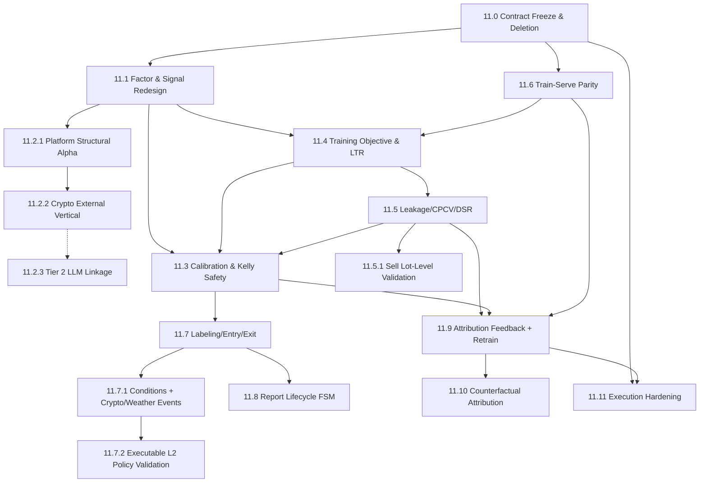

# Phase 11 — Alpha Quality & Closed-Loop Hardening 子phase索引

> 状态：生产级破坏式重构。**11.1 已落地并完成收尾闭环加固**（时间原生 EMA/MACD、
> 退出/卖出复用入场冻结因子面、共线默认 raw 面板 + 类别中性化、Indeterminate 置零 confidence、
> 小截面只允许截面统计或模型 artifact 内冻结的 `FrozenReferenceQuantile`）；**11.2.2 已落地**（crypto 外部垂直：两层向量、
> Tier 0/1 linkage、Binance 特征源、domain PIT、category 路由）；**11.4 已落地并完成生产级语义加固**
>（`as_of` 横截面 LTR、`rank_ic_weighted_ranknet` 诚实命名、TopN **rank-equal** token 伪组合、
> singleton 可观测丢弃、`rank_loss_group_count`、NDCG@k/Rank IC 诊断、argmin/Decimal→f64
> fail-closed；全局 runtime schema 的当前版本统一见下方权威版本账本）；
> **11.5 已落地**（Buy 侧 CPCV/DSR/PBO/purge/trial-grid，见其文档头部"闭环加固"）；
> **11.5.1 已落地**（Sell/Hold-vs-Exit lot 级 CPCV：`FoldRuntime`/`RankObservation` 泛化、
> residual-shares 状态机 + 路径分叉停止、activity-only lot-native Sharpe/DSR/PBO、null baseline uplift、
> Sell path-set DD/tail 硬门禁、UI 隐藏单路径 Backtest；CPCV family/target/horizon 现由 11.6
> ModelSpec/training contract 服务端冻结推导，UI 只读展示且请求不可覆盖）；
> **11.6 的 W0–W4、W6 代码与 Rust/UI/architecture/loopback/PostgreSQL/ClickHouse 门禁已在
> 2026-07-13 当前工作树重跑通过，但尚未达到目标环境 Phase Exit**；项目从未正式生产运行，
> 因此不建设旧库升级或数据搬运路径，W5 仅保留从空库初始化、重建 artifact、full parity、
> governed acknowledge 与 canary 的首次环境激活；
> **11.2.3 Tier 2 LLM linkage** 设计已冻结、待实现。
> 11.7 的基础执行/control contract 已收口；11.7.1 正在破坏式落地 Recommendation-owned typed
> condition 与 Crypto/Weather source/event/shadow 闭环；真实登录/RBAC/BookStore 状态驱动的受保护 UI/E2E
> 与当前 golden 已通过，不以静态页面替代；仓库中不存在改造前历史截图，不伪造 before evidence。
> 11.7.2 的 Runtime v15 / Dataset v5 / Model v5 / Policy v6 / Evidence v3、PIT CLOB market-info、
> Source Slice producer/ledger/strict replay、signed latency/retention readiness、cash-budget/fee provenance、
> Weather candidate state-machine fitter、56-fold/21-path CPCV/DSR/PBO/ESS、2× latency、typed Evidence
> sealing、独立 async Validate 和 PG→ClickHouse verified fact-delivery outbox 已落地；真实 Published
> research policy 与端到端激活仍受目标环境迁移/真实数据验收和
> 连续 24 小时 ReportOnly shadow 阻断；
> 11.0/11.2.1/11.3/11.7.2/11.8–11.11 其余工作仍在设计、实施或部分落地阶段。
>
> 父文档（概念真理）：
> [`../03-data-factor-model-pipeline.md`](../03-data-factor-model-pipeline.md)、
> [`../04-topn-report-and-recommendation.md`](../04-topn-report-and-recommendation.md)、
> [`../05-execution-risk-and-governance.md`](../05-execution-risk-and-governance.md)、
> [`../08-third-party-crates-and-ml-stack.md`](../08-third-party-crates-and-ml-stack.md)、
> [`../09-account-capital-position-reconciliation.md`](../09-account-capital-position-reconciliation.md)
>
> 兼容策略（逐条不可妥协，与全仓一致）：**零兼容、零 re-export、零向前兼容、零死语义**。
> 删除旧启发式常量、删除"写了但从不 emit"的枚举值、删除静默填零路径。不追求最小变更/最小侵入/
> 最小工作量;优先正确领域模型、语义精准、生产可维护性,必要时破坏式重构。

## 权威版本账本（当前）

本表是 Phase 11 唯一“当前版本”真相；11.0–11.6 文档中的版本只描述各子阶段完成时的历史波次。

| Contract | 当前版本 | 下一位 owner |
|---|---:|---|
| Runtime config | **v15** | 后续新增 wire 字段必须显式 bump 至 v16 |
| Feature schema | **v6** | 仅真实 schema 变更时 bump |
| Dataset artifact | **v5** | profile/source-slice lineage；旧 artifact audit-only |
| Model artifact | **v5** | profile/policy/source-slice lineage；旧 artifact audit-only |
| Trade policy artifact | **v6** | activation target + structural OOS + Evidence v3 ref |
| Evidence bundle | **v3** | 九类 WORM source/trial/replay/gate/validation identity |

11.11 只能引用本账本在实施当时的值，不得复制一份“当前版本”。项目未生产部署，schema、ClickHouse
表和 artifacts 从空基线重建；不提供旧 runtime parser、artifact loader、JSONB 双读、alias 或 re-export。

## 0. 为什么单独开 Phase 11

Phase 3–6 已把 quant-pivot 建成一套**工程治理达到生产级**的系统:真实 CLOB 签名下单；当前经 11.7
扩展为 24 项准入、
证据链对账、凭证 fail-closed、good_lp MILP、分数 Kelly、模型 publish/rollback/shadow 治理。

但一次针对**关键算法与模型训练是否生产级最佳实践 + 业务闭环语义是否精准**的深度审计,发现系统的
**"阿尔法层"与"研究反馈闭环"尚未生产级**。用一句话概括:

> **一个薄、手调、未校准的信号,被包在一套非常严谨的治理/执行/资金闭环里。执行侧闭环语义精准且
> fail-closed;研究侧闭环(训练 → 归因 → 再训练)并未闭合,且信号质量在方法论上未被证伪。**

Phase 11 的唯一目标:**把阿尔法层与研究反馈闭环拉到与执行层同等的生产级标准**,同时清除死语义与
静默降级。它是一次"跨 Phase 3/4/5/6 的加固与重构",不是新功能堆叠。

## 1. Phase 11 关闭的 23 个审计问题(逐点映射,一点不漏)

> 编号沿用审计报告的 23 点。每一点都必须有归属子phase,且在该子phase文档的 §1(目标与闭环定位)
> 与 §10(延后/缺口)显式回指本表。**任一点无归属即视为规划失败。**

| # | 审计问题(简述) | 归属子phase |
|---|---|---|
| 1 | 默认只启用 3/9 因子(`FactorsConfig::default` 只开 Liquidity + Momentum) | [11.1](11.1-factor-and-signal-redesign.md) |
| 2 | `ts.momentum` 恒等于 `simple_return`,与收益因子共线 | [11.1](11.1-factor-and-signal-redesign.md) |
| 3 | 归一化参数手调启发式(logistic k/x0),非学习;rank/zscore 需全截面 batch | [11.1](11.1-factor-and-signal-redesign.md) |
| 4 | 垂直/领域信号完全缺席(domain feature 恒 missing、domain factor 从不注册) | [11.2.1](11.2.1-platform-structural-alpha.md)(平台内结构) + [11.2.2](11.2.2-crypto-external-vertical.md)(crypto 外部) |
| 5 | 收益映射默认未校准启发式 `HeuristicReturnModel{300,500}` | [11.3](11.3-probabilistic-calibration-and-kelly.md) |
| 6 | 训练目标只有 rank IC + L2;下行/换手惩罚不在优化目标里 | [11.4](11.4-training-objective-learning-to-rank.md) |
| 7 | 泄漏防护只是时间戳扫描,非 purged/embargo/CPCV;无 DSR;rank_ic soft | [11.5](11.5-leakage-aware-validation-and-overfitting.md) |
| 8 | 无概率校准(Platt/Isotonic) | [11.3](11.3-probabilistic-calibration-and-kelly.md) |
| 9 | 发布不重扫泄漏(`LeakageFindings::default()`) | [11.5](11.5-leakage-aware-validation-and-overfitting.md) |
| 10 | 历史 registry PIT 返回 None → 离线/在线特征不对称 | [11.6](11.6-training-serving-parity-and-no-silent-zero.md) |
| 11 | classical ML 缺失非关键特征 `fill_missing:0.0`,违反禁止静默填零 | [11.6](11.6-training-serving-parity-and-no-silent-zero.md) |
| 12 | 默认二进制不链接 optimize/ml-classical;不开 lp-solver 返回空推荐 | [11.0](11.0-contract-freeze-and-deletion-inventory.md) |
| 13 | Kelly 的 q 来自未校准收益模型 → 系统性过押/错押 | [11.3](11.3-probabilistic-calibration-and-kelly.md) |
| 14 | TP/SL 由模型启发式曲线推导,不用经验 MFE/MAE | [11.7](11.7-labeling-entry-exit-closed-loop.md) |
| 15 | 退出结构最小化(partial/trailing/invalidation 恒空) | [11.7](11.7-labeling-entry-exit-closed-loop.md) |
| 16 | 入场触发只有 LimitPrice/Immediate;无 confirmation_window | [11.7](11.7-labeling-entry-exit-closed-loop.md) |
| 17 | 无 superseded 报告状态、无持久化 building、错过 tick 不补跑 | [11.8](11.8-report-lifecycle-fsm-completion.md) |
| 18 | FOK 来源是配置 `allow_market_orders`,非 recommendation 流动性要求;neg-risk | [11.7](11.7-labeling-entry-exit-closed-loop.md) |
| 19 | 06.5 归因→自动再训练完全未实现 → 研究闭环开环 | [11.9](11.9-attribution-feedback-and-auto-retraining.md) |
| 20 | 06.6 反事实因子归因未实现;`max_adverse_excursion_bps:None` | [11.10](11.10-counterfactual-factor-attribution.md) |
| 21 | factor governance 无 quality gate/shadow/WORM 审计 | [11.9](11.9-attribution-feedback-and-auto-retraining.md) |
| 22 | preflight `order_client_ready`/`exit_monitor_health` 是占位 | [11.11](11.11-execution-governance-hardening.md) |
| 23 | 死语义(DrawdownCap/Planned/superseded/EntryTriggerKind 未 emit) | [11.0](11.0-contract-freeze-and-deletion-inventory.md) + 各实现子phase |

## 2. 子phase索引

| 子phase | 标题 | 闭环定位 | 关闭点 | 文档 |
|---|---|---|---|---|
| 11.0 | Contract Freeze & Deletion Inventory | 语义精准地基 / 删除死语义 / build 硬化 | 12, 23 | [11.0](11.0-contract-freeze-and-deletion-inventory.md) |
| 11.1 | Factor & Signal Redesign | 因子多样性 + 截面归一化 | 1, 2, 3 | [11.1](11.1-factor-and-signal-redesign.md) |
| 11.2 | Polymarket Vertical Alpha (拆分索引) | — | 4 | [11.2](11.2-polymarket-vertical-alpha.md) |
| 11.2.1 | Platform-Internal Structural Alpha | 结构因子族 + neg-risk 全腿 + favorite-longshot 偏差表(11.3 提前件) | 4(前半) | [11.2.1](11.2.1-platform-structural-alpha.md) |
| 11.2.2 | Crypto External Vertical | 两层向量 + 分层 linkage + Binance 特征源 + category 路由 | 4(后半) | [11.2.2](11.2.2-crypto-external-vertical.md) |
| 11.2.3 | Tier 2 LLM Linkage Fallback | 离线 LLM 结构化抽取 + grounding gate + review queue | — (extends 11.2.2) | [11.2.3](11.2.3-tier2-llm-linkage.md) |
| 11.3 | Probabilistic Calibration & Kelly Safety | 校准 + 收益模型 + Kelly 安全 | 5, 8, 13 | [11.3](11.3-probabilistic-calibration-and-kelly.md) |
| 11.4 | Training Objective & Learning-to-Rank | 训练目标(LTR + 下行/换手) | 6 | [11.4](11.4-training-objective-learning-to-rank.md) |
| 11.5 | Leakage-Aware Validation & Overfitting Control | 防过拟合方法论(买方 WeightedFactor/classical) — **已落地** (model_run FK + publish_path_set_id bind + trial fail-closed + classical purged CV + publish label-horizon rescan;Sell → 11.5.1) | 7, 9 | [11.5](11.5-leakage-aware-validation-and-overfitting.md) |
| 11.5.1 | Sell-Side Lot-Level Leakage-Aware Validation | 防过拟合方法论套用到 Sell/Hold-vs-Exit 家族 — **已落地 + remediation**（residual-shares 状态机 + 路径分叉停止、activity-only DSR/PBO、null baseline uplift、Sell DD/tail 硬门禁；CPCV request 契约由 11.6 统一冻结） | — (11.5 落地中发现的覆盖缺口,不单独关闭审计点,见文档头部) | [11.5.1](11.5.1-sell-side-lot-level-validation.md) |
| 11.6 | Training-Serving Parity & No-Silent-Zero | 决策时钟、PIT catalog、FeatureCell、frozen transform、运行期 parity/latch — **W0–W4/W6 与全部本地/容器门禁已完成；W5 空库首次激活待执行** | 10, 11 | [11.6](11.6-training-serving-parity-and-no-silent-zero.md) |
| 11.7 | Executable Labeling, Entry & Exit Closed-Loop | TradePolicyArtifact + 可执行标签 + 审批即 Arm + 冻结退出策略 — **执行/control/operational closeout 与受保护 UI/E2E 已完成；真实 Published policy 激活受 11.7.2 阻断** | 14, 15, 16, 18 | [11.7](11.7-labeling-entry-exit-closed-loop.md) |
| 11.7.1 | Composable Entry Conditions + Crypto/Weather Events | typed AST + PIT facts/events + Recommendation shadow + vertical gates — **实施中** | — | [11.7.1](11.7.1-composable-entry-event-triggers.md) |
| 11.7.2 | Executable L2 Policy Validation & Research Activation | 完整冻结路径模拟 + structural volatility baseline + cash-budget + PIT fee + purged CPCV/uniqueness/DSR/PBO/ESS，交付至 ReportOnly shadow — **仓库契约已闭环：Weather/structural producers、56/21 CPCV、2× latency、Evidence v3、独立 Validate、分页 drilldown 与 fact outbox 已接通；物理迁移/真实数据验收与 24h shadow 待目标环境完成；真实 canary 已移交 11.11** | — (11.7 research activation gate) | [11.7.2](11.7.2-executable-l2-policy-validation.md) |
| 11.8 | Report Lifecycle FSM Completion | 报告生命周期语义 | 17 | [11.8](11.8-report-lifecycle-fsm-completion.md) |
| 11.9 | Attribution Feedback, Profile Expansion & Auto-Retraining | 研究反馈闭环 + factor governance + crypto/profile expansion + 跨 profile winner 资金治理 — **设计冻结、尚未实施；新增 wire 字段必须从当前 v15 显式升级** | 19, 21 | [11.9](11.9-attribution-feedback-and-auto-retraining.md) |
| 11.10 | Counterfactual Factor Attribution | 反事实归因 + MAE 回填 | 20 | [11.10](11.10-counterfactual-factor-attribution.md) |
| 11.11 | Execution Governance Hardening | 执行治理探针硬化 | 22 | [11.11](11.11-execution-governance-hardening.md) |

## 3. 依赖图



执行原则:

- **11.0** 是设计冻结点:锁定新枚举、删除清单、feature-gate 策略;后续子phase 按实际落地逐步 bump runtime schema。
  11.4 实施当时的历史 bump 是 `v8 → v9`（诚实命名 + TopN 伪组合 + 诊断 knobs）；它不是当前
  active contract，当前唯一版本见下方 11.6 基线。
- **11.1 / 11.6** 是数据地基：11.6 的 frozen input transform、immutable factor revision 和 parity
  facts 是后续模型 publish、11.9 drift/challenger 的硬前提；确定性 mismatch 不得由 drift 逻辑吞并。
- **11.4 → 11.5 → 11.3** 是模型可信链:先有正确目标,再有防过拟合验证,最后才有校准喂 Kelly。
  **11.5 → 11.5.1**:11.5 只给买方(WeightedFactor/classical)接方法论,证明 purge/CPCV/trial-grid/
  CSCV/DSR/PBO 算法正确;11.5.1 把同一套算法(设计上对"原子分裂单元"无感知)套用到 Sell/Hold-vs-Exit
  家族,只新增一个 lot 级组合回放引擎(`LotReplayBacktester`)与一个 `FoldModelSource` 实现,不重新发明
  算法层。11.5.1 不阻塞 11.7,也不被 11.7 阻塞(见 [11.5.1](11.5.1-sell-side-lot-level-validation.md)
  文档头部)。
- **11.7 → 11.8** 是产物表达力:退出/入场结构 + 报告生命周期语义。
- **11.9 → 11.10** 是研究闭环:归因反馈 + 自动再训练 + 反事实归因,闭合"开环"。
- **11.2 / 11.11** 相对独立,可并行。**11.2 已破坏式拆分为 [11.2.1](11.2.1-platform-structural-alpha.md)
  (平台内结构,先行) + [11.2.2](11.2.2-crypto-external-vertical.md)(crypto 外部垂直,**已落地**) + [11.2.3](11.2.3-tier2-llm-linkage.md)
  (Tier 2 LLM linkage 兜底,设计冻结、待实现)**,三篇合计
  **接管并取代 [`../phase-03/03.8-vertical-domain-closed-loop.md`](../phase-03/03.8-vertical-domain-closed-loop.md)**
  的垂直闭环设计(确定性优先 linkage 取代 LLM 优先;`ResolutionOracle` + basis 取代"特征源=结算源=Binance")。
  11.2.1 **提前**落地 11.3 的 `FavoriteLongshotBiasTable`(favorite-longshot 因子所需),11.3 正式落地时统一收敛
  治理(见 [11.3 §3.4](11.3-probabilistic-calibration-and-kelly.md))。runtime-config 由 11.2.1 bump 至 v4、
  11.2.2 再 bump 至 **v5**（历史里程碑）；`feature_schema_version` 由 11.2.1 bump 至 4、11.2.2
  再 bump 至 **5**（两层向量重构在 11.2.2）。当前实际 runtime config 已由后续已落地工作推进至
  **v15**，feature schema 保持 **v6**；这是 11.7.2 的唯一有效版本组合。Tier 2 LLM linkage
  不改 feature schema，但若实现时新增 runtime wire 字段，必须从届时当前版本显式 bump，
  不得静默改写 v15（见 11.2.3）。11.9 尚未实现；其 `feedback`/profile expansion 首次获得真实字段时
  必须显式升级至 **v16**。Dataset/model artifact 只接受 `format_version = 5`；runtime v15
  不意味着 feature v7。TradePolicy artifact 只接受 v6，Evidence bundle 只接受 v3。

## 4. 全局设计基线(贯穿全部子phase)

沿用 [`phase-03/README.md`](../phase-03/README.md) §3 的六条基线,并新增 Phase 11 专属五条:

1. **可解释优先**:任何新模型族(LTR/GBDT/校准器)必须能输出 recommendation-level 的因子贡献
   (见 11.10);无法解释到 recommendation level 的模型只能 shadow,不能 auto-execution(与 08 §15.5 一致)。
2. **校准是硬不变量**:任何进入 Kelly sizing 的 `expected_return`/`downside`/`P(win)` 必须来自
   **校准后**的模型输出;未校准 artifact 禁止 publish(11.3)。
3. **防过拟合是硬门禁**:任何 model version publish 前必须有 CPCV 多路径分布 + Deflated Sharpe +
   PBO 报告;`rank_ic` 升为**硬门禁**(11.5)。
4. **训练-服务零 skew**：`DecisionBoundary` 只推导一次 source cutoff；selection/feature/capture 共用
   durable PIT snapshot；训练与 serving 共用 fitted input transform；禁止当前投影回填历史、stub 伪值、
   静默填零和 category→generic fallback。确定性 parity mismatch 必须 revoke + latch（11.6）。
5. **零死语义**:任何 enum 值/config 字段/DTO 字段,要么在生产路径被 emit/消费,要么删除。新增
   `scripts/lint-dead-semantics.sh`(11.0)在 CI 强制。

## 5. 货币/数值不变量(与全仓一致)

- 货币/价格/shares/probability 一律 newtype(`Usd`/`Price`/`Shares`/`Probability`);`f64` 仅允许
  在训练矩阵/校准器/求解器边界,禁止泄漏到 money domain。
- NaN/inf 一律**拒绝样本**,禁止转 0/中性值静默通过。
- 所有 artifact(model/calibrator/dataset/backtest/attribution)有 `blake3:` canonical hash。
- Decimal ↔ f64 转换必须记录 scale/unit/missing policy。

## 6. 文档契约模板(每篇子phase固定 10 节顺序)

与 [`phase-03/README.md`](../phase-03/README.md) §7 / [`phase-05/README.md`](../phase-05/README.md) §7 一致:

1. **目标与闭环定位**(含回指 §1 关闭的审计点)
2. **删除 / 合并 / 重构清单**(加替代代码前必须删的 crate/模块/类型/config/enum;无则显式写"无")
3. **新领域类型 / 表 / ClickHouse fact**
4. **deploy-config key 与 runtime-config schema path**
5. **必建模块与 trait**(模块树 + verbatim Rust trait 签名)
6. **生产不变量与失败语义**(PIT、降级、hash、fail-closed)
7. **第三方 crate 引入**(允许/禁止 + feature gate)
8. **验收测试**(unit / component / integration 必须覆盖的路径)
9. **Blocker**(触发即判定失败)
10. **延后 / 缺口**(明确不做、留给后续)

## 7. 质量门禁(每个子phase收尾必跑)

```bash
cargo fmt --all --
cargo clippy --workspace --all-targets -- -D warnings
cargo clippy -p quant-pivot-research --features ml-classical,dataframe,optimize,lp-solver -- -D warnings
bash scripts/lint-architecture.sh
bash scripts/lint-quant-pivot-boundary.sh
bash scripts/lint-quant-pivot-errors.sh
bash scripts/lint-dead-semantics.sh   # 11.0 新增
bash scripts/lint-training-serving-parity.sh   # 11.6 新增
cargo test --workspace
cd ui && pnpm lint && pnpm check && pnpm test:unit && pnpm build:antdv-next
```

文档中的 `[x]` 只表示对应代码波次已实现，不替代本节当前合并态质量门，也不代表已在目标环境从空库
初始化、重建 artifact 或完成 governed 恢复。11.6 的 W5 是独立的首次环境激活操作；
实施清单见 [11.6 §7](11.6-training-serving-parity-and-no-silent-zero.md)，唯一可执行 SOP 见
[operations runbook §7.5](../../../operations/runbook.md)。

## 8. 与既有 Phase 06 设计文档的关系(零兼容处理)

Phase 06 中 `06.5`(attribution feedback & auto-retraining)与 `06.6`(counterfactual factor
attribution)是**设计文档,未落地**(审计点 19/20)。Phase 11 采取**破坏式接管**:

- [11.9](11.9-attribution-feedback-and-auto-retraining.md) **取代** 06.5,并把 champion-challenger、
  drift-triggered retraining、factor governance gates 一并纳入(06.5 原设计不含这些)。
- [11.10](11.10-counterfactual-factor-attribution.md) **取代** 06.6,并升级为 SHAP/counterfactual
  统一 attribution 引擎。
- 落地时:06.5/06.6 文档头部标注 `> SUPERSEDED by phase-11/11.9(11.10)`,不做 re-export、不保留旧
  seam 命名;新命名以 Phase 11 为准。
- 06.0/06.1(exit reinference / opportunistic sell)已落地,Phase 11 **不回推**,只在 11.7 复用其
  `ExitSignalEvaluator` seam。

## 9. 外部参考文献(权威来源,落地时逐条核对)

> 每篇子phase文档在 §5/§6 引用时必须带上下面对应链接。此处为总书目。

**防过拟合与验证方法论(11.5)**

- López de Prado, M. (2018). *Advances in Financial Machine Learning*, Wiley. Ch.7(purge/embargo)、Ch.12(CPCV)、Ch.11(backtest overfitting)。
- Purged cross-validation methodology: <https://github.com/eslazarev/purged-cross-validation/blob/main/docs/methodology.md>
- Purged cross-validation (Wikipedia): <https://en.wikipedia.org/wiki/Purged_cross-validation>
- Combinatorial Purged CV (ML4T): <https://ml4trading.io/docs/diagnostic/methods/cpcv/>
- Bailey & López de Prado (2014). *The Deflated Sharpe Ratio*, Journal of Portfolio Management 40(5)。
- Bailey & López de Prado (2012). *The Sharpe Ratio Efficient Frontier*, Journal of Risk 15(2)(PSR / Min Track Record Length)。

**概率校准(11.3)**

- scikit-learn Probability calibration: <https://scikit-learn.org/stable/modules/calibration.html>
- CalibratedClassifierCV: <https://scikit-learn.org/stable/modules/generated/sklearn.calibration.CalibratedClassifierCV.html>
- Calibration workflow(reliability + Brier): <https://metricgate.com/blogs/workflow-calibrating-predicted-probabilities/>
- MachineLearningMastery — calibrated classification: <https://machinelearningmastery.com/calibrated-classification-model-in-scikit-learn/>

**Kelly 与仓位(11.3)**

- MacLean, Thorp, Ziemba — *The Good and Bad Properties of the Kelly Criterion*: <https://www.stat.berkeley.edu/~aldous/157/Papers/Good_Bad_Kelly.pdf>
- Kelly criterion (Wikipedia): <https://en.wikipedia.org/wiki/Kelly_criterion>
- Advanced Kelly(edge uncertainty / 多注收缩 / 25% 总敞口上限): <https://comparenbet.org/guide-advanced-kelly>
- Nick Yoder — The Kelly Criterion(分数 Kelly 与回撤): <https://nickyoder.com/kelly-criterion/>

**训练目标 / Learning-to-Rank(11.4)**

- Poh, Lim, Zohren, Roberts (2020). *Building Cross-Sectional Systematic Strategies By Learning to Rank*: <https://arxiv.org/pdf/2012.07149v1> (SSRN: <https://doi.org/10.2139/ssrn.3751012>)
- LambdaRankIC — Directly Optimizing Rank IC: <https://arxiv.org/html/2605.00501>
- XGBoost Learning to Rank(LambdaMART): <https://xgboost.readthedocs.io/en/latest/tutorials/learning_to_rank.html>
- LambdaMART explained: <https://www.shaped.ai/blog/lambdamart-explained-the-workhorse-of-learning-to-rank>

**标注 / 元标注 / 退出(11.7)**

- Triple-Barrier method（历史方法参考；11.7.2 不采用其语义作为 executable policy label）: <https://paperswithbacktest.com/course/triple-barrier-method>
- Meta-labeling: <https://paperswithbacktest.com/course/meta-labeling>
- Triple-barrier & meta-labeling(mlfinlab docs): <https://random-docs.readthedocs.io/en/latest/implementations/tb_meta_labeling.html>

**因子归一化(11.1)**

- Coqueret & Guida — *Machine Learning for Factor Investing*, Ch.4 Data preprocessing: <https://www.mlfactor.com/Data.html>
- Cross-sectional normalization operators(winsor/zscore/rank/neutralize): <https://docs.skelfresearch.com/sigc/operators/cross-sectional/>
- Custom factor investing(winsorize→zscore→neutralize→IC 验证): <https://stockalpha.ai/alpha-learning/custom-factor-investing-building-your-own-alpha-factors>

**Polymarket 垂直信号(11.2)**

- Polymarket-v1 Database(favorite-longshot reversal、neg-risk、participant concentration): <https://arxiv.org/html/2606.04217v1>
- How Wise is the Crowd? Bias and Edge in Prediction Markets: <https://doi.org/10.5281/zenodo.18821864>
- Polymarket Create Order(GTC/GTD/FOK/FAK + negRisk): <https://docs.polymarket.com/trading/orders/create>
- Polymarket Orders Overview: <https://docs.polymarket.com/trading/orders/overview>
- NegRisk execution mechanics: <https://polymarkets.co.il/en/bots/polymarket-negrisk-execution/>

**训练-服务一致性(11.6)**

- Google Rules of ML（#29 保存 serving feature、#32 复用转换、#37 同样本同得分）：
  <https://developers.google.com/machine-learning/guides/rules-of-ml/>
- Feast point-in-time joins：<https://docs.feast.dev/getting-started/concepts/point-in-time-joins>
- TensorFlow Transform best practices：<https://www.tensorflow.org/tfx/guide/tft_bestpractices>
- scikit-learn MissingIndicator：
  <https://scikit-learn.org/stable/modules/generated/sklearn.impute.MissingIndicator.html>

**MLOps 自动再训练 / champion-challenger / drift(11.9)**

- Retraining & continual learning: <https://datarekha.com/mlops/retraining/>
- Champion-Challenger deployment: <https://www.snowflake.com/en/developers/guides/ml-champion-challenger-model-deployment/>
- Zero-touch model promotion(Vertex AI): <https://medium.com/@artur.fejklowicz/zero-touch-ml-model-promotion-building-a-fully-automated-champion-challenger-pipeline-on-google-aa0bb5cfc854>

**归因 / 反事实(11.10)**

- SHAP(GitHub): <https://github.com/shap/shap>
- SHAP docs: <https://shap.readthedocs.io/en/stable/>
- Interpretable ML Book — Shapley values: <https://christophm.github.io/interpretable-ml-book/shapley.html>
- Counterfactual SHAP (CF-SHAP), FAccT 2022: <https://facctconference.org/static/pdfs_2022/facct22-3533168.pdf>
