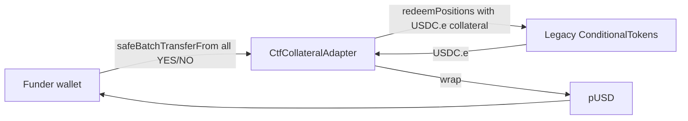
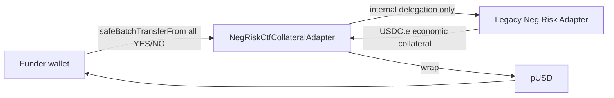
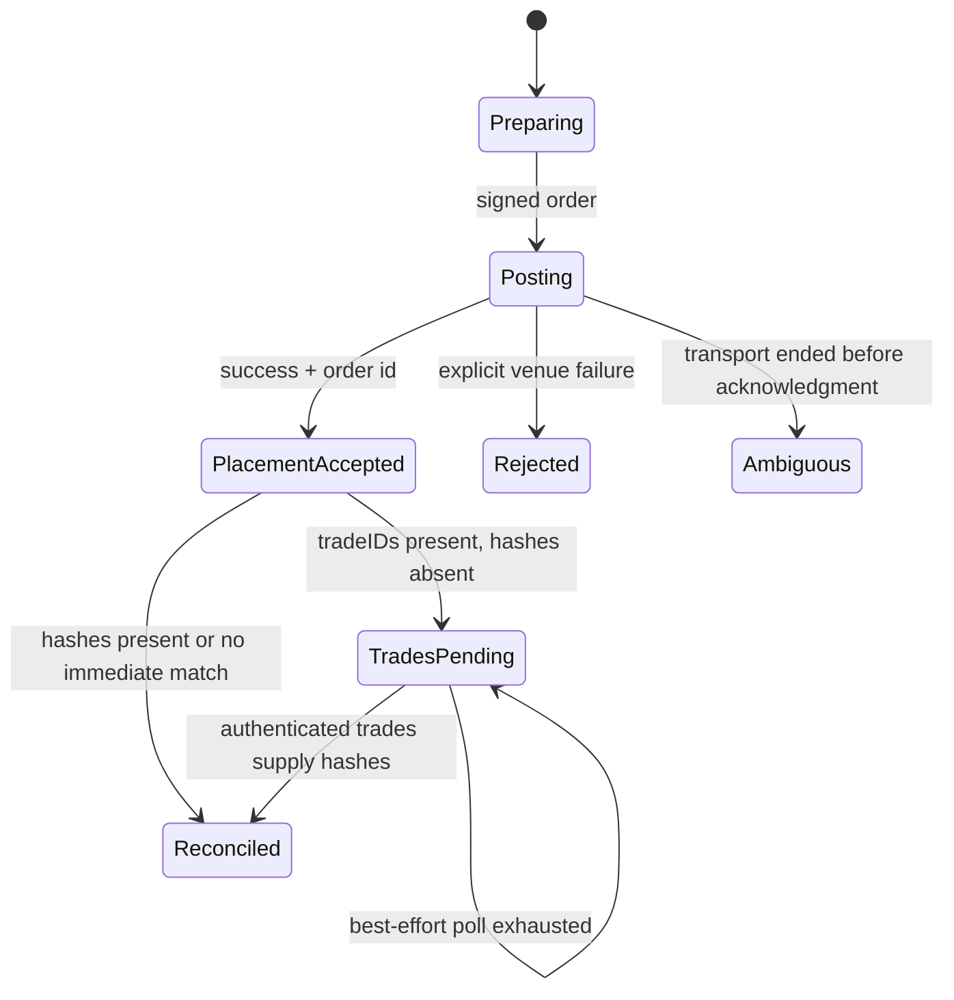
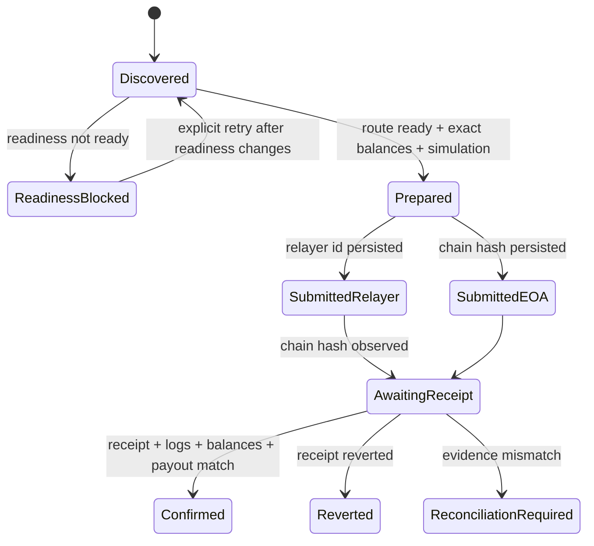

# 12.1 — Polymarket V2 Neg Risk, Rust SDK and Settlement Design

<!-- quant-pivot-lifecycle-contract:v1 -->
> **Lifecycle contract**
> - `lifecycle_assumption`: 项目尚未正式生产上线，当前状态为 `pre_production_resettable`，系统自有基线统一为 `boot` / schema version `1`。
> - `schema_data_version_impact`: 本文只定义未来 clean-break 目标；本轮不修改 schema、SDK、配置、订单、settlement 或 relayer 代码。
> - `pre_production_behavior`: 未来独立实施计划可在用户显式启动后修改 boot 基线；本轮所有实现项均为 `DEFERRED_OUT_OF_SCOPE`。
> - `production_frozen_behavior`: 一旦完成不可逆 production seal，未来实施必须重新审查链上地址、SDK 行为、migration、回滚与数据验证。
> - `rollback_and_data_verification`: 本文通过官方来源、当前代码定位和设计一致性审阅验收；不以真实链上资金动作验证。

> 状态：`DESIGN_COMPLETE_IMPLEMENTATION_DEFERRED`  
> 调研截止：2026-07-21（Asia/Shanghai）  
> 实施权限：本轮禁止。本文任何实现条目不得被解释为当前工作授权。

## 1. Executive decision

当前 settlement 实现不能通过“增加 Neg Risk 分支”或“单独升级 SDK”安全演进。未来实施必须同时关闭三条
相互耦合的正确性链：

1. **CLOB 回执身份链**：placement acknowledgment、order ID、trade IDs、transaction hashes 是不同
   时刻产生的一对多身份，不能压缩成一个 optional hash。
2. **V2 collateral route 链**：标准和 Neg Risk outcome token 都必须经当前 V2 collateral adapter
   赎回并转成 pUSD；legacy CTF/Neg Risk 只能作为 adapter 内部依赖，不是提交目标。
3. **资金确认链**：submission identity、relayer state、Polygon receipt、outcome balance consumption、
   pUSD logs 和 per-lot payout 必须形成同一份可恢复证据，不能用 receipt status 代替业务结算成功。

未来实现应作为独立资金安全 Phase 执行，不与测试清理或常规 SDK bump 混合。

## 2. Source ledger

### 2.1 官方文档

| Source | Retrieved | Authority used in this design |
|---|---|---|
| [Migrating to CLOB V2](https://docs.polymarket.com/v2-migration) | 2026-07-21 | V2 cutover、pUSD、exchange/domain 变化 |
| [Contracts](https://docs.polymarket.com/resources/contracts) | 2026-07-21 | Polygon chain 和当前合约地址唯一线上事实源 |
| [Redeem Tokens](https://docs.polymarket.com/trading/ctf/redeem) | 2026-07-21 | adapter route、全余额 redemption、pUSD payout |
| [Negative Risk Markets](https://docs.polymarket.com/advanced/neg-risk) | 2026-07-21 | Neg Risk event semantics、Gamma `negRisk` |
| [Gasless Transactions](https://docs.polymarket.com/trading/gasless) | 2026-07-21 | relayer authentication、wallet types、transaction states |
| [Polymarket changelog](https://docs.polymarket.com/changelog) | 2026-07-21 | server rollout 和 relayer response 变化的时间背景 |

### 2.2 官方源码快照

| Repository/source | Reference | Retrieved | Use |
|---|---|---|---|
| [rs-clob-client-v2](https://github.com/Polymarket/rs-clob-client-v2) | `v0.7.0`, commit `222143d321eba97d5711a848265eb9aab3bc7ff4` | 2026-07-21 | SDK async commit pipeline、features、MSRV |
| [SDK changelog](https://github.com/Polymarket/rs-clob-client-v2/blob/main/CHANGELOG.md) | same audited release | 2026-07-21 | `tradeIDs` alias、30s hash backfill、empty hash behavior |
| [ctf-exchange-v2](https://github.com/Polymarket/ctf-exchange-v2) | main commit `ccc0596074f4dfd62c944fbca4de252893b82b4b` | 2026-07-21 | adapter ABI、immutables、token flow、pause behavior |
| [CtfCollateralAdapter.sol](https://github.com/Polymarket/ctf-exchange-v2/blob/main/src/adapters/CtfCollateralAdapter.sol) | above commit | 2026-07-21 | standard redemption implementation |
| [NegRiskCtfCollateralAdapter.sol](https://github.com/Polymarket/ctf-exchange-v2/blob/main/src/adapters/NegRiskCtfCollateralAdapter.sol) | above commit | 2026-07-21 | Neg Risk internal legacy dependency/wrapped collateral |
| [builder-relayer-client](https://github.com/Polymarket/builder-relayer-client) | main commit `9122f6fb1856f1ecfe4406685bfa19a2c5a7b290` | 2026-07-21 | Safe/Proxy signing、gas estimation、wire shape |

官方文档页面本身不提供 immutable version；未来实施启动时必须重新获取地址页和上述仓库 HEAD，将差异写入
新的 source review。本文的地址和源码 commit 不能在 production seal 后被无条件沿用。

## 3. Official facts versus design inferences

### 3.1 官方事实

- CLOB V2 于 2026-04-28 上线；production 不再支持 V1 SDK 和 V1-signed orders。
- Polygon mainnet chain ID 为 137。
- 当前合约地址如下：

| Role | Address | Application may submit? |
|---|---|---|
| CTF Exchange V2 | `0xE111180000d2663C0091e4f400237545B87B996B` | order signing target, not redemption target |
| Neg Risk CTF Exchange V2 | `0xe2222d279d744050d28e00520010520000310F59` | Neg Risk order signing target, not redemption target |
| Conditional Tokens | `0x4D97DCd97eC945f40cF65F87097ACe5EA0476045` | reads only in target settlement design |
| pUSD | `0xC011a7E12a19f7B1f670d46F03B03f3342E82DFB` | token reads/log verification |
| Standard collateral adapter | `0xAdA100Db00Ca00073811820692005400218FcE1f` | standard V2 redemption target |
| Neg Risk collateral adapter | `0xadA2005600Dec949baf300f4C6120000bDB6eAab` | Neg Risk V2 redemption target |
| Legacy Neg Risk adapter | `0xd91E80cF2E7be2e162c6513ceD06f1dD0dA35296` | **never** an application/relayer target |

- 官方地址页明确声明 legacy Neg Risk adapter 的直接 relayer action 已退役。
- `NegRiskCtfCollateralAdapter` 源码仍把 legacy adapter 存为 immutable `NEG_RISK_ADAPTER`，并使用其
  wrapped collateral。这是 wrapper 内部依赖，不与“禁止直接提交”矛盾。
- 两个 V2 adapter 都通过 `redeemPositions(address,bytes32,bytes32,uint256[])` 暴露 redemption。
- Adapter 获取调用者在 condition 下的完整 YES/NO balance；调用没有 amount 参数。
- Standard adapter 通过 legacy CTF 赎回 USDC.e，再 wrap 为 pUSD 返回调用者。
- Neg Risk adapter 使用 wrapped-collateral position IDs，通过 legacy Neg Risk adapter 内部赎回，最终
  同样 wrap 为 pUSD。
- 调用者必须向**当前 route adapter**设置 ERC1155 operator approval。
- Adapter 可以因 USDC.e 对应的 paused state 拒绝操作。
- SDK 0.7.0 修复 `tradeIDs` 反序列化，并在成功 placement 后用最长约 30 秒的 best-effort trades polling
  补齐 transaction hashes；polling 失败不会把成功 placement 改成 error。
- Relayer transaction ID 是 relayer 资源身份；chain hash 在之后的状态查询中出现。

### 3.2 系统设计推导

以下是基于官方行为和 quant-pivot 资金不变量的设计结论，不应伪装成官方 API 承诺：

- 因 adapter sweep 完整余额，自动 redemption 前必须证明 wallet condition balance 与系统 open lots 完全一致。
- `receipt.status == success` 不足以证明业务完成；错误 target 或零余额调用可能成功但没有产生预期 payout。
- readiness 必须读取合约 code、immutables、pause 和 approval，不能只验证 RPC 可连通。
- relayer ID 和 chain hash 必须使用互不兼容的新类型及不同数据库列。
- order ID 与 trade IDs/chain hashes 是一对多关系，必须用 child ledger 表达。
- SDK 0.7 的内部 polling 与应用 hard timeout 必须被当作一个共同时序设计，不可独立 bump。

## 4. Current implementation gap matrix

以下行号基于 2026-07-21 工作树；未来实施时以符号检索为准。

| Gap | Current state | Risk | Official basis | Target design | Future acceptance evidence |
|---|---|---|---|---|---|
| SDK version/features | workspace `Cargo.toml:155` 使用 `version = "0.6"` 并启用 `ctf`；`Cargo.lock:7505` 为 0.6.0 | 缺少 async commit fixes；未使用 feature 增加 legacy contract surface | SDK 0.7.0 changelog/features | 精确 pin audited version；删除未使用 `ctf` | lockfile exact version、feature tree、workspace build |
| Outer order timeout | `clob/mod.rs:607` 用 app timeout 包裹整个 `sdk.post_order`；配置为 15s | 订单可能成功，SDK 正在 30s hash polling，future 被取消并误报 ambiguous | SDK 0.7.0 30s best-effort poll | hard budget 覆盖 SDK poll + transport margin；区分 placement 与 enrichment 语义 | paused-time tests covering 30s/outer cap |
| Response identity loss | `clob/mod.rs:253-260` 只取 `transaction_hashes.first()` | 丢失 `trade_ids` 和多 hash，无法精确恢复 | `PostOrderResponse.trade_ids`/hash collection | response 保存完整 typed collections | wire tests with multiple trades/hashes |
| Domain cannot express trades | `domain/order/clob.rs:28-35` 只有 optional string `tx_hash` | order 与 fills/transactions 的一对多关系被压平 | async execution pipeline | `VenueTradeId` + `ExecutionTradeRef` child ledger | schema/repository/reconciliation tests |
| Venue facade repeats loss | `execution/order_client.rs:164-203` 仍只有 optional string hash | core 无法弥补 API 层信息损失 | same | `VenueSubmitResult` 传递所有 refs | dispatcher/reconciliation tests |
| Wrong standard target | `api/ctf/mod.rs:24-35,258-323` 直接调用 legacy ConditionalTokens | V2 outcome token 的 collateral base 为 USDC.e；传 pUSD 可形成零效果成功或错误 redemption | V2 redeem docs/adapter source | submission target 固定为 Standard V2 collateral adapter | ABI target/calldata/local-chain tests |
| Neg Risk manual fallback | `settlement_redeem.rs:802-814` 所有 Neg Risk 进入 string `ManualRequired` | 自动闭环缺失，且 failure reason 非 typed | Neg Risk docs/V2 adapter | `SettlementRoute::NegRiskV2` | route/system tests |
| Relayer identity confusion | `settlement_redeem.rs:242-243,297-306,742-750` 把 relayer ID 暴露、解析并持久化为 tx hash | 非 hex relayer ID 可能解析失败；重启恢复查询错误资源 | gasless state model | tagged submission ID；relayer ID 立即落库，chain hash 后补 | restart/polling tests |
| Lazy credential readiness | `settlement_redeem.rs:221-288` 在首次 redeem 才构造 relayer | admission 可以接受一个实际不可执行的 auto settlement | relayer prerequisites | boot/readiness 只读评估；缺凭证阻止 auto admission | readiness matrix tests |
| Weak confirmation | `settlement_redeem.rs:900-945` receipt 后按 payout vector 直接分配并确认 | 未要求余额归零、pUSD logs/delta 与 expected payout 一致 | adapter sweep/token flow | receipt + logs + post balances + exact payout 四重确认 | local-chain negative tests |
| Mixed persistence identity | `domain/quant/settlement.rs:24-73` 只有 `tx_hash`、`index_sets_json`、string error | relayer/EOA、route、target、failure semantics 无法审计 | derived design | route/submission/failure/reconciliation typed columns | migration + repository tests |
| Relayer gas semantics | current relayer builder 使用固定 gas budget | 可能高估或在协议变化后失配 | official builder-relayer source | estimate gas；明确 fallback | golden wire + estimate/fallback tests |
| Historical rows | existing rows 没有 route/target/submission kind | 无法安全自动恢复旧 submitted rows | derived design | confirmed immutable；unfinished legacy rows转 reconciliation-required | migration fixture tests |

## 5. Target domain model

### 5.1 Routing and readiness

```rust
enum SettlementRoute {
    StandardV2,
    NegRiskV2,
}

enum SettlementSubmissionId {
    EoaTxHash(EvmTransactionHash),
    RelayerTransactionId(RelayerTransactionId),
}

struct SettlementReadiness {
    route: SettlementRoute,
    wallet_kind: ExecutionWalletKind,
    funder: EvmAddress,
    target_adapter: EvmAddress,
    checked_at_block: u64,
    status: SettlementReadinessStatus,
    reasons: Vec<SettlementReadinessReason>,
}
```

`SettlementReadinessReason` 必须是封闭 tagged enum，至少包括：

- `WrongChain`
- `ContractCodeMissing`
- `ContractIntrospectionMismatch`
- `AdapterPaused`
- `OutcomeTokenApprovalMissing`
- `RelayerCredentialsMissing`
- `WalletTopologyMismatch`
- `WalletNotSupported`
- `RpcUnavailable`
- `EmergencyHaltActive`
- `SystemLotBalanceMismatch`

Reason 中地址、chain、expected/actual 等诊断字段必须 typed；不使用字符串解析决定控制流。

### 5.2 Order/trade identity

```rust
struct VenueTradeId(String);

struct ExecutionTradeRef {
    execution_order_id: ExecutionOrderId,
    trade_id: VenueTradeId,
    transaction_hash: Option<EvmTransactionHash>,
    status: ExecutionTradeRefStatus,
    first_observed_at: DateTime<Utc>,
    last_observed_at: DateTime<Utc>,
}
```

一个 venue order 可以对应多个 trade refs；hash 缺失表示 async execution 尚未补全，不表示失败。

### 5.3 Settlement failure and recovery

`SettlementRedeemFailureCode` 负责业务失败分类，`last_error` 只保留诊断，不参与状态机。至少包括：

- `RouteNotReady`
- `BalanceMismatch`
- `SimulationReverted`
- `SubmissionRejected`
- `RelayerTerminalFailure`
- `OnChainReverted`
- `ReceiptEvidenceMismatch`
- `PayoutMismatch`
- `LegacyRouteRequiresReconciliation`

`SettlementReconciliationState` 至少包括：

- `NotRequired`
- `AwaitingRelayerHash`
- `AwaitingReceipt`
- `EvidenceMismatch`
- `OperatorReviewRequired`
- `Reconciled`

## 6. Contract topology and introspection

### 6.1 Standard V2 route



Readiness must verify:

- chain ID 137；adapter/CTF/pUSD/USDC.e 均有 code。
- `CONDITIONAL_TOKENS` 等于 expected CTF。
- `COLLATERAL_TOKEN` 等于 pUSD。
- `USDCE` 等于 expected USDC.e。
- adapter 对 USDC.e 不处于 paused。
- `CTF.isApprovedForAll(funder, standard_adapter)` 为 true。

### 6.2 Neg Risk V2 route



在标准 introspection 基础上额外验证：

- `NEG_RISK_ADAPTER` 等于明确命名的 legacy **internal dependency**。
- `WRAPPED_COLLATERAL` 等于 legacy adapter `wcol()`。
- 应用 submission target 始终为 current Neg Risk collateral adapter。
- `CTF.isApprovedForAll(funder, neg_risk_adapter)` 为 true。

地址常量应按能力分型，禁止返回普通 `EvmAddress` 后由调用方任选：

- `StandardSettlementTarget`
- `NegRiskSettlementTarget`
- `LegacyNegRiskInternalDependency`

## 7. Submission flows

### 7.1 EOA

1. Resolve frozen route from market metadata。
2. Load readiness at a bounded-fresh block。
3. Read full YES/NO balances and match system lots exactly。
4. Build calldata against route adapter。
5. `eth_call` from funder/signer。
6. Persist prepared evidence and calldata hash。
7. Submit EOA transaction；persist chain hash before waiting。
8. Poll Polygon receipt/finality。
9. Verify logs、post balances、pUSD payout。
10. Atomically confirm lots/capital/audit state。

EOA signer 必须等于 funder，否则 readiness fails closed。

### 7.2 Proxy and Gnosis Safe

1–6 与 EOA 相同，但 simulation `from` 为 funder wallet。

7. 根据 wallet kind 构造 official-equivalent Proxy/Safe signed request。
8. Relayer `/submit` 成功后立即持久化 `RelayerTransactionId`，不等待 chain hash。
9. 轮询 `/transaction?id=...`；`NEW/EXECUTED/MINED` 均为 pending。
10. 获得 chain hash 后持久化，并由 Polygon RPC 验证 receipt/finality。
11. 执行与 EOA 相同的业务证据确认。

Relayer 报告 `CONFIRMED` 不能替代 Polygon receipt；`FAILED/INVALID` 是 terminal typed failure。

## 8. State machines

### 8.1 SDK placement/trade/hash



`PlacementAccepted` 之后的 hash enrichment 失败不能退回 `Rejected` 或丢失 order/trade identities。

### 8.2 Settlement lifecycle



自动重试只允许发生在还没有 durable submission identity 的状态。已持久化 EOA hash 或 relayer ID 后，
worker 只能恢复/查询，不能重新提交。

## 9. Readiness and governed approvals

### 9.1 Readiness API target

未来 API：

- `GET /api/quant/settlement-readiness`
- 返回 account、wallet topology、StandardV2/NegRiskV2 每条 route 的 typed status。
- 只读，不触发 approval、connect-on-first-use 或 transaction simulation mutation。

### 9.2 Approval workflow target

未来 API：

- `POST /api/quant/settlement-approvals/preflight`
- `POST /api/quant/settlement-approvals/apply`

Preflight token 必须绑定：

- actor / role / acknowledgment
- funder / signer / wallet kind
- chain ID / observed block
- route / exact adapter / desired approved boolean
- exact calldata hash
- expiration
- idempotency key

`apply` 同时支持 authorize 和 revoke。系统不得在 bootstrap 自动设置 unlimited approval，也不得授权 legacy
Neg Risk adapter。EOA 直接提交；Proxy/Safe 走 relayer，但仍使用独立 submission identity 和 recovery。

## 10. Persistence target

### 10.1 Execution trade refs

新增一对多 child ledger，目标约束：

- unique `(execution_order_id, trade_id)`。
- 同一 trade ID 不得归属两个 execution orders。
- transaction hash 可空并可后补，更新必须幂等。
- 记录 first/last observed timestamps 和 source endpoint。
- order response 与首次 trade refs 在同一 PostgreSQL transaction 中持久化。

### 10.2 Settlement redeems

未来 `quant_settlement_redeem` 必须显式表达：

- `route`
- `target_adapter`
- `submission_kind`
- `relayer_transaction_id`
- `transaction_hash`
- `expected_payout_usd`
- `actual_payout_usd`
- `failure_code`
- `reconciliation_state`
- `calldata_hash`
- `prepared_block_number`
- typed pre/post balance evidence
- receipt block/hash/status and decoded pUSD log evidence

`index_sets_json` 删除：标准/Neg Risk binary route 的 index sets 是 route contract，不是每行自由 JSON。
`last_error` 可保留为诊断列，但不得决定 FSM 或 HTTP status。

### 10.3 Historical records

- `Confirmed` 历史行保持不可变，并保留实际 submission target/identity 的迁移证据。
- 未提交的旧行可以从新 readiness 重新准备。
- 已提交但身份含混的旧行迁移为 `LegacyRouteRequiresReconciliation`，禁止自动重发。
- 无法证明 target、relayer ID/hash 或 payout 的记录必须进入 operator review，不得合成证据。

项目在 pre-production resettable 状态时，未来计划可以选择 fresh boot；一旦 production sealed，必须使用
前向 migration 并在独立计划中重新审批。本文件不替未来实施者做环境数据销毁决定。

## 11. Confirmation evidence

未来 `Confirmed` 必须同时满足：

1. Polygon receipt 成功并达到 configured finality。
2. Receipt transaction target 等于冻结的 current route adapter。
3. Calldata hash 等于 prepared evidence。
4. funder 的目标 outcome balances 已按 adapter 语义被消费。
5. pUSD Transfer/mint logs 能证明实际 payout 到 funder。
6. funder pUSD balance delta 与 logs 相容；delta 作为交叉验证而非唯一事实源。
7. actual payout 与 full-balance × payout vector 的 expected payout 以 6 decimals 精确相等。
8. per-lot allocation 总和等于 actual payout。
9. lot close、capital release、settlement confirmation 在同一 PostgreSQL transaction 中完成。

任何一项不满足都进入 `ReconciliationRequired`，不得确认或释放资本。

## 12. Admission and fail-closed policy

- `HoldToResolution + Auto` 的 intent 只有在对应 route readiness 为 Ready 时才允许创建。
- 缺 approval/credential/code/introspection 或处于 paused 时，用户只能选择明确的 Manual settlement；系统
  不在 worker 执行时静默 downgrade。
- Settlement worker 可以在 enabled 状态注册，但 readiness 不通过时不得提交。
- Emergency halt 默认阻止新 redemption；是否允许资金回收必须是显式 governed policy，不由代码猜测。
- 链上余额超过或少于系统 lots 时一律阻止 auto redemption。

## 13. UI target

未来 operator console 只展示服务端 typed truth：

- account-level route readiness 和最后检查 block/time。
- exact missing approval、credential、paused/introspection mismatch reason。
- EOA hash 与 relayer ID 分开展示，chain hash 出现后关联。
- prepared/submitted/awaiting receipt/reconciliation required/confirmed 状态。
- expected vs actual payout、outcome balance before/after、receipt/log evidence。
- governed approve/revoke preflight 和精确 acknowledgment。

UI 不根据 `neg_risk`、wallet kind 或字符串 error 自己推导 readiness。

## 14. Future test matrix

| Layer | Scenarios | External mutation |
|---|---|---|
| Unit | route selection、typed reason、state transitions、payout arithmetic、idempotency keys | none |
| SDK contract/WireMock | immediate hashes、`tradeIDs` delayed hashes、empty hash、poll exhaustion、trade lookup failure、outer hard cap | none |
| ABI contract | exact target/calldata、immutable decoders、approval call、pUSD log decoder | none |
| Local chain | Standard/Neg Risk adapters、all-balance sweep、paused、missing approval、revert、wrong immutable、payout mismatch | disposable local chain only |
| Repository | one-to-many trade refs、submission identity、restart recovery、historical migration | disposable PostgreSQL |
| System | EOA/Proxy/Safe orchestration against local contracts/relayer stub | disposable environment only |
| Public smoke | Polygon chain/code/immutable/pause reads；Gamma/CLOB public compatibility | read-only |
| Account smoke | authenticated trades/account/readiness reads | credentialed read-only |
| Manual production | explicit approval/revoke/small funded redemption runbook | requires separate operator authorization |

自动 CI 永远禁止真实 order、approval、revoke、redeem。Mainnet public smoke 不得持有 signer，不得构造可提交 client。

## 15. Rollout, monitoring and rollback target

未来独立实施应按以下顺序：

1. SDK/order identity schema 与 reconciliation 先落地，但 submission 行为保持禁用。
2. V2 contract introspection/readiness 只读上线。
3. Local-chain/system tests 关闭所有 negative paths。
4. Production public-read smoke 验证 code/immutables。
5. Governed approval 功能上线，默认不自动执行。
6. 小额人工 StandardV2 redemption。
7. 小额人工 NegRiskV2 redemption。
8. ReportOnly 观察 reconciliation/readiness。
9. 经独立批准后才允许 Auto admission。

Rollback 只允许：停止 admission/worker、撤销 approval、继续恢复已经持久化的 submission。已提交交易不能通过
数据库回滚撤销；不得删除 ambiguous/submitted evidence 后重发。

必须监控：

- readiness status/reason by route/wallet
- approval changes
- submitted without chain hash age
- receipt finality latency
- reconciliation-required count
- expected/actual payout mismatch
- outcome balance mismatch
- relayer terminal states

## 16. Deferred implementation inventory

以下清单只用于未来独立计划，不属于 Phase 12 当前实施。状态不得在本轮改变。

| ID | Status | Future action | Acceptance boundary |
|---|---|---|---|
| NR-DEFERRED-001 | DEFERRED_OUT_OF_SCOPE | 精确升级官方 Rust SDK并清理未使用 feature | audited version/source、workspace gates |
| NR-DEFERRED-002 | DEFERRED_OUT_OF_SCOPE | 重构 order timeout/async enrichment 语义 | successful placement 不被 enrichment timeout 逆转 |
| NR-DEFERRED-003 | DEFERRED_OUT_OF_SCOPE | 保存完整 trade IDs/transaction hashes | multi-trade contract tests |
| NR-DEFERRED-004 | DEFERRED_OUT_OF_SCOPE | 新增 execution trade refs persistence | one-to-many/idempotent repository tests |
| NR-DEFERRED-005 | DEFERRED_OUT_OF_SCOPE | 按 trade ID 重构 order reconciliation | delayed hash/restart recovery tests |
| NR-DEFERRED-006 | DEFERRED_OUT_OF_SCOPE | 实现 StandardV2/NegRiskV2 settlement gateway | exact adapter target/local-chain tests |
| NR-DEFERRED-007 | DEFERRED_OUT_OF_SCOPE | 实现 contract code/immutable/pause introspection | fail-closed readiness matrix |
| NR-DEFERRED-008 | DEFERRED_OUT_OF_SCOPE | 实现 governed approval preflight/apply/revoke | token binding/idempotency/authz tests |
| NR-DEFERRED-009 | DEFERRED_OUT_OF_SCOPE | 实现 EOA/Proxy/Safe submission | official golden wire/local system tests |
| NR-DEFERRED-010 | DEFERRED_OUT_OF_SCOPE | 分离 relayer ID、chain hash并实现 polling | state/restart recovery tests |
| NR-DEFERRED-011 | DEFERRED_OUT_OF_SCOPE | 实现 receipt/log/balance/payout 四重确认 | negative evidence mismatch tests |
| NR-DEFERRED-012 | DEFERRED_OUT_OF_SCOPE | settlement schema 与历史数据迁移 | migration fixtures/rollback audit |
| NR-DEFERRED-013 | DEFERRED_OUT_OF_SCOPE | readiness/approval API 与 operator UI | API contract/authz/E2E |
| NR-DEFERRED-014 | DEFERRED_OUT_OF_SCOPE | admission fail-closed 与 worker activation | no silent downgrade system tests |
| NR-DEFERRED-015 | DEFERRED_OUT_OF_SCOPE | local-chain deterministic test suite | Standard/Neg Risk/approval/paused/revert coverage |
| NR-DEFERRED-016 | DEFERRED_OUT_OF_SCOPE | public/account read-only smoke | no signer/no money-moving proof |

## 17. Design acceptance for this Phase

本轮只对文档进行以下验收：

- 官方来源、检索日期、SDK release commit、contract/relayer source commit 均已记录。
- 官方事实和系统推导明确分栏。
- 每个已知当前缺口均有代码位置、风险、依据、目标和未来证据。
- 类型、route、状态机、persistence、API、UI、测试、rollout、rollback 已 decision-complete。
- 所有实现项均为 `DEFERRED_OUT_OF_SCOPE`。
- 本轮 Git diff 未修改 SDK、order response、settlement、relayer、migration、readiness/approval 或 settlement UI。

