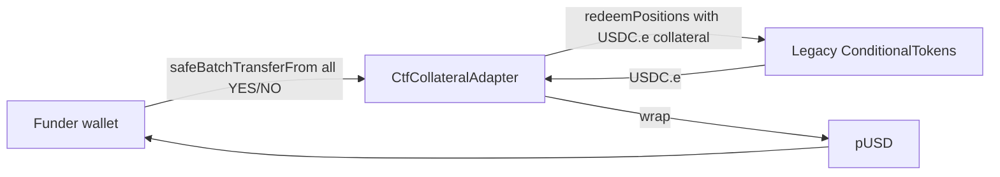
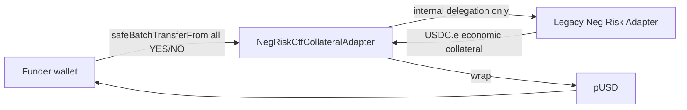
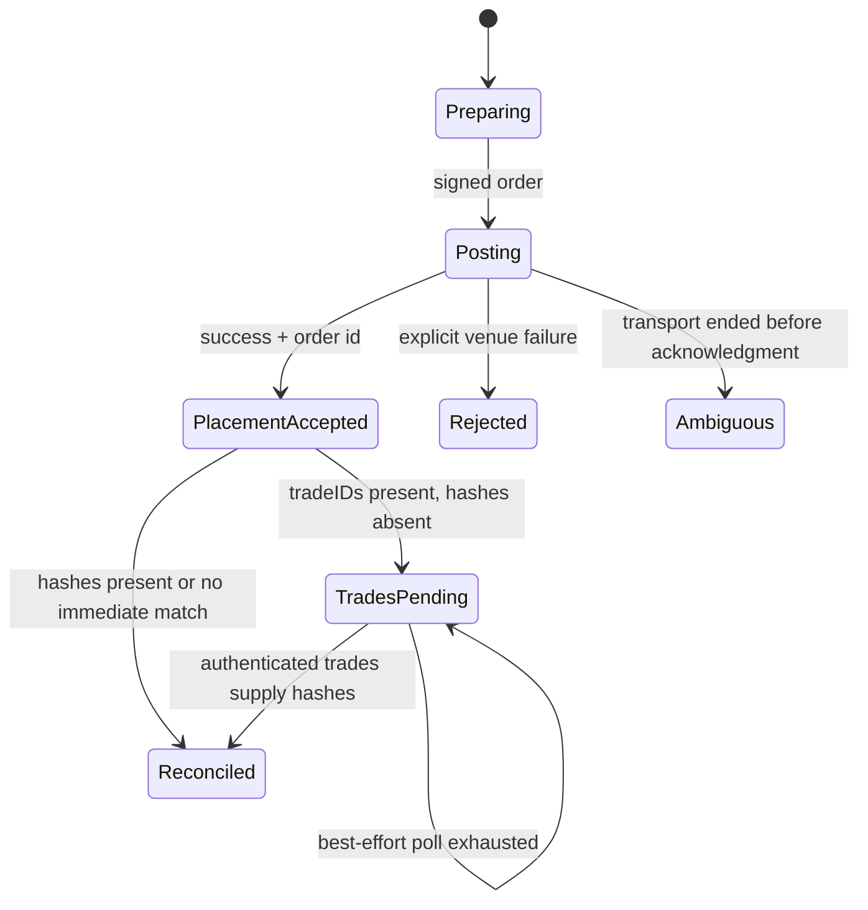
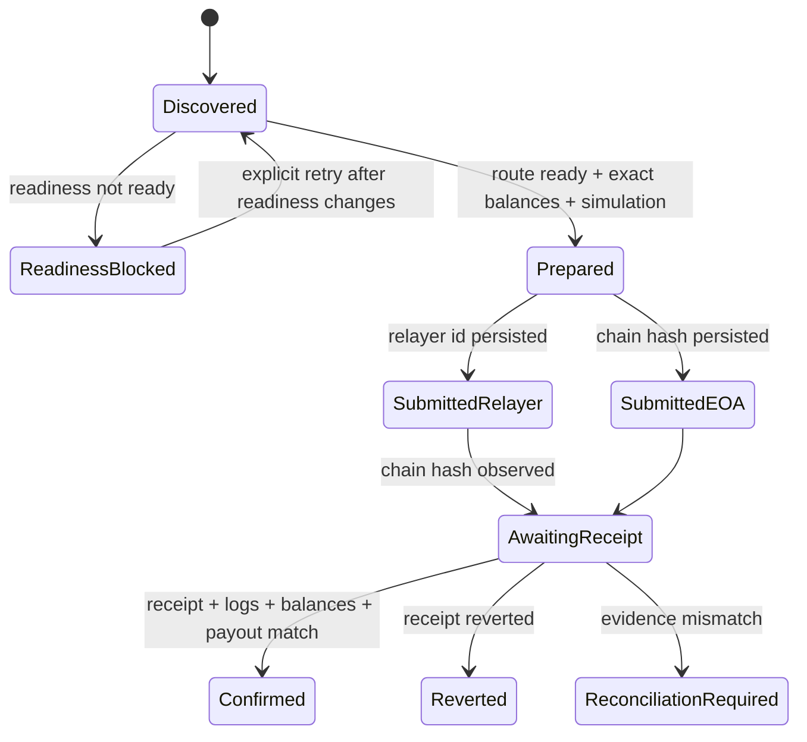

# 12.1 — Polymarket V2 Neg Risk, Rust SDK and Settlement Design

<!-- quant-pivot-deployment-contract:v1 -->
> **Deployment contract**
> - `fresh_boot_assumption`: 项目尚未正式生产上线，将从全新 `boot` / schema version `1` 部署；仓库和数据库不保存 lifecycle seal 状态。
> - `schema_data_version_impact`: 本专项直接重塑 canonical boot v1；不提供旧 schema、旧 DTO、旧配置、legacy reader、dual write 或 compatibility migration。
> - `pre_deployment_behavior`: 用户已于 2026-07-22 显式启动实施；允许 clean-break 与 fresh bootstrap，但任何实际数据销毁仍需操作者单独授权。
> - `post_deployment_behavior`: runtime `SettlementWritePolicy` 默认 `Disabled`；schema 可通过正常前向 migration 演进，资金写入只由实时 admission、fresh capability、精确授权与 runtime control 决定，不存在文件 release seal。
> - `rollback_and_data_verification`: 自动验证只使用 deterministic/local-chain、disposable infrastructure 和 public/account read-only smoke；真实 order、approval、redeem、canary 均需独立授权。

> 状态：`ACTIVE_EXECUTION_LEDGER`<br>
> 调研基线：2026-07-21；实施启动：2026-07-22（Asia/Shanghai）<br>
> 实施权限：允许修改代码、boot v1、配置、API、UI 与测试；禁止真实 Polygon 资金动作、数据销毁、commit 和 push。

## 1. Executive decision

当前 settlement 实现不能通过“增加 Neg Risk 分支”或“单独升级 SDK”安全演进。本次实施必须同时关闭三条
相互耦合的正确性链：

1. **CLOB 回执身份链**：placement acknowledgment、order ID、trade IDs、transaction hashes 是不同
   时刻产生的一对多身份，不能压缩成一个 optional hash。
2. **V2 collateral route 链**：标准和 Neg Risk outcome token 都必须经当前 V2 collateral adapter
   赎回并转成 pUSD；legacy CTF/Neg Risk 只能作为 adapter 内部依赖，不是提交目标。
3. **资金确认链**：submission identity、relayer state、Polygon receipt、outcome balance consumption、
   pUSD logs 和 per-lot payout 必须形成同一份可恢复证据，不能用 receipt status 代替业务结算成功。

未来实现应作为独立资金安全 Phase 执行，不与测试清理或常规 SDK bump 混合。

## 2. Source ledger

### 2.1 官方文档

| Source | Retrieved | Authority used in this design |
|---|---|---|
| [Migrating to CLOB V2](https://docs.polymarket.com/v2-migration) | 2026-07-21 | V2 cutover、pUSD、exchange/domain 变化 |
| [Contracts](https://docs.polymarket.com/resources/contracts) | 2026-07-22T15:08:33Z | 页面明确自称合约地址 `single source of truth`；作为新 submission target 的 authoritative source |
| [Redeem Tokens](https://docs.polymarket.com/trading/ctf/redeem) | 2026-07-21 | adapter route、全余额 redemption、pUSD payout |
| [Negative Risk Markets](https://docs.polymarket.com/advanced/neg-risk) | 2026-07-21 | Neg Risk event semantics、Gamma `negRisk` |
| [Gasless Transactions](https://docs.polymarket.com/trading/gasless) | 2026-07-21 | relayer authentication、wallet types、transaction states |
| [Polymarket changelog](https://docs.polymarket.com/changelog) | 2026-07-22T15:08:33Z | 2026-07-14 条目独立 corroborate current Neg Risk adapter；另记录 server rollout 和 relayer response 变化 |

### 2.2 官方源码快照

| Repository/source | Reference | Retrieved | Use |
|---|---|---|---|
| [rs-clob-client-v2](https://github.com/Polymarket/rs-clob-client-v2) | `v0.7.0`, commit `222143d321eba97d5711a848265eb9aab3bc7ff4` | 2026-07-21 | SDK async commit pipeline、features、MSRV |
| [SDK changelog](https://github.com/Polymarket/rs-clob-client-v2/blob/main/CHANGELOG.md) | same audited release | 2026-07-21 | `tradeIDs` alias、30s hash backfill、empty hash behavior |
| [ctf-exchange-v2](https://github.com/Polymarket/ctf-exchange-v2) | main commit `ccc0596074f4dfd62c944fbca4de252893b82b4b` | 2026-07-21 | adapter ABI、immutables、token flow、pause behavior |
| [CtfCollateralAdapter.sol](https://github.com/Polymarket/ctf-exchange-v2/blob/main/src/adapters/CtfCollateralAdapter.sol) | above commit | 2026-07-21 | standard redemption implementation |
| [NegRiskCtfCollateralAdapter.sol](https://github.com/Polymarket/ctf-exchange-v2/blob/main/src/adapters/NegRiskCtfCollateralAdapter.sol) | above commit | 2026-07-21 | Neg Risk internal legacy dependency/wrapped collateral |
| [builder-relayer-client](https://github.com/Polymarket/builder-relayer-client) | main commit `9122f6fb1856f1ecfe4406685bfa19a2c5a7b290` | 2026-07-21 | Safe/Proxy signing、gas estimation、wire shape |
| [StandardV2 PolygonScan exact-match source](https://polygonscan.com/address/0xAdA100Db00Ca00073811820692005400218FcE1f#code) | source bundle BLAKE3 `7fec858805cec9d142878ce81f6186b814490b80f4958174aeefc27ad15e93ac` | 2026-07-23 | current deployed StandardV2 runtime reproducibility |
| [NegRiskV2 PolygonScan exact-match source](https://polygonscan.com/address/0xadA2005600Dec949baf300f4C6120000bDB6eAab#code) | source bundle BLAKE3 `c3d72d094cbdebf4336349a9fb69fc6f319928ff21aa77bb2c729802fb73258e` | 2026-07-23 | current deployed NegRiskV2 runtime reproducibility |

权威源按用途分级，而不是要求所有发布载体逐字一致：Contracts 页面决定 current target；2026-07-14
Changelog 对 current Neg Risk target 构成独立 corroboration；`ctf-exchange-v2` README 仅作为 ABI/源码与发布漂移
reference。README 部署表差异记录为不含历史地址的 non-blocking typed
`RepositoryDocumentationDrift` advisory，不能选择 target，也不能在其余 capability checks 通过时单独阻断 readiness；
历史地址字面量只保留在本专项审计证据中，不进入 runtime catalog、reader、decoder 或 schema。

这一分级只解除“等待 README 修复”的过严门禁，不启用资金写入。P12.1-013 已从两个 current adapter 的
PolygonScan exact-match Standard JSON Input 本地重建 runtime：固定 `solc 0.8.34+commit.80d5c536`、optimizer
`1,000,000`、`evmVersion=prague`、`viaIR=false` 与 metadata 设置，按链上 immutable values 重定位后逐字匹配
current runtime code hash。该证据精确归属于 PolygonScan source bundle，并不把 stale README 所指的 upstream
commit 误报为 current deployment artifact provenance。simulation、accepted route × configured wallet kind ×
deployment digest canary 与操作者独立授权仍是 production hard gates；仓库不使用 production/release seal，
runtime `SettlementWritePolicy` 默认 `Disabled`，资金写入保持关闭。

## 3. Official facts versus design inferences

### 3.1 官方事实

- CLOB V2 于 2026-04-28 上线；production 不再支持 V1 SDK 和 V1-signed orders。
- Polygon mainnet chain ID 为 137。
- 当前合约地址如下：

| Role | Address | Application may submit? |
|---|---|---|
| CTF Exchange V2 | `0xE111180000d2663C0091e4f400237545B87B996B` | order signing target, not redemption target |
| Neg Risk CTF Exchange V2 | `0xe2222d279d744050d28e00520010520000310F59` | Neg Risk order signing target, not redemption target |
| Conditional Tokens | `0x4D97DCd97eC945f40cF65F87097ACe5EA0476045` | balance/payout reads and governed operator approval/revocation；never redemption target |
| pUSD | `0xC011a7E12a19f7B1f670d46F03B03f3342E82DFB` | token reads/log verification |
| Standard collateral adapter | `0xAdA100Db00Ca00073811820692005400218FcE1f` | standard V2 redemption target |
| Neg Risk collateral adapter | `0xadA2005600Dec949baf300f4C6120000bDB6eAab` | Neg Risk V2 redemption target |
| Legacy Neg Risk adapter | `0xd91E80cF2E7be2e162c6513ceD06f1dD0dA35296` | **never** an application/relayer target |

- 官方地址页明确声明 legacy Neg Risk adapter 的直接 relayer action 已退役。
- `NegRiskCtfCollateralAdapter` 源码仍把 legacy adapter 存为 immutable `NEG_RISK_ADAPTER`，并使用其
  wrapped collateral。这是 wrapper 内部依赖，不与“禁止直接提交”矛盾。
- 两个 V2 adapter 都通过 `redeemPositions(address,bytes32,bytes32,uint256[])` 暴露 redemption。
- Adapter 获取调用者在 condition 下的完整 YES/NO balance；调用没有 amount 参数。
- Standard adapter 通过 legacy CTF 赎回 USDC.e，再 wrap 为 pUSD 返回调用者。
- Neg Risk adapter 使用 wrapped-collateral position IDs，通过 legacy Neg Risk adapter 内部赎回，最终
  同样 wrap 为 pUSD。
- 调用者必须向**当前 route adapter**设置 ERC1155 operator approval。
- Adapter 可以因 USDC.e 对应的 paused state 拒绝操作。
- SDK 0.7.0 修复 `tradeIDs` 反序列化，并在成功 placement 后用最长约 30 秒的 best-effort trades polling
  补齐 transaction hashes；polling 失败不会把成功 placement 改成 error。
- Relayer transaction ID 是 relayer 资源身份；chain hash 在之后的状态查询中出现。
- Polygon block `90,685,098` 的只读 canonical hash 为
  `0xb8a2e2119b1fbcfb609e62fae53cabcdb016a288ad4de13b228193643c94ec3a`。该固定区块观察到：

| Current target | Runtime code hash | Runtime bytes |
|---|---|---:|
| Standard V2 `0xAdA100Db00Ca00073811820692005400218FcE1f` | `0x93b965351d01c1a128821ac79fc98a18105daefb46bda0d1e5b52306d713aa4f` | 11,096 |
| Neg Risk V2 `0xadA2005600Dec949baf300f4C6120000bDB6eAab` | `0x3b892c7c2f80e7af69f28faf72a51c2d793f6b79b96011bdf0a1996319fcbe5b` | 13,890 |

- 同一固定区块的 bindings 为 owner `0x47ebfac3353314c788b96cdcbf41daadfe03629c`、CTF
  `0x4d97dcd97ec945f40cf65f87097ace5ea0476045`、pUSD
  `0xc011a7e12a19f7b1f670d46f03b03f3342e82dfb`、USDC.e
  `0x2791bca1f2de4661ed88a30c99a7a9449aa84174`；pUSD/USDC.e decimals 均为 6，USDC.e
  pause 为 false。Neg Risk internal adapter 为 `0xd91e80cf2e7be2e162c6513ced06f1dd0da35296`，
  wrapped collateral 为 `0x3a3bd7bb9528e159577f7c2e685cc81a765002e2`。
- README 地址差异只保留为 documentation advisory；仓库不内置旧 target、旧 code hash、历史 deployment
  catalog 或 target-specific decoder。系统从零部署且不存在既有 submission；未来 deployment 轮换必须由当时
  authoritative capability 冻结到真实 submission/case，而不是预置今天已知的旧地址白名单。

### 3.2 系统设计推导

以下是基于官方行为和 quant-pivot 资金不变量的设计结论，不应伪装成官方 API 承诺：

- 因 adapter sweep 完整余额，自动 redemption 前必须证明 wallet condition balance 与系统 open lots 完全一致。
- `receipt.status == success` 不足以证明业务完成；错误 target 或零余额调用可能成功但没有产生预期 payout。
- readiness 必须读取合约 code、immutables、pause 和 approval，不能只验证 RPC 可连通。
- relayer ID 和 chain hash 必须使用互不兼容的新类型及不同数据库列。
- order ID 与 trade IDs/chain hashes 是一对多关系，必须用 child ledger 表达。
- SDK 0.7 的内部 polling 与应用 hard timeout 必须被当作一个共同时序设计，不可独立 bump。

## 4. Current implementation gap matrix

以下行号基于 2026-07-21 工作树；实施过程中以符号检索为准。

| Gap | Current state | Risk | Official basis | Target design | Future acceptance evidence |
|---|---|---|---|---|---|
| SDK version/features | workspace `Cargo.toml:155` 使用 `version = "0.6"` 并启用 `ctf`；`Cargo.lock:7505` 为 0.6.0 | 缺少 async commit fixes；未使用 feature 增加 legacy contract surface | SDK 0.7.0 changelog/features | 精确 pin audited version；删除未使用 `ctf` | lockfile exact version、feature tree、workspace build |
| Outer order timeout | `clob/mod.rs:607` 用 app timeout 包裹整个 `sdk.post_order`；配置为 15s | 订单可能成功，SDK 正在 30s hash polling，future 被取消并误报 ambiguous | SDK 0.7.0 30s best-effort poll | hard budget 覆盖 SDK poll + transport margin；区分 placement 与 enrichment 语义 | paused-time tests covering 30s/outer cap |
| Response identity loss | `clob/mod.rs:253-260` 只取 `transaction_hashes.first()` | 丢失 `trade_ids` 和多 hash，无法精确恢复 | `PostOrderResponse.trade_ids`/hash collection | response 保存完整 typed collections | wire tests with multiple trades/hashes |
| Domain cannot express trades | `domain/order/clob.rs:28-35` 只有 optional string `tx_hash` | order 与 fills/transactions 的一对多关系被压平 | async execution pipeline | `VenueTradeId` + `ExecutionTradeRef` child ledger | schema/repository/reconciliation tests |
| Venue facade repeats loss | `execution/order_client.rs:164-203` 仍只有 optional string hash | core 无法弥补 API 层信息损失 | same | `VenueSubmitResult` 传递所有 refs | dispatcher/reconciliation tests |
| Wrong standard target | `api/ctf/mod.rs:24-35,258-323` 直接调用 legacy ConditionalTokens | V2 outcome token 的 collateral base 为 USDC.e；传 pUSD 可形成零效果成功或错误 redemption | V2 redeem docs/adapter source | submission target 固定为 Standard V2 collateral adapter | ABI target/calldata/local-chain tests |
| Neg Risk manual fallback | `settlement_redeem.rs:802-814` 所有 Neg Risk 进入 string `ManualRequired` | 自动闭环缺失，且 failure reason 非 typed | Neg Risk docs/V2 adapter | `SettlementRoute::NegRiskV2` | route/system tests |
| Relayer identity confusion | `settlement_redeem.rs:242-243,297-306,742-750` 把 relayer ID 暴露、解析并持久化为 tx hash | 非 hex relayer ID 可能解析失败；重启恢复查询错误资源 | gasless state model | tagged submission ID；relayer ID 立即落库，chain hash 后补 | restart/polling tests |
| Lazy credential readiness | `settlement_redeem.rs:221-288` 在首次 redeem 才构造 relayer | admission 可以接受一个实际不可执行的 auto settlement | relayer prerequisites | boot/readiness 只读评估；缺凭证阻止 auto admission | readiness matrix tests |
| Weak confirmation | `settlement_redeem.rs:900-945` receipt 后按 payout vector 直接分配并确认 | 未要求余额归零、pUSD logs/delta 与 expected payout 一致 | adapter sweep/token flow | receipt + logs + post balances + exact payout 四重确认 | local-chain negative tests |
| Mixed persistence identity | `domain/quant/settlement.rs:24-73` 只有 `tx_hash`、`index_sets_json`、string error | relayer/EOA、route、target、failure semantics 无法审计 | derived design | route/submission/failure/reconciliation typed columns | migration + repository tests |
| Relayer gas semantics | current relayer builder 使用固定 gas budget | 可能高估或在协议变化后失配 | official builder-relayer source | estimate gas；明确 fallback | golden wire + estimate/fallback tests |
| Historical rows | existing rows 没有 route/target/submission kind | 无法安全自动恢复旧 submitted rows | derived design | confirmed immutable；unfinished legacy rows转 reconciliation-required | migration fixture tests |

## 5. Target domain model

### 5.1 Routing and readiness

```rust
enum SettlementRoute {
    StandardV2,
    NegRiskV2,
}

enum SettlementSubmissionId {
    EoaTxHash(EvmTransactionHash),
    RelayerTransactionId(RelayerTransactionId),
}

struct SettlementReadiness {
    route: SettlementRoute,
    wallet_kind: ExecutionWalletKind,
    funder: EvmAddress,
    target_adapter: EvmAddress,
    checked_at_block: u64,
    checked_at_block_hash: EvmBlockHash,
    deployment_digest: ContentHash,
    status: SettlementReadinessStatus,
    reasons: Vec<SettlementReadinessReason>,
    advisories: Vec<SettlementDeploymentEvidence>,
}
```

`SettlementReadinessReason` 必须是封闭 tagged enum，至少包括：

- `WrongChain`
- `ContractCodeMissing`
- `ContractIntrospectionMismatch`
- `AdapterPaused`
- `OutcomeTokenApprovalMissing`
- `RelayerCredentialsMissing`
- `WalletTopologyMismatch`
- `WalletNotSupported`
- `RpcUnavailable`
- `EmergencyHaltActive`
- `SystemLotBalanceMismatch`

Reason 中地址、chain、expected/actual 等诊断字段必须 typed；不使用字符串解析决定控制流。

### 5.2 Order/trade identity

```rust
struct VenueTradeId(String);

struct ExecutionTradeRef {
    execution_order_id: ExecutionOrderId,
    trade_id: VenueTradeId,
    transaction_hash: Option<EvmTransactionHash>,
    status: ExecutionTradeRefStatus,
    first_observed_at: DateTime<Utc>,
    last_observed_at: DateTime<Utc>,
}
```

一个 venue order 可以对应多个 trade refs；hash 缺失表示 async execution 尚未补全，不表示失败。

### 5.3 Settlement failure and recovery

`SettlementRedeemFailureCode` 负责业务失败分类，`last_error` 只保留诊断，不参与状态机。至少包括：

- `RouteNotReady`
- `BalanceMismatch`
- `SimulationReverted`
- `SubmissionRejected`
- `RelayerTerminalFailure`
- `OnChainReverted`
- `ReceiptEvidenceMismatch`
- `PayoutMismatch`
- `LegacyRouteRequiresReconciliation`

`SettlementReconciliationState` 至少包括：

- `NotRequired`
- `AwaitingRelayerHash`
- `AwaitingReceipt`
- `EvidenceMismatch`
- `OperatorReviewRequired`
- `Reconciled`

## 6. Contract topology and introspection

### 6.1 Standard V2 route



Readiness must verify:

- chain ID 137；adapter/CTF/pUSD/USDC.e 均有 code。
- `CONDITIONAL_TOKENS` 等于 expected CTF。
- `COLLATERAL_TOKEN` 等于 pUSD。
- `USDCE` 等于 expected USDC.e。
- adapter 对 USDC.e 不处于 paused。
- `CTF.isApprovedForAll(funder, standard_adapter)` 为 true。

### 6.2 Neg Risk V2 route



在标准 introspection 基础上额外验证：

- `NEG_RISK_ADAPTER` 等于明确命名的 legacy **internal dependency**。
- `WRAPPED_COLLATERAL` 等于 legacy adapter `wcol()`。
- 应用 submission target 始终为 current Neg Risk collateral adapter。
- `CTF.isApprovedForAll(funder, neg_risk_adapter)` 为 true。

地址常量应按能力分型，禁止返回普通 `EvmAddress` 后由调用方任选：

- `StandardSettlementTarget`
- `NegRiskSettlementTarget`
- `LegacyNegRiskInternalDependency`

只有 `ContractDeploymentVerifier` 可以从内建 typed `SettlementDeploymentCatalog` 生成不可序列化的
`VerifiedSettlementDeployment`。它把 authority provenance（source URL、`retrieved_at`）、evidence version、
target、runtime fingerprint、固定指纹区块号/哈希和所有 bindings 纳入 `deployment_digest`；所有 RPC calls
按同一 `BlockId::hash_canonical` 读取，并在结束时复核该高度仍映射到同一 canonical hash。redeem 还必须以该
deployment capability 完成实时 approval、余额、simulation 和 canonical freshness 检查，才能生成
`VerifiedRedeemRoute`。money path 每次 prepare 都重新生成 capability，不消费 UI cache 或文件证据。

## 7. Submission flows

### 7.1 EOA

1. Resolve frozen route from market metadata。
2. Load readiness at a bounded-fresh block。
3. Read full YES/NO balances and match system lots exactly。
4. Build calldata against route adapter。
5. `eth_call` from funder/signer。
6. Persist prepared evidence and calldata hash。
7. Submit EOA transaction；persist chain hash before waiting。
8. Poll Polygon receipt/finality。
9. Verify logs、post balances、pUSD payout。
10. Atomically confirm lots/capital/audit state。

EOA signer 必须等于 funder，否则 readiness fails closed。

### 7.2 Proxy and Gnosis Safe

1–6 与 EOA 相同，但 simulation `from` 为 funder wallet。

7. 根据 wallet kind 构造 official-equivalent Proxy/Safe signed request。
8. Relayer `/submit` 成功后立即持久化 `RelayerTransactionId`，不等待 chain hash。
9. 轮询 `/transaction?id=...`；`NEW/EXECUTED/MINED` 均为 pending。
10. 获得 chain hash 后持久化，并由 Polygon RPC 验证 receipt/finality。
11. 执行与 EOA 相同的业务证据确认。

Relayer 报告 `CONFIRMED` 不能替代 Polygon receipt；`FAILED/INVALID` 是 terminal typed failure。

## 8. State machines

### 8.1 SDK placement/trade/hash



`PlacementAccepted` 之后的 hash enrichment 失败不能退回 `Rejected` 或丢失 order/trade identities。

### 8.2 Settlement lifecycle



自动重试只允许发生在还没有 durable submission identity 的状态。已持久化 EOA hash 或 relayer ID 后，
worker 只能恢复/查询，不能重新提交。

### 8.3 Lease、authorization 与 dispatch CAS

settlement worker 每次只处理一个 PostgreSQL case，并始终先 claim 含 active durable submission 的 recovery
队列，再 claim 没有 active submission 的 new-submission 队列。两个队列都使用 case 行上的
`claim_owner + lease_expires_at` 与 `FOR UPDATE SKIP LOCKED`；多实例不能同时持有同一 case。已有 durable
envelope/relayer ID/chain hash 的 recovery 不重新解释当前 mode、kill switch、write policy 或 deployment
catalog：`Prepared` 继续 exact dispatch，`Dispatching` 只重放原 envelope，
`AwaitingChainHash/AwaitingFinality` 只 polling/reconciliation。

new-submission admission 顺序固定为 runtime mode、kill switch、`SettlementWritePolicy`、effective policy 与
inventory、fresh current capability，再按策略检查 exact authorization/canary fact。
`SettlementReadinessEvidence.advisories` 不参与阻断：

- `Disabled`：拒绝所有新 submission。
- `GovernedCanary`：只允许 `SemiAuto` 与 `AutomaticEligible` case，要求未过期 batch authorization 与
  exact one-shot canary action。
- `SemiAuto`：只允许 `SemiAuto` 与 `AutomaticEligible` case，要求未过期 batch authorization。
- `Auto`：只允许 `AutoExecution` 与 `AutomaticEligible` case，并要求同一 execution account × route ×
  deployment digest 已有 confirmed canary。

`ManualOnly` 是 account × condition 级 full-balance 安全边界，不是 UI 提示：任一 contributor lot 非
`HoldToResolution + RedeemPolicy::Auto` 时，所有系统创建的新 redeem submission（包括
`GovernedCanary`、`SemiAuto` 与 `Auto`）都必须在 claim、authorization、service admission、prepared
submission CAS 和 UI action 五层 fail closed。它仍允许 signer-free preflight、外部 redemption
observation/reconciliation、撤销尚未消费的授权，以及恢复已经持久化的 envelope/relayer ID/chain hash。

冻结库存必须与 execution truth 一起静止：同一 `market × execution_account` 只要仍存在
`Planned`、`Accepted`、`Submitted`、`CancelRequested` 或 `Ambiguous` order，就不能生成 ready money
capability、batch authorization、canary 或 prepared submission。链上余额相等只能证明当前时点，不能证明
异步 commit/trade 稍后不会再交付 outcome token；因此 signer-free preflight 与最终 repository transaction
CAS 都必须复核 execution quiescence。已有 durable submission 不受这一新提交门禁影响，继续 recovery-first。

运营 read model 必须分开表达 current `inventory_lots` 与 confirmed `redeemed_lots`。列表的
`inventory_lot_count` 只统计 case 当前 `inventory_digest` 下的 contributor rows；不得把 append-only 历史快照
或确认后 payout allocation 当作提交前库存，否则 `ManualOnly` 的具体来源无法人工核验。

任一具对应 RBAC 权限的操作者都可独立完成 authorization/governed action；不要求 requester/approver 分离，
也不硬编码角色名。精确 scope、CAS、幂等、append-only audit、TTL/金额上限和异步 worker 仍是强制边界。

SemiAuto authorization 使用 domain-separated RFC 8785/BLAKE3 digest，精确绑定 case、market、funder、wallet
kind、route、target/codehash、deployment digest/evidence version、verified block number/hash、payout vector、冻结
YES/NO balance、expected payout、next attempt ordinal 与 expiration。授权只允许 `Pending → Approved` 的 exact
digest CAS；signed envelope 持久化时在同一 transaction 内转为 `Consumed`。

广播边界分两步：先原子写入 immutable prepared submission 并校验 lease/current target/deployment/auth，再以
target + deployment digest + calldata hash + envelope hash 做 `Prepared → Dispatching` CAS。mode、kill-switch、
write policy 与 exact authorization/canary fact 在 signer 前及 durable insert 前各复核一次；durable insert 后即属于必须恢复的已有
submission。EOA acceptance 只使用预先冻结的 local transaction hash；relayer acceptance 只写 opaque
`RelayerTransactionId`。transport ambiguity 保留 `Dispatching`，绝不创建新 nonce/body。

## 9. Readiness and governed approvals

### 9.1 Readiness API target

未来 API：

- `GET /api/quant/settlement-readiness`
- 返回 account、wallet topology、StandardV2/NegRiskV2 每条 route 的 typed status。
- 只读，不触发 approval、connect-on-first-use 或 transaction simulation mutation。

### 9.2 Approval workflow target

未来 API：

- `POST /api/quant/settlement-approvals/preflight`
- `POST /api/quant/settlement-approvals/apply`

Preflight token 必须绑定：

- actor / role / acknowledgment
- funder / signer / wallet kind
- chain ID / observed block
- route / exact adapter / desired approved boolean
- exact calldata hash
- expiration
- idempotency key

`apply` 同时支持 authorize 和 revoke。系统不得在 bootstrap 自动设置 unlimited approval，也不得授权 legacy
Neg Risk adapter。EOA 直接提交；Proxy/Safe 走 relayer，但仍使用独立 submission identity 和 recovery。

## 10. Persistence target

### 10.1 Execution trade refs

新增一对多 child ledger，目标约束：

- unique `(execution_order_id, trade_id)`。
- 同一 trade ID 不得归属两个 execution orders。
- transaction hash 可空并可后补，更新必须幂等。
- 记录 first/last observed timestamps 和 source endpoint。
- order response 与首次 trade refs 在同一 PostgreSQL transaction 中持久化。

### 10.2 Settlement redeems

`quant_settlement_redeem` 只表达 case/readiness/authorization/reconciliation 事实：

- `route`
- `target_adapter`
- `target_code_hash`
- `deployment_digest` / `deployment_evidence_version`
- verified block number/hash
- authorization state/digest/actor/TTL
- `expected_payout_usd`
- `actual_payout_usd`
- `failure_code`
- `reconciliation_state`
- typed pre/post balance evidence

### 10.3 Chain submissions

`quant_settlement_chain_submission` 是 transport identity 与 prepared journal 的唯一事实源，显式冻结：

- `submission_kind` / purpose / lifecycle state
- `target_adapter` / `target_code_hash` / actual `call_target`
- `deployment_digest` / `deployment_evidence_version`
- verified 与 prepared block number/hash
- calldata bytes/hash
- signed EIP-2718 envelope 或 signed relayer JSON body，以及 BLAKE3 envelope hash
- canonical prepared nonce 与 gas limit
- opaque `relayer_transaction_id` 与独立 `transaction_hash`
- typed failure history
- receipt block/hash/status 与 decoded pUSD log evidence

EOA 在广播前必须持久化 raw envelope、本地 Keccak transaction hash、nonce 和 gas；Proxy/Safe 在
`POST /submit` 前必须持久化完整 JSON body、nonce 和 gas。重启或 timeout 后只能重播相同 bytes；不得重新取
nonce、重新签名或重建 target/calldata。DB 约束要求所有非 external submission 同时具备 envelope、hash、nonce
和 gas；`ExternallyObserved` 必须全部为空。

`index_sets_json` 删除：标准/Neg Risk binary route 的 index sets 是 route contract，不是每行自由 JSON。
`last_error` 可保留为诊断列，但不得决定 FSM 或 HTTP status。

### 10.4 Fresh boot boundary

本系统尚未运行、未生成 report、未交易且不存在需要保留的本地 settlement 数据。canonical boot v1 直接创建
最终表结构；不提供旧表/旧列 reader、历史 deployment catalog、compatibility migration、dual write、数据兜底或
re-export。`ExternallyObserved` 只扫描并确认本系统 current verified deployment 上、属于当前 execution account 的
手工 redemption；它不是历史 target 兼容入口。实际删库/重建仍由部署操作者执行，不包含在本轮自动实施授权内。

## 11. Confirmation evidence

`Confirmed` 现在只由 finalized receipt 与原子账务命令产生，并同时满足：

1. Polygon receipt 成功，receipt transaction hash 与 durable submission hash 相等，并达到 `finalized` block。
2. 系统新提交与 `ExternallyObserved` 的 receipt/inner call target 都必须等于 case/submission 冻结的 current
   verified target，并匹配同一 deployment digest、runtime code hash 与 ABI；不存在历史 target 白名单。
3. adapter runtime bytecode 在 receipt block hash 上的 Keccak hash 等于 submission 冻结的 target code hash；
   calldata hash 等于 prepared evidence。Safe/Proxy 还必须由不可变 relayer body 证明 funder wallet 与 inner call。
4. funder 的 YES/NO outcome balances 在 receipt block hash 上均归零；所有 `eth_getCode` / `balanceOf` 使用
   EIP-1898 `blockHash + requireCanonical`，读取结束后再按高度复核 canonical hash。
5. 同一 receipt 内必须有且仅有一条从冻结 adapter 到 funder 的精确 pUSD `Transfer`；token、from、to、
   raw amount 与 log index 全部持久化。
6. actual payout 与 full-balance × payout vector 以 pUSD 6 decimals 精确相等，并等于 case 冻结的
   `expected_payout_usd`。
7. wallet 冻结余额必须与系统全部 open/closing lots 逐 side/token 精确相等；逐 lot 分配只使用 pUSD
   micro-unit，确定性处理余数，且总和精确等于 actual payout。
8. receipt block number/hash 达到 finality，且确认前复核该高度仍为 canonical hash。
9. case/submission confirmation、immutable lot inserts、position close、capital release、intent exit 与
   content-addressed durable domain outbox 在同一 PostgreSQL
    transaction 中完成。

任何一项不满足都通过 closed `SettlementFailureCode` 进入 `ReconciliationRequired`，追加 submission failure
history，保持 submission identity 可恢复，并且不关闭 position、不释放资本、不写 confirmation outbox。

## 12. Admission and fail-closed policy

- `HoldToResolution + Auto` 的 intent 只有在对应 route readiness 为 Ready 时才允许创建。
- 缺 approval/credential/code/introspection 或处于 paused 时，用户只能选择明确的 Manual settlement；系统
  不在 worker 执行时静默 downgrade。
- Settlement worker 可以在 enabled 状态注册，但 readiness 不通过时不得提交。
- Emergency halt 默认阻止新 redemption；是否允许资金回收必须是显式 governed policy，不由代码猜测。
- 链上余额超过或少于系统 lots 时一律阻止 auto redemption。

## 13. Operator API 与 UI contract

Operator console 只展示服务端 typed truth：

- account-level route readiness 和最后检查 block/time。
- exact missing approval、credential、paused/introspection mismatch reason。
- EOA hash 与 relayer ID 分开展示，chain hash 出现后关联。
- prepared/submitted/awaiting receipt/reconciliation required/confirmed 状态。
- expected vs actual payout、outcome balance before/after、receipt/log evidence。
- governed approve/revoke preflight 和精确 acknowledgment。

UI 不根据 `neg_risk`、wallet kind 或字符串 error 自己推导 readiness。

现行 Operator API/UI 落地以下边界：

- `GET /api/quant/settlement-readiness` 在请求时执行 signer-free verifier，返回 current authority、
  `retrieved_at`、target、runtime code hash、同一 canonical block number/hash、deployment digest、blocking
  reasons 与 non-blocking advisories；deployment readiness 与 new-submission admission 分栏。
- redeem detail 返回完整 typed submissions；relayer ID 与 EVM transaction hash 分列，raw calldata 和 signed
  envelope 不出 Web boundary。
- `SemiAuto` approve/revoke 使用 exact authorization digest CAS、actor/RBAC、reason 与 operation audit；同 actor
  对同 digest 的 approval retry 为幂等结果。
- runtime control panel 以 revision CAS 热切换 mode、kill switch 与 `SettlementWritePolicy`；409 conflict 后
  刷新服务端 revision，不静默覆盖操作者输入。
- operator-approval preflight 仅在 exact current route readiness 通过时签发短期 token；canary preflight 还要求
  `SemiAuto`、精确 case/authorization digest 与 payout ceiling。apply endpoint 只持久化 immutable command；
  HTTP 不签名、不广播，唯一 worker 在 runtime admission 全部通过后执行。

### 13.1 Catalog、JSON 与 fixture authority inventory

| Artifact | Owner / generator | Consumer / integrity check | Runtime money authority |
|---|---|---|---|
| `SettlementDeploymentCatalog` | `quant-pivot-api::settlement::contracts` 内建 typed constants；来源与 `retrieved_at` 进入 provenance | `ContractDeploymentVerifier`；同块 code/binding/canonical checks 后才能生成 capability | 仅提供候选 current target；普通地址和 catalog 本身都不能提交 |
| `schema/api/config-v1.schema.json` | `cargo xtask config-api-schema` | `ui/scripts/generate-config-api.mjs --check` 同时核对 Rust schema 与 generated TypeScript | 否；API/tooling contract |
| `schema/api/research-model-v1.schema.json` | `cargo xtask research-model-api-schema` | `ui/scripts/generate-research-model-api.mjs --check` 同时核对 TypeScript 与 Ajv validators | 否；API/tooling contract |
| `schema/postgres/{manifest,migrations}.json` | `cargo xtask postgres-schema manifest-clean` / `migration-manifest` | migration crate 与 storage startup/deploy verifier 通过 `include_str!` 消费 | 仅为 schema authority；不参与 settlement admission |
| `schema/clickhouse/manifest.json` | `cargo xtask clickhouse-schema manifest` 从受控 schema 生成 | ClickHouse startup/deploy verifier 通过 `include_str!` 消费 | 仅为 schema authority；不参与 settlement admission |
| `tests/fixtures/relayer/*.json` + `source.lock` | pinned official builder commit / Deposit Wallet docs | test-only `include_str!` golden；每个 fixture SHA-256 由测试核对 | 否；不编入 production path |
| `tests/fixtures/settlement-local-chain` | reviewed Solidity + pinned Foundry image | Anvil tests消费 creation bytecode；`artifact.lock` 对 source/config/bytecode SHA-256 逐项校验；generated `out/`、`cache/` 被拒绝跟踪 | 否；disposable test-only |
| `.vscode/*.json` | developer-owned editor config | VS Code only | 否 |

仓库不存在 file/JSON-backed settlement deployment、release seal 或 production evidence reader。无消费者且仍引用
旧 benchmark 名称的 `quant-pivot-bench/baseline.json` 已删除，而不是为其补建兼容 reader。

## 14. Future test matrix

| Layer | Scenarios | External mutation |
|---|---|---|
| Unit | route selection、typed reason、state transitions、payout arithmetic、idempotency keys | none |
| SDK contract/WireMock | immediate hashes、`tradeIDs` delayed hashes、empty hash、poll exhaustion、trade lookup failure、outer hard cap | none |
| ABI contract | exact target/calldata、immutable decoders、approval call、pUSD log decoder | none |
| Local chain | Standard/Neg Risk adapters、all-balance sweep、paused、missing approval、revert、wrong immutable、payout mismatch | disposable local chain only |
| Repository | one-to-many trade refs、submission identity、restart recovery、fresh boot/current external observation | disposable PostgreSQL |
| System | EOA/Proxy/Safe orchestration against local contracts/relayer stub | disposable environment only |
| Public smoke | Polygon chain/code/immutable/pause reads；Gamma/CLOB public compatibility | read-only |
| Account smoke | authenticated trades/account/readiness reads | credentialed read-only |
| Manual production | explicit approval/revoke/small funded redemption runbook | requires separate operator authorization |

自动 CI 永远禁止真实 order、approval、revoke、redeem。Mainnet public smoke 不得持有 signer，不得构造可提交 client。

## 15. Rollout, monitoring and rollback target

本专项按以下顺序实施：

1. SDK/order identity schema 与 reconciliation 先落地，但 submission 行为保持禁用。
2. V2 contract introspection/readiness 只读上线。
3. Local-chain/system tests 关闭所有 negative paths。
4. Production public-read smoke 验证 code/immutables。
5. Governed approval 功能上线，默认不自动执行。
6. 小额人工 StandardV2 redemption。
7. 小额人工 NegRiskV2 redemption。
8. ReportOnly 观察 reconciliation/readiness。
9. 完成受控 canary 与 recovery drill 后，由具对应权限的操作者显式把 runtime
   `SettlementWritePolicy` 切至 `Auto`；不要求第二名操作者。

Rollback 只允许：停止 admission/worker、撤销 approval、继续恢复已经持久化的 submission。已提交交易不能通过
数据库回滚撤销；不得删除 ambiguous/submitted evidence 后重发。

必须监控：

- readiness status/reason by route/wallet
- approval changes
- submitted without chain hash age
- receipt finality latency
- reconciliation-required count
- expected/actual payout mismatch
- outcome balance mismatch
- relayer terminal states

## 16. Implementation ledger

状态只能为 `TODO`、`IN_PROGRESS`、`BLOCKED`、`DONE`、`SUPERSEDED`。同一时间恰好一个实施项为
`IN_PROGRESS`；release gate 可以因外部事实保持 `BLOCKED`。一项只有在代码、目标验证、Evidence Log 和
本表状态于同一原子批次更新后才能标记 `DONE`。

| ID | Status | Action | Dependencies | Acceptance boundary | Completed at |
|---|---|---|---|---|---|
| P12.1-001 | DONE | 激活独立执行台账并记录基线/source conflict | — | lifecycle、唯一状态源、baseline evidence | 2026-07-22T20:59:01+08:00 |
| P12.1-002 | DONE | 删除旧 settlement 资金写路径 | P12.1-001 | runtime 无可达 legacy redeem/approval signer | 2026-07-22T21:08:18+08:00 |
| P12.1-003 | DONE | SDK 0.7.0、timeout 和完整 response identity | P12.1-002 | async commit contract tests | 2026-07-22T21:28:19+08:00 |
| P12.1-004 | DONE | execution trade/transaction identity ledger | P12.1-003 | atomic one-to-many persistence | 2026-07-22T22:00:52+08:00 |
| P12.1-005 | DONE | trade-ID-first order reconciliation | P12.1-004 | delayed hash/restart recovery | 2026-07-22T22:37:01+08:00 |
| P12.1-006 | DONE | authoritative current manifest、同块 canonical readiness 与 documentation-drift advisory | P12.1-002 | source provenance；block number/hash/digest；code/binding/pause/credential/freshness matrix；README drift 只产生 advisory，不能选择 target | 2026-07-22T23:32:09+08:00 |
| P12.1-007 | DONE | canonical boot v1 settlement schema/domain/config | P12.1-006 | target/codehash/digest、prepared/verified block number+hash、evidence version；只允许 current deployment 的 DB constraints；fresh boot/repository corruption tests | 2026-07-23T00:17:00+08:00 |
| P12.1-008 | DONE | StandardV2/NegRiskV2 adapter gateway | P12.1-006, P12.1-007 | official ABI golden + pinned local artifact；approval/revocation 只接受 `VerifiedSettlementDeployment`，redeem 只接受 `VerifiedRedeemRoute`；gateway 仅消费 capability 中已验证的 CTF/pUSD/USDC.e bindings，submission 原子冻结这些 bindings；authoritative current target、同块 balance/payout/approval/pause reads、simulation 与双 route full-balance local-chain tests；不存在历史 target decoder/read path | 2026-07-23T01:08:34+08:00 |
| P12.1-009 | DONE | EOA journal 与通用 Proxy/Safe relayer transport | P12.1-008 | EOA nonce/raw EIP-2718/local tx hash；official Safe/Proxy wire fixtures；estimate×1.2/10m bounded fallback；opaque relayer ID；timeout exact replay/restart persistence；transport 无 route/adapter 替换能力 | 2026-07-23T01:49:23+08:00 |
| P12.1-010 | DONE | mode/authorization/lease/admission orchestration | P12.1-007, P12.1-009 | drift advisory 不阻断；prepare→submit CAS target/digest/calldata/envelope；mode/kill/seal TOCTOU recheck；已有 durable identity recovery-first；ReportOnly zero-sign | 2026-07-23T02:28:35+08:00 |
| P12.1-011 | DONE | receipt/log/balance/payout confirmation 与 durable outbox | P12.1-010 | receipt-hash-pinned code/balance reads；submission 冻结的 current target；relayer ID→chain hash CAS；finality/canonical recheck；exact lot allocation；mismatch holds capital；atomic confirmation/outbox rollback | 2026-07-23T03:27:56+08:00 |
| P12.1-012 | DONE | readiness/approval/canary API、RBAC 与 UI | P12.1-010, P12.1-011 | blocking reasons/advisories 分栏；展示 provenance/fingerprint/digest；UI 只呈现 authoritative current deployment 且无 history-only action/read model | 2026-07-23T04:07:20+08:00 |
| P12.1-013 | DONE | production evidence 与 route/wallet canary capability | P12.1-012 | seal 仅覆盖实际 route × configured wallet kind × deployment digest；artifact/runtime reproducibility、canonical fingerprint、canary；digest 变化自动失效 | 2026-07-23T04:56:52+08:00 |
| P12.1-014 | DONE | dead design cleanup 与全量质量门 | P12.1-003..013 | 删除旧 source-conflict/compatibility 语义；README drift 只保留无地址的 provenance advisory，旧 deployment 地址/codehash/catalog/reader/decoder/test fixture 为零；Rust/UI/system gates | 2026-07-23T06:10:21+08:00 |
| P12.1-015 | DONE | superseding production-closure audit 与 ledger 激活 | P12.1-014 | 保留历史 DONE；纠正 pUSD evidence；记录 runtime/discovery/capability/policy 缺口；资金写入继续关闭 | 2026-07-23T08:00:58+08:00 |
| P12.1-016 | DONE | execution account、effective policy、authorization/governed-action/external-cursor canonical boot v1 | P12.1-015 | fresh boot、account isolation、immutable authorization attempts、submission parent constraints | 2026-07-23T09:02:08+08:00 |
| P12.1-017 | DONE | deployment/redeem capability 分层、fresh-boot 历史路径清零与 pUSD/Deposit Wallet verification | P12.1-016 | approval capability 无循环依赖；redeem 仍要求 approval/simulation；proxy implementation、bindings、dust、factory typed fail-closed；旧 enum/column/catalog/decoder/UI 为零 | 2026-07-23T10:44:06+08:00 |
| P12.1-018 | DONE | pUSD mint+Wrapped payout evidence 与 mined wrapper call proof | P12.1-017 | `Transfer(0→funder)` + `Wrapped(adapter,USDC.e,funder,amount)`；Safe/Proxy/WALLET 链上 input 精确绑定 | 2026-07-23T11:13:05+08:00 |
| P12.1-019 | DONE | typed relayer 与 Deposit Wallet order/settlement transport | P12.1-018 | exact relayer record identity；POLY_1271；WALLET immutable replay；历史 WALLET-CREATE proof 后由 P32 删除；官方 wire fixtures | 2026-07-23T11:29:43+08:00 |
| P12.1-020 | DONE | durable discovery、inventory freeze 与 external observation | P12.1-016, P12.1-019 | resolved account-scoped case producer；durable poll + event wake；late identity invalidation；current verified deployment scanner | 2026-07-23T13:11:10+08:00 |
| P12.1-021 | SUPERSEDED | production executor/workers、lease/retry 与 governed action execution | P12.1-020 | executor/discovery/recovery/external worker 已部分落地；governed action 与重复控制面由 P25..P33 重新收敛 | 2026-07-23T15:48:29+08:00 |
| P12.1-022 | SUPERSEDED | entry admission、SettlementWritePolicy 与 release seal | P12.1-021 | release seal 被审计为重复授权；由 P27/P29/P31 的 runtime control + factual admission 替代 | 2026-07-23T15:48:29+08:00 |
| P12.1-023 | SUPERSEDED | governed apply API/UI、typed evidence、metrics 与 UI-only readiness cache | P12.1-022 | 工作拆入 P30/P31，治理语义按最新 single-authorized-operator 决策重建 | 2026-07-23T15:48:29+08:00 |
| P12.1-024 | SUPERSEDED | superseding cleanup、production reachability 与全量质量门 | P12.1-015..023 | 工作拆入 P32/P33；历史记录保留，不代表完成 | 2026-07-23T15:48:29+08:00 |
| P12.1-025 | DONE | 激活 runtime-gate/artifact-authority superseding closure ledger | P12.1-020 | 记录 fresh boot、删除重复门禁、具权限操作者独立治理与恢复协议 | 2026-07-23T15:48:29+08:00 |
| P12.1-026 | DONE | 删除 irreversible lifecycle seal、production baseline/evidence 与 bootstrap activation | P12.1-025 | deployment environment 仅保护 destructive reset；正常 forward migration 可演进；无手工 activation | 2026-07-23T17:02:12+08:00 |
| P12.1-027 | DONE | 原子、多实例 runtime controls | P12.1-026 | 单 singleton/snapshot；mode+settlement policy+kill switch CAS；NOTIFY+poll 收敛 | 2026-07-23T17:37:37+08:00 |
| P12.1-028 | DONE | 删除 order rollout duplicate gates 并闭合 Auto gate | P12.1-027 | 无 semi-auto canary/auto enabled 双门禁；typed frozen/current policy identity | 2026-07-23T17:39:20+08:00 |
| P12.1-029 | DONE | 删除 settlement release seal/file evidence，接入 runtime `SettlementWritePolicy` | P12.1-027 | Disabled 默认；factual canary + capability + authorization admission；existing identity recovery-first | 2026-07-23T19:48:15+08:00 |
| P12.1-030 | DONE | 完成 single-authorized-operator governed action 与唯一生产 worker | P12.1-029 | HTTP durable-only；任一具 `settlement_redeem:update` 权限的操作者可原子授权；无角色硬编码或 second-actor 门槛；claim/lease/retry/exact replay | 2026-07-23T19:48:15+08:00 |
| P12.1-031 | DONE | settlement recovery admission、UI、cache、metrics 与告警闭环 | P12.1-030 | HoldToResolution Auto fail-closed；typed UI/proof/reconciliation；money path 不用缓存 | 2026-07-23T19:48:15+08:00 |
| P12.1-032 | DONE | catalog/JSON authority cleanup 与 fixture reproducibility | P12.1-026..031 | runtime deployment JSON reader 为零；保留 JSON 均有明确 owner/generator/consumer/integrity；死 artifact、seal 文案、WALLET-CREATE 与 forwarding re-export 为零 | 2026-07-23T21:11:29+08:00 |
| P12.1-033 | DONE | production reachability、ManualOnly 资金门禁、失败演练、像素级 UI 验收与全量质量门 | P12.1-025..032 | fresh production AppContext；ManualOnly 与 execution quiescence 全层 fail-closed 且 durable recovery 不受阻；current inventory / confirmed payout 语义分离；桌面/移动端真实 production-stack 截图逐像素审查；Rust/UI/system 全门禁；无真实链上写 | 2026-07-24T02:08:44+08:00 |
| P12.1-REL-001 | BLOCKED | 受控 SemiAuto Polygon canary | P12.1-033 | capability/admission/observability 完整；等待用户对精确 case、金额上限、route、wallet kind、deployment digest 的单独资金授权 | — |
| P12.1-REL-002 | BLOCKED | AutoExecution enablement | P12.1-REL-001 | accepted canary evidence、rollback/recovery drill、具权限操作者显式切换 runtime `SettlementWritePolicy::Auto`；无 second-actor 门槛 | — |

### 16.1 Interruption recovery

每次开始或恢复必须：

1. 运行 `git status --short`，确认用户既有修改与本项 diff 边界。
2. 找到唯一 `IN_PROGRESS` 实施项，并检查实际 diff 只属于该项。
3. 重跑上一项 `DONE` 的最小验收。
4. 对外部协议事实重新记录 `retrieved_at`；网络失败只能产生 blocked/readiness failure。
5. 完成代码、验证和 Evidence Log 后才推进下一项。

## 17. Decision and evidence log

### 17.1 Decision Log

| Time | Decision | Reason | Impact |
|---|---|---|---|
| 2026-07-22T20:55:37+08:00 | 用户显式启动 Phase 12.1 全量实施 | 原 deferred 设计已获实施授权 | 12.1 成为唯一专项执行台账；Phase 12 总账只保留历史和指针 |
| 2026-07-22T20:55:37+08:00 | fresh boot v1、分级治理、hard-gated rollout | 用户确认三项推荐决策 | 无 compatibility/dual write；ReportOnly 只读；source conflict 阻止资金写入 |
| 2026-07-22T21:28:19+08:00 | 订单外层 hard timeout 默认 45 秒、最低 35 秒 | SDK 0.7 内部异步 commit identity enrichment 最长 30 秒 | 低于预算的部署配置启动失败；POST timeout 始终进入 `Ambiguous` |
| 2026-07-22T23:02:59+08:00 | deployment capability 只能由单区块只读 verifier 生成 | Contracts 页面与 `ctf-exchange-v2` README 在 2026-07-22T14:40:00Z 复核时仍发布不同 adapter 地址 | **SUPERSEDED checkpoint**：当时把差异建模为 RPC 前 `DeploymentSourceConflict`；“普通地址不能进入 submission gateway”边界仍有效 |
| 2026-07-22T23:32:09+08:00 | Contracts 为 current target authority；README drift 降为 typed advisory；旧 V2 为 `PreviouslyObservedV2Deployment` | Contracts 自称 single source of truth；2026-07-14 changelog 独立 corroborate Neg Risk；固定区块链上 fingerprint 验证 current/old deployments 均存在 | supersede source-agreement gate；新 submission 只能由 current target verifier capability 产生；旧 target 仅确认/reconciliation；资金写入仍受 artifact、simulation、canary、治理授权硬门禁 |
| 2026-07-22T23:32:09+08:00 | deployment snapshot 同时冻结 block number/hash 并纳入 digest | 仅按 `latest` block number 读取无法证明同一 canonical fork，重组会破坏 capability 证据 | 所有 contract reads 按同一 canonical block hash 执行并结束复核；P13 再负责 production finality/seal freshness |
| 2026-07-23T00:17:00+08:00 | settlement case 与 chain submission 分层持久化；deployment class/target/code hash 同时受 DB 约束 | case readiness/authorization/reconciliation 与 transport identity 生命周期不同；仅靠调用方 enum 无法阻止旧地址被伪装成 current | case 不保存 singular tx hash；submission 冻结 target/codehash/digest/evidence version/block hash/calldata；current 与 previously-observed 地址和 code hash 均由 boot v1 constraint 精确绑定 |
| 2026-07-23T01:08:34+08:00 | `target_adapter` 与实际 EVM `call_target` 分列冻结 | redeem 调用 current adapter；ERC1155 approval/revocation 的接收合约是 CTF，而 operator 才是 current adapter；混用一个 target 会生成错误交易或破坏审计 | `PreparedSettlementCall`、submission 表和 DB constraint 同时冻结两者；redeem 要求二者相等，approval/revocation 要求 `call_target = CTF` 且 operator 来自 `VerifiedSettlementRoute` |
| 2026-07-23T01:08:34+08:00 | adapter preflight 只在 capability 的同一 canonical block hash 读取并模拟 | latest-number 混读会让 payout、余额、approval、pause 与 calldata simulation 来自不同 fork/时刻 | preflight 冻结 payout vector 与 YES/NO raw balance，验证 resolved binary vector、non-empty balance、approval、pause，执行 `eth_call` 后复核 block hash；成功仅是准备证据，不构成提交授权 |
| 2026-07-23T01:49:23+08:00 | prepared envelope 与 dispatch transport 分离；任何 submit/broadcast timeout 都保持 ambiguous | EOA RPC 或 relayer 可能已接受请求后断连；重新获取 nonce、重签或重建 body 会产生双重 redeem 风险 | EOA 先冻结 raw EIP-2718 与本地 tx hash；Proxy/Safe 先冻结 official wire JSON；持久化完成后网络层只接受 immutable bytes；timeout 后只能原样 replay/poll |
| 2026-07-23T01:49:23+08:00 | relayer `transactionID` 永远是 opaque resource identity，`POST /submit` 不接受/推导 chain hash | 官方 2026-04-21 changelog 与当前 API contract 明确 submit 只立即返回 ID + `STATE_NEW`，chain hash 需轮询 `/transaction` | submission response 与 EVM hash 使用不同类型/列；poll 出现 canonical hash 后才进入 chain finality；transport 不含 CTF、route、adapter 或 settlement purpose 知识 |
| 2026-07-23T02:28:35+08:00 | durable envelope insert 是“新提交”与“已有提交恢复”的唯一分界点 | mode/kill-switch/seal 可在 RPC/签名期间变化；只在内存中准备不能成为 halt 后继续广播的理由，而已持久化 envelope 若停止恢复会悬空资金 | signer 前与 insert 前复核 mode/kill/seal；insert 同事务消费 SemiAuto authorization；之后所有 mode/halt 都允许 exact replay/poll，不允许重新签名 |
| 2026-07-23T02:28:35+08:00 | recovery claim 永远优先于 new-submission claim，Auto production gate 默认 deny-all | 多实例竞争与新 admission 扫描不能延迟已有 relayer/hash 的恢复；P13 seal 尚不存在时 deploy flag 不能隐式放开 Auto | 两类 `SKIP LOCKED` claim 明确分流；advisory 不阻断；`DenyAllSettlementProductionGate` 只能由 P13 route/wallet/deployment seal 替换 |
| 2026-07-23T03:27:56+08:00 | receipt confirmation 以 receipt block hash 为唯一链上读边界 | 按 latest 或只按 block number 读取 code/balance 可能混入重组或同块之后状态；仅凭 receipt success 不能证明 adapter payout | transaction/receipt 双 hash、target runtime code、YES/NO balances、pUSD log 全部绑定同一 receipt；EIP-1898 canonical reads 后再按高度复核 hash；任何差异进入 typed reconciliation |
| 2026-07-23T03:27:56+08:00 | 资本释放的唯一边界是含 content-addressed outbox 的 PostgreSQL 原子确认 | 链上成功后分步关闭 lots、释放 capital 或直接写 ClickHouse 会在进程崩溃时形成不可恢复的半状态 | case/submission、lot/position/capital/intent 与 domain outbox 同事务；逐 lot payout 使用 6-decimal raw units；下游只消费 outbox，删除 after-commit mirror 语义 |
| 2026-07-23T04:07:20+08:00 | deployment readiness 与 money-action admission 在 API/UI 中分层，P13 前 apply endpoint 显式 fail-closed | current deployment 可以通过链上 verifier，但 artifact reproducibility、production seal、accepted canary 与独立资金授权尚未成立；把两者压成一个 Ready 会误导操作者 | readiness 可呈现真实 current/historical evidence；operator approval/canary preflight 不签发 token，apply 返回 409；仅 exact SemiAuto batch authorization 可做 DB CAS，不调用 signer |
| 2026-07-23T04:07:20+08:00 | Web detail 以 submission collection 作为链上身份唯一展示 | relayer ID 不是 tx hash，且一个 case 可含 approval/revoke/redeem 多个 immutable submission；继续展示 singular hash 会丢证据并造成错误轮询 | UI/TS 删除旧 `tx_hash`/旧 case FSM；展示 typed deployment class、target、relayer ID、transaction hash 与 receipt evidence；raw calldata/envelope 不越过 Web boundary |
| 2026-07-23T04:56:52+08:00 | production seal 是外置、content-addressed、只读 artifact；key 只覆盖实际 route × configured wallet kind × deployment digest | seal 需要由独立发布/治理流程产生，不能让运行进程自证；要求所有理论 wallet/route 组合会制造无意义门禁，而 digest 是 deployment capability 的完整身份 | boot 只加载 0444 regular file 并校验配置 BLAKE3、自身 domain digest、authority、artifact/runtime、canary receipt/finality；digest 变化自动失效；默认空 artifact 列表保持 deny-all |
| 2026-07-23T04:56:52+08:00 | current runtime artifact provenance 归属于 PolygonScan exact-match source bundle，不冒充 README upstream commit | README commit 的部署表已漂移；只有从 current exact-match Standard JSON Input 重编译并填充链上 immutables 后才能证明 current runtime 可复现 | Standard/NegRisk source bundle、compiler settings、template hash 与 expected runtime hash 固定在 current manifest；documentation drift 仍仅 advisory；accepted canary 与独立资金授权继续硬阻断资金 apply |
| 2026-07-23T04:56:52+08:00 | finality evidence 同时冻结 finalized block number/hash，并在 admission 时重新复核 canonical finalized head | 只有 finalized number 无法证明 seal/canary 仍处于同一 canonical fork | production seal、receipt evidence、API/UI 和 verifier 均携带 finalized hash；当前链 finalized head 不覆盖 seal checkpoint或任一 canonical hash 变化即 typed fail-closed |
| 2026-07-23T06:10:21+08:00 | 删除未被运行时消费的 `SettlementRedeemPolicy` 与 `allow_during_emergency` | 该 hot-reload policy 与静态 deployment/mode/governance gate 重复，且 emergency override 会制造绕过 typed kill-switch 的第二控制源 | Rust config、JSON Schema、generated TypeScript、UI i18n 与 runbook 同步删除；settlement 只由 runtime mode、kill-switch、authorization、verified capability 与 production seal 决策，无兼容字段或 reader |
| 2026-07-23T06:10:21+08:00 | canonical PostgreSQL constraint 使用 dump/restore 稳定的显式上下界表达式 | PostgreSQL 会把 `BETWEEN` 规范化为 `>= AND <=`，导致 clean boot 与 backup restore 的 schema fingerprint 字符串不一致 | boot v1 constraint、manifest 与 migration catalog 固定为数据库规范化形式；恢复测试证明重建、备份与恢复后的 schema fingerprint 完全一致 |
| 2026-07-23T06:10:21+08:00 | Phase 12.1 自动实施止于 fail-closed production boundary | REL-001 仍缺精确 case/金额/route/wallet/digest 的独立资金授权，REL-002 还依赖 accepted canary 和治理批准 | P12.1-001..014 全部完成；money apply 继续返回 typed `409`，既有 submission 仍可恢复；不得把代码完成解释为 Polygon 资金启用 |
| 2026-07-23T07:59:35+08:00 | P12.1-001..014 仅作为组件级历史完成证据；追加 015..024 关闭生产 reachability | 深度审计证明生产二进制没有 settlement executor/worker/case producer，原全量测试未穿透真实 AppContext path | 不篡改旧 DONE/Evidence；P14 的“产品闭环”解读被 supersede；REL-001 改依赖 P24；资金写入保持 hard-disabled |
| 2026-07-23T07:59:35+08:00 | canonical V2 payout 证据必须同时证明 pUSD mint Transfer 与 Wrapped event | 官方 adapter 将 USDC.e 交给 `CollateralToken.wrap`；pUSD `_mint` 发出 `Transfer(0x0→funder)`，不是 adapter 余额转账 | 删除 `Transfer.from == adapter` 假设；确认要求 exact `Wrapped(caller=adapter, asset=USDC.e, to=funder, amount)` 与 mint Transfer 同时成立 |
| 2026-07-23T07:59:35+08:00 | 本轮完整纳入 Deposit Wallet；governed apply 代码闭环但默认禁止资金动作 | Deposit Wallet 是官方新 API 用户路径；用户要求当前 Phase 完成 POLY_1271/WALLET 身份链，并明确询问资金放开标准 | 加入 typed wallet topology、raw relayer transport 与 release policy；不执行 WALLET-CREATE、approval、redeem 或 canary；放开需四眼治理和 exact scoped seal |
| 2026-07-23T15:48:29+08:00 | P21..P24 被 P25..P33 supersede；删除 release seal、不可逆 lifecycle seal、manual bootstrap 与重复 order rollout gate | fresh boot/零历史数据不需要兼容或历史兜底；外部文件 seal 与 runtime policy/DB facts 重复，production-frozen 阻断正常 schema 演进，bootstrap activation 与 ReportOnly 重复 | 仅保留 schema/API/research/wire 等有明确 generator/consumer 的 manifests；建立单一 runtime-control snapshot 与 factual settlement admission；REL-001 改依赖 P33 |
| 2026-07-23T15:48:29+08:00 | settlement 全部审批/治理动作采用 single-authorized-operator，不要求 requester/approver 分离，也不硬编码管理员角色 | 用户进一步澄清并非只给 SemiAuto 或 system-admin 特例，而是任一有相应权限的人应能独立完成，不应引入复杂四眼流程 | GovernedCanary、SemiAuto 与 runtime policy 切换均由服务端 RBAC 判定；保留 fresh preflight、精确 scope digest、CAS、幂等、append-only audit、TTL/上限与异步 worker；删除 self-approval 禁止逻辑 |
| 2026-07-23T17:39:20+08:00 | order rollout 只保留 runtime mode、当前决策策略身份和通用 capital/risk admission | `semi_auto.canary`、`auto_execution.enabled` 与运行时 mode 重复；另设 SemiAuto 专属资金上限又会与 canonical capital policy 形成不同口径 | 删除两个 rollout 开关和 `IntentCreationLimits`；SemiAuto 仍逐 intent 人工批准，Auto 必须冻结并匹配当前 active policy ID/hash、risk envelope 和累计自动预算；策略或证据漂移时 fail closed |
| 2026-07-23T09:02:08+08:00 | execution account 与 full-balance settlement case 使用不可变 identity/digest 关联；授权与 governed action 均为 append-only attempt | 单靠当前配置 funder 会重新解释旧 lots；覆盖式授权会丢失 expired/revoked 历史；redeem 与 approval/wallet-create 共享 nullable 父对象会产生非法组合 | account snapshot/case 通过 `execution_account_id` 隔离；case 冻结 effective policy 与 inventory/contributor digests；authorization ordinal 续办、四眼 governed action、external cursor CAS 和 submission parent XOR 均由 repository + DB constraint 双层约束 |
| 2026-07-23T10:16:35+08:00 | fresh boot 不保留 `PreviouslyObservedV2Deployment` 或 `SettlementDeploymentClass` | 用户确认系统从未运行、无 report/交易/本地历史数据，部署时直接删库重建；预置旧地址白名单没有业务来源，反而扩大误路由和确认攻击面 | **SUPERSEDES P6/P7/P8/P11/P12/P14 的历史 deployment 兼容边界**：删除旧 catalog/decoder/DB enum+column+constraint 分支/API/UI；external observation 只接受 case 冻结的 current verified deployment；README 地址 drift 仍是 non-blocking advisory，不选择 target |
| 2026-07-23T11:13:05+08:00 | fresh boot 的 Deposit Wallet 只保留 current official `BeaconProxy` | 官方文档说明新 Deposit Wallet 使用 BeaconProxy；系统无旧账户、订单、position 或资金，保留 UUPS generation 会扩大 derivation、code manifest、confirmation 和 wallet-create 的输入域且没有业务来源 | **SUPERSEDES P17 对 legacy UUPS 的兼容范围并进一步收紧 P8 wallet gateway**：删除 generation enum、旧 implementation/code hash/runtime/derive/read 分支；deployment digest 升级到 v3；P19 WALLET-CREATE/WALLET 只能冻结 current factory/beacon capability |
| 2026-07-23T11:29:43+08:00 | `WALLET-CREATE` 与 settlement route capability 完全分域 | undeployed wallet 无法通过需要 wallet code/owner 的 `VerifiedSettlementDeployment`，但允许 raw factory 地址又会重建 capability 绕过 | 新增 non-serializable `VerifiedDepositWalletFactory`：同块验证 current factory proxy/implementation/beacon/wallet implementation 后才能冻结 signature-free create body；`WALLET` 仍只接受 settlement capability；两者 envelope/poll scope 不可互换 |
| 2026-07-23T13:11:10+08:00 | account-scoped settlement case 冻结 binary token identity、逐 lot lineage 与显式 observation timestamp | full-balance adapter 的安全边界不仅是 market/account，还必须证明每个 side 的 token、shares、cost、policy 和 contributor version；数据库 transaction-start clock 不能代表应用已观察到 resolution 的时间 | case 新增 canonical YES/NO token identity；inventory digest 与 confirmation 逐 lot 复核 token/side/version；late fill、token identity 或 policy 变化原子失效 readiness/authorization；`NewSettlementRedeem` 显式写入同一 `created_at/updated_at`，避免双时钟微秒竞态 |
| 2026-07-23T13:11:10+08:00 | fresh-boot external observation 仅扫描 authoritative current verified deployment | 系统没有历史账户、旧 submission 或旧 target 业务事实；保留旧地址 read/decoder 会扩大可接受证据域，违反用户确认的零兼容边界 | **进一步收紧 P8/P11/P14**：旧 target 不存在 runtime decoder/read path；external scanner 必须接受 `VerifiedSettlementDeployment` capability，按 finalized canonical range 读取 exact `Wrapped` scope；cursor persistence 与 worker execution 分别由 P16/P21 承接 |
| 2026-07-23T14:49:12+08:00 | P8 的 capability 必须成为 adapter gateway 与 confirmation 的唯一 binding 真相源 | 仅 capability-gate adapter target 仍不足：gateway/confirmation 内独立硬编码 CTF、pUSD、USDC.e 会形成可漂移的第二路由源；fresh boot 没有保留平行配置的理由 | `VerifiedSettlementDeployment` 携带已验证 CTF/pUSD/USDC.e；prepared/external submission 冻结三项 binding，DB 固定 current boot manifest；gateway/read/confirmation 仅消费冻结字段；运行时代码不存在历史 deployment reader/decoder/catalog |
| 2026-07-23T14:49:12+08:00 | external redemption 身份必须联合 CTF `PayoutRedemption` 与 pUSD `Wrapped` | `Wrapped` 同样可能来自 merge，单日志扫描无法证明 redemption 或 condition identity | P21 scanner 按同一 finalized canonical transaction、日志顺序和精确 payout 联合 `PayoutRedemption(adapter,USDC.e,0,condition,[1,2],amount)` 与 `Wrapped(adapter,USDC.e,funder,amount)`；多义/缺失配对 fail closed；Safe/Proxy/Deposit Wallet 从 mined wrapper 证明 exact inner call |
| 2026-07-23T15:02:47+08:00 | 外部 Proxy redemption 的 mined proof 必须绑定 boot-verified execution account signer | 仅验证 relay hub 与 inner adapter call 不能证明该 Proxy factory invocation 属于当前 execution account；external submission 又没有可依赖的本地 relayer envelope | confirmation 接受当前 `WalletTopology`，强制 `wallet_kind/funder` 与 case 一致，并验证 `relayCall.from = topology.signer`、`recipient = current Proxy factory`、exact inner target/calldata；不新增历史账户 reader 或兼容字段 |
| 2026-07-23T20:39:28+08:00 | standalone `WALLET-CREATE` 从 settlement scope 删除 | 全仓审计证明只有 API test 能构造该请求，不存在 domain command、repository、worker、Web API 或 UI producer；保留不可达资金路径会制造错误安全承诺 | 删除 factory-create capability、envelope、transport、fixture 与 tests；Deposit Wallet 只接受已部署且经 current factory/beacon/implementation/owner/session-signer 验证的 execution account，CLOB `POLY_1271` 与 settlement `WALLET` 保留 |
| 2026-07-23T20:39:28+08:00 | retained JSON 必须有 owner、deterministic generator、consumer 与 integrity check；deployment authority 不读 JSON | 用户无法判断大量 manifest/JSON 的真实作用，且无消费者 artifact 会变成漂移的第二事实源 | runtime current targets 收敛为 typed `SettlementDeploymentCatalog` + fresh chain capability；schema JSON/manifest 仅服务 codegen/schema verification；wire/local-chain fixture 由 lock hash 测试；删除无消费者旧 benchmark baseline 与 generated Foundry `out/cache` |
| 2026-07-23T20:39:28+08:00 | schema 互斥只建模为 `SchemaMutationLease`，不再保留 lifecycle/seal ports | 原 `LifecycleSchemaVerificationPort` / provider 没有调用者，名称和错误文本仍暗示已删除的不可逆 lifecycle gate | 删除死 port/provider/re-export；真实 PostgreSQL advisory lock、heartbeat、lease-loss 与 reset/migration tests clean-break 改名，不增加兼容 alias |
| 2026-07-23T20:39:28+08:00 | governed action 统一使用“具对应权限的操作者可独立完成”语义 | 用户再次强调这不是 SemiAuto 或 system-admin 特例 | 后端只依赖 endpoint RBAC；前端按 permission code 展示 action；不要求角色名或 second actor，仍保留 scope/CAS/idempotency/audit/TTL/worker |
| 2026-07-23T21:11:29+08:00 | `ManualOnly` 阻断所有系统创建的新 redeem submission，不因 GovernedCanary、SemiAuto 或 Auto 而例外 | Cursor 审计正确识别了 admission 漏洞；V2 adapter 按 condition 赎回账户完整余额，混入 Manual/ExitBeforeResolution lot 时继续提交会越过 lot 策略并 sweep 全部余额 | domain policy、submission claim、authorization stage/approve、service 两次 admission、prepared transaction CAS、canary preflight 与 UI action 全层 fail closed；signer-free preflight、外部对账、授权撤销和 durable identity recovery 保持可用 |
| 2026-07-23T21:58:00+08:00 | current inventory、confirmed payout allocation 与 execution quiescence 必须分别建模 | 像素验收发现未提交 case 的 `lot_count=0`，证明 API/UI 错把确认后 payout rows 当成提交前 contributor inventory；进一步审计发现链上余额快照不能排除异步订单稍后交付 token | clean-break 删除模糊 `lot_count/lots` wire 字段，改为 `inventory_lot_count`、`inventory_lots`、`redeemed_lots`；non-terminal order 在 preflight、authorization/canary、service 与 DB CAS 阻断新提交 |
| 2026-07-23T21:58:00+08:00 | boot v1 settlement failure enum 必须覆盖 runtime 全部 typed failure | disposable PostgreSQL 全量测试前审计发现 snapshot 缺少已在 runtime 使用的 `transport_uncertain`、`ledger_unavailable`、`local_invariant`；真实失败落库会触发 enum rejection | canonical snapshot/manifest 增补全部 runtime labels 与 `execution_not_quiescent`；不保留兼容 migration 或旧 enum |
| 2026-07-24T00:12:00+08:00 | `AutomaticEligible` 不是可长期信任的 admission flag；money CAS 必须在 PostgreSQL transaction 内重新冻结当前 inventory 并锁住所有仍可能改变余额的 order | 原 Cursor 发现不仅是 pure admission 漏读 `effective_policy`；case lease 会让 discovery 暂时不能刷新，而 policy/position/late fill 可在此期间漂移。`PartiallyFilled` 的剩余订单同样可能继续交付 token | pure gate、claim、authorization stage/approve、canary、service 与 prepared-submission CAS 均要求 `AutomaticEligible`；最终事务重算 inventory/contributor digest 与 policy，并对 `Planned/Accepted/Submitted/PartiallyFilled/CancelRequested/Ambiguous` order 持有 shared lock，fill/reconciliation 的 exclusive lock 消除 check→insert TOCTOU |
| 2026-07-24T00:18:00+08:00 | 标准 fresh deployment 的 domain bootstrap 归 deploy-only `postgres-schema apply` 所有，runtime 不自动 seed | production-stack 测试暴露：空 schema 直接启动会正确地因缺 active policy fail closed，但常规 apply 此前只做 migration/admin finalize；只有 destructive reset 路径会 seed policy，真实从零部署不闭环 | 标准 apply 在同一 schema mutation lease 内幂等创建 immutable research profiles 与 canonical policy bundle，并输出 generation/snapshot identity；system test 从不存在目标库开始运行真实 CLI，验证 active bundle 与默认 `SettlementWritePolicy::Disabled` |
| 2026-07-24T00:25:00+08:00 | P30 的 generic `settlement_redeem:update` 历史表述由 granular create/approve/revoke RBAC supersede；同一具备相应权限的 actor 可独立完成 | generic update 既不能表达职责，也会让前端错误地把所有资金动作捆成一个能力；用户明确不要 second actor 或角色名硬编码 | route、seed、UI 分别使用 `settlement_redeem:create`、`:approve`、`:revoke`；保留 exact scope、CAS、幂等、audit、TTL、上限与 worker，不增加双人审批 |
| 2026-07-24T00:25:00+08:00 | query-driven execution catalog page 使用 path-only tab identity | P33 像素截图显示每次 `?open=` detail deep-link 都产生一个同名“结算赎回”tab，桌面截图累计三份；query 是 drawer state，不是独立工作区身份 | app menu adapter 为 execution-orders、positions、reconciliations、settlement-redeems 设置 `fullPathKey=false`；保留 deep-link/query drawer，同时同一路径只占一个 tab；不修改上游 Vben 内核 |

### 17.2 Verification Evidence Log

| Time | Item | Commands/evidence | Result | Notes |
|---|---|---|---|---|
| 2026-07-22T20:55:37+08:00 | P12.1 baseline | `cargo test -p quant-pivot-core settlement_redeem`; API `ctf`/`relayer` filters；`cargo test -p quant-pivot-models`；`cargo xtask architecture check`；`git status --short --branch` | PASS：core 6/6、API 2/2 + 2/2、models 331/331 + snapshots 7/7、architecture PASS、worktree clean | 旧测试不覆盖 V2 target、relayer identity、pUSD evidence 或 multi-instance idempotency |
| 2026-07-22T20:59:01+08:00 | P12.1-001 | `git diff --check`；专项 `IN_PROGRESS` count；`git diff --name-only` | PASS：恰好一个实施项 active；仅两份 Phase 12 控制面文档 | Phase 12 总账只保留历史与专项指针 |
| 2026-07-22T21:08:18+08:00 | P12.1-002 | `cargo check -p quant-pivot-api -p quant-pivot-core --all-targets`；legacy writer/signer symbol scan；`cargo xtask architecture check`；`git diff --check` | PASS：旧 direct CTF、settlement-specific relayer、worker/service/composition entry 全部删除；read repository/API 保留；architecture PASS | 删除 2,651 行旧资金路径及无引用部署地址；未执行任何链上写入 |
| 2026-07-22T21:28:19+08:00 | P12.1-003 | API order WireMock；models timeout validation；core order-client tests；targeted clippy；`cargo xtask architecture check`；SDK feature/singular-hash scan | PASS：API 9/9（含真实 30 秒 poll exhaustion）、config 2/2、core 4/4、clippy/architecture PASS；SDK `=0.7.0` 且无 `ctf` feature | `OrderResponse`/`VenueSubmitResult` 保存全部 typed trade IDs 与 transaction hashes；未发送真实订单 |
| 2026-07-22T22:00:52+08:00 | P12.1-004 | PostgreSQL 16 fresh manifest；`cargo test -p quant-pivot-migration`；identity repository system test；targeted clippy；`cargo xtask architecture check`；`git diff --check` | PASS：migration 5/5；multi-trade/multi-hash、global trade-ID duplicate rollback、shared-hash concurrent orders 1/1；clippy/architecture PASS | boot v1 新增 canonical typed child ledgers；placement outcome、identity refs 与资金状态同一事务提交；未重置真实数据库 |
| 2026-07-22T22:37:01+08:00 | P12.1-005 | exact order/trade WireMock；async accepted outcome、discovery gate/status unit tests；restart enrichment PostgreSQL system test；targeted clippy；architecture check；legacy account-scan/singular-hash scan | PASS：API 11/11、core 3/3、identity system 1/1、clippy/architecture PASS | accepted async placement 持有资本直至 trade `CONFIRMED`；status/hash/order identity 可重启后补；任一 durable identity 存在时禁止账户时间窗猜测 |
| 2026-07-22T23:02:59+08:00 | P12.1-006 checkpoint | official source re-fetch；旧 verifier tests；semantic newtype tests；targeted clippy；architecture/format | **CHECKPOINT SUPERSEDED**：测试当时通过，但“source conflict 在零 RPC 下硬阻断”不是 P6 最终语义 | 保留历史基线，不作为当前 P6 DONE 证据 |
| 2026-07-22T23:32:09+08:00 | P12.1-006 final | Contracts/2026-07-14 changelog provenance；Polygon block `90,685,098` + hash 只读 fingerprint；`cargo test -p quant-pivot-api settlement::contracts::tests --lib`；`cargo test -p quant-pivot-models types::semantic::tests --lib`；targeted clippy；`cargo xtask architecture check`；`cargo fmt --all -- --check` | PASS：verifier 8/8、semantic 2/2、clippy/architecture/format PASS；current authority 可生成 capability，README drift 仅 advisory，historical deployments evidence-only | snapshot/capability/readiness/digest 均绑定 block number+hash；fixed-hash reads + canonical end recheck；完成的是 runtime fingerprint/verified-source 证据，不宣称本地 artifact reproducibility；未执行任何链上写入 |
| 2026-07-23T00:17:00+08:00 | P12.1-007 | `cargo xtask postgres-schema manifest-clean`（disposable PostgreSQL 16）；`cargo test -p quant-pivot-migration`；`cargo test -p quant-pivot-system-tests --test settlement_persistence -- --nocapture`；config/API targeted tests；targeted clippy；`cargo xtask architecture check`；format/diff checks | PASS：fresh manifest；migration 5/5；settlement persistence 1/1；config 3/3；verifier 8/8；clippy/architecture/format/diff PASS | 新 submission 默认关闭；DB 拒绝双 active redeem、historical Prepared、无 relayer ID 的 AwaitingChainHash、无完整 capability 的 Ready；允许 pinned historical external reconciliation；未重置真实数据库、未执行链上写入 |
| 2026-07-23T01:08:34+08:00 | P12.1-008 historical checkpoint | official adapter sources/redeem docs ABI audit；`cargo test -p quant-pivot-api settlement::adapter::tests -- --nocapture`；`cargo xtask postgres-schema manifest-clean`；`cargo test -p quant-pivot-system-tests --test settlement_persistence -- --nocapture`；targeted Clippy；`cargo xtask architecture check`；format/diff checks | **PASS / PARTIALLY SUPERSEDED BY P17/P20 CLEAN BOOT**：adapter 7/7（含 pinned Foundry/Anvil local chain）；fresh manifest；settlement persistence 1/1；Clippy/architecture/format/diff PASS | exact selector/calldata、Standard/NegRisk current target、CTF approval target、same-block read/simulation、full-balance sweep、pUSD payout、pause/missing approval/revert 均有效；当时的 historical decode-only 覆盖已删除，不再属于现行验收；local fixture 不替代 P13 current runtime reproducibility；未访问 Polygon、未执行真实资金动作 |
| 2026-07-23T01:49:23+08:00 | P12.1-009 | official `builder-relayer-client` commit `9122f6f…` TypeScript fixture generation；`cargo test -p quant-pivot-api settlement::eoa::tests`；`cargo test -p quant-pivot-api settlement::relayer::tests`；`cargo xtask postgres-schema manifest-clean`；migration 5/5；settlement persistence system test；targeted Clippy；architecture/format/diff/forbidden-symbol checks | PASS：EOA 2/2、relayer 3/3、migration 5/5、persistence 1/1、Clippy/architecture/manifest/format/diff PASS | EOA freezes nonce/gas/raw bytes/local hash；Safe/Proxy derived wallet、signature、wrapped calldata 与官方 fixture 一致；Proxy gas ceil(estimate×1.2)，estimate failure only uses bounded 10m fallback；submit timeout ambiguous，exact body replay；restart preserves envelope/hash/nonce/gas；relayer ID 与 chain hash 分离；未调用真实 relayer submit、Polygon broadcast 或资金动作 |
| 2026-07-23T02:28:35+08:00 | P12.1-010 | core settlement admission unit tests；disposable PostgreSQL orchestration/system test；models config validation 38/38；targeted models/repository/core/system Clippy；`cargo xtask architecture check`；format | PASS：core admission 2/2；settlement persistence/orchestration 2/2；config 38/38；Clippy/architecture/format PASS | 验证 drift advisory non-blocking、ReportOnly signer count 0、SemiAuto exact digest+TTL、双 worker exclusive claim、authorization atomic consume、target CAS tamper rejection、EOA hash transition、`ReportOnly + EmergencyHalted` 仍追踪 existing identity；Auto seal 默认 deny-all；未执行真实签名、relayer submit、Polygon broadcast 或资金动作 |
| 2026-07-23T03:27:56+08:00 | P12.1-011 | `cargo test -p quant-pivot-api settlement::confirmation --lib`；`cargo test -p quant-pivot-core settlement --lib`；models data-plane tests；disposable PostgreSQL settlement system test；targeted workspace Clippy；`cargo xtask architecture check`；format/diff checks | PASS：confirmation 5/5、core settlement 12/12、data-plane 13/13、settlement system 3/3、Clippy/architecture/format/diff PASS | 覆盖 receipt-hash pinned `eth_getCode`/balances、finality/canonical recheck、reorg/revert/missing/ambiguous payout、balance/payout mismatch、Safe relayer 与 historical external positive path、typed mismatch 不释放资本、下游失败全事务 rollback、confirmed outbox；未调用真实 Polygon 写入或资金动作 |
| 2026-07-23T04:07:20+08:00 | P12.1-012 | Web route RBAC unit；disposable PostgreSQL settlement system test；UI action-state unit；`pnpm check:type` / `pnpm lint` / production build；production-stack Playwright settlement E2E；targeted workspace Clippy；architecture/format/diff checks | PASS：RBAC 1/1、settlement system 3/3、UI unit 3/3、typecheck/lint/build PASS、真实 production-stack E2E 1/1、Clippy/architecture/format/diff PASS | E2E 启动 disposable production stack + 真实后端与浏览器，验证 authority/advisories/history-only rendering 以及 canary apply 409 fail-closed；repository 覆盖 exact digest CAS 与同 actor retry 幂等；未签发 P13 token、未调用 signer/relayer/Polygon write、未执行资金动作 |
| 2026-07-23T04:56:52+08:00 | P12.1-013 | PolygonScan current exact-match source bundles；`solc 0.8.34+commit.80d5c536` reproducible runtime comparison；production seal/storage/control/confirmation targeted tests；targeted workspace Clippy；`cargo xtask architecture check`；`pnpm check:type` / `pnpm lint`；UI unit；production-stack Playwright readiness E2E | PASS：Standard 17-file bundle → 11,096-byte exact runtime/hash；NegRisk 19-file bundle → 13,890-byte exact runtime/hash；seal 1/1、immutable store 1/1、canary token 1/1、confirmation 5/5、UI 3/3、E2E 1/1；Clippy/architecture/typecheck/lint PASS | Standard source BLAKE3 `7fec…3ac`、template Keccak `4bff…788`、runtime `93b9…a4f`；NegRisk source BLAKE3 `c3d7…58e`、template `977f…0c`、runtime `3b89…be5`。seal 精确验证 authority/artifact/current capability/confirmed DB canary/receipt+finality canonical evidence；默认无 seal，apply 仍 409；未执行订单、approval、redeem、canary 或任何 Polygon 写入 |
| 2026-07-23T06:10:21+08:00 | P12.1-014 | dead-symbol/source-conflict/singular-hash/old-address reachability scans；`cargo machete`；`cargo fmt --all -- --check`；`cargo clippy --workspace --all-targets -- -D warnings`；`cargo xtask architecture check`；`cargo test --workspace`；`cargo nextest run --workspace --profile ci`；`cargo nextest run -p quant-pivot-system-tests --profile system`；`pnpm check:config-api` / `lint` / `check:type` / `test:unit` / `build:antdv-next`；full production-stack Playwright；`git diff --check` | PASS：active forbidden symbols 0；unused dependencies 0；Rust format/Clippy/architecture/workspace tests PASS；nextest CI 1,670/1,670；system 10/10；UI 71 files、488/488；production build PASS；Playwright 8/8；config schema/TS 与 diff checks PASS | 删除 dead `SettlementRedeemPolicy`/emergency override；旧 V2 target 仅存在于 typed evidence catalog、historical decoder、DB historical-only constraint 与 tests，新 submission reachability 为零；发现并修复 `BETWEEN` dump/restore schema fingerprint 漂移，recovery test 557.429s PASS。仅有 macOS `__eh_frame` linker 性能提示和第三方 VueUse PURE annotation 构建提示；未执行真实 order、approval、redeem、canary 或 Polygon 写入 |
| 2026-07-23T07:59:35+08:00 | P12.1-015 checkpoint | official adapter/CollateralToken source audit；production reachability scans；`cargo test -p quant-pivot-api settlement::confirmation --lib`；`cargo test -p quant-pivot-core execution::settlement --lib` | AUDIT PASS / IMPLEMENTATION GAP：API 5/5、core 3/3，但无生产 executor impl、`insert_case` caller、`SettlementService::run_once` caller 或 registered settlement task；测试把错误 payout source 固化 | P14 的历史 gates 保留；该 checkpoint 证明“组件测试通过”不能替代业务闭环。015 只有在专项/运行手册、目标 lint 与 Evidence Log 同步后才 DONE；未执行真实资金动作 |
| 2026-07-23T08:00:58+08:00 | P12.1-015 final | 专项 ledger/runbook superseding decisions；release checklist；`git diff --check`；唯一 `IN_PROGRESS` scan；`cargo xtask architecture check` | PASS：历史 P1..P14 未篡改；P15 唯一 active 后原子切换 P16；architecture/diff PASS | 明确 canonical payout evidence、Deposit Wallet scope、Disabled/GovernedCanary/SemiAuto/Auto release boundary 与四眼治理；REL-001 改依赖 P24；未执行真实资金动作 |
| 2026-07-23T09:02:08+08:00 | P12.1-016 final | `cargo xtask postgres-schema manifest-clean`（disposable PostgreSQL 16）；`cargo test -p quant-pivot-system-tests --test settlement_persistence -- --nocapture`；`cargo check -p quant-pivot-system-tests --all-targets`；targeted all-target Clippy；`cargo xtask architecture check`；format | PASS：fresh boot/manifest；settlement persistence 3/3；system all-target compile；Clippy/architecture/format PASS | 覆盖 execution-account identity/account isolation、authorization expired 后 ordinal 续办且历史保留、四眼 self-approval 拒绝、governed scope、external cursor contiguous CAS、submission parent XOR、lease/atomic confirmation；发现并修复 Entity First 循环 FK 顺序与 governed lifecycle SQL；未重置真实数据库、未执行任何链上或资金动作 |
| 2026-07-23T10:44:06+08:00 | P12.1-017 final | official Deposit Wallet/adapter source and fixed-block fingerprint audit；pinned Foundry fixture rebuild；`cargo xtask postgres-schema manifest-clean`；`cargo test -p quant-pivot-api settlement::contracts::tests --lib -- --nocapture`；`cargo test -p quant-pivot-api settlement::adapter::tests --lib -- --nocapture`；core capability gate tests；settlement persistence system tests；fresh-boot forbidden scans | PASS：contracts 12/12、adapter 6/6（含 local Anvil）、core 2/2、PostgreSQL 3/3；manifest clean；旧 deployment enum/column/catalog/decoder/UI 与旧 code hash 为零 | `VerifiedSettlementDeployment` 不依赖 ERC1155 approval，可构造 approval/revocation；`VerifiedRedeemRoute` 额外要求实时 approval、余额、simulation、adapter 零 residual USDC.e 与 canonical recheck；pUSD proxy/implementation/bindings/wrapper role、Deposit Wallet factory/beacon/implementation/owner/session signer 均 typed fail-closed；未重置真实数据库、未执行 Polygon 写入或资金动作 |
| 2026-07-23T11:13:05+08:00 | P12.1-018 final | official `CtfCollateralAdapter`/`CollateralToken` source audit；`cargo test -p quant-pivot-api settlement::confirmation::tests --lib`；`cargo test -p quant-pivot-system-tests --test settlement_persistence -- --nocapture`；wallet/contracts/relayer regression；targeted all-target Clippy；`cargo xtask architecture check`；format/diff checks | PASS：confirmation 7/7、PostgreSQL 3/3、wallet 6/6、contracts 12/12、relayer 5/5；Clippy/architecture/format/diff PASS | confirmation 强制 exact pUSD mint `Transfer(0→funder)` + `Wrapped(adapter,USDC.e,funder,amount)`；Safe `execTransaction`、Proxy `relayCall`、Deposit Wallet factory `proxy` 的 mined input 与冻结 body 逐字段一致；同时删除 fresh boot 不需要的 legacy UUPS wallet generation 并升级 deployment digest domain；未执行任何真实 relayer、订单或链上资金动作 |
| 2026-07-23T11:29:43+08:00 | P12.1-019 final | official Deposit Wallet docs + `builder-relayer-client` source/WALLET-CREATE fixture；official GET transaction contract；`cargo test -p quant-pivot-api settlement::contracts::tests --lib`；`cargo test -p quant-pivot-api settlement::relayer::tests --lib`；Deposit Wallet CLOB wire test；`cargo clippy -p quant-pivot-api --all-targets -- -D warnings`；architecture/config-codegen/format/diff checks | PASS：contracts 13/13、relayer 7/7、POLY_1271 1/1；Clippy/architecture/config schema/format/diff PASS | poll 拒绝 wrong transaction ID、multi-record、wrong nonce/signature；WALLET exact EIP-712 body 与 factory calldata；WALLET-CREATE 无 nonce/signature且只能由 current factory capability 构造、已部署拒绝重复 create、timeout/restart 只能原样 replay；CLOB maker/signer 均为 deposit wallet、signatureType=3；未调用真实 relayer、wallet-create、order 或资金动作 |
| 2026-07-23T13:11:10+08:00 | P12.1-020 final | `cargo xtask postgres-schema manifest-clean`；`cargo test -p quant-pivot-system-tests --test settlement_persistence -- --nocapture`；`cargo test -p quant-pivot-api settlement::external::tests --lib`；`cargo test -p quant-pivot-models settlement_inventory --lib`；`cargo clippy --workspace --all-targets -- -D warnings`；`cargo xtask architecture check`；format/diff checks | PASS：fresh manifest；settlement persistence 4/4；current external scanner 1/1；inventory 2/2；Clippy/architecture/format/diff PASS | durable DB poll 自动创建唯一 market×execution-account case；Gamma resolution 仅 coalesced wake；冻结 YES/NO token 与 account-wide contributor digests；late fill refresh、zero inventory NotRequired、confirmation 逐 lot CAS 均通过。测试发现并修复 `CURRENT_TIMESTAMP` transaction-start 与应用 resolution timestamp 的微秒竞态；external scanner 仅接受 current verified capability；未执行真实链上写入或数据库重置 |
| 2026-07-23T15:02:47+08:00 | P12.1-008 fresh-boot revalidation / P12.1-021 checkpoint | `cargo test -p quant-pivot-api settlement::adapter::tests --lib -- --nocapture`；confirmation/external targeted tests；`cargo test -p quant-pivot-system-tests --test settlement_persistence -- --nocapture`；targeted all-target Clippy；fresh PostgreSQL manifest；config schema/TS codegen+check；active historical deployment symbol/address scan | PASS：adapter 6/6（含双 route local Anvil）、confirmation 7/7、external scanner 1/1、settlement persistence 4/4、Clippy/manifest/config codegen PASS；旧 deployment enum/catalog/address/reader/decoder 在 crates/schema/UI 为零 | P8 现行边界已收敛为 `VerifiedSettlementDeployment` approval capability + `VerifiedRedeemRoute` money capability；submission 冻结 CTF/pUSD/USDC.e，confirmation 只消费冻结 bindings；external scanner 联合 CTF redemption 与 Wrapped，外部 Proxy 额外绑定 boot topology signer。P21 仍为唯一 `IN_PROGRESS`，governed-action executor 尚未完成；未执行真实 RPC 写入、资金动作或数据库重置 |
| 2026-07-23T15:48:29+08:00 | P12.1-025 checkpoint | dirty-worktree audit；runtime/lifecycle/bootstrap/order/settlement gate reachability scan；官方 Contracts/redeem/relayer/Deposit Wallet 文档复核；superseding plan + ledger update | AUDIT PASS / IMPLEMENTATION ACTIVE：确认 release seal、production-frozen、manual bootstrap、separate mode/kill state、SemiAuto canary 与 Auto enabled 均形成重复或矛盾 authority；P25 为唯一 active 项 | 最新治理冻结为所有 settlement governed action 均由单个授权管理员完成，不要求 four-eyes；资金写入仍保持 Disabled，未执行真实 order、approval、redeem、wallet-create、canary、数据库重置或 Git 提交 |
| 2026-07-23T15:48:29+08:00 | P12.1-025 final | superseding plan/ledger/runbook；`git diff --check`；唯一 `IN_PROGRESS` scan | PASS：P21..P24 只追加 SUPERSEDED 记录；P25 原子切换为 DONE、P26 成为唯一 active；SemiAuto 单管理员边界与资金禁令一致 | 未篡改 P1..P20 历史证据；未执行真实资金动作、数据库重置、Git commit/push |
| 2026-07-23T17:02:12+08:00 | P12.1-026 final | `cargo check --workspace --all-targets`；`cargo xtask postgres-schema manifest-clean`；`cargo test -p quant-pivot-system-tests --test repository_contracts runtime_control_singleton_cas_is_atomic_audited_and_fail_closed -- --exact --nocapture`；`pnpm -F @vben/web-antdv-next run typecheck` | PASS：fresh boot 仅含 `system_runtime_control` singleton 与 append-only transition audit；expected-revision 并发 CAS 恰有一个 winner；旧 bootstrap activation、production baseline/evidence table、lifecycle/seal API 与页面已删除；PostgreSQL clean manifest、Rust workspace check 和前端 typecheck 通过 | deployment environment 只约束 destructive reset；资金写策略仍为 `Disabled`；未执行真实链上写、数据库重置、Git commit/push。P27 成为唯一 active |
| 2026-07-23T17:37:37+08:00 | P12.1-027 final | runtime-control repository concurrent CAS system test；atomic snapshot unit test；`cargo check --workspace --all-targets`；前端 runtime-control store/component tests 与 typecheck | PASS：quant mode、settlement write policy、kill switch 共享一个 revisioned singleton 和一个 `ArcSwap` snapshot；跨实例 `LISTEN/NOTIFY` 加 bounded poll 收敛；并发 CAS 恰有一个 winner；409 后前端刷新最新 revision 且保留操作者输入 | 远端状态变更同步更新 execution halt metric 与 system-status revision；无分裂的 mode/kill/policy reader；默认 settlement policy 仍为 `Disabled`；未执行真实资金动作、数据库重置、Git commit/push。P28 成为唯一 active |
| 2026-07-23T17:39:20+08:00 | P12.1-028 final | `cargo test -p quant-pivot-core execution::mode_gate --lib`；`cargo test -p quant-pivot-core report::composer --lib`；targeted all-target workspace check；config API schema/TypeScript regenerate；forbidden-symbol scan | PASS：mode gate 6/6、report composer 14/14；累计 Auto USD 预算、ascending rank、active/frozen policy exact identity 均有回归；`SemiAutoCanaryConfig`、`auto_execution.enabled`、`IntentCreationLimits` 在 Rust/config/schema/generated TS 为零 | SemiAuto 仍依赖逐 intent RBAC approval 与通用 capital/risk admission；Auto 无第二 enable 开关；未执行真实订单、资金动作、数据库重置、Git commit/push。P29 成为唯一 active |
| 2026-07-23T19:48:15+08:00 | P12.1-029 final | runtime-control/settlement admission audit；`cargo check -p quant-pivot-models -p quant-pivot-core -p quant-pivot-web -p quant-pivot-system-tests --all-targets`；settlement orchestration + recovery-first PostgreSQL tests；release-seal/file-evidence forbidden scan | PASS：`SettlementWritePolicy::{Disabled,GovernedCanary,SemiAuto,Auto}` 是唯一 settlement write authority；factual current-deployment capability、exact canary/authorization 与 runtime mode 矩阵 fail closed；已有 envelope/relayer ID/hash 绕过新提交 gate 继续恢复 | 删除 release seal、production gate 与文件 evidence reader；policy 默认 `Disabled`，UI 可 CAS 热切换；未执行真实签名、广播、资金动作、数据库重置、Git commit/push |
| 2026-07-23T19:48:15+08:00 | P12.1-030 final | governed action repository/API/worker tests；`cargo test -p quant-pivot-system-tests --test settlement_persistence governed_action_worker_is_exclusive_durable_and_recovery_first -- --exact --nocapture`；UI action-state tests；`pnpm lint`；`pnpm check:type` | PASS：HTTP 只持久化精确命令；唯一 worker claim/lease/retry/recovery-first；任一具 `settlement_redeem:update` 权限 actor 可独立 preflight/apply/revoke，无 second-actor 或角色名硬门槛；UI 队列和证据 drawer 闭环 | action scope 冻结 account/route/wallet/target/deployment/case/digest/ceiling/expiry，保持 CAS、幂等、append-only audit；未执行真实 relayer/Polygon 写入 |
| 2026-07-23T19:48:15+08:00 | P12.1-031 final | recovery admission unit/compile tests；`cargo test -p quant-pivot-system-tests --test settlement_persistence governed_canary_is_consumed_atomically_with_one_prepared_submission -- --exact --nocapture`；operator-approval confirmation negative tests；config cache + Prometheus contract tests；targeted all-target Clippy；UI lint/type + 6 targeted tests | PASS：HoldToResolution+Auto 在 intent creation 与 pre-order 两次 fresh fail-closed；one-shot canary 并发恰一 durable envelope；approval canonical/call/scope/post-state mismatch typed reconciliation；10s single-flight 仅 UI；money path bypass；settlement metrics/告警契约和完整 proof/failure history 可查 | 前端同时提供 runtime policy 切换、blocking/advisory、approval/canary apply、action queue、receipt/log/balance/failure history 与 reconciliation 入口；Clippy 发现并修复手写 Default、锁 guard 生命周期及冗余 clone；未执行真实链上写或资金动作。P32 成为唯一 active |
| 2026-07-23T21:11:29+08:00 | P12.1-032 final / P12.1-033 checkpoint | settlement catalog/JSON/fixture consumer audit；production forbidden-symbol scan；local-chain `artifact.lock` integrity + dual-route adapter tests 7/7；`cargo xtask architecture check`；`pnpm check:type`；UI action-state 5/5；`git diff --check` | PASS：runtime deployment JSON reader、release-seal 类型、standalone `WALLET-CREATE` 与 forwarding submission API 为零；保留 fixture 每个被消费输入均有 SHA-256 lock；architecture/type/diff PASS；P33 成为唯一 active | P33 checkpoint 同时确认原 admission 未读取 `effective_policy`；已补 ManualOnly 多层 gate，core 4/4、models inventory 3/3、PostgreSQL recovery/new-submission boundary 1/1；像素截图与全量门禁尚未完成，资金策略继续 Disabled |
| 2026-07-24T02:08:44+08:00 | P12.1-033 final | `cargo fmt --all -- --check`；workspace Clippy/test；`cargo xtask architecture check`；nextest CI/system；settlement persistence 7/7、fresh boot 与 production AppContext；`pnpm lint` / `check:type` / `test:unit` / `build:antdv-next`；production-stack Playwright 8/8；`.hermes/evidence/p12.1-033` 桌面 1440×900 与移动端 390×844 截图 | PASS：nextest CI 1,694/1,694、system 15/15；UI 72 files / 496 tests、typecheck 6/6、Playwright 8/8；active release-seal/four-eyes/history deployment symbols 0；移动端 document `scrollWidth=clientWidth=390`，仅库存审计表保留 324→1,100px 内部滚动，浏览器 warning/error 0 | ManualOnly 在 pure admission、claim、authorization、canary、service、prepared CAS 与 UI 全层阻断；最终 money transaction 重算 inventory/policy/digests 并锁定所有未决 execution order，durable identity recovery 与 external reconciliation 不受影响。E2E 额外修复 parity fixture 发布顺序、暗色 revoked-alert 链接 2.67:1 对比度和 query drawer 重复 tab；资金策略仍为 `Disabled`，未执行真实 order/approval/redeem/wallet-create/canary 或数据库重置。验证期间检测到并行进程推进 root HEAD 至 `aadf71d5`、UI HEAD 至 `8c86613b3`；本执行未调用 Git commit/push，也未改写这些提交 |
