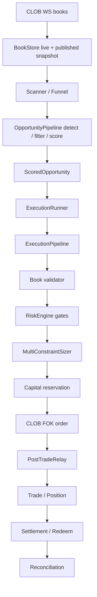

# Endgame Control Factor Closed-Loop Audit

> 本文是 `oxide-arb` endgame 交易闭环的业务事实与风险缺口审计。
>
> Canonical Phase 5 设计见 `docs/plans/phase5-replay-analytics.md`。该计划已重定义为 **Control Factor Materialization & Governance Plane**。本文不重复 schema、API、factor lifecycle 的完整规范，只说明为什么需要这个控制面、当前 live 系统在哪里缺少反馈闭环，以及每类 evidence 应覆盖哪些风险。

---

## 0. 最重要结论

当前 `oxide-arb` 已经具备较完整的 live 交易链路：

```text
Gamma / WS books
  → BookStore
  → Scanner / Funnel
  → OpportunityPipeline
  → ScoredOpportunity
  → ExecutionPipeline
  → Validator
  → RiskEngine + Sizer
  → Capital reservation
  → CLOB FOK order
  → PostTradeRelay
  → Position / Settlement / Reconciliation
```

它的主要问题不是“没有更多报表”，而是 **历史事实没有被治理化地反哺 live 决策**。

具体来说：

- detector 认为机会存在，不代表真实盘口能 FOK 成交。
- 真实能成交，不代表组合风险、资金状态、settlement backlog、reconciliation 状态允许继续下注。
- 结算后证明某类 bucket 过于乐观，如果不沉淀为控制因子，live 仍会按旧配置继续下注。
- 风险参数如果只靠人工调 `runtime_config`，缺 evidence、TTL、shadow、rollback 和审计。
- live hot path 不能临时查询 ClickHouse / Postgres，因此需要预先物化为内存 `ControlFactorSnapshot`。

Phase 5 因此应建设的是 **Control Factor Materialization & Governance Plane**，不是传统 replay/report 工具。

---

## 1. 术语与业务事实

### 1.1 MarketId 与 TokenId

- `MarketId` 是 Polymarket `condition_id`，通常是 `0x...`。
- `TokenId` 是 CLOB outcome token id，是十进制字符串。
- 一个 binary market 至少有 YES / NO 两个 token。
- ClickHouse L2 book facts 应按 `TokenId` 写入；market-level evidence 必须通过 Postgres market metadata 做 token pair 解析。

混用 `MarketId` 和 `TokenId` 会导致 book reconstruction、execution simulation、settlement attribution 全部错误。

### 1.2 Endgame 策略本质

当前 endgame 是 near-resolution directional settlement bet：

- 在价格接近 1 或 0 的收敛区域发现 mispricing。
- 评估 resolution probability、edge、expected PnL、fill probability。
- 通过 risk gates 和 sizing 后买入。
- 默认持有到 settlement / redeem。

它不是高频做市，也不是主动止损系统。黑天鹅保护主要来自：

- 少下注；
- 降低并发；
- 限制 potential loss；
- risk breaker；
- reconciliation / settlement fail closed；
- 控制因子收紧 future decisions。

如果要加入主动 sell / stop-loss，需要单独产品决策和 execution evidence，不能隐含在 Phase 5 中。

### 1.3 CLOB 与费用事实

Execution evidence 必须覆盖：

- FOK 是否能被 historical L2 book 支撑。
- depth 是否足够。
- book age / staleness 是否可接受。
- latency shift 后是否仍可成交。
- fee schedule 是否按当时 market 配置计算。
- slippage 和 adverse selection 是否被估计。

只复跑 detector 得不到 execution quality。

### 1.4 CTF Settlement / Redeem 事实

Settlement evidence 必须覆盖：

- winning token。
- position shares。
- payout。
- realized PnL。
- redeem status。
- settlement delay。
- accounting status。
- reconciliation impact。

只看 fill 不是完整闭环。endgame 的最终质量要等 settlement truth 才能判断。

---

## 2. 当前 Live 闭环



### 2.1 Detection

Detection 当前依赖：

- market metadata；
- current published book；
- convergence / price zone；
- duration bucket；
- calibration state；
- score components；
- cooldown / funnel / priority。

缺口：

- `opportunity_detection` 写入字段不足，缺 score components、fill probability、urgency、category weight、staleness discount、calibration sample/tier 等。
- 如果 settlement 后发现 bucket 过于乐观，缺少治理化回写到 live detector/scorer 的路径。

### 2.2 Execution

ExecutionPipeline 当前大致顺序：

1. 检查 emergency / risk allows trading。
2. 同 market in-flight 保护。
3. 重新读当前 top-of-book。
4. 校验 book version、book age、staleness、slippage。
5. 跑 pre-trade risk gates。
6. sizing。
7. capital reservation。
8. build execution plan。
9. submit CLOB FOK。
10. observe terminal outcome。
11. post-trade relay。

缺口：

- L2 book facts 尚未形成完整 historical evidence。
- 无稳定 `ExecutionQualityFactor` 反哺 scorer / validation。
- audit 有 terminal rows，但需要和 detection snapshot / L2 evidence 稳定 join。

### 2.3 Risk and Sizing

RiskEngine 已有多层保护：

- manual halt；
- circuit breaker；
- blacklist；
- exposure；
- daily / hourly / weekly loss；
- fees；
- metrics freshness；
- potential loss；
- drawdown；
- cash/equity；
- consecutive misses；
- API / WS health；
- reconciliation signals。

Sizer 已处理 Kelly / constraints / drawdown 等。

缺口：

- 历史 risk denial、capital pressure、drawdown、settlement backlog 没有物化为 `PortfolioRiskFactor`。
- Risk gates 的历史有效性无法形成可发布、可回滚的控制 artifact。

### 2.4 Post-trade, Settlement, Reconciliation

系统已有 trade / position / settlement / reconciliation 的基础状态，但 Phase 5 必须补齐：

- calibration outcome lifecycle：fill 后 unresolved，settlement 后 resolved。
- settlement audit row 保留 scored snapshot，避免 bucket attribution 丢失。
- balance snapshots。
- redeem pending / failed evidence。

---

## 3. 当前数据完整性缺口

| 数据域 | 当前状态 | 是否足够生产控制因子 | 必须补齐 |
|---|---|---:|---|
| `opportunity_detection` | live 写入，有基础 bucket/edge/prob/profit | 部分 | score components、depth/staleness、calibration sample/tier |
| `opportunity_audit` | live 写入 rejection/terminal/settlement | 部分 | terminal/settlement row 稳定保留 scored snapshot |
| `tick_events` | schema/repo 有，producer 缺 | 否 | BBO writer |
| `tick_events_l2` | schema/row 有，producer/query 不完整 | 否 | L2 writer、query API、snapshot/delta 语义 |
| `book_snapshots` | schema/repo 有，producer 缺 | 否 | 周期/事件 snapshot writer |
| `calibration_snapshots` | schema/repo 有，producer 缺 | 否 | CalibrationUpdater 后写 CH |
| PG `trade` / `position` | 有 | 是 | 与 CH audit 建立稳定 replay join |
| `endgame_calibration_outcome` | schema/trait 有，live writer 缺 | 否 | fill/settlement 写 outcome lifecycle |
| `reconciliation_report` | 有 | 部分 | 与 balance snapshots 结合 |
| `balance_snapshot` | 缺 | 否 | CLOB collateral、cash、equity、mark value |
| `runtime_config` | 表/repo 有，live consumer 弱 | 否 | 只保留 coarse toggles；复杂控制迁到 typed control factor |

---

## 4. 为什么不是 ReplayMode

旧的 `DetectorOnly` / `Execution` / `PortfolioRisk` / `FactorGeneration` 容易把内部 evidence depth 误建模成用户产品模式。

正确模型：

```text
ControlFactorMaterializationRun
  → fixed evidence stages
  → typed factor builders
  → quality gates
  → governance lifecycle
  → live snapshot consumption
```

Detector、execution、portfolio/risk 是 stage，不是 mode：

- detector stage 回答“当时机会是否可复现”。
- execution stage 回答“当时盘口是否能成交”。
- portfolio/risk stage 回答“当时组合状态是否允许长期持续下注”。
- settlement/reconciliation stage 回答“最终结果和账实是否支持该结论”。

任何单独 stage 都可以产生 report，但不能绕过完整 evidence / gate / governance 直接发布生产因子。

---

## 5. Control Factors 覆盖的风险

### 5.1 `BucketRiskFactor`

风险问题：

> 某类 endgame bucket 的历史 resolution / PnL 是否证明当前 detector/scorer 过于乐观？

必须覆盖：

- category；
- price zone；
- duration bucket；
- hours to settlement；
- neg risk；
- calibration sample / fallback tier；
- settlement truth；
- expected vs realized PnL。

Live 影响：

- haircut resolution probability；
- 提高 min edge；
- 降低 size；
- block new entries。

### 5.2 `ExecutionQualityFactor`

风险问题：

> 当前 scorer 估计的 fill probability 是否在某类盘口条件下系统性偏高？

必须覆盖：

- L2 depth；
- spread；
- book age；
- staleness；
- latency shift；
- FOK fill/miss；
- slippage；
- fee；
- adverse selection。

Live 影响：

- 折扣 fill probability；
- 收紧 max depth usage；
- 增加 slippage bps addon；
- 降低 opportunity score。

### 5.3 `PortfolioRiskFactor`

风险问题：

> 在某类组合状态下继续下注是否会放大 drawdown、potential loss 或 settlement backlog？

必须覆盖：

- open positions；
- active reservations；
- total exposure；
- total potential loss；
- cash / equity；
- drawdown；
- daily/hourly/weekly loss；
- risk denial distribution；
- settlement backlog。

Live 影响：

- 降低 global size；
- 降低 category size；
- 降低 daily budget；
- 降低 Kelly fraction；
- 限制 max open positions。

### 5.4 `ReconciliationHealthFactor`

风险问题：

> 资金状态、账实一致性、链上 token、redeem 是否健康到允许继续交易？

必须覆盖：

- internal vs external cash；
- position drift；
- redeem pending / failure；
- metrics freshness；
- reconciliation severity。

Live 影响：

- maintenance mode；
- manual ack；
- fail closed；
- size multiplier。

### 5.5 `MarketAnomalyFactor`

风险问题：

> 某个 market / event / category 是否出现异常，需要短 TTL block 或 cooldown？

必须覆盖：

- oracle mismatch；
- settlement delay；
- price reversal；
- abnormal L2 book；
- metadata inconsistency；
- manual incident evidence。

Live 影响：

- block market；
- block event；
- category cooldown；
- manual acknowledgement。

---

## 6. 写入、更新、消费时机

### 6.1 Facts 写入

事实数据由 live 系统持续写入：

| Fact | 写入时机 | 目标 |
|---|---|---|
| L2 book event | CLOB WS book apply 成功后异步批量写 | CH `tick_events_l2` |
| BBO tick | top-of-book 改变或采样窗口 | CH `tick_events` |
| book snapshot | startup / reconnect / gap / periodic | CH `book_snapshots` |
| detection event | `OpportunityPipeline` 发射 scored opportunity | CH `opportunity_detection` |
| execution audit | validation/risk/sizing reject、fill/miss/fail | CH `opportunity_audit` |
| settlement audit | settlement/redeem/accounting 完成 | CH `opportunity_audit` |
| calibration snapshot | `CalibrationUpdater` 更新后 | CH `calibration_snapshots` |
| calibration outcome | fill 后 unresolved，settlement 后 resolved | PG `endgame_calibration_outcome` |
| balance snapshot | metrics refresh / post-trade / settlement | PG/CH `balance_snapshot` |
| reconciliation report | reconciliation 完成 | PG `reconciliation_report` |

Materialization 不反向修改事实。

### 6.2 Materialization 写入

Scheduler 默认创建 materialization run：

- hourly：execution quality、reconciliation health。
- daily：bucket risk、portfolio risk。
- event-driven：market anomaly、critical reconciliation。
- backfill：修复数据缺口或事故复盘。
- config comparison：配置变更前后对比，默认 report-only。

每个 run 写：

```text
control_factor_materialization_run
control_factor_stage_report
control_factor_value(status = Draft / Rejected / ReportOnly)
```

### 6.3 Candidate 更新

Draft 通过 quality gates 后转 Candidate：

- PIT 完整；
- coverage 足够；
- sample 足够；
- evidence 稳定；
- payload conservative；
- TTL / owner / rollback policy 完整。

失败则 Rejected，并保留 gate failure reason。

### 6.4 Shadow 更新

Candidate 可进入 Shadow publication：

- live 加载 shadow snapshot；
- 真实交易仍使用 active Published snapshot；
- shadow 只记录 would-reject / would-size / would-score；
- 观察窗口满足后才能进入 Published。

Critical `MarketAnomalyFactor` / `ReconciliationHealthFactor` 可走 emergency path，但必须有短 TTL、owner、audit、retrospective review。

### 6.5 Published 更新

发布时：

1. 写 new `control_factor_publication`。
2. 标记旧 publication `Superseded`。
3. 写 `control_factor_audit_event`。
4. 发 notify。
5. live refresher 原子替换 `ControlFactorSnapshot`。

Published factor 不能被原地修改。任何改变都是新 factor 或新 publication。

### 6.6 Live 消费

Live 消费分四层：

- startup load；
- periodic refresh；
- notify refresh；
- hot path read。

Hot path 只读 `ArcSwap<ControlFactorSnapshot>`，不读 CH/PG。

---

## 7. Failure and Safety Semantics

| 场景 | 正确行为 |
|---|---|
| L2 coverage 不足 | 不生成 `ExecutionQualityFactor` Candidate |
| settlement truth 不足 | `BucketRiskFactor` 保持 Draft / Rejected |
| PIT calibration 缺失 | 禁止 bucket factor 进入 Candidate |
| balance/token snapshot stale | reconciliation factor 可 fail closed |
| safety factor 过期 | 按 policy fail closed |
| non-safety factor 过期 | fail neutral |
| publication load 失败 | 继续使用未过期旧 snapshot；安全类过期则 halt/live fail closed |
| rollback requested | 原子切回 known-good publication |
| shadow delta 异常 | 阻止 publish，写 audit |

---

## 8. 与 Phase 5 Canonical 文档的关系

本文只保留业务事实、风险闭环和缺口说明。以下内容以 `docs/plans/phase5-replay-analytics.md` 为唯一规范：

- crate/module 边界；
- materialization run manifest；
- evidence stage output schema；
- factor payload schema；
- quality gate policy；
- Postgres / ClickHouse schema additions；
- API / UI / scheduler contract；
- live `ControlFactorSnapshot` 结构；
- implementation phases；
- acceptance checklist。

如果本文与 Phase 5 canonical 文档冲突，以 Phase 5 canonical 文档为准。

### 8.1 Anti-drift Rules

为了避免后续推进时重新出现双写和语义漂移，本文禁止定义或复制以下内容：

- Postgres / ClickHouse 表字段。
- API request / response。
- materialization run manifest。
- factor payload schema。
- quality gate 阈值。
- publication / rollback 状态机。
- live `ControlFactorSnapshot` 结构。
- 实施 phase exit criteria。

如果审计过程中发现新的业务风险，应在本文记录“风险事实”和“为什么需要控制”，然后在 Phase 5 canonical 文档中更新对应实现规范。本文不作为实现 source of truth。

### 8.2 Review Checklist for Future Edits

编辑本文时必须检查：

- 是否把内部 evidence stage 又写成用户可选 mode。
- 是否重新引入 `ReplayMode`、`DetectorOnly`、`Execution`、`PortfolioRisk`、`FactorGeneration` 等旧产品模式。
- 是否把 `runtime_config` 描述为复杂 factor payload 的承载面。
- 是否暗示 live hot path 可以读取 CH/PG。
- 是否用 current calibration / current fee / current config 解释过去。
- 是否与 Phase 5 canonical 的 API、schema、状态机重复。

---

## 9. Product Decisions and Risk Boundaries

### 9.1 Fee Schedule

Replay / materialization 必须使用 historical fee schedule：

- market fee details；
- fee source；
- fee observed at；
- fee calculator input version。

否则 PnL、edge、execution quality 都会偏。

### 9.2 Low Threshold / Max Convergence Age

当前相关配置语义需要明确：

- `low_threshold` 是否用于 opposite side invalidation / anomaly detection。
- `max_convergence_age_secs` 是否阻止“过早收敛但长期不结算”的 stale signal。
- 这些规则是否作为 detector 逻辑、market anomaly evidence，还是单独 risk gate。

---

## 10. Final Judgment

`oxide-arb` 当前已经有多层 fail-closed 防线，但缺少历史证据到未来控制的治理化闭环。

Phase 5 应建设的不是 replay report，而是：

```text
Live facts
  → point-in-time evidence
  → materialized control factors
  → quality gates
  → shadow / publish / rollback
  → live ControlFactorSnapshot
  → safer detector / scorer / risk / sizing
```

这条链路完成后，系统才不是“交易后看报表”，而是能把历史中证明过的风险，变成可审计、可回滚、可过期、可保守执行的 live control surface。
